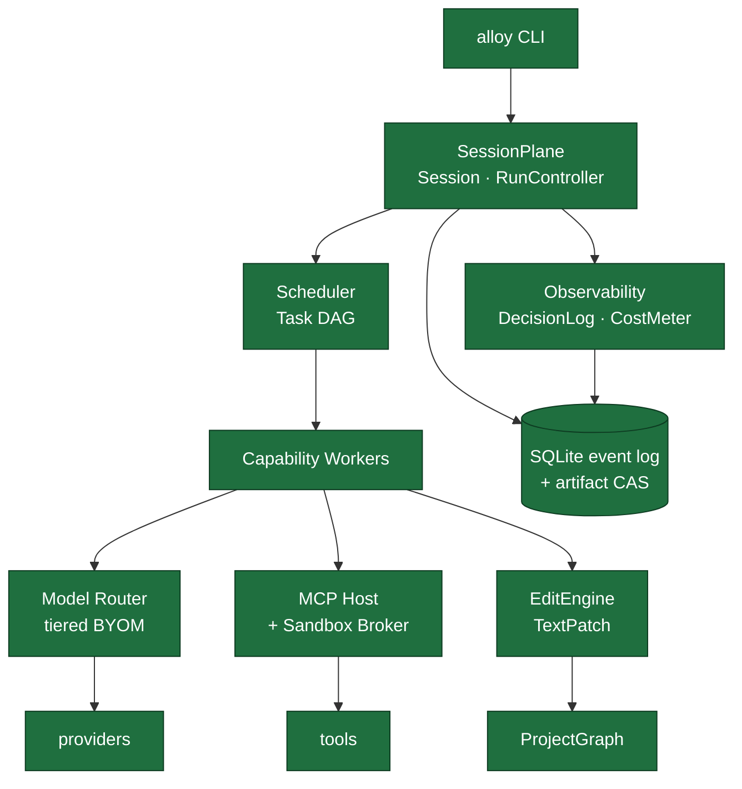

# Alloy

A modular **AI engineering runtime** for software development, written in Rust.
Models are plugins; structured execution, tools, and project state are the product.

**Author:** arkadianet · **MSRV:** Rust 1.97 · **Architecture:** [V2 (frozen)](docs/architecture/alloy-architecture-v2.md)

---

> ### Status: vertical-slice pre-alpha — not a finished product
>
> RFCs 0001–0017 are implemented. The first product loop works: `alloy run`
> can take a small Rust crate with a local diagnostic through sandboxed
> repair → edit → verify → human gate under BYOM (any OpenAI-compatible
> endpoint, including local servers), with a durable decision log.
>
> What this is **not** yet: a general coding agent, an IDE, or something you
> point at a real multi-crate workspace and trust. The LLM planner stays
> opt-in (eval-gated), holdout measurement against live model outputs is
> still incomplete, graph/context depth is research-grade, and UX is CLI-
> only. See [dogfooding](docs/dogfooding.md) and the
> [roadmap](docs/roadmap/IMPLEMENTATION-ROADMAP.md) for where it goes next.

---

## Why this exists

Model-centric coding assistants converge on one loop: gather context → call tools
→ edit files → hope the compiler agrees. That loop degrades badly on systems
languages, where ownership, lifetimes, and trait coherence mean a plausible-looking
patch is usually a wrong one — context is textual, edits are span-fragile, and cost
and control are opaque.

Alloy's thesis:

> **Correctness for systems languages requires an explicit engineering runtime —
> DAG + graph + capabilities + tools — not a smarter single-model chat.**

The mental model is **`Runtime → Scheduler → Capability Workers`**. Models sit
behind a router as replaceable reasoning engines, never at the center.

| | Alloy | Typical assistant |
| --- | --- | --- |
| **Control flow** | Explicit Task DAG + RunController | Opaque ReAct loop |
| **Project model** | Persistent typed graph + compiler IR | Ephemeral repo map / embeddings |
| **Editing** | Transactional EditEngine (TextPatch first-class) | Raw diffs |
| **Model binding** | Tiered BYOM router, no hardcoded model IDs | Vendor default |
| **Trust** | Sandboxed tools, approval gates, fail-closed | Shell-as-universal-tool |
| **Cost** | Budgets + metering always on | Opaque or unbounded |

Design principles are binding on every API in the tree — correctness over
autonomy, replaceable components, explicit state, observable decisions. They are
specified in [Architecture V2 §3](docs/architecture/alloy-architecture-v2.md).

## Architecture at a glance



Solid green is in tree. Depth and product polish still vary by subsystem — see the status table.

Every state transition is durable: if it isn't in the session event log or the DAG
store, it didn't happen. Session events are append-only with per-session monotonic
sequence numbers allocated inside an immediate transaction, so runs are replayable
and resumable from checkpoints.

## What works today

The RFC series is the unit of completion — each is implemented only when it meets
the [Definition of Done](docs/rfcs/README.md#definition-of-done-merge-gate)
(architecture PASS, 100% acceptance criteria, tests, docs, stable public APIs,
clippy/fmt clean, no in-scope TODOs, review approved).

| RFC | Subsystem | Status |
| --- | --- | --- |
| [0001](docs/rfcs/RFC-0001-alloy-runtime.md) | Runtime host, core types, lifecycle | ✅ Implemented |
| [0002](docs/rfcs/RFC-0002-storage-artifacts-session-events.md) | SQLite event log, artifact CAS, handoff | ✅ Implemented |
| [0003](docs/rfcs/RFC-0003-session-manager-run-controller.md) | Session manager & RunController | ✅ Implemented |
| [0004](docs/rfcs/RFC-0004-observability-cost-metering.md) | DecisionLog, CostMeter, redaction | ✅ Implemented |
| [0005](docs/rfcs/RFC-0005-sandbox-broker.md) | Sandbox broker (Landlock/Seatbelt/container) | ✅ Implemented |
| [0006](docs/rfcs/RFC-0006-mcp-host-builtins.md) | MCP host & in-process builtins | ✅ Implemented |
| [0007](docs/rfcs/RFC-0007-model-router-provider.md) | Model router & provider (BYOM, OpenAI-compatible) | ✅ Implemented |
| [0008](docs/rfcs/RFC-0008-edit-engine.md) | EditEngine (TextPatch + git checkpoint) | ✅ Implemented |
| [0009](docs/rfcs/RFC-0009-task-dag-templates-planner.md) | Task DAG, templates & planner | ✅ Implemented |
| [0010](docs/rfcs/RFC-0010-scheduler-runtime-adapters.md) | Scheduler & runtime adapters | ✅ Implemented |
| [0011](docs/rfcs/RFC-0011-project-graph.md) | ProjectGraph (`alloy-index`) | ✅ Implemented (cargo metadata **post-Beta**; RA deferred) |
| [0012](docs/rfcs/RFC-0012-context-engine.md) | Context engine | ✅ Implemented (measured weights deferred/unmeasured) |
| [0013](docs/rfcs/RFC-0013-capability-registry-workers.md) | Capability workers | ✅ Implemented |
| [0014](docs/rfcs/RFC-0014-language-backend-rust.md) | LanguageBackend (Rust) | ✅ Implemented (RA / SemanticEditOp deferred) |
| [0015](docs/rfcs/RFC-0015-cli-profiles-config.md) | CLI, profiles & config | ✅ Implemented |
| [0016](docs/rfcs/RFC-0016-eval-harness-holdout-gates.md) | Eval harness & holdout gates | ✅ Day-1 + offline ControlPlane + `stack-driver` **integration smoke** (not thesis citation; needs independent model outputs) |
| [0017](docs/rfcs/RFC-0017-dynamic-planning.md) | Dynamic planning & repair generations | ✅ Implemented (LLM planner **opt-in**; default flip **eval-gated**) |

Full sequencing, effort estimates, and milestone gates:
[implementation roadmap](docs/roadmap/IMPLEMENTATION-ROADMAP.md).

**The vertical slice that exists today** is `alloy run "fix the compile error…"`
on a small crate: sandboxed `cargo_check` → repair/edit workers → TextPatch →
verify → gate → decision log. That is the product thesis under test — not a
general agent loop.

## Build

Requires Rust 1.97 (pinned in [`rust-toolchain.toml`](rust-toolchain.toml); rustup
installs it automatically).

```bash
cargo build --workspace
cargo test --workspace
cargo run -p alloy-cli -- --help
```

## First live run (dogfood)

Point a BYOM router at a local OpenAI-compatible server, then repair a toy crate
— not a precious tree. See [`docs/dogfooding.md`](docs/dogfooding.md).

```bash
cp router.toml.local-example router.toml   # or router.toml.example
export ALLOY_API_KEY=local                 # any non-empty value for loopback

# Seed a broken crate (or copy eval/live-repair/fixtures/*/workspace)
cargo run -p alloy-cli -- --workspace /tmp/broken-crate \
  run "fix the compile error in this crate" --yes
```

`alloy host` remains available as a lifecycle smoke test (start → idle →
drain on `Ctrl-C`/`SIGTERM`). `alloy review` reviews a unified diff read-only.

## Configuration

Alloy reads TOML plus the process environment. It **never creates, reads, or
overwrites a `.env` file** — [`example.env`](example.env) documents the keys, and
copying it is entirely optional and manual.

| Variable | Purpose |
| --- | --- |
| `ALLOY_API_KEY` | Provider key named by `router.toml`'s `api_key_env` |
| `ALLOY_DATA_DIR` | Override the data directory |
| `ALLOY_PROFILE` | Profile TOML path (default `profiles/default.toml`) |
| `ALLOY_ROUTER` | Active router TOML path (default `router.toml`) |
| `RUST_LOG` | Tracing filter, e.g. `alloy_runtime=info,alloy=info` |
| `ALLOY_SQLITE_*`, `ALLOY_STORAGE_*` | SQLite/storage tuning — see `example.env` |

Relative `ALLOY_PROFILE` / `ALLOY_ROUTER` paths resolve against the workspace root.
The data directory resolves by precedence:

1. `ALLOY_DATA_DIR`
2. programmatic `ConfigPaths::data_dir` override
3. `<workspace>/.alloy`
4. XDG — `$XDG_DATA_HOME/alloy`, else `~/.local/share/alloy`

## Workspace

```text
crates/
  alloy-cli/       # `alloy` binary
  alloy-runtime/   # host, session control plane, storage, observability
  alloy-tools/     # sandbox broker + MCP host   (RFC-0005/0006)
  alloy-index/     # ProjectGraph                (RFC-0011)
  alloy-eval/      # eval harness                (RFC-0016)
```

≤5 crates by design (Architecture V2) — no sixth crate for storage.

`alloy-runtime` is `#![forbid(unsafe_code)]` and `#![deny(missing_docs)]`.

## Development

CI enforces the Definition of Done on every push and pull request. Run the same
gates locally before opening one:

```bash
cargo fmt --all -- --check
cargo clippy --workspace --all-targets -- -D warnings
cargo test --workspace
RUSTDOCFLAGS="-D warnings" cargo doc --workspace --no-deps
```

[`ci.yml`](.github/workflows/ci.yml) gates the workspace. A second workflow,
`sandbox.yml`, covers platform-specific sandbox backends (Landlock required,
Seatbelt and container advisory).

Architecture V2 is **frozen**. RFCs implement it; they do not redesign it. Where an
RFC and V2 conflict, V2 wins — see [change control](docs/roadmap/IMPLEMENTATION-ROADMAP.md).

## Docs

| Doc | Role |
| --- | --- |
| [Architecture V2](docs/architecture/alloy-architecture-v2.md) | Implementation contract (frozen) |
| [RFC index](docs/rfcs/README.md) | Subsystem RFCs + Definition of Done |
| [Roadmap](docs/roadmap/IMPLEMENTATION-ROADMAP.md) | Milestone order and effort |
| [Engineering playbook](docs/playbooks/ENGINEERING-PLAYBOOK.md) | Working conventions |
| [Dogfooding](docs/dogfooding.md) | First live-model runs and graduation bar |
| [Live holdout](eval/live-holdout/) | Live-BYOM on RFC-0016 holdout workspaces (not an offline gate) |
| [Reviews](docs/reviews/) | Architecture and compliance reviews |

## License

Dual-licensed under either the [MIT license](LICENSE.md#mit-license) or the
[Apache License, Version 2.0](LICENSE.md#apache-license-version-20), at your
option — matching `Cargo.toml`'s `MIT OR Apache-2.0` declaration. See
[`LICENSE.md`](LICENSE.md) for the full texts.
