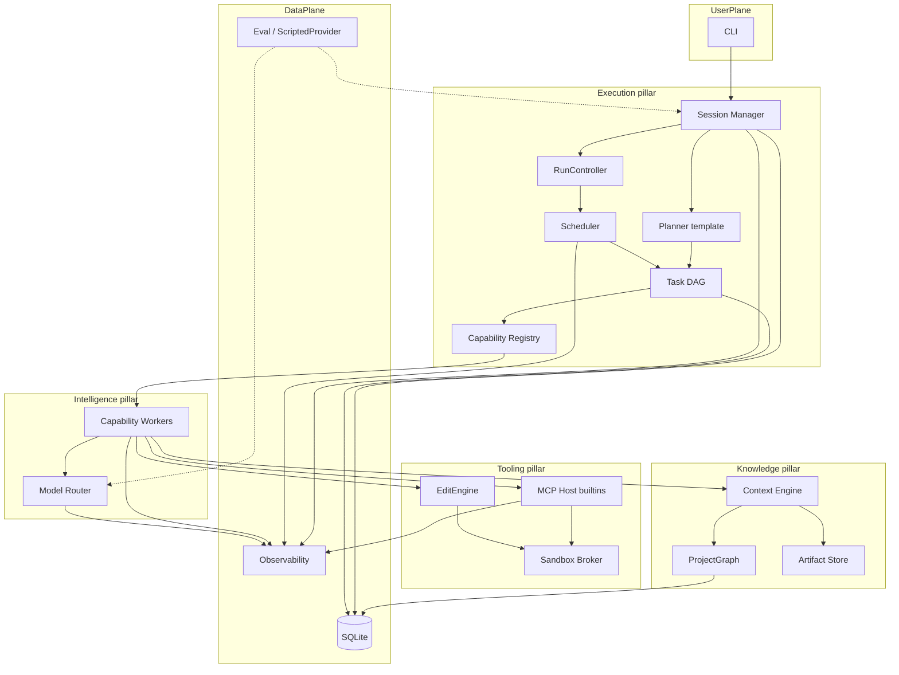
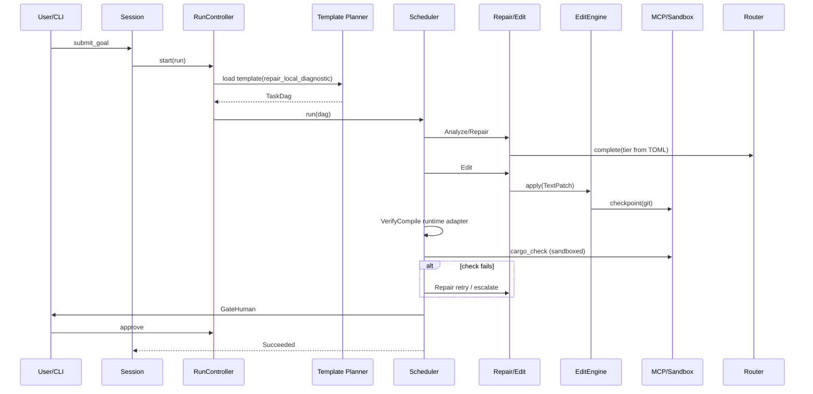
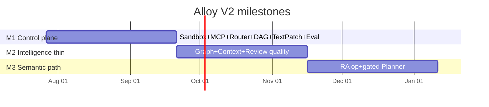
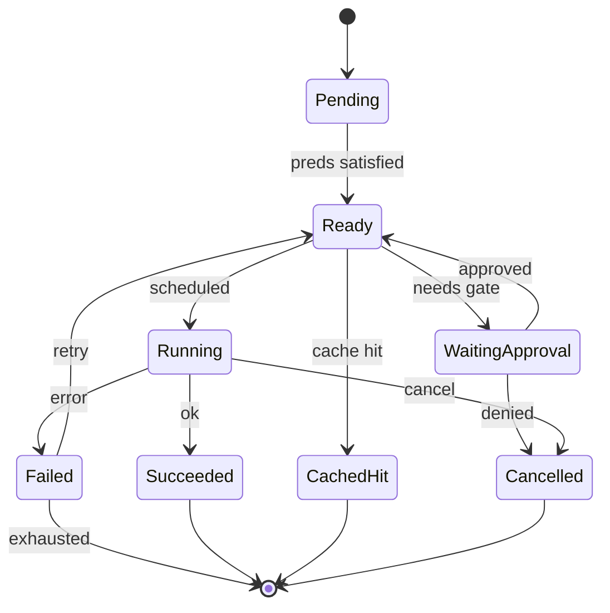

# Alloy — AI Engineering Runtime Architecture Specification (Version 2)

| Field | Value |
| --- | --- |
| **Document** | Canonical architecture specification for implementation |
| **Product** | Alloy |
| **Category** | AI Engineering Runtime (Engineering Runtime) |
| **Author** | arkadianet |
| **Status** | Canonical for implementation |
| **Date** | 2026-07-25 |
| **Supersedes** | `docs/architecture/ai-coding-harness-architecture-rfc.md` (v1 draft) |
| **Decision basis** | `docs/architecture/rfc-architect-response.md` |
| **Audience** | Engineering teams implementing Alloy without author consultation |
| **Classification labels** | **Production proven** · **Emerging best practice** · **Original proposal** |

**Product framing:** Alloy is a modular AI engineering runtime for software development. It orchestrates language models, tools, structured context, and project intelligence into a unified execution environment optimized for correctness, observability, and extensibility.

Models (Claude, GPT, Gemini, local, etc.) are **plugins / replaceable reasoning engines**. They are never the product center. BYOM remains mandatory.

---

## 0. Decision Application & Scope Map

This document is the **implementation contract**. It applies every Accept and Partial from the architect ADR; rejected kill-list remedies that would delete load-bearing traits are **not** applied (interfaces stay). No new architectural concepts beyond naming/framing in this revision.

### 0.1 Mission

> Alloy is an open, model-agnostic engineering runtime that treats AI as one component of a larger software system rather than the center of it. Its purpose is to combine structured execution, deterministic tooling, semantic project understanding, and language models into a platform that produces software with greater correctness, transparency, and maintainability than model-centric coding assistants.

### 0.2 Four pillars (organizing frame)

```text
            Alloy
        Intelligence
              │
    Execution ┼── Knowledge
              │
           Tooling
```

| Pillar | Definition | Maps to (existing components) |
| --- | --- | --- |
| **Intelligence** | LLMs, planning, reasoning, review, repair | Model Router, Capability workers (Repair/Edit/Review/Planning), optional LLM Planner |
| **Execution** | Runtime owns execution; scheduler, DAG, workflows, retries, approvals | Session Manager, RunController, Task DAG, Scheduler, Capability Registry, gates |
| **Knowledge** | Structured project understanding and prompt assembly | ProjectGraph, Context Engine, diagnostics/fix ingest, Artifact Store; External Memory long-term (deferred) |
| **Tooling** | Deterministic tools behind a permissioned bus | MCP host, cargo/fs/git/patch[/ra] builtins, Sandbox Broker, EditEngine apply path |

**Primary mental model:** `Runtime → Scheduler → Capability Workers`. Models are merely implementations of capabilities. Planner remains a capability/template source under Execution/Intelligence—not a peer “agent loop.”

### 0.3 Differentiation (aligned with design principles; not new subsystems)

1. **Compiler-aware development** — compiler output is structured data (especially Rust), not chat paste.
2. **Execution-first architecture** — runtime/scheduler/tooling are the core; models are replaceable.
3. **Model agnosticism by design** — no vendor coupling; tier map + `ModelProvider` trait.

### 0.4 ADR decision application summary

| Class | Count | Application |
| --- | --- | --- |
| **Accept** (F-03,04,06,07,08,10,11,16,17,18,19,21,22,23,24,25,27,28) | 18 | Applied fully in this V2 |
| **Partial** (F-01,02,05,09,12,13,14,15,20,26) | 10 | Applied as ADR “Accept” column; kill-list deletions inside Partials **Rejected**—interfaces kept thin |
| **Reject** of finding core critique | 0 | — |
| **Rejected remedies** (inside Partials / kill list) | 8 | Keep Task DAG, ProjectGraph, Capability registry, MCP host, EditEngine, ModelRouter, LanguageBackend; do not treat §21.4 as entire architecture forever |

### 0.5 Revised MVP component list

| Component | MVP role | Pillar |
| --- | --- | --- |
| CLI | Goals, approvals, config (`example.env`, router/profile TOML) | Execution |
| Session Manager | Lifecycle, SQLite event log, budgets, resume | Execution |
| RunController | `start` / `cancel` / `approve` / `request_replan` | Execution |
| Task DAG + Scheduler | Hardcoded repair DAG; linear exec; retries; gates | Execution |
| Planner (template) | Load/select DAG template; LLM planner **off** until eval bar | Execution / Intelligence |
| Capability Registry | Resolve ≤4 LLM capabilities | Execution |
| Workers | Repair, Edit, optional Review | Intelligence |
| Model Router | One openai-compatible provider; capability→tier TOML | Intelligence |
| Context Engine | Conversation + WorkingSet + Artifacts → PromptPack | Knowledge |
| ProjectGraph | Metadata + symbols + diagnostics/fixes | Knowledge |
| EditEngine | TextPatch apply + git checkpoint | Tooling / Knowledge |
| MCP Host | In-process builtins, lazy disclosure + permissions | Tooling |
| Sandbox Broker | Landlock/Seatbelt or container on all exec; quarantine | Tooling |
| Observability | Decision metadata + hashes; costs metered | Execution |
| Eval | Fixtures, ScriptedProvider, holdout gates from week 1 | Cross-cutting |

### 0.6 Long-term component list

Same control plane, filled in: LLM Planner (single topology writer); parallel Analyze when eval warrants; confidence-scored graph edges; additional context domains; multi-impl capability scoring; RA-backed semantic ops; selective out-of-process MCP; multi-provider router scoring; second `LanguageBackend` after Rust dogfood; optional TUI; alloyd/ACP only if measured need; curated External Memory (precision-gated).

### 0.7 Removed from MVP (retained long-term)

LLM Planner as default · typed call/lifetime graph layers · SemanticEditOp lowering (except optional RenameType) · multi-impl scoring · extra context domains + embeddings · custom MCP fleet · Benchmarking/UnsafeAudit/CargoManagement/Documentation/ArchitectureReview workers · file leases / Hint edges / priority function · OverlayFS / alloy snapshot bundles · alloyd · ACP · External Memory auto-retrieve · Postgres · OTel as separate crate · language plugins beyond Rust · numeric cost differentiators in marketing tables.

### 0.8 Eliminated entirely (from normative design as stated)

- Worker `follow_up_nodes` as DAG mutation channel  
- Dual graph access (`Arc` mutate + MCP `graph_query` for Alloy workers)  
- VerifyCompile / Testing as LLM Capabilities  
- Normative appendices BL–DB (non-normative handbook only, if kept elsewhere)  
- Unmeasured token-savings percentages as architecture proof  
- Week-1 scaffold of ~18 empty crates  
- Dogfood-before-sandbox schedule  
- Classification stamps without prior-art deltas  
- Principle “semantic-only writes” absolute (reframed in §3.5)

### 0.9 MVP thesis bar

Holdout **local-diagnostic** (E0502-class, import/type errors fixable by text patch) repair compile success with inspectable DAG + decision log + BYOM, under sandbox—**without** claiming token-savings percentages. Lifetime repair is a stretch goal after RA-assisted ops exist.

### 0.10 Subsystem pattern (normative for §§5–16)

Every load-bearing subsystem below uses:

1. **Architectural interface** (day-one commitment)  
2. **MVP implementation**  
3. **Deferred implementation**  
4. **Evolution path**  

Plus: **Public interface** · **Internal implementation** · **Stub** (if deferred) · **Upgrade path**.

---

## 1. Executive Summary

### 1.1 What is being built

Alloy is a modular **AI engineering runtime** for software development. The runtime:

1. Maintains a **Project Intelligence Graph** (MVP: workspace/crate/module/item + diagnostics/fixes).
2. Executes work on an explicit **Task DAG** with dependencies, approval gates, retries, and caches.
3. Routes LLM steps to **capability workers** via a provider-agnostic **Model Router**.
4. Executes tools exclusively through an **MCP Platform** (host + permission tiers + sandbox).
5. Applies edits via an **EditEngine** (`TextPatch` first-class; semantic ops envelope retained).
6. Records attributable decisions for **Observability** (metadata + hashes by default).

Primary loop mental model: **Runtime → Scheduler → Capability Workers**. Models are replaceable reasoning engines behind the router—not the center of the product.

MVP language backend is Rust via an internal `LanguageBackend` trait. Control-plane traits stay language-agnostic so a second language can arrive later without rewriting Scheduler or MCP host.

### 1.2 Why it matters

Model-centric coding assistants converge on: gather context → call tools → edit files → hope the compiler agrees. That loop systematically fails on Rust ownership, lifetime, and trait-coherence constraints because context is textual, edits are span-fragile, tool schemas tax tokens, and cost/control are opaque.

Alloy’s thesis: **correctness for systems languages requires an explicit engineering runtime (DAG + graph + capabilities + tools), not a smarter single-model chat.**

### 1.3 Key differentiators

| Differentiator | Alloy | Typical model-centric assistant |
| --- | --- | --- |
| Control flow | Explicit Task DAG + RunController | Opaque ReAct loop |
| Project model | Persistent graph (thin→deep) + compiler IR | Ephemeral repo map / embeddings |
| Editing | EditEngine envelope (TextPatch MVP; SemanticOps later) | Raw diffs only |
| Extensibility | Capability registry + MCP + LanguageBackend | Fixed agent + bolt-on tools |
| Model binding | Tiered BYOM router (no hardcoded model IDs) | Vendor-default |
| Trust | Sandboxed tools; approval gates; fail-closed | Shell-as-universal-tool |
| Cost | Budgets + metering APIs (numbers only after Eval) | Opaque subscription or unbounded API |

**Classification:** Workflow DAGs for agents — **Emerging best practice** (OpenHands event-sourcing; workflow engines) applied as compile-gated runtime (**Original proposal** synthesis). Aider-style maps — **Production proven** ancestor; Alloy thin typed index — **Original proposal** (kept thin). Capability registry — **Emerging best practice** (Goose recipes; Roo modes) formalized as traits (**Original proposal** in this form).

### 1.4 Expected outcomes (acceptance targets, not measured claims)

Within the milestone horizon (§19):

- An engineer can run `alloy run "fix E0502 in crate X"` and get a compile-verified patch with full decision log under sandbox.
- Every tool call is MCP-mediated with auditable permissions; no silent bash omniscience in the default profile.
- Eval suite reports success rate, compile success, cost, and retries continuously from week 1 fixtures.
- Cost marketing numbers appear only after holdout calibration.

### 1.5 Niche fit

Alloy does not claim to beat vendor chat polish or IDE UX. It claims superiority for **self-hosted, correctness-critical, multi-crate Rust work** needing BYOM, inspectable plans, compiler-aware loops, and cost control via tiers—not for teams that want a chat product.

### 1.6 Normative boundary

**Normative:** §§0–21 + Appendices A–E. Survey detail beyond the gap table is non-normative (separate doc). Appendices beyond E are not part of this contract.

---

## 2. State of the Art (condensed)

Research date: 2026-07-25. Full per-tool survey lives outside this normative spec (ADR F-28).

### 2.1 Gap table (what Alloy fills)

| Gap | Typical assistants | Alloy response |
| --- | --- | --- |
| Opaque agent loops | Transcript archaeology | Task DAG + event log + RunController |
| Untyped project context | Repo map / embeddings | ProjectGraph trait (thin MVP → deeper later) |
| Text-only edits forever | Diff thrash on multi-file Rust | EditEngine envelope; TextPatch MVP |
| Eager MCP schema tax | All tools every turn | Lazy disclosure by capability selectors |
| Vendor lock-in | Hardcoded model | BYOM ModelRouter + TOML tiers |
| Security after features | Dogfood then sandbox | Sandbox before dogfood |
| Eval late | Marketing before measurement | Fixtures + ScriptedProvider week 1 |

### 2.2 Proven techniques worth adopting

| Technique | Source class | Alloy use |
| --- | --- | --- |
| Git-native checkpoints | Aider — **Production proven** | MVP sole checkpoint backend |
| Repo map / symbol budgets | Aider — **Production proven** | Thin graph projections into Context |
| Event-sourced agent state | OpenHands — **Production proven** intent | Session event log |
| Lazy / capped tool disclosure | Industry reaction to MCP tax — **Emerging best practice** | MCP host selectors |
| Landlock/Seatbelt/containers | Gemini CLI / OpenHands — **Production proven** | Sandbox broker |
| Planner/worker cost split | Cursor economics (reported) — **Emerging best practice** | Tier map; measure later |

### 2.3 Ideas to avoid

Seven out-of-process custom MCP servers on day 1 · 18-crate week-1 scaffold · dogfood before sandbox · numeric cost as architecture proof · dual topology writers · dual graph mutation channels · treating day-1 vertical slice as the entire product architecture forever.

---

## 3. Design Principles

Each principle is binding on APIs below.

### 3.1 Correctness over autonomy

Partial correct patch beats complete incorrect one. Default profile requires `cargo check` (or language equivalent) gate. Autonomous mode opt-in, still gated. Low confidence → escalate tier or human.

**Classification:** Emerging best practice (approval-first); compile gates mandatory in default — **Original proposal** as default.

### 3.2 Replaceable components

Planner, scheduler, model providers, MCP servers, language backends, and stores are traits with swappable implementations. No `match provider { Anthropic => ... }` in core.

### 3.3 Explicit state

If it isn’t in the session event log or DAG store, it didn’t happen. Resumability from checkpoints for long runs.

**Classification:** Event sourcing intent — **Production proven** (OpenHands-like).

### 3.4 Observable decisions

Every routing choice, context inclusion, tool grant, and retry is attributable. Default retention = metadata + hashes (not full prompts).

### 3.5 Prefer semantic understanding; text patches are first-class

**Reframed (ADR F-01):** Prefer graph queries, compiler queries, and semantic ops **when lowering exists**. **Text patches are first-class MVP serialization**, not an escape hatch. The write path is a transactional `EditEngine` with envelope `TextPatch | SemanticOps`. Freeform/raw FS outside EditEngine requires higher approval.

**Classification:** RA assists — **Production proven**. Runtime-level op envelope — **Original proposal** (kept thin). IR-as-sole-write-path was **Original proposal overclaimed** and is not V2 policy.

### 3.6 Cost-aware execution

Tokens are budgeted. Metering APIs always on. Numeric savings claims are **not** architecture proof until Eval calibrates.

### 3.7 Language extensibility

Rust first. Language-specific logic behind `LanguageBackend`. No PY/TS crates or cdylib in MVP.

### 3.8 Minimal trusted computing base

Credential store, sandbox broker, permission authorizer, signed/pinned config. Model providers untrusted for FS/exec. Fail closed.

### 3.9 Supporting principles

Fail closed · deterministic replay where feasible (ScriptedProvider + recorded cargo fixtures) · cache by semantic key · human authority at gates.

### 3.10 Enforcement staging

MVP enforces 3.1, 3.3, 3.5 (text-first envelope), 3.6 (budgets), 3.8 strictly. Graph depth and semantic lowering deepen under eval gates.

---

## 4. Problem Analysis — Why Rust Needs a Different Runtime

### 4.1 Language properties that break chat-loop assistants

Ownership, borrow checker, lifetimes, trait coherence, async bounds, workspaces, features, macros, unsafe — same table intent as v1. **V2 P0 success criteria (ADR F-26):** **locally editable diagnostics** (E0502-class, import/type errors fixable by text patch). Lifetime repair is stretch after RA-assisted ops—not a Milestone-1 claim.

### 4.2 Tooling signals

`cargo check --message-format=json`, clippy, rust-analyzer, cargo metadata are first-class inputs. miri/bench deferred past thin MVP workers.

### 4.3 Failure modes

Error-chasing loops, clone hammer, lifetime spray, wrong crate boundaries, test blindness, macro-blind edits, lockfile churn.

### 4.4 Prioritized problem statements (V2)

1. **P0 — Local diagnostic repair with proof:** `cargo check` clean; no new unsafe by default.  
2. **P0 — Inspectable compile-gated control flow:** DAG + decision log + BYOM.  
3. **P1 — Trait/API changes across crates:** deepen graph + semantic ops after M1.  
4. **P1 — Unsafe discipline:** separate capability long-term; never silent.  
5. **P1 — Cost of repeated context:** thin graph + caches; measure before marketing.  
6. **P2 — Perf/benchmark loops:** after correctness.

### 4.5 Implications

```text
Rust diagnostic → structured DiagnosticEvent → Repair/Edit capabilities
  → EditEngine(TextPatch | SemanticOps) → sandbox cargo check gate
  → success? git checkpoint : retry / escalate / human
```

Runtime separates strategy selection, editing, and verification so each stage can use different models, tools, and caches.

---

## 5. High-Level Architecture

### 5.1 Four-pillar component diagram (V2 topology)



Single-binary process. No alloyd, no ACP in normative topology.

### 5.2 Component responsibilities

| Component | Responsibility | Owns | Does not own |
| --- | --- | --- | --- |
| CLI | Args, TTY, approvals, config | User I/O | Planning logic |
| Session Manager | Lifecycle, events, budgets, resume | Session, events | Tool execution; DAG topology mutation |
| RunController | start / cancel / approve / request_replan | Run control API | Event storage |
| Planner (template MVP) | Select/load DAG template; later LLM plan under single writer | Plan artifacts | Running tools |
| Scheduler | Ready-queue, retries, budgets, cancel | Scheduling policy | Model SDK details |
| Task DAG | Nodes/edges, state machine, checkpoints refs | DAG persistence | Context assembly |
| Context Engine | Domains, budgets, PromptPack | Prompt packs | Graph mutation |
| ProjectGraph | Index + diagnostic/fix ingest | GraphStore | LLM prompts |
| Model Router | Tier/endpoint selection | Routing decisions | Hardcoded model IDs |
| Capability Registry / Workers | Domain procedures | Capability I/O | Global session state; topology mutation |
| MCP Host | Tool bus, disclosure, permissions | Tool mediation | Business planning |
| EditEngine | Transactional apply + rollback | Edit transactions | Compiling |
| Sandbox Broker | Isolation profiles | Exec policy | Planning |
| Artifact Store | Patches, logs metadata | Blobs + digests | Secrets |
| Observability | Decision metadata, metrics, costs | Telemetry | Product TUI (deferred) |
| Eval | Fixtures, gates, ScriptedProvider | Holdout suites | Production routing policy |

### 5.3 Process topology (MVP)

```text
alloy (single binary)
  ├── CLI / TTY
  ├── embedded runtime (session, RunController, DAG, scheduler, router, caps, context, edit)
  ├── in-process MCP builtins + sandbox
  └── ProjectGraph (alloy-index) + Eval (alloy-eval)
```

**Classification:** Single-binary first — practical MVP (**Emerging best practice** reaction to early daemon complexity). Daemon (`alloyd`) is research backlog until single-binary p95 fails on real repos (ADR F-27).

### 5.4 Crate layout (≤5 crates for ~3 months)

```text
alloy/
  crates/
    alloy-cli/       # binary / TTY
    alloy-runtime/   # session, RunController, DAG, scheduler, router, capabilities, context, edit apply, LanguageBackend (Rust module)
    alloy-tools/     # MCP host + in-process cargo/fs/git/patch[/ra] + sandbox
    alloy-index/     # ProjectGraph MVP
    alloy-eval/      # fixtures, ScriptedProvider, gates
```

Internal modules mirror future crates. No `alloy-daemon`, `alloy-lang-*` packages, empty peer libs, or ACP crate in week 1.

**Architectural interface:** Component/module boundaries remain the mental model.  
**MVP:** Five crates as above.  
**Deferred:** Further crate splits when compile-time/ownership pressure forces them.  
**Evolution:** Split without changing public traits.

### 5.5 Primary control APIs

**Session owns lifecycle, events, budgets only. Run control is `RunController` (ADR F-22).**

```rust
#[async_trait]
pub trait SessionService: Send + Sync {
    async fn create(&self, req: CreateSession) -> Result<SessionId, SessionError>;
    async fn resume(&self, id: SessionId) -> Result<Session, SessionError>;
    async fn submit_goal(&self, id: SessionId, goal: Goal) -> Result<RunId, SessionError>;
    async fn events(&self, id: SessionId, after: EventSeq) -> Result<Vec<SessionEvent>, SessionError>;
    // approve/cancel live on RunController — Session may facade for CLI convenience
}

#[async_trait]
pub trait RunController: Send + Sync {
    async fn start(&self, run: RunId) -> Result<(), RunError>;
    async fn cancel(&self, run: RunId) -> Result<(), RunError>;
    async fn approve(&self, run: RunId, gate: GateId, decision: Approval) -> Result<(), RunError>;
    async fn request_replan(&self, run: RunId, reason: ReplanReason) -> Result<(), RunError>;
}

pub struct CreateSession {
    pub workspace_root: PathBuf,
    pub profile: ProfileId, // default | autonomous | readonly
    pub budget: BudgetPolicy,
    pub language_backends: Vec<LanguageId>, // MVP: ["rust"]
}

pub struct Goal {
    pub text: String,
    pub constraints: Vec<Constraint>,
    pub attachments: Vec<ArtifactId>,
}
```

**Owner:** arkadianet (architect) until CODEOWNERS names component humans. CODEOWNERS required before Phase/Milestone-1 substantive merges (ADR F-18).

### 5.6 Failure handling at system boundary

| Failure | Handling |
| --- | --- |
| Provider outage | Health stub → pause / error; multi-endpoint later |
| Builtin tool failure | Structured ToolError; retry policy on node |
| Graph corruption | Rebuild from source; quarantine snapshot |
| Budget exhaustion | Stop non-essential; summarize; ask user |
| Sandbox denial | Escalate approval or fail task |

### 5.7 Day-1 vertical slice vs product architecture

§21.4-style slice (`tool → model → patch → check → log` on a hardcoded DAG) is the **correct day-1 build order**. It is **not** the entire product architecture. Traits below are day-one commitments with thin/stub impls.

---

## 6. Runtime Architecture — Task DAG & Scheduler

### 6.1 Why a DAG beats a simple agent loop

Parallelism (later), caching, retries, approvals, audit, cost slicing, cancellation — vs transcript archaeology.

**Classification:** Workflow DAGs **Production proven** (Airflow, Temporal, BuildKit). Compile-gated agent runtime synthesis — **Original proposal**.

**Honest MVP (ADR F-16):** `max_parallel_cargo=1`, `max_parallel_edits=1` → **linear execution**. DAG value in MVP is provenance, gates, retries, caching—not fake parallelism marketing. Hint edges, priority function, file leases deferred until eval shows parallel Analyze uplift.

### 6.2 Task DAG

#### Architectural interface
Explicit `TaskDag` with node state machine, Data/Sequence edges, generation counters, checkpoints, gate nodes. **Single topology mutator:** Planner/ReplanService only. Scheduler may cancel/skip existing nodes and **request** replan. Workers never mutate topology.

#### MVP implementation
Hardcoded repair templates (3–5 nodes: analyze → edit → verify → gate). Persist DAG in SQLite. No LLM planner required to mutate shape.

#### Deferred
LLM planner as default; Hint edges; fancy priority; dynamic worker-proposed nodes.

#### Evolution
Swap template source for Planner behind same DAG schema; add parallel Analyze when eval shows uplift; never reintroduce multi-writer topology.

#### Public interface

```rust
#[derive(Debug, Clone, Serialize, Deserialize)]
pub struct TaskDag {
    pub id: DagId,
    pub session_id: SessionId,
    pub generation: u64, // replan provenance
    pub nodes: BTreeMap<NodeId, TaskNode>,
    pub edges: Vec<DependencyEdge>,
    pub state: DagState,
}

#[derive(Debug, Clone, Serialize, Deserialize)]
pub struct TaskNode {
    pub id: NodeId,
    pub kind: NodeKind,
    /// Present for LLM capability nodes; None for pure runtime kinds.
    pub capability: Option<CapabilityId>,
    pub input_ref: ArtifactId,
    pub output_ref: Option<ArtifactId>,
    pub state: NodeState,
    pub retry: RetryPolicy,
    pub cache_key: Option<CacheKey>,
    pub budget: TokenBudget,
    pub model_tier: ModelTierHint,
    pub approval: Option<ApprovalSpec>,
    pub timeout: Duration,
}

#[derive(Debug, Clone, Serialize, Deserialize)]
pub enum NodeKind {
    Plan,
    Analyze,
    Edit,
    VerifyCompile, // runtime adapter — NOT an LLM capability (ADR F-10)
    VerifyTest,    // runtime adapter
    Review,
    GateHuman,     // runtime adapter
    Aggregate,
}

#[derive(Debug, Clone, Copy, Serialize, Deserialize)]
pub enum NodeState {
    Pending, Ready, Running, Succeeded, Failed, Skipped,
    Cancelled, WaitingApproval, CachedHit,
}

#[derive(Debug, Clone, Serialize, Deserialize)]
pub enum EdgeKind {
    Data,
    Sequence,
    /// Deferred in MVP; schema may include but scheduler ignores.
    Hint,
}
```

#### Internal implementation
Template loader selects `repair_local_diagnostic` DAG; scheduler walks linearly.

#### Stub
Hint edges accepted in serde but ignored; LLM planner module returns `Err(PlannerDisabled)` until gated on.

#### Upgrade path
Enable Planner capability to emit DAGs validated acyclic; same store schema; generation++ on replan with provenance.

### 6.3 Scheduler

#### Architectural interface
Ready-queue executor over DAG; retries; budgets; cancel; integrates `RunController`; emits replan **requests** only.

#### MVP implementation
In-process; `max_parallel=1` for cargo+edits; SQLite-backed node state.

#### Deferred
File leases; priority function; distributed workers; Temporal-like durability.

#### Evolution
Raise parallelism knobs when measured; keep algorithm interface stable.

#### Public interface (sketch)

```rust
#[async_trait]
pub trait Scheduler: Send + Sync {
    async fn run(&self, dag_id: DagId) -> Result<DagOutcome, SchedError>;
    async fn cancel(&self, dag_id: DagId) -> Result<(), SchedError>;
}

pub struct RetryPolicy {
    pub max_attempts: u32,
    pub backoff: Backoff,
    pub retry_on: Vec<ErrorClass>,
    pub escalate_after: Option<u32>,
    pub escalate_to_tier: Option<ModelTier>,
}
```

**Checkpoints (ADR F-24):** MVP backend = **git only**. Snapshot bundles / OverlayFS deferred.

### 6.4 Replanning (single writer)

Workers return structured `FailureIr` / artifacts only—**no `follow_up_nodes`** (ADR F-03). Scheduler emits `ReplanRequired`. Only Planner/ReplanService mutates topology (plus Scheduler cancel/skip). Replans versioned via `dag.generation`.

### 6.5 Sequence: local diagnostic repair (MVP)



### 6.6 Deadlock and cycle prevention

Plans validated DAG-acyclic at insert. Dynamic edges only from ReplanService with validation. Global timeout per run.

---

## 7. Project Intelligence Graph

### 7.1 Purpose

Persistent, queryable project model that survives sessions and feeds bounded Context projections.

**Classification:** Aider repo map — **Production proven** ancestor. Alloy typed multi-layer jump was **Original proposal overstated**; V2 retains **thin** `ProjectGraph` trait + SQLite store (ADR F-02).

### 7.2 Layers

#### Architectural interface
`ProjectGraph` trait: rebuild / incremental invalidate / query / record_diagnostic / record_fix / snapshot. **Single writer service.** Workers get read-only `GraphView` / query handle in-process. Writes only via Graph service ingest—never worker-supplied `GraphMutation` blobs. **No builtin `graph_query` MCP for Alloy workers** (ADR F-04). Optional later: external-only MCP mirror.

#### MVP implementation
Nodes: Workspace / Crate / Module / Item (syn + cargo metadata) + Diagnostic + FixEvent. Edges: structural Defines/Imports as available. **No** Calls / HasLifetime / SimilarFixes auto-retrieve. Live RA queries for refs/impls may passthrough behind `query()`. File digest invalidation of module subgraphs (not Merkle multi-layer typed incremental).

#### Deferred
Typed call/lifetime edges; SimilarFixes auto-retrieve; Merkle multi-layer incremental; background alloyd indexer; External Memory embeddings (ADR F-23).

#### Evolution
Raise edge confidence; add layers behind same query enum; never dual MCP+direct mutation.

#### Public interface

```rust
#[async_trait]
pub trait ProjectGraph: Send + Sync {
    async fn rebuild(&self, root: &Path) -> Result<GraphVersion, GraphError>;
    async fn apply_incremental(&self, changes: &[FileChange]) -> Result<GraphVersion, GraphError>;
    async fn query(&self, q: GraphQuery) -> Result<GraphView, GraphError>;
    async fn record_diagnostic(&self, d: DiagnosticEvent) -> Result<(), GraphError>;
    async fn record_fix(&self, f: FixEvent) -> Result<(), GraphError>;
    async fn snapshot(&self) -> Result<GraphSnapshotId, GraphError>;
}

pub enum GraphQuery {
    Symbol { path: String },
    Refs { node: GraphNodeId },      // may RA-passthrough
    Impls { trait_node: GraphNodeId }, // may RA-passthrough
    Callers { fn_node: GraphNodeId },  // stub/empty until typed edges
    Diagnostics { crate_id: Option<CrateId>, since: Option<Timestamp> },
    SimilarFixes { diagnostic_code: String, limit: usize }, // stub: empty / unused in prompts
    Subgraph { seeds: Vec<GraphNodeId>, radius: u8 },
}
```

#### Internal implementation
`alloy-index` SQLite; ingest from cargo metadata + syn; diagnostics from check JSON.

#### Stub
`Callers` / `SimilarFixes` return empty views; confidence field reserved on edges for later.

#### Upgrade path
Populate callers with confidence scores; SimilarFixes only after precision measured—successful patches go to **eval fixtures / curated notes** first, not auto prompt injection.

### 7.3 Persistence

`.alloy/graph/` (or XDG). Sessions reference `GraphVersion`.

---

## 8. Context Engine

### 8.1 Domains

#### Architectural interface
`assemble(budget) → PromptPack` with citations, domain labels, stale-detection hooks. `DomainId` enum may list future domains.

#### MVP implementation (ADR F-12)
**Three live domains:** Conversation, WorkingSet (files + graph projection + diagnostics), Artifacts. Fixed weights. Others return empty / unused. **No embedding index** in Context Engine for 0.1.0.

#### Deferred
Architecture / Scratchpad / Long-Term as live; embedding fuzzy recall; aggressive economy summarization.

#### Evolution
Enable domains when metrics show need; keep PromptPack shape stable for cache discipline.

#### Public interface

```rust
#[async_trait]
pub trait ContextEngine: Send + Sync {
    async fn assemble(&self, req: AssembleRequest) -> Result<PromptPack, ContextError>;
    async fn compact(&self, domain: DomainId, strategy: CompactStrategy) -> Result<(), ContextError>;
    async fn evict(&self, policy: EvictPolicy) -> Result<EvictReport, ContextError>;
    async fn mark_stale(&self, summary_id: SummaryId, reason: StaleReason) -> Result<(), ContextError>;
}

pub enum DomainId {
    Conversation,
    WorkingSet,   // MVP live (files + graph projection + diagnostics)
    Artifacts,    // MVP live
    // Reserved / empty until measured need:
    Architecture,
    Scratchpad,
    LongTerm,
    Planning,
    ProjectLegacyAlias, // if needed for serde compat — prefer WorkingSet
}

pub struct AssembleRequest {
    pub session: SessionId,
    pub node: NodeId,
    pub capability: CapabilityId,
    pub token_budget: usize,
    pub must_include: Vec<ContextHandle>,
}
```

#### Stub
Non-MVP domains: `retrieve` → empty; weights ignored.

#### Upgrade path
Flip domain to live behind profile flag when eval shows need; no PromptPack redesign.

**Classification:** Multi-domain budgets — **Emerging best practice** / Alloy packaging. Eight live domains was theater.

---

## 9. Capability System

### 9.1 Design

Capabilities are **contracts**, not personas. Registry selects implementation (trivial resolve in MVP).

**Classification:** Mode/recipe specialization — **Emerging best practice**. Formal registry — **Original proposal** (kept; ADR F-13 rejects deleting it).

### 9.2 Interface pattern

#### Architectural interface
`Capability` trait + registry resolve; side-effect class; tool selectors; **no topology mutation in output**.

#### MVP implementation
≤4 LLM capabilities: `Repair` (borrow/type), `Edit` (codegen), `Review` (optional), `Planning` (template-first; LLM planner gated by Eval). Testing/Verify = runtime nodes.

#### Deferred
Multi-impl scoring; Benchmarking / Documentation / ArchitectureReview / UnsafeAudit / CargoManagement.

#### Evolution
Register alternate impls (rules-based BorrowAnalysis) without scheduler changes.

#### Public interface

```rust
#[async_trait]
pub trait Capability: Send + Sync {
    fn id(&self) -> CapabilityId;
    fn version(&self) -> semver::Version;
    fn describe(&self) -> CapabilityDescriptor;
    fn required_tools(&self) -> Vec<ToolSelector>;
    fn preferred_tier(&self) -> ModelTier;
    async fn execute(&self, ctx: CapabilityContext) -> Result<CapabilityOutput, CapabilityError>;
}

pub struct CapabilityContext {
    pub session: SessionId,
    pub node: NodeId,
    pub input: serde_json::Value,
    pub prompt_pack: PromptPack,
    pub tool_handle: ToolHandle,
    /// Read-only query handle — not a mutation API.
    pub graph: GraphViewHandle,
    pub cancel: CancellationToken,
    pub budget: TokenBudget,
    pub router: Arc<dyn ModelRouter>,
}

pub struct CapabilityOutput {
    pub artifacts: Vec<ArtifactId>,
    pub failure: Option<FailureIr>,
    pub confidence: f32,
    pub metrics: WorkerMetrics,
    // REMOVED: follow_up_nodes
    // REMOVED: graph_mutations from workers
}

pub struct CapabilityRegistry {
    impls: Vec<Arc<dyn Capability>>,
}

impl CapabilityRegistry {
    pub fn register(&mut self, cap: Arc<dyn Capability>);
    pub fn resolve(&self, id: CapabilityId, hints: &ResolveHints) -> Result<Arc<dyn Capability>, RegError>;
}
```

#### Internal implementation
One impl each for Repair/Edit/(Review)/Planning-template.

#### Stub
Unused catalog IDs not registered; resolve fails closed.

#### Upgrade path
Add impls + scoring hints without changing Scheduler.

### 9.3 MVP catalog

| CapabilityId | LLM? | Purpose |
| --- | --- | --- |
| `Planning` | Template; LLM gated | Select/load DAG; later goal→DAG |
| `Repair` | Yes | Interpret diagnostics; propose patch strategy |
| `Edit` | Yes | Produce TextPatch / later SemanticOps |
| `Review` | Optional | Diff risk findings |
| VerifyCompile / VerifyTest / GateHuman | **No** | Runtime node adapters |

---

## 10. Worker Implementations

Workers **are** Capability impls under the Intelligence pillar. Verify/test/gate are **not** workers.

### 10.1 Common telemetry

```rust
pub struct WorkerMetrics {
    pub model_tier_used: ModelTier,
    pub provider_id: ProviderId,
    pub input_tokens: u64,
    pub output_tokens: u64,
    pub tool_calls: u32,
    pub cache_hits: u32,
    pub duration_ms: u64,
    pub confidence: f32,
    pub error_class: Option<ErrorClass>,
}
```

### 10.2 MVP workers

| Worker | Responsibilities | Tools | Tier hint |
| --- | --- | --- | --- |
| PlanningWorker (template) | Load DAG template; validate gates present | Read-only graph/fs | n/a / Economy |
| RepairWorker | Parse DiagnosticEvent; propose repair; emit FailureIr on stuck | cargo_check, fs_read, graph view | Standard |
| EditWorker | Emit EditRequest TextPatch (SemanticOps later) | apply_patch, fs_read | Standard/Premium |
| ReviewWorker (optional) | Findings block/warn/info | Read-only | Economy/Standard |

### 10.3 Deferred workers (long-term catalog)

Benchmarking, UnsafeAudit, Documentation, CargoManagement, ArchitectureReview, specialized TypeResolution split, Testing-as-LLM — **out of 0.1.0 schedule**. Grow catalog only after holdout plateau on P0 repair.

### 10.4 Runtime adapters (not capabilities)

| Adapter | Behavior |
| --- | --- |
| VerifyCompile | `cargo_check` via MCP builtins; ingest diagnostics |
| VerifyTest | `cargo_test` when scheduled |
| GateHuman | Emit WaitingApproval; resume on RunController::approve |

---

## 11. Model Routing System

### 11.1 Requirements

Provider-agnostic; **no hardcoded model names** in core. Tiers: Premium / Standard / Economy / Local.

**Classification:** Multi-provider registries — **Production proven** (Goose, OpenCode, LiteLLM). Tier policy packaging — **Emerging best practice** / **Original proposal**. Multi-factor scoring early was over-engineered (ADR F-20).

### 11.2 Pattern

#### Architectural interface
`ModelRouter` + `ModelProvider` traits; capability/node → tier policy.

#### MVP implementation
TOML `capability | node_kind → tier` + **one** openai-compatible provider. Health failover stubs OK.

#### Deferred
Multi-factor scoring, residency finesse, after ≥2 providers and measured misroutes.

#### Evolution
Add scoring without changing worker call sites.

#### Public interface

```rust
#[derive(Debug, Clone, Copy, Serialize, Deserialize, PartialEq, Eq)]
pub enum ModelTier { Premium, Standard, Economy, Local }

#[async_trait]
pub trait ModelRouter: Send + Sync {
    async fn route(&self, req: RoutingRequest) -> Result<RoutedModel, RouterError>;
    async fn complete(&self, routed: &RoutedModel, prompt: PromptPack) -> Result<ModelResponse, RouterError>;
}

#[async_trait]
pub trait ModelProvider: Send + Sync {
    fn id(&self) -> ProviderId;
    async fn complete(&self, endpoint: &ModelEndpoint, req: CompletionRequest) -> Result<ModelResponse, ProviderError>;
    async fn health(&self) -> Health; // stub OK in MVP
}

/// MVP RoutingRequest may ignore complexity/residency fields (serde-stable).
pub struct RoutingRequest {
    pub capability: CapabilityId,
    pub complexity: Option<ComplexityScore>,
    pub budget_remaining: BudgetSnapshot,
    pub requires_tools: bool,
    pub requires_structured_output: bool,
}
```

#### Example MVP router.toml

```toml
# router.toml.example — Author: arkadianet
[policy]
default_tier = "standard"

[[providers]]
id = "openai-compatible-main"
kind = "openai_compatible"
base_url = "https://api.example.com/v1"
api_key_env = "ALLOY_API_KEY"

[[providers.endpoints]]
id = "team-workhorse"
display_name = "Workhorse"
tiers = ["standard"]
supports_tools = true
supports_structured_output = true
max_context = 200000

[capability_tiers]
Repair = "standard"
Edit = "standard"
Review = "economy"
Planning = "standard"
```

#### Stub
`health()` always Healthy; scoring weights unused.

#### Upgrade path
Multiple providers + measured misroute-driven scoring; same traits.

---

## 12. MCP Platform

### 12.1 Host responsibilities

#### Architectural interface
MCP host = **sole tool bus**; lazy disclosure; permission tiers; fail-closed. (**Emerging best practice** reaction to schema tax; MCP-native thesis retained — ADR F-09 rejects deleting host.)

#### MVP implementation
In-process builtins registered *as if* MCP tools (same schema/permission path): `cargo_check`, `cargo_test`, `fs_read`, `apply_patch`, optional `ra_*`. **0–1** out-of-process servers. Zero extra OS processes for builtins.

#### Deferred
Custom crates/git/rustdoc/codeintel processes; community MCP until broker allowlists enforced.

#### Evolution
Promote builtins to out-of-process when isolation/reuse demands; schemas unchanged.

#### Public interface

```rust
#[async_trait]
pub trait McpPlatform: Send + Sync {
    async fn start_server(&self, spec: McpServerSpec) -> Result<ServerId, McpError>;
    async fn stop_server(&self, id: ServerId) -> Result<(), McpError>;
    async fn tools_for(&self, selectors: &[ToolSelector]) -> Result<Vec<ToolView>, McpError>;
    async fn call(&self, call: ToolCall, perms: PermissionToken) -> Result<ToolResult, McpError>;
}
```

### 12.2 MVP builtin tool schemas (illustrative)

`cargo_check` / `cargo_test` — same JSON shape as v1 §12.3.1.  
`fs_read` — path under workspace jail.  
`apply_patch` — unified diff / TextPatch apply via EditEngine (not a second write stack).  
Optional `ra_rename` / `ra_references` when RA wired.

**Deleted for Alloy workers:** `graph_query` MCP (ADR F-04).

### 12.3 Permission model

| Permission | Grants |
| --- | --- |
| `FsRead(path_glob)` | Read |
| `FsWrite(path_glob)` | Write via EditEngine |
| `Exec(allowlist)` | cargo/test only by default |
| `Network(hosts)` | provider endpoints; crates.io deferred |
| `GitWrite` | checkpoints |

Default profile: **no raw bash**. Never replace user’s `.env`; use `example.env` patterns only.

---

## 13. Semantic Editing / EditEngine

### 13.1 Motivation

Text diffs are a serialization format. Long-term, workers state intent via semantic ops. MVP ships text patches as first-class payload behind the same transactional engine.

**Classification:** RA assists — **Production proven**. Runtime-level op envelope — **Original proposal** (kept thin; ADR F-01).

### 13.2 Pattern

#### Architectural interface
`EditEngine` transactional apply + rollback via checkpoint; op envelope `TextPatch | SemanticOps`.

#### MVP implementation
Unified diff / text apply + **git** checkpoint + sandbox check. Primary path: `model → patch → apply → check`. RA optional. No OverlayFS product; no dual edit server/crate split (ADR F-14).

#### Deferred
Full SemanticEditOp lowering; OverlayFS; SplitCrate / ExtractTrait / MoveModule. Optional `RenameType` via ra when ready.

#### Evolution
Add RA-backed ops one at a time; workers migrate to ops without new write stack.

#### Public interface

```rust
#[derive(Debug, Clone, Serialize, Deserialize)]
#[serde(tag = "kind", rename_all = "snake_case")]
pub enum EditRequest {
    TextPatch { patch: PatchSet },
    SemanticOps { ops: Vec<SemanticEditOp> },
}

/// Unstable / incomplete — stubs fail closed; do not schedule SplitCrate/ExtractTrait in 0.1.0.
#[derive(Debug, Clone, Serialize, Deserialize)]
#[serde(tag = "op", rename_all = "snake_case")]
pub enum SemanticEditOp {
    RenameType { from_path: String, to_name: String, update_references: bool },
    UpdateImports { file: String, add: Vec<String>, remove: Vec<String> },
    ReplaceBody { item_path: String, new_body: String },
    InsertImpl { /* … */ },
    AddLifetime { /* … */ },
    MoveModule { /* … */ },
    ExtractTrait { /* … */ },
    SplitCrate { /* … */ },
    AddField { /* … */ },
}

#[async_trait]
pub trait EditEngine: Send + Sync {
    async fn apply(&self, req: EditRequest) -> Result<EditTransaction, EditError>;
    async fn rollback(&self, tx: TransactionId) -> Result<(), EditError>;
}

pub struct EditTransaction {
    pub id: TransactionId,
    pub request: EditRequest,
    pub pre_digest: WorkspaceDigest,
    pub post_digest: Option<WorkspaceDigest>,
    pub patch_set: Option<PatchSet>,
    pub checkpoint_id: Option<CheckpointId>, // git ref in MVP
}
```

#### Internal implementation
TextPatch path only; git stash/commit-ref checkpoint.

#### Stub
SemanticOps variants except optionally RenameType → `EditError::UnsupportedOp` fail closed.

#### Upgrade path
Implement lowering per op behind same `apply`; no second stack.

---

## 14. Security & Sandboxing

### 14.1 Threat model (unchanged severity intent)

Prompt injection · malicious MCP · dependency confusion · **build.rs/proc-macro RCE (Critical)** · credential theft · path traversal · unsafe introduction · provider leakage.

### 14.2 Sandbox-before-dogfood (ADR F-07) — non-negotiable

Milestone-1 exit requires Landlock/Seatbelt (**or** container) on **all** cargo/tool exec; quarantine profile default for network/deps; document that check still runs build scripts; community MCP deferred until allowlists enforced. **Alloy-on-Alloy dogfood only after that gate.**

#### Architectural interface
`SandboxBroker` with profiles (native landlock/seatbelt; container for heavier).

#### MVP implementation
Broker on every Exec grant; quarantine network/deps default.

#### Deferred
gVisor hardened; multi-tenant; community MCP.

#### Evolution
Tighten profiles without changing MCP call path.

### 14.3 Filesystem isolation

Workspace jail; allowlist globs; deny `.env`, `*.pem`, ssh keys—**never replace user’s `.env`**; document `example.env` only.

### 14.4 Credentials

OS keyring or `api_key_env` references; redaction in telemetry defaults.

### 14.5 Prompt injection

Untrusted channels in PromptPack; tool policy immutable by repo text; instruction hierarchy: system policy > user goal > repo files.

### 14.6 Approvals

| Action | Default |
| --- | --- |
| Read project source | Auto |
| TextPatch in allowlist | Auto after plan/gate policy |
| New dependency | Gate |
| New unsafe | Gate |
| Raw bash | Denied |

---

## 15. Observability

### 15.1 Pillars

Decision records · cost metering · node state transitions · tool call metadata. OTLP optional later—not a separate crate in MVP.

### 15.2 Defaults (ADR F-17)

**Default = metadata + content hashes + redacted decision records.** Full prompts / file-body tool results **opt-in per session**. Retention configurable; **no file bodies by default**.

#### Architectural interface
Append-only decision/event writers consumed by CLI `alloy events` / future TUI.

#### MVP implementation
SQLite decision log + cost counters; hash prompts.

#### Deferred
Observability TUI; rich OTel crate split.

#### Evolution
Export OTLP; TUI reads same log—no separate explain path.

---

## 16. Language Plugin Architecture

### 16.1 Pattern

#### Architectural interface
`LanguageBackend` trait for index / diagnostics / test / edit-lower. (ADR F-15 rejects deleting the trait.)

#### MVP implementation
Rust-only **internal module** in `alloy-runtime` or `alloy-index`; no dynamic loading; no PY/TS crates; no cdylib.

#### Deferred
Python/TS backends; cdylib; trait freeze ceremony.

#### Evolution
Second language after ≥6 months Rust dogfood; freeze trait when second impl forces it—not a week-23 empty ceremony.

#### Public interface

```rust
#[async_trait]
pub trait LanguageBackend: Send + Sync {
    fn id(&self) -> LanguageId;
    fn manifest(&self) -> LanguageManifest;
    async fn detect(&self, root: &Path) -> Result<bool, LangError>;
    async fn index(&self, root: &Path, graph: &dyn ProjectGraph) -> Result<(), LangError>;
    async fn diagnostics(&self, root: &Path, scope: Scope) -> Result<Vec<DiagnosticEvent>, LangError>;
    async fn test(&self, root: &Path, sel: TestSelector) -> Result<TestReport, LangError>;
    async fn lower_edit(&self, op: &SemanticEditOp) -> Result<Vec<TextEdit>, LangError>;
    fn capabilities_extended(&self) -> Vec<CapabilityId>;
}
```

#### Stub
`lower_edit` for unsupported ops fails closed; non-Rust backends absent.

#### Upgrade path
Add backend crate when second language arrives; Scheduler/MCP unchanged.

---

## 17. Evaluation Framework

### 17.1 Commitment

Eval gates milestones; holdout sets; ScriptedProvider; cost+compile metrics. **Emerging best practice** if enforced (ADR F-19, F-25).

### 17.2 Pattern

#### Architectural interface
Fixture manifests; offline thesis tests; holdout gates every milestone exit.

#### MVP implementation
Fixtures + `ScriptedProvider` + recorded cargo JSON **from week 1**. Holdout local-diagnostic / borrow-repair compile success as Milestone-1 bar. No cost marketing until calibrated.

#### Deferred
Large multi-crate feature suites; public leaderboard marketing; lifetime-heavy fixtures as P0.

#### Evolution
Expand corpus; calibrate cost claims; gate each phase exit.

```rust
pub struct EvalMetrics {
    pub success_rate: f64,
    pub compile_success_rate: f64,
    pub token_efficiency: f64, // measured, not marketed early
    pub latency_p50_ms: u64,
    pub latency_p95_ms: u64,
    pub cost_usd_p50: f64,
    pub retries_mean: f64,
    pub human_interventions: f64,
    pub unsafe_introduced_rate: f64,
}

#[async_trait]
pub trait ModelProvider: Send + Sync { /* ScriptedProvider implements this */ }
```

**Falsification target (ADR rejected wrong kill-list):** If **compile-gated DAG + BYOM** cannot beat naive agent on holdout, stop—*control plane* failed. Failure of text-diff alone does not falsify graph/IR research priority.

---

## 18. Cost Model

### 18.1 What remains normative

- Per-run / per-capability **budgets**  
- Tier map and metering APIs  
- Decision-log cost fields  

### 18.2 What is stripped (ADR F-08)

Numeric differentiators (30–60% savings, $0.05–$4 bands, subscription category comparisons) are **not** architecture proof. Publish numbers only from measured holdout runs.

### 18.3 Where graph *may* save tokens (hypothesis)

Symbol projections vs re-reading files; impact-selected tests; stable citations for cache—**measure in Eval before marketing**.

### 18.4 Controls

Hard run budget; capability ceilings; projected cost before large GateHuman; deny Premium for deferred Documentation-like work by default when those caps exist.

---

## 19. Implementation Roadmap

Replaces weekly fantasy gantt. **Three milestones × 6–8 weeks**, one falsifiable thesis each (ADR F-06). Weekly vertical slices still encouraged **within** milestones, scoped to V2 thin MVP. **No** Alloy-on-Alloy dogfood until sandbox + compile-gated repair pass holdout. **No** 18-crate week-1 scaffold.

### 19.1 Milestone 1 — Control plane (~6–8 weeks)

**Thesis:** Sandboxed `tool → model → patch → check → log` on hardcoded DAG beats naive baseline on holdout local diagnostics.

| Week (illustrative) | Vertical slice |
| --- | --- |
| W1 | `alloy` binary, config, example.env; Eval fixtures + ScriptedProvider skeleton |
| W2 | Session event log (SQLite); decision metadata defaults |
| W3 | MCP host + in-process cargo_check/fs_read; **sandbox on** |
| W4 | ModelRouter TOML + one openai-compatible provider |
| W5 | EditEngine TextPatch + git checkpoint |
| W6 | Hardcoded DAG + linear Scheduler + RunController |
| W7 | Repair/Edit capabilities wired; Context three domains thin |
| W8 | Holdout gate; quarantine profile proven; **no dogfood until green** |

**0.1.0 posture:** M1 complete + M2 started with honest eval—not “everything in the long-term diagram.”

### 19.2 Milestone 2 — Intelligence thin (~6–8 weeks)

**Thesis:** Graph projections + Repair/Edit/Review improve holdout success/cost *or* clearly measure why not.

- ProjectGraph metadata+syn+diagnostics/fix ingest  
- Context WorkingSet projections  
- Optional Review worker  
- RA passthrough queries as available  
- Still linear cargo/edits; still git checkpoints  

### 19.3 Milestone 3 — Semantic path (~6–8 weeks)

**Thesis:** ≥1 RA-backed semantic op + optional LLM planner gated by eval; still single DAG writer.

- EditRequest SemanticOps path for RenameType (or one chosen op)  
- LLM Planner behind eval bar; never multi-writer  
- Consider parallel Analyze only if uplift measured  

### 19.4 Critical path (milestone view)



### 19.5 Non-goals until post-M1

alloyd · ACP · OverlayFS · community MCP · multi-impl scoring · External Memory auto-retrieve · language plugins · numeric cost marketing · dogfood-before-sandbox.

---

## 20. Risk Register (V2-adjusted)

| ID | Risk | L | I | Mitigation | Owner |
| --- | --- | --- | --- | --- | --- |
| R1 | Stale context summaries | H | H | Digests; prefer graph projections; MVP few domains | Context — arkadianet |
| R2 | Stuck WaitingApproval / DAG liveness | M | H | Timeouts; cancel; dump state | Scheduler — arkadianet |
| R3 | MCP / tool compromise | M | C | In-process builtins first; allowlists before community MCP | Tools/Sandbox — arkadianet |
| R4 | Model quality drift | H | H | Holdout eval; pin endpoints | Router/Eval — arkadianet |
| R5 | Token explosion | H | H | Lazy disclosure; budgets; three domains | Context/MCP — arkadianet |
| R6 | Graph incorrect edges | M | H | Thin MVP; confidence later; rebuild | Index — arkadianet |
| R7 | Language plugin premature freeze | M | M | Rust-only module ≥6 months | Runtime — arkadianet |
| R8 | Sandbox escape (build.rs) | M | C | Sandbox before dogfood; quarantine; document residual | Sandbox — arkadianet |
| R9 | Scope creep | H | H | This V2 + ADR change control | arkadianet |
| R10 | Bus factor | M | H | Canonical V2 + CODEOWNERS before M1 merges | arkadianet |
| R11 | Provider outage | M | M | Health stub; pause/resume | Router — arkadianet |
| R12 | Prompt injection | H | H | Untrusted channels; immutable tool policy | Security — arkadianet |
| R13 | Edit lowering wrong | M | H | TextPatch MVP; dry-run; git rollback | Edit — arkadianet |
| R14 | Cost overrun | M | M | Budgets; no fake savings claims | Router/CLI — arkadianet |
| R15 | Eval overfitting | M | M | Holdout; mixed fixtures | Eval — arkadianet |
| R16 | rust-analyzer skew | H | M | Optional RA; syn/cargo degraded mode | Index — arkadianet |
| R17 | Fixture license issues | L | H | Permitted corpora only | Eval — arkadianet |

CODEOWNERS before Milestone-1 substantive merges. Owner column names humans (arkadianet) until team expands.

---

## 21. Final Architecture Review

### 21.1 Consistency checklist

| Check | Status |
| --- | --- |
| Four pillars map all components without new subsystems | Pass |
| ≤5 crates; single binary | Pass |
| RunController separate from Session | Pass |
| follow_up_nodes deleted; single DAG writer | Pass |
| Graph: in-process read; ingest-only writes; no worker graph_query MCP | Pass |
| EditEngine envelope; TextPatch MVP | Pass |
| Verify/Test/Gate = runtime kinds | Pass |
| ≤4 LLM capabilities; registry kept | Pass |
| MCP host + in-process builtins | Pass |
| ModelRouter trait + TOML tiers | Pass |
| LanguageBackend trait; Rust-only impl | Pass |
| Sandbox before dogfood | Pass |
| Eval week 1 + ScriptedProvider | Pass |
| Numeric cost claims stripped | Pass |
| Normative = §§0–21 + A–E | Pass |
| No hardcoded model IDs; example.env pattern; never overwrite `.env` | Pass |
| Terminology: Runtime→Scheduler→Workers; Capability ≠ Agent; Tier ≠ Model ID; product ≠ “Harness” | Pass |

### 21.2 Open questions (implementation spikes, not redesigns)

1. rustdoc JSON vs ra vs syn-primary for index quality (measure in M2).  
2. SQLite remains MVP; Postgres only if multi-user daemon appears (deferred).  
3. ACP / alloyd only if measured demand.  
4. How aggressive Local tier can be for Repair — measure in Eval.  
5. Public crate/trademark “Alloy” availability.

### 21.3 What to build first on day 1

1. Five-crate skeleton (`cli`, `runtime`, `tools`, `index`, `eval`)—not 18.  
2. `example.env` + `router.toml.example` + `profiles/default.toml`.  
3. Session SQLite + event append.  
4. MCP host with sandboxed `cargo_check`.  
5. ScriptedProvider + fixture under `fixtures/`.  
6. Hardcoded repair DAG: tool → model → TextPatch → check → log.

### 21.4 Closing

Alloy ships a **realistic MVP** (linear DAG templates, text patches, thin index, in-process MCP builtins, sandbox-first, eval-first) on **stable abstractions** that grow into semantic graph/editing and multi-capability routing **without a second architecture**. Models remain plugins. The engineering runtime—not the model vendor—is the product.

— arkadianet

---

## Appendix A — Session Event Schema

```json
{
  "$id": "https://alloy.local/schemas/session_event.json",
  "type": "object",
  "required": ["seq", "ts", "type", "session_id"],
  "properties": {
    "seq": {"type": "integer", "minimum": 0},
    "ts": {"type": "string", "format": "date-time"},
    "session_id": {"type": "string"},
    "run_id": {"type": ["string", "null"]},
    "type": {
      "type": "string",
      "enum": [
        "session_created",
        "goal_submitted",
        "plan_produced",
        "node_state",
        "decision",
        "model_call",
        "tool_call",
        "edit_applied",
        "approval_requested",
        "approval_resolved",
        "budget_warning",
        "replan_requested",
        "run_completed",
        "error"
      ]
    },
    "payload": {"type": "object"}
  }
}
```

Decision payloads default to metadata + hashes; prompt bodies opt-in.

## Appendix B — Default Profile TOML

```toml
# profiles/default.toml
# Author: arkadianet

[profile]
id = "default"
description = "Correctness-first Rust profile"

[gates]
require_cargo_check = true
require_human_on_public_api = true
require_human_on_new_unsafe = true
require_human_on_new_dependency = true
allow_raw_bash = false

[sandbox]
check = "landlock"   # or seatbelt on macOS; container acceptable
test = "container"
network = "deny"
quarantine_deps = true

[budgets]
max_usd_per_run = 5.0
max_tokens_per_run = 2_000_000
max_parallel_nodes = 1
max_parallel_cargo = 1
max_parallel_edits = 1

[context]
total_token_budget = 32_000
# MVP live domains only
weights = { conversation = 0.20, working_set = 0.55, artifacts = 0.25 }

[observability]
retain_full_prompts = false
retain_tool_bodies = false
```

## Appendix C — DAG Node State Machine



## Appendix D — Diagnostic IR

```rust
#[derive(Debug, Clone, Serialize, Deserialize)]
pub struct DiagnosticEvent {
    pub id: DiagnosticId,
    pub code: Option<String>,
    pub level: DiagnosticLevel,
    pub message: String,
    pub spans: Vec<SpanRef>,
    pub children: Vec<DiagnosticEvent>,
    pub package: Option<String>,
    pub fingerprint: Digest,
    pub raw_json: Option<serde_json::Value>,
}

#[derive(Debug, Clone, Serialize, Deserialize)]
pub struct FailureIr {
    pub node: NodeId,
    pub error_class: ErrorClass,
    pub diagnostics: Vec<DiagnosticEvent>,
    pub notes: String,
}
```

## Appendix E — Permission Token

```rust
#[derive(Debug, Clone)]
pub struct PermissionToken {
    pub profile: ProfileId,
    pub grants: Vec<Grant>,
    pub expires: Option<Timestamp>,
    pub run_id: RunId,
}

pub enum Grant {
    FsRead(Glob),
    FsWrite(Glob),
    Exec(ExecAllow),
    Network(HostAllow),
    GitWrite,
}
```

---

**End of normative Architecture Specification (Version 2).**
