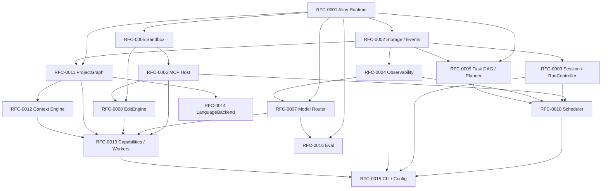

# Alloy Implementation RFCs

| Field | Value |
| --- | --- |
| **Author** | arkadianet |
| **Architecture** | [Alloy Architecture V2](../architecture/alloy-architecture-v2.md) (**frozen**) |
| **Status** | Draft series |
| **Date** | 2026-07-25 |

## Overview

This series decomposes the **frozen** Alloy Architecture V2 into independently implementable subsystems. Each RFC is sized for a single developer once its dependencies are done. RFCs implement the **MVP** of each V2 subsystem while keeping architectural interfaces and stubs for deferred work exactly as V2 specifies.

**Do not redesign Architecture V2.** If an RFC and V2 conflict, V2 wins.

**Crate map (V2 §5.4):** `alloy-cli` · `alloy-runtime` · `alloy-tools` · `alloy-index` · `alloy-eval` (≤5 crates MVP).

**Mental model:** `Runtime → Scheduler → Capability Workers`. Models are plugins behind `ModelRouter`.

## Definition of Done (merge gate)

An RFC implementation is **complete** and may be merged **only** when every item below is true. If any item fails, do not merge.

| # | Gate | Requirement |
| --- | --- | --- |
| 1 | **Architecture compliance** | **PASS** — matches frozen [Architecture V2](../architecture/alloy-architecture-v2.md); no redesign; deferred items stay deferred |
| 2 | **RFC acceptance criteria** | **100% satisfied** — every checkbox in that RFC’s Acceptance criteria is checked |
| 3 | **Unit tests** | **Passing** for the RFC’s scope |
| 4 | **Integration tests** | **Passing** when the RFC defines or inherits applicable integration coverage |
| 5 | **Documentation** | **Complete** — RFC text, module/docs comments, and any user-facing notes required by the RFC are up to date |
| 6 | **Public APIs** | **Reviewed and stable** for the milestone (signatures match the RFC; no silent surface drift) |
| 7 | **Clippy** | **Clean** on touched crates / workspace policy for the change |
| 8 | **Formatting** | **Clean** (`cargo fmt --check` or project equivalent) |
| 9 | **No TODO / placeholders** | **None left** in the RFC’s in-scope implementation (stubs allowed only where the RFC explicitly marks **Stub** / deferred) |
| 10 | **Code review** | **Approved** |

This gate applies to RFC-0001 … RFC-0016 and any follow-on implementation RFCs. Milestone exit in the [implementation roadmap](../roadmap/IMPLEMENTATION-ROADMAP.md) additionally requires the RFC DoD for every RFC claimed complete in that milestone.

## RFC index

| RFC | Title | Status | Effort | Depends on | Critical path |
| --- | --- | --- | --- | --- | --- |
| [RFC-0001](./RFC-0001-alloy-runtime.md) | Alloy Runtime | Ready for Implementation | 5–8 pd | — | **Yes** (Runtime foundation + core types) |
| [RFC-0002](./RFC-0002-storage-artifacts-session-events.md) | Storage, Artifacts & Session Event Log | Ready for Implementation | 4–7 pd | 0001 | **Yes** |
| [RFC-0003](./RFC-0003-session-manager-run-controller.md) | Session Manager & RunController | Implemented | 3–5 pd | 0001, 0002 | **Yes** |
| [RFC-0004](./RFC-0004-observability-cost-metering.md) | Observability & Cost Metering | Draft | 2–4 pd | 0001, 0002 | **Yes** |
| [RFC-0005](./RFC-0005-sandbox-broker.md) | Sandbox Broker | Ready for Implementation | 5–8 pd | 0001 | **Yes** |
| [RFC-0006](./RFC-0006-mcp-host-builtins.md) | MCP Host & In-Process Builtins | Draft | 5–8 pd | 0001, 0005 | **Yes** |
| [RFC-0007](./RFC-0007-model-router-provider.md) | Model Router & Provider | Draft | 4–6 pd | 0001, 0004 | **Yes** |
| [RFC-0008](./RFC-0008-edit-engine.md) | EditEngine (TextPatch + Git Checkpoint) | Draft | 4–6 pd | 0001, 0005, 0006 | **Yes** |
| [RFC-0009](./RFC-0009-task-dag-templates-planner.md) | Task DAG, Templates & Planner | Draft | 4–6 pd | 0001, 0002 | **Yes** |
| [RFC-0010](./RFC-0010-scheduler-runtime-adapters.md) | Scheduler & Runtime Adapters | Draft | 5–8 pd | 0003, 0004, 0006, 0009 | **Yes** |
| [RFC-0011](./RFC-0011-project-graph.md) | ProjectGraph (`alloy-index`) | Draft | 6–10 pd | 0001, 0002 | M2 path |
| [RFC-0012](./RFC-0012-context-engine.md) | Context Engine | Draft | 4–6 pd | 0001, 0011 | M1 thin / M2 deep |
| [RFC-0013](./RFC-0013-capability-registry-workers.md) | Capability Registry & MVP Workers | Draft | 6–10 pd | 0006, 0007, 0008, 0011, 0012 | **Yes** |
| [RFC-0014](./RFC-0014-language-backend-rust.md) | LanguageBackend (Rust Module) | Draft | 3–5 pd | 0001, 0011 | M2 path |
| [RFC-0015](./RFC-0015-cli-profiles-config.md) | CLI, Profiles & Config | Draft | 4–6 pd | 0003, 0004, 0010, 0013 | **Yes** |
| [RFC-0016](./RFC-0016-eval-harness-holdout-gates.md) | Eval Harness & Holdout Gates | Draft | 5–8 pd | 0001, 0007 | **Yes** (skeleton early) |

**pd** = person-days. Honest ranges; parallelization shortens calendar time.

### Consolidated dependency table

| RFC | Direct dependencies |
| --- | --- |
| 0001 | — |
| 0002 | 0001 |
| 0003 | 0001, 0002 |
| 0004 | 0001, 0002 |
| 0005 | 0001 |
| 0006 | 0001, 0005 |
| 0007 | 0001, 0004 |
| 0008 | 0001, 0005, 0006 |
| 0009 | 0001, 0002 |
| 0010 | 0003, 0004, 0006, 0009 |
| 0011 | 0001, 0002 |
| 0012 | 0001, 0011 |
| 0013 | 0006, 0007, 0008, 0011, 0012 |
| 0014 | 0001, 0011 |
| 0015 | 0003, 0004, 0010, 0013 |
| 0016 | 0001, 0007 |

No cycles. **Critical path (M1 vertical slice):** 0001 → (0002∥0005) → (0003∥0004∥0006∥0009) → (0007∥0008) → 0010 → (0011∥0012 thin) → 0013 → 0015, with **0016 skeleton** starting as soon as 0007 exists.

## Mermaid dependency graph

## Recommended waves (solo / small team)

Aligned with V2 §19 milestones. Sandbox before dogfood is non-negotiable (V2 §14.2).

### Wave A — Foundations (M1 W1–W2)

| Order | RFCs | Goal |
| --- | --- | --- |
| 1 | **0001** | Alloy Runtime host + five-crate workspace + shared types |
| 2a | **0002**, **0005** (parallel after 0001) | SQLite events/artifacts; sandbox broker |
| 2b | **0004**, **0016** skeleton | Decision log defaults; fixtures + ScriptedProvider trait surface |

### Wave B — Tool & model bus (M1 W3–W5)

| Order | RFCs | Goal |
| --- | --- | --- |
| 3 | **0006**, **0003**, **0009** (parallel) | Sandboxed MCP builtins; session/run control; DAG templates |
| 4 | **0007**, **0008** (parallel) | TOML router + one openai-compatible provider; TextPatch + git |

### Wave C — Control plane slice (M1 W6–W8)

| Order | RFCs | Goal |
| --- | --- | --- |
| 5 | **0010** | Linear scheduler + VerifyCompile / GateHuman |
| 6 | **0011** thin stub + **0012** thin | Graph trait + empty stubs; three-domain PromptPack |
| 7 | **0013** | Repair / Edit (+ optional Review) wired |
| 8 | **0015** + **0016** holdout | `alloy run` + quarantine proven; **no dogfood until green** |

### Wave D — Intelligence thin (M2)

| Order | RFCs | Goal |
| --- | --- | --- |
| 9 | **0011** deepen + **0014** | syn + cargo metadata + diagnostics/fix ingest; Rust `LanguageBackend` |
| 10 | **0012** deepen + Review polish | WorkingSet graph projections; optional Review worker quality |

### Wave E — Semantic path (M3 — future extensions only in RFCs)

Tracked under each RFC’s **Future extensions** (RenameType / gated LLM Planner / parallel Analyze). No separate redesign RFCs.

## Critical path (one sentence)

**Solo-critical path to M1 thesis:** Alloy Runtime (host + core types) → storage + sandbox → MCP + session + DAG → router + EditEngine → scheduler → thin context/graph → Repair/Edit workers → CLI + holdout eval under sandbox.

## Effort rollup

| Scope | Person-days | Person-weeks (approx.) |
| --- | --- | --- |
| All RFCs (sum of ranges) | **69–111 pd** | **~14–22 pw** |
| Critical path alone (no parallel) | ~47–73 pd | ~9–15 pw |
| With Wave A–C parallelization (solo switching) | calendar ~8–12 weeks | matches V2 M1 |

## Coverage vs V2 MVP (§0.5)

| V2 MVP component | Owning RFC(s) |
| --- | --- |
| CLI | 0015 |
| Session Manager | 0003 (+ 0002 events) |
| RunController | 0003 |
| Task DAG + Scheduler | 0009, 0010 (Scheduler plugs into Runtime host from 0001) |
| Planner (template) | 0009 |
| Capability Registry / Workers | 0013 |
| Model Router | 0007 |
| Context Engine | 0012 |
| ProjectGraph | 0011 |
| EditEngine | 0008 |
| MCP Host | 0006 |
| Sandbox Broker | 0005 |
| Observability | 0004 |
| Eval | 0016 |
| LanguageBackend (Rust) | 0014 |
| Artifact Store | 0002 |
| Alloy Runtime host + shared IR / profiles types | 0001 (+ 0015 config files) |

Deferred V2 items appear only under **Out of scope** / **Future extensions** in individual RFCs.
