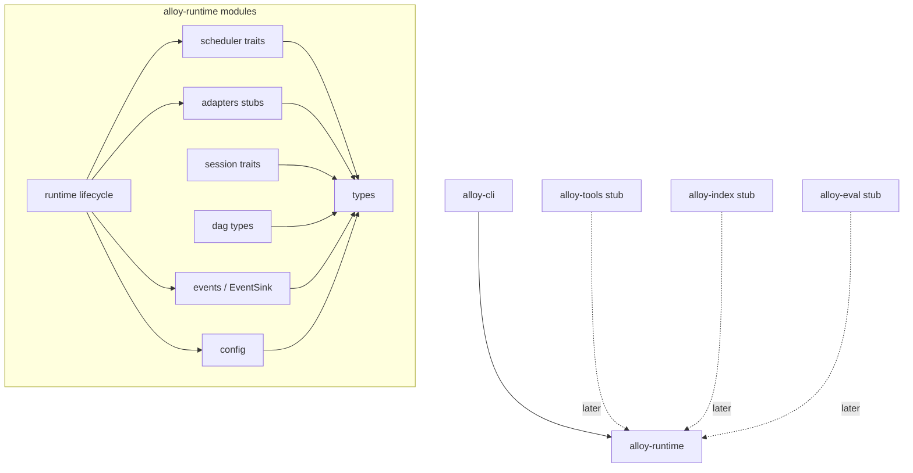
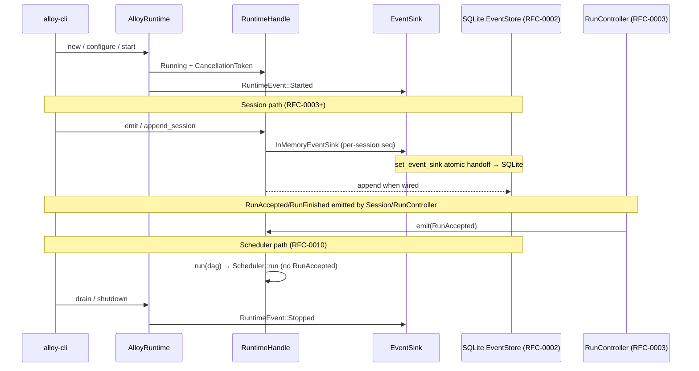
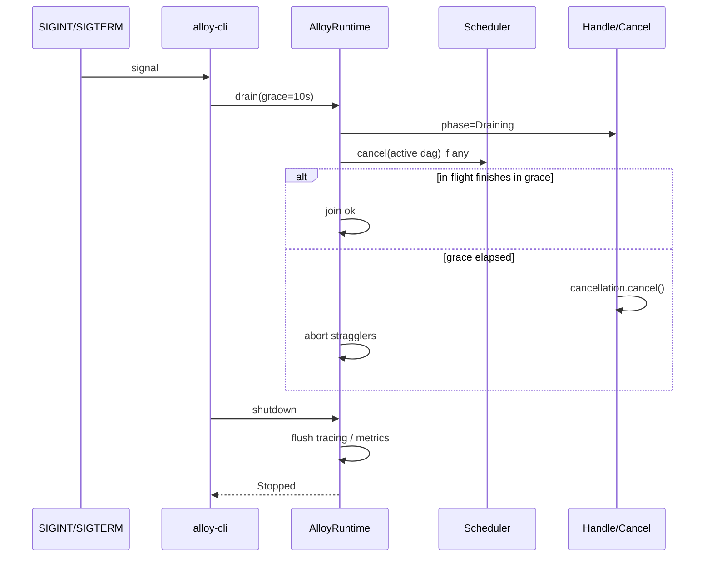

# RFC-0001: Alloy Runtime

| Field | Value |
| --- | --- |
| **Status** | Implemented |
| **Author** | arkadianet |
| **Architecture** | Alloy Architecture V2 (**frozen**) — do not redesign |
| **Depends on** | — |
| **Effort** | 5–8 person-days |
| **Related RFCs** | [0003](./RFC-0003-session-manager-run-controller.md) Session/RunController · [0009](./RFC-0009-task-dag-templates-planner.md) Task DAG · [0010](./RFC-0010-scheduler-runtime-adapters.md) Scheduler (plugs into Runtime host) |
| **Supersedes** | `RFC-0001-workspace-skeleton-core-types.md` (workspace + core types absorbed here) |
| **Product** | Alloy — AI Engineering Runtime |
| **Review** | Principal systems review 2026-07-24 — required API/lifecycle/test gaps closed |

**Mental model (V2):** `Runtime → Scheduler → Capability Workers`. Models are implementations behind `ModelRouter`, not the product center.

---

## Purpose

Define and ship the **Alloy Runtime** host: the single in-process execution kernel that owns process lifecycle, shared IR, configuration load, subsystem wiring, and the adapter surfaces that Session, Scheduler, and Capability Workers plug into.

Day-1 deliverable for a developer:

1. Five-crate Cargo workspace (`alloy-cli`, `alloy-runtime`, `alloy-tools`, `alloy-index`, `alloy-eval`).
2. Shared core types every downstream RFC imports from `alloy-runtime`.
3. `AlloyRuntime` construct/configure/start/run/drain/shutdown with stub Scheduler + Session facades.
4. Installable `alloy` binary stub (`--help` / `--version`).

This RFC is the **foundation of the critical path**. It does **not** implement the linear DAG scheduler (RFC-0010), Session persistence (RFC-0002/0003), or workers (RFC-0013). It publishes stable traits and types so those RFCs compile and wire in without rewriting the host.

---

## Responsibilities

| Owns (this RFC) | Does not own (later RFC) |
| --- | --- |
| Workspace layout ≤5 crates (V2 §5.4) | SQLite event/artifact store → **0002** |
| Shared IDs, budgets, Diagnostic/Failure IR, Grant shapes | SessionService / RunController behavior → **0003** |
| `AlloyRuntime` host lifecycle + config load | Observability writers → **0004** |
| Trait stubs / injection points for Scheduler, Session, EventSink, adapters | Sandbox / MCP → **0005–0006** |
| `example.env`, profile/router skeleton files | Model router impl → **0007** |
| Binary stub in `alloy-cli` | EditEngine → **0008** |
| Module map mirroring V2 component names | TaskDag persistence / templates → **0009** |
| Core event type enum + emit helpers (in-memory until 0002) | Scheduler ready-queue / runtime adapters → **0010** |
| | ProjectGraph / Context / Caps / CLI UX / Eval → **0011–0016** |

**Runtime ↔ Scheduler boundary (precise):**

- **Runtime** = process host + shared types + wiring + lifecycle + cancellation token + event emit surface.
- **Scheduler** (RFC-0010) = ready-queue executor over a `TaskDag`; implements `Scheduler` and registers via `RuntimeHandle::set_scheduler`.
- **`AlloyRuntime::run(dag_id)`** = thin forwarder to `Scheduler::run` only. Goal submission and run orchestration stay on `SessionService` / `RunController` (RFC-0003). CLI must not treat `AlloyRuntime::run` as the user-facing “run a prompt” API.
- **Runtime adapters** (VerifyCompile / VerifyTest / GateHuman) are **defined as traits here**, implemented in RFC-0010 (and MCP wiring in 0006). MVP Runtime ships **Unavailable stubs** so the host compiles.

---

## Non-goals

- Redesigning Architecture V2 or introducing new pillars/components.
- Implementing DAG execution, retries, or GateHuman unblock logic (RFC-0010).
- Implementing Session resume / budget enforcement beyond type shapes (RFC-0003).
- Multi-process daemon (`alloyd`), ACP, OverlayFS, Postgres, OTel crate split.
- Parallel cargo/edits; file leases; Hint-edge scheduling; LLM planner.
- Sixth public crate for types (types live in `alloy-runtime`; re-export as needed).
- Touching or creating the user’s `.env` (document `example.env` only).
- Discussing alternative architectures.

---

## Public Rust interfaces

All public items live in crate `alloy-runtime` unless noted. Marked **MVP** = implement now; **Stub** = trait + empty/Unavailable impl compiling today.

**Edition / async decision (pinned):** Rust 2021, Tokio 1.x, public host traits use `async_trait` through M1. Do not mix RPITIT on public traits in the same milestone.

### Core IDs & value types — MVP

Absorbed from former workspace-skeleton RFC; serde-stable; match V2 §§5.5, 9–14, Appendices D–E.

**ID classes:**

| Class | Representation | Examples |
| --- | --- | --- |
| Opaque instance IDs | `Uuid` newtype, serde as string UUID | `SessionId`, `RunId`, `DagId`, `NodeId`, … |
| Named catalog IDs | Non-empty `String` newtype, serde as string | `ProfileId`, `LanguageId`, `CapabilityId`, `ProviderId` |

```rust
// alloy-runtime/src/types/ids.rs  — MVP
use serde::{Deserialize, Serialize};
use uuid::Uuid;

macro_rules! uuid_id {
    ($name:ident) => {
        #[derive(Debug, Clone, Copy, PartialEq, Eq, Hash, Serialize, Deserialize)]
        #[serde(transparent)]
        pub struct $name(Uuid);

        impl $name {
            pub fn new() -> Self { Self(Uuid::new_v4()) }
            pub fn as_uuid(&self) -> &Uuid { &self.0 }
            // No Default — callers must use `new()` so random UUIDs are never implicit.
        }

        impl std::fmt::Display for $name {
            fn fmt(&self, f: &mut std::fmt::Formatter<'_>) -> std::fmt::Result {
                write!(f, "{}", self.0)
            }
        }
    };
}

macro_rules! name_id {
    ($name:ident) => {
        #[derive(Debug, Clone, PartialEq, Eq, Hash, Serialize)]
        #[serde(transparent)]
        pub struct $name(String);

        impl $name {
            pub fn new(s: impl Into<String>) -> Result<Self, IdError> {
                let s = s.into();
                if s.is_empty() || s.len() > 128 {
                    return Err(IdError::InvalidName);
                }
                Ok(Self(s))
            }
            pub fn as_str(&self) -> &str { &self.0 }
        }

        impl<'de> Deserialize<'de> for $name {
            fn deserialize<D: serde::Deserializer<'de>>(d: D) -> Result<Self, D::Error> {
                let s = String::deserialize(d)?;
                $name::new(s).map_err(serde::de::Error::custom)
            }
        }

        impl std::fmt::Display for $name {
            fn fmt(&self, f: &mut std::fmt::Formatter<'_>) -> std::fmt::Result {
                f.write_str(&self.0)
            }
        }
    };
}

uuid_id!(SessionId);
uuid_id!(RunId);
uuid_id!(DagId);
uuid_id!(NodeId);
uuid_id!(GateId);
uuid_id!(ArtifactId);
uuid_id!(TransactionId);
uuid_id!(CheckpointId);
uuid_id!(GraphNodeId);
uuid_id!(DiagnosticId);

name_id!(ProfileId);     // "default" | "autonomous" | "readonly"
name_id!(LanguageId);    // MVP: "rust"
name_id!(CapabilityId);  // "repair" | "edit" | …
name_id!(ProviderId);    // router provider key

#[derive(Debug, thiserror::Error)]
pub enum IdError {
    #[error("invalid name id")]
    InvalidName,
}

#[derive(Debug, Clone, PartialEq, Eq, Hash, Serialize, Deserialize)]
pub struct GraphVersion(pub u64);

/// Lowercase hex SHA-256 (64 chars). Construct only via `Digest::sha256` / `try_from_hex`.
/// `Deserialize` must call `try_from_hex` (never populate the inner `String` unchecked).
#[derive(Debug, Clone, PartialEq, Eq, Hash, Serialize)]
#[serde(transparent)]
pub struct Digest(String);

impl Digest {
    pub fn sha256(bytes: &[u8]) -> Self { /* hex encode sha2::Sha256 */ todo!() }
    pub fn try_from_hex(s: impl AsRef<str>) -> Result<Self, DigestError> { /* validate len==64 + hex charset */ todo!() }
    pub fn as_hex(&self) -> &str { &self.0 }
}

impl<'de> Deserialize<'de> for Digest {
    fn deserialize<D: serde::Deserializer<'de>>(d: D) -> Result<Self, D::Error> {
        let s = String::deserialize(d)?;
        Digest::try_from_hex(s).map_err(serde::de::Error::custom)
    }
}

#[derive(Debug, thiserror::Error)]
pub enum DigestError {
    #[error("digest must be 64 lowercase hex chars")]
    InvalidHex,
}

#[derive(Debug, Clone, Copy, PartialEq, Eq, PartialOrd, Ord, Serialize, Deserialize)]
pub struct EventSeq(pub u64);

/// UTC timestamp. Serde: RFC3339 string to match Appendix A `format: date-time`.
#[derive(Debug, Clone, Serialize, Deserialize)]
pub struct Timestamp(#[serde(with = "time::serde::rfc3339")] pub time::OffsetDateTime);

impl Timestamp {
    pub fn now() -> Self { Self(time::OffsetDateTime::now_utc()) }
}
```

### Budgets, session create, goals — MVP

```rust
// alloy-runtime/src/types/budget.rs  — MVP
#[derive(Debug, Clone, Serialize, Deserialize)]
pub struct BudgetPolicy {
    /// USD limit for the run. MVP stores `f64` for V2 parity; billing math in RFC-0004
    /// must not rely on exact float equality (compare with epsilon or migrate to integer cents later).
    pub max_usd_per_run: f64,
    pub max_tokens_per_run: u64,
    pub max_parallel_nodes: u32,   // MVP: 1
    pub max_parallel_cargo: u32,   // MVP: 1
    pub max_parallel_edits: u32,   // MVP: 1
}

#[derive(Debug, Clone, Serialize, Deserialize)]
pub struct TokenBudget {
    pub max_input: u64,
    pub max_output: u64,
}

#[derive(Debug, Clone, Serialize, Deserialize)]
pub struct BudgetSnapshot {
    pub usd_spent: f64,
    pub tokens_in: u64,
    pub tokens_out: u64,
}

#[derive(Debug, Clone, Copy, PartialEq, Eq, Serialize, Deserialize)]
#[serde(rename_all = "snake_case")]
pub enum ModelTier { Premium, Standard, Economy, Local }

#[derive(Debug, Clone, Serialize, Deserialize)]
pub struct CreateSession {
    pub workspace_root: std::path::PathBuf,
    pub profile: ProfileId,              // "default" | "autonomous" | "readonly"
    pub budget: BudgetPolicy,
    pub language_backends: Vec<LanguageId>, // MVP: [LanguageId::new("rust")?]
}

#[derive(Debug, Clone, Serialize, Deserialize)]
pub struct Goal {
    pub text: String,
    pub constraints: Vec<Constraint>,
    pub attachments: Vec<ArtifactId>,
}

#[derive(Debug, Clone, Serialize, Deserialize)]
#[serde(rename_all = "snake_case")]
pub enum Constraint {
    MaxUsd(f64),
    RequireCargoCheck,
    DenyRawBash,
    Custom(String),
}
```

### Diagnostic / Failure IR — MVP

```rust
// alloy-runtime/src/types/diagnostic.rs  — MVP (V2 Appendix D)
#[derive(Debug, Clone, Serialize, Deserialize)]
#[serde(rename_all = "snake_case")]
pub enum DiagnosticLevel { Error, Warning, Note, Help }

#[derive(Debug, Clone, Serialize, Deserialize)]
pub struct SpanRef {
    pub path: String,
    pub start_line: u32,
    pub start_col: u32,
    pub end_line: u32,
    pub end_col: u32,
}

#[derive(Debug, Clone, Serialize, Deserialize)]
pub struct DiagnosticEvent {
    pub id: DiagnosticId,
    pub code: Option<String>,
    pub level: DiagnosticLevel,
    pub message: String,
    pub spans: Vec<SpanRef>,
    pub children: Vec<DiagnosticEvent>,
    pub package: Option<String>,
    pub fingerprint: Digest,
    pub raw_json: Option<serde_json::Value>,
}

#[derive(Debug, Clone, Copy, PartialEq, Eq, Serialize, Deserialize)]
#[serde(rename_all = "snake_case")]
pub enum ErrorClass {
    Compile,
    Test,
    Tool,
    Model,
    Budget,
    Approval,
    Internal,
    Timeout,
    Cancelled,
}

/// Whether RFC-0010 may admit a retry for this failure.
#[derive(Debug, Clone, Copy, PartialEq, Eq, Serialize, Deserialize, Default)]
#[serde(rename_all = "snake_case")]
pub enum RetryDisposition {
    Retryable,
    #[default]
    NonRetryable,
}

#[derive(Debug, Clone, Serialize, Deserialize)]
pub struct FailureIr {
    pub node: NodeId,
    pub error_class: ErrorClass,
    /// Defaults to NonRetryable when reading pre-RFC-0007 payloads.
    #[serde(default)]
    pub retry: RetryDisposition,
    pub diagnostics: Vec<DiagnosticEvent>,
    pub notes: String,
}
```

### Permissions — MVP (shapes only; authorizer later)

```rust
// alloy-runtime/src/types/permission.rs  — MVP shapes (V2 Appendix E)
#[derive(Debug, Clone, Serialize, Deserialize)]
pub struct Glob(pub String);

#[derive(Debug, Clone, Serialize, Deserialize)]
pub struct ExecAllow { pub binary: String, pub args_glob: Option<String> }

#[derive(Debug, Clone, Serialize, Deserialize)]
pub struct HostAllow { pub host: String }

#[derive(Debug, Clone, Serialize, Deserialize)]
#[serde(rename_all = "snake_case")]
pub enum Grant {
    FsRead(Glob),
    FsWrite(Glob),
    Exec(ExecAllow),
    Network(HostAllow),
    GitWrite,
}

#[derive(Debug, Clone, Serialize, Deserialize)]
pub struct PermissionToken {
    pub profile: ProfileId,
    pub grants: Vec<Grant>,
    pub expires: Option<Timestamp>,
    pub run_id: RunId,
}
```

### Session event types — MVP (enum + helpers; persistence → 0002)

```rust
// alloy-runtime/src/events/mod.rs  — MVP enum; store in 0002
#[derive(Debug, Clone, Copy, PartialEq, Eq, Serialize, Deserialize)]
#[serde(rename_all = "snake_case")]
pub enum SessionEventType {
    SessionCreated,
    GoalSubmitted,
    PlanProduced,
    NodeState,
    Decision,
    ModelCall,
    ToolCall,
    EditApplied,
    ApprovalRequested,
    ApprovalResolved,
    BudgetWarning,
    ReplanRequested,
    RunCompleted,
    Error,
}
// Host lifecycle uses RuntimeEvent (separate channel) — see Event lifecycle.

/// Appendix A payload envelope used by EventStore (RFC-0002).
#[derive(Debug, Clone, Serialize, Deserialize)]
pub struct SessionEvent {
    pub seq: EventSeq,
    pub ts: Timestamp,
    pub session_id: SessionId,
    pub run_id: Option<RunId>,
    #[serde(rename = "type")]
    pub type_: SessionEventType,
    pub payload: serde_json::Value,
}

#[derive(Debug, Clone, Serialize, Deserialize)]
pub struct NewSessionEvent {
    pub session_id: SessionId,
    pub run_id: Option<RunId>,
    #[serde(rename = "type")]
    pub type_: SessionEventType,
    pub payload: serde_json::Value,
}
```

### Event sink injection — Stub trait (impl → RFC-0002)

Runtime must not grow a second durable event store. Day 1 uses an in-memory sink; RFC-0002 replaces it with SQLite without changing `RuntimeHandle::emit`.

```rust
// alloy-runtime/src/events/sink.rs  — Stub
#[async_trait]
pub trait EventSink: Send + Sync {
    async fn append_runtime(&self, ev: RuntimeEvent) -> Result<(), EventSinkError>;
    async fn append_session(&self, ev: NewSessionEvent) -> Result<EventSeq, EventSinkError>;
}

/// Process-local buffer. Allocates an **independent** monotonic, gapless `EventSeq`
/// **per `SessionId`**, each starting at 0. Interleaved sessions must not share a counter.
/// RFC-0002 SQLite sink MUST continue the same per-session contract.
pub struct InMemoryEventSink { /* Map<SessionId, next_seq> + buffers */ }

#[async_trait]
impl EventSink for InMemoryEventSink { /* … */ }

#[derive(Debug, thiserror::Error)]
pub enum EventSinkError {
    #[error("io: {0}")]
    Io(String),
    #[error("busy")]
    Busy,
    #[error("internal: {0}")]
    Internal(String),
}
```

### Runtime host — MVP

```rust
// alloy-runtime/src/runtime/mod.rs
use async_trait::async_trait;
use tokio_util::sync::CancellationToken;
use std::sync::Arc;

#[derive(Debug, Clone)]
pub struct RuntimeConfig {
    pub data_dir: std::path::PathBuf,       // .alloy/ or XDG
    pub profile_path: std::path::PathBuf,   // profiles/default.toml
    pub router_path: std::path::PathBuf,    // router.toml
    pub env_file_hint: std::path::PathBuf,  // example.env path for docs/errors only
    pub retain_full_prompts: bool,          // default false
    pub retain_tool_bodies: bool,           // default false
    pub run_timeout: std::time::Duration,
    pub budget_policy: BudgetPolicy,
}

impl RuntimeConfig {
    /// Load TOML + read process env. Never writes `.env`.
    pub fn load(paths: ConfigPaths) -> Result<Self, RuntimeError> { /* MVP */ }
}

#[derive(Debug, Clone, Copy, PartialEq, Eq)]
pub enum RuntimePhase {
    Created,
    Configured,
    Starting,
    Running,
    Draining,
    Stopped,
    Failed,
}

/// Process-wide handle injected into Session / Scheduler / workers.
#[derive(Clone)]
pub struct RuntimeHandle {
    inner: Arc<RuntimeInner>,
}

impl RuntimeHandle {
    pub fn phase(&self) -> RuntimePhase { /* … */ }
    pub fn cancellation(&self) -> CancellationToken { /* … */ }
    /// Clone Arc of loaded config. Errors with `InvalidPhase` if not yet `configure`d
    /// (never panics; never returns a lock guard).
    pub fn config(&self) -> Result<Arc<RuntimeConfig>, RuntimeError> { /* … */ }

    /// Install or replace Scheduler.
    /// - Allowed in `Configured` (pre-start inject) and `Running` when no DAG is active.
    /// - Returns `InvalidPhase` if `Draining` | `Stopped` | `Failed` | `Starting`.
    /// - Returns `SchedulerBusy` if a `run` is in flight.
    pub fn set_scheduler(&self, sched: Arc<dyn Scheduler>) -> Result<(), RuntimeError> { /* … */ }

    /// Swap event sink (RFC-0002 wires SQLite here).
    /// - Phase: `Configured` or `Running` only.
    /// - Takes the sink write lock and waits until no `emit` holds the async read/guard
    ///   across `append_*` (emit acquires that guard for the full awaitable append).
    /// - Returns `EventSinkBusy` if a replace is already in progress or wait policy times out.
    /// - **Handoff:** if the current sink is `InMemoryEventSink`, RFC-0002’s installer must
    ///   drain buffered runtime + session events and per-session seq maps into SQLite
    ///   **atomically and losslessly** before the Arc swap becomes visible to new emits.
    ///   Day-1 MVP may refuse swap until the buffer is empty if handoff is not yet wired.
    /// Default after `start`: `InMemoryEventSink`.
    pub async fn set_event_sink(&self, sink: Arc<dyn EventSink>) -> Result<(), RuntimeError> { /* … */ }

    /// Emit a host-level RuntimeEvent; session-typed payloads go through `EventSink::append_session`.
    /// Holds an async sink read-guard across the awaitable `append_*` so `set_event_sink` cannot
    /// replace mid-append.
    pub async fn emit(&self, ev: RuntimeEvent) -> Result<(), RuntimeError> { /* … */ }
}

pub struct AlloyRuntime {
    handle: RuntimeHandle,
}

impl AlloyRuntime {
    /// Phase: Created. No I/O.
    pub fn new() -> Self { /* … */ }

    /// Phase: Created → Configured. Rejects if not `Created` (`InvalidPhase`).
    pub fn configure(&mut self, cfg: RuntimeConfig) -> Result<&mut Self, RuntimeError> { /* … */ }

    /// Phase: Configured → Starting → Running.
    /// Spawns internal tasks; does not block on a user goal.
    /// Rejects if not `Configured`. On failure → `Failed` (call `shutdown` to reap).
    pub async fn start(&mut self) -> Result<RuntimeHandle, RuntimeError> { /* … */ }

    /// Thin forwarder to `Scheduler::run`. Not the user goal API (see RFC-0003).
    /// Rejects unless phase is `Running`. MVP: at most one concurrent `run` (`SchedulerBusy`).
    /// Maps `SchedError::Unavailable` → `RuntimeError::SchedulerUnavailable`; other scheduler
    /// errors → `RuntimeError::Scheduler(...)`.
    /// Does **not** emit `RuntimeEvent::RunAccepted` / `RunFinished` (no `RunId` on this API);
    /// SessionService / RunController (RFC-0003) emit those when they have a `RunId`.
    pub async fn run(&self, dag_id: DagId) -> Result<DagOutcome, RuntimeError> { /* … */ }

    /// Phase: Running → Draining — stop accepting work; wait in-flight ≤ grace.
    /// Idempotent if already `Draining`. Rejects from `Created`/`Configured`/`Stopped`.
    pub async fn drain(&self, grace: std::time::Duration) -> Result<(), RuntimeError> { /* … */ }

    /// Phase: → Stopped — cancel token; join tasks; flush logs; consume `self`.
    /// Allowed from `Created` | `Configured` | `Running` | `Draining` | `Failed`.
    /// From `Created` / `Configured`: no-op cleanup (no tasks), still reaches `Stopped`.
    /// From `Starting`: wait for start to finish or return `InvalidPhase` (see matrix).
    /// Second call is impossible (self consumed). Drop without shutdown → `tracing::warn`.
    pub async fn shutdown(self) -> Result<(), RuntimeError> { /* … */ }
}

// Drop glue (document + test):
// impl Drop for AlloyRuntime {
//   fn drop(&mut self) {
//     if phase not Stopped { tracing::warn!("AlloyRuntime dropped without shutdown"); }
//   }
// }
```

### Scheduler host surface — Stub trait (impl in RFC-0010)

```rust
// alloy-runtime/src/scheduler/traits.rs  — Stub (API frozen)
#[async_trait]
pub trait Scheduler: Send + Sync {
    async fn run(&self, dag_id: DagId) -> Result<DagOutcome, SchedError>;
    async fn cancel(&self, dag_id: DagId) -> Result<(), SchedError>;
}

#[derive(Debug, Clone, Serialize, Deserialize)]
pub struct DagOutcome {
    pub dag_id: DagId,
    pub generation: u64,
    pub state: DagState,
    pub failed_node: Option<NodeId>,
    pub failure: Option<FailureIr>,
}

#[derive(Debug, Clone, Copy, PartialEq, Eq, Serialize, Deserialize)]
#[serde(rename_all = "snake_case")]
pub enum DagState {
    Pending,
    Running,
    WaitingApproval,
    Succeeded,
    Failed,
    Cancelled,
    ReplanRequired,
}

/// MVP stub registered by `AlloyRuntime::start` until RFC-0010.
pub struct NullScheduler;

#[async_trait]
impl Scheduler for NullScheduler {
    async fn run(&self, _dag_id: DagId) -> Result<DagOutcome, SchedError> {
        Err(SchedError::Unavailable)
    }
    async fn cancel(&self, _dag_id: DagId) -> Result<(), SchedError> {
        Ok(())
    }
}
```

### Runtime adapters — Stub traits (impl in RFC-0010 + 0006)

`NodeExecContext` is **not** serde. Persistable fields live on `NodeExecRef` for logs/events.

```rust
// alloy-runtime/src/adapters/mod.rs  — Stub traits (V2 §10.4)
#[async_trait]
pub trait VerifyCompileAdapter: Send + Sync {
    async fn check(&self, ctx: &NodeExecContext) -> Result<VerifyOutcome, AdapterError>;
}

#[async_trait]
pub trait VerifyTestAdapter: Send + Sync {
    async fn test(&self, ctx: &NodeExecContext) -> Result<VerifyOutcome, AdapterError>;
}

#[async_trait]
pub trait GateHumanAdapter: Send + Sync {
    /// Emit WaitingApproval; resume when RunController::approve fires.
    async fn wait_approval(&self, ctx: &NodeExecContext, gate: GateId) -> Result<Approval, AdapterError>;
}

/// Serde-safe identity of a node execution (events / logs).
#[derive(Debug, Clone, Serialize, Deserialize)]
pub struct NodeExecRef {
    pub session_id: SessionId,
    pub run_id: RunId,
    pub dag_id: DagId,
    pub node_id: NodeId,
    pub workspace_root: std::path::PathBuf,
}

/// Runtime execution context. Not Serialize (holds CancellationToken).
#[derive(Debug, Clone)]
pub struct NodeExecContext {
    pub meta: NodeExecRef,
    pub cancellation: CancellationToken,
}

#[derive(Debug, Clone, Serialize, Deserialize)]
pub struct VerifyOutcome {
    pub ok: bool,
    pub diagnostics: Vec<DiagnosticEvent>,
    pub raw_artifact: Option<ArtifactId>,
}

/// Shared approval decision (V2 gates). Defined once here; re-exported at crate root.
#[derive(Debug, Clone, Copy, PartialEq, Eq, Serialize, Deserialize)]
#[serde(rename_all = "snake_case")]
pub enum Approval { Allow, Deny, AllowOnce }

/// MVP stubs: always `AdapterError::Unavailable`.
pub struct UnavailableVerifyCompile;
pub struct UnavailableVerifyTest;
pub struct UnavailableGateHuman;
```

### Session / RunController trait re-exports — Stub signatures (behavior → 0003)

Published here so crate graph and docs share one source. Full MVP impl is RFC-0003.

```rust
// alloy-runtime/src/session/traits.rs  — Stub signatures (V2 §5.5)
#[async_trait]
pub trait SessionService: Send + Sync {
    async fn create(&self, req: CreateSession) -> Result<SessionId, SessionError>;
    async fn resume(&self, id: SessionId) -> Result<Session, SessionError>;
    async fn submit_goal(&self, id: SessionId, goal: Goal) -> Result<RunId, SessionError>;
    /// Exclusive cursor + page limit. `after: None` starts at `EventSeq(0)`.
    /// `after: Some(seq)` returns events with `seq > after`. Impls clamp via `MAX_EVENTS_PAGE`.
    async fn events(
        &self,
        id: SessionId,
        after: Option<EventSeq>,
        limit: usize,
    ) -> Result<Vec<SessionEvent>, SessionError>;
}

#[async_trait]
pub trait RunController: Send + Sync {
    async fn start(&self, run: RunId) -> Result<(), RunError>;
    async fn cancel(&self, run: RunId) -> Result<(), RunError>;
    async fn approve(&self, run: RunId, gate: GateId, decision: Approval) -> Result<(), RunError>;
    async fn request_replan(&self, run: RunId, reason: ReplanReason) -> Result<(), RunError>;
}

#[derive(Debug, Clone, Serialize, Deserialize)]
pub struct Session {
    pub id: SessionId,
    pub workspace_root: std::path::PathBuf,
    pub profile: ProfileId,
    pub budget: BudgetPolicy,
    pub language_backends: Vec<LanguageId>,
    pub created_at: Timestamp,
}

#[derive(Debug, Clone, Serialize, Deserialize)]
#[serde(rename_all = "snake_case")]
pub enum ReplanReason {
    FailureIr(FailureIr),
    UserRequested,
    BudgetPolicy,
    Other(String),
}
```

### DAG type sketches — Stub (full store → 0009)

`timeout_ms` avoids `Duration` serde issues on sketches. `EdgeKind::Hint` is present for V2 schema parity but **ignored by MVP scheduler** (deferred behavior).

```rust
// alloy-runtime/src/dag/types.rs  — Stub types for compile; persistence in 0009
#[derive(Debug, Clone, Serialize, Deserialize)]
pub struct TaskDag {
    pub id: DagId,
    pub session_id: SessionId,
    pub generation: u64,
    pub nodes: std::collections::BTreeMap<NodeId, TaskNode>,
    pub edges: Vec<DependencyEdge>,
    pub state: DagState,
}

#[derive(Debug, Clone, Serialize, Deserialize)]
pub struct TaskNode {
    pub id: NodeId,
    pub kind: NodeKind,
    pub capability: Option<CapabilityId>,
    pub input_ref: ArtifactId,
    pub output_ref: Option<ArtifactId>,
    pub state: NodeState,
    pub retry: RetryPolicy,
    pub cache_key: Option<CacheKey>,
    pub budget: TokenBudget,
    pub model_tier: ModelTier,
    pub approval: Option<ApprovalSpec>,
    pub timeout_ms: u64,
}

#[derive(Debug, Clone, Copy, PartialEq, Eq, Serialize, Deserialize)]
#[serde(rename_all = "snake_case")]
pub enum NodeKind {
    Plan, Analyze, Edit, VerifyCompile, VerifyTest, Review, GateHuman, Aggregate,
}

#[derive(Debug, Clone, Copy, PartialEq, Eq, Serialize, Deserialize)]
#[serde(rename_all = "snake_case")]
pub enum NodeState {
    Pending, Ready, Running, Succeeded, Failed, Skipped,
    Cancelled, WaitingApproval, CachedHit,
}

#[derive(Debug, Clone, Copy, PartialEq, Eq, Serialize, Deserialize)]
#[serde(rename_all = "snake_case")]
pub enum EdgeKind {
    Data,
    Sequence,
    /// Deferred: MVP scheduler treats Hint as non-scheduling (ignore for readiness).
    Hint,
}

#[derive(Debug, Clone, Serialize, Deserialize)]
pub struct DependencyEdge {
    pub from: NodeId,
    pub to: NodeId,
    pub kind: EdgeKind,
}

#[derive(Debug, Clone, Serialize, Deserialize)]
pub struct RetryPolicy {
    pub max_attempts: u32,
    pub backoff: Backoff,
    pub retry_on: Vec<ErrorClass>,
    pub escalate_after: Option<u32>,
    pub escalate_to_tier: Option<ModelTier>,
}

#[derive(Debug, Clone, Serialize, Deserialize)]
#[serde(rename_all = "snake_case")]
pub enum Backoff {
    Fixed { delay_ms: u64 },
    Exponential { base_ms: u64, factor: f64 },
}

#[derive(Debug, Clone, Serialize, Deserialize)]
pub struct CacheKey(pub Digest);

#[derive(Debug, Clone, Serialize, Deserialize)]
pub struct ApprovalSpec {
    pub gate: GateId,
    pub reason: String,
}
```

### Metrics shapes — MVP (writers → 0004)

```rust
// alloy-runtime/src/types/metrics.rs  — MVP
#[derive(Debug, Clone, Serialize, Deserialize)]
pub struct WorkerMetrics {
    pub model_tier_used: ModelTier,
    pub provider_id: ProviderId,
    pub input_tokens: Option<u64>,  // None = not reported / unknown
    pub output_tokens: Option<u64>, // None = not reported / unknown
    pub tool_calls: u32,
    pub cache_hits: u32,
    pub duration_ms: u64,
    pub confidence: Option<f32>, // None when provider confidence unavailable
    pub error_class: Option<ErrorClass>,
}

#[derive(Debug, Clone, Default, Serialize, Deserialize)]
pub struct RuntimeMetrics {
    pub phase_transitions: u64,
    pub runs_started: u64,
    pub runs_completed: u64,
    pub runs_failed: u64,
    pub shutdowns: u64,
}
```

### Crate root re-exports — MVP

Prefer **explicit** re-exports over `pub use types::*` to keep the public surface reviewable.

```rust
// alloy-runtime/src/lib.rs
pub mod types;
pub mod events;
pub mod runtime;
pub mod scheduler;
pub mod adapters;
pub mod session;
pub mod dag;
pub mod config;
pub mod error;

// IDs & IR
pub use types::ids::{
    SessionId, RunId, DagId, NodeId, GateId, ArtifactId, ProfileId, LanguageId,
    CapabilityId, ProviderId, EndpointId, TransactionId, CheckpointId, GraphNodeId, DiagnosticId,
    GraphVersion, Digest, DigestError, EventSeq, Timestamp, IdError,
};
pub use types::budget::{BudgetPolicy, TokenBudget, BudgetSnapshot, ModelTier, CreateSession, Goal, Constraint};
pub use types::diagnostic::{
    DiagnosticLevel, SpanRef, DiagnosticEvent, ErrorClass, FailureIr, RetryDisposition,
};
pub use types::permission::{Glob, ExecAllow, HostAllow, Grant, PermissionToken};
pub use types::metrics::{WorkerMetrics, RuntimeMetrics};

// Host
pub use runtime::{AlloyRuntime, RuntimeConfig, RuntimeHandle, RuntimePhase, RuntimeEvent};
pub use events::{SessionEventType, SessionEvent, NewSessionEvent, EventSink, InMemoryEventSink};
pub use scheduler::{Scheduler, NullScheduler, DagOutcome, DagState};
pub use adapters::{
    VerifyCompileAdapter, VerifyTestAdapter, GateHumanAdapter,
    NodeExecRef, NodeExecContext, VerifyOutcome, Approval,
};
pub use session::{SessionService, RunController, Session, ReplanReason};
pub use error::{RuntimeError, SchedError, SessionError, RunError, AdapterError};
```

---

## Internal modules

```text
crates/alloy-runtime/
  src/
    lib.rs
    types/
      mod.rs          # submodule exports only (no glob at crate root)
      ids.rs           # uuid_id! / name_id! families
      budget.rs        # BudgetPolicy, ModelTier, CreateSession, Goal
      diagnostic.rs    # DiagnosticEvent, FailureIr, ErrorClass
      permission.rs    # Grant, PermissionToken
      metrics.rs       # WorkerMetrics, RuntimeMetrics
    events/
      mod.rs           # SessionEventType, SessionEvent, NewSessionEvent
      sink.rs          # EventSink + InMemoryEventSink
    config/
      mod.rs           # ConfigPaths, load TOML + env
      profile.rs       # parse profiles/default.toml subset
    runtime/
      mod.rs           # AlloyRuntime, RuntimeHandle, phases
      lifecycle.rs     # start / drain / shutdown
      handle.rs        # CancellationToken, scheduler + sink slots
      inner.rs         # RuntimeInner fields + locking notes
    scheduler/
      traits.rs        # Scheduler trait
      null.rs          # NullScheduler
    adapters/
      mod.rs           # Verify*/GateHuman traits + Unavailable stubs
    session/
      traits.rs        # SessionService, RunController signatures
    dag/
      types.rs         # TaskDag sketches (serde tests)
    error.rs           # RuntimeError, SchedError, SessionError, RunError, AdapterError
    logging.rs         # tracing subscriber init helper

crates/alloy-cli/      # binary: --help / --version; constructs AlloyRuntime; SIGINT→drain→shutdown
crates/alloy-tools/    # empty lib stub
crates/alloy-index/    # empty lib stub
crates/alloy-eval/     # empty lib stub
```

| Module | Responsibility |
| --- | --- |
| `types` | Shared IR; only source of IDs/budgets/IR for other crates |
| `events` | Appendix A enum + `EventSink` (in-memory until 0002) |
| `config` | TOML + env load; never writes `.env` |
| `runtime` | Host lifecycle, handle, cancellation |
| `scheduler` | Trait + `NullScheduler` |
| `adapters` | Runtime-node adapter traits + stubs |
| `session` | Trait signatures only (impl 0003) |
| `dag` | Type sketches (store 0009) |
| `logging` | `tracing` init from config |

### `RuntimeInner` (locking contract)

```text
RuntimeInner {
  phase: Atomic/Mutex<RuntimePhase>,
  config: Arc<RuntimeConfig>,
  cancel: CancellationToken,
  scheduler: RwLock<Arc<dyn Scheduler>>,
  event_sink: RwLock / async lock around Arc<dyn EventSink>,
  emit_in_flight: guard count held across append await,
  run_in_flight: AtomicBool,          // MVP single-flight
  metrics: RuntimeMetrics,            // atomics
  tasks: JoinSet or Vec<JoinHandle>,  // owned by AlloyRuntime, not cloned handles
}
```

Handles clone cheaply (`Arc`). Only `AlloyRuntime::shutdown` joins tasks. `Failed` is terminal until `shutdown`.

### Workspace tree — MVP

```text
alloy/
  Cargo.toml                 # workspace members; edition=2021; MSRV documented in README/Cargo.toml
  CODEOWNERS                 # arkadianet; required before substantive merges
  example.env
  router.toml.example
  profiles/default.toml
  crates/
    alloy-cli/
    alloy-runtime/
    alloy-tools/
    alloy-index/
    alloy-eval/
```

Binary package: `alloy-cli` with `[[bin]] name = "alloy"`. Crates.io publish collision is out of scope for MVP (path dependency).

### Module dependency diagram



---

## Event lifecycle

Runtime emits two channels:

1. **`RuntimeEvent`** — host lifecycle (always available day 1; via `EventSink`).
2. **`SessionEvent`** — V2 Appendix A (enum + helpers day 1; durable append via RFC-0002 `EventStore` implementing `EventSink`).

Until 0002, default sink is `InMemoryEventSink` with a **per-session** monotonic, gapless
`EventSeq` allocator (each `SessionId` starts at 0; sessions never share a counter).
Interleaved appends across sessions must keep each session’s sequence independent and gapless.
RFC-0002 must preserve that contract and, on sink swap, perform an atomic lossless handoff of
buffered events + per-session next-seq state (see `set_event_sink`).



```rust
// Host-only events (not Appendix A)
#[derive(Debug, Clone, Serialize, Deserialize)]
#[serde(rename_all = "snake_case")]
pub enum RuntimeEvent {
    Configured { data_dir: String },
    Started,
    SchedulerRegistered,
    /// Emitted by Session/RunController (RFC-0003), not by `AlloyRuntime::run`.
    RunAccepted { run_id: RunId, dag_id: DagId },
    /// Emitted by Session/RunController when a run completes; not by the DagId forwarder.
    RunFinished { run_id: RunId, outcome: DagOutcome },
    DrainStarted { grace_ms: u64 },
    Stopped,
    Failed { error: String },
}
```

Session event `type` strings must match Appendix A exactly when persisted (`session_created`, `goal_submitted`, …). Runtime does not invent alternate session event names.

---

## Runtime lifecycle

```mermaid
stateDiagram-v2
  [*] --> Created: AlloyRuntime::new
  Created --> Configured: configure(ok)
  Created --> Failed: configure(err)
  Created --> Stopped: shutdown
  Configured --> Starting: start
  Starting --> Running: subsystems up
  Starting --> Failed: start(err)
  Running --> Draining: drain(grace)
  Running --> Failed: fatal
  Draining --> Stopped: shutdown
  Draining --> Stopped: grace elapsed + cancel
  Failed --> Stopped: shutdown best-effort
  Configured --> Stopped: shutdown without start
  Running --> Stopped: shutdown
  Stopped --> [*]
```

| Transition | Action |
| --- | --- |
| `new` | Allocate handle; phase `Created`; no I/O |
| `configure` | Parse profile/router TOML; resolve `data_dir`; validate paths; **read** env for keys named in config; never write `.env` |
| `start` | Init `tracing`; create `data_dir` if missing; install `NullScheduler` + `InMemoryEventSink` unless already injected; emit `Started`; phase `Running` |
| `run` | Single-flight forward to `Scheduler::run`; map `Unavailable` → `SchedulerUnavailable`; reject if not `Running` or draining; do not emit `RunAccepted` |
| `drain` | Phase `Draining`; stop accepting `run`; wait in-flight ≤ grace |
| `shutdown` | From any live phase including `Created`: cancel token if any; join tasks if any; flush tracing; phase `Stopped`; consume `self` |

SIGINT/SIGTERM (`alloy-cli`): call `drain` then `shutdown`. Dropping `AlloyRuntime` without `shutdown` logs a warning and does not block (best-effort cancel only if feasible without async Drop).

### Phase-guard matrix (normative)

| Op | Created | Configured | Starting | Running | Draining | Failed | Stopped |
| --- | --- | --- | --- | --- | --- | --- | --- |
| `configure` | ok | `InvalidPhase` | `InvalidPhase` | `InvalidPhase` | `InvalidPhase` | `InvalidPhase` | n/a (consumed) |
| `start` | `InvalidPhase` | ok | `InvalidPhase` | `InvalidPhase` | `InvalidPhase` | `InvalidPhase` | n/a |
| `run` | `InvalidPhase` | `InvalidPhase` | `InvalidPhase` | ok / `SchedulerBusy` | `InvalidPhase` | `InvalidPhase` | n/a |
| `set_scheduler` | `InvalidPhase` | ok | `InvalidPhase` | ok if idle else `SchedulerBusy` | `InvalidPhase` | `InvalidPhase` | n/a |
| `set_event_sink` | `InvalidPhase` | ok / `EventSinkBusy` | `InvalidPhase` | ok if no emit in flight else wait/`EventSinkBusy` | `InvalidPhase` | `InvalidPhase` | n/a |
| `drain` | `InvalidPhase` | `InvalidPhase` | `InvalidPhase` | ok | ok (idempotent) | `InvalidPhase` | n/a |
| `shutdown` | ok → `Stopped` | ok → `Stopped` | wait/`InvalidPhase` | ok | ok | ok | n/a |

---

## Error handling

```rust
#[derive(Debug, thiserror::Error)]
pub enum RuntimeError {
    #[error("invalid phase {current:?} for operation {op}")]
    InvalidPhase { current: RuntimePhase, op: &'static str },
    #[error("config: {0}")]
    Config(String),
    #[error("scheduler unavailable")]
    SchedulerUnavailable,
    #[error("scheduler busy")]
    SchedulerBusy,
    /// Non-unavailable scheduler failures. Do **not** `#[from]` `SchedError`:
    /// `AlloyRuntime::run` maps `SchedError::Unavailable` → `SchedulerUnavailable` explicitly.
    #[error("scheduler: {0}")]
    Scheduler(SchedError),
    #[error("event sink busy")]
    EventSinkBusy,
    #[error("event sink: {0}")]
    EventSink(#[from] EventSinkError),
    #[error("io: {0}")]
    Io(#[from] std::io::Error),
    #[error("already stopped")]
    AlreadyStopped,
    #[error("internal: {0}")]
    Internal(String),
}

#[derive(Debug, thiserror::Error)]
pub enum SchedError {
    #[error("unavailable")]
    Unavailable,
    #[error("cancelled")]
    Cancelled,
    #[error("dag not found: {0}")]
    DagNotFound(DagId),
    #[error("internal: {0}")]
    Internal(String),
}

/// Stub until RFC-0003 fills variants; must exist so traits compile.
#[derive(Debug, thiserror::Error)]
pub enum SessionError {
    #[error("not found: {0}")]
    NotFound(SessionId),
    #[error("invalid: {0}")]
    Invalid(String),
    #[error("internal: {0}")]
    Internal(String),
}

#[derive(Debug, thiserror::Error)]
pub enum RunError {
    #[error("not found: {0}")]
    NotFound(RunId),
    #[error("invalid phase: {0}")]
    InvalidPhase(String),
    #[error("internal: {0}")]
    Internal(String),
}

#[derive(Debug, thiserror::Error)]
pub enum AdapterError {
    #[error("unavailable")]
    Unavailable,
    #[error("cancelled")]
    Cancelled,
    #[error("tool: {0}")]
    Tool(String),
    #[error("internal: {0}")]
    Internal(String),
}
```

| Failure | Handling |
| --- | --- |
| Bad TOML / missing profile | `RuntimeError::Config`; refuse `start` |
| Missing API key in env | Config warning at load; hard fail deferred to provider call (0007) |
| `run` with `NullScheduler` | `SchedError::Unavailable` mapped to `RuntimeError::SchedulerUnavailable` (not `Scheduler(...)`) |
| Second concurrent `run` | `SchedulerBusy` (MVP single-flight) |
| `set_scheduler` during `run` | `SchedulerBusy` |
| `set_event_sink` during emit / swap race | Wait for emit guard or `EventSinkBusy`; never tear mid-append |
| Sink handoff data loss | Forbidden — RFC-0002 atomic drain of buffers + per-session seq before swap |
| Panic in subsystem task | Catch via `JoinHandle`; emit `RuntimeEvent::Failed`; enter `Failed` |
| Drain timeout | Cancel token; best-effort join; still reach `Stopped` |
| `data_dir` create fails | `RuntimeError::Io`; `start` → `Failed` |
| Partial `start` failure | Enter `Failed`; caller must `shutdown` to join/reap; no auto-rollback to `Configured` |
| Budget / approval | Typed on Session/Scheduler RFCs; Runtime only forwards |
| Drop without shutdown | `tracing::warn`; cancel token if still live; no async flush |

### Failure modes summary

| Mode | Symptom | Mitigation |
| --- | --- | --- |
| Crate sprawl | Sixth crate PR | Reject; types stay in `alloy-runtime` |
| Host does too much | Scheduler logic in Runtime | Keep only traits + `NullScheduler`; `run` is forwarder |
| Silent `.env` write | Secrets clobbered | Config loader never opens `.env` for write; tests assert |
| Phase skip | `run` before `start` | `InvalidPhase` + matrix tests |
| Hung shutdown | Task ignores cancel | Grace then abort join; log orphan |
| Dual event stores | Memory + SQLite diverge | Single `EventSink` slot; 0002 atomic handoff, does not duplicate |
| UUID profile ids | TOML `"default"` cannot parse | `name_id!` for Profile/Language/Capability/Provider |
| Invalid serde IDs/digests | Empty/overlong names or bad hex enter via JSON | Deserialize via constructors; reject with errors |

---

## Configuration

**Rules:** Load from TOML + process environment. Document keys in `example.env`. **Never create or overwrite `.env`.**

### Data dir precedence (pinned)

1. `ALLOY_DATA_DIR` if set and non-empty  
2. else `ConfigPaths.data_dir` programmatic override when set  
3. else `<workspace_root>/.alloy` when a workspace root is known to the loader  
4. else XDG data dir (`$XDG_DATA_HOME/alloy` or platform default)  

`ALLOY_PROFILE` / `ALLOY_ROUTER` select TOML paths when constructing [`ConfigPaths::for_workspace`] (defaults: `profiles/default.toml`, active `router.toml`). Never parse or write a `.env` file.

Error messages must cite which rule won and the `example.env` hint path (never invent a `.env` path to write).

### `example.env`

```bash
# example.env — copy to your own .env manually; Alloy never writes .env
# Author: arkadianet

# Provider key name referenced by router.toml api_key_env
ALLOY_API_KEY=

# Optional overrides (process env; Alloy never writes .env)
# ALLOY_DATA_DIR=                 # data dir (else <workspace>/.alloy else XDG)
# ALLOY_PROFILE=profiles/default.toml
# ALLOY_ROUTER=router.toml        # active router (copy from router.toml.example)
# RUST_LOG=alloy_runtime=info,alloy_cli=info
```

### `profiles/default.toml` (skeleton; full wiring RFC-0015)

Only fields consumed by RFC-0001 `RuntimeConfig::load` are listed. Parallelism defaults live on `BudgetPolicy` type defaults until RFC-0015.

```toml
# profiles/default.toml — Author: arkadianet
[profile]
id = "default"

[budgets]
max_usd_per_run = 5.0
max_tokens_per_run = 2_000_000

[observability]
retain_full_prompts = false
retain_tool_bodies = false
```

### `router.toml.example` (schema owned by RFC-0007)

Template only — copy to user-owned `router.toml`. `RuntimeConfig::load` checks only that the active `router_path` exists; it does not parse provider keys or resolve credentials. RFC-0007 §7 and the shipped [`router.toml.example`](../../router.toml.example) own the complete `[policy]`, `[[providers]]`, `[[providers.endpoints]]`, and `[capability_tiers]` schema.

### Load sketch

```rust
pub struct ConfigPaths {
    pub profile: PathBuf,
    pub router: PathBuf,           // active router.toml (not .example)
    pub example_env: PathBuf,      // for error messages only
    pub data_dir: Option<PathBuf>, // after ALLOY_DATA_DIR, before workspace/XDG
    pub workspace_root: Option<PathBuf>,
}

impl ConfigPaths {
    /// Honors ALLOY_PROFILE / ALLOY_ROUTER; defaults to profiles/default.toml + router.toml.
    pub fn for_workspace(workspace_root: PathBuf) -> Self { /* … */ }
}

// RuntimeConfig::load:
// 1. read profile TOML
// 2. require that router_path exists; RFC-0007 parses its schema
// 3. do not parse/write .env files
// 4. resolve data_dir per precedence above
```

---

## Thread model

| Concern | Choice |
| --- | --- |
| Process | Single OS process (`alloy` binary) |
| Worker threads | Tokio multi-thread runtime (CLI builds `tokio::runtime::Builder::new_multi_thread`) |
| Shared state | `Arc<RuntimeInner>` + interior `tokio::sync` / `std::sync` primitives as above |
| Blocking I/O | `spawn_blocking` for sync FS/SQLite when 0002 lands; none required day 1 beyond config read |
| CPU | No dedicated thread pool beyond Tokio; Scheduler linear MVP needs no fan-out |
| FFI / signal | `tokio::signal` in `alloy-cli` only |

Do not spawn unmanaged `std::thread` for control-plane work.

---

## Async model

Public host traits are `async` + `Send + Sync` via **`async_trait`** (pinned through M1).

| Assumption | Detail |
| --- | --- |
| Runtime | Tokio 1.x multi-thread |
| Attributes | `#[tokio::main]` on `alloy-cli`; library crates are runtime-agnostic except tests |
| Cancellation | `tokio_util::sync::CancellationToken` cloned onto `NodeExecContext` |
| Time | `tokio::time` for grace / timeouts |
| Channels | optional later; MVP sink is sync-to-async mutex around `Vec` |
| No async drop | `shutdown` is explicit `async fn`; dropping without shutdown warns |

---

## Shutdown



Ordered steps:

1. Enter `Draining` (reject new `run`).
2. `Scheduler::cancel` on active DAG (no-op for `NullScheduler`).
3. Wait ≤ grace for tasks.
4. Fire cancellation token.
5. Join / abort remaining.
6. Emit `Stopped`; flush logs; drop handle.

`alloy-cli` must install `tokio::signal` handlers for SIGINT/SIGTERM that invoke this sequence (acceptance-tested with a unit/integration harness that calls the same path without real signals if needed).

---

## Logging

| Item | Spec |
| --- | --- |
| Facade | `tracing` |
| Subscriber | `tracing-subscriber` fmt + env filter (`RUST_LOG`) |
| Init | Once in `AlloyRuntime::start` (or CLI if tests need early init) |
| Default level | `info` for `alloy_runtime`, `alloy_cli` |
| Secrets | Never log API keys / `.env` contents; redact `Authorization` |
| Decision bodies | Default off (`retain_full_prompts=false`) — full prompt logging is RFC-0004 |

Spans: `runtime.configure`, `runtime.start`, `runtime.run`, `runtime.drain`, `runtime.shutdown`.

---

## Metrics

Day 1: in-process `RuntimeMetrics` counters on `RuntimeHandle` (atomics). No OTLP exporter.

| Metric | When |
| --- | --- |
| `phase_transitions` | each successful phase change |
| `runs_started` / `runs_completed` / `runs_failed` | `run` path |
| `shutdowns` | successful `shutdown` |

`WorkerMetrics` / `CostMeter` types are published for RFC-0004/0007; Runtime does not bill tokens itself.

---

## Tests

| Test | Crate | Asserts |
| --- | --- | --- |
| Workspace compiles | workspace | `cargo check --workspace` |
| Exactly five members | workspace | parse `Cargo.toml` members == 5 |
| Serde round-trip | `alloy-runtime` | `CreateSession`, `DiagnosticEvent`, `FailureIr`, `Grant`, `TaskDag` sketch, `SessionEventType`, `Timestamp` RFC3339 |
| Name ids | `alloy-runtime` | `ProfileId::new("default")` ok; empty/overlong `new` errs; **serde rejects** `""` and overlong strings |
| Digest | `alloy-runtime` | `try_from_hex` + **serde** reject bad length/charset |
| Lifecycle happy path | `alloy-runtime` | `new → configure → start → drain → shutdown` |
| Shutdown from Created | `alloy-runtime` | `new → shutdown` → `Stopped` (no panic) |
| Phase matrix | `alloy-runtime` | table above: double `configure`, `run` before `start`, `start` twice → `InvalidPhase` |
| NullScheduler | `alloy-runtime` | `run` → **`RuntimeError::SchedulerUnavailable`** (not `Scheduler(Unavailable)`) |
| Single-flight | `alloy-runtime` | overlapping `run` → `SchedulerBusy` |
| set_scheduler busy | `alloy-runtime` | replace during in-flight `run` → `SchedulerBusy` |
| set_event_sink vs emit | `alloy-runtime` | emit holds guard across append; concurrent swap waits or `EventSinkBusy` |
| Cancel on shutdown | `alloy-runtime` | token cancelled after `shutdown` |
| Drop without shutdown | `alloy-runtime` | drop after `start` does not panic (warn path) |
| Config never writes `.env` | `alloy-runtime` | temp dir: load leaves no `.env` created; even if `example.env` present |
| EventSeq per session | `alloy-runtime` | interleaved sessions A/B: each starts at 0 and stays gapless independently |
| Binary smoke | `alloy-cli` | `--help`, `--version` exit 0 |
| CLI signal path | `alloy-cli` | drain+shutdown helper invoked (hook/test seam) |
| Clippy | workspace | no warnings on public types |

---

## Acceptance criteria

- [ ] Five crates exist and `cargo build --workspace` succeeds; workspace has **exactly** five members
- [ ] `alloy-runtime` publishes all core IDs, budgets, Diagnostic/Failure IR, Grant/PermissionToken, SessionEventType matching V2
- [ ] Named catalog IDs (`ProfileId`, `LanguageId`, `CapabilityId`, `ProviderId`) are string newtypes; instance IDs are UUID newtypes
- [ ] `AlloyRuntime` implements create → configure → start → run → drain → shutdown state machine per the phase-guard matrix
- [ ] `Scheduler`, `SessionService`, `RunController`, `EventSink`, Verify*/GateHuman adapter **traits** compile; `NullScheduler` + `InMemoryEventSink` registered by default
- [ ] `run` with stub scheduler returns `SchedulerUnavailable` (defined, not panic); concurrent `run` returns `SchedulerBusy`
- [ ] Catalog ID / `Digest` serde rejects invalid values via constructors
- [ ] `EventSeq` is per-session (interleaved sessions independent); `set_event_sink` does not replace mid-emit
- [ ] `NodeExecContext` is non-serde; `NodeExecRef` is serde-safe
- [ ] `shutdown` from `Created` reaches `Stopped`; `AlloyRuntime::run` does not emit `RunAccepted`
- [ ] `alloy --help` and `alloy --version` work via `alloy-cli`; SIGINT/SIGTERM path calls drain→shutdown
- [ ] `example.env`, `profiles/default.toml`, `router.toml.example` present; **`.env` never written** (automated test)
- [ ] Module map mirrors V2 component names under `alloy-runtime`; crate root uses explicit re-exports (no `pub use types::*`)
- [ ] CODEOWNERS present (arkadianet) before substantive merges
- [ ] Serde round-trip tests green for core IR; `Timestamp` is RFC3339; Appendix A `type` field wire names match V2
- [ ] Drop without shutdown does not panic; emits warning
- [ ] No behavioral Session/Scheduler/MCP/Edit beyond stubs
- [ ] Downstream RFCs can `use alloy_runtime::{SessionId, CreateSession, Scheduler, …}` without a sixth crate
- [ ] Former RFC-0001 skeleton acceptance criteria absorbed and checked above
- [ ] MSRV/edition/`async_trait` pinned in workspace manifests as specified here

### Definition of Done

This RFC is merge-complete only when the series [Definition of Done](./README.md#definition-of-done-merge-gate) is fully met:

- [ ] Architecture compliance: **PASS**
- [ ] RFC acceptance criteria: **100% satisfied**
- [ ] Unit tests: **passing**
- [ ] Integration tests: **passing** (CLI smoke / workspace build paths applicable here)
- [ ] Documentation: **complete**
- [ ] Public APIs: **reviewed and stable**
- [ ] Clippy: **clean**
- [ ] Formatting: **clean**
- [ ] No TODO or placeholder implementations left in this RFC’s scope (explicit **Stub** traits/impls only)
- [ ] Code review: **approved**

Do not merge until every item above is true.

---

## Decisions (formerly open questions)

| Topic | Decision |
| --- | --- |
| MSRV / async | Edition 2021, Tokio 1.x, **`async_trait` on all public host traits through M1** |
| Data dir | `ALLOY_DATA_DIR` → `<workspace>/.alloy` → XDG (see Configuration) |
| Event seq | **Per-session** gapless `EventSeq` from 0 (in-memory and SQLite); interleaved sessions independent; atomic handoff on sink swap |
| `Created` + `shutdown` | Allowed → `Stopped` (no-op cleanup) |
| `RunAccepted` / `RunFinished` | Emitted by Session/RunController (RFC-0003), not `AlloyRuntime::run` |
| `SchedError::Unavailable` | Mapped by `AlloyRuntime::run` to `RuntimeError::SchedulerUnavailable` |
| Binary name | Package `alloy-cli`, bin name `alloy`; crates.io publish later |

No architecture open questions remain for this RFC.

---

## MVP vs deferred (V2 alignment)

| Item | MVP (this RFC) | Deferred |
| --- | --- | --- |
| Crates | ≤5, single binary | Further splits under compile pressure |
| Scheduler | Trait + `NullScheduler` | Linear ready-queue → **0010** |
| Session | Trait signatures | Impl → **0003** (+ store **0002**) |
| Event durability | `EventSink` + in-memory | SQLite `EventStore` → **0002** |
| Adapters | Traits + Unavailable | Verify/Test/Gate → **0010** + MCP **0006** |
| Hint edges | Enum variant only (ignored) | Scheduling behavior after eval |
| Parallelism | Types default to 1; single-flight `run` | Raise after eval |
| Daemon / ACP | Absent | Research backlog |
| Types crate | Inside `alloy-runtime` | Split only if forced |
| USD representation | `f64` (V2 parity) | Integer cents if metering demands |

**Developer builds first:** workspace + `alloy-runtime` core types + `AlloyRuntime` lifecycle with `NullScheduler`, then `alloy-cli` `--help`/`--version`.
