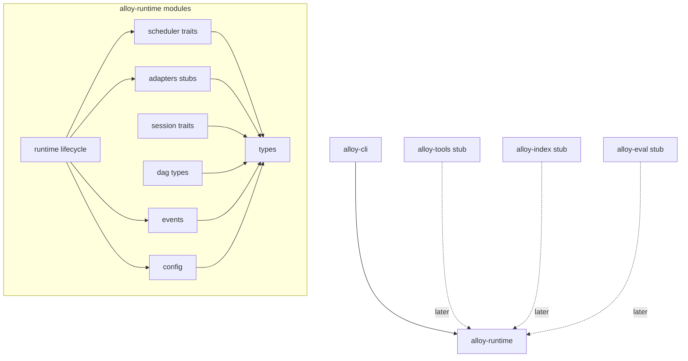
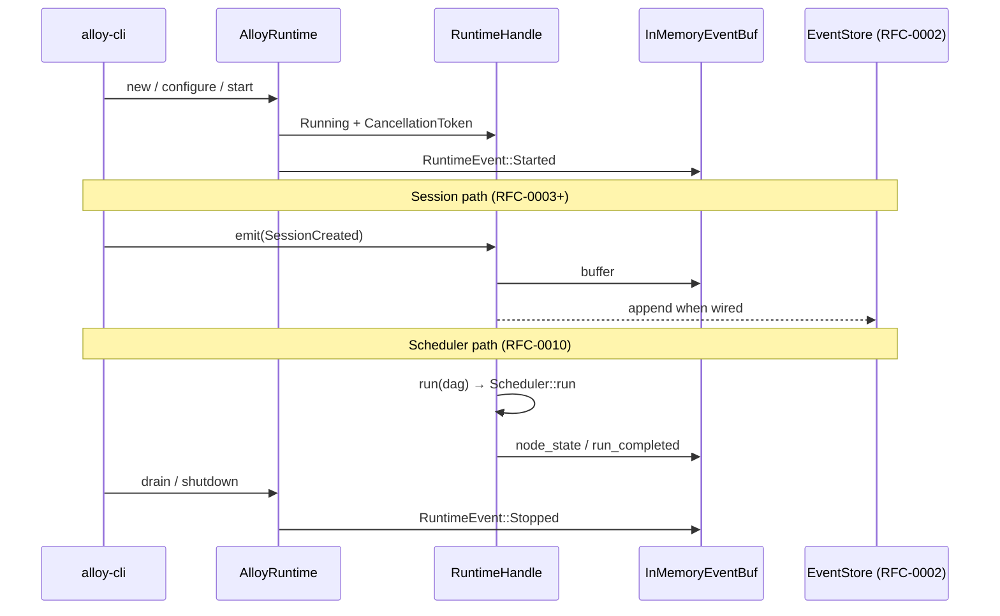

# RFC-0001: Alloy Runtime

| Field | Value |
| --- | --- |
| **Status** | Ready for Implementation |
| **Author** | arkadianet |
| **Architecture** | Alloy Architecture V2 (**frozen**) — do not redesign |
| **Depends on** | — |
| **Effort** | 5–8 person-days |
| **Related RFCs** | [0003](./RFC-0003-session-manager-run-controller.md) Session/RunController · [0009](./RFC-0009-task-dag-templates-planner.md) Task DAG · [0010](./RFC-0010-scheduler-runtime-adapters.md) Scheduler (plugs into Runtime host) |
| **Supersedes** | `RFC-0001-workspace-skeleton-core-types.md` (workspace + core types absorbed here) |
| **Product** | Alloy — AI Engineering Runtime |

**Mental model (V2):** `Runtime → Scheduler → Capability Workers`. Models are implementations behind `ModelRouter`, not the product center.

---

## Purpose

Define and ship the **Alloy Runtime** host: the single in-process execution kernel that owns process lifecycle, shared IR, configuration load, subsystem wiring, and the adapter surfaces that Session, Scheduler, and Capability Workers plug into.

Day-1 deliverable for a developer:

1. Five-crate Cargo workspace (`alloy-cli`, `alloy-runtime`, `alloy-tools`, `alloy-index`, `alloy-eval`).
2. Shared core types every downstream RFC imports from `alloy-runtime`.
3. `AlloyRuntime` construct/configure/start/run/drain/shutdown with stub Scheduler + Session facades.
4. Installable `alloy` binary stub (`--help` / `--version`).

This RFC is the **foundation of the critical path**. It does **not** implement the linear DAG scheduler (RFC-0010), Session persistence (RFC-0002/0003), or workers (RFC-0013). It publishes stable traits and types so those RFCs compile and wire in without rewriting the host.

---

## Responsibilities

| Owns (this RFC) | Does not own (later RFC) |
| --- | --- |
| Workspace layout ≤5 crates (V2 §5.4) | SQLite event/artifact store → **0002** |
| Shared IDs, budgets, Diagnostic/Failure IR, Grant shapes | SessionService / RunController behavior → **0003** |
| `AlloyRuntime` host lifecycle + config load | Observability writers → **0004** |
| Trait stubs / injection points for Scheduler, Session, adapters | Sandbox / MCP → **0005–0006** |
| `example.env`, profile/router skeleton files | Model router impl → **0007** |
| Binary stub in `alloy-cli` | EditEngine → **0008** |
| Module map mirroring V2 component names | TaskDag persistence / templates → **0009** |
| Core event type enum + emit helpers (in-memory until 0002) | Scheduler ready-queue / runtime adapters → **0010** |
| | ProjectGraph / Context / Caps / CLI UX / Eval → **0011–0016** |

**Runtime ↔ Scheduler boundary (precise):**

- **Runtime** = process host + shared types + wiring + lifecycle + cancellation token + event emit surface.
- **Scheduler** (RFC-0010) = ready-queue executor over a `TaskDag`; implements `Scheduler` and registers via `RuntimeHandle::set_scheduler`.
- **Runtime adapters** (VerifyCompile / VerifyTest / GateHuman) are **defined as traits here**, implemented in RFC-0010 (and MCP wiring in 0006). MVP Runtime ships **no-op / `Unavailable` stubs** so the host compiles.

---

## Non-goals

- Redesigning Architecture V2 or introducing new pillars/components.
- Implementing DAG execution, retries, or GateHuman unblock logic (RFC-0010).
- Implementing Session resume / budget enforcement beyond type shapes (RFC-0003).
- Multi-process daemon (`alloyd`), ACP, OverlayFS, Postgres, OTel crate split.
- Parallel cargo/edits; file leases; Hint-edge scheduling; LLM planner.
- Sixth public crate for types (types live in `alloy-runtime`; re-export as needed).
- Touching or creating the user’s `.env` (document `example.env` only).
- Discussing alternative architectures.

---

## Public Rust interfaces

All public items live in crate `alloy-runtime` unless noted. Marked **MVP** = implement now; **Stub** = trait + empty/Unavailable impl compiling today.

### Core IDs & value types — MVP

Absorbed from former workspace-skeleton RFC; serde-stable; match V2 §§5.5, 9–14, Appendices D–E.

```rust
// alloy-runtime/src/types/ids.rs  — MVP
use serde::{Deserialize, Serialize};
use uuid::Uuid;

macro_rules! id_newtype {
    ($name:ident) => {
        #[derive(Debug, Clone, Copy, PartialEq, Eq, Hash, Serialize, Deserialize)]
        pub struct $name(pub Uuid);

        impl $name {
            pub fn new() -> Self { Self(Uuid::new_v4()) }
        }
    };
}

id_newtype!(SessionId);
id_newtype!(RunId);
id_newtype!(DagId);
id_newtype!(NodeId);
id_newtype!(GateId);
id_newtype!(ArtifactId);
id_newtype!(CapabilityId);
id_newtype!(ProviderId);
id_newtype!(LanguageId);
id_newtype!(ProfileId);
id_newtype!(TransactionId);
id_newtype!(CheckpointId);
id_newtype!(GraphNodeId);
id_newtype!(DiagnosticId);

#[derive(Debug, Clone, PartialEq, Eq, Hash, Serialize, Deserialize)]
pub struct GraphVersion(pub u64);

#[derive(Debug, Clone, PartialEq, Eq, Hash, Serialize, Deserialize)]
pub struct Digest(pub String); // hex sha256

#[derive(Debug, Clone, Copy, PartialEq, Eq, PartialOrd, Ord, Serialize, Deserialize)]
pub struct EventSeq(pub u64);

#[derive(Debug, Clone, Serialize, Deserialize)]
pub struct Timestamp(pub time::OffsetDateTime);
```

### Budgets, session create, goals — MVP

```rust
// alloy-runtime/src/types/budget.rs  — MVP
#[derive(Debug, Clone, Serialize, Deserialize)]
pub struct BudgetPolicy {
    pub max_usd_per_run: f64,
    pub max_tokens_per_run: u64,
    pub max_parallel_nodes: u32,   // MVP: 1
    pub max_parallel_cargo: u32,   // MVP: 1
    pub max_parallel_edits: u32,   // MVP: 1
}

#[derive(Debug, Clone, Serialize, Deserialize)]
pub struct TokenBudget {
    pub max_input: u64,
    pub max_output: u64,
}

#[derive(Debug, Clone, Serialize, Deserialize)]
pub struct BudgetSnapshot {
    pub usd_spent: f64,
    pub tokens_in: u64,
    pub tokens_out: u64,
}

#[derive(Debug, Clone, Copy, PartialEq, Eq, Serialize, Deserialize)]
pub enum ModelTier { Premium, Standard, Economy, Local }

#[derive(Debug, Clone, Serialize, Deserialize)]
pub struct CreateSession {
    pub workspace_root: std::path::PathBuf,
    pub profile: ProfileId,              // default | autonomous | readonly
    pub budget: BudgetPolicy,
    pub language_backends: Vec<LanguageId>, // MVP: ["rust"]
}

#[derive(Debug, Clone, Serialize, Deserialize)]
pub struct Goal {
    pub text: String,
    pub constraints: Vec<Constraint>,
    pub attachments: Vec<ArtifactId>,
}

#[derive(Debug, Clone, Serialize, Deserialize)]
pub enum Constraint {
    MaxUsd(f64),
    RequireCargoCheck,
    DenyRawBash,
    Custom(String),
}
```

### Diagnostic / Failure IR — MVP

```rust
// alloy-runtime/src/types/diagnostic.rs  — MVP (V2 Appendix D)
#[derive(Debug, Clone, Serialize, Deserialize)]
pub enum DiagnosticLevel { Error, Warning, Note, Help }

#[derive(Debug, Clone, Serialize, Deserialize)]
pub struct SpanRef {
    pub path: String,
    pub start_line: u32,
    pub start_col: u32,
    pub end_line: u32,
    pub end_col: u32,
}

#[derive(Debug, Clone, Serialize, Deserialize)]
pub struct DiagnosticEvent {
    pub id: DiagnosticId,
    pub code: Option<String>,
    pub level: DiagnosticLevel,
    pub message: String,
    pub spans: Vec<SpanRef>,
    pub children: Vec<DiagnosticEvent>,
    pub package: Option<String>,
    pub fingerprint: Digest,
    pub raw_json: Option<serde_json::Value>,
}

#[derive(Debug, Clone, Serialize, Deserialize)]
pub enum ErrorClass {
    Compile,
    Test,
    Tool,
    Model,
    Budget,
    Approval,
    Internal,
    Timeout,
    Cancelled,
}

#[derive(Debug, Clone, Serialize, Deserialize)]
pub struct FailureIr {
    pub node: NodeId,
    pub error_class: ErrorClass,
    pub diagnostics: Vec<DiagnosticEvent>,
    pub notes: String,
}
```

### Permissions — MVP (shapes only; authorizer later)

```rust
// alloy-runtime/src/types/permission.rs  — MVP shapes (V2 Appendix E)
#[derive(Debug, Clone, Serialize, Deserialize)]
pub struct Glob(pub String);

#[derive(Debug, Clone, Serialize, Deserialize)]
pub struct ExecAllow { pub binary: String, pub args_glob: Option<String> }

#[derive(Debug, Clone, Serialize, Deserialize)]
pub struct HostAllow { pub host: String }

#[derive(Debug, Clone, Serialize, Deserialize)]
pub enum Grant {
    FsRead(Glob),
    FsWrite(Glob),
    Exec(ExecAllow),
    Network(HostAllow),
    GitWrite,
}

#[derive(Debug, Clone, Serialize, Deserialize)]
pub struct PermissionToken {
    pub profile: ProfileId,
    pub grants: Vec<Grant>,
    pub expires: Option<Timestamp>,
    pub run_id: RunId,
}
```

### Session event types — MVP (enum + helpers; persistence → 0002)

```rust
// alloy-runtime/src/events/mod.rs  — MVP enum; store in 0002
#[derive(Debug, Clone, Copy, PartialEq, Eq, Serialize, Deserialize)]
#[serde(rename_all = "snake_case")]
pub enum SessionEventType {
    SessionCreated,
    GoalSubmitted,
    PlanProduced,
    NodeState,
    Decision,
    ModelCall,
    ToolCall,
    EditApplied,
    ApprovalRequested,
    ApprovalResolved,
    BudgetWarning,
    ReplanRequested,
    RunCompleted,
    Error,
}
// Host lifecycle uses RuntimeEvent (separate channel) — see Event lifecycle.

/// Appendix A payload envelope used by EventStore (RFC-0002).
#[derive(Debug, Clone, Serialize, Deserialize)]
pub struct SessionEvent {
    pub seq: EventSeq,
    pub ts: Timestamp,
    pub session_id: SessionId,
    pub run_id: Option<RunId>,
    #[serde(rename = "type")]
    pub type_: SessionEventType,
    pub payload: serde_json::Value,
}

#[derive(Debug, Clone, Serialize, Deserialize)]
pub struct NewSessionEvent {
    pub session_id: SessionId,
    pub run_id: Option<RunId>,
    pub type_: SessionEventType,
    pub payload: serde_json::Value,
}
```

### Runtime host — MVP

```rust
// alloy-runtime/src/runtime/mod.rs
use async_trait::async_trait;
use tokio::sync::CancellationToken;
use std::sync::Arc;

#[derive(Debug, Clone)]
pub struct RuntimeConfig {
    pub data_dir: std::path::PathBuf,       // .alloy/ or XDG
    pub profile_path: std::path::PathBuf,   // profiles/default.toml
    pub router_path: std::path::PathBuf,    // router.toml
    pub env_file_hint: std::path::PathBuf,  // example.env path for docs/errors only
    pub retain_full_prompts: bool,          // default false
    pub retain_tool_bodies: bool,           // default false
    pub run_timeout: std::time::Duration,
}

impl RuntimeConfig {
    /// Load TOML + read process env. Never writes `.env`.
    pub fn load(paths: ConfigPaths) -> Result<Self, RuntimeError> { /* MVP */ }
}

#[derive(Debug, Clone, Copy, PartialEq, Eq)]
pub enum RuntimePhase {
    Created,
    Configured,
    Starting,
    Running,
    Draining,
    Stopped,
    Failed,
}

/// Process-wide handle injected into Session / Scheduler / workers.
#[derive(Clone)]
pub struct RuntimeHandle {
    inner: Arc<RuntimeInner>,
}

impl RuntimeHandle {
    pub fn phase(&self) -> RuntimePhase { /* … */ }
    pub fn cancellation(&self) -> CancellationToken { /* … */ }
    pub fn config(&self) -> &RuntimeConfig { /* … */ }

    /// Inject Scheduler once RFC-0010 impl exists. MVP accepts `NullScheduler`.
    pub fn set_scheduler(&self, sched: Arc<dyn Scheduler>) { /* … */ }

    /// Emit a host-level RuntimeEvent (and, when EventStore wired, session events).
    pub async fn emit(&self, ev: RuntimeEvent) -> Result<(), RuntimeError> { /* … */ }
}

pub struct AlloyRuntime {
    handle: RuntimeHandle,
}

impl AlloyRuntime {
    /// Phase: Created
    pub fn new() -> Self { /* … */ }

    /// Phase: Created → Configured
    pub fn configure(&mut self, cfg: RuntimeConfig) -> Result<&mut Self, RuntimeError> { /* … */ }

    /// Phase: Configured → Starting → Running
    /// Spawns internal tasks; does not block on a user goal.
    pub async fn start(&mut self) -> Result<RuntimeHandle, RuntimeError> { /* … */ }

    /// Drive one run if Scheduler is registered; else return `SchedulerUnavailable`.
    /// CLI / Session call this after `submit_goal` (RFC-0003).
    pub async fn run(&self, dag_id: DagId) -> Result<DagOutcome, RuntimeError> { /* … */ }

    /// Phase: Running → Draining — stop accepting work; wait in-flight ≤ grace.
    pub async fn drain(&self, grace: std::time::Duration) -> Result<(), RuntimeError> { /* … */ }

    /// Phase: Draining → Stopped — cancel token; join tasks; flush logs.
    pub async fn shutdown(self) -> Result<(), RuntimeError> { /* … */ }
}
```

### Scheduler host surface — Stub trait (impl in RFC-0010)

```rust
// alloy-runtime/src/scheduler/traits.rs  — Stub (API frozen)
#[async_trait]
pub trait Scheduler: Send + Sync {
    async fn run(&self, dag_id: DagId) -> Result<DagOutcome, SchedError>;
    async fn cancel(&self, dag_id: DagId) -> Result<(), SchedError>;
}

#[derive(Debug, Clone, Serialize, Deserialize)]
pub struct DagOutcome {
    pub dag_id: DagId,
    pub generation: u64,
    pub state: DagState,
    pub failed_node: Option<NodeId>,
    pub failure: Option<FailureIr>,
}

#[derive(Debug, Clone, Copy, PartialEq, Eq, Serialize, Deserialize)]
pub enum DagState {
    Pending,
    Running,
    WaitingApproval,
    Succeeded,
    Failed,
    Cancelled,
    ReplanRequired,
}

/// MVP stub registered by `AlloyRuntime::start` until RFC-0010.
pub struct NullScheduler;

#[async_trait]
impl Scheduler for NullScheduler {
    async fn run(&self, _dag_id: DagId) -> Result<DagOutcome, SchedError> {
        Err(SchedError::Unavailable)
    }
    async fn cancel(&self, _dag_id: DagId) -> Result<(), SchedError> {
        Ok(())
    }
}
```

### Runtime adapters — Stub traits (impl in RFC-0010 + 0006)

```rust
// alloy-runtime/src/adapters/mod.rs  — Stub traits (V2 §10.4)
#[async_trait]
pub trait VerifyCompileAdapter: Send + Sync {
    async fn check(&self, ctx: &NodeExecContext) -> Result<VerifyOutcome, AdapterError>;
}

#[async_trait]
pub trait VerifyTestAdapter: Send + Sync {
    async fn test(&self, ctx: &NodeExecContext) -> Result<VerifyOutcome, AdapterError>;
}

#[async_trait]
pub trait GateHumanAdapter: Send + Sync {
    /// Emit WaitingApproval; resume when RunController::approve fires.
    async fn wait_approval(&self, ctx: &NodeExecContext, gate: GateId) -> Result<Approval, AdapterError>;
}

#[derive(Debug, Clone, Serialize, Deserialize)]
pub struct NodeExecContext {
    pub session_id: SessionId,
    pub run_id: RunId,
    pub dag_id: DagId,
    pub node_id: NodeId,
    pub workspace_root: std::path::PathBuf,
    pub cancellation: CancellationToken,
}

#[derive(Debug, Clone, Serialize, Deserialize)]
pub struct VerifyOutcome {
    pub ok: bool,
    pub diagnostics: Vec<DiagnosticEvent>,
    pub raw_artifact: Option<ArtifactId>,
}

#[derive(Debug, Clone, Copy, PartialEq, Eq, Serialize, Deserialize)]
pub enum Approval { Allow, Deny, AllowOnce }
```

### Session / RunController trait re-exports — Stub signatures (behavior → 0003)

Published here so crate graph and docs share one source. Full MVP impl is RFC-0003.

```rust
// alloy-runtime/src/session/traits.rs  — Stub signatures (V2 §5.5)
#[async_trait]
pub trait SessionService: Send + Sync {
    async fn create(&self, req: CreateSession) -> Result<SessionId, SessionError>;
    async fn resume(&self, id: SessionId) -> Result<Session, SessionError>;
    async fn submit_goal(&self, id: SessionId, goal: Goal) -> Result<RunId, SessionError>;
    async fn events(&self, id: SessionId, after: EventSeq) -> Result<Vec<SessionEvent>, SessionError>;
}

#[async_trait]
pub trait RunController: Send + Sync {
    async fn start(&self, run: RunId) -> Result<(), RunError>;
    async fn cancel(&self, run: RunId) -> Result<(), RunError>;
    async fn approve(&self, run: RunId, gate: GateId, decision: Approval) -> Result<(), RunError>;
    async fn request_replan(&self, run: RunId, reason: ReplanReason) -> Result<(), RunError>;
}

#[derive(Debug, Clone, Serialize, Deserialize)]
pub struct Session {
    pub id: SessionId,
    pub workspace_root: std::path::PathBuf,
    pub profile: ProfileId,
    pub budget: BudgetPolicy,
    pub language_backends: Vec<LanguageId>,
    pub created_at: Timestamp,
}

#[derive(Debug, Clone, Serialize, Deserialize)]
pub enum ReplanReason {
    FailureIr(FailureIr),
    UserRequested,
    BudgetPolicy,
    Other(String),
}
```

### DAG type sketches — Stub (full store → 0009)

```rust
// alloy-runtime/src/dag/types.rs  — Stub types for compile; persistence in 0009
#[derive(Debug, Clone, Serialize, Deserialize)]
pub struct TaskDag {
    pub id: DagId,
    pub session_id: SessionId,
    pub generation: u64,
    pub nodes: std::collections::BTreeMap<NodeId, TaskNode>,
    pub edges: Vec<DependencyEdge>,
    pub state: DagState,
}

#[derive(Debug, Clone, Serialize, Deserialize)]
pub struct TaskNode {
    pub id: NodeId,
    pub kind: NodeKind,
    pub capability: Option<CapabilityId>,
    pub input_ref: ArtifactId,
    pub output_ref: Option<ArtifactId>,
    pub state: NodeState,
    pub retry: RetryPolicy,
    pub cache_key: Option<CacheKey>,
    pub budget: TokenBudget,
    pub model_tier: ModelTier,
    pub approval: Option<ApprovalSpec>,
    pub timeout: std::time::Duration,
}

#[derive(Debug, Clone, Copy, PartialEq, Eq, Serialize, Deserialize)]
pub enum NodeKind {
    Plan, Analyze, Edit, VerifyCompile, VerifyTest, Review, GateHuman, Aggregate,
}

#[derive(Debug, Clone, Copy, PartialEq, Eq, Serialize, Deserialize)]
pub enum NodeState {
    Pending, Ready, Running, Succeeded, Failed, Skipped,
    Cancelled, WaitingApproval, CachedHit,
}

#[derive(Debug, Clone, Copy, PartialEq, Eq, Serialize, Deserialize)]
pub enum EdgeKind { Data, Sequence, Hint }

#[derive(Debug, Clone, Serialize, Deserialize)]
pub struct DependencyEdge {
    pub from: NodeId,
    pub to: NodeId,
    pub kind: EdgeKind,
}

#[derive(Debug, Clone, Serialize, Deserialize)]
pub struct RetryPolicy {
    pub max_attempts: u32,
    pub backoff: Backoff,
    pub retry_on: Vec<ErrorClass>,
    pub escalate_after: Option<u32>,
    pub escalate_to_tier: Option<ModelTier>,
}

#[derive(Debug, Clone, Serialize, Deserialize)]
pub enum Backoff { Fixed(std::time::Duration), Exponential { base: std::time::Duration, factor: f64 } }

#[derive(Debug, Clone, Serialize, Deserialize)]
pub struct CacheKey(pub Digest);

#[derive(Debug, Clone, Serialize, Deserialize)]
pub struct ApprovalSpec {
    pub gate: GateId,
    pub reason: String,
}
```

### Metrics shapes — MVP (writers → 0004)

```rust
// alloy-runtime/src/types/metrics.rs  — MVP
#[derive(Debug, Clone, Serialize, Deserialize)]
pub struct WorkerMetrics {
    pub model_tier_used: ModelTier,
    pub provider_id: ProviderId,
    pub input_tokens: u64,
    pub output_tokens: u64,
    pub tool_calls: u32,
    pub cache_hits: u32,
    pub duration_ms: u64,
    pub confidence: f32,
    pub error_class: Option<ErrorClass>,
}

#[derive(Debug, Clone, Default, Serialize, Deserialize)]
pub struct RuntimeMetrics {
    pub phase_transitions: u64,
    pub runs_started: u64,
    pub runs_completed: u64,
    pub runs_failed: u64,
    pub shutdowns: u64,
}
```

### Crate root re-exports — MVP

```rust
// alloy-runtime/src/lib.rs
pub mod types;
pub mod events;
pub mod runtime;
pub mod scheduler;
pub mod adapters;
pub mod session;
pub mod dag;
pub mod config;
pub mod error;

pub use types::*;
pub use runtime::{AlloyRuntime, RuntimeConfig, RuntimeHandle, RuntimePhase, RuntimeEvent};
pub use scheduler::{Scheduler, NullScheduler, DagOutcome, DagState};
pub use session::{SessionService, RunController, Session, Approval, ReplanReason};
```

---

## Internal modules

```text
crates/alloy-runtime/
  src/
    lib.rs
    types/
      mod.rs          # re-exports
      ids.rs           # SessionId, RunId, …
      budget.rs        # BudgetPolicy, ModelTier, CreateSession, Goal
      diagnostic.rs    # DiagnosticEvent, FailureIr, ErrorClass
      permission.rs    # Grant, PermissionToken
      metrics.rs       # WorkerMetrics, RuntimeMetrics
    events/
      mod.rs           # SessionEventType, SessionEvent, NewSessionEvent
      emit.rs          # in-memory ring until EventStore (0002)
    config/
      mod.rs           # ConfigPaths, load TOML + env
      profile.rs       # parse profiles/default.toml subset
    runtime/
      mod.rs           # AlloyRuntime, RuntimeHandle, phases
      lifecycle.rs     # start / drain / shutdown
      handle.rs        # CancellationToken, scheduler slot
    scheduler/
      traits.rs        # Scheduler trait
      null.rs          # NullScheduler
    adapters/
      mod.rs           # Verify*/GateHuman traits + Unavailable stubs
    session/
      traits.rs        # SessionService, RunController signatures
    dag/
      types.rs         # TaskDag sketches (serde tests)
    error.rs           # RuntimeError, SchedError, …
    logging.rs         # tracing subscriber init helper

crates/alloy-cli/      # binary: --help / --version; constructs AlloyRuntime
crates/alloy-tools/    # empty lib stub
crates/alloy-index/    # empty lib stub
crates/alloy-eval/     # empty lib stub
```

| Module | Responsibility |
| --- | --- |
| `types` | Shared IR; only source of IDs/budgets/IR for other crates |
| `events` | Appendix A enum + in-memory emit until 0002 |
| `config` | TOML + env load; never writes `.env` |
| `runtime` | Host lifecycle, handle, cancellation |
| `scheduler` | Trait + `NullScheduler` |
| `adapters` | Runtime-node adapter traits + stubs |
| `session` | Trait signatures only (impl 0003) |
| `dag` | Type sketches (store 0009) |
| `logging` | `tracing` init from config |

### Workspace tree — MVP

```text
alloy/
  Cargo.toml                 # workspace members
  CODEOWNERS                 # arkadianet; required before substantive merges
  example.env
  router.toml.example
  profiles/default.toml
  crates/
    alloy-cli/
    alloy-runtime/
    alloy-tools/
    alloy-index/
    alloy-eval/
```

### Module dependency diagram



---

## Event lifecycle

Runtime emits two channels:

1. **`RuntimeEvent`** — host lifecycle (always available day 1; in-memory).
2. **`SessionEvent`** — V2 Appendix A (enum + helpers day 1; durable append via RFC-0002 `EventStore`).

Until 0002, `RuntimeHandle::emit` records `RuntimeEvent` and optionally mirrors eligible session-typed events into an in-memory `Vec` for tests. After 0002, the same emit path appends through `EventStore`.



```rust
// Host-only events (not Appendix A)
#[derive(Debug, Clone, Serialize, Deserialize)]
pub enum RuntimeEvent {
    Configured { data_dir: String },
    Started,
    SchedulerRegistered,
    RunAccepted { run_id: RunId, dag_id: DagId },
    RunFinished { run_id: RunId, outcome: DagOutcome },
    DrainStarted { grace_ms: u64 },
    Stopped,
    Failed { error: String },
}
```

Session event `type` strings must match Appendix A exactly when persisted (`session_created`, `goal_submitted`, …). Runtime does not invent alternate session event names.

---

## Runtime lifecycle

```mermaid
stateDiagram-v2
  [*] --> Created: AlloyRuntime::new
  Created --> Configured: configure(ok)
  Created --> Failed: configure(err)
  Configured --> Starting: start
  Starting --> Running: subsystems up
  Starting --> Failed: start(err)
  Running --> Draining: drain(grace)
  Running --> Failed: fatal
  Draining --> Stopped: shutdown
  Draining --> Stopped: grace elapsed + cancel
  Failed --> Stopped: shutdown best-effort
  Stopped --> [*]
```

| Transition | Action |
| --- | --- |
| `new` | Allocate handle; phase `Created`; no I/O |
| `configure` | Parse profile/router TOML; resolve `data_dir`; validate paths; **read** env for keys named in config; never write `.env` |
| `start` | Init `tracing`; create `data_dir` if missing; install `NullScheduler` (or injected); emit `Started`; phase `Running` |
| `run` | Forward to `Scheduler::run`; reject if not `Running` or draining |
| `drain` | Phase `Draining`; stop accepting `run`; wait in-flight ≤ grace |
| `shutdown` | Cancel token; join tasks; flush tracing; phase `Stopped`; consume `self` |

SIGINT/SIGTERM (CLI): call `drain` then `shutdown`. Double-shutdown is a no-op error `AlreadyStopped`.

---

## Error handling

```rust
#[derive(Debug, thiserror::Error)]
pub enum RuntimeError {
    #[error("invalid phase {current:?} for operation {op}")]
    InvalidPhase { current: RuntimePhase, op: &'static str },
    #[error("config: {0}")]
    Config(String),
    #[error("scheduler unavailable")]
    SchedulerUnavailable,
    #[error("scheduler: {0}")]
    Scheduler(#[from] SchedError),
    #[error("io: {0}")]
    Io(#[from] std::io::Error),
    #[error("already stopped")]
    AlreadyStopped,
    #[error("internal: {0}")]
    Internal(String),
}

#[derive(Debug, thiserror::Error)]
pub enum SchedError {
    #[error("unavailable")]
    Unavailable,
    #[error("cancelled")]
    Cancelled,
    #[error("dag not found: {0:?}")]
    DagNotFound(DagId),
    #[error("other: {0}")]
    Other(String),
}
```

| Failure | Handling |
| --- | --- |
| Bad TOML / missing profile | `RuntimeError::Config`; refuse `start` |
| Missing API key in env | Config warning at load; hard fail deferred to provider call (0007) |
| `run` with `NullScheduler` | `SchedulerUnavailable` (expected until 0010) |
| Panic in subsystem task | Catch via `JoinHandle`; emit `RuntimeEvent::Failed`; enter `Failed` |
| Drain timeout | Cancel token; best-effort join; still reach `Stopped` |
| Budget / approval | Typed on Session/Scheduler RFCs; Runtime only forwards |

### Failure modes summary

| Mode | Symptom | Mitigation |
| --- | --- | --- |
| Crate sprawl | Sixth crate PR | Reject; types stay in `alloy-runtime` |
| Host does too much | Scheduler logic in Runtime | Keep only traits + `NullScheduler` |
| Silent `.env` write | Secrets clobbered | Config loader never opens `.env` for write; tests assert |
| Phase skip | `run` before `start` | `InvalidPhase` |
| Hung shutdown | Task ignores cancel | Grace then abort join; log orphan |

---

## Configuration

**Rules:** Load from TOML + process environment. Document keys in `example.env`. **Never create or overwrite `.env`.**

### `example.env`

```bash
# example.env — copy to your own .env manually; Alloy never writes .env
# Author: arkadianet

# Provider key name referenced by router.toml api_key_env
ALLOY_API_KEY=

# Optional overrides
# ALLOY_DATA_DIR=
# ALLOY_PROFILE=profiles/default.toml
# ALLOY_ROUTER=router.toml
# RUST_LOG=alloy_runtime=info,alloy_cli=info
```

### `profiles/default.toml` (skeleton; full wiring RFC-0015)

```toml
# profiles/default.toml — Author: arkadianet
[profile]
id = "default"
description = "Correctness-first Rust profile"

[budgets]
max_usd_per_run = 5.0
max_tokens_per_run = 2_000_000
max_parallel_nodes = 1
max_parallel_cargo = 1
max_parallel_edits = 1

[observability]
retain_full_prompts = false
retain_tool_bodies = false
```

### `router.toml.example` (placeholder; RFC-0007)

```toml
# router.toml.example — Author: arkadianet
[provider.default]
kind = "openai_compatible"
base_url = "https://api.example.com/v1"
api_key_env = "ALLOY_API_KEY"

[tiers]
repair = "standard"
edit = "standard"
review = "economy"
```

### Load sketch

```rust
pub struct ConfigPaths {
    pub profile: PathBuf,
    pub router: PathBuf,
    pub example_env: PathBuf, // for error messages only
    pub data_dir: Option<PathBuf>,
}

// RuntimeConfig::load:
// 1. read profile TOML
// 2. read router TOML (may be incomplete until 0007)
// 3. std::env::var for keys named in router — do not parse/write .env files
// 4. resolve data_dir = ALLOY_DATA_DIR || workspace/.alloy || XDG
```

---

## Thread model

| Concern | Choice |
| --- | --- |
| Process | Single OS process (`alloy` binary) |
| Worker threads | Tokio multi-thread runtime (CLI builds `tokio::runtime::Builder::new_multi_thread`) |
| Shared state | `Arc<RuntimeInner>` + interior `tokio::sync` primitives |
| Blocking I/O | `spawn_blocking` for sync FS/SQLite when 0002 lands; none required day 1 beyond config read |
| CPU | No dedicated thread pool beyond Tokio; Scheduler linear MVP needs no fan-out |
| FFI / signal | `tokio::signal` in `alloy-cli` only |

Do not spawn unmanaged `std::thread` for control-plane work.

---

## Async model

Per V2 control APIs: all host traits are `async` + `Send + Sync` via `async_trait` (or RPITIT if workspace MSRV allows—pick one and stick to it for MVP).

| Assumption | Detail |
| --- | --- |
| Runtime | Tokio 1.x multi-thread |
| Attributes | `#[tokio::main]` on `alloy-cli`; library crates are runtime-agnostic except tests |
| Cancellation | `tokio_util::sync::CancellationToken` (or tokio `CancellationToken` if available) cloned onto `NodeExecContext` |
| Time | `tokio::time` for grace / timeouts |
| Channels | `tokio::sync::mpsc` for optional event subscribers; not required for MVP buffer |
| No async drop | `shutdown` is explicit `async fn`; document that dropping `AlloyRuntime` without shutdown logs a warning |

---

## Shutdown

```mermaid
sequenceDiagram
  participant OS as SIGINT/SIGTERM
  participant CLI as alloy-cli
  participant RT as AlloyRuntime
  participant SCH as Scheduler
  participant H as Handle/Cancel

  OS->>CLI: signal
  CLI->>RT: drain(grace=10s)
  RT->>H: phase=Draining
  RT->>SCH: cancel(active dag) if any
  alt in-flight finishes in grace
    RT->>RT: join ok
  else grace elapsed
    H->>H: cancellation.cancel()
    RT->>RT: abort stragglers
  end
  CLI->>RT: shutdown
  RT->>RT: flush tracing / metrics
  RT-->>CLI: Stopped
```



Ordered steps:

1. Enter `Draining` (reject new `run`).
2. `Scheduler::cancel` on active DAG (no-op for `NullScheduler`).
3. Wait ≤ grace for tasks.
4. Fire cancellation token.
5. Join / abort remaining.
6. Emit `Stopped`; flush logs; drop handle.

---

## Logging

| Item | Spec |
| --- | --- |
| Facade | `tracing` |
| Subscriber | `tracing-subscriber` fmt + env filter (`RUST_LOG`) |
| Init | Once in `AlloyRuntime::start` (or CLI if tests need early init) |
| Default level | `info` for `alloy_runtime`, `alloy_cli` |
| Secrets | Never log API keys / `.env` contents; redact `Authorization` |
| Decision bodies | Default off (`retain_full_prompts=false`) — full prompt logging is RFC-0004 |

Spans: `runtime.configure`, `runtime.start`, `runtime.run`, `runtime.drain`, `runtime.shutdown`.

---

## Metrics

Day 1: in-process `RuntimeMetrics` counters on `RuntimeHandle` (atomics). No OTLP exporter.

| Metric | When |
| --- | --- |
| `phase_transitions` | each successful phase change |
| `runs_started` / `runs_completed` / `runs_failed` | `run` path |
| `shutdowns` | successful `shutdown` |

`WorkerMetrics` / `CostMeter` types are published for RFC-0004/0007; Runtime does not bill tokens itself.

---

## Tests

| Test | Crate | Asserts |
| --- | --- | --- |
| Workspace compiles | workspace | `cargo check --workspace` |
| Serde round-trip | `alloy-runtime` | `CreateSession`, `DiagnosticEvent`, `FailureIr`, `Grant`, `TaskDag` sketch, `SessionEventType` |
| Lifecycle happy path | `alloy-runtime` | `new → configure → start → drain → shutdown` |
| Invalid phase | `alloy-runtime` | `run` before `start` → `InvalidPhase` |
| NullScheduler | `alloy-runtime` | `run` → `SchedulerUnavailable` |
| Cancel on shutdown | `alloy-runtime` | token cancelled after `shutdown` |
| Config never writes `.env` | `alloy-runtime` | temp dir: load leaves no `.env` created |
| Binary smoke | `alloy-cli` | `--help`, `--version` exit 0 |
| Clippy | workspace | no warnings on public types |

---

## Acceptance criteria

- [ ] Five crates exist and `cargo build --workspace` succeeds
- [ ] `alloy-runtime` publishes all core IDs, budgets, Diagnostic/Failure IR, Grant/PermissionToken, SessionEventType matching V2
- [ ] `AlloyRuntime` implements create → configure → start → run → drain → shutdown state machine
- [ ] `Scheduler`, `SessionService`, `RunController`, Verify*/GateHuman adapter **traits** compile; `NullScheduler` registered by default
- [ ] `run` with stub scheduler returns `SchedulerUnavailable` (defined, not panic)
- [ ] `alloy --help` and `alloy --version` work via `alloy-cli`
- [ ] `example.env`, `profiles/default.toml`, `router.toml.example` present; **`.env` never written**
- [ ] Module map mirrors V2 component names under `alloy-runtime`
- [ ] CODEOWNERS present (arkadianet) before substantive merges
- [ ] Serde round-trip tests green for core IR
- [ ] No behavioral Session/Scheduler/MCP/Edit beyond stubs
- [ ] Downstream RFCs can `use alloy_runtime::{SessionId, CreateSession, Scheduler, …}` without a sixth crate
- [ ] Former RFC-0001 skeleton acceptance criteria absorbed and checked above

---

## Open questions

Implementability only (architecture frozen):

1. **MSRV / async_trait:** Pin Tokio + edition in workspace `Cargo.toml` on day 1—confirm whether RPITIT replaces `async_trait` or keep `async_trait` for all public traits through M1.
2. **XDG vs `.alloy/`:** Prefer workspace-local `.alloy/` when `workspace_root` is set; else XDG `data_dir`. Exact precedence string for errors—document in `RuntimeConfig::load`.
3. **Event mirror:** Should in-memory session events before RFC-0002 share the same `seq` allocator as the future SQLite store (yes recommended) so tests stay stable?
4. **Binary crate name:** Package `alloy-cli` with `[[bin]] name = "alloy"`—confirm no name collision on crates.io for later publish (local path ok for MVP).

---

## MVP vs deferred (V2 alignment)

| Item | MVP (this RFC) | Deferred |
| --- | --- | --- |
| Crates | ≤5, single binary | Further splits under compile pressure |
| Scheduler | Trait + `NullScheduler` | Linear ready-queue → **0010** |
| Session | Trait signatures | Impl → **0003** (+ store **0002**) |
| Adapters | Traits + Unavailable | Verify/Test/Gate → **0010** + MCP **0006** |
| Parallelism | Types default to 1 | Raise after eval |
| Daemon / ACP | Absent | Research backlog |
| Types crate | Inside `alloy-runtime` | Split only if forced |

**Developer builds first:** workspace + `alloy-runtime` core types + `AlloyRuntime` lifecycle with `NullScheduler`, then `alloy-cli` `--help`/`--version`.
