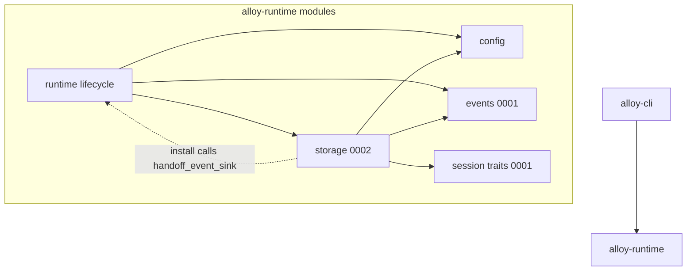
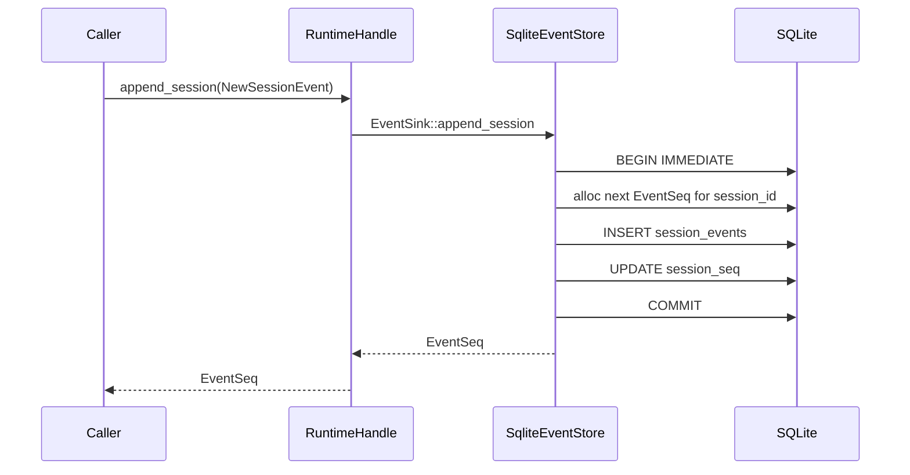
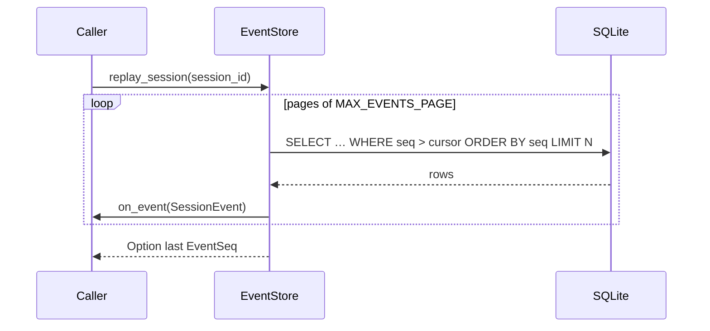
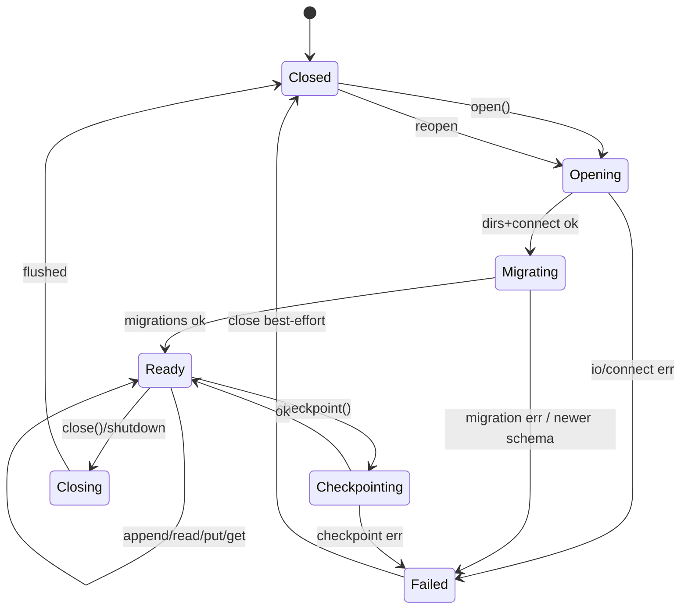
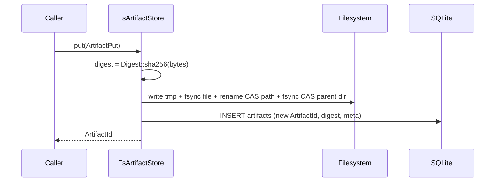

# RFC-0002: Storage, Artifacts & Session Event Log

| Field | Value |
| --- | --- |
| **Status** | Ready for Implementation (architecture review APPROVE) |
| **Author** | arkadianet |
| **Architecture** | Alloy Architecture V2 (**frozen**) — do not redesign |
| **Depends on** | [RFC-0001](./RFC-0001-alloy-runtime.md) (merged) |
| **Effort** | 4–7 person-days |
| **Related RFCs** | [0003](./RFC-0003-session-manager-run-controller.md) Session/RunController (consumes store) · [0004](./RFC-0004-observability-cost-metering.md) decision writers · [0009](./RFC-0009-task-dag-templates-planner.md) DAG rows · [0011](./RFC-0011-project-graph.md) graph path / SQLite patterns |
| **Product** | Alloy — AI Engineering Runtime |
| **Supersedes** | Draft stub of this filename (expanded to implementation grade) |

**Mental model (V2):** Explicit state — if it isn’t in the session event log (or DAG store), it didn’t happen. This RFC ships the durable data plane behind RFC-0001’s `EventSink` / session event types.

---

## 1. Overview

### Purpose

Ship the MVP **data plane** inside `alloy-runtime`:

1. SQLite-backed **session event log** (V2 Appendix A) implementing `EventSink`.
2. **Artifact store** (content-addressed blobs + SQLite metadata index).
3. **Storage lifecycle** under `RuntimeConfig.data_dir` (open → migrate → append/read → checkpoint → shutdown → reopen/recover).
4. **Replay** and durable **recovery** of session events after process restart.
5. Atomic **handoff** from `InMemoryEventSink` via `RuntimeHandle::handoff_event_sink` (additive) without changing public RFC-0001 `EventSink` / `set_event_sink` signatures.

Day-1 developer deliverable: open a temp `data_dir`, append Appendix A events through the host sink, restart (or reopen), page/replay the same per-session `EventSeq` stream, put/get an artifact by `ArtifactId` / digest — without writing the user’s `.env`.

### Problem

RFC-0001 publishes `SessionEvent` / `NewSessionEvent` / `EventSink` / `InMemoryEventSink` and installs the in-memory sink by default. Persistence, artifact blobs, migrations, and crash recovery are explicitly deferred here. Without this RFC, Session resume (0003), decision-log defaults (0004), DAG persistence (0009), and ProjectGraph storage roots (0011) have no durable substrate.

### Scope

| In scope | Detail |
| --- | --- |
| SQLite session DB | Schema for sessions, runs (thin), session_events, artifacts, schema_migrations; reserved additive columns/tables for DAG blobs (0009) and `GraphVersion` refs (0011) |
| `EventSink` SQLite impl | `append_runtime` + `append_session` with per-session gapless `EventSeq` |
| Event read / replay APIs | Exclusive cursor pagination matching `SessionService::events` semantics |
| Artifact Store | Put/get/meta; disk CAS under `artifacts/`; integrity via `Digest` |
| Lifecycle | Open, migrate, checkpoint (WAL/fsync), close, reopen, recover |
| Handoff | Lossless drain of `InMemoryEventSink` into SQLite before/during sink swap |
| Config | Keys in `example.env` + profile observability flags already on `RuntimeConfig`; never write `.env` |
| Observability | `tracing` spans + in-process storage counters |

### Non-goals

- `SessionService` / `RunController` orchestration, budgets enforcement, goal submit → **RFC-0003**.
- Rich decision writers / cost metering / OTLP → **RFC-0004** (this RFC stores whatever envelopes callers append; default payload *shape* guidance only).
- Task DAG node/edge store behavior → **RFC-0009** (schema may reserve `dag_blobs` rows; no scheduler APIs here).
- ProjectGraph tables / rebuild → **RFC-0011** (reserve `.alloy/graph/` path; no graph ingest).
- Postgres, OverlayFS / alloy snapshot bundles, alloyd, ACP (V2 deferred).
- Git checkpoints for edits (EditEngine / V2 §6.3 — git only; not this store’s “checkpoint”).
- Redesigning V2, alternate backends for MVP, new crates, or new system concepts.
- Changing RFC-0001 public trait signatures (`EventSink`, `SessionEvent`, `RuntimeHandle::emit` / `append_session` / `set_event_sink`).

---

## 2. Architecture Integration

### Relationship to Architecture V2

| V2 reference | Application |
| --- | --- |
| §3.3 Explicit state | Session events + artifact refs are the durable truth for logged work |
| §5.1 DataPlane `SQLite` | Single-process SQLite under `data_dir` |
| §5.2 Artifact Store | Blobs + digests; no secrets |
| §5.4 ≤5 crates | Storage lives in `alloy-runtime` module; no `alloy-storage` crate |
| §15 Observability defaults | Metadata + content hashes by default; bodies opt-in via existing flags |
| Appendix A | Wire `type` enum and envelope fields |
| §21.2 | SQLite remains MVP; Postgres deferred |
| §19 W2 | Session event log (SQLite); decision metadata defaults |

### Relationship to RFC-0001

RFC-0001 is **authoritative** for:

- `SessionEvent`, `NewSessionEvent`, `SessionEventType`, `RuntimeEvent`
- `EventSink`, `EventSinkError`, `InMemoryEventSink` (per-session `EventSeq` from 0, gapless)
- `RuntimeHandle::emit`, `append_session`, `set_event_sink`, `memory_sink`
- `Session` record shape; `SessionService::events` exclusive cursor + `MAX_EVENTS_PAGE`
- `RuntimeConfig.data_dir` / `ConfigPaths` precedence; `Digest` / `ArtifactId`
- Phase-guard matrix for sink swap (`Configured` | `Running`)

This RFC **implements** durable backends behind those contracts. It does **not** fork a second event channel.

### Already implemented by RFC-0001 | Added by RFC-0002 | Deferred beyond MVP

| Item | Owner |
| --- | --- |
| Core IDs, `Digest`, `EventSeq`, `Timestamp` | **0001** |
| `SessionEvent` / `NewSessionEvent` / `SessionEventType` / `RuntimeEvent` | **0001** |
| `EventSink` trait + `InMemoryEventSink` + host emit/append/set_event_sink | **0001** |
| `Session` struct + `SessionService::events` signature + `MAX_EVENTS_PAGE` | **0001** |
| `RuntimeConfig.data_dir` creation on `start` | **0001** |
| SQLite `SqliteEventStore` implementing `EventSink` + `EventStore` | **0002** |
| `EventStore` read/replay/pagination trait | **0002** |
| `ArtifactStore` trait + filesystem CAS + SQLite index | **0002** |
| Schema migrations, WAL, checkpoint, reopen/recover | **0002** |
| Atomic handoff installer from `InMemoryEventSink` → SQLite | **0002** |
| Thin `sessions` / `runs` row persistence helpers (for 0003) | **0002** |
| Reserved `dag_blobs` table / graph path layout | **0002** (schema/path only) |
| SessionService / RunController behavior | **0003** (deferred) |
| Decision/cost writer APIs | **0004** (deferred) |
| Full DAG store CRUD | **0009** (deferred) |
| ProjectGraph SQLite | **0011** (deferred) |
| Postgres / OverlayFS / OTel crate | V2 deferred |

### Components reused

- Types and events from `alloy_runtime::{…}` (crate root re-exports).
- `RuntimeHandle::set_event_sink` / `handoff_event_sink` + `memory_sink()` for install/handoff.
- `RuntimeConfig::retain_full_prompts` / `retain_tool_bodies` as retention policy inputs for artifact/event body helpers (writers in 0004; store must not invent full-body retention by default).

### Stubs extended / replaced

| Stub / default | Replacement |
| --- | --- |
| Default `InMemoryEventSink` after `start` | Remains default; **installer** opens SQLite and installs via `handoff_event_sink` (not bare `set_event_sink`) |
| Day-1 `set_event_sink` refusal when memory buffer non-empty | Remains: bare `set_event_sink` is **empty-buffer / already-durable swaps only**; non-empty lossless path is **only** `handoff_event_sink` |
| No artifact APIs | New `ArtifactStore` trait + `FsArtifactStore` |

`InMemoryEventSink` stays available for unit tests and as the pre-handoff buffer; it is not deleted.

### Dependency boundaries

```text
alloy-cli ──► alloy-runtime
                 ├── events (0001) ◄── storage::sqlite EventSink impl (0002)
                 ├── runtime handle (0001) ◄── storage::install handoff (0002)
                 └── storage (0002) ──► rusqlite / tokio spawn_blocking
alloy-tools / alloy-index / alloy-eval — no dependency on storage internals yet
```

No new workspace crate. No new OS service. SQLite is in-process only.

---

## 3. Public Rust API

All new public items live in `alloy-runtime` (edition 2021, Tokio 1.x, `async_trait` on public traits through M1 — same pins as RFC-0001). Prefer traits for backends.

**Do not break** existing public signatures. Extend via new modules/traits and crate-root re-exports.

### 3.1 Errors

```rust
// alloy-runtime/src/storage/error.rs
#[derive(Debug, thiserror::Error)]
pub enum StoreError {
    #[error("not found: {0}")]
    NotFound(String),
    #[error("conflict: {0}")]
    Conflict(String),
    #[error("corrupt: {0}")]
    Corrupt(String),
    #[error("migration: {0}")]
    Migration(String),
    #[error("busy")]
    Busy,
    #[error("io: {0}")]
    Io(String),
    #[error("integrity: digest mismatch")]
    DigestMismatch,
    #[error("closed")]
    Closed,
    #[error("internal: {0}")]
    Internal(String),
}

impl From<StoreError> for EventSinkError {
    fn from(e: StoreError) -> Self {
        match e {
            StoreError::Busy => EventSinkError::Busy,
            StoreError::Io(s) => EventSinkError::Io(s),
            // Conflict / Corrupt / Migration / NotFound / Closed are not expected on the
            // happy-path EventSink append surface; map to Internal (not Io) so callers
            // do not treat integrity/schema bugs as transient disk errors.
            StoreError::Conflict(s)
            | StoreError::Corrupt(s)
            | StoreError::Migration(s)
            | StoreError::NotFound(s)
            | StoreError::Internal(s) => EventSinkError::Internal(s),
            StoreError::DigestMismatch => EventSinkError::Internal("digest mismatch".into()),
            StoreError::Closed => EventSinkError::Internal("store closed".into()),
        }
    }
}
```

Map `StoreError` → `SessionError` only at SessionService boundaries (RFC-0003); this RFC may provide `fn store_to_session(e: StoreError) -> SessionError` helper but must not change `SessionError` variants without 0003 coordination — use `SessionError::Internal` / `Invalid` / `NotFound` via helpers if needed.

### 3.2 Storage layout & open options

```rust
// alloy-runtime/src/storage/paths.rs
/// Canonical layout under `RuntimeConfig.data_dir`.
pub struct StorageLayout {
    pub root: PathBuf,                 // data_dir
    pub db_path: PathBuf,              // data_dir/alloy.sqlite
    pub artifacts_dir: PathBuf,        // data_dir/artifacts
    pub graph_dir: PathBuf,            // data_dir/graph  (reserved; 0011)
    pub wal_sidecar_hint: PathBuf,     // informational; SQLite manages -wal/-shm
}

impl StorageLayout {
    pub fn from_data_dir(data_dir: impl Into<PathBuf>) -> Self { /* … */ }
    pub fn ensure_dirs(&self) -> Result<(), StoreError> { /* create root, artifacts, graph */ }
}

/// Maps `ALLOY_SQLITE_SYNCHRONOUS` / `PRAGMA synchronous`.
#[derive(Debug, Clone, Copy, PartialEq, Eq, Default)]
pub enum SqliteSynchronous {
    Off,
    #[default]
    Normal,
    Full,
    Extra,
}

impl SqliteSynchronous {
    pub fn parse(s: &str) -> Result<Self, StoreError> { /* OFF|NORMAL|FULL|EXTRA; else config error */ }
    pub fn as_pragma(self) -> &'static str { /* "OFF"|"NORMAL"|"FULL"|"EXTRA" */ }
}

#[derive(Debug, Clone)]
pub struct StorageOpenOptions {
    pub layout: StorageLayout,
    /// Default: true (WAL).
    pub wal: bool,
    /// Busy timeout milliseconds (default 5000).
    pub busy_timeout_ms: u32,
    /// Default: `SqliteSynchronous::Normal` (same as `ALLOY_SQLITE_SYNCHRONOUS=NORMAL`).
    /// Applied at open via `PRAGMA synchronous`; checkpoint uses the same connection setting.
    pub synchronous: SqliteSynchronous,
    /// When true, refuse open if DB exists with unknown future schema_version.
    pub refuse_newer_schema: bool, // default true
}
```

### 3.3 Persistence handle (lifecycle façade)

```rust
// alloy-runtime/src/storage/mod.rs
/// Opened durable store: event log + artifacts + thin session/run rows.
pub struct AlloyStorage {
    // private: Arc<SqlitePool/Conn>, layout, metrics, closed flag
}

impl AlloyStorage {
    /// open → migrate → ready. Creates dirs + DB if missing.
    pub async fn open(opts: StorageOpenOptions) -> Result<Self, StoreError>;

    /// Current schema version after migrate.
    pub fn schema_version(&self) -> u32;

    pub fn layout(&self) -> &StorageLayout;

    /// Shared event store (also implements EventSink).
    pub fn events(&self) -> Arc<SqliteEventStore>;

    /// Artifact store handle.
    pub fn artifacts(&self) -> Arc<FsArtifactStore>;

    /// Thin session/run row API (for RFC-0003; no orchestration).
    pub fn sessions(&self) -> Arc<SqliteSessionRows>;

    /// Force WAL checkpoint + fsync policy (see §6). Uses connection `synchronous` from open.
    pub async fn checkpoint(&self) -> Result<(), StoreError>;

    /// In-process counter snapshot (§13). Cheap atomics read; safe while store is open.
    pub fn metrics(&self) -> StorageMetricsSnapshot;

    /// Flush + close connections. Idempotent barrier under shared ownership (`Arc<AlloyStorage>`).
    /// After the first successful close, further ops return `StoreError::Closed`; extra `close` calls are no-ops (`Ok(())`).
    pub async fn close(&self) -> Result<(), StoreError>;
}
```

### 3.4 Event log / EventSink

```rust
// alloy-runtime/src/storage/events.rs
#[async_trait]
pub trait EventStore: EventSink {
    /// Exclusive cursor page — same semantics as SessionService::events.
    /// `after: None` → from EventSeq(0); `after: Some(s)` → seq > s.
    /// Impls MUST clamp via `clamp_events_page_limit(limit)`.
    async fn list_session_events(
        &self,
        session: SessionId,
        after: Option<EventSeq>,
        limit: usize,
    ) -> Result<Vec<SessionEvent>, StoreError>;

    /// Replay all events for a session in seq order (internal pages).
    /// Returns `None` if the session has no events; otherwise `Some(last_seq)`.
    /// Callback `Err` aborts replay and propagates (no skip). Empty session: zero callbacks.
    async fn replay_session<F>(
        &self,
        session: SessionId,
        mut on_event: F,
    ) -> Result<Option<EventSeq>, StoreError>
    where
        F: FnMut(&SessionEvent) -> Result<(), StoreError> + Send;

    /// Highest assigned seq for session, or None if no events.
    async fn last_seq(&self, session: SessionId) -> Result<Option<EventSeq>, StoreError>;

    /// List runtime (host) events in append order (for recovery/tests).
    async fn list_runtime_events(&self, after_rowid: Option<i64>, limit: usize)
        -> Result<Vec<(i64, RuntimeEvent)>, StoreError>;

    /// Import a handoff snapshot with **exact** `seq` / `ts` (no re-allocation, no `Timestamp::now`).
    /// Single DB transaction that MUST include post-import seq verification (or equivalent
    /// cleanup on verify failure before commit visibility). Used only by atomic handoff (§3.7).
    async fn import_handoff_snapshot(&self, snap: HandoffSnapshot) -> Result<(), StoreError>;
}

/// SQLite-backed sink + store. Implements EventSink + EventStore.
pub struct SqliteEventStore { /* … */ }

#[async_trait]
impl EventSink for SqliteEventStore {
    async fn append_runtime(&self, ev: RuntimeEvent) -> Result<(), EventSinkError>;
    async fn append_session(&self, ev: NewSessionEvent) -> Result<EventSeq, EventSinkError>;
}

#[async_trait]
impl EventStore for SqliteEventStore { /* … */ }
```

**Seq contract (normative, unchanged from 0001):**

- Per-`SessionId` monotonic gapless `EventSeq` starting at `0`.
- Interleaved sessions never share a counter.
- `append_session` assigns `seq` and stamps `ts = Timestamp::now()` (same as `InMemoryEventSink`).
- Wire `type` via existing `SessionEventType` serde (`snake_case` Appendix A names).

### 3.5 Artifact store

```rust
// alloy-runtime/src/storage/artifacts.rs
#[derive(Debug, Clone, Serialize, Deserialize)]
#[serde(rename_all = "snake_case")]
pub enum ArtifactKind {
    Blob,
    Patch,
    Log,
    PromptPack,
    Decision,
    Other(String),
}

#[derive(Debug, Clone, Serialize, Deserialize)]
pub struct ArtifactMeta {
    pub kind: ArtifactKind,
    pub content_type: Option<String>,
    pub byte_len: u64,
    pub digest: Digest,
    pub created_at: Timestamp,
    pub session_id: Option<SessionId>,
    pub run_id: Option<RunId>,
    /// Free-form non-secret metadata (hashes, labels). No raw secrets.
    pub labels: serde_json::Map<String, serde_json::Value>,
}

#[derive(Debug, Clone)]
pub struct ArtifactBlob {
    pub id: ArtifactId,
    pub meta: ArtifactMeta,
    pub bytes: Vec<u8>,
}

#[derive(Debug, Clone)]
pub struct ArtifactPut {
    pub bytes: Vec<u8>,
    pub kind: ArtifactKind,
    pub content_type: Option<String>,
    pub session_id: Option<SessionId>,
    pub run_id: Option<RunId>,
    pub labels: serde_json::Map<String, serde_json::Value>,
}

#[async_trait]
pub trait ArtifactStore: Send + Sync {
    async fn put(&self, req: ArtifactPut) -> Result<ArtifactId, StoreError>;
    async fn get(&self, id: ArtifactId) -> Result<ArtifactBlob, StoreError>;
    async fn meta(&self, id: ArtifactId) -> Result<ArtifactMeta, StoreError>;
    async fn get_by_digest(&self, digest: &Digest) -> Result<Option<ArtifactId>, StoreError>;
    /// Soft-delete / unlink per retention policy; MVP may no-op body delete if still referenced.
    async fn delete(&self, id: ArtifactId) -> Result<(), StoreError>;
}

pub struct FsArtifactStore { /* sqlite index + artifacts_dir CAS */ }
```

**Integrity:** `put` computes `Digest::sha256(bytes)`, writes blob to CAS path by digest, then inserts index row with new `ArtifactId`. **MVP (pinned):** dedupe blob file on disk; always allocate a **new** `ArtifactId` metadata row referencing the same digest path (session attribution). `get_by_digest` returns the **oldest non-deleted** row for that digest (`ORDER BY created_at ASC, id ASC LIMIT 1`), or `None` if none.

### 3.6 Thin session/run rows (persistence helpers)

```rust
// alloy-runtime/src/storage/sessions.rs
#[async_trait]
pub trait SessionRows: Send + Sync {
    async fn upsert_session(&self, session: &Session) -> Result<(), StoreError>;
    async fn get_session(&self, id: SessionId) -> Result<Option<Session>, StoreError>;

    async fn upsert_run(&self, row: &RunRow) -> Result<(), StoreError>;
    async fn get_run(&self, id: RunId) -> Result<Option<RunRow>, StoreError>;
    async fn list_runs(&self, session: SessionId) -> Result<Vec<RunRow>, StoreError>;
}

#[derive(Debug, Clone, Serialize, Deserialize)]
pub struct RunRow {
    pub id: RunId,
    pub session_id: SessionId,
    pub goal_json: serde_json::Value,
    pub state: String, // opaque to 0002; 0003 owns vocabulary
    pub created_at: Timestamp,
    pub updated_at: Timestamp,
}

pub struct SqliteSessionRows { /* … */ }
```

RFC-0003 owns when to call these; RFC-0002 only persists rows.

### 3.7 Installer / handoff (wires into RuntimeHandle)

```rust
// alloy-runtime/src/storage/install.rs
/// Open storage under handle.config().data_dir, migrate, atomic handoff, install SQLite sink.
pub async fn install_sqlite_event_sink(
    handle: &RuntimeHandle,
    opts: Option<StorageOpenOptions>,
) -> Result<Arc<AlloyStorage>, RuntimeError>;
```

**Settled host seam (normative — closes former Open Question 1):**

| Piece | Ownership | Notes |
| --- | --- | --- |
| `InMemoryEventSink::drain_for_handoff` | `events` (0001 additive helper) | Takes buffered runtime + session events + `next_seq`; leaves memory sink empty |
| `SqliteEventStore::import_handoff_snapshot` | `storage::events` | Inserts exact `seq`/`ts`; sets `session_seq` from snapshot; **one transaction including seq verify** (rollback on mismatch) |
| `RuntimeHandle::handoff_event_sink` | `runtime` (0002 **additive** method; does **not** change `EventSink` or `set_event_sink` signature) | Holds sink **write** lock for drain → import+verify → Arc swap |
| `set_event_sink` | unchanged 0001 | Still refuses non-empty memory buffer; **empty-buffer / already-durable swaps only** |
| `install_sqlite_event_sink` | `storage::install` | `open` → `handoff_event_sink(sqlite)` |

Public `EventSink` trait signatures remain unchanged. Dual-write is forbidden.

```rust
pub struct HandoffSnapshot {
    pub runtime: Vec<RuntimeEvent>,
    pub sessions: HashMap<SessionId, Vec<SessionEvent>>,
    /// Per-session next seq after drain (same maps `InMemoryEventSink` used).
    pub next_seq: HashMap<SessionId, u64>,
}

impl InMemoryEventSink {
    /// Take buffered state for lossless SQLite handoff (leaves sink empty).
    pub fn drain_for_handoff(&self) -> HandoffSnapshot { /* … */ }

    /// Restore a snapshot after failed import (handoff abort). Overwrites current buffers.
    pub fn restore_handoff_snapshot(&self, snap: HandoffSnapshot) { /* … */ }
}

impl RuntimeHandle {
    /// Atomic lossless handoff from the default `InMemoryEventSink` to `sink`.
    /// Phase: `Configured` | `Running` only. Does not change `EventSink` trait.
    ///
    /// Under the sink write lock (no concurrent `emit` / `append_session`):
    /// 1. `flush_pending_runtime_events` equivalent into current memory sink (already done
    ///    before lock / re-flush under lock if pending queue non-empty).
    /// 2. If current sink is not the process `memory_sink`, behave like `set_event_sink`
    ///    (swap only; no drain).
    /// 3. If memory buffer empty: `*guard = sink` and return.
    /// 4. Else: `snap = memory_sink.drain_for_handoff()`; then **one DB transaction** that
    ///    imports the snapshot **and** verifies each session `last_seq` matches
    ///    `next_seq[session]-1` when `next_seq>0` **before commit**. On verify failure,
    ///    roll back the transaction (no durable residue). Equivalent: if verify must run
    ///    after a committed import, delete/cleanup the imported rows in the same failure
    ///    path **before** restoring the memory snapshot.
    /// 5. Only after durable import+verify success: `*guard = sink`.
    /// On import/`verify` failure: durable state rolled back (or cleaned); restore snapshot
    /// into memory sink (re-buffer); keep memory as active sink; return error — never leave
    /// a half-imported durable store as the live sink or as orphaned handoff residue.
    pub async fn handoff_event_sink<F, Fut>(
        &self,
        sink: Arc<dyn EventSink>,
        import: F,
    ) -> Result<(), RuntimeError>
    where
        F: FnOnce(HandoffSnapshot) -> Fut + Send,
        Fut: std::future::Future<Output = Result<(), StoreError>> + Send;
}
```

**Handoff algorithm (normative — single path, no alternate MVP):**

1. Require phase `Configured` or `Running`.
2. Resolve `StorageOpenOptions` from `handle.config()?.data_dir` (or `opts`).
3. `AlloyStorage::open` (migrate). On open failure, return error; memory sink unchanged.
4. `handle.handoff_event_sink(storage.events(), |snap| storage.events().import_handoff_snapshot(snap))` — import+verify in one transaction (or cleanup durable residue on verify fail before memory restore).
5. After success, further `emit` / `append_session` go only to SQLite.
6. Do **not** call bare `set_event_sink` for non-empty memory handoff (race / refusal). Empty-buffer installs may use either `handoff_event_sink` or `set_event_sink`.

Losslessness is mandatory (RFC-0001). No silent seq renumbering. `import_handoff_snapshot` must not call `Timestamp::now()` or allocate new `EventSeq` values.

**Module note:** `storage::install` calls `RuntimeHandle` (same crate). Lifecycle still defaults to `InMemoryEventSink` on `start`; install is opt-in. This is an intentional install seam, not a Scheduler/MCP expansion.

### 3.8 Crate root re-exports (additive)

```rust
// lib.rs — add (keep existing re-exports)
pub mod storage;

pub use storage::{
    AlloyStorage, ArtifactBlob, ArtifactKind, ArtifactMeta, ArtifactPut, ArtifactStore,
    EventStore, FsArtifactStore, HandoffSnapshot, RunRow, SessionRows, SqliteEventStore,
    SqliteSessionRows, SqliteSynchronous, StorageLayout, StorageMetricsSnapshot,
    StorageOpenOptions, StoreError, install_sqlite_event_sink,
};
// RuntimeHandle::handoff_event_sink is additive on the existing handle type (not a re-export).
```

---

## 4. Internal Module Design

### Crate / module ownership (≤5 crates; single binary)

```text
crates/alloy-runtime/src/storage/
  mod.rs           # AlloyStorage, re-exports
  error.rs         # StoreError
  paths.rs         # StorageLayout
  open.rs          # open + connection setup (WAL, busy_timeout)
  migrate.rs       # versioned SQL migrations
  events.rs        # SqliteEventStore : EventSink + EventStore
  artifacts.rs     # FsArtifactStore
  sessions.rs      # SqliteSessionRows
  install.rs       # install_sqlite_event_sink + handoff
  checkpoint.rs    # WAL checkpoint helpers
  metrics.rs       # StorageMetrics atomics
```

| Module | Responsibility |
| --- | --- |
| `storage::open` | Connection, PRAGMAs, layout ensure |
| `storage::migrate` | Ordered migrations; refuse unknown newer |
| `storage::events` | Append/list/replay; seq allocator |
| `storage::artifacts` | CAS write/read + index |
| `storage::sessions` | Thin session/run rows |
| `storage::install` | RuntimeHandle wiring |
| `storage::checkpoint` | Durability flush |

### Dependency direction



- `storage` depends on `events`, `types`, `config`, `session::{Session, MAX_EVENTS_PAGE, clamp_…}`.
- `RuntimeHandle::handoff_event_sink` lives next to `set_event_sink` (runtime module) and is the **only** reverse edge used by `storage::install` (dashed). No Scheduler/MCP/DAG behavior.
- `runtime` / CLI may call `install_sqlite_event_sink`; **default `start` still installs `InMemoryEventSink`** (0001). Opt-in after `start` or in `Configured`.
- No dependency from `storage` → `scheduler` / `adapters` / `dag` beyond types already in IR.

### Workspace dependencies (additive)

Add to workspace / `alloy-runtime`:

- `rusqlite` with `bundled` (MVP: no system SQLite requirement)
- Optional `tokio` already present — use `spawn_blocking` for rusqlite calls

Do not add Postgres drivers.

---

## 5. Session Event Log

### Event model

Reuse RFC-0001 envelopes exactly:

| Field | Source |
| --- | --- |
| `seq` | Assigned by store; `EventSeq` |
| `ts` | `Timestamp::now()` on append (or preserved on handoff) |
| `session_id` | `SessionId` |
| `run_id` | `Option<RunId>` |
| `type` | `SessionEventType` → Appendix A snake_case |
| `payload` | `serde_json::Value` |

Host channel: `RuntimeEvent` stored in `runtime_events` (not Appendix A).

### Envelope & IDs

- Session/run IDs: UUID newtypes from 0001.
- Event identity for paging: `(session_id, seq)` primary.
- Runtime events: monotonic `rowid` for list cursor (process-local durability, not Appendix A).

### Ordering

- Session events: total order by `seq` ascending per session.
- Append is atomic: seq allocation + insert in one transaction.
- Never leave gaps after a successful append. Failed append must not consume seq (rollback).

### Append

1. `session_id` required on `NewSessionEvent`. **Payload:** store persists any `serde_json::Value` (Appendix A writers SHOULD emit a JSON object; store does not reject non-objects — writer responsibility in 0003/0004).
2. Begin immediate transaction.
3. Read `session_seq.next_seq` (or max+1) for session; insert event; update next_seq.
4. Commit.
5. Return `EventSeq`.

On UNIQUE conflict → `StoreError::Conflict` → `EventSinkError::Internal` (should be unreachable if allocator is correct). Failed append must not consume seq (rollback).

### Exclusive cursor & pagination

Match `SessionService::events`:

| `after` | Behavior |
| --- | --- |
| `None` | Return events with `seq >= 0` (i.e. from first), up to `limit` |
| `Some(s)` | Return events with `seq > s` |

`limit` clamped with `clamp_events_page_limit` (`1..=MAX_EVENTS_PAGE`).

### Replay

**Pinned signature:** `replay_session` → `Result<Option<EventSeq>, StoreError>` (`None` if no events).

- Walks pages internally until exhausted; invokes callback in seq order.
- Empty session: succeeds, zero callbacks, returns `None`.
- Callback `Err`: abort immediately; propagate; do not skip remaining events.
- Undecodable row: `StoreError::Corrupt` (do not skip).

### Recovery

On reopen:

1. Migrate if needed.
2. Rebuild in-memory seq allocator from `session_seq` table (authoritative); cross-check `MAX(seq)+1` consistency — mismatch → `Corrupt`, refuse Ready.
3. Callers (0003) load `Session` rows and `list_session_events` / replay to reconstruct views.
4. Orphan artifact blobs (file without index) → log warn; do not delete in MVP.
5. Index row without blob → `StoreError::Corrupt` / `NotFound` on `get`.
6. Crash mid-append: SQLite rollback ⇒ no gap, seq not advanced.
7. Crash after commit, before process exit: events durable; reopen lists them bit-identical (same seq, ts, type, payload JSON).

### Append flow



### Replay flow



---

## 6. Persistence Lifecycle

### State machine



### Phases

| Phase | Actions |
| --- | --- |
| **open** | `ensure_dirs`; open `alloy.sqlite`; set PRAGMA `journal_mode=WAL`, `foreign_keys=ON`, `busy_timeout`, `synchronous` from `StorageOpenOptions::synchronous`; create `schema_migrations` if missing |
| **migrate** | Apply pending migrations in order in a transaction; record version; refuse DB with `schema_version > CODE_VERSION` when `refuse_newer_schema` |
| **append/read** | Normal EventStore / ArtifactStore / SessionRows operations |
| **checkpoint** | `PRAGMA wal_checkpoint(TRUNCATE)` or `PASSIVE` + `fsync` of db file as configured (respects open-time `synchronous`); artifact puts durable via write+fsync+rename+parent-dir fsync |
| **shutdown** | Finish in-flight blocking ops; checkpoint; close connections; mark Closed |
| **reopen/recover** | open → migrate → rebuild seq maps; no automatic truncation of events |

### Durability

- Session append: commit of SQLite transaction = durable for MVP (WAL). Default `SqliteSynchronous::Normal` (`ALLOY_SQLITE_SYNCHRONOUS=NORMAL`); `OFF` voids durability AC (tests must use default `NORMAL`).
- Artifact put: write to `artifacts/tmp/<uuid>`, fsync file, atomic rename to `artifacts/sha256/<prefix>/<digest>`, **fsync the CAS parent directory** (so the rename itself is durable), then insert SQLite index in a transaction. On index failure after rename, next `put` of same digest reuses file; orphan GC deferred.
- `AlloyStorage::checkpoint` before process exit (CLI drain/shutdown path should call it when storage installed).

### Failure

| Failure | Handling |
| --- | --- |
| Disk full | `StoreError::Io`; fail closed on append/put |
| SQLITE_BUSY | Wait `busy_timeout_ms`; then `StoreError::Busy` → `EventSinkError::Busy` |
| Migration fail | Leave DB unchanged if transactional; return `Migration`; refuse Ready |
| Panic mid-append | SQLite rollback; seq not advanced |
| Large artifact / FS write fail | `StoreError::Io`; no index row; best-effort delete tmp |

### Failure modes (normative — detection / recovery / outcome)

| Class | Detection | Recovery | Outcome |
| --- | --- | --- | --- |
| **Append** (tx fail, UNIQUE, panic) | SQLite error / rollback | Seq not consumed; caller retries or hard-fails | `EventSinkError::{Io,Busy,Internal}`; no gap |
| **Artifact** (tmp fail, rename fail, digest mismatch) | FS/`DigestMismatch` on get | Orphan tmp cleaned on open; index-without-blob → NotFound/Corrupt on get | Put returns `Io`; get fails closed |
| **DB** (busy, migrate, newer schema, corrupt JSON) | PRAGMA/migrate/decode errors | Refuse Ready on migrate/newer/seq mismatch; busy waits then Busy | No silent skip of corrupt rows |
| **Resource** (disk full, permission) | OS/`Io` | Fail closed; no partial Ready | `StoreError::Io` / `RuntimeError::Io` |
| **Replay** (corrupt row, callback Err) | Decode / `on_event` Err | Abort replay; no skip | `Corrupt` / callback error |
| **Handoff** (import/verify fail) | Verify `last_seq` vs `next_seq` | Roll back / cleanup durable import; restore memory snapshot; keep memory live | Swap aborted; no dual-write; no orphaned handoff rows |

### Corruption

| Case | Handling |
| --- | --- |
| Undecodable event JSON | `Corrupt` on read; do not skip silently (surfaces gap to operator) |
| Digest mismatch on `get` | `DigestMismatch` |
| Partial migration | Detect via migrations table; refuse start until fixed |

### Migration

- Integer `schema_version` starting at `1` for this RFC.
- Migrations are ordered SQL files / `&'static str` embedded in `migrate.rs`.
- Additive only in MVP (roadmap risk: schema thrash — keep additive).
- v1 schema includes reserved `dag_blobs` empty table and `sessions.graph_version` nullable column for 0009/0011 without implementing those RFCs.

### Checkpoint meaning

**Storage checkpoint** = WAL/db durability flush. **Not** git EditEngine checkpoints (V2 ADR F-24).

---

## 7. Artifact Store

### Model

| Layer | Content |
| --- | --- |
| Disk CAS | `artifacts/sha256/ab/abcd…64hex` raw bytes |
| SQLite `artifacts` | `id`, `digest`, `kind`, `content_type`, `byte_len`, `path`, `session_id`, `run_id`, `labels_json`, `created_at`, `deleted_at` |

Secrets must never be stored as artifact bodies by Alloy defaults; callers responsible. Telemetry retention still governed by `retain_*` flags for *what* writers put.

### API

See §3.5. Public trait `ArtifactStore`; impl `FsArtifactStore`.

### Write / read

**Write path:**



**Read:** load meta by id → read file → verify digest → return `ArtifactBlob`.

### Metadata

`ArtifactMeta` as above. Default labels empty. Decision/prompt artifacts store **hashes** in labels/payload by convention when `retain_full_prompts=false` (enforced by writers in 0004; store does not strip bodies already written).

### Retention

| Policy | MVP |
| --- | --- |
| Default | Keep all artifacts for the data_dir lifetime |
| `delete` | Soft-delete (`deleted_at`); `get` returns `NotFound`; CAS file retained if other rows share digest |
| GC | Deferred (no `alloy artifacts gc` required in this RFC) |
| Full prompt bodies | Not stored by default by Alloy writers; store itself is content-agnostic |

### Integrity

- SHA-256 via existing `Digest::sha256`.
- Path must match digest hex; reject traversal (`..`) in any path API.

---

## 8. Concurrency Model

| Concern | Rule |
| --- | --- |
| Process | Single OS process (`alloy` binary) |
| Writers | One logical writer connection for seq allocation (serialized via `Mutex`/`tokio::sync::Mutex` around connection or `BEGIN IMMEDIATE`) |
| Readers | Concurrent `list_*` allowed; may share read connection pool (MVP: single conn + mutex is acceptable) |
| EventSink vs set_event_sink / handoff | Unchanged 0001 emit read-lock; `set_event_sink` and `handoff_event_sink` take write lock |
| Artifacts | Concurrent puts OK if different digests; same digest: serialize create-or-reuse file |
| Sessions | Multi-session append interleaved OK; per-session seq serialized by DB transaction |
| No unmanaged threads | SQLite via `spawn_blocking` only |

MVP does not claim multi-writer multi-process SQLite. Lock file / single-process assumption documented.

---

## 9. Async Model

| Assumption | Detail |
| --- | --- |
| Public traits | `async_trait` + `Send + Sync` |
| Blocking | All `rusqlite` and sync FS in `tokio::task::spawn_blocking` |
| Cancellation | No cancel token on `replay_session` (pinned signature). Callers cancel by dropping/aborting the await future; in-flight single append completes or rolls back. Runtime `CancellationToken` is not threaded into `EventStore` in this RFC |
| No async Drop | `AlloyStorage::close(&self)` is the explicit idempotent barrier; `Drop` warns if never closed (mirror Runtime pattern) |
| Install | `install_sqlite_event_sink` is `async` and may await `set_event_sink` |

---

## 10. Shutdown and Durability

Ordered steps when storage is installed (CLI / host integration):

1. Runtime `drain` (0001) — stop accepting new runs.
2. Stop accepting new `append_*` only after drain policy; in-flight appends finish.
3. `AlloyStorage::checkpoint`.
4. `AlloyStorage::close`.
5. Runtime `shutdown`.

If storage not installed (memory-only), 0001 behavior unchanged.

Crash mid-WAL: SQLite recovery on next open. Crash mid-artifact rename: orphan tmp cleaned on next open (best-effort delete `artifacts/tmp/*`).

---

## 11. Error Handling

| Failure | Type | Handling |
| --- | --- | --- |
| Missing session events page | empty `Vec` | Not an error |
| Unknown `ArtifactId` | `NotFound` | Caller hard-fail |
| Schema newer than code | `Migration` | Refuse open |
| Handoff seq mismatch | `Corrupt` / `Internal` | Abort swap; keep memory sink |
| `set_event_sink` timeout | `RuntimeError::EventSinkBusy` | Retry install |
| Invalid page limit `0` before clamp | clamp to 1 | Per `clamp_events_page_limit` |
| Poisoned mutex | `Internal` | Fail closed |

Do not invent alternate session event type strings. Serde must round-trip Appendix A names.

---

## 12. Configuration

**Rules:** Process environment + existing TOML. Document new keys in `example.env`. **Never create or overwrite `.env`.**

### Keys

| Key | Default | Validation |
| --- | --- | --- |
| `ALLOY_DATA_DIR` | (0001 precedence) | Non-empty path if set; storage root |
| `ALLOY_SQLITE_BUSY_TIMEOUT_MS` | `5000` | Parse `u32`; `0` allowed (no wait) |
| `ALLOY_SQLITE_SYNCHRONOUS` | `NORMAL` | `OFF` \| `NORMAL` \| `FULL` \| `EXTRA`; invalid → config error at open |
| `ALLOY_STORAGE_WAL` | `true` | `true`/`false`/`1`/`0` |
| Existing `retain_full_prompts` / `retain_tool_bodies` | `false` | From profile TOML (0001) — storage install reads via `RuntimeConfig` |

### `example.env` additions (document only)

```bash
# Storage (RFC-0002) — optional; Alloy never writes .env
# ALLOY_SQLITE_BUSY_TIMEOUT_MS=5000
# ALLOY_SQLITE_SYNCHRONOUS=NORMAL
# ALLOY_STORAGE_WAL=true
```

### Profile

No new mandatory profile keys. Observability flags already loaded by 0001.

### Validation

- `StorageOpenOptions` built from env + `RuntimeConfig.data_dir` (`busy_timeout_ms`, `wal`, `synchronous` ← `ALLOY_SQLITE_*` / `ALLOY_STORAGE_WAL`; default `synchronous = Normal`).
- Missing parent permissions → `StoreError::Io` / `RuntimeError::Io`.
- Error messages cite `env_file_hint` (`example.env`), never suggest writing `.env`.

---

## 13. Observability

### Logging (`tracing`)

| Span / event | When |
| --- | --- |
| `storage.open` | open+migrate |
| `storage.migrate` | each version applied |
| `storage.append_session` | debug; fields: session_id, seq, type |
| `storage.handoff` | info; counts drained |
| `storage.checkpoint` | info |
| `storage.artifact_put` | debug; digest, byte_len, id |
| Warn | orphan blob, drop without close, busy timeout |

Never log API keys, `.env` contents, or full prompt bodies at default levels.

### Metrics (`StorageMetrics` / `StorageMetricsSnapshot`)

```rust
// alloy-runtime/src/storage/metrics.rs
#[derive(Debug, Clone, Default)]
pub struct StorageMetricsSnapshot {
    pub events_appended: u64,
    pub runtime_events_appended: u64,
    pub events_read: u64,
    pub artifacts_put: u64,
    pub artifacts_get: u64,
    pub checkpoints: u64,
    pub handoffs: u64,
    pub busy_errors: u64,
}

impl AlloyStorage {
    /// Copy current counter values (atomics → snapshot).
    pub fn metrics(&self) -> StorageMetricsSnapshot;
}
```

| Counter | When |
| --- | --- |
| `events_appended` | successful session append |
| `runtime_events_appended` | successful runtime append |
| `events_read` | list/replay pages |
| `artifacts_put` / `artifacts_get` | success |
| `checkpoints` | checkpoint ok |
| `handoffs` | successful install handoff |
| `busy_errors` | Busy returned |

Expose via `AlloyStorage::metrics() -> StorageMetricsSnapshot` (crate-root re-export). No OTLP (0004/deferred).

---

## 14. Testing Strategy

| Class | Asserts |
| --- | --- |
| **Unit** | Seq gapless per session; interleaved A/B; page exclusive cursor; clamp limit; digest put/get; soft-delete |
| **Integration** | Temp `data_dir`: append N Appendix A types → `close` → `open` → list equal; artifact round-trip |
| **Recovery** | Kill after commit → reopen sees events; kill during tmp write → no index / cleaned tmp |
| **Migration** | Fresh DB → v1; reopen idempotent; refuse newer schema fixture |
| **Concurrency** | Parallel appends different sessions; serialized same session; no gaps |
| **Replay** | Callback order == seq order; empty session `None` |
| **Failure injection** | Readonly dir → Io; busy timeout path (lock held); digest tamper → DigestMismatch |
| **Handoff** | Fill `InMemoryEventSink`, install SQLite, verify events+seqs identical; post-swap append continues seq |
| **Config** | Open with env overrides; **never writes `.env`** (sentinel test) |
| **Contract** | `SqliteEventStore` usable as `Arc<dyn EventSink>` in `set_event_sink` |

---

## 15. MVP vs Deferred

| Item | MVP (this RFC) | Deferred (V2 / later RFC) |
| --- | --- | --- |
| Backend | **SQLite** in-process | Postgres (V2 §21.2) |
| Events | Appendix A + RuntimeEvent durable | OTLP export (0004+) |
| Artifacts | FS CAS + SQLite index | OverlayFS / snapshot bundles |
| Session/run rows | Thin upsert/get | Full SessionService (0003) |
| DAG | Reserved `dag_blobs` table | DAG CRUD (0009) |
| Graph | Reserved `graph/` dir + nullable `graph_version` | ProjectGraph (0011) |
| GC / retention jobs | Soft-delete API only | `alloy artifacts gc` |
| Multi-process SQLite | Unsupported | If alloyd ever appears |
| Default sink on `start` | Still in-memory (0001) | Optional auto-install remains CLI/policy (0015) |

Do not invent additional deferred subsystems.

---

## 16. Acceptance Criteria

Concrete checklist for merge:

- [ ] `alloy-runtime::storage` module exists; **no sixth workspace crate**
- [ ] `AlloyStorage::open` creates `data_dir/alloy.sqlite` + `artifacts/` + `graph/` under resolved `RuntimeConfig.data_dir`
- [ ] Versioned migration applies; reopen is idempotent; newer schema refused
- [ ] `SqliteEventStore` implements `EventSink` + `EventStore` with **per-session gapless** `EventSeq` from 0
- [ ] `list_session_events` matches exclusive cursor + `clamp_events_page_limit` / `MAX_EVENTS_PAGE`
- [ ] All V2 Appendix A `SessionEventType` values serde round-trip to SQLite and back
- [ ] **Deterministic replay:** after reopen, `list_session_events` / `replay_session` yield the same ordered `(seq, ts, type, payload)` stream as before close (bit-identical payload JSON)
- [ ] **Durability:** crash/kill after successful append commit → reopen sees event; crash mid-append → no gap / seq not advanced
- [ ] `RuntimeEvent` append/list durable across reopen
- [ ] `install_sqlite_event_sink` uses `handoff_event_sink` for **lossless** handoff (including non-empty buffer); post-swap appends continue gapless seq on SQLite only
- [ ] Failed handoff rolls back / cleans durable import, restores memory buffer, and does **not** leave SQLite as the live sink or orphaned handoff residue
- [ ] After handoff, further `RuntimeHandle::append_session` persists only to SQLite (no dual store divergence)
- [ ] `ArtifactStore::put` / `get` / `meta` / `get_by_digest` (oldest non-deleted); digests via `Digest::sha256`; tamper detected
- [ ] Thin `SessionRows` upsert/get for `Session` + `RunRow`
- [ ] **Shutdown:** when storage installed — drain → checkpoint → close → runtime shutdown (ordered); Drop-without-close warns
- [ ] Config keys documented in `example.env`; automated test proves **`.env` never written**
- [ ] `spawn_blocking` used for rusqlite; public traits use `async_trait`
- [ ] Unit + integration + handoff + migration + concurrency + recovery tests green
- [ ] Clippy clean on touched code; `cargo fmt` clean
- [ ] Crate root re-exports storage public API explicitly (no glob)
- [ ] Reserved DAG/graph schema/path only — no ProjectGraph/DAG orchestration behavior

## Definition of Done

Merge only when the series [Definition of Done](./README.md#definition-of-done-merge-gate) is fully met:

- [ ] Architecture compliance: **PASS**
- [ ] RFC acceptance criteria: **100% satisfied**
- [ ] Unit tests: **passing**
- [ ] Integration tests: **passing**
- [ ] Documentation: **complete**
- [ ] Public APIs: **reviewed and stable**
- [ ] Clippy: **clean**
- [ ] Formatting: **clean**
- [ ] No TODO or placeholder implementations left in this RFC’s scope (explicit **Stub** / deferred only)
- [ ] Code review: **approved**

---

## 17. Open Questions

Only genuine implementation spikes — settled V2/0001 decisions are not reopened.

1. **Single connection vs. small pool:** MVP may use one `Mutex<Connection>`; spike only if `spawn_blocking` contention fails lifecycle tests.
2. **`RunRow.state` vocabulary:** Opaque string until RFC-0003 pins an enum — do not invent a parallel state machine here.

**Settled (do not reopen):** SQLite MVP; per-session `EventSeq`; single `EventSink` slot; atomic handoff via `drain_for_handoff` + `import_handoff_snapshot` + `RuntimeHandle::handoff_event_sink` (bare `set_event_sink` still refuses non-empty memory); no Postgres; no OverlayFS; git remains EditEngine checkpoint backend; ≤5 crates; never write `.env`; `replay_session` → `Option<EventSeq>`; `get_by_digest` → oldest non-deleted row.

---

## Schema sketch (normative v1)

```sql
-- schema_version = 1
CREATE TABLE schema_migrations (
  version INTEGER PRIMARY KEY,
  applied_at TEXT NOT NULL
);

CREATE TABLE sessions (
  id TEXT PRIMARY KEY,
  workspace_root TEXT NOT NULL,
  profile TEXT NOT NULL,
  budget_json TEXT NOT NULL,
  language_backends_json TEXT NOT NULL,
  created_at TEXT NOT NULL,
  graph_version INTEGER NULL
);

CREATE TABLE runs (
  id TEXT PRIMARY KEY,
  session_id TEXT NOT NULL REFERENCES sessions(id),
  goal_json TEXT NOT NULL,
  state TEXT NOT NULL,
  created_at TEXT NOT NULL,
  updated_at TEXT NOT NULL
);

CREATE TABLE session_seq (
  session_id TEXT PRIMARY KEY,
  next_seq INTEGER NOT NULL
);

CREATE TABLE session_events (
  session_id TEXT NOT NULL,
  seq INTEGER NOT NULL,
  ts TEXT NOT NULL,
  run_id TEXT NULL,
  type TEXT NOT NULL,
  payload_json TEXT NOT NULL,
  PRIMARY KEY (session_id, seq)
);

CREATE INDEX idx_session_events_session_seq ON session_events(session_id, seq);

CREATE TABLE runtime_events (
  id INTEGER PRIMARY KEY AUTOINCREMENT,
  ts TEXT NOT NULL,
  event_json TEXT NOT NULL
);

CREATE TABLE artifacts (
  id TEXT PRIMARY KEY,
  digest TEXT NOT NULL,
  kind TEXT NOT NULL,
  content_type TEXT NULL,
  byte_len INTEGER NOT NULL,
  rel_path TEXT NOT NULL,
  session_id TEXT NULL,
  run_id TEXT NULL,
  labels_json TEXT NOT NULL,
  created_at TEXT NOT NULL,
  deleted_at TEXT NULL
);

CREATE INDEX idx_artifacts_digest ON artifacts(digest);

-- Reserved for RFC-0009 (unused by 0002 logic beyond create)
CREATE TABLE dag_blobs (
  dag_id TEXT PRIMARY KEY,
  session_id TEXT NOT NULL,
  generation INTEGER NOT NULL,
  blob_json TEXT NOT NULL,
  updated_at TEXT NOT NULL
);
```

---

## Estimated implementation effort

**4–7 person-days** (aligned with RFC index / roadmap M2 split: 0002 storage vs 0004 metering).

Suggested split: schema+open/migrate (1d) · event append/list/replay (1.5–2d) · artifacts (1d) · handoff+install (1d) · tests/recovery/concurrency (1–2d).

---

**End of RFC-0002.**

— arkadianet
