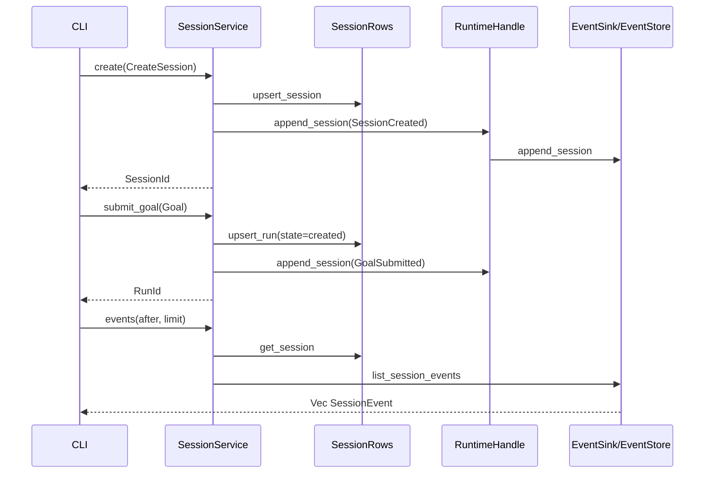
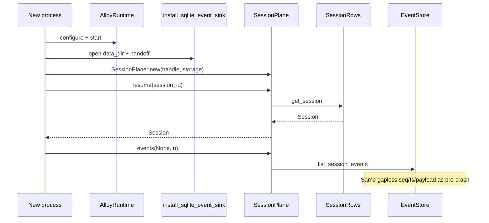
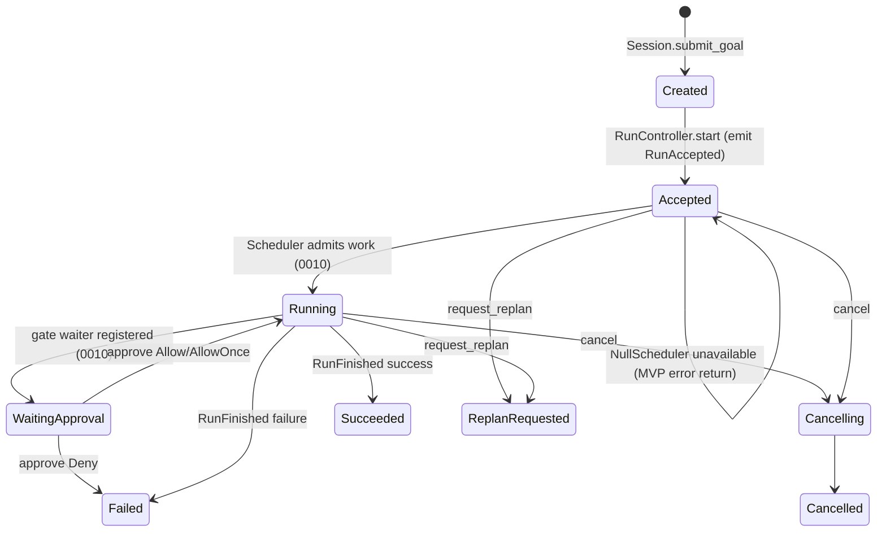

# RFC-0003: Session Manager & RunController

| Field | Value |
| --- | --- |
| **Status** | Ready for Implementation |
| **Author** | arkadianet |
| **Architecture** | Alloy Architecture V2 (**frozen**) — do not redesign |
| **Depends on** | [RFC-0001](./RFC-0001-alloy-runtime.md) (merged) · [RFC-0002](./RFC-0002-storage-artifacts-session-events.md) (merged) |
| **Effort** | 3–5 person-days |
| **Related RFCs** | [0004](./RFC-0004-observability-cost-metering.md) budget metering / decision writers · [0009](./RFC-0009-task-dag-templates-planner.md) planner / DAG store · [0010](./RFC-0010-scheduler-runtime-adapters.md) scheduler execution · [0015](./RFC-0015-cli-profiles-config.md) CLI / TTY approval UX |
| **Product** | Alloy — AI Engineering Runtime |
| **Supersedes** | Draft outline of this filename (expanded to implementation grade) |

**Mental model (V2 §5.2 / ADR F-22):** Session owns lifecycle, events, and budgets only. Run control is `RunController`. Session MUST NOT execute tools or mutate DAG topology. Explicit state — if it is not in the session event log (or durable session/run rows), it did not happen.

**Authority order (highest → lowest):** current `main` source → RFC-0002 → RFC-0001 → Architecture V2. Never modify an existing public API solely to match an older V2 sketch.

---

## 1. Overview

### Purpose

Ship the MVP **control plane** inside `alloy-runtime`:

1. Concrete **`SessionService`** over RFC-0002 `SessionRows` + `EventStore` / `RuntimeHandle::append_session`.
2. Concrete **`RunController`** that records run-control transitions, emits required runtime/session events, and integrates with the existing `Scheduler` abstraction (MVP: `NullScheduler` → defined unavailable errors).
3. **Budget attachment** on session create and **budget exhaustion hooks** (signaling only; metering → RFC-0004).
4. **Resume** after process restart from SQLite session rows + gapless event sequences.
5. **Host wiring** after `install_sqlite_event_sink` with no sixth crate and no new OS service.

Day-1 developer deliverable: with runtime `Running` and SQLite installed, `create` → `submit_goal` → `events` round-trips durable rows and Appendix A envelopes; `resume` after reopen returns the same `Session`; `start` against `NullScheduler` returns `RunError::SchedulerUnavailable` with defined side effects; `approve` / `cancel` / `request_replan` obey the contracts below — without writing the user’s `.env`.

### Problem

RFC-0001 published `SessionService` / `RunController` trait signatures, `Session`, `ReplanReason`, `SessionError` / `RunError`, and required that `RunAccepted` / `RunFinished` be emitted by Session/RunController — not by `AlloyRuntime::run`. RFC-0002 shipped durable `SessionRows`, `RunRow`, `EventStore`, and `store_to_session`. No orchestration impl exists. Without this RFC, CLI (0015), scheduler (0010), and planner (0009) have no session/run control surface to drive.

### Scope

| In scope | Detail |
| --- | --- |
| `SessionService` MVP impl | `create`, `resume`, `submit_goal`, `events` with exclusive cursor + page limit |
| `RunController` MVP impl | `start`, `cancel`, `approve`, `request_replan` |
| Persistence integration | `SessionRows` + `EventStore` via `AlloyStorage`; append via `RuntimeHandle` |
| Profiles | Validate MVP ids: `default` \| `autonomous` \| `readonly` |
| Budgets | Persist `BudgetPolicy` on create; exhaustion **hooks** + `BudgetWarning` events |
| Scheduler contract | Call existing `Scheduler` / host DAG forwarder; `NullScheduler` → `SchedulerUnavailable` |
| Run control state | Pin `RunRow.state` **string vocabulary** for control-plane rows (not DAG state machine) |
| Additive errors | Extend `RunError` with `SchedulerUnavailable`, `AlreadyStarted`, `UnknownGate` |
| Additive host seam | `RuntimeHandle::run_dag` / `cancel_dag` sharing `AlloyRuntime::run` semantics |
| Observability | `tracing` + in-process counters; no OTLP |
| Tests | Unit + restart integration + concurrency |

### Non-goals

- Scheduler execution loop, retries, ready-queue → **RFC-0010**.
- Planner / DAG template load / DAG CRUD / topology mutation → **RFC-0009**.
- Cost accounting, decision writers, OTLP → **RFC-0004**.
- TTY approval UX / `alloy run` CLI → **RFC-0015**.
- MCP, ModelRouter, EditEngine, alloyd, ACP (V2 deferred / other RFCs).
- Redesigning V2, RFC-0001, or RFC-0002; new crates; new services; parallel traits.
- Changing RFC-0001 `SessionService` / `RunController` method signatures (except additive `RunError` variants and additive inherent/host helpers documented here).

---

## 2. Architecture Integration

### Relationship to Architecture V2

| V2 reference | Application |
| --- | --- |
| §5.2 Session Manager | Lifecycle, events, budgets, resume — **no** tool execution; **no** DAG topology mutation |
| §5.2 RunController | `start` / `cancel` / `approve` / `request_replan` — owns run control API; **not** event storage |
| §5.5 Control APIs | Distinct traits; Session MAY facade approve/cancel for CLI convenience |
| ADR F-22 | RunController separate from Session |
| §5.6 Budget exhaustion | Stop non-essential; summarize; ask user — **hooks + events** here; metering in 0004 |
| §3.3 Explicit state | Session/run truth = durable rows + session event log |

**V2 sketch superseded by RFC-0001 code:** `SessionService::events(id, after: EventSeq)` without `Option` / `limit`. **Normative:** RFC-0001 / `session/traits.rs` — `after: Option<EventSeq>`, `limit: usize`, `MAX_EVENTS_PAGE`, `clamp_events_page_limit`.

### Relationship to RFC-0001

RFC-0001 is **authoritative** for:

- `SessionService` / `RunController` trait method signatures
- `Session`, `ReplanReason`, `CreateSession`, `Goal`, `BudgetPolicy`, `Approval`, IDs
- `SessionEvent` / `NewSessionEvent` / `SessionEventType` / `RuntimeEvent`
- `RuntimeHandle::emit` / `append_session` / `handoff_event_sink` / `set_event_sink`
- `AlloyRuntime::run` = thin `Scheduler::run` forwarder (**must not** emit `RunAccepted` / `RunFinished`)
- `NullScheduler`, `Scheduler`, `DagOutcome`, `DagState`
- Phase model; single-flight DAG admit on the host forwarder

This RFC **implements** behavior behind those traits and **adds** only the seams required to wire RunController to the existing forwarder without duplicating admit logic.

### Relationship to RFC-0002

RFC-0002 is **authoritative** for:

- `AlloyStorage`, `EventStore`, `SessionRows`, `RunRow`, `Sqlite*` backends
- `install_sqlite_event_sink`, `store_to_session`, `StoreError`
- Per-session gapless `EventSeq`, exclusive cursor pagination, handoff rules
- Schema for `sessions` / `runs` / `session_events` (no redesign)

This RFC **owns when** to call `SessionRows` / append events; it does **not** fork storage.

### Already implemented | Added by RFC-0003 | Deferred

| Item | Owner |
| --- | --- |
| `SessionService` / `RunController` trait signatures | **0001** |
| `Session`, `ReplanReason`, `MAX_EVENTS_PAGE`, `clamp_events_page_limit` | **0001** |
| `SessionError` `{NotFound, Invalid, Internal}` | **0001** (retained) |
| `RunError` `{NotFound, InvalidPhase, Internal}` | **0001** (retained; **extended** here) |
| `Approval`, `CreateSession`, `Goal`, `BudgetPolicy`, `ProfileId` | **0001** |
| `EventSink` / envelopes / `RuntimeHandle` append+emit | **0001** |
| `Scheduler` / `NullScheduler` / `AlloyRuntime::run` | **0001** |
| `AlloyStorage` / `EventStore` / `SessionRows` / `RunRow` / installer | **0002** |
| `store_to_session` | **0002** |
| Concrete `SessionService` + `RunController` impls | **0003** |
| `RunRow.state` control-plane string vocabulary | **0003** |
| `RunGoalRecord` envelope in `goal_json` | **0003** |
| Budget exhaustion hooks + `BudgetWarning` emission | **0003** |
| Additive `RunError` variants + `RuntimeHandle::{run_dag,cancel_dag}` | **0003** |
| Gate waiter registry (in-process; for 0010) | **0003** |
| Cost metering / decision writers / OTLP | **0004** |
| Planner / DAG load / topology mutation | **0009** |
| Real scheduler execution / Verify* / GateHuman adapters | **0010** |
| CLI / TTY approval UX | **0015** |
| alloyd / ACP | V2 deferred |

### Dependency boundaries

```text
alloy-cli ──► alloy-runtime
                 ├── session (0003 impl) ──► storage SessionRows/EventStore (0002)
                 │                      ──► RuntimeHandle emit/append (0001)
                 │                      ──► Scheduler via RuntimeHandle::run_dag (0003 additive)
                 ├── runtime / scheduler (0001)
                 └── storage (0002)
```

No new workspace crate. No new OS service. Session MUST NOT depend on planner/DAG store modules beyond reading/minting `DagId` values.

---

## 3. Public Rust API

All items live in `alloy-runtime` (edition 2021, Tokio 1.x, `async_trait` on public traits through M1 — same pins as RFC-0001/0002).

**Do not break** existing public signatures. Extend via additive enum variants, additive `RuntimeHandle` methods, new types in `session::`, and crate-root re-exports.

### 3.1 Existing traits (normative — do not change signatures)

```rust
// alloy-runtime/src/session/traits.rs  — AUTHORITATIVE (RFC-0001)

pub const MAX_EVENTS_PAGE: usize = 1_000;

#[must_use]
pub fn clamp_events_page_limit(limit: usize) -> usize {
    limit.clamp(1, MAX_EVENTS_PAGE)
}

#[async_trait]
pub trait SessionService: Send + Sync {
    async fn create(&self, req: CreateSession) -> Result<SessionId, SessionError>;
    async fn resume(&self, id: SessionId) -> Result<Session, SessionError>;
    async fn submit_goal(&self, id: SessionId, goal: Goal) -> Result<RunId, SessionError>;
    /// Exclusive cursor + page limit.
    /// - `after: None` — from first event (`EventSeq(0)`).
    /// - `after: Some(seq)` — events with `seq > after`.
    /// - `limit` — clamp via `clamp_events_page_limit` (or reject 0 / > MAX with Invalid).
    async fn events(
        &self,
        id: SessionId,
        after: Option<EventSeq>,
        limit: usize,
    ) -> Result<Vec<SessionEvent>, SessionError>;
}

#[async_trait]
pub trait RunController: Send + Sync {
    async fn start(&self, run: RunId) -> Result<(), RunError>;
    async fn cancel(&self, run: RunId) -> Result<(), RunError>;
    async fn approve(&self, run: RunId, gate: GateId, decision: Approval) -> Result<(), RunError>;
    async fn request_replan(&self, run: RunId, reason: ReplanReason) -> Result<(), RunError>;
}
```

`Approval` remains `alloy_runtime::adapters::Approval` (`Allow` \| `Deny` \| `AllowOnce`), re-exported at crate root.

### 3.2 Error taxonomy (additive `RunError` only)

```rust
// alloy-runtime/src/error.rs

#[derive(Debug, thiserror::Error)]
pub enum SessionError {
    #[error("not found: {0}")]
    NotFound(SessionId),
    #[error("invalid: {0}")]
    Invalid(String),
    #[error("internal: {0}")]
    Internal(String),
}

#[derive(Debug, thiserror::Error)]
pub enum RunError {
    #[error("not found: {0}")]
    NotFound(RunId),
    #[error("invalid phase: {0}")]
    InvalidPhase(String),
    #[error("internal: {0}")]
    Internal(String),

    // --- RFC-0003 additive ---
    /// No executable scheduler / NullScheduler / SchedError::Unavailable.
    #[error("scheduler unavailable")]
    SchedulerUnavailable,
    /// `start` called when run is already accepted/started (idempotency policy below).
    #[error("already started: {0}")]
    AlreadyStarted(RunId),
    /// `approve` for a gate with no pending waiter / ApprovalRequested.
    #[error("unknown gate: {0}")]
    UnknownGate(GateId),
}
```

**Rules:**

- MUST NOT remove or redefine existing variants.
- `store_to_session` (0002) remains unchanged and MUST NOT invent `SessionError::NotFound` from store misses — SessionService maps missing **session rows** itself (see §7 / §11).
- Map `RuntimeError::SchedulerUnavailable` / `SchedError::Unavailable` → `RunError::SchedulerUnavailable` at the RunController boundary.
- Map `RuntimeError::SchedulerBusy` → `RunError::InvalidPhase("scheduler busy".into())` (single-flight MVP).

### 3.3 Run control state vocabulary (`RunRow.state`)

RFC-0002 stores `RunRow.state: String`. This RFC pins the **control-plane** vocabulary written by Session/RunController.

**This is not the DAG state machine.** `DagState` / node states remain owned by RFC-0009 / RFC-0010. `RunRow.state` is a durable control marker for resume and API guards only.

```rust
// alloy-runtime/src/session/run_state.rs

/// Control-plane values persisted in `RunRow.state` (snake_case strings).
#[derive(Debug, Clone, Copy, PartialEq, Eq)]
pub enum RunControlState {
    /// Row created by `submit_goal`; not yet accepted by `start`.
    Created,
    /// `start` accepted the run and emitted `RunAccepted` (scheduler may still be unavailable later).
    Accepted,
    /// Host DAG forwarder admitted work (best-effort marker; scheduler owns true execution).
    Running,
    /// Human gate outstanding (set when ApprovalRequested recorded / waiter registered).
    WaitingApproval,
    /// Cancel requested / in progress.
    Cancelling,
    /// Terminal cancel.
    Cancelled,
    /// Terminal success (from `RunCompleted` / successful `RunFinished`).
    Succeeded,
    /// Terminal failure (deny, error, budget stop, scheduler hard fail after accept).
    Failed,
    /// Replan requested; DAG mutation deferred to 0009/0010.
    ReplanRequested,
}

impl RunControlState {
    pub const fn as_str(self) -> &'static str { /* snake_case */ }
    pub fn parse(s: &str) -> Result<Self, ()> { /* exact match */ }
}
```

| Variant | Persisted `state` string |
| --- | --- |
| `Created` | `created` |
| `Accepted` | `accepted` |
| `Running` | `running` |
| `WaitingApproval` | `waiting_approval` |
| `Cancelling` | `cancelling` |
| `Cancelled` | `cancelled` |
| `Succeeded` | `succeeded` |
| `Failed` | `failed` |
| `ReplanRequested` | `replan_requested` |

**Unknown strings on read:** treat as `RunError::InvalidPhase` / `SessionError::Invalid` when a mutating API requires a known state; `resume` of the **session** still succeeds from the session row (run rows remain listable).

### 3.4 `goal_json` envelope

`RunRow.goal_json` MUST store:

```rust
// alloy-runtime/src/session/goal_record.rs

#[derive(Debug, Clone, Serialize, Deserialize, PartialEq)]
pub struct RunGoalRecord {
    pub goal: Goal,
    /// Minted at `submit_goal`. DAG body/persistence is RFC-0009; id binding is required
    /// so `RunAccepted { run_id, dag_id }` and `Scheduler::run` have a stable id.
    pub dag_id: DagId,
}
```

No schema migration. Serde JSON into the existing `goal_json` column.

### 3.5 Profile IDs

MVP `CreateSession.profile` MUST be one of:

| ProfileId string | Meaning (V2) |
| --- | --- |
| `default` | Standard interactive profile |
| `autonomous` | Reduced gating (policy details → 0015 / later) |
| `readonly` | No mutating tools (enforcement → tools/sandbox RFCs) |

`ProfileId::new` already enforces length. This RFC MUST additionally reject other ids at `create` with `SessionError::Invalid("unsupported profile: …")`.

### 3.6 Concrete types & construction

```rust
// alloy-runtime/src/session/plane.rs

/// Process session/run control plane. Cheap to clone (`Arc` inner).
#[derive(Clone)]
pub struct SessionPlane { /* Arc<SessionInner> */ }

impl SessionPlane {
    /// Construct after SQLite install. Does not take ownership of `AlloyRuntime`.
    ///
    /// REQUIREMENTS:
    /// - `handle.phase()` is `Running` (or `Configured` only if storage already installed
    ///   and tests explicitly allow — production wiring: **Running**).
    /// - `storage` is the same `Arc` returned by `install_sqlite_event_sink`.
    pub fn new(handle: RuntimeHandle, storage: Arc<AlloyStorage>) -> Self;

    /// `Arc<dyn SessionService>` view (same inner).
    pub fn sessions(&self) -> Arc<dyn SessionService>;

    /// `Arc<dyn RunController>` view (same inner).
    pub fn runs(&self) -> Arc<dyn RunController>;

    /// CLI convenience: forward to `RunController` (traits remain distinct).
    pub async fn approve(
        &self,
        run: RunId,
        gate: GateId,
        decision: Approval,
    ) -> Result<(), RunError>;

    pub async fn cancel(&self, run: RunId) -> Result<(), RunError>;

    /// Budget exhaustion hook (RFC-0004 metering calls this; does not compute spend).
    pub async fn signal_budget_warning(
        &self,
        session: SessionId,
        run: Option<RunId>,
        snapshot: BudgetSnapshot,
        message: impl Into<String>,
    ) -> Result<EventSeq, SessionError>;

    /// Register an in-process gate waiter (RFC-0010 GateHumanAdapter integration).
    /// Returns a receiver resolved by `approve`. Replaces any prior waiter for `(run, gate)`.
    pub fn register_gate_waiter(
        &self,
        run: RunId,
        gate: GateId,
    ) -> tokio::sync::oneshot::Receiver<Approval>;
}
```

`SessionPlane` MUST implement both traits on internal wrapper types (or on `SessionPlane` itself via explicit `Arc` views) so `Arc<dyn SessionService>` and `Arc<dyn RunController>` remain distinct objects if required by callers — same `SessionInner`.

### 3.7 Additive `RuntimeHandle` DAG forwarder seams

To avoid splitting `AlloyRuntime` ownership and to keep single-flight admit in one place:

```rust
// alloy-runtime/src/runtime/handle.rs  — ADDITIVE

impl RuntimeHandle {
    /// Same semantics as `AlloyRuntime::run`: single-flight admit, map
    /// `SchedError::Unavailable` → `RuntimeError::SchedulerUnavailable`,
    /// does **not** emit `RunAccepted` / `RunFinished`.
    pub async fn run_dag(&self, dag_id: DagId) -> Result<DagOutcome, RuntimeError>;

    /// Cancel via current `Scheduler::cancel` (NullScheduler: Ok(())).
    /// Phase: `Running` | `Draining`. Does not emit session events.
    pub async fn cancel_dag(&self, dag_id: DagId) -> Result<(), RuntimeError>;
}
```

`AlloyRuntime::run` MUST call the same shared implementation as `RuntimeHandle::run_dag` (no divergent admit logic).

### 3.8 Crate-root re-exports (additive)

```rust
pub use session::{
    clamp_events_page_limit, ReplanReason, RunController, RunControlState, RunGoalRecord,
    Session, SessionPlane, SessionService, MAX_EVENTS_PAGE,
};
```

Existing re-exports remain. No glob exports.

---

## 4. Internal Module Design

### Module map

```text
alloy-runtime/src/session/
  mod.rs              # re-exports
  traits.rs           # existing traits / Session / ReplanReason (0001)
  plane.rs            # SessionPlane + Arc views
  service.rs          # SessionService impl
  run_controller.rs   # RunController impl
  run_state.rs        # RunControlState
  goal_record.rs      # RunGoalRecord
  profiles.rs         # MVP profile validation
  gates.rs            # in-process GateWaiterRegistry
  metrics.rs          # session/run counters
  inner.rs            # shared SessionInner (handle, storage, locks, registries)
```

### Responsibilities

| Module | Owns | MUST NOT |
| --- | --- | --- |
| `service` | create/resume/submit_goal/events; session row + lifecycle events | Call tools; mutate DAG topology; invent seq numbers |
| `run_controller` | start/cancel/approve/request_replan; run row state; RunAccepted/Finished | Own EventStore schema; plan DAGs |
| `gates` | oneshot waiters for `(RunId, GateId)` | Persist waiters across process death (re-register on resume via 0010) |
| `storage` (0002) | Durable bytes | Orchestration |
| `scheduler` (0001/0010) | DAG execution | Session row writes |

### Dependency injection

`SessionInner` MUST hold:

- `RuntimeHandle`
- `Arc<AlloyStorage>`
- Per-session `tokio::sync::Mutex<()>` map (or equivalent) for mutating session APIs
- Per-run `tokio::sync::Mutex<()>` map for mutating run APIs
- `GateWaiterRegistry`
- Counters

Storage access:

- Sessions: `storage.sessions()` → `Arc<SqliteSessionRows>` as `dyn SessionRows`
- Events read: `storage.events()` → `EventStore::list_session_events`
- Events write: **only** `handle.append_session` / `handle.emit` (so active `EventSink` — memory or SQLite — stays authoritative)

### Ownership / Sync

- `SessionPlane: Clone` via `Arc<SessionInner>`
- `SessionInner: Send + Sync`
- Public traits remain `Send + Sync` + `async_trait`

---

## 5. Session Lifecycle

### 5.1 Preconditions (all SessionService methods)

| Check | Failure |
| --- | --- |
| `handle.phase() == Running` | `SessionError::Invalid("runtime not running")` |
| `handle.cancellation().is_cancelled()` | `SessionError::Invalid("runtime cancelled")` |
| Storage open (not closed) | `store_to_session` → Internal/Invalid |

### 5.2 `create`

**Normative steps (order):**

1. Validate `req.profile` ∈ {`default`,`autonomous`,`readonly`}.
2. Validate `req.workspace_root` is absolute; else `Invalid`.
3. Validate `language_backends` non-empty for MVP; else `Invalid` (MVP expects `rust`).
4. Allocate `SessionId::new()`, `created_at = Timestamp::now()`.
5. Build `Session { id, workspace_root, profile, budget: req.budget, language_backends, created_at }`.
6. `sessions.upsert_session(&session)` — on error `store_to_session`.
7. `handle.append_session(NewSessionEvent { session_id, run_id: None, type_: SessionCreated, payload })` where payload MUST include at least:

```json
{
  "workspace_root": "<utf-8 path>",
  "profile": "default",
  "budget": { /* BudgetPolicy serde */ },
  "language_backends": ["rust"]
}
```

8. Return `id`.

**Atomicity:** If append fails after upsert, MUST attempt to leave a consistent story: either delete is not available (0002 has no delete) — then MUST return `Internal` and document that a row may exist without `SessionCreated` (resume still loads row; events may start later). **Preferred MVP:** append **before** considering create successful only if both succeed; on append failure after upsert, return `SessionError::Internal` including both ids/paths in logs. Do not invent compensating deletes in 0002.

**Recommended order for stronger consistency:** upsert then append; tests assert both present after success; crash between them is acceptable (resume returns session; first event may be missing — fail closed on “empty log + row” only for ops that require `SessionCreated`? **Pin:** `resume` succeeds from row alone; `submit_goal` REQUIRES row exists; does **not** require `SessionCreated` event present.)

### 5.3 `resume`

1. `get_session(id)` → `None` ⇒ `SessionError::NotFound(id)` (**do not** use `store_to_session` for this miss).
2. Store errors ⇒ `store_to_session`.
3. Return `Session` snapshot as stored.
4. MUST NOT invent missing events.
5. MUST NOT auto-start runs.
6. Rebuild **process-local** run→dag bindings by scanning `list_runs` and deserializing `RunGoalRecord` from `goal_json` (and/or replaying `GoalSubmitted` payloads). Gate waiters start empty (0010 re-registers).

### 5.4 `submit_goal`

1. Load session or `NotFound`.
2. Reject empty `goal.text` (trim) with `Invalid`.
3. Allocate `RunId::new()`, `DagId::new()`, timestamps.
4. Persist `RunRow`:

```text
id, session_id,
goal_json = serde(RunGoalRecord { goal, dag_id }),
state = "created",
created_at, updated_at
```

5. Append `GoalSubmitted` with `run_id: Some(run)`, payload:

```json
{
  "goal": { /* Goal */ },
  "dag_id": "<uuid>",
  "budget": { /* session BudgetPolicy snapshot */ }
}
```

6. Return `RunId`.

**MUST NOT** call Planner, mutate DAG topology, or call `Scheduler::run`.
**MUST NOT** emit `RunAccepted` here.

### 5.5 `events`

1. Ensure session exists (`get_session`) → else `NotFound`.
2. Let `limit = clamp_events_page_limit(limit)` **or** reject `limit == 0` / `limit > MAX_EVENTS_PAGE` with `Invalid` — **pin MVP:** always clamp (match EventStore helpers); never panic.
3. `storage.events().list_session_events(id, after, limit)` → map errors via `store_to_session`.
4. Return page in ascending `seq` order (0002 contract).

### 5.6 Budget attachment & exhaustion hooks

- **Attachment:** `BudgetPolicy` from `CreateSession` persisted on the session row and echoed in `SessionCreated` / `GoalSubmitted` payloads as specified above.
- **Enforcement accounting:** RFC-0004.
- **Hook:** `SessionPlane::signal_budget_warning` MUST:

  1. Verify session exists.
  2. Append `SessionEventType::BudgetWarning` with payload `{ "snapshot": BudgetSnapshot, "message": "…" }` and `run_id` as provided.
  3. Return assigned `EventSeq`.

- Callers (0004 / future scheduler) MAY then `request_replan(..., ReplanReason::BudgetPolicy)` or `cancel` — not automatic inside the hook.

### 5.7 Mermaid — create → submit_goal → events



### 5.8 Mermaid — resume after restart



---

## 6. RunController Lifecycle

### 6.1 Preconditions

| Check | Failure |
| --- | --- |
| Runtime phase `Running` (cancel also allowed in `Draining`) | `RunError::InvalidPhase` |
| Run row exists | `RunError::NotFound` |

### 6.2 Ownership of transitions

| Transition | Owner |
| --- | --- |
| `created` (insert run) | **Session** (`submit_goal`) |
| `created` → `accepted` / `running` | **RunController** (`start`) |
| `*` → `waiting_approval` | **RunController** (when waiter registered / ApprovalRequested appended — 0010 typically appends request) |
| `waiting_approval` → `running` / `failed` | **RunController** (`approve`) |
| `*` → `cancelling` → `cancelled` | **RunController** (`cancel`) |
| `*` → `replan_requested` | **RunController** (`request_replan`) |
| DAG node execution / `DagState` | **Scheduler** (RFC-0010) |
| DAG topology edits | **Planner** (RFC-0009) — **forbidden** here |
| Terminal `succeeded` / `failed` from execution | RunController when emitting `RunFinished` / `RunCompleted` after host forwarder returns (MVP limited) |

### 6.3 `start`

**Normative algorithm (single pin — no alternatives):**

1. Lock per-run mutex.
2. Load `RunRow` → missing ⇒ `NotFound`.
3. Parse `RunControlState`:
   - `Accepted` \| `Running` \| `WaitingApproval` \| `Cancelling` ⇒ `AlreadyStarted(run)` (not silent `Ok`).
   - `Cancelled` \| `Succeeded` \| `Failed` ⇒ `InvalidPhase("terminal")`.
   - `ReplanRequested` ⇒ `InvalidPhase("replan pending")` (MVP reject until 0009).
   - `Created` ⇒ continue.
4. Deserialize `RunGoalRecord` from `goal_json` → corrupt ⇒ `Internal`.
5. Emit `RuntimeEvent::RunAccepted { run_id, dag_id }` via `handle.emit`.
6. Upsert run `state = "accepted"`, bump `updated_at`.
7. Call `handle.run_dag(dag_id)`.
8. Map the host result:

| Host result | RunController result | Required side effects |
| --- | --- | --- |
| `Ok(outcome)` | `Ok(())` | Map `outcome.state` → `RunControlState` (`Succeeded`/`Failed`/`Cancelled`/`WaitingApproval`/`Running`/`ReplanRequested`); upsert row; emit `RunFinished { run_id, outcome }`; append `RunCompleted` when `DagState::Succeeded`, else append `Error` with failure summary when failed/cancelled |
| `Err(SchedulerUnavailable)` | `Err(SchedulerUnavailable)` | Keep `state = accepted`; append `Error` with `{ "class": "scheduler_unavailable" }`; MUST NOT emit successful `RunFinished` |
| `Err(SchedulerBusy)` | `Err(InvalidPhase("scheduler busy"))` | Keep `state = accepted` (RunAccepted already emitted); append `Error` with `{ "class": "scheduler_busy" }` |
| Other `RuntimeError` | `Err(Internal(...))` | Keep `accepted`; append `Error` with `{ "class": "internal", "message": "…" }` |

**NullScheduler MVP:** steps 5–6 always run; step 7 returns `SchedulerUnavailable`; step 8 returns that error. Control plane has accepted the run; execution is unavailable until RFC-0010.

### 6.4 `cancel`

1. Load run → `NotFound` if missing.
2. If already `Cancelled` ⇒ `Ok(())` (idempotent).
3. If `Succeeded` \| `Failed` ⇒ `Ok(())` (idempotent no-op) **or** `InvalidPhase` — **pin:** `Ok(())`.
4. Set `cancelling`; `handle.cancel_dag(dag_id)` (ignore NullScheduler Ok).
5. Set `cancelled`; append session event payload `{ "op": "cancel" }` using type `Error` or reuse a stable payload under `NodeState` — **pin:** append `SessionEventType::Error` with `{ "class": "cancelled" }` and emit `RunFinished` only if a prior `RunAccepted` exists and host can synthesize `DagOutcome { state: Cancelled, … }`.

MVP without live execution: update row to `cancelled`; append `{ "class": "cancelled" }` Error event; if `RunAccepted` was emitted earlier, emit `RunFinished` with `DagState::Cancelled`.

### 6.5 `approve`

1. Load run → `NotFound`.
2. Look up gate waiter for `(run, gate)`.
3. If no waiter: scan is not required for MVP — **no waiter ⇒ `UnknownGate(gate)`**.
4. Send `decision` on oneshot; if receiver dropped ⇒ `Internal`.
5. Append `ApprovalResolved` with payload `{ "gate_id": "…", "decision": "allow"|"deny"|"allow_once" }`.
6. On `Deny`: set run state `failed`; emit `RunFinished` with failed/cancelled-equivalent if accepted.
7. On `Allow` / `AllowOnce`: set state `running` (or keep `waiting_approval` until 0010 resumes nodes — **pin:** set `running`).

`ApprovalRequested` emission is owned by GateHuman execution (0010). This RFC only resolves waiters + `ApprovalResolved`.

### 6.6 `request_replan`

1. Load run → `NotFound`.
2. Persist `state = replan_requested`.
3. Append `ReplanRequested` with payload `{ "reason": /* serde ReplanReason */ }`.
4. MUST NOT mutate DAG topology, nodes, or edges.
5. Return `Ok(())`.

### 6.7 Mermaid — run control



---

## 7. Persistence Integration

### Writes

| Operation | SessionRows | EventSink via handle | RuntimeEvent |
| --- | --- | --- | --- |
| create | `upsert_session` | `SessionCreated` | — |
| resume | `get_session` | — | — |
| submit_goal | `upsert_run` | `GoalSubmitted` | — |
| events | `get_session` + EventStore list | — | — |
| start | `upsert_run` state | `Error` on unavailable | `RunAccepted` (+ `RunFinished` when Ok) |
| cancel | `upsert_run` | cancel/error envelope | optional `RunFinished` |
| approve | `upsert_run` | `ApprovalResolved` | optional `RunFinished` on Deny |
| replan | `upsert_run` | `ReplanRequested` | — |
| budget hook | — | `BudgetWarning` | — |

### Ordering guarantees

- Per-session event `seq` is assigned only by the active `EventSink` (0001/0002) — Session MUST NOT assign seq.
- Mutating APIs that both upsert and append MUST take the per-session or per-run lock across both steps to preserve “row then event” order under concurrency.
- Readers of `events` MAY race with appenders; pagination is cursor-based and MUST tolerate concurrent appends (same as 0002).

### Transactions

- RFC-0002 does not expose multi-table transactions to Session. MVP MUST tolerate crash between upsert and append (see §5.2 / §10).
- MUST NOT bypass `RuntimeHandle` to write session events directly into SQLite when a sink is installed (dual-write forbidden by 0002).

### `StoreError` mapping

| Situation | Mapping |
| --- | --- |
| `get_session` → `Ok(None)` | `SessionError::NotFound(id)` |
| `get_run` → `Ok(None)` | `RunError::NotFound(id)` |
| Other `StoreError` on session APIs | `store_to_session` |
| Other `StoreError` on run APIs | `RunError::Internal` / `Invalid` via local helper `store_to_run` (additive private fn; Conflict/Corrupt → InvalidPhase or Internal — **pin:** Corrupt/Conflict → `InvalidPhase`, Busy/Closed/Io → `Internal`) |
| `EventSinkError` from append | `SessionError::Internal` / `RunError::Internal` |

### Host wiring (normative)

```text
AlloyRuntime::new()
  → configure(RuntimeConfig)
  → start() -> handle
  → install_sqlite_event_sink(&handle, None) -> storage
  → SessionPlane::new(handle.clone(), storage)
```

### Recovery

- After reopen + install, `resume` + `events` MUST observe durable pre-crash commits.
- In-flight oneshot gate waiters are **not** durable; 0010 MUST re-enter `WaitingApproval` and re-register waiters after resume (integration contract).
- `RunControlState` on rows is durable and MUST gate `start` idempotency after restart.

---

## 8. Concurrency Model

- Tokio async; `SessionPlane` is `Send + Sync`.
- **Per-session lock** for `create` is N/A (new id); for `submit_goal` / budget warning / conflicting session mutations: lock by `SessionId`.
- **Per-run lock** for `start` / `cancel` / `approve` / `request_replan`.
- `events` SHOULD NOT take the write lock for the whole list; MAY take a brief lock to verify session existence then read EventStore.
- Concurrent `events` readers: allowed.
- Concurrent appenders: serialized per session/run by locks above; EventSink provides its own safety (0001/0002).
- `RuntimeHandle` sink write lock remains as in 0001/0002; Session MUST NOT hold per-run locks while awaiting handoff.
- Single-flight DAG admit remains inside `run_dag` (0001 metrics/busy behavior preserved).

---

## 9. Async Model

- All trait methods are `async` via `async_trait` (M1).
- SQLite remains on `spawn_blocking` inside storage (0002); Session MUST NOT add nested blocking on the async worker beyond awaiting storage/handle futures.
- `register_gate_waiter` is sync; `approve` async.
- Shutdown: Session APIs MUST fail fast with Invalid/InvalidPhase when phase is `Draining`/`Stopped`/`Failed` (cancel allowed in `Draining`).
- No unsupervised `tokio::spawn` for control-plane mutations in MVP; `start` MAY await `run_dag` inline (NullScheduler returns immediately). When 0010 runs long DAGs, `start` MAY be documented to spawn — **pin MVP:** `start` awaits `run_dag` directly (matches current `AlloyRuntime::run` usage).

---

## 10. Shutdown and Durability

| Event | Guarantee |
| --- | --- |
| Graceful `drain` / `shutdown` | In-flight `run_dag` cancelled via host drain path; SessionPlane MUST reject new `start`/`submit_goal` when not `Running` |
| Crash after successful append commit | Events durable (0002 WAL/fsync policy) |
| Crash between upsert and append | Row may exist without matching event; resume uses row; control APIs remain fail-closed where events are required for waiters |
| Restart | `resume` + `events` restore control truth; waiters empty |

Durability of session events equals RFC-0002 EventStore durability. This RFC adds no weaker path.

---

## 11. Error Handling

### SessionError

| Variant | When |
| --- | --- |
| `NotFound` | Missing session row on resume/submit/events/budget hook |
| `Invalid` | Bad profile, relative workspace, empty goal, wrong phase, bad limit policy (if not clamping), unsupported state |
| `Internal` | Store/sink failures after mapping |

### RunError

| Variant | When |
| --- | --- |
| `NotFound` | Missing run row |
| `InvalidPhase` | Terminal/illegal transition; scheduler busy; runtime phase |
| `Internal` | Corrupt `goal_json`, sink failures, dropped waiter channel |
| `SchedulerUnavailable` | NullScheduler / Unavailable |
| `AlreadyStarted` | Duplicate `start` |
| `UnknownGate` | `approve` without waiter |

### Recoverable vs fatal

| Class | Examples | Caller action |
| --- | --- | --- |
| Recoverable | `SchedulerUnavailable`, `UnknownGate`, `AlreadyStarted`, `NotFound` | Surface to CLI; no process crash |
| Fatal process | Runtime `Failed` phase | Host shutdown path |

---

## 12. Configuration

**No new configuration keys required.**

Reuse:

- `RuntimeConfig` / `ConfigPaths` / `ALLOY_DATA_DIR` / profile + router paths (0001)
- Storage keys already in `example.env` (0002)

**MUST NOT** write or overwrite `.env`.
**MUST NOT** modify `example.env` unless a new key becomes absolutely required (none expected for this RFC).

Profile **catalog files** (`profiles/default.toml`, etc.) remain 0015/0001 config concerns; this RFC only validates the `ProfileId` string on `CreateSession`.

---

## 13. Observability

### Logging (`tracing`)

| Event | Level | Fields |
| --- | --- | --- |
| create ok | info | `session_id`, `profile` |
| create fail | warn | `error` |
| resume ok | info | `session_id` |
| resume miss | info | `session_id` |
| submit_goal ok | info | `session_id`, `run_id`, `dag_id` |
| start | info | `run_id`, `dag_id` |
| start unavailable | warn | `run_id` |
| cancel | info | `run_id` |
| approve | info | `run_id`, `gate_id`, `decision` |
| replan | info | `run_id` |
| budget warning | warn | `session_id`, `run_id` |

### MVP metrics (in-process atomics on `SessionInner`)

- `sessions_created`
- `sessions_resumed`
- `goals_submitted`
- `runs_started`
- `runs_start_unavailable`
- `runs_cancelled`
- `approvals_resolved`
- `replans_requested`
- `budget_warnings`

Expose via `SessionPlane::metrics() -> SessionMetrics` (additive struct). No OTLP. No new crate.

---

## 14. Testing Strategy

### Unit tests (`alloy-runtime`)

| Test | Expect |
| --- | --- |
| `session_create_persists_row_and_event` | Row + `SessionCreated` seq 0 |
| `session_submit_goal_creates_run` | `RunRow.state == created`, `GoalSubmitted` |
| `session_events_pagination_exclusive` | `after`/`limit` semantics + clamp |
| `session_resume_not_found` | `SessionError::NotFound` |
| `session_reject_unknown_profile` | `Invalid` |
| `run_start_null_scheduler_unavailable` | `RunAccepted` + `SchedulerUnavailable` |
| `run_double_start_already_started` | `AlreadyStarted` |
| `run_approve_unknown_gate` | `UnknownGate` |
| `run_approve_with_waiter` | oneshot resolves + `ApprovalResolved` |
| `run_cancel_idempotent` | second cancel `Ok(())` |
| `run_request_replan_records_event` | state + `ReplanRequested` |
| `budget_warning_hook_appends_event` | `BudgetWarning` |
| `store_miss_session_maps_to_not_found` | not `Invalid` via `store_to_session` |

### Integration tests

| Test | Expect |
| --- | --- |
| `session_resume` (roadmap M5 name) | create/submit → reopen storage/runtime → resume + events bit-identical seq/payload |
| `session_sqlite_cursor_after_restart` | exclusive cursor continues |
| Concurrent: N readers `events` + M `submit_goal` on distinct sessions | no deadlocks; seq gapless per session |

### Commands

```bash
cargo test -p alloy-runtime -- session_
cargo test -p alloy-runtime -- run_
cargo test --workspace
cargo clippy --workspace -- -D warnings
cargo fmt --check
```

---

## 15. MVP vs Deferred

### MVP (this RFC)

- `SessionPlane` + `SessionService` + `RunController` impls
- SQLite integration via existing 0002 types
- Lifecycle events: `SessionCreated`, `GoalSubmitted`, `BudgetWarning`, `ApprovalResolved`, `ReplanRequested`, `Error`, `RunCompleted` (when applicable)
- Runtime events: `RunAccepted`; `RunFinished` when outcomes exist
- `NullScheduler` / `SchedulerUnavailable` contract
- Gate waiter registry for approve
- Tests listed above

### Deferred (do not implement here)

| RFC | Items |
| --- | --- |
| **0004** | Cost metering, decision writers, OTLP |
| **0009** | Planner, DAG load/persist, topology mutation, follow-up nodes |
| **0010** | Real scheduler, Verify*/GateHuman adapters, retries, ready-queue |
| **0015** | CLI UX, TTY approval rendering, profile TOML product behavior |
| **V2 deferred** | alloyd, ACP |

Do not invent additional deferred subsystems in this RFC.

---

## 16. Acceptance Criteria

Merge only when all items hold:

- [ ] `SessionService` / `RunController` method signatures match RFC-0001 / `session/traits.rs` (including `events(after: Option<EventSeq>, limit)`)
- [ ] Architecture V2 §5.2 / §5.5 / ADR F-22 intent preserved: Session ≠ tools/DAG mutation; RunController owns start/cancel/approve/replan
- [ ] Session does **not** execute tools or mutate DAG topology
- [ ] Persistence uses RFC-0002 `SessionRows` / `EventStore` / `RuntimeHandle` append — no dual-write, no sixth crate
- [ ] `BudgetPolicy` attached on create; `signal_budget_warning` hook defined and tested
- [ ] Restart recovery: `resume` + `events` defined and integration-tested
- [ ] `RunError::SchedulerUnavailable` defined; `start` + `NullScheduler` behavior matches §6.3
- [ ] `AlreadyStarted` / `UnknownGate` defined and tested
- [ ] `RunRow.state` vocabulary pinned (`RunControlState`); not a second DAG state machine
- [ ] `RunGoalRecord` stored in `goal_json` with minted `DagId`
- [ ] `RuntimeHandle::run_dag` / `cancel_dag` additive seams share `AlloyRuntime::run` admit semantics
- [ ] Unit + integration tests in §14 passing
- [ ] `cargo fmt --check` clean; `clippy -D warnings` clean on touched crates
- [ ] Crate root re-exports updated explicitly (no glob)
- [ ] `.env` never written; `example.env` policy preserved
- [ ] Series [Definition of Done](./README.md#definition-of-done-merge-gate) satisfied

## Definition of Done

Merge only when the series [Definition of Done](./README.md#definition-of-done-merge-gate) is fully met:

- [ ] Architecture compliance: **PASS**
- [ ] RFC acceptance criteria: **100% satisfied**
- [ ] Unit tests: **passing**
- [ ] Integration tests: **passing**
- [ ] Documentation: **complete**
- [ ] Public APIs: **reviewed and stable**
- [ ] Clippy: **clean**
- [ ] Formatting: **clean**
- [ ] No TODO or placeholder implementations left in this RFC’s scope (explicit **Stub** / deferred only)
- [ ] Code review: **approved**

---

## 17. Open Questions

Only genuine implementation spikes — settled V2/0001/0002 decisions are not reopened.

1. **Create crash between `upsert_session` and `SessionCreated` append:** MVP accepts rare row-without-event; spike only if dogfood shows operator pain (then consider a single storage-level txn API in a follow-up — out of scope unless required).
2. **Long-running `start` awaiting `run_dag`:** MVP awaits inline (matches host `run`). If 0010 blocking becomes an issue for CLI responsiveness, 0010/0015 may introduce backgrounding — not this RFC.

**Settled (do not reopen):**

- RFC-0001 `events(after: Option<EventSeq>, limit)` wins over V2 two-arg sketch
- Distinct `SessionService` vs `RunController` (F-22)
- Session does not store events itself (RunController does not own EventStore)
- `AlloyRuntime::run` does not emit `RunAccepted` / `RunFinished`
- SQLite MVP; ≤5 crates; never write `.env`
- `RunRow.state` is control-plane vocabulary here; `DagState` remains scheduler/DAG RFCs
- Scheduler execution and DAG topology belong to 0010 / 0009
- Budget **metering** belongs to 0004; this RFC only attaches policy + warning hooks

---

## Estimated implementation effort

**3–5 person-days** (aligned with RFC index / roadmap M5 session slice).

Suggested split: SessionPlane + create/resume/events (1d) · submit_goal + RunGoalRecord/state (0.5–1d) · RunController start/cancel/approve/replan + handle seams (1–1.5d) · budget hook + metrics (0.5d) · tests/recovery/concurrency (1d).

---

**End of RFC-0003.**
