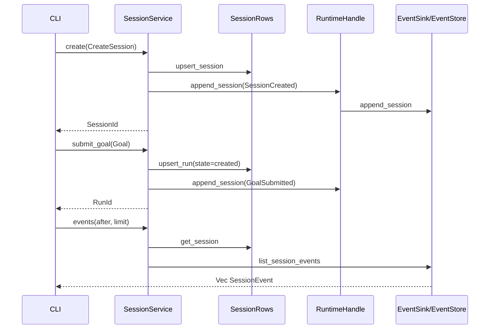
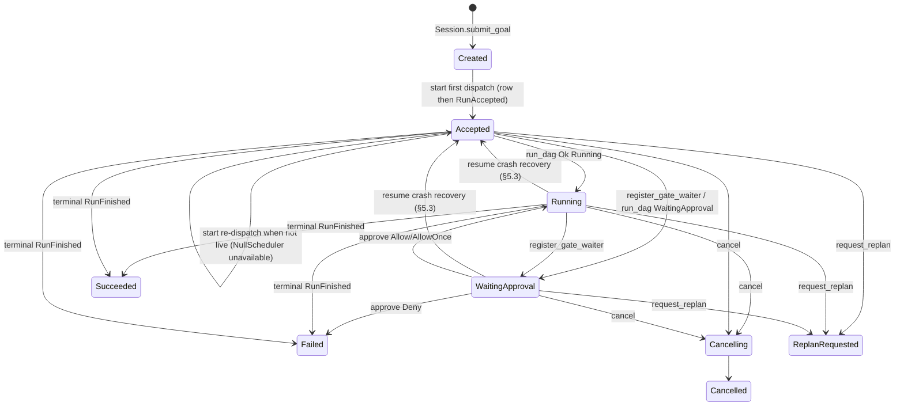

# RFC-0003: Session Manager & RunController

| Field | Value |
| --- | --- |
| **Status** | Implemented |
| **Author** | arkadianet |
| **Architecture** | Alloy Architecture V2 (**frozen**) — do not redesign |
| **Depends on** | [RFC-0001](./RFC-0001-alloy-runtime.md) (merged) · [RFC-0002](./RFC-0002-storage-artifacts-session-events.md) (merged) |
| **Effort** | 3–5 person-days |
| **Related RFCs** | [0004](./RFC-0004-observability-cost-metering.md) budget metering / decision writers · [0009](./RFC-0009-task-dag-templates-planner.md) planner / DAG store · [0010](./RFC-0010-scheduler-runtime-adapters.md) scheduler execution · [0015](./RFC-0015-cli-profiles-config.md) CLI / TTY approval UX |
| **Product** | Alloy — AI Engineering Runtime |
| **Supersedes** | Draft outline of this filename (expanded to implementation grade) |

**Mental model (V2 §5.2 / ADR F-22):** Session owns lifecycle, events, and budgets only. Run control is `RunController`. Session MUST NOT execute tools or mutate DAG topology. Explicit state — if it is not in the session event log (or durable session/run rows), it did not happen.

**Authority order (highest → lowest):** current `main` source → RFC-0002 → RFC-0001 → Architecture V2. Never modify an existing public API solely to match an older V2 sketch.

---

## 1. Overview

### Purpose

Ship the MVP **control plane** inside `alloy-runtime`:

1. Concrete **`SessionService`** over RFC-0002 `SessionRows` + `EventStore` / `RuntimeHandle::append_session`.
2. Concrete **`RunController`** that records run-control transitions, emits required runtime/session events, and integrates with the existing `Scheduler` abstraction (MVP: `NullScheduler` → defined unavailable errors).
3. **Budget attachment** on session create and **budget exhaustion hooks** (signaling only; metering → RFC-0004).
4. **Resume** after process restart from SQLite session rows + gapless event sequences.
5. **Host wiring** after `install_sqlite_event_sink` with no sixth crate and no new OS service.

Day-1 developer deliverable: with runtime `Running` and SQLite installed, `create` → `submit_goal` → `events` round-trips durable rows and Appendix A envelopes; `resume` after reopen returns the same `Session`; `start` against `NullScheduler` returns `RunError::SchedulerUnavailable` with defined side effects; `approve` / `cancel` / `request_replan` obey the contracts below — without writing the user’s `.env`.

### Problem

RFC-0001 published `SessionService` / `RunController` trait signatures, `Session`, `ReplanReason`, `SessionError` / `RunError`, and required that `RunAccepted` / `RunFinished` be emitted by Session/RunController — not by `AlloyRuntime::run`. RFC-0002 shipped durable `SessionRows`, `RunRow`, `EventStore`, and `store_to_session`. No orchestration impl exists. Without this RFC, CLI (0015), scheduler (0010), and planner (0009) have no session/run control surface to drive.

### Scope

| In scope | Detail |
| --- | --- |
| `SessionService` MVP impl | `create`, `resume`, `submit_goal`, `events` with exclusive cursor + page limit |
| `RunController` MVP impl | `start`, `cancel`, `approve`, `request_replan` |
| Persistence integration | `SessionRows` + `EventStore` via `AlloyStorage`; append via `RuntimeHandle` |
| Profiles | Validate MVP ids: `default` \| `autonomous` \| `readonly` |
| Budgets | Persist `BudgetPolicy` on create; exhaustion **hooks** + `BudgetWarning` events |
| Scheduler contract | Call existing `Scheduler` / host DAG forwarder; `NullScheduler` → `SchedulerUnavailable` |
| Run control state | Pin `RunRow.state` **string vocabulary** for control-plane rows (not DAG state machine) |
| Additive errors | Extend `RunError` with `SchedulerUnavailable`, `AlreadyStarted`, `UnknownGate` |
| Additive host seam | `RuntimeHandle::run_dag` / `cancel_dag` sharing `AlloyRuntime::run` semantics |
| Observability | `tracing` + in-process counters; no OTLP |
| Tests | Unit + restart integration + concurrency |

### Non-goals

- Scheduler execution loop, retries, ready-queue → **RFC-0010**.
- Planner / DAG template load / DAG CRUD / topology mutation → **RFC-0009**.
- Cost accounting, decision writers, OTLP → **RFC-0004**.
- TTY approval UX / `alloy run` CLI → **RFC-0015**.
- MCP, ModelRouter, EditEngine, alloyd, ACP (V2 deferred / other RFCs).
- Redesigning V2, RFC-0001, or RFC-0002; new crates; new services; parallel traits.
- Changing RFC-0001 `SessionService` / `RunController` method signatures (except additive `RunError` variants and additive inherent/host helpers documented here).

---

## 2. Architecture Integration

### Relationship to Architecture V2

| V2 reference | Application |
| --- | --- |
| §5.2 Session Manager | Lifecycle, events, budgets, resume — **no** tool execution; **no** DAG topology mutation |
| §5.2 RunController | `start` / `cancel` / `approve` / `request_replan` — owns run control API; **not** event storage |
| §5.5 Control APIs | Distinct traits; Session MAY facade approve/cancel for CLI convenience |
| ADR F-22 | RunController separate from Session |
| §5.6 Budget exhaustion | Stop non-essential; summarize; ask user — **hooks + events** here; metering in 0004 |
| §3.3 Explicit state | Session/run truth = durable rows + session event log |

**V2 sketch superseded by RFC-0001 code:** `SessionService::events(id, after: EventSeq)` without `Option` / `limit`. **Normative:** RFC-0001 / `session/traits.rs` — `after: Option<EventSeq>`, `limit: usize`, `MAX_EVENTS_PAGE`, `clamp_events_page_limit`.

### Relationship to RFC-0001

RFC-0001 is **authoritative** for:

- `SessionService` / `RunController` trait method signatures
- `Session`, `ReplanReason`, `CreateSession`, `Goal`, `BudgetPolicy`, `Approval`, IDs
- `SessionEvent` / `NewSessionEvent` / `SessionEventType` / `RuntimeEvent`
- `RuntimeHandle::emit` / `append_session` / `handoff_event_sink` / `set_event_sink`
- `AlloyRuntime::run` = thin `Scheduler::run` forwarder (**must not** emit `RunAccepted` / `RunFinished`)
- `NullScheduler`, `Scheduler`, `DagOutcome`, `DagState`
- Phase model; single-flight DAG admit on the host forwarder

This RFC **implements** behavior behind those traits and **adds** only the seams required to wire RunController to the existing forwarder without duplicating admit logic.

### Relationship to RFC-0002

RFC-0002 is **authoritative** for:

- `AlloyStorage`, `EventStore`, `SessionRows`, `RunRow`, `Sqlite*` backends
- `install_sqlite_event_sink`, `store_to_session`, `StoreError`
- Per-session gapless `EventSeq`, exclusive cursor pagination, handoff rules
- Schema for `sessions` / `runs` / `session_events` (no redesign)

This RFC **owns when** to call `SessionRows` / append events; it does **not** fork storage.

### Already implemented | Added by RFC-0003 | Deferred

| Item | Owner |
| --- | --- |
| `SessionService` / `RunController` trait signatures | **0001** |
| `Session`, `ReplanReason`, `MAX_EVENTS_PAGE`, `clamp_events_page_limit` | **0001** |
| `SessionError` `{NotFound, Invalid, Internal}` | **0001** (retained) |
| `RunError` `{NotFound, InvalidPhase, Internal}` | **0001** (retained; **extended** here) |
| `Approval`, `CreateSession`, `Goal`, `BudgetPolicy`, `ProfileId` | **0001** |
| `EventSink` / envelopes / `RuntimeHandle` append+emit | **0001** |
| `Scheduler` / `NullScheduler` / `AlloyRuntime::run` | **0001** |
| `AlloyStorage` / `EventStore` / `SessionRows` / `RunRow` / installer | **0002** |
| `store_to_session` | **0002** |
| Concrete `SessionService` + `RunController` impls | **0003** |
| `RunRow.state` control-plane vocabulary | **0003** |
| `RunGoalRecord` envelope in `goal_json` | **0003** |
| Budget exhaustion hooks + `BudgetWarning` emission | **0003** |
| Additive `RunError` variants + `RuntimeHandle::{run_dag,cancel_dag}` | **0003** |
| Additive `EventStore` existence probes (`has_session_event_for_run` / `has_run_accepted_event` / `has_run_finished_event`) | **0002** trait + SQLite impl, required by **0003** (§3.8) |
| Gate waiter registry (in-process; for 0010) | **0003** |
| Cost metering / decision writers / OTLP | **0004** |
| Planner / DAG load / topology mutation | **0009** |
| Real scheduler execution / Verify* / GateHuman adapters | **0010** |
| CLI / TTY approval UX | **0015** |
| alloyd / ACP | V2 deferred |

**RFC-0004 call edge (same crate):** metering in 0004 MUST invoke `SessionPlane::signal_budget_warning` for exhaustion signaling. This is an in-crate call, not a workspace crate dependency; the RFC index crate/dependency table for 0004 (depends on 0001, 0002) remains correct.

### Dependency boundaries

```text
alloy-cli ──► alloy-runtime
                 ├── session (0003 impl) ──► storage SessionRows/EventStore (0002)
                 │                      ──► RuntimeHandle emit/append (0001)
                 │                      ──► Scheduler via RuntimeHandle::run_dag (0003 additive)
                 ├── runtime / scheduler (0001)
                 └── storage (0002)
```

No new workspace crate. No new OS service. Session MUST NOT depend on planner/DAG store modules beyond reading/minting `DagId` values.

---

## 3. Public Rust API

All items live in `alloy-runtime` (edition 2021, Tokio 1.x, `async_trait` on public traits through M1 — same pins as RFC-0001/0002).

**Do not break** existing public signatures. Extend via additive enum variants, additive `RuntimeHandle` methods, new types in `session::`, and crate-root re-exports.

### 3.1 Existing traits (normative — do not change signatures)

```rust
// alloy-runtime/src/session/traits.rs  — AUTHORITATIVE (RFC-0001)

pub const MAX_EVENTS_PAGE: usize = 1_000;

#[must_use]
pub fn clamp_events_page_limit(limit: usize) -> usize {
    limit.clamp(1, MAX_EVENTS_PAGE)
}

#[async_trait]
pub trait SessionService: Send + Sync {
    async fn create(&self, req: CreateSession) -> Result<SessionId, SessionError>;
    async fn resume(&self, id: SessionId) -> Result<Session, SessionError>;
    async fn submit_goal(&self, id: SessionId, goal: Goal) -> Result<RunId, SessionError>;
    /// Exclusive cursor + page limit.
    /// - `after: None` — from first event (`EventSeq(0)`).
    /// - `after: Some(seq)` — events with `seq > after`.
    /// - `limit` — clamp via `clamp_events_page_limit`.
    async fn events(
        &self,
        id: SessionId,
        after: Option<EventSeq>,
        limit: usize,
    ) -> Result<Vec<SessionEvent>, SessionError>;
}

#[async_trait]
pub trait RunController: Send + Sync {
    async fn start(&self, run: RunId) -> Result<(), RunError>;
    async fn cancel(&self, run: RunId) -> Result<(), RunError>;
    async fn approve(&self, run: RunId, gate: GateId, decision: Approval) -> Result<(), RunError>;
    async fn request_replan(&self, run: RunId, reason: ReplanReason) -> Result<(), RunError>;
}
```

`Approval` remains `alloy_runtime::adapters::Approval` (`Allow` \| `Deny` \| `AllowOnce`), re-exported at crate root.

### 3.2 Error taxonomy (additive `RunError` only)

```rust
// alloy-runtime/src/error.rs

#[derive(Debug, thiserror::Error)]
pub enum SessionError {
    #[error("not found: {0}")]
    NotFound(SessionId),
    #[error("invalid: {0}")]
    Invalid(String),
    #[error("internal: {0}")]
    Internal(String),
}

#[derive(Debug, thiserror::Error)]
#[non_exhaustive]
pub enum RunError {
    #[error("not found: {0}")]
    NotFound(RunId),
    #[error("invalid phase: {0}")]
    InvalidPhase(String),
    #[error("internal: {0}")]
    Internal(String),

    // --- RFC-0003 additive ---
    /// No executable scheduler / NullScheduler / SchedError::Unavailable.
    #[error("scheduler unavailable")]
    SchedulerUnavailable,
    /// `start` called while an in-process live execution is already registered.
    #[error("already started: {0}")]
    AlreadyStarted(RunId),
    /// `approve` for a gate with no pending waiter.
    #[error("unknown gate: {0}")]
    UnknownGate(GateId),
}
```

**Rules:**

- MUST NOT remove or redefine existing variants.
- `#[non_exhaustive]` on `RunError` is REQUIRED (pre-1.0 additive safety for exhaustive matches).
- **Public API impact:** adding `#[non_exhaustive]` is an intentional source break for downstream `match` expressions that exhaust every variant. Downstream crates MUST add a wildcard arm (`_ => …`) or equivalent; existing variants and their meanings are preserved. This is required so later additive variants do not break dependents before 1.0.
- `store_to_session` (0002) remains unchanged and MUST NOT invent `SessionError::NotFound` from store misses — SessionService maps missing **session rows** itself (see §7 / §11).
- Full `RuntimeError` / `StoreError` mapping is normative in §7 and §11.

### 3.3 Run control state vocabulary (`RunRow.state`)

RFC-0002 stores `RunRow.state: String`. This RFC pins the **control-plane** vocabulary written by Session/RunController.

**This is not the DAG state machine.** `DagState` / node states remain owned by RFC-0009 / RFC-0010. `RunRow.state` is a durable control marker for resume and API guards only.

```rust
// alloy-runtime/src/session/run_state.rs

/// Control-plane values persisted in `RunRow.state` (snake_case strings).
#[derive(Debug, Clone, Copy, PartialEq, Eq)]
pub enum RunControlState {
    /// Row created by `submit_goal`; not yet accepted by `start`.
    Created,
    /// `start` wrote acceptance and emitted `RunAccepted`. May be re-dispatched
    /// when no in-process live execution is registered (see §6.3).
    Accepted,
    /// In-process execution is live (host forwarder admitted work).
    Running,
    /// Human gate outstanding (written by `register_gate_waiter`).
    WaitingApproval,
    /// Cancel requested / in progress.
    Cancelling,
    /// Terminal cancel.
    Cancelled,
    /// Terminal success (from `RunCompleted` / successful `RunFinished`).
    Succeeded,
    /// Terminal failure (deny, execution failure, budget stop).
    Failed,
    /// Replan requested; DAG mutation deferred to 0009/0010.
    ReplanRequested,
}

impl RunControlState {
    #[must_use]
    pub const fn as_str(self) -> &'static str { /* snake_case */ }

    /// Exact match on persisted vocabulary. Prefer over `Result<_, ()>` (clippy
    /// `result_unit_err` fails `-D warnings` on MSRV 1.97).
    #[must_use]
    pub fn parse(s: &str) -> Option<Self> { /* exact match */ }
}
```

| Variant | Persisted `state` string |
| --- | --- |
| `Created` | `created` |
| `Accepted` | `accepted` |
| `Running` | `running` |
| `WaitingApproval` | `waiting_approval` |
| `Cancelling` | `cancelling` |
| `Cancelled` | `cancelled` |
| `Succeeded` | `succeeded` |
| `Failed` | `failed` |
| `ReplanRequested` | `replan_requested` |

**Unknown strings on read:** treat as `RunError::InvalidPhase` when a mutating run API requires a known state; `resume` of the **session** still succeeds from the session row (run rows remain listable).

### 3.4 `goal_json` envelope

`RunRow.goal_json` MUST store:

```rust
// alloy-runtime/src/session/goal_record.rs

#[derive(Debug, Clone, Serialize, Deserialize, PartialEq)]
pub struct RunGoalRecord {
    pub goal: Goal,
    /// Minted at `submit_goal`. DAG body/persistence is RFC-0009; id binding is required
    /// so `RunAccepted { run_id, dag_id }` and `Scheduler::run` have a stable id.
    pub dag_id: DagId,
}
```

No schema migration. Serde JSON into the existing `goal_json` column.

**Forward compatibility (RFC-0009):** deserialize with unknown-field tolerance (serde default: ignore unknown fields). Do **not** use `deny_unknown_fields`. New fields added by 0009 MUST use `#[serde(default)]` so 0003-written rows remain readable.

### 3.5 Profile IDs

MVP `CreateSession.profile` MUST be one of:

| ProfileId string | Meaning (V2) |
| --- | --- |
| `default` | Standard interactive profile |
| `autonomous` | Reduced gating (policy details → 0015 / later) |
| `readonly` | No mutating tools (enforcement → tools/sandbox RFCs) |

`ProfileId::new` already enforces length. This RFC MUST additionally reject other ids at `create` with `SessionError::Invalid("unsupported profile: …")`.

### 3.6 Concrete types & construction

```rust
// alloy-runtime/src/session/plane.rs

/// Process session/run control plane. Cheap to clone (`Arc` inner).
#[derive(Clone)]
pub struct SessionPlane { /* Arc<SessionInner> */ }

/// In-process counters (see §13).
#[derive(Debug, Clone, Default, PartialEq, Eq)]
pub struct SessionMetrics {
    pub sessions_created: u64,
    pub sessions_resumed: u64,
    pub goals_submitted: u64,
    pub runs_started: u64,
    pub runs_start_unavailable: u64,
    pub runs_cancelled: u64,
    pub approvals_resolved: u64,
    pub replans_requested: u64,
    pub budget_warnings: u64,
}

impl SessionPlane {
    /// Construct after SQLite install. Does not take ownership of `AlloyRuntime`.
    ///
    /// REQUIREMENTS:
    /// - `handle.phase()` is `Running` for production wiring.
    /// - `storage` is the same `Arc` returned by `install_sqlite_event_sink`.
    pub fn new(handle: RuntimeHandle, storage: Arc<AlloyStorage>) -> Self;

    /// `Arc<dyn SessionService>` view (same inner).
    pub fn sessions(&self) -> Arc<dyn SessionService>;

    /// `Arc<dyn RunController>` view (same inner).
    pub fn runs(&self) -> Arc<dyn RunController>;

    /// Snapshot of §13 counters.
    #[must_use]
    pub fn metrics(&self) -> SessionMetrics;

    /// CLI convenience: forward to `RunController` (traits remain distinct).
    pub async fn approve(
        &self,
        run: RunId,
        gate: GateId,
        decision: Approval,
    ) -> Result<(), RunError>;

    pub async fn cancel(&self, run: RunId) -> Result<(), RunError>;

    /// Budget exhaustion hook. RFC-0004 metering calls this; does not compute spend.
    pub async fn signal_budget_warning(
        &self,
        session: SessionId,
        run: Option<RunId>,
        snapshot: BudgetSnapshot,
        message: impl Into<String>,
    ) -> Result<EventSeq, SessionError>;

    /// Register an in-process gate waiter and persist `waiting_approval`.
    ///
    /// RFC-0010 `GateHumanAdapter` MUST call this before awaiting the receiver.
    /// Replaces any prior waiter for `(run, gate)` (dropped sender → prior receiver errs).
    /// Returns `UnknownGate` never; returns `NotFound` / `InvalidPhase` when run missing
    /// or terminal / cancelling.
    pub async fn register_gate_waiter(
        &self,
        run: RunId,
        gate: GateId,
    ) -> Result<tokio::sync::oneshot::Receiver<Approval>, RunError>;
}
```

`SessionPlane` MUST implement both traits on internal wrapper types (or on `SessionPlane` itself via explicit `Arc` views) so `Arc<dyn SessionService>` and `Arc<dyn RunController>` remain distinct objects if required by callers — same `SessionInner`.

### 3.7 Additive `RuntimeHandle` DAG forwarder seams

To avoid splitting `AlloyRuntime` ownership and to keep single-flight admit in one place:

```rust
// alloy-runtime/src/runtime/handle.rs  — ADDITIVE

impl RuntimeHandle {
    /// Same semantics as `AlloyRuntime::run`: single-flight admit, map
    /// `SchedError::Unavailable` → `RuntimeError::SchedulerUnavailable`,
    /// does **not** emit `RunAccepted` / `RunFinished`.
    pub async fn run_dag(&self, dag_id: DagId) -> Result<DagOutcome, RuntimeError>;

    /// Cancel via current `Scheduler::cancel` (NullScheduler: Ok(())).
    /// Phase: `Running` | `Draining`. Does not emit session events.
    pub async fn cancel_dag(&self, dag_id: DagId) -> Result<(), RuntimeError>;
}
```

`AlloyRuntime::run` MUST call the same shared implementation as `RuntimeHandle::run_dag` (no divergent admit logic).

### 3.8 Additive `EventStore` existence seam

Every terminal write in this RFC orders events **before** the terminal row (§6.3 step 10, §6.4 step
10, §5.3 step 9) so a crash cannot leave a terminal row whose events no writer owes. That ordering
only stays safe if a retry — a second `cancel`, a second `resume`, or a `start` outcome that joins a
run another writer already finalized — can ask whether a given event is already durable instead of
re-appending it. Reading a page of the event log to answer that would turn an O(1) guard into a
replay, so RFC-0002 `EventStore` grows three probes:

```rust
// alloy-runtime/src/storage/events.rs — ADDITIVE (RFC-0002 §3.4)

#[async_trait]
pub trait EventStore: EventSink {
    // … list_session_events / replay_session / last_seq / list_runtime_events …

    /// True if a session event of `type_` exists for `run` (at most one row examined).
    async fn has_session_event_for_run(
        &self,
        session: SessionId,
        run: RunId,
        type_: SessionEventType,
    ) -> Result<bool, StoreError>;

    /// True if a host `RunAccepted` exists for `run` (at most one row examined).
    async fn has_run_accepted_event(&self, run: RunId) -> Result<bool, StoreError>;

    /// True if a host `RunFinished` exists for `run` (at most one row examined).
    async fn has_run_finished_event(&self, run: RunId) -> Result<bool, StoreError>;
}
```

**Rules:**

- All three are **required** trait methods with no provided default. `SqliteEventStore` is the only
  impl; a page-scanning default would let a future impl silently degrade an idempotency guard into a
  full replay.
- Each MUST answer from a single `LIMIT 1` lookup and MUST NOT page. Duplicates therefore read as one
  `true`.
- `has_session_event_for_run` keys on `(session_id, run_id, type)`. Session-scoped rows
  (`run_id IS NULL`, e.g. `SessionCreated`) never match a run probe. Schema v3 requires composite
  index `idx_session_events_session_run_type` on those columns — the `session_events` PK
  `(session_id, seq)` does **not** index `run_id`.
- The host probes key on `run_id` alone, extracted from the stored `RuntimeEvent` JSON —
  `runtime_events` rows carry no session id. Schema v3 requires partial expression indexes on
  `json_extract(event_json, '$.run_accepted.run_id')` and `'$.run_finished.run_id'`.
- Read-only: no probe writes, and none of them is a substitute for the per-run mutex. They answer
  "is this event already durable", not "may I transition".

| Probe | Control-plane use |
| --- | --- |
| `has_session_event_for_run(_, _, RunCompleted)` | Skip a duplicate `RunCompleted` on cancel retry (§6.4 step 10), resume finalization (§5.3 step 9), and terminal `start` outcomes (§6.3 step 10). Also the **session-event gate** for Failed-row repair (§5.3) — not a gate on `RunFinished` |
| `has_session_event_for_run(_, _, ApprovalResolved)` | Skip inventing a resolved event when `approve(Deny)` already appended one before crashing (§5.3 Failed-row repair) |
| `has_run_accepted_event` | Decide whether a terminal `RunFinished` would be unpaired when the durable state cannot prove acceptance (`created → cancelling`; §6.4 step 5, §5.3 step 9). Consulted only after the process-local marker misses |
| `has_run_finished_event` | Skip a duplicate `RunFinished` on any retry of a terminal finalization; Failed-row repair consults it **independently** of the `RunCompleted` gate |

### 3.9 Crate-root re-exports (additive)

```rust
pub use session::{
    clamp_events_page_limit, ReplanReason, RunController, RunControlState, RunGoalRecord,
    Session, SessionMetrics, SessionPlane, SessionService, MAX_EVENTS_PAGE,
};
```

Existing re-exports remain. No glob exports.

---

## 4. Internal Module Design

### Module map

```text
alloy-runtime/src/session/
  mod.rs              # re-exports
  traits.rs           # existing traits / Session / ReplanReason (0001)
  plane.rs            # SessionPlane + Arc views + SessionMetrics
  service.rs          # SessionService impl
  run_controller.rs   # RunController impl
  run_state.rs        # RunControlState
  goal_record.rs      # RunGoalRecord
  profiles.rs         # MVP profile validation
  gates.rs            # in-process GateWaiterRegistry
  metrics.rs          # session/run counters
  map_err.rs          # runtime_to_run / store_to_run helpers
  inner.rs            # shared SessionInner (handle, storage, locks, registries)
```

### Responsibilities

| Module | Owns | MUST NOT |
| --- | --- | --- |
| `service` | create/resume/submit_goal/events; session row + lifecycle events | Call tools; mutate DAG topology; invent seq numbers |
| `run_controller` | start/cancel/approve/request_replan; run row state; RunAccepted/Finished | Own EventStore schema; plan DAGs |
| `gates` | oneshot waiters for `(RunId, GateId)` | Persist waiters across process death (re-register on resume via 0010) |
| `storage` (0002) | Durable bytes | Orchestration |
| `scheduler` (0001/0010) | DAG execution | Session row writes |

### Dependency injection

`SessionInner` MUST hold:

- `RuntimeHandle`
- `Arc<AlloyStorage>`
- Per-session `tokio::sync::Mutex<()>` map for mutating session APIs
- Per-run `tokio::sync::Mutex<()>` map for mutating run APIs
- Process-local `live_execution: HashSet<RunId>` (or equivalent) — true while `run_dag` await is in flight for that run
- `GateWaiterRegistry`
- Counters

**Lock-map eviction:** after releasing a per-session or per-run mutex, if the map entry has no other Arc clones / waiters, remove it. Maps MUST NOT grow without bound across a long-lived process.

Storage access:

- Sessions: `storage.sessions()` → `Arc<SqliteSessionRows>` as `dyn SessionRows`
- Events read: `storage.events()` → `EventStore::list_session_events`
- Events write: **only** `handle.append_session` / `handle.emit` (so active `EventSink` — memory or SQLite — stays authoritative)

### Ownership / Sync

- `SessionPlane: Clone` via `Arc<SessionInner>`
- `SessionInner: Send + Sync`
- Public traits remain `Send + Sync` + `async_trait`

### ID sourcing for run APIs

All RunController methods that append session events or call the host forwarder MUST obtain:

| Field | Source |
| --- | --- |
| `session_id` | `RunRow.session_id` |
| `dag_id` | `RunGoalRecord.dag_id` deserialized from `RunRow.goal_json` |
| `run_id` | method argument / `RunRow.id` |

A method MUST parse the envelope only when it actually needs `dag_id`, and the corrupt-envelope contract follows from that:

| Method | Needs `dag_id` | Corrupt `goal_json` |
| --- | --- | --- |
| `start` | Yes — `RunAccepted { run_id, dag_id }` and `run_dag(dag_id)` | `RunError::Internal` (nothing to dispatch), after the §6.3 state guards |
| `cancel` | Best-effort — `cancel_dag` + `RunFinished` outcome | Still transition to `cancelled` and clear waiters; skip `cancel_dag`, skip `RunFinished` (log warn) |
| `approve` | Only on `Deny`, for the `RunFinished` outcome | Persist the decision and `ApprovalResolved` / `RunCompleted`; skip `RunFinished` (log warn) |
| `request_replan` | No | **Not parsed.** Record the replan intent and return `Ok(())` |

`request_replan` records intent and never dispatches: it emits no DAG-bound event and calls no host forwarder, so a corrupt envelope is not an obstacle to recording the request and MUST NOT be reported as `Internal`. Refusing here would strand exactly the run an operator is most likely trying to replan away from — the run whose envelope is unreadable — behind an error no caller can clear, since RFC-0009 owns envelope rewrites. The corrupt row is still reported by `resume` (§5.3 step 6) and still refuses `start`.

---

## 5. Session Lifecycle

### 5.1 Preconditions

| Method class | Phase requirement | Failure |
| --- | --- | --- |
| Mutating: `create`, `submit_goal`, `signal_budget_warning` | `Running` | `SessionError::Invalid("runtime not running")` |
| Read-only: `resume`, `events` | `Running` \| `Draining` | `SessionError::Invalid("runtime not available")` |
| All | `cancellation` not cancelled for mutating ops | `SessionError::Invalid("runtime cancelled")` |
| All | Storage open (not closed) | `store_to_session` → Internal/Invalid |

### 5.2 `create`

**Normative steps (order):**

1. Validate `req.profile` ∈ {`default`,`autonomous`,`readonly`}.
2. Validate `req.workspace_root` is absolute; else `Invalid`.
3. Validate `language_backends` non-empty for MVP; else `Invalid` (MVP expects `rust`).
4. Allocate `SessionId::new()`, `created_at = Timestamp::now()`.
5. Build `Session { id, workspace_root, profile, budget: req.budget, language_backends, created_at }`.
6. `sessions.upsert_session(&session)` — on error `store_to_session`.
7. `handle.append_session(NewSessionEvent { session_id, run_id: None, type_: SessionCreated, payload })` where payload MUST include at least:

```json
{
  "workspace_root": "<utf-8 path>",
  "profile": "default",
  "budget": { /* BudgetPolicy serde */ },
  "language_backends": ["rust"]
}
```

8. Return `id`.

**Crash window:** upsert then append. If append fails after upsert, log the session id and return the append error mapped through `runtime_to_session` (§7) — a stopped or wrong-phase runtime is an `Invalid` request, not an `Internal` fault, and mislabelling it hides a retryable condition. Do not invent compensating deletes (0002 has none). `resume` succeeds from the row alone; `submit_goal` requires the row and does **not** require a `SessionCreated` event.

### 5.3 `resume`

1. `get_session(id)` → `None` ⇒ `SessionError::NotFound(id)` (**do not** use `store_to_session` for this miss).
2. Store errors ⇒ `store_to_session`.
3. Return `Session` snapshot as stored.
4. MUST NOT invent DAG progress, and MUST NOT append events for its own bookkeeping. Resume writes events in exactly the two cases where the writer that owed them died mid-transition: cancel finalization (step 9) and Failed-row approval repair (step 10). Both are gated on existence probes (§3.8), so a repeated resume is a no-op.
5. MUST NOT auto-start runs.
6. Rebuild **process-local** run→dag bindings by scanning `list_runs` and deserializing `RunGoalRecord` from `goal_json`. On per-run deser failure: `tracing::warn`, skip that run’s binding, continue. The corrupt row remains persisted and listable, is not dispatched, is not entered into `live_execution`, and MUST NOT block resume of the session or restoration of other valid runs.
7. Gate waiters start empty (0010 re-registers).
8. `live_execution` starts empty.
9. **Re-arm after restart (explicit recovery only):** for rows in `running` or `waiting_approval`, upsert durable state to `accepted` (crash recovery), then they follow the `Accepted` re-dispatch path in §6.3. Rows already `accepted` stay re-dispatchable. Rows in `cancelling` MUST be finalized to `cancelled` on resume (best-effort `cancel_dag` skipped if no live scheduler work), together with a `RunCompleted` event. Emit `RunFinished` **only when** a durable `RunAccepted` exists for the run (or this process marked acceptance): `cancelling` is reachable from `created` without acceptance, so durable state alone must not invent an unpaired finish. Do not invent DAG progress. In-process non-terminal outcomes MUST NOT be treated as crash recovery (see §6.3). Terminal cancel finalization writes events **before** the `cancelled` upsert, with existence checks (§3.8) so a retry stays idempotent. Its `RunCompleted` carries `{ "dag_state": "cancelled", "reason": "resume_finalized_cancel" }` so the log distinguishes a resume-owed finalization from a cancel that completed inside its own process.
10. **Failed-row approval repair (Deny crash window only):** `approve(Deny)` is the one path in this RFC that writes a terminal row **before** its events (§6.5 step 4 — the row write is what makes the decision durable before the waiter is notified). A crash in that window leaves a `failed` row with missing terminal events. Resume repairs such a row **in place** — the row stays `failed`, it is never re-armed or re-dispatched:

    - **Session-event gate:** append `ApprovalResolved` / `RunCompleted` only when `has_session_event_for_run(session, run, RunCompleted)` is `false`. A `failed` row that already has `RunCompleted` MUST NOT get a second `ApprovalResolved` or `RunCompleted`. This is what keeps a run failed **with** its session events first — the shape RFC-0010's scheduler writes (events before row, §6.3 step 10) — from being mis-repaired.
    - When that gate is open: append `ApprovalResolved` with `{"decision": "deny", "reason": "resume_finalized_approval_denied"}` **only when** `has_session_event_for_run(…, ApprovalResolved)` is `false`. The `gate_id` of the original request is not durable in this row, so the repaired event records the decision and its provenance rather than pretending to reproduce §6.5's payload. Then append `RunCompleted` `{ "dag_state": "failed", "reason": "approval_denied" }`.
    - **`RunFinished` repair is independent of the `RunCompleted` gate:** emit a synthetic failed `RunFinished` when a durable `RunAccepted` exists for the run (or this process marked acceptance) **and** `has_run_finished_event` is `false` — even if `RunCompleted` is already durable (crash after session events, before host finish). `waiting_approval` implies acceptance, but the marker is process-local and the row no longer says `waiting_approval`, so acceptance is re-established from the log.
    - A `failed` row whose `goal_json` is corrupt is skipped entirely by step 6, so it is not repaired: without `dag_id` there is no `RunFinished` to pair, and the row is already terminal and undispatchable.

11. Each row is re-read under its per-run mutex before steps 9–10 decide anything: the `list_runs` result is a snapshot, and a concurrent `cancel` in the same process must not be rewritten from a stale state.

### 5.4 `submit_goal`

1. Load session or `NotFound`.
2. Reject empty `goal.text` (trim) with `Invalid`.
3. Allocate `RunId::new()`, `DagId::new()`, timestamps.
4. Persist `RunRow` (row first):

```text
id, session_id,
goal_json = serde(RunGoalRecord { goal, dag_id }),
state = "created",
created_at, updated_at
```

5. Append `GoalSubmitted` with `run_id: Some(run)`, payload:

```json
{
  "goal": { /* Goal */ },
  "dag_id": "<uuid>",
  "budget": { /* session BudgetPolicy snapshot */ }
}
```

6. Return `RunId`.

**MUST NOT** call Planner, mutate DAG topology, or call `Scheduler::run`.
**MUST NOT** emit `RunAccepted` here.

### 5.5 `events`

1. Ensure session exists (`get_session`) → else `NotFound`.
2. `limit = clamp_events_page_limit(limit)` (always clamp; never panic).
3. `storage.events().list_session_events(id, after, limit)` → map errors via `store_to_session`.
4. Return page in ascending `seq` order (0002 contract).

### 5.6 Budget attachment & exhaustion hooks

- **Attachment:** `BudgetPolicy` from `CreateSession` persisted on the session row and echoed in `SessionCreated` / `GoalSubmitted` payloads as specified above.
- **Enforcement accounting:** RFC-0004.
- **Hook:** `SessionPlane::signal_budget_warning` MUST:

  1. Verify session exists.
  2. Append `SessionEventType::BudgetWarning` with payload `{ "snapshot": BudgetSnapshot, "message": "…" }` and `run_id` as provided.
  3. Return assigned `EventSeq`.

- Callers (0004 / future scheduler) then MAY `request_replan(..., ReplanReason::BudgetPolicy)` or `cancel` — not automatic inside the hook.

### 5.7 Mermaid — create → submit_goal → events



### 5.8 Mermaid — resume after restart

```mermaid
sequenceDiagram
  participant Proc as New process
  participant RT as AlloyRuntime
  participant Inst as install_sqlite_event_sink
  participant SP as SessionPlane
  participant SR as SessionRows
  participant ES as EventStore

  Proc->>RT: configure + start
  Proc->>Inst: open data_dir + handoff
  Proc->>SP: SessionPlane::new(handle, storage)
  Proc->>SP: resume(session_id)
  SP->>SR: get_session
  SR-->>SP: Session
  Note over SP: live_execution empty; running/waiting_approval rewritten to accepted
  Note over SP: cancelling finalized; failed without RunCompleted repaired in place
  SP-->>Proc: Session
  Proc->>SP: events(None, n)
  SP->>ES: list_session_events
  Note over ES: Same gapless seq/ts/payload as pre-crash
```

---

## 6. RunController Lifecycle

### 6.1 Preconditions

| Check | Failure |
| --- | --- |
| Runtime phase `Running` for `start` / `approve` / `request_replan`; `Running` \| `Draining` for `cancel` | `RunError::InvalidPhase` |
| Run row exists | `RunError::NotFound` |

### 6.2 Ownership of transitions

| Transition | Owner |
| --- | --- |
| `created` (insert run) | **Session** (`submit_goal`) |
| `created` → `accepted` | **RunController** (`start`, first dispatch) |
| `accepted` → `running` | **RunController** (`start`, after `run_dag` returns `Ok` with non-terminal running-class outcome, or when live execution begins under 0010 — MVP sets `running` only from successful non-terminal `DagState::Running`) |
| `*` → `waiting_approval` | **RunController** via `SessionPlane::register_gate_waiter` (0010 calls it) |
| `waiting_approval` → `running` / `failed` | **RunController** (`approve`) |
| `*` → `cancelling` → `cancelled` | **RunController** (`cancel`) |
| non-terminal → `replan_requested` | **RunController** (`request_replan`) |
| DAG node execution / `DagState` | **Scheduler** (RFC-0010) |
| DAG topology edits | **Planner** (RFC-0009) — **forbidden** here |
| Terminal `succeeded` / `failed` / `cancelled` from execution | **RunController** when handling `run_dag` terminal outcomes (`RunFinished` + session events) |

### 6.3 `start`

**Normative algorithm:**

1. Acquire per-run mutex.
2. Load `RunRow` → missing ⇒ `NotFound`.
3. Let `session_id = row.session_id`. Parse `RunControlState` → unknown string ⇒ `InvalidPhase`.
4. Apply the state guards below, then deserialize `RunGoalRecord` from `goal_json` → corrupt ⇒ `Internal`. State comes first: a run that is live, cancelling, replan-pending, or terminal is not dispatchable whatever its envelope says, and the state error is the one the caller can act on.

| Current state | `live_execution` | Action |
| --- | --- | --- |
| `Created` | false | First dispatch — continue |
| `Accepted` | false | Re-dispatch — continue; **do not** emit a second `RunAccepted` |
| `Created` \| `Accepted` | true | `AlreadyStarted(run)` |
| `Running` \| `WaitingApproval` | * | `AlreadyStarted(run)` — not re-dispatchable in-process; crash recovery rewrites these to `accepted` in §5.3 before `start` |
| `Cancelling` | * | `InvalidPhase("cancelling")` |
| `Cancelled` \| `Succeeded` \| `Failed` | * | `InvalidPhase("terminal")` |
| `ReplanRequested` | * | `InvalidPhase("replan pending")` |

5. If state == `Created` (first dispatch only):
   - Upsert `state = "accepted"`, bump `updated_at` (**row first**).
   - `handle.emit(RunAccepted { run_id, dag_id })` (**event second**).
6. Insert `run` into `live_execution` (execution lease). The lease is the sole in-process liveness indicator that `run_dag` is outstanding for this run.
7. **Release per-run mutex** before any host await.
8. `result = handle.run_dag(dag_id).await`.
9. Re-acquire per-run mutex. Clear the execution lease (`live_execution`) **only after** applying step 10’s durable state transition for this result (still under the same lock acquisition). Order under the lock: (a) if durable state is `replan_requested`, `cancelling`, `cancelled`, or `waiting_approval`, an explicit control call won the race — **merge**: do not overwrite that state, clear the lease, return `Ok(())`, and still count `runs_start_unavailable` when the host result was unavailable; (b) if durable state is `succeeded` or `failed`, a second writer already finalized the run: return `Ok(())` when the host outcome **agrees** with that terminal (e.g. `Ok(Failed)` over durable `failed` from `approve(Deny)` while `run_dag` was awaited), return `Ok(())` for `SchedError::Cancelled`, and return `InvalidPhase("state advanced during run")` only for a **conflicting** success/failure; skip event writes on the agreeing path because the other writer already emitted them; (c) otherwise apply the step 10 row; (d) then clear lease. This prevents a late `run_dag` completion from clobbering `request_replan` / `cancel` / a registered gate, and prevents a second `start` from admitting duplicate execution while the lease is held.

**Lease ownership:** the lease is an RAII guard held across the step 8 await, so a `start` future that is dropped (task abort, caller cancellation, panic) releases it instead of stranding the run behind `AlreadyStarted` for the life of the process.
10. Map `result` while holding the lock (when step 9(a) does not suppress):

| Host result | RunController result | Required side effects |
| --- | --- | --- |
| `Ok(outcome)` with **terminal** `DagState` (`Succeeded` / `Failed` / `Cancelled`) | `Ok(())` | Append `RunCompleted` then emit `RunFinished`, then upsert matching `RunControlState` (**events before** the final row; existence checks keep a failed upsert retry-safe). Distinct from the general mutating-API row-first rule (§7). **Not** `SessionEventType::Error` for user/host cancel |
| `Ok(outcome)` with `DagState::WaitingApproval` | `Ok(())` | Upsert `waiting_approval`; **do not** emit `RunFinished`; lease cleared after upsert — further `start` rejected until §5.3 recovery rewrites to `accepted` |
| `Ok(outcome)` with `DagState::Running` | `Ok(())` | Upsert `running`; **do not** emit `RunFinished`; same re-dispatch rule as `WaitingApproval` |
| `Ok(outcome)` with `DagState::ReplanRequired` | `Ok(())` | Upsert `replan_requested`; **do not** emit `RunFinished` |
| `Ok(outcome)` with `DagState::Pending` | `Err(Internal("unexpected pending outcome"))` | Leave durable state `accepted`; **do not** emit `RunFinished` |
| `Err(SchedulerUnavailable)` | `Err(SchedulerUnavailable)` | Keep `accepted`; append `Error` `{ "class": "scheduler_unavailable" }`; **no** `RunFinished`; run remains re-dispatchable |
| `Err(SchedulerBusy)` | `Err(InvalidPhase("scheduler busy"))` | Keep prior durable state (`accepted` if first dispatch completed step 5); **no** `RunFinished`; re-dispatchable when busy clears |
| `Err(InvalidPhase { .. })` | `Err(InvalidPhase(..))` | Keep prior durable state; no `RunFinished` |
| `Err(Scheduler(SchedError::Cancelled))` | `Ok(())` | Append `RunCompleted` / emit `RunFinished`, then upsert `cancelled` (same events-before-row order). **Do not** call `runtime_to_run` for this arm |
| `Err(Scheduler(SchedError::DagNotFound(_)))` | `Err(InvalidPhase("dag not found"))` | Keep `accepted`; append `Error` `{ "class": "dag_not_found" }` |
| `Err(EventSinkBusy)` or `Err(EventSink(_))` | `Err(Internal(..))` | Keep prior state; log |
| Other `RuntimeError` | `Err(Internal(..))` | Keep prior state; append `Error` `{ "class": "internal", "message": "…" }` when session append still possible |

**NullScheduler MVP:** first `start` performs step 5, then step 8 returns `SchedulerUnavailable`, step 10 returns that error with `accepted` retained. A later `start` (or after RFC-0010 installs a real scheduler) re-dispatches from `Accepted` without a second `RunAccepted`.

**Lock rule:** the per-run mutex MUST NOT be held across `run_dag` or `cancel_dag` awaits. The same rule applies as for handoff: never hold control-plane locks across host/scheduler awaits so `approve` / `cancel` can proceed (0010 `GateHumanAdapter::wait_approval` resumes via `approve`).

### 6.4 `cancel`

1. Acquire per-run mutex.
2. Load run → `NotFound` if missing. Read `session_id`. Attempt `RunGoalRecord` parse from `goal_json`; retain `goal_ok: bool` and `dag_id: Option<DagId>` (`goal_ok == false` ⇒ `dag_id == None`, `tracing::warn`).
3. If `Cancelled` \| `Succeeded` \| `Failed` ⇒ `Ok(())` (idempotent).
4. If state is `Created`: never-started runs were never admitted — drop waiters, append `RunCompleted` `{ "dag_state": "cancelled" }`, upsert `cancelled`, **do not** write `cancelling`, **do not** call `cancel_dag`, **do not** emit `RunFinished`. Return `Ok(())`.
5. Sample acceptance: if state is already `Cancelling`, consult the durable `RunAccepted` log (and process-local marker); otherwise use `was_accepted` on the current durable state. Do **not** treat `cancelling` alone as proof of prior acceptance (`created → cancelling` is a historical shape).
6. If state is not already `Cancelling`, upsert `cancelling`. Drop **all** gate waiters for this `run` (senders dropped).
7. Release per-run mutex.
8. If `goal_ok`: `handle.cancel_dag(dag_id).await` (map errors via §7; NullScheduler `Ok(())`). If `!goal_ok`, skip `cancel_dag`. On `cancel_dag` failure, leave durable state `cancelling` and return the mapped error; a later `cancel` completes idempotently.
9. Re-acquire per-run mutex and **re-read the row**: the mutex was released in step 7, so a resume finalizing this same cancel (§5.3 step 9) may already have written the row. If the fresh state is terminal, return `Ok(())` without repeating steps 10–11.
10. Append `RunCompleted` `{ "dag_state": "cancelled" }` (skip if one already exists), then emit `RunFinished` when `goal_ok` and acceptance from step 5 hold (skip if already finished), **then** upsert `cancelled` from the fresh row and clear `live_execution`. Events precede the terminal upsert so a failed append cannot leave a permanently `cancelled` row without them.
11. If `!goal_ok`, skip `RunFinished` (permitted cancellation updates in steps 6–10 still apply). Synthetic `DagOutcome { state: Cancelled, … }` (generation `0` / empty failure) when emitting without a scheduler outcome.
12. Return `Ok(())`.

### 6.5 `approve`

**State validation (before any waiter lookup):**

| State | Result |
| --- | --- |
| missing run | `NotFound` |
| `WaitingApproval` | continue to waiter lookup |
| `Cancelled` \| `Succeeded` \| `Failed` | `InvalidPhase("terminal")` |
| `Cancelling` | `InvalidPhase("cancelling")` |
| `Created` \| `Accepted` \| `Running` \| `ReplanRequested` | `InvalidPhase("not waiting approval")` |

**Algorithm:**

1. Acquire per-run mutex.
2. Load run; apply state table above (every existing non-`WaitingApproval` run returns its `InvalidPhase` **regardless of waiter presence**).
3. Only if `WaitingApproval`: take waiter for `(run, gate)` from registry. None ⇒ `UnknownGate(gate)`.
4. Persist before notify (row/event first):
   - On `Deny`: upsert `failed`; clear any remaining waiters for run; append `ApprovalResolved`; append `RunCompleted` `{ "dag_state": "failed", "reason": "approval_denied" }`; emit `RunFinished` with failed outcome if the run had been accepted, under the §6.4 step 11 rule — durable state is `waiting_approval` here, so acceptance is implied even when the `RunAccepted` emission happened in an earlier process.
   - On `Allow` / `AllowOnce`: upsert `running`; append `ApprovalResolved` with `{ "gate_id": "…", "decision": "allow"|"deny"|"allow_once" }` using `RunRow.session_id`.
   - On any persistence / emit failure: map via §7, **do not** call `sender.send`. **Pin:** restore the sender into the registry **only when the durable row write itself failed** (state still `waiting_approval`). If the row already left `waiting_approval` (e.g. Deny upserted `failed` then append failed), **drop** the sender without send so the waiter observes closure — restoring would permanently strand a Deny waiter behind a terminal row that no production path can release.
5. Only after durable persistence succeeds: `sender.send(decision)` — if receiver dropped ⇒ `Internal("gate waiter dropped")` (decision is already durable).
6. Release lock. Return `Ok(())`.

A second `approve` for the same gate finds no waiter ⇒ `UnknownGate`.

**Crash window (Deny):** this is the only terminal transition in this RFC that writes the row **before** its events (`failed` upsert, then `ApprovalResolved` / `RunCompleted` / conditional `RunFinished`), because the decision has to be durable before the waiter is released. That is the opposite of the terminal `DagState` / cancel finalization order (§6.3 step 10, §6.4 step 10). A crash between the row and its events leaves a `failed` row with missing terminal events; resume repairs them in place (§5.3 step 10) — session events gated on missing `RunCompleted`, `RunFinished` repaired independently when accepted and unfinished — and leaves the row `failed`. On `Deny` with a corrupt `goal_json`, `RunFinished` is skipped with a warn (§4) — the decision, `ApprovalResolved`, and `RunCompleted` still commit.

`ApprovalRequested` emission remains owned by GateHuman execution (0010). This RFC writes `waiting_approval` only in `register_gate_waiter` and resolves via `approve`.

### 6.6 `request_replan`

**Allowed states:** `Accepted` \| `Running` \| `WaitingApproval`.

| State | Result |
| --- | --- |
| `Accepted` \| `Running` \| `WaitingApproval` | continue |
| `Created` | `InvalidPhase("not started")` |
| `Cancelling` | `InvalidPhase("cancelling")` |
| `Cancelled` \| `Succeeded` \| `Failed` | `InvalidPhase("terminal")` |
| `ReplanRequested` | `Ok(())` (idempotent) |

**Algorithm:**

1. Acquire per-run mutex.
2. Load run; apply table. Do **not** deserialize `RunGoalRecord` — this method needs no `dag_id`, so a corrupt envelope MUST NOT block recording the request (§4). A `tracing::warn` about the envelope is permitted but not required.
3. Drop **all** gate waiters for this `run` (invalidate outstanding approvals).
4. Upsert `replan_requested` (**row first**).
5. Append `ReplanRequested` with `{ "reason": /* serde ReplanReason */ }` using `RunRow.session_id`.
6. MUST NOT mutate DAG topology, nodes, or edges.
7. Return `Ok(())` (release lock). A concurrent `start` still awaiting `run_dag` MUST observe `replan_requested` in §6.3 step 9(a) and MUST NOT overwrite it with a later success/failure transition; merge by preserving `replan_requested` and skipping clobbering side effects while still clearing the execution lease.

### 6.7 `register_gate_waiter` (SessionPlane)

1. Acquire per-run mutex.
2. Load run; reject terminal / cancelling / created with `InvalidPhase` / `NotFound`. Also reject `replan_requested` with `InvalidPhase("replan pending")`: the replan discarded the DAG that owns the gate, and step 3 would otherwise rewrite the pending replan back to `waiting_approval`. Allowed states are exactly `Accepted` \| `Running` \| `WaitingApproval`.
3. Upsert `waiting_approval` (**row first**).
4. Replace registry entry for `(run, gate)` with a new oneshot; return receiver.
5. Release lock.

0010 SHOULD also append `ApprovalRequested` via `handle.append_session` (out of scope payloads beyond noting the type exists).

### 6.8 Mermaid — run control



---

## 7. Persistence Integration

### Writes

| Operation | SessionRows | EventSink via handle | RuntimeEvent |
| --- | --- | --- | --- |
| create | `upsert_session` | `SessionCreated` | — |
| resume (re-arm) | `get_session` + `list_runs`; `upsert_run` → `accepted` for `running` / `waiting_approval` | — | — |
| resume (cancel finalization, §5.3 step 9) | `upsert_run` → `cancelled`, **after** the events | `RunCompleted` `{ "dag_state": "cancelled", "reason": "resume_finalized_cancel" }` when missing | `RunFinished` only when a durable `RunAccepted` exists and no `RunFinished` does |
| resume (Failed-row repair, §5.3 step 10) | none — the row stays `failed` | `ApprovalResolved` / `RunCompleted` only when `RunCompleted` is missing; never duplicate them | `RunFinished` (synthetic failed) when accepted and `has_run_finished_event` is false — **independent** of whether `RunCompleted` already exists |
| submit_goal | `upsert_run` | `GoalSubmitted` | — |
| events | `get_session` + EventStore list | — | — |
| start (first) | `upsert_run` → `accepted` **before** emit | `Error` on unavailable | `RunAccepted` after row |
| start (outcome) | `upsert_run` terminal/running/waiting | `RunCompleted` on terminal | `RunFinished` on terminal only |
| cancel | `upsert_run` | `RunCompleted` cancelled | `RunFinished` when applicable |
| approve | `upsert_run` | `ApprovalResolved` (+ `RunCompleted` on Deny) | `RunFinished` on Deny when applicable |
| replan | `upsert_run` | `ReplanRequested` | — |
| register_gate_waiter | `upsert_run` → `waiting_approval` | — (0010 may append `ApprovalRequested`) | — |
| budget hook | — | `BudgetWarning` | — |

### Ordering guarantees

- Per-session event `seq` is assigned only by the active `EventSink` (0001/0002) — Session MUST NOT assign seq.
- **Default mutating-API rule:** APIs that both upsert and append/emit MUST persist the **row first**, then append/emit, under the per-session or per-run lock for that critical section (create, `submit_goal`, first-dispatch acceptance, `approve(Allow*)`, `request_replan`, `register_gate_waiter`).
- **Terminal `DagState` / cancel finalization exception:** when writing a terminal `RunControlState` from `start` outcome handling (§6.3 step 10), `cancel` finalization (§6.4 step 10), or resume cancel finalization (§5.3 step 9), append/emit **before** the final terminal row. Existence probes (§3.8) keep retries idempotent if the upsert fails after events.
- **`approve(Deny)` exception:** upsert `failed` **before** its events (§6.5), so the decision is durable before the waiter is notified. Resume repairs missing events (§5.3 step 10); `RunFinished` repair does not require a missing `RunCompleted`.
- Host awaits (`run_dag`, `cancel_dag`) happen **outside** the lock (see §6.3 / §8).
- Readers of `events` MAY race with appenders; pagination is cursor-based and MUST tolerate concurrent appends (same as 0002).

### Transactions

- RFC-0002 does not expose multi-table transactions to Session. MVP MUST tolerate crash between upsert and append (see §5.2 / §10).
- MUST NOT bypass `RuntimeHandle` to write session events directly into SQLite when a sink is installed (dual-write forbidden by 0002).

### Error mapping helpers

```rust
// alloy-runtime/src/session/map_err.rs

fn store_to_run(e: StoreError) -> RunError {
    match e {
        // Typed NotFound requires a RunId; callers map `get_run` → Ok(None) →
        // RunError::NotFound(id) themselves. StoreError::NotFound is a stringly miss.
        StoreError::NotFound(s) => RunError::Internal(format!("store not found: {s}")),
        StoreError::Conflict(s) => RunError::InvalidPhase(s),
        StoreError::Corrupt(s) | StoreError::Migration(s) => {
            RunError::Internal(s)
        }
        StoreError::Busy => RunError::Internal("store busy".into()),
        StoreError::Closed => RunError::Internal("store closed".into()),
        StoreError::DigestMismatch => RunError::Internal("digest mismatch".into()),
        StoreError::Io(s) | StoreError::Internal(s) => RunError::Internal(s),
    }
}

fn runtime_to_run(e: RuntimeError) -> RunError {
    match e {
        RuntimeError::SchedulerUnavailable => RunError::SchedulerUnavailable,
        RuntimeError::SchedulerBusy => RunError::InvalidPhase("scheduler busy".into()),
        RuntimeError::InvalidPhase { current, op } => {
            RunError::InvalidPhase(format!("{op} in phase {current:?}"))
        }
        // `run_dag` → SchedError::Cancelled is a **success** path in §6.3 step 10
        // (RunFinished + RunCompleted). Callers MUST match that arm before invoking
        // this helper. Reaching here is a programming error.
        RuntimeError::Scheduler(SchedError::Cancelled) => RunError::Internal(
            "bug: SchedError::Cancelled must be handled by start success path (§6.3)".into(),
        ),
        RuntimeError::Scheduler(SchedError::DagNotFound(id)) => {
            RunError::InvalidPhase(format!("dag not found: {id}"))
        }
        RuntimeError::Scheduler(SchedError::Unavailable) => RunError::SchedulerUnavailable,
        RuntimeError::Scheduler(SchedError::Internal(s)) => RunError::Internal(s),
        RuntimeError::EventSinkBusy => RunError::Internal("event sink busy".into()),
        RuntimeError::EventSink(e) => RunError::Internal(e.to_string()),
        RuntimeError::AlreadyStopped => RunError::InvalidPhase("runtime stopped".into()),
        RuntimeError::Config(s) | RuntimeError::Internal(s) => RunError::Internal(s),
        RuntimeError::Io(e) => RunError::Internal(e.to_string()),
    }
}

fn runtime_to_session(e: RuntimeError) -> SessionError {
    match e {
        RuntimeError::InvalidPhase { current, op } => {
            SessionError::Invalid(format!("{op} in phase {current:?}"))
        }
        RuntimeError::EventSinkBusy => SessionError::Internal("event sink busy".into()),
        RuntimeError::EventSink(e) => SessionError::Internal(e.to_string()),
        RuntimeError::AlreadyStopped => SessionError::Invalid("runtime stopped".into()),
        other => SessionError::Internal(other.to_string()),
    }
}
```

| Situation | Mapping |
| --- | --- |
| `get_session` → `Ok(None)` | `SessionError::NotFound(id)` |
| `get_run` → `Ok(None)` | `RunError::NotFound(id)` |
| Other `StoreError` on session APIs | `store_to_session` |
| Other `StoreError` on run APIs | `store_to_run` |
| `RuntimeError` from `emit` / `append_session` / `run_dag` / `cancel_dag` | `runtime_to_run` or `runtime_to_session` |
| `RunError` from a run-control helper reused by `resume` (§5.3 step 9) | `run_to_session`: `InvalidPhase` → `Invalid`, everything else → `Internal` |

Note: `RuntimeHandle` returns `RuntimeError` (including `EventSink` via `#[from]`). Callers MUST map `RuntimeError`, not raw `EventSinkError`.

### Host wiring (normative)

```text
AlloyRuntime::new()
  → configure(RuntimeConfig)
  → start() -> handle
  → install_sqlite_event_sink(&handle, None) -> storage
  → SessionPlane::new(handle.clone(), storage)
```

### Recovery

- After reopen + install, `resume` + `events` MUST observe durable pre-crash commits.
- In-flight oneshot gate waiters are **not** durable; 0010 MUST call `register_gate_waiter` again after resume when re-entering gates.
- Durable `accepted` / `running` / `waiting_approval` without `live_execution` remain **re-dispatchable** via `start` (§6.3) — the MVP Unavailable path MUST NOT permanently poison a run.
- `cancelling` rows are finalized to `cancelled` on resume (§5.3 step 9).
- `failed` rows missing terminal events — the `approve(Deny)` row-before-events crash window — are repaired in place on resume (§5.3 step 10). Missing `ApprovalResolved` / `RunCompleted` are gated on a missing `RunCompleted`; missing `RunFinished` is repaired independently when acceptance is known.

---

## 8. Concurrency Model

- Tokio async; `SessionPlane` is `Send + Sync`.
- **Per-session lock** for `submit_goal` / budget warning / conflicting session mutations: lock by `SessionId`.
- **Per-run lock** for the critical sections of `start` / `cancel` / `approve` / `request_replan` / `register_gate_waiter` only.
- **MUST NOT** hold per-run or per-session locks across `run_dag`, `cancel_dag`, or event-sink handoff awaits.
- `events` SHOULD NOT take the write lock for the whole list; MAY take a brief lock to verify session existence then read EventStore.
- Concurrent `events` readers: allowed.
- Concurrent appenders: serialized per session/run by locks above; EventSink provides its own safety (0001/0002).
- Single-flight DAG admit remains inside `run_dag` (0001 metrics/busy behavior preserved).
- Lock-map eviction: see §4.

---

## 9. Async Model

- All trait methods are `async` via `async_trait` (M1).
- SQLite remains on `spawn_blocking` inside storage (0002); Session MUST NOT add nested blocking on the async worker beyond awaiting storage/handle futures.
- `register_gate_waiter` is **async** (persists `waiting_approval`).
- Shutdown: mutating Session APIs fail when phase ≠ `Running`; `resume` / `events` allowed in `Draining`; `cancel` allowed in `Draining`.
- MVP: `start` awaits `run_dag` directly **without** holding the per-run lock (matches host `run`, enables `approve` during gate waits).

---

## 10. Shutdown and Durability

| Event | Guarantee |
| --- | --- |
| Graceful `drain` / `shutdown` | In-flight `run_dag` cancelled via host drain path; reject new `start` / `submit_goal` when not `Running`; `cancel` still allowed in `Draining` |
| Crash after successful append commit | Events durable (0002 WAL/fsync policy) |
| Crash between upsert and append/emit | Row may exist without matching event; resume uses row; `start` re-dispatch rules apply |
| Crash after the `approve(Deny)` row write, before its events | Row is `failed` with missing terminal events; resume repairs `ApprovalResolved` / `RunCompleted` (when `RunCompleted` missing) and conditional `RunFinished` independently (§5.3 step 10) |
| Crash after `approve(Deny)` `RunCompleted`, before `RunFinished` | Row is `failed` with session events; resume emits synthetic failed `RunFinished` when accepted and unfinished — does **not** re-append session events |
| Crash after `RunAccepted` before outcome | Row stays `accepted`; restart → re-dispatchable |
| Restart | `resume` + `events` restore control truth; waiters empty; `live_execution` empty |

Durability of session events equals RFC-0002 EventStore durability. This RFC adds no weaker path.

---

## 11. Error Handling

### SessionError

| Variant | When |
| --- | --- |
| `NotFound` | Missing session row on resume/submit/events/budget hook |
| `Invalid` | Bad profile, relative workspace, empty goal, wrong phase, unsupported state |
| `Internal` | Store/sink/`RuntimeError` failures after mapping |

### RunError

| Variant | When |
| --- | --- |
| `NotFound` | Missing run row |
| `InvalidPhase` | Illegal transition; scheduler busy; runtime phase; dag not found; cancelling/terminal |
| `Internal` | Corrupt `goal_json` on `start` (**not** on `request_replan` — see §4); sink failures; dropped waiter channel |
| `SchedulerUnavailable` | NullScheduler / Unavailable |
| `AlreadyStarted` | `start` while `live_execution` contains the run |
| `UnknownGate` | `approve` without waiter |

### Recoverable vs fatal

| Class | Examples | Caller action |
| --- | --- | --- |
| Recoverable | `SchedulerUnavailable`, `UnknownGate`, `AlreadyStarted`, `NotFound`, busy `InvalidPhase` | Surface to CLI; re-dispatch when applicable |
| Fatal process | Runtime `Failed` phase | Host shutdown path |

---

## 12. Configuration

**No new configuration keys required.**

Reuse:

- `RuntimeConfig` / `ConfigPaths` / `ALLOY_DATA_DIR` / profile + router paths (0001)
- Storage keys already in `example.env` (0002)

**MUST NOT** write or overwrite `.env`.
**MUST NOT** modify `example.env` unless a new key becomes absolutely required (none expected for this RFC).

Profile **catalog files** (`profiles/default.toml`, etc.) remain 0015/0001 config concerns; this RFC only validates the `ProfileId` string on `CreateSession`.

---

## 13. Observability

### Logging (`tracing`)

| Event | Level | Fields |
| --- | --- | --- |
| create ok | info | `session_id`, `profile` |
| create fail | warn | `error` |
| resume ok | info | `session_id` |
| resume miss | info | `session_id` |
| submit_goal ok | info | `session_id`, `run_id`, `dag_id` |
| start | info | `run_id`, `dag_id`, `redispatch` |
| start unavailable | warn | `run_id` |
| cancel | info | `run_id` |
| approve | info | `run_id`, `gate_id`, `decision` |
| replan | info | `run_id` |
| budget warning | warn | `session_id`, `run_id` |

### MVP metrics

`SessionMetrics` (§3.6) on `SessionInner`, exposed via `SessionPlane::metrics()`. No OTLP. No new crate.

---

## 14. Testing Strategy

Test names below are the ones in the tree, so the matrix can be diffed against the suite.

### Unit tests — session lifecycle (`src/session/tests.rs`)

| Test | Expect |
| --- | --- |
| `session_create_persists_row_and_event` | Row + `SessionCreated` at seq 0 with profile / budget / backends payload |
| `session_reject_unknown_profile` | `Invalid("unsupported profile: …")` |
| `session_create_rejects_relative_root_and_empty_backends` | `Invalid` for relative `workspace_root` and for empty `language_backends` |
| `session_submit_goal_creates_run` | `RunRow.state == created` + `GoalSubmitted` carrying `dag_id` and the budget snapshot |
| `session_submit_goal_rejects_empty_text` | `Invalid`; no run row written |
| `session_events_pagination_exclusive` | `after` / `limit` semantics + clamp at both ends |
| `session_resume_not_found` | `SessionError::NotFound`, not `Invalid` |
| `session_events_allowed_while_draining` | `resume` / `events` succeed in `Draining`; mutating APIs do not |
| `session_resume_rearms_crash_recovery_states` | `running` / `waiting_approval` → `accepted`; `cancelling` → `cancelled`; `created` untouched; exactly one invented `RunCompleted` |
| `session_resume_skips_corrupt_goal_json` | Warn + skip binding; sibling run re-armed; corrupt row stays listable and fails `start` with `Internal` |
| `session_resume_finalizes_cancelling_with_run_completed` | Never-accepted `cancelling` → `cancelled` + one `RunCompleted`, **no** `RunFinished` |
| `session_resume_finalizes_accepted_cancelling_emits_finished` | Accepted then `cancelling` → `cancelled` + `RunCompleted` + `RunFinished` |
| `session_resume_cancel_events_precede_cancelled_upsert` | Injected upsert failure after the events leaves the row `cancelling`; retry is idempotent and then commits `cancelled` |
| `session_resume_keeps_cancelling_when_append_fails` | Injected append failure writes no events and leaves `cancelling`; resume still returns `Ok` |
| `session_resume_does_not_clobber_concurrent_cancel` | Resume racing `cancel` yields one terminal write and one `RunCompleted` in either order |
| `session_resume_repairs_failed_approval_without_terminal_events` | `failed` row with no `RunCompleted` → repaired `ApprovalResolved` `{deny, resume_finalized_approval_denied}` + `RunCompleted` `{failed, approval_denied}` + one `RunFinished`; row stays `failed`; second resume is a no-op (§5.3 step 10) |
| `session_resume_repairs_missing_run_finished_when_run_completed_exists` | `failed` with durable `RunCompleted` but no `RunFinished` → one synthetic `RunFinished`; session events not duplicated; second resume is a no-op (§5.3 step 10) |
| `budget_warning_hook_appends_event` | `BudgetWarning` with snapshot + message; unknown session → `NotFound` |

### Unit tests — run control (`src/session/tests.rs`)

| Test | Expect |
| --- | --- |
| `run_start_null_scheduler_unavailable` | One `RunAccepted` + `SchedulerUnavailable` + durable `accepted` + `Error {class: scheduler_unavailable}` |
| `run_start_redispatch_after_unavailable` | Second `start` emits no second `RunAccepted`; still Unavailable; still re-dispatchable |
| `run_start_terminal_success_emits_finished` | `Ok(Succeeded)` → `RunCompleted` + `RunFinished` then `succeeded` row |
| `run_start_scheduler_cancelled_emits_finished` | `SchedError::Cancelled` → `Ok(())` + `RunCompleted` + `RunFinished`; not `InvalidPhase` |
| `run_start_dag_not_found_keeps_accepted` | `InvalidPhase("dag not found: …")` + `Error {class: dag_not_found}`; row stays `accepted` |
| `run_start_pending_outcome_is_internal` | `Ok(Pending)` → `Internal("unexpected pending outcome")`; row stays `accepted` |
| `run_running_outcome_not_redispatchable` | After `Ok(Running)`, a second `start` → `AlreadyStarted` |
| `run_start_missing_run_is_not_found` | `RunError::NotFound` |
| `run_unknown_state_string_is_invalid_phase` | Unknown persisted `state` → `InvalidPhase("unknown run state: …")` from `start`; the session still resumes and keeps listing the row |
| `start_lock_not_held_across_run_dag` | Scheduler blocking inside `run_dag` still lets `register_gate_waiter` / `approve` proceed |
| `run_double_start_while_live_already_started` | `AlreadyStarted` while the execution lease is held |
| `run_start_abort_clears_lease` | Aborting a `start` task releases the lease; the next `start` is a fresh dispatch |
| `lock_maps_evict_after_drop` | Per-run and per-session lock maps return to empty once guards / tickets drop |
| `run_request_replan_not_overwritten_by_late_start` | Late `run_dag` `Ok` does not clobber `replan_requested`; lease still cleared |
| `run_cancel_during_start_is_not_clobbered` | Late `run_dag` `Ok` does not clobber `cancelled` |
| `run_cancel_idempotent_and_records_run_completed` | Second `cancel` → `Ok(())`; terminal recorded as `RunCompleted`, never `Error` |
| `run_cancel_from_created_skips_run_finished` | `created` → `cancelled` in one shot; no `cancelling`, no `cancel_dag`, no `RunFinished` |
| `run_cancel_retry_after_cancel_dag_failure_skips_unpaired_finished` | `cancel_dag` failure leaves `cancelling`; retry of a never-accepted run emits **zero** `RunFinished` |
| `run_cancel_retry_after_cancel_dag_failure_emits_finished_when_accepted` | Same retry for an accepted run emits exactly one `RunFinished` (acceptance read from the log) |
| `run_cancel_corrupt_goal_skips_run_finished` | `goal_ok == false` → `cancelled` row, `cancel_dag` skipped, no `RunFinished` |
| `run_cancel_clears_waiters` | `approve` after `cancel` → terminal `InvalidPhase`; waiters dropped |
| `run_approve_with_waiter` | Oneshot resolves + one `ApprovalResolved`; second `approve` → `UnknownGate` |
| `run_approve_requires_waiting_approval` | `InvalidPhase` for every non-`WaitingApproval` state even with a waiter present; `UnknownGate` only when `WaitingApproval` and no waiter |
| `run_approve_deny_fails_run` | `Deny` → `failed` + `RunCompleted {failed, approval_denied}` + one `RunFinished` |
| `run_approve_deny_emits_run_finished_after_redispatch` | `Deny` emits `RunFinished` even when this process never emitted `RunAccepted` |
| `run_approve_deny_during_run_dag_joins_cleanly` | `Deny` mid-`run_dag` → durable `failed`; the agreeing `Ok(Failed)` returns `Ok(())` with one terminal pair |
| `run_approve_persists_before_notify` | Row-write failure leaves `waiting_approval` and an untouched waiter; append failure after the row commit drops the sender (`Closed`) and writes no `ApprovalResolved` |
| `run_approve_deny_drops_waiter_when_append_fails` | Deny append failure after the row commit closes the receiver; the terminal row then refuses further `approve` |
| `run_request_replan_records_event_and_clears_waiters` | `replan_requested` + `ReplanRequested {reason}`; waiters dropped; repeat call idempotent |
| `run_request_replan_rejects_created_and_terminal` | `InvalidPhase("not started")` / `InvalidPhase("terminal")` |
| `register_gate_waiter_rejects_created_and_terminal` | `InvalidPhase("not started")` / `InvalidPhase("terminal")`; a missing run → `NotFound` |
| `register_gate_waiter_rejects_replan_requested` | `InvalidPhase("replan pending")`; the pending replan is not rewritten |
| `register_gate_waiter_replaces_prior_waiter` | Re-registration closes the prior receiver and resolves the new one |

### Unit tests — error mapping (`src/session/map_err.rs`)

| Test | Expect |
| --- | --- |
| `store_corrupt_is_internal` | `Corrupt` / `Migration` → `Internal`; `Conflict` → `InvalidPhase` |
| `cancelled_is_bug_internal` | Bare `runtime_to_run(Scheduler(Cancelled))` → `Internal` (`start` must special-case it) |
| `invalid_phase_preserved` | `runtime_to_run` preserves `InvalidPhase` |

### Integration tests

| Test | File | Expect |
| --- | --- | --- |
| `session_resume_after_restart_is_bit_identical` | `tests/session_rfc0003.rs` | create/submit → reopen storage + runtime → `resume` + `events` return bit-identical seq / ts / payload (roadmap M5 `session_resume`) |
| `session_sqlite_cursor_after_restart` | `tests/session_rfc0003.rs` | Exclusive cursor continues across the restart |
| `run_accepted_survives_restart_and_redispatch` | `tests/session_rfc0003.rs` | `accepted` row is re-dispatchable after reopen with no second `RunAccepted` |
| `cancelling_run_is_finalized_after_restart` | `tests/session_rfc0003.rs` | Accepted then `cancelling` finalized once with `RunFinished`; second resume is a no-op |
| `created_cancelling_resume_skips_run_finished` | `tests/session_rfc0003.rs` | `created → cancelling` without `RunAccepted` finalizes with **zero** `RunFinished` |
| `concurrent_readers_and_submitters_are_gapless` | `tests/session_rfc0003.rs` | N `events` readers + M `submit_goal` on distinct sessions: no deadlock, per-session seq gapless |
| `resume_of_unknown_session_after_restart_is_not_found` | `tests/session_rfc0003.rs` | `NotFound` from a reopened store |
| `event_existence_probes_are_scoped_and_limit_one` | `tests/storage_rfc0002.rs` | The §3.8 seam: duplicates read as one `true`; session / run / type scoping holds; `run_id IS NULL` rows never match a run probe; `RunAccepted` is not a `RunFinished` |

### Commands

```bash
cargo test -p alloy-runtime
cargo test -p alloy-runtime -- session_
cargo test -p alloy-runtime -- run_
cargo test --workspace
cargo clippy -p alloy-runtime --all-targets -- -D warnings
cargo fmt --check
```

---

## 15. MVP vs Deferred

### MVP (this RFC)

- `SessionPlane` + `SessionService` + `RunController` impls
- SQLite integration via existing 0002 types
- Lifecycle events: `SessionCreated`, `GoalSubmitted`, `BudgetWarning`, `ApprovalResolved`, `ReplanRequested`, `RunCompleted`, `Error` (scheduler/internal failures only)
- Runtime events: `RunAccepted`; `RunFinished` for **terminal** outcomes only
- `NullScheduler` / `SchedulerUnavailable` with re-dispatchable `accepted`
- Async gate waiter registry writing `waiting_approval`
- Tests listed above

### Deferred (do not implement here)

| RFC | Items |
| --- | --- |
| **0004** | Cost metering, decision writers, OTLP |
| **0009** | Planner, DAG load/persist, topology mutation, follow-up nodes |
| **0010** | Real scheduler, Verify*/GateHuman adapters, retries, ready-queue |
| **0015** | CLI UX, TTY approval rendering, profile TOML product behavior |
| **V2 deferred** | alloyd, ACP |

Do not invent additional deferred subsystems in this RFC.

---

## 16. Acceptance Criteria

Merge only when all items hold:

- [x] `SessionService` / `RunController` method signatures match RFC-0001 / `session/traits.rs` (including `events(after: Option<EventSeq>, limit)`)
- [x] Architecture V2 §5.2 / §5.5 / ADR F-22 intent preserved: Session ≠ tools/DAG mutation; RunController owns start/cancel/approve/replan
- [x] Session does **not** execute tools or mutate DAG topology
- [x] Persistence uses RFC-0002 `SessionRows` / `EventStore` / `RuntimeHandle` append — no dual-write, no sixth crate
- [x] Row-then-event ordering for start acceptance; locks not held across `run_dag` / `cancel_dag`
- [x] `accepted` remains re-dispatchable when `live_execution` is false (Unavailable path does not poison runs)
- [x] `Running`/`WaitingApproval` not in-process re-dispatchable; resume rewrites to `accepted`
- [x] Execution lease cleared only after durable transition; late outcomes cannot clobber `replan_requested`/`cancelled`
- [x] `approve` / `request_replan` / `cancel` state guards and waiter lifecycle defined and tested
- [x] Approve persists before waiter notify
- [x] `RuntimeError` → `RunError` / `SessionError` mapping table implemented; `SchedError::Cancelled` handled as start success
- [x] `store_to_run`: Corrupt/Migration → Internal; Conflict → InvalidPhase
- [x] `BudgetPolicy` attached on create; `signal_budget_warning` hook defined and tested
- [x] Restart recovery: `resume` + `events` + re-dispatch rules defined and integration-tested
- [x] Corrupt `goal_json` on resume skipped with warn; cancel skips `RunFinished` when `!goal_ok`; `request_replan` does not parse the envelope at all (§4)
- [x] `failed` rows left by the `approve(Deny)` row-before-events crash window are repaired in place on resume: session events gated on missing `RunCompleted`; missing `RunFinished` repaired independently when accepted (§5.3 step 10)
- [x] `EventStore` existence probes (§3.8) are required trait methods answering from one indexed `LIMIT 1` row (schema v3 indexes), and every terminal write is guarded by them
- [x] `RunError::SchedulerUnavailable` / `AlreadyStarted` / `UnknownGate`; `RunError` is `#[non_exhaustive]` with downstream catch-all guidance
- [x] `RunRow.state` vocabulary pinned (`RunControlState::parse` → `Option`); not a second DAG state machine
- [x] `RunGoalRecord` stored in `goal_json` with minted `DagId`; unknown fields tolerated
- [x] `RuntimeHandle::run_dag` / `cancel_dag` additive seams share `AlloyRuntime::run` admit semantics
- [x] `SessionMetrics` defined and re-exported
- [x] Unit + integration tests in §14 passing
- [x] `cargo fmt --check` clean; `clippy -D warnings` clean on touched crates
- [x] Crate root re-exports updated explicitly (no glob)
- [x] `.env` never written; `example.env` policy preserved
- [x] Series [Definition of Done](./README.md#definition-of-done-merge-gate) satisfied

## Definition of Done

Merge only when the series [Definition of Done](./README.md#definition-of-done-merge-gate) is fully met:

- [x] Architecture compliance: **PASS** — V2 §5.2 / §5.5 / ADR F-22 boundaries hold; no new crate, no new service, no parallel traits
- [x] RFC acceptance criteria: **100% satisfied** (§16)
- [x] Unit tests: **passing** — `cargo test -p alloy-runtime` (lib unit tests, incl. `session/tests.rs` and `session/map_err.rs`)
- [x] Integration tests: **passing** — `tests/session_rfc0003.rs`, `tests/storage_rfc0002.rs`, `tests/lifecycle.rs`
- [x] Documentation: **complete** — §3.8 storage seam, §4 corrupt-envelope matrix, §5.3 step 10 repair, §7 write table, §14 matrix all match the tree
- [x] Public APIs: **reviewed and stable** — additive only: `RunError` variants (`#[non_exhaustive]`), `RuntimeHandle::{run_dag,cancel_dag}`, `EventStore` existence probes, `session::` types + explicit crate-root re-exports
- [x] Clippy: **clean** — `cargo clippy -p alloy-runtime --all-targets -- -D warnings`
- [x] Formatting: **clean** — `cargo fmt -p alloy-runtime -- --check`
- [x] No TODO or placeholder implementations left in this RFC’s scope (explicit **Stub** / deferred only)
- [x] Code review: **approved** — production review of the control plane returned APPROVED with Architecture V2 compliance PASS on this PR; every finding raised there is either fixed in code or pinned in this document

---

## 17. Open Questions

Only genuine implementation spikes — settled V2/0001/0002 decisions are not reopened.

1. **Create crash between `upsert_session` and `SessionCreated` append:** MVP accepts rare row-without-event; spike only if dogfood shows operator pain (then consider a single storage-level txn API in a follow-up — out of scope unless required).
2. **CLI backgrounding of long `start`:** MVP awaits `run_dag` without holding the per-run lock (approve/cancel remain responsive). If 0015 needs non-blocking CLI UX, that RFC may introduce backgrounding — not this RFC.

**Settled (do not reopen):**

- RFC-0001 `events(after: Option<EventSeq>, limit)` wins over V2 two-arg sketch
- Distinct `SessionService` vs `RunController` (F-22)
- Session does not store events itself (RunController does not own EventStore)
- `AlloyRuntime::run` does not emit `RunAccepted` / `RunFinished`
- SQLite MVP; ≤5 crates; never write `.env`
- `RunRow.state` is control-plane vocabulary here; `DagState` remains scheduler/DAG RFCs
- Scheduler execution and DAG topology belong to 0010 / 0009
- Budget **metering** belongs to 0004; this RFC only attaches policy + warning hooks
- Per-run locks MUST NOT span `run_dag` / `cancel_dag`
- `accepted` + `!live_execution` is re-dispatchable (Unavailable does not poison)
- `Running` / `WaitingApproval` are not in-process re-dispatchable; crash recovery rewrites them to `accepted`
- Row then event for acceptance; `RunFinished` only for terminal outcomes
- User/host cancel recorded as `RunCompleted`, not `SessionEventType::Error`
- `SchedError::Cancelled` from `run_dag` is handled as success in §6.3, not via `runtime_to_run` → `InvalidPhase`
- Approve persists before notifying the gate waiter
- `#[non_exhaustive]` on `RunError` requires downstream catch-all match arms
- `request_replan` records intent and never parses `goal_json`; a corrupt envelope is a `start`-only `Internal` (§4)
- `approve(Deny)` is the only terminal transition that writes the row before its events; resume repairs that window in place — session events gated on missing `RunCompleted`, `RunFinished` independently (§5.3 step 10)
- The `EventStore` existence probes are required trait methods answering from one indexed `LIMIT 1` row — no page-scanning default (§3.8); `session_events` PK does not index `run_id`

---

## Estimated implementation effort

**3–5 person-days** (aligned with RFC index / roadmap M5 session slice).

Suggested split: SessionPlane + create/resume/events (1d) · submit_goal + RunGoalRecord/state (0.5–1d) · RunController start/cancel/approve/replan + handle seams (1–1.5d) · budget hook + metrics (0.5d) · tests/recovery/concurrency (1d).

---

**End of RFC-0003.**
