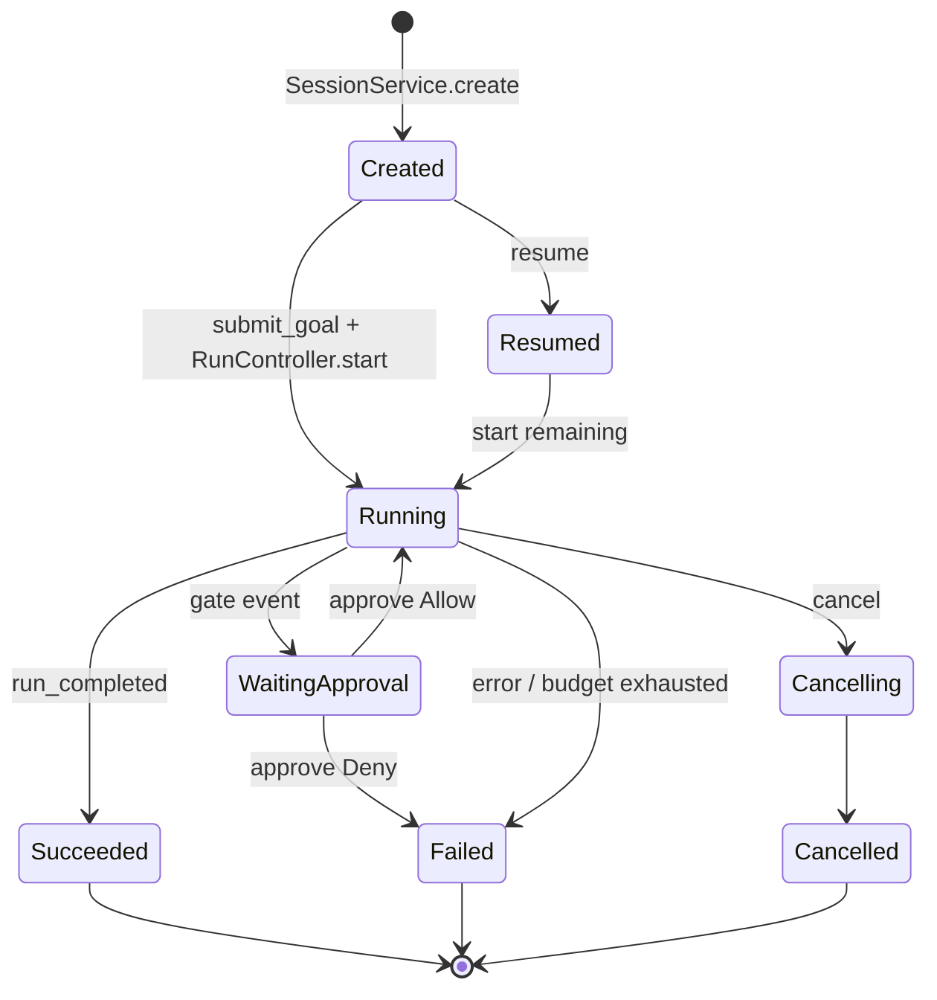

# RFC-0003: Session Manager & RunController

| Field | Value |
| --- | --- |
| Status | Draft |
| Author | arkadianet |
| Architecture | Alloy Architecture V2 (frozen) |
| Depends on | RFC-0001, RFC-0002 |
| Effort | 3–5 person-days |

## Purpose

Implement session lifecycle (create, resume, submit goal, stream events) and separate run control (`start` / `cancel` / `approve` / `request_replan`) per V2 §5.5 / ADR F-22. Session owns lifecycle, events, and budgets only—not tool execution or DAG topology mutation.

## Scope

### In scope

- `SessionService` trait + MVP impl over EventStore
- `RunController` trait + MVP impl (wires to scheduler in RFC-0010; stubs acceptable until then)
- Profiles: `default` | `autonomous` | `readonly` IDs
- Budget attachment on create; budget exhaustion signaling via events
- CLI-facing facade methods that delegate approve/cancel to `RunController`

### Out of scope

- Scheduler execution loop → [RFC-0010](./RFC-0010-scheduler-runtime-adapters.md)
- Planner/DAG template load → [RFC-0009](./RFC-0009-task-dag-templates-planner.md)
- TTY approval UX → [RFC-0015](./RFC-0015-cli-profiles-config.md)
- alloyd / ACP → deferred (V2 §0.7)

## Dependencies

- **RFC-0001** — `CreateSession`, `Goal`, IDs
- **RFC-0002** — event/artifact persistence

## Public API

From V2 §5.5:

```rust
#[async_trait]
pub trait SessionService: Send + Sync {
    async fn create(&self, req: CreateSession) -> Result<SessionId, SessionError>;
    async fn resume(&self, id: SessionId) -> Result<Session, SessionError>;
    async fn submit_goal(&self, id: SessionId, goal: Goal) -> Result<RunId, SessionError>;
    async fn events(&self, id: SessionId, after: EventSeq) -> Result<Vec<SessionEvent>, SessionError>;
}

#[async_trait]
pub trait RunController: Send + Sync {
    async fn start(&self, run: RunId) -> Result<(), RunError>;
    async fn cancel(&self, run: RunId) -> Result<(), RunError>;
    async fn approve(&self, run: RunId, gate: GateId, decision: Approval) -> Result<(), RunError>;
    async fn request_replan(&self, run: RunId, reason: ReplanReason) -> Result<(), RunError>;
}

pub enum Approval { Allow, Deny, AllowOnce }
```

Until RFC-0010 lands, `start` may return `RunError::SchedulerUnavailable` or drive a no-op stub that only emits events—trait surface must be complete.

## Internal architecture

Module `alloy-runtime::session` + `alloy-runtime::run_controller`. Session never mutates DAG topology; it records `goal_submitted` / budget events and hands `RunId` to RunController.

## Data structures

```rust
pub struct Session {
    pub id: SessionId,
    pub workspace_root: PathBuf,
    pub profile: ProfileId,
    pub budget: BudgetPolicy,
    pub language_backends: Vec<LanguageId>,
    pub created_at: Timestamp,
}
```

## State machine



## Failure modes

| Failure | Handling (V2 §5.6) |
| --- | --- |
| Budget exhaustion | Stop non-essential; `budget_warning` / summarize; ask user |
| Resume missing events | Fail closed; do not invent state |
| Double start | Idempotent or `RunError::AlreadyStarted` |
| Approve unknown gate | `RunError::UnknownGate` |

## Testing strategy

- Unit: create → submit_goal → events contain `session_created` / `goal_submitted`
- Unit: approve/cancel without scheduler stub returns defined errors
- Integration: resume after process restart loads same event seq

## Acceptance criteria

- [ ] `SessionService` and `RunController` traits match V2 §5.5
- [ ] Session does not execute tools or mutate DAG topology
- [ ] Events persisted via RFC-0002
- [ ] Budget policy stored and enforceable hooks present
- [ ] Resume works from SQLite after restart

## Estimated implementation effort

**3–5 person-days** (plus stub wiring until 0010).

## Future extensions

- Optional TUI consuming same event stream (V2 §15 deferred)
- Daemon session handoff (`alloyd`) only if single-binary p95 fails (V2 §5.3)
