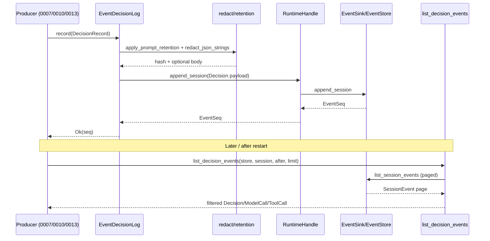

# RFC-0004: Observability & Cost Metering

| Field | Value |
| --- | --- |
| **Status** | Ready for Implementation |
| **Author** | arkadianet |
| **Architecture** | Alloy Architecture V2 (**frozen**) — do not redesign |
| **Depends on** | [RFC-0001](./RFC-0001-alloy-runtime.md) (merged) · [RFC-0002](./RFC-0002-storage-artifacts-session-events.md) (merged) |
| **Effort** | 2–4 person-days |
| **Related RFCs** | [0003](./RFC-0003-session-manager-run-controller.md) budget warning hook (merged; in-crate call) · [0007](./RFC-0007-model-router-provider.md) route/complete attribution · [0010](./RFC-0010-scheduler-runtime-adapters.md) scheduler decision/node producers · [0013](./RFC-0013-capability-registry-workers.md) `WorkerMetrics` producers · [0015](./RFC-0015-cli-profiles-config.md) `alloy events` UX · [0016](./RFC-0016-eval-harness-holdout-gates.md) calibrated cost bands |
| **Product** | Alloy — AI Engineering Runtime |
| **Supersedes** | Draft outline of this filename (expanded to implementation grade) |

**Mental model (V2 §15 / ADR F-17):** Always-on decision recording and cost metering. Default retention = metadata + content hashes + redacted decision records. Full prompts and tool bodies are opt-in. Persistence is the existing session event log — never a second database. Numeric savings claims are forbidden until Eval calibrates (V2 §18).

**Authority order (highest → lowest):** current `main` source → RFC-0003 → RFC-0002 → RFC-0001 → Architecture V2. Never modify an existing public API solely to match an older V2 sketch or this document’s draft outline.

---

## 1. Overview

### Purpose

Ship the MVP **observability & metering substrate** inside `alloy-runtime`:

1. **`DecisionLog`** — append attributable decisions through existing `SessionEventType::{Decision, ModelCall, ToolCall}` envelopes via `RuntimeHandle::append_session`.
2. **`CostMeter` / `CostSnapshot`** — always-on incremental token and optional USD accounting; convert to `BudgetSnapshot` for RFC-0003 budget hooks.
3. **Hash + redaction helpers** — SHA-256 content hashes via existing `Digest`; secret/path deny-list redaction before any body retention.
4. **Query helpers** — filter/parse decision-related session events for CLI (RFC-0015) without owning CLI UX.
5. **Budget signaling edge** — when spend meets or exceeds `BudgetPolicy`, invoke existing `SessionPlane::signal_budget_warning` (RFC-0003). Metering does not own session lifecycle.

### Problem Statement

RFC-0001 published `WorkerMetrics`, `RuntimeMetrics`, `SessionEventType::{Decision, ModelCall, ToolCall, BudgetWarning}`, and `RuntimeConfig::{retain_full_prompts, retain_tool_bodies}`. RFC-0002 shipped durable `EventStore` persistence for any Appendix A envelope. RFC-0003 shipped session/run control and `SessionPlane::signal_budget_warning`. No module yet records decisions with F-17 defaults, meters cost, or wires spend into the budget hook. Without this RFC, ModelRouter (0007), Scheduler (0010), workers (0013), and `alloy events` (0015) have no shared metering/decision substrate.

### Scope

| In scope | Detail |
| --- | --- |
| `DecisionLog` trait + concrete impl | Record decision / model_call / tool_call via `RuntimeHandle::append_session` |
| `DecisionRecord` / `DecisionKind` | Normative shapes + serde |
| `CostMeter` / `CostSnapshot` / shared handle | Incremental updates; unknown usage never fabricated |
| Hash helpers | `Digest::sha256` wrappers for prompts/tool bodies |
| Redaction helpers | Secret patterns + path deny list; apply retention flags |
| Query helpers | List/filter/parse decision-related events from `EventStore` |
| Budget integration | `CostMeter` → `BudgetSnapshot` → `SessionPlane::signal_budget_warning` |
| `WorkerMetrics` usage contract | How producers feed meters / model_call payloads (producers themselves → 0013) |
| `ObsError` | Additive observability error type + mapping from existing errors |
| Module `alloy-runtime::obs` | Same crate; no sixth crate; no OTLP |
| Tests | Unit + EventStore integration + budget hook integration |

### Non-goals

- Model routing / provider attribution logic → **RFC-0007** (consumes `DecisionLog` / `CostMeter`).
- Scheduler execution / node_state emission ownership → **RFC-0010**.
- Capability worker implementations that produce `WorkerMetrics` → **RFC-0013**.
- `alloy events` CLI UX / printing → **RFC-0015** (consumes query helpers).
- Calibrated cost bands / marketing savings numbers → **RFC-0016** / V2 §18.
- OTLP export, Observability TUI → **Architecture V2 deferred** (§15.2).
- Redesigning V2, RFC-0001/0002/0003; new crates; new runtime services; parallel `EventStore`; second event log.
- Replacing, wrapping, or forking `EventSink` / `EventStore` / `SessionEventType` / `RuntimeHandle` / `WorkerMetrics` / `BudgetSnapshot`.
- Writing or overwriting `.env`.

### Day-1 MVP (normative)

1. **EventStore-backed decision recording** through the installed sink (`RuntimeHandle::append_session`) — no parallel persistence.
2. **Metadata + content hashes by default**; full prompt/tool bodies only when `RuntimeConfig.retain_full_prompts` / `retain_tool_bodies` are true.
3. **`CostMeter` snapshots without OTLP** — process-local counters + session event payloads only.
4. **No `.env` writes**; `example.env` unchanged unless a new key is strictly required (none expected).

---

## 2. Architecture Integration

### Relationship to Architecture V2

| V2 reference | Application |
| --- | --- |
| §15 Observability | Decision records · cost metering · tool call metadata; OTLP optional later — **not** a separate crate in MVP |
| §15.2 / ADR F-17 | Default = metadata + content hashes + redacted decision records; full prompts / file-body tool results **opt-in**; no file bodies by default |
| §3.4 Observable decisions | Routing, context inclusion, tool grant, retry attributable |
| §3.6 Cost-aware execution | Metering APIs always on; numeric savings claims are **not** architecture proof |
| §5.6 Budget exhaustion | Stop non-essential; summarize; ask user — **signaling** via RFC-0003 hook; **accounting** here |
| §18 Cost Model | Budgets + metering APIs + decision-log cost fields; strip numeric differentiators (ADR F-08) |
| Appendix A | `decision` / `model_call` / `tool_call` / `budget_warning` event types — envelopes owned by 0001/0002 |
| Appendix B | `[observability] retain_full_prompts` / `retain_tool_bodies` — already loaded by RFC-0001 `RuntimeConfig` |

**V2 sketch superseded by `main`:** any historical `WorkerMetrics.confidence: f32` (required). **Normative on main:** `confidence: Option<f32>`.

### Relationship to RFC-0001

RFC-0001 is **authoritative** for:

- `WorkerMetrics` / `RuntimeMetrics` field shapes (writers deferred here; shapes already published)
- `SessionEventType`, `SessionEvent`, `NewSessionEvent`, `EventSink`, `RuntimeEvent`
- `RuntimeConfig::{retain_full_prompts, retain_tool_bodies}`
- `RuntimeHandle::{emit, append_session, config, metrics, …}`
- ID types including `Digest::sha256` / `Digest::try_from_hex`
- `BudgetPolicy`, `BudgetSnapshot`, `ModelTier`

This RFC **adds** `obs` APIs that **consume** those types. It MUST NOT redefine `WorkerMetrics` or change `RuntimeConfig` keys.

### Relationship to RFC-0002

RFC-0002 is **authoritative** for:

- `EventStore` / `SqliteEventStore` / `AlloyStorage` / `install_sqlite_event_sink`
- Per-session gapless `EventSeq`, exclusive cursor pagination, handoff, durability
- `StoreError` → `EventSinkError` / `store_to_session` / `store_to_runtime`
- Content-agnostic storage: the store does not strip bodies; **writers** enforce F-17 defaults

This RFC **owns what payloads** DecisionLog appends; it does **not** fork storage.

### Relationship to RFC-0003

RFC-0003 is **authoritative** for:

- Session ownership, event flow, budget **policy attachment**
- `SessionPlane::signal_budget_warning(session, run, snapshot, message) -> Result<EventSeq, SessionError>`
- Per-session locks and “MUST NOT hold session locks across unrelated awaits” rules

This RFC **supplies metering** that invokes the existing hook. It MUST NOT assume control of session/run lifecycle, MUST NOT call Planner/Scheduler, and MUST NOT auto-`cancel` / `request_replan` inside the meter (callers MAY after the hook returns).

**Dependency note:** The RFC index lists 0004 depends on 0001+0002 (RFC-0003 §2). Budget hook integration is an **in-crate** call to the already-merged `SessionPlane` API on `main` — not a new workspace crate edge.

### Already implemented | Added by RFC-0004 | Deferred

| Item | Owner |
| --- | --- |
| `WorkerMetrics`, `RuntimeMetrics` shapes | **0001** |
| `SessionEventType::{Decision, ModelCall, ToolCall, BudgetWarning, Error, …}` | **0001** |
| `RuntimeConfig.retain_full_prompts` / `retain_tool_bodies` | **0001** |
| `RuntimeHandle::append_session` / `emit` / `config` | **0001** |
| `Digest::sha256` | **0001** |
| `BudgetPolicy` / `BudgetSnapshot` / `ModelTier` | **0001** |
| `EventSink` / `EventStore` / SQLite durability | **0002** |
| `install_sqlite_event_sink` / `AlloyStorage` | **0002** |
| `SessionPlane` / `signal_budget_warning` / budget policy attachment | **0003** |
| `DecisionLog` + `DecisionRecord` + `DecisionKind` | **0004** |
| `CostMeter` + `CostSnapshot` + shared handle | **0004** |
| Hash / redaction / retention helpers | **0004** |
| Query helpers over `EventStore` | **0004** |
| `ObsError` + mappings | **0004** |
| `obs` module + crate-root re-exports | **0004** |
| Budget exhaustion **accounting** + hook invocation helpers | **0004** |
| ModelRouter route/complete attribution | **0007** |
| Scheduler execution / node_state producers | **0010** |
| Worker implementations emitting `WorkerMetrics` | **0013** |
| `alloy events` CLI UX | **0015** |
| Calibrated holdout cost bands | **0016** |
| OTLP export / Observability TUI | **V2 deferred** |

### Dependency boundaries

```text
alloy-cli ──► alloy-runtime
                 ├── obs (0004) ──► RuntimeHandle::append_session (0001)
                 │              ──► EventStore read/query (0002)
                 │              ──► SessionPlane::signal_budget_warning (0003, in-crate)
                 │              ──► RuntimeConfig retention flags (0001)
                 │              ──► WorkerMetrics / BudgetSnapshot / Digest (0001)
                 ├── session (0003)
                 ├── storage (0002)
                 └── runtime / types / events (0001)
```

No new workspace crate. No new OS service. No observability database. No OTLP crate.

---

## 3. Public Rust API

All items live in `alloy-runtime` (edition 2021, Tokio 1.x, `async_trait` on public traits through M1 — same pins as RFC-0001/0002/0003).

**Do not break** existing public signatures. Extend via new types in `obs::`, additive crate-root re-exports, and helpers that call existing APIs.

### 3.1 Module layout & re-exports

```rust
// alloy-runtime/src/lib.rs  — ADDITIVE
pub mod obs;

pub use obs::{
    hash_content, hash_prompt, hash_tool_body,
    list_decision_events, parse_decision_event, parse_model_call_event, parse_tool_call_event,
    redact_secrets, apply_prompt_retention, apply_tool_retention,
    BudgetCheck, CostMeter, CostSnapshot, SharedCostMeter,
    DecisionKind, DecisionLog, DecisionRecord, EventDecisionLog,
    ModelCallRecord, ObsError, RetentionPolicy, ToolCallRecord,
    maybe_signal_budget_warning,
};
```

`WorkerMetrics` / `RuntimeMetrics` / `BudgetSnapshot` / `SessionEventType` remain re-exported from their existing modules — **do not** re-export a conflicting `WorkerMetrics` from `obs`.

### 3.2 `ObsError`

```rust
// alloy-runtime/src/obs/error.rs
#[derive(Debug, thiserror::Error)]
pub enum ObsError {
    /// Invalid record / retention / payload construction.
    #[error("invalid: {0}")]
    Invalid(String),
    /// Append through `RuntimeHandle` failed.
    #[error("append: {0}")]
    Append(#[from] RuntimeError),
    /// Budget warning hook / session lookup failed.
    #[error("session: {0}")]
    Session(#[from] SessionError),
    /// EventStore query/read failed.
    #[error("store: {0}")]
    Store(#[from] StoreError),
    /// Redaction/retention helper failed (malformed input after deny-list).
    #[error("redaction: {0}")]
    Redaction(String),
    /// Internal invariant.
    #[error("internal: {0}")]
    Internal(String),
}
```

**Justification for a dedicated type:** observability call sites must distinguish append failures from budget-hook/`SessionError` and from `StoreError` on query without collapsing everything into `RuntimeError`. Mapping helpers:

| Source | Maps to |
| --- | --- |
| `RuntimeError` from `append_session` | `ObsError::Append` (`#[from]`) |
| `SessionError` from `signal_budget_warning` | `ObsError::Session` (`#[from]`) |
| `StoreError` from `EventStore` reads | `ObsError::Store` (`#[from]`) |
| Empty required fields / unknown `DecisionKind` wire value on parse | `ObsError::Invalid` |
| Deny-list match when body retention was requested but body is unsafe | strip body + keep hash (not an error); only raise `Redaction` on helper misuse |

### 3.3 `DecisionKind`

```rust
// alloy-runtime/src/obs/decision.rs
#[derive(Debug, Clone, PartialEq, Eq, Serialize, Deserialize)]
#[serde(rename_all = "snake_case")]
pub enum DecisionKind {
    ModelRoute,
    ContextInclusion,
    ToolGrant,
    Retry,
    Gate,
    Budget,
    /// Extension point.
    Custom(String),
}
```

**Serde rules (normative):**

Externally tagged (serde default) + `rename_all = "snake_case"`:

| Variant | JSON |
| --- | --- |
| `ModelRoute` | `"model_route"` |
| `ContextInclusion` | `"context_inclusion"` |
| `ToolGrant` | `"tool_grant"` |
| `Retry` | `"retry"` |
| `Gate` | `"gate"` |
| `Budget` | `"budget"` |
| `Custom("x")` | `{"custom":"x"}` |

Implementers MUST lock these shapes with a unit-test golden JSON suite. Unknown unit strings on `DecisionKind` deserialize MUST fail (surfaced as `ObsError::Invalid` by parse helpers). Outer event payloads MUST NOT use `deny_unknown_fields` (forward-compatible metadata), but `kind` itself MUST be a valid `DecisionKind`.

### 3.4 `DecisionRecord`

```rust
#[derive(Debug, Clone, PartialEq, Serialize, Deserialize)]
pub struct DecisionRecord {
    pub session: SessionId,
    pub run: Option<RunId>,
    pub node: Option<NodeId>,
    pub kind: DecisionKind,
    /// Structured metadata (candidates, scores, reasons, capability ids, …).
    /// MUST NOT contain raw secrets; helpers redact string values when configured.
    pub metadata: serde_json::Value,
    /// SHA-256 of the attributable content (prompt / context pack / tool args) when applicable.
    pub content_hash: Option<Digest>,
    /// Full prompt/body — retained only when policy allows; DecisionLog strips otherwise.
    pub prompt_body: Option<String>,
}
```

**Ownership:** callers own construction; `DecisionLog::record` takes `DecisionRecord` by value.

### 3.5 `ModelCallRecord` / `ToolCallRecord`

```rust
#[derive(Debug, Clone, PartialEq, Serialize, Deserialize)]
pub struct ModelCallRecord {
    pub session: SessionId,
    pub run: Option<RunId>,
    pub node: Option<NodeId>,
    pub provider_id: ProviderId,
    pub model_tier: ModelTier,
    /// `None` when the provider did not report input tokens — MUST NOT invent.
    pub input_tokens: Option<u64>,
    /// `None` when the provider did not report output tokens — MUST NOT invent.
    pub output_tokens: Option<u64>,
    /// Estimated USD when the provider/router supplies it — MUST NOT invent.
    pub usd: Option<f64>,
    pub duration_ms: Option<u64>,
    pub confidence: Option<f32>,
    pub error_class: Option<ErrorClass>,
    pub content_hash: Option<Digest>,
    pub prompt_body: Option<String>,
}

#[derive(Debug, Clone, PartialEq, Serialize, Deserialize)]
pub struct ToolCallRecord {
    pub session: SessionId,
    pub run: Option<RunId>,
    pub node: Option<NodeId>,
    pub tool_name: String,
    pub tool_server: Option<String>,
    pub latency_ms: Option<u64>,
    pub denied: bool,
    pub content_hash: Option<Digest>,
    /// Tool args / result body — retained only when `retain_tool_bodies`.
    pub body: Option<String>,
}
```

### 3.6 `DecisionLog` trait

```rust
#[async_trait]
pub trait DecisionLog: Send + Sync {
    /// Append a `SessionEventType::Decision` event after redaction/retention.
    async fn record(&self, rec: DecisionRecord) -> Result<EventSeq, ObsError>;

    /// Append a `SessionEventType::ModelCall` event after redaction/retention.
    async fn record_model_call(&self, rec: ModelCallRecord) -> Result<EventSeq, ObsError>;

    /// Append a `SessionEventType::ToolCall` event after redaction/retention.
    async fn record_tool_call(&self, rec: ToolCallRecord) -> Result<EventSeq, ObsError>;
}
```

### 3.7 `EventDecisionLog` (concrete MVP impl)

```rust
/// DecisionLog backed by `RuntimeHandle::append_session` + retention from config.
pub struct EventDecisionLog {
    handle: RuntimeHandle,
    retention: RetentionPolicy,
}

impl EventDecisionLog {
    /// Construct with an explicit retention policy.
    #[must_use]
    pub fn new(handle: RuntimeHandle, retention: RetentionPolicy) -> Self { /* … */ }

    /// Load retention from `handle.config()` (requires configure).
    pub fn from_handle(handle: RuntimeHandle) -> Result<Self, ObsError> { /* … */ }
}

#[async_trait]
impl DecisionLog for EventDecisionLog { /* §5 */ }
```

**Construction / DI:**

| Context | Construction |
| --- | --- |
| Production (after `configure`/`start` + SQLite install) | `EventDecisionLog::from_handle(handle.clone())` or `new(handle, RetentionPolicy::from(&*handle.config()?))` |
| Tests (in-memory sink) | Same; sink already default on handle |
| Injection into 0007/0010/0013 | `Arc<dyn DecisionLog>` |

`EventDecisionLog` MUST NOT open storage itself. It MUST NOT call `install_sqlite_event_sink`. It appends only through `RuntimeHandle`.

### 3.8 SessionEventType mappings (pinned)

| API | `SessionEventType` | Notes |
| --- | --- | --- |
| `DecisionLog::record` | `Decision` | Payload §5.3 |
| `DecisionLog::record_model_call` | `ModelCall` | Payload §5.4 |
| `DecisionLog::record_tool_call` | `ToolCall` | Payload §5.5 |
| `maybe_signal_budget_warning` | `BudgetWarning` | Emitted by RFC-0003 hook — **not** by DecisionLog directly |
| Append failure path | — | Return `ObsError`; MUST NOT invent a substitute success event |

Node state transitions remain `SessionEventType::NodeState` and are **owned by RFC-0010 / DAG RFCs**. This RFC MUST NOT emit `NodeState`.

### 3.9 `RetentionPolicy`

```rust
#[derive(Debug, Clone, Copy, PartialEq, Eq)]
pub struct RetentionPolicy {
    pub retain_full_prompts: bool,
    pub retain_tool_bodies: bool,
}

impl RetentionPolicy {
    #[must_use]
    pub const fn defaults() -> Self {
        Self { retain_full_prompts: false, retain_tool_bodies: false }
    }
}

impl From<&RuntimeConfig> for RetentionPolicy {
    fn from(c: &RuntimeConfig) -> Self {
        Self {
            retain_full_prompts: c.retain_full_prompts,
            retain_tool_bodies: c.retain_tool_bodies,
        }
    }
}
```

Default when flags are false: metadata + hashes only; bodies stripped before append.

### 3.10 Hash helpers

```rust
/// SHA-256 lowercase hex via `Digest::sha256`.
#[must_use]
pub fn hash_content(bytes: &[u8]) -> Digest {
    Digest::sha256(bytes)
}

#[must_use]
pub fn hash_prompt(prompt: &str) -> Digest {
    Digest::sha256(prompt.as_bytes())
}

#[must_use]
pub fn hash_tool_body(body: &str) -> Digest {
    Digest::sha256(body.as_bytes())
}
```

**Stability:** identical UTF-8 bytes → identical `Digest`. Hash **before** redaction of secrets when the caller wants a hash of the original attributable content; DecisionLog hashing rules are pinned in §5.2.

### 3.11 Redaction helpers

```rust
/// Redact secret-like substrings in `text` (API keys, Bearer tokens, env assignments).
#[must_use]
pub fn redact_secrets(text: &str) -> String { /* §5.6 */ }

/// Apply prompt retention: always return content_hash when body/hash input exists;
/// return body only if `retain_full_prompts` after secret redaction + deny-list check.
pub fn apply_prompt_retention(
    prompt: Option<&str>,
    policy: RetentionPolicy,
) -> Result<(Option<Digest>, Option<String>), ObsError>;

/// Apply tool-body retention analogously using `retain_tool_bodies`.
pub fn apply_tool_retention(
    body: Option<&str>,
    policy: RetentionPolicy,
) -> Result<(Option<Digest>, Option<String>), ObsError>;
```

### 3.12 `CostMeter` / `CostSnapshot` / `SharedCostMeter`

```rust
#[derive(Debug, Clone, PartialEq, Serialize, Deserialize)]
pub struct CostSnapshot {
    pub tokens_in: u64,
    pub tokens_out: u64,
    /// Sum of reported USD amounts. `None` if **no** USD has been reported yet
    /// (including zero events). `Some(0.0)` only after at least one `usd: Some(_)` update
    /// that summed to zero — implementers MUST document via unit tests.
    /// Unknown/missing USD on a given update MUST NOT invent a value; that update
    /// simply does not change `usd_spent` when it was already `None`, and when it was
    /// `Some` leaves it unchanged (partial USD reporting is allowed).
    pub usd_spent: Option<f64>,
    pub model_calls: u64,
    /// Number of model-usage updates where input **or** output tokens were `None`.
    pub unknown_token_events: u64,
    pub by_tier: CostByTier,
}

#[derive(Debug, Clone, Default, PartialEq, Serialize, Deserialize)]
pub struct CostByTier {
    pub premium: TierCost,
    pub standard: TierCost,
    pub economy: TierCost,
    pub local: TierCost,
}

#[derive(Debug, Clone, Default, PartialEq, Serialize, Deserialize)]
pub struct TierCost {
    pub tokens_in: u64,
    pub tokens_out: u64,
    pub usd: Option<f64>,
    pub calls: u64,
}

/// Process-local incremental meter. Not shared across tasks by itself.
#[derive(Debug, Default, Clone)]
pub struct CostMeter {
    // private fields matching CostSnapshot accumulators
}

impl CostMeter {
    #[must_use]
    pub fn new() -> Self { Self::default() }

    /// Record model usage. `input`/`output`/`usd` use `None` for unknown — NEVER fabricate.
    pub fn add_model_usage(
        &mut self,
        tier: ModelTier,
        input: Option<u64>,
        output: Option<u64>,
        usd: Option<f64>,
    );

    /// Feed a completed `WorkerMetrics`. Token fields on `WorkerMetrics` are `u64`
    /// (RFC-0001); when a producer truly lacks usage it MUST NOT invent nonzero counts —
    /// producers that lack usage MUST call `add_model_usage(..., None, None, usd)` instead
    /// of synthesizing a zeroed `WorkerMetrics` solely to satisfy metering.
    pub fn add_worker_metrics(&mut self, metrics: &WorkerMetrics, usd: Option<f64>);

    #[must_use]
    pub fn snapshot(&self) -> CostSnapshot;

    /// Map known token totals into `BudgetSnapshot`.
    /// `usd_spent` uses `0.0` when `CostSnapshot.usd_spent` is `None` **only for the
    /// BudgetSnapshot field type** (`BudgetSnapshot.usd_spent: f64` on main). The
    /// unknown-USD condition remains visible via `CostSnapshot.usd_spent.is_none()` and
    /// MUST NOT be presented as a measured zero cost in user-facing savings claims.
    #[must_use]
    pub fn to_budget_snapshot(&self) -> BudgetSnapshot;

    /// Compare against policy ceilings.
    #[must_use]
    pub fn check_budget(&self, policy: &BudgetPolicy) -> BudgetCheck;
}

#[derive(Debug, Clone, Copy, PartialEq, Eq)]
pub enum BudgetCheck {
    Ok,
    TokensExhausted,
    UsdExhausted,
    TokensAndUsdExhausted,
}

impl BudgetCheck {
    #[must_use]
    pub fn is_exhausted(self) -> bool { !matches!(self, Self::Ok) }
}

/// `Arc<Mutex<CostMeter>>` wrapper for concurrent producers (router/workers/scheduler).
#[derive(Clone, Default)]
pub struct SharedCostMeter {
    inner: Arc<std::sync::Mutex<CostMeter>>,
}

impl SharedCostMeter {
    #[must_use]
    pub fn new() -> Self { Self::default() }

    pub fn add_model_usage(
        &self,
        tier: ModelTier,
        input: Option<u64>,
        output: Option<u64>,
        usd: Option<f64>,
    ) { /* lock; forward */ }

    pub fn add_worker_metrics(&self, metrics: &WorkerMetrics, usd: Option<f64>) { /* … */ }

    #[must_use]
    pub fn snapshot(&self) -> CostSnapshot { /* … */ }

    #[must_use]
    pub fn to_budget_snapshot(&self) -> BudgetSnapshot { /* … */ }

    #[must_use]
    pub fn check_budget(&self, policy: &BudgetPolicy) -> BudgetCheck { /* … */ }

    /// Run a closure under the meter lock (keep critical sections short — §8).
    pub fn with_mut<R>(&self, f: impl FnOnce(&mut CostMeter) -> R) -> R { /* … */ }
}
```

**Poisoned mutex:** on poison, `SharedCostMeter` MUST recover via `PoisonError::into_inner` (same pattern as existing runtime locks on main) and continue; it MUST NOT panic.

### 3.13 Budget warning helper

```rust
/// If `meter.check_budget(policy)` is exhausted, invoke
/// `SessionPlane::signal_budget_warning` with `meter.to_budget_snapshot()`.
/// Returns `Ok(None)` when under budget; `Ok(Some(seq))` when a warning was appended.
pub async fn maybe_signal_budget_warning(
    plane: &SessionPlane,
    session: SessionId,
    run: Option<RunId>,
    meter: &SharedCostMeter,
    policy: &BudgetPolicy,
) -> Result<Option<EventSeq>, ObsError>;
```

Message strings (normative prefixes):

| `BudgetCheck` | Message |
| --- | --- |
| `TokensExhausted` | `"budget exhausted: tokens"` |
| `UsdExhausted` | `"budget exhausted: usd"` |
| `TokensAndUsdExhausted` | `"budget exhausted: tokens and usd"` |

Callers (0007/0010) MAY then `request_replan(..., ReplanReason::BudgetPolicy)` or `cancel` — not automatic inside this helper (RFC-0003 §5.6).

### 3.14 Query helpers

```rust
/// Page session events whose type is `Decision` | `ModelCall` | `ToolCall`.
/// Uses `EventStore::list_session_events` internally, filtering in-process.
/// `limit` is the max number of **matching** events returned (helpers MAY scan
/// multiple store pages until filled or store exhausted). Clamp store page size
/// via `clamp_events_page_limit`.
pub async fn list_decision_events(
    store: &dyn EventStore,
    session: SessionId,
    after: Option<EventSeq>,
    limit: usize,
) -> Result<Vec<SessionEvent>, ObsError>;

pub fn parse_decision_event(ev: &SessionEvent) -> Result<DecisionRecord, ObsError>;
pub fn parse_model_call_event(ev: &SessionEvent) -> Result<ModelCallRecord, ObsError>;
pub fn parse_tool_call_event(ev: &SessionEvent) -> Result<ToolCallRecord, ObsError>;
```

`parse_*` MUST require `ev.type_` to match the expected variant; otherwise `ObsError::Invalid`. Session/run ids are taken from the envelope (`ev.session_id` / `ev.run_id`), not duplicated as authoritative inside payload when both exist — payload MAY echo them for readability; on conflict, **envelope wins**.

### 3.15 `WorkerMetrics` relationship (usage contract)

`WorkerMetrics` remains defined solely in `types::metrics` (RFC-0001). RFC-0004 MUST NOT redefine it.

| Producer (later RFC) | Contract |
| --- | --- |
| RFC-0013 workers | Populate `WorkerMetrics` on `CapabilityOutput`; pass to `CostMeter::add_worker_metrics` / `record_model_call` |
| RFC-0007 router | On `complete`, supply provider usage into `add_model_usage` / `record_model_call` |
| RFC-0010 scheduler | MAY aggregate `SharedCostMeter` per run and call `maybe_signal_budget_warning` |

**Field rules:**

- `confidence: Option<f32>` — copy through to `ModelCallRecord.confidence`; `None` when unavailable.
- `input_tokens` / `output_tokens` on `WorkerMetrics` are `u64`. When usage is unknown, producers MUST NOT mint a fake `WorkerMetrics` with zeros to mean “unknown”; they MUST call `add_model_usage` with `None`s.
- `provider_id` / `model_tier_used` MUST be the actual provider/tier used (attribution owned by 0007; shape reused here).

### 3.16 `RuntimeMetrics` relationship

`RuntimeMetrics` (host phase/run counters) is **out of scope** for mutation by this RFC. Observability of DecisionLog/CostMeter failures uses `tracing` (§13), not `RuntimeMetrics` fields.

### 3.17 AlloyStorage integration

| Operation | API |
| --- | --- |
| Append decisions | `RuntimeHandle::append_session` (active sink = SQLite after install) |
| Query/replay | `storage.events()` as `Arc<dyn EventStore>` / `list_decision_events` |
| Budget warning | `SessionPlane::signal_budget_warning` (appends via same handle) |

MUST NOT introduce `ObsStore`, dual-write, or artifact-CAS-as-decision-log for MVP.

---

## 4. Internal Module Design

```text
alloy-runtime/src/obs/
  mod.rs           # re-exports
  error.rs         # ObsError
  decision.rs      # DecisionKind, DecisionRecord, ModelCallRecord, ToolCallRecord, DecisionLog, EventDecisionLog
  cost.rs          # CostMeter, CostSnapshot, SharedCostMeter, BudgetCheck, CostByTier, TierCost
  hash.rs          # hash_content, hash_prompt, hash_tool_body
  redact.rs        # redact_secrets, apply_*_retention, deny lists
  query.rs         # list_decision_events, parse_* 
  budget.rs        # maybe_signal_budget_warning
```

### Dependency direction

```text
obs → runtime::RuntimeHandle
obs → session::SessionPlane          (budget helper only)
obs → events::{SessionEvent*, NewSessionEvent, SessionEventType}
obs → storage::{EventStore, StoreError}
obs → config::RuntimeConfig          (RetentionPolicy)
obs → types::{ids, budget, metrics, diagnostic::ErrorClass}
obs → error::{RuntimeError, SessionError}
```

`session` / `storage` / `runtime` MUST NOT depend on `obs` (avoid cycles). Later RFCs (0007/0010/0013) depend on `obs` APIs.

### Ownership

| Object | Owner |
| --- | --- |
| `EventDecisionLog` | Caller-held `Arc` / local; clones `RuntimeHandle` |
| `SharedCostMeter` | Typically one per run (created by 0010/0015) or per session — **convention**, not enforced by type |
| Session event durability | RFC-0002 EventStore |
| Budget warning events | RFC-0003 hook |

### Redaction flow

Caller builds record → `EventDecisionLog` applies retention/redaction → builds `NewSessionEvent` payload → `RuntimeHandle::append_session` → EventSink/EventStore.

### Crate boundaries

Still exactly **five** workspace members. No `alloy-obs` crate. No OTLP dependency in `Cargo.toml` for this RFC.

---

## 5. Decision Recording

### 5.1 Recording algorithm (`DecisionLog::record`)

1. Validate `metadata` is a JSON object or array or null-compatible value — if `metadata` is a raw JSON string that looks like a secret blob, still pass through `redact_json_strings` (§5.6). Empty object `{}` is allowed.
2. Compute body retention:
   - Let `raw = rec.prompt_body.as_deref()`.
   - `(hash, body) = apply_prompt_retention(raw, self.retention)?`.
   - If `rec.content_hash` is `Some(h)` and `raw` is `Some`, the helper-computed hash MUST equal `h` **or** DecisionLog replaces with the helper hash and `tracing::warn`s once (`content_hash mismatch; using recomputed`). If `raw` is `None`, keep caller `content_hash` as-is.
3. Build payload JSON (§5.3) with **stripped** body when retention denies.
4. `handle.append_session(NewSessionEvent { session_id: rec.session, run_id: rec.run, type_: Decision, payload })`.
5. On success return `EventSeq`. On failure return `ObsError::Append` — **fail closed** (do not pretend the decision was recorded).

### 5.2 Content hash computation

| Input | Rule |
| --- | --- |
| Prompt/tool UTF-8 text | `Digest::sha256(text.as_bytes())` — hash of **pre-redaction** bytes when hashing attributable content |
| Empty string | Valid hash of empty input |
| No content | `content_hash: None` and no body fields |

Secret redaction for **retained bodies** happens after hashing: hash covers original attributable bytes; retained body is redacted. When retention is off, only the hash (if any) is stored.

### 5.3 `Decision` payload JSON

```json
{
  "kind": "model_route",
  "node_id": "<uuid>|null",
  "metadata": { },
  "content_hash": "<64 lowercase hex>|null",
  "prompt_body": "<string>|null"
}
```

- `kind`: `DecisionKind` serde.
- `node_id`: present as string when `DecisionRecord.node` is `Some`; JSON `null` when `None`.
- `prompt_body`: JSON `null` when stripped / absent.
- `content_hash`: hex via `Digest` serde; JSON `null` when absent.
- `metadata`: after `redact_json_strings`.

### 5.4 `ModelCall` payload JSON

```json
{
  "node_id": "<uuid>|null",
  "provider_id": "<name>",
  "model_tier": "standard",
  "input_tokens": 123,
  "output_tokens": 45,
  "usage_unknown": false,
  "usd": 0.002,
  "duration_ms": 10,
  "confidence": null,
  "error_class": null,
  "content_hash": "<hex>|null",
  "prompt_body": null
}
```

Normative field rules:

| Field | Rule |
| --- | --- |
| `input_tokens` / `output_tokens` | Omit as JSON `null` when `Option::None` |
| `usage_unknown` | `true` iff `input_tokens` is `None` **or** `output_tokens` is `None` |
| `usd` | JSON `null` when unknown — MUST NOT write `0` to mean unknown |
| `model_tier` | `ModelTier` snake_case |
| `confidence` | JSON `null` when `None` |
| `prompt_body` | subject to `retain_full_prompts` |

`record_model_call` applies the same prompt retention path as `record`.

### 5.5 `ToolCall` payload JSON

```json
{
  "node_id": "<uuid>|null",
  "tool_name": "cargo_check",
  "tool_server": "builtin"|null,
  "latency_ms": 10,
  "denied": false,
  "content_hash": "<hex>|null",
  "body": null
}
```

`body` subject to `retain_tool_bodies` + secret redaction + deny list.

### 5.6 Secret redaction & deny lists

**`redact_secrets` MUST mask (replace match with `[REDACTED]`) at least:**

| Pattern class | Examples |
| --- | --- |
| Env assignment lines | `(?i)(api[_-]?key|secret|token|password|authorization)\s*=\s*\S+` |
| Bearer headers | `(?i)authorization:\s*bearer\s+\S+` |
| Common PEM blocks | `-----BEGIN [A-Z ]*PRIVATE KEY-----` … `-----END …-----` |

**Path deny list (tool bodies / retained prompts):** if the body contains a path segment equal to `.env` or ends with `/.env`, DecisionLog MUST strip the retained body (keep hash if computed) and `tracing::warn` (`denied path in retained body`). This is retention refusal, not `ObsError`, so auditing still records the hash.

**`redact_json_strings`:** recursively walk `serde_json::Value`; apply `redact_secrets` to every `Value::String`.

Redaction helper misuse (e.g. internal invariant) → `ObsError::Redaction`.

### 5.7 Prompt / tool retention

| Flag | Behaviour |
| --- | --- |
| `retain_full_prompts=false` (default) | Store `content_hash` when available; `prompt_body` always `null` on wire |
| `retain_full_prompts=true` | Store redacted `prompt_body` unless deny-list strips it |
| `retain_tool_bodies=false` (default) | Store `content_hash` when available; `body` always `null` |
| `retain_tool_bodies=true` | Store redacted `body` unless deny-list strips it |

### 5.8 Idempotency

MVP DecisionLog is **append-only** and **not** automatically idempotent. Duplicate `record*` calls create duplicate events with new `EventSeq` values.

Callers that need dedupe MUST:

1. Include a caller-defined key under `metadata.idempotency_key` (string), and
2. Query via `list_decision_events` / payload inspect before re-append.

DecisionLog MUST NOT silently drop duplicates.

### 5.9 Append failure behaviour

| Failure | Behaviour |
| --- | --- |
| `RuntimeError::EventSink` / busy / phase | Return `ObsError::Append`; no seq consumed (0002 contract) |
| Partial redaction | Still append metadata+hash when body stripped; not a failure |
| Missing config on `from_handle` | `ObsError::Append(RuntimeError::InvalidPhase { … })` or map config miss to `Invalid` |

MUST NOT emit a synthetic `SessionEventType::Error` as a substitute for a failed decision append (avoids masking audit gaps). Callers MAY emit `Error` events themselves via `append_session` if product UX requires it.

### 5.10 Sequence — decision → redact → append → replay



---

## 6. Cost Metering

### 6.1 Incremental updates

`CostMeter::add_model_usage`:

1. `model_calls += 1`; tier `calls += 1`.
2. If `input` is `Some(n)`: add to `tokens_in` and tier `tokens_in`; else `unknown_token_events += 1` (count once per call even if both None).
3. If `output` is `Some(n)`: add to `tokens_out` and tier `tokens_out`; if `input` was `Some` and `output` is `None`, still increment `unknown_token_events` once for that call (already counted if input was also None — **count at most one unknown bump per call**).
4. If `usd` is `Some(x)`:  
   - if meter `usd_spent` is `None`, set to `Some(x)`; else add `x`.  
   - same for tier `usd`.  
   If `usd` is `None`, leave `usd_spent` unchanged.

**Saturating arithmetic:** token counters use `u64::saturating_add`. USD uses `f64` addition (same caveat as `BudgetPolicy.max_usd_per_run` on main — do not rely on exact equality; budget compare uses `>=`).

### 6.2 `CostSnapshot` semantics

`snapshot()` returns a deep copy of counters. It is a point-in-time view — not durable by itself. Durability of usage is via `ModelCall` events (and optional decision metadata), not a separate cost table.

### 6.3 Token accounting

Known tokens accumulate. Unknown tokens do not invent zeros into “measured” marketing fields. `unknown_token_events` exists so CLI/eval can show incomplete metering without fabricating usage.

### 6.4 Currency accounting

USD is optional end-to-end. Missing provider USD MUST NOT be replaced with estimates inside RFC-0004. Pricing tables belong to RFC-0007 (if any) and MUST pass `Some(usd)` only when known.

### 6.5 Unknown usage behaviour (normative)

| Situation | Required behaviour |
| --- | --- |
| Provider omits usage | `add_model_usage(..., None, None, None)`; `usage_unknown: true` on event |
| Provider omits USD only | tokens recorded; `usd: null` |
| Overflow | saturate tokens; do not panic |
| Marketing savings % | **MUST NOT** appear in code, docs strings, or event payloads |

### 6.6 Interaction with `BudgetPolicy`

```text
TokensExhausted  iff tokens_in + tokens_out >= policy.max_tokens_per_run
UsdExhausted     iff usd_spent.is_some() && usd_spent.unwrap() >= policy.max_usd_per_run
```

When `usd_spent` is `None`, USD ceiling MUST NOT trigger exhaustion (unknown cost ≠ zero cost for enforcement). Token ceiling still applies from known token sums.

`to_budget_snapshot()`:

```rust
BudgetSnapshot {
    usd_spent: self.snapshot().usd_spent.unwrap_or(0.0),
    tokens_in: ...,
    tokens_out: ...,
}
```

### 6.7 Interaction with `signal_budget_warning`

`maybe_signal_budget_warning`:

1. `check = meter.check_budget(policy)`.
2. If `Ok`, return `Ok(None)` (no await on session plane required).
3. If exhausted, `plane.signal_budget_warning(session, run, meter.to_budget_snapshot(), message).await?` and return `Ok(Some(seq))`.
4. MUST NOT hold the `SharedCostMeter` lock across the `signal_budget_warning` await: snapshot under lock, drop lock, then await.

Repeated calls while still exhausted will append multiple `BudgetWarning` events (same as RFC-0003 hook semantics). Callers that want single-shot warnings MUST gate locally.

### 6.8 Required contracts for later RFCs

| RFC | MUST |
| --- | --- |
| **0007** | Log every route via `DecisionLog::record(kind=ModelRoute, …)`; on complete, `record_model_call` + `CostMeter` update with provider usage; never hardcode savings |
| **0010** | Own per-run `SharedCostMeter` lifecycle; call `maybe_signal_budget_warning` after usage updates that can cross ceilings; emit `NodeState` itself (not via DecisionLog) |
| **0013** | Fill `WorkerMetrics` honestly; feed meter; `confidence` remains `Option<f32>` |
| **0015** | Use `list_decision_events` / snapshots for `alloy events` display; print budget warnings; no OTLP |
| **0016** | Only publish calibrated cost bands from holdout — MUST NOT read fabricated RFC-0004 estimates |

---

## 7. Persistence Integration

### 7.1 EventStore durability

All decision/model/tool events use the same durability as RFC-0002 session events (WAL / `synchronous` policy from storage open options). RFC-0004 adds **no** weaker path and **no** parallel DB.

### 7.2 Payload JSON

Payloads are `serde_json::Value` objects per §5.3–5.5. Field names are snake_case. Digests are 64-char lowercase hex strings. Enums use existing serde representations from RFC-0001 types.

### 7.3 `StoreError` mapping

| Path | Mapping |
| --- | --- |
| Append via handle | `RuntimeError` → `ObsError::Append` (existing `EventSinkError`/`StoreError` mapping inside handle/storage unchanged) |
| Query helpers | `StoreError` → `ObsError::Store` |
| Budget hook | `SessionError` → `ObsError::Session` (`store_to_session` already applied inside 0003) |

### 7.4 Replay

`EventStore::replay_session` / `list_session_events` return bit-identical `(seq, ts, type, payload)` after restart (RFC-0002). Query helpers filter those events; they MUST NOT rewrite payloads.

### 7.5 Restart recovery

| State | Recovery |
| --- | --- |
| Durable appended decision events | Visible via query helpers after reopen + install |
| In-memory `CostMeter` | **Not** durable — rebuild by scanning `ModelCall` events if a caller needs resume totals (helper MAY be added as `reaccumulate_cost_from_events(store, session, run) -> Result<CostMeter, ObsError>` and is **in scope** for MVP) |

#### `reaccumulate_cost_from_events` (MVP required)

```rust
pub async fn reaccumulate_cost_from_events(
    store: &dyn EventStore,
    session: SessionId,
    run: Option<RunId>,
) -> Result<CostMeter, ObsError>;
```

Behaviour:

1. Replay/list all session events.
2. For each `ModelCall`, parse payload; if `run` filter is `Some`, skip events whose envelope `run_id` differs.
3. Apply `add_model_usage` with parsed `Option` token/usd fields and `model_tier`.
4. Ignore non-model events.
5. Return the rebuilt `CostMeter`.

---

## 8. Concurrency

| Rule | Normative behaviour |
| --- | --- |
| `EventDecisionLog` | `Send + Sync`; concurrent `record*` allowed; EventSink serializes appends (0001/0002) |
| `CostMeter` | Single-threaded via `&mut`; not shared bare across tasks |
| `SharedCostMeter` | `std::sync::Mutex` (match existing runtime locks on main); lock only for counter updates |
| Lock across await | MUST NOT hold `SharedCostMeter` lock across `append_session` or `signal_budget_warning` |
| Session locks | `maybe_signal_budget_warning` MUST NOT take session locks itself; the 0003 hook takes its own per-session lock internally |
| Control plane | Observability MUST NOT hold RFC-0003 per-run locks |

Concurrent appenders of decisions are safe. Cost aggregation races are resolved by mutex ordering; lost updates MUST NOT occur under `SharedCostMeter` APIs.

---

## 9. Async Model

- `DecisionLog` methods are `async` via `async_trait` (M1).
- Hash/redaction/retention helpers are **sync** and MUST NOT block on I/O.
- `CostMeter` APIs are **sync**.
- SQLite remains on `spawn_blocking` inside storage (0002). `obs` MUST NOT add nested `spawn_blocking`.
- Prefer: await `RuntimeHandle` / `SessionPlane` / `EventStore` futures only.
- Tokio multi-thread runtime assumed (workspace pin).

---

## 10. Shutdown and Durability

| Event | Guarantee |
| --- | --- |
| Successful `append_session` commit | Decision/model/tool event durable per RFC-0002 |
| Crash before append commit | Event absent; caller receives error if still running |
| Graceful drain/shutdown | New appends follow handle phase rules (`InvalidPhase` when not admitting); already-committed events remain |
| In-memory `CostMeter` on crash | Lost; rebuild via `reaccumulate_cost_from_events` |
| Budget warning commit | Durable via 0003/0002 path |

Durability of observability data equals EventStore durability. No extra fsync API.

---

## 11. Error Handling

### Recoverable vs fatal

| Class | Examples | Caller action |
| --- | --- | --- |
| Recoverable | `ObsError::Append` busy/phase; `Session` NotFound; `Store` Busy | Retry or surface; do not invent events |
| Invalid input | `ObsError::Invalid` | Fix caller record |
| Fatal process | Runtime `Failed` phase | Host shutdown |

### Append failures

Fail closed for that record. Do not degrade by writing a different event type unless the caller explicitly does so.

### Redaction failures

Deny-list hits strip bodies (warn). True helper misuse → `ObsError::Redaction`.

### Metering failures

`CostMeter` updates do not I/O; they do not fail except mutex poison recovery (non-fatal). Budget helper failures surface as `ObsError::Session` / mapped errors.

---

## 12. Configuration

**No new configuration keys required.**

Reuse:

| Key / field | Source |
| --- | --- |
| `retain_full_prompts` | `RuntimeConfig` ← profile `[observability]` (RFC-0001) |
| `retain_tool_bodies` | same |
| Data dir / storage open | RFC-0001 / RFC-0002 |

**MUST NOT** write or overwrite `.env`.  
**MUST NOT** modify `example.env` for this RFC (no new keys).

Profile defaults remain:

```toml
[observability]
retain_full_prompts = false
retain_tool_bodies = false
```

---

## 13. Observability of Observability

Use existing `tracing` facade (RFC-0001 logging). No OTLP. No marketing metrics.

| Event | Level | Fields |
| --- | --- | --- |
| Decision append failure | `error` | `session_id`, `run_id`, `kind`, `error` |
| Model/tool append failure | `error` | `session_id`, `run_id`, `error` |
| Retention deny-list stripped body | `warn` | `session_id`, `reason` |
| Content hash mismatch replaced | `warn` | `session_id` |
| Budget warning helper invoked | `warn` | `session_id`, `run_id`, `check` (hook also logs) |
| Meter lock poison recovered | `error` | — |

Counters: optional private atomics under `obs` for tests (`records_appended`, `record_failures`) MAY exist but MUST NOT invent savings percentages or OTLP exporters.

---

## 14. Testing Strategy

### Unit tests (`obs` module / `#[cfg(test)]`)

| Test | Asserts |
| --- | --- |
| `hash_prompt_stable` | Same string → same `Digest`; matches `Digest::sha256` |
| `hash_tool_body_stable` | Same as above for tool bodies |
| `prompt_redaction_strips_api_key` | `redact_secrets` masks `api_key=` / Bearer |
| `tool_redaction_strips_env_path` | deny-list prevents retained body when `.env` path present |
| `retention_default_strips_prompt_body` | `retain_full_prompts=false` → body `None`, hash `Some` |
| `retention_opt_in_keeps_redacted_body` | `true` → body present and redacted |
| `retention_tool_bodies_default_off` | analogous for tools |
| `cost_snapshot_arithmetic` | known token/usd sums; tier buckets |
| `cost_unknown_usage_no_fabricated_tokens` | `None` inputs → `unknown_token_events`, tokens unchanged |
| `cost_unknown_usd_none` | no usd updates → `usd_spent.is_none()` |
| `budget_check_tokens_and_usd` | thresholds with `>=` |
| `decision_kind_serde_golden` | wire JSON locked |
| `worker_metrics_confidence_option` | `ModelCallRecord` round-trips `confidence: None` |

### Integration tests (`tests/obs_rfc0004.rs`)

| Test | Asserts |
| --- | --- |
| `decision_append_and_list` | `EventDecisionLog::record` → `list_decision_events` sees payload with hash, null body under defaults |
| `model_call_and_tool_call_round_trip` | parse helpers restore records |
| `replay_after_restart` | close/reopen storage; same seq/type/payload JSON |
| `opt_in_prompt_retention` | with config flags true, body present (redacted) |
| `budget_warning_hook_integration` | drive `SharedCostMeter` past policy; `maybe_signal_budget_warning` → `BudgetWarning` event with snapshot |
| `reaccumulate_cost_from_events` | rebuild meter from ModelCall events matches original snapshot totals |
| `append_failure_surfaces_obs_error` | fault injection / closed store → `ObsError::Append` / `Store` |
| `never_writes_dotenv` | temp workspace load/record leaves `.env` sentinel untouched |

Harness: reuse RFC-0002/0003 patterns (`AlloyRuntime` configure/start, `install_sqlite_event_sink`, `SessionPlane::new`, temp `data_dir`).

---

## 15. MVP vs Deferred

### MVP (this RFC)

- `DecisionLog` / `EventDecisionLog`
- `DecisionRecord` / `DecisionKind` / `ModelCallRecord` / `ToolCallRecord`
- `CostMeter` / `CostSnapshot` / `SharedCostMeter` / `BudgetCheck`
- Hash helpers / redaction helpers / `RetentionPolicy`
- Query helpers + `reaccumulate_cost_from_events`
- `maybe_signal_budget_warning`
- `ObsError`
- Tests in §14

### Deferred (do not implement here)

| Item | Owner |
| --- | --- |
| ModelRouter / provider attribution producers | **RFC-0007** |
| Scheduler execution / node_state producers | **RFC-0010** |
| Worker implementations producing `WorkerMetrics` | **RFC-0013** |
| `alloy events` CLI UX | **RFC-0015** |
| Eval-calibrated cost bands / savings publication | **RFC-0016** |
| OTLP export | **V2 deferred** |
| Observability TUI | **V2 deferred** |

Do not invent additional deferred work in this RFC.

---

## 16. Acceptance Criteria

Implementation checklist — all items REQUIRED before merge:

- [ ] Default log = **metadata + content hashes only** (`retain_*=false`)
- [ ] Opt-in full prompts / tool bodies honored via `RuntimeConfig` / `RetentionPolicy`
- [ ] Secret redaction + `.env` path deny-list applied before retained bodies
- [ ] `DecisionLog` maps to `SessionEventType::{Decision, ModelCall, ToolCall}` exactly as §3.8
- [ ] Reusable `CostMeter` / `SharedCostMeter` / `CostSnapshot` APIs available to later RFCs
- [ ] Unknown provider usage NEVER fabricates tokens or USD
- [ ] Persistence is **EventStore-only** (via `RuntimeHandle::append_session`) — no parallel obs DB
- [ ] No OTLP crate / exporter added
- [ ] No numeric savings claims in code or docs output
- [ ] `maybe_signal_budget_warning` integrates with RFC-0003 `SessionPlane::signal_budget_warning`
- [ ] `WorkerMetrics.confidence: Option<f32>` compatibility preserved (no revert to required `f32`)
- [ ] `reaccumulate_cost_from_events` rebuilds meter after restart
- [ ] Unit + integration tests in §14 passing
- [ ] `cargo fmt -p alloy-runtime -- --check` clean
- [ ] `cargo clippy -p alloy-runtime --all-targets -- -D warnings` clean
- [ ] Workspace still **≤5 crates** / exactly five members
- [ ] `.env` never written; `example.env` policy preserved (unchanged)
- [ ] Crate root re-exports updated explicitly (no glob)
- [ ] Series [Definition of Done](./README.md#definition-of-done-merge-gate) satisfied

## Definition of Done

Merge only when the series [Definition of Done](./README.md#definition-of-done-merge-gate) is fully met:

- [ ] Architecture compliance: **PASS** — V2 §15 / ADR F-17 / §5.6 / §18 boundaries hold; no new crate, no new service, no parallel event log
- [ ] RFC acceptance criteria: **100% satisfied** (§16)
- [ ] Unit tests: **passing**
- [ ] Integration tests: **passing** — `tests/obs_rfc0004.rs` (and existing suites still green)
- [ ] Documentation: **complete** — this RFC matches the implementation
- [ ] Public APIs: **reviewed and stable** — signatures match §3
- [ ] Clippy: **clean**
- [ ] Formatting: **clean**
- [ ] No TODO or placeholder implementations left in this RFC’s scope (explicit **Stub** / deferred only)
- [ ] Code review: **approved**

---

## 17. Open Questions

Only genuine unresolved implementation spikes — settled V2/0001/0002/0003 decisions are not reopened.

1. **`SharedCostMeter` lock library:** MVP pins `std::sync::Mutex` for consistency with `RuntimeInner` locks on main. If contention profiling during 0010 dogfood shows need, a follow-up MAY switch to `tokio::sync::Mutex` only if all meter APIs become async — out of scope unless required.
2. **Multi-warning suppression:** MVP allows repeated `BudgetWarning` events while exhausted. If CLI noise is painful, RFC-0015 MAY gate display; a single-shot flag on `SharedCostMeter` is deferred until then.

**Settled (do not reopen):**

- ADR F-17 metadata+hashes default; prompts/bodies opt-in
- No separate OTel/OTLP crate in MVP
- No numeric savings claims until Eval (V2 §18 / ADR F-08)
- EventStore is the only decision persistence substrate (RFC-0002)
- `WorkerMetrics.confidence` is `Option<f32>` on main
- Budget **signaling** is `SessionPlane::signal_budget_warning` (RFC-0003); metering invokes it and does not own cancel/replan
- RFC index depends-on for 0004 remains 0001+0002; 0003 integration is in-crate
- ≤5 crates; never write `.env`
- `SessionEventType` vocabulary is fixed by RFC-0001 — do not add variants for obs
- Node state events are not owned by this RFC
- Unknown usage MUST NOT fabricate values

---

## Estimated implementation effort

**2–4 person-days** (aligned with RFC index).

Suggested split: `obs` module skeleton + `ObsError`/types (0.5d) · DecisionLog + redaction/hash (1d) · CostMeter + budget helper (0.5–1d) · query + reaccumulate (0.5d) · tests/integration (1d).

---

*— arkadianet*
