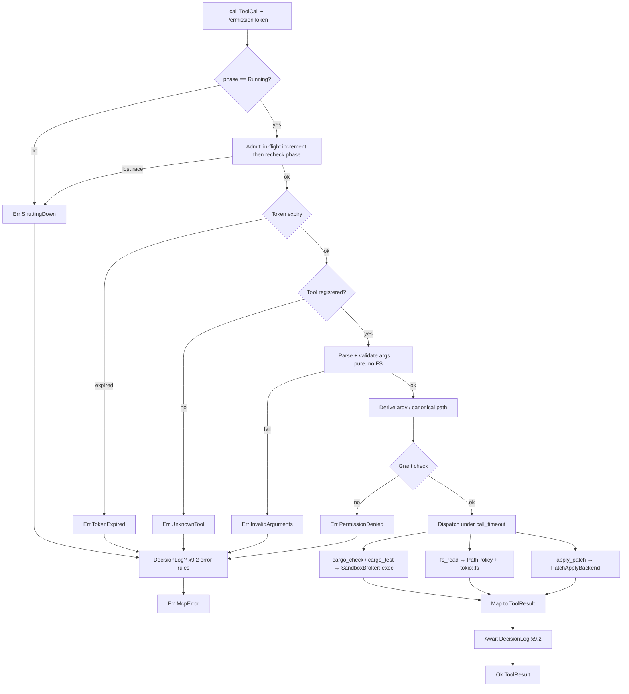
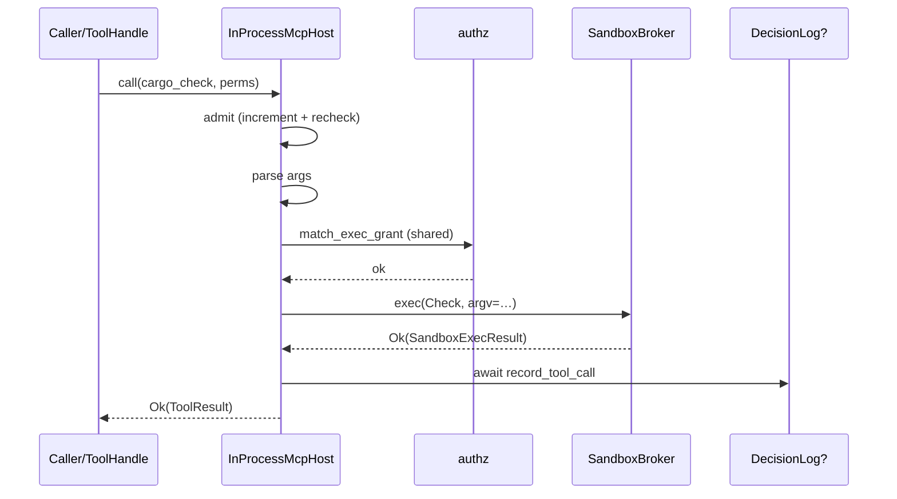
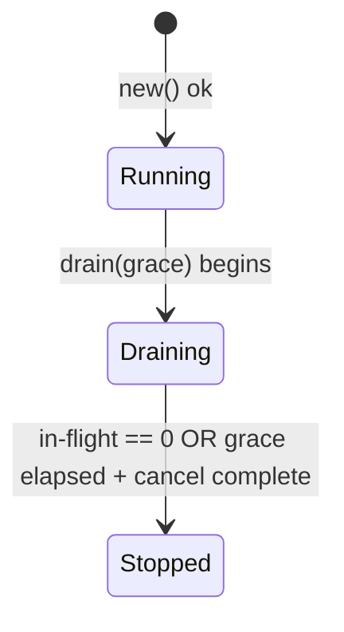

# RFC-0006: MCP Host & In-Process Builtins

| Field | Value |
| --- | --- |
| **Status** | Implemented |
| **Author** | arkadianet |
| **Architecture** | Alloy Architecture V2 (**frozen**) — do not redesign |
| **Depends on** | [RFC-0001](./RFC-0001-alloy-runtime.md) (merged), [RFC-0005](./RFC-0005-sandbox-broker.md) (merged) |
| **Effort** | 8–9.5 person-days |
| **Related RFCs** | [0004](./RFC-0004-observability-cost-metering.md) optional `DecisionLog` injection · [0008](./RFC-0008-edit-engine.md) real `PatchApplyBackend` · [0010](./RFC-0010-scheduler-runtime-adapters.md) consumes `ToolError` / `cargo_check` · [0013](./RFC-0013-capability-registry-workers.md) `ToolHandle` / selectors · [0015](./RFC-0015-cli-profiles-config.md) profile UX |
| **Product** | Alloy — AI Engineering Runtime |
| **Supersedes** | Draft outline of this filename (expanded to implementation grade) |
| **Review** | Principal systems review 2026-07-26 — required gaps closed; third-pass **Approve** |

**Mental model (V2 §12 / ADR F-09 / ADR F-07):** The MCP host is the **sole tool bus**. Every tool call — builtin or (later) external — shares one schema model, one permission path, one dispatch path, and one result model. Day-1 tools are **in-process builtins registered as if they were MCP tools**. Every `Grant::Exec` still runs exclusively through the RFC-0005 Sandbox Broker. Fail closed. Lazy disclosure. No `graph_query` for Alloy workers (ADR F-04). No raw bash in the default profile.

**Authority order (highest → lowest):** current `main` source → merged RFCs 0001–0005 → Architecture V2 → this draft → roadmaps. Never reshape a merged public API solely to match an older V2 sketch or this document’s prior outline.

---

## 1. Overview

### 1.1 Purpose

Ship the MVP **MCP Host & In-Process Builtins** in `alloy-tools` (shared tool IR in `alloy-runtime`):

1. **`McpPlatform` trait** + concrete `InProcessMcpHost` that is the sole tool bus for Alloy.
2. **Four builtins** registered as MCP tools with identical schema / permission / dispatch / result paths: `cargo_check`, `cargo_test`, `fs_read`, `apply_patch`.
3. **Lazy disclosure** via `tools_for(selectors)` — never dump the full catalogue.
4. **Fail-closed `PermissionToken` enforcement** on every `call` before dispatch.
5. **Sandbox integration** — every Exec path calls RFC-0005 `SandboxBroker::exec`; `fs_read` calls `PathPolicy::authorize(..., Read)`.
6. **Injected `PatchApplyBackend`** with a deterministic **Stub** until RFC-0008 wires EditEngine.
7. **Lifecycle, concurrency, shutdown, observability, and tests** sufficient for RFC-0010 / RFC-0013 to consume without inventing types.

### 1.2 Problem Statement

RFC-0001 published `Grant`, `ExecAllow`, `Glob`, `HostAllow`, `PermissionToken`. RFC-0005 shipped `SandboxBroker`, `PathPolicy`, and fail-closed exec. Architecture V2 §12 requires an MCP host as the sole tool bus with lazy disclosure and permission tiers. Without this RFC there is no `McpPlatform`, no builtin schemas, no permissioned `call` path, no lazy `tools_for`, and no choke point preventing workers from inventing ad-hoc tool invocation — violating ADR F-09 (host retained) and ADR F-07 (sandbox-before-dogfood on all tool exec).

### 1.3 Scope

| In scope | Detail |
| --- | --- |
| Shared tool IR in `alloy-runtime` | `ToolName`, `ToolSelector`, `ToolCall`, `ToolView`, `ToolResult`, `ToolError`, `McpServerSpec`, `ServerId` |
| `McpPlatform` + `InProcessMcpHost` | In `alloy-tools::mcp` |
| Builtins | `cargo_check`, `cargo_test`, `fs_read`, `apply_patch` |
| Lazy disclosure | `tools_for` selector filter, ordering, caps, duplicates |
| Permission validation | Expiry, required grants, fail-closed, deterministic denials |
| Sandbox integration | Exact broker / `PathPolicy` entry points per builtin |
| `PatchApplyBackend` + `StubPatchApplyBackend` | Deterministic stub; RFC-0008 replacement contract |
| `ToolHandle` | Capability-facing wrapper (selectors + platform) |
| `start_server` / `stop_server` | MVP stubs — unsupported / empty allowlist |
| Lifecycle / concurrency / shutdown / drain | Normative state machine |
| Observability | Tracing + optional `DecisionLog` + `McpMetricsSnapshot` |
| Tests | Unit, integration, negative, permission, sandbox, cancel, concurrency, schema snapshot |
| RFC-0005 visibility widenings | Listed `pub(crate)` helpers only — no new public sandbox surface |

### 1.4 Non-goals

| Deferred item | Owner |
| --- | --- |
| Custom / out-of-process MCP servers (crates, git, rustdoc, codeintel, community) | **RFC-0013** / V2 deferred — referenced only |
| `graph_query` MCP for Alloy workers | **Deleted** (ADR F-04) — not deferred for workers |
| External-only graph MCP mirror | V2-permitted future extension — **listed deferred, not designed** |
| EditEngine TextPatch / git checkpoint implementation | **RFC-0008** |
| Capability registry / worker logic / `CapabilityContext` assembly | **RFC-0013** |
| Scheduler VerifyCompile adapter behaviour beyond consuming this bus | **RFC-0010** |
| Plugin APIs, extension systems, marketplace concepts | Out of architecture MVP |
| Optional `ra_*` builtins | Deferred (V2 “optional when RA wired”) |
| OTLP, sixth crate, new OS service, redesign of RFC-0005 | Forbidden |
| Writing or overwriting `.env` | Forbidden |

### 1.5 Day-1 MVP (normative)

1. `InProcessMcpHost::new(...)` MUST register exactly the four builtins listed in §5.2 and MUST NOT register `graph_query`, `bash`, `sh`, or any raw-shell tool.
2. `tools_for` MUST return only tools matching the supplied selectors, sorted by `ToolName` ascending byte order, capped at `MAX_TOOLS_PER_DISCLOSURE` (32), and MUST return an empty `Vec` when `selectors` is empty (never the full catalogue). Cap is enforced by a pure disclosure helper over `&[ToolView]` (§4.1) so it is unit-testable with synthetic views.
3. `call` MUST follow the §5.1 pipeline exactly. Precedence for simultaneous failures: `InvalidArguments` **before** `PermissionDenied`. Missing/denied/expired → `Err(McpError::…)` fail closed; never partial execution.
4. `cargo_check` / `cargo_test` MUST invoke `SandboxBroker::exec` with `ExecClass::{Check, Test}` respectively; non-zero child exit MUST surface as `Ok(ToolResult)` with structured payload (not `Err`).
5. `fs_read` MUST call `PathPolicy::authorize(path, PathAccess::Read)` on the path to open, MUST open the **canonical** `PathBuf` returned by authorize, and MUST deny `.env` / deny-glob paths via that policy.
6. `apply_patch` MUST call the injected `PatchApplyBackend`; the MVP stub MUST return the exact deterministic outcome in §3.7.1.
7. `start_server` / `stop_server` MUST return `Err(McpError::Unsupported(...))` in MVP (empty out-of-process allowlist).
8. Builtin tools MUST share the same `ToolView` / `ToolCall` / `ToolResult` / permission / dispatch path as any future external MCP tool would.
9. Host MUST construct `PathPolicy` from `broker.profile()` at `new` (no injectable divergent policy).
10. Exec grant pre-check MUST reuse the RFC-0005 sandbox grant matcher (§5.5) — one authorization implementation — with `OperatorHomes`-derived `trusted_path` (§4.4).

---

## 2. Architecture Integration

### 2.1 Relationship to Architecture V2

| V2 reference | Application |
| --- | --- |
| §12.1 Host responsibilities | `McpPlatform` is sole tool bus; lazy disclosure; fail-closed |
| §12.2 Builtin schemas | Illustrative in V2; **this RFC is the implementation contract** |
| §12.3 Permission model | `FsRead`, `FsWrite`, `Exec`, `Network`, `GitWrite` — reuse `Grant` on `main` |
| §14.2 / ADR F-07 | All Exec through RFC-0005 sandbox; never bare process spawn in builtins |
| ADR F-04 | No builtin `graph_query` for Alloy workers |
| ADR F-09 | Host retained — do not delete or bypass |
| ADR F-16 | `max_parallel_cargo=1` enforced by **scheduler**, not this host |
| §5.4 crate map | Host + builtins live in `alloy-tools`; shared IR in `alloy-runtime` |
| Appendix B | `allow_raw_bash = false` — no bash tool registered |

**V2 sketch superseded by `main` where conflicted:** permission shapes use `Grant` / `ExecAllow { binary, args_glob }` / `HostAllow { host }` as published in `crates/alloy-runtime/src/types/permission.rs`. Tool schemas below are normative for implementation; V2 §12.2 remains illustrative intent only.

### 2.2 Relationship to RFC-0001

Authoritative for: `Grant`, `ExecAllow`, `Glob`, `HostAllow`, `PermissionToken`, `RunId`, `ProfileId`, `Timestamp`, `Digest`, `SessionId`, `NodeId`, `TransactionId`, `IdError`, `ErrorClass`, session event enum including `ToolCall`.

This RFC **adds** tool IR types to `alloy-runtime` and MUST NOT redefine permission types. Expiry comparison MUST use the same rule as RFC-0005: `perms.expires.as_ref().map(|t| t.0)` against `Timestamp::now().0` (`OffsetDateTime`); reject when `now >= expires` (inclusive boundary).

### 2.3 Relationship to RFC-0005

Authoritative for: `SandboxBroker`, `SandboxExecRequest`, `SandboxExecResult`, `SandboxError`, `DenialReason`, `ExecClass`, `PathPolicy`, `PathAccess`, `NativeSandboxBroker`, `RecordingSandboxBroker`, deny globs, quarantine, env scrubbing.

This RFC **consumes** those APIs. It MUST NOT fork a second exec path. Builtins MUST NOT call `std::process::Command` or `tokio::process::Command` (clippy seam from RFC-0005 remains in force — crate-wide `clippy.toml`).

**Cancel note:** RFC-0005 reserved `SandboxError::Cancelled` and deferred an explicit cancel field. This RFC cancels in-flight sandbox work by **dropping** the `exec` future (drop-guard kill per RFC-0005 §6.4). Caller cancel of an MCP `call` is likewise by **dropping the `call` future** (§5.11 / §6.3). No `SandboxExecRequest` modification in MVP.

**Obs note:** RFC-0005 §4 stated `alloy-tools` has no storage/session/obs dependency for the **sandbox** module. This RFC clarifies: `sandbox/` remains free of obs; `mcp/` MAY depend on the `DecisionLog` **trait** only (no storage).

### 2.4 Already implemented | Added by RFC-0006 | Deferred

| Category | Contents |
| --- | --- |
| **Already implemented** | `Grant` / `PermissionToken` / IDs (0001); `DecisionLog` / `ToolCallRecord` (0004); `SandboxBroker` / `PathPolicy` / backends (0005); five-crate workspace; `#![deny(unsafe_code)]` on `alloy-tools` |
| **Added by RFC-0006** | Tool IR types; `McpPlatform`; `InProcessMcpHost`; four builtins; lazy disclosure; permission gate; `PatchApplyBackend` + stub; `ToolHandle`; MCP errors; host lifecycle; metrics snapshot; tests; `pub(crate)` widenings listed in §4.4 |
| **Deferred** | Custom MCP servers (0013 / V2); EditEngine impl (0008); capability workers (0013); `ra_*`; external-only graph mirror (not designed); community MCP allowlists; network-allow profiles |

### 2.5 Dependency boundaries

```text
alloy-cli ──► alloy-tools ──► alloy-runtime
                 ├── sandbox/   (RFC-0005; no DecisionLog)
                 └── mcp/       (RFC-0006; may use DecisionLog trait)

alloy-runtime MUST NOT depend on alloy-tools.
Exactly five workspace crates. No MCP OS service. No sixth crate.
```

Wiring: `alloy-cli` (or runtime host assembly in later RFCs) constructs `NativeSandboxBroker`, `InProcessMcpHost`, and injects `Arc<dyn McpPlatform>` / `ToolHandle` into adapters and workers. `alloy-runtime` publishes tool IR so RFC-0007 / RFC-0010 / RFC-0013 compile against shared types without importing `alloy-tools`.

---

## 3. Public Rust API

### 3.1 Crate root — `alloy-tools` (additive)

```rust
//! Alloy tooling: sandbox broker (RFC-0005) and MCP host (RFC-0006).
#![deny(missing_docs)]
#![deny(unsafe_code)]

pub mod sandbox;
pub mod mcp;

pub use sandbox::{ /* existing RFC-0005 re-exports unchanged */ };

pub use mcp::{
    ApplyPatchArgs, ApplyPatchOutcome, BuiltinToolId, CargoCheckArgs, CargoTestArgs,
    FsReadArgs, InProcessMcpHost, McpError, McpHostConfig, McpHostPhase, McpMetricsSnapshot,
    McpPlatform, PatchApplyBackend, PatchApplyError, PermissionDenial,
    RecordingMcpPlatform, StubPatchApplyBackend, ToolHandle,
    MAX_ARGUMENT_BYTES, MAX_ARG_STRING_BYTES, MAX_FEATURES, MAX_TOOLS_PER_DISCLOSURE,
};

// Re-export shared IR that the trait names (also available from alloy-runtime):
pub use alloy_runtime::{McpServerSpec, McpTransport, ServerId};
```

`alloy-tools` remains `#![deny(unsafe_code)]` at the crate root. MCP modules MUST NOT introduce `unsafe`.

### 3.2 Shared tool IR — `alloy-runtime` (additive)

New module `crates/alloy-runtime/src/types/tools.rs`, re-exported from `types/mod.rs` and the crate root with **explicit** `pub use` (no glob).

```rust
// alloy-runtime/src/types/tools.rs
use serde::{Deserialize, Serialize};
use serde_json::Value;

use super::ids::{IdError, NodeId, RunId, SessionId, TransactionId};

/// Catalog tool name (`cargo_check`, `fs_read`, …).
///
/// Validation (enforced by [`ToolName::new`] **and** by `Deserialize`):
/// non-empty, ≤128 bytes, ASCII `[a-z0-9_]` only.
/// Length **and** charset failures both return `IdError::InvalidName`
/// (Display: `invalid name id`) — no new error variant.
#[derive(Debug, Clone, PartialEq, Eq, PartialOrd, Ord, Hash, Serialize)]
#[serde(transparent)]
pub struct ToolName(String);

impl ToolName {
    pub fn new(s: impl Into<String>) -> Result<Self, IdError> {
        let s = s.into();
        if s.is_empty() || s.len() > 128 {
            return Err(IdError::InvalidName);
        }
        if !s.bytes().all(|b| matches!(b, b'a'..=b'z' | b'0'..=b'9' | b'_')) {
            return Err(IdError::InvalidName);
        }
        Ok(Self(s))
    }
    #[must_use]
    pub fn as_str(&self) -> &str { &self.0 }
}

impl std::fmt::Display for ToolName {
    fn fmt(&self, f: &mut std::fmt::Formatter<'_>) -> std::fmt::Result {
        f.write_str(&self.0)
    }
}

impl<'de> Deserialize<'de> for ToolName {
    fn deserialize<D: serde::Deserializer<'de>>(d: D) -> Result<Self, D::Error> {
        let s = String::deserialize(d)?;
        ToolName::new(s).map_err(serde::de::Error::custom)
    }
}

/// Lazy-disclosure selector (capability `required_tools` / host `tools_for`).
#[derive(Debug, Clone, PartialEq, Eq, Hash, Serialize, Deserialize)]
#[serde(tag = "kind", rename_all = "snake_case")]
pub enum ToolSelector {
    /// Exact tool name.
    Name { name: ToolName },
    /// Tag / group id (e.g. `sel.compiler`). Opaque, case-sensitive, exact equality.
    Tag { tag: String },
}

impl ToolSelector {
    pub fn name(name: ToolName) -> Self { Self::Name { name } }
    pub fn tag(tag: impl Into<String>) -> Self { Self::Tag { tag: tag.into() } }
}

/// One tool invocation request (model or adapter → host).
#[derive(Debug, Clone, PartialEq, Serialize, Deserialize)]
#[non_exhaustive]
pub struct ToolCall {
    pub name: ToolName,
    pub arguments: Value,
    pub call_id: Option<String>,
    pub session: Option<SessionId>,
    pub run: Option<RunId>,
    pub node: Option<NodeId>,
}

impl ToolCall {
    pub fn new(name: ToolName, arguments: Value) -> Self {
        Self { name, arguments, call_id: None, session: None, run: None, node: None }
    }
    #[must_use]
    pub fn with_call_id(mut self, id: impl Into<String>) -> Self {
        self.call_id = Some(id.into());
        self
    }
    #[must_use]
    pub fn with_attribution(
        mut self,
        session: Option<SessionId>,
        run: Option<RunId>,
        node: Option<NodeId>,
    ) -> Self {
        self.session = session;
        self.run = run;
        self.node = node;
        self
    }
}

/// Disclosed tool schema view (lazy disclosure output / model tool list).
#[derive(Debug, Clone, PartialEq, Serialize, Deserialize)]
#[non_exhaustive]
pub struct ToolView {
    pub name: ToolName,
    pub description: String,
    pub input_schema: Value,
    /// Disclosure tags (e.g. `sel.compiler`). Stable, sorted ascending at registration.
    pub tags: Vec<String>,
    /// `true` for in-process builtins; `false` for external servers (none in MVP).
    pub builtin: bool,
}

impl ToolView {
    /// Constructor for tests / eval fixtures (`#[non_exhaustive]` requires this).
    pub fn new(
        name: ToolName,
        description: impl Into<String>,
        input_schema: Value,
        tags: Vec<String>,
        builtin: bool,
    ) -> Self {
        let mut tags = tags;
        tags.sort();
        tags.dedup();
        Self { name, description: description.into(), input_schema, tags, builtin }
    }
}

/// Successful or tool-level-failed invocation payload.
///
/// `is_error` / `error` are **private** so callers cannot break
/// `is_error == error.is_some()` by field assignment. Use constructors + accessors.
#[derive(Debug, Clone, PartialEq, Serialize)]
#[non_exhaustive]
pub struct ToolResult {
    pub name: ToolName,
    pub call_id: Option<String>,
    pub content: Value,
    /// Private — MUST equal `error.is_some()`.
    is_error: bool,
    /// Private — paired with `is_error`.
    error: Option<ToolError>,
    pub duration_ms: u64,
}

impl ToolResult {
    pub fn ok(name: ToolName, content: Value, duration_ms: u64) -> Self {
        Self { name, call_id: None, content, is_error: false, error: None, duration_ms }
    }
    pub fn err(name: ToolName, content: Value, error: ToolError, duration_ms: u64) -> Self {
        Self { name, call_id: None, content, is_error: true, error: Some(error), duration_ms }
    }
    #[must_use]
    pub fn with_call_id(mut self, id: Option<String>) -> Self {
        self.call_id = id;
        self
    }
    #[must_use]
    pub fn is_error(&self) -> bool { self.is_error }
    #[must_use]
    pub fn error(&self) -> Option<&ToolError> { self.error.as_ref() }
    /// Replace content while preserving the ok/err discriminant.
    #[must_use]
    pub fn with_content(mut self, content: Value) -> Self {
        self.content = content;
        self
    }
}

#[derive(Deserialize)]
struct ToolResultDe {
    name: ToolName,
    #[serde(default)]
    call_id: Option<String>,
    content: Value,
    is_error: bool,
    #[serde(default)]
    error: Option<ToolError>,
    duration_ms: u64,
}

impl<'de> Deserialize<'de> for ToolResult {
    fn deserialize<D: serde::Deserializer<'de>>(d: D) -> Result<Self, D::Error> {
        let raw = ToolResultDe::deserialize(d)?;
        if raw.is_error != raw.error.is_some() {
            return Err(serde::de::Error::custom(
                "ToolResult invariant violated: is_error must equal error.is_some()",
            ));
        }
        Ok(Self {
            name: raw.name,
            call_id: raw.call_id,
            content: raw.content,
            is_error: raw.is_error,
            error: raw.error,
            duration_ms: raw.duration_ms,
        })
    }
}

/// Tool-level failure taxonomy (consumed by RFC-0010 retry policy).
#[derive(Debug, Clone, PartialEq, Eq, Serialize, Deserialize, thiserror::Error)]
#[non_exhaustive]
#[serde(tag = "kind", rename_all = "snake_case")]
pub enum ToolError {
    #[error("transient: {code}: {message}")]
    Transient { code: String, message: String },
    #[error("permanent: {code}: {message}")]
    Permanent { code: String, message: String },
    #[error("invalid_args: {message}")]
    InvalidArgs { message: String },
    #[error("execution_failed: exit={exit_code:?} signal={signal:?}: {message}")]
    ExecutionFailed {
        exit_code: Option<i32>,
        signal: Option<i32>,
        message: String,
    },
}

/// Out-of-process server spec.
///
/// **Unstable shape** — owned by future RFC-0013 allowlist work. MVP accepts the value
/// only to return `McpError::Unsupported`. Do not treat as a stable serde product payload.
#[derive(Debug, Clone, PartialEq, Eq, Serialize, Deserialize)]
#[non_exhaustive]
pub struct McpServerSpec {
    pub name: String,
    pub transport: McpTransport,
}

impl McpServerSpec {
    /// Constructor required because the struct is `#[non_exhaustive]`.
    pub fn new(name: impl Into<String>, transport: McpTransport) -> Self {
        Self { name: name.into(), transport }
    }
}

#[derive(Debug, Clone, PartialEq, Eq, Serialize, Deserialize)]
#[serde(tag = "kind", rename_all = "snake_case")]
#[non_exhaustive]
pub enum McpTransport {
    /// Stdio subprocess (deferred).
    Stdio { command: String, args: Vec<String> },
}

/// Opaque server id.
///
/// **Implementation:** add `uuid_id!(ServerId);` in `crates/alloy-runtime/src/types/ids.rs`
/// (same macro as `SessionId` — **no** `Default`, includes `Display`/`parse`).
/// Re-export from `types::tools` and the crate root. Do **not** hand-roll a parallel newtype.
```

**Send/Sync:** all tool IR types are `Send + Sync`.

**Persistence:** tool IR is serde-stable. `ToolName` deserialize MUST reject invalid names (test: `serde_json::from_str::<ToolName>("\"Cargo Check\"")` fails).

### 3.3 `McpError` — `alloy-tools::mcp`

```rust
use std::time::Duration;
use thiserror::Error;
use crate::sandbox::SandboxError;

#[derive(Debug, Error)]
#[non_exhaustive]
pub enum McpError {
    #[error("unknown tool: {0}")]
    UnknownTool(String),

    #[error("permission denied: {0}")]
    PermissionDenied(PermissionDenial),

    #[error("permission token expired")]
    TokenExpired,

    #[error("invalid permission token: {0}")]
    InvalidToken(String),

    #[error("invalid arguments: {0}")]
    InvalidArguments(String),

    #[error("unsupported: {0}")]
    Unsupported(String),

    #[error("host shutting down")]
    ShuttingDown,

    #[error("cancelled")]
    Cancelled,

    #[error("timeout after {0:?}")]
    Timeout(Duration),

    /// Broker / path-policy errors that did not map to a more specific variant.
    /// Construct **only** via `map_sandbox_error` (crate-private) — **no** `#[from]`.
    #[error("sandbox: {0}")]
    Sandbox(SandboxError),

    #[error("internal: {0}")]
    Internal(String),
}

#[derive(Debug, Clone, PartialEq, Eq, Error)]
#[non_exhaustive]
pub enum PermissionDenial {
    #[error("missing grant: {0}")]
    MissingGrant(String),
    #[error("grant does not cover path: {0}")]
    PathNotCovered(String),
    #[error("exec not allowlisted for tool")]
    ExecNotAllowlisted,
    #[error("args not allowlisted for tool")]
    ArgsNotAllowlisted,
    #[error("tool not disclosed for handle selectors")]
    NotDisclosed,
}

/// Sole `SandboxError` → `McpError` conversion. MUST be used instead of `?`/`From`.
pub(crate) fn map_sandbox_error(err: SandboxError) -> McpError {
    match err {
        SandboxError::Denied(reason) => McpError::PermissionDenied(map_denial(reason)),
        SandboxError::TokenExpired => McpError::TokenExpired,
        SandboxError::Timeout(d) => McpError::Timeout(d),
        SandboxError::Cancelled => McpError::Cancelled,
        // Future non-Denied #[non_exhaustive] arms. Messages redacted before wrapping.
        other => McpError::Sandbox(redact_sandbox_error(other)),
    }
}

/// Exhaustive over today's DenialReason arms (no wildcard). When a future RFC adds a
/// DenialReason variant, this match MUST be updated — that is intentional.
fn map_denial(reason: crate::sandbox::DenialReason) -> PermissionDenial {
    use crate::sandbox::DenialReason::*;
    match reason {
        MissingExecGrant => PermissionDenial::MissingGrant("exec".into()),
        ExecNotAllowlisted => PermissionDenial::ExecNotAllowlisted,
        ArgsNotAllowlisted => PermissionDenial::ArgsNotAllowlisted,
        PathDenied(_) => PermissionDenial::PathNotCovered("path denied".into()),
        CwdOutsideJail => PermissionDenial::PathNotCovered("cwd outside jail".into()),
        NetworkDenied => PermissionDenial::MissingGrant("network".into()),
        EnvDenied(_) => PermissionDenial::MissingGrant("env".into()),
        QuarantineBlocked(_) => PermissionDenial::MissingGrant("quarantine".into()),
    }
}

/// Rebuild SandboxError variants whose Display may contain absolute host paths,
/// replacing pathful strings with fixed tokens. Applied at the MCP boundary so
/// models never see operator filesystem layout (§9.1).
fn redact_sandbox_error(err: SandboxError) -> SandboxError {
    match err {
        SandboxError::Invalid(_) => SandboxError::Invalid("invalid sandbox request".into()),
        SandboxError::Internal(_) => SandboxError::Internal("internal sandbox error".into()),
        SandboxError::BackendUnavailable { backend, .. } => SandboxError::BackendUnavailable {
            backend,
            message: "backend unavailable".into(),
        },
        SandboxError::BackendCannotEnforce(_) =>
            SandboxError::BackendCannotEnforce("backend cannot enforce policy".into()),
        SandboxError::Io(_) => SandboxError::Io(std::io::Error::other("sandbox io error")),
        other => other, // Timeout/Cancelled/TokenExpired/UnsupportedOs/Denied already mapped
    }
}
```

Full variant semantics: §8.

### 3.4 `McpPlatform` trait

```rust
use alloy_runtime::{
    McpServerSpec, PermissionToken, ServerId, ToolCall, ToolName, ToolResult, ToolSelector,
    ToolView,
};
use async_trait::async_trait;

#[async_trait]
pub trait McpPlatform: Send + Sync {
    /// MVP: ALWAYS `Err(McpError::Unsupported(...))`.
    async fn start_server(&self, spec: McpServerSpec) -> Result<ServerId, McpError>;

    /// MVP: ALWAYS `Err(McpError::Unsupported(...))`.
    async fn stop_server(&self, id: ServerId) -> Result<(), McpError>;

    /// Lazy disclosure — MUST obey §5.4.
    async fn tools_for(&self, selectors: &[ToolSelector]) -> Result<Vec<ToolView>, McpError>;

    /// Whether `name` is in the disclosed set for `selectors`.
    ///
    /// Default implementation calls [`Self::tools_for`]. Hosts SHOULD override to
    /// avoid cloning full [`ToolView`] schemas on the call hot path (e.g. name/tag
    /// membership only). Empty `selectors` discloses nothing.
    async fn discloses(
        &self,
        selectors: &[ToolSelector],
        name: &ToolName,
    ) -> Result<bool, McpError> {
        Ok(self
            .tools_for(selectors)
            .await?
            .iter()
            .any(|view| &view.name == name))
    }

    /// Invoke a tool under `perms`. Pipeline: §5.1.
    ///
    /// **Cancellation (normative for RFC-0013):** callers cancel an in-flight call by
    /// **dropping** the returned future. Drop MUST release the in-flight permit, drop any
    /// nested `SandboxBroker::exec` future (process-group kill), and MUST NOT write a
    /// `DecisionLog` record for that call. There is no per-call `CancellationToken` field
    /// on `ToolCall` in MVP.
    async fn call(
        &self,
        call: ToolCall,
        perms: PermissionToken,
    ) -> Result<ToolResult, McpError>;
}
```

**Ownership:** implementors are typically `Arc`-wrapped. Trait is `Send + Sync`. `call` takes `PermissionToken` by value.

**async_trait:** REQUIRED on public traits through M1 (RFC-0001 edition decision).

### 3.5 `InProcessMcpHost`

```rust
use std::path::PathBuf;
use std::sync::Arc;
use std::time::Duration;
use tokio_util::sync::CancellationToken;
use alloy_runtime::obs::DecisionLog;
use crate::sandbox::SandboxBroker;

#[derive(Clone, Debug)]
#[non_exhaustive]
pub struct McpHostConfig {
    /// Max concurrent `call` futures. MUST be ≥ 1. Default: 64.
    pub max_in_flight: usize,
    /// Host-level wall-clock timeout around **every** dispatch (including `fs_read` /
    /// `apply_patch`).
    ///
    /// - `None` (default): at `InProcessMcpHost::new`, set to
    ///   `broker.profile().exec_timeout + Duration::from_secs(60)`.
    /// - `Some(d)`: used as-is; construction FAILS if `d < exec_timeout`.
    pub call_timeout: Option<Duration>,
    /// Parent cancel (runtime shutdown). Default: new token.
    pub cancel: CancellationToken,
}

impl McpHostConfig {
    pub fn new() -> Self {
        Self {
            max_in_flight: 64,
            call_timeout: None,
            cancel: CancellationToken::new(),
        }
    }
    #[must_use]
    pub fn with_max_in_flight(mut self, n: usize) -> Self { self.max_in_flight = n; self }
    /// Pin an explicit timeout (must be ≥ profile exec_timeout at host `new`).
    #[must_use]
    pub fn with_call_timeout(mut self, d: Duration) -> Self {
        self.call_timeout = Some(d);
        self
    }
    #[must_use]
    pub fn with_cancel(mut self, c: CancellationToken) -> Self { self.cancel = c; self }
}

impl Default for McpHostConfig {
    fn default() -> Self { Self::new() }
}

#[derive(Debug, Clone, Copy, PartialEq, Eq)]
#[repr(u8)]
pub enum McpHostPhase {
    Running = 1,
    Draining = 2,
    Stopped = 3,
}

#[derive(Debug, Clone, Default, PartialEq, Eq)]
pub struct McpMetricsSnapshot {
    pub calls_ok: u64,
    pub calls_tool_error: u64,
    pub calls_mcp_error: u64,
    pub denials: u64,
    pub disclose_truncated: u64,
    pub in_flight: u64,
}

pub struct InProcessMcpHost { /* private — §4 */ }

impl InProcessMcpHost {
    /// Build host. Constructs `PathPolicy::from_profile(broker.profile(), read_only_roots)`.
    ///
    /// `homes` MUST be the **same** `OperatorHomes` value used to construct the broker
    /// (including any `with_operator_homes` override). The host derives
    /// `trusted_path = trusted_path_dirs(homes) ∪ trusted_roots(homes)` exactly as
    /// `NativeSandboxBroker::exec_inner` does, so grant pre-check and broker auth agree.
    ///
    /// Fails if `max_in_flight == 0`, if an explicitly set `call_timeout` is
    /// `< broker.profile().exec_timeout` (see §6.2), or if `PathPolicy::from_profile` fails.
    pub fn new(
        broker: Arc<dyn SandboxBroker>,
        homes: crate::sandbox::OperatorHomes,
        read_only_roots: Vec<PathBuf>,
        patch_backend: Arc<dyn PatchApplyBackend>,
        config: McpHostConfig,
    ) -> Result<Self, McpError>;

    #[must_use]
    pub fn with_decision_log(self, log: Arc<dyn DecisionLog>) -> Self;

    /// Begin drain: reject new admissions; wait up to `grace` for in-flight; then cancel.
    /// Mirrors `AlloyRuntime::drain(grace)`. See §6.4.
    pub async fn drain(&self, grace: Duration) -> Result<(), McpError>;

    #[must_use]
    pub fn cancellation(&self) -> CancellationToken;

    #[must_use]
    pub fn phase(&self) -> McpHostPhase;

    #[must_use]
    pub fn metrics(&self) -> McpMetricsSnapshot;

    /// Registered tool names (sorted). MVP: exactly the four builtins.
    #[must_use]
    pub fn registered_names(&self) -> Vec<alloy_runtime::ToolName>;
}

#[async_trait]
impl McpPlatform for InProcessMcpHost { /* §5 */ }
```

**PathPolicy:** constructed **inside** `new` from `broker.profile()` + `read_only_roots`. Callers MUST NOT inject a divergent policy. Jail is always `broker.profile().fs_jail`. **OperatorHomes:** required so exec pre-check roots match the broker without extending `SandboxBroker` (§4.4). Wiring MUST build homes once and pass the same value to `NativeSandboxBroker::with_operator_homes(profile, homes.clone())` and `InProcessMcpHost::new(..., homes, ...)`. Host caches `trusted_path` at `new`; broker recomputes per exec — toolchain install/removal after `new` may diverge; broker re-authorization keeps fail-closed. Host pre-check exists for §5.1 ordering determinism (not because the broker would otherwise skip grant matching).

### 3.6 Builtin argument / result DTOs

```rust
#[derive(Debug, Clone, PartialEq, Eq, Serialize, Deserialize)]
pub struct CargoCheckArgs {
    pub workspace_root: String,
    #[serde(default)]
    pub package: Option<String>,
    #[serde(default)]
    pub features: Vec<String>,
    #[serde(default)]
    pub all_features: bool,
    #[serde(default = "default_message_format")]
    pub message_format: String,
}

#[derive(Debug, Clone, PartialEq, Eq, Serialize, Deserialize)]
pub struct CargoTestArgs {
    pub workspace_root: String,
    #[serde(default)]
    pub package: Option<String>,
    #[serde(default)]
    pub test_name_filter: Option<String>,
    #[serde(default)]
    pub jobs: Option<u32>,
}

#[derive(Debug, Clone, PartialEq, Eq, Serialize, Deserialize)]
pub struct FsReadArgs {
    pub path: String,
    #[serde(default = "default_fs_read_max")]
    pub max_bytes: usize,
}

#[derive(Debug, Clone, PartialEq, Eq, Serialize, Deserialize)]
pub struct ApplyPatchArgs {
    pub patch: serde_json::Value,
    #[serde(default)]
    pub dry_run: bool,
}

#[derive(Debug, Clone, PartialEq, Eq, Serialize, Deserialize)]
pub struct ApplyPatchOutcome {
    pub dry_run: bool,
    /// Jail-relative paths only (`/`-separated, no leading `/`, no `..`). Host re-validates.
    pub files_touched: Vec<String>,
    pub transaction_id: Option<TransactionId>,
    /// Operator/model-safe summary — MUST NOT contain raw patch bodies or absolute paths.
    pub message: String,
}

fn default_message_format() -> String { "json".into() }
fn default_fs_read_max() -> usize { 262_144 }

/// Hard cap on serialized `ToolCall.arguments` JSON bytes.
pub const MAX_ARGUMENT_BYTES: usize = 64 * 1024;
/// Max `features` entries for cargo_check.
pub const MAX_FEATURES: usize = 64;
/// Max bytes for any single string field in args.
pub const MAX_ARG_STRING_BYTES: usize = 4096;
```

### 3.7 `PatchApplyBackend` (injection seam before RFC-0008)

```rust
#[async_trait]
pub trait PatchApplyBackend: Send + Sync {
    async fn apply(&self, args: ApplyPatchArgs) -> Result<ApplyPatchOutcome, PatchApplyError>;
}

#[derive(Debug, Error)]
#[non_exhaustive]
pub enum PatchApplyError {
    #[error("unsupported: {0}")]
    Unsupported(String),
    #[error("invalid patch: {0}")]
    InvalidPatch(String),
    #[error("conflict: {0}")]
    Conflict(String),
    #[error("io: {0}")]
    Io(String),
    #[error("internal: {0}")]
    Internal(String),
}

pub struct StubPatchApplyBackend;

#[async_trait]
impl PatchApplyBackend for StubPatchApplyBackend {
    async fn apply(&self, args: ApplyPatchArgs) -> Result<ApplyPatchOutcome, PatchApplyError> {
        let _ = args;
        Err(PatchApplyError::Unsupported(
            "edit_engine_unwired: apply_patch requires RFC-0008 EditEngine".into(),
        ))
    }
}
```

#### 3.7.1 Exact stub behaviour (normative)

When `apply_patch` is called against `StubPatchApplyBackend`:

1. Host validates permissions (§5.5) and parses `ApplyPatchArgs`.
2. Host calls `patch_backend.apply(args).await`.
3. Stub returns `Err(PatchApplyError::Unsupported("edit_engine_unwired: apply_patch requires RFC-0008 EditEngine"))` for **every** input, including `dry_run: true` and empty patches.
4. Host maps that error to:

```text
Ok(ToolResult {
  name: ToolName("apply_patch"),
  call_id: <from call>,
  content: { "code": "edit_engine_unwired", "dry_run": <args.dry_run> },
  is_error: true,
  error: Some(ToolError::Permanent {
    code: "edit_engine_unwired".into(),
    message: "edit_engine_unwired: apply_patch requires RFC-0008 EditEngine".into(),
  }),
  duration_ms: <measured>,
})
```

5. No files are read or written. No git operations occur. No sandbox exec occurs for apply.

#### 3.7.2 RFC-0008 replacement contract

| Requirement | Rule |
| --- | --- |
| Trait stability | RFC-0008 MUST implement `PatchApplyBackend` (adapter over `EditEngine`) OR provide `Arc<dyn PatchApplyBackend>` preserving these signatures |
| Host change | Host MUST NOT require code changes beyond injecting a different `Arc<dyn PatchApplyBackend>` |
| Success mapping | `Ok(outcome)` → host runs §5.9 sanitize → `Ok(ToolResult{is_error:false, content: serialize(sanitized)})` |
| `Unsupported(msg)` | → `ToolError::Permanent { code: "unsupported", message: sanitize_msg(msg) }` except the stub string in §3.7.1 which uses code `edit_engine_unwired` and the fixed message (already safe) |
| `InvalidPatch` | → `ToolError::InvalidArgs { message: sanitize_msg(...) }` |
| `Conflict` | → `ToolError::Permanent { code: "conflict", message: sanitize_msg(...) }` |
| `Io` | → `ToolError::Transient { code: "io", message: "apply_patch io error" }` (fixed; drop backend detail) |
| `Internal` | → `ToolError::Permanent { code: "internal", message: "apply_patch internal error" }` (fixed) |
| Permissions | Still enforced by host **before** backend call |
| Second write stack | Forbidden |
| Output boundary | Host MUST apply §5.9 sanitization on **every** success and error mapping from the backend |

### 3.8 `ToolHandle`

```rust
pub struct ToolHandle {
    platform: Arc<dyn McpPlatform>,
    selectors: Vec<ToolSelector>,
}

impl ToolHandle {
    pub fn new(platform: Arc<dyn McpPlatform>, selectors: Vec<ToolSelector>) -> Self;

    pub async fn tools(&self) -> Result<Vec<ToolView>, McpError>;

    /// If `call.name` ∉ disclosed set for `self.selectors` → `NotDisclosed` before platform call.
    /// Cancellation: drop the future (§3.4).
    pub async fn call(
        &self,
        call: ToolCall,
        perms: PermissionToken,
    ) -> Result<ToolResult, McpError>;

    #[must_use]
    pub fn selectors(&self) -> &[ToolSelector];
}
```

**Clone** via `Arc` clone of platform + owned selectors. `Send + Sync`.

Disclosure check: compute `allowed = tools_for(selectors)` name set; if `call.name` ∉ allowed → `NotDisclosed`. Registry immutable after `new` → no stale-cache issue.

### 3.9 `RecordingMcpPlatform` (test double)

Full double patterned after `RecordingSandboxBroker` (RFC-0005 §3.7):

```rust
use std::collections::VecDeque;
use std::sync::Mutex;

/// FIFO canned `call` outcomes for RFC-0010 / RFC-0013 tests without a real sandbox.
pub struct RecordingMcpPlatform {
    scripts: Mutex<VecDeque<Result<ToolResult, McpError>>>,
    recorded: Mutex<Vec<(ToolCall, PermissionToken)>>,
    views: Vec<ToolView>,
}

impl RecordingMcpPlatform {
    /// Empty script queue; `tools_for` returns `views` filtered by §5.4 helper.
    pub fn new(views: Vec<ToolView>) -> Self;

    /// Convenience: four builtin views with empty schemas for unit tests.
    pub fn with_builtin_views() -> Self;

    /// Push a canned `call` outcome (FIFO).
    pub fn push(&self, outcome: Result<ToolResult, McpError>);

    /// Every `call` is recorded (FIFO) **before** the script is consulted.
    pub fn recorded_calls(&self) -> Vec<(ToolCall, PermissionToken)>;
}

#[async_trait]
impl McpPlatform for RecordingMcpPlatform {
    async fn start_server(&self, _spec: McpServerSpec) -> Result<ServerId, McpError> {
        Err(McpError::Unsupported("recording: start_server".into()))
    }
    async fn stop_server(&self, _id: ServerId) -> Result<(), McpError> {
        Err(McpError::Unsupported("recording: stop_server".into()))
    }
    async fn tools_for(&self, selectors: &[ToolSelector]) -> Result<Vec<ToolView>, McpError> {
        Ok(disclose(&self.views, selectors).0)
    }
    async fn call(&self, call: ToolCall, perms: PermissionToken) -> Result<ToolResult, McpError> {
        self.recorded.lock().unwrap().push((call, perms));
        self.scripts.lock().unwrap().pop_front()
            .unwrap_or_else(|| Err(McpError::Internal("recording exhausted".into())))
    }
}
```

Downstream RFCs that need real sandbox behaviour wrap `InProcessMcpHost` + `RecordingSandboxBroker` instead.

### 3.10 `BuiltinToolId` & constants

```rust
#[derive(Debug, Clone, Copy, PartialEq, Eq, Hash)]
pub enum BuiltinToolId {
    CargoCheck,
    CargoTest,
    FsRead,
    ApplyPatch,
}

impl BuiltinToolId {
    pub const ALL: [BuiltinToolId; 4] = [
        Self::CargoCheck, Self::CargoTest, Self::FsRead, Self::ApplyPatch,
    ];
    #[must_use]
    pub fn name(self) -> ToolName;
    #[must_use]
    pub fn tags(self) -> &'static [&'static str];
}

pub const MAX_TOOLS_PER_DISCLOSURE: usize = 32;

// Canonical tags (normative, case-sensitive):
// cargo_check  → ["sel.compiler"]
// cargo_test   → ["sel.test"]
// fs_read      → ["sel.fs"]
// apply_patch  → ["sel.edit"]
```

### 3.11 Existing permission types (normative — do not change)

Reuse exactly as on `main` / RFC-0005 §3.2. No parallel permission system.

### 3.12 Visibility & construction summary

| Item | Crate | Visibility | Constructed by |
| --- | --- | --- | --- |
| Tool IR | `alloy-runtime` | `pub` | callers / serde |
| `McpPlatform` | `alloy-tools` | `pub` trait | impls |
| `InProcessMcpHost` | `alloy-tools` | `pub` | `new` + `with_decision_log` |
| `StubPatchApplyBackend` | `alloy-tools` | `pub` | unit struct |
| `ToolHandle` | `alloy-tools` | `pub` | `ToolHandle::new` |
| `RecordingMcpPlatform` | `alloy-tools` | `pub` | `new` / `with_builtin_views` |
| Builtin handlers | `alloy-tools` | `pub(crate)` | host registry |
| `map_sandbox_error` | `alloy-tools` | `pub(crate)` | internal |
| `disclose` helper | `alloy-tools` | `pub(crate)` | host + recording + tests |

---

## 4. Internal Module Design

```text
crates/alloy-runtime/src/types/
  tools.rs          # ToolName, ToolSelector, ToolCall, ToolView, ToolResult, ToolError,
                    # McpServerSpec, McpTransport, ServerId

crates/alloy-tools/src/mcp/
  mod.rs            # re-exports; module docs
  error.rs          # McpError, PermissionDenial, map_sandbox_error, map_denial, redact_sandbox_error
  platform.rs       # McpPlatform trait
  host.rs           # InProcessMcpHost, McpHostConfig, McpHostPhase, drain, admission
  registry.rs       # Builtin registration table (immutable after new)
  disclose.rs       # pub(crate) fn disclose(views, selectors) -> (Vec<ToolView>, bool)
  authz.rs          # token expiry + per-tool grant checks (reuses sandbox::grant)
  handle.rs         # ToolHandle
  recording.rs      # RecordingMcpPlatform
  patch.rs          # PatchApplyBackend, StubPatchApplyBackend, PatchApplyError
  metrics.rs        # McpMetricsSnapshot atomics
  builtins/
    mod.rs          # BuiltinToolId, dispatch match
    cargo_check.rs
    cargo_test.rs
    fs_read.rs
    apply_patch.rs
  schema/
    mod.rs          # JSON Schema Value constants + snapshot fixtures
```

### 4.1 Responsibilities

| Module | Owns | Must not |
| --- | --- | --- |
| `registry` | name → handler + `ToolView` | mutate after `new` |
| `disclose` | pure filter/sort/cap over `&[ToolView]` | expose unregistered tools; touch IO |
| `authz` | grant/expiry checks via shared sandbox matcher | spawn processes; duplicate match logic |
| `builtins/cargo_*` | argv build + sandbox call + result map | bare `Command` |
| `builtins/fs_read` | `PathPolicy` read + byte cap | ignore deny globs; open non-canonical path |
| `builtins/apply_patch` | backend call + error map | implement EditEngine |
| `host` | lifecycle, admission, timeout, obs | redefine sandbox policy |

**`disclose` purity (normative):**

```rust
pub(crate) fn disclose(
    views: &[ToolView],
    selectors: &[ToolSelector],
) -> (Vec<ToolView>, bool /* truncated */);
```

Implements the pure filter/sort/cap portion of §5.4. Host handles phase check + metrics. Unit tests call this with synthetic `ToolView::new(...)` lists to prove the cap.

### 4.2 Dependency direction

```text
host → registry → builtins → (sandbox broker | path_policy | patch_backend)
host → disclose → registry
host → authz → sandbox::grant (pub(crate))
handle → dyn McpPlatform
builtins MUST NOT import handle
mcp MUST NOT import alloy-runtime::storage or session control plane
sandbox/ MUST NOT import mcp/
```

### 4.3 Injection points

| Dependency | Type | Required |
| --- | --- | --- |
| Sandbox broker | `Arc<dyn SandboxBroker>` | yes |
| Operator homes | `OperatorHomes` (same instance semantics as broker) | yes |
| RO roots | `Vec<PathBuf>` | yes (may be empty; unused by MVP `fs_read` jail-only rule — reserved so RFC-0008 need not change `new`) |
| Patch backend | `Arc<dyn PatchApplyBackend>` | yes (stub in MVP) |
| Decision log | via `with_decision_log` | no |
| Cancel / timeouts | `McpHostConfig` | yes (defaults) |

### 4.4 RFC-0005 visibility widenings (crate-private only)

**No new `pub` sandbox API.** Changes below are `pub(crate)` only so `crate::mcp` can import them.

#### Module path visibility (REQUIRED — otherwise `pub(crate)` items are unreachable)

In `crates/alloy-tools/src/sandbox/mod.rs`, change:

```rust
pub(crate) mod grant;
pub(crate) mod path;
```

(`mod glob`, `mod broker`, backends stay private.) FsRead grant glob expansion is specified inline in §5.5 and MUST match RFC-0005 deny expansion on the §5.5 example table (asserted by `fs_read_grant_examples_table`).

#### Items

| Item | Current on main | Change | Reason |
| --- | --- | --- | --- |
| `mod grant` / `mod path` | private modules | `pub(crate) mod` | path reachability from `mcp` |
| `match_exec_grant` | already `pub(crate)` | keep | single Exec authorization |
| `MatchedExec`, `ResolvedBinary` | already `pub(crate)` | keep (now mcp-visible) | matcher return types |
| `trusted_path_dirs`, `trusted_roots` | `pub(crate)` in grant.rs | keep; reachable once `mod grant` is `pub(crate)` | host builds same root set as broker |
| `PathPolicy::jail(&self) -> &Path` | already `pub(crate)` | keep | jail membership |
| `relative_for_matching` | already `pub(crate)` in `path.rs` | keep; `mcp` MUST call this (alias name `jail_relative` in mcp code is fine) | `fs_read` grant subject + content `path` — same rendering as deny-glob matching |

MUST NOT re-export these from the `alloy-tools` crate root.

**Trusted-path construction (normative, shared with broker):**

```rust
let path_dirs = trusted_path_dirs(Some(&homes.cargo_home), Some(&homes.rustup_home));
let mut trusted_path = path_dirs;
for root in trusted_roots(Some(&homes.cargo_home), Some(&homes.rustup_home)) {
    if !trusted_path.contains(&root) {
        trusted_path.push(root);
    }
}
```

Host stores this `Vec<PathBuf>` at `new` from the injected `OperatorHomes`. Sync FS probes inside `match_exec_grant` / `resolve_executable` run inline on the async worker in MVP (acceptable; same as broker pre-spawn work). Unit tests that assert grant matching MUST supply `homes` pointing at a fixture toolchain dir containing a fake `cargo` binary (or use basename-form grants with `RecordingSandboxBroker` **and** a temp trusted bin dir).

---

## 5. Execution Algorithm

### 5.1 Request lifecycle pipeline

**Ordering is normative.** Precedence when multiple failures apply: earlier step wins.



Error exits also pass through DecisionLog rules in §9.2 (not shown as success).

**Admission protocol (normative — StorageGate pattern):**

1. Load phase with `SeqCst`. If not `Running` → `ShuttingDown`.
2. Acquire semaphore permit (`max_in_flight`).
3. **Re-check** phase with `SeqCst`. If not `Running`, release permit → `ShuttingDown`.
4. Hold permit until `call` future completes **or is dropped** (permit released on `Drop`).

**`InvalidArguments` precedes `PermissionDenied`.** A call that is both malformed and ungranted returns `InvalidArguments`.

### 5.2 Builtin registration table (immutable)

| Name | Tags | Handler | Required grants (host gate) |
| --- | --- | --- | --- |
| `cargo_check` | `sel.compiler` | §5.6 | Exec grant matching intended argv via **shared** `match_exec_grant` |
| `cargo_test` | `sel.test` | §5.7 | same |
| `fs_read` | `sel.fs` | §5.8 | `FsRead` covering jail-relative path + PathPolicy Read |
| `apply_patch` | `sel.edit` | §5.9 | ≥1 `FsWrite` |

**Forbidden registrations (MUST NOT appear):** `graph_query`, `bash`, `sh`, `shell`, `raw_exec`, `clippy_lint`, `miri_test`, `ra_*` (until a future RFC adds them).

### 5.3 Normative JSON Schemas

#### 5.3.1 `cargo_check`

```json
{
  "type": "object",
  "properties": {
    "workspace_root": { "type": "string" },
    "package": { "type": ["string", "null"] },
    "features": { "type": "array", "items": { "type": "string" } },
    "all_features": { "type": "boolean", "default": false },
    "message_format": { "type": "string", "enum": ["json"], "default": "json" }
  },
  "required": ["workspace_root"],
  "additionalProperties": false
}
```

Description (exact): `Run cargo check and return structured rustc messages`.

#### 5.3.2 `cargo_test`

```json
{
  "type": "object",
  "properties": {
    "workspace_root": { "type": "string" },
    "package": { "type": ["string", "null"] },
    "test_name_filter": { "type": ["string", "null"] },
    "jobs": { "type": ["integer", "null"], "minimum": 1 }
  },
  "required": ["workspace_root"],
  "additionalProperties": false
}
```

Description: `Run cargo test and return structured results`.

**No `timeout_secs` field** — host `call_timeout` + broker `exec_timeout` own deadlines (avoids a schema knob that does nothing).

#### 5.3.3 `fs_read`

```json
{
  "type": "object",
  "properties": {
    "path": { "type": "string" },
    "max_bytes": { "type": "integer", "default": 262144, "minimum": 1, "maximum": 1048576 }
  },
  "required": ["path"],
  "additionalProperties": false
}
```

Description: `Read a UTF-8 text file under the workspace jail`.

#### 5.3.4 `apply_patch`

```json
{
  "type": "object",
  "properties": {
    "patch": {},
    "dry_run": { "type": "boolean", "default": false }
  },
  "required": ["patch"],
  "additionalProperties": false
}
```

Description: `Apply a unified diff / TextPatch via EditEngine`.

`patch` MUST be either a JSON string (unified diff) or a JSON object (opaque to RFC-0006). MVP stub does not interpret contents.

### 5.4 Lazy disclosure — `tools_for`

#### Algorithm (normative)

**Host wrapper `tools_for`:**
1. If host phase ≠ `Running` → `Err(ShuttingDown)`.
2. Let `(views, truncated) = disclose(&registry_views, selectors)` (pure helper below).
3. If `truncated`: increment `disclose_truncated`; tracing `warn` with `truncated=true`, `returned=32`.
4. Return `Ok(views)`.

**Pure helper `disclose(views, selectors) -> (Vec<ToolView>, bool /* truncated */)`:**
1. If `selectors.is_empty()` → return `(vec![], false)` (**MUST NOT** return the catalogue).
2. Let `out: BTreeMap<ToolName, ToolView> = {}`.
3. For each selector in **input order**:
   - `Name { name }`: if a view with that name exists in `views`, insert it.
   - `Tag { tag }`: insert every view whose `tags` contains an exact match.
   - Unknown names / tags that match nothing: **silently ignored**.
4. Build `Vec` from map values sorted by `ToolName` ascending.
5. If `len > MAX_TOOLS_PER_DISCLOSURE` (32): truncate to first 32 and return `(vec, true)`; else return `(vec, false)`.

#### Why the full catalogue is never exposed

Eager MCP schema tax exhausts model context (V2 §12). Empty selectors mean “disclose nothing”, not “disclose all”. Truncation is a safety cap, not pagination.

#### Duplicate handling

Overlapping selectors collapse by `ToolName`. Views per name are identical.

### 5.5 Permission enforcement

#### Validation point

After argument parse (pure) and path/argv derivation; before any filesystem open or sandbox spawn. `tools_for` does **not** require a `PermissionToken`.

#### Token checks (ordered)

| Step | Condition | Error |
| --- | --- | --- |
| 1 | `expires: Some(t)` and `Timestamp::now().0 >= t.0` | `TokenExpired` |
| 2 | Tool-specific grant rules below | `PermissionDenied(...)` |
| 3 | Uncompilable grant glob pattern | `InvalidToken("grant glob: …")` |

**Malformed token:** typed Rust value in MVP; `InvalidToken` used for uncompilable grant globs and defensive invariants only.

#### Per-tool grant rules

**`cargo_check` / `cargo_test`**

1. Build intended argv (§5.6 / §5.7).
2. Resolve `cwd` = canonicalize `workspace_root` relative to jail; require membership via `PathPolicy::authorize_cwd` (map denials via `map_sandbox_error`).
3. Call **`sandbox::grant::match_exec_grant(&perms, &argv, backend, &cwd, &self.trusted_path)`** where `backend = profile.backend_for(class)` and `self.trusted_path` is the vector built at `new` from the injected `OperatorHomes` (§4.4). Same function the broker uses — path-form and basename-form `ExecAllow.binary` both work.
4. Map matcher errors through `map_sandbox_error` (preserves `ExecNotAllowlisted` vs `ArgsNotAllowlisted`).

**`fs_read`**

1. Resolve input path: if relative, join with jail; if absolute, use as-is.
2. `let canon = path_policy.authorize(&path, PathAccess::Read)?` via `map_sandbox_error`.
3. **MVP:** if `canon` is not under `path_policy.jail()`, return `PermissionDenied(PathNotCovered("outside jail".into()))` — out-of-jail RO-root reads are **not** supported for `fs_read` in MVP (keeps content `path` jail-relative well-defined).
4. Let `rel = relative_for_matching(&canon, path_policy.jail())?` (`/`-separated, no leading `/`; map Err via `map_sandbox_error`).
5. Require ≥1 `Grant::FsRead(Glob)` matching `rel` under the dialect below. Zero FsRead grants → `MissingGrant("fs_read")`. Some grants but none match → `PathNotCovered(rel)` (rel is jail-relative — safe to return).

**`FsRead` glob dialect (normative):**

Builder: `GlobBuilder::new(pat).literal_separator(true).case_insensitive(cfg!(target_os = "macos")).backslash_escape(true)`.

Expansion (same spirit as RFC-0005 §3.6 deny expansion):

| Pattern form | Matchers added |
| --- | --- |
| contains `/`, does not start with `**/` | `pat` and `**/`+`pat` |
| contains `/`, starts with `**/` | `pat` only |
| no `/` | `pat` and `**/`+`pat` |

Full-match against jail-relative path. Uncompilable pattern → `InvalidToken`.

**Normative examples (MUST be unit tests `fs_read_grant_examples_table`):**

| Grant glob | jail-relative path | Match? |
| --- | --- | --- |
| `src/main.rs` | `src/main.rs` | yes |
| `src/**` | `src/main.rs` | yes |
| `*.rs` | `src/main.rs` | yes (via `**/*.rs` expansion) |
| `*.rs` | `main.rs` | yes |
| `**/*.rs` | `src/lib.rs` | yes |
| `src/**` | `README.md` | no |
| `.env` | `.env` | PathPolicy deny wins first |

**`apply_patch`**

1. Require ≥1 `Grant::FsWrite(_)`. If none → `MissingGrant("fs_write")`.
2. MVP stub does not path-expand the patch; fine-grained path grants → RFC-0008.

**`Grant::Network` / `Grant::GitWrite`:** ignored by all four MVP builtins.

#### Hand-rolled JSON argument validation (normative)

MVP MUST NOT add a schema crate. Validators MUST enforce:

| Rule | Limit / behaviour |
| --- | --- |
| Serialized `arguments` bytes | ≤ `MAX_ARGUMENT_BYTES` (64 KiB) else `InvalidArguments("arguments too large")` |
| Root | JSON object; unknown keys → `InvalidArguments("additional property: …")` |
| Any string field | ≤ `MAX_ARG_STRING_BYTES` (4096); NUL bytes forbidden |
| `cargo_check.features` | ≤ `MAX_FEATURES` (64) entries |
| `cargo_check` | `workspace_root` non-empty; `package` non-empty string **or** null/absent (**reject** `""`); `features` string array with **no empty entries** (reject `""`); `all_features` bool; `message_format` absent/`"json"` only |
| `cargo_test` | `workspace_root` non-empty; `package` non-empty string **or** null/absent (**reject** `""`); `test_name_filter` non-empty string **or** null/absent (**reject** `""`); `jobs` integer ≥1 or null/absent |
| `fs_read` | `path` non-empty; `max_bytes` in `1..=1048576` (default 262144) |
| `apply_patch` | `patch` present; `dry_run` bool (default false) |

Type mismatches → `InvalidArguments` with prefix `type error: <field>`.
Explicitly empty optional strings (`""` for `package` / `test_name_filter`, or `""` inside `features`) → `InvalidArguments("empty string: <field>")`. Absent or JSON `null` remains omission (no argv flag).

Host MUST reject oversized args **before** grant check so broker argv caps are not the first line of defence for model input. Relationship: host caps ensure intended argv stays within RFC-0005 argv limits (256 elems / 64 KiB) for legal cargo feature lists.

#### Denied vs missing

| Situation | Variant |
| --- | --- |
| Zero grants of the needed kind | `MissingGrant` |
| Some grants but path/argv not covered | `PathNotCovered` / `ExecNotAllowlisted` / `ArgsNotAllowlisted` |
| ToolHandle disclosure miss | `NotDisclosed` |

Deterministic functions of `(tool, parsed_args, perms, policy, backend)` — wall-clock only via expiry.

#### Fail-closed

On any permission error: no sandbox spawn, no file read, no backend apply, no partial writes.

### 5.6 `cargo_check` execution

#### Argv mapping

```text
argv = ["cargo", "check"]
+ optional ["-p", package] if package is Some  // empty already rejected at validation
+ if all_features { ["--all-features"] }
  else for f in features { ["--features", f] }  // entries non-empty by validation
+ ["--message-format", "json"]
```

#### Sandbox request

```rust
SandboxExecRequest::new(
    argv,
    cwd,                 // authorize_cwd'ed
    perms.clone(),
    ExecClass::Check,
)
// env_allow: empty
```

#### Result mapping

| Sandbox outcome | MCP result |
| --- | --- |
| `Ok(r)` `exit_code == Some(0)` | `Ok(ToolResult::ok)` content §5.6.1 |
| `Ok(r)` other exit / signal | `Ok(ToolResult::err)` `ExecutionFailed { exit_code, signal, … }` |
| any `Err(e)` | `Err(map_sandbox_error(e))` |

#### 5.6.1 Content shape

```json
{
  "exit_code": 0,
  "signal": null,
  "stdout_utf8": "<lossy UTF-8>",
  "stderr_utf8": "<lossy UTF-8>",
  "stdout_truncated": false,
  "stderr_truncated": false,
  "duration_ms": 123,
  "backend": "landlock",
  "policy_digest": "<hex>"
}
```

Messages are not re-parsed in MVP. Lossy UTF-8 REQUIRED.

### 5.7 `cargo_test` execution

**Exact argv construction (normative):**

```text
argv = ["cargo", "test"]
+ optional ["-p", package] if package is Some  // empty already rejected at validation
+ optional ["--jobs", jobs.to_string()] if jobs is Some
+ ["--", "--nocapture"]
+ optional [test_name_filter] if test_name_filter is Some  // empty rejected at validation
  // filter AFTER `--` so it is a test-name filter, not a cargo option
```

**Worked example**

Inputs: `package=None`, `jobs=Some(2)`, `test_name_filter=Some("foo")`

```text
argv = ["cargo", "test", "--jobs", "2", "--", "--nocapture", "foo"]
args_glob subject (argv[1..], space-joined) =
  "test --jobs 2 -- --nocapture foo"
```

`ExecClass::Test`. Result mapping identical to §5.6. Unit test: `argv_cargo_test_mapping`.

### 5.8 `fs_read` execution

1. Permission + PathPolicy (§5.5) → `canon`.
2. Open **`canon`** (the `PathBuf` returned by `authorize`), not the raw args path. Use **`tokio::fs` only** (no `std::fs` in the async path).
3. Residual risk: TOCTOU between authorize and open. Document in `docs/security/sandbox-residual-risk.md` under a new “MCP fs_read” subsection: MVP accepts the race inside a single-process trusted host; open the canonical path. Fail closed on open/read errors per the table below.
4. Metadata / open / read error mapping (normative):

| Condition | Result |
| --- | --- |
| Not a regular file after canonicalize (dir/socket/…) — symlinks are resolved by `authorize` before this check | `Ok(ToolResult::err)` `Permanent { code: "not_a_file", … }` |
| Open/read `NotFound` | `Permanent { code: "not_found", … }` |
| Open/read `PermissionDenied` (EACCES) | `Permanent { code: "io_denied", … }` |
| Other IO | `Transient { code: "io", message: "fs_read io error" }` (no raw OS strings) |
| Invalid UTF-8 interior to the returned buffer (see step 6) | `Permanent { code: "not_utf8", … }` with no body |

5. Let `cap = min(max_bytes, 1_048_576)`. Read at most `cap` bytes via `tokio::fs`. Let `raw` be the bytes read. Let `capped = metadata().len() as usize > raw.len()` (same metadata call as the regular-file check) **or** equivalently `raw.len() == cap && file longer` — normative: `capped = (meta.len() as u64) > (raw.len() as u64)`.
6. **UTF-8 decode (normative):**
   1. Match `str::from_utf8(&raw)`:
   2. `Ok(text)` → success with that text; `truncated = capped`.
   3. `Err(e)` let `v = e.valid_up_to()`:
      - **Cap-induced incomplete code point at end** (`capped` **and** `e.error_len().is_none()`):
        - if `v > 0`: success with `text = &raw[..v]` (trim trailing incomplete sequence); `truncated = true`.
        - if `v == 0` and `raw` is non-empty: success with **empty** `text` (`""`); `truncated = true`
          (entire buffer is an incomplete leading multibyte sequence clipped by `max_bytes`).
      - **Otherwise** (interior invalid bytes — `error_len().is_some()`, or incomplete/invalid at end when **not** capped): `Permanent { code: "not_utf8", … }` with no body — do **not** silently trim interior corruption.
7. Success content:

```json
{
  "path": "<jail-relative>",
  "bytes": 123,
  "truncated": false,
  "text": "..."
}
```

`bytes` = length of returned UTF-8 text in bytes. `truncated` as computed in step 6.

**No sandbox exec** for reads.

### 5.9 `apply_patch` execution

1. Permission gate (§5.5).
2. `patch_backend.apply(args)`.
3. **Host output boundary (normative)** before returning `ToolResult`:

| Field / error text | Rule |
| --- | --- |
| `files_touched` | Each entry MUST be jail-relative: non-empty, `/`-separated, no leading `/`, no `\\`, no `.` or `..` path segments, ≤ `MAX_ARG_STRING_BYTES`. On any violation → do **not** forward the outcome; return `Ok(ToolResult::err)` with `Permanent { code: "unsafe_backend_output", message: "files_touched failed validation" }` and content `{ "code": "unsafe_backend_output" }`. |
| `message` | Run `sanitize_msg`: strip absolute path prefixes (`/`, drive letters), reject if length > 512 or contains NUL; on reject use fixed `"apply_patch completed"`. MUST NOT forward raw patch bodies. |
| Backend error strings | `Io`/`Internal` use fixed messages (§3.7.2). `Unsupported`/`InvalidPatch`/`Conflict` pass through `sanitize_msg` (max 512, no abs paths, no NUL); on reject use the fixed code-only message for that variant. |

4. Map sanitized success/error per §3.7 / §8.4.

### 5.10 Sequence — successful `cargo_check`



### 5.11 Cancellation

```mermaid
sequenceDiagram
  participant W as Caller
  participant H as Host
  participant B as Broker

  W->>H: call(...) future
  H->>B: exec future
  W--xH: drop call future
  H--xB: drop exec future
  Note over B: drop guard kills process group
  Note over H: release in-flight permit; no DecisionLog record
```

Host-wide shutdown cancel (§6.4) uses the same drop path after grace expires, returning `Err(Cancelled)` to still-polled callers. Dropped callers receive no value.

**RFC-0013 contract:** per-node cancel = drop the `ToolHandle::call` / `McpPlatform::call` future for that node. No extra token field required on `ToolCall` in MVP.

### 5.12 Host-level `call_timeout` and shutdown cancel

Every dispatch (cargo / fs_read / apply_patch) runs under:

```rust
tokio::select! {
    _ = self.cancel.cancelled() => Err(McpError::Cancelled),
    result = tokio::time::timeout(effective_call_timeout, dispatch_fut) => match result {
        Ok(inner) => inner,
        Err(_) => Err(McpError::Timeout(effective_call_timeout)),
    },
}
```

| Outcome | Behaviour |
| --- | --- |
| `call_timeout` fires | drop nested exec/IO future; `Err(Timeout(effective_call_timeout))` |
| `cancel` fires (drain step 3) | drop nested future; `Err(Cancelled)` for **still-polled** callers |
| caller drops `call` future | nested drop; no return value; no DecisionLog |

`McpError::Timeout` is reachable for all builtins. `McpError::Cancelled` is produced **only** by the host (RFC-0005 broker `Cancelled` is unreachable without a request cancel field).

---

## 6. Lifecycle & Concurrency

### 6.1 Host state machine



| State | `tools_for` | new `call` admissions | in-flight `call` |
| --- | --- | --- | --- |
| Running | service | service | run |
| Draining | `Err(ShuttingDown)` | `Err(ShuttingDown)` | finish until grace; then cancel |
| Stopped | `Err(ShuttingDown)` | `Err(ShuttingDown)` | none |

Observable via `phase()`.

**`Drop` for `InProcessMcpHost` (normative):** cancellation ownership is a **host-owned drop guard**, not shared inside `Arc` state and not delegated to callers.

```rust
struct CancelOnDrop(CancellationToken);
impl Drop for CancelOnDrop {
    fn drop(&mut self) { self.0.cancel(); }
}

struct HostState { /* phase, registry, broker, trusted_path, … — NO Drop cancel */ }

pub struct InProcessMcpHost {
    state: Arc<HostState>,
    /// Unique to this host value — MUST NOT live inside `state`.
    cancel_guard: CancelOnDrop,
}
```

Rules:
1. `InProcessMcpHost` is **not** `Clone`. Callers share it as `Arc<InProcessMcpHost>` (or a single owner).
2. When the last `Arc<InProcessMcpHost>` (or the by-value owner) is dropped, `CancelOnDrop` runs and cancels the token.
3. `cancellation()` returns `self.cancel_guard.0.clone()` — clones are **waiters only**; retaining a cloned token MUST NOT keep the host alive and MUST NOT prevent cancel-on-drop.
4. After host-owner destruction, any still-alive waiter on a cloned token MUST observe cancellation (tokio `CancellationToken` broadcast).
5. In-flight `call` / `drain` use the **same** token (`cancel_guard.0`); do **not** store a second independent `CancellationToken` in `HostState`.

There is **no** `Running → Stopped` phase transition after destruction. Drain-step cancellation (§6.4 step 3) calls `cancel_guard.0.cancel()` (same token) and is otherwise unchanged.

**Test:** `host_drop_cancels_cloned_waiter` — spawn a task waiting on `host.cancellation().cloned()`; drop the host owner; waiter completes as cancelled within a short timeout.

### 6.2 Startup

1. Validate `config.max_in_flight >= 1` else `McpError::Internal("max_in_flight must be >= 1")`.
2. Resolve effective `call_timeout`: if `config.call_timeout` is `None` → `broker.profile().exec_timeout + 60s`; if `Some(d)` and `d < exec_timeout` → `Internal("call_timeout < exec_timeout")`; else use `d`.
3. Build `trusted_path` from `homes` per §4.4.
4. `PathPolicy::from_profile(broker.profile(), read_only_roots)?` mapped via `map_sandbox_error` / `Internal`.
5. Build immutable registry of four builtins + schemas.
6. Phase = `Running`. No background tasks.

### 6.3 Concurrent calls

| Rule | Value |
| --- | --- |
| Concurrent `call` | ALLOWED up to `max_in_flight` |
| Excess | wait on Tokio semaphore |
| Concurrent `tools_for` | ALLOWED; no permit |
| Drop of `call` future | release permit; drop nested exec; **no** DecisionLog write; drain’s in-flight counter decrements |
| Fairness | no tool-name priority; scheduler owns `max_parallel_cargo=1` |
| Ordering | none across calls |

### 6.4 Shutdown / drain

**Primitives (normative):** `phase: AtomicU8` (`SeqCst`) + `tokio::sync::Notify` (`drain_notify`) + in-flight `AtomicUsize` + semaphore.

**Notify ordering (normative — avoid lost wakeups):** always subscribe *before* re-checking the condition:

```rust
let notified = drain_notify.notified();
tokio::pin!(notified);
if condition_met() { break; }
notified.await;
```

```text
drain(grace):
  1. Loop compare_exchange phase:
       Stopped  → return Ok(())                         // idempotent
       Draining → follower: wait (enable-then-check) until Stopped OR  grace+5s
                  bound; then Ok(()) (or Ok if already Stopped)
       Running  → CAS Running→Draining; on success become winner; else retry
  2. Winner: wait until in_flight == 0 OR grace elapsed
       `tokio::select!` between `sleep(grace)` and enable-then-check in_flight==0 loop
       (in-flight decrements MUST `notify_waiters`)
  3. If in_flight > 0: `cancel.cancel()` so still-polled calls observe cancel (§5.12)
  4. Wait up to **additional** `Duration::from_secs(5)` for in_flight == 0
       (enable-then-check). If still > 0 after 5s → still set Stopped, then return
       `Err(Internal("drain: in-flight did not reach 0"))`
  5. Store phase = Stopped; `drain_notify.notify_waiters()`; Ok(())
```

Callers blocked on the semaphore when drain begins: when a permit frees they recheck phase and receive `ShuttingDown` (semaphore is **not** closed). Winner/follower election uses only the phase CAS — no separate mutex.

**Test:** `drain_idempotent_concurrent_followers` — two concurrent `drain(grace)` both `Ok`, `phase()==Stopped`, wrapped in `tokio::time::timeout` so a lost wakeup fails the suite.

### 6.5 Synchronization

| Resource | Sync |
| --- | --- |
| Registry | immutable after `new` |
| Phase | `AtomicU8` with `SeqCst` loads/stores |
| Drain wakeups | `tokio::sync::Notify` (`drain_notify`) |
| Admission | semaphore + phase recheck (§5.1) |
| In-flight count | atomic; inc on admit; dec on future drop/complete **and** `notify_waiters` |
| Trusted path | immutable `Vec<PathBuf>` from `homes` at `new` |
| Recording double | `Mutex<VecDeque<…>>` / `Mutex<Vec<…>>` |
| DecisionLog | awaited inline before `call` returns (success **and** mapped error paths in §9.2); errors `warn` only |

### 6.6 Startup failure modes

| Failure | Result |
| --- | --- |
| `max_in_flight == 0` | `Err(Internal("max_in_flight must be >= 1"))` |
| `call_timeout: Some(d)` with `d < exec_timeout` | `Err(Internal("call_timeout < exec_timeout"))` |
| `call_timeout: None` | set effective timeout = `exec_timeout + 60s` (never fails this check) |
| `PathPolicy::from_profile` fails | `Err(map_sandbox_error(...))` or `Internal` |
| Schema constant invalid | panic in tests / `Internal` at `new` |

---

## 7. Configuration

**Prefer no new configuration.** MVP uses:

| Source | Use |
| --- | --- |
| `SandboxProfile` / broker | exec timeout, caps, backends, jail, deny globs |
| `McpHostConfig` | in-process DI only — **not** a TOML surface |
| `PermissionToken` | grants from caller |
| `profiles/default.toml` | existing `[sandbox]` |

**No new `example.env` keys.** Optional process env from RFC-0005 remains sufficient. Do not create or modify `.env`.

---

## 8. Error Handling

### 8.1 `McpError` variant table

| Variant | Producer | Meaning | Retryable? | Persist? | Caller visibility |
| --- | --- | --- | --- | --- | --- |
| `UnknownTool` | host lookup | name not registered | no | yes | yes |
| `PermissionDenied` | authz / handle | fail-closed authz | no | yes | yes |
| `TokenExpired` | gate / map | expiry inclusive | no | yes | yes |
| `InvalidToken` | bad grant glob / invariant | malformed grants | no | yes | yes |
| `InvalidArguments` | schema / size caps | bad JSON / bounds | no | yes | yes |
| `Unsupported` | start/stop / recording | MVP stub servers | no | optional | yes |
| `ShuttingDown` | lifecycle | drain/stop | no | optional | yes |
| `Cancelled` | host `select!` on `cancel` after drain grace | shutdown cancel | no | yes | yes |
| `Timeout` | `call_timeout` or sandbox timeout | wall clock | maybe | yes | yes |
| `Sandbox` | `map_sandbox_error` default arm (redacted) | backend/IO/internal after deny mapping | depends — `Denied` never appears here | yes | yes |
| `Internal` | host bug / construction | invariant | no | yes | yes |

### 8.2 `ToolError` variant table

| Variant | Producer | Meaning | Retryable? | Inside `Ok(ToolResult)`? |
| --- | --- | --- | --- | --- |
| `Transient` | patch `Io`; test backend | worth retry | yes | yes |
| `Permanent` | stub apply, not_a_file, not_utf8, conflict, internal | do not retry as-is | no | yes |
| `InvalidArgs` | patch `InvalidPatch` | bad patch body | no | yes |
| `ExecutionFailed` | cargo non-zero / signal | tool ran, command failed | policy | yes |

### 8.3 `SandboxError` → `McpError`

Sole conversion: `map_sandbox_error` (§3.3).

* `SandboxError::Denied(reason)` → `PermissionDenied(map_denial(reason))` (`map_denial` has **no** wildcard — new `DenialReason` variants fail to compile until mapped).
* `TokenExpired` / `Timeout` / `Cancelled` → same-named `McpError`.
* All other / future non-Denied arms → `McpError::Sandbox(redact_sandbox_error(other))`.

### 8.4 `PatchApplyError` → `ToolResult`

| PatchApplyError | ToolError |
| --- | --- |
| Stub `Unsupported` with exact §3.7.1 string | `Permanent { code: "edit_engine_unwired", … }` (fixed safe message) |
| Other `Unsupported` | `Permanent { code: "unsupported", message: sanitize_msg(...) }` |
| `InvalidPatch` | `InvalidArgs { message: sanitize_msg(...) }` |
| `Conflict` | `Permanent { code: "conflict", message: sanitize_msg(...) }` |
| `Io` | `Transient { code: "io", message: "apply_patch io error" }` |
| `Internal` | `Permanent { code: "internal", message: "apply_patch internal error" }` |
| Success with invalid `files_touched` | `Permanent { code: "unsafe_backend_output", … }` per §5.9 |

Always `Ok(ToolResult{is_error:true})` for errors above except permission failures before backend. Success path serializes **sanitized** outcome only.

### 8.5 Recovery semantics

| Failure | Recovery |
| --- | --- |
| PermissionDenied | broader token / fix selectors — host does not escalate |
| TokenExpired | re-issue token |
| Timeout / Cancelled | explicit retry if policy says so |
| BackendUnavailable (via Sandbox) | operator fixes host/profile — **never** bare-exec |
| ExecutionFailed | scheduler/worker repair loop |
| edit_engine_unwired | install RFC-0008 backend |

### 8.6 Retryability summary for RFC-0010

* `Err(Timeout)` / `Err(Sandbox(_))` → infrastructure (operator / backend).
* `Ok(ToolError::Transient)` → retryable tool failure.
* `Ok(ToolError::ExecutionFailed)` → compile/test failure; repair retries.
* `Ok(Permanent|InvalidArgs)` and `Err(PermissionDenied|UnknownTool|InvalidArguments|TokenExpired|InvalidToken)` → non-retryable without external change.

---

## 9. Observability

### 9.1 Tracing spans (REQUIRED)

| Span / event | Level | Fields |
| --- | --- | --- |
| `alloy.mcp.call` | info span | `tool`, `run_id?`, `call_id?`, `builtin=true` |
| `alloy.mcp.disclose` | debug span | `selector_count`, `returned`, `truncated` |
| permission deny | warn | `tool`, `reason` |
| cancel / timeout | info | `tool` |
| drain | info | `in_flight`, `grace_ms` |
| obs record failure | warn | `err` |

**MUST NOT** log: full grant lists, `.env` values, raw patch bodies at info, env values, absolute host paths.

### 9.2 `DecisionLog` integration (optional)

When a decision log is installed via `with_decision_log`:

**Skip entirely (no record) when:** `call.session` is `None`, **or** the `call` future was **dropped**.

**Otherwise await** `record_tool_call` **before** returning `Ok` or `Err` (including `ShuttingDown`, `UnknownTool`, authz, args, timeout, sandbox):

| Field | Value |
| --- | --- |
| `session` | `call.session.unwrap()` (only when `Some`) |
| `run` | `call.run` |
| `node` | `call.node` |
| `tool_name` | `call.name.as_str().to_string()` |
| `tool_server` | `Some("alloy.builtins".into())` |
| `latency_ms` | `Some(elapsed_ms)` from admit to record time (always `Some` when recording) |
| `denied` | `true` iff return is `Err(PermissionDenied(_))` (includes mapped network/env/quarantine/path/exec denials); else `false` |
| `content_hash` | `None` |
| `body` | `None` |

Note: `TokenExpired` / `InvalidToken` / `UnknownTool` set `denied=false` (not a grant denial). Obs errors → `warn`; MUST NOT change return value.

### 9.3 Metrics — `McpMetricsSnapshot`

```rust
impl InProcessMcpHost {
    pub fn metrics(&self) -> McpMetricsSnapshot;
}
```

| Field | Incremented when |
| --- | --- |
| `calls_ok` | `Ok(ToolResult{is_error:false})` |
| `calls_tool_error` | `Ok(ToolResult{is_error:true})` |
| `calls_mcp_error` | `Err(_)` returned to caller (not drops) |
| `denials` | `Err(PermissionDenied(_))` |
| `disclose_truncated` | disclosure truncated |
| `in_flight` | current admitted calls (gauge) |

No Prometheus exporter. Pattern matches `StorageMetricsSnapshot` / `SessionPlane::metrics()`.

---

## 10. Crate Dependencies & `unsafe`

### 10.1 `alloy-runtime` additions

Existing `serde` / `serde_json` / `thiserror` / `uuid` only. No new deps.

### 10.2 `alloy-tools` additions

| Dep | Justification |
| --- | --- |
| existing sandbox stack | Exec / PathPolicy / grant matcher |
| `async-trait` | traits |
| `serde` / `serde_json` | schemas + DTOs |
| `thiserror` | errors |
| `tracing` | spans |
| `tokio` | fs + semaphore + timeout + select |
| `tokio-util` | `CancellationToken` — **declare directly** |

Hand-rolled validators only — **no** `jsonschema` crate.

### 10.3 `unsafe`

`#![deny(unsafe_code)]`. MCP modules MUST NOT use `unsafe`.

---

## 11. Testing Strategy

### 11.1 Unit

| Test | Asserts |
| --- | --- |
| `tool_name_rejects_invalid` | empty, unicode, uppercase, symbols |
| `tool_name_serde_validates` | `"Cargo Check"` deserialize fails |
| `disclose_empty_selectors_empty` | `[]` |
| `disclose_by_name` / `disclose_by_tag_compiler` | filter |
| `disclose_unknown_name_ignored` | no error |
| `disclose_dedupe_and_sort` | sorted unique |
| `disclose_cap_truncates` | synthetic >32 views via pure `disclose` |
| `invalid_args_before_permission` | malformed + no grants → `InvalidArguments` |
| `unknown_tool_err` | `UnknownTool` |
| `token_expired_inclusive` | `now == expires` |
| `cargo_check_missing_exec` | `MissingGrant` |
| `cargo_check_args_not_allowlisted` | `ArgsNotAllowlisted` |
| `cargo_check_path_form_exec_allow` | `/usr/bin/cargo`-style grant accepted via shared matcher when resolvable |
| `fs_read_grant_examples_table` | §5.5 table |
| `fs_read_denies_dotenv` | PathPolicy deny |
| `fs_read_requires_fs_read_grant` | MissingGrant |
| `fs_read_rejects_outside_jail` | PathNotCovered |
| `fs_read_max_bytes_truncates` | `truncated: true` |
| `fs_read_max_bytes_over_hard_max` | InvalidArguments |
| `apply_patch_stub_deterministic` | §3.7.1 |
| `apply_patch_requires_fs_write` | MissingGrant |
| `apply_patch_error_map_all_variants` | test backend returns each `PatchApplyError` → §8.4 |
| `apply_patch_rejects_abs_files_touched` | abs/`..` paths → unsafe_backend_output |
| `cargo_rejects_empty_optional_strings` | `package=""` / `features=[""]` / `test_name_filter=""` → InvalidArguments |
| `no_graph_query_registered` | `registered_names()` exact set |
| `no_bash_registered` | UnknownTool |
| `schema_snapshots` | committed JSON |
| `argv_cargo_check_mapping` | features/package/all_features |
| `argv_cargo_test_mapping` | §5.7 worked example |
| `tool_handle_not_disclosed` | NotDisclosed |
| `recording_platform_fifo` | push/pop/exhausted |
| `map_sandbox_error_table` | §8.3 rows including default |
| `arguments_too_large` | InvalidArguments |
| `tool_result_invariant` | constructors keep invariant; deserialize rejects both inconsistent combos |
| `tool_result_fields_not_publicly_mutable` | `is_error`/`error` not `pub`; only accessors; compile-fail or API surface test |
| `construction_rejects_zero_in_flight` | Internal |
| `construction_call_timeout_default_ok` | `None` timeout succeeds even if exec_timeout > 1860 |
| `construction_explicit_timeout_too_small` | Internal |
| `signal_execution_failed` | `ExecutionFailed { signal: Some(_), … }` |
| `fs_read_utf8_trim_on_truncate` | capped read ending mid-codepoint with `v > 0` → trim suffix, truncated=true |
| `fs_read_utf8_cap_splits_leading_multibyte` | file starts with multibyte UTF-8; `max_bytes=1` → empty text, truncated=true, not not_utf8 |
| `fs_read_utf8_interior_invalid` | uncapped/interior bad bytes → Permanent not_utf8 |
| `fs_read_not_found_code` | Permanent not_found |
| `no_abs_paths_in_mcp_errors` | Sandbox/PermissionDenied Display has no `/home` style paths |
| `denied_flag_on_quarantine` | QuarantineBlocked → PermissionDenied → denied=true in obs |

### 11.2 Integration

| Test | Asserts |
| --- | --- |
| `cargo_check_fixture_sandboxed` | Ok ToolResult |
| `cargo_check_compile_error_is_tool_result` | ExecutionFailed inside Ok |
| `cargo_test_uses_exec_class_test` | recorded class Test; env_allow empty; cwd in jail |
| `fs_read_workspace_file` | text |
| `fs_read_dotenv_denied_integration` | denied |
| `fs_read_opens_canonical_path` | symlink authorize then open canon |
| `start_server_unsupported` | Unsupported |
| `drain_rejects_new_calls` | ShuttingDown |
| `drain_grace_then_cancel` | in-flight cancelled after grace |
| `drain_idempotent_concurrent_followers` | two concurrent drain → both Ok, Stopped; under timeout |
| `host_drop_cancels_cloned_waiter` | drop host while cloned token waiter alive → waiter cancelled |
| `host_timeout_fs_read` | Timeout without sandbox |
| `metrics_snapshot_counts` | ok/error/denial counters |

### 11.3 Negative / permission / sandbox / cancel / concurrency

| Test | Asserts |
| --- | --- |
| `permission_fail_closed_no_exec` | Recording broker empty after deny |
| `cancel_by_drop_no_orphan` | drop call → no child; no DecisionLog |
| `concurrent_calls_semaphore` | no deadlock |
| `stub_never_writes` | digest unchanged |
| `tools_for_during_drain` | ShuttingDown |

### 11.4 Schema snapshot

Commit `crates/alloy-tools/src/mcp/schema/snapshots/*.json`.

### 11.5 Failure recovery

| Test | Asserts |
| --- | --- |
| `obs_failure_does_not_fail_call` | DecisionLog err → tool still Ok |
| `backend_unavailable_surfaces` | McpError::Sandbox |

---

## 12. MVP vs Deferred

### 12.1 Implemented by RFC-0006

Tool IR; `McpPlatform` + host; four builtins; lazy disclosure; permission gate with shared grant matcher; PathPolicy construction; stub apply; ToolHandle; RecordingMcpPlatform; lifecycle/drain/cancel-by-drop; metrics snapshot; tests; residual-risk note for fs_read.

### 12.2 Deferred (reference only — no design)

| Item | RFC / note |
| --- | --- |
| EditEngine TextPatch + git checkpoint | **RFC-0008** |
| Custom MCP servers / allowlists | **RFC-0013** / V2 deferred |
| Capability workers using ToolHandle | **RFC-0013** |
| VerifyCompile adapter behaviour | **RFC-0010** |
| `ra_*` builtins | future RFC |
| External-only `graph_query` mirror | V2-permitted; **not designed** |
| `graph_query` for Alloy workers | **Deleted (ADR F-04)** |
| rustdoc / git / crate MCP | deferred |
| Per-call CancellationToken field on ToolCall | deferred — drop-future is MVP |
| `jsonschema` crate / network=allow | deferred |

---

## 13. Acceptance Criteria

| # | Criterion | Proof |
| --- | --- | --- |
| 1 | `McpPlatform` signatures match §3.4 | compile + API review |
| 2 | Exactly four builtins; no `graph_query`; no bash/sh | `registered_names()` + unit tests |
| 3 | Builtin handlers are `pub(crate)`; only reachable via `call` | public API surface + `BuiltinToolId::ALL` dispatch test |
| 4 | `tools_for([])` empty; tag/name filter; sort; cap 32 via pure `disclose` | unit disclose tests including synthetic >32 |
| 5 | `InvalidArguments` before `PermissionDenied` | `invalid_args_before_permission` |
| 6 | Permission fail-closed before side effects | `permission_fail_closed_no_exec` |
| 7 | Expiry inclusive | `token_expired_inclusive` |
| 8 | Exec pre-check uses shared `match_exec_grant` (path + basename) | `cargo_check_path_form_exec_allow` + ArgsNotAllowlisted test |
| 9 | `cargo_check` → `ExecClass::Check` via broker | integration + recording |
| 10 | `cargo_test` → `ExecClass::Test`; argv matches §5.7 | recording + `argv_cargo_test_mapping` |
| 11 | Non-zero exit and signal → `Ok(ExecutionFailed)` | integration + `signal_execution_failed` |
| 12 | `fs_read` opens authorize’s canonical path; `.env` denied; outside jail denied | unit + integration |
| 13 | `apply_patch` stub exact Permanent; all PatchApplyError maps | stub + `apply_patch_error_map_all_variants` |
| 14 | `start_server`/`stop_server` Unsupported | unit |
| 15 | Drop call cancels sandbox; no DecisionLog; no orphan | `cancel_by_drop_no_orphan` |
| 16 | `drain(grace)` idempotent; rejects new calls; cancels after grace | drain tests |
| 17 | `call_timeout` covers non-exec builtins | `host_timeout_fs_read` |
| 18 | Schema snapshots committed | `schema_snapshots` |
| 19 | No bare `Command::new` (crate-wide clippy already) | `cargo clippy -p alloy-tools -- -D warnings` |
| 20 | `alloy-runtime` ↛ `alloy-tools`; five crates; no `.env` writes | `cargo metadata` + `rg` for `.env` writes in mcp |
| 21 | `map_sandbox_error` table + ToolError taxonomy | unit tables |
| 22 | `DecisionLog` contract (denied variants, skip if no session, await) | unit with recording log |
| 23 | `McpMetricsSnapshot` readable via `metrics()` | `metrics_snapshot_counts` |
| 24 | Construction rejects `max_in_flight == 0`; rejects explicit `call_timeout < exec_timeout`; defaults `None` → exec+60s | unit |
| 25 | PathPolicy built from broker profile (no injectable divergent policy); `OperatorHomes` injected | API + unit |
| 26 | `map_sandbox_error` maps all `DenialReason` to `PermissionDenied`; redacts host paths in `Sandbox` | `map_sandbox_error_table` + `no_abs_paths_in_mcp_errors` |
| 27 | `fs_read` cap-suffix UTF-8 trim (including `v==0` empty text) vs interior not_utf8; open/read codes | unit |
| 28 | `McpServerSpec::new` constructible; `start_server` Unsupported | unit |
| 29 | Drain CAS+Notify; follower wait; 5s post-cancel bound | `drain_grace_then_cancel` |
| 30 | Series Definition of Done below | checklist |

---

## 14. Definition of Done

Merge only when the series [Definition of Done](./README.md#definition-of-done-merge-gate) is fully met:

- [ ] Architecture compliance: **PASS**
- [ ] RFC acceptance criteria: **100% satisfied**
- [ ] Unit tests: **passing**
- [ ] Integration tests: **passing** (if applicable)
- [ ] Documentation: **complete**
- [ ] Public APIs: **reviewed and stable**
- [ ] Clippy: **clean**
- [ ] Formatting: **clean**
- [ ] No TODO or placeholder implementations left in this RFC's scope (explicit **Stub** / deferred only)
- [ ] Code review: **approved**

---

## 15. Open Questions

1. **Fine-grained `apply_patch` path grants before RFC-0008:** MVP requires any `FsWrite`. Should RFC-0008 mandate host-side path extraction from unified diffs before backend call? Deferred to RFC-0008.
2. **Post-canonicalize TOCTOU on `fs_read`:** residual risk documented; revisit if multi-tenant hosts appear (out of MVP).

**Settled (do not reopen):** ADR F-04/F-07/F-09; sole tool bus; builtins in-process; sandbox for all Exec; shared grant matcher; no injectable PathPolicy; no raw bash; lazy disclosure never dumps catalogue; `PermissionToken`/`Grant` from main; stub apply `edit_engine_unwired`; `start_server` unsupported; cancel-by-drop; `drain(grace)`; ≤5 crates; never write `.env`; external graph mirror not designed; InvalidArguments before PermissionDenied.

---

## 16. Estimated Implementation Effort

**8–9.5 person-days.**

| Slice | Effort | Depends on |
| --- | --- | --- |
| Tool IR + validating Deserialize | 0.5d | main |
| `pub(crate)` sandbox widenings + `map_sandbox_error` | 0.5d | RFC-0005 |
| Platform / registry / schemas / disclose helper | 1d | IR |
| authz (shared matcher) + FsRead grant table | 1–1.5d | widenings |
| cargo builtins + argv tests | 1.5d | authz |
| fs_read + residual-risk note | 0.5–1d | PathPolicy |
| Patch stub + apply_patch | 0.5d | — |
| Lifecycle / drain(grace) / cancel-by-drop / timeout | 1d | host |
| Recording double + metrics + obs | 0.5d | RFC-0004 |
| Tests + snapshots + clippy | 1–1.5d | all |

**Sequencing:** IR → widenings → platform/disclose → authz → cargo → fs_read → stub → lifecycle → obs/metrics → tests.

**Unblocks:** RFC-0008, RFC-0010, RFC-0013.

---

*— arkadianet*
