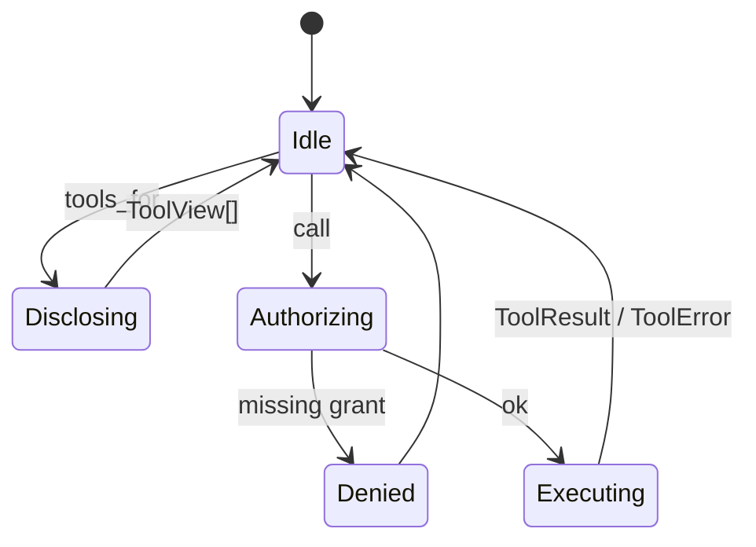

# RFC-0006: MCP Host & In-Process Builtins

| Field | Value |
| --- | --- |
| Status | Draft |
| Author | arkadianet |
| Architecture | Alloy Architecture V2 (frozen) |
| Depends on | RFC-0001, RFC-0005 |
| Effort | 5–8 person-days |

## Purpose

Implement the MCP host as the **sole tool bus**: lazy disclosure, permission tiers, fail-closed. MVP registers in-process builtins *as if* MCP tools (same schema/permission path): `cargo_check`, `cargo_test`, `fs_read`, `apply_patch`, optional `ra_*` (V2 §12).

## Scope

### In scope

- `McpPlatform` trait + in-process host
- Builtin tools: `cargo_check`, `cargo_test`, `fs_read`, `apply_patch` (apply delegates to EditEngine when RFC-0008 exists; stub apply OK interim)
- `tools_for(selectors)` lazy disclosure
- `PermissionToken` enforcement on `call`
- Default profile: **no raw bash**; Exec via sandbox only
- 0–1 out-of-process server start/stop stubs (may return unsupported)

### Out of scope

- `graph_query` MCP for Alloy workers — **deleted** (V2 ADR F-04)
- Custom crates/git/rustdoc MCP fleet → deferred
- EditEngine transaction semantics → [RFC-0008](./RFC-0008-edit-engine.md)
- Capability worker logic → [RFC-0013](./RFC-0013-capability-registry-workers.md)

## Dependencies

- **RFC-0001** — tool IDs, grants, selectors types
- **RFC-0005** — every Exec grant

## Public API

From V2 §12.1:

```rust
#[async_trait]
pub trait McpPlatform: Send + Sync {
    async fn start_server(&self, spec: McpServerSpec) -> Result<ServerId, McpError>;
    async fn stop_server(&self, id: ServerId) -> Result<(), McpError>;
    async fn tools_for(&self, selectors: &[ToolSelector]) -> Result<Vec<ToolView>, McpError>;
    async fn call(&self, call: ToolCall, perms: PermissionToken) -> Result<ToolResult, McpError>;
}

pub struct ToolHandle { /* capability-facing wrapper over McpPlatform + selectors */ }
```

Permission model (V2 §12.3): `FsRead`, `FsWrite`, `Exec`, `Network`, `GitWrite`.

## Internal architecture

Crate `alloy-tools`: host registry + builtin adapters. `apply_patch` calls `EditEngine` (injected trait object). `cargo_*` → sandbox exec. Zero extra OS processes for builtins.

## Data structures

Tool schemas (JSON) for cargo_check/test, fs_read, apply_patch. `ToolResult` / `ToolError` structured for retries (RFC-0010).

## State machine



## Failure modes

| Failure | Handling |
| --- | --- |
| Builtin tool failure | Structured `ToolError`; node retry policy |
| Permission missing | Fail closed |
| Path outside jail | Deny |
| Out-of-process server in MVP | 0–1 allowed; fail closed if not allowlisted |

## Testing strategy

- Unit: selector filtering / lazy disclosure caps
- Integration: sandboxed `cargo_check` on fixture crate
- Negative: raw bash tool absent; `.env` fs_read denied
- Schema snapshot tests for builtin tool JSON

## Acceptance criteria

- [ ] `McpPlatform` matches V2 public interface
- [ ] Builtins in-process; Exec always sandboxed
- [ ] No `graph_query` for Alloy workers
- [ ] No raw bash in default profile
- [ ] Lazy `tools_for` does not dump full catalog every call

## Definition of Done

Merge only when the series [Definition of Done](./README.md#definition-of-done-merge-gate) is fully met:

- [ ] Architecture compliance: **PASS**
- [ ] RFC acceptance criteria: **100% satisfied**
- [ ] Unit tests: **passing**
- [ ] Integration tests: **passing** (if applicable)
- [ ] Documentation: **complete**
- [ ] Public APIs: **reviewed and stable**
- [ ] Clippy: **clean**
- [ ] Formatting: **clean**
- [ ] No TODO or placeholder implementations left in this RFC's scope (explicit **Stub** / deferred only)
- [ ] Code review: **approved**

## Estimated implementation effort

**5–8 person-days**.

## Future extensions

- Promote builtins out-of-process when isolation demands; schemas unchanged (V2 §12)
- External-only graph MCP mirror (not for Alloy workers)
- Community MCP after broker allowlists
