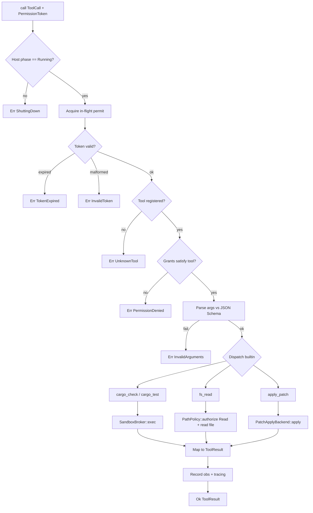
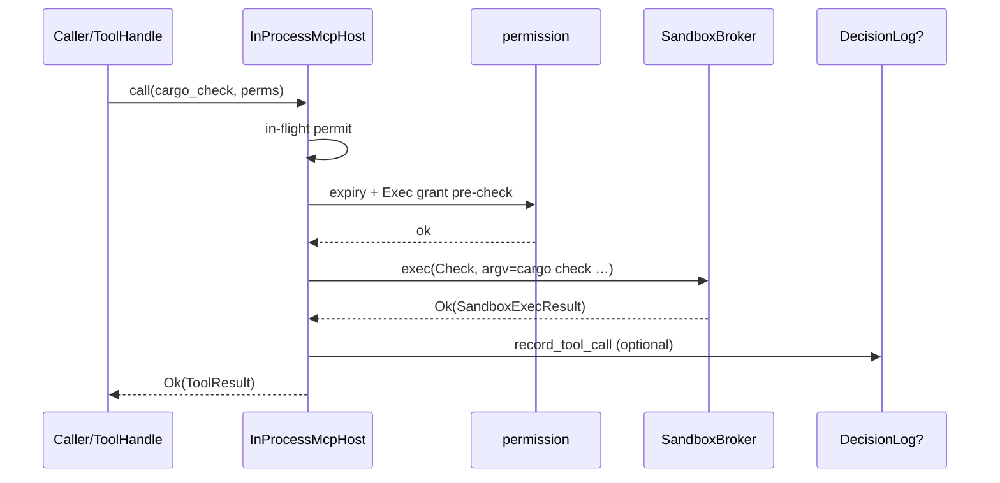
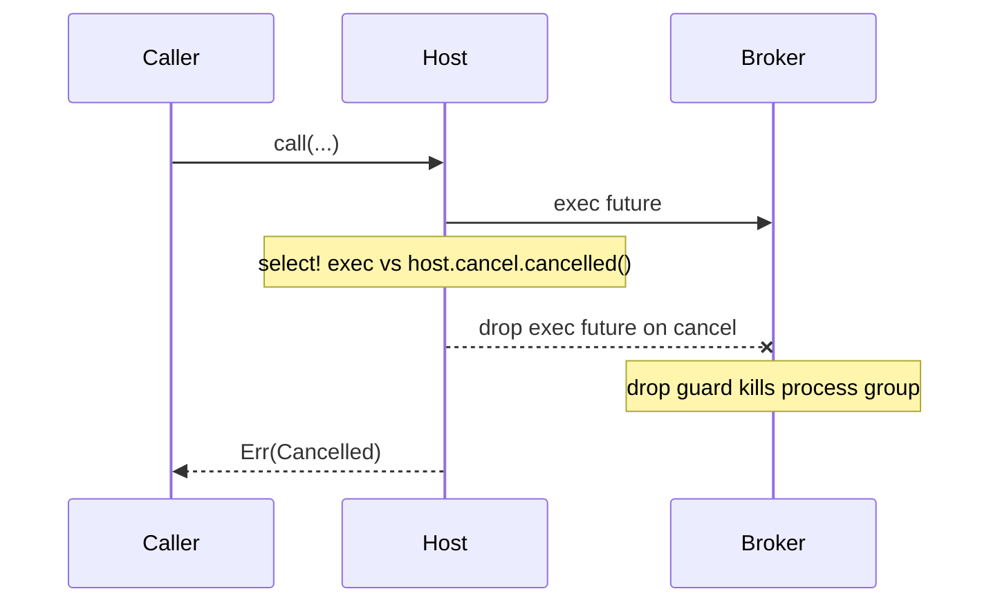
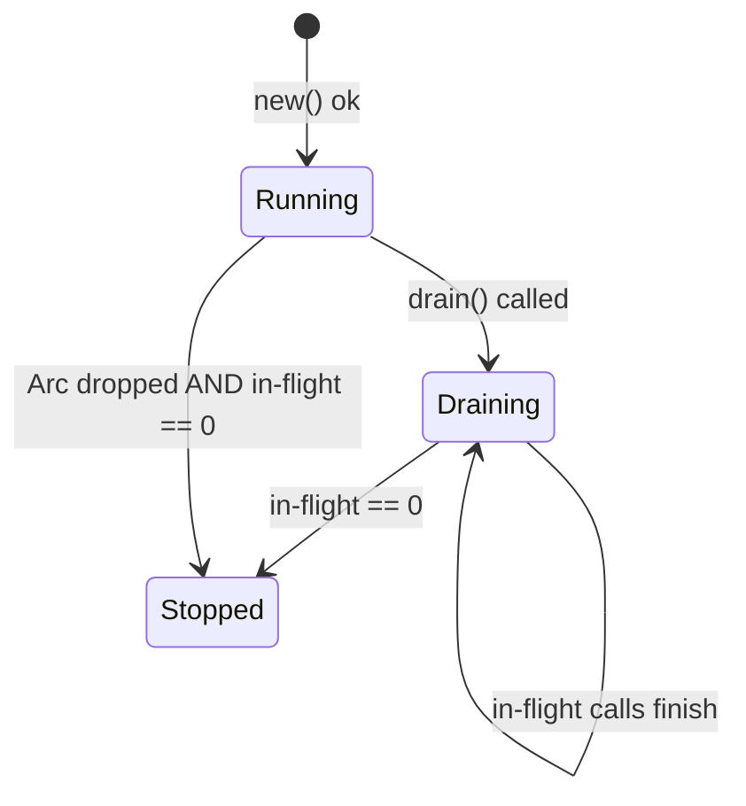

# RFC-0006: MCP Host & In-Process Builtins

| Field | Value |
| --- | --- |
| **Status** | Draft |
| **Author** | arkadianet |
| **Architecture** | Alloy Architecture V2 (**frozen**) — do not redesign |
| **Depends on** | [RFC-0001](./RFC-0001-alloy-runtime.md) (merged), [RFC-0005](./RFC-0005-sandbox-broker.md) (merged) |
| **Effort** | 5–8 person-days |
| **Related RFCs** | [0004](./RFC-0004-observability-cost-metering.md) optional `DecisionLog` injection · [0008](./RFC-0008-edit-engine.md) real `PatchApplyBackend` · [0010](./RFC-0010-scheduler-runtime-adapters.md) consumes `ToolError` / `cargo_check` · [0013](./RFC-0013-capability-registry-workers.md) `ToolHandle` / selectors · [0015](./RFC-0015-cli-profiles-config.md) profile UX |
| **Product** | Alloy — AI Engineering Runtime |
| **Supersedes** | Draft outline of this filename (expanded to implementation grade) |

**Mental model (V2 §12 / ADR F-09 / ADR F-07):** The MCP host is the **sole tool bus**. Every tool call — builtin or (later) external — shares one schema model, one permission path, one dispatch path, and one result model. Day-1 tools are **in-process builtins registered as if they were MCP tools**. Every `Grant::Exec` still runs exclusively through the RFC-0005 Sandbox Broker. Fail closed. Lazy disclosure. No `graph_query` for Alloy workers (ADR F-04). No raw bash in the default profile.

**Authority order (highest → lowest):** current `main` source → merged RFCs 0001–0005 → Architecture V2 → this draft → roadmaps. Never reshape a merged public API solely to match an older V2 sketch or this document’s prior outline.

---

## 1. Overview

### 1.1 Purpose

Ship the MVP **MCP Host & In-Process Builtins** in `alloy-tools` (shared tool IR in `alloy-runtime`):

1. **`McpPlatform` trait** + concrete `InProcessMcpHost` that is the sole tool bus for Alloy.
2. **Four builtins** registered as MCP tools with identical schema / permission / dispatch / result paths: `cargo_check`, `cargo_test`, `fs_read`, `apply_patch`.
3. **Lazy disclosure** via `tools_for(selectors)` — never dump the full catalogue.
4. **Fail-closed `PermissionToken` enforcement** on every `call` before dispatch.
5. **Sandbox integration** — every Exec path calls RFC-0005 `SandboxBroker::exec`; `fs_read` calls `PathPolicy::authorize(..., Read)`.
6. **Injected `PatchApplyBackend`** with a deterministic **Stub** until RFC-0008 wires EditEngine.
7. **Lifecycle, concurrency, shutdown, observability, and tests** sufficient for RFC-0010 / RFC-0013 to consume without inventing types.

### 1.2 Problem Statement

RFC-0001 published `Grant`, `ExecAllow`, `Glob`, `HostAllow`, `PermissionToken`. RFC-0005 shipped `SandboxBroker`, `PathPolicy`, and fail-closed exec. Architecture V2 §12 requires an MCP host as the sole tool bus with lazy disclosure and permission tiers. Without this RFC there is no `McpPlatform`, no builtin schemas, no permissioned `call` path, no lazy `tools_for`, and no choke point preventing workers from inventing ad-hoc tool invocation — violating ADR F-09 (host retained) and ADR F-07 (sandbox-before-dogfood on all tool exec).

### 1.3 Scope

| In scope | Detail |
| --- | --- |
| Shared tool IR in `alloy-runtime` | `ToolName`, `ToolSelector`, `ToolCall`, `ToolView`, `ToolResult`, `ToolError`, `McpServerSpec`, `ServerId` |
| `McpPlatform` + `InProcessMcpHost` | In `alloy-tools::mcp` |
| Builtins | `cargo_check`, `cargo_test`, `fs_read`, `apply_patch` |
| Lazy disclosure | `tools_for` selector filter, ordering, caps, duplicates |
| Permission validation | Expiry, required grants, fail-closed, deterministic denials |
| Sandbox integration | Exact broker / `PathPolicy` entry points per builtin |
| `PatchApplyBackend` + `StubPatchApplyBackend` | Deterministic stub; RFC-0008 replacement contract |
| `ToolHandle` | Capability-facing wrapper (selectors + platform) |
| `start_server` / `stop_server` | MVP stubs — unsupported / empty allowlist |
| Lifecycle / concurrency / shutdown / drain | Normative state machine |
| Observability | Tracing + optional `DecisionLog` tool-call records |
| Tests | Unit, integration, negative, permission, sandbox, cancel, concurrency, schema snapshot |

### 1.4 Non-goals

| Deferred item | Owner |
| --- | --- |
| Custom / out-of-process MCP servers (crates, git, rustdoc, codeintel, community) | **RFC-0013** / V2 deferred — referenced only |
| `graph_query` MCP for Alloy workers | **Deleted** (ADR F-04) — not deferred for workers |
| External-only graph MCP mirror | V2-permitted future extension — **listed deferred, not designed** |
| EditEngine TextPatch / git checkpoint implementation | **RFC-0008** |
| Capability registry / worker logic / `CapabilityContext` assembly | **RFC-0013** |
| Scheduler VerifyCompile adapter behaviour beyond consuming this bus | **RFC-0010** |
| Plugin APIs, extension systems, marketplace concepts | Out of architecture MVP |
| Optional `ra_*` builtins | Deferred (V2 “optional when RA wired”) |
| OTLP, sixth crate, new OS service, redesign of RFC-0005 | Forbidden |
| Writing or overwriting `.env` | Forbidden |

### 1.5 Day-1 MVP (normative)

1. `InProcessMcpHost::new(...)` MUST register exactly the four builtins listed in §5.2 and MUST NOT register `graph_query`, `bash`, `sh`, or any raw-shell tool.
2. `tools_for` MUST return only tools matching the supplied selectors, sorted by `ToolName` ascending byte order, capped at `MAX_TOOLS_PER_DISCLOSURE` (32), and MUST return an empty `Vec` when `selectors` is empty (never the full catalogue).
3. `call` MUST validate token expiry and required grants **before** dispatch; missing/denied/expired/malformed → `Err(McpError::…)` fail closed; never partial execution.
4. `cargo_check` / `cargo_test` MUST invoke `SandboxBroker::exec` with `ExecClass::{Check, Test}` respectively; non-zero child exit MUST surface as `Ok(ToolResult)` with structured payload (not `Err`).
5. `fs_read` MUST call `PathPolicy::authorize(path, PathAccess::Read)` and MUST deny `.env` / deny-glob paths via that policy.
6. `apply_patch` MUST call the injected `PatchApplyBackend`; the MVP stub MUST return the exact deterministic outcome in §3.7.1.
7. `start_server` / `stop_server` MUST return `Err(McpError::Unsupported { .. })` in MVP (empty out-of-process allowlist).
8. Builtin tools MUST share the same `ToolView` / `ToolCall` / `ToolResult` / permission / dispatch path as any future external MCP tool would.

---

## 2. Architecture Integration

### 2.1 Relationship to Architecture V2

| V2 reference | Application |
| --- | --- |
| §12.1 Host responsibilities | `McpPlatform` is sole tool bus; lazy disclosure; fail-closed |
| §12.2 Builtin schemas | Illustrative in V2; **this RFC is the implementation contract** |
| §12.3 Permission model | `FsRead`, `FsWrite`, `Exec`, `Network`, `GitWrite` — reuse `Grant` on `main` |
| §14.2 / ADR F-07 | All Exec through RFC-0005 sandbox; never bare process spawn in builtins |
| ADR F-04 | No builtin `graph_query` for Alloy workers |
| ADR F-09 | Host retained — do not delete or bypass |
| ADR F-16 | `max_parallel_cargo=1` enforced by **scheduler**, not this host |
| §5.4 crate map | Host + builtins live in `alloy-tools`; shared IR in `alloy-runtime` |
| Appendix B | `allow_raw_bash = false` — no bash tool registered |

**V2 sketch superseded by `main` where conflicted:** permission shapes use `Grant` / `ExecAllow { binary, args_glob }` / `HostAllow { host }` as published in `crates/alloy-runtime/src/types/permission.rs`. Tool schemas below are normative for implementation; V2 §12.2 remains illustrative intent only.

### 2.2 Relationship to RFC-0001

Authoritative for: `Grant`, `ExecAllow`, `Glob`, `HostAllow`, `PermissionToken`, `RunId`, `ProfileId`, `Timestamp`, `Digest`, `SessionId`, `NodeId`, `TransactionId`, `ErrorClass`, session event enum including `ToolCall`.

This RFC **adds** tool IR types to `alloy-runtime` and MUST NOT redefine permission types. Expiry comparison MUST use the same rule as RFC-0005: `perms.expires.as_ref().map(|t| t.0)` against `Timestamp::now().0` (`OffsetDateTime`); reject when `now >= expires` (inclusive boundary).

### 2.3 Relationship to RFC-0005

Authoritative for: `SandboxBroker`, `SandboxExecRequest`, `SandboxExecResult`, `SandboxError`, `DenialReason`, `ExecClass`, `PathPolicy`, `PathAccess`, `NativeSandboxBroker`, `RecordingSandboxBroker`, deny globs, quarantine, env scrubbing.

This RFC **consumes** those APIs. It MUST NOT fork a second exec path. Builtins MUST NOT call `std::process::Command` or `tokio::process::Command` (clippy seam from RFC-0005 remains in force).

**Cancel note:** RFC-0005 reserved `SandboxError::Cancelled` and deferred an explicit cancel field. This RFC cancels in-flight sandbox work by **dropping** the `exec` future (drop-guard kill per RFC-0005 §6.4) and returning `McpError::Cancelled` to the MCP caller. It does **not** require modifying `SandboxExecRequest` in MVP.

### 2.4 Already implemented | Added by RFC-0006 | Deferred

| Category | Contents |
| --- | --- |
| **Already implemented** | `Grant` / `PermissionToken` / IDs (0001); `DecisionLog` / `ToolCallRecord` (0004); `SandboxBroker` / `PathPolicy` / backends (0005); five-crate workspace; `#![deny(unsafe_code)]` on `alloy-tools` |
| **Added by RFC-0006** | Tool IR types; `McpPlatform`; `InProcessMcpHost`; four builtins; lazy disclosure; permission gate; `PatchApplyBackend` + stub; `ToolHandle`; MCP errors; host lifecycle; tests; observability hooks |
| **Deferred** | Custom MCP servers (0013 / V2); EditEngine impl (0008); capability workers (0013); `ra_*`; external-only graph mirror (not designed); community MCP allowlists; network-allow profiles |

### 2.5 Dependency boundaries

```text
alloy-cli ──► alloy-tools ──► alloy-runtime
                 ├── sandbox/   (RFC-0005)
                 └── mcp/       (RFC-0006)

alloy-runtime MUST NOT depend on alloy-tools.
alloy-tools MAY depend on alloy-runtime only (types, obs traits, CancellationToken via tokio-util already in runtime — host uses tokio-util directly).
Exactly five workspace crates. No MCP OS service. No sixth crate.
```

Wiring: `alloy-cli` (or runtime host assembly in later RFCs) constructs `NativeSandboxBroker`, `InProcessMcpHost`, and injects `Arc<dyn McpPlatform>` / `ToolHandle` into adapters and workers. `alloy-runtime` publishes tool IR so RFC-0007 / RFC-0010 / RFC-0013 compile against shared types without importing `alloy-tools`.

---

## 3. Public Rust API

### 3.1 Crate root — `alloy-tools` (additive)

```rust
//! Alloy tooling: sandbox broker (RFC-0005) and MCP host (RFC-0006).
#![deny(missing_docs)]
#![deny(unsafe_code)]

pub mod sandbox;
pub mod mcp;

pub use sandbox::{ /* existing RFC-0005 re-exports unchanged */ };

pub use mcp::{
    ApplyPatchArgs, ApplyPatchOutcome, BuiltinToolId, CargoCheckArgs, CargoTestArgs,
    FsReadArgs, InProcessMcpHost, McpError, McpHostConfig, McpPlatform, McpServerSpec,
    PatchApplyBackend, PatchApplyError, RecordingMcpPlatform, ServerId, StubPatchApplyBackend,
    ToolHandle, MAX_TOOLS_PER_DISCLOSURE,
};
```

`alloy-tools` remains `#![deny(unsafe_code)]` at the crate root (RFC-0005 already narrowed `forbid` → `deny` for sandbox backend seams only). MCP modules MUST NOT introduce `unsafe`.

### 3.2 Shared tool IR — `alloy-runtime` (additive)

New module `crates/alloy-runtime/src/types/tools.rs`, re-exported from `types/mod.rs` and the crate root with **explicit** `pub use` (no glob).

```rust
// alloy-runtime/src/types/tools.rs
use serde::{Deserialize, Serialize};
use serde_json::Value;

use super::ids::{NodeId, RunId, SessionId};
use super::permission::PermissionToken;

/// Catalog tool name (`cargo_check`, `fs_read`, …).
///
/// Validation: non-empty, ≤128 bytes, ASCII `[a-z0-9_]` only.
#[derive(Debug, Clone, PartialEq, Eq, PartialOrd, Ord, Hash, Serialize, Deserialize)]
pub struct ToolName(String);

impl ToolName {
    pub fn new(s: impl Into<String>) -> Result<Self, ToolNameError>;
    #[must_use]
    pub fn as_str(&self) -> &str;
}

#[derive(Debug, Clone, Copy, PartialEq, Eq, thiserror::Error)]
pub enum ToolNameError {
    #[error("invalid tool name")]
    Invalid,
}

/// Lazy-disclosure selector (capability `required_tools` / host `tools_for`).
#[derive(Debug, Clone, PartialEq, Eq, Hash, Serialize, Deserialize)]
#[serde(tag = "kind", rename_all = "snake_case")]
pub enum ToolSelector {
    /// Exact tool name.
    Name { name: ToolName },
    /// Tag / group id (e.g. `sel.compiler`). Matching is exact string equality on tags.
    Tag { tag: String },
}

impl ToolSelector {
    pub fn name(name: ToolName) -> Self { Self::Name { name } }
    pub fn tag(tag: impl Into<String>) -> Self { Self::Tag { tag: tag.into() } }
}

/// One tool invocation request (model or adapter → host).
#[derive(Debug, Clone, PartialEq, Serialize, Deserialize)]
#[non_exhaustive]
pub struct ToolCall {
    /// Tool to invoke (must be a registered name).
    pub name: ToolName,
    /// JSON arguments matching the tool's `input_schema`.
    pub arguments: Value,
    /// Optional call id for correlation (UUID string or model-supplied id).
    pub call_id: Option<String>,
    /// Optional session attribution (observability).
    pub session: Option<SessionId>,
    /// Optional run attribution.
    pub run: Option<RunId>,
    /// Optional node attribution.
    pub node: Option<NodeId>,
}

impl ToolCall {
    pub fn new(name: ToolName, arguments: Value) -> Self {
        Self {
            name,
            arguments,
            call_id: None,
            session: None,
            run: None,
            node: None,
        }
    }
    #[must_use]
    pub fn with_call_id(mut self, id: impl Into<String>) -> Self {
        self.call_id = Some(id.into());
        self
    }
    #[must_use]
    pub fn with_attribution(
        mut self,
        session: Option<SessionId>,
        run: Option<RunId>,
        node: Option<NodeId>,
    ) -> Self {
        self.session = session;
        self.run = run;
        self.node = node;
        self
    }
}

/// Disclosed tool schema view (lazy disclosure output / model tool list).
#[derive(Debug, Clone, PartialEq, Serialize, Deserialize)]
#[non_exhaustive]
pub struct ToolView {
    pub name: ToolName,
    pub description: String,
    /// JSON Schema object for arguments.
    pub input_schema: Value,
    /// Disclosure tags (e.g. `sel.compiler`). Stable, sorted ascending at registration.
    pub tags: Vec<String>,
    /// `true` for in-process builtins; `false` for external servers (none in MVP).
    pub builtin: bool,
}

/// Successful or tool-level-failed invocation payload.
///
/// Host/transport failures use `McpError` (in `alloy-tools`). Tool-level failures
/// (non-zero cargo exit, read denied after grant check maps to host error — see §8,
/// stub apply, invalid tool business args after schema parse) use `is_error = true`
/// with `error: Some(ToolError)`.
#[derive(Debug, Clone, PartialEq, Serialize, Deserialize)]
#[non_exhaustive]
pub struct ToolResult {
    pub name: ToolName,
    pub call_id: Option<String>,
    /// Structured content (JSON). For cargo tools: messages / summary object.
    pub content: Value,
    /// `false` on tool success; `true` when `error` is populated.
    pub is_error: bool,
    pub error: Option<ToolError>,
    /// Wall time inside the host dispatch (ms).
    pub duration_ms: u64,
}

impl ToolResult {
    pub fn ok(name: ToolName, content: Value, duration_ms: u64) -> Self {
        Self {
            name,
            call_id: None,
            content,
            is_error: false,
            error: None,
            duration_ms,
        }
    }
    pub fn err(name: ToolName, content: Value, error: ToolError, duration_ms: u64) -> Self {
        Self {
            name,
            call_id: None,
            content,
            is_error: true,
            error: Some(error),
            duration_ms,
        }
    }
    #[must_use]
    pub fn with_call_id(mut self, id: Option<String>) -> Self {
        self.call_id = id;
        self
    }
}

/// Tool-level failure taxonomy (consumed by RFC-0010 retry policy).
///
/// This is **not** a host/transport error. See §8 for mapping rules.
#[derive(Debug, Clone, PartialEq, Eq, Serialize, Deserialize, thiserror::Error)]
#[non_exhaustive]
#[serde(tag = "kind", rename_all = "snake_case")]
pub enum ToolError {
    /// Transient infrastructure / sandbox / IO style failure worth retry.
    #[error("transient: {code}: {message}")]
    Transient { code: String, message: String },
    /// Permanent business / policy / stub / unsupported failure — do not retry as-is.
    #[error("permanent: {code}: {message}")]
    Permanent { code: String, message: String },
    /// Caller-supplied arguments failed validation after JSON Schema parse.
    #[error("invalid_args: {message}")]
    InvalidArgs { message: String },
    /// Tool executed but the underlying command failed (e.g. cargo non-zero).
    /// Still returned inside `Ok(ToolResult)`; retry is scheduler policy.
    #[error("execution_failed: exit={exit_code:?}: {message}")]
    ExecutionFailed {
        exit_code: Option<i32>,
        message: String,
    },
}

/// Out-of-process server spec (MVP: accepted only to return Unsupported).
#[derive(Debug, Clone, PartialEq, Eq, Serialize, Deserialize)]
#[non_exhaustive]
pub struct McpServerSpec {
    /// Logical server name.
    pub name: String,
    /// Transport — MVP ignores and rejects.
    pub transport: McpTransport,
}

#[derive(Debug, Clone, PartialEq, Eq, Serialize, Deserialize)]
#[serde(tag = "kind", rename_all = "snake_case")]
pub enum McpTransport {
    /// Stdio subprocess (deferred).
    Stdio { command: String, args: Vec<String> },
}

/// Opaque server id (UUID newtype) — allocated only if a server starts.
#[derive(Debug, Clone, Copy, PartialEq, Eq, Hash, Serialize, Deserialize)]
#[serde(transparent)]
pub struct ServerId(uuid::Uuid);

impl ServerId {
    pub fn new() -> Self { Self(uuid::Uuid::new_v4()) }
    pub fn as_uuid(&self) -> &uuid::Uuid { &self.0 }
}
```

**Visibility:** all items above are `pub` in `alloy-runtime`. `ServerId` / `McpServerSpec` live in runtime so the `McpPlatform` signature in tools can name them without circular types; `alloy-tools` re-exports them for convenience.

**Send/Sync:** all tool IR types are `Send + Sync` when containing only owned data (satisfied).

**Persistence:** tool IR is serde-stable for session/event payloads and eval fixtures. Field adds MUST be `#[non_exhaustive]` / optional with defaults.

### 3.3 `McpError` — `alloy-tools::mcp`

```rust
use std::time::Duration;
use thiserror::Error;

#[derive(Debug, Error)]
#[non_exhaustive]
pub enum McpError {
    #[error("unknown tool: {0}")]
    UnknownTool(String),

    #[error("permission denied: {0}")]
    PermissionDenied(PermissionDenial),

    #[error("permission token expired")]
    TokenExpired,

    #[error("invalid permission token: {0}")]
    InvalidToken(String),

    #[error("invalid arguments: {0}")]
    InvalidArguments(String),

    #[error("unsupported: {0}")]
    Unsupported(String),

    #[error("host shutting down")]
    ShuttingDown,

    #[error("cancelled")]
    Cancelled,

    #[error("timeout after {0:?}")]
    Timeout(Duration),

    #[error("sandbox: {0}")]
    Sandbox(#[from] crate::sandbox::SandboxError),

    #[error("internal: {0}")]
    Internal(String),
}

#[derive(Debug, Clone, PartialEq, Eq, Error)]
#[non_exhaustive]
pub enum PermissionDenial {
    #[error("missing grant: {0}")]
    MissingGrant(String),
    #[error("grant does not cover path: {0}")]
    PathNotCovered(String),
    #[error("exec not allowlisted for tool")]
    ExecNotAllowlisted,
    #[error("tool not disclosed for handle selectors")]
    NotDisclosed,
}
```

Full variant semantics: §8.

### 3.4 `McpPlatform` trait

```rust
use alloy_runtime::{
    McpServerSpec, PermissionToken, ServerId, ToolCall, ToolResult, ToolSelector, ToolView,
};
use async_trait::async_trait;

#[async_trait]
pub trait McpPlatform: Send + Sync {
    /// Start an out-of-process MCP server.
    ///
    /// MVP: ALWAYS returns `Err(McpError::Unsupported(...))`.
    async fn start_server(&self, spec: McpServerSpec) -> Result<ServerId, McpError>;

    /// Stop a previously started server.
    ///
    /// MVP: ALWAYS returns `Err(McpError::Unsupported(...))` (no servers exist).
    async fn stop_server(&self, id: ServerId) -> Result<(), McpError>;

    /// Lazy disclosure: return tool views matching `selectors`.
    ///
    /// MUST obey §5.4 (empty selectors → empty vec; cap; sort; dedupe by name).
    async fn tools_for(&self, selectors: &[ToolSelector]) -> Result<Vec<ToolView>, McpError>;

    /// Invoke a tool under `perms`.
    ///
    /// Pipeline: §5.1. Permission failures → `Err`. Tool-level failures → `Ok(ToolResult{is_error:true})`.
    async fn call(
        &self,
        call: ToolCall,
        perms: PermissionToken,
    ) -> Result<ToolResult, McpError>;
}
```

**Ownership:** implementors are typically `Arc`-wrapped. Trait is `Send + Sync`. Methods take `&self`. `call` takes `PermissionToken` by value (cheap clone of grants vec — callers may `clone` if they need to retain).

**async_trait:** REQUIRED on public traits through M1 (RFC-0001 edition decision).

### 3.5 `InProcessMcpHost`

```rust
use std::sync::Arc;
use tokio_util::sync::CancellationToken;

use alloy_runtime::obs::DecisionLog; // optional
use crate::sandbox::{PathPolicy, SandboxBroker};

/// Construction / runtime configuration for the in-process host.
#[derive(Clone)]
pub struct McpHostConfig {
    /// Workspace jail (canonical). MUST equal `sandbox.profile().fs_jail`.
    pub workspace_jail: std::path::PathBuf,
    /// Max concurrent `call` futures (fairness cap). Default: 64.
    pub max_in_flight: usize,
    /// Optional parent cancel (runtime shutdown). Default: new child token.
    pub cancel: CancellationToken,
}

impl McpHostConfig {
    pub fn new(workspace_jail: std::path::PathBuf) -> Self;
}

pub struct InProcessMcpHost {
    // private fields — see §4
}

impl InProcessMcpHost {
    /// Build host, register builtins, share broker + path policy + patch backend.
    ///
    /// Fails with `McpError::Internal` if `workspace_jail` canonicalization fails or
    /// does not equal `broker.profile().fs_jail` (byte-equal after canonicalize).
    pub fn new(
        broker: Arc<dyn SandboxBroker>,
        path_policy: PathPolicy,
        patch_backend: Arc<dyn PatchApplyBackend>,
        config: McpHostConfig,
    ) -> Result<Self, McpError>;

    /// Same as `new` with optional decision-log injection for ToolCall records.
    pub fn new_with_obs(
        broker: Arc<dyn SandboxBroker>,
        path_policy: PathPolicy,
        patch_backend: Arc<dyn PatchApplyBackend>,
        config: McpHostConfig,
        decision_log: Option<Arc<dyn DecisionLog>>,
    ) -> Result<Self, McpError>;

    /// Begin drain: reject new `call` / `tools_for` with `ShuttingDown`; wait for in-flight.
    pub async fn drain(&self) -> Result<(), McpError>;

    /// Cancel token (child of config.cancel). Callers may clone for per-call linkage.
    #[must_use]
    pub fn cancellation(&self) -> CancellationToken;

    /// Test/introspection: number of registered tools (MVP: always 4).
    #[must_use]
    pub fn registered_len(&self) -> usize;
}

#[async_trait]
impl McpPlatform for InProcessMcpHost { /* §5 */ }
```

**PathPolicy construction:** callers MUST build `PathPolicy::from_profile(broker.profile(), read_only_roots)` using the same RO roots the broker uses for operator cargo/rustup homes when available; for unit tests, `from_profile(profile, vec![])` is permitted. Host MUST NOT construct a divergent deny-glob set.

### 3.6 Builtin argument / result DTOs

Normative JSON Schemas are in §5.3. Rust DTOs used after schema validation:

```rust
#[derive(Debug, Clone, PartialEq, Eq, Serialize, Deserialize)]
pub struct CargoCheckArgs {
    pub workspace_root: String,
    #[serde(default)]
    pub package: Option<String>,
    #[serde(default)]
    pub features: Vec<String>,
    #[serde(default)]
    pub all_features: bool,
    /// MVP: only `"json"` accepted; default `"json"`.
    #[serde(default = "default_message_format")]
    pub message_format: String,
}

#[derive(Debug, Clone, PartialEq, Eq, Serialize, Deserialize)]
pub struct CargoTestArgs {
    pub workspace_root: String,
    #[serde(default)]
    pub package: Option<String>,
    #[serde(default)]
    pub test_name_filter: Option<String>,
    #[serde(default)]
    pub jobs: Option<u32>,
    /// Soft hint only — broker timeout remains profile `exec_timeout`. Default 600.
    #[serde(default = "default_test_timeout")]
    pub timeout_secs: u64,
}

#[derive(Debug, Clone, PartialEq, Eq, Serialize, Deserialize)]
pub struct FsReadArgs {
    /// Path relative to jail OR absolute under jail.
    pub path: String,
    /// Max bytes to return. Default 262_144. Hard max 1_048_576.
    #[serde(default = "default_fs_read_max")]
    pub max_bytes: usize,
}

#[derive(Debug, Clone, PartialEq, Eq, Serialize, Deserialize)]
pub struct ApplyPatchArgs {
    /// Unified diff text OR JSON `PatchSet` object — see §5.3.4.
    pub patch: serde_json::Value,
    #[serde(default)]
    pub dry_run: bool,
}

#[derive(Debug, Clone, PartialEq, Eq, Serialize, Deserialize)]
pub struct ApplyPatchOutcome {
    pub dry_run: bool,
    pub files_touched: Vec<String>,
    pub transaction_id: Option<String>,
    pub message: String,
}

fn default_message_format() -> String { "json".into() }
fn default_test_timeout() -> u64 { 600 }
fn default_fs_read_max() -> usize { 262_144 }
```

### 3.7 `PatchApplyBackend` (injection seam before RFC-0008)

RFC-0008 owns EditEngine. RFC-0006 MUST NOT depend on EditEngine types or behaviour.

```rust
#[async_trait]
pub trait PatchApplyBackend: Send + Sync {
    /// Apply a patch request produced by the `apply_patch` builtin.
    async fn apply(&self, args: ApplyPatchArgs) -> Result<ApplyPatchOutcome, PatchApplyError>;
}

#[derive(Debug, Error)]
#[non_exhaustive]
pub enum PatchApplyError {
    #[error("unsupported: {0}")]
    Unsupported(String),
    #[error("invalid patch: {0}")]
    InvalidPatch(String),
    #[error("conflict: {0}")]
    Conflict(String),
    #[error("io: {0}")]
    Io(String),
    #[error("internal: {0}")]
    Internal(String),
}

/// Deterministic MVP stub. RFC-0008 replaces the injected `Arc<dyn PatchApplyBackend>`.
pub struct StubPatchApplyBackend;

#[async_trait]
impl PatchApplyBackend for StubPatchApplyBackend {
    async fn apply(&self, args: ApplyPatchArgs) -> Result<ApplyPatchOutcome, PatchApplyError> {
        let _ = args;
        Err(PatchApplyError::Unsupported(
            "edit_engine_unwired: apply_patch requires RFC-0008 EditEngine".into(),
        ))
    }
}
```

#### 3.7.1 Exact stub behaviour (normative)

When `apply_patch` is called against `StubPatchApplyBackend`:

1. Host validates permissions (§5.5) and parses `ApplyPatchArgs`.
2. Host calls `patch_backend.apply(args).await`.
3. Stub returns `Err(PatchApplyError::Unsupported("edit_engine_unwired: apply_patch requires RFC-0008 EditEngine"))` for **every** input, including `dry_run: true` and empty patches.
4. Host maps that error to:

```text
Ok(ToolResult {
  name: ToolName("apply_patch"),
  call_id: <from call>,
  content: { "code": "edit_engine_unwired", "dry_run": <args.dry_run> },
  is_error: true,
  error: Some(ToolError::Permanent {
    code: "edit_engine_unwired".into(),
    message: "edit_engine_unwired: apply_patch requires RFC-0008 EditEngine".into(),
  }),
  duration_ms: <measured>,
})
```

5. No files are read or written. No git operations occur. No sandbox exec occurs for apply.

#### 3.7.2 RFC-0008 replacement contract

| Requirement | Rule |
| --- | --- |
| Trait stability | RFC-0008 MUST implement `PatchApplyBackend` (adapter over `EditEngine`) OR provide `Arc<dyn PatchApplyBackend>` that preserves this trait’s signatures |
| Host change | RFC-0006 host MUST NOT require code changes beyond injecting a different `Arc<dyn PatchApplyBackend>` |
| Success mapping | `Ok(ApplyPatchOutcome)` → `Ok(ToolResult{is_error:false, content: serialize(outcome)})` |
| `Unsupported` | → `ToolError::Permanent { code: "unsupported", … }` |
| `InvalidPatch` | → `ToolError::InvalidArgs` |
| `Conflict` | → `ToolError::Permanent { code: "conflict", … }` |
| `Io` / `Internal` | → `ToolError::Transient` (`Io`) / `ToolError::Permanent` (`Internal`) |
| Permissions | Still enforced by host **before** backend call; backend MUST NOT bypass host grants |
| Second write stack | Forbidden — backend is the sole apply path for `apply_patch` |

### 3.8 `ToolHandle`

```rust
/// Capability-facing wrapper: disclosure + call restricted to a selector set.
pub struct ToolHandle {
    platform: Arc<dyn McpPlatform>,
    selectors: Vec<ToolSelector>,
}

impl ToolHandle {
    pub fn new(platform: Arc<dyn McpPlatform>, selectors: Vec<ToolSelector>) -> Self;

    /// `platform.tools_for(&self.selectors)`.
    pub async fn tools(&self) -> Result<Vec<ToolView>, McpError>;

    /// Invoke tool if `call.name` is within the disclosed set for `self.selectors`;
    /// otherwise `Err(McpError::PermissionDenied(NotDisclosed))` **before** platform call.
    pub async fn call(
        &self,
        call: ToolCall,
        perms: PermissionToken,
    ) -> Result<ToolResult, McpError>;

    #[must_use]
    pub fn selectors(&self) -> &[ToolSelector];
}
```

**Ownership:** `ToolHandle` is `Clone` via `Arc` clone of platform + owned selectors vec. `Send + Sync`.

**Disclosure check algorithm for `ToolHandle::call`:** compute `allowed = tools_for(selectors)` name set; if `call.name` ∉ allowed → `NotDisclosed`. This MUST be identical to recomputing disclosure (no stale cache required in MVP; optional cache invalidated on host registry change — registry is immutable after `new`).

### 3.9 `RecordingMcpPlatform` (test double)

```rust
pub struct RecordingMcpPlatform {
    // inner: InProcessMcpHost OR scripted map
}

impl RecordingMcpPlatform {
    /// Wrap a real host and record `(ToolCall, PermissionToken)` in order.
    pub fn wrap(inner: Arc<dyn McpPlatform>) -> Self;
    pub fn recorded_calls(&self) -> Vec<(ToolCall, PermissionToken)>;
}

#[async_trait]
impl McpPlatform for RecordingMcpPlatform { /* delegate + record on call */ }
```

### 3.10 `BuiltinToolId` & constants

```rust
#[derive(Debug, Clone, Copy, PartialEq, Eq, Hash)]
pub enum BuiltinToolId {
    CargoCheck,
    CargoTest,
    FsRead,
    ApplyPatch,
}

impl BuiltinToolId {
    pub const ALL: [BuiltinToolId; 4] = [
        Self::CargoCheck,
        Self::CargoTest,
        Self::FsRead,
        Self::ApplyPatch,
    ];
    #[must_use]
    pub fn name(self) -> ToolName; // cargo_check / cargo_test / fs_read / apply_patch
    #[must_use]
    pub fn tags(self) -> &'static [&'static str];
}

/// Hard cap on `tools_for` results.
pub const MAX_TOOLS_PER_DISCLOSURE: usize = 32;

/// Canonical tags (normative).
/// cargo_check  → ["sel.compiler"]
/// cargo_test   → ["sel.test"]
/// fs_read      → ["sel.fs"]
/// apply_patch  → ["sel.edit"]
```

### 3.11 Existing permission types (normative — do not change)

Reuse exactly as on `main` / RFC-0005 §3.2. No parallel permission system.

### 3.12 Visibility & construction summary

| Item | Crate | Visibility | Constructed by |
| --- | --- | --- | --- |
| Tool IR | `alloy-runtime` | `pub` | callers / serde |
| `McpPlatform` | `alloy-tools` | `pub` trait | impls |
| `InProcessMcpHost` | `alloy-tools` | `pub` | `new` / `new_with_obs` |
| `StubPatchApplyBackend` | `alloy-tools` | `pub` | unit struct |
| `ToolHandle` | `alloy-tools` | `pub` | `ToolHandle::new` |
| Builtin handlers | `alloy-tools` | `pub(crate)` | host registry |
| JSON schemas | `alloy-tools` | `pub(crate)` constants | compile-time |

---

## 4. Internal Module Design

```text
crates/alloy-runtime/src/types/
  tools.rs          # ToolName, ToolSelector, ToolCall, ToolView, ToolResult, ToolError,
                    # McpServerSpec, McpTransport, ServerId

crates/alloy-tools/src/mcp/
  mod.rs            # re-exports; module docs
  error.rs          # McpError, PermissionDenial
  platform.rs       # McpPlatform trait
  host.rs           # InProcessMcpHost, McpHostConfig, drain, in-flight gate
  registry.rs       # Builtin registration table (immutable after new)
  disclose.rs       # tools_for filtering, sort, cap, dedupe
  permission.rs     # token expiry + per-tool grant checks (fail-closed)
  handle.rs         # ToolHandle
  recording.rs      # RecordingMcpPlatform
  patch.rs          # PatchApplyBackend, StubPatchApplyBackend, PatchApplyError
  builtins/
    mod.rs          # BuiltinToolId, dispatch match
    cargo_check.rs
    cargo_test.rs
    fs_read.rs
    apply_patch.rs
  schema/
    mod.rs          # JSON Schema Value constants + snapshot fixtures
```

### 4.1 Responsibilities

| Module | Owns | Must not |
| --- | --- | --- |
| `registry` | name → handler + `ToolView` | mutate after `new` |
| `disclose` | selector matching | expose unregistered tools |
| `permission` | grant/expiry checks | spawn processes |
| `builtins/cargo_*` | argv build + sandbox call + result map | bare `Command` |
| `builtins/fs_read` | `PathPolicy` read + byte cap | ignore deny globs |
| `builtins/apply_patch` | backend call + error map | implement EditEngine |
| `host` | lifecycle, concurrency semaphore, obs | redefine sandbox policy |

### 4.2 Dependency direction

```text
host → registry → builtins → (sandbox | path_policy | patch_backend)
host → disclose → registry
host → permission
handle → dyn McpPlatform
builtins MUST NOT import handle
mcp MUST NOT import alloy-runtime::storage or session control plane
```

### 4.3 Injection points

| Dependency | Type | Required |
| --- | --- | --- |
| Sandbox broker | `Arc<dyn SandboxBroker>` | yes |
| Path policy | `PathPolicy` | yes |
| Patch backend | `Arc<dyn PatchApplyBackend>` | yes (stub in MVP) |
| Decision log | `Option<Arc<dyn DecisionLog>>` | no |
| Cancel | `CancellationToken` in config | yes (default new) |

---

## 5. Execution Algorithm

### 5.1 Request lifecycle pipeline



**Ordering is normative.** Permission validation MUST precede argument side effects. Unknown tool MUST NOT leak whether a deferred tool name “will exist”.

### 5.2 Builtin registration table (immutable)

| Name | Tags | Handler | Required grants (host gate) |
| --- | --- | --- | --- |
| `cargo_check` | `sel.compiler` | §5.6 | ≥1 `Grant::Exec` that allowlists `cargo` + args matching check invocation |
| `cargo_test` | `sel.test` | §5.7 | ≥1 `Grant::Exec` that allowlists `cargo` + args matching test invocation |
| `fs_read` | `sel.fs` | §5.8 | ≥1 `Grant::FsRead(glob)` covering the target path |
| `apply_patch` | `sel.edit` | §5.9 | ≥1 `Grant::FsWrite(glob)` — MVP: at least one `FsWrite` present; path-level coverage enforced by RFC-0008 backend when wired; stub still requires ≥1 `FsWrite` |

**Forbidden registrations (MUST NOT appear):** `graph_query`, `bash`, `sh`, `shell`, `raw_exec`, `clippy_lint`, `miri_test`, `ra_*` (until a future RFC adds them).

### 5.3 Normative JSON Schemas

#### 5.3.1 `cargo_check`

```json
{
  "type": "object",
  "properties": {
    "workspace_root": { "type": "string" },
    "package": { "type": ["string", "null"] },
    "features": { "type": "array", "items": { "type": "string" } },
    "all_features": { "type": "boolean", "default": false },
    "message_format": { "type": "string", "enum": ["json"], "default": "json" }
  },
  "required": ["workspace_root"],
  "additionalProperties": false
}
```

Description string (exact): `Run cargo check and return structured rustc messages`.

#### 5.3.2 `cargo_test`

```json
{
  "type": "object",
  "properties": {
    "workspace_root": { "type": "string" },
    "package": { "type": ["string", "null"] },
    "test_name_filter": { "type": ["string", "null"] },
    "jobs": { "type": ["integer", "null"], "minimum": 1 },
    "timeout_secs": { "type": "integer", "default": 600, "minimum": 1 }
  },
  "required": ["workspace_root"],
  "additionalProperties": false
}
```

Description: `Run cargo test and return structured results`.

#### 5.3.3 `fs_read`

```json
{
  "type": "object",
  "properties": {
    "path": { "type": "string" },
    "max_bytes": { "type": "integer", "default": 262144, "minimum": 1, "maximum": 1048576 }
  },
  "required": ["path"],
  "additionalProperties": false
}
```

Description: `Read a UTF-8 text file under the workspace jail`.

#### 5.3.4 `apply_patch`

```json
{
  "type": "object",
  "properties": {
    "patch": {},
    "dry_run": { "type": "boolean", "default": false }
  },
  "required": ["patch"],
  "additionalProperties": false
}
```

Description: `Apply a unified diff / TextPatch via EditEngine`.

`patch` MUST be either:

* a JSON string containing a unified diff, or
* a JSON object (opaque to RFC-0006; interpreted by `PatchApplyBackend` / RFC-0008).

MVP stub does not interpret `patch` contents.

### 5.4 Lazy disclosure — `tools_for`

#### Algorithm (normative)

1. If host is draining/shutdown → `Err(ShuttingDown)`.
2. If `selectors.is_empty()` → return `Ok(vec![])` (**MUST NOT** return the catalogue).
3. Let `out: BTreeMap<ToolName, ToolView> = {}` (dedupe by name).
4. For each selector in **input order**:
   - `Name { name }`: if registered and name equals, insert that `ToolView`.
   - `Tag { tag }`: for each registered tool whose `tags` contains an exact match for `tag`, insert.
5. Build `Vec` from map values sorted by `ToolName` ascending (`Ord` on the newtype / bytewise UTF-8).
6. If `len > MAX_TOOLS_PER_DISCLOSURE` (32): truncate to the first 32 after sort; emit tracing `warn` with `truncated = true`, `returned = 32`.
7. Return `Ok(vec)`.

#### Why the full catalogue is never exposed

Eager MCP schema tax exhausts model context (V2 §12 / industry lesson). Capabilities declare `required_tools` selectors; the host discloses only that slice. Empty selectors mean “disclose nothing”, not “disclose all”. Truncation is a safety cap, not a pagination API.

#### Duplicate handling

Duplicate selectors and overlapping tag/name matches collapse by `ToolName`. First inserted view wins (views are identical per name).

#### Ordering

Output order is **by tool name**, never by selector order, never by registration luck.

### 5.5 Permission enforcement

#### Validation point

Exactly once per `call`, after in-flight acquire and before schema parse side effects that touch the filesystem. `tools_for` does **not** require a `PermissionToken`.

#### Token checks (ordered)

| Step | Condition | Error |
| --- | --- | --- |
| 1 | `perms.grants` encoding impossible / non-UTF8 tool-unrelated — N/A on typed token | — |
| 2 | `expires: Some(t)` and `Timestamp::now().0 >= t.0` | `TokenExpired` |
| 3 | `run_id` is always present on typed token — no extra check | — |
| 4 | `profile` empty impossible (`ProfileId` validates) | — |
| 5 | Tool-specific grant rules below | `PermissionDenied(...)` |

**Malformed token:** on this API the token is a typed Rust value. `InvalidToken` is reserved for future byte-parsed tokens; MVP host MAY return `InvalidToken` only if a defensive invariant fails (e.g. internal conversion). Callers constructing tokens in-process do not hit this path.

#### Per-tool grant rules

**`cargo_check`**

1. Build the **intended argv** (§5.6) **before** sandbox call.
2. Require at least one `Grant::Exec(ExecAllow)` such that:
   - binary allow matches `cargo` under the same basename/path rules as RFC-0005 §5.3 **logical** match against argv `[0]=cargo` (host-level pre-check uses basename equality `allow.binary == "cargo"` OR path form — MVP host pre-check ONLY accepts basename form `binary == "cargo"` to keep determinism without PATH probes at the gate);
   - `args_glob` is `None` OR matches space-joined `argv[1..]` with the RFC-0005 §5.3 glob dialect.
3. If no Exec grants → `MissingGrant("exec")`.
4. If Exec grants exist but none match → `ExecNotAllowlisted`.

**`cargo_test`:** same with test argv.

**`fs_read`**

1. Resolve path relative to `workspace_jail` if not absolute.
2. `PathPolicy::authorize(&path, PathAccess::Read)`. Map outcomes:

| `PathPolicy` / authorize result | Host result |
| --- | --- |
| `Ok(canon)` | continue |
| `Err(SandboxError::Denied(PathDenied(s)))` | `Err(McpError::PermissionDenied(PathNotCovered(s)))` |
| `Err(SandboxError::Denied(CwdOutsideJail))` | `Err(McpError::PermissionDenied(PathNotCovered("cwd outside jail".into())))` |
| `Err(other SandboxError)` | `Err(McpError::Sandbox(other))` |

3. Additionally require some `Grant::FsRead(Glob)` whose glob matches the **jail-relative** path string (`/`-separated, no leading slash) using:

```text
GlobBuilder::new(pat).literal_separator(true).case_insensitive(cfg!(target_os="macos")).build()
```

Full-match against jail-relative path. If path is under an RO root outside jail (authorized by PathPolicy), match grant globs against the same relative rendering used by PathPolicy deny checks for that root; MVP builtins are expected to read workspace files — RO-root reads without matching `FsRead` still fail closed with `MissingGrant`/`PathNotCovered`.

4. No matching FsRead → `MissingGrant("fs_read")` if zero FsRead grants, else `PathNotCovered(rel)`.

**`Grant::Network` / `Grant::GitWrite`:** ignored by all four MVP builtins (neither sufficient nor required). Presence does not authorize Exec or FsRead.

#### Hand-rolled JSON argument validation (normative)

MVP MUST NOT add a schema crate. Validators MUST enforce:

| Tool | Rules |
| --- | --- |
| all | root MUST be a JSON object; unknown keys → `InvalidArguments("additional property: …")` |
| `cargo_check` | `workspace_root`: string, non-empty; `package`: string or null or absent; `features`: array of strings (default `[]`); `all_features`: bool (default false); `message_format`: absent/`"json"` only |
| `cargo_test` | `workspace_root` non-empty string; `package` string/null/absent; `test_name_filter` string/null/absent; `jobs` integer ≥1 or null/absent; `timeout_secs` integer ≥1 (default 600) |
| `fs_read` | `path` non-empty string; `max_bytes` integer in `1..=1048576` (default 262144) |
| `apply_patch` | `patch` present (any JSON value except missing); `dry_run` bool (default false) |

Type mismatches → `Err(McpError::InvalidArguments(...))` with a stable message prefix `type error: <field>`.

**`apply_patch` grant rule**

1. Require ≥1 `Grant::FsWrite(_)`. If none → `MissingGrant("fs_write")`.
2. MVP stub does not path-expand the patch; fine-grained path grants are enforced by RFC-0008 backend **in addition** to this gate. Host MUST still fail closed without any FsWrite.

#### Denied vs missing

| Situation | Variant |
| --- | --- |
| Zero grants of the needed kind | `MissingGrant` |
| Some grants but path/argv not covered | `PathNotCovered` / `ExecNotAllowlisted` |
| ToolHandle disclosure miss | `NotDisclosed` |

All are deterministic functions of `(tool, args, perms, policy)` — no wall-clock dependence except expiry.

#### Fail-closed

On any permission error: no sandbox spawn, no file read, no backend apply, no partial writes.

### 5.6 `cargo_check` execution

#### Argv mapping

```text
argv = ["cargo", "check"]
+ optional ["-p", package] if package is Some(non-empty)
+ if all_features { ["--all-features"] }
  else for f in features { ["--features", f] }  // one --features per entry, in input order
+ ["--message-format", "json"]
```

`message_format` other than `"json"` → `Err(InvalidArguments)` at parse.

#### Sandbox request

```rust
SandboxExecRequest::new(
    argv,
    cwd,              // canonicalize(workspace_root); must be inside jail via authorize_cwd
    perms.clone(),    // same token
    ExecClass::Check,
)
// env_allow: empty in MVP
```

`workspace_root` MUST canonicalize inside the jail (`PathPolicy::authorize_cwd` or equivalent membership). Outside → `PermissionDenied(PathNotCovered)` / deny before exec.

#### Result mapping

| Sandbox outcome | MCP result |
| --- | --- |
| `Ok(r)` with `exit_code == Some(0)` | `Ok(ToolResult::ok)` content §5.6.1 |
| `Ok(r)` with other exit / signal | `Ok(ToolResult::err)` with `ToolError::ExecutionFailed` |
| `Err(TokenExpired)` | `Err(McpError::TokenExpired)` |
| `Err(Denied(_))` | `Err(McpError::PermissionDenied(...))` mapped per §8.3 |
| `Err(Timeout(d))` | `Err(McpError::Timeout(d))` |
| `Err(Cancelled)` | `Err(McpError::Cancelled)` |
| `Err(BackendUnavailable\|…)` | `Err(McpError::Sandbox(...))` — also reflected as non-retryable at host boundary; see §8 |
| `Err(Io\|Internal\|Invalid)` | `Err(McpError::Sandbox(...))` |

#### 5.6.1 Success / execution-failed content shape

```json
{
  "exit_code": 0,
  "signal": null,
  "stdout_utf8": "<lossy UTF-8>",
  "stderr_utf8": "<lossy UTF-8>",
  "stdout_truncated": false,
  "stderr_truncated": false,
  "duration_ms": 123,
  "backend": "landlock",
  "policy_digest": "<hex>"
}
```

Messages are not re-parsed in MVP; RFC-0010 / diagnostics ingest may parse `stdout_utf8` JSON lines. Lossy UTF-8 replacement is REQUIRED (never return raw bytes in JSON).

### 5.7 `cargo_test` execution

Argv:

```text
["cargo", "test"]
+ optional -p package
+ optional test_name_filter as extra argv element after options
+ optional ["--jobs", jobs.to_string()]
+ ["--", "--nocapture"]   // MVP fixed; enables capturing test output in stdout
```

`ExecClass::Test`. Result mapping identical to §5.6. `timeout_secs` is recorded in tracing only; broker enforces `profile.exec_timeout` (MUST NOT silently override profile without an additive broker API — MVP does not override).

### 5.8 `fs_read` execution

1. Permission + PathPolicy (§5.5).
2. `std::fs::metadata` + open via `tokio::fs` (file IO is **not** a SandboxBroker exec). Symlinks already handled by `PathPolicy::authorize` canonicalize rules.
3. If not a regular file → `Ok(ToolResult::err)` with `ToolError::Permanent { code: "not_a_file", ... }`.
4. Read at most `min(max_bytes, 1_048_576)` bytes.
5. If content is not valid UTF-8 → `ToolError::Permanent { code: "not_utf8", ... }` with no body.
6. Success content:

```json
{
  "path": "<jail-relative>",
  "bytes": 123,
  "truncated": false,
  "text": "..."
}
```

`truncated: true` if file size > returned bytes.

**No sandbox exec** for reads. Deny globs still apply via PathPolicy (`.env` denied).

### 5.9 `apply_patch` execution

1. Permission gate (§5.5).
2. `patch_backend.apply(args)`.
3. Map per §3.7 / §8.4.

### 5.10 Sequence — successful `cargo_check`



### 5.11 Host-level cancel during sandbox exec



---

## 6. Lifecycle & Concurrency

### 6.1 Host state machine



| State | `tools_for` | `call` | `start/stop_server` |
| --- | --- | --- | --- |
| Running | service | service | Unsupported |
| Draining | `Err(ShuttingDown)` | `Err(ShuttingDown)` for **new** calls; in-flight finish | Unsupported |
| Stopped | `Err(ShuttingDown)` | `Err(ShuttingDown)` | Unsupported |

### 6.2 Startup

1. Validate jail == broker profile jail.
2. Build immutable registry of four builtins + schemas.
3. Set state `Running`.
4. No background tasks. No threads beyond Tokio tasks created by `call`.

### 6.3 Concurrent calls

| Rule | Value |
| --- | --- |
| Concurrent `call` | ALLOWED up to `max_in_flight` (default 64) |
| Excess | wait fairly on Tokio semaphore (FIFO-ish; no priority) |
| Concurrent `tools_for` | ALLOWED; no permit required |
| Shared state | registry immutable; broker concurrent per RFC-0005 |
| Fairness | no tool-name priority; scheduler enforces `max_parallel_cargo=1` |
| Ordering guarantees | none across calls; each call is independent |
| `PermissionToken` | not mutated by host |

### 6.4 Shutdown / drain

1. `drain().await` sets `Draining`, clones cancel token and calls `cancel.cancel()`.
2. In-flight `call` bodies that select on cancel return `Err(Cancelled)` if still in sandbox; post-sandbox mapping completes normally if already finished exec.
3. When in-flight counter hits 0, state `Stopped`.
4. Dropping the last `Arc<InProcessMcpHost>` SHOULD cancel; MUST NOT leak child processes (broker drop-guard).

### 6.5 Synchronization

| Resource | Sync |
| --- | --- |
| Registry | immutable after `new` — no lock |
| State | `tokio::sync::RwLock` or `AtomicU8` phase |
| In-flight | `tokio::sync::Semaphore` + atomic counter |
| Recording double | `Mutex<Vec<...>>` |
| DecisionLog | assumed `Send+Sync`; errors from obs MUST NOT fail the tool call (log `warn`, still return ToolResult) |

### 6.6 Startup failure modes

| Failure | Result |
| --- | --- |
| Jail mismatch | `Err(McpError::Internal(...))` from `new` |
| Schema constant invalid JSON | panic at test / `new` defensive check → `Internal` |

---

## 7. Configuration

**Prefer no new configuration.** MVP uses:

| Source | Use |
| --- | --- |
| `SandboxProfile` / broker | exec timeout, caps, backends, jail, deny globs |
| `McpHostConfig` | in-process DI only — **not** a TOML surface |
| `PermissionToken` | grants from caller (issuer lands in later RFCs / profiles) |
| `profiles/default.toml` | existing `[sandbox]`; `allow_raw_bash=false` already architectural |

**No new `example.env` keys are required.** Optional process env already documented by RFC-0005 (`ALLOY_CONTAINER_*`) remains sufficient. Do not create or modify `.env`.

If a future RFC adds MCP server allowlists, it MUST extend `example.env` / profile TOML then — out of scope here.

---

## 8. Error Handling

### 8.1 `McpError` variant table

| Variant | Producer | Meaning | Retryable? | Persist in events? | Caller visibility |
| --- | --- | --- | --- | --- | --- |
| `UnknownTool` | host lookup | name not registered | no | yes (tool_name, denied) | yes |
| `PermissionDenied` | permission gate / handle | fail-closed authz | no (until grants change) | yes `denied=true` | yes |
| `TokenExpired` | gate / sandbox map | expiry inclusive | no | yes | yes |
| `InvalidToken` | defensive | malformed token invariant | no | yes | yes |
| `InvalidArguments` | schema parse | bad JSON / schema | no | yes | yes |
| `Unsupported` | start/stop server | MVP stub servers | no | optional | yes |
| `ShuttingDown` | lifecycle | drain/stop | no for this host | optional | yes |
| `Cancelled` | cancel select | caller/runtime cancel | no | yes | yes |
| `Timeout` | sandbox timeout map | wall clock | maybe (scheduler) | yes | yes |
| `Sandbox` | broker errors | isolation/policy/backend | depends on inner | yes | yes |
| `Internal` | host bug | invariant | no | yes | yes |

### 8.2 `ToolError` variant table

| Variant | Producer | Meaning | Retryable? (RFC-0010 hint) | Inside `Ok(ToolResult)`? |
| --- | --- | --- | --- | --- |
| `Transient` | mapped IO/backend soft failures from patch backend; reserved | worth retry | **yes** | yes |
| `Permanent` | stub apply, not_a_file, not_utf8, unsupported patch | do not retry as-is | **no** | yes |
| `InvalidArgs` | backend invalid patch after host schema pass | bad patch body | **no** | yes |
| `ExecutionFailed` | cargo non-zero / signal | tool ran, command failed | **policy** (often yes for repair loops) | yes |

### 8.3 `SandboxError` → `McpError` / `ToolError` boundary

| `SandboxError` | Mapping |
| --- | --- |
| `Denied(MissingExecGrant)` | `McpError::PermissionDenied(MissingGrant("exec"))` |
| `Denied(ExecNotAllowlisted\|ArgsNotAllowlisted)` | `McpError::PermissionDenied(ExecNotAllowlisted)` |
| `Denied(PathDenied(s))` / `CwdOutsideJail` | `McpError::PermissionDenied(PathNotCovered(s))` |
| `Denied(NetworkDenied)` | `McpError::Sandbox(Denied(NetworkDenied))` |
| `Denied(EnvDenied(s))` | `McpError::Sandbox(Denied(EnvDenied(s)))` |
| `Denied(QuarantineBlocked(s))` | `McpError::Sandbox(Denied(QuarantineBlocked(s)))` |
| `TokenExpired` | `McpError::TokenExpired` |
| `Timeout(d)` | `McpError::Timeout(d)` |
| `Cancelled` | `McpError::Cancelled` |
| `BackendUnavailable` / `BackendCannotEnforce` / `UnsupportedOs` | `McpError::Sandbox(...)` (operator fix; not ToolError) |
| `Invalid` / `Io` / `Internal` | `McpError::Sandbox(...)` |

**Non-zero cargo exit is never `McpError`.** It is `Ok(ToolResult{is_error:true, error:ExecutionFailed})`.

### 8.4 `PatchApplyError` → `ToolResult`

| PatchApplyError | ToolError |
| --- | --- |
| `Unsupported` | `Permanent { code: "edit_engine_unwired" or "unsupported", ... }` |
| `InvalidPatch` | `InvalidArgs` |
| `Conflict` | `Permanent { code: "conflict", ... }` |
| `Io` | `Transient { code: "io", ... }` |
| `Internal` | `Permanent { code: "internal", ... }` |

Always `Ok(ToolResult{is_error:true})` — not `Err(McpError)`, except permission failures before backend.

### 8.5 Recovery semantics

| Failure | Recovery |
| --- | --- |
| PermissionDenied | Caller must obtain broader token / fix selectors — host does not escalate |
| TokenExpired | Caller re-issues token |
| Timeout / Cancelled | Caller retries explicitly if policy says so |
| BackendUnavailable | Operator changes profile/host — never bare-exec fallback |
| ExecutionFailed (cargo) | Scheduler/worker repair loop (RFC-0010/0013) |
| edit_engine_unwired | Install RFC-0008 backend — stub never partially applies |

### 8.6 Retryability summary for RFC-0010

RFC-0010 MUST treat:

* `Err(McpError::Timeout)` / `Err(McpError::Sandbox(Io\|Internal))` as infrastructure failures.
* `Ok(... ToolError::Transient)` as retryable tool failure.
* `Ok(... ToolError::ExecutionFailed)` as compile/test failure subject to repair retries.
* `Ok(... ToolError::Permanent\|InvalidArgs)` and `Err(PermissionDenied|UnknownTool|InvalidArguments|TokenExpired)` as non-retryable without external change.

This RFC does not implement the scheduler.

---

## 9. Observability

### 9.1 Tracing spans (REQUIRED)

| Span / event | Level | Fields (names normative) |
| --- | --- | --- |
| `alloy.mcp.call` | info span | `tool`, `run_id?`, `call_id?`, `builtin=true` |
| `alloy.mcp.disclose` | debug span | `selector_count`, `returned`, `truncated` |
| permission deny | warn event | `tool`, `reason` |
| sandbox map | debug | `sandbox_variant` |
| cancel | info | `tool` |
| drain | info | `in_flight` |
| obs record failure | warn | `err` (no secrets) |

**MUST NOT** log: full permission grant lists with filesystem contents, `.env` values, raw patch bodies at info, env values.

### 9.2 `DecisionLog` integration (optional)

When `decision_log: Some(log)`:

After each `call` completes (including `Err` paths where a tool name is known), when `decision_log` is `Some` **and** `call.session` is `Some(session)`, host MUST invoke `record_tool_call` with:

| Field | Value |
| --- | --- |
| `session` | `call.session` (unwrap — skipped entirely if `None`) |
| `run` | `call.run` |
| `node` | `call.node` |
| `tool_name` | `call.name.as_str().to_string()` |
| `tool_server` | `Some("alloy.builtins".into())` |
| `latency_ms` | `Some(duration_ms)` measured for the call |
| `denied` | `true` iff the `call` returned `Err(McpError::PermissionDenied(_))`, `Err(McpError::TokenExpired)`, `Err(McpError::InvalidToken(_))`, or `Err(McpError::UnknownTool(_))`; otherwise `false` (including `Ok(ToolResult{is_error:true})`) |
| `content_hash` | `None` in MVP |
| `body` | `None` in MVP (retention / body capture deferred to callers / RFC-0015 wiring) |

If `call.session` is `None`, host MUST skip `record_tool_call` (MUST NOT invent a `SessionId`). Obs / `DecisionLog` errors MUST be logged at `warn` and MUST NOT change the `call` return value.

### 9.3 Metrics (MVP counters / histograms)

Use `tracing` + optional simple atomics on the host (no new metrics crate):

| Metric | Type | Labels |
| --- | --- | --- |
| `alloy_mcp_calls_total` | counter | `tool`, `outcome={ok,tool_error,mcp_error}` |
| `alloy_mcp_call_duration_ms` | histogram (tracing) | `tool` |
| `alloy_mcp_in_flight` | gauge | — |
| `alloy_mcp_disclose_truncated_total` | counter | — |

No OTLP exporter in this RFC.

---

## 10. Crate Dependencies & `unsafe`

### 10.1 `alloy-runtime` additions

| Dep | Justification |
| --- | --- |
| existing `serde` / `serde_json` / `thiserror` / `uuid` | tool IR |

No new crate dependencies required for tool IR.

### 10.2 `alloy-tools` additions

| Dep | Justification |
| --- | --- |
| existing sandbox stack | Exec / PathPolicy |
| `async-trait` | `McpPlatform` / backends |
| `serde` / `serde_json` | schemas + DTOs |
| `thiserror` | `McpError` |
| `tracing` | spans |
| `tokio` | fs + semaphore + select |
| `tokio-util` | `CancellationToken` (add workspace dep to `alloy-tools` if not already transitive — **MUST** declare directly) |
| *(none new for schema)* | MVP MUST use **hand-rolled** validators matching §5.3 exactly. MUST NOT add a `jsonschema` dependency in this RFC |

### 10.3 `unsafe`

`alloy-tools` remains `#![deny(unsafe_code)]`. MCP modules MUST NOT use `unsafe`. No change to RFC-0005 backend allow-list seams.

---

## 11. Testing Strategy

### 11.1 Unit

| Test | Asserts |
| --- | --- |
| `tool_name_rejects_invalid` | empty, unicode, uppercase, symbols |
| `disclose_empty_selectors_empty` | `tools_for([]) == []` |
| `disclose_by_name` | exact tool |
| `disclose_by_tag_compiler` | only `cargo_check` |
| `disclose_dedupe_and_sort` | overlapping selectors → sorted unique |
| `disclose_cap_truncates` | >32 matches truncates (force via test registry harness if needed; MVP only 4 tools so test disclose helper unit-wise) |
| `unknown_tool_err` | `UnknownTool` |
| `token_expired_inclusive` | `now == expires` → `TokenExpired` |
| `cargo_check_missing_exec` | `MissingGrant` |
| `cargo_check_args_not_allowlisted` | Exec present but glob mismatch |
| `fs_read_denies_dotenv` | PathPolicy deny → PermissionDenied |
| `fs_read_requires_fs_read_grant` | jail ok but no grant → MissingGrant |
| `apply_patch_stub_deterministic` | exact ToolError code/message §3.7.1 |
| `apply_patch_requires_fs_write` | no FsWrite → MissingGrant |
| `no_graph_query_registered` | `registered_len()==4`; lookup graph_query UnknownTool |
| `no_bash_registered` | UnknownTool for `bash`/`sh` |
| `schema_snapshots` | JSON Schema constants match committed snapshots |
| `argv_cargo_check_mapping` | features / package / all_features |
| `tool_handle_not_disclosed` | call outside selectors → NotDisclosed |
| `recording_platform_records` | FIFO calls |

### 11.2 Integration

| Test | Asserts |
| --- | --- |
| `cargo_check_fixture_sandboxed` | Recording or Native broker; fixture crate; Ok ToolResult with exit code |
| `cargo_check_compile_error_is_tool_result` | non-zero → `ExecutionFailed` inside Ok |
| `cargo_test_uses_exec_class_test` | recorded request class is `Test` |
| `fs_read_workspace_file` | reads fixture file text |
| `fs_read_dotenv_denied_integration` | `.env` sentinel unreadable |
| `start_server_unsupported` | Unsupported |
| `drain_rejects_new_calls` | ShuttingDown |

### 11.3 Negative / permission / sandbox / cancel / concurrency

| Test | Asserts |
| --- | --- |
| `permission_fail_closed_no_exec` | Recording broker `recorded()` empty after deny |
| `sandbox_denied_maps` | Denied → PermissionDenied/Sandbox per §8.3 |
| `cancel_during_exec` | cancel host token → `Cancelled`; no orphan (broker) |
| `concurrent_calls_semaphore` | >max_in_flight tasks complete without deadlock |
| `stub_never_writes` | workspace digest unchanged after apply_patch stub |

### 11.4 Schema snapshot

Commit `crates/alloy-tools/src/mcp/schema/snapshots/*.json` and assert equality in tests.

### 11.5 Failure recovery

| Test | Asserts |
| --- | --- |
| `obs_failure_does_not_fail_call` | DecisionLog err → tool still Ok |
| `backend_unavailable_surfaces` | Sandbox BackendUnavailable → McpError::Sandbox |

---

## 12. MVP vs Deferred

### 12.1 Implemented by RFC-0006

* Tool IR in `alloy-runtime`
* `McpPlatform` + `InProcessMcpHost`
* Four builtins with schemas
* Lazy disclosure rules
* Permission gate
* Sandbox + PathPolicy integration
* `StubPatchApplyBackend` + injection contract
* `ToolHandle`
* Lifecycle / concurrency / cancel-by-drop
* Observability hooks
* Tests listed in §11

### 12.2 Deferred (reference only — no design)

| Item | RFC / note |
| --- | --- |
| EditEngine TextPatch + git checkpoint | **RFC-0008** — replaces stub backend |
| Custom MCP servers / allowlists | **RFC-0013** / V2 deferred |
| Capability workers using ToolHandle | **RFC-0013** |
| VerifyCompile adapter behaviour | **RFC-0010** |
| `ra_*` builtins | future RFC when RA wired |
| External-only `graph_query` mirror | V2-permitted; **not designed here** |
| `graph_query` for Alloy workers | **Deleted (ADR F-04)** |
| rustdoc / git / crate MCP | deferred |
| Plugin / marketplace APIs | out of scope |
| `jsonschema` crate / network=allow | deferred |

---

## 13. Acceptance Criteria

| # | Criterion | Proof |
| --- | --- | --- |
| 1 | `McpPlatform` signatures match §3.4 | compile + API review |
| 2 | Exactly four builtins registered; no `graph_query`; no bash/sh | `no_graph_query_registered` + `no_bash_registered` |
| 3 | Builtins share ToolView/Call/Result path (no side door) | single dispatch in `builtins/mod.rs`; no public backdoor APIs |
| 4 | `tools_for([])` empty; tag/name filter; sort; cap 32 | unit disclose tests |
| 5 | Permission fail-closed before side effects | `permission_fail_closed_no_exec` |
| 6 | Expiry inclusive boundary | `token_expired_inclusive` |
| 7 | `cargo_check` → `ExecClass::Check` via `SandboxBroker::exec` | integration + recording |
| 8 | `cargo_test` → `ExecClass::Test` | recording class assert |
| 9 | Non-zero cargo exit is `Ok(ToolResult{ExecutionFailed})` | integration |
| 10 | `fs_read` uses `PathPolicy::authorize(Read)`; `.env` denied | unit + integration |
| 11 | `apply_patch` stub returns exact deterministic Permanent error | `apply_patch_stub_deterministic` |
| 12 | `start_server`/`stop_server` Unsupported | unit |
| 13 | Cancel drops sandbox future → `Cancelled` | `cancel_during_exec` |
| 14 | Drain rejects new calls | `drain_rejects_new_calls` |
| 15 | Schema snapshots committed | `schema_snapshots` |
| 16 | No new bare `Command::new` in mcp modules | clippy disallowed_methods |
| 17 | `alloy-runtime` does not depend on `alloy-tools` | cargo metadata |
| 18 | Five crates only; no `.env` writes | workspace + review |
| 19 | ToolError taxonomy stable for RFC-0010 | types public + §8 tables |
| 20 | Series Definition of Done below | checklist |

Every criterion is independently testable. Subjective wording avoided.

---

## 14. Definition of Done

Merge only when the series [Definition of Done](./README.md#definition-of-done-merge-gate) is fully met:

- [ ] Architecture compliance: **PASS**
- [ ] RFC acceptance criteria: **100% satisfied**
- [ ] Unit tests: **passing**
- [ ] Integration tests: **passing** (if applicable)
- [ ] Documentation: **complete**
- [ ] Public APIs: **reviewed and stable**
- [ ] Clippy: **clean**
- [ ] Formatting: **clean**
- [ ] No TODO or placeholder implementations left in this RFC's scope (explicit **Stub** / deferred only)
- [ ] Code review: **approved**

---

## 15. Open Questions

1. **Fine-grained `apply_patch` path grants before RFC-0008:** MVP requires any `FsWrite` grant. Should RFC-0008 mandate host-side path extraction from unified diffs before backend call? Deferred to RFC-0008 without changing this host gate.
2. **`ToolCall.session` required for obs:** MVP skips recording when session is `None`. Should RFC-0010 require attribution fields on all adapter calls? Leave to RFC-0010.

**Settled (do not reopen):** ADR F-04/F-07/F-09; sole tool bus; builtins in-process; sandbox for all Exec; no raw bash default; lazy disclosure never dumps catalogue; `PermissionToken`/`Grant` from main; stub apply deterministic `edit_engine_unwired`; `start_server` unsupported in MVP; ≤5 crates; never write `.env`; external graph mirror not designed here.

---

## 16. Estimated Implementation Effort

**5–8 person-days.**

| Slice | Effort | Depends on |
| --- | --- | --- |
| Tool IR in `alloy-runtime` + re-exports | 0.5d | main |
| `McpError` / platform trait / registry / schemas | 1d | IR |
| Permission + disclose + ToolHandle | 1d | registry |
| `cargo_check` / `cargo_test` builtins + sandbox mapping | 1.5–2d | RFC-0005 |
| `fs_read` + PathPolicy | 0.5–1d | RFC-0005 |
| `PatchApplyBackend` stub + apply_patch | 0.5d | — |
| Lifecycle / cancel / concurrency | 0.5–1d | host |
| Observability hooks | 0.5d | RFC-0004 types |
| Tests + schema snapshots + clippy | 1–1.5d | all |

**Sequencing:** IR → platform/registry/schemas → permission/disclose → cargo builtins → fs_read → stub apply → lifecycle → obs → tests.

**Dependencies:** RFC-0001 + RFC-0005 merged on `main` (satisfied). Does not block on RFC-0008 (stub). Unblocks RFC-0008 (wire backend), RFC-0010 (VerifyCompile), RFC-0013 (ToolHandle).

---

*— arkadianet*
