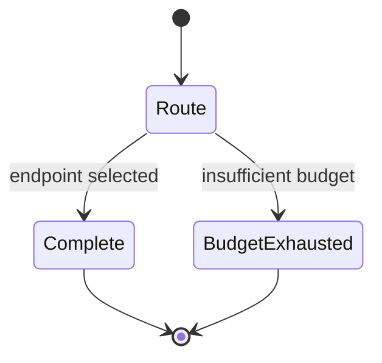

# RFC-0007: Model Router & Provider

| Field | Value |
| --- | --- |
| Status | Draft |
| Author | arkadianet |
| Architecture | Alloy Architecture V2 (frozen) |
| Depends on | RFC-0001, RFC-0004 |
| Effort | 4–6 person-days |

## Purpose

Provider-agnostic model routing with **no hardcoded model IDs** in core. MVP: TOML `capability | node_kind → tier` map + **one** openai-compatible `ModelProvider`. BYOM mandatory (V2 §11).

## Scope

### In scope

- `ModelRouter` + `ModelProvider` traits
- Tiers: Premium / Standard / Economy / Local
- `router.toml.example` fully specified (V2 §11.2 example)
- One openai-compatible HTTP provider using `api_key_env` (e.g. `ALLOY_API_KEY` from `example.env`)
- `health()` stub always Healthy
- Decision-log every route/complete via RFC-0004
- Compatibility surface so `ScriptedProvider` ([RFC-0016](./RFC-0016-eval-harness-holdout-gates.md)) implements `ModelProvider`

### Out of scope

- Multi-factor scoring / multi-provider failover logic → deferred (ADR F-20)
- Capability worker prompts → [RFC-0013](./RFC-0013-capability-registry-workers.md)
- Cost marketing numbers → forbidden (V2 §18)

## Dependencies

- **RFC-0001** — tiers, capability IDs, `PromptPack` placeholder type (finalized in 0012; router accepts opaque prompt struct)
- **RFC-0004** — metering + decision records

Note: `PromptPack` full assembly is RFC-0012; until then router may accept a minimal `PromptPack` { messages, citations: [] } defined in 0001/0007.

## Public API

From V2 §11.2:

```rust
#[async_trait]
pub trait ModelRouter: Send + Sync {
    async fn route(&self, req: RoutingRequest) -> Result<RoutedModel, RouterError>;
    async fn complete(&self, routed: &RoutedModel, prompt: PromptPack) -> Result<ModelResponse, RouterError>;
}

#[async_trait]
pub trait ModelProvider: Send + Sync {
    fn id(&self) -> ProviderId;
    async fn complete(&self, endpoint: &ModelEndpoint, req: CompletionRequest) -> Result<ModelResponse, ProviderError>;
    async fn health(&self) -> Health; // stub OK in MVP
}

pub struct RoutingRequest {
    pub capability: CapabilityId,
    pub complexity: Option<ComplexityScore>, // ignored MVP; serde-stable
    pub budget_remaining: BudgetSnapshot,
    pub requires_tools: bool,
    pub requires_structured_output: bool,
}
```

## Internal architecture

Module in `alloy-runtime::router`. Load TOML; map capability → tier → endpoint. No `match provider { Anthropic => … }` in core.

## Data structures

`router.toml` sections: `[policy]`, `[[providers]]`, `[[providers.endpoints]]`, `[capability_tiers]` as in V2.

## State machine

N/A for MVP single-provider. Future health failover may pause runs (V2 §5.6)—stub only.



## Failure modes

| Failure | Handling |
| --- | --- |
| Provider outage | Health stub → pause/error; multi-endpoint later |
| Missing API key env | Fail closed with config error (do not invent keys; do not write `.env`) |
| Unknown capability tier | Use `default_tier` or error |
| Budget insufficient for Premium | Deny escalate; record decision |

## Testing strategy

- Unit: TOML parse; capability→tier map
- Mock provider complete/metering
- Contract test: ScriptedProvider satisfies trait (shared with 0016)
- Ensure no model ID string literals in runtime core

## Acceptance criteria

- [ ] Traits match V2; one openai-compatible provider works
- [ ] `router.toml.example` + `example.env` key documented
- [ ] No hardcoded vendor model IDs in core
- [ ] Route/complete decisions logged (hashes default)
- [ ] Scoring weights unused/stubbed

## Definition of Done

Merge only when the series [Definition of Done](./README.md#definition-of-done-merge-gate) is fully met:

- [ ] Architecture compliance: **PASS**
- [ ] RFC acceptance criteria: **100% satisfied**
- [ ] Unit tests: **passing**
- [ ] Integration tests: **passing** (if applicable)
- [ ] Documentation: **complete**
- [ ] Public APIs: **reviewed and stable**
- [ ] Clippy: **clean**
- [ ] Formatting: **clean**
- [ ] No TODO or placeholder implementations left in this RFC's scope (explicit **Stub** / deferred only)
- [ ] Code review: **approved**

## Estimated implementation effort

**4–6 person-days**.

## Future extensions

- ≥2 providers + measured misroute-driven scoring (V2 §11)
- Local tier aggressiveness measured in Eval (V2 §21.2)
