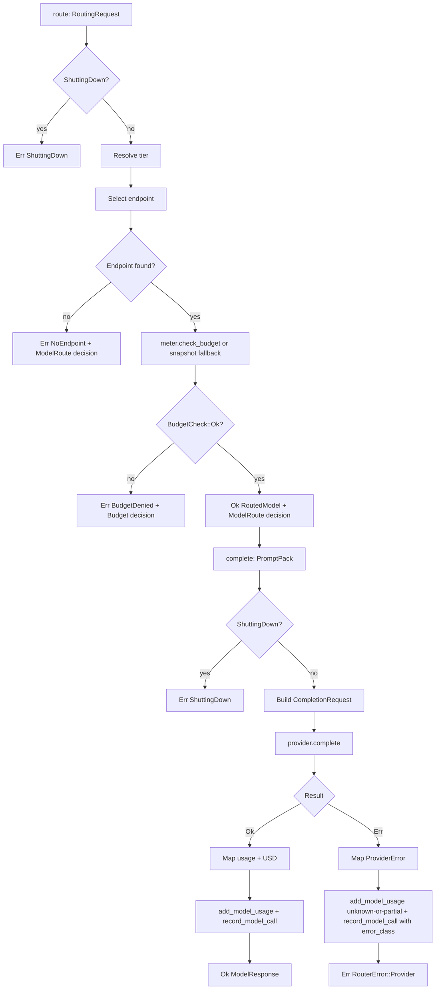
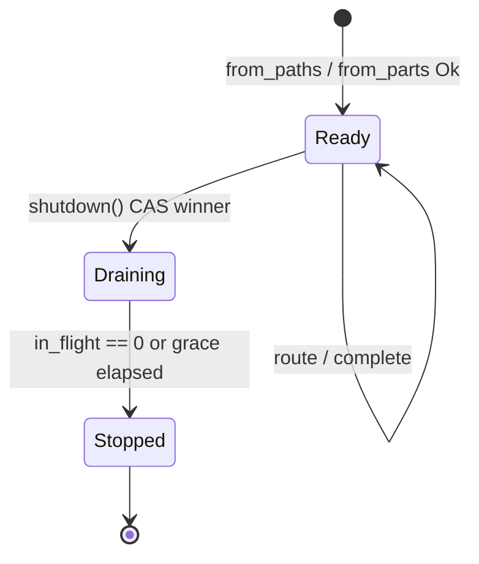
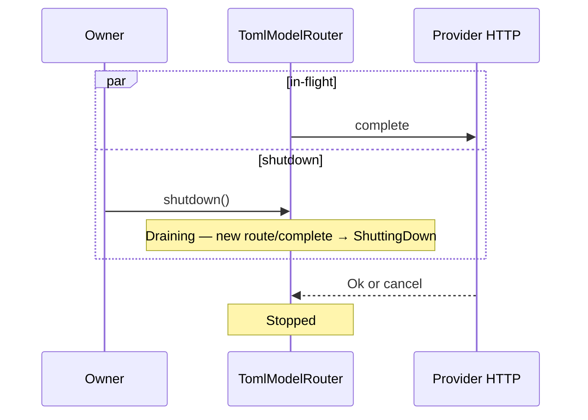

# RFC-0007: Model Router & Provider

| Field | Value |
| --- | --- |
| **Status** | Implemented |
| **Author** | arkadianet |
| **Architecture** | Alloy Architecture V2 (**frozen**) — do not redesign |
| **Depends on** | [RFC-0001](./RFC-0001-alloy-runtime.md) (merged), [RFC-0004](./RFC-0004-observability-cost-metering.md) (merged) |
| **Effort** | 7–9 person-days |
| **Related RFCs** | [0005](./RFC-0005-sandbox-broker.md) sandbox posture / `Grant::Network` · [0006](./RFC-0006-mcp-host-builtins.md) recording-seam pattern · [0010](./RFC-0010-scheduler-runtime-adapters.md) scheduler / retry loops (depends on 0003/0004/0006/0009 — **not** on 0007; consumes `ErrorClass` via adapters) · [0012](./RFC-0012-context-engine.md) full `PromptPack` · [0013](./RFC-0013-capability-registry-workers.md) workers (map `RouterError`/`ProviderError` → `ErrorClass`) · [0016](./RFC-0016-eval-harness-holdout-gates.md) `ScriptedProvider` |
| **Product** | Alloy — AI Engineering Runtime |
| **Supersedes** | Draft outline of this filename (expanded to implementation grade) |

**Mental model (V2 §11 / ADR F-20 / BYOM):** Models are plugins behind `ModelRouter`. Core MUST NOT hardcode vendor model IDs. MVP is TOML `capability → tier` plus **one** openai-compatible HTTP provider. Scoring weights are stubbed and unused. This RFC is the **first real LLM call** in the workspace and the **first producer** of the RFC-0004 cost / decision schema.

**Authority order (highest → lowest):** current `main` source → merged RFCs 0001–0006 → Architecture V2 → this draft → roadmaps. Never reshape a merged public API solely to match an older V2 sketch or this document’s prior outline.

---

## 1. Overview

### 1.1 Purpose

Ship the MVP **Model Router & Provider** as a module in `alloy-runtime`:

1. **`ModelRouter` + `ModelProvider` traits** matching Architecture V2 §11.2, with complete supporting types.
2. **`TomlModelRouter`** loading the authoritative `router.toml` schema (`[policy]`, `[[providers]]`, `[[providers.endpoints]]`, `[capability_tiers]`).
3. **One** `OpenAiCompatibleProvider` that performs non-streaming HTTP chat completions using `api_key_env`.
4. **RFC-0004 integration** — every route and completion is decision-logged; every provider usage update feeds `CostMeter` / `SharedCostMeter` without fabricating tokens or USD.
5. **Recording / scripted seam** so RFC-0016 `ScriptedProvider` and in-crate tests implement `ModelProvider` without network.
6. **First network dependency** — justified HTTP client, TLS, feature gate, timeouts, redirect/proxy/reuse policy; retry loops owned by RFC-0010.

### 1.2 Problem Statement

RFC-0001 published `ModelTier`, `ProviderId`, `CapabilityId`, `BudgetSnapshot`, and a provisional router peek that only reads `api_key_env` from a transitional `[provider.*]` map. RFC-0004 published `CostMeter`, `ModelCallRecord`, `DecisionLog`, and the wire `usage_unknown` consistency invariant — **before any provider existed**. Architecture V2 §11 requires a BYOM tier router with no hardcoded model IDs. Without this RFC there is no `ModelRouter`, no HTTP provider, no producer of `ModelCall` events from real usage, and no way for workers or Eval to complete a model call — the control-plane thesis cannot be exercised end-to-end.

### 1.3 Scope

| In scope | Detail |
| --- | --- |
| Traits | `ModelRouter`, `ModelProvider` |
| Concrete router | `TomlModelRouter` |
| Concrete provider | `OpenAiCompatibleProvider` (exactly one kind: `openai_compatible`) |
| Config | Full `router.toml` schema; update `router.toml.example`; document `example.env` keys |
| Tiers | Premium / Standard / Economy / Local via existing `ModelTier` |
| Health | `health()` stub always `Healthy` |
| Observability | Decision-log every route / complete; meter every provider usage outcome |
| Cost → USD | Config price table → optional `usd`; honour V2 §18 / ADR F-08 |
| Recording seam | `RecordingModelProvider` + `ScriptedProvider` contract for RFC-0016 |
| Minimal `PromptPack` | Runtime IR struct; RFC-0012 upgrade path; no collision with `ArtifactKind::PromptPack` |
| Config amendment | Replace provisional RFC-0001 `[provider.*]` peek with file-existence + RFC-0007 ownership |
| Tests | Unit, integration (wiremock), negative, budget, cancel, concurrency, no-hardcoded-IDs |

### 1.4 Non-goals

| Deferred item | Owner |
| --- | --- |
| Multi-factor scoring / multi-provider failover | **ADR F-20** — deferred; weights stubbed |
| Second provider kind or second live provider | Deferred (V2 evolution) |
| Capability worker prompts / `CapabilityContext` | **RFC-0013** |
| Full three-domain `PromptPack` assembly | **RFC-0012** |
| Retry / backoff loops on provider errors | **RFC-0010** (retry loops; maps through `ErrorClass` — see §10.4) |
| Streaming chat completions | Deferred — MVP non-streaming (§3.8) |
| Cost marketing numbers / savings claims | **Forbidden** (V2 §18.2 / ADR F-08) |
| OTLP, sixth crate, new OS service, plugin framework | Forbidden |
| Writing or overwriting `.env` | Forbidden |
| Sandbox redesign / moving provider HTTP into the jail | Out of scope — see §2.6 |

### 1.5 Day-1 MVP (normative)

1. `TomlModelRouter::from_paths(...)` MUST load the §7 schema, resolve exactly one `openai_compatible` provider, require run-scoped meter + decision log + `bound_run`, and fail closed on invalid config or missing/empty `api_key_env`.
2. `route` MUST select tier from `[capability_tiers]` else `[policy].default_tier`, select the first matching endpoint, enforce budget denial **without** tier escalation/downgrade, and record `DecisionKind::ModelRoute` (or `Budget` on denial).
3. `complete` MUST enforce sealed-handle admission (§5.4.1), call the selected provider once (no retry loop), normalize outputs, map into `ModelResponse` + RFC-0004 records, update `SharedCostMeter`, and durable-append `ModelCall` via `DurableAppendSupervisor` (§5.9.3).
4. `OpenAiCompatibleProvider::health` MUST return `Health::Healthy` unconditionally (stub).
5. `[policy].scoring` weights, if present, MUST be parsed and MUST NOT affect routing.
6. Core Rust sources under `alloy-runtime` (excluding tests that assert absence) MUST contain **zero** vendor model-ID string literals and **zero** `match` arms on provider vendor brands for model selection.
7. Alloy MUST NEVER write `.env`. Missing keys fail closed with errors that point at `example.env`.

---

## 2. Architecture Integration

### 2.1 Relationship to Architecture V2

| V2 reference | Application |
| --- | --- |
| §11.1 Requirements | Provider-agnostic; tiers Premium/Standard/Economy/Local; no hardcoded model names |
| §11.2 Architectural interface | `ModelRouter` + `ModelProvider`; capability → tier policy |
| §11.2 MVP | TOML map + one openai-compatible provider; health stub |
| §11.2 Example capability keys | Mixed-case examples are accepted by normalizing to lowercase and rejecting post-normalization duplicates |
| §11.2 Deferred | Multi-factor scoring, residency finesse (ADR F-20) |
| §11.2 Stub | `health()` always Healthy; scoring unused |
| §18.1–18.2 | Budgets + metering APIs normative; cost marketing numbers forbidden |
| §14.2 / ADR F-07 | Sandbox-before-dogfood remains in force for tool exec; this RFC’s host egress is separate (§2.6) |
| §14.4 | Credentials via `api_key_env`; redaction defaults |

### 2.2 Relationship to RFC-0001

Authoritative for: `ModelTier`, `BudgetSnapshot`, `BudgetPolicy`, `TokenBudget`, `ProviderId`, `CapabilityId`, `SessionId` / `RunId` / `NodeId`, `RuntimeConfig` load skeleton, `Grant::Network` / `HostAllow`, five-crate map, `#![forbid(unsafe_code)]` on `alloy-runtime`.

**Amendment (config peek):** The provisional `RuntimeConfig::load` parse of `[provider.<name>] api_key_env` MUST be removed. File existence of `router_path` remains required. Full schema ownership moves to this RFC’s `RouterConfig` (§7). See §7.6.

### 2.3 Relationship to RFC-0004

Authoritative for: `CostMeter`, `SharedCostMeter`, `BudgetCheck`, `CostSnapshot`, `ModelCallRecord`, `DecisionRecord`, `DecisionKind`, `DecisionLog`, `EventDecisionLog`, `RecordingDecisionLog`, `usage_unknown` wire synthesis + query invariant, retention / redaction helpers.

**RFC-0007 is the first real producer.** It MUST call:

| When | Call |
| --- | --- |
| Successful or failed provider contact that yields a completion attempt | `DecisionLog::record_model_call` + `SharedCostMeter::add_model_usage` (when meter injected) |
| Every `route` outcome (success or budget/config denial after admission) | `DecisionLog::record` with `DecisionKind::ModelRoute` or `Budget` |

**RFC-0004 compatibility decision:** the token/meter semantics are reused unchanged, but the first real producer exposes missing attribution fields on the merged `ModelCallRecord`. RFC-0007 therefore REQUIRES the additive RFC-0004 amendment in §5.9.4 before implementation is complete. This amendment is backward-compatible at the private wire-payload level because the added fields are nullable / defaulted on read. The `usage_unknown` invariant (`input.is_none() || output.is_none()`) remains unchanged.

### 2.4 Already implemented | Added by RFC-0007 | Deferred

| Category | Contents |
| --- | --- |
| **Already implemented** | `ModelTier`, `BudgetSnapshot`, `BudgetPolicy`, `ProviderId`, `CapabilityId`, `CostMeter` / `SharedCostMeter` / `BudgetCheck`, `ModelCallRecord` / `DecisionLog` / `DecisionKind::{ModelRoute,Budget}`, redaction helpers, `ArtifactKind::PromptPack` (storage kind only), provisional router file existence check, `Grant::Network` / `HostAllow`, sandbox broker (0005), MCP host (0006) |
| **Added by RFC-0007** | `router` module; traits; `TomlModelRouter`; `OpenAiCompatibleProvider`; minimal `PromptPack` IR; `RouterConfig`; HTTP client dependency behind default-on feature; price→USD derivation; additive `ModelCallRecord` attribution/provenance fields; `RecordingModelProvider`; error taxonomy; `router.toml.example` full schema |
| **Deferred** | Scoring / failover (ADR F-20); second provider; streaming; RFC-0010 retries; RFC-0012 full pack; RFC-0013 workers; RFC-0016 ScriptedProvider body (contract only here) |

### 2.5 Dependency boundaries

```text
alloy-cli / alloy-eval / workers (0013)
        │
        ▼
alloy-runtime::router  ──uses──►  alloy-runtime::obs (DecisionLog, CostMeter)
        │                         alloy-runtime::types (IDs, budgets, ErrorClass)
        │                         alloy-runtime::config (paths only; no provider peek)
        ▼
OpenAiCompatibleProvider ──HTTP──► external openai-compatible API
RecordingModelProvider / ScriptedProvider (0016) ── no network
```

- `alloy-runtime` remains one of ≤5 crates. **No sixth crate.**
- Router MUST NOT depend on `alloy-tools` sandbox for provider HTTP.
- Router MAY depend on `DecisionLog` trait only (same pattern as RFC-0006 MCP).

### 2.6 Sandbox posture and first network egress

RFC-0005 enforces **deny-by-default network** inside sandboxed **tool/exec** children (`Grant::Network(HostAllow)` is the only allow path for those children).

RFC-0007 opens the **first host-process egress** in the workspace: the runtime process itself dials the provider `base_url`.

| Path | Network policy |
| --- | --- |
| Sandboxed `cargo_*` / tool children | Unchanged — deny by default; `Grant::Network` / `HostAllow` only |
| `OpenAiCompatibleProvider` HTTP | Host-process egress to configured `base_url` only; not mediated by `SandboxBroker` |
| Dogfood (Alloy-on-Alloy) | Still banned until sandbox + holdout green (ADR F-07 / RFC-0016) |

**Normative:** Implementing RFC-0007 MUST NOT weaken sandbox network deny for tool exec. Operator-configured `base_url` is the sole intended egress target for the provider. Credentials remain env-referenced (`api_key_env`), never written to disk by Alloy.

---

## 3. Public Rust API

New router items live under `alloy_runtime::router` and are re-exported from the crate root where noted in §3.16. Additive cross-cutting items required by RFC-0004 compatibility live with their owning shared surface: `EndpointId` in `types::ids`, and `ModelUsdSource` / added `ModelCallRecord` fields in `obs::decision`. `alloy-runtime` is `#![deny(missing_docs)]`; every public item and public field specified in this section MUST have rustdoc that states ownership and failure semantics at the implementation site.

### 3.1 Reused types (normative — unchanged)

| Type | Source | Notes |
| --- | --- | --- |
| `ModelTier` | `types/budget.rs` | Premium/Standard/Economy/Local; serde `snake_case` |
| `BudgetSnapshot` | `types/budget.rs` | `usd_spent` / `tokens_in` / `tokens_out` — **spent** counters despite V2 field name `budget_remaining` |
| `BudgetPolicy` | `types/budget.rs` | Ceilings for denial |
| `ProviderId`, `CapabilityId` | `types/ids.rs` | Catalog names 1..=128 bytes |
| `SessionId`, `RunId`, `NodeId`, `Digest`, `EventSeq` | `types/ids.rs` | Attribution / hashing |
| `EndpointId` | `types/ids.rs` | Added by RFC-0007; endpoint catalog id shared with RFC-0004 model-call records |
| `ErrorClass` | `types/diagnostic.rs` | `Model`, `Budget`, `Timeout`, `Cancelled`, … |
| `CostMeter`, `SharedCostMeter`, `BudgetCheck` | `obs/cost.rs` | Metering |
| `ModelCallRecord`, `DecisionRecord`, `DecisionKind`, `DecisionLog` | `obs/decision.rs` | Recording |
| `ArtifactKind::PromptPack` | `storage/artifacts.rs` | Storage kind enum **only** — do not alter |

### 3.2 `ComplexityScore`

```rust
/// Serde-stable complexity hint (V2 §11.2). MVP routing MUST ignore this field.
#[derive(Debug, Clone, Copy, PartialEq, Serialize, Deserialize)]
pub struct ComplexityScore(pub f32);
```

**Validation:** If present on `RoutingRequest`, values outside `0.0..=1.0` MUST NOT fail routing; they remain ignored. No clamping required in MVP.

### 3.3 `EndpointId`

```rust
/// Catalog id for a model endpoint row in `router.toml`.
#[derive(Debug, Clone, PartialEq, Eq, Hash, Serialize)]
#[serde(transparent)]
pub struct EndpointId(String);

impl EndpointId {
    pub fn new(s: impl Into<String>) -> Result<Self, IdError>; // empty or >128 → InvalidName
    pub fn as_str(&self) -> &str;
}
```

Same length rules as `ProviderId` (1..=128). `Deserialize` MUST be handwritten and validating, matching the `name_id!` pattern in `types/ids.rs`; deriving `Deserialize` is forbidden because it bypasses validation. Router config maps `IdError::InvalidName` to `RouterError::Config`.

### 3.4 `ModelEndpoint`

```rust
#[derive(Debug, Clone, PartialEq, Serialize)]
pub struct ModelEndpoint {
    pub id: EndpointId,
    pub provider: ProviderId,
    /// Human label only — NEVER used as the wire model id.
    pub display_name: String,
    /// Wire model id from TOML `model` — BYOM; not a Rust string literal in core.
    pub model: String,
    pub tiers: Vec<ModelTier>,
    pub supports_tools: bool,
    pub supports_structured_output: bool,
    pub max_context: u32,
    /// USD per 1_000_000 input tokens. `None` → never invent USD for this endpoint.
    pub input_usd_per_mtok: Option<f64>,
    /// USD per 1_000_000 output tokens. `None` → never invent USD for this endpoint.
    pub output_usd_per_mtok: Option<f64>,
}
```

**Ownership:** cloned into `RoutedModel`; cheap enough for MVP. `model` MUST come solely from config.

**V2 extension:** Architecture V2 §11.2 omitted the endpoint wire model id even though BYOM requires an operator-supplied id. RFC-0007 adds `model` to `ModelEndpoint` and to `router.toml` so runtime core does not hardcode vendor IDs.

### 3.5 `Health`

```rust
#[derive(Debug, Clone, Copy, PartialEq, Eq, Serialize, Deserialize)]
#[serde(rename_all = "snake_case")]
pub enum Health {
    Healthy,
    Degraded,
    Unhealthy,
}
```

MVP: providers MUST return `Healthy`. `Degraded` / `Unhealthy` exist for serde stability and future failover (deferred).

### 3.6 `ChatRole` / `ChatMessage` / `Citation` / `PromptPack`

```rust
#[derive(Debug, Clone, Copy, PartialEq, Eq, Serialize, Deserialize)]
#[serde(rename_all = "snake_case")]
pub enum ChatRole {
    System,
    User,
    Assistant,
    Tool,
}

#[derive(Debug, Clone, PartialEq, Eq, Serialize, Deserialize)]
pub struct ChatMessage {
    pub role: ChatRole,
    pub content: String,
}

#[derive(Debug, Clone, PartialEq, Eq, Serialize, Deserialize)]
pub struct Citation {
    /// Opaque source label (path, artifact id, graph node, etc.).
    pub source: String,
    #[serde(default, skip_serializing_if = "Option::is_none")]
    pub digest: Option<Digest>,
}

/// Minimal prompt IR accepted by `ModelRouter::complete`.
///
/// **Not** `ArtifactKind::PromptPack`. That enum variant is a storage classification.
/// Persisting this struct as an artifact MUST use `ArtifactKind::PromptPack` without
/// changing the enum.
#[derive(Debug, Clone, PartialEq, Serialize, Deserialize)]
pub struct PromptPack {
    pub messages: Vec<ChatMessage>,
    #[serde(default)]
    pub citations: Vec<Citation>,
    /// Reserved for RFC-0012 domain labels / weights. MVP: always absent/ignored.
    #[serde(default, skip_serializing_if = "Option::is_none")]
    pub domains: Option<serde_json::Value>,
}
```

**Serde stability:** Additive fields with `#[serde(default)]` only. RFC-0012 MUST extend without renaming `messages` / `citations` or changing their element types’ wire names.

**RFC-0012 upgrade path:** Add domain-labelled sections / weights as new fields or by populating `domains`; keep `messages` as the flattenable chat view the router already sends. No breaking change to `ModelRouter::complete` signature.

### 3.7 `CompletionRequest` / `ToolChoice` / `ResponseFormat` / `Usage` / `ModelResponse`

```rust
#[derive(Debug, Clone, Copy, PartialEq, Eq, Serialize, Deserialize)]
#[serde(rename_all = "snake_case")]
pub enum ToolChoice {
    None,
    Auto,
}

#[derive(Debug, Clone, PartialEq, Serialize, Deserialize)]
#[serde(rename_all = "snake_case")]
pub enum ResponseFormat {
    Text,
    JsonObject,
}

#[derive(Debug, Clone, PartialEq, Serialize, Deserialize)]
pub struct CompletionRequest {
    pub messages: Vec<ChatMessage>,
    /// MVP: empty. Tool schemas arrive with RFC-0013; field reserved serde-stable.
    #[serde(default)]
    pub tools: Vec<serde_json::Value>,
    #[serde(default = "tool_choice_none")]
    pub tool_choice: ToolChoice,
    #[serde(default = "response_format_text")]
    pub response_format: ResponseFormat,
    pub temperature: Option<f32>,
    pub max_output_tokens: Option<u32>,
}

fn tool_choice_none() -> ToolChoice { ToolChoice::None }
fn response_format_text() -> ResponseFormat { ResponseFormat::Text }

#[derive(Debug, Clone, PartialEq, Eq, Serialize, Deserialize)]
pub struct Usage {
    pub input_tokens: Option<u64>,
    pub output_tokens: Option<u64>,
}

#[derive(Debug, Clone, PartialEq, Serialize, Deserialize)]
pub struct ModelResponse {
    pub text: Option<String>,
    pub structured: Option<serde_json::Value>,
    /// MVP: always empty. Reserved for tool-calling workers (RFC-0013).
    #[serde(default)]
    pub tool_calls: Vec<serde_json::Value>,
    pub usage: Usage,
    pub provider_request_id: Option<String>,
    pub finish_reason: Option<String>,
}
```

**Streaming (normative):** MVP MUST NOT stream. `complete` returns one `ModelResponse` after the full HTTP body is received. Future streaming MUST NOT remove or reshape these fields; it MUST add a separate streaming API (e.g. `complete_stream`) or an additive request flag defaulting to off. `ModelResponse` therefore does **not** foreclose streaming.

`finish_reason` is the provider boundary carrier for `choices[0].finish_reason`. `OpenAiCompatibleProvider` MUST redact/truncate it to ≤128 bytes on a UTF-8 boundary before constructing `ModelResponse`. `provider_request_id` MUST be redacted/truncated to ≤256 bytes. `TomlModelRouter` copies both fields into `ModelCallRecord`. `RecordingModelProvider` and RFC-0016 `ScriptedProvider` set them directly on scripted `ModelResponse`s.

### 3.8 `RoutingRequest` / `RoutedModel`

```rust
#[derive(Debug, Clone, PartialEq, Serialize, Deserialize)]
pub struct RoutingRequest {
    /// Required for DecisionLog attribution (RFC-0004). Additive vs V2 sketch.
    pub session: SessionId,
    pub run: Option<RunId>,
    pub node: Option<NodeId>,
    pub capability: CapabilityId,
    /// Ignored in MVP; serde-stable.
    pub complexity: Option<ComplexityScore>,
    /// Spent counters (`CostMeter::to_budget_snapshot` shape). Name kept from V2.
    pub budget_remaining: BudgetSnapshot,
    pub requires_tools: bool,
    pub requires_structured_output: bool,
}

#[derive(Debug)]
pub struct RoutedModel {
    endpoint: ModelEndpoint,
    tier: ModelTier,
    session: SessionId,
    run: Option<RunId>,
    node: Option<NodeId>,
    requires_structured_output: bool,
    route_event_seq: Option<EventSeq>,
    /// Opaque router instance id; `complete` MUST reject mismatched routers.
    router_instance_id: u64,
    /// One-shot ticket shared across clones; consumed by first successful admission into `complete`.
    complete_ticket: CompleteTicket,
}

impl RoutedModel {
    pub fn endpoint(&self) -> &ModelEndpoint;
    pub fn tier(&self) -> ModelTier;
    pub fn session(&self) -> SessionId;
    pub fn run(&self) -> Option<RunId>;
    pub fn node(&self) -> Option<NodeId>;
    pub fn requires_structured_output(&self) -> bool;
    pub fn route_event_seq(&self) -> Option<EventSeq>;
}

impl Clone for RoutedModel {
    /// Clones the ticket `Arc` (does **not** mint a fresh ticket).
    fn clone(&self) -> Self;
}

impl Serialize for RoutedModel {
    /// Serializes public attribution fields only (never the ticket or router id).
    fn serialize<S: Serializer>(&self, serializer: S) -> Result<S::Ok, S::Error>;
}
```

**Sealed handle (normative):** All selection fields are private. Callers MUST NOT mutate endpoint/model/tier after `route`. There is no public constructor for production use; only `ModelRouter::route` (and `#[cfg(test)]` helpers inside `alloy-runtime`) may mint a `RoutedModel`.

**Attribution:** `session` is REQUIRED on `RoutingRequest` because RFC-0004 `DecisionLog` requires a session row for durable append, and route decisions MUST be attributable. This is an additive field relative to the V2 sketch (V2 omitted obs attribution that RFC-0004 already merged).

```rust
#[derive(Clone, Debug)]
struct CompleteTicket {
    used: Arc<AtomicBool>,
}

impl CompleteTicket {
    fn new() -> Self;
    /// Returns true exactly once across all clones.
    fn try_consume(&self) -> bool;
}
```

`TomlModelRouter` MUST hold a process-unique `router_instance_id: u64` (monotonic `AtomicU64` at construction). Each successful `route` stamps that id onto the `RoutedModel`. `complete` on a different router instance MUST return `Err(RouterError::WrongRouter)` before ticket consume.

`Clone` is REQUIRED and MUST share the ticket. A second `complete` against the same ticket (including via a clone) MUST return `Err(RouterError::AlreadyCompleted)` and MUST NOT perform provider HTTP or metering. `PartialEq` is not implemented (ticket is runtime state).

**`complete` admission precedence (normative, first match wins):**
1. `ShuttingDown` / phase not Ready (after semaphore wait ends in shutdown)
2. `WrongRouter`
3. `AlreadyCompleted` (ticket consume fails)
4. `BudgetDenied` (re-check when meter present)
5. Provider call / other errors

### 3.9 `SecretString`

```rust
/// API key material. NEVER logged, displayed, or included in events.
pub struct SecretString { /* private */ }

impl SecretString {
    pub fn new(s: impl Into<String>) -> Self;
    /// Borrow for Authorization header construction only.
    pub fn expose(&self) -> &str;
}

impl std::fmt::Debug for SecretString {
    fn fmt(&self, f: &mut std::fmt::Formatter<'_>) -> std::fmt::Result {
        f.write_str("SecretString([REDACTED])")
    }
}
```

MUST NOT implement `Display`, `Serialize`, `Clone`, `PartialEq`, or `Eq`. Tests that need to assert key handling MUST inspect redacted `Debug` output or use provider request assertions; they MUST NOT compare secret values through this type.

### 3.10 `RouterError` / `ProviderError`

```rust
#[derive(Debug, thiserror::Error)]
#[non_exhaustive]
pub enum RouterError {
    #[error("config: {0}")]
    Config(String),
    #[error("no endpoint for tier {tier:?} (tools={requires_tools}, structured={requires_structured})")]
    NoEndpoint {
        tier: ModelTier,
        requires_tools: bool,
        requires_structured: bool,
    },
    #[error("budget denied: {0:?}")]
    BudgetDenied(BudgetCheck),
    #[error("routed model already completed")]
    AlreadyCompleted,
    #[error("routed model was issued by a different router instance")]
    WrongRouter,
    #[error("provider: {0}")]
    Provider(#[from] ProviderError),
    #[error("cancelled")]
    Cancelled,
    #[error("shutting down")]
    ShuttingDown,
    #[error("internal: {0}")]
    Internal(String),
}

#[derive(Debug, thiserror::Error)]
#[non_exhaustive]
pub enum ProviderError {
    #[error("auth failed")]
    Auth,
    #[error("rate limited")]
    RateLimit,
    #[error("context length exceeded")]
    ContextLength,
    #[error("timeout")]
    Timeout,
    #[error("malformed response: {0}")]
    MalformedResponse(String),
    #[error("http status {status}: {message}")]
    HttpStatus { status: u16, message: String },
    #[error("tls: {0}")]
    Tls(String),
    #[error("transport: {0}")]
    Transport(String),
    #[error("internal: {0}")]
    Internal(String),
}
```

**Display / Debug:** `ProviderError` message strings MUST pass through `obs::redact_secrets` before storage in the variant when the source is a provider body or header. `Auth` / `RateLimit` / `ContextLength` / `Timeout` carry **no** body. `HttpStatus.message`, `Tls`, `Transport`, and `MalformedResponse` MUST be redacted and truncated to ≤512 bytes. When a construct-time provider validation failure occurs inside `TomlModelRouter::from_paths`, it MUST be mapped to `RouterError::Config`; `RouterError::Provider` is only for `complete`.

Full taxonomy tables: §8.

### 3.11 `ModelProvider` trait

```rust
#[async_trait]
pub trait ModelProvider: Send + Sync {
    fn id(&self) -> ProviderId;

    async fn complete(
        &self,
        endpoint: &ModelEndpoint,
        req: CompletionRequest,
    ) -> Result<ModelResponse, ProviderError>;

    /// MVP stub: concrete providers MUST return `Health::Healthy`.
    async fn health(&self) -> Health;
}
```

**Send/Sync:** required. Implementations MUST be safe to share via `Arc<dyn ModelProvider>`.

**Async:** `async_trait` (workspace dep already present).

**Visibility:** public trait in `alloy_runtime::router`.

### 3.12 `ModelRouter` trait

```rust
#[async_trait]
pub trait ModelRouter: Send + Sync {
    async fn route(&self, req: RoutingRequest) -> Result<RoutedModel, RouterError>;

    async fn complete(
        &self,
        routed: &RoutedModel,
        prompt: PromptPack,
    ) -> Result<ModelResponse, RouterError>;
}
```

**Contract:** `complete` MUST use the sealed `RoutedModel` issued by a prior `route` on **this** router instance. Callers cannot mutate endpoint/model/tier (private fields). `complete` MUST follow §5.4.1 admission precedence (WrongRouter → ticket → budget) before provider HTTP.

### 3.13 `TomlModelRouter`

```rust
pub struct TomlModelRouter { /* private fields — see §4 */ }

impl TomlModelRouter {
    /// Production constructor: load + validate config; resolve API key; build provider.
    /// REQUIRES run-scoped decision log + cost meter. Fail closed on invalid TOML,
    /// unknown kinds, missing key, empty providers, price-table policy violations (§7.2).
    #[cfg(feature = "http-provider")]
    pub fn from_paths(
        router_path: &Path,
        budget_policy: BudgetPolicy,
        example_env_hint: &Path,
        decision_log: Arc<dyn DecisionLog>,
        cost_meter: SharedCostMeter,
        bound_run: RunId,
    ) -> Result<Self, RouterError>;

    /// Injection constructor (no file I/O). Re-validates all config invariants (§7.2)
    /// and requires `provider.id() == config.providers[0].id`.
    pub fn from_parts(parts: TomlModelRouterParts) -> Result<Self, RouterError>;

    pub fn metrics(&self) -> RouterMetricsSnapshot;

    /// Begin drain: reject new route/complete with `ShuttingDown`.
    pub async fn shutdown(&self) -> RouterShutdownReport;
}
```

```rust
#[non_exhaustive]
pub struct TomlModelRouterParts {
    pub config: RouterConfig,
    pub provider: Arc<dyn ModelProvider>,
    pub budget_policy: BudgetPolicy,
    /// Required unless `allow_unmetered` is true (tests only).
    pub decision_log: Option<Arc<dyn DecisionLog>>,
    /// Required unless `allow_unmetered` is true (tests only).
    pub cost_meter: Option<SharedCostMeter>,
    /// When set, `route`/`complete` require `RoutingRequest.run == Some(bound_run)`.
    pub bound_run: Option<RunId>,
    /// Test-only escape hatch; absent from production artifacts.
    #[cfg(test)]
    pub allow_unmetered: bool,
    pub shutdown_token: Option<tokio_util::sync::CancellationToken>,
}

impl TomlModelRouterParts {
    pub fn new(
        config: RouterConfig,
        provider: Arc<dyn ModelProvider>,
        budget_policy: BudgetPolicy,
        decision_log: Option<Arc<dyn DecisionLog>>,
        cost_meter: Option<SharedCostMeter>,
        bound_run: Option<RunId>,
    ) -> Self;

    pub fn shutdown_token(self, token: CancellationToken) -> Self;

    #[cfg(test)]
    pub fn allow_unmetered(self) -> Self;
}
```

**Construction ownership:** `from_paths` owns parsing + building `OpenAiCompatibleProvider` with a crate-private validated HTTP client (§3.14). `from_parts` is the injection point for `RecordingModelProvider` / RFC-0016 scripts.

`from_paths` MUST reject unmetered semantics: meter + decision log + `bound_run` are always required. `from_parts` MUST return `RouterError::Config` if the test-only escape hatch is disabled and either meter or decision log is missing, or if `bound_run` is missing when metered. The `allow_unmetered` field and builder MUST be compiled only in `#[cfg(test)]` builds of `alloy-runtime`, so production artifacts cannot set it.

`from_paths`, `OpenAiCompatibleProvider`, `OpenAiCompatibleSpec`, and `http_client` are gated behind `http-provider`. `from_parts`, traits, config DTOs, `RecordingModelProvider`, and all shared types compile without default features.

**Budget policy:** injected at construction from `RuntimeConfig::budget_policy` (§7.6). Used by `route` / `complete` denial (§5.4). Not read from `router.toml`.

**Per-run metering ownership (normative):**

- RFC-0004 / run lifecycle (surfaced by RFC-0010 scheduler host) creates one `SharedCostMeter` per run.
- RFC-0013 workers / host composition bind that meter + a session `DecisionLog` into a **run-scoped** `TomlModelRouter` via `from_paths` / `from_parts` (`bound_run` set).
- Concurrent runs MUST each own a distinct router instance (distinct `router_instance_id`) and MUST NOT share one meter through a process-global router.
- The router is the **sole** producer of `SessionEventType::ModelCall` (`DecisionLog::record_model_call`) and `SharedCostMeter::add_model_usage` for each LLM `complete`. Workers MUST NOT also call `add_model_usage` / `record_model_call` for the same provider completion.
- **`add_worker_metrics` trap:** on `main`, `CostMeter::add_worker_metrics` forwards into `add_model_usage`. Therefore workers MUST NOT call `add_worker_metrics` with token counts that duplicate a router completion. Until RFC-0004 splits worker-non-model metrics from model usage, LLM nodes that used the router MUST leave model tokens to the router only.
- **`WorkerMetrics` vs unknown provider usage (RFC-0013 amendment):** merged `WorkerMetrics` uses `u64` token fields, but provider usage may be `None`. Workers MUST NOT invent provider tokens as real zeros (RFC-0004). Preferred: amend `WorkerMetrics.input_tokens` / `output_tokens` to `Option<u64>` in the RFC-0013 implementation series and pass through `None` when the provider omitted usage. Interim MVP without that amendment: LLM workers MAY set `0` on `CapabilityOutput.metrics` **only** as “not reported on this struct”, MUST NOT call `add_worker_metrics` with those zeros, and schedulers MUST prefer `ModelCall` / meter snapshots for model spend.
- **RFC-0004 amendment note:** any merged guidance that workers record model calls / feed model usage for LLM completions is superseded by this RFC for completions owned by `TomlModelRouter`; update RFC-0004 in the same implementation series.
- **RFC-0013 amendment (normative for binding):** `CapabilityContext` MUST gain `pub run: RunId` (and SHOULD expose the same `session` already present) so workers can build `RoutingRequest { session, run: Some(ctx.run), node: Some(ctx.node), ... }`. Until that lands, host composition MUST inject run id by wrapping the router rather than leaving workers unable to satisfy `bound_run`.
- RFC-0010 does **not** depend on RFC-0007; it creates the meter. Binding the meter to the router is host/RFC-0013 composition.

```rust
#[derive(Debug, Clone, Copy, PartialEq, Eq)]
pub struct RouterShutdownReport {
    pub cancelled_in_flight: bool,
    pub remaining_in_flight: usize,
    /// Durable ModelCall appends still running when Stopped was entered (grace expired).
    pub remaining_appends: usize,
}
```

Shutdown reports are published once through a shared `Arc`-protected completion cell (§6.6). All `shutdown()` callers MUST observe the same final report.

### 3.14 `OpenAiCompatibleProvider`

```rust
pub struct OpenAiCompatibleProvider { /* private */ }

impl OpenAiCompatibleProvider {
    /// Builds a crate-private validated `reqwest::Client` internally (§10.1).
    /// There is **no** public constructor that accepts an arbitrary `reqwest::Client`.
    pub fn new(spec: OpenAiCompatibleSpec) -> Result<Self, ProviderError>;
}

pub struct OpenAiCompatibleSpec {
    pub id: ProviderId,
    /// Operator string; construct stores a `url::Url` with a trailing slash so
    /// `Url::join("chat/completions")` keeps the API prefix (e.g. `/v1` → `/v1/`).
    pub base_url: String,
    pub api_key: SecretString,
    pub connect_timeout: Duration,
    pub request_timeout: Duration,
}

/// Opaque wrapper so tests cannot inject a misconfigured client into production types.
pub(crate) struct ValidatedHttpClient {
    inner: reqwest::Client,
}
```

Implements `ModelProvider`. Performs `POST` to the joined chat-completions URL using a stored `url::Url` (not string concatenation).

`OpenAiCompatibleProvider::new` MUST:
1. Re-validate `base_url` (§7.2).
2. Parse into `url::Url` and **ensure a trailing `/` on the path** before storing (if the path does not end in `/`, append one). Example: `https://api.example.com/v1` normalizes to `https://api.example.com/v1/`.
3. Validate `Authorization` `HeaderValue` construction (§10.2.1).
4. Build `ValidatedHttpClient` via `http_client::build` with §10.1 policy (no redirects, platform verifier, timeouts, AWS-LC rustls).
5. On each `complete`, request URL = `base.join("chat/completions")` (yields `…/v1/chat/completions`). Without the trailing-slash normalize, `Url::join` would replace the final path segment (`/v1` → `/chat/completions`).
6. Return `ProviderError` on construct failure when called directly.

`TomlModelRouter::from_paths` MUST catch construct-time `ProviderError` and return `RouterError::Config(redacted_message)`; `RouterError::Provider` is reserved for `complete` failures.

### 3.15 `RecordingModelProvider` (test double)

```rust
/// FIFO scripted outcomes + recorded invocations. No network.
pub struct RecordingModelProvider {
    // private
}

impl RecordingModelProvider {
    pub fn new(id: ProviderId) -> Self;
    pub fn push(&self, outcome: Result<ModelResponse, ProviderError>);
    pub fn recorded(&self) -> Vec<(ModelEndpoint, CompletionRequest)>;
}
```

Implements `ModelProvider`:
- `complete` — record args, then pop FIFO (exhausted → `ProviderError::Internal("recording exhausted")`).
- `health` — always `Healthy`.
- `id` — constructor id.

**RFC-0016 contract:** `ScriptedProvider` in `alloy-eval` MUST implement the same `ModelProvider` trait. It MAY use a `HashMap` keyed by a deterministic fingerprint of `CompletionRequest` instead of FIFO; it MUST NOT perform HTTP; it MUST return `Health::Healthy`. The trait surface in this RFC is the sole coupling.

### 3.16 Crate-root re-exports

`alloy_runtime` MUST re-export at least:

`ModelRouter`, `ModelProvider`, `TomlModelRouter`, `OpenAiCompatibleProvider` (when `http-provider` is enabled), `RecordingModelProvider`, `RoutingRequest`, `RoutedModel`, `ModelEndpoint`, `EndpointId`, `CompletionRequest`, `ModelResponse`, `Usage`, `PromptPack`, `ChatMessage`, `ChatRole`, `Citation`, `ComplexityScore`, `Health`, `ToolChoice`, `ResponseFormat`, `RouterError`, `ProviderError`, `RetryDisposition`, `ClassifiedRouterFailure`, `classify_provider_error`, `classify_router_error`, `RouterConfig`, `RouterMetricsSnapshot`, `RouterShutdownReport`, `ModelUsdSource`.

### 3.17 Additive RFC-0004 `ModelCallRecord` amendment

RFC-0007 MUST extend `ModelCallRecord` and its private wire payload additively:

```rust
#[derive(Debug, Clone, Copy, PartialEq, Eq, Serialize, Deserialize)]
#[serde(rename_all = "snake_case")]
pub enum ModelUsdSource {
    ProviderReported,
    OperatorPriceTable,
}

pub struct ModelCallRecord {
    // existing RFC-0004 fields unchanged...
    pub endpoint_id: Option<EndpointId>,
    pub model: Option<String>,
    pub route_event_seq: Option<EventSeq>,
    pub usd_source: Option<ModelUsdSource>,
    pub finish_reason: Option<String>,
    pub provider_request_id: Option<String>,
}
```

**Compatibility:** existing event payloads without these fields MUST parse with `None`. `record_model_call` MUST write them when provided. `reaccumulate_cost_from_events` MUST ignore these fields for arithmetic and preserve RFC-0004 cost semantics.

**Source impact:** `ModelCallRecord` is an existing public struct and is not `#[non_exhaustive]` on `main`; adding fields is source-breaking for in-workspace struct literals. The implementation PR MUST:

1. Update all current literals/tests.
2. Mark `ModelCallRecord` `#[non_exhaustive]` in the same amendment so later additive fields do not repeat this cost.
3. Add this exact constructor surface (normative — implementers MUST NOT invent an alternate public builder):

```rust
impl ModelCallRecord {
    /// Required identity fields; all other fields start as `None` / defaults.
    pub fn new(
        session: SessionId,
        provider_id: ProviderId,
        model_tier: ModelTier,
    ) -> Self;

    pub fn run(mut self, run: RunId) -> Self;
    pub fn node(mut self, node: NodeId) -> Self;
    pub fn tokens(mut self, input: Option<u64>, output: Option<u64>) -> Self;
    pub fn usd(mut self, usd: Option<f64>) -> Self;
    pub fn duration_ms(mut self, ms: Option<u64>) -> Self;
    pub fn confidence(mut self, c: Option<f32>) -> Self;
    pub fn error_class(mut self, c: Option<ErrorClass>) -> Self;
    pub fn content_hash(mut self, h: Option<Digest>) -> Self;
    pub fn prompt_body(mut self, body: Option<String>) -> Self;
    pub fn endpoint_id(mut self, id: Option<EndpointId>) -> Self;
    pub fn model(mut self, model: Option<String>) -> Self;
    pub fn route_event_seq(mut self, seq: Option<EventSeq>) -> Self;
    pub fn usd_source(mut self, source: Option<ModelUsdSource>) -> Self;
    pub fn finish_reason(mut self, reason: Option<String>) -> Self;
    pub fn provider_request_id(mut self, id: Option<String>) -> Self;
}
```

In-tree producers/tests MUST use `ModelCallRecord::new(...).…` rather than struct literals once `#[non_exhaustive]` lands.

**Producer rules in RFC-0007:**

- `endpoint_id`: `Some(routed.endpoint.id.clone())`.
- `model`: `Some(routed.endpoint.model.clone())`; value is operator config, never a core constant.
- `route_event_seq`: `RoutedModel.route_event_seq` from the successful route decision append, or `None` if route decision logging failed.
- `usd_source`: `Some(ModelUsdSource::OperatorPriceTable)` iff `usd.is_some()` from §5.8; `None` when `usd` is `None`. Openai-compatible providers do not report dollars in MVP, so `ProviderReported` is reserved for future provider kinds and MUST NOT be used by this provider.
- `finish_reason`: provider `choices[0].finish_reason` when it is a string, redacted/truncated to ≤128 bytes on a UTF-8 boundary; `None` otherwise.
- `provider_request_id`: `ModelResponse.provider_request_id` redacted/truncated to ≤256 bytes on a UTF-8 boundary.

This amendment is REQUIRED because route metadata alone is not a durable join: `EventSeq` ordering is not a reliable route→call correlation under concurrent calls, `node` is optional, and BYOM audit must answer which endpoint/model actually ran.

Implementation MUST update merged RFC-0004 text where it lists `ModelCallRecord`, private model-call payload fields, parser behaviour, and later-RFC contracts so the merged RFC and code do not diverge. It MUST update RFC-0001 / config documentation for `RuntimeConfig::budget_policy` (§7.6) in the same implementation series.

RFC-0007 also requires two small RFC-0004-adjacent clarifications:

1. `obs` MUST expose a crate-visible body limit seam, e.g. `pub(crate) use redact::BODY_MAX_BYTES as MODEL_PROMPT_BODY_MAX_BYTES;`, because sibling module `router` cannot name private `obs::redact::BODY_MAX_BYTES` directly.
2. `BudgetCheck` does not need `Serialize` for RFC-0007; route `Budget` decision metadata MUST write the explicit strings in §5.10 instead.

### 3.18 `check_budget_snapshot` (crate-private fallback helper)

```rust
/// Apply budget arithmetic to a spent snapshot without mutating a meter.
pub(crate) fn check_budget_snapshot(spent: &BudgetSnapshot, policy: &BudgetPolicy) -> BudgetCheck;
```

Lives in `alloy_runtime::router::select`. It is a meter-less fallback only; it MUST NOT be re-exported from the crate root. When a `SharedCostMeter` is injected, `route` MUST use `meter.check_budget(&self.budget_policy)` instead (§5.4).

**Snapshot arithmetic:**

```text
tokens_exhausted iff spent.tokens_in.saturating_add(spent.tokens_out) >= policy.max_tokens_per_run
  (including max_tokens_per_run == 0 ⇒ immediately exhausted)

usd_exhausted iff
  !policy.max_usd_per_run.is_finite() || policy.max_usd_per_run < 0.0
  OR spent.usd_spent >= policy.max_usd_per_run
```

**Known divergence from `CostMeter::check_budget`:** `BudgetSnapshot.usd_spent` is an `f64`, so the fallback treats `0.0` as known. A live `CostMeter` with `usd_spent == None` and `max_usd_per_run == 0.0` does **not** trigger USD exhaustion under RFC-0004; the fallback with `BudgetSnapshot { usd_spent: 0.0, ... }` does. This is accepted only for the meter-less fallback. Unit tests MUST pin the difference.

### 3.19 Visibility & construction summary

| Item | Visibility | Construction |
| --- | --- | --- |
| Traits | `pub` | N/A |
| `TomlModelRouter` | `pub` | `from_paths` (`http-provider`) / `from_parts` |
| `OpenAiCompatibleProvider` | `pub` behind `http-provider` | `new` |
| `RecordingModelProvider` | `pub` | `new` |
| `SecretString` | `pub` | `new` |
| Wire DTOs (HTTP serde) | `pub(crate)` | private to provider |
| Price math | `pub(crate)` fn | pure |

---

## 4. Internal Module Design

### 4.1 Hierarchy

```text
crates/alloy-runtime/src/router/
  mod.rs           # re-exports, module docs
  error.rs         # RouterError, ProviderError, boundary maps
  types.rs         # PromptPack, messages, endpoints, requests/responses, Health
  traits.rs        # ModelRouter, ModelProvider
  config.rs        # RouterConfig parse + validate
  select.rs        # pure tier/endpoint selection + budget check
  price.rs         # tokens → Option<usd>
  meter_bridge.rs  # ModelCallRecord build + CostMeter updates
  decision_bridge.rs # DecisionRecord metadata builders
  http_client.rs   # reqwest Client builder (timeouts, TLS, redirects)
  openai.rs        # OpenAiCompatibleProvider + wire types
  toml_router.rs   # TomlModelRouter lifecycle + route/complete
  recording.rs     # RecordingModelProvider
  metrics.rs       # RouterMetricsSnapshot
  secret.rs        # SecretString
```

### 4.2 Responsibilities

| Module | Responsibility | MUST NOT |
| --- | --- | --- |
| `select` | capability→tier, endpoint filter, budget denial | HTTP, logging secrets |
| `price` | pure USD derivation | invent prices; marketing strings |
| `openai` | HTTP complete + response map | retry loops; match on vendor model IDs |
| `toml_router` | orchestration, obs, lifecycle | hardcode model strings |
| `config` | TOML schema | write `.env` |
| `recording` | test double | network |
| `http_client` | shared client policy | per-call client rebuild |

### 4.3 Dependency direction

```text
toml_router → select, price, meter_bridge, decision_bridge, traits, error, metrics
openai → http_client, secret, types, error
config → types, error
recording → traits, types, error
select / price → types only (pure)
```

No cycles. `openai` MUST NOT import `toml_router`.

`config` MUST parse into private `Deserialize` mirror structs that match TOML spellings (`*_ms`, string `kind`, raw capability keys), then validate/map into public `RouterConfig` / `RouterPolicy` / `ProviderConfig`. Public config structs need not derive `Deserialize`.

### 4.4 Injection points

| Seam | Type | Consumer |
| --- | --- | --- |
| Decision log | `Arc<dyn DecisionLog>` (required in production) | host / RFC-0013 composition |
| Cost meter | `SharedCostMeter` (required in production; created by run lifecycle / RFC-0004) | bound by host / RFC-0013 into run-scoped router |
| Bound run | `RunId` | host / RFC-0013 composition |
| Provider | `Arc<dyn ModelProvider>` | Recording / Scripted / OpenAI |
| Budget policy | `BudgetPolicy` | profile (RFC-0001 / 0015) |

---

## 5. Execution Algorithm

### 5.1 Pipeline overview



### 5.2 Tier resolution

```text
INPUT: capability, config.capability_tiers, config.policy.default_tier
canonical = capability.as_str().to_ascii_lowercase()
IF canonical is a key in capability_tiers:
  tier = map[canonical]
  tier_source = "capability_map"
ELSE:
  tier = policy.default_tier
  tier_source = "default"
OUTPUT: (tier, tier_source)
```

**Canonical lookup:** capability map keys in `router.toml` are normalized with `to_ascii_lowercase()` at load. This preserves compatibility with Architecture V2’s example (`Repair`, `Edit`, `Review`, `Planning`) while aligning with `CapabilityId` rustdoc examples (`repair`, `edit`). `RouterConfig` MUST reject two keys that collide after normalization (for example `Repair` and `repair`). `route` normalizes `CapabilityId::as_str()` to lowercase before lookup.

**Unknown capability** does **not** error in MVP — it uses `default_tier`. Fallback to default MUST increment `routes_default_tier`, MUST record `tier_source = "default"`, and MUST include `capability_mapped = false` in route metadata so silent misrouting is observable. A future strict mode may add a new `RouterError` variant because `RouterError` is `#[non_exhaustive]`; RFC-0007 does not reserve an unused variant.

`[policy].scoring` is parsed into `ScoringWeights` (all fields optional `f64`) and MUST NOT be read by `select`.

### 5.3 Endpoint selection

Among `config` endpoints where:

1. `endpoint.provider == selected_provider.id` (MVP: the sole provider),
2. `endpoint.tiers` contains resolved `tier`,
3. if `requires_tools` then `endpoint.supports_tools`,
4. if `requires_structured_output` then `endpoint.supports_structured_output`,

select the **first** matching endpoint in TOML declaration order.

If none match → `Err(RouterError::NoEndpoint { … })`.

**No scoring. No random tie-break. No failover to another tier.**

### 5.4 Budget enforcement point

**Primary denial occurs in `route`. `complete` re-checks and enforces single-use + router binding.**

Production routers always have a meter (§3.13). Algorithm:

1. If `bound_run` is `Some(id)` and `req.run != Some(id)` → `Err(RouterError::Config("run mismatch"))` **without** recording a Budget/ModelRoute decision (caller contract violation). Do not select an endpoint.
2. If `self.cost_meter` is `Some(meter)`, compute `check = meter.check_budget(&self.budget_policy)`.
3. If no meter (`allow_unmetered` test path only), compute `check = check_budget_snapshot(&req.budget_remaining, &self.budget_policy)`.
4. Apply the zero/non-finite USD ceiling overlay (§5.4): if `!max_usd.is_finite() || max_usd <= 0.0`, force USD exhausted into `check`.
5. If `check.is_exhausted()`:
   - Record `DecisionKind::Budget` with metadata (§9.2).
   - Return `Err(RouterError::BudgetDenied(check))`.
6. **MUST NOT** escalate or downgrade tier to satisfy budget in MVP.
7. Successful `route` returns a sealed `RoutedModel` stamped with `router_instance_id` and a fresh ticket (`used = false`).

**USD price fail-closed:** when `budget_policy.max_usd_per_run.is_finite() && budget_policy.max_usd_per_run > 0.0`, every endpoint MUST declare both `input_usd_per_mtok` and `output_usd_per_mtok` (finite, `>= 0`). This check runs only in `TomlModelRouter::from_paths` / `from_parts` (which hold `BudgetPolicy`), not in `RouterConfig::load` / `from_str`. Otherwise a finite USD ceiling could never advance on known-token completions.

**Zero / non-finite USD ceiling (normative router overlay):** RFC-0004 `CostMeter::check_budget` does **not** treat `max_usd_per_run == 0.0` as exhausted while `usd_spent` is still `None`. The router MUST NOT inherit that hole. Before accepting a route or complete, if `!max_usd_per_run.is_finite() || max_usd_per_run <= 0.0`, the router MUST deny with `BudgetDenied(UsdExhausted)` (or `TokensAndUsdExhausted` if tokens are also exhausted) **even when** `meter.check_budget` returns `Ok`. Price fields MAY be omitted when this overlay applies. Unit test: `zero_usd_ceiling_denies_with_unknown_spend`.

#### 5.4.1 `complete` admission (normative)

Before provider HTTP, `TomlModelRouter::complete` MUST apply this precedence:

1. Lifecycle/semaphore admission → `ShuttingDown` if draining/stopped.
2. If `routed.router_instance_id != self.router_instance_id` → `Err(WrongRouter)` (no ticket consume, no HTTP).
3. `routed.complete_ticket.try_consume()`; if false → `Err(AlreadyCompleted)` (no HTTP, no meter, no ModelCall).
4. If meter present: re-check `meter.check_budget(&self.budget_policy)`, then apply the zero/non-finite USD overlay (§5.4). If exhausted → `Err(BudgetDenied(check))`, record `DecisionKind::Budget`, ticket stays consumed.
5. If meter absent (`allow_unmetered` only): skip budget re-check; single-use ticket still applies.
6. Proceed to provider call only after steps 1–5 succeed.

**Caller observation:** `Err(BudgetDenied(_))` / `Err(AlreadyCompleted)` / `Err(WrongRouter)` — no provider HTTP occurs.

**Concurrent overshoot:** RFC-0007 bounds admission with `max_in_flight` (§6.3) but does not reserve budget per prompt. If N distinct `route` calls succeed concurrently before their completions update the meter, all N can pass the route-time check. Overshoot is therefore bounded by `min(N_successful_routes, max_in_flight)` outstanding completes, **not** unbounded ticket reuse. RFC-0010 owns stricter per-node serialization / reservation. Budget decision metadata MUST include `in_flight_at_route`.

### 5.5 `complete` request construction

```text
CompletionRequest {
  messages: prompt.messages.clone(),
  tools: [],                                      // MVP
  tool_choice: ToolChoice::None,                  // MVP
  response_format:
      if routed.requires_structured_output { JsonObject } else { Text },
  temperature: None,                              // provider/API default
  max_output_tokens: None,
}
```

`RoutedModel.requires_structured_output` is copied from the routing request at `route` time (§3.8).

Citations / domains are **not** sent on the wire in MVP; they exist for hashing / RFC-0012.

### 5.6 Provider HTTP call (openai-compatible)

```text
POST {base_url}/chat/completions
Headers:
  Authorization: Bearer {api_key.expose()}
  Content-Type: application/json
  Accept: application/json
Body:
  {
    "model": endpoint.model,          // from TOML only
    "messages": [ {"role","content"}, ... ],
    "stream": false,
    optional "temperature",
    optional "max_tokens" <- max_output_tokens,
    optional "response_format": {"type":"json_object"} when JsonObject
  }
```

**No `tools` in MVP body** even if `supports_tools` is true (workers land in RFC-0013). Feature flags still filter endpoints at route time so future callers do not select incapable endpoints.

### 5.7 Response mapping → `ModelResponse` + usage

| OpenAI-compatible JSON | Alloy field |
| --- | --- |
| Any HTTP `2xx` status with valid response shape | success path; `200` is not special |
| `choices[0].message.content` string | `text: Some(...)` |
| `choices[0].message.content` null/absent | `text: None` |
| `choices[0].message.content` array of content parts | concatenate string `text` fields in order with no separator; ignore non-text parts |
| structured request + content parses as JSON object | `structured: Some(value)` and `text: Some(original_content)` |
| structured request + content is not a JSON object | `structured: None` and `text: Some(original_content)` |
| `usage.prompt_tokens` number | `usage.input_tokens: Some(n)` |
| `usage.completion_tokens` number | `usage.output_tokens: Some(n)` |
| `usage` absent, null, malformed, fractional, negative, or out of `u64` range | corresponding `Option` = `None` (**never fabricate 0**); do not fail an otherwise valid completion |
| `id` string | `provider_request_id: Some(...)` |
| tool_calls array | ignored → `tool_calls: []` in MVP |
| `choices[0].finish_reason` string | `ModelResponse.finish_reason: Some(redacted_truncated_reason)` |
| `choices[0].finish_reason == "length"` | return `Ok(ModelResponse)`; router copies `ModelResponse.finish_reason` into `ModelCallRecord.finish_reason`; RFC-0013 decides whether to retry/shrink |
| `choices[0].message.refusal` string and no content | `Ok(ModelResponse)` with `text: None`, `structured: None`, `finish_reason: Some("refusal")`; refusal text is not retained in MVP. If provider also supplies a finish reason, `refusal` wins so refusal is observable. |

Missing `choices`, empty `choices`, non-object root, any `2xx` response with top-level `error` object, missing `choices[0].message`, or content array with no text parts → `ProviderError::MalformedResponse`. If the request did not ask for structured output, `structured` MUST be `None` even if `content` happens to parse as JSON.

### 5.8 USD derivation

```text
fn derive_usd(endpoint: &ModelEndpoint, usage: &Usage) -> Option<f64> {
  let (Some(inp), Some(out)) = (usage.input_tokens, usage.output_tokens) else { return None };
  let (Some(pin), Some(pout)) = (endpoint.input_usd_per_mtok, endpoint.output_usd_per_mtok) else {
    return None; // price table incomplete — do not invent
  };
  if !pin.is_finite() || !pout.is_finite() || pin < 0.0 || pout < 0.0 { return None; }
  let usd = (inp as f64 / 1_000_000.0) * pin + (out as f64 / 1_000_000.0) * pout;
  if usd.is_finite() && usd >= 0.0 { Some(usd) } else { None }
}
```

**V2 §18 / ADR F-08:** Derived USD is an **operator-price-table accounting estimate**, not a provider-reported amount and not a marketing claim. Code, docs, and events MUST NOT assert savings percentages or comparative cost bands. Eval (RFC-0016) is the only place calibrated claims may later appear.

**Cached/reasoning token limitation:** MVP ignores provider-specific `prompt_tokens_details.cached_tokens` and `completion_tokens_details.reasoning_tokens`. Therefore `usd_source = OperatorPriceTable` records a coarse estimate over total prompt/completion tokens. The estimate MUST NOT be described as exact. More detailed token class pricing is future work (§12.2).

### 5.9 Cost schema reconciliation (highest priority)

#### 5.9.1 `ModelCallRecord` field mapping

| `ModelCallRecord` field | Source on success | Source on provider error after HTTP attempt |
| --- | --- | --- |
| `session` | `routed.session` | same |
| `run` | `routed.run` | same |
| `node` | `routed.node` | same |
| `provider_id` | `provider.id()` | same |
| `model_tier` | `routed.tier` | same |
| `input_tokens` | `usage.input_tokens` | `None` unless error body included parseable usage (MVP: always `None` on error) |
| `output_tokens` | `usage.output_tokens` | `None` (MVP on error) |
| `usd` | `derive_usd(...)` | `None` |
| `duration_ms` | `Some(elapsed_ms)` | `Some(elapsed_ms)` |
| `confidence` | `None` | `None` |
| `error_class` | `None` | mapped (§8.4) |
| `content_hash` | `Some(hash_prompt(canonical_prompt_string))` | same if prompt available |
| `prompt_body` | `Some(canonical_prompt_string)` only when UTF-8 byte length ≤ `obs::MODEL_PROMPT_BODY_MAX_BYTES`; else `None` | same |
| `endpoint_id` | `Some(routed.endpoint.id.clone())` | same |
| `model` | `Some(routed.endpoint.model.clone())` | same |
| `route_event_seq` | `routed.route_event_seq` | same |
| `usd_source` | `Some(OperatorPriceTable)` iff `usd.is_some()` | `None` |
| `finish_reason` | `response.finish_reason.clone()` | `None` |
| `provider_request_id` | `response.provider_request_id.clone()` | `None` |

**Canonical prompt string for hashing:** UTF-8 JSON array of `{role, content}` messages in order (serde_json compact), not Display debug. Citations excluded from hash in MVP. The same canonical string MUST be used for `hash_prompt` and, when small enough, `prompt_body`; this prevents `prepare_model_call::resolve_hash` from warning about a mismatched caller hash.

**Body-size rule:** `prepare_model_call` checks body size before retention. The router MUST compute `content_hash` itself and MUST pass `prompt_body: None` whenever `canonical_prompt_string.as_bytes().len() > obs::MODEL_PROMPT_BODY_MAX_BYTES`. Oversize stripping MUST increment `model_call_prompt_body_oversize` and log a warning without changing the model-call return value. This preserves durable cost records for large prompts.

#### 5.9.2 `usage_unknown` consistency

RFC-0004 synthesizes wire `usage_unknown = input_tokens.is_none() \|\| output_tokens.is_none()` in `model_to_payload`. Query rejects inconsistent payloads.

**RFC-0007 MUST:**

- Pass `Option` token fields through honestly.
- NEVER set a parallel `usage_unknown` on the in-memory record (field does not exist on `ModelCallRecord`).
- NEVER write zeros to mean “unknown”.
- When the provider omits `usage` entirely → both token fields `None` → wire `usage_unknown: true` (consistent).
- When only one of prompt/completion tokens is present → the missing one stays `None` → `usage_unknown: true` (consistent).

#### 5.9.3 `CostMeter` entry point

| Who | When | Call |
| --- | --- | --- |
| `TomlModelRouter::complete` | After provider returns `Ok`, including when usage is absent | `meter.add_model_usage(tier, input, output, usd)` |
| `TomlModelRouter::complete` | After provider returns any `ProviderError` (provider errors occur after construction and represent an attempted or attemptable provider call) | `meter.add_model_usage(tier, None, None, None)` |
| `route` budget denial | — | **MUST NOT** call `add_model_usage` |

If `cost_meter` is `None`, skip metering (tests without meter). Decision log remains independent.

**Cancellation-safe ordering and durable append (normative):**

Do **not** store `JoinHandle`s in a `Vec` for both reaping and shutdown — a handle cannot be moved into a reaper and retained for drain. Do **not** use bare `JoinSet` as the sole supervisor (`join_next` is not per-task; dropping aborts members). Use this exact ownership-safe design:

```rust
struct DurableAppendSupervisor {
    pending: AtomicUsize,
    done_notify: Notify,
    obs_record_errors: Arc<AtomicU64>,
}

type AppendNotify = Result<(), ObsError>; // oneshot payload

// inside complete, after provider returns Ok or ANY ProviderError:
// 0. Once provider future resolved, meter+spawn MUST run (cancel loses).
// 1. Normalize/redact at router boundary (§5.9.5).
// 2. Build ModelCallRecord (every ProviderError, including Internal).
// 3. If meter present: add_model_usage synchronously (no .await before this).
// 4. let (tx, rx) = oneshot::channel::<AppendNotify>();
// 5. supervisor.pending.fetch_add(1, SeqCst);
//    let _pending_guard = scopeguard/Drop that fetch_sub+notify if not disarmed
//    (panic-safe: append-task unwind MUST still decrement pending);
// 6. tokio::spawn({
//        let res = decision_log.record_model_call(rec).await;
//        if res.is_err() { obs_record_errors.fetch_add(1, Relaxed); }
//        let _ = tx.send(res.map(|_| ()));
//        disarm guard / pending.fetch_sub(1, SeqCst);
//        supervisor.done_notify.notify_waiters();
//    });
//    // Runtime owns the task; supervisor does NOT hold JoinHandle.
// 7. Host-level cancellation MUST NOT be selected between steps 3–6.
// 8. Await `rx` for caller visibility only:
//      - Ok(_) → continue
//      - Err(RecvError) → append task ended without send (panic)
//      Caller drop drops `rx` only; spawn continues; tx.send may fail silently.
// 9. shutdown drain_aggregate(budget) under ONE deadline:
//      deadline = now + budget;
//      loop {
//          let wait = done_notify.notified(); pin!(wait); // enable-before-check
//          let left = pending.load(SeqCst);
//          if left == 0 { return 0; }
//          let rem = deadline.saturating_duration_since(now);
//          if rem.is_zero() { warn!; return left; }
//          let _ = timeout(rem, wait).await;
//      }
```

Rules:

1. Dropping the caller `complete` future after step 3 MUST NOT abort the spawned append (runtime-owned task; not tied to caller future or a supervisor `JoinHandle`).
2. `shutdown()` waits on `pending` via enable-before-check `Notify` under **one** aggregate deadline. Timed-out remainder is `remaining_appends = pending.load()`; tasks are not aborted (detach + `warn`).
3. Keep `DurableAppendSupervisor` in an `Arc` shared with spawned tasks and the router. Preferred: call `shutdown` before process exit so the runtime is not torn down with `pending > 0`.
4. `obs_record_errors` MUST count returned obs failures for both route decisions and model-call records (task-owned increment).

This preserves RFC-0004 §7.5's durable-metering invariant after a provider attempt has occurred. Run-level post-call warnings remain RFC-0010 (`maybe_signal_budget_warning`).

#### 5.9.5 Router-boundary normalization (normative)

Every `ModelProvider` implementation (HTTP, recording, scripted) may return oversized or secret-bearing strings. `TomlModelRouter::complete` MUST normalize **after** the provider returns and **before** metering/recording/returning to the caller:

| Field / error | Rule |
| --- | --- |
| `ModelResponse.finish_reason` | redact + truncate ≤128 UTF-8 bytes |
| `ModelResponse.provider_request_id` | redact + truncate ≤256 UTF-8 bytes |
| `ModelResponse.text` / structured | unchanged except existing prompt retention policy for events |
| `ProviderError::MalformedResponse` / `Tls` / `Transport` / `HttpStatus.message` / `Internal` | redact + truncate ≤512 UTF-8 bytes |
| `Auth` / `RateLimit` / `ContextLength` / `Timeout` | no body |

OpenAI provider MAY pre-normalize; the router MUST still enforce the caps so custom providers cannot bypass them.

**ModelCall persistence:** every `ProviderError` variant, including `Internal`, MUST produce a `ModelCall` with `error_class` set (§8.4) when a decision log is present. §8.2 “optional” is superseded by this rule.

#### 5.9.4 RFC-0004 compatibility analysis and amendment

RFC-0004 is vindicated for:

| Surface | Decision |
| --- | --- |
| `input_tokens` / `output_tokens: Option<u64>` | Keep unchanged; openai-compatible usage maps naturally to `Some`, omitted/malformed usage maps to `None` |
| `usage_unknown` wire invariant | Keep unchanged; synthesized from token nullness; RFC-0007 never writes it directly |
| `CostMeter::add_model_usage` | Keep unchanged; router uses it for known and unknown usage |
| Optional `usd` | Keep unchanged; RFC-0007 passes `Some` only when operator price table + tokens produce finite non-negative USD |

RFC-0004 is insufficient for BYOM audit without additive fields:

| Gap | Amendment | Rationale |
| --- | --- | --- |
| Which endpoint/model ran | Add nullable `endpoint_id`, `model` | `provider_id` + tier is not enough when one provider fronts multiple operator-configured models |
| Route→call correlation | Add nullable `route_event_seq` | Event order is not a join key under concurrency; `node` is optional |
| USD provenance | Add nullable `usd_source` | Distinguish operator-price-table estimate from future provider-reported dollars |
| Provider truncation / length signal | Add nullable `finish_reason` | Workers and RFC-0010 need to know whether a successful completion ended early |
| Provider-side request correlation | Add nullable `provider_request_id` | Operators need to join Alloy records to provider dashboards/support |

This is an explicit RFC-0004 amendment under the playbook’s stable-public-API rule. It is backward-compatible because old event payloads parse with `None` for the added fields, and cost reaccumulation ignores them. Implementers MUST NOT ship RFC-0007 by smuggling these values only into route decision metadata.

### 5.10 Decision logging — route

Always attempt when `decision_log` is `Some` (session id is present on `RoutingRequest`). A present `SessionId` does not guarantee a stored session row: `EventDecisionLog` returns `ObsError::Session(SessionError::NotFound)` when the row is absent. Unit/integration tests that do not create a durable session MUST inject `RecordingDecisionLog`.

| Outcome | `DecisionKind` | Metadata keys (object) |
| --- | --- | --- |
| Endpoint selected | `ModelRoute` | `capability`, `capability_mapped`, `tier`, `tier_source`, `endpoint_id`, `provider_id`, `model` (wire id from config), `requires_tools`, `requires_structured_output`, `in_flight_at_route` |
| No endpoint | `ModelRoute` | same without endpoint/model; `error`: `"no_endpoint"` |
| Budget denied | `Budget` | `capability`, `capability_mapped`, `tier`, `budget_check`, `tokens_in`, `tokens_out`, `usd_spent`, `budget_source` (`"meter"` or `"snapshot"`), `in_flight_at_route` |

`prompt_body: None`, `content_hash: None` for route decisions.

`budget_check` MUST be one of the strings: `ok`, `tokens_exhausted`, `usd_exhausted`, `tokens_and_usd_exhausted`. The router MUST map explicitly from `BudgetCheck` and MUST NOT rely on `BudgetCheck: Serialize`.

On successful route-decision append, the returned `EventSeq` MUST be copied into `RoutedModel.route_event_seq`. Obs errors → `tracing::warn`, increment `obs_record_errors`, set `route_event_seq = None`, and MUST NOT change `route`/`complete` return value (RFC-0006 pattern).

### 5.11 Failure handling summary

| Failure | Route/Complete | Record | Meter |
| --- | --- | --- | --- |
| Config / missing API key at construct | N/A — construct fails with `RouterError::Config` | no | no |
| No endpoint | `Err(NoEndpoint)` | ModelRoute | no |
| Budget at `route` or `complete` re-check | `Err(BudgetDenied)` | Budget | no |
| Second `complete` on spent ticket | `Err(AlreadyCompleted)` | no | no |
| Provider Auth | `Err(Provider(Auth))` | ModelCall + error_class Model | unknown usage |
| Rate limit | `Err(Provider(RateLimit))` | ModelCall + Model | unknown |
| Context length | `Err(Provider(ContextLength))` | ModelCall + Model | unknown |
| Timeout | `Err(Provider(Timeout))` | ModelCall + Timeout | unknown |
| TLS failure | `Err(Provider(Tls))` | ModelCall + Model | unknown |
| Transport (non-TLS I/O) | `Err(Provider(Transport))` | ModelCall + Model | unknown |
| Malformed | `Err(Provider(Malformed…))` | ModelCall + Model | unknown |
| Host cancellation before provider returns | `Err(Cancelled)` | no ModelCall | no |
| Caller drops before provider result | no return value | no ModelCall | no |
| Caller drops after provider success, before/during durable append | no return value (lost oneshot) | ModelCall still appended via DurableAppendSupervisor (§5.9.3) | yes (sync before spawn) |
| Wrong router instance | `Err(WrongRouter)` | no | no |
| Shutting down | `Err(ShuttingDown)` | no | no |

### 5.12 Sequence — successful complete

```mermaid
sequenceDiagram
  participant C as Caller
  participant R as TomlModelRouter
  participant S as select/price
  participant P as ModelProvider
  participant M as SharedCostMeter
  participant D as DecisionLog

  C->>R: route(req)
  R->>S: tier + endpoint + budget
  R->>D: record(ModelRoute)
  R-->>C: Ok(RoutedModel with fresh ticket)
  C->>R: complete(routed, prompt)
  Note over R: try_consume ticket; re-check budget (§5.4.1)
  R->>P: complete(endpoint, req)
  P-->>R: Ok(ModelResponse)
  R->>S: derive_usd
  R->>M: add_model_usage (sync)
  R->>R: spawn supervised durable append + oneshot
  R->>D: record_model_call
  R-->>C: Ok(ModelResponse)
```

Drop of the caller future after `add_model_usage` MUST NOT abort the supervised append task (§5.9.3).

---

## 6. Lifecycle & Concurrency

### 6.1 Router state machine



| State | `route` / `complete` |
| --- | --- |
| Ready | admitted after semaphore permit + in-flight increment + phase recheck |
| Draining | `Err(ShuttingDown)` for new calls; in-flight may finish until grace |
| Stopped | `Err(ShuttingDown)` |

Implementation MUST use an `AtomicU8` phase (`Ready = 0`, `Draining = 1`, `Stopped = 2`) with `SeqCst` ordering, an `AtomicUsize` `in_flight`, a `tokio::sync::Notify` for drain wakeups, and a `tokio::sync::Semaphore` sized by `[policy].max_in_flight`. Admission MUST acquire a permit, increment `in_flight`, then re-check phase. If the recheck observes `Draining` or `Stopped`, the admission guard MUST be dropped immediately, decrement `in_flight`, notify drain waiters when it reaches zero, release the permit, and return `ShuttingDown`. Increment-before-recheck is REQUIRED so shutdown cannot observe `in_flight == 0` while a call is between phase check and admission.

### 6.2 Construction

1. Parse + validate `RouterConfig`.
2. Resolve `api_key_env` via `std::env::var` — unset or empty → `RouterError::Config` with the env key name and hint path to `example.env`. **Never invent a key. Never write `.env`.**
3. Build shared `reqwest::Client` (§10).
4. Construct `OpenAiCompatibleProvider`.
5. Enter `Ready` with `in_flight = 0`, semaphore permits = `max_in_flight`, and a router-owned `CancellationToken` (injected in tests or created at construction).

### 6.3 Concurrent completions

- `TomlModelRouter` is `Arc`-shareable (`Send + Sync`).
- Multiple concurrent `complete` calls MUST be allowed up to `policy.max_in_flight`.
- Each admitted `route` / `complete` call increments/decrements an `AtomicUsize` in_flight counter and notifies drain when the counter reaches zero.
- Provider client connection pool provides reuse (§10).
- `SharedCostMeter` already serializes updates via `Mutex` (RFC-0004).
- DecisionLog append concurrency is owned by the session event log.
- If all permits are in use, a new caller awaits a permit unless shutdown begins first. Admission waiting MUST register a shutdown notification before the phase pre-check, then `select!` on semaphore permit vs. shutdown notification. `shutdown()` MUST also close the semaphore or otherwise wake permit waiters so pending admission returns `ShuttingDown` promptly.

### 6.4 Cancellation

| Mechanism | Behaviour |
| --- | --- |
| Drop of `route` future | No durable write required beyond best-effort; in_flight dec |
| Drop of `complete` future **before** provider returns | In-flight HTTP aborted (reqwest cancel-on-drop); in_flight dec; **no** ModelCall / meter update; ticket already consumed → later `complete` → `AlreadyCompleted` |
| Drop of `complete` future **after** provider success (during oneshot await) | Meter already updated; durable `ModelCall` **continues** on DurableAppendSupervisor (§5.9.3); caller may lose the oneshot |
| Host-level cancellation token fires before provider returns | `Err(Cancelled)`; no ModelCall unless the provider attempt already returned — once returned, meter+spawn MUST run (cancel loses) |
| Shutdown grace expires | router calls `shutdown_token.cancel()`; still-polled in-flight provider calls observe `Err(Cancelled)`; supervised appends drain per §6.6 |

No per-call `CancellationToken` field is added to V2 trait signatures. The cancellation token is router-owned / injected through `TomlModelRouterParts`, matching the RFC-0006 host-level pattern.

### 6.5 Timeouts

| Timeout | Default | Source |
| --- | --- | --- |
| Connect | 10s | `[policy].connect_timeout_ms` |
| Request (total) | 120s | `[policy].request_timeout_ms` |

On expiry → `ProviderError::Timeout` (retryable classification for RFC-0010; **no retry here**).

### 6.6 Drain / shutdown

```text
shared state:
  report_tx / report_rx: watch::Sender/Receiver<Option<RouterShutdownReport>>
  in_flight_notify: Notify

shutdown() -> RouterShutdownReport:   // NOT Result — never use `?`
  if let Some(r) = *report_rx.borrow() { return r }

  winner = compare_exchange(Ready, Draining)
  if not winner:
    loop {
      if let Some(r) = *report_rx.borrow() { return r }
      let _ = report_rx.changed().await; // re-borrow after; cannot miss send
    }

  // Winner only:
  wake admission waiters so pending route/complete → ShuttingDown

  // in_flight drain: ENABLE BEFORE CHECK (must not miss final dec-to-zero)
  let wait = in_flight_notify.notified();
  tokio::pin!(wait);
  if in_flight.load() != 0 {
    let _ = tokio::time::timeout(shutdown_grace, wait).await;
  }
  cancelled = false
  post_cancel_or_grace = shutdown_grace
  if in_flight.load() > 0 {
    shutdown_token.cancel()
    cancelled = true
    post_cancel = min(1000ms, shutdown_grace_ms)
    let wait2 = in_flight_notify.notified();
    tokio::pin!(wait2);
    if in_flight.load() > 0 {
      let _ = tokio::time::timeout(post_cancel, wait2).await;
    }
    post_cancel_or_grace = post_cancel
  }
  remaining_in_flight = in_flight.load()
  remaining_appends = supervisor.drain_aggregate(post_cancel_or_grace) // one deadline
  phase = Stopped
  report = RouterShutdownReport { cancelled_in_flight: cancelled, remaining_in_flight, remaining_appends }
  let _ = report_tx.send(Some(report));
  if remaining_in_flight > 0 || remaining_appends > 0 { warn!(...) }
  return report
```

`shutdown` is idempotent and returns `RouterShutdownReport` (not `Result`). Concurrent callers MUST all observe the same cached report via `watch`. In-flight waiting MUST use enable-before-check on `Notify`. Append drain uses one aggregate deadline (§5.9.3).

### 6.7 Connection reuse

One `reqwest::Client` per `OpenAiCompatibleProvider` instance, created at construction, cloned cheaply for requests. MUST NOT build a new client per `complete`.

### 6.8 Sequence — shutdown with in-flight



---

## 7. Configuration

### 7.1 Authoritative `router.toml` schema

```toml
# router.toml — Author: arkadianet
[policy]
default_tier = "standard"          # ModelTier; REQUIRED
connect_timeout_ms = 10000         # u64; default 10000
request_timeout_ms = 120000        # u64; default 120000
shutdown_grace_ms = 5000           # u64; default 5000
max_in_flight = 32                 # u32; default 32; MUST be > 0

# Stubbed unused (ADR F-20). MAY be omitted. If present, parsed and ignored by select.
[policy.scoring]
# complexity_weight = 0.0
# budget_weight = 0.0
# latency_weight = 0.0

[[providers]]
id = "openai-compatible-main"      # ProviderId; REQUIRED
kind = "openai_compatible"         # ONLY supported kind in MVP
base_url = "https://api.example.com/v1/"  # REQUIRED; https or loopback http; trailing slash kept/normalized for Url::join
api_key_env = "ALLOY_API_KEY"      # REQUIRED for openai_compatible

[[providers.endpoints]]
id = "team-workhorse"              # EndpointId; REQUIRED
display_name = "Workhorse"         # REQUIRED
model = "REPLACE_ME"               # REQUIRED wire model id (BYOM — operator sets)
tiers = ["standard"]               # non-empty Vec<ModelTier>; REQUIRED
supports_tools = true              # bool; default false
supports_structured_output = true  # bool; default false
max_context = 200000               # u32; REQUIRED; MUST be > 0
# Required when profile max_usd_per_run is finite and > 0 (§5.4 / from_paths|from_parts).
# A literal 0.0 means measured/declared free, not unknown.
input_usd_per_mtok = 0.0
output_usd_per_mtok = 0.0

[[providers.endpoints]]
id = "team-economy"
display_name = "Economy"
model = "REPLACE_ME_ECONOMY"
tiers = ["economy"]
supports_tools = false
supports_structured_output = false
max_context = 128000
input_usd_per_mtok = 0.0
output_usd_per_mtok = 0.0

[capability_tiers]
repair = "standard"
edit = "standard"
review = "economy"
planning = "standard"
```

### 7.2 Validation rules

| Rule | Failure |
| --- | --- |
| File missing / unreadable / invalid TOML | `RouterError::Config` |
| `default_tier` missing / unknown string | Config |
| `[[providers]]` empty | Config |
| MVP: providers.len() != 1 | Config (`"MVP allows exactly one provider"`) |
| `kind != "openai_compatible"` | Config |
| `id` / endpoint `id` empty or >128 | Config |
| Duplicate provider or endpoint ids | Config |
| `base_url` empty | Config |
| `base_url` scheme is neither `https` nor `http` | Config |
| `base_url` uses `http` and host is not loopback (`localhost`, `127.0.0.0/8`, `::1`) | Config |
| `base_url` contains a query string or fragment | Config |
| `api_key_env` empty | Config |
| Env var unset/empty at construct | Config with `example.env` hint |
| No endpoints under the provider | Config |
| Endpoint `tiers` empty | Config |
| Endpoint `display_name` empty or >256 UTF-8 bytes | Config |
| Endpoint `model` empty or >512 UTF-8 bytes | Config |
| `max_context == 0` | Config |
| Negative / non-finite price fields | Config |
| `capability_tiers` value not a valid `ModelTier` | Config |
| Timeouts == 0 | Config |
| `max_in_flight == 0` | Config |
| capability keys collide after ASCII-lowercase normalization | Config |
| capability key empty or >128 UTF-8 bytes after trim | Config |
| `max_in_flight > 1024` (MVP hard cap; MUST also be `<= tokio::sync::Semaphore::MAX_PERMITS`) | Config |
| finite `max_usd_per_run > 0` but an endpoint omits either price field | Config — **only** at `TomlModelRouter::from_paths` / `from_parts` (not `RouterConfig::load`) |
| serde unknown fields on fixed-schema DTOs including the **root** private parse DTO (`RouterFile` / equivalent), `RouterPolicy`, `ProviderConfig`, `EndpointConfig`, `ScoringWeights` | Config (`deny_unknown_fields`) |

**Trailing slash / path join:** parse `base_url` into `url::Url` at construct and ensure the path ends with `/` before storing (so `https://api.example.com/v1` becomes `https://api.example.com/v1/`). Join with `base.join("chat/completions")` → `https://api.example.com/v1/chat/completions`. Do not string-concatenate. Operators MAY write either form in TOML; construct normalizes.

`max_context` is advisory in MVP. RFC-0007 validates it is present and non-zero but does not enforce a tokenizer-based pre-flight check; context overflow is surfaced through `ProviderError::ContextLength`.

**Scheme validation:** both `RouterConfig` validation and `OpenAiCompatibleProvider::new` MUST enforce the same rule. Public HTTPS is required; loopback HTTP is allowed for local openai-compatible servers and CI wiremock. Non-loopback plaintext HTTP is forbidden.

**URL parser:** validation MUST use the `url` crate (`url::Url`) added in §10.2, available regardless of `http-provider`. Hand-rolled parsing is forbidden. The loopback predicate is:

1. Parse with `Url::parse`; parse failure → Config.
2. Require scheme `https` or `http`.
3. For `https`, accept any syntactically valid host.
4. For `http`, accept only:
   - `host_str().eq_ignore_ascii_case("localhost")`;
   - an IPv4 host parsed by `Url` whose `std::net::Ipv4Addr::is_loopback()` is true;
   - an IPv6 host parsed by `Url` whose `std::net::Ipv6Addr::is_loopback()` is true.
5. Reject userinfo for all provider URLs (`username` non-empty or `password` present) so `http://127.0.0.1@evil.example.com` cannot confuse review/logs.
6. Reject hostless URLs.
7. Reject URLs with a non-empty query (`url.query().is_some()`) or fragment (`url.fragment().is_some()`). Provider base URLs MUST be path-only; query/fragment in config is a config error, not silently stripped.

`localhost.evil.com`, non-canonical integer IPv4 spellings, and IPv4-mapped IPv6 addresses are accepted only if `url::Url` exposes them as loopback IP addresses through the standard `IpAddr` parser; otherwise they are rejected.

### 7.3 `RouterConfig` Rust shape

```rust
#[derive(Debug, Clone, PartialEq)]
pub struct RouterConfig {
    pub policy: RouterPolicy,
    pub providers: Vec<ProviderConfig>,
    pub capability_tiers: BTreeMap<String, ModelTier>,
}

#[derive(Debug, Clone, PartialEq)]
pub struct RouterPolicy {
    pub default_tier: ModelTier,
    pub connect_timeout: Duration,
    pub request_timeout: Duration,
    pub shutdown_grace: Duration,
    pub max_in_flight: u32,
    pub scoring: ScoringWeights, // stub
}

#[derive(Debug, Clone, Default, PartialEq)]
pub struct ScoringWeights {
    pub complexity_weight: Option<f64>,
    pub budget_weight: Option<f64>,
    pub latency_weight: Option<f64>,
}

#[derive(Debug, Clone, PartialEq)]
pub struct ProviderConfig {
    pub id: ProviderId,
    pub kind: ProviderKind,
    pub base_url: String,
    pub api_key_env: String,
    pub endpoints: Vec<EndpointConfig>,
}

#[derive(Debug, Clone, Copy, PartialEq, Eq)]
pub enum ProviderKind {
    OpenaiCompatible,
}

#[derive(Debug, Clone, PartialEq)]
pub struct EndpointConfig {
    pub id: EndpointId,
    pub display_name: String,
    pub model: String,
    pub tiers: Vec<ModelTier>,
    pub supports_tools: bool,
    pub supports_structured_output: bool,
    pub max_context: u32,
    pub input_usd_per_mtok: Option<f64>,
    pub output_usd_per_mtok: Option<f64>,
}
```

```rust
impl RouterConfig {
    /// Load, parse, normalize, and validate `router.toml`.
    /// Does not resolve API keys and is available without `http-provider`.
    pub fn load(path: &Path) -> Result<Self, RouterError>;

    /// Parse, normalize, and validate TOML from a string (tests / embedded configs).
    /// `source_name` is used only in redacted error messages.
    pub fn from_str(source_name: &str, toml: &str) -> Result<Self, RouterError>;
}
```

`RouterConfig::load` / `from_str` own TOML parse (`deny_unknown_fields` on fixed DTOs), capability-key normalization, duplicate detection, URL scheme/loopback/userinfo/query/fragment validation, endpoint structural validation (including non-finite/negative prices when present), and timeout/max-in-flight validation. They are ungated so `--no-default-features` still verifies router config semantics. They MUST NOT take a `BudgetPolicy` and MUST NOT enforce budget-dependent price completeness.

Budget-dependent missing-price rejection is performed only by `TomlModelRouter::from_paths` / `from_parts` when `budget_policy.max_usd_per_run.is_finite() && budget_policy.max_usd_per_run > 0.0` (both `input_usd_per_mtok` and `output_usd_per_mtok` required on every endpoint).

`TomlModelRouter::from_paths` calls `RouterConfig::load`, then resolves `api_key_env`, applies the budget-dependent price check above, and builds the HTTP provider behind `http-provider`. `from_parts` MUST re-run the same invariants (including the budget-dependent price check) and require `provider.id() == config.providers[0].id`.

`EndpointConfig` converts to `ModelEndpoint` by copying every same-named field and setting `ModelEndpoint.provider = ProviderConfig.id` from the owning provider. There is no endpoint-level provider override in TOML.

### 7.4 `router.toml.example` deliverable

Verify and parse-test the shipped `router.toml.example` against §7.1 (using placeholder `model = "REPLACE_ME"` and example host). Comments MUST state: copy to `router.toml`; set `model` and `base_url` for your provider; set `ALLOY_API_KEY` in process env / personal `.env` (Alloy never writes `.env`).

### 7.5 `example.env` keys

Existing key remains authoritative:

```bash
# Provider key name referenced by router.toml api_key_env
ALLOY_API_KEY=
```

**No new required env keys** for MVP timeouts (TOML owns them). Optional comment block MAY document that `ALLOY_API_KEY` must match `api_key_env`. **MUST NOT create or modify `.env`.**

### 7.6 Amendment to `RuntimeConfig::load` (RFC-0001 provisional peek)

| Before (main) | After (this RFC) |
| --- | --- |
| Parse `[provider.*]` map; warn if `api_key_env` unset | Require `router_path` is a file; **do not** parse provider tables |
| Tests write `[provider.default]` | Tests write minimal valid §7 schema **or** only assert file existence |
| Profile budgets parsed and discarded | `RuntimeConfig` exposes `pub budget_policy: BudgetPolicy` built from `[budgets]` |

Full router validation + key resolution moves to `TomlModelRouter::from_paths` / `RouterConfig::load`. Profile budget parsing stays in `RuntimeConfig::load` and MUST populate additive field:

```rust
pub struct RuntimeConfig {
    // ...existing fields...
    /// From profile `[budgets]`, or `BudgetPolicy::default()` when the table is absent.
    pub budget_policy: BudgetPolicy,
}
```

**Absent `[budgets]`:** use `BudgetPolicy::default()` (`max_usd_per_run: 5.0`, `max_tokens_per_run: 2_000_000`, parallel fields default). When `[budgets]` is present, `max_usd_per_run` / `max_tokens_per_run` override those two fields; `max_parallel_nodes`, `max_parallel_cargo`, and `max_parallel_edits` remain from `BudgetPolicy::default()` until RFC-0015 owns full profile UX.

**Source break:** adding `budget_policy` is a public-struct field addition. The implementation PR MUST update all in-workspace `RuntimeConfig` literals/builders and note the break in the PR description. Merged RFC-0001 normative text MUST be updated in the same docs series commit as the code amendment.

Callers MUST pass `RuntimeConfig::budget_policy` into `TomlModelRouter::from_paths` / `from_parts`. This is an **explicit amendment** to the provisional RFC-0001 config peek, required because that peek’s schema conflicts with V2 §11.2 `[[providers]]` and cannot express endpoints/tiers.

---

## 8. Error Handling

### 8.1 `RouterError` variant table

| Variant | Producer | Meaning | Retryable? | Persist decision? | Caller visibility |
| --- | --- | --- | --- | --- | --- |
| `Config` | load/validate | bad TOML / invariants | no | n/a (construct) | yes |
| `NoEndpoint` | select | no matching endpoint | no | ModelRoute | yes |
| `BudgetDenied` | route §5.4 / complete §5.4.1 | ceilings exhausted | no | Budget | yes |
| `AlreadyCompleted` | complete §5.4.1 | ticket already consumed | no | no | yes |
| `WrongRouter` | complete §5.4.1 | routed handle from another instance | no | no | yes |
| `Provider` | complete | wrapped provider failure | see §8.2 | ModelCall | yes |
| `Cancelled` | host-level cancellation token | cancelled before provider result | no | no | yes |
| `ShuttingDown` | lifecycle | drain/stop | no | no | yes |
| `Internal` | invariant | bug | no | optional | yes |

### 8.2 `ProviderError` variant table

| Variant | Producer | Meaning | Retryable? (for RFC-0010) | Persist ModelCall? | Caller visibility |
| --- | --- | --- | --- | --- | --- |
| `Auth` | HTTP 401/403 | bad/missing key rejected by server | no | yes | yes (no body) |
| `RateLimit` | HTTP 429 | rate limited | **yes** | yes | yes |
| `ContextLength` | HTTP 400 with context-length signals | prompt too large | no | yes | yes |
| `Timeout` | client timeout | connect/request deadline | **yes** | yes | yes |
| `MalformedResponse` | JSON/shape | unusable body | no | yes | yes (redacted) |
| `HttpStatus` | other 4xx/5xx | mapped status | 5xx **yes**; other 4xx no | yes | yes |
| `Tls` | TLS handshake / cert / protocol failure | non-transient crypto/trust failure | **no** | yes | yes |
| `Transport` | DNS / connect reset / non-TLS I/O | transient I/O | **yes** | yes | yes |
| `Internal` | provider bug | invariant | no | **yes** (§5.9.5) | yes |

**Retry boundary:** RFC-0007 MUST classify retryability as above and MUST NOT implement a retry loop, backoff, or automatic re-route. Retry loops belong to RFC-0010; workers/adapters (RFC-0013 / host) MUST map through §8.4.1 so retry disposition is not lost when collapsing to `ErrorClass::Model`.

### 8.3 HTTP status → `ProviderError` mapping

| Condition | Variant |
| --- | --- |
| 401, 403 | `Auth` |
| 429 | `RateLimit` |
| 400 and body matches context-length heuristics (§8.3.1) | `ContextLength` |
| Client timeout / `reqwest::Error::is_timeout` | `Timeout` |
| Other status | `HttpStatus { status, message }` |
| JSON parse / missing choices | `MalformedResponse` |
| TLS handshake / certificate / protocol errors (see §8.3.2) | `Tls` |
| Non-HTTP, non-TLS I/O (DNS, reset, broken pipe, …) | `Transport` |

#### 8.3.2 TLS vs Transport classification (normative)

`reqwest = =0.13.4` has no `is_tls()` predicate. Classification MUST walk `reqwest::Error` via `std::error::Error::source` and match:

1. `is_timeout()` → `Timeout` (takes precedence).
2. Any source downcastable to `rustls::Error` → `Tls`.
3. Else any source whose `std::any::type_name_of_val` / downcast matches `rustls_pki_types` / webpki certificate errors if present in the tree after `cargo tree` verification → `Tls`.
4. Else → `Transport` (including connect/DNS/reset/body I/O).

Implementation MUST add a **direct** `alloy-runtime` dependency on the same `rustls` version reqwest 0.13.4 pulls (pin noted in the impl PR via `cargo tree -i rustls`) solely for `downcast_ref` in the mapper. The mapper is a pure function:

```rust
pub(crate) fn map_reqwest_error(err: reqwest::Error) -> ProviderError;
```

**Test `openai_tls_classified`:** spin a local rustls server presenting an untrusted/self-signed certificate; client built with §10.1 policy (no invalid-cert bypass) MUST yield `ProviderError::Tls`. Do not rely on string matching alone.

#### 8.3.1 Context-length heuristics

Case-insensitive body substring match on any of:

`context_length_exceeded`, `context length`, `maximum context`, `maximum tokens exceeded`, `too many tokens`, `prompt is too long`

Only applied on HTTP 400. Prefer structured `error.code == "context_length_exceeded"` when present.

### 8.4 `ProviderError` → `ErrorClass` (ModelCall)

| ProviderError | `ErrorClass` |
| --- | --- |
| `Timeout` | `Timeout` |
| `Auth`, `RateLimit`, `ContextLength`, `MalformedResponse`, `HttpStatus`, `Tls`, `Transport`, `Internal` | `Model` |

#### 8.4.1 Adapter classification preserving retryability (normative)

Merged `RetryPolicy` retries only on `Vec<ErrorClass>` (`dag/types.rs`). Mapping every provider failure to `ErrorClass::Model` would erase RateLimit/Transport/5xx vs Auth/Tls distinctions. RFC-0007 therefore defines:

```rust
// Lives in alloy_runtime::types (alongside ErrorClass / FailureIr).
#[derive(Debug, Clone, Copy, PartialEq, Eq, Serialize, Deserialize, Default)]
#[serde(rename_all = "snake_case")]
pub enum RetryDisposition {
    Retryable,
    #[default]
    NonRetryable,
}

#[derive(Debug, Clone, PartialEq, Eq)]
pub struct ClassifiedRouterFailure {
    pub class: ErrorClass,
    pub retry: RetryDisposition,
}

pub fn classify_provider_error(err: &ProviderError) -> ClassifiedRouterFailure;
pub fn classify_router_error(err: &RouterError) -> ClassifiedRouterFailure;
```

| Input | `class` | `retry` |
| --- | --- | --- |
| `ProviderError::RateLimit` | `Model` | `Retryable` |
| `ProviderError::Timeout` | `Timeout` | `Retryable` |
| `ProviderError::Transport` | `Model` | `Retryable` |
| `ProviderError::HttpStatus` status ≥ 500 | `Model` | `Retryable` |
| `ProviderError::HttpStatus` other | `Model` | `NonRetryable` |
| `ProviderError::Auth` / `ContextLength` / `MalformedResponse` / `Tls` / `Internal` | `Model` | `NonRetryable` |
| `RouterError::BudgetDenied` | `Budget` | `NonRetryable` |
| `RouterError::Cancelled` | `Cancelled` | `NonRetryable` |
| `RouterError::AlreadyCompleted` / `WrongRouter` / `NoEndpoint` / `Config` / `ShuttingDown` / `Internal` | `Internal` | `NonRetryable` |
| `RouterError::Provider(e)` | `classify_provider_error(e)` | same |

RFC-0013 / host adapters MUST return `ClassifiedRouterFailure` (or an equivalent pair) to the scheduler. RFC-0010 MUST treat `retry == Retryable` as the admission gate for backoff **in addition to** `retry_on` containing `class` (do not retry solely because `class == Model`).

**Carrier amendment (normative, same implementation series as RFC-0007 code):** merged `FailureIr` (`types/diagnostic.rs`) MUST gain an additive field:

```rust
pub struct FailureIr {
    pub node: NodeId,
    pub error_class: ErrorClass,
    #[serde(default)] // NonRetryable for pre-amendment payloads
    pub retry: RetryDisposition,
    pub diagnostics: Vec<DiagnosticEvent>,
    pub notes: String,
}
```

**Ownership:** `RetryDisposition` MUST live in `alloy_runtime::types` (same module family as `ErrorClass` / `FailureIr`) and be re-exported at the crate root. Router `classify_*` functions return it but do not own the type.

**Serde back-compat:** `FailureIr.retry` MUST use `#[serde(default)]` so pre-amendment payloads deserialize as `NonRetryable`.

**Non-router failures (normative defaults for RFC-0010):** when constructing `FailureIr` for failures that did not come from RFC-0007:

| `error_class` | default `retry` |
| --- | --- |
| `Timeout` | `Retryable` |
| `Tool` | `Retryable` if RFC-0006 classified the tool error as transient; else `NonRetryable` |
| `Compile` / `Test` | `Retryable` only when the producer sets `retry = Retryable` explicitly (still gated by `retry_on`) |
| `Model` without router `classify_*` | `NonRetryable` (fail closed) |
| `Budget` / `Approval` / `Cancelled` / `Internal` | `NonRetryable` |

RFC-0010 retry admission: `failure.retry == Retryable && failure.error_class ∈ policy.retry_on`. Workers (RFC-0013) that surface router failures MUST populate `failure.retry` from `classify_router_error`. Update RFC-0001 / RFC-0010 / RFC-0013 stubs in the same docs PR series when implementing.

### 8.5 Boundary conversion to `RuntimeError`

```rust
impl From<RouterError> for RuntimeError {
    fn from(e: RouterError) -> Self {
        match e {
            RouterError::Config(s) => RuntimeError::Config(s),
            other => RuntimeError::Internal(other.to_string()),
        }
    }
}
```

Host code that surfaces router failures to CLI MAY pattern-match `RouterError` directly instead of collapsing to `Internal`. Additive `RuntimeError::Router(RouterError)` is **optional** and, if introduced, MUST be `#[non_exhaustive]`-compatible; prefer not expanding `RuntimeError` unless a caller on the critical path needs it in this RFC’s implementation PR. Default: map as above without amending the enum unless required by compile integration.

### 8.6 Recovery semantics

| Failure | Recovery |
| --- | --- |
| `Config` (including missing API key env) | Operator fixes TOML / exports env; never auto-write `.env` |
| `BudgetDenied` | Caller ends run or raises budget (RFC-0010/0015) — router does not downgrade |
| `AlreadyCompleted` / `WrongRouter` | Caller bug — do not retry |
| `NoEndpoint` | Fix TOML endpoints / capability tiers |
| `RateLimit` / `Timeout` / `Transport` / 5xx | RFC-0010 may retry when `ClassifiedRouterFailure.retry == Retryable` |
| `Tls` | Fix trust store / endpoint TLS; **not** retryable by default |
| `Auth` | Fix API key |
| `ContextLength` | Caller shrinks PromptPack (RFC-0012) — no auto-retry |
| `MalformedResponse` | Treat as provider defect; no retry by default |

---

## 9. Observability

### 9.1 Tracing spans (REQUIRED)

| Span / event | Level | Fields |
| --- | --- | --- |
| `alloy.router.route` | info span | `session`, `run?`, `capability`, `tier`, `endpoint_id?` |
| `alloy.router.complete` | info span | `session`, `provider_id`, `endpoint_id`, `tier`, `duration_ms` |
| `alloy.router.provider_http` | debug span | `provider_id`, `endpoint_id`, `status?` |
| budget deny | warn | `budget_check`, `capability` |
| obs record failure | warn | `err` |
| missing api key at construct | error | `env_key`, `hint` (path only) |
| prompt body oversize | warn | `session`, `bytes`, `limit` |

**MUST NOT** log: API key values, `Authorization` headers, raw `.env` contents, full prompt bodies at info (debug MAY log lengths only).

### 9.2 Decision / model-call payloads

Honour RFC-0004 retention defaults (metadata + hashes; bodies stripped unless opt-in). Route metadata MUST NOT include secrets. Model call `prompt_body` subject to `RetentionPolicy`.

Metadata values that are strings MUST be safe; prefer enums/bools/numbers for structured fields. `model` in metadata is the **configured wire id** (operator BYOM), not a hardcoded core constant.

### 9.3 Metrics — `RouterMetricsSnapshot`

```rust
#[derive(Debug, Clone, Default, PartialEq, Eq)]
pub struct RouterMetricsSnapshot {
    pub routes_ok: u64,
    pub routes_budget_denied: u64,
    pub routes_no_endpoint: u64,
    pub routes_default_tier: u64,
    pub completes_ok: u64,
    pub completes_err: u64,
    pub in_flight: usize,
    pub obs_record_errors: u64,
    pub model_call_prompt_body_oversize: u64,
}
```

Incremented on returned results (not on future drops).

---

## 10. Crate Dependencies & `unsafe`

### 10.1 HTTP client choice (normative)

| Decision | Choice | Justification |
| --- | --- | --- |
| Crate | `reqwest` pinned exactly to `=0.13.4` | Async, Tokio-native, current registry version at RFC expansion |
| Cargo feature | `http-provider` default-on in `alloy-runtime`; traits/recording compile without it | Consumers that only need `ModelProvider` (RFC-0016 scripts) can opt out of HTTP/TLS |
| Default features | **off** | Avoid accidental native-tls/default changes |
| Enabled reqwest features | `json`, `rustls`, `system-proxy`, `http2`, `charset`, `stream` | Exact feature set from `reqwest = =0.13.4`; `stream` is for capped response reads, not model streaming; implementation PR MUST verify with `cargo tree -e features` |
| TLS crypto provider | AWS-LC via `reqwest` 0.13.4 `rustls` feature (`__rustls-aws-lc-rs`) | First TLS dependency names its crypto backend; this is **not** a pure-Rust-only TLS stack |
| Root store | platform verifier via `rustls-platform-verifier` included by `reqwest` 0.13.4 `rustls` feature | Supports corporate/private CA BYOM gateways better than bundled webpki-only roots |
| Certificate bypass | `danger_accept_invalid_certs(false)` and no config knob | Fail closed |
| JSON | `json` feature | serde_json bodies |
| Redirects | `redirect::Policy::none()` | Fail closed — API should not redirect with Bearer tokens |
| Proxy | explicit: honour standard system / environment HTTPS proxy support through enabled `system-proxy`; no proxy credentials logged | Operator standard; Bearer requests still use no redirects |
| Connect timeout | policy / 10s | §6.5 |
| Request timeout | policy / 120s | §6.5 |
| Connection reuse | single `Client` | §6.7 |
| HTTP/2 | enabled explicitly by reqwest `http2` feature | allowed |
| Cookies | disabled | not required |

Workspace `Cargo.toml` MUST add `reqwest` under `[workspace.dependencies]`; `alloy-runtime` depends on it only through default-on `http-provider`. `OpenAiCompatibleProvider`, `OpenAiCompatibleSpec`, and `http_client` are `#[cfg(feature = "http-provider")]`; traits, `PromptPack`, `ModelEndpoint`, `TomlModelRouter::from_parts`, and `RecordingModelProvider` remain available without HTTP.

This feature set intentionally recreates reqwest 0.13.4's useful defaults (`rustls`, `charset`, `http2`, `system-proxy`) while keeping `default-features = false` so native-tls is not enabled accidentally, then adds `json` and `stream` for request/response bodies and capped reads.

**Version bump procedure:** the implementation PR pins `=0.13.4` to make the first TLS dependency review reproducible. A later patch-level reqwest bump is allowed without a new architecture RFC if it updates this table, verifies feature expansion with `cargo tree -e features`, and reruns the wiremock/no-default-features suite.

**Dev-dependency:** `wiremock` (or `httpmock`) for CI HTTP tests without network egress.

### 10.2 Other new dependencies

| Dep | Reason |
| --- | --- |
| `reqwest` | First network client |
| `url = "2.5.8"` | URL parse/loopback validation independent of `http-provider` |
| `wiremock` (dev) | Offline HTTP |

New runtime deps: `reqwest`, `url`, and a **direct** `rustls` pin matching reqwest 0.13.4’s transitive version (for `downcast_ref` in §8.3.2). Existing deps remain (`async-trait`, `serde`, `tokio`, `thiserror`, `tracing`, `toml`).

### 10.2.1 HTTP body and header safety

- Authorization header MUST be built as a `HeaderValue` and marked `set_sensitive(true)` before insertion.
- At `OpenAiCompatibleProvider::new` (construct time), the implementation MUST validate that `format!("Bearer {}", api_key.expose())` can be converted into a `HeaderValue`. If construction of the header value fails (invalid bytes), return a construct-time error (`ProviderError` → `RouterError::Config` when wrapped by `from_paths`). Do **not** defer header validation until the first `complete`.
- Success and error bodies MUST be read with an explicit cap of 1 MiB. Bodies larger than the cap return `ProviderError::MalformedResponse("response body too large")` or `HttpStatus` with a truncated redacted message for non-2xx.
- Error messages stored in `ProviderError` MUST be redacted and truncated to ≤512 bytes on a UTF-8 character boundary; byte slicing that can panic on multibyte input is forbidden.
- Request/response debug logging MUST NOT include headers or raw bodies.

### 10.3 `unsafe`

`alloy-runtime` remains `#![forbid(unsafe_code)]`. This RFC adds **zero** `unsafe`.

### 10.4 Retry policy and ErrorClass mapping ownership

**Boundary (normative):**

| Layer | Owns |
| --- | --- |
| RFC-0007 | Produce `RouterError` / `ProviderError`; export `classify_*` → `ClassifiedRouterFailure` (§8.4.1) |
| RFC-0004 / run host (wired by RFC-0010) | Construct per-run `SharedCostMeter` |
| RFC-0013 workers / host adapters | Bind meter+log+`bound_run` into run-scoped router; map failures via `classify_router_error` |
| RFC-0010 | Retry / backoff using `ClassifiedRouterFailure.retry` **and** `RetryPolicy.retry_on` containing `class`; does not depend on RFC-0007 |

RFC-0010's dependency list (0003/0004/0006/0009) does **not** include RFC-0007. RFC-0010 MUST NOT be described as consuming `ProviderError` directly.

RFC-0007 MUST NOT sleep-and-retry inside `OpenAiCompatibleProvider::complete` or `TomlModelRouter::complete`.

---

## 11. Testing Strategy

### 11.1 Unit

| Test | Asserts |
| --- | --- |
| `toml_parse_v2_example` | §7.1 example parses |
| `toml_rejects_non_loopback_http_base_url` | `http://example.com` fails |
| `toml_accepts_loopback_http_base_url` | `http://127.0.0.1` / `http://localhost` accepted for local CI/provider use |
| `toml_rejects_base_url_userinfo` | `https://user@example.com` rejected |
| `toml_rejects_base_url_query_or_fragment` | `?x=1` / `#frag` rejected |
| `base_url_join_preserves_prefix` | `…/v1` and `…/v1/` both join to `…/v1/chat/completions` |
| `auth_header_invalid_at_construct` | non-HeaderValue key material → Config / construct err |
| `toml_rejects_two_providers` | MVP single provider |
| `toml_rejects_duplicate_provider_endpoint_ids` | duplicate ids rejected |
| `toml_rejects_empty_model` | Config error |
| `toml_rejects_zero_max_in_flight` | `max_in_flight = 0` rejected |
| `tier_from_capability_map` | `repair`→standard |
| `tier_normalizes_capability_id` | `CapabilityId::new("Repair")` and `"repair"` both resolve through normalized map |
| `toml_rejects_capability_key_collision` | `Repair` + `repair` rejected |
| `tier_default_when_unknown_capability` | default_tier used |
| `endpoint_first_match_order` | declaration order |
| `endpoint_filters_tools_structured` | feature flags |
| `budget_denied_no_escalation` | Premium/any tier denied; no downgrade |
| `route_uses_meter_before_snapshot` | injected meter is budget source |
| `check_budget_snapshot_zero_usd_diff` | pins fallback difference from live meter when `max_usd_per_run == 0.0` |
| `derive_usd_known` | tokens+prices → finite usd |
| `derive_usd_missing_price_is_none` | no invention |
| `derive_usd_missing_tokens_is_none` | no invention |
| `usage_omitted_tokens_none` | mapping |
| `malformed_usage_keeps_completion` | invalid usage degrades to `None` tokens |
| `oversize_prompt_body_hash_only` | large prompt records hash and no body; ModelCall still appended |
| `secret_debug_redacted` | Debug has no key material |
| `authorization_header_sensitive` | HeaderValue marked sensitive |
| `prompt_pack_serde_roundtrip` | messages/citations stable |
| `scoring_weights_ignored` | changing weights does not change route |
| `recording_provider_fifo` | Scripted seam |
| `no_hardcoded_vendor_model_ids` | §11.6 |

### 11.2 Integration (no live network)

| Test | Asserts |
| --- | --- |
| `openai_complete_wiremock_ok` | 200 JSON → ModelResponse + meter + ModelCall |
| `openai_auth_401` | → `Auth` |
| `openai_429` | → `RateLimit` |
| `openai_context_length` | → `ContextLength` |
| `openai_timeout` | short timeout → `Timeout` |
| `openai_malformed` | → `MalformedResponse` |
| `openai_200_error_object` | 200 with top-level error → `MalformedResponse` |
| `openai_finish_reason_length` | completion OK; `ModelCallRecord.finish_reason` populated |
| `openai_content_parts_concat` | content array text parts concatenated; non-text ignored |
| `openai_refusal_no_content` | refusal → `Ok` with `text: None`, `finish_reason: Some("refusal")` |
| `openai_body_over_cap` | >1 MiB body → `MalformedResponse` / capped error |
| `openai_redirect_not_followed` | 3xx with Location → non-success mapped error; no second hop |
| `openai_tls_classified` | TLS-class reqwest error → `ProviderError::Tls` (not `Transport`) |
| `route_then_complete_decision_log` | ModelRoute + ModelCall recorded |
| `model_call_has_endpoint_model_route_seq` | added RFC-0004 fields populated |
| `usage_unknown_roundtrip_query` | append + `parse_model_call_event` OK when tokens None |
| `model_call_pre_amendment_event_parses` | event JSON without new fields → `None`s; reaccumulate OK |

### 11.3 Negative / budget / cancel / concurrency

| Test | Asserts |
| --- | --- |
| `missing_api_key_fail_closed` | construct err; no `.env` write |
| `budget_denial_no_http` | wiremock received 0 requests |
| `complete_budget_recheck_denies` | meter exhausted between route and complete → `BudgetDenied`; ticket spent |
| `double_complete_already_completed` | second `complete` / clone → `AlreadyCompleted`; no second HTTP |
| `drop_complete_before_provider_no_obs` | drop before provider result → no ModelCall |
| `drop_complete_after_provider_keeps_obs` | drop after provider Ok → ModelCall still durable (supervisor) |
| `host_cancel_returns_cancelled` | router cancellation token produces reachable `Cancelled` |
| `shutdown_rejects_new` | ShuttingDown |
| `shutdown_idempotent_concurrent` | concurrent shutdowns return final report |
| `shutdown_drains_appends` | pending ModelCall appends complete within grace / post-cancel window; report shared |
| `wrong_router_rejected` | complete on different instance → `WrongRouter` |
| `from_parts_requires_meter` | missing meter/log without allow_unmetered → Config |
| `usd_budget_requires_prices` | max_usd > 0 without prices → Config |
| `zero_usd_ceiling_denies_with_unknown_spend` | max_usd == 0 + meter with usd_spent None → BudgetDenied |
| `toml_rejects_unknown_root_key` | misspelled top-level table → Config |
| `classify_retry_disposition_table` | §8.4.1 matrix unit-tested |
| `failure_ir_carries_retry` | adapter/worker maps ClassifiedRouterFailure into FailureIr.retry |
| `max_in_flight_bounds_admission` | calls above limit await or reject on drain |
| `concurrent_completes` | N parallel OK with recording/wiremock |

### 11.4 `ScriptedProvider` contract test (shared with RFC-0016)

| Test | Location | Asserts |
| --- | --- | --- |
| `model_provider_object_safe_arc` | `alloy-runtime` | `Arc<dyn ModelProvider>` compiles with `RecordingModelProvider` |
| `scripted_provider_implements_trait` | `alloy-eval` (0016) | ScriptedProvider implements `ModelProvider` |

RFC-0007 ships the runtime half; RFC-0016 adds the eval half against the same trait.

### 11.5 Error mapping table tests

One test per §8.3 status mapping row.

### 11.6 No vendor model IDs in core

Normative automated test:

1. Walk `crates/alloy-runtime/src/router/**/*.rs` excluding `recording.rs`. For each file, scan only the prefix before the first line containing `#[cfg(test)]`.
2. Fail if lowercase file contents contain any deny-list substring of known vendor model id patterns (e.g. `gpt-4`, `gpt-3.5`, `claude-3`, `claude-opus`, `gemini-`, `o1-`, `o3-`) as Rust string literals. Use plain case-insensitive substring search; do not add a regex dependency for this.
3. Review checklist (not mechanically tested): no `match` on provider id/kind may select vendor model ids; `openai_compatible` is a protocol kind only.

Operator `model` values appear only in TOML examples/tests as config data, not as Rust literals used for branching in core logic.

### 11.7 CI network policy

Provider HTTP tests MUST use `wiremock` on localhost. CI MUST NOT require `ALLOY_API_KEY` or egress to public model APIs for RFC-0007 tests.

HTTP provider and wiremock tests MUST be `#[cfg(feature = "http-provider")]` gated. CI MUST also run `cargo test -p alloy-runtime --no-default-features` (or an equivalent feature-gate compile check) proving traits, shared DTOs, `RouterConfig`, `TomlModelRouter::from_parts`, and `RecordingModelProvider` compile without `reqwest` / TLS. In a resolver-2 workspace build, any package enabling `alloy-runtime` default features will still build `http-provider`; the no-default check must target `alloy-runtime` directly or an explicitly no-default dependent.

---

## 12. MVP vs Deferred

### 12.1 Implemented by RFC-0007

Traits, `TomlModelRouter`, one `openai_compatible` provider, full TOML schema, health stub, scoring stub ignored, decision + cost integration, additive RFC-0004 model-call attribution fields, USD from operator price table, recording seam, error taxonomy, bounded HTTP client behind `http-provider`, tests, example updates, config/budget amendment.

### 12.2 Deferred (reference only — no design)

| Item | Owner |
| --- | --- |
| Retry / backoff / multi-attempt | **RFC-0010** |
| Full PromptPack domains / assembly | **RFC-0012** |
| Workers calling router with tools; map router/provider errors → `ErrorClass` | **RFC-0013** |
| `ScriptedProvider` body + holdout gates | **RFC-0016** |
| Multi-provider failover / scoring | ADR F-20 / V2 evolution |
| Streaming API | Future RFC |
| Second provider kind | Future RFC |
| Cost marketing bands | Forbidden until Eval calibrates |

---

## 13. Acceptance Criteria

Every criterion is independently testable.

| # | Criterion | Test / proof |
| --- | --- | --- |
| 1 | `ModelRouter` / `ModelProvider` signatures match §3 | compile + docs |
| 2 | Exactly one `openai_compatible` provider works against wiremock | `openai_complete_wiremock_ok` |
| 3 | `router.toml.example` matches §7 schema | parse test |
| 4 | `example.env` documents `ALLOY_API_KEY`; Alloy never writes `.env` | existing sentinel pattern + construct test |
| 5 | No hardcoded vendor model IDs in router core | §11.6 |
| 6 | No `match` on vendor brands for model selection | §11.6 |
| 7 | Route records `DecisionKind::ModelRoute` | integration |
| 8 | Complete records `ModelCall` with honest Option tokens | integration |
| 9 | Omitted/malformed provider usage → token fields None; query invariant holds | `usage_unknown_roundtrip_query` / `malformed_usage_keeps_completion` |
| 10 | `add_model_usage` called on complete outcomes when meter injected | unit/integration |
| 11 | USD only when prices + tokens known; else None; `usd_source` set only for derived USD | price + ModelCall tests |
| 12 | No cost marketing strings in router module | grep / review |
| 13 | Budget denial at `route` and re-check at `complete` when meter injected; single-use ticket; no tier escalation | `route_uses_meter_before_snapshot`, `budget_denied_no_escalation`, `complete_budget_recheck_denies`, `double_complete_already_completed` |
| 14 | Scoring weights unused | `scoring_weights_ignored` |
| 15 | `health()` always Healthy | unit |
| 16 | MVP non-streaming (`stream: false`) | wiremock request assert |
| 17 | Missing/empty API key fail closed | `missing_api_key_fail_closed` |
| 18 | Secrets redacted in Debug / errors / events; Authorization header sensitive; invalid auth header fails at construct | secret + redact + header + construct tests |
| 19 | `RecordingModelProvider` satisfies `ModelProvider` | contract test |
| 20 | Drop before provider → no ModelCall; drop after provider → durable ModelCall retained; host cancel → `Cancelled` | `drop_complete_before_provider_no_obs`, `drop_complete_after_provider_keeps_obs`, `host_cancel_returns_cancelled` |
| 21 | `RuntimeConfig::load` no longer parses `[provider.*]` and exposes profile `budget_policy` | config unit tests updated |
| 22 | `#![forbid(unsafe_code)]` preserved; reqwest version/features/TLS backend justified | crate attrs + Cargo.toml |
| 23 | Retry loop absent; TLS classified separately from Transport | code review + `openai_tls_classified` |
| 24 | Host egress documented vs sandbox Network grants | §2.6 present |
| 25 | `ModelCallRecord` additive fields + `#[non_exhaustive]` + constructor; pre-amendment events parse | schema + `model_call_pre_amendment_event_parses` |
| 26 | Large prompts preserve durable ModelCall by hash-only body handling | `oversize_prompt_body_hash_only` |
| 27 | `max_in_flight` bounds concurrent provider calls; shutdown drains supervised appends; shared report | semaphore + `shutdown_drains_appends` |
| 28 | `--no-default-features` keeps non-HTTP router surfaces compiling | CI feature-gate check |
| 29 | RFC-0004 and RFC-0001 merged text updated for additive amendments | docs diff |
| 30 | `base_url` rejects query/fragment; redirects not followed; body cap enforced | URL + `openai_redirect_not_followed` + `openai_body_over_cap` |
| 31 | Content-parts concat and refusal mapping | `openai_content_parts_concat`, `openai_refusal_no_content` |
| 32 | Per-run meter+log+bound_run required in production; router sole ModelCall producer; WrongRouter enforced | §3.13 + `from_parts_requires_meter` + `wrong_router_rejected` |
| 33 | `ClassifiedRouterFailure` preserves retryability across ErrorClass::Model | `classify_retry_disposition_table` |
| 34 | HTTP client not injectable; TLS classified via §8.3.2; prices required under USD budget; zero USD ceiling denies | construct + `openai_tls_classified` + `usd_budget_requires_prices` + `zero_usd_ceiling_denies_with_unknown_spend` |
| 35 | `FailureIr.retry` carries disposition into RFC-0010 | `failure_ir_carries_retry` + RFC-0001/0010/0013 doc amendments |

---

## 14. Definition of Done

Merge only when the series [Definition of Done](./README.md#definition-of-done-merge-gate) is fully met:

- [ ] Architecture compliance: **PASS**
- [ ] RFC acceptance criteria: **100% satisfied**
- [ ] Unit tests: **passing**
- [ ] Integration tests: **passing** (if applicable)
- [ ] Documentation: **complete**
- [ ] Public APIs: **reviewed and stable**
- [ ] Clippy: **clean**
- [ ] Formatting: **clean**
- [ ] No TODO or placeholder implementations left in this RFC's scope (explicit **Stub** / deferred only)
- [ ] Code review: **approved**

---

## 15. Open Questions

Only genuine unresolved items. Settled decisions are not reopened.

1. **Optional `RuntimeError::Router` variant:** Prefer mapping via `From` to `Config`/`Internal` (§8.5). Introduce an explicit variant only if a critical-path caller in the same implementation PR requires exhaustive matching — track as a micro-amendment in the impl PR description if needed.

---

## 16. Estimated Implementation Effort

### 16.1 Implementation slices

| Slice | Work | Effort |
| --- | --- | --- |
| A | Types, errors, `PromptPack`, traits, module skeleton, additive ModelCall fields | 0.75–1 pd |
| B | `RouterConfig` parse/validate + example.toml + config/budget amendment | 1–1.25 pd |
| C | `select` + meter-first budget check + price math + unit tests | 0.75–1 pd |
| D | `http-provider` feature, pinned `reqwest`, TLS/proxy/root-store policy, `OpenAiCompatibleProvider`, wiremock suite | 2–2.5 pd |
| E | `TomlModelRouter` route/complete + cancellation-safe obs/meter bridges + RFC-0006-grade lifecycle | 1.75–2.25 pd |
| F | `RecordingModelProvider` + no-hardcoded-ID test + docs polish | 0.75–1 pd |

### 16.2 Expected effort

**7–9 person-days** total (matches index).

### 16.3 Dependencies / sequencing

1. Merged RFC-0001 + RFC-0004 on `main` (satisfied).
2. Implement A→F in order; D and C may overlap after B.
3. RFC-0016 skeleton may start as soon as traits in slice A land.
4. RFC-0013 / host adapters map via `classify_router_error`; RFC-0010 owns retries on `ClassifiedRouterFailure` (does not depend on 0007).

### 16.4 Risk notes

| Risk | Mitigation |
| --- | --- |
| First HTTP dep increases build surface | pinned reqwest; default-features off; named TLS backend/root store; CI must have a C toolchain for AWS-LC; wiremock offline |
| Cost schema mismatch with RFC-0004 | explicit additive amendment; §5.9 mapping; query/reaccumulate tests |
| Operators leave `model = "REPLACE_ME"` | Config allows it (BYOM); live calls fail at provider — document clearly |

---

## Appendix A — `RoutedModel` field list

See §3.8 for the normative `RoutedModel` struct (includes `requires_structured_output`).

## Appendix B — Secret handling checklist (normative)

| Surface | Rule |
| --- | --- |
| Events / Decision metadata | MUST NOT contain API key; sensitive JSON keys redacted by RFC-0004 helpers |
| Tracing | MUST NOT log key or Authorization |
| `Debug` | `SecretString` → `SecretString([REDACTED])` |
| HTTP header | `Authorization` MUST use `HeaderValue::set_sensitive(true)` |
| Provider body | Read cap 1 MiB; error strings redacted and UTF-8-boundary truncated |
| Error messages | `redact_secrets` + truncate |
| `.env` | NEVER create or modify |
| Unset `api_key_env` | Fail closed; hint `example.env` |

## Appendix C — Compatibility matrix for RFC-0016

| Requirement on `ScriptedProvider` | Specified by |
| --- | --- |
| Implements `ModelProvider` | §3.11 |
| `health` → `Healthy` | §3.11 / §1.5 |
| No HTTP | §3.15 / §12 |
| Deterministic `complete` | RFC-0016 |
| Works behind `TomlModelRouter::from_parts` | §3.13 |
