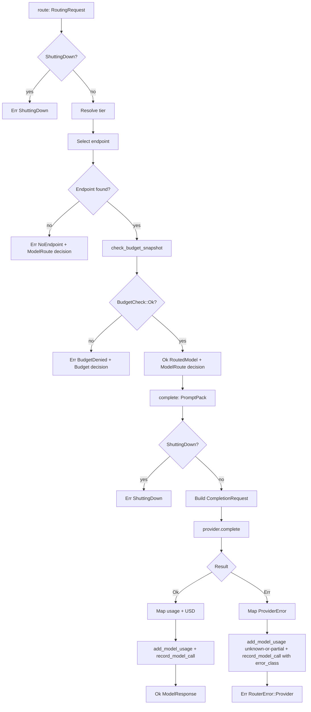
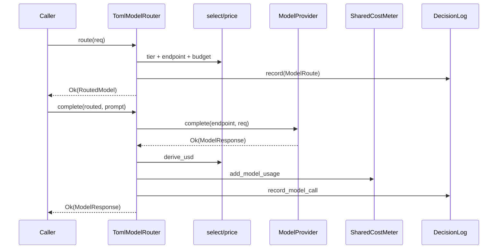
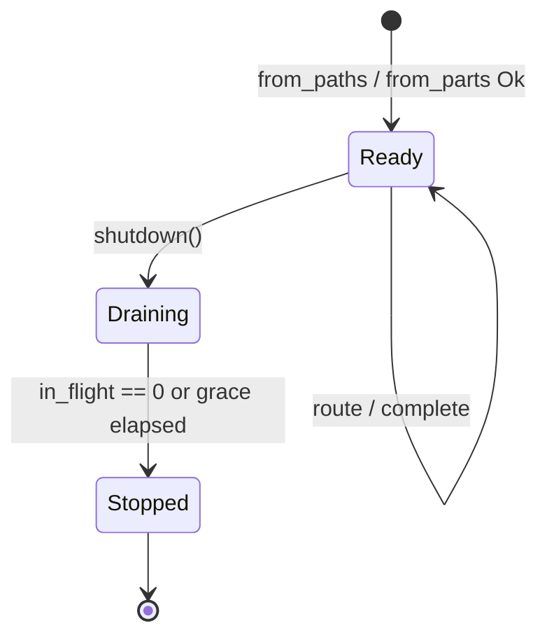
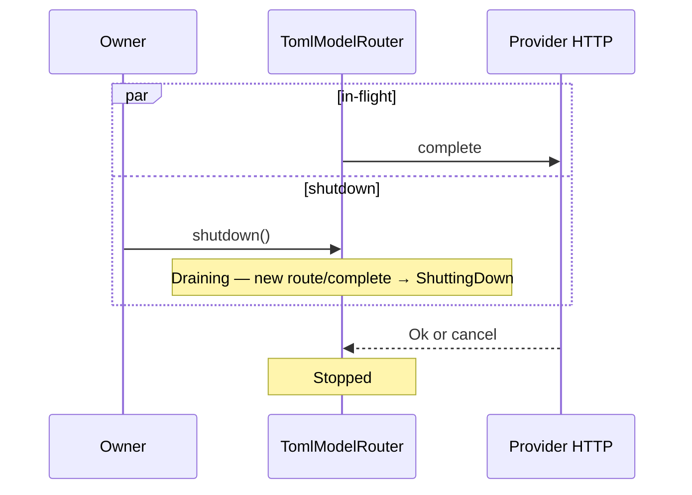

# RFC-0007: Model Router & Provider

| Field | Value |
| --- | --- |
| **Status** | Draft |
| **Author** | arkadianet |
| **Architecture** | Alloy Architecture V2 (**frozen**) — do not redesign |
| **Depends on** | [RFC-0001](./RFC-0001-alloy-runtime.md) (merged), [RFC-0004](./RFC-0004-observability-cost-metering.md) (merged) |
| **Effort** | 4–6 person-days |
| **Related RFCs** | [0005](./RFC-0005-sandbox-broker.md) sandbox posture / `Grant::Network` · [0006](./RFC-0006-mcp-host-builtins.md) recording-seam pattern · [0010](./RFC-0010-scheduler-runtime-adapters.md) retry consumer · [0012](./RFC-0012-context-engine.md) full `PromptPack` · [0013](./RFC-0013-capability-registry-workers.md) workers · [0016](./RFC-0016-eval-harness-holdout-gates.md) `ScriptedProvider` |
| **Product** | Alloy — AI Engineering Runtime |
| **Supersedes** | Draft outline of this filename (expanded to implementation grade) |

**Mental model (V2 §11 / ADR F-20 / BYOM):** Models are plugins behind `ModelRouter`. Core MUST NOT hardcode vendor model IDs. MVP is TOML `capability → tier` plus **one** openai-compatible HTTP provider. Scoring weights are stubbed and unused. This RFC is the **first real LLM call** in the workspace and the **first producer** of the RFC-0004 cost / decision schema.

**Authority order (highest → lowest):** current `main` source → merged RFCs 0001–0006 → Architecture V2 → this draft → roadmaps. Never reshape a merged public API solely to match an older V2 sketch or this document’s prior outline.

---

## 1. Overview

### 1.1 Purpose

Ship the MVP **Model Router & Provider** as a module in `alloy-runtime`:

1. **`ModelRouter` + `ModelProvider` traits** matching Architecture V2 §11.2, with complete supporting types.
2. **`TomlModelRouter`** loading the authoritative `router.toml` schema (`[policy]`, `[[providers]]`, `[[providers.endpoints]]`, `[capability_tiers]`).
3. **One** `OpenAiCompatibleProvider` that performs non-streaming HTTP chat completions using `api_key_env`.
4. **RFC-0004 integration** — every route and completion is decision-logged; every provider usage update feeds `CostMeter` / `SharedCostMeter` without fabricating tokens or USD.
5. **Recording / scripted seam** so RFC-0016 `ScriptedProvider` and in-crate tests implement `ModelProvider` without network.
6. **First network dependency** — justified HTTP client, TLS, timeouts, redirect/proxy/reuse policy; retry loops owned by RFC-0010.

### 1.2 Problem Statement

RFC-0001 published `ModelTier`, `ProviderId`, `CapabilityId`, `BudgetSnapshot`, and a provisional router peek that only reads `api_key_env` from a transitional `[provider.*]` map. RFC-0004 published `CostMeter`, `ModelCallRecord`, `DecisionLog`, and the wire `usage_unknown` consistency invariant — **before any provider existed**. Architecture V2 §11 requires a BYOM tier router with no hardcoded model IDs. Without this RFC there is no `ModelRouter`, no HTTP provider, no producer of `ModelCall` events from real usage, and no way for workers or Eval to complete a model call — the control-plane thesis cannot be exercised end-to-end.

### 1.3 Scope

| In scope | Detail |
| --- | --- |
| Traits | `ModelRouter`, `ModelProvider` |
| Concrete router | `TomlModelRouter` |
| Concrete provider | `OpenAiCompatibleProvider` (exactly one kind: `openai_compatible`) |
| Config | Full `router.toml` schema; update `router.toml.example`; document `example.env` keys |
| Tiers | Premium / Standard / Economy / Local via existing `ModelTier` |
| Health | `health()` stub always `Healthy` |
| Observability | Decision-log every route / complete; meter every provider usage outcome |
| Cost → USD | Config price table → optional `usd`; honour V2 §18 / ADR F-08 |
| Recording seam | `RecordingModelProvider` + `ScriptedProvider` contract for RFC-0016 |
| Minimal `PromptPack` | Runtime IR struct; RFC-0012 upgrade path; no collision with `ArtifactKind::PromptPack` |
| Config amendment | Replace provisional RFC-0001 `[provider.*]` peek with file-existence + RFC-0007 ownership |
| Tests | Unit, integration (wiremock), negative, budget, cancel, concurrency, no-hardcoded-IDs |

### 1.4 Non-goals

| Deferred item | Owner |
| --- | --- |
| Multi-factor scoring / multi-provider failover | **ADR F-20** — deferred; weights stubbed |
| Second provider kind or second live provider | Deferred (V2 evolution) |
| Capability worker prompts / `CapabilityContext` | **RFC-0013** |
| Full three-domain `PromptPack` assembly | **RFC-0012** |
| Retry / backoff loops on provider errors | **RFC-0010** (consumes this taxonomy) |
| Streaming chat completions | Deferred — MVP non-streaming (§3.8) |
| Cost marketing numbers / savings claims | **Forbidden** (V2 §18.2 / ADR F-08) |
| OTLP, sixth crate, new OS service, plugin framework | Forbidden |
| Writing or overwriting `.env` | Forbidden |
| Sandbox redesign / moving provider HTTP into the jail | Out of scope — see §2.6 |

### 1.5 Day-1 MVP (normative)

1. `TomlModelRouter::from_paths(...)` MUST load the §7 schema, resolve exactly one `openai_compatible` provider, and fail closed on invalid config or missing/empty `api_key_env`.
2. `route` MUST select tier from `[capability_tiers]` else `[policy].default_tier`, select the first matching endpoint, enforce budget denial **without** tier escalation/downgrade, and record `DecisionKind::ModelRoute` (or `Budget` on denial).
3. `complete` MUST call the selected provider once (no retry loop), map the openai-compatible response into `ModelResponse` + RFC-0004 records, and update `SharedCostMeter` when injected.
4. `OpenAiCompatibleProvider::health` MUST return `Health::Healthy` unconditionally (stub).
5. `[policy].scoring` weights, if present, MUST be parsed and MUST NOT affect routing.
6. Core Rust sources under `alloy-runtime` (excluding tests that assert absence) MUST contain **zero** vendor model-ID string literals and **zero** `match` arms on provider vendor brands for model selection.
7. Alloy MUST NEVER write `.env`. Missing keys fail closed with errors that point at `example.env`.

---

## 2. Architecture Integration

### 2.1 Relationship to Architecture V2

| V2 reference | Application |
| --- | --- |
| §11.1 Requirements | Provider-agnostic; tiers Premium/Standard/Economy/Local; no hardcoded model names |
| §11.2 Architectural interface | `ModelRouter` + `ModelProvider`; capability → tier policy |
| §11.2 MVP | TOML map + one openai-compatible provider; health stub |
| §11.2 Deferred | Multi-factor scoring, residency finesse (ADR F-20) |
| §11.2 Stub | `health()` always Healthy; scoring unused |
| §18.1–18.2 | Budgets + metering APIs normative; cost marketing numbers forbidden |
| §14.2 / ADR F-07 | Sandbox-before-dogfood remains in force for tool exec; this RFC’s host egress is separate (§2.6) |
| §14.4 | Credentials via `api_key_env`; redaction defaults |

### 2.2 Relationship to RFC-0001

Authoritative for: `ModelTier`, `BudgetSnapshot`, `BudgetPolicy`, `TokenBudget`, `ProviderId`, `CapabilityId`, `SessionId` / `RunId` / `NodeId`, `RuntimeConfig` load skeleton, `Grant::Network` / `HostAllow`, five-crate map, `#![forbid(unsafe_code)]` on `alloy-runtime`.

**Amendment (config peek):** The provisional `RuntimeConfig::load` parse of `[provider.<name>] api_key_env` MUST be removed. File existence of `router_path` remains required. Full schema ownership moves to this RFC’s `RouterConfig` (§7). See §7.6.

### 2.3 Relationship to RFC-0004

Authoritative for: `CostMeter`, `SharedCostMeter`, `BudgetCheck`, `CostSnapshot`, `ModelCallRecord`, `DecisionRecord`, `DecisionKind`, `DecisionLog`, `EventDecisionLog`, `RecordingDecisionLog`, `usage_unknown` wire synthesis + query invariant, retention / redaction helpers.

**RFC-0007 is the first real producer.** It MUST call:

| When | Call |
| --- | --- |
| Successful or failed provider contact that yields a completion attempt | `DecisionLog::record_model_call` + `SharedCostMeter::add_model_usage` (when meter injected) |
| Every `route` outcome (success or budget/config denial after admission) | `DecisionLog::record` with `DecisionKind::ModelRoute` or `Budget` |

**No RFC-0004 surface amendment is required.** Field sets, `usage_unknown` synthesis (`input.is_none() \|\| output.is_none()`), and meter semantics are reused unchanged. If implementation discovers a contradiction, it MUST stop and open an explicit amendment review — never silently diverge.

### 2.4 Already implemented | Added by RFC-0007 | Deferred

| Category | Contents |
| --- | --- |
| **Already implemented** | `ModelTier`, `BudgetSnapshot`, `BudgetPolicy`, `ProviderId`, `CapabilityId`, `CostMeter` / `SharedCostMeter` / `BudgetCheck`, `ModelCallRecord` / `DecisionLog` / `DecisionKind::{ModelRoute,Budget}`, redaction helpers, `ArtifactKind::PromptPack` (storage kind only), provisional router file existence check, `Grant::Network` / `HostAllow`, sandbox broker (0005), MCP host (0006) |
| **Added by RFC-0007** | `router` module; traits; `TomlModelRouter`; `OpenAiCompatibleProvider`; minimal `PromptPack` IR; `RouterConfig`; HTTP client dependency; price→USD derivation; `RecordingModelProvider`; error taxonomy; `router.toml.example` full schema |
| **Deferred** | Scoring / failover (ADR F-20); second provider; streaming; RFC-0010 retries; RFC-0012 full pack; RFC-0013 workers; RFC-0016 ScriptedProvider body (contract only here) |

### 2.5 Dependency boundaries

```text
alloy-cli / alloy-eval / workers (0013)
        │
        ▼
alloy-runtime::router  ──uses──►  alloy-runtime::obs (DecisionLog, CostMeter)
        │                         alloy-runtime::types (IDs, budgets, ErrorClass)
        │                         alloy-runtime::config (paths only; no provider peek)
        ▼
OpenAiCompatibleProvider ──HTTP──► external openai-compatible API
RecordingModelProvider / ScriptedProvider (0016) ── no network
```

- `alloy-runtime` remains one of ≤5 crates. **No sixth crate.**
- Router MUST NOT depend on `alloy-tools` sandbox for provider HTTP.
- Router MAY depend on `DecisionLog` trait only (same pattern as RFC-0006 MCP).

### 2.6 Sandbox posture and first network egress

RFC-0005 enforces **deny-by-default network** inside sandboxed **tool/exec** children (`Grant::Network(HostAllow)` is the only allow path for those children).

RFC-0007 opens the **first host-process egress** in the workspace: the runtime process itself dials the provider `base_url`.

| Path | Network policy |
| --- | --- |
| Sandboxed `cargo_*` / tool children | Unchanged — deny by default; `Grant::Network` / `HostAllow` only |
| `OpenAiCompatibleProvider` HTTP | Host-process egress to configured `base_url` only; not mediated by `SandboxBroker` |
| Dogfood (Alloy-on-Alloy) | Still banned until sandbox + holdout green (ADR F-07 / RFC-0016) |

**Normative:** Implementing RFC-0007 MUST NOT weaken sandbox network deny for tool exec. Operator-configured `base_url` is the sole intended egress target for the provider. Credentials remain env-referenced (`api_key_env`), never written to disk by Alloy.

---

## 3. Public Rust API

All new public items live under `alloy_runtime::router` and are re-exported from the crate root where noted in §3.16.

### 3.1 Reused types (normative — unchanged)

| Type | Source | Notes |
| --- | --- | --- |
| `ModelTier` | `types/budget.rs` | Premium/Standard/Economy/Local; serde `snake_case` |
| `BudgetSnapshot` | `types/budget.rs` | `usd_spent` / `tokens_in` / `tokens_out` — **spent** counters despite V2 field name `budget_remaining` |
| `BudgetPolicy` | `types/budget.rs` | Ceilings for denial |
| `ProviderId`, `CapabilityId` | `types/ids.rs` | Catalog names 1..=128 bytes |
| `SessionId`, `RunId`, `NodeId`, `Digest` | `types/ids.rs` | Attribution / hashing |
| `ErrorClass` | `types/diagnostic.rs` | `Model`, `Budget`, `Timeout`, `Cancelled`, … |
| `CostMeter`, `SharedCostMeter`, `BudgetCheck` | `obs/cost.rs` | Metering |
| `ModelCallRecord`, `DecisionRecord`, `DecisionKind`, `DecisionLog` | `obs/decision.rs` | Recording |
| `ArtifactKind::PromptPack` | `storage/artifacts.rs` | Storage kind enum **only** — do not alter |

### 3.2 `ComplexityScore`

```rust
/// Serde-stable complexity hint (V2 §11.2). MVP routing MUST ignore this field.
#[derive(Debug, Clone, Copy, PartialEq, Serialize, Deserialize)]
pub struct ComplexityScore(pub f32);
```

**Validation:** If present on `RoutingRequest`, values outside `0.0..=1.0` MUST NOT fail routing; they remain ignored. No clamping required in MVP.

### 3.3 `EndpointId`

```rust
/// Catalog id for a model endpoint row in `router.toml`.
#[derive(Debug, Clone, PartialEq, Eq, Hash, Serialize, Deserialize)]
#[serde(transparent)]
pub struct EndpointId(String);

impl EndpointId {
    pub fn new(s: impl Into<String>) -> Result<Self, RouterError>; // empty or >128 → Config
    pub fn as_str(&self) -> &str;
}
```

Same length rules as `ProviderId` (1..=128). Construction errors use `RouterError::Config`.

### 3.4 `ModelEndpoint`

```rust
#[derive(Debug, Clone, PartialEq, Serialize, Deserialize)]
pub struct ModelEndpoint {
    pub id: EndpointId,
    pub provider: ProviderId,
    /// Human label only — NEVER used as the wire model id.
    pub display_name: String,
    /// Wire model id from TOML `model` — BYOM; not a Rust string literal in core.
    pub model: String,
    pub tiers: Vec<ModelTier>,
    pub supports_tools: bool,
    pub supports_structured_output: bool,
    pub max_context: u32,
    /// USD per 1_000_000 input tokens. `None` → never invent USD for this endpoint.
    pub input_usd_per_mtok: Option<f64>,
    /// USD per 1_000_000 output tokens. `None` → never invent USD for this endpoint.
    pub output_usd_per_mtok: Option<f64>,
}
```

**Ownership:** cloned into `RoutedModel`; cheap enough for MVP. `model` MUST come solely from config.

### 3.5 `Health`

```rust
#[derive(Debug, Clone, Copy, PartialEq, Eq, Serialize, Deserialize)]
#[serde(rename_all = "snake_case")]
pub enum Health {
    Healthy,
    Degraded,
    Unhealthy,
}
```

MVP: providers MUST return `Healthy`. `Degraded` / `Unhealthy` exist for serde stability and future failover (deferred).

### 3.6 `ChatRole` / `ChatMessage` / `Citation` / `PromptPack`

```rust
#[derive(Debug, Clone, Copy, PartialEq, Eq, Serialize, Deserialize)]
#[serde(rename_all = "snake_case")]
pub enum ChatRole {
    System,
    User,
    Assistant,
    Tool,
}

#[derive(Debug, Clone, PartialEq, Eq, Serialize, Deserialize)]
pub struct ChatMessage {
    pub role: ChatRole,
    pub content: String,
}

#[derive(Debug, Clone, PartialEq, Eq, Serialize, Deserialize)]
pub struct Citation {
    /// Opaque source label (path, artifact id, graph node, etc.).
    pub source: String,
    #[serde(default, skip_serializing_if = "Option::is_none")]
    pub digest: Option<Digest>,
}

/// Minimal prompt IR accepted by `ModelRouter::complete`.
///
/// **Not** `ArtifactKind::PromptPack`. That enum variant is a storage classification.
/// Persisting this struct as an artifact MUST use `ArtifactKind::PromptPack` without
/// changing the enum.
#[derive(Debug, Clone, PartialEq, Serialize, Deserialize)]
pub struct PromptPack {
    pub messages: Vec<ChatMessage>,
    #[serde(default)]
    pub citations: Vec<Citation>,
    /// Reserved for RFC-0012 domain labels / weights. MVP: always absent/ignored.
    #[serde(default, skip_serializing_if = "Option::is_none")]
    pub domains: Option<serde_json::Value>,
}
```

**Serde stability:** Additive fields with `#[serde(default)]` only. RFC-0012 MUST extend without renaming `messages` / `citations` or changing their element types’ wire names.

**RFC-0012 upgrade path:** Add domain-labelled sections / weights as new fields or by populating `domains`; keep `messages` as the flattenable chat view the router already sends. No breaking change to `ModelRouter::complete` signature.

### 3.7 `CompletionRequest` / `ToolChoice` / `ResponseFormat` / `Usage` / `ModelResponse`

```rust
#[derive(Debug, Clone, Copy, PartialEq, Eq, Serialize, Deserialize)]
#[serde(rename_all = "snake_case")]
pub enum ToolChoice {
    None,
    Auto,
}

#[derive(Debug, Clone, PartialEq, Serialize, Deserialize)]
#[serde(rename_all = "snake_case")]
pub enum ResponseFormat {
    Text,
    JsonObject,
}

#[derive(Debug, Clone, PartialEq, Serialize, Deserialize)]
pub struct CompletionRequest {
    pub messages: Vec<ChatMessage>,
    /// MVP: empty. Tool schemas arrive with RFC-0013; field reserved serde-stable.
    #[serde(default)]
    pub tools: Vec<serde_json::Value>,
    #[serde(default = "tool_choice_none")]
    pub tool_choice: ToolChoice,
    #[serde(default = "response_format_text")]
    pub response_format: ResponseFormat,
    pub temperature: Option<f32>,
    pub max_output_tokens: Option<u32>,
}

fn tool_choice_none() -> ToolChoice { ToolChoice::None }
fn response_format_text() -> ResponseFormat { ResponseFormat::Text }

#[derive(Debug, Clone, PartialEq, Eq, Serialize, Deserialize)]
pub struct Usage {
    pub input_tokens: Option<u64>,
    pub output_tokens: Option<u64>,
}

#[derive(Debug, Clone, PartialEq, Serialize, Deserialize)]
pub struct ModelResponse {
    pub text: Option<String>,
    pub structured: Option<serde_json::Value>,
    /// MVP: always empty. Reserved for tool-calling workers (RFC-0013).
    #[serde(default)]
    pub tool_calls: Vec<serde_json::Value>,
    pub usage: Usage,
    pub provider_request_id: Option<String>,
}
```

**Streaming (normative):** MVP MUST NOT stream. `complete` returns one `ModelResponse` after the full HTTP body is received. Future streaming MUST NOT remove or reshape these fields; it MUST add a separate streaming API (e.g. `complete_stream`) or an additive request flag defaulting to off. `ModelResponse` therefore does **not** foreclose streaming.

### 3.8 `RoutingRequest` / `RoutedModel`

```rust
#[derive(Debug, Clone, PartialEq, Serialize, Deserialize)]
pub struct RoutingRequest {
    /// Required for DecisionLog attribution (RFC-0004). Additive vs V2 sketch.
    pub session: SessionId,
    pub run: Option<RunId>,
    pub node: Option<NodeId>,
    pub capability: CapabilityId,
    /// Ignored in MVP; serde-stable.
    pub complexity: Option<ComplexityScore>,
    /// Spent counters (`CostMeter::to_budget_snapshot` shape). Name kept from V2.
    pub budget_remaining: BudgetSnapshot,
    pub requires_tools: bool,
    pub requires_structured_output: bool,
}

#[derive(Debug, Clone, PartialEq, Serialize, Deserialize)]
pub struct RoutedModel {
    pub endpoint: ModelEndpoint,
    pub tier: ModelTier,
    pub session: SessionId,
    pub run: Option<RunId>,
    pub node: Option<NodeId>,
    /// Copied from [`RoutingRequest::requires_structured_output`] for `complete` request shaping.
    pub requires_structured_output: bool,
}
```

**Attribution:** `session` is REQUIRED on `RoutingRequest` because RFC-0004 `DecisionLog` requires a session row for durable append, and route decisions MUST be attributable. This is an additive field relative to the V2 sketch (V2 omitted obs attribution that RFC-0004 already merged).

### 3.9 `SecretString`

```rust
/// API key material. NEVER logged, displayed, or included in events.
pub struct SecretString { /* private */ }

impl SecretString {
    pub fn new(s: impl Into<String>) -> Self;
    /// Borrow for Authorization header construction only.
    pub fn expose(&self) -> &str;
}

impl std::fmt::Debug for SecretString {
    fn fmt(&self, f: &mut std::fmt::Formatter<'_>) -> std::fmt::Result {
        f.write_str("SecretString([REDACTED])")
    }
}
```

MUST NOT implement `Display`. MUST NOT derive `Serialize`. Equality MAY compare lengths only in tests — production code MUST NOT log equality failures that include values.

### 3.10 `RouterError` / `ProviderError`

```rust
#[derive(Debug, thiserror::Error)]
#[non_exhaustive]
pub enum RouterError {
    #[error("config: {0}")]
    Config(String),
    #[error("unknown capability tier mapping for {0}")]
    UnknownCapability(CapabilityId),
    #[error("no endpoint for tier {tier:?} (tools={requires_tools}, structured={requires_structured})")]
    NoEndpoint {
        tier: ModelTier,
        requires_tools: bool,
        requires_structured: bool,
    },
    #[error("budget denied: {0:?}")]
    BudgetDenied(BudgetCheck),
    #[error("provider: {0}")]
    Provider(#[from] ProviderError),
    #[error("cancelled")]
    Cancelled,
    #[error("shutting down")]
    ShuttingDown,
    #[error("internal: {0}")]
    Internal(String),
}

#[derive(Debug, thiserror::Error)]
#[non_exhaustive]
pub enum ProviderError {
    #[error("auth failed")]
    Auth,
    #[error("rate limited")]
    RateLimit,
    #[error("context length exceeded")]
    ContextLength,
    #[error("timeout")]
    Timeout,
    #[error("malformed response: {0}")]
    MalformedResponse(String),
    #[error("http status {status}: {message}")]
    HttpStatus { status: u16, message: String },
    #[error("transport: {0}")]
    Transport(String),
    #[error("missing api key env {0}")]
    MissingApiKey(String),
    #[error("cancelled")]
    Cancelled,
    #[error("internal: {0}")]
    Internal(String),
}
```

**Display / Debug:** `ProviderError` message strings MUST pass through `obs::redact_secrets` before storage in the variant when the source is a provider body or header. `Auth` / `RateLimit` / `ContextLength` / `Timeout` carry **no** body. `HttpStatus.message` and `Transport` / `MalformedResponse` MUST be redacted and truncated to ≤512 bytes.

Full taxonomy tables: §8.

### 3.11 `ModelProvider` trait

```rust
#[async_trait]
pub trait ModelProvider: Send + Sync {
    fn id(&self) -> ProviderId;

    async fn complete(
        &self,
        endpoint: &ModelEndpoint,
        req: CompletionRequest,
    ) -> Result<ModelResponse, ProviderError>;

    /// MVP stub: concrete providers MUST return `Health::Healthy`.
    async fn health(&self) -> Health;
}
```

**Send/Sync:** required. Implementations MUST be safe to share via `Arc<dyn ModelProvider>`.

**Async:** `async_trait` (workspace dep already present).

**Visibility:** public trait in `alloy_runtime::router`.

### 3.12 `ModelRouter` trait

```rust
#[async_trait]
pub trait ModelRouter: Send + Sync {
    async fn route(&self, req: RoutingRequest) -> Result<RoutedModel, RouterError>;

    async fn complete(
        &self,
        routed: &RoutedModel,
        prompt: PromptPack,
    ) -> Result<ModelResponse, RouterError>;
}
```

**Contract:** `complete` MUST use `routed.endpoint` / `routed.tier` as selected by a prior `route` (or an equivalent test-constructed `RoutedModel`). Callers MUST NOT mutate `endpoint.model` to bypass TOML.

### 3.13 `TomlModelRouter`

```rust
pub struct TomlModelRouter { /* private fields — see §4 */ }

impl TomlModelRouter {
    /// Load + validate config; resolve API key; build HTTP client + provider.
    /// Fail closed on invalid TOML, unknown kinds, missing key, empty providers.
    pub fn from_paths(
        router_path: &Path,
        budget_policy: BudgetPolicy,
        example_env_hint: &Path,
    ) -> Result<Self, RouterError>;

    /// Test/injection constructor (no file I/O).
    pub fn from_parts(parts: TomlModelRouterParts) -> Result<Self, RouterError>;

    pub fn with_decision_log(self, log: Arc<dyn DecisionLog>) -> Self;
    pub fn with_cost_meter(self, meter: SharedCostMeter) -> Self;

    pub fn metrics(&self) -> RouterMetricsSnapshot;

    /// Begin drain: reject new route/complete with `ShuttingDown`.
    pub async fn shutdown(&self);
}
```

```rust
pub struct TomlModelRouterParts {
    pub config: RouterConfig,
    pub provider: Arc<dyn ModelProvider>,
    pub budget_policy: BudgetPolicy,
    pub decision_log: Option<Arc<dyn DecisionLog>>,
    pub cost_meter: Option<SharedCostMeter>,
}
```

**Construction ownership:** `from_paths` owns parsing + building `OpenAiCompatibleProvider`. `from_parts` is the injection point for `RecordingModelProvider` / RFC-0016 scripts.

**Budget policy:** injected at construction (from profile budgets). Used by `route` denial (§5.4). Not read from `router.toml`.

### 3.14 `OpenAiCompatibleProvider`

```rust
pub struct OpenAiCompatibleProvider { /* private */ }

impl OpenAiCompatibleProvider {
    pub fn new(spec: OpenAiCompatibleSpec, client: reqwest::Client) -> Result<Self, ProviderError>;
}

pub struct OpenAiCompatibleSpec {
    pub id: ProviderId,
    pub base_url: String,       // no trailing slash required; normalized at construct
    pub api_key: SecretString,
    pub connect_timeout: Duration,
    pub request_timeout: Duration,
}
```

Implements `ModelProvider`. Performs `POST {base_url}/chat/completions`.

### 3.15 `RecordingModelProvider` (test double)

```rust
/// FIFO scripted outcomes + recorded invocations. No network.
pub struct RecordingModelProvider {
    // private
}

impl RecordingModelProvider {
    pub fn new(id: ProviderId) -> Self;
    pub fn push(&self, outcome: Result<ModelResponse, ProviderError>);
    pub fn recorded(&self) -> Vec<(ModelEndpoint, CompletionRequest)>;
}
```

Implements `ModelProvider`:
- `complete` — record args, then pop FIFO (exhausted → `ProviderError::Internal("recording exhausted")`).
- `health` — always `Healthy`.
- `id` — constructor id.

**RFC-0016 contract:** `ScriptedProvider` in `alloy-eval` MUST implement the same `ModelProvider` trait. It MAY use a `HashMap` keyed by a deterministic fingerprint of `CompletionRequest` instead of FIFO; it MUST NOT perform HTTP; it MUST return `Health::Healthy`. The trait surface in this RFC is the sole coupling.

### 3.16 Crate-root re-exports

`alloy_runtime` MUST re-export at least:

`ModelRouter`, `ModelProvider`, `TomlModelRouter`, `OpenAiCompatibleProvider`, `RecordingModelProvider`, `RoutingRequest`, `RoutedModel`, `ModelEndpoint`, `EndpointId`, `CompletionRequest`, `ModelResponse`, `Usage`, `PromptPack`, `ChatMessage`, `ChatRole`, `Citation`, `ComplexityScore`, `Health`, `ToolChoice`, `ResponseFormat`, `RouterError`, `ProviderError`, `RouterConfig`, `RouterMetricsSnapshot`.

### 3.17 `check_budget_snapshot` (additive helper)

```rust
/// Apply `CostMeter::check_budget` arithmetic to a spent snapshot without mutating a meter.
/// MUST be behaviourally identical to seeding a meter with the same known totals.
pub fn check_budget_snapshot(spent: &BudgetSnapshot, policy: &BudgetPolicy) -> BudgetCheck;
```

Lives in `alloy_runtime::router` (or re-exported from `obs` if placed there). **Additive only** — does not change `CostMeter`. Unit tests MUST prove equivalence with `CostMeter::check_budget` for the matrix in §11.

**Equivalence definition:**

```text
tokens_exhausted iff spent.tokens_in.saturating_add(spent.tokens_out) >= policy.max_tokens_per_run
  (including max_tokens_per_run == 0 ⇒ immediately exhausted)

usd_exhausted iff
  !policy.max_usd_per_run.is_finite() || policy.max_usd_per_run < 0.0
  OR (treat spent.usd_spent as Some when using BudgetSnapshot — field is f64)
     spent.usd_spent >= policy.max_usd_per_run

Note: BudgetSnapshot.usd_spent is f64 (RFC-0001). CostMeter distinguishes None vs Some(0.0).
For routing denial, treat BudgetSnapshot.usd_spent as a known spent amount (including 0.0).
This matches callers that obtained the snapshot via CostMeter::to_budget_snapshot
(unknown meter USD becomes 0.0 for the snapshot field only — RFC-0004 §6.6).
```

**No silent divergence from RFC-0004 token rules.** USD-unknown meters map to `0.0` on the snapshot before route; therefore USD denial uses that mapped value. Documented here explicitly so implementers do not invent a parallel `Option` path on `RoutingRequest`.

### 3.18 Visibility & construction summary

| Item | Visibility | Construction |
| --- | --- | --- |
| Traits | `pub` | N/A |
| `TomlModelRouter` | `pub` | `from_paths` / `from_parts` |
| `OpenAiCompatibleProvider` | `pub` | `new` |
| `RecordingModelProvider` | `pub` | `new` |
| `SecretString` | `pub` | `new` |
| Wire DTOs (HTTP serde) | `pub(crate)` | private to provider |
| Price math | `pub(crate)` fn | pure |

---

## 4. Internal Module Design

### 4.1 Hierarchy

```text
crates/alloy-runtime/src/router/
  mod.rs           # re-exports, module docs
  error.rs         # RouterError, ProviderError, boundary maps
  types.rs         # PromptPack, messages, endpoints, requests/responses, Health
  traits.rs        # ModelRouter, ModelProvider
  config.rs        # RouterConfig parse + validate
  select.rs        # pure tier/endpoint selection + budget check
  price.rs         # tokens → Option<usd>
  meter_bridge.rs  # ModelCallRecord build + CostMeter updates
  decision_bridge.rs # DecisionRecord metadata builders
  http_client.rs   # reqwest Client builder (timeouts, TLS, redirects)
  openai.rs        # OpenAiCompatibleProvider + wire types
  toml_router.rs   # TomlModelRouter lifecycle + route/complete
  recording.rs     # RecordingModelProvider
  metrics.rs       # RouterMetricsSnapshot
  secret.rs        # SecretString
```

### 4.2 Responsibilities

| Module | Responsibility | MUST NOT |
| --- | --- | --- |
| `select` | capability→tier, endpoint filter, budget denial | HTTP, logging secrets |
| `price` | pure USD derivation | invent prices; marketing strings |
| `openai` | HTTP complete + response map | retry loops; match on vendor model IDs |
| `toml_router` | orchestration, obs, lifecycle | hardcode model strings |
| `config` | TOML schema | write `.env` |
| `recording` | test double | network |
| `http_client` | shared client policy | per-call client rebuild |

### 4.3 Dependency direction

```text
toml_router → select, price, meter_bridge, decision_bridge, traits, error, metrics
openai → http_client, secret, types, error
config → types, error
recording → traits, types, error
select / price → types only (pure)
```

No cycles. `openai` MUST NOT import `toml_router`.

### 4.4 Injection points

| Seam | Type | Consumer |
| --- | --- | --- |
| Decision log | `Option<Arc<dyn DecisionLog>>` | tests / runtime host |
| Cost meter | `Option<SharedCostMeter>` | RFC-0010 run lifecycle |
| Provider | `Arc<dyn ModelProvider>` | Recording / Scripted / OpenAI |
| Budget policy | `BudgetPolicy` | profile (RFC-0001 / 0015) |

---

## 5. Execution Algorithm

### 5.1 Pipeline overview



### 5.2 Tier resolution

```text
INPUT: capability, config.capability_tiers, config.policy.default_tier
IF capability.as_str() is a key in capability_tiers:
  tier = map[capability]
  tier_source = "capability_map"
ELSE:
  tier = policy.default_tier
  tier_source = "default"
OUTPUT: (tier, tier_source)
```

**Unknown capability** does **not** error in MVP — it uses `default_tier`. `RouterError::UnknownCapability` is reserved for future strict mode and MUST NOT be returned by MVP `route` when the map simply lacks a key.

`[policy].scoring` is parsed into `ScoringWeights` (all fields optional `f64`) and MUST NOT be read by `select`.

### 5.3 Endpoint selection

Among `config` endpoints where:

1. `endpoint.provider == selected_provider.id` (MVP: the sole provider),
2. `endpoint.tiers` contains resolved `tier`,
3. if `requires_tools` then `endpoint.supports_tools`,
4. if `requires_structured_output` then `endpoint.supports_structured_output`,

select the **first** matching endpoint in TOML declaration order.

If none match → `Err(RouterError::NoEndpoint { … })`.

**No scoring. No random tie-break. No failover to another tier.**

### 5.4 Budget enforcement point

**Denial occurs in `route`, not `complete`.**

1. Compute `check = check_budget_snapshot(&req.budget_remaining, &self.budget_policy)`.
2. If `check.is_exhausted()`:
   - Record `DecisionKind::Budget` with metadata (§9.2).
   - Return `Err(RouterError::BudgetDenied(check))`.
3. **MUST NOT** escalate or downgrade tier to satisfy budget in MVP.
4. `complete` MUST NOT re-check `BudgetPolicy`. Run-level post-call warnings remain RFC-0010 (`maybe_signal_budget_warning`).

**Caller observation:** `Err(BudgetDenied(_))` — no provider HTTP occurs.

### 5.5 `complete` request construction

```text
CompletionRequest {
  messages: prompt.messages.clone(),
  tools: [],                                      // MVP
  tool_choice: ToolChoice::None,                  // MVP
  response_format:
      if routed.requires_structured_output { JsonObject } else { Text },
  temperature: None,                              // provider/API default
  max_output_tokens: None,
}
```

`RoutedModel.requires_structured_output` is copied from the routing request at `route` time (§3.8).

Citations / domains are **not** sent on the wire in MVP; they exist for hashing / RFC-0012.

### 5.6 Provider HTTP call (openai-compatible)

```text
POST {base_url}/chat/completions
Headers:
  Authorization: Bearer {api_key.expose()}
  Content-Type: application/json
  Accept: application/json
Body:
  {
    "model": endpoint.model,          // from TOML only
    "messages": [ {"role","content"}, ... ],
    "stream": false,
    optional "temperature",
    optional "max_tokens" <- max_output_tokens,
    optional "response_format": {"type":"json_object"} when JsonObject
  }
```

**No `tools` in MVP body** even if `supports_tools` is true (workers land in RFC-0013). Feature flags still filter endpoints at route time so future callers do not select incapable endpoints.

### 5.7 Response mapping → `ModelResponse` + usage

| OpenAI-compatible JSON | Alloy field |
| --- | --- |
| `choices[0].message.content` string | `text: Some(...)` |
| `choices[0].message.content` null/absent | `text: None` |
| `choices[0].message.parsed` / content JSON object when structured | `structured: Some(value)` if content parses as JSON object; else `structured: None` and keep `text` |
| `usage.prompt_tokens` number | `usage.input_tokens: Some(n)` |
| `usage.completion_tokens` number | `usage.output_tokens: Some(n)` |
| `usage` absent or either token field absent/null | corresponding `Option` = `None` (**never fabricate 0**) |
| `id` string | `provider_request_id: Some(...)` |
| tool_calls array | ignored → `tool_calls: []` in MVP |

Missing `choices` / non-object root → `ProviderError::MalformedResponse`.

### 5.8 USD derivation

```text
fn derive_usd(endpoint: &ModelEndpoint, usage: &Usage) -> Option<f64> {
  let (Some(inp), Some(out)) = (usage.input_tokens, usage.output_tokens) else { return None };
  let (Some(pin), Some(pout)) = (endpoint.input_usd_per_mtok, endpoint.output_usd_per_mtok) else {
    return None; // price table incomplete — do not invent
  };
  if !pin.is_finite() || !pout.is_finite() || pin < 0.0 || pout < 0.0 { return None; }
  let usd = (inp as f64 / 1_000_000.0) * pin + (out as f64 / 1_000_000.0) * pout;
  if usd.is_finite() && usd >= 0.0 { Some(usd) } else { None }
}
```

**V2 §18 / ADR F-08:** Derived USD is an **accounting estimate from operator-configured prices**, not a marketing claim. Code, docs, and events MUST NOT assert savings percentages or comparative cost bands. Eval (RFC-0016) is the only place calibrated claims may later appear.

### 5.9 Cost schema reconciliation (highest priority)

#### 5.9.1 `ModelCallRecord` field mapping

| `ModelCallRecord` field | Source on success | Source on provider error after HTTP attempt |
| --- | --- | --- |
| `session` | `routed.session` | same |
| `run` | `routed.run` | same |
| `node` | `routed.node` | same |
| `provider_id` | `provider.id()` | same |
| `model_tier` | `routed.tier` | same |
| `input_tokens` | `usage.input_tokens` | `None` unless error body included parseable usage (MVP: always `None` on error) |
| `output_tokens` | `usage.output_tokens` | `None` (MVP on error) |
| `usd` | `derive_usd(...)` | `None` |
| `duration_ms` | `Some(elapsed_ms)` | `Some(elapsed_ms)` |
| `confidence` | `None` | `None` |
| `error_class` | `None` | mapped (§8.4) |
| `content_hash` | `Some(hash_prompt(canonical_prompt_bytes))` | same if prompt available |
| `prompt_body` | `Some(canonical)` only when retention will decide; default path still passes `Some` raw and lets RFC-0004 strip | same |

**Canonical prompt bytes for hashing:** UTF-8 JSON array of `{role, content}` messages in order (serde_json compact), not Display debug. Citations excluded from hash in MVP.

#### 5.9.2 `usage_unknown` consistency

RFC-0004 synthesizes wire `usage_unknown = input_tokens.is_none() \|\| output_tokens.is_none()` in `model_to_payload`. Query rejects inconsistent payloads.

**RFC-0007 MUST:**

- Pass `Option` token fields through honestly.
- NEVER set a parallel `usage_unknown` on the in-memory record (field does not exist on `ModelCallRecord`).
- NEVER write zeros to mean “unknown”.
- When the provider omits `usage` entirely → both token fields `None` → wire `usage_unknown: true` (consistent).
- When only one of prompt/completion tokens is present → the missing one stays `None` → `usage_unknown: true` (consistent).

#### 5.9.3 `CostMeter` entry point

| Who | When | Call |
| --- | --- | --- |
| `TomlModelRouter::complete` | After provider returns `Ok` | `meter.add_model_usage(tier, input, output, usd)` |
| `TomlModelRouter::complete` | After provider returns `Err` that indicates an attempt was made (all `ProviderError` except `MissingApiKey` before send) | `meter.add_model_usage(tier, None, None, None)` |
| `route` budget denial | — | **MUST NOT** call `add_model_usage` |

If `cost_meter` is `None`, skip metering (tests without meter). Decision log remains independent.

#### 5.9.4 RFC-0004 amendment?

**None required.** This RFC produces records that satisfy the merged schema and the `obs/query.rs` invariant. Pricing lives here as required by RFC-0004 §6.4 (“Pricing tables belong to RFC-0007”).

### 5.10 Decision logging — route

Always attempt when `decision_log` is `Some` (session always present on `RoutingRequest`):

| Outcome | `DecisionKind` | Metadata keys (object) |
| --- | --- | --- |
| Endpoint selected | `ModelRoute` | `capability`, `tier`, `tier_source`, `endpoint_id`, `provider_id`, `model` (wire id from config), `requires_tools`, `requires_structured_output` |
| No endpoint | `ModelRoute` | same without endpoint/model; `error`: `"no_endpoint"` |
| Budget denied | `Budget` | `capability`, `tier`, `budget_check`, `tokens_in`, `tokens_out`, `usd_spent` |

`prompt_body: None`, `content_hash: None` for route decisions.

Obs errors → `tracing::warn`; MUST NOT change `route`/`complete` return value (RFC-0006 pattern).

### 5.11 Failure handling summary

| Failure | Route/Complete | Record | Meter |
| --- | --- | --- | --- |
| Config at construct | N/A — construct fails | no | no |
| No endpoint | `Err(NoEndpoint)` | ModelRoute | no |
| Budget | `Err(BudgetDenied)` | Budget | no |
| Provider Auth | `Err(Provider(Auth))` | ModelCall + error_class Model | unknown usage |
| Rate limit | `Err(Provider(RateLimit))` | ModelCall + Model | unknown |
| Context length | `Err(Provider(ContextLength))` | ModelCall + Model | unknown |
| Timeout | `Err(Provider(Timeout))` | ModelCall + Timeout | unknown |
| Malformed | `Err(Provider(Malformed…))` | ModelCall + Model | unknown |
| Cancel / drop | `Err(Cancelled)` or silent drop | no ModelCall on drop | no on drop |
| Shutting down | `Err(ShuttingDown)` | no | no |

### 5.12 Sequence — successful complete



---

## 6. Lifecycle & Concurrency

### 6.1 Router state machine



| State | `route` / `complete` |
| --- | --- |
| Ready | admitted |
| Draining | `Err(ShuttingDown)` for new calls; in-flight may finish |
| Stopped | `Err(ShuttingDown)` |

### 6.2 Construction

1. Parse + validate `RouterConfig`.
2. Resolve `api_key_env` via `std::env::var` — unset or empty → `ProviderError::MissingApiKey` / `RouterError::Config` with hint path to `example.env`. **Never invent a key. Never write `.env`.**
3. Build shared `reqwest::Client` (§10).
4. Construct `OpenAiCompatibleProvider`.
5. Enter `Ready` with `in_flight = 0`.

### 6.3 Concurrent completions

- `TomlModelRouter` is `Arc`-shareable (`Send + Sync`).
- Multiple concurrent `complete` calls MUST be allowed.
- Each call increments/decrements an `AtomicUsize` in_flight counter.
- Provider client connection pool provides reuse (§10).
- `SharedCostMeter` already serializes updates via `Mutex` (RFC-0004).
- DecisionLog append concurrency is owned by the session event log.

### 6.4 Cancellation

| Mechanism | Behaviour |
| --- | --- |
| Drop of `complete` / `route` future | In-flight HTTP aborted (reqwest cancel-on-drop); in_flight dec; **no** DecisionLog / meter update |
| Explicit shutdown cancel | New calls `ShuttingDown`; in-flight dropped or awaited per grace |

No per-call `CancellationToken` field on V2 trait signatures. Drop-to-cancel is normative.

### 6.5 Timeouts

| Timeout | Default | Source |
| --- | --- | --- |
| Connect | 10s | `[policy].connect_timeout_ms` |
| Request (total) | 120s | `[policy].request_timeout_ms` |

On expiry → `ProviderError::Timeout` (retryable classification for RFC-0010; **no retry here**).

### 6.6 Drain / shutdown

```text
shutdown():
  set state = Draining
  wait up to policy.shutdown_grace_ms (default 5000) for in_flight == 0
  if still in_flight: tracing::warn and proceed to Stopped
  set state = Stopped
```

### 6.7 Connection reuse

One `reqwest::Client` per `OpenAiCompatibleProvider` instance, created at construction, cloned cheaply for requests. MUST NOT build a new client per `complete`.

### 6.8 Sequence — shutdown with in-flight



---

## 7. Configuration

### 7.1 Authoritative `router.toml` schema

```toml
# router.toml — Author: arkadianet
[policy]
default_tier = "standard"          # ModelTier; REQUIRED
connect_timeout_ms = 10000         # u64; default 10000
request_timeout_ms = 120000        # u64; default 120000
shutdown_grace_ms = 5000           # u64; default 5000

# Stubbed unused (ADR F-20). MAY be omitted. If present, parsed and ignored by select.
[policy.scoring]
# complexity_weight = 0.0
# budget_weight = 0.0
# latency_weight = 0.0

[[providers]]
id = "openai-compatible-main"      # ProviderId; REQUIRED
kind = "openai_compatible"         # ONLY supported kind in MVP
base_url = "https://api.example.com/v1"  # REQUIRED; https REQUIRED in MVP
api_key_env = "ALLOY_API_KEY"      # REQUIRED for openai_compatible

[[providers.endpoints]]
id = "team-workhorse"              # EndpointId; REQUIRED
display_name = "Workhorse"         # REQUIRED
model = "REPLACE_ME"               # REQUIRED wire model id (BYOM — operator sets)
tiers = ["standard"]               # non-empty Vec<ModelTier>; REQUIRED
supports_tools = true              # bool; default false
supports_structured_output = true  # bool; default false
max_context = 200000               # u32; REQUIRED; MUST be > 0
input_usd_per_mtok = 0.0           # optional f64 >= 0 finite
output_usd_per_mtok = 0.0          # optional f64 >= 0 finite

[capability_tiers]
Repair = "standard"
Edit = "standard"
Review = "economy"
Planning = "standard"
```

### 7.2 Validation rules

| Rule | Failure |
| --- | --- |
| File missing / unreadable / invalid TOML | `RouterError::Config` |
| `default_tier` missing / unknown string | Config |
| `[[providers]]` empty | Config |
| MVP: providers.len() != 1 | Config (`"MVP allows exactly one provider"`) |
| `kind != "openai_compatible"` | Config |
| `id` / endpoint `id` empty or >128 | Config |
| Duplicate provider or endpoint ids | Config |
| `base_url` empty or not starting with `https://` | Config (MVP https-only; http forbidden) |
| `api_key_env` empty | Config |
| Env var unset/empty at construct | Config / MissingApiKey with `example.env` hint |
| No endpoints under the provider | Config |
| Endpoint `tiers` empty | Config |
| Endpoint `model` empty | Config |
| `max_context == 0` | Config |
| Negative / non-finite price fields | Config |
| `capability_tiers` value not a valid `ModelTier` | Config |
| Timeouts == 0 | Config |

**Trailing slash:** `base_url` is normalized by trimming one trailing `/` at construct.

### 7.3 `RouterConfig` Rust shape

```rust
#[derive(Debug, Clone, PartialEq)]
pub struct RouterConfig {
    pub policy: RouterPolicy,
    pub providers: Vec<ProviderConfig>,
    pub capability_tiers: BTreeMap<String, ModelTier>,
}

#[derive(Debug, Clone, PartialEq)]
pub struct RouterPolicy {
    pub default_tier: ModelTier,
    pub connect_timeout: Duration,
    pub request_timeout: Duration,
    pub shutdown_grace: Duration,
    pub scoring: ScoringWeights, // stub
}

#[derive(Debug, Clone, Default, PartialEq)]
pub struct ScoringWeights {
    pub complexity_weight: Option<f64>,
    pub budget_weight: Option<f64>,
    pub latency_weight: Option<f64>,
}

#[derive(Debug, Clone, PartialEq)]
pub struct ProviderConfig {
    pub id: ProviderId,
    pub kind: ProviderKind,
    pub base_url: String,
    pub api_key_env: String,
    pub endpoints: Vec<EndpointConfig>,
}

#[derive(Debug, Clone, Copy, PartialEq, Eq)]
pub enum ProviderKind {
    OpenaiCompatible,
}

#[derive(Debug, Clone, PartialEq)]
pub struct EndpointConfig {
    pub id: EndpointId,
    pub display_name: String,
    pub model: String,
    pub tiers: Vec<ModelTier>,
    pub supports_tools: bool,
    pub supports_structured_output: bool,
    pub max_context: u32,
    pub input_usd_per_mtok: Option<f64>,
    pub output_usd_per_mtok: Option<f64>,
}
```

### 7.4 `router.toml.example` deliverable

Replace the provisional RFC-0001 stub with the full example in §7.1 (using placeholder `model = "REPLACE_ME"` and example host). Comments MUST state: copy to `router.toml`; set `model` and `base_url` for your provider; set `ALLOY_API_KEY` in process env / personal `.env` (Alloy never writes `.env`).

### 7.5 `example.env` keys

Existing key remains authoritative:

```bash
# Provider key name referenced by router.toml api_key_env
ALLOY_API_KEY=
```

**No new required env keys** for MVP timeouts (TOML owns them). Optional comment block MAY document that `ALLOY_API_KEY` must match `api_key_env`. **MUST NOT create or modify `.env`.**

### 7.6 Amendment to `RuntimeConfig::load` (RFC-0001 provisional peek)

| Before (main) | After (this RFC) |
| --- | --- |
| Parse `[provider.*]` map; warn if `api_key_env` unset | Require `router_path` is a file; **do not** parse provider tables |
| Tests write `[provider.default]` | Tests write minimal valid §7 schema **or** only assert file existence |

Full validation + key resolution moves to `TomlModelRouter::from_paths` / `RouterConfig::load`. This is an **explicit amendment** to the provisional RFC-0001 config peek, required because that peek’s schema conflicts with V2 §11.2 `[[providers]]` and cannot express endpoints/tiers.

---

## 8. Error Handling

### 8.1 `RouterError` variant table

| Variant | Producer | Meaning | Retryable? | Persist decision? | Caller visibility |
| --- | --- | --- | --- | --- | --- |
| `Config` | load/validate | bad TOML / invariants | no | n/a (construct) | yes |
| `UnknownCapability` | reserved | strict unknown map | no | yes | yes (unused MVP) |
| `NoEndpoint` | select | no matching endpoint | no | ModelRoute | yes |
| `BudgetDenied` | route §5.4 | ceilings exhausted | no | Budget | yes |
| `Provider` | complete | wrapped provider failure | see §8.2 | ModelCall | yes |
| `Cancelled` | drop/shutdown race | cancelled | no | no on drop | yes |
| `ShuttingDown` | lifecycle | drain/stop | no | no | yes |
| `Internal` | invariant | bug | no | optional | yes |

### 8.2 `ProviderError` variant table

| Variant | Producer | Meaning | Retryable? (for RFC-0010) | Persist ModelCall? | Caller visibility |
| --- | --- | --- | --- | --- | --- |
| `Auth` | HTTP 401/403 | bad/missing key rejected by server | no | yes | yes (no body) |
| `RateLimit` | HTTP 429 | rate limited | **yes** | yes | yes |
| `ContextLength` | HTTP 400 with context-length signals | prompt too large | no | yes | yes |
| `Timeout` | client timeout | connect/request deadline | **yes** | yes | yes |
| `MalformedResponse` | JSON/shape | unusable body | no | yes | yes (redacted) |
| `HttpStatus` | other 4xx/5xx | mapped status | 5xx **yes**; other 4xx no | yes | yes |
| `Transport` | DNS/TLS/connect reset | I/O | **yes** | yes | yes |
| `MissingApiKey` | construct / pre-send | env unset/empty | no | no | yes |
| `Cancelled` | drop | aborted | no | no | yes |
| `Internal` | provider bug | invariant | no | optional | yes |

**Retry boundary:** RFC-0007 MUST classify retryability as above and MUST NOT implement a retry loop, backoff, or automatic re-route. RFC-0010 owns retries.

### 8.3 HTTP status → `ProviderError` mapping

| Condition | Variant |
| --- | --- |
| 401, 403 | `Auth` |
| 429 | `RateLimit` |
| 400 and body matches context-length heuristics (§8.3.1) | `ContextLength` |
| Client timeout / `reqwest::Error::is_timeout` | `Timeout` |
| Other status | `HttpStatus { status, message }` |
| JSON parse / missing choices | `MalformedResponse` |
| Non-HTTP I/O | `Transport` |

#### 8.3.1 Context-length heuristics

Case-insensitive body substring match on any of:

`context_length_exceeded`, `context length`, `maximum context`, `max_tokens`, `too many tokens`, `prompt is too long`

Only applied on HTTP 400. Prefer structured `error.code == "context_length_exceeded"` when present.

### 8.4 `ProviderError` → `ErrorClass` (ModelCall)

| ProviderError | `ErrorClass` |
| --- | --- |
| `Timeout` | `Timeout` |
| `Cancelled` | `Cancelled` |
| `Auth`, `RateLimit`, `ContextLength`, `MalformedResponse`, `HttpStatus`, `Transport`, `Internal` | `Model` |
| `MissingApiKey` | (no ModelCall) |

`BudgetDenied` → DecisionKind::Budget only (not ModelCall); callers MAY map to `ErrorClass::Budget` at scheduler layer (RFC-0010).

### 8.5 Boundary conversion to `RuntimeError`

```rust
impl From<RouterError> for RuntimeError {
    fn from(e: RouterError) -> Self {
        match e {
            RouterError::Config(s) => RuntimeError::Config(s),
            other => RuntimeError::Internal(other.to_string()),
        }
    }
}
```

Host code that surfaces router failures to CLI MAY pattern-match `RouterError` directly instead of collapsing to `Internal`. Additive `RuntimeError::Router(RouterError)` is **optional** and, if introduced, MUST be `#[non_exhaustive]`-compatible; prefer not expanding `RuntimeError` unless a caller on the critical path needs it in this RFC’s implementation PR. Default: map as above without amending the enum unless required by compile integration.

### 8.6 Recovery semantics

| Failure | Recovery |
| --- | --- |
| `Config` / `MissingApiKey` | Operator fixes TOML / exports env; never auto-write `.env` |
| `BudgetDenied` | Caller ends run or raises budget (RFC-0010/0015) — router does not downgrade |
| `NoEndpoint` | Fix TOML endpoints / capability tiers |
| `RateLimit` / `Timeout` / `Transport` / 5xx | RFC-0010 may retry |
| `Auth` | Fix API key |
| `ContextLength` | Caller shrinks PromptPack (RFC-0012) — no auto-retry |
| `MalformedResponse` | Treat as provider defect; no retry by default |

---

## 9. Observability

### 9.1 Tracing spans (REQUIRED)

| Span / event | Level | Fields |
| --- | --- | --- |
| `alloy.router.route` | info span | `session`, `run?`, `capability`, `tier`, `endpoint_id?` |
| `alloy.router.complete` | info span | `session`, `provider_id`, `endpoint_id`, `tier`, `duration_ms` |
| `alloy.router.provider_http` | debug span | `provider_id`, `endpoint_id`, `status?` |
| budget deny | warn | `budget_check`, `capability` |
| obs record failure | warn | `err` |
| missing api key at construct | error | `env_key`, `hint` (path only) |

**MUST NOT** log: API key values, `Authorization` headers, raw `.env` contents, full prompt bodies at info (debug MAY log lengths only).

### 9.2 Decision / model-call payloads

Honour RFC-0004 retention defaults (metadata + hashes; bodies stripped unless opt-in). Route metadata MUST NOT include secrets. Model call `prompt_body` subject to `RetentionPolicy`.

Metadata values that are strings MUST be safe; prefer enums/bools/numbers for structured fields. `model` in metadata is the **configured wire id** (operator BYOM), not a hardcoded core constant.

### 9.3 Metrics — `RouterMetricsSnapshot`

```rust
#[derive(Debug, Clone, Default, PartialEq, Eq)]
pub struct RouterMetricsSnapshot {
    pub routes_ok: u64,
    pub routes_budget_denied: u64,
    pub routes_no_endpoint: u64,
    pub completes_ok: u64,
    pub completes_err: u64,
}
```

Incremented on returned results (not on future drops).

---

## 10. Crate Dependencies & `unsafe`

### 10.1 HTTP client choice (normative)

| Decision | Choice | Justification |
| --- | --- | --- |
| Crate | `reqwest` `0.12` | Async, Tokio-native, widely used; supports rustls |
| Default features | **off** | Avoid native-tls / unwanted extras |
| TLS | `rustls-tls` | Pure-Rust TLS; no OpenSSL build dependency |
| JSON | `json` feature | serde_json bodies |
| Redirects | `redirect::Policy::none()` | Fail closed — API should not redirect with Bearer tokens |
| Proxy | system/`HTTPS_PROXY` via reqwest defaults | Operator standard |
| Connect timeout | policy / 10s | §6.5 |
| Request timeout | policy / 120s | §6.5 |
| Connection reuse | single `Client` | §6.7 |
| HTTP/2 | reqwest default | allowed |
| Cookies | disabled | not required |

Workspace `Cargo.toml` MUST add `reqwest` under `[workspace.dependencies]`; `alloy-runtime` depends on it.

**Dev-dependency:** `wiremock` (or `httpmock`) for CI HTTP tests without network egress.

### 10.2 Other new dependencies

| Dep | Reason |
| --- | --- |
| `reqwest` | First network client |
| `wiremock` (dev) | Offline HTTP |

No other new runtime deps required (`async-trait`, `serde`, `tokio`, `thiserror`, `tracing`, `toml` already present).

### 10.3 `unsafe`

`alloy-runtime` remains `#![forbid(unsafe_code)]`. This RFC adds **zero** `unsafe`.

### 10.4 Retry policy ownership

**RFC-0010** consumes §8 retryability. RFC-0007 MUST NOT sleep-and-retry inside `OpenAiCompatibleProvider::complete` or `TomlModelRouter::complete`.

---

## 11. Testing Strategy

### 11.1 Unit

| Test | Asserts |
| --- | --- |
| `toml_parse_v2_example` | §7.1 example parses |
| `toml_rejects_http_base_url` | `http://` fails |
| `toml_rejects_two_providers` | MVP single provider |
| `toml_rejects_empty_model` | Config error |
| `tier_from_capability_map` | Repair→standard |
| `tier_default_when_unknown_capability` | default_tier used |
| `endpoint_first_match_order` | declaration order |
| `endpoint_filters_tools_structured` | feature flags |
| `budget_denied_no_escalation` | Premium/any tier denied; no downgrade |
| `check_budget_snapshot_equiv` | matches CostMeter matrix |
| `derive_usd_known` | tokens+prices → finite usd |
| `derive_usd_missing_price_is_none` | no invention |
| `derive_usd_missing_tokens_is_none` | no invention |
| `usage_omitted_tokens_none` | mapping |
| `secret_debug_redacted` | Debug has no key material |
| `prompt_pack_serde_roundtrip` | messages/citations stable |
| `scoring_weights_ignored` | changing weights does not change route |
| `recording_provider_fifo` | Scripted seam |
| `no_hardcoded_vendor_model_ids` | §11.6 |

### 11.2 Integration (no live network)

| Test | Asserts |
| --- | --- |
| `openai_complete_wiremock_ok` | 200 JSON → ModelResponse + meter + ModelCall |
| `openai_auth_401` | → `Auth` |
| `openai_429` | → `RateLimit` |
| `openai_context_length` | → `ContextLength` |
| `openai_timeout` | short timeout → `Timeout` |
| `openai_malformed` | → `MalformedResponse` |
| `route_then_complete_decision_log` | ModelRoute + ModelCall recorded |
| `usage_unknown_roundtrip_query` | append + `parse_model_call_event` OK when tokens None |

### 11.3 Negative / budget / cancel / concurrency

| Test | Asserts |
| --- | --- |
| `missing_api_key_fail_closed` | construct err; no `.env` write |
| `budget_denial_no_http` | wiremock received 0 requests |
| `drop_complete_no_obs` | drop → no ModelCall |
| `shutdown_rejects_new` | ShuttingDown |
| `concurrent_completes` | N parallel OK with recording/wiremock |

### 11.4 `ScriptedProvider` contract test (shared with RFC-0016)

| Test | Location | Asserts |
| --- | --- | --- |
| `model_provider_object_safe_arc` | `alloy-runtime` | `Arc<dyn ModelProvider>` compiles with Recording |
| `scripted_provider_implements_trait` | `alloy-eval` (0016) | ScriptedProvider implements `ModelProvider` |

RFC-0007 ships the runtime half; RFC-0016 adds the eval half against the same trait.

### 11.5 Error mapping table tests

One test per §8.3 status mapping row.

### 11.6 No vendor model IDs in core

Normative automated test:

1. Walk `crates/alloy-runtime/src/router/**/*.rs` excluding `#[cfg(test)]` modules and `recording.rs` fixtures.
2. Fail if file contents match a deny-regex of known vendor model id patterns (e.g. `gpt-4`, `gpt-3.5`, `claude-3`, `claude-opus`, `gemini-`, `o1-`, `o3-`) as Rust string literals.
3. Fail if a `match` on provider id/kind selects arms named after vendors beyond the single `openai_compatible` kind discriminator.

Operator `model` values appear only in TOML examples/tests as config data, not as Rust literals used for branching in core logic.

### 11.7 CI network policy

Provider HTTP tests MUST use `wiremock` on localhost. CI MUST NOT require `ALLOY_API_KEY` or egress to public model APIs for RFC-0007 tests.

---

## 12. MVP vs Deferred

### 12.1 Implemented by RFC-0007

Traits, `TomlModelRouter`, one `openai_compatible` provider, full TOML schema, health stub, scoring stub ignored, decision + cost integration, USD from price table, recording seam, error taxonomy, https client, tests, example updates, config peek amendment.

### 12.2 Deferred (reference only — no design)

| Item | Owner |
| --- | --- |
| Retry / backoff / multi-attempt | **RFC-0010** |
| Full PromptPack domains / assembly | **RFC-0012** |
| Workers calling router with tools | **RFC-0013** |
| `ScriptedProvider` body + holdout gates | **RFC-0016** |
| Multi-provider failover / scoring | ADR F-20 / V2 evolution |
| Streaming API | Future RFC |
| Second provider kind | Future RFC |
| Cost marketing bands | Forbidden until Eval calibrates |

---

## 13. Acceptance Criteria

Every criterion is independently testable.

| # | Criterion | Test / proof |
| --- | --- | --- |
| 1 | `ModelRouter` / `ModelProvider` signatures match §3 | compile + docs |
| 2 | Exactly one `openai_compatible` provider works against wiremock | `openai_complete_wiremock_ok` |
| 3 | `router.toml.example` matches §7 schema | parse test |
| 4 | `example.env` documents `ALLOY_API_KEY`; Alloy never writes `.env` | existing sentinel pattern + construct test |
| 5 | No hardcoded vendor model IDs in router core | §11.6 |
| 6 | No `match` on vendor brands for model selection | §11.6 |
| 7 | Route records `DecisionKind::ModelRoute` | integration |
| 8 | Complete records `ModelCall` with honest Option tokens | integration |
| 9 | Omitted provider usage → both tokens None; query invariant holds | `usage_unknown_roundtrip_query` |
| 10 | `add_model_usage` called on complete outcomes when meter injected | unit/integration |
| 11 | USD only when prices + tokens known; else None | price unit tests |
| 12 | No cost marketing strings in router module | grep / review |
| 13 | Budget denial at `route`; no tier escalation | `budget_denied_no_escalation` |
| 14 | Scoring weights unused | `scoring_weights_ignored` |
| 15 | `health()` always Healthy | unit |
| 16 | MVP non-streaming (`stream: false`) | wiremock request assert |
| 17 | Missing/empty API key fail closed | `missing_api_key_fail_closed` |
| 18 | Secrets redacted in Debug / errors / events | secret + redact tests |
| 19 | `RecordingModelProvider` satisfies `ModelProvider` | contract test |
| 20 | Drop cancel performs no obs write | `drop_complete_no_obs` |
| 21 | `RuntimeConfig::load` no longer parses `[provider.*]` | config unit tests updated |
| 22 | `#![forbid(unsafe_code)]` preserved; reqwest rustls justified | crate attrs + Cargo.toml |
| 23 | Retry loop absent | code review + no sleep-retry in openai.rs |
| 24 | Host egress documented vs sandbox Network grants | §2.6 present |

---

## 14. Definition of Done

Merge only when the series [Definition of Done](./README.md#definition-of-done-merge-gate) is fully met:

- [ ] Architecture compliance: **PASS**
- [ ] RFC acceptance criteria: **100% satisfied**
- [ ] Unit tests: **passing**
- [ ] Integration tests: **passing** (if applicable)
- [ ] Documentation: **complete**
- [ ] Public APIs: **reviewed and stable**
- [ ] Clippy: **clean**
- [ ] Formatting: **clean**
- [ ] No TODO or placeholder implementations left in this RFC's scope (explicit **Stub** / deferred only)
- [ ] Code review: **approved**

---

## 15. Open Questions

Only genuine unresolved items. Settled decisions are not reopened.

1. **Optional `RuntimeError::Router` variant:** Prefer mapping via `From` to `Config`/`Internal` (§8.5). Introduce an explicit variant only if a critical-path caller in the same implementation PR requires exhaustive matching — track as a micro-amendment in the impl PR description if needed.
2. **HTTP/1.1-only pin:** reqwest defaults may negotiate HTTP/2. If a specific provider misbehaves, pin protocol in a follow-up patch without changing the public router API. No action required for MVP unless wiremock tests demand it.

---

## 16. Estimated Implementation Effort

### 16.1 Implementation slices

| Slice | Work | Effort |
| --- | --- | --- |
| A | Types, errors, `PromptPack`, traits, module skeleton | 0.5–0.75 pd |
| B | `RouterConfig` parse/validate + example.toml + config peek amendment | 0.75–1 pd |
| C | `select` + budget helper + price math + unit tests | 0.5–0.75 pd |
| D | `http_client` + `OpenAiCompatibleProvider` + wiremock suite | 1–1.5 pd |
| E | `TomlModelRouter` route/complete + obs/meter bridges + lifecycle | 1–1.25 pd |
| F | `RecordingModelProvider` + no-hardcoded-ID test + docs polish | 0.5 pd |

### 16.2 Expected effort

**4–6 person-days** total (matches index).

### 16.3 Dependencies / sequencing

1. Merged RFC-0001 + RFC-0004 on `main` (satisfied).
2. Implement A→F in order; D and C may overlap after B.
3. RFC-0016 skeleton may start as soon as traits in slice A land.
4. RFC-0010 / 0013 consume errors and router after merge.

### 16.4 Risk notes

| Risk | Mitigation |
| --- | --- |
| First HTTP dep increases build surface | rustls; default-features off; wiremock offline |
| Cost schema mismatch with RFC-0004 | §5.9 normative mapping + query roundtrip test |
| Operators leave `model = "REPLACE_ME"` | Config allows it (BYOM); live calls fail at provider — document clearly |

---

## Appendix A — `RoutedModel` field list

See §3.8 for the normative `RoutedModel` struct (includes `requires_structured_output`).

## Appendix B — Secret handling checklist (normative)

| Surface | Rule |
| --- | --- |
| Events / Decision metadata | MUST NOT contain API key; sensitive JSON keys redacted by RFC-0004 helpers |
| Tracing | MUST NOT log key or Authorization |
| `Debug` | `SecretString` → `SecretString([REDACTED])` |
| Error messages | `redact_secrets` + truncate |
| `.env` | NEVER create or modify |
| Unset `api_key_env` | Fail closed; hint `example.env` |

## Appendix C — Compatibility matrix for RFC-0016

| Requirement on `ScriptedProvider` | Specified by |
| --- | --- |
| Implements `ModelProvider` | §3.11 |
| `health` → `Healthy` | §3.11 / §1.5 |
| No HTTP | §3.15 / §12 |
| Deterministic `complete` | RFC-0016 |
| Works behind `TomlModelRouter::from_parts` | §3.13 |
