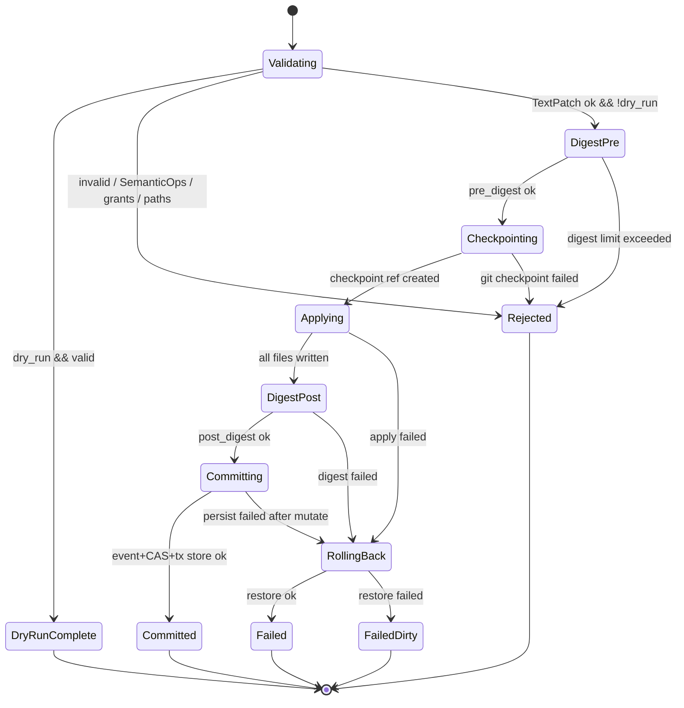
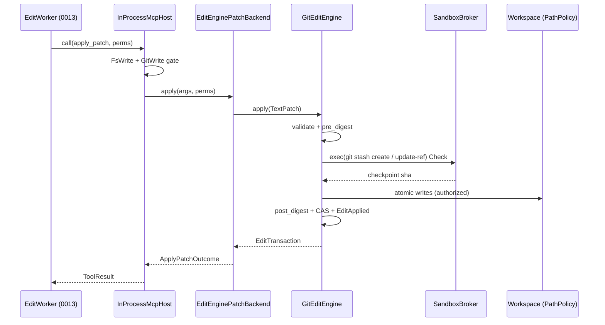
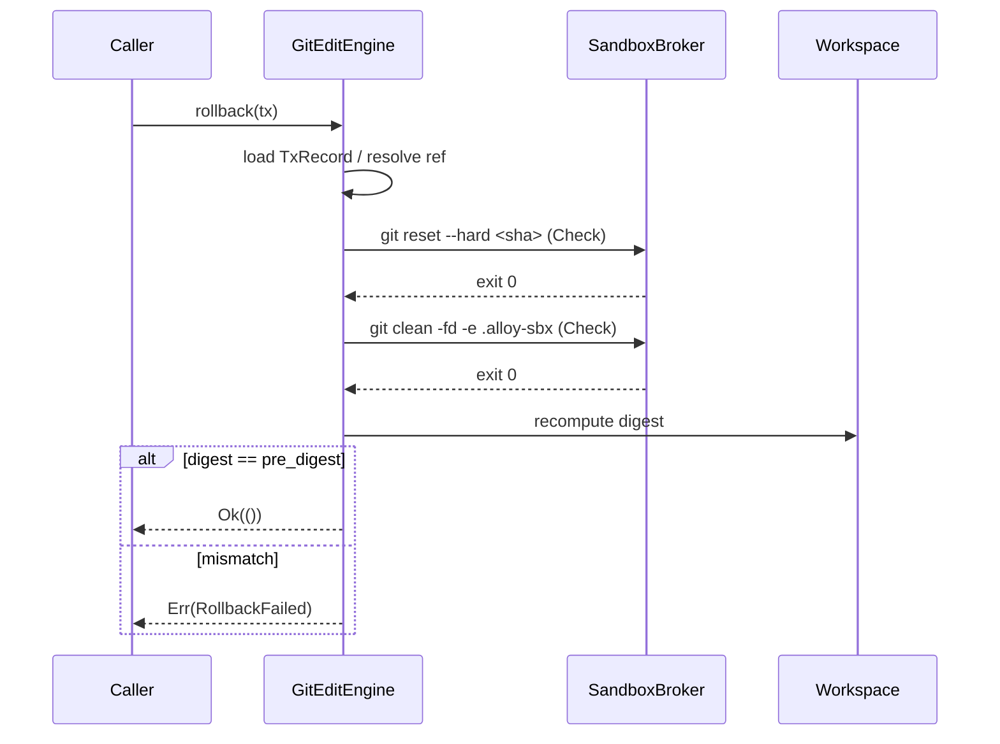

# RFC-0008: EditEngine (TextPatch + Git Checkpoint)

| Field | Value |
| --- | --- |
| **Status** | Draft |
| **Author** | arkadianet |
| **Architecture** | Alloy Architecture V2 (**frozen**) — do not redesign |
| **Depends on** | [RFC-0001](./RFC-0001-alloy-runtime.md) (merged), [RFC-0005](./RFC-0005-sandbox-broker.md) (merged), [RFC-0006](./RFC-0006-mcp-host-builtins.md) (merged) |
| **Effort** | 4–6 person-days |
| **Related RFCs** | [0002](./RFC-0002-storage-artifacts-session-events.md) CAS + session events · [0003](./RFC-0003-session-manager-run-controller.md) session/run ids · [0004](./RFC-0004-observability-cost-metering.md) retention defaults · [0009](./RFC-0009-task-dag-templates-planner.md) Edit node contract · [0010](./RFC-0010-scheduler-runtime-adapters.md) scheduler does **not** call EditEngine · [0013](./RFC-0013-capability-registry-workers.md) EditWorker → `apply_patch` · [0015](./RFC-0015-cli-profiles-config.md) freeform FS policy |
| **Product** | Alloy — AI Engineering Runtime |
| **Supersedes** | Draft outline of this filename (expanded to implementation grade) |
| **Revision** | Implementation-grade draft for Phase B architecture review |

**Mental model (V2 §13 / §3.5 / ADR F-01 / F-14 / F-24):** Alloy has **one write stack**. `EditEngine` is the only component that mutates a workspace under product policy. Agents reach it exclusively through the merged MCP seam `apply_patch` → `PatchApplyBackend`. MVP implements `EditRequest::TextPatch` (unified diff / `PatchSet`) plus **git-only** checkpoints. `SemanticEditOp` variants exist for serde stability and **fail closed**. No OverlayFS. No freeform filesystem writes in this RFC.

**Authority order (highest → lowest):** current `main` source → merged RFCs 0001–0007, 0009, 0016 → Architecture V2 → this draft → roadmaps. Never reshape a merged public API solely to match an older V2 sketch. `PatchApplyBackend`, `ApplyPatchArgs`, `ApplyPatchOutcome`, `PatchApplyError`, `TransactionId`, and `CheckpointId` are **normative and present on `main`**. Extensions in this RFC are **additive** except where §3.8 explicitly amends RFC-0006 to pass `PermissionToken` into the backend (required for fine-grained `FsWrite` promised by RFC-0006 §5.5 and for `GitWrite` gating).

---

## 1. Overview

### 1.1 Purpose

Ship the MVP **EditEngine** that closes Alloy’s first workspace write path:

1. **`EditEngine` trait** — `apply` / `rollback` with transactional semantics.
2. **`EditRequest::TextPatch`** — accept unified diff string or structured `PatchSet`; validate; apply atomically relative to a git checkpoint.
3. **Git checkpoint backend** — `CheckpointId` (UUID, already on `main`) names a git ref under `refs/alloy/checkpoints/<uuid>`; sole MVP checkpoint backend (ADR F-24).
4. **Wire `apply_patch`** — replace `StubPatchApplyBackend` behaviour by injecting `EditEnginePatchBackend` implementing the merged `PatchApplyBackend` seam (RFC-0006 §3.7).
5. **`SemanticEditOp` envelope** — present; every variant returns `EditError::UnsupportedOp` in MVP.
6. **Workspace digests** — `pre` / `post` digests on every mutating apply; recorded on the transaction and in `SessionEventType::EditApplied`.
7. **Auditability** — session events + CAS artifact metadata/hashes (RFC-0004 default retention: no patch bodies by default).

### 1.2 Problem Statement

Nine RFCs and ~40k lines of source exist on `main`, and **nothing yet writes to a workspace**. RFC-0006 advertises `apply_patch` but injects `StubPatchApplyBackend`, which returns `PatchApplyError::Unsupported("edit_engine_unwired: apply_patch requires RFC-0008 EditEngine")` for every input. Milestone **M5** exit gate requires *“Patch+checkpoint + template DAG + session resume green → M6 scheduler.”* Template DAG and session resume are done; this RFC is the missing third. Without it the MCP tool bus advertises a capability it cannot deliver, and V2’s single write stack does not exist in code.

### 1.3 Scope

| In scope | Detail |
| --- | --- |
| `EditEngine` trait | `apply` / `rollback`; `Send + Sync`; async |
| TextPatch path | Unified diff parse + `PatchSet`; validation; apply; digests |
| Git checkpoint | Ref backend; create before mutate; restore on rollback |
| MCP wiring | `EditEnginePatchBackend: PatchApplyBackend`; default injection replaces stub |
| Fine-grained `FsWrite` | Per-path glob match against extracted patch paths (RFC-0006 §5.5 forward pointer) |
| `GitWrite` gate | Required for non-`dry_run` applies (additive RFC-0006 amendment, §3.8 / §8) |
| `SemanticEditOp` | Enum present; all variants → `UnsupportedOp` |
| Observability | `EditApplied` payload; tracing spans; CAS patch artifact (hash retained) |
| Tests | Unit + cross-subsystem MCP→EditEngine→SQLite (§11) |

### 1.4 Non-goals

| Deferred item | Owner |
| --- | --- |
| `SemanticEditOp` lowering / RA-backed `RenameType` | Future extension / M3 (V2 §13) |
| `SplitCrate` / `ExtractTrait` / `MoveModule` implementations | Deferred (V2 kill list / §13) |
| OverlayFS / snapshot bundles | V2 kill list — **no product path** |
| Compile verification after edit | **RFC-0010** VerifyCompile adapter |
| Freeform filesystem writes outside EditEngine | **RFC-0015** profiles; higher approval only |
| Scheduler invocation / node dispatch | **RFC-0010** |
| Capability worker logic that *produces* patches | **RFC-0013** |
| LLM planner / model completion | **RFC-0007** / **RFC-0013** |
| Sixth crate / Postgres / writing `.env` | Forbidden |

### 1.5 Day-1 MVP (normative)

1. Production wiring MUST inject `Arc<EditEnginePatchBackend>` (wrapping a live `GitEditEngine`) into `InProcessMcpHost::new` — **not** `StubPatchApplyBackend`. Tests MAY still construct the stub explicitly.
2. `EditEngine::apply(EditRequest::TextPatch { .. })` MUST: validate → compute `pre_digest` → create git checkpoint → apply patch under PathPolicy → compute `post_digest` → persist transaction metadata → emit `EditApplied` → return `EditTransaction` with `checkpoint_id = Some(...)`.
3. `EditEngine::apply(EditRequest::SemanticOps { .. })` MUST return `Err(EditError::UnsupportedOp { .. })` for **every** variant and every non-empty ops list. Empty ops list MUST return `Err(EditError::InvalidRequest("semantic_ops empty"))`.
4. `ApplyPatchArgs.dry_run == true` MUST call `EditEngine::validate` only: it MUST NOT mutate the workspace, MUST NOT create a checkpoint, MUST NOT write CAS patch bytes as a committed edit, MUST NOT emit `EditApplied`, and MUST return `transaction_id: None`.
5. A partially-applied patch MUST NOT be observable as a committed edit. On apply failure after checkpoint, the engine MUST restore the checkpoint before returning `Err`. If restore fails, return `Err(EditError::RollbackFailed { .. })` and leave the checkpoint ref intact for operator recovery.
6. `rollback(tx)` MUST restore the checkpoint for a known committed or open transaction and MUST be idempotent (second call succeeds with no further tree change).
7. Every rejection path in §5.4 MUST map to a distinct `EditError` variant; the MCP adapter MUST apply the total mapping in §8.3 to `PatchApplyError`.
8. `ApplyPatchOutcome.message` MUST NEVER contain raw patch bodies or absolute paths (honour RFC-0006 §5.9; engine produces jail-relative, length-capped summaries).
9. Alloy MUST NEVER write `.env` (PathPolicy deny-glob + explicit engine deny before write).
10. No OverlayFS. No new crate. `alloy-runtime` and `alloy-tools` remain `#![forbid(unsafe_code)]`.

---

## 2. Architecture Integration

### 2.1 Relationship to Architecture V2

| V2 reference | Application |
| --- | --- |
| §3.5 / ADR F-01 | Text patches are first-class MVP serialization behind transactional `EditEngine`; freeform FS outside EditEngine requires higher approval (out of scope) |
| §13 EditEngine | Trait, envelope, git checkpoint, SemanticOps fail closed — this RFC |
| §13 / ADR F-14 | No dual edit server/crate split; single stack in-process |
| §13 / ADR F-24 | MVP checkpoint backend = **git only**; no OverlayFS / snapshot bundles |
| §14.3 | Workspace jail; deny `.env` / secrets; never replace user `.env` |
| §12.3 | `FsWrite` / `GitWrite` grants — consumed here for apply + checkpoint |
| §6.5 repair sequence | `model → patch → apply → check`; **check** owned by RFC-0010 |
| Appendix A | `edit_applied` session event type already on `main` as `SessionEventType::EditApplied` |

### 2.2 Relationship to RFC-0001

Authoritative for: `TransactionId`, `CheckpointId`, `Digest`, `PermissionToken` / `Grant`, `#![forbid(unsafe_code)]`, five-crate map, session event envelope types.

**This RFC does not redefine IDs.** `CheckpointId` remains a UUID. The git ref name is **derived** as `refs/alloy/checkpoints/<CheckpointId>` (see §5.6). V2’s comment “git ref in MVP” means the *backend* is git, not that the Rust type becomes a string.

### 2.3 Relationship to RFC-0005

Authoritative for: `SandboxBroker`, `SandboxExecRequest`, `ExecClass::{Check,Test}`, `PathPolicy`, `PathAccess`, deny globs, jail membership.

**This RFC:**

* Uses `PathPolicy` with `PathAccess::Write` for every file mutation and path authorization (host-side, same pattern as `fs_read` reads).
* Runs **git checkpoint / restore** via `SandboxBroker::exec` under **`ExecClass::Check`** (no new `ExecClass` variant — see §2.8).
* Does **not** route file content writes through a sandboxed child; Alloy writes bytes itself after PathPolicy authorization (see §2.8 rationale).

### 2.4 Relationship to RFC-0006

Authoritative for: `InProcessMcpHost`, `PatchApplyBackend`, `ApplyPatchArgs`, `ApplyPatchOutcome`, `PatchApplyError`, `StubPatchApplyBackend`, host output boundary (§5.9), `authorize_fs_write` stub behaviour.

**This RFC completes the stub contract** (RFC-0006 §3.7.2): implement `PatchApplyBackend` as an adapter over `EditEngine`; host injection swaps the `Arc`.

**Additive amendments to RFC-0006** (normative here; see §3.8):

1. `PatchApplyBackend::apply` gains `perms: &PermissionToken` so the backend can enforce fine-grained `FsWrite` globs and construct `SandboxExecRequest` for git.
2. `apply_patch` prepare requires `Grant::GitWrite` when `dry_run == false`.
3. Fine-grained `FsWrite(Glob)` matching against extracted patch paths (promised by 0006 §5.5).

### 2.5 Relationship to RFC-0010 and RFC-0013 (single write stack)

**Normative invocation rule (binding for parallel RFC authors):**

| Caller | MAY call | MUST NOT call |
| --- | --- | --- |
| **RFC-0010 LinearScheduler** | `CapabilityExecutor::execute` for `NodeKind::Edit` | `EditEngine`, `PatchApplyBackend`, `apply_patch` |
| **RFC-0013 EditWorker** | `ToolHandle::call("apply_patch", …)` under run grants | `EditEngine` directly; raw `std::fs::write`; any second write API |
| **MCP host `apply_patch`** | Injected `PatchApplyBackend` (= EditEngine adapter) | Bypass EditEngine |
| **Tests / operator recovery / CLI** | `EditEngine::apply` / `rollback` on the **same** injected engine instance | A parallel mutate path |

**Why this is one write stack, not two:**

* The **only** component that mutates workspace files under Alloy policy is `EditEngine` (and its git checkpoint helper).
* The **only** agent-facing entry is MCP `apply_patch` → `EditEnginePatchBackend` → `EditEngine`.
* Direct `EditEngine::{apply,rollback}` from tests/CLI is the **same** stack without MCP mediation — not a second product write path.
* RFC-0010’s scheduler never touches the filesystem for Edit nodes; RFC-0013 workers produce patches and call the tool.

Merged code supporting this:

* `crates/alloy-tools/src/mcp/patch.rs` — `PatchApplyBackend` seam; stub message names RFC-0008.
* `crates/alloy-tools/src/mcp/builtins/apply_patch.rs` — host does not interpret `patch`; backend owns format.
* Architecture V2 §12.2 / worker table — EditWorker tools: `apply_patch`, `fs_read`.
* Architecture V2 §13 — “not a second write stack.”

### 2.6 Already implemented | Added by RFC-0008 | Deferred

| Category | Contents |
| --- | --- |
| **Already implemented** | `TransactionId`, `CheckpointId`, `Digest`, `Grant::{FsWrite,GitWrite,Exec}`, `SessionEventType::EditApplied`, `ArtifactStore` / `ArtifactKind::Patch`, `PathPolicy`, `SandboxBroker`, `ExecClass::{Check,Test}`, `PatchApplyBackend` + stub + host sanitize, `authorize_fs_write` (≥1 FsWrite), DecisionLog / ToolCall recording for MCP calls |
| **Added by RFC-0008** | `EditEngine` trait; `EditRequest`; `PatchSet` / hunk types; `SemanticEditOp`; `EditTransaction`; `WorkspaceDigest`; `EditError`; `GitEditEngine`; `EditEnginePatchBackend`; git checkpoint/restore; fine-grained FsWrite; GitWrite gate; `EditApplied` payload schema; digest computation; transaction registry; tests |
| **Deferred** | SemanticOps lowering (future); OverlayFS (forbidden); compile gate (0010); workers producing patches (0013); freeform FS (0015); new `ExecClass` (not required — §2.8) |

### 2.7 What RFC-0010 and RFC-0013 MAY rely on

| Consumer | MAY rely on | MUST NOT invent |
| --- | --- | --- |
| **RFC-0010** | That Edit nodes do not need EditEngine in the scheduler; verify adapters remain MCP `cargo_*` only; retryability of `PatchApplyError`/`ToolError` mappings in §8.4 | Scheduler→EditEngine call; second write API; OverlayFS rollback |
| **RFC-0013** | `apply_patch` works end-to-end; `EditRequest::TextPatch` JSON shape for artifacts; `UnsupportedOp` for SemanticOps; `files_touched` / `transaction_id` in tool result | Direct EditEngine handle on `CapabilityContext`; raw FS writes |

### 2.8 Mandatory decision: git, sandbox, and `ExecClass`

| Question | Normative answer |
| --- | --- |
| Does file mutation go through `SandboxBroker`? | **No.** Alloy writes file bytes on the host after `PathPolicy::authorize(..., PathAccess::Write)`. Same host-side pattern as `fs_read` (RFC-0006 §5.8). |
| Does git checkpoint run inside the sandbox? | **Yes.** `git` argv runs via `SandboxBroker::exec` with `class: ExecClass::Check`. |
| New `ExecClass` variant? | **No.** Reuse `Check`. Adding `ExecClass::Git` would be an additive change to a merged RFC-0005 type; it is **not** required because Check already selects the light Landlock/Seatbelt backend appropriate for trusted git in-jail. |
| What does `Grant::GitWrite` gate? | Creating or restoring a git checkpoint (non-`dry_run` apply, and any `rollback`). Checked in `apply_patch` prepare (§5.5 amendment) **and** again inside `GitEditEngine` before checkpoint/restore. |
| What does `Grant::Exec` gate for git? | The `git` binary argv must match an `ExecAllow` on the caller token (same `match_exec_grant` path as cargo). Profiles that grant `GitWrite` MUST also grant `Exec` for `git` (RFC-0015; tests mint both). |
| What are “sandbox constraints” for M5? | (1) PathPolicy jail + deny-globs on every touched path; (2) FsWrite glob coverage; (3) GitWrite present for mutating ops; (4) git child isolated under Check backend with scrubbed env / jail cwd. |

**Amendment path note:** If Phase B review rejects host-side file writes, the alternative is still **not** a new `ExecClass`; it would be a follow-up RFC routing writes through a helper child. This RFC freezes host-side writes + sandboxed git as above.

### 2.9 Dependency boundaries

```text
RFC-0013 EditWorker
        │  ToolHandle::call("apply_patch")
        ▼
alloy-tools::mcp::InProcessMcpHost
        │  PatchApplyBackend::apply(args, perms)
        ▼
alloy-tools::edit::EditEnginePatchBackend
        │
        ▼
alloy-tools::edit::GitEditEngine  ──implements──►  alloy_runtime::edit::EditEngine
        │                           uses
        ├─ PathPolicy (Write)
        ├─ SandboxBroker (git, ExecClass::Check)
        ├─ ArtifactStore (patch bytes, ArtifactKind::Patch)
        └─ EventSink (EditApplied)
```

* `alloy-runtime` defines the trait + IR types (`edit` module). **No** dependency on `alloy-tools`.
* `alloy-tools` implements the engine + MCP adapter. Existing `alloy-tools → alloy-runtime` edge unchanged.
* **No sixth crate.** Dependency graph stays acyclic within ≤5 crates.

### 2.10 M5 exit gate

This RFC closes the *Patch+checkpoint* third of M5 when §13 acceptance criteria pass. Template DAG (0009) and session resume (0003) are separate; together they satisfy *“Patch+checkpoint + template DAG + session resume green → M6 scheduler.”*

---

## 3. Public Rust API

New items live under `alloy_runtime::edit` (types + trait) and `alloy_tools::edit` (implementation + MCP adapter). Merged MCP patch types remain in `alloy_tools::mcp::patch`. `alloy-runtime` is `#![deny(missing_docs)]`.

### 3.1 Reused types (normative — unchanged)

| Type | Source | Notes |
| --- | --- | --- |
| `TransactionId`, `CheckpointId` | `types::ids` | UUID newtypes; **do not redefine** |
| `Digest` | `types::ids` | SHA-256 hex via `Digest::sha256` |
| `Grant`, `Glob`, `ExecAllow`, `PermissionToken` | `types::permission` | FsWrite / GitWrite / Exec |
| `SessionId`, `RunId` | `types::ids` | Attribution on events / artifacts |
| `SessionEventType::EditApplied` | `events` | Already present |
| `EventSink`, `NewSessionEvent` | `events` | Append path |
| `ArtifactStore`, `ArtifactPut`, `ArtifactKind::Patch` | `storage` | CAS |
| `PatchApplyBackend`, `ApplyPatchArgs`, `ApplyPatchOutcome`, `PatchApplyError` | `alloy-tools::mcp::patch` | Seam; signature amendment in §3.8 |
| `StubPatchApplyBackend` | same | Remains for explicit test injection |
| `PathPolicy`, `PathAccess`, `SandboxBroker`, `SandboxExecRequest`, `ExecClass` | `alloy-tools::sandbox` | Constraints |
| `InProcessMcpHost::new(..., patch_backend, ...)` | `alloy-tools::mcp::host` | Injection point unchanged |

### 3.2 `EditRequest` / `SemanticEditOp` / `PatchSet`

```rust
// crates/alloy-runtime/src/edit/types.rs
// Visibility: pub; re-exported from alloy_runtime::edit and crate root.

use serde::{Deserialize, Serialize};

/// Workspace edit envelope (Architecture V2 §13.2).
#[derive(Debug, Clone, PartialEq, Eq, Serialize, Deserialize)]
#[serde(tag = "kind", rename_all = "snake_case")]
pub enum EditRequest {
    /// Unified-diff / structured text patch (MVP path).
    TextPatch { patch: PatchSet },
    /// Semantic ops envelope — MVP fail closed (§5.10).
    SemanticOps { ops: Vec<SemanticEditOp> },
}

/// Structured patch set. Paths are jail-relative (`/`-separated, no leading `/`, no `..`).
#[derive(Debug, Clone, PartialEq, Eq, Serialize, Deserialize)]
pub struct PatchSet {
    /// Ordered file patches. Apply order is vector order.
    pub files: Vec<FilePatch>,
}

/// One file’s worth of hunks.
#[derive(Debug, Clone, PartialEq, Eq, Serialize, Deserialize)]
pub struct FilePatch {
    /// Jail-relative path to modify, create, or delete.
    pub path: String,
    /// `None` = modify/create from hunks; `Some(true)` = delete file (hunks MUST be empty).
    #[serde(default, skip_serializing_if = "Option::is_none")]
    pub delete: Option<bool>,
    /// Hunks in file order. MUST be non-overlapping and ascending by old_start.
    pub hunks: Vec<Hunk>,
}

/// One unified-diff hunk.
#[derive(Debug, Clone, PartialEq, Eq, Serialize, Deserialize)]
pub struct Hunk {
    /// 1-based start line in the current file (0 only for create-from-empty old side).
    pub old_start: u32,
    /// Line count on the old side (context + deletions).
    pub old_lines: u32,
    /// 1-based start line in the new file.
    pub new_start: u32,
    /// Line count on the new side (context + insertions).
    pub new_lines: u32,
    /// Unified diff lines including leading ' ', '-', '+' (no '\\ No newline' markers as separate
    /// semantics beyond preserving final-newline via content).
    pub lines: Vec<String>,
}

/// Semantic edit ops (V2 §13). Serde-stable; MVP returns UnsupportedOp for all.
#[derive(Debug, Clone, PartialEq, Eq, Serialize, Deserialize)]
#[serde(tag = "op", rename_all = "snake_case")]
pub enum SemanticEditOp {
    RenameType {
        from_path: String,
        to_name: String,
        update_references: bool,
    },
    UpdateImports {
        file: String,
        add: Vec<String>,
        remove: Vec<String>,
    },
    ReplaceBody {
        item_path: String,
        new_body: String,
    },
    InsertImpl {
        file: String,
        type_path: String,
        body: String,
    },
    AddMethod {
        item_path: String,
        method_source: String,
    },
    MoveModule {
        from_path: String,
        to_path: String,
    },
    ExtractTrait {
        type_path: String,
        trait_name: String,
        method_names: Vec<String>,
    },
    SplitCrate {
        source_crate: String,
        new_crate: String,
        move_paths: Vec<String>,
    },
    AddField {
        type_path: String,
        field_source: String,
    },
}
```

**Serde stability (normative):** `SemanticEditOp` uses `#[serde(tag = "op", rename_all = "snake_case")]`. Future RFCs implementing a variant MUST NOT rename existing tags or fields. Unknown tags at deserialize time MUST fail deserialize (deny unknown variants via closed enum — no `#[serde(other)]` in MVP).

### 3.3 `WorkspaceDigest`

```rust
/// Digest over the authorized workspace snapshot (§5.8).
#[derive(Debug, Clone, PartialEq, Eq, Serialize, Deserialize)]
pub struct WorkspaceDigest {
    /// SHA-256 hex of the canonical tree encoding.
    pub tree: Digest,
    /// Number of files included in the tree encoding.
    pub file_count: u64,
    /// Total bytes hashed (file contents only).
    pub total_bytes: u64,
}
```

### 3.4 `EditTransaction`

```rust
#[derive(Debug, Clone, PartialEq, Eq, Serialize, Deserialize)]
pub struct EditTransaction {
    pub id: TransactionId,
    pub request: EditRequest,
    pub pre_digest: WorkspaceDigest,
    pub post_digest: Option<WorkspaceDigest>,
    pub patch_set: Option<PatchSet>,
    /// Set after successful checkpoint creation; `None` only for dry-run (dry-run never
    /// returns EditTransaction through MCP — see adapter). On successful mutating apply: Some.
    pub checkpoint_id: Option<CheckpointId>,
    /// Jail-relative paths touched (sorted, deduped).
    pub files_touched: Vec<String>,
    /// CAS artifact id for the canonical PatchSet JSON, when stored.
    pub patch_artifact_id: Option<ArtifactId>,
}
```

### 3.5 `EditEngine` trait

```rust
use async_trait::async_trait;

/// Result of a validation-only (dry-run) pass — never allocated a TransactionId.
#[derive(Debug, Clone, PartialEq, Eq, Serialize, Deserialize)]
pub struct EditValidation {
    /// Jail-relative paths that would be touched (sorted, deduped).
    pub files_touched: Vec<String>,
    /// Optional pre-digest when computed; MVP dry-run leaves this `None` (§5.5 / §5.8).
    pub pre_digest: Option<WorkspaceDigest>,
}

/// Transactional workspace edit apply + rollback.
///
/// Implementors MUST be `Send + Sync`. Methods are async and MAY perform filesystem
/// and sandboxed git I/O. The trait object is shared as `Arc<dyn EditEngine>`.
#[async_trait]
pub trait EditEngine: Send + Sync {
    /// Validate `req` without mutating the workspace or creating a checkpoint.
    ///
    /// MUST enforce V1–V11 (§5.4). MUST NOT enforce V12–V14 (git grants/repo).
    /// MUST NOT write files, refs, CAS edit artifacts, or session events.
    async fn validate(&self, req: EditRequest) -> Result<EditValidation, EditError>;

    /// Validate and apply `req`. On success returns a committed transaction.
    ///
    /// Lifecycle: see §5 state machine. Cancellation: if the future is dropped mid-apply
    /// after a checkpoint was created, the implementation MUST attempt rollback in a
    /// Drop/cancel path (§6.4) or leave an Open transaction recoverable via §6.5.
    ///
    /// MUST NOT be used for MCP `dry_run` — callers MUST use [`EditEngine::validate`].
    async fn apply(&self, req: EditRequest) -> Result<EditTransaction, EditError>;

    /// Restore the checkpoint associated with `tx`.
    ///
    /// Idempotent: if the workspace already matches the pre-digest (or the checkpoint
    /// ref is already the restored tip marker), return `Ok(())`.
    async fn rollback(&self, tx: TransactionId) -> Result<(), EditError>;
}
```

**Visibility:** `pub trait` in `alloy_runtime::edit`.  
**Ownership:** callers hold `Arc<dyn EditEngine>`.  
**Persistence:** transaction records — §5.7.  
**Permissions:** checked by concrete impl using injected policy + per-call token context (§4.3).  
**Export:** `EditValidation` is `pub` and crate-root re-exported with the other edit types (§3.11).
### 3.6 `EditError`

```rust
use thiserror::Error;

/// EditEngine failure taxonomy (§8).
#[derive(Debug, Error)]
#[non_exhaustive]
pub enum EditError {
    #[error("unsupported op: {op}")]
    UnsupportedOp { op: String },

    #[error("invalid request: {0}")]
    InvalidRequest(String),

    #[error("invalid patch: {0}")]
    InvalidPatch(String),

    #[error("empty patch")]
    EmptyPatch,

    #[error("path denied: {path}: {reason}")]
    PathDenied { path: String, reason: String },

    #[error("path not covered by FsWrite grant: {path}")]
    PathNotCovered { path: String },

    #[error("missing grant: {0}")]
    MissingGrant(String),

    #[error("conflict: {0}")]
    Conflict(String),

    #[error("context mismatch: {path}: {detail}")]
    ContextMismatch { path: String, detail: String },

    #[error("overlapping hunks: {path}")]
    OverlappingHunks { path: String },

    #[error("checkpoint failed: {0}")]
    CheckpointFailed(String),

    #[error("rollback failed: tx={tx}: {detail}")]
    RollbackFailed { tx: TransactionId, detail: String },

    #[error("unknown transaction: {0}")]
    UnknownTransaction(TransactionId),

    #[error("io: {0}")]
    Io(String),

    #[error("git: {0}")]
    Git(String),

    #[error("busy: edit already in progress")]
    Busy,

    #[error("cancelled")]
    Cancelled,

    #[error("internal: {0}")]
    Internal(String),
}
```

### 3.7 `GitEditEngine` / `EditEnginePatchBackend` (in `alloy-tools`)

```rust
// crates/alloy-tools/src/edit/engine.rs

/// Concrete MVP EditEngine: PathPolicy writes + sandboxed git checkpoints.
pub struct GitEditEngine { /* private fields — §4.3 */ }

impl GitEditEngine {
    /// Construct the engine.
    ///
    /// `broker` and `path_policy` MUST refer to the same canonical jail as the MCP host.
    /// `events` is required (not Option) — every committed apply emits EditApplied.
    /// `artifacts` stores canonical PatchSet JSON (`ArtifactKind::Patch`).
    pub fn new(config: GitEditEngineConfig) -> Result<Self, EditError>;
}

pub struct GitEditEngineConfig {
    pub broker: Arc<dyn SandboxBroker>,
    pub path_policy: PathPolicy,
    pub artifacts: Arc<dyn ArtifactStore>,
    pub events: Arc<dyn EventSink>,
    pub session_id: SessionId,
    pub run_id: Option<RunId>,
    /// Soft cap on files walked for WorkspaceDigest (default 50_000).
    pub max_digest_files: u64,
    /// Soft cap on total bytes hashed for WorkspaceDigest (default 512 MiB).
    pub max_digest_bytes: u64,
}

#[async_trait]
impl EditEngine for GitEditEngine { /* §5 */ }

/// MCP adapter: PatchApplyBackend → EditEngine.
pub struct EditEnginePatchBackend {
    engine: Arc<dyn EditEngine>,
    /// Interior token slot set by the host for the duration of one apply (§3.8).
    /// Alternative permitted shape: pass perms only via amended apply signature below.
}

impl EditEnginePatchBackend {
    pub fn new(engine: Arc<dyn EditEngine>) -> Self;
}
```

### 3.8 RFC-0006 additive amendment — `PatchApplyBackend` signature

**Problem:** Merged `PatchApplyBackend::apply(&self, args: ApplyPatchArgs)` cannot carry `PermissionToken`. RFC-0006 §5.5 explicitly deferred fine-grained `FsWrite` path matching to RFC-0008. Git via `SandboxBroker` also requires the caller token.

**Amendment (normative):**

```rust
// BEFORE (merged RFC-0006 / main):
async fn apply(&self, args: ApplyPatchArgs) -> Result<ApplyPatchOutcome, PatchApplyError>;

// AFTER (this RFC):
async fn apply(
    &self,
    args: ApplyPatchArgs,
    perms: &PermissionToken,
) -> Result<ApplyPatchOutcome, PatchApplyError>;
```

| Call site | Change |
| --- | --- |
| `StubPatchApplyBackend` | Ignore `perms`; still return `Unsupported(EDIT_ENGINE_UNWIRED_MESSAGE)` |
| `apply_patch::execute` | Pass the caller `PermissionToken` already available in `builtins::execute` |
| `EditEnginePatchBackend` | Use `perms` for FsWrite globs, GitWrite, and git `SandboxExecRequest` |
| Host constructor | Unchanged (`Arc<dyn PatchApplyBackend>`) |

`ApplyPatchArgs`, `ApplyPatchOutcome`, and `PatchApplyError` variants are **unchanged**.

**Host prepare amendment (normative):**

```text
apply_patch prepare:
  1. parse args
  2. require ≥1 Grant::FsWrite(_)           // existing
  3. if !dry_run: require Grant::GitWrite   // NEW
  4. return args
```

Supersedes RFC-0006’s line “`Grant::GitWrite`: ignored by all four MVP builtins” **for `apply_patch` only**. `cargo_*` / `fs_read` still ignore `GitWrite`.

### 3.9 Adapter behaviour — `EditEnginePatchBackend::apply`

| Step | Behaviour |
| --- | --- |
| 1 | Decode `args.patch` → `EditRequest` per §5.3; on failure → `PatchApplyError::InvalidPatch` |
| 2 | If `EditRequest::SemanticOps` → map `UnsupportedOp` via §8.3 (`Unsupported`) |
| 3 | Install caller `perms` into the engine slot (§4.3) |
| 4 | If `dry_run`: `engine.validate(req).await`; build `ApplyPatchOutcome { dry_run: true, files_touched, transaction_id: None, message }` |
| 5 | Else: `engine.apply(req).await`; map errors via §8.3 |
| 6 | On success: `ApplyPatchOutcome { dry_run: false, files_touched: tx.files_touched, transaction_id: Some(tx.id), message }` |
| 7 | Clear perms slot (also on error paths — `scopeguard` or equivalent) |

`message` MUST be one of:

* `"applied N file(s)"` (N = files_touched.len())
* `"dry_run ok: N file(s)"`
* or a short jail-relative conflict hint ≤512 bytes with no absolute paths

**Ordering vs host prepare:** Host already required `FsWrite` and (when `!dry_run`) `GitWrite` before calling the backend. Backend MUST still re-check fine-grained `FsWrite` globs and (when mutating) `GitWrite` + `Exec(git)` — defense in depth; duplicate denials are identical errors.
### 3.10 Wiring diff (injection)

```rust
// Production / integration (normative shape):
let engine = Arc::new(GitEditEngine::new(GitEditEngineConfig { /* … */ })?);
let patch_backend: Arc<dyn PatchApplyBackend> =
    Arc::new(EditEnginePatchBackend::new(engine));
let host = InProcessMcpHost::new(
    broker,
    homes,
    read_only_roots,
    patch_backend,           // was Arc::new(StubPatchApplyBackend)
    McpHostConfig::new(),
)?;
```

`StubPatchApplyBackend` remains `pub` for unit tests that assert unwired behaviour.

### 3.11 Crate-root exports

**`alloy-runtime` MUST `pub use`:**

`EditEngine`, `EditValidation`, `EditRequest`, `EditTransaction`, `EditError`, `PatchSet`, `FilePatch`, `Hunk`, `SemanticEditOp`, `WorkspaceDigest`.
**`alloy-tools` MUST `pub use` from `edit`:**

`GitEditEngine`, `GitEditEngineConfig`, `EditEnginePatchBackend`.

---

## 4. Internal Module Design

### 4.1 Module hierarchy

```text
crates/alloy-runtime/src/
  edit/
    mod.rs          # re-exports
    types.rs        # EditRequest, PatchSet, Hunk, SemanticEditOp, WorkspaceDigest, EditTransaction
    engine.rs       # EditEngine trait
    error.rs        # EditError
  lib.rs            # pub mod edit; pub use …

crates/alloy-tools/src/
  edit/
    mod.rs
    engine.rs       # GitEditEngine
    checkpoint.rs   # git ref create/restore via SandboxBroker
    patch_parse.rs  # unified diff → PatchSet; validation
    apply.rs        # hunk application
    digest.rs       # WorkspaceDigest computation
    tx_store.rs     # transaction registry (SQLite sidecar or in-memory+CAS — §5.7)
    backend.rs      # EditEnginePatchBackend
  mcp/patch.rs      # amended PatchApplyBackend signature (§3.8)
  mcp/builtins/apply_patch.rs  # pass perms; GitWrite prepare check
  lib.rs            # pub mod edit;
```

### 4.2 Visibility

| Item | Visibility |
| --- | --- |
| Traits/types in §3 | `pub` |
| `GitEditEngine` fields | private |
| parse/apply helpers | `pub(crate)` |
| checkpoint argv builders | `pub(crate)` |

### 4.3 `GitEditEngine` injected state

| Field | Type | Role |
| --- | --- | --- |
| `broker` | `Arc<dyn SandboxBroker>` | git exec |
| `path_policy` | `PathPolicy` | jail / deny / write auth |
| `artifacts` | `Arc<dyn ArtifactStore>` | patch CAS |
| `events` | `Arc<dyn EventSink>` | EditApplied |
| `session_id` / `run_id` | ids | attribution |
| `tx_store` | internal | transaction records |
| `write_lock` | `tokio::sync::Mutex<()>` | single-writer (§6) |
| `max_digest_*` | u64 | digest caps |
| `caller_perms` | see below | per-call grants |

**Per-call permissions:** Because `EditEngine::apply` does not take `PermissionToken` (V2 sketch), `EditEnginePatchBackend` MUST set an `tokio::sync::Mutex<Option<PermissionToken>>` (or `task_local!`) on the engine **before** calling `apply`/`rollback`, and clear it after. Direct test callers of `GitEditEngine` MUST use `GitEditEngine::apply_with_perms(req, perms)` / `rollback_with_perms(tx, perms)` convenience methods that perform the same slot dance. The `EditEngine` trait methods require the slot to be populated; if missing → `EditError::Internal("missing caller perms")`.

### 4.4 Who constructs what

| Environment | Constructor |
| --- | --- |
| `alloy-cli` / future runtime host (RFC-0015) | Builds broker + PathPolicy + storage; constructs `GitEditEngine`; wraps `EditEnginePatchBackend`; passes into `InProcessMcpHost::new` |
| `cross_subsystem` test | Same pattern over tempdir git repo + `AlloyStorage` |
| Pure MCP unit tests | MAY keep `StubPatchApplyBackend` |

---

## 5. Execution Algorithm

### 5.1 State machine



Reconciles the placeholder: Validating → Checkpointing → Applying → Committed, with explicit dry-run, digest, and FailedDirty.

### 5.2 Apply pipeline (mutating, normative order)

1. **Acquire** single-writer lock (fail `Busy` if not available within 0 ms try_lock for MVP — no queue).
2. **Reject** `SemanticOps` → `UnsupportedOp`.
3. **Normalize** `PatchSet` (§5.3–5.4).
4. **Authorize paths** (§5.4.3): PathPolicy Write + FsWrite globs + deny `.env`.
5. **Require** `GitWrite` + `Exec(git)` (§5.4.4).
6. **Compute** `pre_digest` (§5.8).
7. **Allocate** `TransactionId::new()`, `CheckpointId::new()`.
8. **Create checkpoint** (§5.6) *before any file mutation*. On failure → `CheckpointFailed` (no mutate).
9. **Record** Open transaction in tx store (checkpoint_id, pre_digest, patch hash).
10. **Apply** each `FilePatch` in order (§5.4.5). On failure → restore checkpoint → `Conflict` / `Io` / etc.
11. **Compute** `post_digest`.
12. **CAS put** canonical PatchSet JSON (`ArtifactKind::Patch`, labels include tx id, checkpoint id, pre/post digests). Body retention follows store defaults; event keeps hash.
13. **Append** `EditApplied` session event (§9.3).
14. **Mark** transaction Committed in tx store.
15. **Release** lock; return `EditTransaction`.

### 5.3 Patch wire format (`ApplyPatchArgs.patch`)

The MCP host leaves `patch` as `serde_json::Value`. **This RFC owns decoding.**

Decoder entrypoint (normative signature in `alloy-tools::edit::patch_parse`):

```rust
/// Decode MCP `ApplyPatchArgs.patch` into an [`EditRequest`].
pub fn decode_patch_value(value: &serde_json::Value) -> Result<EditRequest, EditError>;

/// Parse unified diff text into a [`PatchSet`].
pub fn parse_unified_diff(text: &str) -> Result<PatchSet, EditError>;
```

| JSON shape | Interpretation |
| --- | --- |
| `String` | Unified diff text (UTF-8). `parse_unified_diff` → `EditRequest::TextPatch`. |
| `Object` with `"files"` array | Direct `PatchSet` deserialize → `TextPatch`. |
| `Object` with `"kind": "text_patch"` and `"patch"` | Full `EditRequest::TextPatch` envelope (serde). |
| `Object` with `"kind": "semantic_ops"` and `"ops"` | `EditRequest::SemanticOps` (later fail closed). |
| `Null` / array / bool / number | `InvalidPatch("unrecognized patch json")` |
| Other object | `InvalidPatch("unrecognized patch json")` |

Maximum unified diff / PatchSet JSON size: **1 MiB** as UTF-8 bytes of the `Value` serialized in compact form **or** of the string contents (whichever applies). Larger → `InvalidPatch("patch too large")`.

#### 5.3.1 Unified diff parse rules

| Rule | Normative behaviour |
| --- | --- |
| File headers | Accept `--- <old>` then `+++ <new>` (git `a/`/`b/` prefixes optional). |
| Path normalize | Strip leading `a/` or `b/` once; reject if result absolute, empty, contains `\\`, NUL, or any `.`/`..` segment → `PathDenied`. |
| Create | Old path is `/dev/null` (after strip) → `FilePatch` with empty old side; file MUST NOT already exist at apply (V11). |
| Delete | New path is `/dev/null` → `delete: Some(true)`, `hunks: []` after parse of delete hunks into emptiness check; prefer encoding delete as `delete: Some(true)` and ignoring body hunks only when they are a full-file deletion. Full-file deletion hunks MAY be present in the diff text; parser MUST set `delete: Some(true)` and `hunks: []`. |
| Rename/copy headers | `rename from` / `copy from` **unsupported** → `InvalidPatch("rename/copy unsupported")`. |
| Binary marks | `Binary files differ` / `GIT binary patch` → `InvalidPatch("binary patch unsupported")`. |
| Hunk header | `@@ -old_start,old_lines +new_start,new_lines @@` (comma counts optional when 1). |
| Hunk lines | Each line MUST begin with ` `, `-`, or `+`, else `InvalidPatch`. |
| No-newline marker | Line equal to `\ No newline at end of file` adjusts EOF newline flags; MUST NOT appear in `Hunk.lines`. |
| Multi-file | Preserve file order from the diff. |
| Text encoding | Input MUST be valid UTF-8; invalid → `InvalidPatch("patch not utf-8")`. |

#### 5.3.2 Canonical `PatchSet` JSON (CAS)

When storing to CAS, serialize `PatchSet` with `serde_json::to_vec` using **sorted object keys disabled** (serde default field order as declared in §3.2). Labels on `ArtifactPut`:

| Label key | Value |
| --- | --- |
| `transaction_id` | tx UUID string |
| `checkpoint_id` | checkpoint UUID string |
| `pre_digest` | `pre_digest.tree` hex |
| `post_digest` | `post_digest.tree` hex |
| `schema` | `"alloy.patch_set.v1"` |
### 5.4 Validation (every rejection → distinct error)

| # | Condition | Error |
| --- | --- | --- |
| V1 | PatchSet.files empty | `EmptyPatch` |
| V2 | FilePatch.path empty / absolute / `\` / `.` / `..` segment / NUL | `PathDenied` |
| V3 | Path fails `PathPolicy::authorize(Write)` (outside jail, deny-glob, RO root) | `PathDenied` |
| V4 | Path not matched by any `Grant::FsWrite(Glob)` (FsRead dialect expansion, RFC-0006 §5.5) | `PathNotCovered` |
| V5 | `delete == Some(true)` but hunks non-empty | `InvalidPatch` |
| V6 | Two FilePatches with same path | `InvalidPatch("duplicate path")` |
| V7 | Hunks overlap on old-line ranges within a file | `OverlappingHunks` |
| V8 | Hunk line counts disagree with `lines` contents | `InvalidPatch` |
| V9 | Context/delete lines do not match file at old_start | `ContextMismatch` |
| V10 | Delete target missing | `Conflict("delete missing file")` |
| V11 | Create target already exists | `Conflict("create exists")` |
| V12 | Missing `GitWrite` on mutating path | `MissingGrant("git_write")` |
| V13 | Missing `Exec` match for git argv | `MissingGrant("exec:git")` (or map from sandbox denial) |
| V14 | Workspace is not a git repo (`rev-parse --is-inside-work-tree`) | `Git("not a git repository")` |
| V15 | SemanticOps | `UnsupportedOp` |

**FsWrite glob dialect:** identical to RFC-0006 `FsRead` expansion (literal_separator, macOS case-insensitivity, `**/` expansion). Normative examples MUST be unit-tested (`fs_write_grant_examples_table`).

### 5.5 `dry_run` semantics

| Action | dry_run=true | dry_run=false |
| --- | --- | --- |
| Parse + V1–V11 | Yes | Yes |
| V12–V14 GitWrite/git repo | **Skip** GitWrite/Exec/git repo checks | Yes |
| PathPolicy write *authorize* (no write) | Yes | Yes |
| Create checkpoint | **MUST NOT** | Yes |
| Mutate files | **MUST NOT** | Yes |
| CAS patch put as edit | **MUST NOT** | Yes |
| Emit `EditApplied` | **MUST NOT** | Yes |
| `ApplyPatchOutcome.transaction_id` | `None` | `Some(tx)` |
| `files_touched` | Paths that **would** change (sorted) | Paths changed |
| `message` | `"dry_run ok: N file(s)"` | `"applied N file(s)"` |

Dry-run context matching MUST read the current workspace (no writes). The adapter MUST invoke `EditEngine::validate`, never `apply`, when `dry_run` is true.

### 5.6 Git checkpoint backend

| Item | Normative value |
| --- | --- |
| Checkpoint id | `CheckpointId::new()` (UUID) |
| Git ref | `refs/alloy/checkpoints/<uuid>` (lowercase UUID hyphenated) |
| Create algorithm | See steps below |
| Dirty tree | MVP MUST capture HEAD **and** working tree / index via `git stash create` |
| Restore | `git reset --hard <sha>` then `git clean -fd -e .alloy-sbx` |
| Sandbox | `SandboxExecRequest { argv, cwd: jail, perms: caller_token, class: ExecClass::Check }` |
| Failure | Non-zero exit or empty unexpected stdout → `CheckpointFailed` / `Git` / `RollbackFailed` |

**Create steps (normative):**

1. `["git", "rev-parse", "--is-inside-work-tree"]` — stdout must contain `true`; else `Git("not a git repository")`.
2. `["git", "rev-parse", "-q", "--verify", "HEAD"]` — if fails, `Git("empty repository: make initial commit")` (§15.5).
3. `["git", "stash", "create"]` — if stdout is a 40-hex SHA, use it as `checkpoint_sha`. If stdout empty (clean tree), run `["git", "rev-parse", "HEAD"]` and use that SHA.
4. `["git", "update-ref", "refs/alloy/checkpoints/<uuid>", "<checkpoint_sha>"]`.
5. Persist `checkpoint_sha` on the Open tx record.

**Restore steps (normative):**

1. Read `checkpoint_sha` from tx record, or `["git", "rev-parse", "refs/alloy/checkpoints/<uuid>"]`.
2. `["git", "reset", "--hard", "<checkpoint_sha>"]`.
3. `["git", "clean", "-fd", "-e", ".alloy-sbx"]`.
4. Recompute digest; compare to `pre_digest`.

**ExecAllow subject:** argv[0] is the path or basename resolved the same way as cargo (`match_exec_grant` / trusted PATH). Tests SHOULD grant `ExecAllow { binary: "git", args_glob: None }` or a glob that permits `stash`, `update-ref`, `rev-parse`, `reset`, `clean`.

**Safety:** Checkpoint create MUST NOT mutate the working tree (`stash create` is non-mutating). `git add`, `git commit`, `git stash push` (mutating), and `git checkout` MUST NOT be used for MVP checkpoints.

### 5.7 Transaction registry

| Field | Persistence |
| --- | --- |
| `id`, `checkpoint_id`, `pre_digest`, `post_digest`, `state`, `files_touched`, `patch_artifact_id`, `created_at` | Durable under `AlloyStorage` data dir: SQLite table `edit_transactions` (new) **or** a CAS JSON blob indexed by label — implementation MUST pick SQLite table in `alloy-tools` via `rusqlite` **only if** that does not require `alloy-runtime` schema migration in this RFC. Preferred: store JSON records as `ArtifactKind::Other("edit_transaction")` plus in-process map, and rely on `EditApplied` + checkpoint ref for restart recovery (§6.5). |

**Normative minimum for MVP:** In-process `Mutex<HashMap<TransactionId, TxRecord>>` plus durable `EditApplied` event + checkpoint ref is sufficient if §6.5 restart recovery is implemented from events. If the process restarts mid-Open, recovery scans `refs/alloy/checkpoints/*` and session events (§6.5).

### 5.8 `WorkspaceDigest` computation

| Rule | Value |
| --- | --- |
| Roots | Canonical jail from `PathPolicy` |
| Include | Regular files only |
| Exclude | `.git/**`, `.alloy-sbx/**`, paths matching deny-globs, symlinks (do not follow) |
| Encoding | For each file in ascending jail-relative path order (UTF-8, `/` sep): `path\0` + `Digest::sha256(contents).as_hex()` + `\n`; then `tree = Digest::sha256(concat)` |
| Caps | If file_count > `max_digest_files` OR total_bytes > `max_digest_bytes` → `Io("workspace digest limit exceeded")` before mutate (or after, trigger rollback) |
| When | Every mutating apply: pre and post. Dry-run: optional pre only; MUST NOT fail the dry-run solely because digest caps trip if validation otherwise passes — dry-run MAY skip digest (normative: **skip digest on dry_run**). |
| Consumers | `EditTransaction`, `EditApplied` payload, rollback idempotence check (compare current tree to `pre_digest`) |

A digest nothing consumed would be dead weight; these three consumers are required.

### 5.9 Apply mechanics (no partial commit)

#### 5.9.1 Per-file algorithm

For each `FilePatch` in vector order:

1. Authorize path (defensive repeat of V2–V4).
2. If `delete == Some(true)`: require file exists (else V10); `std::fs::remove_file` on the canonical path returned by PathPolicy; continue.
3. Load current file as UTF-8 text. Invalid UTF-8 → `Io("file not utf-8")` (MVP text-only). Missing file allowed only when the patch is a create (old side empty / no prior content expected).
4. Split into lines **preserving** whether the file ended with `\n` (retain an explicit `trailing_newline: bool`).
5. Apply hunks in ascending `old_start` order against the **original** line array (do not compose offsets from prior hunks’ new sides — each hunk’s `old_start` refers to the pre-patch file). Implementation MUST either (a) apply from last hunk to first, or (b) build a new buffer by streaming through old lines once — both are permitted; tests MUST cover multi-hunk files.
6. On context/delete mismatch → `ContextMismatch` (trigger full rollback if any prior file already written).
7. Write new bytes to ` <parent>/.<file_name>.alloy-tmp-<tx_uuid> ` (temp name MUST be deny-glob safe and inside jail).
8. `std::fs::rename(temp, final)` atomic replace.
9. Temp files left after failure MUST be removed during rollback restore (`git clean`) or explicit unlink in the failure path.

#### 5.9.2 Atomicity guarantee

| Stage | Observable workspace |
| --- | --- |
| Before checkpoint | Unchanged |
| After checkpoint, before any rename | Unchanged (temp files ignored by digest excludes? **Normative:** temp files matching `.*.alloy-tmp-*` MUST be excluded from `WorkspaceDigest` and removed on success and on rollback) |
| Mid-rename sequence failure | May contain a mix of new and old files **until** checkpoint restore completes |
| After successful apply | All files new; temps removed |
| After failed apply + successful restore | Bit-identical to pre-image (digest match) |
| After failed apply + failed restore | `FailedDirty` / `RollbackFailed` — operator uses checkpoint ref |

**Partial apply is not a committed transaction.** Callers receive `Err` unless the pipeline reaches `Committed`.
### 5.10 SemanticOps fail closed

```text
match req {
  EditRequest::SemanticOps { ops } if ops.is_empty() =>
      Err(InvalidRequest("semantic_ops empty")),
  EditRequest::SemanticOps { ops } =>
      Err(UnsupportedOp { op: format!("{:?}", ops[0].tag()) }),
  EditRequest::TextPatch { .. } => /* pipeline */
}
```

Every variant listed in §3.2 MUST have a unit test asserting `UnsupportedOp`.

### 5.11 Rollback algorithm

1. Acquire write lock.
2. Load `TxRecord` by `TransactionId` (memory and/or event+CAS lookup). Missing → `UnknownTransaction`.
3. Require `GitWrite` + Exec(git).
4. Resolve checkpoint SHA from `refs/alloy/checkpoints/<id>` (or stored sha).
5. Sandboxed `git reset --hard` + `git clean` per §5.6.
6. Verify current digest == `pre_digest` (warn + `RollbackFailed` if mismatch after reset).
7. Mark tx RolledBack; emit optional decision/log span.
8. Second rollback: if state already RolledBack and digest matches → `Ok(())`.

---

## 6. Lifecycle & Concurrency

### 6.1 Single-writer

`GitEditEngine` MUST serialize mutating `apply` / `rollback` with a `tokio::sync::Mutex`. Concurrent `apply` → `EditError::Busy` (mapped to `PatchApplyError::Internal` or `Conflict`? → **`Conflict("edit busy")`** for retryability honesty — see §8: Busy is retryable → map to `Io`? Normative: map `Busy` → `PatchApplyError::Conflict("edit busy")` so callers can back off; RFC-0010 treats Conflict as Permanent today — see §8.3 retry table).

**MVP honesty:** With `max_parallel_edits = 1` (V2 / RFC-0009), the linear scheduler will not overlap Edit nodes. The mutex is still REQUIRED as a defense in depth.

### 6.2 Interaction with linear scheduler

RFC-0010 MUST treat `max_parallel_edits = 1`. EditEngine locking does not replace that budget; it guards the write stack against tests and mistaken concurrent tool calls.

### 6.3 Concurrent MCP `apply_patch` calls

Host `max_in_flight` may be >1. Two concurrent `apply_patch` calls: first holds engine lock; second returns mapped `Conflict("edit busy")` quickly without mutating.

### 6.4 Cancellation mid-apply

If the `apply` future is dropped after checkpoint creation and before commit:

* Prefer: `Drop` guard on an RAII `CheckpointGuard` that calls restore synchronously via `block_in_place` / dedicated sync git helper in `checkpoint.rs` (sandbox process module).
* If restore cannot run on drop: tx remains Open; §6.5 recovery applies.

Host `call_timeout` / cancel (RFC-0006 §5.11–5.12) drops the backend future; the guard MUST still run.

### 6.5 Restart with an open transaction

On engine construction:

1. List `refs/alloy/checkpoints/*`.
2. Load recent `EditApplied` events for the session (if session known).
3. For checkpoint refs **without** a matching Committed `EditApplied` whose `checkpoint_id` matches: treat as Open → restore that checkpoint → delete or keep ref (MUST restore; MAY leave ref for audit).
4. Committed transactions need no action (workspace already post-image).

Idempotent across restarts.

### 6.6 Process lifetime

`GitEditEngine` lives as long as the host that holds the `Arc`. Dropping the engine MUST NOT delete checkpoint refs (audit trail).

---

## 7. Configuration

| Knob | Location | Default | Notes |
| --- | --- | --- | --- |
| `max_digest_files` | `GitEditEngineConfig` | `50_000` | Not `.env` |
| `max_digest_bytes` | `GitEditEngineConfig` | `512 * 1024 * 1024` | Not `.env` |
| Checkpoint ref namespace | constant | `refs/alloy/checkpoints/` | code constant |
| Patch size cap | constant | 1 MiB | code constant |

**MUST NOT** create or modify `.env`. If documentation needs an example variable for a future CLI knob, update `example.env` only (none required for MVP).

Profile grants (`FsWrite`, `GitWrite`, `Exec` for git) are owned by RFC-0015; tests mint tokens explicitly.

---

## 8. Error Handling

### 8.1 `EditError` catalog

| Variant | Producer | Meaning | Retryable? | Caller visibility |
| --- | --- | --- | --- | --- |
| `UnsupportedOp` | apply SemanticOps | Not implemented | no | yes (sanitized) |
| `InvalidRequest` | empty SemanticOps / bad envelope | Bad request | no | yes |
| `InvalidPatch` | parse / structure | Malformed patch | no | yes |
| `EmptyPatch` | V1 | No files | no | yes |
| `PathDenied` | PathPolicy / path shape | Jail/deny/escape | no | yes (jail-relative path only) |
| `PathNotCovered` | FsWrite glob miss | Grant gap | no | yes |
| `MissingGrant` | GitWrite / Exec | Permission | no | yes |
| `Conflict` | create exists / delete missing / busy | Cannot apply cleanly | **busy: yes**; others: no | yes |
| `ContextMismatch` | hunk context | Drift | no | yes |
| `OverlappingHunks` | validation | Bad patch | no | yes |
| `CheckpointFailed` | git create | Fail closed pre-mutate | yes (transient git) | fixed message at MCP |
| `RollbackFailed` | restore | Dirty failure | no | fixed / limited |
| `UnknownTransaction` | rollback | Bad id | no | yes |
| `Io` | filesystem | IO errors | yes | fixed at MCP |
| `Git` | git child | Git failures | yes | fixed at MCP |
| `Busy` | lock | Concurrent edit | yes | yes |
| `Cancelled` | drop/timeout | Cancelled | yes | yes |
| `Internal` | invariant | Bug | no | fixed at MCP |

### 8.2 Absolute path / body rule

Engine-produced strings that reach `PatchApplyError::*` string fields MUST already be jail-relative and free of patch bodies. Host sanitize (RFC-0006 §5.9) remains the final boundary.

### 8.3 Total mapping `EditError` → `PatchApplyError`

| EditError | PatchApplyError | Retryable for RFC-0010 |
| --- | --- | --- |
| `UnsupportedOp` | `Unsupported(msg)` | no → ToolError::Permanent |
| `InvalidRequest` | `InvalidPatch(msg)` | no |
| `InvalidPatch` | `InvalidPatch(msg)` | no |
| `EmptyPatch` | `InvalidPatch("empty patch")` | no |
| `PathDenied` | `InvalidPatch(msg)` | no |
| `PathNotCovered` | `InvalidPatch(msg)` | no |
| `MissingGrant` | `Unsupported(msg)` **or** host would have denied earlier — defensive `Unsupported` | no |
| `Conflict` | `Conflict(msg)` | no (Permanent) |
| `ContextMismatch` | `Conflict(msg)` | no |
| `OverlappingHunks` | `InvalidPatch(msg)` | no |
| `Busy` | `Conflict("edit busy")` | **yes** — see amendment below |
| `CheckpointFailed` | `Io(msg)` | yes (Transient io) |
| `Git` | `Io(msg)` | yes |
| `Io` | `Io(msg)` | yes |
| `Cancelled` | `Io("cancelled")` | yes |
| `RollbackFailed` | `Internal(msg)` | no |
| `UnknownTransaction` | `InvalidPatch(msg)` | no |
| `Internal` | `Internal(msg)` | no |

**RFC-0006 mapping note:** `Conflict` → `ToolError::Permanent` today. `Busy` is retryable in substance but maps through `Conflict`. **Open Question §15.1** records whether RFC-0010 should treat `code: "conflict"` + message `"edit busy"` as retryable, or whether a future additive `PatchApplyError` variant is needed. Until then, workers MUST NOT overlap edits (`max_parallel_edits=1`).

### 8.4 Host boundary (unchanged behaviour)

Success / error sanitization per RFC-0006 §5.9 and §8.4 remains authoritative after this RFC’s adapter returns.

---

## 9. Observability

### 9.1 Tracing spans

| Span | Fields |
| --- | --- |
| `edit.apply` | `tx.id`, `dry_run`, `file_count`, `error` |
| `edit.checkpoint` | `checkpoint_id`, `ref`, `git.exit` |
| `edit.rollback` | `tx.id`, `checkpoint_id` |
| `edit.digest` | `phase=pre\|post`, `file_count`, `total_bytes` |

### 9.2 Log points

* info: apply committed (tx, N files, checkpoint)
* warn: rollback invoked; digest mismatch after restore
* error: RollbackFailed / FailedDirty

MUST NOT log patch bodies or absolute paths at info. Debug MAY log jail-relative paths.

### 9.3 `EditApplied` session event

```json
{
  "transaction_id": "<uuid>",
  "checkpoint_id": "<uuid>",
  "pre_digest": { "tree": "<hex>", "file_count": 0, "total_bytes": 0 },
  "post_digest": { "tree": "<hex>", "file_count": 0, "total_bytes": 0 },
  "files_touched": ["src/lib.rs"],
  "patch_artifact_id": "<uuid>",
  "patch_content_hash": "<sha256 hex>",
  "request_kind": "text_patch"
}
```

| Rule | Value |
| --- | --- |
| `type` | `SessionEventType::EditApplied` |
| `session_id` / `run_id` | from engine config |
| Patch body in payload | **MUST NOT** include (RFC-0004 default) |
| Reconstruct “what changed” | Load CAS artifact by `patch_artifact_id` when operators opt into retention; otherwise hash + files_touched + digests suffice to detect drift |

MCP `ToolCall` decision log entries continue to be written by the host (RFC-0006); EditApplied is **additional** and owned by EditEngine.

---

## 10. Crate Dependencies & `unsafe`

### 10.1 New dependencies

| Crate | Where | Licence | Justification |
| --- | --- | --- | --- |
| *(none required for MVP parse)* | — | — | Implement unified-diff parse in `patch_parse.rs` (~few hundred LOC) to avoid dialect surprises and keep fail-closed validation with distinct errors. |
| Optional: `diffy` | `alloy-tools` | MIT/Apache-2.0 | **Only if** Phase B prefers a crate; MUST still wrap with §5.4 validation. Default decision: **in-tree parser** — no new dep. |

**No `git2` / `libgit2`.** Git is invoked as the `git` binary under `SandboxBroker` (ADR F-24 operational simplicity; matches cargo path).

Existing deps reused: `async-trait`, `serde`, `serde_json`, `thiserror`, `tokio`, `tracing`, `uuid`, `sha2`/`Digest` via alloy-runtime, `globset` (FsWrite matching).

### 10.2 `unsafe`

`alloy-runtime` and `alloy-tools` remain `#![forbid(unsafe_code)]`. Git/process isolation stays inside existing sandbox backends.

### 10.3 Clippy `Command` ban

Git argv MUST be spawned only through `SandboxBroker` → `sandbox::process` (the allowed seam). Edit modules MUST NOT call `Command::new` directly.

---

## 11. Testing Strategy

### 11.1 Unit — temp git repo (`alloy-tools`)

| Test | Asserts |
| --- | --- |
| `textpatch_apply_modifies_file` | File content changes; checkpoint ref exists |
| `rollback_restores_preimage` | Content + digest match pre |
| `rollback_idempotent` | Second rollback Ok |
| `overlapping_hunks_rejected` | `OverlappingHunks` |
| `context_mismatch_rejected` | `ContextMismatch` |
| `path_escape_rejected` | `..`, absolute, `.env` → `PathDenied` |
| `fs_write_grant_examples_table` | Glob table like fs_read |
| `dry_run_no_mutate_no_checkpoint` | Tree unchanged; no new refs; `transaction_id=None` |
| `empty_patch_rejected` | `EmptyPatch` |
| `semantic_ops_all_variants_unsupported` | each variant |
| `checkpoint_before_mutate` | On apply failure after forced IO error, tree restored |
| `busy_second_writer` | Concurrent apply → Busy/Conflict |

### 11.2 Adapter / MCP mapping

| Test | Asserts |
| --- | --- |
| `backend_maps_edit_errors` | §8.3 table |
| `message_never_has_abs_path` | sanitize invariants |
| `stub_still_unwired` | Stub behaviour unchanged |

### 11.3 Cross-subsystem (`crates/alloy-tools/tests/cross_subsystem.rs`)

**Precedent:** existing suite wires real runtime + SQLite + sandbox + MCP host with `StubPatchApplyBackend`.

**Normative update:** add a test (new function in the same file or `cross_subsystem_edit.rs`) that:

1. Builds a temp **git** workspace inside the jail (`git init` + initial commit) — hermetic.
2. Injects `EditEnginePatchBackend` wrapping `GitEditEngine` (not stub).
3. Calls `apply_patch` through `InProcessMcpHost` / `ToolHandle` with FsWrite+GitWrite+Exec(git) grants.
4. Asserts: target file bytes changed; `refs/alloy/checkpoints/<id>` exists; `SessionEventType::EditApplied` readable from SQLite; CAS artifact meta present.
5. Calls `EditEngine::rollback` and asserts file restored.

**Hermetic rules:** no network; use `NativeSandboxBroker` with skip-if-unavailable pattern already in the suite; git binary from PATH via ExecAllow; fake cargo still fine for unrelated tests.

Stub-based tests in the same file **remain** valid for ToolCall durability without edits.

### 11.4 Restart recovery

| Test | Asserts |
| --- | --- |
| `open_tx_recover_on_new_engine` | Create checkpoint, kill mid-apply (simulated), new engine restores |

---

## 12. MVP vs Deferred

### 12.1 MVP

TextPatch apply + git checkpoint + rollback; MCP wiring; digests; EditApplied; SemanticOps fail closed; fine-grained FsWrite; GitWrite gate; single-writer; dry_run; cross-subsystem test.

### 12.2 Deferred

| Item | Owner |
| --- | --- |
| SemanticEditOp lowering / RenameType via RA | Future / M3 |
| OverlayFS / snapshot bundles | Forbidden (V2 kill list) |
| Compile verification | **RFC-0010** |
| EditWorker patch production | **RFC-0013** |
| Freeform FS writes | **RFC-0015** |
| `ExecClass::Git` | Not required; revisit only via amendment |
| `PatchApplyError::Busy` variant | §15.1 |
| Patch body retention defaults change | RFC-0004 flags only |

---

## 13. Acceptance Criteria

Every criterion is independently testable.

| # | Criterion | Proof |
| --- | --- | --- |
| 1 | `StubPatchApplyBackend` is **not** the wired default in production/integration constructors documented in §3.10; cross-subsystem edit test injects `EditEnginePatchBackend` | code + test |
| 2 | TextPatch apply changes file bytes on a temp git repo | unit |
| 3 | Checkpoint ref `refs/alloy/checkpoints/<uuid>` exists after mutating apply | unit |
| 4 | `rollback` restores pre-image; second rollback Ok | unit |
| 5 | dry_run mutates nothing and creates no checkpoint; `transaction_id=None` | unit |
| 6 | Overlapping hunks → `OverlappingHunks` / mapped InvalidPatch | unit |
| 7 | Context mismatch → `ContextMismatch` / Conflict | unit |
| 8 | Path with `..` or absolute → PathDenied; never escapes jail | unit |
| 9 | `.env` path denied | unit |
| 10 | Empty patch → EmptyPatch | unit |
| 11 | Every `SemanticEditOp` variant → UnsupportedOp | unit |
| 12 | Missing GitWrite on mutating apply → denied | unit |
| 13 | Fine-grained FsWrite miss → PathNotCovered | unit |
| 14 | `EditApplied` event in SQLite with digests + checkpoint_id + hash (no body) | cross-subsystem |
| 15 | CAS `ArtifactKind::Patch` meta exists for committed apply | cross-subsystem |
| 16 | Partial apply failure restores checkpoint | unit |
| 17 | No OverlayFS types/modules introduced | `rg` |
| 18 | No sixth crate; forbid(unsafe_code) retained | Cargo.toml / attrs |
| 19 | Never writes `.env` | unit + `rg` |
| 20 | `PatchApplyBackend::apply` takes `perms` per §3.8; stub updated | compile |
| 21 | Scheduler-facing docs in §2.5 state EditEngine is not called by RFC-0010 | review |
| 22 | `ApplyPatchOutcome.message` has no abs paths / patch bodies | unit |
| 23 | WorkspaceDigest pre/post present on committed `EditTransaction` | unit |
| 24 | Concurrent apply → Busy mapped per §8.3 | unit |

---

## 14. Definition of Done

Merge only when the series [Definition of Done](./README.md#definition-of-done-merge-gate) is fully met:

- [ ] Architecture compliance: **PASS**
- [ ] RFC acceptance criteria: **100% satisfied**
- [ ] Unit tests: **passing**
- [ ] Integration tests: **passing** (if applicable)
- [ ] Documentation: **complete**
- [ ] Public APIs: **reviewed and stable**
- [ ] Clippy: **clean**
- [ ] Formatting: **clean**
- [ ] No TODO or placeholder implementations left in this RFC's scope (explicit **Stub** / deferred only)
- [ ] Code review: **approved**

---

## 15. Open Questions

Genuine unresolved implementation questions only.

### 15.1 Retryability of `edit busy`

RFC-0006 maps all `PatchApplyError::Conflict` to `ToolError::Permanent`. Engine `Busy` maps to `Conflict("edit busy")` but is operationally retryable. Options: (a) accept Permanent under `max_parallel_edits=1`; (b) additive `PatchApplyError::Busy` + host map to Transient. **Recommendation for batched cleanup:** (a) for MVP; revisit if concurrent tools appear.

### 15.2 Transaction durability store

§5.7 permits in-process map + events/CAS versus a dedicated SQLite table. Prefer events/CAS to avoid `alloy-runtime` schema migration in this RFC. Confirm at implementation if `AlloyStorage` should grow an `edit_transactions` table via additive RFC-0002 amendment.

### 15.3 Proposed index metadata (do not edit README in this PR)

Recorded for batched cleanup (RFC-0010 authored in parallel):

| Field | Current README | Proposed |
| --- | --- | --- |
| Status | Draft | Draft (unchanged until Phase B) |
| Depends on | 0001, 0005, 0006 | 0001, 0005, 0006 (+ soft: 0002 events/CAS, 0004 retention) |
| Effort | 4–6 pd | 4–6 pd (unchanged) |

### 15.4 `git stash create` availability

Requires a git version supporting `stash create`. Minimum git version to document in implementation notes: **2.20+**. If missing → `CheckpointFailed` with clear message.

### 15.5 Unborn HEAD / empty repo

Empty repo with no commits: checkpoint MUST create an empty-tree commit via sandboxed git (`git hash-object` / `git mktree` / `git commit-tree`) **or** refuse with `Git("empty repository: make initial commit")`. **Recommendation:** refuse with explicit error for MVP simplicity (tests always create an initial commit).

---

## 16. Estimated Implementation Effort

**Total: 4–6 person-days.**

| Slice | Work | Effort | Depends on |
| --- | --- | --- | --- |
| A | `alloy-runtime::edit` types + trait + error + exports | 0.5–1 pd | — |
| B | Unified diff parse + PatchSet validation | 1 pd | A |
| C | PathPolicy apply + atomic writes + digest | 1 pd | A, B |
| D | Git checkpoint/restore via SandboxBroker Check | 1 pd | A |
| E | `GitEditEngine` state machine + tx/rollback | 1 pd | B–D |
| F | `EditEnginePatchBackend` + RFC-0006 signature/prepare amendments | 0.5 pd | E |
| G | Observability EditApplied + CAS | 0.5 pd | E |
| H | Unit tests + cross-subsystem edit test | 1 pd | F, G |

**Sequencing:** A → B ∥ D → C → E → F → G → H.

**Risks:** git dirty-tree capture edge cases; Landlock + git on CI; digest cost on huge trees (caps mitigate).

---

## Appendix A — Permission checklist (normative for tests)

| Mode | FsWrite | GitWrite | Exec(git) |
| --- | --- | --- | --- |
| dry_run | required (≥1) | not required | not required |
| mutating apply | required + path match | required | required |
| rollback | not via MCP | required | required |

## Appendix B — Single write stack diagram



## Appendix C — Relationship to placeholder outline

This document **replaces** the prior outline in full. The placeholder state machine is preserved and extended (§5.1). Crate placement corrects the outline’s implied `alloy-runtime` implementation of the engine: types/trait in `alloy-runtime`; git/fs implementation in `alloy-tools` to keep dependencies acyclic.

## Appendix D — Hunk line semantics (normative)

| Prefix | Old side | New side |
| --- | --- | --- |
| ` ` (space) | consumed / must match | copied |
| `-` | consumed / must match | omitted |
| `+` | omitted | inserted |

Counts in the hunk header MUST equal the number of old-side lines (` ` + `-`) and new-side lines (` ` + `+`). Mismatch → `InvalidPatch("hunk line count")` at validation, before any write.

## Appendix E — Rollback sequence



## Appendix F — Error string constants (stable where required)

| Situation | Exact / prefix |
| --- | --- |
| Stub unwired (unchanged) | `edit_engine_unwired: apply_patch requires RFC-0008 EditEngine` |
| Empty patch | `empty patch` |
| Edit busy | `edit busy` |
| Dry-run message | `dry_run ok: {N} file(s)` |
| Apply message | `applied {N} file(s)` |

Stub message and code remain byte-identical to RFC-0006 / `EDIT_ENGINE_UNWIRED_*` on `main`.
