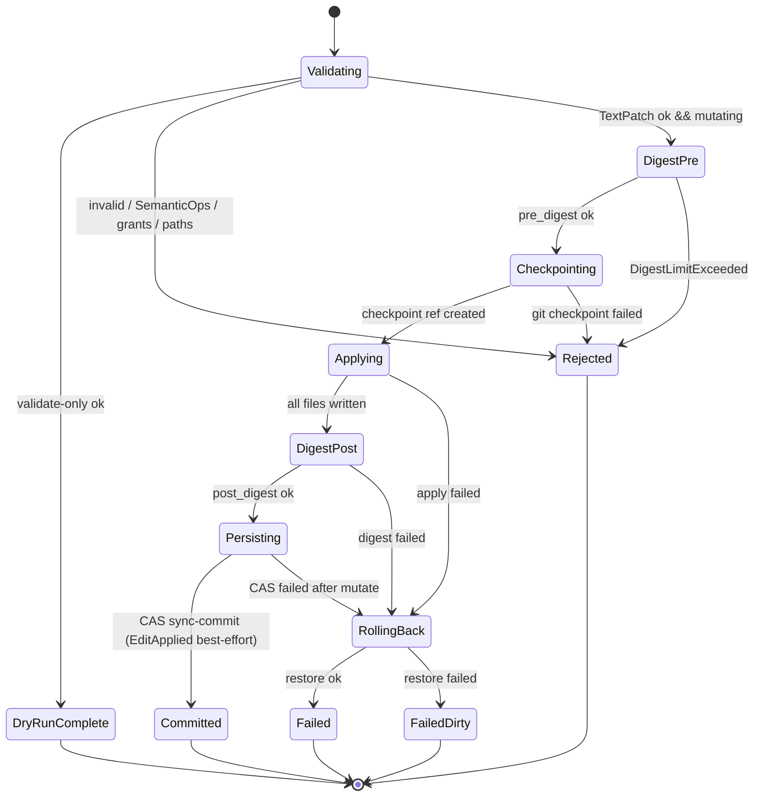
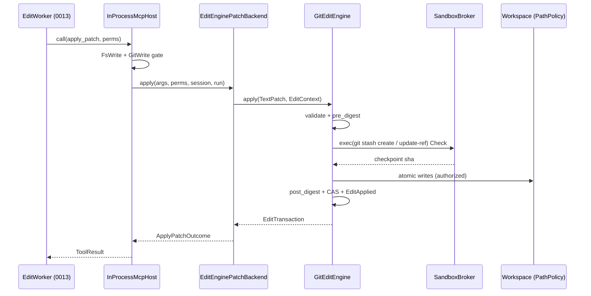
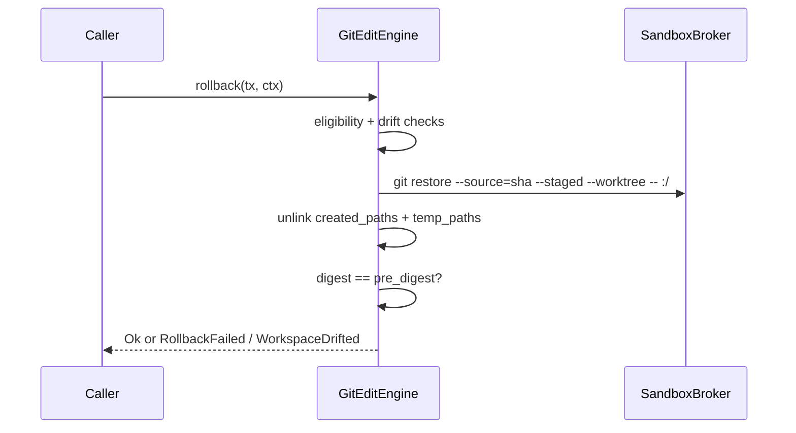

# RFC-0008: EditEngine (TextPatch + Git Checkpoint)

| Field | Value |
| --- | --- |
| **Status** | Draft |
| **Author** | arkadianet |
| **Architecture** | Alloy Architecture V2 (**frozen**) — do not redesign |
| **Depends on** | [RFC-0001](./RFC-0001-alloy-runtime.md) (merged), [RFC-0005](./RFC-0005-sandbox-broker.md) (merged), [RFC-0006](./RFC-0006-mcp-host-builtins.md) (merged) |
| **Effort** | 4–6 person-days |
| **Related RFCs** | [0002](./RFC-0002-storage-artifacts-session-events.md) CAS + session events · [0003](./RFC-0003-session-manager-run-controller.md) session/run ids · [0004](./RFC-0004-observability-cost-metering.md) retention defaults · [0009](./RFC-0009-task-dag-templates-planner.md) Edit node contract · [0010](./RFC-0010-scheduler-runtime-adapters.md) scheduler does **not** call EditEngine · [0013](./RFC-0013-capability-registry-workers.md) EditWorker → `apply_patch` · [0015](./RFC-0015-cli-profiles-config.md) freeform FS policy |
| **Product** | Alloy — AI Engineering Runtime |
| **Supersedes** | Draft outline of this filename (expanded to implementation grade) |
| **Revision** | Implementation-grade draft addressing principal review (permissions, checkpoint correctness, recovery, error mapping) |

**Mental model (V2 §13 / §3.5 / ADR F-01 / F-14 / F-24):** Alloy has **one write stack**. `EditEngine` is the only component that mutates a workspace under product policy. Agents reach it exclusively through the merged MCP seam `apply_patch` → `PatchApplyBackend`. MVP implements `EditRequest::TextPatch` (unified diff / `PatchSet`) plus **git-only** checkpoints. `SemanticEditOp` variants exist for serde stability and **fail closed**. No OverlayFS. No freeform filesystem writes in this RFC.

**Authority order (highest → lowest):** current `main` source → merged RFCs 0001–0007, 0009, 0016 → Architecture V2 → this draft → roadmaps. Never reshape a merged public API solely to match an older V2 sketch. `ApplyPatchArgs`, `ApplyPatchOutcome`, `PatchApplyError` base variants, `TransactionId`, and `CheckpointId` are **normative and present on `main`**. This RFC defines new `EditEngine` APIs and makes **explicit additive amendments** to RFC-0006 only where §3.8 requires them.

---

## 1. Overview

### 1.1 Purpose

Ship the MVP **EditEngine** that closes Alloy’s first workspace write path:

1. **`EditEngine` trait** — `validate` / `apply` / `rollback` with transactional semantics and explicit `EditContext` (permissions + attribution).
2. **`EditRequest::TextPatch`** — accept unified diff string or structured `PatchSet`; validate; apply atomically relative to a git checkpoint.
3. **Git checkpoint backend** — `CheckpointId` (UUID, already on `main`) names a git ref under `refs/alloy/checkpoints/<uuid>`; sole MVP checkpoint backend (ADR F-24).
4. **Wire `apply_patch`** — replace `StubPatchApplyBackend` behaviour by injecting `EditEnginePatchBackend` implementing the merged `PatchApplyBackend` seam (RFC-0006 §3.7), with the additive amendments in §3.8.
5. **`SemanticEditOp` envelope** — present; every variant returns `EditError::UnsupportedOp` in MVP.
6. **Workspace digests** — `pre` / `post` digests on every mutating apply; recorded on the transaction and in `SessionEventType::EditApplied`.
7. **Auditability** — session events + CAS patch artifacts (event payload keeps metadata + hashes per RFC-0004; CAS stores the patch body for reconstruction).

### 1.2 Problem Statement

Nine RFCs and ~40k lines of source exist on `main`, and **nothing yet writes to a workspace**. RFC-0006 advertises `apply_patch` but injects `StubPatchApplyBackend`, which returns `PatchApplyError::Unsupported("edit_engine_unwired: apply_patch requires RFC-0008 EditEngine")` for every input. Milestone **M5** exit gate requires *“Patch+checkpoint + template DAG + session resume green → M6 scheduler.”* Template DAG and session resume are done; this RFC is the missing third. Without it the MCP tool bus advertises a capability it cannot deliver, and V2’s single write stack does not exist in code.

### 1.3 Scope

| In scope | Detail |
| --- | --- |
| `EditEngine` trait | `validate` / `apply` / `rollback`; `Send + Sync`; async; `EditContext` |
| TextPatch path | Unified diff parse + `PatchSet`; validation; apply; digests |
| Git checkpoint | Ref backend; create before mutate; restore on rollback / abandon |
| MCP wiring | `EditEnginePatchBackend: PatchApplyBackend`; default injection replaces stub |
| Fine-grained `FsWrite` | Per-path glob match against extracted patch paths (RFC-0006 §5.5 forward pointer) |
| `GitWrite` gate | Required for non-`dry_run` applies and rollback |
| `SemanticEditOp` | Enum present; all variants → `UnsupportedOp` |
| Observability | Typed `EditAppliedPayload`; tracing spans; CAS patch artifact |
| Tests | Unit + cross-subsystem MCP→EditEngine→SQLite (§11) |

### 1.4 Non-goals

| Deferred item | Owner |
| --- | --- |
| `SemanticEditOp` lowering / RA-backed `RenameType` | Future extension / M3 (V2 §13) |
| `SplitCrate` / `ExtractTrait` / `MoveModule` implementations | Deferred (V2 kill list / §13) |
| OverlayFS / snapshot bundles | V2 kill list — **no product path** |
| Compile verification after edit | **RFC-0010** VerifyCompile adapter |
| Freeform filesystem writes outside EditEngine | **RFC-0015** profiles; higher approval only |
| Scheduler invocation / node dispatch | **RFC-0010** |
| Capability worker logic that *produces* patches | **RFC-0013** |
| LLM planner / model completion | **RFC-0007** / **RFC-0013** |
| Sixth crate / Postgres / writing `.env` | Forbidden |

### 1.5 Day-1 MVP (normative)

1. The cross-subsystem integration suite (§11.3) MUST construct `InProcessMcpHost` with `EditEnginePatchBackend` (not stub) and prove file mutation + checkpoint + `EditApplied` in SQLite. Production composition roots land with RFC-0015 / host wiring; until then the integration test is the normative reference constructor (§3.10).
2. `EditEngine::apply(EditRequest::TextPatch { .. }, ctx)` MUST: validate → verify repo/jail invariants → compute `pre_digest` → create git checkpoint → apply patch under PathPolicy → compute `post_digest` → CAS put → sync-commit (`TxRecord=Committed`, `abandoned=None`) → **attempt** `EditApplied` when `session_id` is `Some` → return `EditTransaction` with `checkpoint_id = Some(...)`, `post_digest = Some(...)`, `state = Committed`. After the commit point, EditApplied failure MUST NOT roll back and MUST still return `Ok(EditTransaction)` (§5.1).
3. `EditEngine::apply(EditRequest::SemanticOps { .. }, ctx)` MUST return `Err(EditError::UnsupportedOp { op })` for **every** variant and every non-empty ops list, with `op` equal to the serde tag string (§5.10). Empty ops list MUST return `Err(EditError::InvalidRequest("semantic_ops empty"))`.
4. `ApplyPatchArgs.dry_run == true` MUST call `EditEngine::validate` only: it MUST NOT mutate the workspace, MUST NOT create a checkpoint, MUST NOT write CAS patch bytes as a committed edit, MUST NOT emit `EditApplied`, and MUST return `transaction_id: None`.
5. A partially-applied patch MUST NOT be observable as a committed edit. On apply failure after checkpoint, the engine MUST restore the checkpoint before returning `Err`. If restore fails for a **non-expiry** reason, return `Err(EditError::RollbackFailed { tx, checkpoint_id, detail })` and leave the checkpoint ref intact. If restore fails because the token expired (broker or pre-restore expiry check), return `Err(EditError::TokenExpired)` **after** recording FailedDirty state (`TxRecord` remains `Open`, `abandoned` set, ref retained). `TokenExpired` is the public signal; recovery is reconcile under a fresh token (§5.2 / AC 39). Callers MUST NOT need private `TxRecord` fields to know recovery is required — a mid-apply `TokenExpired` after mutation always implies FailedDirty.
6. `rollback(tx, ctx)` MUST restore eligible transactions only (§5.11). It MUST be idempotent for `state == RolledBack` when the workspace digest still equals `pre_digest`.
7. Every validation rejection in §5.4 MUST map to exactly one `EditError` variant. At the MCP boundary, §8.3 MAY collapse several `EditError` variants onto one `PatchApplyError` variant; that collapse is explicit and total.
8. `ApplyPatchOutcome.message` MUST NEVER contain raw patch bodies or absolute paths (honour RFC-0006 §5.9; engine produces jail-relative, length-capped summaries). Engine messages MUST NEVER equal `EDIT_ENGINE_UNWIRED_MESSAGE`.
9. Alloy MUST NEVER write `.env`. PathPolicy deny-globs apply to every write target. Rollback MUST NOT delete or overwrite deny-glob paths (including untracked `.env`) — see §5.6 / §5.11.
10. No OverlayFS. No new crate. `alloy-runtime` remains `#![forbid(unsafe_code)]`; `alloy-tools` remains `#![deny(unsafe_code)]` (as on `main`).

---

## 2. Architecture Integration

### 2.1 Relationship to Architecture V2

| V2 reference | Application |
| --- | --- |
| §3.5 / ADR F-01 | Text patches are first-class MVP serialization behind transactional `EditEngine`; freeform FS outside EditEngine requires higher approval (out of scope) |
| §13 EditEngine | Trait, envelope, git checkpoint, SemanticOps fail closed — this RFC |
| §13 / ADR F-14 | No dual edit server/crate split; single stack in-process |
| §13 / ADR F-24 | MVP checkpoint backend = **git only**; no OverlayFS / snapshot bundles |
| §14.3 | Workspace jail; deny `.env` / secrets; never replace user `.env` |
| §12.3 | `FsWrite` / `GitWrite` grants — consumed here for apply + checkpoint |
| §6.5 repair sequence | `model → patch → apply → check`; **check** owned by RFC-0010 |
| Appendix A | `edit_applied` session event type already on `main` as `SessionEventType::EditApplied` |

### 2.2 Relationship to RFC-0001

Authoritative for: `TransactionId`, `CheckpointId`, `Digest`, `PermissionToken` / `Grant`, crate `unsafe` lint attributes as on `main`, five-crate map, session event envelope types.

**This RFC does not redefine IDs.** `CheckpointId` remains a UUID. The git ref name is **derived** as `refs/alloy/checkpoints/<CheckpointId>` (see §5.6). V2’s comment “git ref in MVP” means the *backend* is git, not that the Rust type becomes a string.

### 2.3 Relationship to RFC-0005

Authoritative for: `SandboxBroker`, `SandboxExecRequest`, `ExecClass::{Check,Test}`, `PathPolicy`, `PathAccess`, deny globs, jail membership.

**This RFC:**

* Uses `PathPolicy` with `PathAccess::Write` for every file mutation and path authorization (host-side, same pattern as `fs_read` reads).
* Runs **git checkpoint / restore** via `SandboxBroker::exec` under **`ExecClass::Check`** (no new `ExecClass` variant — see §2.8).
* Does **not** route file content writes through a sandboxed child; Alloy writes bytes itself after PathPolicy authorization (see §2.8 rationale).
* Requires `PathPolicy` to expose deny-glob checking to the edit module via an additive `pub(crate)` accessor (§4.5).

### 2.4 Relationship to RFC-0006

Authoritative for: `InProcessMcpHost`, `PatchApplyBackend`, `ApplyPatchArgs`, `ApplyPatchOutcome`, `PatchApplyError`, `StubPatchApplyBackend`, host output boundary (§5.9), `authorize_fs_write` stub behaviour, `PermissionDenial`, `McpError`.

**This RFC completes the stub contract** (RFC-0006 §3.7.2): implement `PatchApplyBackend` as an adapter over `EditEngine`.

**Additive amendments to RFC-0006** (normative here; full text in §3.8):

1. `PatchApplyBackend::apply` gains `perms: &PermissionToken` and attribution (`session`, `run`).
2. Additive `PatchApplyError::PermissionDenied(PermissionDenial)`.
3. `apply_patch` prepare requires `Grant::GitWrite` when `dry_run == false`.
4. Fine-grained `FsWrite(Glob)` matching via shared `authz` helpers.
5. Backend permission denials elevate to `Err(McpError::PermissionDenied)` (so DecisionLog `denied=true`).
6. Effective patch size ceiling is the existing `MAX_ARGUMENT_BYTES` (64 KiB) for the whole arguments object — this RFC does **not** raise it.

### 2.5 Relationship to RFC-0010 and RFC-0013 (single write stack)

**Normative invocation rule (binding for parallel RFC authors):**

| Caller | MAY call | MUST NOT call |
| --- | --- | --- |
| **RFC-0010 LinearScheduler** | `CapabilityExecutor::execute` for `NodeKind::Edit` | `EditEngine`, `PatchApplyBackend`, `apply_patch` |
| **RFC-0013 EditWorker** | `ToolHandle::call("apply_patch", …)` under run grants | `EditEngine` directly; raw `std::fs::write`; any second write API |
| **MCP host `apply_patch`** | Injected `PatchApplyBackend` (= EditEngine adapter) | Bypass EditEngine |
| **Tests / operator recovery / CLI** | `EditEngine::{validate,apply,rollback}` on the **same** engine instance | A parallel mutate path |

**Why this is one write stack, not two:**

* The **only** component that mutates workspace files under Alloy policy is `GitEditEngine` (via `EditEngine`).
* The **only** agent-facing entry is MCP `apply_patch` → `EditEnginePatchBackend` → `EditEngine`.
* Direct `EditEngine::{apply,rollback}` from tests/CLI is the **same** stack without MCP mediation — not a second product write path.
* Rollback is **not** an MCP tool in MVP; only `apply_patch` is exposed on the bus. Operator rollback uses the engine API (CLI/tests).
* RFC-0010’s scheduler never touches the filesystem for Edit nodes; RFC-0013 workers produce patches and call the tool.

Merged code supporting this:

* `crates/alloy-tools/src/mcp/patch.rs` — `PatchApplyBackend` seam; stub message names RFC-0008.
* `crates/alloy-tools/src/mcp/builtins/apply_patch.rs` — host does not interpret `patch`; backend owns format.
* Architecture V2 §12.2 / worker table — EditWorker tools: `apply_patch`, `fs_read`.
* Architecture V2 §13 — “not a second write stack.”

### 2.6 Already implemented | Added by RFC-0008 | Deferred

| Category | Contents |
| --- | --- |
| **Already implemented** | `TransactionId`, `CheckpointId`, `Digest`, `Grant::{FsWrite,GitWrite,Exec}`, `SessionEventType::EditApplied`, `ArtifactStore` / `ArtifactKind::Patch`, `PathPolicy`, `SandboxBroker`, `ExecClass::{Check,Test}`, `PatchApplyBackend` + stub + host sanitize, `authorize_fs_write` (≥1 FsWrite), DecisionLog / ToolCall recording for MCP calls |
| **Added by RFC-0008** | `EditEngine` trait + `EditContext` + `EditValidation`; `EditRequest`; `PatchSet` / `FilePatch` / `Hunk`; `SemanticEditOp`; `EditTransaction` + `TxState`; `WorkspaceDigest`; `EditError`; `EditAppliedPayload`; `GitEditEngine`; `EditEnginePatchBackend`; git checkpoint/restore; fine-grained FsWrite helpers; GitWrite prepare gate; `PatchApplyError::PermissionDenied`; digest computation; abandon reconcile; tests |
| **Deferred** | SemanticOps lowering (future); OverlayFS (forbidden); compile gate (0010); workers producing patches (0013); freeform FS (0015); new `ExecClass` (not required — §2.8) |

### 2.7 What RFC-0010 and RFC-0013 MAY rely on

| Consumer | MAY rely on | MUST NOT invent |
| --- | --- | --- |
| **RFC-0010** | Edit nodes do not need EditEngine in the scheduler; verify adapters remain MCP `cargo_*` only; §8.3 retryability column | Scheduler→EditEngine call; second write API; OverlayFS rollback |
| **RFC-0013** | `apply_patch` works end-to-end; TextPatch JSON shapes; `UnsupportedOp` for SemanticOps; `files_touched` / `transaction_id` in tool result | Direct EditEngine on `CapabilityContext`; raw FS writes; an MCP rollback tool |

### 2.8 Mandatory decision: git, sandbox, and `ExecClass`

| Question | Normative answer |
| --- | --- |
| Does file mutation go through `SandboxBroker`? | **No.** Alloy writes file bytes on the host after `PathPolicy::authorize(..., PathAccess::Write)`. Same host-side pattern as `fs_read` (RFC-0006 §5.8). |
| Does git checkpoint run inside the sandbox? | **Yes.** `git` argv runs via `SandboxBroker::exec` with `class: ExecClass::Check`. |
| New `ExecClass` variant? | **No.** Reuse `Check`. Adding `ExecClass::Git` would amend a merged RFC-0005 type and is not required: Check already selects the light Landlock/Seatbelt backend. |
| What does `Grant::GitWrite` gate? | Creating or restoring a git checkpoint (non-`dry_run` apply, abandon reconcile, and any `rollback`). Checked in `apply_patch` prepare (§3.8) **and** inside `GitEditEngine` before every git exec. |
| What does `Grant::Exec` gate for git? | Every git argv must match an `ExecAllow` on the **same** caller token used for the apply/rollback. Profiles that grant `GitWrite` MUST also grant `Exec` for `git` (RFC-0015; tests mint both). Preflight (§5.6.2) verifies **all** argv shapes used by create and restore before the first mutation. |
| Repo root vs jail | `git rev-parse --show-toplevel` (canonicalized) MUST equal `path_policy.jail()`. Nested repos, linked worktrees, or inherited `GIT_DIR`/`GIT_WORK_TREE` that violate this → `EditError::Environment("repo toplevel != jail")`. Broker env scrubbing MUST leave git without attacker-controlled `GIT_DIR`/`GIT_WORK_TREE` (rely on RFC-0005 scrub; EditEngine MUST NOT set them). |
| Tracked deny-glob paths | Before any git exec: if `git ls-files` lists a path matching deny-globs → `EditError::TrackedDeniedPath` (fail closed). Prevents Landlock `/dev/null` binds from capturing empty secret files into checkpoints. |
| Untracked files | See §5.6.1 — modifying untracked paths is rejected; restore never broad-cleans. |
| What are “sandbox constraints” for M5? | (1) PathPolicy jail + deny-globs on every touched path; (2) FsWrite glob coverage; (3) GitWrite present for mutating ops; (4) git child isolated under Check backend with scrubbed env / jail cwd; (5) repo toplevel == jail. |

### 2.9 Dependency boundaries

```text
RFC-0013 EditWorker
        │  ToolHandle::call("apply_patch")
        ▼
alloy-tools::mcp::InProcessMcpHost
        │  PatchApplyBackend::apply(args, perms, session, run)
        ▼
alloy-tools::edit::EditEnginePatchBackend
        │
        ▼
alloy-tools::edit::GitEditEngine  ──implements──►  alloy_runtime::edit::EditEngine
        │                           uses
        ├─ PathPolicy (Write + deny accessor)
        ├─ SandboxBroker (git, ExecClass::Check)
        ├─ ArtifactStore (patch bytes, ArtifactKind::Patch)
        └─ EventSink (EditApplied; append-only)
```

* `alloy-runtime` defines the trait + IR types (`edit` module). **No** dependency on `alloy-tools`.
* `alloy-tools` implements the engine + MCP adapter. Existing `alloy-tools → alloy-runtime` edge unchanged.
* **No sixth crate.** Dependency graph stays acyclic within ≤5 crates.

### 2.10 M5 exit gate

This RFC closes the *Patch+checkpoint* third of M5 when §13 acceptance criteria pass. Template DAG (0009) and session resume (0003) are separate; together they satisfy *“Patch+checkpoint + template DAG + session resume green → M6 scheduler.”*

---

## 3. Public Rust API

New items live under `alloy_runtime::edit` (types + trait) and `alloy_tools::edit` (implementation + MCP adapter). Merged MCP patch types remain in `alloy_tools::mcp::patch`. `alloy-runtime` is `#![deny(missing_docs)]`.

### 3.1 Reused types (normative — unchanged fields)

| Type | Source | Notes |
| --- | --- | --- |
| `TransactionId`, `CheckpointId` | `types::ids` | UUID newtypes; **do not redefine** |
| `Digest` | `types::ids` | SHA-256 hex via `Digest::sha256` |
| `ArtifactId` | `types::ids` | CAS handle on transactions / events |
| `Grant`, `Glob`, `ExecAllow`, `PermissionToken` | `types::permission` | FsWrite / GitWrite / Exec; `PermissionToken.run_id` is authoritative for run attribution when `EditContext.run_id` is `None` |
| `SessionId`, `RunId` | `types::ids` | Attribution on events / artifacts |
| `SessionEventType::EditApplied` | `events` | Already present |
| `EventSink`, `NewSessionEvent` | `events` | Append-only |
| `ArtifactStore`, `ArtifactPut`, `ArtifactKind::Patch` | `storage` | CAS retains bytes; event payloads do not embed bodies |
| `ApplyPatchArgs`, `ApplyPatchOutcome` | `alloy-tools::mcp::patch` | Field shapes unchanged |
| `PatchApplyError` base variants | same | `Unsupported`, `InvalidPatch`, `Conflict`, `Io`, `Internal` unchanged; additive variant in §3.8 |
| `StubPatchApplyBackend` | same | Remains for explicit test injection |
| `PermissionDenial`, `McpError` | `alloy-tools::mcp::error` | Permission elevation path |
| `PathPolicy`, `PathAccess`, `SandboxBroker`, `SandboxExecRequest`, `ExecClass`, `SandboxError`, `DenialReason` | `alloy-tools::sandbox` | Constraints |
| `InProcessMcpHost::new(..., patch_backend, ...)` | `alloy-tools::mcp::host` | Injection point unchanged |

### 3.2 `EditRequest` / `SemanticEditOp` / `PatchSet`

```rust
// crates/alloy-runtime/src/edit/types.rs
use serde::{Deserialize, Serialize};

/// Workspace edit envelope (Architecture V2 §13.2).
#[derive(Debug, Clone, PartialEq, Eq, Serialize, Deserialize)]
#[serde(tag = "kind", rename_all = "snake_case")]
pub enum EditRequest {
    /// Unified-diff / structured text patch (MVP path).
    TextPatch { patch: PatchSet },
    /// Semantic ops envelope — MVP fail closed (§5.10).
    SemanticOps { ops: Vec<SemanticEditOp> },
}

/// Structured patch set. Paths are jail-relative (`/`-separated, no leading `/`, no `..`).
#[derive(Debug, Clone, PartialEq, Eq, Serialize, Deserialize)]
pub struct PatchSet {
    /// Ordered file patches. Apply order is vector order.
    pub files: Vec<FilePatch>,
}

/// One file operation inside a [`PatchSet`].
#[derive(Debug, Clone, PartialEq, Eq, Serialize, Deserialize)]
#[serde(tag = "action", rename_all = "snake_case")]
pub enum FilePatch {
    /// Modify an existing tracked file.
    Modify {
        path: String,
        hunks: Vec<Hunk>,
    },
    /// Create a new file. Parent directories are created as needed (§5.9.3).
    /// Hunk shape: exactly one hunk with `old_start == 0`, `old_lines == 0`, and only
    /// `+`-prefixed lines (empty file ⇒ one hunk with empty `lines` and `eof_newline`
    /// as desired). See V27.
    Create {
        path: String,
        hunks: Vec<Hunk>,
    },
    /// Delete an existing file. **Path-only on the wire and in CAS** (§5.3.2): the
    /// `serde(skip)` field below never serializes and always deserializes empty, so a
    /// structured JSON `Delete` is exactly `{"action":"delete","path":...}` (V5).
    Delete {
        path: String,
        /// Full-file deletion hunks retained from a unified-diff parse, kept only as
        /// local proof that the caller saw the file's current bytes. Empty for
        /// structured JSON. When non-empty, `apply`/`validate` require the hunks to
        /// reduce the file to zero bytes (V9); when empty, only the shape checks
        /// (exists, regular file, tracked) run and the file need not be UTF-8.
        #[serde(skip)]
        validation_hunks: Vec<Hunk>,
    },
}

impl FilePatch {
    /// Jail-relative path for this operation.
    pub fn path(&self) -> &str {
        match self {
            Self::Modify { path, .. } | Self::Create { path, .. } | Self::Delete { path, .. } => {
                path
            }
        }
    }
}

/// One unified-diff hunk.
#[derive(Debug, Clone, PartialEq, Eq, Serialize, Deserialize)]
pub struct Hunk {
    /// 1-based start line in the current file (0 only for create-from-empty old side).
    pub old_start: u32,
    /// Line count on the old side (context + deletions).
    pub old_lines: u32,
    /// 1-based start line in the new file.
    pub new_start: u32,
    /// Line count on the new side (context + insertions).
    pub new_lines: u32,
    /// Unified diff lines including leading ' ', '-', '+' only (no embedded NUL or raw `\n`).
    pub lines: Vec<String>,
    /// Whether the **new** file ends with `\n` after this hunk is applied (when this is
    /// the last hunk that contributes new-side lines). See §5.3.1 / Appendix D for how
    /// unified-diff `\ No newline at end of file` markers bind to old vs new sides.
    /// Default `true` for structured JSON patches that omit the field.
    #[serde(default = "default_true")]
    pub eof_newline: bool,
    /// Whether the **old** file must lack a trailing `\n` at EOF: set by a
    /// `\ No newline at end of file` marker following a `-` or context line (§5.3.1 /
    /// Appendix D). Purely an assertion about the current file — a mismatch is V9
    /// `ContextMismatch`. Default `false`, and omitted from the canonical CAS JSON when
    /// `false` so structured patches that never set it keep their existing bytes.
    #[serde(default, skip_serializing_if = "is_false")]
    pub old_eof_no_newline: bool,
}

// In types.rs (private):
fn default_true() -> bool { true }
fn is_false(value: &bool) -> bool { !*value }

/// Semantic edit ops (V2 §13). Serde-stable; MVP returns UnsupportedOp for all.
#[derive(Debug, Clone, PartialEq, Eq, Serialize, Deserialize)]
#[serde(tag = "op", rename_all = "snake_case")]
pub enum SemanticEditOp {
    RenameType {
        from_path: String,
        to_name: String,
        update_references: bool,
    },
    UpdateImports {
        file: String,
        add: Vec<String>,
        remove: Vec<String>,
    },
    ReplaceBody {
        item_path: String,
        new_body: String,
    },
    InsertImpl {
        file: String,
        type_path: String,
        body: String,
    },
    AddMethod {
        item_path: String,
        method_source: String,
    },
    MoveModule {
        from_path: String,
        to_path: String,
    },
    ExtractTrait {
        type_path: String,
        trait_name: String,
        method_names: Vec<String>,
    },
    SplitCrate {
        source_crate: String,
        new_crate: String,
        move_paths: Vec<String>,
    },
    AddField {
        type_path: String,
        field_source: String,
    },
}

impl SemanticEditOp {
    /// Stable serde tag string for this variant (also used in `UnsupportedOp.op`).
    pub fn op_tag(&self) -> &'static str {
        match self {
            Self::RenameType { .. } => "rename_type",
            Self::UpdateImports { .. } => "update_imports",
            Self::ReplaceBody { .. } => "replace_body",
            Self::InsertImpl { .. } => "insert_impl",
            Self::AddMethod { .. } => "add_method",
            Self::MoveModule { .. } => "move_module",
            Self::ExtractTrait { .. } => "extract_trait",
            Self::SplitCrate { .. } => "split_crate",
            Self::AddField { .. } => "add_field",
        }
    }
}
```

**Serde stability (normative):**

* `SemanticEditOp` / `FilePatch` / `EditRequest` use closed tagged enums. Unknown tags fail deserialize. No `#[serde(other)]`.
* Future RFCs implementing a SemanticEditOp variant MUST NOT rename existing tags or fields.
* Unknown fields on structs (`Hunk`, `PatchSet`, `WorkspaceDigest`, payloads): `deny_unknown_fields` is **not** required in MVP; unknown fields are ignored by serde default. Callers MUST NOT rely on unknown fields.

**Caps (normative):**

| Cap | Limit | Error |
| --- | --- | --- |
| Files in one PatchSet | 256 | `InvalidPatch("too many files")` |
| Hunks per file | 1024 | `InvalidPatch("too many hunks")` |
| Lines per hunk | 10_000 | `InvalidPatch("hunk too large")` |
| Path length | `MAX_ARG_STRING_BYTES` (4096) | `PathDenied` |
| Whole MCP arguments object | `MAX_ARGUMENT_BYTES` (64 KiB) | Host `InvalidArguments` **before** backend (effective ceiling) |

### 3.3 `WorkspaceDigest`

```rust
/// Digest over the authorized workspace snapshot (§5.8).
#[derive(Debug, Clone, PartialEq, Eq, Serialize, Deserialize)]
pub struct WorkspaceDigest {
    /// SHA-256 hex of the canonical tree encoding.
    pub tree: Digest,
    /// Number of files included in the tree encoding.
    pub file_count: u64,
    /// Total bytes hashed (file contents only).
    pub total_bytes: u64,
}
```

### 3.4 `EditTransaction` and `TxState`

```rust
/// Lifecycle of a recorded edit transaction.
#[derive(Debug, Clone, Copy, PartialEq, Eq, Serialize, Deserialize)]
#[serde(rename_all = "snake_case")]
pub enum TxState {
    /// Checkpoint created; mutate not yet committed.
    Open,
    /// Mutate + CAS committed (`EditApplied` attempted when session present; may be absent on audit gap).
    Committed,
    /// Rollback restored pre-image.
    RolledBack,
}

/// Committed or open edit transaction returned by [`EditEngine::apply`].
///
/// In-memory / API return value. Persistence and session events MUST NOT store
/// raw patch bodies — only ids, digests, and hashes (§5.7 / §9.3).
#[derive(Debug, Clone, PartialEq, Eq, Serialize, Deserialize)]
pub struct EditTransaction {
    pub id: TransactionId,
    pub state: TxState,
    pub request_kind: EditRequestKind,
    pub pre_digest: WorkspaceDigest,
    /// Always `Some` when `state == Committed`. `None` while `Open` (should not
    /// normally be returned to callers — `apply` returns only after Commit or Err).
    pub post_digest: Option<WorkspaceDigest>,
    /// Always `Some` after checkpoint creation on the mutating path.
    pub checkpoint_id: Option<CheckpointId>,
    /// Git commit SHA recorded at checkpoint (40 lowercase hex).
    pub checkpoint_sha: Option<String>,
    /// Jail-relative paths touched (sorted, deduped).
    pub files_touched: Vec<String>,
    /// Subset of `files_touched` that were created by this tx (for rollback unlink).
    pub created_paths: Vec<String>,
    /// CAS artifact id for the canonical PatchSet JSON, when stored (Committed).
    pub patch_artifact_id: Option<ArtifactId>,
    /// `Digest::sha256` of the canonical PatchSet JSON bytes.
    pub patch_content_hash: Option<Digest>,
    pub created_at: Timestamp,
}

/// Wire/request kind without embedding bodies.
#[derive(Debug, Clone, Copy, PartialEq, Eq, Serialize, Deserialize)]
#[serde(rename_all = "snake_case")]
pub enum EditRequestKind {
    TextPatch,
    SemanticOps,
}
```

**Normative invariants on successful `apply` return:** `state == Committed`, `post_digest.is_some()`, `checkpoint_id.is_some()`, `checkpoint_sha.is_some()`, `patch_artifact_id.is_some()`, `patch_content_hash.is_some()`, `request_kind == TextPatch`.

### 3.5 `EditContext` / `EditEngine` trait

```rust
use async_trait::async_trait;

/// Per-call attribution and authorization for EditEngine.
#[derive(Debug, Clone, PartialEq, Eq)]
pub struct EditContext {
    /// Session for EditApplied; if `None`, mutating apply still proceeds but
    /// skips EditApplied emission (mirrors DecisionLog skip-when-no-session).
    pub session_id: Option<SessionId>,
    /// Run attribution. If `None`, use `perms.run_id` when emitting events.
    pub run_id: Option<RunId>,
    /// Caller grants for this invocation.
    pub perms: PermissionToken,
}

/// Result of a validation-only (dry-run) pass — never allocated a TransactionId.
#[derive(Debug, Clone, PartialEq, Eq, Serialize, Deserialize)]
pub struct EditValidation {
    /// Jail-relative paths that would be touched (sorted, deduped).
    pub files_touched: Vec<String>,
}

/// Transactional workspace edit apply + rollback.
///
/// Implementors MUST be `Send + Sync`. Methods are async and MAY perform filesystem
/// and sandboxed git I/O. The trait object is shared as `Arc<dyn EditEngine>`.
///
/// **Permissions are explicit arguments** via `EditContext`. There is no ambient
/// token slot, no `task_local!`, and no `apply_with_perms` twin API.
#[async_trait]
pub trait EditEngine: Send + Sync {
    /// Validate `req` without mutating the workspace or creating a checkpoint.
    ///
    /// MUST enforce the **validate** column of §5.5.1 (V1–V11, V8b–V8c, V15, V18–V19, V22–V23, V26–V28, V30).
    /// MUST NOT enforce V12–V14, V16–V17, V20–V21, V24–V25, V29 and MUST NOT exec git.
    /// MUST NOT write files, refs, CAS edit artifacts, or session events.
    /// MUST NOT run abandon reconcile (that is `apply`/`rollback` only — §6.4).
    /// MUST take the same write lock as `apply`/`rollback` for single-writer honesty.
    async fn validate(
        &self,
        req: EditRequest,
        ctx: &EditContext,
    ) -> Result<EditValidation, EditError>;

    /// Validate and apply `req`. On success returns a committed transaction.
    async fn apply(
        &self,
        req: EditRequest,
        ctx: &EditContext,
    ) -> Result<EditTransaction, EditError>;

    /// Restore the checkpoint associated with `tx` when eligible (§5.11).
    async fn rollback(
        &self,
        tx: TransactionId,
        ctx: &EditContext,
    ) -> Result<(), EditError>;
}
```

**Visibility:** `pub` in `alloy_runtime::edit`.  
**Lifecycle:** Engine is process-lifetime and **session-agnostic**; attribution comes from `EditContext` per call. One engine serves many sessions through one host.

### 3.6 `EditError`

```rust
use thiserror::Error;

/// EditEngine failure taxonomy (§8).
#[derive(Debug, Error)]
#[non_exhaustive]
pub enum EditError {
    #[error("unsupported op: {op}")]
    UnsupportedOp { op: String },

    #[error("invalid request: {0}")]
    InvalidRequest(String),

    #[error("invalid patch: {0}")]
    InvalidPatch(String),

    #[error("empty patch")]
    EmptyPatch,

    #[error("path denied: {path}: {reason}")]
    PathDenied { path: String, reason: String },

    #[error("path not covered by FsWrite grant: {path}")]
    PathNotCovered { path: String },

    #[error("missing grant: {0}")]
    MissingGrant(String),

    #[error("conflict: {0}")]
    Conflict(String),

    #[error("context mismatch: {path}: {detail}")]
    ContextMismatch { path: String, detail: String },

    #[error("overlapping hunks: {path}")]
    OverlappingHunks { path: String },

    #[error("untracked path in patch: {path}")]
    UntrackedPath { path: String },

    #[error("tracked deny-glob path present: {path}")]
    TrackedDeniedPath { path: String },

    #[error("checkpoint failed: {0}")]
    CheckpointFailed(String),

    #[error("rollback failed: tx={tx} checkpoint={checkpoint_id}: {detail}")]
    RollbackFailed {
        tx: TransactionId,
        checkpoint_id: CheckpointId,
        detail: String,
    },

    #[error("unknown transaction: {0}")]
    UnknownTransaction(TransactionId),

    #[error("transaction not eligible for rollback: {tx}: state={state:?}: {reason}")]
    RollbackNotEligible {
        tx: TransactionId,
        state: TxState,
        /// Static reason: `"not newest"` | `"not abandon target"`.
        reason: &'static str,
    },

    #[error("workspace drifted since transaction: {0}")]
    WorkspaceDrifted(TransactionId),

    #[error("digest limit exceeded: {0}")]
    DigestLimitExceeded(String),

    #[error("io: {0}")]
    Io(String),

    #[error("git: {0}")]
    Git(String),

    /// Permanent operator/environment misconfiguration (not retryable).
    /// Examples: git < 2.23, unborn HEAD, jail≠toplevel, sandbox backend unavailable,
    /// SHA-256 object format.
    #[error("environment: {0}")]
    Environment(String),

    #[error("storage: {0}")]
    Storage(String),

    #[error("event sink: {0}")]
    Event(String),

    #[error("busy: edit already in progress")]
    Busy,

    #[error("cancelled")]
    Cancelled,

    #[error("token expired")]
    TokenExpired,

    #[error("internal: {0}")]
    Internal(String),
}
```

### 3.7 `GitEditEngine` / `EditEnginePatchBackend` (in `alloy-tools`)

```rust
// crates/alloy-tools/src/edit/engine.rs

/// Concrete MVP EditEngine: PathPolicy writes + sandboxed git checkpoints.
pub struct GitEditEngine { /* private fields — §4.3 */ }

pub struct GitEditEngineConfig {
    pub broker: Arc<dyn SandboxBroker>,
    pub path_policy: PathPolicy,
    /// Same trusted PATH roots the MCP host builds from `OperatorHomes`
    /// (`trusted_path_dirs` ∪ `trusted_roots`). Required for `match_exec_grant`.
    pub trusted_path: Vec<PathBuf>,
    pub artifacts: Arc<dyn ArtifactStore>,
    pub events: Arc<dyn EventSink>,
    /// Soft cap on files walked for WorkspaceDigest.
    pub max_digest_files: u64,
    /// Soft cap on total bytes hashed for WorkspaceDigest.
    pub max_digest_bytes: u64,
}

impl GitEditEngineConfig {
    /// Defaults: `max_digest_files = 50_000`, `max_digest_bytes = 512 MiB`.
    pub fn new(
        broker: Arc<dyn SandboxBroker>,
        path_policy: PathPolicy,
        trusted_path: Vec<PathBuf>,
        artifacts: Arc<dyn ArtifactStore>,
        events: Arc<dyn EventSink>,
    ) -> Self;
}

impl GitEditEngine {
    /// Construct the engine. Synchronous. Performs **no** git I/O and **no**
    /// restart recovery (recovery is §6.4 abandon reconcile on next locked op).
    ///
    /// Returns `Err(EditError::Internal(...))` only when
    /// `path_policy.jail()` is not equal to `broker.profile().fs_jail` after
    /// canonicalize. Otherwise infallible given a well-formed config.
    pub fn new(config: GitEditEngineConfig) -> Result<Self, EditError>;
}

#[async_trait]
impl EditEngine for GitEditEngine { /* §5 */ }

impl GitEditEngine {
    /// Operator / post-restart recovery (§6.5). Not part of `EditEngine` trait.
    pub async fn recover_checkpoint(
        &self,
        checkpoint_id: CheckpointId,
        ctx: &EditContext,
    ) -> Result<(), EditError>;
}

/// MCP adapter: PatchApplyBackend → EditEngine.
pub struct EditEnginePatchBackend {
    engine: Arc<dyn EditEngine>,
}

impl EditEnginePatchBackend {
    pub fn new(engine: Arc<dyn EditEngine>) -> Self;
}
```

**Jail alignment (normative):** Callers constructing both the host and the engine MUST build `PathPolicy` from the **same** `broker.profile()` and the **same** `read_only_roots` clone. `GitEditEngine::new` **checks** jail equality against `broker.profile().fs_jail` and returns `Err` on mismatch.

**Additive public helper** in `alloy_tools::sandbox` (re-exported at crate root):

```rust
/// Same PATH union `InProcessMcpHost::new` builds from `OperatorHomes`.
pub fn trusted_exec_path(homes: &OperatorHomes) -> Vec<PathBuf>;
```

Implementation: call existing `trusted_path_dirs` ∪ `trusted_roots` (widen those to `pub(crate)` if needed; the **public** surface is only `trusted_exec_path`). Integration tests and CLI MUST use this helper — no host accessor required.

```rust
let roots_for_engine = read_only_roots.clone();
let roots_for_host = read_only_roots;
let path_policy = PathPolicy::from_profile(broker.profile(), roots_for_engine)?;
let trusted_path = trusted_exec_path(&homes);
let engine: Arc<dyn EditEngine> = Arc::new(GitEditEngine::new(GitEditEngineConfig::new(
    Arc::clone(&broker),
    path_policy,
    trusted_path,
    artifacts,
    events,
))?);
let host = InProcessMcpHost::new(
    broker,
    homes,
    roots_for_host,
    Arc::new(EditEnginePatchBackend::new(engine)),
    cfg,
)?;
```

### 3.8 RFC-0006 additive amendments (normative)

#### 3.8.1 `PatchApplyBackend` signature

```rust
// BEFORE (merged RFC-0006 / main):
async fn apply(&self, args: ApplyPatchArgs) -> Result<ApplyPatchOutcome, PatchApplyError>;

// AFTER (this RFC):
async fn apply(
    &self,
    args: ApplyPatchArgs,
    perms: &PermissionToken,
    session: Option<SessionId>,
    run: Option<RunId>,
) -> Result<ApplyPatchOutcome, PatchApplyError>;
```

`ApplyPatchArgs` and `ApplyPatchOutcome` field shapes are **unchanged**.

#### 3.8.2 Additive `PatchApplyError` variant

```rust
pub enum PatchApplyError {
    Unsupported(String),
    InvalidPatch(String),
    Conflict(String),
    Io(String),
    Internal(String),
    /// Authorization failure discovered after patch decode (fine-grained path / git).
    #[error("permission denied: {0}")]
    PermissionDenied(PermissionDenial),
    /// Token past `expires` (elevated to `McpError::TokenExpired`; DecisionLog `denied=false`).
    #[error("token expired")]
    TokenExpired,
}
```

#### 3.8.3 Authz helpers (exact)

**Layering:** shared grant-glob matching lives in a **transport-neutral** module so `edit/` does not depend on `mcp::`. MCP wrappers that return `McpError` stay in `mcp::authz`.

```rust
// crates/alloy-tools/src/authz.rs  (new pub(crate) module; re-export helpers as needed)
#[derive(Debug, Error)]
pub(crate) enum GrantGlobError {
    #[error("grant glob: {0}")]
    Invalid(String),
}

/// True when some `Grant::FsWrite` glob covers `rel` (jail-relative).
/// `Ok(false)` when grants exist but none match; caller distinguishes zero-grant.
pub(crate) fn fs_write_covers(perms: &PermissionToken, rel: &str) -> Result<bool, GrantGlobError>;

/// Shared glob expansion used by FsRead and FsWrite (single implementation; AC 33).
pub(crate) fn expand_grant_glob(pattern: &str) -> Result<GlobSet, GrantGlobError>;

// crates/alloy-tools/src/mcp/authz.rs — MCP-facing wrappers only:
pub(crate) fn authorize_git_write(perms: &PermissionToken) -> Result<(), McpError>;
pub(crate) fn authorize_fs_write_path(perms: &PermissionToken, rel: &str) -> Result<(), McpError>;
// authorize_fs_write_path calls crate::authz::fs_write_covers and maps to McpError.
```

`edit/` calls `crate::authz::fs_write_covers` only (maps `Err` → `InvalidRequest("grant glob")`;
zero `FsWrite` grants → `MissingGrant("fs_write")`; some grants but no match → `PathNotCovered`).
Host prepare uses `authorize_fs_write_path` → `InvalidToken` / `PermissionDenied`.
Keep existing `authorize_fs_write` (presence check) for prepare step 2.
Move the existing FsRead expansion helper into `authz.rs` and have `mcp::authz` call it — do not leave a second copy.

#### 3.8.4 `apply_patch` prepare amendment

```text
apply_patch prepare:
  1. parse args
  2. authorize_fs_write(perms)?                         // existing ≥1 FsWrite
  3. if !args.dry_run { authorize_git_write(perms)? }    // NEW
  4. Ok(args)
```

Supersedes RFC-0006’s “`Grant::GitWrite`: ignored by all four MVP builtins” **for `apply_patch` only**.

#### 3.8.5 `apply_patch` execute amendment

```rust
// mcp/builtins/mod.rs — amended signature (adds attribution from ToolCall):
pub(crate) async fn execute(
    ctx: &BuiltinCtx<'_>,
    prepared: Prepared,
    perms: PermissionToken,
    session: Option<SessionId>,
    run: Option<RunId>,
) -> Result<ToolResult, McpError> { /* match prepared; ApplyPatch passes session/run */ }

// mcp/host.rs run_call — pass call.session / call.run into builtins::execute.

// mcp/builtins/apply_patch.rs:
pub(crate) async fn execute(
    ctx: &BuiltinCtx<'_>,
    args: ApplyPatchArgs,
    perms: PermissionToken,
    session: Option<SessionId>,
    run: Option<RunId>,
) -> Result<ToolResult, McpError> {
    let started = Instant::now();
    let dry_run = args.dry_run;
    let outcome = ctx.patch_backend.apply(args, &perms, session, run).await;
    let elapsed = u64::try_from(started.elapsed().as_millis()).unwrap_or(u64::MAX);
    match outcome {
        Err(PatchApplyError::PermissionDenied(d)) => Err(McpError::PermissionDenied(d)),
        Err(PatchApplyError::TokenExpired) => Err(McpError::TokenExpired),
        other => Ok(map_outcome(other, dry_run, elapsed)),
    }
}

// map_backend_error — additive arms (exhaustive match), defensive only:
// PatchApplyError::PermissionDenied(_) => Permanent { code: "permission_denied", message: "permission denied" }
// PatchApplyError::TokenExpired => Permanent { code: "token_expired", message: "token expired" }
```

Touch points: `mcp/patch.rs`, `mcp/builtins/apply_patch.rs`, `mcp/builtins/mod.rs`, `mcp/host.rs`, `authz.rs` (new), stub unit tests, any out-of-tree `PatchApplyBackend` implementors.

**Run attribution:** `PermissionToken.run_id` is always present. If `run == Some(r)` and `r != perms.run_id`, return `EditError::InvalidRequest("run_id mismatch")` → `PatchApplyError::InvalidPatch("run_id mismatch")` (envelope validation, not a patch-body defect). Else `EditContext.run_id = Some(run.unwrap_or(perms.run_id))`.

**Engine-side run check (direct callers):** `apply` / `rollback` / `recover_checkpoint` MUST, after expiry check and before reconcile, enforce: if `ctx.run_id` is `Some(r)` and `r != ctx.perms.run_id`, return `InvalidRequest("run_id mismatch")`. When `ctx.run_id` is `None`, treat effective run as `ctx.perms.run_id` for attribution only. `validate` does **not** perform this check (§5.5.1).

#### 3.8.6 Effective patch size ceiling

RFC-0006 `MAX_ARGUMENT_BYTES = 64 KiB` caps the entire serialized arguments object before the backend runs. Normative effective ceiling: **patch payloads must fit in the 64 KiB arguments object**. The backend additionally rejects decoded string/PatchSet payloads over 64 KiB as `InvalidPatch("patch too large")` for non-MCP callers (§5.3). No RFC-0006 amendment raises that cap in MVP.

### 3.9 Adapter behaviour — `EditEnginePatchBackend::apply`

| Step | Behaviour |
| --- | --- |
| 1 | Decode `args.patch` → `EditRequest` per §5.3; on failure → `PatchApplyError::InvalidPatch` |
| 2 | If `EditRequest::SemanticOps` → map `UnsupportedOp` via §8.3 |
| 3 | Build `EditContext` per §3.8.5 run attribution rules |
| 4 | If `dry_run`: `engine.validate(req, &ctx).await` → outcome with `transaction_id: None` |
| 5 | Else: `engine.apply(req, &ctx).await` → map via §8.3 |
| 6 | Success message: `"applied N file(s)"` or `"dry_run ok: N file(s)"` (N = files_touched.len()), ≤512 bytes, no absolute paths, never equal to `EDIT_ENGINE_UNWIRED_MESSAGE` |

Host prepare already required `FsWrite` and (when `!dry_run`) `GitWrite`. Backend MUST still enforce fine-grained `FsWrite` globs and (when mutating) `GitWrite` + `Exec(git)`.

### 3.10 Wiring (injection)

```rust
// Normative reference constructor (cross-subsystem / future CLI host):
let read_only_roots_engine = read_only_roots.clone();
let path_policy = PathPolicy::from_profile(broker.profile(), read_only_roots_engine)?;
let trusted_path = trusted_exec_path(&homes);
let engine: Arc<dyn EditEngine> = Arc::new(GitEditEngine::new(GitEditEngineConfig::new(
    Arc::clone(&broker),
    path_policy,
    trusted_path,
    artifacts,
    events,
))?);
let patch_backend: Arc<dyn PatchApplyBackend> =
    Arc::new(EditEnginePatchBackend::new(engine));
let host = InProcessMcpHost::new(
    broker,
    homes,
    read_only_roots,
    patch_backend,
    McpHostConfig::new(),
)?;
```

`StubPatchApplyBackend` remains `pub` for unit tests that assert unwired behaviour. No production binary on `main` currently constructs the host; AC 1 is satisfied by the cross-subsystem reference constructor (§11.3 / §13).

### 3.11 Crate-root exports

**`alloy-runtime` MUST `pub use`:**

`EditEngine`, `EditContext`, `EditValidation`, `EditRequest`, `EditRequestKind`, `EditTransaction`, `TxState`, `EditError`, `EditAppliedPayload`, `PatchSet`, `FilePatch`, `Hunk`, `SemanticEditOp`, `WorkspaceDigest`.

**`alloy-tools` MUST `pub use`:**

From `edit`: `GitEditEngine`, `GitEditEngineConfig`, `EditEnginePatchBackend`.  
From `sandbox`: `trusted_exec_path`.

`GitEditEngine::recover_checkpoint` is a method on the concrete type (not on `EditEngine`); it is available whenever `GitEditEngine` is imported. Do not add a separate crate-root free function.

---

## 4. Internal Module Design

### 4.1 Module hierarchy

```text
crates/alloy-runtime/src/
  edit/
    mod.rs          # re-exports
    types.rs        # EditRequest, PatchSet, FilePatch, Hunk, SemanticEditOp,
                    # WorkspaceDigest, EditTransaction, TxState, EditRequestKind,
                    # EditContext, EditValidation, EditAppliedPayload
    engine.rs       # EditEngine trait
    error.rs        # EditError
  lib.rs            # pub mod edit; pub use …

crates/alloy-tools/src/
  authz.rs          # GrantGlobError, fs_write_covers, expand_grant_glob (transport-neutral)
  edit/
    mod.rs
    engine.rs       # GitEditEngine (+ recover_checkpoint)
    checkpoint.rs   # git ref create/restore via SandboxBroker
    patch_parse.rs  # decode_patch_value, parse_unified_diff, validation
    apply.rs        # hunk application
    digest.rs       # WorkspaceDigest computation
    tx.rs           # TxRecord + in-process registry
    backend.rs      # EditEnginePatchBackend
    map_error.rs    # SandboxError/StoreError/EventSinkError → EditError
  mcp/patch.rs      # amended PatchApplyBackend + PermissionDenied + TokenExpired
  mcp/authz.rs      # McpError wrappers only (authorize_git_write, authorize_fs_write_path)
  mcp/builtins/apply_patch.rs
  mcp/builtins/mod.rs
  sandbox/path.rs   # additive pub(crate) deny accessor (§4.5)
  lib.rs            # pub mod edit; pub(crate) mod authz;
```

### 4.2 Visibility

| Item | Visibility |
| --- | --- |
| Traits/types in §3 | `pub` |
| `GitEditEngine` fields | private |
| parse/apply/checkpoint helpers | `pub(crate)` |
| `TxRecord` | `pub(crate)` in `alloy-tools::edit::tx` |

### 4.3 `GitEditEngine` injected state

| Field | Type | Role |
| --- | --- | --- |
| `broker` | `Arc<dyn SandboxBroker>` | git exec |
| `path_policy` | `PathPolicy` | jail / deny / write auth |
| `trusted_path` | `Vec<PathBuf>` | `match_exec_grant` roots |
| `artifacts` | `Arc<dyn ArtifactStore>` | patch CAS |
| `events` | `Arc<dyn EventSink>` | EditApplied (append-only) |
| `tx_store` | `Mutex<HashMap<TransactionId, TxRecord>>` | in-process registry (bounded, §4.4) |
| `abandoned` | `Arc<Mutex<Option<AbandonedCheckpoint>>>` | cancel/drop reconcile (§6.4); shared with the blocking apply task |
| `write_lock` | `Arc<tokio::sync::Mutex<()>>` | single-writer for validate/apply/rollback; `apply` hands an owned guard to its blocking task so a cancelled future cannot release it early |
| `max_digest_*` | u64 | digest caps |

No session/run fields on the engine. No ambient `PermissionToken` slot.

### 4.4 `TxRecord` (normative)

```rust
// alloy-tools::edit::tx — pub(crate)
pub(crate) struct TxRecord {
    pub id: TransactionId,
    pub state: TxState,
    pub checkpoint_id: CheckpointId,
    pub checkpoint_sha: String,
    pub head_sha_at_checkpoint: String,
    pub pre_digest: WorkspaceDigest,
    pub post_digest: Option<WorkspaceDigest>,
    pub files_touched: Vec<String>,
    pub created_paths: Vec<String>,
    pub temp_paths: Vec<String>,
    pub created_dirs: Vec<String>,
    pub patch_artifact_id: Option<ArtifactId>,
    pub patch_content_hash: Option<Digest>,
    pub session_id: Option<SessionId>,
    pub run_id: Option<RunId>,
    pub created_at: Timestamp,
}

pub(crate) struct AbandonedCheckpoint {
    pub transaction_id: TransactionId,
    pub checkpoint_id: CheckpointId,
    pub checkpoint_sha: String,
    pub created_paths: Vec<String>,
    pub temp_paths: Vec<String>,
    /// Parent directories created by this apply (deepest-first unlink on restore).
    pub created_dirs: Vec<String>,
    pub pre_digest: WorkspaceDigest,
}
```

After a failed apply that successfully restored, `TxRecord.state = RolledBack`.
After `RollbackFailed` (FailedDirty), `TxRecord.state` remains `Open`, `abandoned` stays set, and the checkpoint ref is retained. In-process recovery: next `apply`/`rollback` reconcile (§6.4). Post-restart / operator: `recover_checkpoint` (§6.5). `Open` records that are not the abandon target are not “latest eligible” for user rollback (§5.11).

**MVP durability:** in-process map only + durable checkpoint refs + `EditApplied` events. No SQLite `edit_transactions` table in this RFC. After process restart, in-memory records are gone; orphan refs are **not** auto-restored (§6.5).

**Retention:** after each successful commit the map keeps every `Open` record plus the newest 32 records in each closed state (`Committed`, `RolledBack`), so a long-lived session does not accumulate history for the whole process lifetime. Rollback eligibility is unaffected: only the newest transaction in a state is ever eligible (§5.11), and `rollback` of a pruned transaction returns `UnknownTransaction`.

### 4.5 PathPolicy deny accessor (additive)

```rust
// sandbox/path.rs
impl PathPolicy {
    /// True when `jail_relative` matches the profile deny-glob set.
    pub(crate) fn deny_matches_rel(&self, jail_relative: &str) -> bool;
    /// Borrow the canonical jail root (already exists as pub(crate) `jail()`).
    pub(crate) fn jail(&self) -> &Path;
}
```

Edit digest + tracked-deny checks MUST use this accessor — do not compile a second `GlobSet` in `edit/`.

### 4.6 Who constructs what

| Environment | Constructor |
| --- | --- |
| Cross-subsystem test (§11.3) | Reference constructor in §3.10 |
| Future `alloy-cli` / RFC-0015 | Same pattern |
| Pure MCP unit tests | MAY keep `StubPatchApplyBackend` |

---

## 5. Execution Algorithm

### 5.1 State machine



**Linearization point for success (cancel-safe):**

| `session_id` | Commit point (workspace MUST NOT be rolled back after this) |
| --- | --- |
| `Some(_)` or `None` | Successful CAS `ArtifactPut` **and** in-memory `TxRecord.state = Committed` with `abandoned = None` |

Ordering inside Persisting:

1. CAS `ArtifactPut` for PatchSet JSON. On failure → RollingBack → return `EditError::Storage`.
2. **Synchronously** (no `.await` between these): set `abandoned = None`; set `TxRecord.state = Committed` (include `created_dirs`). This is the commit point.
3. If `session_id` is `Some`: append `EditApplied`. On failure → `error!` log (redacted) documenting the audit gap; **MUST NOT** roll back; **MUST still return `Ok(EditTransaction)`** with the committed fields. Callers (RFC-0013 / MCP) MUST treat success as “workspace + CAS committed”; a missing `EditApplied` is an observability gap, never a signal to re-apply the same patch. If `session_id` is `None`: skip event (still committed; same `Ok` return).
4. A drop during step 3’s await cannot re-arm abandon (already cleared at step 2).
5. `EditError::Event` remains in the taxonomy for non-commit uses (e.g. future compensating events) but **MUST NOT** be returned from `apply` after the commit point.

### 5.2 Apply pipeline (mutating, normative order)

0. **Per-method locked preamble:**
   * `validate`: acquire `write_lock` only. **MUST NOT** check V21, run attribution, or reconcile (§5.5.1). Host `run_call` already expiry-checks on the MCP path; direct dry-run with an expired token may succeed — documented MVP limitation.
   * `apply` / `rollback`: acquire `write_lock` → expiry (V21) → run attribution (§3.8.5) → **then** abandon reconcile (§6.4). Expiry / run mismatch MUST NOT reconcile.
   * `recover_checkpoint`: acquire `write_lock` → expiry (V21) → run attribution → **MUST NOT** run §6.4 reconcile (operator chose an explicit checkpoint; §6.5 step 6 still clears matching in-memory Open/abandoned state after a successful restore of that id). Reconcile remains **apply/rollback only** (AC 18).
1. *(apply/rollback only)* After preamble step 0: abandon reconcile using `ctx.perms`.
2. Reject `SemanticOps` → `UnsupportedOp` (§5.10 / V15).
3. Normalize/validate local `PatchSet` rules (V1–V11, V8b–V8c, V18–V19, V22–V23, V26–V28, plus digest-excluded path rule V30). No git yet.
4. Clone `ctx.perms` into a local `perms` used for all subsequent grant checks and `SandboxExecRequest`s. Re-check expiry immediately before checkpoint create. **If the broker returns `TokenExpired` during a post-mutation restore**, leave `abandoned = Some`, leave `TxRecord` `Open`, return `EditError::TokenExpired` (→ `PatchApplyError::TokenExpired` → `McpError::TokenExpired` per §8.3) — FailedDirty by Day-1 item 5. Recovery is the next `apply`/`rollback` reconcile under a **fresh** non-expired token (§6.4).
5. Authorize `GitWrite` (V12) and preflight **all** git argv shapes (§5.6.2) via `match_exec_grant(&perms, &argv, broker.profile().backend_for(ExecClass::Check), jail_cwd, &trusted_path)` → V13 on any failure (no fork). **MVP normative:** every `ExecAllow` for `git` MUST have `args_glob: None`. Non-`None` is unsupported (placeholder preflight cannot authorize concrete SHA/UUID args). If the token’s git ExecAllow has `Some(_)`, fail closed at preflight with `MissingGrant("exec:git args")` before mutate — do not attempt shape matching against placeholders.
6. Run repo/jail + tracked-deny + untracked-in-patch git probes (§5.6.1) — V14, V16, V17.
7. Compute `pre_digest` (§5.8). On limit → `DigestLimitExceeded` (V20; no mutate).
8. Allocate `TransactionId::new()`, `CheckpointId::new()`.
9. Create checkpoint (§5.6). On failure → `CheckpointFailed` (no mutate).
10. Record Open `TxRecord`; set `abandoned = Some(AbandonedCheckpoint { transaction_id, ... })` **before** first mutation. Update `abandoned.created_paths` / `temp_paths` as files are written.
11. Apply each `FilePatch` (§5.9). On failure → restore → mark tx `RolledBack` → `abandoned = None` → return error.
12. Compute `post_digest`. On failure → restore → mark `RolledBack` → clear abandoned → return error.
13. Persist per §5.1: CAS → sync commit (`abandoned=None`, `TxRecord=Committed`) → optional EditApplied. CAS failure → restore → `RolledBack` → clear abandoned → return `Storage`. Event failure after commit → log + still `Ok(EditTransaction)` (no restore).
14. Release lock; return `Ok(EditTransaction)`.

Production `validate` / `apply` / `rollback` all use `write_lock.lock().await` (fair queue). `EditError::Busy` is reserved for a `#[cfg(test)]` try-lock helper only and is not on the MCP path.
### 5.3 Patch wire format (`ApplyPatchArgs.patch`)

The MCP host leaves `patch` as `serde_json::Value`. **This RFC owns decoding.**

```rust
// pub(crate) — not crate-root exported; RFC-0013 MUST NOT depend on these.
pub(crate) fn decode_patch_value(value: &serde_json::Value) -> Result<EditRequest, EditError>;
pub(crate) fn parse_unified_diff(text: &str) -> Result<PatchSet, EditError>;
```

| JSON shape | Interpretation |
| --- | --- |
| `String` | Unified diff text (UTF-8) → `TextPatch` |
| `Object` with `"files"` array and **without** `"kind"` | Direct `PatchSet` → `TextPatch` |
| `Object` with `"kind": "text_patch"` | Serde `EditRequest::TextPatch` |
| `Object` with `"kind": "semantic_ops"` | Serde `EditRequest::SemanticOps` |
| Object with both `"files"` and `"kind"` | `InvalidPatch("ambiguous patch json")` |
| Other | `InvalidPatch("unrecognized patch json")` |

Effective size ceiling via MCP: **64 KiB arguments object** (RFC-0006). Backend additionally rejects decoded string/PatchSet payloads over 64 KiB as `InvalidPatch("patch too large")` for non-MCP callers.

#### 5.3.1 Unified diff parse rules

| Rule | Behaviour |
| --- | --- |
| File headers | `--- <old>` then `+++ <new>` (`a/`/`b/` optional) |
| Path normalize | Strip one `a/` or `b/` prefix; reject absolute, empty, `\\`, NUL, `.`/`..` segments → `PathDenied` |
| Create | Old `/dev/null` → `FilePatch::Create` |
| Delete | New `/dev/null` → `FilePatch::Delete`. Hunks must describe the **whole** file (contiguous `-`-only ranges from line 1) and are retained in the serde-skipped `validation_hunks` (§3.2) so `validate`/`apply` can prove they reduce the file to zero bytes. A header-only stanza with no hunks → `InvalidPatch("delete must remove entire file")` |
| Rename/copy | Unsupported → `InvalidPatch("rename/copy unsupported")` |
| Binary | Unsupported → `InvalidPatch("binary patch unsupported")` |
| Hunk header | `@@ -old_start,old_lines +new_start,new_lines @@` |
| Hunk lines | Must start with ` `, `-`, or `+` |
| No-newline marker | `\ No newline at end of file` binds to the **immediately preceding** hunk line’s side. A marker after a `-` (or context) line asserts the **old** file lacked a trailing newline (mismatch → `ContextMismatch`). A marker after a `+` line sets that hunk’s `eof_newline=false` (new side). A hunk may carry zero, one, or two markers. Only the new-side marker affects output EOF. Not stored in `Hunk.lines`. |
| UTF-8 | Invalid → `InvalidPatch("patch not utf-8")` |

#### 5.3.2 Canonical PatchSet JSON (CAS)

Serialize with serde field order as declared. `patch_content_hash = Digest::sha256(canonical_json_bytes)`. `ArtifactPut.kind = Patch`. Labels:

| Key | Value |
| --- | --- |
| `transaction_id` | UUID string |
| `checkpoint_id` | UUID string |
| `pre_digest` | tree hex |
| `post_digest` | tree hex |
| `schema` | `alloy.patch_set.v1` |

CAS **does** store patch bytes (needed for reconstruction). RFC-0004 retention applies to **event payloads**, which MUST NOT embed the body. This matches PlanProduced’s CAS+hash pattern (RFC-0009).

### 5.4 Validation (every rejection → distinct `EditError`)

| # | Condition | Error |
| --- | --- | --- |
| V1 | `PatchSet.files` empty | `EmptyPatch` |
| V2 | Path empty / absolute / `\\` / `.` / `..` / NUL / overlong | `PathDenied` |
| V3 | `PathPolicy::authorize(Write)` fails | `PathDenied` (from SandboxError map) |
| V4a | Zero `FsWrite` grants on the token | `MissingGrant("fs_write")` |
| V4b | ≥1 `FsWrite` grant but no glob matches path | `PathNotCovered` |
| V5 | `Delete` hunks (from unified diff) do not remove the entire file, or are absent altogether | `InvalidPatch("delete must remove entire file")`; hunks that parse but do not consume every line → `ContextMismatch`. A structured `Delete` carries no hunks, makes no content claim, and therefore does **not** require a UTF-8 target |
| V6 | Duplicate paths in one PatchSet (byte-exact **and** case-fold on case-insensitive FS) | `InvalidPatch("duplicate path")` |
| V7 | Overlapping old-line ranges (two hunks whose old-side consumed ranges intersect; zero-length insertions at the same `old_start` also overlap) | `OverlappingHunks` |
| V8 | Hunk header counts ≠ line kinds; or any `Hunk.lines` entry contains NUL or raw `\n` | `InvalidPatch("hunk line count")` / `InvalidPatch("hunk line content")` |
| V8b | **Any** `Modify` hunk with `old_start == 0`, including the zero-length-range insertion shape (`old_start` is reserved for Create; prepend with a `@@ -1,0 +… @@` insertion boundary instead) | `InvalidPatch("modify old_start")` |
| V8c | After applying all hunks in order, reconstructed new-side line positions disagree with each hunk’s `new_start`/`new_lines` (treat `new_*` as assertions) | `InvalidPatch("hunk new_start")` |
| V9 | Context/delete lines mismatch file (incl. old-side no-newline assertion) | `ContextMismatch` |
| V10 | Delete target missing | `Conflict("delete missing file")` |
| V11 | Create target already exists | `Conflict("create exists")` |
| V12 | Missing `GitWrite` (mutating) | `MissingGrant("git_write")` |
| V13 | Any preflighted git argv fails `match_exec_grant` | `MissingGrant("exec:git")` |
| V14 | Not a git repo / toplevel ≠ jail | `Environment(...)` (permanent) |
| V15 | SemanticOps | `UnsupportedOp` |
| V16 | `Modify`/`Delete` path not in `git ls-files -z` set (untracked or ignored) | `UntrackedPath` |
| V17 | Tracked path matches deny-glob | `TrackedDeniedPath` |
| V18 | Symlink at target path | `PathDenied { reason: "symlink" }` |
| V19 | Non-regular file (dir/fifo/socket) at modify/delete target | `PathDenied { reason: "not a regular file" }` |
| V20 | Digest caps exceeded | `DigestLimitExceeded` |
| V21 | Token expired at preflight / pre-checkpoint / pre-restore check | `TokenExpired` |
| V22 | `FilePatch::Modify` target missing | `Conflict("modify missing file")` |
| V23 | Empty hunks on `Modify` | `InvalidPatch("empty hunks")` |
| V24 | Conflicted index / merge/rebase/bisect in progress | `Conflict("repo state not clean for checkpoint")` (permanent) |
| V25 | `index.lock` present (host `symlink_metadata` probe; §5.6) | `Git("index.lock present")` (retryable) |
| V26 | Any path component is `.git` or `.alloy-sbx` (validated in `validate` too) | `PathDenied { reason: "git metadata path" }` / `"sandbox scratch path"` |
| V27 | `Create` hunk shape invalid (≠1 hunk, or `old_start`/`old_lines` ≠ 0, or non-`+` lines) | `InvalidPatch("create hunk shape")`; over `MAX_LINES_PER_HUNK` lines → `InvalidPatch("hunk too large")`; new-side range not starting at line 1 (empty file may use the empty range) → `InvalidPatch("hunk new_start")` |
| V28 | Hunks not sorted by ascending `old_start` | `InvalidPatch("hunk order")` |
| V29 | Object format is not SHA-1 (e.g. SHA-256 repo) or SHA length ≠ 40 hex | `Environment("unsupported object format")` |
| V30 | Patch path under `target/**` or matching `.**.alloy-tmp-**` | `InvalidPatch("path excluded from digest")` |

### 5.5 `dry_run` semantics

| Action | dry_run=true (`validate`) | dry_run=false (`apply`) |
| --- | --- | --- |
| V1–V11, V8b–V8c, V15, V18–V19, V22–V23, V26–V28, V30 | Yes | Yes |
| V16 tracked-set (needs `git ls-files`) | **Skip** (no git exec) | Yes |
| V12–V14, V17, V20, V21, V24–V25, V29 | **Skip** | Yes |
| Digest / checkpoint / mutate / CAS / EditApplied | **MUST NOT** | Yes |
| Abandon reconcile | **MUST NOT** | Yes (apply/rollback only) |
| `transaction_id` | `None` | `Some` |
| `files_touched` | would-touch (from PatchSet paths) | touched |
| `message` | `dry_run ok: N file(s)` | `applied N file(s)` |
| Required grants | ≥1 FsWrite + path match | FsWrite + GitWrite + Exec(git) |

The adapter MUST invoke `EditEngine::validate`, never `apply`, when `dry_run` is true. Dry-run context matching reads the current workspace for V9/V10/V11/V18/V19/V22 **without** git exec.

**Nested Create authorization on `validate` (no mkdir):** Do **not** invent a new PathPolicy API. Algorithm:

1. Resolve the deepest existing ancestor directory of the Create target under the jail (walk prefixes with `symlink_metadata`; symlink → `PathDenied`).
2. Authorize Write on that deepest existing ancestor via `PathPolicy::authorize` (existing API).
3. For each **missing** segment after that ancestor (including the final file), perform **lexical** checks only: reject empty / `.` / `..` / NUL / overlong / absolute (V2); reject `.git` / `.alloy-sbx` components (V26); do **not** call `authorize` again on non-existent paths (PathPolicy’s missing-final-component rule only covers one missing leaf under an existing parent — multi-segment creates exceed that).
4. On `apply`, §5.9.1 step 3 still authorize-before-mkdir **incrementally** as each directory is created (one missing leaf at a time), which is expressible with today’s PathPolicy.

`validate` therefore proves: ancestor is writable + lexical safety of the remainder. `apply` re-checks each segment at creation time.

#### 5.5.1 Validation matrix (normative)

| Rule | `validate` | `apply` |
| --- | --- | --- |
| V1–V11, V8b–V8c, V15, V18–V19, V22–V23, V26–V28, V30 | yes | yes |
| V12–V14, V16–V17, V20–V21, V24–V25, V29 | no | yes |

### 5.6 Git checkpoint backend

| Item | Normative value |
| --- | --- |
| Checkpoint id | `CheckpointId::new()` (UUID) |
| Git ref | `refs/alloy/checkpoints/<uuid>` (lowercase UUID hyphenated) |
| Dirty tree capture | `git stash create` (non-mutating worktree). Empty stdout (clean tree) → use `HEAD` SHA. |
| Index vs worktree | MVP captures **worktree tree** via `stash create`. Restore applies that tree to **both** index and worktree (`git restore --source --staged --worktree`). Staged-only vs unstaged distinction is **not** preserved across rollback in MVP (documented limitation; AC asserts branch tip/HEAD unchanged, not index/worktree split). |
| Restore | `git restore --source=<sha> --staged --worktree -- :/` plus unlink `created_paths`/`temp_paths`/`created_dirs` (§5.6.1) |
| Sandbox | `SandboxExecRequest::new(argv, jail_cwd, perms.clone(), ExecClass::Check)` (empty `env_allow`) |
| Failure | Non-zero exit → `CheckpointFailed` / `Git` / `RollbackFailed` |

**Identity + EOL pins (every git argv):** prefix with
`git -c user.name=alloy -c user.email=alloy@localhost -c core.autocrlf=false -c core.eol=lf -c filter.lfs.smudge= -c filter.lfs.clean= -c filter.lfs.process=`.
Without identity, `stash create` fails in the broker’s ephemeral HOME. Filtered/LFS repos: filters neutralized; if restore still cannot reproduce bytes, digest mismatch → `RollbackFailed` (operator must not use LFS in MVP jails).

**Minimum git:** ≥ **2.23** (builtin `stash`; avoids `/bin/sh` scripted stash under Landlock). Probe via the **same** broker + `ExecClass::Check` as other git execs: prefixed `["git", …, "--version"]` parsed for major.minor; failure or `< 2.23` → `Environment("git version < 2.23")` (permanent; not `CheckpointFailed`).

**Object format:** Prefixed `rev-parse --show-object-format` (git ≥ 2.45) or infer from SHA length. Only SHA-1 (40 lowercase hex) is supported → else V29 `Environment("unsupported object format")`.

**Create steps (normative):**

1. Prefixed `--version` probe → Environment if too old (§ above).
2. Prefixed `rev-parse --is-inside-work-tree` — else `Environment("not a git repository")`.
3. Prefixed `rev-parse -q --verify HEAD` — else `Environment("empty repository: make initial commit")`.
4. Prefixed object-format check → V29.
5. Prefixed `diff --name-only --diff-filter=U` non-empty → V24. Also reject when `.git/MERGE_HEAD`, `.git/CHERRY_PICK_HEAD`, `.git/REVERT_HEAD`, `.git/rebase-merge`, `.git/rebase-apply`, or `.git/BISECT_LOG` exists (host `symlink_metadata` under jail — same mechanism as V25).
6. **V25 `index.lock`:** host-side `std::fs::symlink_metadata(jail.join(".git/index.lock"))` existence check (**not** a SandboxBroker exec; explicitly exempt from §10.3’s `Command::new` ban as a metadata probe, same class as PathPolicy reads). Present → `Git("index.lock present")`.
7. Prefixed `stash create` — stdout trimmed; must be 40 lowercase hex → `checkpoint_sha`; empty stdout → use `HEAD` SHA from prefixed `rev-parse HEAD` (also 40 hex). Non-hex / wrong length → `CheckpointFailed`.
8. Prefixed argv-only create-only update-ref (**MUST NOT** use `--stdin` — `SandboxExecRequest` has no stdin channel and process spawns with `Stdio::null()`):
   `git … update-ref refs/alloy/checkpoints/<uuid> <checkpoint_sha> 0000000000000000000000000000000000000000`
   (zero old-oid = ref must not already exist; non-zero exit → `CheckpointFailed("checkpoint ref exists")`).
9. Persist `checkpoint_sha` on Open `TxRecord`.

#### 5.6.2 Preflighted argv shapes (exact)

All shapes include the `-c` identity/EOL prefix above as leading argv elements after `git`. Preflight each of (placeholder `<sha>` = 40 ASCII `'0'` chars; `<uuid>` = `00000000-0000-0000-0000-000000000000` — grant matching is shape-based; MVP requires `args_glob: None` so placeholders cannot diverge from later concrete args):

1. `git … --version`
2. `git … rev-parse --is-inside-work-tree`
3. `git … rev-parse -q --verify HEAD`
4. `git … rev-parse --show-toplevel`
5. `git … rev-parse --show-object-format` (when supported; else skip and rely on SHA-length check)
6. `git … ls-files -z`
7. `git … diff --name-only --diff-filter=U`
8. `git … stash create`
9. `git … update-ref refs/alloy/checkpoints/<uuid> <sha> 0000000000000000000000000000000000000000`
10. `git … restore --source=<sha> --staged --worktree -- :/`
11. `git … rev-parse refs/alloy/checkpoints/<uuid>`
12. `git … rev-parse HEAD`

**Not preflighted via broker (host metadata only):** V25 `index.lock` and V24 operation-state files under `.git/` (§5.6 create steps).

**ExecAllow (MVP):** `ExecAllow { binary: "git", args_glob: None }` only (§5.2 step 5). Resolution uses `config.trusted_path`. Path-form `ExecAllow.binary` is unsupported when the Check backend is containerized — use basename `"git"` (RFC-0015 / profile note).

**Forbidden:** `git add`, `git commit`, mutating `stash push`, `checkout`, `reset --hard` on the branch tip, broad `clean -fd`, `update-ref --stdin`.

### 5.6.1 Untracked / deny-glob / repo-root policy

**Stdout truncation (normative, all output-bearing git execs):** After every broker exec whose stdout is parsed (`ls-files`, `diff --name-only`, `stash create`, `rev-parse`, `--version`, `show-object-format`, restore is exit-only), if `SandboxExecResult.stdout_truncated` is true → `Environment("git stdout truncated; raise sandbox stdout_cap")` (permanent, fail closed). Same rationale as RFC-0005 deny-path budget exhaustion. Applies especially to `ls-files -z` (V16/V17/§5.8) and `diff --name-only --diff-filter=U` (V24).

Before checkpoint on the mutating path:

1. `git rev-parse --show-toplevel` canonicalize → MUST equal `path_policy.jail()`; else `Environment("repo toplevel != jail")`.
2. Confirm `.git` is a **directory** (not a gitfile). Host `symlink_metadata(jail.join(".git"))` — if the probe fails or the entry is not a directory → `Environment("linked worktree not supported")` (covers linked worktrees where toplevel can still equal jail).
3. `git ls-files -z` → build the **tracked-path set** (NUL-delimited). **Non-UTF-8 tracked paths:** if any NUL-separated entry is not valid UTF-8 → `Environment("non-utf8 tracked path")` (fail closed; `deny_matches_rel` is `&str`). Otherwise any tracked path with `path_policy.deny_matches_rel` → `TrackedDeniedPath` (V17).
4. **Tracked-set invariant (V16):** every `Modify` and `Delete` path MUST be in the tracked-path set; every `Create` path MUST NOT be. Violation → `UntrackedPath` (covers untracked **and** git-ignored paths). Paths outside the patch are left untouched.
5. Nested `.git` markers below jail are not walked by digest; patch paths under one → `Environment("submodule path not supported")`. A marker is a `.git` **gitfile** (how git records a submodule's worktree) *or* a `.git` **directory** (a nested clone), probed with `symlink_metadata` so a symlinked `.git` is never followed out of the jail.
6. V30 digest-excluded patch paths (§5.4) — also enforced here as a final pre-checkpoint guard.

**Restore MUST NOT** run broad `git clean -fd` over the jail (would delete untracked `.env` and user files). Restore uses:

* Prefixed `["git", "restore", "--source=<checkpoint_sha>", "--staged", "--worktree", "--", ":/"]` so **HEAD / current branch tip do not move**.
* Explicit `remove_file` for each `created_paths` and `temp_paths` entry (engine-owned cleanup; **MUST NOT** re-require `FsWrite` — Appendix A). If `deny_matches_rel` is true for a path, **skip** that unlink (do not error immediately); continue. Final digest check then yields `RollbackFailed` or `WorkspaceDrifted` as appropriate — secrets stay on disk.
* Explicit `remove_dir` for each `created_dirs` entry (deepest first), ignoring `NotFound` **and** `ENOTEMPTY` (a user file dropped into a created dir MUST NOT turn restore into `RollbackFailed`; leave the non-empty dir). Deny-glob dirs: same skip-then-digest rule.

Record `head_sha_at_checkpoint` on the in-process `TxRecord` only (lost on restart; not required for restore).

### 5.7 Transaction registry

MVP: in-process `TxRecord` map only (§4.4). Durable audit = checkpoint refs + `EditApplied`. No `edit_transactions` SQLite table in this RFC (§15.2 closed).

### 5.8 `WorkspaceDigest` computation

| Rule | Value |
| --- | --- |
| Root | `path_policy.jail()` |
| Include | Regular files in the **tracked set** (`git ls-files -z`), minus excludes below, **plus** (for `post_digest` only) still-existing `created_paths` from the open/committed tx. Untracked and git-ignored files are never hashed. Tracked paths that are missing on disk, non-regular, or become non-regular mid-tx are **omitted** from the encoding (e.g. after `Delete` while still listed by `ls-files` until the next index refresh — MVP hashes worktree bytes only). Only `NotFound` is treated as "missing": any other metadata error is `Io(...)`, since silently skipping an unreadable file would let a pre/post digest comparison match on a workspace nobody verified. |
| Exclude | `.git/**`, `.alloy-sbx/**`, `target/**`, paths matching deny-globs, temp files matching `.**.alloy-tmp-**`, symlinks (do not follow). Skip non-UTF-8 path names without hashing them. Rationale: `target/` and ignore rules routinely exceed digest caps and would make post-verify rollback impossible after `cargo check` (RFC-0010). |
| Encoding | Sorted jail-relative paths; for each: `path\0` + `Digest::sha256(contents).as_hex()` + `\n`; `tree = Digest::sha256(concat)` |
| Caps | Exceed → `DigestLimitExceeded` **before** mutate (pre) or trigger rollback (post). A file whose recorded length already exceeds the remaining byte budget is refused **before** it is opened; the budget is re-checked while reading, since the recorded length is only a hint. |
| Memory | Contents are hashed in chunks and the tree encoding is streamed into the hasher: neither a single file's bytes nor the whole encoding is buffered. |
| When | Mutating apply: pre and post. `validate`/dry_run: **skip**. Runs on the blocking pool (`spawn_blocking`) with `write_lock` held by the caller. |
| Consumers | `EditTransaction`, `EditAppliedPayload`, rollback eligibility digest check |

### 5.9 Apply mechanics (no partial commit)

#### 5.9.1 Per-file algorithm

Application is synchronous file I/O, so it runs on the blocking pool
(`spawn_blocking`). Blocking work cannot be aborted, so the task owns both the
abandon record (`Arc<Mutex<…>>`, updated as paths are created) and the
`write_lock` guard: a cancelled `apply` future therefore cannot let a second
mutation start while the orphaned task is still writing. The guard returns to the
caller for the commit steps.

If the task itself dies (panic), it takes the guard with it, so `apply` retakes
the write lock before touching the workspace. Whoever held the lock in between may
already have reconciled the transaction, so `apply` re-reads the `TxRecord` and
restores only while it is still `Open`; otherwise it returns the task error alone
rather than replaying a restore over work that is no longer its own.

For each `FilePatch` in vector order:

1. If `Delete`: authorize final path (V2–V4); require exists (V10) and be a regular non-symlink file (V18/V19). If `validation_hunks` is non-empty (unified-diff delete), load UTF-8 and require the hunks to reduce the file to zero bytes (V5/V9); if it is empty (structured delete), make **no** content claim — the target need not be UTF-8. Then `remove_file`; record in `files_touched`; continue.
2. If `Modify`: authorize final path (V2–V4); require exists (V22); reject symlink (V18); load UTF-8.
3. If `Create`: require target missing (V11). Walk relative segments from jail:
   - For each existing prefix component: `symlink_metadata`; symlink → `PathDenied { reason: "symlink parent" }`.
   - Authorize `PathAccess::Write` on the **deepest existing ancestor directory** (must be inside jail).
   - For each missing segment before the final file: authorize the prospective directory path using `PathPolicy`’s missing-final-component canonicalize (parent exists at this point); then `create_dir`; record in `created_dirs` (deepest first) + abandon/`TxRecord`.
   - Authorize final file path (V2–V4); reject if it suddenly exists (TOCTOU → `Conflict("create exists")`).
4. *(shared for Create/Modify continues below)*
5. Split lines on `\n`; keep `\r`; apply hunks; final file newline follows the last contributing hunk’s new-side `eof_newline` (§5.3.1). Hunks MUST be sorted by ascending `old_start` (V28). Empty `Modify` hunks → V23. `Create` → V27 before apply.
6. Context mismatch → `ContextMismatch` (restore if prior writes).
7. Temp path `<parent>/.<file_name>.alloy-tmp-<tx_uuid>`: authorize **temp** path for Write; create exclusively (`OpenOptions::create_new(true)`); record in `temp_paths` + abandon record.
8. `Modify`: copy mode onto temp. `rename(temp, final)`. `Create`: record in `created_paths` + abandon record.
9. Success path unlinks any leftover temps; failure relies on restore + explicit unlink lists.

#### 5.9.2 Atomicity guarantee

| Stage | Observable workspace |
| --- | --- |
| Before checkpoint | Unchanged |
| After checkpoint, before renames | Unchanged aside from excluded temps |
| Mid-rename failure | Mix of new/old until restore completes |
| Successful apply | All target files new; temps removed |
| Failed apply + successful restore | Digest equals `pre_digest` |
| Failed apply + failed restore | `RollbackFailed`; checkpoint ref retained |

Partial apply is never a committed transaction.

**MVP workspace exclusivity:** PathPolicy authorize + write + rename are not race-proof against a concurrent external process swapping a parent directory for a symlink. MVP assumes the jail is exclusively used by this engine for the duration of `write_lock` (RFC-0010 / operator contract). No additional `flock` in MVP.

#### 5.9.3 Creates, parents, modes, line endings

| Topic | Normative rule |
| --- | --- |
| Parent dirs | Authorize-before-mkdir per §5.9.1 step 3. Record `created_dirs` for rollback unlink (deepest first). |
| Symlink target / parents | Symlink at target or any parent segment → `PathDenied` (do not write through). |
| File mode | For `Modify`, copy mode from the original file onto the temp before rename (`std::fs::set_permissions`). Creates: after exclusive create, `set_permissions` to exactly `0o644` on Unix (ignore umask for the recorded mode); Windows: leave platform default. |
| fsync | MVP does **not** require `fsync` before rename. “Atomic replace” means same-directory `rename` only. |
| Line endings / EOF | Split on `\n`; keep `\r` in content; final file newline follows last hunk’s new-side `eof_newline` (Appendix D). |
| Empty dirs after delete | MVP does **not** prune empty parents after `Delete`. Empty dirs in `created_dirs` ARE removed on rollback (deepest first). |
| Case-insensitive FS | Duplicate-path check MUST case-fold on macOS and Windows. |

### 5.10 SemanticOps fail closed

```rust
match &req {
    EditRequest::SemanticOps { ops } if ops.is_empty() => {
        Err(EditError::InvalidRequest("semantic_ops empty".into()))
    }
    EditRequest::SemanticOps { ops } => Err(EditError::UnsupportedOp {
        op: ops[0].op_tag().to_string(), // exact serde tag, e.g. "rename_type"
    }),
    EditRequest::TextPatch { .. } => { /* pipeline */ }
}
```

Every variant in §3.2 MUST have a unit test asserting `UnsupportedOp { op }` equals that variant’s `op_tag()`.

### 5.11 Rollback eligibility and algorithm

**Eligible states:**

| State | `rollback` behaviour |
| --- | --- |
| `Open` (and is the current `abandoned.transaction_id`, or no abandon is set and it is the newest Open by `created_at`) | Restore; unlink `created_paths`/`temp_paths`/`created_dirs`; mark `RolledBack` |
| `Committed` | Eligible **only if** it is the newest `Committed` by `created_at` **and** current digest equals `post_digest` (no drift). Then restore; unlink `created_paths` that still exist and `created_dirs` (deepest first); mark `RolledBack` |
| `RolledBack` | If current digest == `pre_digest` → `Ok(())`. Else → `WorkspaceDrifted` |
| Other `Open` / non-newest `Committed` | `RollbackNotEligible { tx, state, reason }` with `reason` exactly `"not newest"` or `"not abandon target"` |

**Ordering source:** `(created_at.0 /* OffsetDateTime */, id.as_uuid())` ascending. Newest = max pair. `Timestamp` compares via inner `OffsetDateTime`; UUID breaks ties.

**Drift:** For `Committed`, if current digest ≠ `post_digest` → `WorkspaceDrifted` (MUST NOT restore). Digest coverage matches §5.8 (symlinks/non-UTF-8 excluded consistently; MVP does not claim to protect excluded paths).

**Deny-glob after commit:** Before restore, re-run tracked-deny scan (V17). If a deny-glob path is now tracked (e.g. user `git add .env` after the edit), return `TrackedDeniedPath` and **MUST NOT** restore (whole-tree restore could delete/alter secrets via sandbox binds). Operator must untrack the path first.

**After restart:** in-memory txs gone → `UnknownTransaction`. Use `recover_checkpoint` (§6.5). Note: `recover_checkpoint` cannot unlink creates recorded only in lost memory; it restores tracked tree only. Creates left as untracked after crash require operator cleanup (documented).

**Algorithm:**

1. Locked preamble for `rollback` (§5.2 step 0): lock → expiry → run attribution → reconcile abandoned (§6.4).
2. Load `TxRecord` by id. Missing → `UnknownTransaction`.
3. Enforce eligibility table above.
4. Require `GitWrite` + preflighted Exec(git) on `ctx.perms` (expiry already checked in preamble; re-check immediately before restore).
5. Set `abandoned = Some(...)` from the `TxRecord` **before** restore begins (so a dropped rollback future is reconciled later like a dropped apply).
6. Restore per §5.6.1 (`git restore --source=...`, unlink `created_paths`/`temp_paths`/`created_dirs`).
7. Verify digest == `pre_digest` else `RollbackFailed` (keep abandon for retry).
8. Mark `RolledBack`; `abandoned = None`; return Ok.

---

## 6. Lifecycle & Concurrency

### 6.1 Single-writer

All of `validate` / `apply` / `rollback` MUST acquire the same `tokio::sync::Mutex<()>` (`write_lock`) with `lock().await` (fair queue). This also serializes permission use and abandon reconcile.

**MVP honesty:** `max_parallel_edits = 1` (V2 / RFC-0009). The mutex is defense in depth against concurrent MCP calls.

### 6.2 Interaction with linear scheduler

RFC-0010 MUST treat `max_parallel_edits = 1`. EditEngine locking does not replace that budget.

### 6.3 Concurrent MCP `apply_patch` calls

Host `max_in_flight` may be >1. Concurrent `apply_patch` calls queue on `write_lock`. No `Busy` on the production path.

### 6.4 Cancellation / abandon (single normative path)

**MUST NOT** restore from `Drop` via async, `block_in_place`, or sync `Command`.

Normative mechanism:

1. After a successful checkpoint and **before** the first file mutation, set
   `abandoned = Some(AbandonedCheckpoint { transaction_id, checkpoint_id, checkpoint_sha, created_paths: [], temp_paths: [], created_dirs: [], pre_digest })`.
2. As applies write files/dirs, **update** the abandon record’s path lists in place (same mutex).
3. On handled failure that already restored: mark `TxRecord` `RolledBack`, set `abandoned = None`.
4. On successful CAS commit point (§5.1 step 2): set `abandoned = None` **before** awaiting EditApplied. Never reconcile a committed edit.
5. If the `apply` future is dropped mid-mutate, `abandoned` remains `Some`.
6. At the start of the next **`apply` or `rollback` only** (not `validate`), while holding `write_lock`, call `reconcile_abandoned(&ctx.perms)`:
   * Require `GitWrite` + Exec(git) (Appendix A restore row).
   * If `abandoned` is `Some` and the matching `TxRecord` is still `Open`: restore §5.6.1; mark `RolledBack`; clear abandoned.
   * If matching `TxRecord` is already `Committed` (should not happen if step 4 held): **MUST NOT** restore; clear abandoned; warn.
   * On restore failure: return `RollbackFailed`; keep abandon record.
7. Dropped callers receive no return value. `EditError::Cancelled` is unused on the MVP host path.

Observable state after mid-apply timeout: workspace may be partially mutated until the next `apply`/`rollback` restores the checkpoint. A subsequent `validate`/`dry_run` MUST NOT restore and MUST NOT fail for missing GitWrite.

### 6.5 Restart behaviour

`GitEditEngine::new` is synchronous and performs **no** recovery.

After process restart:

* In-memory `TxRecord`s and `abandoned` are lost.
* Checkpoint refs remain (audit).
* **MUST NOT** automatically `git restore` orphan refs (would destroy later user work).
* Explicit operator/test helper:

```rust
impl GitEditEngine {
    /// Operator recovery: restore a checkpoint ref without a TxRecord.
    pub async fn recover_checkpoint(
        &self,
        checkpoint_id: CheckpointId,
        ctx: &EditContext,
    ) -> Result<(), EditError>;
}
```

`recover_checkpoint` normative contract:

1. Locked preamble for `recover_checkpoint` (§5.2 step 0): lock → expiry → run attribution; **MUST NOT** run §6.4 reconcile.
2. Require `GitWrite` + Exec(git) preflight (§5.6.2 restore shapes).
3. V17 tracked-deny scan — fail closed with `TrackedDeniedPath` before restore.
4. Resolve `refs/alloy/checkpoints/<id>`; missing → `Git("checkpoint ref not found")` (not `UnknownTransaction`).
5. Run §5.6.1 restore. When an in-memory `abandoned` record matches this `checkpoint_id`, pass its `created_paths` / `temp_paths` / `created_dirs` so engine-owned artifacts are unlinked after the tracked restore; clear that record only after restore succeeds. After restart those lists are gone — restore is tracked-tree only and leftover creates need operator cleanup.
6. If an in-memory `TxRecord` or `abandoned` matches this `checkpoint_id` (FailedDirty / Open): on success mark `RolledBack` and clear `abandoned`.
7. No digest equality check (pre_digest may be lost); success = restore exit 0.
8. Does not allocate a new `TransactionId`.

**Checkpoint ref GC:** MVP retains `refs/alloy/checkpoints/<uuid>` for FailedDirty / operator recovery (dropping the engine MUST NOT delete refs, §6.6). Removal of successfully committed or rolled-back refs is deferred to an explicit operator/admin expiry policy; it is not automatic on commit.

**In-process FailedDirty path:** prefer next `apply`/`rollback` reconcile (§6.4) when `abandoned` is still set. `recover_checkpoint` is for post-restart / operator recovery when the in-memory abandon record is gone **or** as an explicit operator tool when reconcile is unavailable. §4.4’s “operator uses `recover_checkpoint`” refers to this helper.

Committed edits after restart are evidenced by `EditApplied` in the session log + CAS artifact; no engine action required.

### 6.6 Process lifetime

Engine is process-lifetime, session-agnostic (§3.5). Dropping the engine MUST NOT delete checkpoint refs.

---

## 7. Configuration

| Knob | Location | Default | Notes |
| --- | --- | --- | --- |
| `max_digest_files` | `GitEditEngineConfig::new` | `50_000` | Not `.env` |
| `max_digest_bytes` | `GitEditEngineConfig::new` | `512 * 1024 * 1024` | Not `.env` |
| Checkpoint ref namespace | constant | `refs/alloy/checkpoints/` | code constant |
| Patch size cap | constant | 64 KiB (aligned to MCP args) | code constant |

**MUST NOT** create or modify `.env`. No new `example.env` keys are required for MVP.

---

## 8. Error Handling

### 8.1 `EditError` catalog

| Variant | Producer | Meaning | Retryable? |
| --- | --- | --- | --- |
| `UnsupportedOp` | SemanticOps | Not implemented | no |
| `InvalidRequest` | empty SemanticOps / bad envelope | Bad request | no |
| `InvalidPatch` | parse / structure | Malformed patch | no |
| `EmptyPatch` | V1 | No files | no |
| `PathDenied` | PathPolicy / symlink / path shape | Jail/deny/escape | no |
| `PathNotCovered` | FsWrite glob miss | Grant gap | no |
| `MissingGrant` | GitWrite / Exec | Permission | no |
| `Conflict` | create exists / delete missing | Cannot apply cleanly | no |
| `ContextMismatch` | hunk context | Drift | no |
| `OverlappingHunks` | validation | Bad patch | no |
| `UntrackedPath` | ls-files tracked-set miss | Untracked/ignored modify | no |
| `TrackedDeniedPath` | ls-files ∩ deny | Secrets tracked | no |
| `CheckpointFailed` | transient git create (e.g. ref race) | Fail closed pre-mutate | yes |
| `Environment` | git < 2.23 / unborn HEAD / jail mismatch / backend unavailable / SHA-256 | Permanent misconfig | no |
| `RollbackFailed` | restore | Dirty failure (tx stays Open; abandoned set) | no |
| `UnknownTransaction` | rollback | Bad id | no |
| `RollbackNotEligible` | state machine | Wrong state / not newest | no |
| `WorkspaceDrifted` | digest check | Later edits | no |
| `DigestLimitExceeded` | digest caps | Config/workspace too large | no |
| `Io` | filesystem | IO errors | yes |
| `Git` | transient git child (incl. index.lock) | Git failures | yes |
| `Storage` | ArtifactStore | CAS failure | yes |
| `Event` | EventSink | Reserved; not returned after commit (§5.1) | no |
| `Busy` | test helper only | Concurrent try_lock | yes |
| `Cancelled` | reserved | Cooperative cancel | yes |
| `TokenExpired` | expiry check / broker | Expired token | no |
| `Internal` | invariant | Bug | no |

### 8.2 Conversions into `EditError`

```rust
// alloy-tools::edit::map_error — normative mapping tables

fn map_sandbox(err: SandboxError) -> EditError {
    match err {
        SandboxError::Denied(DenialReason::PathDenied(m)) =>
            EditError::PathDenied { path: "<redacted>".into(), reason: "path denied".into() },
        SandboxError::Denied(DenialReason::CwdOutsideJail) =>
            EditError::Git("cwd outside jail".into()),
        SandboxError::Denied(DenialReason::MissingExecGrant) =>
            EditError::MissingGrant("exec".into()),
        SandboxError::Denied(DenialReason::ExecNotAllowlisted) =>
            EditError::MissingGrant("exec:git".into()),
        SandboxError::Denied(DenialReason::ArgsNotAllowlisted) =>
            EditError::MissingGrant("exec:git args".into()),
        SandboxError::Denied(DenialReason::EnvDenied(_)) =>
            EditError::MissingGrant("env".into()),
        SandboxError::TokenExpired => EditError::TokenExpired,
        SandboxError::Timeout(_) => EditError::Git("sandbox timeout".into()),
        SandboxError::Cancelled => EditError::Cancelled,
        SandboxError::BackendUnavailable { .. } |
        SandboxError::BackendCannotEnforce(_) =>
            EditError::Environment("sandbox backend unavailable".into()),
        other => EditError::Git(format!("sandbox: {other}")), // MUST redact abs paths
    }
}

fn map_store(err: StoreError) -> EditError {
    EditError::Storage(redact_abs_paths(&err.to_string()))
}

fn map_event(err: EventSinkError) -> EditError {
    EditError::Event(redact_abs_paths(&err.to_string()))
}
```

`redact_abs_paths` (`alloy_tools::redact`) replaces absolute Unix and Windows
drive path spans with `<path>`; it is the same implementation the MCP output
boundary uses (RFC-0006 §5.9), so a string redacted on one path is redacted
identically on the other. Non-zero-exit git failures carry a redacted,
whitespace-collapsed, 200-byte-capped stderr snippet in the `CheckpointFailed` /
`Git` / `RollbackFailed` detail so operators see the actual git complaint.

**Authz layering (normative):** Transport-neutral matcher in `alloy_tools::authz`; MCP wrappers in `mcp::authz` (§3.8.3).

```rust
// authz.rs
pub(crate) fn fs_write_covers(perms: &PermissionToken, rel: &str) -> Result<bool, GrantGlobError>;
pub(crate) fn expand_grant_glob(pattern: &str) -> Result<GlobSet, GrantGlobError>;

/// Grant globs of one kind compiled once for a whole authorization pass.
/// `validate` and `apply` hold one instead of recompiling per patch path;
/// `fs_write_covers` / `fs_read_covers` are the one-shot wrappers over it.
pub(crate) struct GrantMatcher { /* … */ }
impl GrantMatcher {
    pub(crate) fn fs_write(perms: &PermissionToken) -> Result<Self, GrantGlobError>;
    pub(crate) fn fs_read(perms: &PermissionToken) -> Result<Self, GrantGlobError>;
    pub(crate) fn has_grant(&self) -> bool;
    pub(crate) fn covers(&self, rel: &str) -> bool;
}

// mcp/authz.rs
pub(crate) fn authorize_fs_write_path(perms: &PermissionToken, rel: &str) -> Result<(), McpError>; // wraps authz::fs_write_covers
pub(crate) fn authorize_git_write(perms: &PermissionToken) -> Result<(), McpError>;
```

`apply_patch`'s output boundary re-checks every returned `files_touched` path with
`authorize_fs_write_path`: fine-grained authorization is the backend's job, so a
path outside the grant is a backend contract violation and is elevated to
`McpError::PermissionDenied` rather than forwarded.

`edit/` calls `crate::authz::fs_write_covers` only — NEVER `McpError`-returning helpers. Uncompilable globs → `GrantGlobError` → engine `InvalidRequest("grant glob")` / host `InvalidToken`. Zero `FsWrite` grants → `MissingGrant("fs_write")` (V4a). Some grants, no match → `PathNotCovered` (V4b).

### 8.3 Total mapping `EditError` → `PatchApplyError`

Permission-class errors MUST become `PatchApplyError::PermissionDenied` so execute elevates to `McpError::PermissionDenied` (DecisionLog `denied=true`). Token expiry MUST become `PatchApplyError::TokenExpired` → `McpError::TokenExpired` (DecisionLog `denied=false`), never `PermissionDenied`.

| EditError | PatchApplyError | Retryable (RFC-0010) |
| --- | --- | --- |
| `UnsupportedOp` | `Unsupported(op)` | no |
| `InvalidRequest` | `InvalidPatch(msg)` | no |
| `InvalidPatch` | `InvalidPatch(msg)` | no |
| `EmptyPatch` | `InvalidPatch("empty patch")` | no |
| `PathDenied` | `PermissionDenied(PathNotCovered("path denied"))` | no |
| `PathNotCovered` | `PermissionDenied(PathNotCovered(path))` | no |
| `MissingGrant(g)` | `PermissionDenied(MissingGrant(g))` | no |
| `Conflict` | `Conflict(msg)` | no |
| `ContextMismatch` | `Conflict(msg)` | no |
| `OverlappingHunks` | `InvalidPatch(msg)` | no |
| `UntrackedPath` | `Conflict(msg)` | no |
| `TrackedDeniedPath` | `PermissionDenied(PathNotCovered(path))` | no |
| `CheckpointFailed` | `Io(msg)` | yes |
| `Environment` | `Unsupported(msg)` | no (permanent) |
| `Git` | `Io(msg)` | yes |
| `Io` | `Io(msg)` | yes |
| `Storage` | `Io(msg)` | yes |
| `Cancelled` | `Io("cancelled")` | yes |
| `DigestLimitExceeded` | `InvalidPatch(msg)` | no |
| `RollbackFailed` | `Internal(msg)` (message MUST include `transaction_id` + `checkpoint_id` hex/uuid) | no |
| `UnknownTransaction` | `InvalidPatch(msg)` | no |
| `RollbackNotEligible` | `InvalidPatch(msg)` | no |
| `WorkspaceDrifted` | `Conflict(msg)` | no |
| `Event` | `Internal(msg)` (defensive; not on post-commit apply path) | no |
| `TokenExpired` | `PatchApplyError::TokenExpired` → execute elevates to `McpError::TokenExpired` (`denied=false`) | no |
| `Busy` | `Conflict("edit busy")` | yes, but unused on production MCP path (§6.3) |
| `Internal` | `Internal(msg)` | no |

**Explicit collapse:** Several distinct `EditError` variants collapse onto fewer `PatchApplyError` variants because the merged host taxonomy is closed except for the additive `PermissionDenied` and `TokenExpired`. That collapse is intentional and total.

Engine messages MUST NEVER equal `EDIT_ENGINE_UNWIRED_MESSAGE`.

Because `EditError` is `#[non_exhaustive]`, the adapter match MUST end with `_ => PatchApplyError::Internal("unmapped edit error".into())` so future variants default non-retryable.

### 8.4 Host boundary

Success / error sanitization per RFC-0006 §5.9 and §8.4 remains authoritative after this RFC’s adapter returns, with §3.8.5 elevation for `PermissionDenied`.

---

## 9. Observability

### 9.1 Tracing spans

| Span | Fields |
| --- | --- |
| `edit.validate` | `file_count`, `error` |
| `edit.apply` | `tx.id`, `file_count`, `checkpoint_id`, `error` |
| `edit.checkpoint` | `checkpoint_id`, `sha`, `git.exit` |
| `edit.rollback` | `tx.id`, `checkpoint_id`, `sha`, `files_touched` |
| `edit.digest` | `phase=pre\|post`, `file_count`, `total_bytes` |
| `edit.reconcile_abandoned` | `checkpoint_id`, `result` |

### 9.2 Log points

* info: apply committed (tx, N files, checkpoint)
* warn: abandon reconcile invoked; tracked deny-glob refusal
* error: RollbackFailed / FailedDirty

MUST NOT log patch bodies or absolute paths at info.

### 9.3 Typed `EditApplied` payload

```rust
#[derive(Debug, Clone, PartialEq, Eq, Serialize, Deserialize)]
pub struct EditAppliedPayload {
    pub schema: String, // must be "alloy.edit_applied.v1"
    pub transaction_id: TransactionId,
    pub checkpoint_id: CheckpointId,
    pub checkpoint_sha: String,
    pub pre_digest: WorkspaceDigest,
    pub post_digest: WorkspaceDigest,
    pub files_touched: Vec<String>,
    pub patch_artifact_id: ArtifactId,
    /// Digest::sha256 of canonical PatchSet JSON (same as artifact meta.digest).
    pub patch_content_hash: Digest,
    pub request_kind: EditRequestKind,
}
```

| Rule | Value |
| --- | --- |
| Event type | `SessionEventType::EditApplied` |
| Body in payload | **MUST NOT** include patch bytes |
| When `session_id` is `None` | Skip event; still CAS-put; still return success |
| Reconstruct changes | Event metadata + CAS get(`patch_artifact_id`) |

---

## 10. Crate Dependencies & `unsafe`

### 10.1 New dependencies

| Crate | Decision |
| --- | --- |
| Diff/patch crates (`diffy`, `patch`, …) | **Do not add.** In-tree unified-diff parser in `patch_parse.rs`. |
| `git2` / `libgit2` / `gix` | **Do not add.** Invoke `git` binary via SandboxBroker. |

Reuse: `async-trait`, `serde`, `serde_json`, `thiserror`, `tokio`, `tracing`, `uuid`, runtime `Digest`, `globset`.

### 10.2 `unsafe`

`alloy-runtime` remains `#![forbid(unsafe_code)]`. `alloy-tools` remains `#![deny(unsafe_code)]` (match `main`; do not “upgrade” the attribute in this RFC).

### 10.3 Clippy `Command` ban

Git argv MUST be spawned only through `SandboxBroker` → `sandbox::process`. Edit modules MUST NOT call `Command::new` directly.

---

## 11. Testing Strategy

### 11.1 Unit — temp git repo (`alloy-tools`)

**Skip policy:** Same as §11.3 — when `NativeSandboxBroker` / Check backend is unavailable, skip the whole git-backed suite (do not silently pass). CI Landlock (Linux) job is the mandatory gate. Tests that only need parse/validation without broker (V1–V11, V15, V26–V28, semantic ops, size cap) MAY run without sandbox.

| Test | Asserts |
| --- | --- |
| `textpatch_apply_modifies_file` | File bytes change; checkpoint ref exists; HEAD/branch tip unchanged |
| `textpatch_multi_hunk_file` | Multi-hunk apply correct |
| `textpatch_create_and_delete` | Create parents; delete removes file |
| `rollback_restores_preimage` | Content + digest match pre; HEAD unchanged |
| `rollback_idempotent` | Second rollback Ok when digest matches |
| `rollback_rejects_drift` | `WorkspaceDrifted` after unrelated **tracked** edit |
| `rollback_not_newest_committed` | `RollbackNotEligible` with not-newest reason |
| `overlapping_hunks_rejected` | `OverlappingHunks` |
| `context_mismatch_rejected` | `ContextMismatch` |
| `eof_old_side_marker_context` | old-side `\ No newline` mismatch → ContextMismatch; new-side sets eof |
| `path_escape_rejected` | `..`, absolute → `PathDenied` |
| `git_metadata_path_rejected` | `.git/hooks/…` / `.alloy-sbx/…` → V26 in validate and apply |
| `create_hunk_shape_rejected` | V27, including the per-hunk line cap and the new-side `new_start` assertion |
| `modify_zero_old_start_rejected` | V8b for every `Modify` hunk, insertions included |
| `hunk_order_rejected` | V28 descending `old_start` |
| `header_only_delete_rejected` | delete stanza with no hunks → `InvalidPatch("delete must remove entire file")` |
| `delete_content_proof` | unified-diff delete hunks must reduce the file to zero bytes (else `ContextMismatch`); structured delete removes a non-UTF-8 file |
| `dotenv_denied` | `.env` → PathDenied; rollback does not delete untracked `.env` |
| `fs_write_grant_examples_table` | Glob table; V4a zero grants vs V4b miss |
| `missing_git_write_denied` | PermissionDenied elevation |
| `missing_exec_git_denied` | MissingGrant exec:git |
| `untracked_modify_rejected` | `UntrackedPath` |
| `ignored_modify_rejected` | gitignored path Modify → `UntrackedPath` (V16) |
| `tracked_denied_path_rejected` | `TrackedDeniedPath` |
| `repo_not_jail_rejected` | nested git root ≠ jail → `Environment("repo toplevel != jail")` |
| `empty_repository_rejected` | unborn HEAD → `Environment("empty repository: make initial commit")` |
| `submodule_marker_rejected` | nested `.git` gitfile **or** directory under a patch path → `Environment("submodule path not supported")` |
| `unsupported_object_format_rejected` | V29 declared `sha256` format and non-40-hex HEAD → `Environment` |
| `index_lock_rejected` | V25 |
| `merge_in_progress_rejected` | V24 |
| `dry_run_no_mutate_no_checkpoint` | Tree unchanged; no new refs; `transaction_id=None` |
| `empty_patch_rejected` | `EmptyPatch` |
| `patch_too_large_rejected` | size cap |
| `binary_and_rename_rejected` | InvalidPatch |
| `ambiguous_and_unrecognized_patch_json` | exact InvalidPatch strings |
| `semantic_ops_all_variants_unsupported` | each `op_tag()` |
| `checkpoint_before_mutate` | failure restores |
| `failed_dirty_restore` | injected broker fail on restore → `RollbackFailed`; Open+abandoned retained; next apply reconciles |
| `preserve_mode_and_trailing_newline` | mode + EOF newline |
| `abandon_reconcile_on_next_call` | drop mid-apply → next **apply/rollback** restores (not validate) |
| `abandon_skips_committed_target` | abandon target already Committed → MUST NOT restore |
| `digest_limit_exceeded` | `DigestLimitExceeded` |
| `digest_excludes_target_dir` | populated `target/` does not inflate digest / block apply |
| `token_expired_mid_restore` | leaves Open+abandoned; maps to TokenExpired |
| `run_id_mismatch_rejected` | `InvalidRequest("run_id mismatch")` |
| `event_fail_after_commit_still_ok` | failing EventSink after commit → `Ok(EditTransaction)`; no rollback |
| `session_id_none_skips_event` | AC 15: `session_id: None` commits and emits no `EditApplied`, while the same engine still emits one with a session |
| `tracked_deny_path_blocks_rollback` | AC 36: a deny-glob path added to the index after commit → `TrackedDeniedPath`, no restore |
| `update_ref_argv_no_stdin` | checkpoint create uses argv old-oid form (no `--stdin`) |
| `stdout_truncated_fail_closed` | injected truncated ls-files → Environment |
| `linked_worktree_rejected` | `.git` file → Environment |
| `target_path_in_patch_rejected` | InvalidPatch path excluded from digest |

### 11.2 Adapter / MCP mapping

| Test | Asserts |
| --- | --- |
| `backend_maps_edit_errors` | §8.3 table including PermissionDenied elevation |
| `message_never_has_abs_path` | sanitize |
| `message_never_equals_unwired_stub` | inequality |
| `stub_still_unwired` | stub + new signature |
| `wire_shapes_string_and_files_object` | both decode paths |

### 11.3 Cross-subsystem

Update `crates/alloy-tools/tests/cross_subsystem.rs` (or add `cross_subsystem_edit.rs`):

1. Temp **git** workspace inside jail (`git init` + initial commit with `user.email`/`user.name` set locally) — hermetic, no network.
2. Inject `EditEnginePatchBackend` / `GitEditEngine` (not stub) using §3.10 constructor with `NativeSandboxBroker`.
3. `apply_patch` via host with FsWrite+GitWrite+Exec(git).
4. Assert file changed; checkpoint ref exists; **HEAD and branch tip unchanged**; `EditApplied` in SQLite; CAS meta present.
5. `rollback` restores file; digest matches pre.
6. Skip the whole edit suite when `NativeSandboxBroker` backend is unavailable (same pattern as existing `cross_subsystem` / `sandbox_rfc0005`); CI Landlock job makes it mandatory on Linux.

`RecordingSandboxBroker` MUST NOT back ACs that assert real git refs. Stub-based durability tests in the same file remain valid.

**Failpoints:** AC 17 / FailedDirty / Event-after-commit tests MUST use injectable doubles: (1) a pass-through `SandboxBroker` wrapper in `alloy-tools/tests` that fails a chosen argv shape (restore), (2) a failing `ArtifactStore`, (3) a failing `EventSink`. `GitEditEngineConfig`’s `Arc<dyn …>` fields already permit this.

### 11.4 Restart / recovery

| Test | Asserts |
| --- | --- |
| `recover_checkpoint_explicit` | After simulated restart (new engine), `recover_checkpoint` restores; no auto-restore on `new` |
| `orphan_ref_not_auto_restored` | New engine leaves orphan ref untouched |

---

## 12. MVP vs Deferred

### 12.1 MVP

TextPatch apply + git checkpoint + rollback; `validate` dry-run; MCP wiring + §3.8 amendments; digests; typed EditApplied; SemanticOps fail closed; fine-grained FsWrite; GitWrite gate; single-writer lock; abandon reconcile; cross-subsystem test.

### 12.2 Deferred

| Item | Owner |
| --- | --- |
| SemanticEditOp lowering / RenameType via RA | Future / M3 |
| OverlayFS / snapshot bundles | Forbidden |
| Compile verification | **RFC-0010** |
| EditWorker patch production | **RFC-0013** |
| Freeform FS writes | **RFC-0015** |
| `ExecClass::Git` | Not required |
| Dedicated `edit_transactions` SQL table | Future amendment if needed |
| Raising MCP 64 KiB args cap | RFC-0006 amendment if ever required |
| MCP rollback tool | Not in MVP |

---

## 13. Acceptance Criteria

Every criterion is independently testable by a named test or mechanical check.

| # | Criterion | Proof |
| --- | --- | --- |
| 1 | Cross-subsystem edit test injects `EditEnginePatchBackend`, not stub (§3.10 / §11.3) | test |
| 2 | TextPatch apply changes file bytes | unit |
| 3 | Checkpoint ref exists after mutating apply; HEAD/branch tip unchanged; update-ref is argv create-only (no `--stdin`) | unit |
| 4 | `rollback` restores pre-image; idempotent when digest matches; rejects drift; non-newest → RollbackNotEligible | unit |
| 5 | dry_run → `validate` only; no mutate/checkpoint; `transaction_id=None` | unit |
| 6 | Overlapping hunks rejected | unit |
| 7 | Context mismatch rejected; old/new no-newline marker semantics (Appendix D) | unit |
| 8 | Path escape rejected | unit |
| 9 | `.env` write denied; rollback does not delete untracked `.env` | unit |
| 10 | Empty patch rejected | unit |
| 11 | Every SemanticEditOp → UnsupportedOp with exact `op_tag` | unit |
| 12 | Missing GitWrite on mutating prepare → `PermissionDenied(MissingGrant("git_write"))` | unit |
| 13 | Fine-grained FsWrite: V4a zero grants → MissingGrant; V4b miss → PathNotCovered; elevation | unit |
| 14 | Missing Exec(git) preflight → denied before mutate | unit |
| 15 | `EditApplied` in SQLite with typed payload fields; no body; `session_id=None` skips event but apply still Ok | cross-subsystem + unit |
| 16 | CAS Patch artifact exists; hash matches payload | cross-subsystem |
| 17 | Partial apply failure restores checkpoint | unit |
| 18 | Abandon-on-drop reconciled on next apply/rollback (not validate); committed abandon target not restored | unit |
| 19 | `new` does not auto-restore orphan refs; `recover_checkpoint` works | unit |
| 20 | Untracked **and** ignored Modify/Delete rejected (V16); create+rollback unlinks created paths | unit |
| 21 | Repo toplevel ≠ jail → `Environment` | unit |
| 22 | Empty/unborn HEAD → `Environment("empty repository: make initial commit")` | unit |
| 23 | Binary/rename-copy rejected | unit |
| 24 | Digest limit exceeded → DigestLimitExceeded before mutate; `target/` excluded from digest | unit |
| 25 | Mode + trailing newline preserved on modify | unit |
| 26 | String and `{files:[...]}` wire shapes both work; ambiguous/unrecognized JSON rejected | unit |
| 27 | No OverlayFS; no sixth crate; runtime `forbid(unsafe_code)` + tools `deny(unsafe_code)` | `rg` / attrs |
| 28 | Never writes `.env` | unit + `rg` |
| 29 | `PatchApplyBackend::apply` has perms+session+run; stub updated; `TokenExpired` variant + elevation | compile |
| 30 | Engine messages ≠ unwired stub string | unit |
| 31 | WorkspaceDigest pre/post on committed transaction (tracked+creates only) | unit |
| 32 | CAS failure after mutate triggers rollback; Event failure after commit returns **Ok** without rollback (§5.1) | unit |
| 33 | Single glob-expansion implementation in `authz.rs` shared by FsRead/FsWrite; `edit/` does not import `mcp::authz` | `rg` / unit |
| 34 | V17 TrackedDeniedPath before mutate | unit |
| 35 | V24 merge/rebase/bisect + V25 index.lock | unit |
| 36 | Post-commit deny-glob path (e.g. `git add .env` after edit) blocks rollback restore | unit |
| 37 | run_id mismatch → InvalidRequest | unit |
| 38 | V26 `.git` / `.alloy-sbx` path rejected in validate | unit |
| 39 | TokenExpired during post-mutate restore leaves Open+abandoned; next reconcile under fresh token | unit |
| 40 | FailedDirty (`RollbackFailed`) retains Open+abandoned+ref; injectable broker failpoint | unit |
| 41 | V27 Create hunk shape; V28 hunk order; V29 unsupported object format | unit |
| 42 | Rollback/recover require GitWrite+Exec but not FsWrite (Appendix A) | unit |
| 43 | Every git argv carries `-c` identity/EOL/LFS-neutralization prefix | unit |
| 44 | `stdout_truncated` on `ls-files` / `diff` → `Environment("git stdout truncated; raise sandbox stdout_cap")` | unit |
| 45 | Linked worktree (`.git` file) → `Environment("linked worktree not supported")` | unit |
| 46 | Non-UTF-8 tracked path → `Environment("non-utf8 tracked path")` | unit |
| 47 | Patch path under `target/**` or temp pattern → `InvalidPatch("path excluded from digest")` | unit |

---

## 14. Definition of Done

Merge only when the series [Definition of Done](./README.md#definition-of-done-merge-gate) is fully met:

- [ ] Architecture compliance: **PASS**
- [ ] RFC acceptance criteria: **100% satisfied**
- [ ] Unit tests: **passing**
- [ ] Integration tests: **passing** (if applicable)
- [ ] Documentation: **complete**
- [ ] Public APIs: **reviewed and stable**
- [ ] Clippy: **clean**
- [ ] Formatting: **clean**
- [ ] No TODO or placeholder implementations left in this RFC's scope (explicit **Stub** / deferred only)
- [ ] Code review: **approved**

---

## 15. Open Questions

### 15.1 Retryability of `edit busy`

Production path queues on `write_lock` (§6.3); `Busy` is test-helper-only. **Closed for MVP:** no host Transient mapping required. Revisit only if a non-blocking MCP admission policy is introduced.

### 15.2 Transaction durability store

**Closed for MVP:** in-process `TxRecord` map + checkpoint refs + `EditApplied` (§4.4 / §5.7). No SQL table in this RFC.

### 15.3 Proposed index metadata (do not edit README in this PR)

| Field | Current README | Proposed |
| --- | --- | --- |
| Status | Draft | Draft (unchanged until Phase B) |
| Depends on | 0001, 0005, 0006 | 0001, 0005, 0006 (soft: 0002 CAS/events, 0004 retention) |
| Effort | 4–6 pd | 4–6 pd (unchanged); risk concentrated in git checkpoint slice |

### 15.4 Git version

Require git **≥ 2.23** (builtin stash + `git restore`; no `/bin/sh`). Probe failure or too-old → `Environment("git version < 2.23")` (permanent).

### 15.5 Empty / unborn HEAD

**Closed for MVP:** refuse with `Environment("empty repository: make initial commit")`. Tests always create an initial commit.

---

## 16. Estimated Implementation Effort

**Total: 4–6 person-days** (stretch to 6 if sandbox+git edge cases dominate).

| Slice | Work | Effort | Depends on |
| --- | --- | --- | --- |
| A | `alloy-runtime::edit` types/trait/error/exports | 0.5–1 pd | — |
| B | Unified diff parse + PatchSet validation | 1 pd | A |
| C | PathPolicy apply + atomic writes + digest + deny accessor | 1 pd | A, B |
| D | Git checkpoint/restore via SandboxBroker Check + repo/deny/untracked guards | 1–1.5 pd | A, C |
| E | `GitEditEngine` state machine + abandon reconcile + rollback eligibility | 1 pd | B–D |
| F | `EditEnginePatchBackend` + RFC-0006 amendments (signature, authz, prepare, execute) | 0.5–1 pd | E |
| G | EditApplied payload + CAS labels | 0.5 pd | E |
| H | Unit tests + cross-subsystem edit test | 1 pd | F, G |

**Sequencing:** A → B → C → D → E → F → G → H. Slice D is highest risk and is **not** parallel with C after path/deny accessors land.

---

## Appendix A — Permission checklist (normative for tests)

| Mode | FsWrite | GitWrite | Exec(git) |
| --- | --- | --- | --- |
| dry_run / validate | required (≥1) + path match | not required | not required |
| mutating apply | required + path match | required | required (all argv shapes preflighted) |
| rollback / recover_checkpoint / reconcile | **not required** (whole-tree restore gated by `GitWrite` alone; cannot be expressed as a path glob) | required | required |

## Appendix B — Single write stack diagram



## Appendix C — Relationship to placeholder outline

This document **replaces** the prior outline in full. The placeholder state machine is preserved and extended (§5.1). Crate placement corrects the outline’s implied `alloy-runtime` implementation of the engine: types/trait in `alloy-runtime`; git/fs implementation in `alloy-tools` to keep dependencies acyclic.

## Appendix D — Hunk line semantics (normative)

| Prefix | Old side | New side |
| --- | --- | --- |
| ` ` (space) | consumed / must match | copied |
| `-` | consumed / must match | omitted |
| `+` | omitted | inserted |

Header counts MUST equal old-side (` ` + `-`) and new-side (` ` + `+`) line tallies.

**No-newline markers:** A line exactly equal to `\ No newline at end of file` is not a hunk content line. It binds to the immediately preceding ` `, `-`, or `+` line:

* After `-` or ` ` → old-side assertion (file currently has no trailing newline at that EOF). Mismatch → `ContextMismatch`.
* After `+` → sets hunk `eof_newline = false`.
* Absent new-side marker on the final hunk → `eof_newline = true` (new file ends with `\n`).

A single hunk may include both an old-side and a new-side marker.

## Appendix E — Rollback sequence



## Appendix F — Error string constants

| Situation | Exact string |
| --- | --- |
| Stub unwired | `edit_engine_unwired: apply_patch requires RFC-0008 EditEngine` |
| Empty patch | `empty patch` |
| Edit busy | `edit busy` |
| Dry-run message | `dry_run ok: {N} file(s)` |
| Apply message | `applied {N} file(s)` |
| Empty repo | `empty repository: make initial commit` |
| Jail mismatch | `repo toplevel != jail` |
| Git too old | `git version < 2.23` |
| Object format | `unsupported object format` |
| Index lock | `index.lock present` |
| Linked worktree | `linked worktree not supported` |
| Stdout truncated | `git stdout truncated; raise sandbox stdout_cap` |
| Non-UTF-8 tracked | `non-utf8 tracked path` |
| Create hunk shape | `create hunk shape` |
| Hunk order | `hunk order` |
| Run mismatch | `run_id mismatch` |
| Ambiguous JSON | `ambiguous patch json` |
| Unrecognized JSON | `unrecognized patch json` |
| Ref exists | `checkpoint ref exists` |
| Ref missing | `checkpoint ref not found` |
| Digest-excluded path | `path excluded from digest` |
