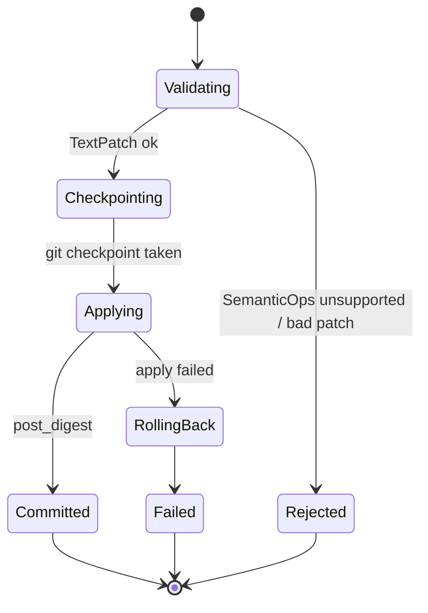

# RFC-0008: EditEngine (TextPatch + Git Checkpoint)

| Field | Value |
| --- | --- |
| Status | Draft |
| Author | arkadianet |
| Architecture | Alloy Architecture V2 (frozen) |
| Depends on | RFC-0001, RFC-0005, RFC-0006 |
| Effort | 4–6 person-days |

## Purpose

Transactional edit apply + rollback via checkpoint. Op envelope `TextPatch | SemanticOps`; MVP implements text/unified diff apply + **git-only** checkpoints (V2 §13, ADR F-01/F-14/F-24).

## Scope

### In scope

- `EditEngine` trait: `apply` / `rollback`
- `EditRequest::TextPatch` path (unified diff / `PatchSet`)
- Git checkpoint backend (`CheckpointId` = git ref/stash)
- Wire `apply_patch` MCP builtin to EditEngine (not a second write stack)
- `SemanticEditOp` enum present; unsupported ops → `EditError::UnsupportedOp` fail closed
- Workspace digests pre/post

### Out of scope

- Full SemanticEditOp lowering / OverlayFS / SplitCrate / ExtractTrait → deferred
- Optional `RenameType` via RA → Future extensions / M3
- Compile verification → runtime adapter in [RFC-0010](./RFC-0010-scheduler-runtime-adapters.md)
- Freeform raw FS writes outside EditEngine → higher approval only (policy in CLI/profiles)

## Dependencies

- **RFC-0001** — `EditRequest` types, digests
- **RFC-0005** — sandboxed git/fs where applicable
- **RFC-0006** — `apply_patch` mediation (host may land with temporary stub engine; this RFC completes the path)

## Public API

From V2 §13.2:

```rust
#[derive(Debug, Clone, Serialize, Deserialize)]
#[serde(tag = "kind", rename_all = "snake_case")]
pub enum EditRequest {
    TextPatch { patch: PatchSet },
    SemanticOps { ops: Vec<SemanticEditOp> },
}

#[async_trait]
pub trait EditEngine: Send + Sync {
    async fn apply(&self, req: EditRequest) -> Result<EditTransaction, EditError>;
    async fn rollback(&self, tx: TransactionId) -> Result<(), EditError>;
}

pub struct EditTransaction {
    pub id: TransactionId,
    pub request: EditRequest,
    pub pre_digest: WorkspaceDigest,
    pub post_digest: Option<WorkspaceDigest>,
    pub patch_set: Option<PatchSet>,
    pub checkpoint_id: Option<CheckpointId>, // git ref in MVP
}
```

`SemanticEditOp` variants match V2 (unstable/incomplete).

## Internal architecture

Module in `alloy-runtime` (edit) invoked from `alloy-tools` apply_patch. Primary path: `model → patch → apply → check` (check owned by scheduler).

## Data structures

`PatchSet`, file hunks, `EditTransaction` as above. Checkpoint metadata in session events (`edit_applied`).

## State machine



## Failure modes

| Failure | Handling |
| --- | --- |
| Patch does not apply cleanly | Error; no partial commit; rollback if needed |
| Git checkpoint fails | Fail closed before mutating |
| Unsupported SemanticOps | `UnsupportedOp` |
| Path outside allowlist | Deny via permissions |

## Testing strategy

- Unit: apply/rollback on temp git repo
- Fuzz/conflict: overlapping hunks fail safely
- MCP integration: apply_patch → EditEngine → event logged
- SemanticOps stub returns UnsupportedOp

## Acceptance criteria

- [ ] TextPatch apply + git checkpoint + rollback work
- [ ] Single write stack (MCP apply_patch → EditEngine)
- [ ] SemanticOps fail closed except optional future RenameType
- [ ] No OverlayFS product path
- [ ] Digests recorded on transactions

## Estimated implementation effort

**4–6 person-days**.

## Future extensions

- RA-backed ops one-at-a-time behind same `apply` (V2 §13 M3)
- OverlayFS / snapshot bundles deferred
