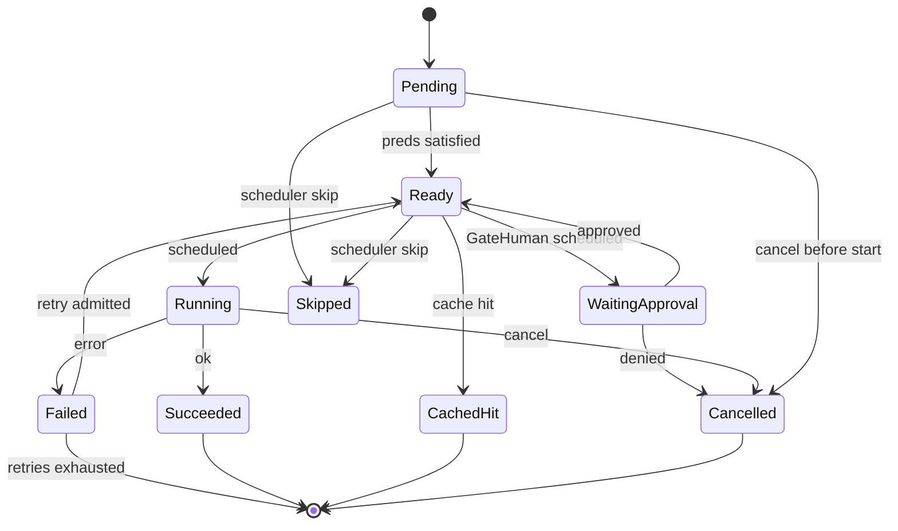

# RFC-0009: Task DAG, Templates & Planner

| Field | Value |
| --- | --- |
| **Status** | Draft |
| **Author** | arkadianet |
| **Architecture** | Alloy Architecture V2 (**frozen**) — do not redesign |
| **Depends on** | [RFC-0001](./RFC-0001-alloy-runtime.md) (merged), [RFC-0002](./RFC-0002-storage-artifacts-session-events.md) (merged) |
| **Effort** | 4–6 person-days |
| **Related RFCs** | [0003](./RFC-0003-session-manager-run-controller.md) `ReplanReason` / `RunController::request_replan` · [0004](./RFC-0004-observability-cost-metering.md) session event payloads · [0010](./RFC-0010-scheduler-runtime-adapters.md) scheduler execution · [0013](./RFC-0013-capability-registry-workers.md) capability workers · [0015](./RFC-0015-cli-profiles-config.md) `alloy run` |
| **Product** | Alloy — AI Engineering Runtime |
| **Supersedes** | Draft outline of this filename (expanded to implementation grade) |

**Mental model (V2 §6 / ADR F-03 / F-16):** The Task DAG is explicit, durable, and singly-authored. `dag::types` already exists on `main`; this RFC gives those types **semantics**, **validation**, **persistence**, **templates**, and a **template planner**. RFC-0010 executes the DAG; RFC-0013 populates LLM nodes. The MVP scheduler is linear, but the DAG contract MUST remain correct under a future concurrent scheduler — or that upgrade becomes a breaking change.

**Authority order (highest → lowest):** current `main` source → merged RFCs 0001–0007, 0016 → Architecture V2 → this draft → roadmaps. Never reshape a merged public API solely to match an older V2 sketch or this document’s prior outline. The `dag::types` module is **normative and unchanged**; extensions in this RFC are **additive only**.

---

## 1. Overview

### 1.1 Purpose

Ship the MVP **Task DAG store, validator, template catalog, and planner** inside `alloy-runtime`:

1. **Semantics** for the merged `TaskDag` / `TaskNode` / `NodeKind` / `NodeState` / `EdgeKind` / `RetryPolicy` / `CacheKey` / `ApprovalSpec` types.
2. **Validation** — acyclicity, reachability, capability presence per kind, gate presence, Aggregate well-formedness, budget coherence, edge endpoint existence — each with a distinct error variant.
3. **Persistence** over the reserved RFC-0002 `dag_blobs` table, with generation / replan overwrite semantics and event-log audit.
4. **Hardcoded DAG templates** (V2 MVP posture) and the template contract, including gate validation (V2 §10.2).
5. **Planner** that selects and instantiates templates; LLM planner path is a **Stub** returning `PlanError::PlannerDisabled`.
6. **Node data-flow contract** over the RFC-0002 artifact CAS (`input_ref` / `output_ref`).
7. **Cache-key and retry/escalation declarations** owned by the DAG; execution owned by RFC-0010.

### 1.2 Problem Statement

RFC-0001 published `TaskDag` type sketches and a `NullScheduler`. RFC-0002 reserved `dag_blobs` (`dag_id` PRIMARY KEY) without CRUD behaviour. Architecture V2 §6 requires explicit DAGs, a single topology mutator (Planner/ReplanService), hardcoded repair templates, generation counters, and Appendix C node states. Without this RFC there is no validated DAG, no durable plan, no template, and no planner seam — RFC-0010 cannot schedule and RFC-0013 has no node contract to bind workers to.

### 1.3 Scope

| In scope | Detail |
| --- | --- |
| Type semantics | Merged `dag::types` fields; agent vs adapter vs structural node contracts |
| Validation | Full rule set + `DagValidationError` taxonomy (§8) |
| Persistence | `DagStore` over `dag_blobs`; generation bump; overwrite semantics |
| Templates | Closed MVP catalog; embedded manifests; gate-present contract |
| Planner | `PlanService` select/instantiate/replan; LLM Stub |
| Data-flow | Artifact I/O contract for `input_ref` / `output_ref` |
| Cache declarations | `CacheKey` computation + `CachedHit` exposure rules |
| Retry declarations | `RetryPolicy` field ownership boundary vs RFC-0010 |
| Concurrency contract | What the DAG does and does **not** declare as concurrent-safe |
| Observability | `PlanProduced` / replan provenance payloads; tracing spans |
| Tests | Unit, golden topology, persistence round-trip, cross-subsystem SQLite |

### 1.4 Non-goals

| Deferred item | Owner |
| --- | --- |
| Scheduler ready-queue, concurrency policy, adapter invocation | **RFC-0010** |
| Capability worker logic and prompts | **RFC-0013** |
| LLM planner as default | Deferred / Production, eval-gated (V2 §0.7 / §19.3) |
| `EdgeKind::Hint` semantics | Deferred (V2 kill list / §6.1) — inert here (§5.10) |
| File leases / parallel-analyze policy | Deferred pending eval (V2 §6.1 / §6.3) |
| `alloy run` CLI surface | **RFC-0015** |
| Worker `follow_up_nodes` | **Eliminated** (ADR F-03) — MUST NOT reintroduce |
| Sixth crate / Postgres / Temporal durability | Forbidden |
| Writing or overwriting `.env` | Forbidden |

### 1.5 Day-1 MVP (normative)

1. `DagValidator::validate(&TaskDag)` MUST enforce every rule in §5.4; each failure MUST map to exactly one `DagValidationError` variant.
2. `SqliteDagStore` MUST implement `DagStore` over the existing `dag_blobs` table **without** a schema migration that changes the PRIMARY KEY; put/get/delete MUST work through `AlloyStorage`.
3. Replan MUST bump `generation` by exactly one, overwrite the `dag_blobs` row for the same `dag_id`, and append a `PlanProduced` session event whose payload references a CAS artifact of the new DAG JSON (§5.6).
4. Prior-generation rows in `dag_blobs` are **not** retained. Prior-generation recoverability MUST come from the session event log + CAS artifact referenced by `PlanProduced` (§5.6.3).
5. The closed template catalog MUST ship exactly the templates in §5.7; day-1 required template is `repair_local_diagnostic` (Analyze → Edit → VerifyCompile → GateHuman).
6. `TemplatePlanService` MUST select and instantiate a template from `PlanContext` without calling an LLM; `LlmPlanService` (or equivalent stub path) MUST return `PlanError::PlannerDisabled`.
7. MVP templates MUST be **linear chains** under Sequence/Data edges such that, under the pred-satisfaction rules in §5.3, at most one node is Ready at a time. Concurrency safety of Ready siblings is **unmodelled**; a concurrent scheduler MUST NOT be built on this model until a later RFC adds an explicit mechanism (§6.5).
8. `EdgeKind::Hint` MUST be accepted in serde and MUST NOT affect validation, scheduling readiness, or caching.
9. Alloy MUST NEVER write `.env`.

---

## 2. Architecture Integration

### 2.1 Relationship to Architecture V2

| V2 reference | Application |
| --- | --- |
| §3.3 Explicit state | If it isn’t in the session event log or DAG store, it didn’t happen — §5.6 binds both |
| §6.1 Why a DAG | Provenance, gates, retries, caching — not fake parallelism; ADR F-16 linear honesty |
| §6.2 Task DAG | Types already on `main`; this RFC owns store, templates, planner, validation |
| §6.2 Single topology mutator | Only `PlanService` mutates topology (plus scheduler cancel/skip of **existing** nodes — RFC-0010) |
| §6.4 Replanning | Workers return `FailureIr` only; `generation++`; no `follow_up_nodes` |
| §6.5 Repair sequence | Template planner → DAG → scheduler (0010) |
| §6.6 Cycle prevention | Acyclic validation at insert / replan |
| §9.3 MVP catalog | Planning = template; LLM gated; Verify*/GateHuman are **not** LLM capabilities |
| §10.2 PlanningWorker | Load template; **validate gates present** |
| Appendix C | Node state machine — reconciled in §5.3 |
| Appendix B | `max_parallel_*=1` — scheduler honesty (0010); DAG concurrency contract in §6.5 |

### 2.2 Relationship to RFC-0001

Authoritative for: `TaskDag`, `TaskNode`, `NodeKind`, `NodeState`, `EdgeKind`, `DependencyEdge`, `RetryPolicy`, `Backoff`, `CacheKey`, `ApprovalSpec`, `Scheduler` / `DagState` / `DagOutcome`, IDs (`DagId`, `NodeId`, `GateId`, `CapabilityId`, …), `ModelTier`, `TokenBudget`, `ErrorClass`, `FailureIr`, `#![forbid(unsafe_code)]`, five-crate map.

**This RFC does not amend** those struct/enum shapes. Behaviour and ownership around them are specified here.

### 2.3 Relationship to RFC-0002

Authoritative for: `AlloyStorage`, `ArtifactStore` / CAS put semantics (always new `ArtifactId`), `EventStore` / session event append, reserved `dag_blobs` table, `StoreError`.

**This RFC owns** the first consumer of `dag_blobs` and the PlanProduced / replan audit payloads that reference CAS blobs.

### 2.4 Relationship to RFC-0003

Authoritative for: `ReplanReason`, `RunController::request_replan` (records intent only; does **not** mutate the DAG), `RunControlState::ReplanRequested`.

RFC-0009’s `PlanService::replan` is the topology mutator that RunController / scheduler invoke **after** a replan request is recorded. This RFC MUST NOT change `RunController` signatures.

### 2.5 Already implemented | Added by RFC-0009 | Deferred

| Category | Contents |
| --- | --- |
| **Already implemented** | `dag::types` (`TaskDag`, `TaskNode`, …); `Scheduler` / `DagState` / `DagOutcome`; `NullScheduler`; `dag_blobs` table; `ArtifactStore`; session event types including `PlanProduced` / `ReplanRequested` / `NodeState`; `ReplanReason`; adapter traits (stubs) |
| **Added by RFC-0009** | `DagStore` + `SqliteDagStore`; `DagValidator`; template catalog + manifests; `PlanService` + `TemplatePlanService` + LLM Stub; node I/O artifact envelopes; cache-key builder; validation / plan / store error taxonomies; `AlloyStorage::dags()`; PlanProduced payload schema; concurrency contract docs |
| **Deferred** | Scheduler execution (0010); workers (0013); LLM planner default; Hint semantics; file leases; parallel Analyze; CLI (0015) |

### 2.6 Dependency boundaries

```text
RunController / CLI (0015) / PlanningWorker (0013)
        │
        ▼
alloy-runtime::planner  ──uses──►  alloy-runtime::dag::{validate, templates, types}
        │                          alloy-runtime::storage::{DagStore, ArtifactStore, EventStore}
        │
        ▼
alloy-runtime::scheduler (0010) ──reads──► DagStore + validated TaskDag
        │
        ▼
capability workers (0013) / adapters (0010) ──consume──► TaskNode contracts
```

| Consumer | MAY rely on (after this RFC) | MUST NOT invent |
| --- | --- | --- |
| **RFC-0010** | Validated DAG shapes; node kind/capability invariants; data-flow contract; Ready-pred rules; RetryPolicy **declarations**; cache-hit exposure; Concurrent-safety contract §6.5 | Topology mutation; template selection; new edge kinds for fan-out |
| **RFC-0013** | NodeKind ↔ capability presence table; `input_ref` envelope schema; PlanningWorker → `PlanService` seam | DAG store schema; validation rules; scheduler policy |

- `alloy-runtime` remains one of ≤5 crates. **No sixth crate.**
- Planner / store / templates live under `alloy-runtime` only.

---

## 3. Public Rust API

New items live under `alloy_runtime::dag` (store, validate, templates, cache) and `alloy_runtime::planner`, re-exported from the crate root where noted in §3.18. Merged `dag::types` items are **normative — unchanged**. `alloy-runtime` is `#![deny(missing_docs)]`; every new public item and public field MUST have rustdoc stating ownership and failure semantics.

### 3.1 Reused types (normative — unchanged)

| Type | Source | Notes |
| --- | --- | --- |
| `TaskDag` | `dag/types.rs` | `id`, `session_id`, `generation`, `nodes`, `edges`, `state` |
| `TaskNode` | `dag/types.rs` | includes `capability: Option<CapabilityId>`, `input_ref`, `output_ref`, `retry`, `cache_key`, `budget`, `model_tier`, `approval`, `timeout_ms` |
| `NodeKind` | `dag/types.rs` | Plan, Analyze, Edit, VerifyCompile, VerifyTest, Review, GateHuman, Aggregate |
| `NodeState` | `dag/types.rs` | Pending … CachedHit (Appendix C) |
| `EdgeKind` | `dag/types.rs` | Data, Sequence, Hint |
| `DependencyEdge` | `dag/types.rs` | `from`, `to`, `kind` |
| `RetryPolicy`, `Backoff` | `dag/types.rs` | Declarations; execution in 0010 |
| `CacheKey` | `dag/types.rs` | `CacheKey(Digest)` |
| `ApprovalSpec` | `dag/types.rs` | `gate: GateId`, `reason: String` |
| `DagState`, `DagOutcome`, `Scheduler` | `scheduler` | Outcome types unchanged |
| `ArtifactId`, `ArtifactStore`, `ArtifactPut`, `ArtifactKind` | `storage` | CAS |
| `ReplanReason` | `session` | Replan input |
| `CapabilityId`, `ModelTier`, `TokenBudget`, `GateId`, `DagId`, `NodeId`, `SessionId`, `RunId`, `Digest` | `types` | Shared IR |
| `ErrorClass`, `FailureIr` | `types/diagnostic` | Retry admission inputs for 0010 |
| `StoreError` | `storage` | Mapped at DagStore boundary |
| `SessionEventType::{PlanProduced, ReplanRequested, NodeState}` | `events` | Lifecycle events |

### 3.2 Additive extension — none to `TaskDag` / `TaskNode` fields

**Normative:** This RFC MUST NOT add, remove, or rename fields on `TaskDag` or `TaskNode`. Semantics that do not fit existing fields MUST be expressed as:

- validation invariants (§5.4),
- artifact payload schemas (§5.5),
- template manifest metadata outside the persisted DAG (§5.7),
- or reported as an Open Question (§15) rather than a silent reshape.

If a future need genuinely cannot be carried by the merged types, stop and amend via the Engineering Playbook — do not redefine `dag::types` in this RFC’s implementation PR.

### 3.3 Node kind contract (normative)

Every `TaskNode` MUST satisfy the capability / budget / model-tier contract for its `kind`. Validation enforces this (§5.4.4). Scheduler and workers MUST treat violations as impossible post-validate (fail closed if observed).

| `NodeKind` | Class | `capability` | `model_tier` meaningful? | `budget` meaningful? | `approval` | `cache_key` typical |
| --- | --- | --- | --- | --- | --- | --- |
| `Plan` | LLM | MUST be `Some` with id `planning` | yes | yes | optional | optional |
| `Analyze` | LLM | MUST be `Some` with id `repair` | yes | yes | optional | optional |
| `Edit` | LLM | MUST be `Some` with id `edit` | yes | yes | optional | optional |
| `Review` | LLM | MUST be `Some` with id `review` | yes | yes | optional | optional |
| `VerifyCompile` | Adapter | MUST be `None` | **no** — MUST be ignored by executors | **no** — MUST be zeroed or ignored (§5.4.5) | MUST be `None` | MUST be `None` (wall-clock / tool flakiness) |
| `VerifyTest` | Adapter | MUST be `None` | no | no | MUST be `None` | MUST be `None` |
| `GateHuman` | Adapter | MUST be `None` | no | no | MUST be `Some` | MUST be `None` |
| `Aggregate` | Structural | MUST be `None` | no | no | MUST be `None` | optional |

**Capability catalog ids** are lowercase `CapabilityId` strings matching V2 §9.3 / RFC-0001 name ids: `planning`, `repair`, `edit`, `review`.

**Normative clarification:** A DAG that can express “an adapter node with a model tier that executors honour” is forbidden. Adapter nodes MAY carry any `ModelTier` / `TokenBudget` bit pattern in the struct for serde simplicity, but validation MUST require adapter/structural budgets to be `{ max_input: 0, max_output: 0 }` and executors MUST NOT pass those fields to a model router.

### 3.4 `DagValidationError`

```rust
/// Why a `TaskDag` was rejected. One variant per validation rule (§5.4).
#[derive(Debug, Clone, PartialEq, Eq, thiserror::Error)]
#[non_exhaustive]
pub enum DagValidationError {
    #[error("DAG has no nodes")]
    Empty,

    #[error("node map key {key} != node.id {node_id}")]
    NodeIdMismatch { key: NodeId, node_id: NodeId },

    #[error("edge endpoint missing: {node}")]
    MissingEndpoint { node: NodeId },

    #[error("self-loop on node {node}")]
    SelfLoop { node: NodeId },

    #[error("cycle detected involving node {node}")]
    Cycle { node: NodeId },

    #[error("node {node} is unreachable from roots")]
    Unreachable { node: NodeId },

    #[error("node {node} kind {kind:?} requires capability {expected}, got {got:?}")]
    CapabilityRequired {
        node: NodeId,
        kind: NodeKind,
        expected: &'static str,
        got: Option<CapabilityId>,
    },

    #[error("node {node} kind {kind:?} MUST NOT carry a capability")]
    CapabilityForbidden { node: NodeId, kind: NodeKind },

    #[error("node {node} kind {kind:?} MUST carry approval")]
    ApprovalRequired { node: NodeId, kind: NodeKind },

    #[error("node {node} kind {kind:?} MUST NOT carry approval")]
    ApprovalForbidden { node: NodeId, kind: NodeKind },

    #[error("node {node} kind {kind:?} MUST NOT carry cache_key")]
    CacheKeyForbidden { node: NodeId, kind: NodeKind },

    #[error("adapter/structural node {node} budget must be zero")]
    BudgetNotZero { node: NodeId },

    #[error("LLM node {node} budget must be non-zero on at least one side")]
    BudgetZero { node: NodeId },

    #[error("retry policy on node {node} is incoherent: {reason}")]
    RetryIncoherent { node: NodeId, reason: &'static str },

    #[error("template/gates: missing required GateHuman node")]
    GatesAbsent,

    #[error("GateHuman node {node} has empty approval.reason")]
    GateReasonEmpty { node: NodeId },

    #[error("Aggregate node {node} has no Data predecessors")]
    AggregateNoDataPreds { node: NodeId },

    #[error("Aggregate node {node} has outgoing Data edge (forbidden)")]
    AggregateDataOut { node: NodeId },

    #[error("duplicate Data/Sequence edge {from} -> {to}")]
    DuplicateEdge { from: NodeId, to: NodeId },

    #[error("MVP template linearity violated: nodes {a} and {b} are concurrent-ready siblings")]
    NonLinearTopology { a: NodeId, b: NodeId },

    #[error("generation must be >= 1, got {got}")]
    InvalidGeneration { got: u64 },

    #[error("timeout_ms must be > 0 for node {node}")]
    TimeoutZero { node: NodeId },
}
```

**Visibility:** `pub` in `alloy_runtime::dag`.

### 3.5 `DagValidator`

```rust
/// Pure validator. No I/O. `Send + Sync`.
#[derive(Debug, Default, Clone, Copy)]
pub struct DagValidator;

impl DagValidator {
    /// Validate structural + contract rules (§5.4).
    ///
    /// `opts.enforce_linear_mvp` MUST be `true` for every template instantiation
    /// and every replan that claims MVP template provenance.
    pub fn validate(dag: &TaskDag, opts: ValidateOpts) -> Result<(), DagValidationError>;
}

#[derive(Debug, Clone, Copy)]
pub struct ValidateOpts {
    /// When true, reject DAGs that admit two simultaneously Ready nodes (§5.4.11).
    pub enforce_linear_mvp: bool,
    /// When true, require at least one `GateHuman` node (§5.4.8 / V2 §10.2).
    pub require_gates: bool,
}

impl Default for ValidateOpts {
    fn default() -> Self {
        Self {
            enforce_linear_mvp: true,
            require_gates: true,
        }
    }
}
```

**Ownership:** Validator is stateless. Callers own the `TaskDag`.

### 3.6 `DagStore`

```rust
/// Durable DAG blob API over `dag_blobs`.
#[async_trait]
pub trait DagStore: Send + Sync {
    /// Insert or overwrite the row keyed by `dag.id`.
    ///
    /// MUST set `generation` column = `dag.generation`.
    /// MUST set `session_id` = `dag.session_id`.
    /// MUST serialize `dag` as JSON into `blob_json`.
    /// MUST update `updated_at` to now (RFC3339).
    ///
    /// Overwrite of an existing `dag_id` is **success**, not conflict — this is
    /// the intentional replan semantic (§5.6).
    async fn put(&self, dag: &TaskDag) -> Result<(), StoreError>;

    /// Load by primary key.
    async fn get(&self, dag_id: DagId) -> Result<Option<TaskDag>, StoreError>;

    /// Delete by primary key. Missing row → `Ok(())` (idempotent).
    async fn delete(&self, dag_id: DagId) -> Result<(), StoreError>;

    /// List dag ids for a session (order: `updated_at ASC, dag_id ASC`).
    async fn list_by_session(&self, session_id: SessionId) -> Result<Vec<DagId>, StoreError>;
}
```

### 3.7 `SqliteDagStore`

```rust
/// SQLite-backed [`DagStore`] sharing `AlloyStorage`'s `DbHandle` + `StorageGate`.
pub struct SqliteDagStore { /* private */ }

impl SqliteDagStore {
    pub(crate) fn new(
        db: Arc<DbHandle>,
        metrics: Arc<StorageMetrics>,
        gate: Arc<StorageGate>,
    ) -> Self;
}
```

**Construction:** Only via `AlloyStorage::dags()` (§3.8). Not a freestanding public constructor.

### 3.8 `AlloyStorage` additive API

```rust
impl AlloyStorage {
    /// Shared DAG store handle.
    #[must_use]
    pub fn dags(&self) -> Arc<SqliteDagStore>;
}
```

**Normative:** No schema version bump is required for day-1 if `dag_blobs` already exists at `CODE_SCHEMA_VERSION` (currently 3). If an index on `session_id` is added, it MUST be an additive migration (`CODE_SCHEMA_VERSION = 4`) with `CREATE INDEX IF NOT EXISTS idx_dag_blobs_session ON dag_blobs(session_id)` — playbook amendment, not a PK change.

### 3.9 Template types

```rust
/// Closed MVP template catalog name.
#[derive(Debug, Clone, Copy, PartialEq, Eq, Hash, Serialize, Deserialize)]
#[serde(rename_all = "snake_case")]
pub enum TemplateId {
    /// Analyze → Edit → VerifyCompile → GateHuman (V2 §6.2 / §6.5).
    RepairLocalDiagnostic,
}

impl TemplateId {
    pub fn as_str(self) -> &'static str;
    /// Parse catalog name; unknown → `None`.
    pub fn parse(s: &str) -> Option<Self>;
}

/// Embedded template manifest (not the runtime `TaskDag`).
#[derive(Debug, Clone, Serialize, Deserialize)]
pub struct TemplateManifest {
    pub id: TemplateId,
    /// Human description.
    pub description: String,
    /// Ordered node specs (linear for MVP).
    pub nodes: Vec<TemplateNodeSpec>,
    /// Edges among template-local names.
    pub edges: Vec<TemplateEdgeSpec>,
}

#[derive(Debug, Clone, Serialize, Deserialize)]
pub struct TemplateNodeSpec {
    /// Stable name within the template (`analyze`, `edit`, …).
    pub name: String,
    pub kind: NodeKind,
    pub capability: Option<CapabilityId>,
    pub retry: RetryPolicy,
    pub budget: TokenBudget,
    pub model_tier: ModelTier,
    pub approval: Option<TemplateApprovalSpec>,
    pub timeout_ms: u64,
    /// When true, instantiate with `cache_key = Some(computed)` at plan time
    /// once `input_ref` is known; when false, `cache_key = None`.
    pub enable_cache: bool,
}

#[derive(Debug, Clone, Serialize, Deserialize)]
pub struct TemplateApprovalSpec {
    /// Reason string; `GateId` is allocated at instantiation.
    pub reason: String,
}

#[derive(Debug, Clone, Serialize, Deserialize)]
pub struct TemplateEdgeSpec {
    pub from: String,
    pub to: String,
    pub kind: EdgeKind,
}
```

### 3.10 `TemplateCatalog`

```rust
/// Closed catalog. Extending MVP requires a code change + RFC amendment.
pub struct TemplateCatalog;

impl TemplateCatalog {
    /// All shipped templates.
    pub fn all() -> &'static [TemplateManifest];

    /// Lookup by id.
    pub fn get(id: TemplateId) -> &'static TemplateManifest;

    /// Lookup by name string.
    pub fn get_by_name(name: &str) -> Option<&'static TemplateManifest>;
}
```

**Extensibility (normative):** MVP catalog is a **closed set**. Runtime MUST NOT load operator-supplied template files. Adding a template is an additive RFC amendment + code change.

### 3.11 Node I/O artifact envelopes

```rust
/// JSON body stored in the artifact CAS for a node's `input_ref`.
#[derive(Debug, Clone, Serialize, Deserialize)]
pub struct NodeInputEnvelope {
    pub schema_version: u32, // MUST be 1 for this RFC
    pub dag_id: DagId,
    pub node_id: NodeId,
    pub kind: NodeKind,
    pub generation: u64,
    /// Goal / diagnostic / predecessor outputs this node may read.
    pub payload: NodeInputPayload,
}

#[derive(Debug, Clone, Serialize, Deserialize)]
#[serde(rename_all = "snake_case")]
pub enum NodeInputPayload {
    /// Root / first node: goal text + optional attachment artifact ids.
    Goal {
        text: String,
        attachments: Vec<ArtifactId>,
        constraints: Vec<Constraint>,
    },
    /// Successor: ordered predecessor outputs along Data edges.
    FromPredecessors {
        preds: Vec<PredecessorOutput>,
    },
}

#[derive(Debug, Clone, Serialize, Deserialize)]
pub struct PredecessorOutput {
    pub node_id: NodeId,
    pub kind: NodeKind,
    pub output_ref: ArtifactId,
}

/// JSON body written to CAS and stored in `output_ref` on success / cache hit.
#[derive(Debug, Clone, Serialize, Deserialize)]
pub struct NodeOutputEnvelope {
    pub schema_version: u32, // MUST be 1
    pub dag_id: DagId,
    pub node_id: NodeId,
    pub kind: NodeKind,
    pub generation: u64,
    pub attempt: u32,
    pub payload: serde_json::Value,
    pub failure: Option<FailureIr>,
}
```

**ArtifactKind:** Envelopes MUST be stored with `ArtifactKind::Blob` and `content_type: Some("application/json".into())` unless a later RFC defines a dedicated kind. Labels SHOULD include `"alloy.envelope": "node_input" | "node_output"` and `"alloy.dag_id"`.

### 3.12 Cache key builder

```rust
/// Materials hashed into [`CacheKey`].
#[derive(Debug, Clone)]
pub struct CacheKeyMaterials<'a> {
    pub kind: NodeKind,
    pub capability: Option<&'a CapabilityId>,
    pub input_digest: &'a Digest,
    /// Stable policy fingerprint (profile id + relevant budget ceilings).
    pub policy_hash: &'a Digest,
    /// Tool/builtin version fingerprint; MVP may use a constant digest
    /// documented in §5.8 until MCP exposes versions.
    pub tool_versions: &'a Digest,
    /// Compiler/toolchain fingerprint; MVP constant until LanguageBackend lands.
    pub compiler_fingerprint: &'a Digest,
}

/// Compute `CacheKey(Digest::sha256(canonical_bytes))` (§5.8).
pub fn compute_cache_key(m: CacheKeyMaterials<'_>) -> CacheKey;
```

### 3.13 `PlanContext` / `PlanResult`

```rust
/// Inputs that drive template selection and instantiation.
#[derive(Debug, Clone)]
pub struct PlanContext {
    pub session_id: SessionId,
    pub run_id: RunId,
    pub goal: Goal,
    /// Optional explicit template override (CLI/profile). When `None`, selector runs.
    pub template_override: Option<TemplateId>,
    pub policy_hash: Digest,
    pub tool_versions: Digest,
    pub compiler_fingerprint: Digest,
}

/// Outcome of a successful plan or replan.
#[derive(Debug, Clone)]
pub struct PlanResult {
    pub dag: TaskDag,
    pub template_id: TemplateId,
    /// CAS id of the serialized `TaskDag` JSON snapshot for audit (§5.6.3).
    pub snapshot_artifact: ArtifactId,
}
```

### 3.14 `PlanError`

```rust
#[derive(Debug, thiserror::Error)]
#[non_exhaustive]
pub enum PlanError {
    #[error("unknown template: {0}")]
    UnknownTemplate(String),

    #[error("no template matched goal")]
    NoTemplateMatch,

    #[error("LLM planner disabled")]
    PlannerDisabled,

    #[error("validation failed: {0}")]
    Validation(#[from] DagValidationError),

    #[error("store: {0}")]
    Store(#[from] StoreError),

    #[error("artifact: {0}")]
    Artifact(StoreError),

    #[error("dag not found: {0}")]
    DagNotFound(DagId),

    #[error("session mismatch: dag session {dag_session} != context {context_session}")]
    SessionMismatch {
        dag_session: SessionId,
        context_session: SessionId,
    },

    #[error("generation mismatch: expected {expected}, store has {actual}")]
    GenerationMismatch { expected: u64, actual: u64 },

    #[error("internal: {0}")]
    Internal(String),
}
```

### 3.15 `PlanService`

```rust
/// Single topology mutator (V2 §6.2 / ADR F-03).
#[async_trait]
pub trait PlanService: Send + Sync {
    /// Select a template (unless overridden), instantiate, validate, persist,
    /// snapshot to CAS, and return the plan. Emits `PlanProduced` via the
    /// injected event sink when configured (§9).
    async fn plan(&self, ctx: PlanContext) -> Result<PlanResult, PlanError>;

    /// Load a named template and instantiate (no selection).
    async fn load_template(
        &self,
        name: &str,
        ctx: PlanContext,
    ) -> Result<PlanResult, PlanError>;

    /// Replan: load current DAG, bump generation, re-instantiate from the same
    /// template (MVP) or reject LLM path, validate, overwrite store, snapshot.
    async fn replan(
        &self,
        dag_id: DagId,
        reason: ReplanReason,
        ctx: PlanContext,
    ) -> Result<PlanResult, PlanError>;
}
```

**Lifecycle:** `Arc<dyn PlanService>` injected into RunController / PlanningWorker callers. Planner MUST NOT be invoked from capability workers other than the Planning capability’s template path (RFC-0013).

### 3.16 `TemplatePlanService`

```rust
/// MVP planner: select + instantiate hardcoded templates. No LLM.
pub struct TemplatePlanService {
    // private: catalog, dag_store, artifacts, event_sink (optional), validator
}

impl TemplatePlanService {
    pub fn new(
        dags: Arc<dyn DagStore>,
        artifacts: Arc<dyn ArtifactStore>,
        events: Option<Arc<dyn EventSink>>,
    ) -> Self;
}

#[async_trait]
impl PlanService for TemplatePlanService { /* §5.2 */ }
```

### 3.17 LLM planner Stub

```rust
/// Stub stand-in for a future LLM planner. Every method returns
/// `Err(PlanError::PlannerDisabled)`.
#[derive(Debug, Default, Clone, Copy)]
pub struct DisabledLlmPlanService;

#[async_trait]
impl PlanService for DisabledLlmPlanService {
    async fn plan(&self, _ctx: PlanContext) -> Result<PlanResult, PlanError> {
        Err(PlanError::PlannerDisabled)
    }
    async fn load_template(
        &self,
        _name: &str,
        _ctx: PlanContext,
    ) -> Result<PlanResult, PlanError> {
        Err(PlanError::PlannerDisabled)
    }
    async fn replan(
        &self,
        _dag_id: DagId,
        _reason: ReplanReason,
        _ctx: PlanContext,
    ) -> Result<PlanResult, PlanError> {
        Err(PlanError::PlannerDisabled)
    }
}
```

**Substitution seam (normative):** Callers depend only on `Arc<dyn PlanService>`. A future LLM planner MUST implement the same trait, pass the same validator with appropriate `ValidateOpts`, and MUST remain the sole topology writer. MVP wiring MUST inject `TemplatePlanService`, not `DisabledLlmPlanService`, as the active planner. `DisabledLlmPlanService` exists so tests and future feature flags can fail closed when the LLM path is selected.

### 3.18 Crate-root re-exports

The following MUST be re-exported from `alloy_runtime`:

| Item |
| --- |
| `DagStore`, `SqliteDagStore` |
| `DagValidator`, `ValidateOpts`, `DagValidationError` |
| `TemplateId`, `TemplateManifest`, `TemplateCatalog` |
| `NodeInputEnvelope`, `NodeOutputEnvelope`, `NodeInputPayload`, `PredecessorOutput` |
| `CacheKeyMaterials`, `compute_cache_key` |
| `PlanService`, `PlanContext`, `PlanResult`, `PlanError` |
| `TemplatePlanService`, `DisabledLlmPlanService` |

Merged dag types remain re-exported as today.

### 3.19 Visibility & construction summary

| Item | Visibility | Construction |
| --- | --- | --- |
| `DagValidator` | pub | `Default` / unit struct |
| `SqliteDagStore` | pub type; fields private | `AlloyStorage::dags()` only |
| `TemplateCatalog` | pub | static methods only |
| `TemplatePlanService` | pub | `new(dags, artifacts, events)` |
| `DisabledLlmPlanService` | pub | unit / Default |
| Template manifests | private static data | embedded in crate |

---

## 4. Internal Module Design

### 4.1 Hierarchy

```text
crates/alloy-runtime/src/
  dag/
    mod.rs              # re-exports types + validate + store + templates + cache + io
    types.rs            # EXISTING — normative unchanged
    validate.rs         # DagValidator, DagValidationError, ValidateOpts
    store.rs            # DagStore trait + SqliteDagStore
    templates.rs        # TemplateId, manifests, TemplateCatalog, instantiate()
    cache.rs            # CacheKeyMaterials, compute_cache_key
    io.rs               # NodeInputEnvelope / NodeOutputEnvelope helpers
  planner/
    mod.rs              # PlanService, PlanContext, PlanResult, PlanError
    template_service.rs # TemplatePlanService
    llm_stub.rs         # DisabledLlmPlanService
  storage/
    mod.rs              # Additive: dags() accessor
    migrate.rs          # unchanged unless index migration approved
```

### 4.2 Responsibilities

| Module | MUST | MUST NOT |
| --- | --- | --- |
| `dag::types` | Remain serde-stable sketch types | Gain behaviour that belongs in validate/store |
| `dag::validate` | Enforce §5.4 | Touch SQLite / artifacts |
| `dag::store` | CRUD `dag_blobs` | Mutate topology beyond put of caller-supplied DAG |
| `dag::templates` | Embed closed catalog; instantiate nodes/edges/ids | Call LLM; invent open plugin loading |
| `dag::cache` | Hash materials → `CacheKey` | Decide cache hits at runtime (0010) |
| `dag::io` | Encode/decode envelopes; put helpers | Execute nodes |
| `planner::*` | Select, instantiate, validate, persist, snapshot, emit PlanProduced | Schedule nodes; invoke adapters; mutate after handoff except via `replan` |

### 4.3 Dependency direction

```text
planner → dag::{validate, templates, cache, io, types}
planner → storage::{DagStore, ArtifactStore}
planner → events::EventSink (optional)
dag::store → storage internals (DbHandle, gate)
dag::validate → dag::types only
dag::templates → dag::types + dag::cache + dag::io
```

No cycles. `scheduler` MUST NOT depend on `planner` (0010 reads store only).

### 4.4 Injection points

| Injected into | Dependency |
| --- | --- |
| `TemplatePlanService` | `Arc<dyn DagStore>`, `Arc<dyn ArtifactStore>`, `Option<Arc<dyn EventSink>>` |
| Future PlanningWorker (0013) | `Arc<dyn PlanService>` |
| RunController start path (wiring later / 0015) | `Arc<dyn PlanService>` then `Scheduler::run(dag_id)` |

---

## 5. Execution Algorithm

This section owns **planning**, not scheduling. RFC-0010 owns ready-queue execution.

### 5.1 Template selection

```text
select(ctx) -> TemplateId:
  if ctx.template_override is Some(id):
      return id
  # MVP closed selector:
  if goal suggests local diagnostic repair (default for all goals in MVP):
      return TemplateId::RepairLocalDiagnostic
  else:
      return Err(NoTemplateMatch)   # unreachable for day-1 defaulting selector
```

**Normative day-1 selector:** When `template_override` is `None`, `TemplatePlanService` MUST select `RepairLocalDiagnostic`. A future selector MAY inspect `Goal.constraints` / attachments; until then, the default is unconditional. `NoTemplateMatch` remains in the error taxonomy for the open selector seam.

### 5.2 Plan algorithm (`TemplatePlanService::plan`)

1. `template_id ← select(ctx)` (§5.1).
2. `manifest ← TemplateCatalog::get(template_id)`.
3. `dag ← instantiate(manifest, ctx)` (§5.3).
4. `DagValidator::validate(&dag, ValidateOpts { enforce_linear_mvp: true, require_gates: true })?`.
5. `snapshot ← artifacts.put(TaskDag JSON)` (§5.6.3).
6. `dags.put(&dag)?` (overwrite-or-insert).
7. Emit `SessionEventType::PlanProduced` when `events` is `Some` (§9.2).
8. Return `PlanResult { dag, template_id, snapshot_artifact }`.

`load_template` skips step 1 and resolves `name` via `TemplateId::parse` / `TemplateCatalog::get_by_name`, else `UnknownTemplate`.

### 5.3 Instantiation algorithm

Given `TemplateManifest` + `PlanContext`:

1. Allocate `dag_id = DagId::new()` (replan: reuse existing id), `generation = 1` (replan: prior+1).
2. Allocate a `NodeId` per `TemplateNodeSpec`. If `approval` is present, allocate `GateId::new()` and build `ApprovalSpec { gate, reason }`.
3. Emit edges: map template-local names → `NodeId`; build `DependencyEdge` list from `TemplateEdgeSpec`.
4. **Write `input_ref` artifacts** (§5.3.0), then construct each `TaskNode`:
   - `state = Pending` for **all** nodes (readiness is owned exclusively by RFC-0010 using §5.3.1).
   - `output_ref = None`.
   - `cache_key = Some(compute_cache_key(...))` iff `enable_cache`, using the plan-time `input_ref` digest from `ArtifactStore::meta`; else `None`.
5. Set `dag.state = DagState::Pending`.
6. Return `TaskDag`.

### 5.3.0 Plan-time `input_ref` wiring (binding)

| Node | Plan-time `input_ref` body |
| --- | --- |
| Root (no Data∪Sequence preds) | `NodeInputEnvelope` with `payload = Goal { text, attachments, constraints }` from `PlanContext.goal` |
| Non-root | `NodeInputEnvelope` with `payload = FromPredecessors { preds }`, one `PredecessorOutput` per incoming **Data** edge |

For each non-root Data predecessor slot at plan time, `PredecessorOutput.output_ref` MUST point at a freshly `put` CAS blob with body `{"schema_version":1,"pending":true}`, labels `alloy.envelope = pending_pred`. This satisfies the required `ArtifactId` field without claiming a real predecessor output.

**RFC-0010 obligation:** when every Data predecessor of a node reaches `Succeeded` or `CachedHit`, the scheduler MUST `put` a **new** `NodeInputEnvelope` whose `preds[].output_ref` values are the predecessors’ real `output_ref`s, then update that node’s `input_ref` in the stored DAG (same `generation`). Placeholder pending blobs are not reused as success outputs.

### 5.3.1 Predecessor satisfaction (readiness rules — declarative)

A node’s predecessors for readiness are edges with `kind ∈ {Data, Sequence}` **only**. `Hint` edges MUST be ignored.

Predecessor `from` is **satisfied** when `from.state ∈ {Succeeded, Skipped, CachedHit}`.

Predecessor `from` is **failed-blocked** when `from.state ∈ {Failed, Cancelled}` and no retry will revive it (execution concern — 0010). While `from.state = Failed` and retries remain, successors MUST stay `Pending`.

A node MAY transition `Pending → Ready` iff every Data/Sequence predecessor is satisfied.

**Multiple Ready nodes:** Graph-theoretically allowed when two nodes have disjoint satisfied pred sets. See §6.5 for the concurrency contract.

### 5.3.2 Node state machine (reconciled with V2 Appendix C)



| State | Meaning | Who writes |
| --- | --- | --- |
| `Pending` | Waiting on preds or not yet considered | Planner (initial); Scheduler |
| `Ready` | Preds satisfied; eligible | Scheduler |
| `Running` | Executing | Scheduler |
| `Succeeded` | Terminal success; `output_ref = Some` | Scheduler / adapter / worker boundary |
| `Failed` | Attempt failed; may retry | Scheduler |
| `Skipped` | Not run; treated as satisfied for preds | Scheduler |
| `Cancelled` | Terminal cancel | Scheduler |
| `WaitingApproval` | GateHuman blocked | Scheduler / GateHuman adapter |
| `CachedHit` | Skipped execution; exposes prior `output_ref` | Scheduler |

**Skipped:** Present on `NodeState` and usable by RFC-0010; MVP templates do not require skip edges. Skipped counts as pred satisfaction (§5.3.1).

### 5.4 Validation rules (normative)

Enforced by `DagValidator::validate`. Each rule → one variant (§3.4).

| # | Rule | Error |
| --- | --- | --- |
| V1 | `nodes` non-empty | `Empty` |
| V2 | For every `(k,n)` in `nodes`, `k == n.id` | `NodeIdMismatch` |
| V3 | `generation >= 1` | `InvalidGeneration` |
| V4 | Every edge `from`/`to` exists in `nodes` | `MissingEndpoint` |
| V5 | No edge with `from == to` | `SelfLoop` |
| V6 | Graph of Data∪Sequence edges is acyclic (Kahn/DFS) | `Cycle` |
| V7 | Every node reachable from the set of roots (nodes with no Data∪Sequence preds) via Data∪Sequence edges | `Unreachable` |
| V8 | No duplicate Data or Sequence edge with same `(from,to)` (Hint duplicates ignored for this rule) | `DuplicateEdge` |
| V9 | Capability / approval / cache_key / budget per §3.3 | `CapabilityRequired` / `CapabilityForbidden` / `ApprovalRequired` / `ApprovalForbidden` / `CacheKeyForbidden` / `BudgetNotZero` / `BudgetZero` |
| V10 | `GateHuman.approval.reason` non-empty after trim | `GateReasonEmpty` |
| V11 | If `opts.require_gates`: ≥1 `GateHuman` node | `GatesAbsent` |
| V12 | Each `Aggregate` has ≥1 incoming **Data** edge; Aggregate MUST NOT have outgoing **Data** edges (Sequence out allowed for ordering) | `AggregateNoDataPreds` / `AggregateDataOut` |
| V13 | `timeout_ms > 0` | `TimeoutZero` |
| V14 | Retry coherence: `max_attempts >= 1`; if `escalate_after` is `Some(n)` then `n < max_attempts` and `escalate_to_tier` is `Some`; if `escalate_to_tier` is `Some` then `escalate_after` is `Some`; `Backoff::Exponential.factor` must be finite and `>= 1.0` | `RetryIncoherent` |
| V15 | If `opts.enforce_linear_mvp`: under §5.3.1, the DAG MUST NOT admit two nodes that can be Ready simultaneously (exactly one root; every non-root has exactly one Data∪Sequence predecessor; out-degree of Data∪Sequence ≤ 1 per node) | `NonLinearTopology` |
| V16 | `Hint` edges: endpoints MUST exist (V4 applies); Hint MUST NOT participate in V6/V7/V15; presence MUST NOT otherwise fail validation | — |

**Hint inertness:** A DAG with Hint edges MUST validate identically to the same DAG with those Hint edges removed, except that missing Hint endpoints still fail V4.

### 5.5 Node data-flow contract (normative)

| Topic | Rule |
| --- | --- |
| Who writes `input_ref` at plan | `PlanService` via `ArtifactStore::put` |
| Who writes `output_ref` | Executor path (RFC-0010 worker/adapter) on success or cache hit |
| Success | `state = Succeeded` or `CachedHit` ⇒ `output_ref` MUST be `Some` |
| Failure | `state = Failed` ⇒ `output_ref` remains `None` (or prior attempt’s id MUST NOT be treated as success). Executor MUST put a `NodeOutputEnvelope` with `failure: Some` as a **log artifact** if desired, but MUST NOT set `TaskNode.output_ref` unless the node succeeded or cache-hit |
| Retry | Each attempt that produces bytes MUST `ArtifactStore::put` a **new** `ArtifactId` (RFC-0002 always allocates new ids). On success, `output_ref` becomes that new id. Retries MUST NOT overwrite CAS bytes of prior artifacts |
| Reading predecessors | Along incoming **Data** edges only. Sequence edges order execution but do not contribute `PredecessorOutput` entries |
| Absent pred output | If a Data predecessor is `Failed`/`Cancelled` with `output_ref = None`, successors MUST NOT become Ready; scheduler fails or requests replan (0010) |
| Aggregate | Consumes all incoming Data predecessors’ outputs; produces one combined `NodeOutputEnvelope` (payload shape owned by 0010/0013 when first used). MVP templates MUST NOT include Aggregate |

### 5.6 Persistence & generations

#### 5.6.1 `dag_blobs` row semantics

| Column | Source |
| --- | --- |
| `dag_id` | `TaskDag.id` (PK) |
| `session_id` | `TaskDag.session_id` |
| `generation` | `TaskDag.generation` |
| `blob_json` | `serde_json::to_string(TaskDag)` |
| `updated_at` | RFC3339 UTC now on each put |

**Overwrite:** `put` uses `INSERT ... ON CONFLICT(dag_id) DO UPDATE SET session_id=excluded.session_id, generation=excluded.generation, blob_json=excluded.blob_json, updated_at=excluded.updated_at`.

#### 5.6.2 Replan algorithm

1. `current ← dags.get(dag_id)?.ok_or(DagNotFound)?`.
2. If `current.session_id != ctx.session_id` → `SessionMismatch`.
3. Determine `template_id` from the prior `PlanProduced` payload for this `dag_id` (latest) if available; else `select(ctx)`. MVP replan MUST reuse the same template id when recorded in the last PlanProduced for this dag; if missing, fall back to `select(ctx)`.
4. `next_gen ← current.generation.checked_add(1).ok_or(Internal)?`.
5. Instantiate a fresh DAG **reusing `dag_id`**, setting `generation = next_gen`, new node ids, new gate ids, new input artifacts.
6. Validate with linear + gates opts.
7. Snapshot + `dags.put` (overwrite).
8. Emit `PlanProduced` with replan provenance (§9.2).

**Optimistic concurrency (normative):** `replan` MUST re-read the store immediately before put and abort with `GenerationMismatch` if `generation` changed since step 1. (No SQL `WHERE generation=?` required if the read/put critical section is held under the storage gate’s single-flight DB mutex — which `spawn_db` already serializes. The check is still REQUIRED in service logic.)

#### 5.6.3 Prior-generation recoverability (binding decision)

| Question | Decision |
| --- | --- |
| Does `dag_blobs` retain prior generations? | **No.** PK overwrite is intentional. |
| Is that correct for V2 §3.3? | **Yes**, because the session event log + CAS carry audit. |
| How is prior DAG recovered? | Each `PlanProduced` payload MUST include `snapshot_artifact: ArtifactId` pointing at an immutable CAS blob of the full `TaskDag` JSON for that generation. Prior generations are recovered by reading events, not `dag_blobs`. |
| Schema change required? | **No** for MVP. Do **not** change `dag_blobs` PK. A future multi-version table would be a playbook amendment if event+CAS audit proves insufficient. |

### 5.7 Template catalog (day one)

#### 5.7.1 Closed set

| `TemplateId` | Name string | Shipped day one |
| --- | --- | --- |
| `RepairLocalDiagnostic` | `repair_local_diagnostic` | **Required** |

No other templates ship on day one. Catalog API remains closed-enum extensible by amendment.

#### 5.7.2 `repair_local_diagnostic` topology (normative)

Nodes (order):

| Name | Kind | Capability | Retry (MVP defaults) | Cache | Approval |
| --- | --- | --- | --- | --- | --- |
| `analyze` | `Analyze` | `repair` | `max_attempts=2`, Fixed 0ms, `retry_on=[Model]`, no escalate | enable | none |
| `edit` | `Edit` | `edit` | `max_attempts=2`, Fixed 0ms, `retry_on=[Model]`, no escalate | enable | none |
| `verify` | `VerifyCompile` | none | `max_attempts=1`, Fixed 0ms, `retry_on=[]` | **disabled** | none |
| `gate` | `GateHuman` | none | `max_attempts=1` | disabled | reason: `"Approve repair diff before completion"` |

Edges (all `Sequence` **and** `Data` between consecutive pairs — two edges per hop, or one edge with kind Data plus one Sequence; **normative:** emit **both** a Data and a Sequence edge for each hop `analyze→edit`, `edit→verify`, `verify→gate`):

```text
analyze --Data--> edit --Data--> verify --Data--> gate
analyze --Sequence--> edit --Sequence--> verify --Sequence--> gate
```

**Why both:** Data carries I/O; Sequence forbids concurrent interpretation of sibling readiness under V15 (redundant on a chain but required so templates defensively express ordering even if Data rules evolve).

Budgets (LLM nodes): `{ max_input: 32_768, max_output: 8_192 }` unless profile wiring overrides at instantiation via future amendment; MVP constants above. Adapter nodes: `{0,0}`. `model_tier`: Analyze/Edit `Standard`; adapters `Economy` (ignored). `timeout_ms`: Analyze/Edit `300_000`; Verify `600_000`; Gate `3_600_000`.

#### 5.7.3 Template contract (every template MUST)

1. Pass `DagValidator` with `enforce_linear_mvp=true`, `require_gates=true`.
2. Include ≥1 `GateHuman` with non-empty reason (V2 §10.2).
3. Use only catalog capability ids from §3.3.
4. Remain a linear chain under V15.
5. Set Verify*/GateHuman `cache_key` disabled / `None`.
6. Never include `EdgeKind::Hint` in shipped manifests (Hint may appear only in fixtures testing inertness).
7. Never include `Aggregate` on day one.

### 5.8 Cache-key computation (normative)

Canonical byte sequence for `Digest::sha256`:

```text
b"alloy.cache_key.v1" || 0x00 ||
kind_snake_case_utf8 || 0x00 ||
capability_or_empty || 0x00 ||
input_digest.as_hex() || 0x00 ||
policy_hash.as_hex() || 0x00 ||
tool_versions.as_hex() || 0x00 ||
compiler_fingerprint.as_hex()
```

| Event | Behaviour |
| --- | --- |
| Cache hit (0010) | Node → `CachedHit`; `output_ref` MUST be set to the **cached artifact id** associated with that key in the scheduler’s cache map (0010 owns the map). RFC-0009 does not ship a persistent cache table. |
| Cache miss | Normal execution |
| Replan | New node ids + new input artifacts ⇒ new keys. Prior generation cache entries MUST NOT be reused across generations unless input digest and all materials match **and** the scheduler explicitly keys by digest (0010). PlanService MUST NOT copy `cache_key` values from the prior generation’s nodes. |
| Stale artifact | Forbidden: cache hit MUST only return artifacts previously produced under the same `CacheKey` materials. |

**MVP constants:** Until LanguageBackend / MCP version surfacing exists, `tool_versions` and `compiler_fingerprint` MUST be `Digest::sha256(b"alloy.mvp.tool_versions.v0")` and `Digest::sha256(b"alloy.mvp.compiler_fingerprint.v0")` respectively, passed through `PlanContext`.

### 5.9 Retry & escalation ownership boundary

| Concern | Owner | Notes |
| --- | --- | --- |
| Fields on `RetryPolicy` | **RFC-0009** (declaration) | Validated by V14 |
| Whether to retry a failure | **RFC-0010** | Requires `FailureIr.retry == Retryable` **and** `error_class ∈ retry_on` (RFC-0007/0010 amendment) |
| Backoff sleep | **RFC-0010** | Uses `Backoff` |
| Tier escalation after N failures | **RFC-0010** | Reads `escalate_after` / `escalate_to_tier`; applies to LLM nodes only |
| Declaring `retry_on` contents in templates | **RFC-0009** | Template manifests |
| Replan vs retry | **RFC-0010** | Exhausted retries / policy → `DagState::ReplanRequired` / `request_replan`; topology change → **RFC-0009** `replan` |

### 5.10 `EdgeKind::Hint` (inert reserved surface)

| Surface | Rule |
| --- | --- |
| Serde | Accepted |
| Validation | Endpoints must exist; otherwise ignored (§5.4 V16) |
| Readiness | MUST NOT affect |
| Caching | MUST NOT affect |
| Templates | MUST NOT ship Hint edges |
| Future | Semantics require a new RFC |

---

## 6. Lifecycle & Concurrency

### 6.1 DAG lifecycle

```mermaid
stateDiagram-v2
  [*] --> Planned: PlanService::plan
  Planned --> Stored: DagStore::put
  Stored --> Running: Scheduler::run (0010)
  Running --> ReplanRequested: request_replan (0003)
  ReplanRequested --> Planned: PlanService::replan
  Running --> Terminal: Succeeded/Failed/Cancelled
  Terminal --> [*]
```

### 6.2 Creation

Only `PlanService` creates new topologies. Workers MUST NOT obtain a mutator API.

### 6.3 Load

`DagStore::get` is read-only. Scheduler loads by `DagId`.

### 6.4 Mutation

| Mutation | Allowed actor |
| --- | --- |
| Topology (nodes/edges set) | `PlanService` only |
| Node state / output_ref / attempt counters | Scheduler (0010) |
| Cancel/skip existing nodes | Scheduler (0010) |
| Generation bump | `PlanService::replan` only |

Scheduler updates MUST `DagStore::put` the modified DAG blob (same `dag_id`, **same** `generation`) so crash-resume sees node states. **Normative:** generation changes only on replan; node-state checkpoints do not bump generation.

### 6.5 Concurrency contract offered to a scheduler (binding)

| Question | Normative answer |
| --- | --- |
| May a well-formed DAG contain two nodes that are Ready at the same time? | **Yes, graph-theoretically**, if V15 is disabled and the topology fans out. With MVP `enforce_linear_mvp=true`, validation **rejects** such topologies. |
| What declares two nodes safe to run concurrently? | **Nothing in this model.** There is no fan-out edge, no file-lease field, no partition key. Concurrent safety is **unmodelled**. |
| May a concurrent scheduler be built on this RFC alone? | **MUST NOT.** A later RFC MUST add an explicit concurrency-safety mechanism (e.g. leases) before `max_parallel_nodes > 1` is legal for non-trivial graphs. |
| Is `EdgeKind::Sequence` the tool for forbidding concurrency? | Sequence enforces **ordering** along an edge (successor waits). It does **not** declare that unordered Ready siblings are safe. Templates MUST still use Sequence defensively on every MVP hop (§5.7.2). |
| Role of `Aggregate` | Structural join over Data preds. Not required after fan-out until fan-out is permitted. MVP templates MUST omit it. When present, Ready only when all Data/Sequence preds are satisfied. |

**Honesty statement (normative):** MVP templates are linear chains; concurrency safety is unmodelled; RFC-0010’s `max_parallel_*=1` is required by this contract, not merely a performance knob.

### 6.6 Concurrent access to the store

| Rule | Detail |
| --- | --- |
| DB serialization | Same as RFC-0002: `DbHandle` mutex via `spawn_db` |
| Logical writers | Multiple tasks MAY call `put`; last writer wins on `blob_json` |
| Replan safety | Generation check (§5.6.2) |
| Read during write | SQLite read may see old or new row; callers MUST treat get as point-in-time |
| `Send + Sync` | All public traits require both |

---

## 7. Configuration

### 7.1 Runtime configuration

No new `router.toml` or profile keys are required for day one. Template selection override MAY be plumbed later by RFC-0015 as a CLI flag mapped to `PlanContext.template_override`.

### 7.2 `example.env`

No new environment variables. **MUST NOT** create or modify `.env`.

### 7.3 Embedded manifests

Templates are embedded (`include_str!` JSON or Rust consts). Changing topology requires a code change.

---

## 8. Error Handling

### 8.1 `DagValidationError` taxonomy

| Variant | Producer | Meaning | Retryable? | Caller visibility |
| --- | --- | --- | --- | --- |
| `Empty` | validator | no nodes | no | yes |
| `NodeIdMismatch` | validator | map key ≠ node.id | no | yes |
| `MissingEndpoint` | validator | dangling edge | no | yes |
| `SelfLoop` | validator | from=to | no | yes |
| `Cycle` | validator | Data∪Sequence cycle | no | yes |
| `Unreachable` | validator | disconnected node | no | yes |
| `CapabilityRequired` | validator | LLM kind missing/wrong cap | no | yes |
| `CapabilityForbidden` | validator | adapter/structural has cap | no | yes |
| `ApprovalRequired` | validator | GateHuman w/o approval | no | yes |
| `ApprovalForbidden` | validator | non-gate has approval | no | yes |
| `CacheKeyForbidden` | validator | verify/gate has cache | no | yes |
| `BudgetNotZero` | validator | adapter budget ≠ 0 | no | yes |
| `BudgetZero` | validator | LLM budget both 0 | no | yes |
| `RetryIncoherent` | validator | bad retry fields | no | yes |
| `GatesAbsent` | validator | require_gates failed | no | yes |
| `GateReasonEmpty` | validator | empty reason | no | yes |
| `AggregateNoDataPreds` | validator | bad Aggregate | no | yes |
| `AggregateDataOut` | validator | Aggregate Data out | no | yes |
| `DuplicateEdge` | validator | dup Data/Sequence | no | yes |
| `NonLinearTopology` | validator | MVP linearity | no | yes |
| `InvalidGeneration` | validator | generation 0 | no | yes |
| `TimeoutZero` | validator | timeout_ms == 0 | no | yes |

### 8.2 `PlanError` taxonomy

| Variant | Producer | Meaning | Retryable? | Persist? | Caller visibility |
| --- | --- | --- | --- | --- | --- |
| `UnknownTemplate` | load_template | bad name | no | no | yes |
| `NoTemplateMatch` | select | selector empty | no | no | yes |
| `PlannerDisabled` | LLM stub | LLM path off | no | no | yes |
| `Validation` | plan/replan | invalid DAG | no | no | yes |
| `Store` | DagStore | sqlite/io | maybe Busy | no | yes |
| `Artifact` | ArtifactStore | cas put/get | maybe Busy | no | yes |
| `DagNotFound` | replan | missing row | no | no | yes |
| `SessionMismatch` | replan | wrong session | no | no | yes |
| `GenerationMismatch` | replan | lost race | yes (caller re-read) | no | yes |
| `Internal` | anywhere | invariant | no | no | yes |

### 8.3 Store boundary mapping

| `StoreError` | `PlanError` |
| --- | --- |
| `Busy` | `Store(Busy)` — caller MAY retry |
| `NotFound` | context-dependent (`DagNotFound` when loading DAG) |
| other | `Store(err)` or `Artifact(err)` |

### 8.4 Boundary into session/run

This RFC does not add `RunError` variants. Callers map `PlanError` to `RunError::Internal` or `SessionError::Invalid` at the 0003/0015 boundary until a dedicated variant is amended.

### 8.5 Recovery semantics

| Failure | Recovery |
| --- | --- |
| Validation failure | Fix template/input; do not put |
| `PlannerDisabled` | Use `TemplatePlanService` |
| `GenerationMismatch` | Re-read DAG; retry replan once |
| Store `Busy` | Retry with backoff at caller |
| Partial plan (artifact put ok, dag put fail) | Orphan CAS blob allowed (RFC-0002 has no GC); retry plan allocates fresh ids |

---

## 9. Observability

### 9.1 Tracing spans

| Span name | Fields |
| --- | --- |
| `dag.validate` | `dag_id`, `node_count`, `edge_count` |
| `dag.store_put` | `dag_id`, `generation`, `session_id` |
| `dag.store_get` | `dag_id` |
| `planner.plan` | `session_id`, `run_id`, `template` |
| `planner.replan` | `dag_id`, `generation_from`, `generation_to`, `reason` |
| `planner.instantiate` | `template`, `node_count` |

Level: `info` for plan/replan; `debug` for validate/store.

### 9.2 Session events

| Event | When | Payload (JSON) |
| --- | --- | --- |
| `PlanProduced` | After successful plan/replan put | `{ "dag_id", "generation", "template_id", "snapshot_artifact", "node_ids": [...], "replan": bool, "reason": <ReplanReason\|null> }` |
| `ReplanRequested` | Owned by RFC-0003 | unchanged |
| `NodeState` | Owned by RFC-0010 on transitions | not emitted by this RFC |

**Normative:** `PlanService` emits `PlanProduced` only. It MUST NOT emit `NodeState`.

### 9.3 Logging

On plan/replan success: `info!(dag_id, generation, template_id, "plan produced")`.  
On validation failure: `warn!(error = %err, "dag validation failed")`.

---

## 10. Crate Dependencies & `unsafe`

### 10.1 New dependencies

**None required.** Implementation uses existing `serde`, `serde_json`, `async_trait`, `thiserror`, `rusqlite`, `tokio`, `tracing`, `uuid`, `time`, `sha2` / `Digest::sha256`.

### 10.2 Justification table

| Crate | Status |
| --- | --- |
| Existing workspace deps | Reuse only |
| New crates | **Forbidden** without amendment |

### 10.3 `unsafe`

`alloy-runtime` remains `#![forbid(unsafe_code)]`. This RFC introduces no `unsafe`.

### 10.4 Feature flags

No new features. DAG store compiles with default features.

---

## 11. Testing Strategy

### 11.1 Unit — validation (one test per rule)

| Test | Asserts |
| --- | --- |
| `validate_empty_dag` | `Empty` |
| `validate_node_id_mismatch` | `NodeIdMismatch` |
| `validate_missing_endpoint` | `MissingEndpoint` |
| `validate_self_loop` | `SelfLoop` |
| `validate_cycle` | `Cycle` |
| `validate_unreachable` | `Unreachable` |
| `validate_capability_required_*` | each LLM kind |
| `validate_capability_forbidden_*` | adapter/structural |
| `validate_approval_rules` | GateHuman / others |
| `validate_cache_key_forbidden` | Verify*/Gate |
| `validate_budget_rules` | zero / non-zero |
| `validate_retry_incoherent` | escalate mismatch / factor |
| `validate_gates_absent` | `GatesAbsent` |
| `validate_aggregate_*` | Aggregate rules |
| `validate_duplicate_edge` | `DuplicateEdge` |
| `validate_non_linear` | diamond topology → `NonLinearTopology` |
| `validate_hint_inert` | Hint-only extras still pass when chain valid |
| `validate_timeout_zero` | `TimeoutZero` |
| `validate_generation_zero` | `InvalidGeneration` |

### 11.2 Template golden tests

| Test | Asserts |
| --- | --- |
| `repair_local_diagnostic_topology` | 4 nodes, kinds order, both Data+Sequence edges, gate present |
| `repair_local_diagnostic_validates` | `validate` Ok with default opts |
| `catalog_closed` | `TemplateId` parse rejects unknown names |

### 11.3 Persistence

| Test | Asserts |
| --- | --- |
| `dag_put_get_round_trip` | serde equality on fields |
| `dag_put_overwrite_same_id` | generation 2 replaces generation 1 in `get` |
| `dag_delete_idempotent` | second delete Ok |
| `list_by_session_order` | ordering contract |

### 11.4 Planner

| Test | Asserts |
| --- | --- |
| `plan_selects_repair_local_diagnostic` | default selection |
| `load_template_unknown` | `UnknownTemplate` |
| `llm_stub_disabled` | all methods → `PlannerDisabled` |
| `replan_bumps_generation` | g→g+1, same dag_id, new node ids |
| `replan_generation_mismatch` | concurrent put detected |
| `plan_emits_plan_produced` | event payload has snapshot_artifact |
| `snapshot_artifact_round_trip` | CAS get deserializes TaskDag |

### 11.5 Cache

| Test | Asserts |
| --- | --- |
| `cache_key_stable` | same materials → same key |
| `cache_key_changes_with_input` | different input digest → different key |
| `replan_does_not_copy_old_cache_keys` | new keys after replan |

### 11.6 Negative DAG shapes

Fixtures for: diamond fan-out, Aggregate without Data preds, adapter with capability, GateHuman without approval, cycle of 3, Hint to missing node.

### 11.7 Cross-subsystem (SQLite)

Follow `crates/alloy-tools/tests/cross_subsystem.rs` precedent: open real `AlloyStorage`, `TemplatePlanService::plan`, `dags().get`, reopen storage, `get` again, fetch `snapshot_artifact` via `artifacts().get`, parse events for `PlanProduced`. Prefer `crates/alloy-runtime/tests/dag_persistence.rs` or an extension under `alloy-tools/tests/` if multi-crate wiring is needed — **normative location:** `crates/alloy-runtime/tests/dag_store_sqlite.rs` plus a note that a tools-level cross test MAY be added when 0010 lands.

---

## 12. MVP vs Deferred

### 12.1 MVP (this RFC)

- Semantics + validation + `DagStore` + closed templates + `TemplatePlanService` + LLM Stub  
- Linear-MVP enforcement  
- PlanProduced + CAS snapshot audit  
- Cache-key builder (no persistent cache map)  
- Retry **declarations** only  

### 12.2 Deferred

| Item | Owner |
| --- | --- |
| Ready-queue execution, retries sleep, adapters | **RFC-0010** |
| Persistent cache map / CachedHit application | **RFC-0010** |
| Capability workers / prompts | **RFC-0013** |
| LLM planner default | Production / eval gate (V2) |
| Hint edge semantics | Future RFC |
| File leases / parallel Analyze | Future RFC after eval |
| CLI template override UX | **RFC-0015** |
| Multi-version `dag_blobs` history table | Playbook amendment if needed |
| Additional templates beyond `repair_local_diagnostic` | Amendment to this RFC |

---

## 13. Acceptance Criteria

Every criterion is independently testable.

| # | Criterion | Test / proof |
| --- | --- | --- |
| 1 | Merged `dag::types` unchanged (no field reshape) | diff + compile |
| 2 | `DagValidator` covers V1–V16 with distinct variants | §11.1 |
| 3 | Adapter nodes reject `Some(capability)` | unit |
| 4 | LLM nodes require correct capability ids | unit |
| 5 | GateHuman requires approval; verify nodes forbid cache_key | unit |
| 6 | `repair_local_diagnostic` golden topology | golden test |
| 7 | Catalog closed; unknown name → `UnknownTemplate` | unit |
| 8 | `TemplatePlanService::plan` persists DAG and CAS snapshot | sqlite test |
| 9 | Replan overwrites `dag_blobs`, bumps generation, emits PlanProduced | unit/integration |
| 10 | Prior generation recoverable via PlanProduced → CAS, not via dag_blobs | integration |
| 11 | `DisabledLlmPlanService` returns `PlannerDisabled` | unit |
| 12 | Hint edges inert under validation | unit |
| 13 | Linear diamond rejected when `enforce_linear_mvp` | unit |
| 14 | Concurrency-safety section states unmodelled + MUST NOT concurrent-sched | doc review §6.5 |
| 15 | Cache key stable/deterministic | unit |
| 16 | RetryPolicy validated; execution not implemented here | unit + code ownership |
| 17 | `AlloyStorage::dags()` returns working store | sqlite test |
| 18 | No new crate; `forbid(unsafe_code)` preserved | Cargo.toml + attrs |
| 19 | Never writes `.env` | review |
| 20 | Cross-subsystem persist/reload through real SQLite | §11.7 |
| 21 | `PlanService` is the sole topology mutator API shipped | API review |
| 22 | Data-flow contract documented; retries allocate new artifact ids | §5.5 + 0002 put semantics |

---

## 14. Definition of Done

Merge only when the series [Definition of Done](./README.md#definition-of-done-merge-gate) is fully met:

- [ ] Architecture compliance: **PASS**
- [ ] RFC acceptance criteria: **100% satisfied**
- [ ] Unit tests: **passing**
- [ ] Integration tests: **passing** (if applicable)
- [ ] Documentation: **complete**
- [ ] Public APIs: **reviewed and stable**
- [ ] Clippy: **clean**
- [ ] Formatting: **clean**
- [ ] No TODO or placeholder implementations left in this RFC's scope (explicit **Stub** / deferred only)
- [ ] Code review: **approved**

---

## 15. Open Questions

Only genuine unresolved implementation questions. Settled decisions are not reopened.

1. **Optional `idx_dag_blobs_session` migration:** Day-1 `list_by_session` MAY full-scan. If profiling shows need, ship additive schema v4 index in the implementation PR (playbook-compatible) — track in the PR description if added.
2. **Profile-driven budget overrides at instantiate:** MVP uses template constants (§5.7.2). Wiring `BudgetPolicy` → per-node budgets may land with RFC-0015; until then constants stand.

---

## 16. Estimated Implementation Effort

### 16.1 Implementation slices

| Slice | Work | Effort |
| --- | --- | --- |
| A | `DagValidationError` + `DagValidator` + unit tests per rule | 0.75–1.0 pd |
| B | `DagStore` / `SqliteDagStore` + `AlloyStorage::dags` + round-trip tests | 0.75–1.0 pd |
| C | Templates + catalog + instantiate + golden topology | 0.75–1.0 pd |
| D | Envelopes + cache-key builder + I/O helpers | 0.5–0.75 pd |
| E | `PlanService` / `TemplatePlanService` / LLM Stub + replan + PlanProduced | 1.0–1.5 pd |
| F | Cross-subsystem SQLite test + docs polish | 0.5–0.75 pd |

### 16.2 Expected effort

**4–6 person-days** total (matches index).

### 16.3 Dependencies / sequencing

1. Merged RFC-0001 + RFC-0002 on `main` (satisfied). `ReplanReason` / event sink from merged 0003 are available on `main` for planner emission.
2. Implement A→B→C→D→E→F; C may overlap B after A.
3. RFC-0010 may start against validated DAG fixtures once A+C land.
4. RFC-0013 PlanningWorker binds to `PlanService` after E.

### 16.4 Risk notes

| Risk | Mitigation |
| --- | --- |
| Overwrite semantics surprise auditors | §5.6.3 CAS snapshot + PlanProduced mandatory |
| Concurrent scheduler assumed safe | §6.5 explicit MUST NOT + V15 linear enforcement |
| Adapter nodes carrying model tiers | §3.3 + validation BudgetNotZero / CapabilityForbidden |
| Dual ownership of Ready | Planner leaves Pending; 0010 owns Ready (§5.3) |

---

## Appendix A — Capability id constants (normative)

| Constant string | Used by `NodeKind` |
| --- | --- |
| `planning` | `Plan` |
| `repair` | `Analyze` |
| `edit` | `Edit` |
| `review` | `Review` |

## Appendix B — `PlanProduced` payload schema (normative)

```json
{
  "dag_id": "<uuid>",
  "generation": 1,
  "template_id": "repair_local_diagnostic",
  "snapshot_artifact": "<uuid>",
  "node_ids": ["<uuid>", "..."],
  "replan": false,
  "reason": null
}
```

On replan, `replan: true` and `reason` is the serialized `ReplanReason`.

## Appendix C — What RFC-0010 may assume (checklist)

- DAG passed validator with linear+gates opts for MVP templates  
- At most one Ready under MVP topologies when pred rules applied  
- `RetryPolicy` / `cache_key` / `approval` fields populated per §3.3 / §5.7  
- `input_ref` always present; `output_ref` set only on success/cache-hit  
- Hint edges ignorable  
- Concurrent multi-node execution **not** authorized by RFC-0009  

## Appendix D — What RFC-0013 may assume (checklist)

- Analyze/Edit/Review/Plan capability presence table (§3.3)  
- `NodeInputEnvelope` / `NodeOutputEnvelope` schema_version = 1  
- Planning path calls `PlanService`, not a second topology API  
- No `follow_up_nodes` channel exists or will be added here  
