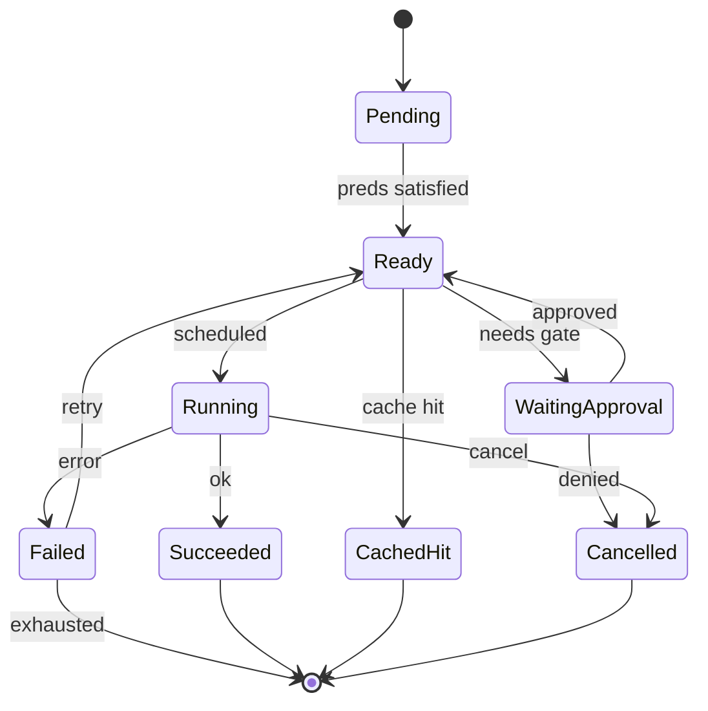

# RFC-0009: Task DAG, Templates & Planner

| Field | Value |
| --- | --- |
| Status | Draft |
| Author | arkadianet |
| Architecture | Alloy Architecture V2 (frozen) |
| Depends on | RFC-0001, RFC-0002 |
| Effort | 4–6 person-days |

## Purpose

Persist and validate explicit `TaskDag` structures with node state machine, Data/Sequence edges, generation counters, and gate nodes. MVP loads **hardcoded repair templates** (3–5 nodes). Single topology mutator: Planner/ReplanService only (V2 §6, ADR F-03).

## Scope

### In scope

- `TaskDag`, `TaskNode`, `NodeKind`, `NodeState`, `EdgeKind` types (V2 §6.2)
- SQLite persistence for DAGs
- Template loader: `repair_local_diagnostic` (analyze → edit → verify → gate)
- Acyclic validation at insert
- Planner MVP: select/load template; `Planning` capability template path
- Stub: LLM planner module returns `Err(PlannerDisabled)`
- Hint edges: accepted in serde, ignored by scheduler consumers

### Out of scope

- Scheduler ready-queue execution → [RFC-0010](./RFC-0010-scheduler-runtime-adapters.md)
- LLM planner as default → deferred / M3 gated
- Worker `follow_up_nodes` — **eliminated** (do not reintroduce)
- Hint edges / priority / file leases semantics → deferred

## Dependencies

- **RFC-0001** — IDs, budgets, tiers, artifacts
- **RFC-0002** — DAG persistence

## Public API

From V2 §6.2:

```rust
pub struct TaskDag {
    pub id: DagId,
    pub session_id: SessionId,
    pub generation: u64,
    pub nodes: BTreeMap<NodeId, TaskNode>,
    pub edges: Vec<DependencyEdge>,
    pub state: DagState,
}

pub enum NodeKind {
    Plan, Analyze, Edit, VerifyCompile, VerifyTest, Review, GateHuman, Aggregate,
}

pub enum NodeState {
    Pending, Ready, Running, Succeeded, Failed, Skipped,
    Cancelled, WaitingApproval, CachedHit,
}

pub enum EdgeKind { Data, Sequence, Hint }

#[async_trait]
pub trait PlanService: Send + Sync {
    async fn load_template(&self, name: &str, ctx: PlanContext) -> Result<TaskDag, PlanError>;
    async fn replan(&self, dag: DagId, reason: ReplanReason) -> Result<TaskDag, PlanError>;
    // MVP replan may only reload template / bump generation; LLM path disabled
}
```

## Internal architecture

`alloy-runtime::dag` + `alloy-runtime::planner`. Workers never call mutators. Replan bumps `generation` with provenance event.

## Data structures

Template manifests (embedded TOML/JSON) describing node kinds, retry policies, approval specs, cache keys.

## State machine

Node state machine from V2 Appendix C:



## Failure modes

| Failure | Handling |
| --- | --- |
| Cycle detected | Reject insert |
| LLM planner invoked | `PlannerDisabled` |
| Unknown template | Error |
| Worker attempts topology mutation | Compile-time: no API |

## Testing strategy

- Unit: template load produces acyclic repair DAG
- Unit: serde Hint edges round-trip ignored flag
- Unit: generation++ on replan
- Property: no cycles after validation

## Acceptance criteria

- [ ] DAG schema matches V2 §6.2
- [ ] Hardcoded repair template loads without LLM
- [ ] Single writer: PlanService/Replan only
- [ ] LLM planner stub disabled
- [ ] Appendix C states represented
- [ ] Persist/load via SQLite

## Estimated implementation effort

**4–6 person-days**.

## Future extensions

- LLM Planner as sole topology writer behind eval bar (V2 M3)
- Parallel Analyze when eval shows uplift; never multi-writer
- Hint edges / priority function when measured
