# RFC-0009: Task DAG, Templates & Planner

| Field | Value |
| --- | --- |
| **Status** | Implemented |
| **Author** | arkadianet |
| **Architecture** | Alloy Architecture V2 (**frozen**) — do not redesign |
| **Depends on** | [RFC-0001](./RFC-0001-alloy-runtime.md) (merged), [RFC-0002](./RFC-0002-storage-artifacts-session-events.md) (merged) |
| **Effort** | 4–6 person-days |
| **Related RFCs** | [0003](./RFC-0003-session-manager-run-controller.md) `RunGoalRecord.dag_id` / `ReplanReason` / `RunController::request_replan` · [0004](./RFC-0004-observability-cost-metering.md) session event payloads · [0010](./RFC-0010-scheduler-runtime-adapters.md) scheduler execution · [0013](./RFC-0013-capability-registry-workers.md) capability workers · [0015](./RFC-0015-cli-profiles-config.md) `alloy run` |
| **Product** | Alloy — AI Engineering Runtime |
| **Supersedes** | Draft outline of this filename (expanded to implementation grade) |
| **Revision** | Post Phase-A engineering review (Opus + GPT) — binding contracts tightened |

**Mental model (V2 §6 / ADR F-03 / F-16):** The Task DAG is explicit, durable, and singly-authored. `dag::types` already exists on `main`; this RFC gives those types **semantics**, **validation**, **persistence**, **templates**, and a **template planner**. RFC-0010 executes the DAG; RFC-0013 populates LLM nodes. The MVP scheduler is linear, but the DAG contract MUST remain correct under a future concurrent scheduler — or that upgrade becomes a breaking change.

**Authority order (highest → lowest):** current `main` source → merged RFCs 0001–0007, 0016 → Architecture V2 → this draft → roadmaps. Never reshape a merged public API solely to match an older V2 sketch or this document’s prior outline. The `dag::types` **field shapes** are **normative and unchanged**; extensions in this RFC are **additive only** (new modules, traits, derives explicitly authorized here).

---

## 1. Overview

### 1.1 Purpose

Ship the MVP **Task DAG store, validator, template catalog, and planner** inside `alloy-runtime`:

1. **Semantics** for the merged `TaskDag` / `TaskNode` / `NodeKind` / `NodeState` / `EdgeKind` / `RetryPolicy` / `CacheKey` / `ApprovalSpec` types.
2. **Validation** — acyclicity, single-root reachability, capability presence per kind, gate presence, Aggregate well-formedness, budget coherence, edge endpoint existence — each with a distinct error variant; first failure wins in published order.
3. **Persistence** over the reserved RFC-0002 `dag_blobs` table, with generation / replan overwrite semantics, compare-and-set writes, and event-log + CAS audit.
4. **Hardcoded DAG templates** (V2 MVP posture) and the template contract, including gate validation (V2 §10.2).
5. **Planner** that selects and instantiates templates using the **pre-minted** `DagId` from RFC-0003 `RunGoalRecord`; LLM planner path is a **Stub** (`DisabledLlmPlanService`) returning `PlanError::PlannerDisabled`.
6. **Node data-flow contract** over the RFC-0002 artifact CAS (`input_ref` / `output_ref`).
7. **Cache-key builder** and retry/escalation **declarations**; day-1 templates leave `cache_key = None` (cache hits owned by RFC-0010 when keys are later set from final inputs).

### 1.2 Problem Statement

RFC-0001 published `TaskDag` type sketches and a `NullScheduler`. RFC-0002 reserved `dag_blobs` (`dag_id` PRIMARY KEY) without CRUD behaviour. RFC-0003 mints `RunGoalRecord.dag_id` at `submit_goal` before any DAG body exists. Architecture V2 §6 requires explicit DAGs, a single topology mutator (Planner/ReplanService), hardcoded repair templates, generation counters, and Appendix C node states. Without this RFC there is no validated DAG body bound to that id, no durable plan, no template, and no planner seam.

### 1.3 Scope

| In scope | Detail |
| --- | --- |
| Type semantics | Merged `dag::types` fields; agent vs adapter vs structural node contracts |
| Validation | Full rule set + `DagValidationError` taxonomy (§8) |
| Persistence | `DagStore` over `dag_blobs`; `put_if_generation`; generation bump; overwrite semantics |
| Templates | Closed MVP catalog; embedded manifests; gate-present contract |
| Planner | `PlanService` select/instantiate/replan; LLM Stub |
| Data-flow | Artifact I/O contract for `input_ref` / `output_ref` |
| Cache builder | `compute_cache_key`; day-1 templates disable cache |
| Retry declarations | `RetryPolicy` field ownership boundary vs RFC-0010 |
| Concurrency contract | What the DAG does and does **not** declare as concurrent-safe |
| Observability | Typed `PlanProduced` payload; tracing spans |
| Tests | Unit, golden topology, persistence CAS, cross-subsystem SQLite |

### 1.4 Non-goals

| Deferred item | Owner |
| --- | --- |
| Scheduler ready-queue, concurrency policy, adapter invocation | **RFC-0010** |
| Capability worker logic and prompts | **RFC-0013** |
| LLM planner as default | Deferred / Production, eval-gated (V2 §0.7 / §19.3) |
| `EdgeKind::Hint` semantics | Deferred (V2 kill list / §6.1) — inert here (§5.10) |
| File leases / parallel-analyze policy | Deferred pending eval (V2 §6.1 / §6.3) |
| Persistent cache map / applying `CachedHit` | **RFC-0010** |
| `alloy run` CLI surface | **RFC-0015** |
| Worker `follow_up_nodes` | **Eliminated** (ADR F-03) — MUST NOT reintroduce |
| Sixth crate / Postgres / Temporal durability | Forbidden |
| Writing or overwriting `.env` | Forbidden |

### 1.5 Day-1 MVP (normative)

1. `DagValidator::validate(&TaskDag, ValidateOpts)` MUST enforce every rule in §5.4 in published order; each failure MUST map to exactly one `DagValidationError` variant; **first** violation wins.
2. `SqliteDagStore` MUST implement `DagStore` over the existing `dag_blobs` table **without** changing the PRIMARY KEY; put/get/delete/`put_if_generation` MUST work through `AlloyStorage::dags()`.
3. `PlanContext.dag_id` MUST be the id minted by RFC-0003 `submit_goal` (`RunGoalRecord.dag_id`). `plan` MUST NOT allocate a second `DagId`.
4. Replan MUST bump `generation` by exactly one, atomically replace the `dag_blobs` row via `DagStore::replace_for_replan` (rejects `Running`), and append a `PlanProduced` session event whose payload references a CAS artifact of the new DAG JSON (§5.6).
5. Prior-generation rows in `dag_blobs` are **not** retained. Prior-generation recoverability MUST come from the session event log + CAS artifact referenced by `PlanProduced` (§5.6.3). `TemplatePlanService` MUST take a **required** `Arc<dyn EventSink>` (not `Option`).
6. The closed template catalog MUST ship exactly the templates in §5.7; day-1 required template is `repair_local_diagnostic` (Analyze → Edit → VerifyCompile → GateHuman). That template MUST pass validation with default `ValidateOpts` **including** its dual Data+Sequence edges (§5.4 V8/V15 as restated).
7. `TemplatePlanService` MUST select and instantiate a template from `PlanContext` without calling an LLM; `DisabledLlmPlanService` MUST return `PlanError::PlannerDisabled` from every method. Day-1 production wiring MUST inject `TemplatePlanService`. `DisabledLlmPlanService` is constructed only in tests or behind an explicit future feature flag that is **off** by default.
8. MVP templates MUST be **linear chains** under Sequence/Data edges such that, under §5.3.1, at most one node is Ready at a time. Concurrency safety of Ready siblings is **unmodelled**; a concurrent scheduler MUST NOT be built on this model until a later RFC adds an explicit mechanism (§6.5).
9. Day-1 template nodes MUST set `enable_cache = false` and instantiate with `cache_key = None`. The cache-key builder still ships for RFC-0010 / future templates.
10. `EdgeKind::Hint` MUST be accepted in serde and MUST NOT affect validation (beyond endpoint existence), scheduling readiness, or caching.
11. Alloy MUST NEVER write `.env`.

---

## 2. Architecture Integration

### 2.1 Relationship to Architecture V2

| V2 reference | Application |
| --- | --- |
| §3.3 Explicit state | Session event log + DAG store — §5.6 binds both; PlanProduced is mandatory |
| §6.1 Why a DAG | Provenance, gates, retries, caching — not fake parallelism; ADR F-16 linear honesty |
| §6.2 Task DAG | Types already on `main`; this RFC owns store, templates, planner, validation |
| §6.2 Single topology mutator | Only `PlanService` mutates topology (plus scheduler cancel/skip of **existing** nodes and same-generation checkpoints — RFC-0010) |
| §6.4 Replanning | Workers return `FailureIr` only; `generation++`; no `follow_up_nodes` |
| §6.5 Repair sequence | Template planner → DAG → scheduler (0010) |
| §6.6 Cycle prevention | Acyclic validation at plan / replan (not at every store put — §6.3) |
| §9.3 MVP catalog | Planning = template; LLM gated; Verify*/GateHuman are **not** LLM capabilities |
| §10.2 PlanningWorker | Load template; **validate gates present** |
| Appendix C | Node state machine — reconciled in §5.3.2 |
| Appendix B | `max_parallel_*=1` — scheduler honesty (0010); DAG concurrency contract in §6.5 |

### 2.2 Relationship to RFC-0001

Authoritative for: `TaskDag`, `TaskNode`, `NodeKind`, `NodeState`, `EdgeKind`, `DependencyEdge`, `RetryPolicy`, `Backoff`, `CacheKey`, `ApprovalSpec`, `Scheduler` / `DagState` / `DagOutcome`, IDs, `ModelTier`, `TokenBudget`, `ErrorClass`, `FailureIr`, `#![forbid(unsafe_code)]`, five-crate map.

**This RFC does not amend field shapes.** Behaviour and ownership around them are specified here.

**Additive derive authorization (normative):** Implementation MAY add `PartialEq` (and `Eq` where sound) to `TaskDag`, `TaskNode`, `DependencyEdge`, `RetryPolicy`, `Backoff`, `ApprovalSpec`, and `CacheKey` for tests. Implementation MAY add `Hash` to `EdgeKind` (fieldless `Copy` enum; required for V8 `HashSet<(NodeId, NodeId, EdgeKind)>` keys). This is not a field reshape.

**RFC-0003 additive derive (normative):** Implementation MUST add `PartialEq` to `ReplanReason` (sound: `FailureIr` already derives `PartialEq`) so `PlanProducedPayload` can derive `PartialEq`.

### 2.3 Relationship to RFC-0002

Authoritative for: `AlloyStorage`, `ArtifactStore` / CAS put semantics (always new `ArtifactId`), `EventStore` / session event append, reserved `dag_blobs` table, `StoreError`, `StorageGate`, `spawn_db`.

**This RFC owns** the first consumer of `dag_blobs` and the PlanProduced / replan audit payloads that reference CAS blobs.

**Metrics amendment (normative):** `SqliteDagStore` MUST increment existing `busy_errors` on `StoreError::Busy` mapping. It MUST NOT add fields to public `StorageMetricsSnapshot` in this RFC.

### 2.4 Relationship to RFC-0003

Authoritative for: `RunGoalRecord { goal, dag_id }` minted at `submit_goal`, `ReplanReason`, `RunController::request_replan` (records intent only; does **not** mutate the DAG), `RunControlState::ReplanRequested`.

**Binding:** `PlanService::plan` / `replan` MUST use `PlanContext.dag_id == RunGoalRecord.dag_id` for that run. RFC-0009 MUST NOT change `RunController` signatures. The control-plane caller (0003 wiring / 0015 / PlanningWorker) supplies `PlanContext` after reading the run envelope.

### 2.5 Already implemented | Added by RFC-0009 | Deferred

| Category | Contents |
| --- | --- |
| **Already implemented** | `dag::types`; `Scheduler` / `DagState` / `DagOutcome`; `NullScheduler`; `dag_blobs` table; `ArtifactStore`; session event types including `PlanProduced` / `ReplanRequested` / `NodeState`; `ReplanReason`; `RunGoalRecord.dag_id`; adapter traits (stubs) |
| **Added by RFC-0009** | `DagStore` + `put_if_generation` + `SqliteDagStore`; `DagValidator`; template catalog; `PlanService` + `TemplatePlanService` + `DisabledLlmPlanService`; envelopes; cache-key builder; error taxonomies; `AlloyStorage::dags()`; typed `PlanProducedPayload`; concurrency / writer contracts |
| **Deferred** | Scheduler execution (0010); workers (0013); LLM planner default; Hint semantics; file leases; parallel Analyze; CLI (0015); applying cache hits |

### 2.6 Dependency boundaries

```text
RunController / CLI (0015) / PlanningWorker (0013)
        │
        ▼
alloy-runtime::planner  ──uses──►  alloy-runtime::dag::{validate, templates, cache, io, types}
        │                          alloy-runtime::storage::{DagStore, ArtifactStore}
        │                          alloy-runtime::events::EventSink  (required)
        ▼
alloy-runtime::scheduler (0010) ──reads/writes──► DagStore (same-generation checkpoints)
        │                      ──uses──► dag::io envelopes (NOT planner::*)
        ▼
capability workers (0013) / adapters (0010) ──consume──► TaskNode contracts
```

| Consumer | MAY rely on | MUST NOT invent |
| --- | --- | --- |
| **RFC-0010** | Validated-at-plan DAG shapes; node contracts; data-flow; Ready-pred rules; RetryPolicy declarations; `put_if_generation` for checkpoints; §6.5 | Topology mutation; template selection; new edge kinds for fan-out; reading `planner::*` |
| **RFC-0013** | NodeKind ↔ capability table; envelope schema; PlanningWorker → `PlanService` | DAG store schema; validation rules; scheduler policy |

- `alloy-runtime` remains one of ≤5 crates. **No sixth crate.**
- `scheduler` MUST NOT depend on `planner`. Shared types live in `dag::{types,io,cache,validate}`.

---

## 3. Public Rust API

New items live under `alloy_runtime::dag` and `alloy_runtime::planner`, plus `storage/dags.rs` for the concrete store (re-exported). Merged `dag::types` field shapes are **normative — unchanged**. `alloy-runtime` is `#![deny(missing_docs)]`.

### 3.1 Reused types (normative — unchanged fields)

| Type | Source | Notes |
| --- | --- | --- |
| `TaskDag` … `ApprovalSpec` | `dag/types.rs` | Field shapes unchanged; `PartialEq` derive authorized (§2.2) |
| `DagState`, `DagOutcome`, `Scheduler` | `scheduler` | Unchanged |
| `ArtifactId`, `ArtifactStore`, `ArtifactPut`, `ArtifactKind` | `storage` | CAS |
| `ReplanReason`, `RunGoalRecord` | `session` | Replan input; pre-minted `dag_id` |
| `Goal`, `Constraint`, `CapabilityId`, `ModelTier`, `TokenBudget`, IDs, `Digest` | `types` | Shared IR |
| `ErrorClass`, `FailureIr` | `types/diagnostic` | Retry admission inputs for 0010 |
| `StoreError` | `storage` | Includes `Conflict`, `Corrupt`, `Busy`, `Closed` |
| `EventSink`, `EventSinkError`, `NewSessionEvent` | `events` | Required plan audit path |
| `SessionEventType::PlanProduced` | `events` | Lifecycle |

### 3.2 Additive extension — none to `TaskDag` / `TaskNode` fields

**Normative:** MUST NOT add, remove, or rename fields on `TaskDag` or `TaskNode`. Semantics that do not fit existing fields MUST be expressed as validation invariants, artifact schemas, template metadata, or Open Questions.

### 3.3 Node kind contract (normative)

Every `TaskNode` MUST satisfy the contract for its `kind`. Validation enforces the columns marked **validated**. Scheduler/workers MUST treat post-validate violations as impossible (fail closed — Appendix C).

| `NodeKind` | Class | `capability` (validated) | `budget` (validated) | `approval` (validated) | `cache_key` (validated) | `model_tier` |
| --- | --- | --- | --- | --- | --- | --- |
| `Plan` | LLM | MUST be `Some("planning")` | ≥1 of max_input/max_output > 0 | MUST be `None` | optional | unrestricted by validator; meaningful to executors |
| `Analyze` | LLM | MUST be `Some("repair")` | non-zero as above | MUST be `None` | optional | meaningful |
| `Edit` | LLM | MUST be `Some("edit")` | non-zero | MUST be `None` | optional | meaningful |
| `Review` | LLM | MUST be `Some("review")` | non-zero | MUST be `None` | optional | meaningful |
| `VerifyCompile` | Adapter | MUST be `None` | MUST be `{0,0}` | MUST be `None` | MUST be `None` | **ignored by executors** (any bit pattern allowed in struct) |
| `VerifyTest` | Adapter | MUST be `None` | `{0,0}` | MUST be `None` | MUST be `None` | ignored |
| `GateHuman` | Adapter | MUST be `None` | `{0,0}` | MUST be `Some` (non-empty reason) | MUST be `None` | ignored |
| `Aggregate` | Structural | MUST be `None` | `{0,0}` | MUST be `None` | MUST be `None` until 0010 specifies Aggregate cache framing | ignored |

**Day-1 note:** Shipped template uses only `Analyze`, `Edit`, `VerifyCompile`, `GateHuman`. `Plan`, `Review`, `VerifyTest`, and `Aggregate` remain validatable kinds for fixtures and future templates; they are not instantiated by the day-1 catalog.

**Escalate fields:** On adapter/structural nodes, `retry.escalate_after` and `retry.escalate_to_tier` MUST both be `None` (validated).

### 3.4 `DagValidationError`

```rust
/// Why a `TaskDag` was rejected. One variant per validation rule (§5.4).
#[derive(Debug, Clone, PartialEq, Eq, thiserror::Error)]
#[non_exhaustive]
pub enum DagValidationError {
    #[error("DAG has no nodes")]
    Empty,

    #[error("node map key {key} != node.id {node_id}")]
    NodeIdMismatch { key: NodeId, node_id: NodeId },

    #[error("edge endpoint missing: {node}")]
    MissingEndpoint { node: NodeId },

    #[error("self-loop on node {node}")]
    SelfLoop { node: NodeId },

    #[error("cycle detected involving node {node}")]
    Cycle { node: NodeId },

    #[error("DAG must have exactly one root; found {count}")]
    MultipleRoots { count: usize },

    #[error("node {node} is unreachable from the unique root")]
    Unreachable { node: NodeId },

    #[error("node {node} kind {kind:?} requires capability {expected}, got {got:?}")]
    CapabilityRequired {
        node: NodeId,
        kind: NodeKind,
        expected: CapabilityId,
        got: Option<CapabilityId>,
    },

    #[error("node {node} kind {kind:?} MUST NOT carry a capability")]
    CapabilityForbidden { node: NodeId, kind: NodeKind },

    #[error("node {node} kind {kind:?} MUST carry approval")]
    ApprovalRequired { node: NodeId, kind: NodeKind },

    #[error("node {node} kind {kind:?} MUST NOT carry approval")]
    ApprovalForbidden { node: NodeId, kind: NodeKind },

    #[error("duplicate GateId {gate} on nodes {a} and {b}")]
    DuplicateGateId { gate: GateId, a: NodeId, b: NodeId },

    #[error("node {node} kind {kind:?} MUST NOT carry cache_key")]
    CacheKeyForbidden { node: NodeId, kind: NodeKind },

    #[error("adapter/structural node {node} budget must be zero")]
    BudgetNotZero { node: NodeId },

    #[error("LLM node {node} budget must be non-zero on at least one side")]
    BudgetZero { node: NodeId },

    #[error("retry policy on node {node}: {reason:?}")]
    RetryIncoherent { node: NodeId, reason: RetryIncoherence },

    #[error("template/gates: missing required GateHuman node")]
    GatesAbsent,

    #[error("GateHuman node {node} has empty approval.reason")]
    GateReasonEmpty { node: NodeId },

    #[error("Aggregate node {node} has no Data predecessors")]
    AggregateNoDataPreds { node: NodeId },

    #[error("duplicate edge {kind:?} {from} -> {to}")]
    DuplicateEdge { from: NodeId, to: NodeId, kind: EdgeKind },

    #[error("MVP template linearity violated involving nodes {a} and {b}")]
    NonLinearTopology { a: NodeId, b: NodeId },

    #[error("generation must be >= 1 and <= i64::MAX as u64, got {got}")]
    InvalidGeneration { got: u64 },

    #[error("timeout_ms must be > 0 for node {node}")]
    TimeoutZero { node: NodeId },
}

#[derive(Debug, Clone, Copy, PartialEq, Eq)]
#[non_exhaustive]
pub enum RetryIncoherence {
    MaxAttemptsZero,
    EscalateAfterOrder,
    EscalateTierWithoutAfter,
    EscalateAfterWithoutTier,
    ExponentialFactorInvalid,
    EscalateOnNonLlm,
}
```

### 3.5 `DagValidator`

```rust
/// Pure validator. No I/O. Stateless. Not injected into services.
#[derive(Debug, Default, Clone, Copy)]
pub struct DagValidator;

impl DagValidator {
    /// Validate structural + contract rules (§5.4) in order V1…Vn.
    /// Returns the **first** violation.
    pub fn validate(dag: &TaskDag, opts: ValidateOpts) -> Result<(), DagValidationError>;
}

#[derive(Debug, Clone, Copy)]
pub struct ValidateOpts {
    /// When true, enforce unique-pred/succ linearity (§5.4 V15).
    pub enforce_linear_mvp: bool,
    /// When true, require ≥1 `GateHuman` (§5.4 / V2 §10.2).
    pub require_gates: bool,
}

impl Default for ValidateOpts {
    fn default() -> Self {
        Self {
            enforce_linear_mvp: true,
            require_gates: true,
        }
    }
}
```

**Normative:** `enforce_linear_mvp: false` has no legitimate non-test caller in MVP. Services call `DagValidator::validate` as an associated function — there is no validator field on `TemplatePlanService`.

### 3.6 `DagStore`

**Module home (normative):** trait + `SqliteDagStore` + `ReplanReplaceError` live in `storage/dags.rs` (same pattern as `ArtifactStore` / `EventStore`). `dag::store` MAY re-export the trait for convenience; it MUST NOT host a second concrete type.

```rust
/// Durable DAG blob API over `dag_blobs`.
#[async_trait]
pub trait DagStore: Send + Sync {
    /// Unconditional insert-or-overwrite by `dag.id`.
    ///
    /// MUST NOT run `DagValidator`. Documented for tests/admin only
    /// (`#[doc(hidden)]` permitted). Production plan uses
    /// [`Self::put_if_generation`]; production replan uses
    /// [`Self::replace_for_replan`]; scheduler checkpoints use
    /// [`Self::put_if_generation`].
    /// MUST reject `dag.generation > i64::MAX as u64` with `Internal`.
    /// MUST reject rewriting an existing row to a different `session_id`
    /// with `Internal`.
    async fn put(&self, dag: &TaskDag) -> Result<(), StoreError>;

    /// Compare-and-set write inside a **single** `spawn_db` closure.
    ///
    /// - `expected = None` — insert only; if a row for `dag.id` exists →
    ///   `Err(StoreError::Conflict(...))`.
    /// - `expected = Some(g)` — update only if the stored `generation` column
    ///   equals `g`; otherwise `Err(StoreError::Conflict(...))`.
    ///   If no row exists for `expected = Some(g)` → `Conflict` (not `NotFound`).
    ///   On success, store `dag.generation`.
    ///
    /// **Monotonicity:** when `expected = Some(g)`, require
    /// `dag.generation >= g`; otherwise `Err(StoreError::Internal(...))`.
    /// Scheduler checkpoints use `dag.generation == g`; replan MUST use
    /// [`Self::replace_for_replan`] instead of this method.
    ///
    /// MUST set `session_id`, `blob_json`, `updated_at` as in §5.6.1.
    /// MUST reject `dag.generation > i64::MAX as u64` or
    /// `expected.is_some_and(|g| g > i64::MAX as u64)` with `Internal`.
    /// MUST reject rewriting an existing row to a different `session_id`
    /// with `Internal`.
    /// MUST NOT run `DagValidator`.
    async fn put_if_generation(
        &self,
        dag: &TaskDag,
        expected: Option<u64>,
    ) -> Result<(), StoreError>;

    /// Atomic replan replace inside a **single** `spawn_db` closure:
    /// `SELECT` row → decode → enforce checks → `UPDATE` new blob.
    ///
    /// Checks (in order):
    /// 1. `expected_generation > i64::MAX as u64` or
    ///    `dag.generation > i64::MAX as u64` → `Store(Internal)`
    /// 2. Missing row → `ReplanReplaceError::NotFound`
    /// 3. Column/blob integrity failures → `ReplanReplaceError::Store(Corrupt|...)`
    /// 4. Stored generation != `expected_generation` → `GenerationMismatch { actual }`
    /// 5. Decoded `state == DagState::Running` → `DagBusy { state: Running }`
    /// 6. `dag.generation != expected_generation + 1` → `Store(Internal)`
    /// 7. `dag.session_id` differs from stored column → `Store(Internal)`
    /// 8. Else write `dag` and return `Ok(())`
    ///
    /// This closes the race where a scheduler could flip `Pending→Running`
    /// between a non-atomic get and put.
    async fn replace_for_replan(
        &self,
        dag: &TaskDag,
        expected_generation: u64,
    ) -> Result<(), ReplanReplaceError>;

    /// Load by primary key.
    ///
    /// Decode/`serde` failure, negative `generation` column, or mismatch between
    /// column `generation` and `blob_json`’s `TaskDag.generation`, or mismatch
    /// between column `dag_id`/`session_id` and blob fields →
    /// `Err(StoreError::Corrupt(...))`. Does **not** run `DagValidator`.
    async fn get(&self, dag_id: DagId) -> Result<Option<TaskDag>, StoreError>;

    /// Delete by primary key. Missing row → `Ok(())` (idempotent).
    async fn delete(&self, dag_id: DagId) -> Result<(), StoreError>;

    /// List dag ids for a session (order: `updated_at ASC, dag_id ASC`).
    async fn list_by_session(&self, session_id: SessionId) -> Result<Vec<DagId>, StoreError>;
}

#[derive(Debug, thiserror::Error)]
#[non_exhaustive]
pub enum ReplanReplaceError {
    #[error("dag not found")]
    NotFound,
    #[error("generation mismatch: actual {actual}")]
    GenerationMismatch { actual: u64 },
    #[error("dag busy in state {state:?}")]
    DagBusy { state: DagState },
    #[error(transparent)]
    Store(#[from] StoreError),
}
```

### 3.7 `SqliteDagStore`

```rust
/// SQLite-backed [`DagStore`].
pub struct SqliteDagStore { /* private */ }

impl SqliteDagStore {
    pub(crate) fn new(
        db: Arc<DbHandle>,
        metrics: Arc<StorageMetrics>,
        gate: Arc<StorageGate>,
    ) -> Self;
}
```

**Normative operational contract:**

| Rule | Detail |
| --- | --- |
| Gate | Every method MUST `StorageGate::enter()` for the operation; after `AlloyStorage::close()` → `StoreError::Closed` |
| Busy | Map SQLite busy identically to other stores; increment `busy_errors` |
| Construction | Built **once** inside `AlloyStorage::open` (same pattern as `events` / `artifacts`); `dags()` clones the `Arc` |
| Module location | **MUST** live in `storage/dags.rs` (trait + `SqliteDagStore` + `ReplanReplaceError`) using `pub(crate)` `DbHandle` / `StorageGate` / `StorageMetrics`. The `dag::store` module MAY only `pub use` re-exports (inline or file). No alternate home. |

### 3.8 `AlloyStorage` additive API

```rust
impl AlloyStorage {
    /// Shared DAG store handle (Arc clone of the open-time instance).
    #[must_use]
    pub fn dags(&self) -> Arc<SqliteDagStore>;
}
```

No PK change. Optional additive `idx_dag_blobs_session` is Open Question §15.1.

### 3.9 Template types

```rust
#[derive(Debug, Clone, Copy, PartialEq, Eq, Hash, Serialize, Deserialize)]
#[serde(rename_all = "snake_case")]
pub enum TemplateId {
    RepairLocalDiagnostic,
}

impl TemplateId {
    pub fn as_str(self) -> &'static str; // "repair_local_diagnostic"
    pub fn parse(s: &str) -> Option<Self>;
}

/// Embedded template manifest (not the runtime `TaskDag`).
/// `Serialize` for golden tests. `Deserialize` only if embedded JSON is chosen (§7.3).
#[derive(Debug, Clone, Serialize)]
#[cfg_attr(any(test, feature = "template-json"), derive(Deserialize))]
pub struct TemplateManifest {
    pub id: TemplateId,
    pub description: String,
    pub nodes: Vec<TemplateNodeSpec>,
    pub edges: Vec<TemplateEdgeSpec>,
}

#[derive(Debug, Clone, Serialize)]
#[cfg_attr(any(test, feature = "template-json"), derive(Deserialize))]
pub struct TemplateNodeSpec {
    pub name: String,
    pub kind: NodeKind,
    pub capability: Option<CapabilityId>,
    pub retry: RetryPolicy,
    pub budget: TokenBudget,
    pub model_tier: ModelTier,
    pub approval: Option<TemplateApprovalSpec>,
    pub timeout_ms: u64,
    /// Day-1 shipped templates MUST set `false` (§1.5 / §5.7).
    pub enable_cache: bool,
}

#[derive(Debug, Clone, Serialize)]
#[cfg_attr(any(test, feature = "template-json"), derive(Deserialize))]
pub struct TemplateApprovalSpec {
    pub reason: String,
}

#[derive(Debug, Clone, Serialize)]
#[cfg_attr(any(test, feature = "template-json"), derive(Deserialize))]
pub struct TemplateEdgeSpec {
    pub from: String,
    pub to: String,
    pub kind: EdgeKind,
}
```

### 3.10 `TemplateCatalog`

```rust
pub struct TemplateCatalog;

impl TemplateCatalog {
    /// All shipped templates. Backed by `std::sync::OnceLock` (or equivalent).
    /// Panic on first use if embedded data cannot build `CapabilityId` — treated
    /// as a crate bug; covered by `catalog_parses` test.
    pub fn all() -> &'static [TemplateManifest];

    /// Infallible — `TemplateId` is closed.
    pub fn get(id: TemplateId) -> &'static TemplateManifest;

    pub fn get_by_name(name: &str) -> Option<&'static TemplateManifest>;
}
```

**Extensibility:** Closed set. No operator-supplied template files.

### 3.11 Node I/O artifact envelopes

```rust
/// Wire schema version for node I/O envelopes (MUST be 1).
pub const ENVELOPE_SCHEMA_VERSION: u32 = 1;

#[derive(Debug, Clone, Serialize, Deserialize, PartialEq)]
pub struct NodeInputEnvelope {
    pub schema_version: u32, // MUST be ENVELOPE_SCHEMA_VERSION
    pub dag_id: DagId,
    pub node_id: NodeId,
    pub kind: NodeKind,
    pub generation: u64,
    pub payload: NodeInputPayload,
}

impl NodeInputEnvelope {
    /// Construct with `ENVELOPE_SCHEMA_VERSION`.
    pub fn new(
        dag_id: DagId,
        node_id: NodeId,
        kind: NodeKind,
        generation: u64,
        payload: NodeInputPayload,
    ) -> Self;

    /// True when `schema_version == ENVELOPE_SCHEMA_VERSION`.
    pub fn is_supported_schema(&self) -> bool;
}

#[derive(Debug, Clone, Serialize, Deserialize, PartialEq)]
#[serde(rename_all = "snake_case")]
pub enum NodeInputPayload {
    /// Root input — embeds the merged `Goal` type (no field duplication).
    Goal(Goal),
    FromPredecessors { preds: Vec<PredecessorOutput> },
}

#[derive(Debug, Clone, Serialize, Deserialize, PartialEq)]
pub struct PredecessorOutput {
    pub node_id: NodeId,
    pub kind: NodeKind,
    pub output_ref: ArtifactId,
}

/// Success / cache-hit output body. Failure logging artifacts are RFC-0010’s
/// concern and MUST NOT be written into `TaskNode.output_ref` on failure.
#[derive(Debug, Clone, Serialize, Deserialize, PartialEq)]
pub struct NodeOutputEnvelope {
    pub schema_version: u32, // MUST be ENVELOPE_SCHEMA_VERSION
    pub dag_id: DagId,
    pub node_id: NodeId,
    pub kind: NodeKind,
    pub generation: u64,
    /// Attempt index starting at 1 for the producing attempt (writer: 0010).
    pub attempt: u32,
    pub payload: serde_json::Value,
}

impl NodeOutputEnvelope {
    /// Construct with `ENVELOPE_SCHEMA_VERSION`.
    pub fn new(
        dag_id: DagId,
        node_id: NodeId,
        kind: NodeKind,
        generation: u64,
        attempt: u32,
        payload: serde_json::Value,
    ) -> Self;

    /// True when `schema_version == ENVELOPE_SCHEMA_VERSION`.
    pub fn is_supported_schema(&self) -> bool;
}
```

**ArtifactPut requirements (normative) for every plan-time put (inputs, pending placeholders, snapshots):**

| Field | Value |
| --- | --- |
| `kind` | `ArtifactKind::Blob` |
| `content_type` | `Some("application/json")` |
| `session_id` | `Some(ctx.session_id)` |
| `run_id` | `Some(ctx.run_id)` |
| `labels` | MUST include `alloy.envelope` ∈ {`node_input`,`pending_pred`,`dag_snapshot`} and `alloy.dag_id` |

Snapshot artifacts MUST NOT be soft-deleted by this RFC. RFC-0002 has no GC; recoverability assumes snapshot rows remain.

### 3.12 Cache key builder

```rust
#[derive(Debug, Clone)]
pub struct CacheKeyMaterials<'a> {
    pub kind: NodeKind,
    pub capability: Option<&'a CapabilityId>,
    /// Digest of **content-only** bytes (§5.8) — MUST NOT include dag_id/node_id/generation.
    pub content_digest: &'a Digest,
    pub policy_hash: &'a Digest,
    pub tool_versions: &'a Digest,
    pub compiler_fingerprint: &'a Digest,
}

/// Returns `CacheKey(Digest::sha256(canonical_bytes))` where `canonical_bytes`
/// is exactly the framing in §5.8. `kind_serde_snake_case` MUST match serde’s
/// `rename_all = "snake_case"` spelling for `NodeKind` (e.g. `verify_compile`).
pub fn compute_cache_key(m: CacheKeyMaterials<'_>) -> CacheKey;

/// MVP fingerprint helpers (canonical constants).
pub fn mvp_tool_versions_digest() -> Digest;      // sha256(b"alloy.mvp.tool_versions.v0")
pub fn mvp_compiler_fingerprint_digest() -> Digest; // sha256(b"alloy.mvp.compiler_fingerprint.v0")
pub fn mvp_policy_hash_digest() -> Digest;        // sha256(b"alloy.mvp.policy_hash.v0")

/// Content-only digest for a `Goal` (§5.8 `Goal` row). MUST NOT include
/// dag_id / node_id / generation. `Goal` is plain serde data — returns `Digest`
/// directly (serialization cannot fail for valid values).
pub fn goal_content_digest(goal: &Goal) -> Digest;
```

### 3.13 `PlanContext` / `PlanResult` / `PlanProducedPayload`

```rust
#[derive(Debug, Clone)]
pub struct PlanContext {
    pub session_id: SessionId,
    pub run_id: RunId,
    /// Pre-minted by RFC-0003 `submit_goal` (`RunGoalRecord.dag_id`).
    pub dag_id: DagId,
    pub goal: Goal,
    /// Optional explicit template. On **replan**, callers SHOULD pass
    /// `Some(prior_template_id)` from the previous `PlanResult`.
    pub template_override: Option<TemplateId>,
    pub policy_hash: Digest,
    pub tool_versions: Digest,
    pub compiler_fingerprint: Digest,
}

#[derive(Debug, Clone)]
pub struct PlanResult {
    pub dag: TaskDag,
    pub template_id: TemplateId,
    pub snapshot_artifact: ArtifactId,
}

/// Typed PlanProduced payload (also the serde shape in session events).
#[derive(Debug, Clone, Serialize, Deserialize, PartialEq)]
pub struct PlanProducedPayload {
    pub dag_id: DagId,
    pub generation: u64,
    pub template_id: TemplateId,
    pub snapshot_artifact: ArtifactId,
    /// Sorted ascending by `NodeId` display/`Ord` for determinism.
    pub node_ids: Vec<NodeId>,
    pub replan: bool,
    pub reason: Option<ReplanReason>,
}
```

### 3.14 `PlanError`

```rust
#[derive(Debug, thiserror::Error)]
#[non_exhaustive]
pub enum PlanError {
    #[error("unknown template: {0}")]
    UnknownTemplate(String),

    #[error("no template matched goal")]
    NoTemplateMatch,

    #[error("LLM planner disabled")]
    PlannerDisabled,

    #[error("validation failed: {0}")]
    Validation(#[from] DagValidationError),

    #[error("store: {0}")]
    Store(StoreError),

    #[error("artifact: {0}")]
    Artifact(StoreError),

    #[error("event sink: {0}")]
    Event(#[from] EventSinkError),

    #[error("dag not found: {0}")]
    DagNotFound(DagId),

    #[error("session mismatch: dag session {dag_session} != context {context_session}")]
    SessionMismatch {
        dag_session: SessionId,
        context_session: SessionId,
    },

    #[error("generation mismatch: expected {expected}, store has {actual}")]
    GenerationMismatch {
        /// For insert-only conflicts, `expected` is `0` by convention.
        expected: u64,
        /// Actual stored generation. For insert-only conflict, the existing
        /// row’s generation after a best-effort `get` (MUST be `Some`); if the
        /// follow-up `get` fails, map to `Store`/`Internal` instead of this variant.
        actual: u64,
    },

    #[error("dag busy in state {state:?}; replan not permitted")]
    DagBusy { state: DagState },

    #[error("generation overflow")]
    GenerationOverflow,

    #[error("internal: {0}")]
    Internal(String),
}
```

**Normative:** There is **no** `#[from] StoreError` on `Store`. Call sites MUST `map_err(PlanError::Store)` vs `map_err(PlanError::Artifact)` explicitly. `Event` uses `#[from]` for `EventSinkError`.

### 3.15 `PlanService`

```rust
#[async_trait]
pub trait PlanService: Send + Sync {
    /// Instantiate + validate + CAS-insert generation 1 + snapshot + PlanProduced.
    async fn plan(&self, ctx: PlanContext) -> Result<PlanResult, PlanError>;

    /// Instantiate a specific template (no selection). Ignores `ctx.template_override`.
    async fn load_template(
        &self,
        id: TemplateId,
        ctx: PlanContext,
    ) -> Result<PlanResult, PlanError>;

    /// Replan: atomic replace via `replace_for_replan`, re-instantiate,
    /// snapshot, PlanProduced. Uses `ctx.dag_id` as the sole DAG id.
    async fn replan(
        &self,
        reason: ReplanReason,
        ctx: PlanContext,
    ) -> Result<PlanResult, PlanError>;
}
```

**Idempotency:** Calling `plan` twice for the same `dag_id` when generation 1 already exists MUST fail with `GenerationMismatch` (insert-only CAS). Callers that need a new topology use `replan`.

### 3.16 `TemplatePlanService`

```rust
pub struct TemplatePlanService { /* private: dags, artifacts, events */ }

impl TemplatePlanService {
    pub fn new(
        dags: Arc<dyn DagStore>,
        artifacts: Arc<dyn ArtifactStore>,
        events: Arc<dyn EventSink>,
    ) -> Self;

    /// Day-1 production wiring (§1.5 item 7): inject dags + artifacts + the
    /// durable SQLite `EventSink` from an open `AlloyStorage`.
    pub fn from_storage(storage: &AlloyStorage) -> Self;
}
```

### 3.17 LLM planner Stub

```rust
#[derive(Debug, Default, Clone, Copy)]
pub struct DisabledLlmPlanService;

#[async_trait]
impl PlanService for DisabledLlmPlanService {
    async fn plan(&self, _ctx: PlanContext) -> Result<PlanResult, PlanError> {
        Err(PlanError::PlannerDisabled)
    }
    async fn load_template(
        &self,
        _id: TemplateId,
        _ctx: PlanContext,
    ) -> Result<PlanResult, PlanError> {
        Err(PlanError::PlannerDisabled)
    }
    async fn replan(
        &self,
        _reason: ReplanReason,
        _ctx: PlanContext,
    ) -> Result<PlanResult, PlanError> {
        Err(PlanError::PlannerDisabled)
    }
}
```

### 3.18 Crate-root re-exports

MUST re-export: `DagStore`, `SqliteDagStore`, `ReplanReplaceError`, `DagValidator`, `ValidateOpts`, `DagValidationError`, `RetryIncoherence`, `TemplateId`, `TemplateManifest`, `TemplateCatalog`, `TemplateIdMap`, `BuildTopology`, `allocate_ids`, `build_topology`, `NodeInputEnvelope`, `NodeOutputEnvelope`, `NodeInputPayload`, `PredecessorOutput`, `ENVELOPE_SCHEMA_VERSION`, `CacheKeyMaterials`, `compute_cache_key`, `goal_content_digest`, `mvp_*_digest`, `PlanService`, `PlanContext`, `PlanResult`, `PlanProducedPayload`, `PlanError`, `TemplatePlanService`, `DisabledLlmPlanService`.

Template DTO specs (`TemplateNodeSpec`, …) MAY stay module-public without crate-root re-export.

### 3.19 Visibility & construction summary

| Item | Visibility | Construction |
| --- | --- | --- |
| `DagValidator` | pub | unit / associated fn |
| `SqliteDagStore` | pub type; fields private | `AlloyStorage::dags()` only |
| `TemplateCatalog` | pub | static / OnceLock |
| `TemplatePlanService` | pub | `from_storage(&AlloyStorage)` (production) or `new(dags, artifacts, events)` — events required |
| `DisabledLlmPlanService` | pub | unit; tests / future flag only |

---

## 4. Internal Module Design

### 4.1 Hierarchy

```text
crates/alloy-runtime/src/
  dag/
    mod.rs
    types.rs            # EXISTING — field shapes unchanged
    validate.rs
    mod.rs → store { }  # inline re-export of storage::{DagStore, …} only (no store.rs file)
    templates.rs        # sync topology build (generation param; no I/O)
    cache.rs
    io.rs               # envelopes + encode helpers
  planner/
    mod.rs
    template_service.rs # async artifact puts + validate + store + events
    llm_stub.rs
  storage/
    dags.rs             # DagStore trait, ReplanReplaceError, SqliteDagStore
    mod.rs              # dags() accessor + pub use dags::*
```

### 4.2 Responsibilities

| Module | MUST | MUST NOT |
| --- | --- | --- |
| `dag::validate` | Enforce §5.4 | Touch SQLite / artifacts |
| `dag::templates` | `allocate_ids` + `build_topology` (sync); catalog | Artifact I/O; LLM; inventing `ArtifactId`s |
| `planner::*` | Artifact puts, validate, CAS persist, PlanProduced | Schedule nodes |
| `storage/dags` | CRUD `dag_blobs` + CAS write | Run validator |
| `dag::io` | Envelope types shared with 0010 | Belong to planner |

### 4.3 Dependency direction

```text
planner → dag::{validate, templates, cache, io, types}
planner → storage::DagStore + ArtifactStore
planner → events::EventSink
storage/dags → pub(crate) DbHandle, StorageGate, StorageMetrics
dag::templates → dag::types only (sync)
scheduler (0010) → DagStore + dag::io + dag::cache   (not planner)
```

### 4.4 Injection points

| Injected into | Dependency |
| --- | --- |
| `TemplatePlanService` | `Arc<dyn DagStore>`, `Arc<dyn ArtifactStore>`, `Arc<dyn EventSink>` |
| PlanningWorker (0013) | `Arc<dyn PlanService>` |
| Run start wiring | Build `PlanContext` from `RunGoalRecord` + goal; `plan` then `Scheduler::run(dag_id)` |

---

## 5. Execution Algorithm

### 5.1 Template selection

```text
select(ctx) -> TemplateId:
  if ctx.template_override is Some(id): return id
  return TemplateId::RepairLocalDiagnostic   # day-1 default
```

`NoTemplateMatch` remains in the taxonomy for a future open selector; day-1 default never returns it.

### 5.2 Plan algorithm (`TemplatePlanService::plan`)

1. `template_id ← select(ctx)`.
2. `manifest ← TemplateCatalog::get(template_id)`.
3. **Phase A (sync):** `ids ← templates::allocate_ids(manifest)` → `TemplateIdMap` (local name → `NodeId`, plus `GateId` per approval node).
4. **Validate before any CAS writes (§8.5):** build a validation-only `input_refs` map with ephemeral `ArtifactId::new()` placeholders (**not** written to the artifact store); `candidate ← build_topology(BuildTopology { manifest, dag_id: ctx.dag_id, session_id: ctx.session_id, generation: 1, ids, input_refs: &placeholders })`; `DagValidator::validate(&candidate, ValidateOpts::default())?`. On failure, return `Validation` with **zero** plan artifacts written.
5. **Phase B (async, planner):** using `ids`, `put` every input / `pending_pred` artifact per §5.3.0 with `NodeInputEnvelope.generation = 1`; build `input_refs: BTreeMap<NodeId, ArtifactId>` covering **every** node. Missing coverage is a crate bug → `Internal`.
6. **Phase C (sync):** `dag ← templates::build_topology(BuildTopology { manifest, dag_id: ctx.dag_id, session_id: ctx.session_id, generation: 1, ids, input_refs })` — every node `Pending`, `TaskDag.state = Pending`, `output_ref = None`, `cache_key = None` when `!enable_cache` (day-1: all false). If a manifest ever sets `enable_cache = true` before RFC-0010 supplies cache materials, `build_topology` MUST leave `cache_key = None` and emit an error-level log (must not invent keys). Every `input_ref` MUST equal the Phase B map entry. Ephemeral ids from step 4 MUST NOT appear in the persisted DAG.
7. `snapshot ← artifacts.put(TaskDag JSON)` with snapshot labels. Serde failure → `PlanError::Internal`.
8. `dags.put_if_generation(&dag, None)`:
   - `Ok` → continue
   - `Err(Conflict)` → `get(ctx.dag_id)`; on `Ok(Some(existing))` return `GenerationMismatch { expected: 0, actual: existing.generation }`; on get failure → `Store`/`Internal`
   - other store errors → `PlanError::Store`
9. Append `PlanProduced` with `NewSessionEvent { session_id, run_id: Some(ctx.run_id), type_: PlanProduced, payload: to_value(PlanProducedPayload { … replan: false, reason: None }) }`. Payload `to_value` failure → `Internal`.
   **If append fails after successful CAS insert:** return `PlanError::Event(...)`. The DAG row and snapshot remain durable; there is no distributed rollback. Callers MAY `replan` (which emits a new PlanProduced) or repair by appending a PlanProduced out-of-band; MVP ships no separate repair API.
10. Return `PlanResult`.

**Invariant:** after a successful `plan`/`replan`, every `nodes[*].input_ref` MUST resolve via `ArtifactStore::get` (AC 31). Validation-only placeholders from step 4 are never persisted and MUST NOT appear in the returned `PlanResult.dag`.

`load_template(id, ctx)` uses `id` directly (ignores override) and follows the same steps.

### 5.3 Instantiation (three-phase; binding)

```rust
pub struct TemplateIdMap {
    pub nodes: BTreeMap<String, NodeId>,
    pub gates: BTreeMap<String, GateId>, // keyed by template node name
}

pub struct BuildTopology<'a> {
    pub manifest: &'a TemplateManifest,
    pub dag_id: DagId,
    pub session_id: SessionId,
    pub generation: u64,
    pub ids: &'a TemplateIdMap,
    pub input_refs: &'a BTreeMap<NodeId, ArtifactId>,
}

/// Phase A — sync. Duplicate template names or unknown edge endpoints are
/// crate bugs: panic inside `TemplateCatalog::all()` / `catalog_parses`
/// (shipped manifests) or panic in `allocate_ids` when used from tests on a
/// hand-built invalid manifest. Signature is infallible.
pub fn allocate_ids(manifest: &TemplateManifest) -> TemplateIdMap;

/// Phase C — sync, pure. MUST look up every node’s `input_ref` in
/// `input_refs`. Missing key is a programmer error → panic.
/// Signature is infallible; the planner maps missing Phase B coverage to
/// `PlanError::Internal` **before** the persisted Phase C call.
/// Ephemeral `ArtifactId::new()` values are permitted **only** for the
/// pre-CAS validation candidate in §5.2 step 4; the persisted DAG’s
/// `input_ref`s MUST come from Phase B CAS puts.
pub fn build_topology(args: BuildTopology<'_>) -> TaskDag;
```

Phase B is owned by `TemplatePlanService` (§5.2 step 5 / §5.3.0).

### 5.3.0 Plan-time `input_ref` wiring (binding)

| Node | Plan-time `input_ref` body |
| --- | --- |
| Root (no Data∪Sequence preds) | `NodeInputEnvelope { payload: Goal(ctx.goal.clone()), … }` |
| Non-root | `FromPredecessors` with one entry per incoming **Data** edge |

Pending predecessor slots: `output_ref` points at a freshly put blob `{"schema_version":1,"pending":true}` with label `pending_pred`.

**RFC-0010 obligation:** when all **Data** predecessors of a node are `Succeeded` or `CachedHit` with `output_ref = Some`, scheduler MUST put a new input envelope with real pred outputs and `put_if_generation` the DAG at the **same** generation. Scheduler owns `input_ref` updates. Placeholder blobs are not success outputs.

**Cost note:** one pending blob per Data slot per plan; no GC in 0002. Acceptable for MVP linear chains (3 pending blobs).

### 5.3.1 Predecessor satisfaction (readiness rules — declarative)

Edges with `kind ∈ {Data, Sequence}` participate. `Hint` ignored.

| Edge kind | Predecessor satisfied when |
| --- | --- |
| `Sequence` | `state ∈ {Succeeded, Skipped, CachedHit}` |
| `Data` | `state ∈ {Succeeded, CachedHit}` **and** `output_ref.is_some()` |

`Skipped` does **not** satisfy Data predecessors. A node with an unsatisfied Data pred MUST stay `Pending` (or fail/replan per 0010 policy) — it MUST NOT become Ready.

A node MAY transition `Pending → Ready` iff every Data and Sequence predecessor is satisfied under the table above.

### 5.3.2 Node state machine (reconciled with V2 Appendix C)

```mermaid
stateDiagram-v2
  [*] --> Pending
  Pending --> Ready: preds satisfied
  Ready --> WaitingApproval: GateHuman scheduled
  WaitingApproval --> Ready: approved
  WaitingApproval --> Cancelled: denied
  WaitingApproval --> Failed: timeout (0010)
  Ready --> Running: scheduled
  Ready --> CachedHit: cache hit (0010; requires cache_key)
  Running --> Succeeded: ok
  Running --> Failed: error
  Failed --> Ready: retry admitted
  Failed --> [*]: retries exhausted
  Succeeded --> [*]
  CachedHit --> [*]
  Cancelled --> [*]
  Running --> Cancelled: cancel
  Pending --> Skipped: scheduler skip
  Ready --> Skipped: scheduler skip
  Pending --> Cancelled: cancel before start
```



| Invariant | Owner |
| --- | --- |
| `Succeeded \| CachedHit ⇒ output_ref.is_some()` | **RFC-0010** (fail closed) |
| `Failed` successful-output: `output_ref` MUST NOT be treated as success | **RFC-0010** |
| `WaitingApproval` only on `GateHuman` | **RFC-0010** |
| `timeout_ms` on `GateHuman` | Enforced by **RFC-0010**; on expiry → `Failed` with `ErrorClass::Approval` (or `Cancelled` if cancel path) — diagram edge above |
| Initial plan states | All `Pending` (planner) |

### 5.4 Validation rules (normative)

Evaluate **in order V1…V17**. Return the **first** violation.

**Determinism (normative):**

- Visit nodes in ascending `NodeId` order (`BTreeMap` key order).
- Visit edges in `TaskDag.edges` vector order.
- Inside **V9**, for each node apply checks in order: capability → approval → cache_key → budget → escalate-on-non-LLM.
- Inside **V14**, for each node apply reasons in enum declaration order:
  `MaxAttemptsZero` → `EscalateAfterOrder` → `EscalateTierWithoutAfter` → `EscalateAfterWithoutTier` → `ExponentialFactorInvalid` → `EscalateOnNonLlm`.
- **`EscalateAfterOrder`:** when `escalate_after = Some(n)`, require `n < max_attempts` (not `<=`). `escalate_after = Some(0)` is legal iff `max_attempts >= 1` and the pair rules hold.

| # | Rule | Error |
| --- | --- | --- |
| V1 | `nodes` non-empty | `Empty` |
| V2 | For every `(k,n)`, `k == n.id` | `NodeIdMismatch` |
| V3 | `1 <= generation <= i64::MAX as u64` | `InvalidGeneration` |
| V4 | Every edge endpoint exists | `MissingEndpoint` |
| V5 | No `from == to` | `SelfLoop` |
| V6 | Data∪Sequence graph acyclic | `Cycle` |
| V7 | Exactly one root (zero Data∪Sequence preds); every node reachable from that root via Data∪Sequence | `MultipleRoots` / `Unreachable` |
| V8 | Unique `(from, to, kind)` among **all** edges including Hint | `DuplicateEdge` |
| V9 | Capability / approval / cache_key / budget / escalate-on-non-LLM per §3.3 | matching variants / `RetryIncoherent(EscalateOnNonLlm)` |
| V10 | `GateHuman.approval.reason` non-empty after trim | `GateReasonEmpty` |
| V11 | If `require_gates`: ≥1 GateHuman | `GatesAbsent` |
| V12 | Each Aggregate has ≥1 incoming **Data** edge (outgoing Data **allowed**) | `AggregateNoDataPreds` |
| V13 | `timeout_ms > 0` | `TimeoutZero` |
| V14 | Retry coherence: `max_attempts >= 1`; escalate pair rules; `Exponential.factor` finite and `>= 1.0` | `RetryIncoherent{reason}` |
| V15 | If `enforce_linear_mvp`: exactly one root; for every node, number of **distinct** Data∪Sequence predecessors ≤ 1; number of **distinct** Data∪Sequence successors ≤ 1 | `NonLinearTopology` |
| V16 | All `GateId` values among nodes with approval are unique | `DuplicateGateId` |
| V17 | Hint edges remain subject to V4/V8; Hint is excluded from V6, V7, and V15 graphs/counts | — (no dedicated variant) |

**V15 vs dual edges:** A hop with both Data and Sequence between the same `(a,b)` yields distinct-pred count 1 and distinct-succ count 1 — **valid**. V8 allows both because `kind` differs.

**V7 procedure (normative):** (a) let `roots` = nodes with zero Data∪Sequence predecessors; if `|roots| != 1` → `MultipleRoots { count: roots.len() }`; (b) DFS/BFS from that unique root over Data∪Sequence successors; any unvisited node → `Unreachable { node: min unvisited NodeId }`. Isolated extra nodes are additional roots, so `MultipleRoots` fires when a second component has no Data∪Sequence preds. Unit tests MUST cover `MultipleRoots` with an isolated second node; `Unreachable` is defensive and MAY lack a constructible fixture under V7(a).

**Reported-node determinism (normative):**

| Variant | Payload selection |
| --- | --- |
| `MissingEndpoint` | Prefer `from` if missing, else `to` (edge order = `edges` vec) |
| `Cycle` | DFS from lowest `NodeId` over Data∪Sequence; `node` = `to` of the first back-edge discovered |
| `Unreachable` | Lowest unvisited `NodeId` |
| `NonLinearTopology { a, b }` | First violating node in ascending `NodeId` order is `a`; `b` is its lowest offending distinct pred or succ (pred preferred if both) |
| `DuplicateEdge` | First duplicate in `edges` vec order |
| `DuplicateGateId` | First colliding pair in ascending node-id order (`a < b`) |

### 5.5 Node data-flow contract (normative)

| Topic | Rule |
| --- | --- |
| Plan writes `input_ref` | Planner via `ArtifactStore::put` |
| Success `output_ref` | Executor (0010) on Succeeded/CachedHit |
| Failure | MUST NOT set `TaskNode.output_ref` to a success envelope; optional separate log artifact is 0010 |
| Retry | New `ArtifactId` per successful put (0002 semantics) |
| Data reads | Incoming Data edges only |
| Sequence | Ordering only |
| Aggregate | Consumes Data preds; MAY emit Data to successors (V12). Not in day-1 templates |

### 5.6 Persistence & generations

#### 5.6.1 `dag_blobs` row semantics

| Column | Source |
| --- | --- |
| `dag_id` | `TaskDag.id` (PK) |
| `session_id` | `TaskDag.session_id` |
| `generation` | `TaskDag.generation` as SQLite `INTEGER` (i64) |
| `blob_json` | `serde_json::to_string(TaskDag)` |
| `updated_at` | Fixed-width RFC3339 UTC with **9-digit** fractional seconds (`YYYY-MM-DDTHH:MM:SS.fffffffffZ`) so `ORDER BY updated_at ASC` is lexicographically chronological |

#### 5.6.2 Replan algorithm

Uses `ctx.dag_id` only (no separate `dag_id` argument).

1. `probe ← dags.get(ctx.dag_id)?.ok_or(DagNotFound)?` (non-atomic preflight for session mismatch / overflow / Running messaging).
2. If `probe.session_id != ctx.session_id` → `SessionMismatch`.  
   If `probe.state == Running` → `PlanError::DagBusy { state: Running }` **before** any Phase A–C artifact writes (cheap preflight; `replace_for_replan` remains the atomic race guard).
3. Prefer routing replan through `RunController::request_replan` first so gate waiters are cleared (0003). Production callers MUST do so; direct `PlanService::replan` is test/advanced-only (no public waiter-clear API outside the control plane).
4. `template_id ← ctx.template_override.unwrap_or_else(|| select(ctx))`.  
   **No EventStore scan.** Callers SHOULD pass the prior `PlanResult.template_id` as override.
5. `next_gen ← probe.generation.checked_add(1).ok_or(GenerationOverflow)?`.  
   If `next_gen > i64::MAX as u64` → `PlanError::GenerationOverflow` (SQLite `INTEGER` bound).  
   Return **before** Phases A–C or any artifact writes.
6. Build + validate via §5.2 steps 3–6 pattern (Phase A → pre-CAS validate → Phase B → Phase C) reusing `ctx.dag_id`, `generation = next_gen`, **`TaskDag.state = Pending`**, all nodes `Pending`, new node/gate ids, new artifacts. Envelope `generation` fields MUST equal `next_gen`. Validation failure returns without writing plan artifacts.
7. Snapshot (serde fail → `Internal`).
8. `dags.replace_for_replan(&dag, probe.generation)` mapping:
   - `NotFound` → `DagNotFound`
   - `GenerationMismatch { actual }` → `PlanError::GenerationMismatch { expected: probe.generation, actual }`
   - `DagBusy { state }` → `PlanError::DagBusy { state }`
   - `Store(e)` → `PlanError::Store(e)`
9. Append `PlanProduced` (`replan: true`, `reason: Some(reason)`, `run_id: Some(ctx.run_id)`). Same event-failure semantics as §5.2 step 9.
10. Return `PlanResult`.

**Permitted preflight states:** any non-`Running` state at the cheap preflight; `replace_for_replan` **also atomically** rejects `Running` under the race. Terminal DAG states (`Succeeded`/`Cancelled`/`Failed`) are allowed at the store layer; RFC-0003 may still refuse replan on terminal *run* rows — that is a control-plane concern.

#### 5.6.3 Prior-generation recoverability (binding)

| Question | Decision |
| --- | --- |
| Retain prior rows in `dag_blobs`? | **No** |
| Audit path | Mandatory `PlanProduced` + `snapshot_artifact` CAS |
| Schema change? | **No** for MVP |

### 5.7 Template catalog (day one)

#### 5.7.1 Closed set

| `TemplateId` | Name | Day one |
| --- | --- | --- |
| `RepairLocalDiagnostic` | `repair_local_diagnostic` | **Required** |

#### 5.7.2 `repair_local_diagnostic` topology (normative)

| Name | Kind | Capability | Retry | Cache | Approval |
| --- | --- | --- | --- | --- | --- |
| `analyze` | Analyze | repair | max_attempts=2, Fixed delay_ms=**1000**, retry_on=[Model], no escalate | **false** | none |
| `edit` | Edit | edit | same | **false** | none |
| `verify` | VerifyCompile | none | max_attempts=1, Fixed 0, retry_on=[] | false | none |
| `gate` | GateHuman | none | max_attempts=1 | false | reason `"Approve repair diff before completion"` |

Edges — **both** Data and Sequence on each hop (normative; not optional):

```text
analyze -Data-> edit -Data-> verify -Data-> gate
analyze -Sequence-> edit -Sequence-> verify -Sequence-> gate
```

Budgets: LLM `{ max_input: 32768, max_output: 8192 }`; adapters `{0,0}`.  
`model_tier`: Analyze/Edit `Standard`; adapters `Economy` (ignored).  
`timeout_ms`: Analyze/Edit `300_000`; Verify `600_000`; Gate `3_600_000` (enforced by 0010).

This topology MUST pass `ValidateOpts::default()`.

#### 5.7.3 Template contract

1. Pass validator with linear + gates.
2. ≥1 GateHuman with non-empty reason.
3. Catalog capability ids only.
4. Linear under V15 (distinct node degrees).
5. Day-1: `enable_cache = false` on every node.
6. No Hint edges in shipped manifests.
7. No Aggregate on day one.

### 5.8 Cache-key computation (normative)

Canonical bytes:

```text
b"alloy.cache_key.v1" || 0x00 ||
kind_serde_snake_case || 0x00 ||   # serde snake_case of NodeKind, e.g. verify_compile
capability_as_str_or_empty || 0x00 ||  # CapabilityId::as_str() or empty
content_digest.as_hex() || 0x00 ||
policy_hash.as_hex() || 0x00 ||
tool_versions.as_hex() || 0x00 ||
compiler_fingerprint.as_hex()
```

**Content digest (normative):**

| Payload | Bytes hashed |
| --- | --- |
| `Goal` | `serde_json::to_vec` of the `Goal` value only. **Note for RFC-0010:** `serde_json` encodes non-finite `f64` constraint values as `null`, so `MaxUsd(NaN)` and `MaxUsd(+Inf)` collide; reject non-finite constraint values before enabling cache hits |
| `FromPredecessors` | **Deferred to RFC-0010** — day-1 templates never enable cache on non-roots. Framing (NodeId encoding, separators, edge order) MUST be specified in 0010 before any non-root `enable_cache = true` ships |

Day-1 templates never set `cache_key`. Pin a golden expected digest in `cache_key_stable` for a fixed `Goal` fixture (root/content path only).

**Open (also §15):** `enable_cache` is template metadata with no `TaskNode` field (§3.2 forbids adding one). Future non-root caching must amend types or derive intent from `template_id` via `PlanProduced`.

### 5.9 Retry & escalation ownership boundary

| Concern | Owner |
| --- | --- |
| `RetryPolicy` fields + V14 | **RFC-0009** |
| Retry admission / backoff sleep / tier escalate execution | **RFC-0010** |
| Replan vs retry exhaustion | **RFC-0010** requests; **RFC-0009** mutates |

### 5.10 `EdgeKind::Hint` (inert)

Accepted in serde; endpoints validated; excluded from readiness, cycle/reachability/linearity degree counts (but included in V8 uniqueness); MUST NOT affect caching; not shipped in templates.

---

## 6. Lifecycle & Concurrency

### 6.1 DAG lifecycle

Persisted `TaskDag.state` values are only the merged `DagState` variants (`Pending`, `Running`, `WaitingApproval`, `Succeeded`, `Failed`, `Cancelled`, `ReplanRequired`). `RunControlState::ReplanRequested` is a **control-plane** state owned by RFC-0003 — it is not a `DagState`.

```mermaid
stateDiagram-v2
  [*] --> Pending: PlanService::plan
  Pending --> Running: Scheduler::run (0010)
  Running --> WaitingApproval: GateHuman (0010)
  WaitingApproval --> Running: approve (0003)
  Running --> ReplanRequired: scheduler checkpoint after request_replan (0010)
  ReplanRequired --> Pending: PlanService::replan
  Running --> Succeeded: ok
  Running --> Failed: error
  Running --> Cancelled: cancel
  Succeeded --> [*]
  Failed --> [*]
  Cancelled --> [*]
```

**Control-plane (not a DAG edge):** `RunController::request_replan` sets `RunControlState::ReplanRequested` and clears gate waiters (RFC-0003). Appendix C obliges the owning scheduler to checkpoint `DagState::ReplanRequired` (same generation) before `PlanService::replan` can succeed; otherwise `replace_for_replan` rejects `Running` with `DagBusy`.

### 6.2 Creation

Only `PlanService` creates topologies. Uses pre-minted `dag_id`.

### 6.3 Load & validation trust boundary

| API | Validates? |
| --- | --- |
| `plan` / `replan` / `load_template` | Yes — before CAS write |
| `DagStore::put` / `put_if_generation` / `get` | **No** |
| Scheduler before execute | MUST treat missing validation as its problem: either trust plan path or call `DagValidator` itself (0010 choice). This RFC promises plan-path DAGs are validated; it does **not** promise every row in `dag_blobs` is valid |

### 6.4 Mutation

| Mutation | Actor | Write API |
| --- | --- | --- |
| Topology / generation bump | `PlanService` | `replace_for_replan` |
| First insert (gen 1) | `PlanService` | `put_if_generation(..., None)` |
| Node state / `output_ref` / `input_ref` rewrite | Scheduler (0010) | `put_if_generation(&dag, Some(dag.generation))` |
| Cancel/skip existing nodes | Scheduler | same |

**No attempt counter field exists on `TaskNode`.** RFC-0010 MUST keep attempt state outside the merged struct (process-local or side table); this RFC does not add fields.

### 6.5 Concurrency contract offered to a scheduler (binding)

| Question | Answer |
| --- | --- |
| May two nodes be Ready? | Graph-theoretically yes if V15 off; MVP templates reject that |
| What declares concurrent safety? | **Nothing** — unmodelled |
| Concurrent scheduler on this model alone? | **MUST NOT** |
| Sequence role | Ordering along an edge; not a lease |
| Aggregate | Structural Data join; optional Data out; omitted from day-1 templates |

### 6.6 Concurrent access to the store (single-row writers)

| Rule | Detail |
| --- | --- |
| CAS | All production writes use `put_if_generation` |
| Scheduler vs replan | Replan rejected while `DagState::Running` (`DagBusy`). Scheduler MUST stop checkpointing after observing `Conflict` (generation changed) |
| Same-generation checkpoints | Scheduler updates node fields with `expected = Some(current.generation)` and `dag.generation` unchanged |
| `spawn_db` | Serializes **one** closure; does **not** span read+write across awaits — hence CAS SQL is mandatory |
| `Send + Sync` | Required on all public traits |

---

## 7. Configuration

### 7.1 Runtime configuration

No new profile keys required. CLI may later map flags to `PlanContext.template_override` (0015).

### 7.2 `example.env`

No new keys. MUST NOT write `.env`.

### 7.3 Embedded manifests

Prefer Rust builders inside `OnceLock` (fallible `CapabilityId::new` at init). JSON `include_str!` permitted only with `Deserialize` behind test/feature. Malformed embed → panic at first `TemplateCatalog::all()`; `catalog_parses` test MUST catch.

---

## 8. Error Handling

### 8.1 `DagValidationError` taxonomy

| Variant | Producer | Retryable? | Visibility |
| --- | --- | --- | --- |
| All §3.4 variants | `DagValidator` | no | yes |

### 8.2 `PlanError` taxonomy

| Variant | Producer | Retryable? | Notes |
| --- | --- | --- | --- |
| `UnknownTemplate` | load path if parse used at boundary | no | Prefer `TemplateId` API |
| `NoTemplateMatch` | future selector | no | Unused day-1 |
| `PlannerDisabled` | stub | no | |
| `Validation` | plan/replan | no | |
| `Store` | DagStore | Busy maybe | explicit map_err |
| `Artifact` | ArtifactStore | Busy maybe | explicit map_err |
| `Event` | EventSink after durable DAG | maybe Busy | DAG row retained |
| `DagNotFound` | replan | no | |
| `SessionMismatch` | replan | no | |
| `GenerationMismatch` | CAS | yes — re-read | |
| `DagBusy` | `replace_for_replan` | yes — wait | atomic with CAS |
| `GenerationOverflow` | u64 overflow **or** `next_gen > i64::MAX as u64` | no | before any artifact writes |
| `Internal` | invariant / serde | no | |

### 8.3 Store boundary mapping

| Condition | Error |
| --- | --- |
| CAS miss | `StoreError::Conflict` → `PlanError::GenerationMismatch` |
| Bad JSON / negative generation | `StoreError::Corrupt` |
| Closed | `StoreError::Closed` |
| Busy | `StoreError::Busy` |

### 8.4 Boundary into session/run

No new `RunError` variants. Map at 0003/0015 boundary to `Internal` / `Invalid` until amended.

### 8.5 Recovery semantics

| Failure | Recovery |
| --- | --- |
| Validation | Do not write (pre-CAS validate in §5.2 step 4; no transactional artifact cleanup) |
| CAS Conflict on insert | Do not invent new dag_id; use `replan` or fix caller |
| Event append after CAS | Return `Event`; row+snapshot durable; retry append or inspect |
| Artifact put before CAS | Orphan CAS blob OK (no GC); retry plan fails insert if row exists |
| `DagBusy` | Wait until not Running; then replan |

---

## 9. Observability

### 9.1 Tracing spans

| Span | Fields |
| --- | --- |
| `dag.validate` | `dag_id`, `node_count`, `edge_count` |
| `dag.store_put_cas` | `dag_id`, `expected`, `generation` |
| `planner.plan` | `session_id`, `run_id`, `dag_id`, `template` |
| `planner.replan` | `dag_id`, `generation_from`, `generation_to`, `reason_variant` only |

### 9.2 Session events

| Event | When | Envelope |
| --- | --- | --- |
| `PlanProduced` | After successful CAS | `NewSessionEvent.run_id = Some(ctx.run_id)`; payload = `PlanProducedPayload` |
| `ReplanRequested` | RFC-0003 | unchanged |
| `NodeState` | RFC-0010 | not emitted here |

**Run → DAG resolution:** the DAG for a run is `RunGoalRecord.dag_id`. Latest `PlanProduced` for that `run_id` names the active generation’s snapshot.

### 9.3 Logging

`info` on plan/replan success; `warn` on validation failure and event-append failure after CAS.

---

## 10. Crate Dependencies & `unsafe`

### 10.1 New dependencies

**None.**

### 10.2 Justification

Reuse existing workspace crates only.

### 10.3 `unsafe`

`#![forbid(unsafe_code)]` preserved.

### 10.4 Feature flags

Optional `template-json` only if JSON embeds are used; default off.

---

## 11. Testing Strategy

### 11.1 Validation (one test per variant)

Including: `MultipleRoots`, `DuplicateGateId`, `DuplicateEdge` with kind, `RetryIncoherence` each reason, `NonLinearTopology` diamond, dual-edge chain **passes**, Hint missing endpoint → `MissingEndpoint`, Hint-only extras on valid chain pass.

### 11.2 Template golden tests

`repair_local_diagnostic_topology` (normalize: replace UUIDs with stable indices; compare kinds/capabilities/retry/budgets/tiers/timeouts/approval reasons + edge multiset by template name), `repair_local_diagnostic_validates` (default opts), `catalog_parses` (unique node names, resolvable edge endpoints, CapabilityId build), unknown name parse.

### 11.3 Persistence

Round-trip with `PartialEq` or canonical JSON; `put_if_generation` insert/update/conflict; overwrite generation; corrupt JSON → `Corrupt`; `Closed` after close; negative generation column → `Corrupt`.

### 11.4 Planner

Plan uses pre-minted `dag_id`; second plan → `GenerationMismatch`; replan bumps; `DagBusy` when Running; event failure after CAS returns `Event` leaving row; stub disabled; PlanProduced has `run_id` + sorted `node_ids`; snapshot round-trip.

**Test doubles:** crate-private in-memory `DagStore`/`ArtifactStore`/`EventSink` permitted under `#[cfg(test)]` inside `alloy-runtime`. Integration tests use real `AlloyStorage` tempdirs.

### 11.5 Cache

`cache_key_stable` golden digest; content-only (identity fields excluded); day-1 template nodes have `cache_key.is_none()`.

### 11.6 Readiness fixtures (unit, pure)

RFC-0009 ships **declarative** satisfaction rules (§5.3.1) and pure unit tests over those predicates (helper `fn preds_satisfied(...)` MAY be `pub(crate)` in `dag::validate` for testability). Runtime Ready transitions remain RFC-0010.

### 11.7 Cross-subsystem SQLite

`crates/alloy-runtime/tests/dag_store_sqlite.rs`: open storage, plan, get, reopen, get, fetch snapshot, read PlanProduced. Optional race: concurrent `put_if_generation` conflicts.

---

## 12. MVP vs Deferred

### 12.1 MVP

Semantics, validation, CAS store, closed template, `TemplatePlanService`, stub, mandatory PlanProduced, linear honesty, cache builder without day-1 hits.

### 12.2 Deferred

| Item | Owner |
| --- | --- |
| Execution / adapters / cache hit apply | **RFC-0010** |
| Workers | **RFC-0013** |
| LLM planner default | Production / eval |
| Hint semantics / leases / parallel Analyze | Future |
| CLI | **RFC-0015** |
| Extra templates | Amendment |

---

## 13. Acceptance Criteria

Every criterion is independently testable by a named test or mechanical check.

| # | Criterion | Proof |
| --- | --- | --- |
| 1 | `dag::types` field shapes unchanged | diff |
| 2 | Validator implements V1–V17 rules (V17 Hint exclusion has no variant); first error wins under §5.4 determinism; `Unreachable` may be defensive-only | unit suite |
| 3 | Adapter rejects capability; LLM requires Appendix A ids | unit |
| 4 | Non-gate approval forbidden; gates unique | unit |
| 5 | `repair_local_diagnostic` golden + **validates with dual edges** | golden |
| 6 | Catalog closed; `OnceLock` parses | `catalog_parses` |
| 7 | `plan` uses `PlanContext.dag_id` (no second mint) | unit |
| 8 | Insert-only second plan → `GenerationMismatch` | unit |
| 9 | Replan CAS bump + PlanProduced | unit |
| 10 | Prior gen via snapshot artifact, not dag_blobs history | integration |
| 11 | Events required; append failure → `PlanError::Event` with row retained | unit |
| 12 | `DisabledLlmPlanService` → `PlannerDisabled` | unit |
| 13 | Hint inert; dual-kind edges allowed by V8/V15 | unit |
| 14 | Diamond → `NonLinearTopology` | unit |
| 15 | `put_if_generation` conflict under concurrency | sqlite test |
| 16 | `replace_for_replan` returns `DagBusy` when stored state is Running (atomic with gen check) | unit |
| 16b | Replan sets `TaskDag.state = Pending` even when prior state was `Failed` | unit |
| 17 | Corrupt blob / generation column↔blob mismatch → `Corrupt` | unit |
| 18 | `Closed` after `AlloyStorage::close` | unit |
| 19 | Day-1 `cache_key` all `None` | golden |
| 20 | Content-digest cache golden | unit |
| 21 | Skipped ≠ Data satisfaction | unit |
| 22 | `NewSessionEvent.run_id = Some(ctx.run_id)` on PlanProduced | unit |
| 23 | No `.env` writes in planner/dag modules | `rg` CI check |
| 24 | `forbid(unsafe_code)`; no sixth crate | attrs / Cargo.toml |
| 25 | Cross-subsystem persist/reload | §11.7 |
| 26 | `StorageMetricsSnapshot` fields unchanged | type compile / diff |
| 27 | Scheduler write contract documented (`put_if_generation`) | §6.4–6.6 present |
| 28 | Root/non-root `input_ref` envelopes match §5.3.0 (Goal vs pending preds) | unit |
| 29 | Plan-time ArtifactPut labels/session/run attribution | unit |
| 30 | `ReplanReason: PartialEq` additive derive present | compile |
| 31 | After successful `plan`, every `input_ref` resolves via `ArtifactStore::get` | unit/integration |
| 32 | `allocate_ids` + `build_topology` signatures exist; no synthetic input ids | compile + unit |
| 33 | `put`/`put_if_generation`/`replace_for_replan` reject generation > i64::MAX | unit |
| 34 | Session_id rewrite on existing row → `Internal` | unit |

---

## 14. Definition of Done

Merge only when the series [Definition of Done](./README.md#definition-of-done-merge-gate) is fully met:

- [x] Architecture compliance: **PASS**
- [x] RFC acceptance criteria: **100% satisfied**
- [x] Unit tests: **passing**
- [x] Integration tests: **passing** (if applicable)
- [x] Documentation: **complete**
- [x] Public APIs: **reviewed and stable**
- [x] Clippy: **clean**
- [x] Formatting: **clean**
- [x] No TODO or placeholder implementations left in this RFC's scope (explicit **Stub** / deferred only)
- [ ] Code review: **approved**

---

## 15. Open Questions

1. **Optional `idx_dag_blobs_session`:** additive schema v4 if `list_by_session` profiling requires it.
2. **Profile-driven per-node budgets:** MVP constants in §5.7.2 until 0015 wires overrides.
3. **`enable_cache` without a `TaskNode` field:** how 0010 learns caching intent for non-roots (type amendment vs template_id lookup).

---

## 16. Estimated Implementation Effort

### 16.1 Implementation slices

| Slice | Work | Effort |
| --- | --- | --- |
| A | Validator + error enums + ordered rules + tests | 1.0–1.25 pd |
| B | `SqliteDagStore` + `put_if_generation` + AlloyStorage wiring | 1.0–1.25 pd |
| C | Templates + catalog OnceLock + golden | 0.5–0.75 pd |
| D | Envelopes + cache helpers | 0.5 pd |
| E | `TemplatePlanService` + stub + PlanProduced + CAS/event failure paths | 1.25–1.75 pd |
| F | Cross-subsystem + polish | 0.5–0.75 pd |

### 16.2 Expected effort

**4–6 person-days** (upper end if CAS/event paths expand tests).

### 16.3 Dependencies / sequencing

1. Merged 0001–0003 on `main` (satisfied) — especially `RunGoalRecord.dag_id`.
2. A→B→C→D→E→F.
3. 0010 may start against fixtures after A+C.

### 16.4 Risk notes

| Risk | Mitigation |
| --- | --- |
| Scheduler/replan clobber | `DagBusy` + `put_if_generation` |
| Audit gap | Required EventSink + Event error after CAS |
| Dual-edge vs linearity | V15 counts distinct nodes |
| Cache footgun | Day-1 enable_cache false |

---

## Appendix A — Capability id constants (normative)

| String | `NodeKind` |
| --- | --- |
| `planning` | `Plan` |
| `repair` | `Analyze` |
| `edit` | `Edit` |
| `review` | `Review` |

## Appendix B — `PlanProducedPayload` wire example

```json
{
  "dag_id": "<uuid>",
  "generation": 1,
  "template_id": "repair_local_diagnostic",
  "snapshot_artifact": "<uuid>",
  "node_ids": ["<uuid>", "..."],
  "replan": false,
  "reason": null
}
```

Replan: `"replan": true`, `"reason": "user_requested"` for unit variants, or `{"failure_ir":{…}}` for the newtype variant (`snake_case`, externally tagged — matches RFC-0003 tests).

## Appendix C — What RFC-0010 may assume / MUST do

**May assume:** plan-path DAGs validated; MVP linear templates; contracts in §3.3; Hint ignorable; concurrent multi-node exec **not** authorized.

**MUST:**

- Use `put_if_generation(..., Some(generation))` for checkpoints
- Stop on `Conflict` after replan
- On scheduler start / reclaim: if a DAG is `Running` and this process does not own it, transition it via same-generation `put_if_generation` to `Failed` or `ReplanRequired` (crash recovery) before accepting new work
- On observing `RunControlState::ReplanRequested` for a live run this process owns: stop dispatch and write a non-`Running` `DagState` (`ReplanRequired`) via same-generation `put_if_generation` **before** `PlanService::replan` can succeed (otherwise `DagBusy` is permanent)
- Rewrite final `input_ref` per §5.3.0
- Enforce output_ref invariants on Succeeded/CachedHit (including: `CachedHit` MUST carry `output_ref`; `Succeeded` without `output_ref` MUST fail closed on Data edges)
- Enforce GateHuman timeout using `timeout_ms`
- Apply Data vs Sequence satisfaction per §5.3.1
- Ignore `model_tier` / budgets on adapter nodes for routing
- Specify `FromPredecessors` cache content-digest framing before enabling non-root cache
- Reject non-finite `f64` values in `Goal` constraints before enabling cache hits (serde_json maps them to `null`, colliding digests)

**Concurrency note (normative for 0010):** Same-generation checkpoint CAS (`put_if_generation(..., Some(generation))` where the blob’s generation equals the expected generation) assumes a **single scheduler writer** per DAG. Generation alone does not serialize two concurrent same-generation updates that both pass the compare; ownership / leasing is RFC-0010’s responsibility.

## Appendix D — What RFC-0013 may assume

- Capability presence table §3.3 / Appendix A  
- Envelope schema_version = 1; `Goal` embedded  
- Planning calls `PlanService` with `RunGoalRecord.dag_id` in `PlanContext`  
- No `follow_up_nodes`  
