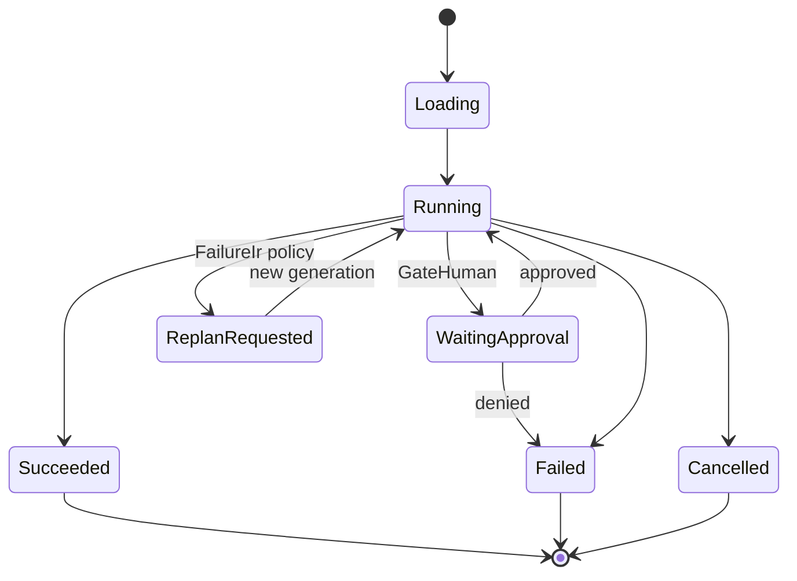

# RFC-0010: Scheduler & Runtime Adapters

| Field | Value |
| --- | --- |
| Status | Draft |
| Author | arkadianet |
| Architecture | Alloy Architecture V2 (frozen) |
| Depends on | RFC-0003, RFC-0004, RFC-0006, RFC-0009 |
| Effort | 5–8 person-days |

## Purpose

Ready-queue executor over the Task DAG with retries, budgets, cancel, and RunController integration. MVP is **linear** (`max_parallel_cargo=1`, `max_parallel_edits=1`). VerifyCompile / VerifyTest / GateHuman are **runtime adapters**, not LLM capabilities (V2 §6.3, §10.4, ADR F-10/F-16).

## Scope

### In scope

- `Scheduler` trait: `run` / `cancel`
- Linear scheduling; retries with backoff; escalate tier hooks
- Emit `ReplanRequired` only (no topology mutation)
- Runtime adapters: VerifyCompile (`cargo_check` via MCP), VerifyTest, GateHuman (`WaitingApproval` → `RunController::approve`)
- Global run timeout; node timeouts
- Checkpoint refs = git only (via EditEngine path already taken)
- Decision/node_state events via observability

### Out of scope

- Capability LLM workers → [RFC-0013](./RFC-0013-capability-registry-workers.md) (scheduler invokes registry resolve)
- File leases / priority function / distributed workers → deferred
- Temporal-like durability → deferred
- LLM planner → RFC-0009 stub / M3

Until 0013 lands, Analyze/Edit/Review nodes may call injected test doubles.

## Dependencies

- **RFC-0003** — RunController approve/cancel/start
- **RFC-0004** — metrics / decisions
- **RFC-0006** — cargo_check / cargo_test tools
- **RFC-0009** — DAG store + states

## Public API

From V2 §6.3:

```rust
#[async_trait]
pub trait Scheduler: Send + Sync {
    async fn run(&self, dag_id: DagId) -> Result<DagOutcome, SchedError>;
    async fn cancel(&self, dag_id: DagId) -> Result<(), SchedError>;
}

pub struct RetryPolicy {
    pub max_attempts: u32,
    pub backoff: Backoff,
    pub retry_on: Vec<ErrorClass>,
    pub escalate_after: Option<u32>,
    pub escalate_to_tier: Option<ModelTier>,
}
```

Workers return `FailureIr` only; scheduler may request replan.

## Internal architecture

`alloy-runtime::scheduler`. Sequence for local diagnostic repair matches V2 §6.5 (CLI → Session → RunController → Template Planner → Scheduler → workers/EditEngine/MCP → GateHuman).

## Data structures

Ready queue (size ≤1 for cargo/edits in MVP), per-node attempt counters, `DagOutcome` summary.

## State machine

Consumes Appendix C node states; DAG-level:



## Failure modes

| Failure | Handling |
| --- | --- |
| Stuck WaitingApproval | Timeout; cancel; dump state (R2) |
| Builtin tool failure | Retry per node policy |
| Budget exhaustion | Stop; event; user ask |
| Cycle / invalid ready set | Assert / fail (should be impossible post-validate) |

## Testing strategy

- Unit: linear walk of repair template with mock workers
- Unit: retry then succeed; retry exhaust → fail
- Integration: VerifyCompile adapter with recorded cargo JSON fixture
- GateHuman: blocks until approve
- Cancel mid-run marks Cancelled

## Acceptance criteria

- [ ] `max_parallel=1` honesty for cargo/edits
- [ ] Verify/Test/Gate are runtime adapters, not capabilities
- [ ] No worker topology mutation; replan requests only
- [ ] Integrates RunController start/cancel/approve
- [ ] Retries + budgets + timeouts enforced
- [ ] Emits observability events

## Estimated implementation effort

**5–8 person-days**.

## Future extensions

- Raise parallelism when measured; keep trait stable
- File leases / priority (V2 §6 deferred)
- Parallel Analyze only after eval uplift (M3)
