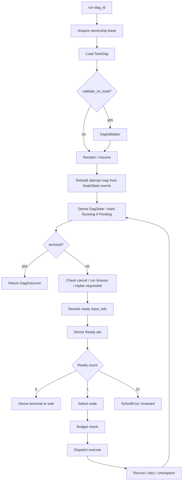
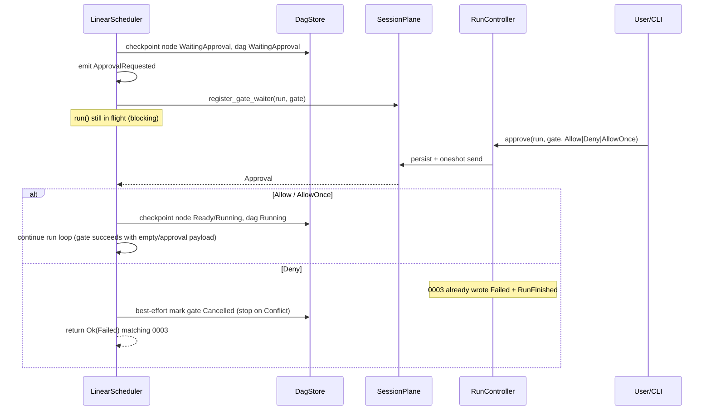
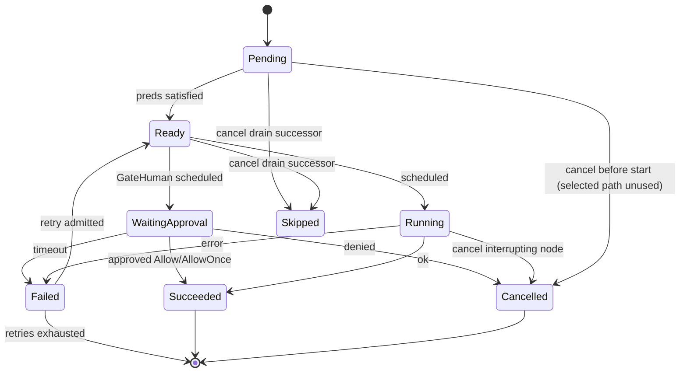

# RFC-0010: Scheduler & Runtime Adapters

| Field | Value |
| --- | --- |
| **Status** | Draft |
| **Author** | arkadianet |
| **Architecture** | Alloy Architecture V2 (**frozen**) — do not redesign |
| **Depends on** | [RFC-0003](./RFC-0003-session-manager-run-controller.md) (merged), [RFC-0004](./RFC-0004-observability-cost-metering.md) (merged), [RFC-0006](./RFC-0006-mcp-host-builtins.md) (merged), [RFC-0009](./RFC-0009-task-dag-templates-planner.md) (merged) |
| **Effort** | 5–8 person-days |
| **Related RFCs** | [0001](./RFC-0001-alloy-runtime.md) host / `SchedError` · [0002](./RFC-0002-storage-artifacts-session-events.md) artifacts / events · [0005](./RFC-0005-sandbox-broker.md) sandbox via MCP · [0007](./RFC-0007-model-router-provider.md) `RetryDisposition` / `FailureIr.retry` (not a hard dep) · [0013](./RFC-0013-capability-registry-workers.md) capability workers · [0015](./RFC-0015-cli-profiles-config.md) `alloy run` |
| **Product** | Alloy — AI Engineering Runtime |
| **Supersedes** | Draft outline of this filename (expanded to implementation grade) |

**Mental model (V2 §6.3 / §10.4 / ADR F-10 / F-16):** The Scheduler is the **first Alloy component that executes a plan**. It walks a validated `TaskDag` **serially** (`max_parallel_*=1`), dispatches capability nodes versus runtime adapters, checkpoints same-generation state through `put_if_generation`, and returns a `DagOutcome` that RFC-0003 / RFC-0015 surface. VerifyCompile / VerifyTest / GateHuman are **runtime adapters**, not LLM capabilities. Capability workers land in RFC-0013; until then the scheduler MUST inject an explicit stub executor rather than fail opaquely.

**Authority order (highest → lowest):** current `main` source → merged RFCs 0001–0007, 0009, 0016 → Architecture V2 → this draft → roadmaps. Never reshape a merged public API solely to match an older V2 sketch or this document’s prior outline. RFC-0009 §6.5 / §6.6 and Appendix C are **binding** on this RFC.

---

## 1. Overview

### 1.1 Purpose

Ship the MVP **linear Scheduler and real runtime adapters** inside `alloy-runtime` (adapters may call into `alloy-tools`):

1. **`LinearScheduler`** implementing the merged `Scheduler` trait, replacing `NullScheduler` as the production default.
2. **Ready-set derivation and single-node selection** over a validated `TaskDag` under RFC-0009 §5.3.1 (serial honesty).
3. **Node dispatch** — capability nodes via an injectable `CapabilityExecutor`; adapter nodes via `VerifyCompileAdapter` / `VerifyTestAdapter` / `GateHumanAdapter`; structural `Aggregate` via a deterministic fold.
4. **Real adapters** — `McpVerifyCompileAdapter`, `McpVerifyTestAdapter` over RFC-0006 `cargo_check` / `cargo_test`; `SessionGateHumanAdapter` bridging `WaitingApproval` to `SessionPlane::register_gate_waiter` + `RunController::approve`.
5. **Retry / backoff / tier escalation execution** of RFC-0009 `RetryPolicy` under the RFC-0007 admission rule.
6. **Same-generation checkpointing** through `DagStore::put_if_generation` with Conflict abort.
7. **Cancellation, drain, restart-resume**, budget enforcement, and observability (`NodeState`, `DecisionKind::Retry` / `Budget` / `Gate`, cost meter ownership).

### 1.2 Problem Statement

Seven RFCs have built substrate — storage, sessions, observability, sandbox, tool bus, model router, DAG store — and nothing yet runs a plan. Current `main` registers `NullScheduler` (`SchedError::Unavailable`). Adapter traits exist only as `Unavailable*` stubs. Without this RFC there is no ready-queue, no verify loop, no gate bridge, no checkpointed node progress, and neither RFC-0015 (`alloy run`) nor RFC-0013 (workers) has an execution contract to target.

### 1.3 Scope

| In scope | Detail |
| --- | --- |
| Linear `Scheduler` | `LinearScheduler` replacing `NullScheduler` for production wiring |
| Ready-queue | Derive Ready set; select exactly one node; serial dispatch |
| Dispatch | Capability vs adapter vs Aggregate |
| Verify adapters | Real MCP-backed compile/test adapters |
| Gate adapter | Real `GateHuman` ↔ `RunController` / `SessionPlane` bridge |
| Retry execution | Attempt counters, backoff sleep, escalation, exhaustion → Failed |
| Checkpointing | Same-generation `put_if_generation`; Conflict abort |
| Cancel / drain | Token propagation; Cancelled vs Skipped; runtime drain composition |
| Budgets | Pre-node session budget check; per-node token budget for LLM nodes |
| Observability | Spans, `NodeState` events, DecisionLog (no double-count of model/tool) |
| Tests | Unit + cross-subsystem `repair_local_diagnostic` against SQLite + sandboxed `cargo_check` |

### 1.4 Non-goals

| Deferred item | Owner |
| --- | --- |
| Topology mutation / replan / template selection | **RFC-0009** (scheduler may only cancel/skip existing nodes and request replan) |
| Capability worker logic and prompts | **RFC-0013** |
| Concurrent / parallel node execution | **Forbidden** by RFC-0009 §6.5 — MUST NOT be built |
| File leases / priority function | Deferred pending eval (V2 §6.1 / §6.3) |
| Applying cache hits / `CachedHit` transitions | Deferred by RFC-0009 (day-1 `cache_key = None`) |
| `alloy run` CLI surface | **RFC-0015** |
| `EdgeKind::Hint` semantics | Deferred (inert per RFC-0009 §5.10) |
| Temporal-like durability / distributed workers | Deferred (V2 §6.3) |
| Sixth crate / writing `.env` | Forbidden |

### 1.5 Day-1 MVP (normative)

1. `LinearScheduler` MUST implement `Scheduler` and MUST be constructible with injected stores, adapters, session plane, cost meter, decision log, and a `CapabilityExecutor` (day-1 production MAY inject `UnavailableCapabilityExecutor`).
2. Execution MUST be **serial**: at most one node in `NodeState::Running` at a time. `BudgetPolicy.max_parallel_nodes`, `max_parallel_cargo`, and `max_parallel_edits` MUST be treated as **1** (honesty). A value other than `1` at construction MUST return `SchedError::Config` and MUST NOT start.
3. Ready-set derivation MUST apply RFC-0009 §5.3.1 exactly. `EdgeKind::Hint` MUST be ignored. When more than one Ready node exists (non-MVP topology), the scheduler MUST fail closed with `SchedError::Invariant("multiple ready nodes under serial scheduler")` — it MUST NOT pick arbitrarily and MUST NOT run them concurrently.
4. `VerifyCompile` / `VerifyTest` MUST call `McpPlatform::call` (via `ToolHandle`) for `cargo_check` / `cargo_test`. A non-zero child exit returned as `Ok(ToolResult)` with `ToolError::ExecutionFailed` MUST become `VerifyOutcome { ok: false, … }` (**normal outcome**). `McpError::PermissionDenied` / sandbox denial MUST become `AdapterError::PermissionDenied` (**error**), not a compile/test failure.
5. `GateHuman` MUST checkpoint `NodeState::WaitingApproval` + `DagState::WaitingApproval`, emit `ApprovalRequested`, call `SessionPlane::register_gate_waiter`, and **block** inside `Scheduler::run` until `Approval` arrives, cancel fires, or `timeout_ms` elapses.
6. All production DAG writes MUST use `put_if_generation(&dag, Some(dag.generation))` with `dag.generation` unchanged. On `StoreError::Conflict`, the scheduler MUST stop checkpointing and MUST terminate the run per §5.8.
7. Retry admission MUST require `failure.retry == RetryDisposition::Retryable` **and** `failure.error_class ∈ policy.retry_on` (RFC-0007 §8.4.1).
8. Alloy MUST NEVER write `.env`. New knobs, if any, are documented in `example.env` comments and/or profile TOML only.

---

## 2. Architecture Integration

### 2.1 Relationship to Architecture V2

| V2 reference | Application |
| --- | --- |
| §6.1 Why a DAG / ADR F-16 | Linear MVP; provenance, gates, retries — not fake parallelism |
| §6.2 Task DAG | Consume merged types; cancel/skip only; request replan only |
| §6.3 Scheduler | Ready-queue, retries, budgets, cancel, RunController integration |
| §6.5 Repair sequence | CLI → Session → RunController → Planner → **Scheduler** → workers/adapters → GateHuman |
| §10.4 Runtime adapters | VerifyCompile / VerifyTest / GateHuman are adapters, not capabilities |
| Appendix B | `max_parallel_*=1` honesty |
| Appendix C | Node state machine — reconciled in §5.11 |
| ADR F-10 | Verify*/Gate are not LLM capabilities |
| ADR F-03 | No `follow_up_nodes`; replan requests only |

### 2.2 Relationship to merged RFCs

| RFC | What this RFC consumes / extends |
| --- | --- |
| **0001** | `Scheduler` / `DagOutcome` / `DagState` / `SchedError` / `AdapterError` / `RuntimeHandle::run_dag` / `cancel_dag` / drain / `RuntimeConfig.run_timeout` / `BudgetPolicy` |
| **0002** | `ArtifactStore`, `EventStore`, session event envelopes |
| **0003** | `RunController::{start,cancel,approve,request_replan}`, `SessionPlane::register_gate_waiter`, outcome merge table, gate waiter lifecycle |
| **0004** | `DecisionLog`, `SharedCostMeter`, `BudgetCheck`, `maybe_signal_budget_warning`, `DecisionKind::{Retry,Budget,Gate}` |
| **0005** | Sandbox enforcement **through** MCP builtins (no direct broker calls from adapters) |
| **0006** | `McpPlatform` / `ToolHandle` / `cargo_check` / `cargo_test` / `ToolResult` / `ToolError` / `McpError` |
| **0007** | `RetryDisposition` / `FailureIr.retry` admission rule (consumed; **not** a Cargo dependency of this RFC’s hard path) |
| **0009** | Validated DAG shapes, readiness rules, `put_if_generation`, §6.5/§6.6, envelopes, retry field ownership |

### 2.3 Already implemented | Added by RFC-0010 | Deferred

| Category | Contents |
| --- | --- |
| **Already implemented** | `Scheduler` / `DagState` / `DagOutcome` / `NullScheduler`; `SchedError` / `AdapterError` stubs; adapter traits + `Unavailable*`; `TaskDag` / node types; `DagStore` / `put_if_generation`; envelopes; `RetryPolicy`; `RunController` / gate waiters; `DecisionLog` / `CostMeter`; MCP builtins; runtime single-flight `run_dag` |
| **Added by RFC-0010** | `LinearScheduler`; ready-set / select / run-loop; real verify + gate adapters; rustc JSON → `DiagnosticEvent` ingest; `CapabilityExecutor` + unavailable stub; attempt-counter durability via `NodeState` events; checkpoint/CAS/conflict policy; cancel/drain semantics; `SchedError` / `AdapterError` additive variants; budget + decision emission during execution; cross-subsystem e2e test |
| **Deferred** | Parallel nodes; file leases; cache-hit application; capability worker bodies (0013); CLI (0015); Hint edges; Temporal durability |

### 2.4 What RFC-0013 and RFC-0015 may rely on

| Consumer | May rely on |
| --- | --- |
| **RFC-0013** | `CapabilityExecutor` injection point; `CapabilityExecContext` fields (`effective_tier`, budgets, envelopes, cancellation); serial dispatch; retry admission already applied by scheduler (workers return `FailureIr`, do not self-retry); verify adapters producing diagnostics for repair input envelopes |
| **RFC-0015** | `DagOutcome` field semantics (§5.12); `Scheduler::run` / `cancel` via `RunController::start` / `cancel`; gate UX over existing `approve`; terminal mapping already implemented in RFC-0003 |

### 2.5 Inherited RFC-0009 constraints (normative — restated)

| Constraint | Source |
| --- | --- |
| MVP scheduler is **linear**; at most one node runs at a time | RFC-0009 §6.5, ADR F-16 |
| Concurrency safety of Ready siblings is **unmodelled**; a concurrent scheduler MUST NOT be built on this model | RFC-0009 §6.5 |
| `EdgeKind::Sequence` is ordering, **not a lease** | RFC-0009 §6.5 |
| `max_parallel_* = 1` — scheduler honesty | V2 Appendix B |
| Only `PlanService` mutates topology; scheduler may cancel/skip **existing** nodes and write **same-generation** checkpoints | RFC-0009 §6.2 / §6.4 |
| Production DAG writes use `put_if_generation` with `expected = Some(current.generation)` and `dag.generation` unchanged | RFC-0009 §6.6 |
| On `StoreError::Conflict`, scheduler MUST stop checkpointing | RFC-0009 §6.6 |
| Replan rejected while `DagState::Running` (`DagBusy`) | RFC-0009 §6.6 |
| Scheduler MUST NOT read `planner::*`, select templates, or introduce fan-out edge kinds | RFC-0009 |
| `EdgeKind::Hint` MUST NOT affect scheduling | RFC-0009 §5.10 |
| Applying cache hits is deferred | RFC-0009 |
| No attempt counter field on `TaskNode` — keep outside merged struct | RFC-0009 §6.4 |
| Rewrite final `input_ref` when Data preds succeed (§5.3.0) | RFC-0009 Appendix C |
| Single scheduler writer per DAG (ownership / leasing is RFC-0010’s responsibility) | RFC-0009 Appendix C |

**Any RFC text implying parallel node execution is a defect.**

### 2.6 Dependency boundaries

```text
alloy-cli / host assembly
        │
        ▼
alloy-runtime::scheduler (LinearScheduler)
        │
        ├──► DagStore / ArtifactStore / EventSink   (0002/0009)
        ├──► SessionPlane / RunController           (0003)
        ├──► DecisionLog / SharedCostMeter          (0004)
        ├──► adapters::{ (verify / gate)            (this RFC)
        │         └──► alloy-tools::mcp ToolHandle  (0006 → 0005)
        └──► CapabilityExecutor                     (stub now; 0013 fills)
```

`alloy-runtime` MUST NOT depend on `alloy-tools` at the crate level for the scheduler core if that would create a cycle; adapters that call MCP live in `alloy-runtime` behind a thin trait object injected from host assembly **or** in an `alloy-runtime` feature/`adapters::mcp` module that takes `Arc<dyn …>` constructed in `alloy-cli` / tests. Normative day-1 choice: **host injects** `Arc<dyn VerifyCompileAdapter>` etc., with concrete MCP impls defined in `alloy-runtime` only if they take already-abstracted callables; preferred concrete types live in a host-wiring module under `alloy-tools` **or** as `alloy-runtime` types holding `Arc<dyn McpCall>` — see §4.4. No sixth crate.

---

## 3. Public Rust API

### 3.1 Reused types (normative — unchanged fields)

| Type | Module | Rule |
| --- | --- | --- |
| `Scheduler`, `DagState`, `DagOutcome` | `scheduler` | Unchanged fields; behavior specified here |
| `TaskDag`, `TaskNode`, `NodeKind`, `NodeState`, `EdgeKind`, `RetryPolicy`, `Backoff`, `CacheKey`, `ApprovalSpec` | `dag::types` | Unchanged |
| `NodeInputEnvelope`, `NodeOutputEnvelope`, `PredecessorOutput`, `ENVELOPE_SCHEMA_VERSION` | `dag::io` | Unchanged |
| `VerifyCompileAdapter`, `VerifyTestAdapter`, `GateHumanAdapter`, `NodeExecContext`, `NodeExecRef`, `VerifyOutcome`, `Approval` | `adapters` | Unchanged signatures |
| `DagStore::put_if_generation` | `storage::dags` | Unchanged |
| `FailureIr`, `ErrorClass`, `RetryDisposition`, `DiagnosticEvent` | `types::diagnostic` | Unchanged |
| `PermissionToken`, `Grant`, `ExecAllow`, `Glob` | `types::permission` | Unchanged |
| `ToolCall`, `ToolResult`, `ToolError`, `ToolName` | `types::tools` | Unchanged |
| `BudgetPolicy`, `TokenBudget`, `ModelTier`, `SharedCostMeter`, `BudgetCheck`, `DecisionLog`, `DecisionKind` | budget / obs | Unchanged |
| `SessionPlane::register_gate_waiter`, `RunController` | `session` | Unchanged |

### 3.2 Additive extension — `SchedError`

Current `main` variants remain. Implementation MUST add `#[non_exhaustive]` and the variants below (extend, do not remove):

```rust
#[derive(Debug, thiserror::Error)]
#[non_exhaustive]
pub enum SchedError {
    #[error("unavailable")]
    Unavailable,

    #[error("cancelled")]
    Cancelled,

    #[error("dag not found: {0}")]
    DagNotFound(DagId),

    #[error("internal: {0}")]
    Internal(String),

    /// Invalid scheduler / budget parallelism configuration.
    #[error("config: {0}")]
    Config(String),

    /// Generation CAS conflict — stop checkpointing (§5.8).
    #[error("generation conflict for dag {dag_id}")]
    Conflict { dag_id: DagId },

    /// DAG state is not runnable / resumable under §5.2.
    #[error("invalid dag state {state:?} for run")]
    InvalidDagState { state: DagState },

    /// Invariant violation (e.g. multiple Ready under serial policy).
    #[error("invariant: {0}")]
    Invariant(String),

    /// Store / artifact / event I/O failure after mapping.
    #[error("store: {0}")]
    Store(String),

    /// Node execution exhausted retries or hit a non-retryable failure that fails the DAG.
    /// Prefer returning `Ok(DagOutcome { state: Failed, … })` for planned failures;
    /// use this only when the scheduler itself cannot produce an outcome.
    #[error("execution: {0}")]
    Execution(String),
}
```

**Boundary mapping (normative):**

| `SchedError` | `RuntimeHandle::run_dag` | `RunController::start` merge |
| --- | --- | --- |
| `Unavailable` | `RuntimeError::SchedulerUnavailable` | `RunError::SchedulerUnavailable` |
| `Cancelled` | `RuntimeError::Scheduler(Cancelled)` | success-path cancel finalize |
| `DagNotFound` | `RuntimeError::Scheduler(…)` | `InvalidPhase("dag not found: …")` |
| `Conflict` | `RuntimeError::Scheduler(…)` | `Internal` / error event |
| other | `RuntimeError::Scheduler(…)` | `runtime_to_run` → `Internal` / typed |

**Planned node/DAG failures** (compile loop exhaustion, approval deny handled by 0003, budget stop) MUST return `Ok(DagOutcome { state: Failed|Cancelled|…, failure: Some|None })`, not `Err(SchedError)`, whenever a durable outcome exists.

### 3.3 Additive extension — `AdapterError`

```rust
#[derive(Debug, thiserror::Error)]
#[non_exhaustive]
pub enum AdapterError {
    #[error("unavailable")]
    Unavailable,

    #[error("cancelled")]
    Cancelled,

    #[error("tool: {0}")]
    Tool(String),

    #[error("internal: {0}")]
    Internal(String),

    /// Sandbox / permission denial (NOT a compile/test failure).
    #[error("permission denied: {0}")]
    PermissionDenied(String),

    /// Adapter-level timeout (node `timeout_ms` or host call timeout).
    #[error("timeout")]
    Timeout,

    /// MCP / host shutting down.
    #[error("shutting down")]
    ShuttingDown,
}
```

### 3.4 `CapabilityExecutor` (new)

```rust
/// Executes LLM / capability nodes (Plan, Analyze, Edit, Review).
///
/// Day-1 production MAY inject [`UnavailableCapabilityExecutor`].
/// RFC-0013 supplies real workers behind this trait.
#[async_trait]
pub trait CapabilityExecutor: Send + Sync {
    async fn execute(
        &self,
        ctx: &CapabilityExecContext,
    ) -> Result<CapabilityOutcome, CapabilityExecError>;
}

/// Context for one capability-node attempt.
#[derive(Debug, Clone)]
pub struct CapabilityExecContext {
    pub meta: NodeExecRef,
    pub cancellation: CancellationToken,
    /// Capability id from `TaskNode.capability` (always `Some` post-validate).
    pub capability: CapabilityId,
    pub kind: NodeKind,
    /// Effective tier after escalation (§5.6).
    pub effective_tier: ModelTier,
    pub budget: TokenBudget,
    pub timeout: Duration,
    /// Decoded input envelope (schema_version == 1).
    pub input: NodeInputEnvelope,
    /// Attempt index starting at 1.
    pub attempt: u32,
}

#[derive(Debug, Clone)]
pub struct CapabilityOutcome {
    /// Success payload written into `NodeOutputEnvelope.payload`.
    pub payload: serde_json::Value,
    /// Optional structured failure when the worker soft-fails into repair signalling.
    /// When `None` and `Ok` returned → success.
    pub failure: Option<FailureIr>,
}

#[derive(Debug, thiserror::Error)]
#[non_exhaustive]
pub enum CapabilityExecError {
    #[error("unavailable")]
    Unavailable,
    #[error("cancelled")]
    Cancelled,
    #[error("timeout")]
    Timeout,
    #[error("worker: {0}")]
    Worker(String),
    #[error("internal: {0}")]
    Internal(String),
}

#[derive(Debug, Default, Clone, Copy)]
pub struct UnavailableCapabilityExecutor;

#[async_trait]
impl CapabilityExecutor for UnavailableCapabilityExecutor {
    async fn execute(
        &self,
        _ctx: &CapabilityExecContext,
    ) -> Result<CapabilityOutcome, CapabilityExecError> {
        Err(CapabilityExecError::Unavailable)
    }
}
```

**Visibility:** `pub` in `alloy_runtime::scheduler` (or `alloy_runtime::adapters::capability`); re-exported at crate root.

### 3.5 `LinearScheduler` (new)

```rust
/// Serial ready-queue scheduler (RFC-0010).
pub struct LinearScheduler {
    // private fields — see §4
}

pub struct LinearSchedulerDeps {
    pub dags: Arc<dyn DagStore>,
    pub artifacts: Arc<dyn ArtifactStore>,
    pub events: Arc<dyn EventSink>,          // or RuntimeHandle append path
    pub handle: RuntimeHandle,               // phase, append_session, cancellation
    pub session_plane: Arc<SessionPlane>,    // register_gate_waiter; run/session lookup
    pub sessions: Arc<dyn SessionRows>,      // resolve run_id / workspace / profile
    pub verify_compile: Arc<dyn VerifyCompileAdapter>,
    pub verify_test: Arc<dyn VerifyTestAdapter>,
    pub gate_human: Arc<dyn GateHumanAdapter>,
    pub capabilities: Arc<dyn CapabilityExecutor>,
    pub decision_log: Arc<dyn DecisionLog>,
    /// Per-run meter; host MAY supply a factory — see §5.9.
    pub cost_meter_factory: Arc<dyn Fn(RunId) -> SharedCostMeter + Send + Sync>,
    pub budget_policy: BudgetPolicy,
    pub run_timeout: Duration,
    pub config: SchedConfig,
}

impl LinearScheduler {
    /// Construct. MUST reject `budget_policy.max_parallel_* != 1` with panic-free
    /// `Err` at wire-up, or defer check to first `run` → `SchedError::Config`.
    pub fn new(deps: LinearSchedulerDeps) -> Result<Self, SchedError>;
}

#[async_trait]
impl Scheduler for LinearScheduler {
    async fn run(&self, dag_id: DagId) -> Result<DagOutcome, SchedError>;
    async fn cancel(&self, dag_id: DagId) -> Result<(), SchedError>;
}
```

**Ownership:** `LinearScheduler: Send + Sync`. Stored as `Arc<dyn Scheduler>` via `RuntimeHandle::set_scheduler`.

**Lifecycle:** Constructed once at host start after storage/MCP/session plane exist; lives until runtime shutdown.

### 3.6 `SchedConfig` (new)

```rust
#[derive(Debug, Clone)]
pub struct SchedConfig {
    /// Max time to wait for in-flight node after cancel before forcing Cancelled.
    pub cancel_drain_grace: Duration,
    /// Whether to re-validate DAGs with `DagValidator` on load (default true).
    pub validate_on_load: bool,
    /// Default ValidateOpts when validate_on_load (gates required; linear MVP).
    pub validate_opts: ValidateOpts,
}

impl Default for SchedConfig {
    fn default() -> Self {
        Self {
            cancel_drain_grace: Duration::from_secs(5),
            validate_on_load: true,
            validate_opts: ValidateOpts {
                require_gates: true,
                enforce_linear_mvp: true,
            },
        }
    }
}
```

### 3.7 Concrete adapters (new)

```rust
/// MCP-backed VerifyCompile.
pub struct McpVerifyCompileAdapter {
    handle: ToolHandle, // selectors MUST disclose cargo_check (tag sel.compiler)
    perms_factory: Arc<dyn Fn(&NodeExecContext) -> PermissionToken + Send + Sync>,
    artifacts: Arc<dyn ArtifactStore>,
}

#[async_trait]
impl VerifyCompileAdapter for McpVerifyCompileAdapter {
    async fn check(&self, ctx: &NodeExecContext) -> Result<VerifyOutcome, AdapterError>;
}

/// MCP-backed VerifyTest.
pub struct McpVerifyTestAdapter { /* same shape; tool cargo_test */ }

#[async_trait]
impl VerifyTestAdapter for McpVerifyTestAdapter {
    async fn test(&self, ctx: &NodeExecContext) -> Result<VerifyOutcome, AdapterError>;
}

/// GateHuman bridging SessionPlane + oneshot approval.
pub struct SessionGateHumanAdapter {
    plane: Arc<SessionPlane>,
}

#[async_trait]
impl GateHumanAdapter for SessionGateHumanAdapter {
    async fn wait_approval(
        &self,
        ctx: &NodeExecContext,
        gate: GateId,
    ) -> Result<Approval, AdapterError>;
}
```

`Unavailable*` stubs remain for tests; production wiring MUST NOT use them for verify/gate.

### 3.8 `NullScheduler` retention

`NullScheduler` MUST remain public for tests. Production host MUST call `set_scheduler(Arc::new(LinearScheduler::…))` before accepting runs. Until set, `run_dag` continues to surface `SchedulerUnavailable`.

### 3.9 Crate-root re-exports

MUST re-export: `LinearScheduler`, `LinearSchedulerDeps`, `SchedConfig`, `CapabilityExecutor`, `CapabilityExecContext`, `CapabilityOutcome`, `CapabilityExecError`, `UnavailableCapabilityExecutor`, `McpVerifyCompileAdapter`, `McpVerifyTestAdapter`, `SessionGateHumanAdapter` (concrete MCP types MAY be feature-gated or live behind host wiring — if not at crate root, §4 MUST name the module path).

---

## 4. Internal Module Design

### 4.1 Hierarchy

```text
crates/alloy-runtime/src/
  scheduler/
    mod.rs              # re-exports
    traits.rs           # unchanged Scheduler / DagOutcome / DagState
    null.rs             # NullScheduler (retained)
    linear.rs           # LinearScheduler
    ready.rs            # ready-set derivation (pure)
    dispatch.rs         # kind → executor selection
    retry.rs            # admission, backoff sleep, escalation
    checkpoint.rs       # put_if_generation helpers + Conflict handling
    attempts.rs         # attempt map + NodeState event rebuild
    outcome.rs          # DagState derivation + DagOutcome build
    cancel.rs           # cancel registry + token fan-out
    budget.rs           # pre-node budget checks
    capability.rs       # CapabilityExecutor + Unavailable*
  adapters/
    mod.rs              # existing traits + Unavailable*
    verify_compile.rs   # McpVerifyCompileAdapter + rustc JSON ingest
    verify_test.rs      # McpVerifyTestAdapter
    gate_human.rs       # SessionGateHumanAdapter
    diagnostics.rs      # rustc JSON → Vec<DiagnosticEvent>
```

### 4.2 Responsibilities

| Module | Responsibility |
| --- | --- |
| `linear` | Run loop orchestration; ownership lease; restart reclaim |
| `ready` | Pure Ready-set from DAG + §5.3.1 |
| `dispatch` | Map `NodeKind` → capability / verify / gate / aggregate |
| `retry` | Admission predicate; backoff duration; escalate tier |
| `checkpoint` | Serialize write path; map Conflict |
| `attempts` | Process-local map; rebuild from `NodeState` events |
| `outcome` | Derive `DagState` from node states; build `DagOutcome` |
| `cancel` | Per-dag cancel tokens; Cancelled vs Skipped marking |
| `budget` | Session + node budget gates |
| `adapters::*` | Real tool/gate execution |

### 4.3 Dependency direction

```text
linear → ready, dispatch, retry, checkpoint, attempts, outcome, cancel, budget
dispatch → adapters traits, capability trait
adapters::verify_* → types tools/diagnostic, ArtifactStore (no scheduler import)
adapters::gate_human → SessionPlane (no scheduler import)
scheduler MUST NOT import planner::*
scheduler MUST NOT import alloy-tools directly unless behind an injected ToolHandle
```

### 4.4 Injection points

| Dependency | Injected as | Constructed by |
| --- | --- | --- |
| `DagStore` | `Arc<dyn DagStore>` | `AlloyStorage::dags()` |
| `ArtifactStore` | `Arc<dyn ArtifactStore>` | `AlloyStorage::artifacts()` |
| `SessionPlane` | `Arc<SessionPlane>` | session host |
| `ToolHandle` | into MCP adapters | `ToolHandle::new(platform, [ToolSelector::tag("sel.compiler")])` (and test tag as needed) |
| `PermissionToken` factory | closure | host: profile grants + `run_id` from session/run rows |
| `CapabilityExecutor` | `Arc<dyn …>` | `UnavailableCapabilityExecutor` until 0013 |
| `DecisionLog` / meter factory | `Arc<…>` | RFC-0004 wiring |
| `BudgetPolicy` / `run_timeout` | values | `RuntimeConfig` |

**PermissionToken (normative contents for verify adapters):**

| Field | Source |
| --- | --- |
| `profile` | `Session.profile` |
| `run_id` | Active `RunId` for this DAG |
| `expires` | `None` in MVP (or session policy if later set) |
| `grants` | MUST include `Grant::Exec(ExecAllow { binary: "cargo", args_glob: Some("check …") })` / test equivalent sufficient to pass RFC-0006 `match_exec_grant` for the intended argv; host assembly owns grant construction (profile catalog → grants). Adapters MUST NOT invent grants. |

---

## 5. Execution Algorithm

### 5.1 Pipeline overview



### 5.2 Load, validate, reclaim

| Step | Rule |
| --- | --- |
| 1 | `dags.get(dag_id)` → `None` ⇒ `Err(DagNotFound)` |
| 2 | If `validate_on_load`, run `DagValidator::validate` with `SchedConfig.validate_opts`; on error ⇒ `Err(Invariant(…))` |
| 3 | Resolve `(session_id, run_id, workspace_root, profile)` by finding the run whose `RunGoalRecord.dag_id == dag_id` via `SessionRows` (session = `dag.session_id`). Missing run ⇒ `Err(Internal("no run bound to dag"))` |
| 4 | **Ownership:** insert `dag_id` into process-local `owned: Mutex<HashMap<DagId, OwnedDag>>`. If another in-process run holds it ⇒ `Err(Internal("dag already owned"))`. Runtime single-flight already limits concurrent `run_dag`; this map is the RFC-0009 Appendix C lease. |
| 5 | **Crash reclaim:** if loaded `dag.state == Running` and this process did **not** previously own it in this process lifetime (always true on fresh start), transition via same-generation checkpoint: set `dag.state = Failed`, mark any `NodeState::Running` node → `Failed` with `FailureIr { error_class: Internal, retry: NonRetryable, notes: "reclaimed stale Running after process restart" }`, emit `NodeState`, then continue as Failed terminal **or** — if control plane `RunControlState` after RFC-0003 resume is `Accepted` and nodes are resumable — leave non-Running nodes intact and set `dag.state = Running` only after reclaiming in-flight node to `Failed`/`Ready` per §5.2.1 |
| 6 | Legal load states to **continue execution:** `Pending`, `Running` (after reclaim), `WaitingApproval` (resume gate). Legal load states to **return immediately:** `Succeeded`, `Failed`, `Cancelled`, `ReplanRequired` (return `Ok(DagOutcome)` reflecting stored state without mutation). |

#### 5.2.1 Stale `Running` node on resume (normative)

| Observed node state | Action |
| --- | --- |
| `Running` | Treat attempt as crashed: transition to `Failed` with `ErrorClass::Internal`, `retry: Retryable` if `Internal`∉ default non-retry — **normative:** use `retry: NonRetryable` for crash reclaim (do not auto-retry crash as Model). Emit event. Then apply readiness: if retries remain **and** admission would pass for a synthetic reclaim policy — **MUST NOT** auto-retry reclaim failures. Node stays `Failed`. Downstream: DAG fails unless other paths… For linear chain, DAG becomes Failed. |
| `WaitingApproval` | Re-enter gate path (§5.7): re-register waiter; do not mark Failed |
| `Ready` / `Pending` / terminal | Keep |

**Day-1 simplification (binding):** On process restart, any node found `Running` → `Failed` + DAG `Failed` with reclaim `FailureIr`. `WaitingApproval` is the only mid-flight state that resumes into active waiting. This matches RFC-0003 rewriting control state to `accepted` and re-dispatching `start`.

### 5.3 Ready-set derivation (pure)

Function:

```rust
pub fn ready_nodes(dag: &TaskDag) -> Vec<NodeId>;
```

| Rule | Detail |
| --- | --- |
| Candidates | Nodes with `state == Pending` whose Data∪Sequence predecessors are satisfied per RFC-0009 §5.3.1, **or** nodes with `state == Ready` |
| Hint | Ignored |
| Order | Ascending `NodeId` (`BTreeMap` key order) |
| Side effect | None — transitioning `Pending → Ready` is a separate checkpointed step |

**Pending → Ready transition:** Before selection, for each newly satisfiable `Pending` node in NodeId order: set `Ready`, emit `NodeState`, rewrite `input_ref` if needed (§5.4), checkpoint **once** per batch (single CAS write after all Ready promotions in the iteration).

### 5.4 `input_ref` rewrite (RFC-0009 §5.3.0)

When all **Data** predecessors of node `n` are `Succeeded` or `CachedHit` with `output_ref = Some`:

1. Build `NodeInputEnvelope { schema_version: 1, dag_id, node_id, kind, generation: dag.generation, payload: FromPredecessors { preds } }` where each `PredecessorOutput` uses the predecessor’s real `output_ref`.
2. `artifacts.put` the JSON bytes (`ArtifactKind::Blob`, labels include `envelope=input`).
3. Set `n.input_ref` to the new id.
4. Include in the same checkpoint as the Ready promotion.

Placeholder `pending:true` blobs MUST NOT be treated as success outputs.

### 5.5 Node selection

| Condition | Action |
| --- | --- |
| `ready_nodes` empty | Go to §5.10 terminal derivation |
| exactly one | Select it |
| more than one | `Err(Invariant("multiple ready nodes under serial scheduler"))` |

### 5.6 Dispatch table

| `NodeKind` | Class | Executor |
| --- | --- | --- |
| `Plan`, `Analyze`, `Edit`, `Review` | Capability | `CapabilityExecutor::execute` |
| `VerifyCompile` | Adapter | `VerifyCompileAdapter::check` |
| `VerifyTest` | Adapter | `VerifyTestAdapter::test` |
| `GateHuman` | Adapter | Gate path §5.7 (not a single-shot `wait_approval` without checkpoint choreography) |
| `Aggregate` | Structural | §5.6.1 |

#### 5.6.1 Aggregate (normative)

1. Require ≥1 Data predecessor `Succeeded`/`CachedHit` with `output_ref` (validator already ensures ≥1 Data edge).
2. Build output payload `{ "preds": [ { "node_id", "output_ref" }, … ] }` in ascending pred NodeId order.
3. Write `NodeOutputEnvelope` with `attempt: 1`, set `Succeeded`, checkpoint.
4. No MCP, no capability, no budget tokens.

#### 5.6.2 Capability unavailable (day-1 common case)

| Result | Mapping |
| --- | --- |
| `Err(Unavailable)` | `FailureIr { error_class: Internal, retry: NonRetryable, notes: "capability executor unavailable (RFC-0013 not wired)", diagnostics: [] }` → node `Failed` → no retry → DAG `Failed` |
| `Err(Cancelled)` | cancel path §5.13 |
| `Err(Timeout)` | `FailureIr { Timeout, retry: Retryable, … }` then retry admission |
| `Err(Worker/Internal)` | `FailureIr { Internal, NonRetryable, … }` unless worker returned structured failure |
| `Ok(CapabilityOutcome { failure: Some(f), .. })` | Treat as failure with worker-provided `FailureIr` (MUST already set `retry`) |
| `Ok(CapabilityOutcome { failure: None, payload })` | Success → write output envelope |

### 5.7 Gate execution and resumption



| Topic | Normative rule |
| --- | --- |
| While waiting | `Scheduler::run` **blocks** on `GateHumanAdapter::wait_approval`; does **not** return `DagOutcome { WaitingApproval }` in MVP |
| Durable at gate | Node `WaitingApproval`, DAG `WaitingApproval`, `ApprovalRequested` event, control plane `waiting_approval` (via `register_gate_waiter`) |
| Process restart | RFC-0003 resume → `accepted`; `start` → `run`; scheduler loads `WaitingApproval` node; **MUST** call `register_gate_waiter` again; await again |
| Timeout | `timeout_ms` from node; on expiry → node `Failed` with `ErrorClass::Approval`, `retry: NonRetryable`; DAG `Failed`; cancel waiter by dropping (plane clear on terminal/cancel) |
| Reject (Deny) | Node → `Cancelled` (Appendix C); remaining `Pending`/`Ready` → `Skipped`; DAG `Failed` with `failure.error_class = Approval` if scheduler still owns writes; if 0003 already terminalized, return matching `Ok(Failed)` without clobbering |
| Allow / AllowOnce | MVP treats both as proceed; node → `Succeeded` with output payload `{ "approval": "allow"|"allow_once" }` after writing envelope; DAG → `Running`; continue. (`AllowOnce` vs `Allow` distinction deferred to policy RFC — both succeed the gate node.) |
| `DagState::WaitingApproval` | Derived/persisted while gate node is `WaitingApproval` and no cancel |

`SessionGateHumanAdapter::wait_approval` MUST:

1. Call `session_plane.register_gate_waiter(ctx.meta.run_id, gate)`.
2. `tokio::select!` on receiver, `ctx.cancellation.cancelled()`, and sleep(`timeout` from caller — scheduler wraps with node timeout).
3. Map closed receiver without value → `AdapterError::Cancelled` or `Internal("gate waiter closed")` per cancel vs deny races; Deny is a successful `Ok(Approval::Deny)` from oneshot.

### 5.8 Checkpointing under CAS

#### 5.8.1 Checkpoint points (MUST write)

| Point | What changes |
| --- | --- |
| C1 | DAG `Pending` → `Running` at run start |
| C2 | Batch `Pending` → `Ready` + `input_ref` rewrites |
| C3 | Selected node `Ready` → `Running` (before execute) |
| C4 | Node terminal transition (`Succeeded`/`Failed`/`Cancelled`/`Skipped`/`WaitingApproval`) + DAG state derivation |
| C5 | Escalation updating `TaskNode.model_tier` |
| C6 | Cancel drain terminalization |
| C7 | ReplanRequired checkpoint (§5.14) |

Each checkpoint: `put_if_generation(&dag, Some(expected_generation))` where `expected_generation == dag.generation` and generation is **unchanged**.

#### 5.8.2 Conflict semantics (“stop checkpointing”)

On `StoreError::Conflict`:

1. MUST NOT issue further `put_if_generation` for this `dag_id` in this `run` invocation.
2. MUST cancel the in-flight node token (best effort).
3. MUST return `Err(SchedError::Conflict { dag_id })` unless a terminal `Ok(DagOutcome)` was already durably written by another actor and local observation can return that outcome without writing (optional optimization; default = `Err(Conflict)`).
4. MUST release ownership lease in `finally`.

Interpretation: **abort the in-flight run from this scheduler’s perspective** — do not continue unpersisted.

#### 5.8.3 Restart resume from checkpoint

Load last persisted `TaskDag`. Legal observations:

| Node states mix | Meaning |
| --- | --- |
| All `Pending` | Not started / after replan |
| Prefix `Succeeded`, one `Ready`/`Pending`, rest `Pending` | Normal progress |
| One `WaitingApproval` | Gate resume |
| One `Running` | Stale — reclaim §5.2.1 |
| Any `Failed` with unfinished successors | DAG failing / failed |
| `Cancelled` / `Skipped` present | Cancel drain completed or in progress |

### 5.9 Per-node execution (non-gate)

1. **Budget (session):** `meter.check_budget(&budget_policy)`. If exhausted → §5.15.
2. **Budget (node tokens):** for capability nodes only, if `budget.max_input == 0 && budget.max_output == 0` — impossible post-validate; adapters ignore budgets (RFC-0009 §3.3).
3. Checkpoint `Ready → Running`.
4. Emit `NodeState` (`running`).
5. Build `NodeExecContext` / `CapabilityExecContext` with child `CancellationToken` linked to DAG cancel + runtime cancel + node timeout.
6. `tokio::select!` execute vs timeout vs cancel.
7. Map result → success or `FailureIr` (§8).
8. **Retry admission** (§5.16) or terminalize.
9. On success: write `NodeOutputEnvelope` (`attempt` = current), set `output_ref`, `Succeeded`, emit events, checkpoint.
10. Call `maybe_signal_budget_warning` after any path that may have updated the meter (capability path; verify adapters do not add model usage — MCP may record ToolCall via DecisionLog if host wired; scheduler MUST NOT double-record ToolCall).

### 5.10 `DagState` derivation (single source of truth)

After every node transition, set `TaskDag.state` by the **first matching** rule:

| # | Condition | `DagState` |
| --- | --- | --- |
| D1 | Any node `WaitingApproval` | `WaitingApproval` |
| D2 | Cancel requested and drain complete (all non-terminal nodes `Cancelled` or `Skipped`; no `Running`) | `Cancelled` |
| D3 | Any node `Failed` and no retry pending for that node and no other `Running`/`Ready`/`WaitingApproval` that can still succeed the DAG under linear semantics — i.e. a Failed node exists on the chain | `Failed` |
| D4 | All nodes terminal and every node ∈ `{Succeeded, CachedHit, Skipped}` with no `Failed`/`Cancelled` required… If any `Cancelled` and cancel path → D2. If all required chain nodes `Succeeded`/`CachedHit` | `Succeeded` |
| D5 | Otherwise | `Running` |

**Linear chain corollary:** one `Failed` without pending retry ⇒ DAG `Failed`. One `Cancelled` gate deny ⇒ DAG `Failed` (approval), not `Cancelled`, unless user cancel path.

**Finished predicate for callers:** `DagState ∈ {Succeeded, Failed, Cancelled, ReplanRequired}` is terminal for scheduler return. `WaitingApproval` is **not** returned by MVP `run` (blocking). `Pending` MUST NOT be returned from a successful `run` (RFC-0003 treats it as contract violation).

### 5.11 Node state machine (reconciled with V2 Appendix C + RFC-0009 §5.3.2)



| Invariant | Rule |
| --- | --- |
| `Succeeded ⇒ output_ref.is_some()` | Fail closed if violated |
| `Failed` MUST NOT set `output_ref` to a success envelope | Optional log artifact via separate put; leave `output_ref` unchanged/`None` |
| `WaitingApproval` only on `GateHuman` | Enforce in dispatch |
| `CachedHit` | **MUST NOT** be produced in MVP (cache application deferred) |
| Retry | `Failed → Ready` only when admission passes; attempt counter increments on each `Running` entry |

**Deviation from V2 diagram:** approved gate goes `WaitingApproval → Succeeded` (not back to `Ready`) in MVP to avoid double-scheduling the gate. RFC-0009 diagram’s `WaitingApproval → Ready` is satisfied equivalently by treating approval as completing the gate node.

### 5.12 `DagOutcome` (complete)

```rust
pub struct DagOutcome {
    pub dag_id: DagId,
    pub generation: u64,           // TaskDag.generation at return
    pub state: DagState,           // terminal or (non-MVP) WaitingApproval
    pub failed_node: Option<NodeId>,
    pub failure: Option<FailureIr>,
}
```

| Field | Caller may conclude |
| --- | --- |
| `state: Succeeded` | Plan completed including gate approve |
| `state: Failed` | `failed_node` + `failure` describe cause (`Compile`, `Approval`, `Budget`, `Internal`, …) |
| `state: Cancelled` | User/runtime cancel drained |
| `state: ReplanRequired` | Scheduler checkpointed after `request_replan`; caller should replan |
| `generation` | Compare to plan events; RFC-0015 SHOULD display it |
| `failure` | Structured IR for CLI / repair UX |

RFC-0015 MUST render at least: dag id, generation, state, failed node id (if any), `error_class`, and `notes`.

### 5.13 Cancellation and drain

| Topic | Rule |
| --- | --- |
| Entry points | `Scheduler::cancel(dag_id)`; runtime `drain` calls `cancel` on active dag then runtime cancellation token; `RunController::cancel` → `cancel_dag` |
| Reach in-flight node | Per-DAG `CancellationToken` cancelled; child token passed in `NodeExecContext` |
| Adapter interrupt | Verify adapters: cancel by **dropping** the `McpPlatform::call` future (RFC-0006) **and** signalling token; Gate: token aborts `select!`, returns `AdapterError::Cancelled` |
| Await vs interrupt | MUST NOT indefinitely await after cancel; after `cancel_drain_grace`, mark node `Cancelled` even if child not finished |
| Which nodes `Cancelled` | The in-flight node (if any) and any `WaitingApproval` gate |
| Which nodes `Skipped` | `Pending` / `Ready` successors not started |
| Already `Succeeded`/`Failed`/`CachedHit` | Unchanged |
| Checkpoint on cancel | Required (C6) unless Conflict |
| Return | `Ok(DagOutcome { state: Cancelled, … })` or `Err(Cancelled)` only when no durable outcome could be written — prefer `Ok` |
| Runtime drain | `AlloyRuntime::drain` cancels active dag, waits `grace`, then cancels runtime token; scheduler MUST observe both |

### 5.14 ReplanRequested composition

When the owned run’s control state becomes `ReplanRequested` (polled between nodes, or observed via cancel of gate waiters):

1. Stop dispatching new nodes.
2. Checkpoint `DagState::ReplanRequired` (same generation).
3. Return `Ok(DagOutcome { state: ReplanRequired, … })`.
4. Do **not** call `PlanService` (RFC-0009 owns mutation).

### 5.15 Budget enforcement

| When | Check |
| --- | --- |
| Before selecting/executing each capability node | `CostMeter::check_budget(policy)` |
| Before verify/gate | Session budget check once per iteration start (verify does not consume tokens; still stop if exhausted mid-run) |
| After capability attempt | `maybe_signal_budget_warning` |

On exhausted:

1. Record `DecisionKind::Budget` with metadata `{ "check": "<BudgetCheck debug>", "node": "<id>" }`.
2. Emit `BudgetWarning` via helper if not already.
3. Fail in-flight/selected node with `FailureIr { error_class: Budget, retry: NonRetryable, … }`.
4. Skip remaining Pending/Ready as `Skipped`.
5. DAG `Failed` (not `Cancelled`).
6. Checkpoint.

Per-node `TokenBudget` is advisory to workers (0013); scheduler MUST pass it in context. MVP scheduler MUST NOT pre-reserve tokens (RFC-0007 concurrent overshoot note — serial execution bounds overshoot to 1).

### 5.16 Retry, backoff, escalation

#### 5.16.1 Attempt counter

| Property | Rule |
| --- | --- |
| Storage | Process-local `HashMap<NodeId, u32>` on `OwnedDag` |
| Durability | Every `NodeState` event payload MUST include `"attempt": <u32>` |
| Rebuild | On run start, scan session events for this `run_id` with `type=node_state`; last attempt per node wins |
| Increment | When entering `Running` (before execute) |
| Initial | `1` on first entry |

#### 5.16.2 Admission

```text
admit = failure.retry == Retryable
     && policy.retry_on.contains(failure.error_class)
     && attempt < policy.max_attempts
```

If not admitted → node stays `Failed`; DAG fails (linear).

#### 5.16.3 Backoff

Before `Failed → Ready` retry:

| `Backoff` | Sleep |
| --- | --- |
| `Fixed { delay_ms }` | `delay_ms` |
| `Exponential { base_ms, factor }` | `base_ms * factor.pow(attempt-1)` as `u64`, saturating; `factor` already validated ≥ 1.0 |

Sleep MUST be abortable by cancel token.

#### 5.16.4 Escalation

When `escalate_after = Some(n)` and `attempt > n` (after a failed attempt with `attempt` already incremented) and `escalate_to_tier = Some(tier)`:

1. Set `TaskNode.model_tier = tier`.
2. Checkpoint (C5).
3. Record `DecisionKind::Retry` metadata `{ "escalate_to": "<tier>", "attempt": … }`.
4. Subsequent `CapabilityExecContext.effective_tier` MUST equal the updated tier.

Adapters MUST NOT escalate (validated `None`).

#### 5.16.5 Output refs on retry

| Outcome | `output_ref` |
| --- | --- |
| Failed attempt | MUST NOT write success envelope to `output_ref`; MAY put a log artifact id only in `FailureIr` notes / event metadata, not in `output_ref` |
| Successful attempt | New `ArtifactId` for `NodeOutputEnvelope` with that attempt’s `attempt` field |

### 5.17 Verify adapters — compile vs sandbox (binding)

#### 5.17.1 Call path

1. Build `ToolCall { name: cargo_check|cargo_test, arguments: { workspace_root, message_format: "json", … }, session, run, node }`.
2. `perms = perms_factory(ctx)`.
3. `handle.call(call, perms).await`.

#### 5.17.2 Outcome mapping

| Boundary result | Scheduler meaning |
| --- | --- |
| `Ok(ToolResult)` with `!is_error()` and exit 0 | `VerifyOutcome { ok: true, diagnostics, raw_artifact }` |
| `Ok(ToolResult)` with `is_error()` + `ExecutionFailed` | **Normal verify failure** → `VerifyOutcome { ok: false, diagnostics from stdout JSON, raw_artifact }` — **NOT** `AdapterError` |
| `Err(McpError::PermissionDenied(_))` | `AdapterError::PermissionDenied` → `FailureIr { Tool, NonRetryable }` (sandbox denial) |
| `Err(McpError::TokenExpired)` | `PermissionDenied` / Tool NonRetryable |
| `Err(McpError::Timeout(_))` | `AdapterError::Timeout` → `FailureIr { Timeout, Retryable }` |
| `Err(McpError::Cancelled)` | cancel path |
| `Err(McpError::Sandbox(_))` | `AdapterError::Tool` → Tool NonRetryable |
| `Err(other)` | `AdapterError::Internal` / Tool |

**A compile failure is a normal outcome that drives the loop. A sandbox denial is an error.**

When `VerifyOutcome.ok == false`: scheduler maps to `FailureIr { error_class: Compile|Test, retry: NonRetryable, diagnostics, notes }` unless template `retry_on` includes Compile/Test **and** producer sets `Retryable` — day-1 verify nodes have `max_attempts=1`, `retry_on=[]`, so verify failure fails the node once. (Repair loop is Analyze→Edit→Verify across **nodes**, not retries of verify.)

#### 5.17.3 Diagnostics ingest

Parse `stdout_utf8` as NDJSON rustc JSON messages (`reason == "compiler-message"` etc.). Map each to `DiagnosticEvent` with stable `fingerprint` = sha256 of `(code, level, message, first_span_path, start_line, start_col)`. Invalid JSON lines skipped with tracing warn; do not fail the adapter if exit_code already known.

#### 5.17.4 `output_ref` artifact for verify

On both ok and soft-fail (`VerifyOutcome`), scheduler writes `NodeOutputEnvelope.payload`:

```json
{
  "ok": true|false,
  "diagnostics": [ /* DiagnosticEvent serde */ ],
  "raw_artifact": "<uuid>|null",
  "tool": "cargo_check"|"cargo_test"
}
```

`raw_artifact` holds full tool content JSON (`ArtifactKind::Log`). For `ok: false`, node state is `Failed` (not Succeeded); `output_ref` remains `None` on Failed — diagnostics live in `FailureIr` and the log artifact id in notes/`raw_artifact` field of the failure event. **Clarification:** success path only sets `TaskNode.output_ref`. Failure path attaches diagnostics on `FailureIr` and optional log artifact id in `FailureIr.notes` as `raw_artifact=<uuid>`.

### 5.18 Run loop (normative pseudocode — behavioural, not product code)

The implementation MUST match this control flow:

1. lease → load → validate → reclaim → rebuild attempts  
2. if terminal stored → return outcome  
3. if `Pending` → set `Running` (C1)  
4. loop:  
   a. if cancel → drain (§5.13) → return  
   b. if run_timeout elapsed → fail DAG `Timeout`  
   c. if replan requested → §5.14  
   d. promote Ready + rewrite inputs (C2)  
   e. select node  
   f. if none → derive terminal (D*) → return  
   g. if GateHuman → §5.7 then continue  
   h. else execute §5.9 / §5.16  
5. release lease  

---

## 6. Lifecycle & Concurrency

### 6.1 Serial execution (binding)

Execution is **serial** because RFC-0009 §6.5 leaves Ready-sibling concurrency **unmodelled** and V2 ADR F-16 sets `max_parallel_*=1`. `EdgeKind::Sequence` is not a lease. This RFC MUST NOT introduce parallel node tasks, file leases, or work-stealing.

### 6.2 Startup

Host: open storage → session plane → MCP host → build adapters → `LinearScheduler::new` → `RuntimeHandle::set_scheduler`.

### 6.3 Run

`RunController::start` → `run_dag` → `LinearScheduler::run`. Single-flight admit in `RuntimeInner` plus per-dag ownership map.

### 6.4 Cancellation

See §5.13. `cancel` is idempotent if dag not owned: `Ok(())`.

### 6.5 Drain / shutdown

Runtime drain cancels active dag and waits grace; scheduler cancel drain grace is independent (`SchedConfig.cancel_drain_grace`) for node-level marking. Shutdown cancels runtime token; in-flight `run` MUST exit.

### 6.6 Restart-resume

| Persisted DAG | Action on `run` |
| --- | --- |
| `Succeeded`/`Failed`/`Cancelled`/`ReplanRequired` | Return stored outcome |
| `Pending` | Start fresh |
| `WaitingApproval` | Resume gate (§5.7) |
| `Running` | Reclaim stale Running nodes (§5.2.1) then fail or continue if only WaitingApproval remains |

---

## 7. Configuration

### 7.1 Runtime / profile knobs

| Knob | Source | Default | Effect |
| --- | --- | --- | --- |
| `run_timeout` | `RuntimeConfig.run_timeout` | 30 min | Wall clock for entire `run` |
| `budget_policy.max_parallel_*` | profile `[budgets]` | 1 | MUST be 1 |
| `budget_policy.max_usd_per_run` / `max_tokens_per_run` | profile | V2 defaults | Session budget |
| `SchedConfig.cancel_drain_grace` | code default / host | 5s | Cancel force-complete |
| `SchedConfig.validate_on_load` | host | true | Validator on load |
| Node `timeout_ms` | template / DAG | per RFC-0009 §5.7.2 | Per-node |

### 7.2 `example.env`

MUST NOT create or modify `.env`. MAY add comments to `example.env`:

```text
# RFC-0010 scheduler — no required env keys.
# Parallelism honesty lives in profile [budgets] max_parallel_* = 1.
# Optional future: ALLOY_SCHED_CANCEL_GRACE_MS=5000
```

### 7.3 Profile TOML

No new required tables. Host reads existing `[budgets]`.

---

## 8. Error Handling

### 8.1 `SchedError` taxonomy

| Variant | Producer | Meaning | Retryable by caller? | Visibility |
| --- | --- | --- | --- | --- |
| `Unavailable` | NullScheduler only | No real scheduler | Re-dispatch after wire-up | `SchedulerUnavailable` |
| `Cancelled` | rare | Cancel without outcome | No | 0003 cancel path |
| `DagNotFound` | load | Missing blob | No | InvalidPhase |
| `Config` | ctor/run | parallel ≠ 1 | No | Internal |
| `Conflict` | checkpoint | Generation changed | No — stop | Internal |
| `InvalidDagState` | load | Not runnable | No | Internal |
| `Invariant` | ready/validate | Contract broken | No | Internal |
| `Store` | I/O | Persistence failure | Maybe at host | Internal |
| `Execution` | last resort | Could not build outcome | No | Internal |
| `Internal` | misc | Bug | No | Internal |

### 8.2 `AdapterError` taxonomy

| Variant | Producer | → `FailureIr` | Retry default |
| --- | --- | --- | --- |
| `Unavailable` | stub | Internal | NonRetryable |
| `Cancelled` | token | Cancelled | NonRetryable |
| `PermissionDenied` | MCP deny | Tool | NonRetryable |
| `Timeout` | node/host | Timeout | Retryable |
| `Tool` | MCP/tool | Tool | Retryable iff message marks transient; MVP: NonRetryable for Permanent/InvalidArgs; Retryable for ToolError::Transient only |
| `ShuttingDown` | MCP | Internal | NonRetryable |
| `Internal` | bugs | Internal | NonRetryable |

### 8.3 Compile failure vs adapter/sandbox error

| Class | Carrier | Node state | Drives repair loop? |
| --- | --- | --- | --- |
| Compile/test failed (non-zero exit) | `VerifyOutcome.ok=false` → `FailureIr{Compile\|Test}` | `Failed` | Yes — via upstream Edit/Analyze on **new plan/replan**, not verify retries (day-1) |
| Sandbox/permission denial | `AdapterError::PermissionDenied` | `Failed` | No — operator/config error |
| MCP transport/internal | `AdapterError::Tool/Internal` | `Failed` | No (unless Transient + retry_on) |

### 8.4 Capability stub failure

`UnavailableCapabilityExecutor` → `FailureIr{Internal, NonRetryable, notes: "capability executor unavailable (RFC-0013 not wired)"}` → DAG `Failed`. Tests assert this explicitly (§11).

---

## 9. Observability

### 9.1 Required tracing spans

| Span name | Fields |
| --- | --- |
| `scheduler.run` | `dag_id`, `generation`, `session_id`, `run_id` |
| `scheduler.node` | `node_id`, `kind`, `attempt`, `capability` |
| `scheduler.checkpoint` | `dag_id`, `generation`, `reason` |
| `scheduler.cancel` | `dag_id` |
| `adapter.verify_compile` / `verify_test` | `node_id`, `ok` |
| `adapter.gate_human` | `node_id`, `gate_id` |

### 9.2 Session events (scheduler-owned)

| Type | When | Payload (normative keys) |
| --- | --- | --- |
| `NodeState` | every node transition | `{ "node_id", "from", "to", "attempt", "kind" }` |
| `ApprovalRequested` | before wait | `{ "gate_id", "node_id", "reason" }` |
| `Decision` | retry / budget / gate meta | via `DecisionLog` (`Retry`, `Budget`, `Gate`) |
| `BudgetWarning` | via `maybe_signal_budget_warning` | RFC-0004 shape |
| `Error` | reclaim / conflict | `{ "class", "message" }` |

MUST NOT emit `ModelCall` / `ToolCall` from the scheduler when RFC-0007 bridges / MCP DecisionLog already record them. Scheduler MAY emit `DecisionKind::Retry` / `Budget` / `Gate` only.

### 9.3 Metrics

Process-local counters on `LinearScheduler` (debug/test): `nodes_started`, `nodes_succeeded`, `nodes_failed`, `retries`, `cancels`, `conflicts`. No OTLP.

---

## 10. Crate Dependencies & `unsafe`

### 10.1 New dependencies

| Crate | Allowed? | Justification |
| --- | --- | --- |
| None required beyond workspace | — | Use existing `tokio`, `async-trait`, `serde_json`, `tracing`, `thiserror` |
| Extra JSON schema crates | **MUST NOT** | Hand-parse rustc NDJSON |

### 10.2 `unsafe`

`alloy-runtime` remains `#![forbid(unsafe_code)]`. Adapters MUST NOT introduce `unsafe`.

### 10.3 Feature flags

If MCP concrete adapters need `alloy-tools` types at compile time, prefer injection of `ToolHandle` from host so `alloy-runtime` Cargo.toml does **not** depend on `alloy-tools`. Tests in `alloy-tools` / workspace integration crate wire the stack (precedent: `cross_subsystem.rs`).

---

## 11. Testing Strategy

### 11.1 Unit — ready-set & transitions

| Test | Assert |
| --- | --- |
| `ready_linear_repair_template` | At most one Ready along repair chain fixtures |
| `hint_edges_ignored` | Hint preds do not gate readiness |
| `sequence_skipped_satisfies` | Skipped satisfies Sequence, not Data |
| `data_requires_output_ref` | Succeeded without output_ref does not Ready successor |
| `multiple_ready_fails_closed` | Synthetic diamond → `Invariant` |

### 11.2 Unit — retry & escalation

| Test | Assert |
| --- | --- |
| `retry_requires_disposition_and_class` | Retryable∧∈retry_on only |
| `backoff_fixed_and_exponential` | Sleep durations (mock clock / recorded) |
| `escalate_updates_tier` | `model_tier` checkpointed after escalate_after |
| `exhaustion_marks_failed` | attempt==max_attempts → Failed, no Ready |

### 11.3 Unit — cancel / CAS / budget / gate

| Test | Assert |
| --- | --- |
| `cancel_mid_node_marks_cancelled_and_skips_rest` | … |
| `conflict_stops_checkpointing` | Second writer generation bump → `Conflict`; no further puts |
| `budget_exhaustion_fails_dag` | `ErrorClass::Budget`, remaining Skipped |
| `gate_allow_continues` | Mock plane oneshot Allow → Succeeded |
| `gate_deny_matches_failed` | Deny → Cancelled node / Failed DAG |
| `gate_timeout_approval_class` | … |
| `capability_unavailable_fails_closed` | Stub executor → Failed Internal |

### 11.4 Restart-resume

| Test | Assert |
| --- | --- |
| `resume_waiting_approval_reregisters` | Load WaitingApproval → register called again |
| `stale_running_reclaimed_to_failed` | … |
| `attempt_rebuild_from_node_state_events` | Crash mid-retry restores attempt |

### 11.5 Cross-subsystem (required)

`crates/alloy-runtime/tests/scheduler_repair_e2e.rs` (name indicative):

1. Build stack like `crates/alloy-tools/tests/cross_subsystem.rs`: runtime + SQLite + real sandbox + MCP host.
2. Plan `repair_local_diagnostic` via `TemplatePlanService` into `DagStore`.
3. Inject `LinearScheduler` with real verify/gate adapters; capability executor = test double that writes a trivial edit success payload (or Unavailable for verify-only segment tests).
4. Run DAG through verify against a fixture workspace that **fails** `cargo check`, then one that **passes**.
5. Assert diagnostics ingested; compile failure ≠ PermissionDenied.
6. Gate: approve Allow; assert `DagOutcome.state == Succeeded`.
7. Separate test: sandbox deny grant → `FailureIr.error_class == Tool` / PermissionDenied path.

Skip when host cannot isolate (same pattern as RFC-0005/0006 suites).

### 11.6 Capability-without-worker

Default wiring test: `UnavailableCapabilityExecutor` + planned Analyze-first DAG → `Ok(Failed)` with notes mentioning RFC-0013.

---

## 12. MVP vs Deferred

### 12.1 MVP

LinearScheduler; ready-set; serial dispatch; real verify+gate adapters; retry/backoff/escalate execution; CAS checkpoints; cancel drain; budgets; observability; stub capability executor; e2e repair template test.

### 12.2 Deferred

| Item | Owner |
| --- | --- |
| Real Analyze/Edit/Review/Plan workers | **RFC-0013** |
| `alloy run` UX | **RFC-0015** |
| Parallel nodes / file leases / priority | Deferred eval |
| Cache hit application | Deferred (0009); framing before enable |
| Hint edge semantics | Deferred |
| `Allow` vs `AllowOnce` policy divergence | Deferred / 0015 |
| Temporal durability | Deferred |

---

## 13. Acceptance Criteria

| # | Criterion | Testable by |
| --- | --- | --- |
| 1 | `LinearScheduler` implements `Scheduler` and replaces `NullScheduler` in production wiring docs/tests | unit + e2e |
| 2 | `max_parallel_nodes/cargo/edits` honesty: value ≠ 1 → `SchedError::Config` | unit |
| 3 | At most one node `Running` at a time | unit invariant + e2e |
| 4 | Multiple Ready → `Invariant` error (no silent pick) | unit |
| 5 | Hint edges ignored in readiness | unit |
| 6 | VerifyCompile uses `cargo_check` via MCP ToolHandle | e2e |
| 7 | Non-zero cargo exit → `VerifyOutcome.ok=false` / Compile failure, not AdapterError | unit + e2e |
| 8 | PermissionDenied → adapter error / Tool, not Compile | unit + e2e |
| 9 | GateHuman registers waiter, blocks, resumes on Allow | unit |
| 10 | Gate Deny → node Cancelled / DAG Failed composition with 0003 | unit |
| 11 | Gate timeout → `ErrorClass::Approval` Failed | unit |
| 12 | Restart mid-gate re-registers waiter | unit |
| 13 | All DAG writes `put_if_generation(Some(gen))` with unchanged generation | unit |
| 14 | Conflict → no further checkpoints + `SchedError::Conflict` | unit |
| 15 | Retry admission requires disposition ∧ class ∈ retry_on | unit |
| 16 | Escalation updates `model_tier` and effective_tier | unit |
| 17 | Attempt counters rebuild from `NodeState` events | unit |
| 18 | Cancel marks in-flight Cancelled and rest Skipped | unit |
| 19 | Budget exhaustion → Failed + Budget class | unit |
| 20 | `DagState` derivation table §5.10 held | unit |
| 21 | `DagOutcome` fields populated on terminal | unit |
| 22 | Capability unavailable fails closed with explicit notes | unit |
| 23 | No `planner::*` imports in scheduler modules | grep/ci |
| 24 | No parallel spawn of two node tasks | code review + unit |
| 25 | Cross-subsystem repair template e2e green (or skip on no sandbox) | integration |
| 26 | Scheduler does not double-emit ModelCall/ToolCall | unit |
| 27 | `CachedHit` never produced in MVP | unit |
| 28 | Aggregate fold succeeds without workers | unit |
| 29 | `input_ref` rewrite on Data pred success | unit |
| 30 | ReplanRequested → checkpoint `ReplanRequired` without topology mutation | unit |

---

## 14. Definition of Done

Merge only when the series [Definition of Done](./README.md#definition-of-done-merge-gate) is fully met:

- [ ] Architecture compliance: **PASS**
- [ ] RFC acceptance criteria: **100% satisfied**
- [ ] Unit tests: **passing**
- [ ] Integration tests: **passing** (if applicable)
- [ ] Documentation: **complete**
- [ ] Public APIs: **reviewed and stable**
- [ ] Clippy: **clean**
- [ ] Formatting: **clean**
- [ ] No TODO or placeholder implementations left in this RFC's scope (explicit **Stub** / deferred only)
- [ ] Code review: **approved**

---

## 15. Open Questions

1. **Host grant catalogs:** Exact default `Grant` sets per `ProfileId` (`default` / `autonomous` / `readonly`) for verify adapters are owned by profile assembly (RFC-0015 / host). This RFC requires sufficiency for `cargo_check`/`cargo_test` but does not pin the glob strings — confirm in implementation against RFC-0006 `match_exec_grant` fixtures.
2. **Stale `Running` reclaim policy:** Day-1 fails the DAG (§5.2.1). A future RFC may auto-requeue the node as `Ready` if durable attempt &lt; max_attempts; not authorized here.
3. **`AllowOnce` vs `Allow`:** Treated identically for gate success in MVP; product distinction deferred.

---

## 16. Estimated Implementation Effort

### 16.1 Implementation slices

| Slice | Work | Effort |
| --- | --- | --- |
| A | Module skeleton; `SchedConfig`; error extensions; `CapabilityExecutor` stub | 0.5–0.75 pd |
| B | Ready-set + state transitions + DagState derivation + unit tests | 1.0–1.25 pd |
| C | Checkpoint helper + Conflict abort + reclaim | 0.75–1.0 pd |
| D | Dispatch + Aggregate + unavailable capability path | 0.5–0.75 pd |
| E | Retry / backoff / escalation / attempts rebuild | 0.75–1.0 pd |
| F | McpVerifyCompile/Test + rustc ingest + compile-vs-deny tests | 1.0–1.5 pd |
| G | SessionGateHumanAdapter + timeout/deny/allow/resume | 0.75–1.0 pd |
| H | Budget + observability + cancel/drain | 0.5–0.75 pd |
| I | Cross-subsystem e2e + wiring docs | 0.75–1.0 pd |

### 16.2 Expected effort

**5–8 person-days** (upper end expected: first executing subsystem touching six merged RFCs).

### 16.3 Dependencies / sequencing

Requires merged 0003, 0004, 0006, 0009 on `main`. Does not require 0007/0008/0013 to merge, but 0013 fills `CapabilityExecutor` and 0015 consumes `DagOutcome`.

### 16.4 Risk notes

| Risk | Mitigation |
| --- | --- |
| Gate vs 0003 outcome races | Prefer `Ok(DagOutcome)` matching durable terminal; follow 0003 merge table |
| CAS clobber with replan | Stop on Conflict; replan requires non-Running |
| Opaque capability absence | Explicit Unavailable executor + FailureIr notes |
| Conflating compile fail with sandbox deny | §5.17 table + dedicated tests |

---

## Appendix A — RFC-0009 Appendix C checklist (scheduler)

| Obligation | Section |
| --- | --- |
| `put_if_generation(..., Some(generation))` | §5.8 |
| Stop on Conflict | §5.8.2 |
| Reclaim stale Running | §5.2.1 |
| Checkpoint ReplanRequired before replan can succeed | §5.14 |
| Rewrite final input_ref | §5.4 |
| output_ref invariants | §5.11 / §5.17.4 |
| GateHuman timeout | §5.7 |
| Data vs Sequence readiness | §5.3 |
| Ignore model_tier/budgets on adapters for routing | §5.6 |
| Single writer ownership | §5.2 / §6 |
| No cache hit application / specify framing before enable | Appendix G (framing); §12 (no application) |

---

## Appendix B — `NodeState` wire payload example

```json
{
  "node_id": "<uuid>",
  "from": "ready",
  "to": "running",
  "attempt": 1,
  "kind": "verify_compile"
}
```

---

## Appendix C — Day-1 `repair_local_diagnostic` execution trace (normative expectations)

| Step | Node | Action |
| --- | --- | --- |
| 1 | analyze | CapabilityExecutor (stub → Failed Internal) **or** test double Succeeded |
| 2 | edit | CapabilityExecutor |
| 3 | verify | McpVerifyCompileAdapter / cargo_check |
| 4 | gate | SessionGateHumanAdapter → approve |

Production dogfood before 0013 MUST inject test doubles for Analyze/Edit or accept Failed-at-analyze. E2E suite uses doubles for LLM nodes and real verify+gate.

---

## Appendix D — What RFC-0015 may assume

- `Scheduler::run` returns durable `DagOutcome` with generation and failure IR  
- Gate UX calls existing `RunController::approve`  
- Cancel maps to `DagState::Cancelled`  
- Budget failures are `Failed` + `ErrorClass::Budget`  
- No CLI-specific scheduler APIs  

## Appendix E — What RFC-0013 may assume

- `CapabilityExecutor` is the sole LLM node entry  
- `effective_tier` already escalated  
- Scheduler owns retries; workers return one-shot `FailureIr`  
- Verify diagnostics available to later nodes only via envelopes after Succeeded preds (failed verify does not write success `output_ref`)  

---

## Appendix F — Run binding resolution (normative)

To build `NodeExecRef` and permission tokens the scheduler MUST resolve the active run for `dag_id` as follows:

1. `session_id ← dag.session_id`.
2. `rows ← sessions.list_runs(session_id)` (order as stored by RFC-0002/0003).
3. For each `RunRow` in **reverse** `updated_at` then `id` descending preference: parse `goal_json` as `RunGoalRecord`; if `record.dag_id == dag_id`, candidate = that row.
4. If multiple candidates match the same `dag_id` (should not happen under 0003 minting), choose the row whose control state is the first of: `Running`, `WaitingApproval`, `Accepted`, `ReplanRequested`, else any non-terminal, else latest updated.
5. Zero candidates ⇒ `SchedError::Internal("no run bound to dag")`.
6. `workspace_root` / `profile` ← `sessions.get_session(session_id)` (absolute path already validated at create).
7. `NodeExecRef { session_id, run_id: row.id, dag_id, node_id, workspace_root }`.

---

## Appendix G — `FromPredecessors` cache content-digest framing (normative; application deferred)

RFC-0009 §5.8 defers non-root cache content digests to RFC-0010. **Applying** `CachedHit` remains deferred (day-1 templates set `cache_key = None`). Before any future template sets non-root `enable_cache` / `cache_key`, implementors MUST use this framing when computing the content digest for `CacheKeyMaterials`:

```text
for each PredecessorOutput in preds, sorted by node_id ascending:
  write node_id UUID bytes (16) || 0x00
  write kind as serde snake_case UTF-8 || 0x00
  write output_ref UUID bytes (16) || 0x00
  write artifact content digest hex UTF-8 of artifacts.get(output_ref).meta.digest || 0x00
```

| Rule | Detail |
| --- | --- |
| Order | Ascending `NodeId` (not edge vector order) |
| Missing blob | Fail closed — MUST NOT compute a cache key |
| Pending placeholder | MUST NOT be hashed as success content; nodes with pending preds MUST NOT enable cache |
| Goal constraints | Before enabling **any** cache hits (root or non-root), reject `Goal` constraints with non-finite `f64` (`MaxUsd`) via `SchedError::Invariant` at the cache-evaluation site |

MVP LinearScheduler MUST NOT enter the `Ready → CachedHit` transition.

---

## Appendix H — DecisionLog metadata shapes (scheduler-emitted)

All metadata values are JSON objects. `DecisionRecord.prompt_body` MUST be `None` for these.

### H.1 `DecisionKind::Retry`

```json
{
  "phase": "admit" | "backoff" | "escalate" | "exhaust",
  "attempt": 1,
  "max_attempts": 2,
  "error_class": "model",
  "retry": "retryable",
  "backoff_ms": 1000,
  "escalate_to": "premium"
}
```

`escalate_to` present only for `phase=escalate`. `backoff_ms` present for `phase=backoff`.

### H.2 `DecisionKind::Budget`

```json
{
  "check": "tokens_exhausted" | "usd_exhausted" | "tokens_and_usd_exhausted",
  "node_id": "<uuid>",
  "action": "fail_dag"
}
```

### H.3 `DecisionKind::Gate`

```json
{
  "gate_id": "<uuid>",
  "node_id": "<uuid>",
  "phase": "requested" | "timeout",
  "reason": "<approval.reason>"
}
```

Approval resolution Decision records remain owned by control-plane / 0003 event paths (`ApprovalResolved`); scheduler MUST NOT duplicate `ApprovalResolved`.

---

## Appendix I — OwnedDag process-local state

```rust
struct OwnedDag {
    dag_id: DagId,
    generation: u64,
    run_id: RunId,
    session_id: SessionId,
    cancel: CancellationToken,
    attempts: HashMap<NodeId, u32>,
    stop_checkpointing: bool, // set on Conflict
    meter: SharedCostMeter,
}
```

| Field | Lifecycle |
| --- | --- |
| `cancel` | Child of runtime token; cancelled by `Scheduler::cancel` |
| `attempts` | Rebuilt from events then mutated |
| `stop_checkpointing` | Sticky for the `run` invocation |
| `meter` | From `cost_meter_factory(run_id)` at lease acquire; MUST be run-scoped |

---

## Appendix J — Verify tool arguments (normative defaults)

| Tool | Arguments object |
| --- | --- |
| `cargo_check` | `{ "workspace_root": <NodeExecRef.workspace_root UTF-8>, "message_format": "json" }` — omit `package` / `features` / `all_features` (MVP) |
| `cargo_test` | `{ "workspace_root": <same> }` — omit `package` / `test_name_filter` / `jobs` (MVP defaults per RFC-0006 serde defaults) |

`workspace_root` MUST be the session workspace root string. Relative roots are resolved by the MCP builtin against the sandbox jail (RFC-0006).

`ToolHandle` selectors for verify adapters MUST disclose the tool:

| Adapter | Required selectors |
| --- | --- |
| `McpVerifyCompileAdapter` | `ToolSelector::tag("sel.compiler")` (and/or `Name { cargo_check }`) |
| `McpVerifyTestAdapter` | `ToolSelector::tag("sel.test")` (and/or `Name { cargo_test }`) |

Construction / call-time non-disclosure MUST surface as `AdapterError::PermissionDenied` (mapping `PermissionDenial::NotDisclosed`).

---

## Appendix K — Interaction with runtime single-flight

`RuntimeHandle::run_dag` admits one DAG at a time (`SchedulerBusy` if busy). `LinearScheduler` ownership map is still required by RFC-0009 Appendix C because same-generation CAS does not serialize two writers that both read generation `g`. Cancel of dag A while the admit slot is held by A is in-band; starting dag B requires A’s `run` to finish.
