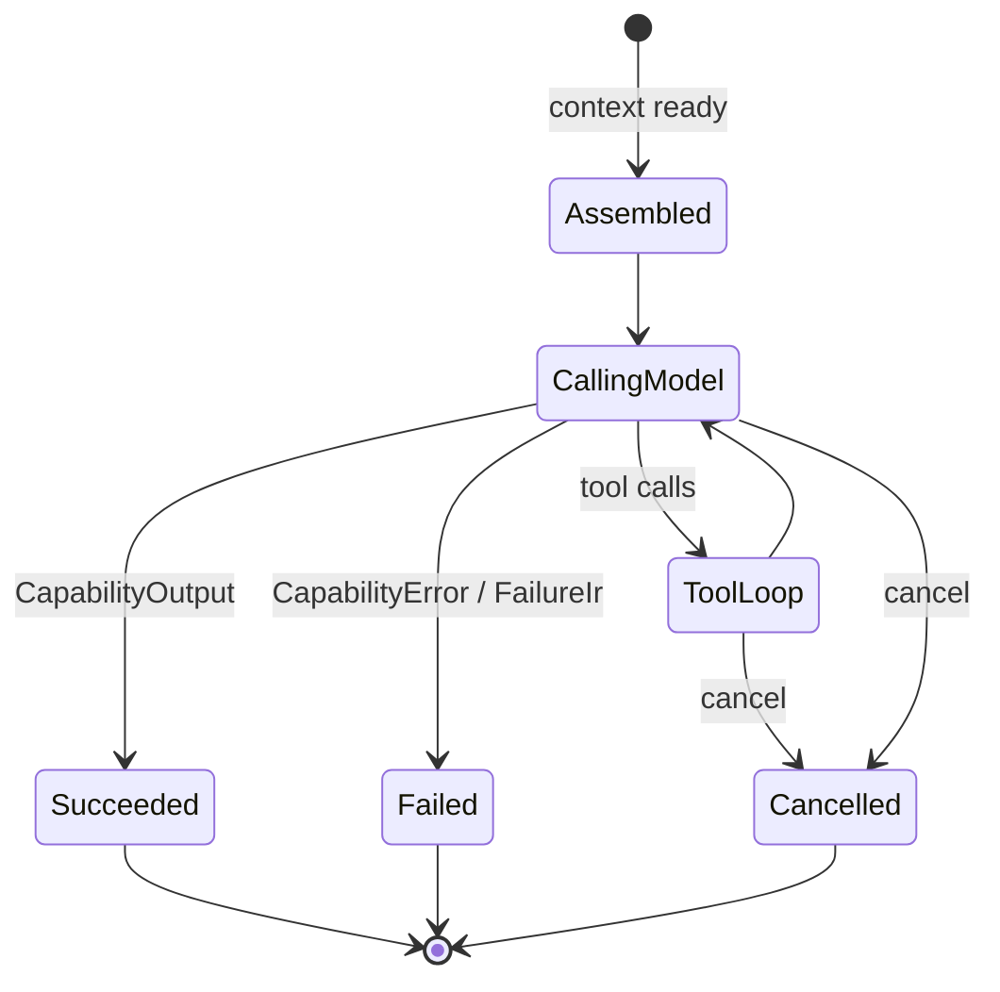

# RFC-0013: Capability Registry & MVP Workers

| Field | Value |
| --- | --- |
| Status | Draft |
| Author | arkadianet |
| Architecture | Alloy Architecture V2 (frozen) |
| Depends on | RFC-0006, RFC-0007, RFC-0008, RFC-0011, RFC-0012 |
| Effort | 6–10 person-days |

## Purpose

Capabilities are contracts, not personas. Registry resolves ≤4 LLM capabilities; MVP workers: Repair, Edit, optional Review, Planning (template-first). Outputs artifacts / `FailureIr` only—**no** `follow_up_nodes` or graph mutations (V2 §§9–10, ADR F-03/F-13).

## Scope

### In scope

- `Capability` trait + `CapabilityRegistry` register/resolve
- Workers: `Repair`, `Edit`, optional `Review`, `Planning` (template; LLM gated off)
- `CapabilityContext` with `ToolHandle`, read-only `GraphViewHandle`, `PromptPack`, `ModelRouter`
- `CapabilityOutput` without topology/graph mutation fields
- `WorkerMetrics` emission
- Side-effect class + tool selectors for lazy MCP disclosure

### Out of scope

- VerifyCompile / Testing as LLM capabilities — **forbidden** (runtime adapters in RFC-0010)
- Benchmarking / UnsafeAudit / Documentation / ArchitectureReview / CargoManagement → deferred catalog
- Multi-impl scoring → deferred
- LLM Planner enablement → M3 / eval bar ([RFC-0009](./RFC-0009-task-dag-templates-planner.md) Future)

## Dependencies

- **RFC-0006** — tools
- **RFC-0007** — complete()
- **RFC-0008** — EditRequest emission / apply via tools
- **RFC-0011** — read-only graph
- **RFC-0012** — PromptPack

## Public API

From V2 §9.2:

```rust
#[async_trait]
pub trait Capability: Send + Sync {
    fn id(&self) -> CapabilityId;
    fn version(&self) -> semver::Version;
    fn describe(&self) -> CapabilityDescriptor;
    fn required_tools(&self) -> Vec<ToolSelector>;
    fn preferred_tier(&self) -> ModelTier;
    async fn execute(&self, ctx: CapabilityContext) -> Result<CapabilityOutput, CapabilityError>;
}

pub struct CapabilityContext {
    pub session: SessionId,
    pub node: NodeId,
    pub input: serde_json::Value,
    pub prompt_pack: PromptPack,
    pub tool_handle: ToolHandle,
    pub graph: GraphViewHandle,
    pub cancel: CancellationToken,
    pub budget: TokenBudget,
    pub router: Arc<dyn ModelRouter>,
}

pub struct CapabilityOutput {
    pub artifacts: Vec<ArtifactId>,
    pub failure: Option<FailureIr>,
    pub confidence: f32,
    pub metrics: WorkerMetrics,
}

pub struct CapabilityRegistry {
    impls: Vec<Arc<dyn Capability>>,
}
```

MVP catalog (V2 §9.3): Planning, Repair, Edit, Review (optional).

## Internal architecture

Modules under `alloy-runtime::capabilities`. Scheduler resolves by `CapabilityId` on LLM nodes. PlanningWorker loads templates via PlanService.

## Data structures

Descriptors, resolve hints (trivial MVP), FailureIr on stuck repair.

## State machine

Per-execution only:



## Failure modes

| Failure | Handling |
| --- | --- |
| Unregistered capability | Resolve fail closed |
| Stuck repair | `FailureIr`; scheduler retry/replan request |
| Budget hit | Stop; metrics; error class |
| Attempted DAG mutation | Impossible—no field |

## Testing strategy

- Unit: registry resolve; unknown ID fails
- ScriptedProvider: Repair proposes patch artifact; Edit emits TextPatch
- Integration: worker + MCP fs_read + router mock
- Negative: output deserialization rejects follow_up_nodes if present in fixtures

## Acceptance criteria

- [ ] ≤4 LLM capabilities registered; Verify* not among them
- [ ] Output has no follow_up_nodes / graph_mutations
- [ ] Repair/Edit (+ optional Review) + template Planning work
- [ ] Tools only via ToolHandle; graph read-only
- [ ] Metrics recorded

## Definition of Done

Merge only when the series [Definition of Done](./README.md#definition-of-done-merge-gate) is fully met:

- [ ] Architecture compliance: **PASS**
- [ ] RFC acceptance criteria: **100% satisfied**
- [ ] Unit tests: **passing**
- [ ] Integration tests: **passing** (if applicable)
- [ ] Documentation: **complete**
- [ ] Public APIs: **reviewed and stable**
- [ ] Clippy: **clean**
- [ ] Formatting: **clean**
- [ ] No TODO or placeholder implementations left in this RFC's scope (explicit **Stub** / deferred only)
- [ ] Code review: **approved**

## Estimated implementation effort

**6–10 person-days**.

## Future extensions

- Alternate impls (rules-based BorrowAnalysis) + scoring without scheduler changes
- Deferred worker catalog after holdout plateau on P0 repair
- Gated LLM Planning capability
