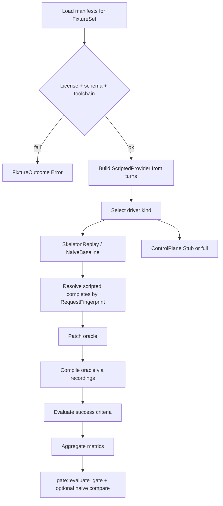
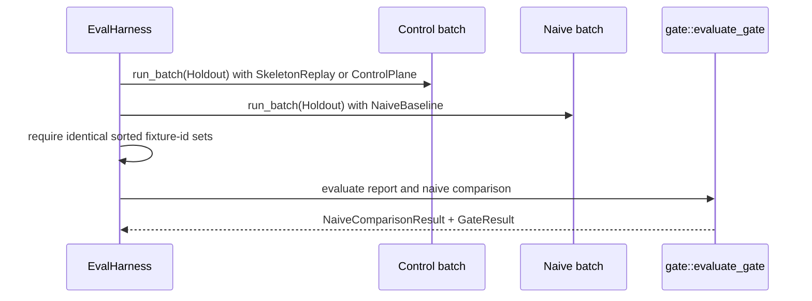

# RFC-0016: Eval Harness & Holdout Gates

| Field | Value |
| --- | --- |
| **Status** | Draft |
| **Author** | arkadianet |
| **Architecture** | Alloy Architecture V2 (**frozen**) — do not redesign |
| **Depends on** | [RFC-0001](./RFC-0001-alloy-runtime.md) (merged), [RFC-0007](./RFC-0007-model-router-provider.md) (merged) |
| **Effort** | 5–8 person-days |
| **Related RFCs** | [0004](./RFC-0004-observability-cost-metering.md) cost meter / decision log · [0005](./RFC-0005-sandbox-broker.md) sandbox-before-dogfood · [0006](./RFC-0006-mcp-host-builtins.md) `cargo_check` JSON · [0008](./RFC-0008-edit-engine.md) TextPatch apply (**full gate**) · [0010](./RFC-0010-scheduler-runtime-adapters.md) DAG / VerifyCompile (**full gate**) · [0013](./RFC-0013-capability-registry-workers.md) Repair/Edit workers (**full gate**) · [0015](./RFC-0015-cli-profiles-config.md) CLI wiring (**full gate**) |
| **Product** | Alloy — AI Engineering Runtime |
| **Supersedes** | Draft outline of this filename (expanded to implementation grade) |

**Mental model (V2 §17 / ADR F-19 / F-25):** Eval gates milestones from week 1. Fixtures + a deterministic scripted `ModelProvider` + recorded `cargo check --message-format=json` prove the control-plane thesis offline — without provider keys, without network, and without numeric cost marketing until holdout calibration (V2 §18 / ADR F-08). The falsification target is explicit: if the compile-gated DAG + BYOM control plane loses to the naive baseline on holdout local diagnostics, **stop — the control plane failed**.

**Authority order (highest → lowest):** current `main` source → merged RFCs 0001–0007 → Architecture V2 → this draft → roadmaps. Never reshape a merged public API solely to match an older V2 sketch or this document’s prior outline. Where RFC-0007 text and shipped code differ, **code wins** (recorded in §15).

---

## 1. Overview

### 1.1 Purpose

Ship the MVP **Eval Harness & Holdout Gates** in the existing `alloy-eval` crate (currently an empty stub):

1. **Fixture manifests** with a complete on-disk schema, license hygiene, and train/holdout separation.
2. **`ScriptedProvider`** implementing merged `ModelProvider` with request-keyed queues: keys are order-independent across turns, while retries with an identical request consume FIFO outcomes within that key.
3. **Recorded cargo JSON** replay for VerifyCompile-class checks without invoking network or a live toolchain mismatch.
4. **`EvalMetrics`** per V2 §17.2 with defined unmeasured semantics — never silent zeros that look like measurements.
5. **Holdout gate helpers** with configurable thresholds, including the naive-baseline falsification comparison.
6. **Offline CI** that runs with no provider keys and no HTTP client exercise.

### 1.2 Problem Statement

RFC-0001 created the five-crate workspace including `alloy-eval` as an empty stub. RFC-0007 shipped `ModelProvider`, `ModelRouter`, `RecordingModelProvider` (FIFO, no network), price→USD derivation, and the first host HTTP client behind `http-provider`. Architecture V2 §17 requires fixtures + `ScriptedProvider` + recorded cargo JSON from week 1, holdout gates at every milestone exit, and a falsification target against a naive baseline. Without this RFC there is no fixture schema, no keyed scripted provider for concurrent batches, no `EvalMetrics` surface, no holdout discipline mechanism, no offline thesis test, and no way to fail a milestone when the control plane loses — leaving M1/M7 exit gates undefined.

### 1.3 Scope

| In scope | Detail |
| --- | --- |
| Crate `alloy-eval` | Fixture load, scripted provider, recorded cargo replay, metrics, gates |
| `ScriptedProvider: ModelProvider` | One bound endpoint; request-keyed FIFO outcome queues; no HTTP |
| Additive RFC-0007 note | `RecordingModelProvider` remains FIFO and unchanged |
| Recorded `cargo check --message-format=json` | Capture, version, validate, replay |
| `EvalMetrics` + report envelope | V2 §17.2 fields with `MetricField` unmeasured state |
| Holdout set (P0) | Local-diagnostic / E0502-class fixtures |
| Gate function | One pure evaluator; configurable thresholds; naive-baseline comparison |
| License hygiene (R17) | Permitted corpora only; reject on load |
| Offline CI | No keys, no network, no live-provider API, no `http-provider` |
| Skeleton vs full-gate split | Normative Day-1 vs **Stub**/deferred surfaces |

### 1.4 Non-goals

| Deferred item | Owner |
| --- | --- |
| Production routing policy / live BYOM eval path | **RFC-0007** routing is consumed, not redesigned; eval integration is deferred to M7 |
| Large multi-crate feature suites / public leaderboard | Deferred (V2 §17.2) |
| Lifetime-heavy fixtures as P0 | Deferred (V2 §4.1 stretch) |
| Alloy-on-Alloy dogfood | **Banned** until sandbox + holdout green (ADR F-07) |
| Numeric cost marketing claims | **Forbidden** until calibrated (V2 §18 / ADR F-08) |
| End-to-end live scheduler/CLI holdout loop | **Stub** here; activates when RFCs 0008–0015 land (M7) |
| Sixth crate, OTLP, redesign of merged router APIs | Forbidden |
| Writing or overwriting `.env` | Forbidden |

### 1.5 Day-1 MVP (normative)

1. `alloy-eval` MUST expose the public API in §3 and MUST remain `#![forbid(unsafe_code)]`.
2. `ScriptedProvider` MUST implement `alloy_runtime::ModelProvider`, MUST bind exactly one `ModelEndpoint`, MUST reject any other endpoint id, MUST NOT perform network I/O, MUST return `Health::Healthy`, and MUST resolve turns by `RequestFingerprint` (§3.4). Each fingerprint owns a FIFO queue so identical retry requests are representable.
3. `RecordingModelProvider` on `main` MUST remain unchanged (FIFO). This RFC MUST NOT dual-mode it.
4. At least **one** train fixture and **one** holdout fixture MUST exist under the §7 layout, each with a valid manifest, workspace snapshot, scripted turns, and recorded cargo JSON for the pre-repair (failing) and post-repair (passing) states.
5. `EvalHarness::run_fixture` / `run_batch` MUST be offline by construction, MUST aggregate `EvalMetrics`, and MUST classify each fixture as `Pass | Fail | Error` (§5). Day-1 exposes no offline toggle or live-provider mode.
6. The pure `gate::evaluate_gate` function MUST apply validated thresholds and MUST implement the naive-baseline comparison semantics in §5.8. Skeleton builds MUST compile and unit-test the comparison; full control-plane execution against the live stack is **Stub** until §12.2 owners land.
7. Cost fields MAY be computed internally as uncalibrated operator-price-table estimates. Reports MUST carry `CostClaimGrade::UncalibratedInternal` and MUST NOT emit marketing-grade cost claims (§3.8 / §9.3).
8. CI MUST run `cargo test -p alloy-eval` with no `ALLOY_API_KEY` and with `alloy-runtime` consumed at `default-features = false` (§10).
9. Alloy MUST NEVER write `.env`.
10. The harness MUST retain one eval-local trajectory record for every
    attempted `ModelProvider::complete` call, grouped per fixture and turn,
    alongside aggregate metrics (§3.16). Trajectory retention is Day-1
    behaviour, not part of the `ControlPlane` Stub.

---

## 2. Architecture Integration

### 2.1 Relationship to Architecture V2

| V2 reference | Application |
| --- | --- |
| §17.1 / ADR F-19, F-25 | Eval gates milestones; ScriptedProvider; holdout |
| §17.2 Architectural interface | Fixture manifests; offline thesis tests; holdout gates |
| §17.2 MVP | Fixtures + ScriptedProvider + recorded cargo JSON from week 1 |
| §17.2 `EvalMetrics` | Exact field set; this RFC defines population semantics |
| §17.2 Falsification target | Control plane vs naive baseline on holdout |
| §17.2 Deferred | Large suites; public leaderboard; lifetime-heavy P0 |
| §18 / ADR F-08 | No numeric cost marketing until calibrated holdout |
| §14.2 / ADR F-07 | Dogfood banned until sandbox + holdout green |
| §5.4 crate map | Harness lives in `alloy-eval` (≤5 crates) |
| §19.1 M1 thesis | Sandboxed tool→model→patch→check→log beats naive baseline |
| R15 | Holdout; mixed fixtures — mechanism in §7.4 |
| R17 | Permitted corpora only — enforced at manifest load |

### 2.2 Relationship to RFC-0001

Authoritative for: five-crate map, `CapabilityId`, `NodeId`, `ProviderId`, `ModelTier`, `Digest`, `ErrorClass`, `DiagnosticEvent`, `WorkerMetrics`, `RuntimeMetrics`, `#![forbid(unsafe_code)]` on workspace libs, `example.env` pattern.

This RFC MUST NOT redefine those types. `EvalMetrics` is **new** in `alloy-eval` (V2 places it under Eval; it is not on `main` today).

### 2.3 Relationship to RFC-0004

Authoritative for: `CostMeter`, `SharedCostMeter`, `CostSnapshot`, `ModelCallRecord`, `DecisionLog`, `usage_unknown` invariant, redaction helpers, `hash_prompt` / `Digest::sha256`.

Eval MAY construct a process-local `CostMeter` when aggregating scripted usage for internal `cost_usd_p50`. Eval MUST honour `CostSnapshot.usd_spent: Option<f64>` semantics: `None` is not measured zero. Eval MUST NOT publish calibrated marketing bands from uncalibrated meter data (RFC-0004 related note; ADR F-08).

The shipped `router/meter_bridge.rs` and `router/decision_bridge.rs` construct
`ModelCallRecord` / `DecisionRecord` only inside the `TomlModelRouter` routed
path. Day-1 `SkeletonReplay` and `NaiveBaseline` instead call
`ScriptedProvider::complete` directly through `ModelProvider`; they bypass
both bridges and therefore emit **zero** `ModelCallRecord`s through the
RFC-0004 `DecisionLog`.

Eval MUST consequently synthesize the eval-local records in §3.16 itself.
They are analysis inputs parallel to aggregates, not a second `DecisionLog`,
not RFC-0002 session events, and not a prompt/response corpus. Their redaction
posture MUST match `RetentionPolicy::defaults()`: metadata plus hashes only.

### 2.4 Relationship to RFC-0007

Authoritative for: `ModelProvider`, `ModelRouter`, `CompletionRequest`, `ModelResponse`, `Usage`, `ModelEndpoint`, `PromptPack`, `ChatMessage`, `Health`, `ProviderError`, `RouterError`, `RecordingModelProvider`, `TomlModelRouter::from_parts`, price table → USD via operator prices, `http-provider` feature gate.

**RFC-0007 §3.15 contract (normative input to this RFC):**

> `ScriptedProvider` in `alloy-eval` MUST implement the same `ModelProvider` trait. It MAY use a `HashMap` keyed by a deterministic fingerprint of `CompletionRequest` instead of FIFO; it MUST NOT perform HTTP; it MUST return `Health::Healthy`.

This RFC **exercises that MAY as MUST** for the eval harness (keyed mode is required for concurrent batches).

### 2.5 Already implemented | Added by RFC-0016 | Deferred

| Category | Contents |
| --- | --- |
| **Already implemented** | `ModelProvider` / `ModelRouter`; `RecordingModelProvider` (FIFO); router types; `CostMeter` / `CostSnapshot`; `Digest` / `hash_prompt`; `DiagnosticEvent`; MCP `cargo_check` with `--message-format=json` (RFC-0006); sandbox broker (RFC-0005); empty `alloy-eval` stub; toolchain pin `1.97.1` |
| **Added by RFC-0016** | `ScriptedProvider`; TOML fixture manifest schema + set-aware loader; recorded cargo JSON types + replay; `EvalMetrics` / `MetricField` / serializable report envelope; eval-local trajectory types + optional bounded JSONL artifacts; batch runner; pure gate function + naive baseline types; holdout directory discipline + CI lint; offline-by-construction harness; ≥1 train + ≥1 holdout golden fixture; crate deps with `default-features = false` on `alloy-runtime` |
| **Deferred / Stub** | Full control-plane fixture driver through scheduler/CLI (0008–0015); any live-provider eval API; calibrated cost grade emission; public leaderboard; lifetime-heavy fixtures; Alloy-on-Alloy dogfood |

### 2.6 Dependency boundaries

```text
alloy-eval
   │
   ├── alloy-runtime (default-features = false)
   │      └── router traits/types, RecordingModelProvider, CostMeter, Digest
   │      └── MUST NOT enable http-provider for default eval builds
   │
   └── (M7 only, deferred feature `stack-driver`) alloy-tools
          └── sandbox + MCP — Stub until M7; not required for Day-1 MVP
```

- `alloy-eval` remains one of ≤5 crates. **No sixth crate.**
- Day-1 MUST NOT depend on `alloy-cli`, `alloy-index`, or default-on `http-provider`.
- The M7 stack driver MAY depend on `alloy-tools` once RFCs 0008–0015 provide the vertical slice. Day-1 MUST NOT expose or enable it and retains the explicit **Stub** (§12).

### 2.7 Milestones this gates

| Milestone (roadmap) | Gate role |
| --- | --- |
| **M4** | Skeleton: ScriptedProvider + ≥1 fixture + EvalMetrics + offline CI |
| **M1 / M7** | Full holdout: control plane vs naive baseline on holdout local diagnostics |
| Dogfood | Blocked until sandbox green **and** holdout gate green |

---

## 3. Public Rust API

All new items live in `alloy-eval` unless an additive change to `alloy-runtime` is explicitly listed. `alloy-eval` MUST enable `#![deny(missing_docs)]` for public items. Every public item MUST have rustdoc stating ownership and failure semantics.

### 3.1 Reused types (normative — unchanged)

Every reused item MUST be imported through a **public** `alloy_runtime` path.
Private module paths such as `alloy_runtime::router::traits`,
`alloy_runtime::router::recording`, `alloy_runtime::router::types`, or
`alloy_runtime::types::ids` are not part of the merged public surface and MUST
NOT appear in `alloy-eval` imports.

| Type | Public source path | Notes |
| --- | --- | --- |
| `ModelProvider` | `alloy_runtime::ModelProvider` (also `alloy_runtime::router::ModelProvider`) | Object-safe; `Send + Sync` |
| `ModelRouter` | `alloy_runtime::ModelRouter` | Used by full-gate **Stub** driver only |
| `RecordingModelProvider` | `alloy_runtime::RecordingModelProvider` | FIFO; **unchanged** |
| `CompletionRequest`, `ModelResponse`, `Usage` | `alloy_runtime::{CompletionRequest, ModelResponse, Usage}` | Script I/O |
| `ModelEndpoint`, `Health`, `PromptPack`, `ChatMessage`, `ChatRole`, `ToolChoice`, `ResponseFormat` | `alloy_runtime::{...}` | Unchanged; also reachable as `alloy_runtime::router::{...}` |
| `ProviderId`, `CapabilityId`, `NodeId`, `EndpointId`, `Digest` | `alloy_runtime::{ProviderId, CapabilityId, NodeId, EndpointId, Digest}` | Fingerprints / attribution |
| `ProviderError`, `RouterError`, `classify_provider_error` | `alloy_runtime::{ProviderError, RouterError, classify_provider_error}` | Scripted error outcomes and trajectory classification |
| `CostMeter`, `CostSnapshot`, `ModelUsdSource` | `alloy_runtime::{CostMeter, CostSnapshot, ModelUsdSource}` | Internal cost aggregation and trajectory USD attribution |
| `ModelCallRecord`, `RetentionPolicy` | `alloy_runtime::{ModelCallRecord, RetentionPolicy}` | Posture/reference only for Day-1; eval constructs neither type |
| `ModelTier` | `alloy_runtime::ModelTier` | Optional attribution in reports |
| `DiagnosticEvent`, `ErrorClass` | `alloy_runtime::{DiagnosticEvent, ErrorClass}` | Outcome classification helpers |
| `hash_prompt`, `Digest::sha256` | `alloy_runtime::hash_prompt`, `alloy_runtime::Digest` | Fingerprint construction |

### 3.2 Design decision — scripted provider shape (mandatory)

| Option | Verdict |
| --- | --- |
| Extend `RecordingModelProvider` with keyed mode | **Rejected** |
| Wrap `RecordingModelProvider` as the public eval type | **Rejected** as the primary API |
| Distinct `ScriptedProvider` in `alloy-eval` | **Accepted** |

**Reasons (normative — why extension is wrong):**

1. **Merged FIFO contract:** `RecordingModelProvider` on `main` is documented and tested as FIFO pop. Adding a keyed mode creates dual semantics on a stable public type and risks RFC-0007 callers depending on the wrong mode (playbook: extend carefully; do not parallel-implement *or* silently bifurcate).
2. **Trait call shape:** `ModelProvider::complete` receives a `ModelEndpoint` and `CompletionRequest` — no capability/node. Eval therefore binds one endpoint at construction, checks the supplied endpoint id on every call, and keys scripted queues by request fingerprint. Endpoint identity is checked but is not duplicated in the lookup key.
3. **RFC-0007 §3.15 already named** `ScriptedProvider` in `alloy-eval` as the keyed consumer of the same trait. This RFC implements that contract; it does not invent a second *router* provider kind.
4. **Concurrency and retries:** Batch runners isolate one `ScriptedProvider` per fixture. Distinct fingerprints resolve independently, while a `VecDeque` under each fingerprint preserves FIFO behavior for repeated identical retry requests. A global FIFO recorder cannot provide both properties without external serialization.

**Additive diff to `RecordingModelProvider`:** **none**. FIFO API stays exactly:

```rust
impl RecordingModelProvider {
    pub fn new(id: ProviderId) -> Self;
    pub fn push(&self, outcome: Result<ModelResponse, ProviderError>);
    pub fn recorded(&self) -> Vec<(ModelEndpoint, CompletionRequest)>;
}
```

Eval tests that only need sequential single-threaded FIFO MAY still construct `RecordingModelProvider` directly for unit tests of other crates; the **harness public scripted surface** is `ScriptedProvider`.

### 3.3 `RequestFingerprint`

```rust
/// SHA-256 digest of the canonical JSON encoding of a [`CompletionRequest`].
///
/// Canonical encoding is the exact `serde_json::to_vec` output for the stored
/// request. Digests are lowercase hex via [`Digest::as_hex`].
#[derive(Debug, Clone, PartialEq, Eq, Hash, Serialize, Deserialize)]
#[serde(transparent)]
pub struct RequestFingerprint(Digest);

impl RequestFingerprint {
    /// Compute fingerprint for `request`.
    #[must_use]
    pub fn of(request: &CompletionRequest) -> Self;

    /// Parse a 64-char lowercase hex digest; reject otherwise.
    pub fn from_hex(s: impl AsRef<str>) -> Result<Self, EvalError>;

    #[must_use]
    pub fn as_digest(&self) -> &Digest;

    #[must_use]
    pub fn as_hex(&self) -> &str;
}
```

#### 3.3.1 Canonicalization rules (normative)

`RequestFingerprint::of` is infallible. Its input bytes MUST be exactly:

```rust
let bytes = serde_json::to_vec(request)
    .expect("CompletionRequest contains only infallibly serializable values");
RequestFingerprint(Digest::sha256(&bytes))
```

Serialization of the current `CompletionRequest`, `ChatMessage`, enums, JSON
values, integers, and finite optional `f32` fields is declared infallible for
this API. Manifest validation MUST reject a non-finite temperature before
fingerprinting. A later change that adds a fallible field to
`CompletionRequest` MUST revise this contract and its golden vectors in the
same change; Day-1 MUST NOT make `of` return `Result`.

The harness MUST preserve message order, tool order, enum values, `None` versus
`Some`, and struct declaration field order. It MUST hash exact stored UTF-8
bytes. It MUST NOT trim, case-fold, NFC-normalize, NFD-normalize, reorder JSON
keys, or otherwise rewrite request text. No Unicode-normalization dependency is
permitted. Day-1 fixture requests MUST have `tools = []`.

The normative byte strings and SHA-256 outputs are fixed in §11.1.1.
`RequestFingerprint::from_hex` remains fallible and MUST accept exactly 64
lowercase hexadecimal characters. Wrong length, uppercase, or any non-hex
character MUST return `Err(EvalError::Manifest(...))`; it MUST NOT panic and
MUST NOT use `Json`, `Internal`, or a provider error for malformed input.

**Manifest identity vs provider key:** Fixture turns also carry a human
`FixtureTurnId` (§3.5). The provider has one bound endpoint and keys queues
solely by `RequestFingerprint`. The runner MUST verify that its request
byte-for-byte equals `turn.request` before calling `complete`; the provider then
checks the endpoint id and fingerprints the request it actually receives.

### 3.4 `ScriptedProvider`

```rust
/// Keyed scripted [`ModelProvider`] for offline eval. Performs no network I/O.
///
/// Ownership: process-local; share across tasks only via [`Arc`].
/// Sync: interior `std::sync::Mutex` (same pattern as `RecordingModelProvider`).
pub struct ScriptedProvider { /* private */ }

impl ScriptedProvider {
    /// Empty provider bound to exactly one endpoint.
    pub fn new(
        id: ProviderId,
        endpoint: ModelEndpoint,
    ) -> Result<Self, EvalError>;

    /// Append one outcome to the FIFO queue for `key`.
    pub fn insert(
        &self,
        key: RequestFingerprint,
        outcome: ScriptOutcome,
    );

    /// Fingerprint `request` and append one outcome to its FIFO queue.
    pub fn push(
        &self,
        request: &CompletionRequest,
        outcome: ScriptOutcome,
    );

    /// Append entries in iterator order, preserving FIFO order within each key.
    pub fn extend(
        &self,
        entries: impl IntoIterator<Item = (RequestFingerprint, ScriptOutcome)>,
    );

    /// One entry per non-empty queue, sorted by fingerprint hex.
    #[must_use]
    pub fn remaining_keys(&self) -> Vec<RequestFingerprint>;

    /// Total number of unconsumed outcomes across all queues.
    #[must_use]
    pub fn remaining_outcomes(&self) -> usize;

    /// Invocations in call order: `(endpoint, request, fingerprint)`.
    #[must_use]
    pub fn recorded(&self) -> Vec<ScriptedInvocation>;

    /// True when no outcomes remain.
    #[must_use]
    pub fn is_exhausted(&self) -> bool;
}

/// One scripted complete outcome.
#[derive(Debug, Clone)]
pub enum ScriptOutcome {
    /// Successful model response.
    Response(ModelResponse),
    /// Provider-level failure returned to the caller.
    Error(ScriptedProviderError),
}

impl From<ScriptTurnOutcome> for ScriptOutcome {
    fn from(value: ScriptTurnOutcome) -> Self {
        match value {
            ScriptTurnOutcome::Response {
                text,
                structured,
                usage,
                provider_request_id,
                finish_reason,
            } => Self::Response(ModelResponse {
                text,
                structured,
                tool_calls: vec![],
                usage,
                provider_request_id,
                finish_reason,
            }),
            ScriptTurnOutcome::Error { error } => Self::Error(error),
        }
    }
}

/// Cloneable subset of [`ProviderError`] for fixture manifests.
///
/// Mapped to [`ProviderError`] at `complete` time. Does not add variants to
/// the merged `ProviderError` enum.
#[derive(Debug, Clone, PartialEq, Eq, Serialize, Deserialize)]
#[serde(tag = "kind", rename_all = "snake_case")]
pub enum ScriptedProviderError {
    Auth,
    RateLimit,
    ContextLength,
    Timeout,
    MalformedResponse { message: String },
    HttpStatus { status: u16, message: String },
    Tls { message: String },
    Transport { message: String },
    Internal { message: String },
}

impl From<ScriptedProviderError> for ProviderError {
    fn from(value: ScriptedProviderError) -> Self { /* §8.3 mapping */ }
}

#[derive(Debug, Clone, PartialEq)]
pub struct ScriptedInvocation {
    pub endpoint: ModelEndpoint,
    pub request: CompletionRequest,
    pub fingerprint: RequestFingerprint,
}
```

#### 3.4.1 `ModelProvider` implementation (normative)

```rust
#[async_trait]
impl ModelProvider for ScriptedProvider {
    fn id(&self) -> ProviderId;

    async fn complete(
        &self,
        endpoint: &ModelEndpoint,
        request: CompletionRequest,
    ) -> Result<ModelResponse, ProviderError>;

    async fn health(&self) -> Health; // always Health::Healthy
}
```

| Step | Behaviour |
| --- | --- |
| 1 | Compare `endpoint.id` with the bound endpoint’s id. A mismatch MUST immediately return `ProviderError::Internal("scripted wrong endpoint".into())`; it MUST NOT record or consume an invocation. Other endpoint fields are not part of identity. |
| 2 | Compute `fp = RequestFingerprint::of(&request)`. |
| 3 | Lock the mutex and append `ScriptedInvocation` containing the bound endpoint clone, request, and fingerprint. |
| 4 | Find the `VecDeque<ScriptOutcome>` for `fp` and `pop_front()`. Remove the map entry after its queue becomes empty. |
| 5 | Missing map entry or empty queue → `Err(ProviderError::Internal(format!("scripted miss: {}", fp.as_hex())))`. |
| 6 | `ScriptOutcome::Response(r)` → `Ok(r)`. |
| 7 | `ScriptOutcome::Error(e)` → `Err(ProviderError::from(e))`. |
| 8 | Poisoned mutex → log error and recover with `into_inner()`, matching `RecordingModelProvider`’s locking posture. |

**Per-key FIFO:** `insert` and `push` append; neither rejects an existing
fingerprint. Two identical requests may therefore consume two scripted
outcomes in declaration order, which models an identical retry. Duplicate
`FixtureTurnId` values remain a manifest validation error (§5.2), but duplicate
request fingerprints are valid and produce no duplicate-key error.

**Manifest conversion:** `FixtureManifest.turns` stores only
`ScriptTurnOutcome`. Loading converts each owned outcome with
`ScriptOutcome::from`; successful responses always receive
`tool_calls: vec![]`. The provider stores only `ScriptOutcome`. There is no
parallel manifest outcome API and no second response-construction path.

**Send + Sync:** `ScriptedProvider: Send + Sync`. Share with `Arc<ScriptedProvider>` / `Arc<dyn ModelProvider>`.

**Constructor invariant:** `ScriptedProvider::new` MUST require
`endpoint.provider == id`. A mismatch returns exactly
`Err(EvalError::Manifest("scripted provider id must match endpoint.provider".into()))`.
Construction performs no I/O and MUST NOT repair or overwrite either id.

**Lifecycle:** Drop is ordinary; no drain protocol. Unconsumed keys at fixture end → fixture `Fail` with reason `UnconsumedScripts` when the manifest sets `require_consume_all = true` (default **true**).

### 3.5 Fixture turn identity (manifest)

```rust
/// Human-stable turn id inside a fixture (not the provider lookup key).
#[derive(Debug, Clone, PartialEq, Eq, Hash, Serialize, Deserialize)]
pub struct FixtureTurnId {
    /// Capability the turn belongs to (e.g. `repair`).
    pub capability: CapabilityId,
    /// Optional DAG node id when the full stack attributes nodes.
    #[serde(default, skip_serializing_if = "Option::is_none")]
    pub node: Option<NodeId>,
    /// 0-based ordinal within `(capability, node)` for this fixture.
    pub ordinal: u32,
}

impl FixtureTurnId {
    /// Display form `capability/node/ordinal` or `capability/-/ordinal`.
    #[must_use]
    pub fn render(&self) -> String;
}
```

This is the normative expansion of the placeholder phrase **“capability/node fingerprint”**: a stable *manifest* identity. Provider lookup remains `RequestFingerprint`.

**`node` in Day-1 (normative):** Day-1 fixtures MUST omit `turn_id.node`, so it
deserializes as `None`. No DAG exists in the skeleton path, so there is nothing
to attribute a node to, and uniqueness/selection rules (§5.2 steps 4–5, §5.8
step 3) are already node-independent. If a manifest does supply `node`, the
value MUST be a canonical UUID string accepted by `NodeId` (`alloy_runtime`
UUID newtype, `#[serde(transparent)]`); any other spelling is a DTO
deserialization failure mapped to `EvalError::Manifest`. A supplied node is
carried through `FixtureTurnId::render` for reporting only and MUST NOT change
Day-1 execution.

### 3.6 `MetricField` and `EvalMetrics`

Silent numeric zeros that look like measurements are forbidden for unmeasured quantities.

```rust
/// Population state for one metric.
#[derive(Debug, Clone, PartialEq, Serialize, Deserialize)]
#[serde(tag = "state", content = "value", rename_all = "snake_case")]
pub enum MetricField<T> {
    /// Value was computed from observed fixture data this run.
    Measured(T),
    /// Value is intentionally absent; MUST NOT be treated as zero.
    Unmeasured { reason: UnmeasuredReason },
}

#[derive(Debug, Clone, Copy, PartialEq, Eq, Serialize, Deserialize)]
#[serde(rename_all = "snake_case")]
pub enum UnmeasuredReason {
    /// Skeleton / Day-1 path does not yet produce this signal.
    SkeletonDeferred,
    /// Owning RFC / subsystem not linked into this build.
    SubsystemAbsent,
    /// No samples in the selected fixture set.
    EmptySample,
    /// Tokens or prices insufficient for USD derivation.
    CostInputsIncomplete,
    /// Calibration gate not granted (ADR F-08).
    CostUncalibrated,
    /// Explicitly not applicable to this gate profile.
    NotApplicable,
}

/// V2 §17.2 metrics with explicit population semantics.
#[derive(Debug, Clone, PartialEq, Serialize, Deserialize)]
pub struct EvalMetrics {
    pub success_rate: MetricField<f64>,
    pub compile_success_rate: MetricField<f64>,
    pub token_efficiency: MetricField<f64>,
    pub latency_p50_ms: MetricField<u64>,
    pub latency_p95_ms: MetricField<u64>,
    /// Day-1 is always Unmeasured(CostUncalibrated); numeric p50 is internal.
    pub cost_usd_p50: MetricField<f64>,
    pub retries_mean: MetricField<f64>,
    pub human_interventions: MetricField<f64>,
    pub unsafe_introduced_rate: MetricField<f64>,
}
```

#### 3.6.1 Population table (normative)

| Field | Who populates | When Measured | Skeleton default |
| --- | --- | --- | --- |
| `success_rate` | `MetricsAggregator` | After batch: `passes / (passes+fails)` over fixtures that are not `Error` | **Measured** from fixture outcomes |
| `compile_success_rate` | `MetricsAggregator` | `compile_clean == Some(true)` / all non-Error fixtures; `Some(false)` or `None` is false; aggregation never mutates criteria | **Measured** when denominator non-empty |
| `token_efficiency` | `MetricsAggregator` | `(successful_fixtures) / max(1, total_input_tokens + total_output_tokens)` when all token samples known | **Unmeasured(`EmptySample` or `CostInputsIncomplete`)** unless scripts include usage |
| `latency_p50_ms` | `MetricsAggregator` | p50 of non-Error fixture wall times | **Measured** observational wall clock; scrub in determinism tests |
| `latency_p95_ms` | `MetricsAggregator` | p95 of non-Error fixture wall times | **Measured** observational wall clock; scrub in determinism tests |
| `cost_usd_p50` | Report assembler (constant in Day-1) | **Never Measured in Day-1 `EvalMetrics`** | **Always `Unmeasured { reason: CostUncalibrated }`**; computed USD p50 exists only in `CostClaimEnvelope.internal_cost_usd_p50` (§3.8) |
| `retries_mean` | `MetricsAggregator` | Mean retry count from stack driver | **Unmeasured(`SkeletonDeferred`)** Day-1; **Measured** under full-gate when RFC-0010 linked |
| `human_interventions` | `MetricsAggregator` | Mean GateHuman interventions | **Unmeasured(`SkeletonDeferred`)** until GateHuman exists |
| `unsafe_introduced_rate` | `MetricsAggregator` | Introduced / non-Error fixtures whose criteria include `NoNewUnsafe` | **Measured** with a criterion sample; else **Unmeasured(`NotApplicable`)** and gate failure |

**Rate arithmetic:** Empty non-Error sample → `Unmeasured(EmptySample)`, never `Measured(0.0)` for rates. A real measured zero (all failed) is `Measured(0.0)` only when the denominator is > 0.

**Percentile rule:** For `n = 1`, p50 = p95 = that sample. For `n ≥ 2`, use nearest-rank: index = `ceil(p * n) - 1` clamped to `[0, n)`.

Exactly one crate-private helper implements this rule for every percentile in
the crate — latency p50/p95 (§5.7) and internal cost p50 (§3.8 / §5.7 step 7):

```rust
pub(crate) fn nearest_rank_index(len: usize, p: f64) -> Option<usize>;
```

It returns `None` for `len == 0` and otherwise
`min(len - 1, ceil(p * len as f64) as usize - 1)`. Callers sort ascending
first. Duplicating the arithmetic per call site is forbidden so latency and
cost cannot drift. Its unit test is `nearest_rank_percentile_helper` (§11.4).

### 3.7 Fixture outcomes and reports

```rust
#[derive(Debug, Clone, Copy, PartialEq, Eq, Serialize, Deserialize)]
#[serde(rename_all = "snake_case")]
pub enum FixtureStatus {
    /// Success criteria satisfied.
    Pass,
    /// Ran to completion; criteria failed.
    Fail,
    /// Harness/infra failure; must not be counted as a thesis Fail.
    Error,
}

#[derive(Debug, Clone, PartialEq, Serialize, Deserialize)]
pub struct FixtureOutcome {
    pub fixture_id: FixtureId,
    pub set: FixtureSet,
    pub status: FixtureStatus,
    pub criteria: Vec<CriterionResult>,
    pub wall_ms: u64,
    pub model_calls: u32,
    pub tokens_in: Option<u64>,
    pub tokens_out: Option<u64>,
    /// Derived USD for this fixture when computable; never a marketing claim.
    pub cost_usd: Option<f64>,
    pub retry_count: Option<u32>,
    pub human_interventions: Option<u32>,
    pub unsafe_introduced: Option<bool>,
    pub compile_clean: Option<bool>,
    /// Serializable boundary error. MUST be Some iff status is Error.
    pub error: Option<ReportError>,
}

/// Stable, serializable representation of an [`EvalError`] for reports.
///
/// `EvalError` remains the operational API error and deliberately contains
/// `std::io::Error`, which is neither Clone nor serde data.
#[derive(Debug, Clone, PartialEq, Eq, Serialize, Deserialize)]
pub struct ReportError {
    pub kind: String,
    pub message: String,
}

impl ReportError {
    #[must_use]
    pub fn from_eval(error: &EvalError) -> Self {
        let (kind, message) = match error {
            EvalError::Manifest(_) => ("manifest", error.to_string()),
            EvalError::LicenseForbidden(_) => {
                ("license_forbidden", error.to_string())
            }
            EvalError::RecordingStale(_) => ("recording_stale", error.to_string()),
            EvalError::RecordingInvalid(_) => {
                ("recording_invalid", error.to_string())
            }
            EvalError::NetworkRequired(_) => {
                ("network_required", error.to_string())
            }
            EvalError::FixtureNotFound(_) => {
                ("fixture_not_found", error.to_string())
            }
            EvalError::Io(err) => ("io", err.to_string()),
            EvalError::Json(_) => ("json", error.to_string()),
            EvalError::Stub(_) => ("stub", error.to_string()),
            EvalError::Internal(_) => ("internal", error.to_string()),
        };
        Self {
            kind: kind.to_owned(),
            message,
        }
    }

    #[must_use]
    pub fn cancelled() -> Self {
        Self {
            kind: "cancelled".to_owned(),
            message: "fixture cancelled".to_owned(),
        }
    }

    #[must_use]
    pub fn join_failed(message: impl Into<String>) -> Self {
        Self {
            kind: "join_failed".to_owned(),
            message: message.into(),
        }
    }
}

#[derive(Debug, Clone, PartialEq, Eq, Serialize, Deserialize)]
pub struct CriterionResult {
    pub name: SuccessCriterion,
    pub passed: bool,
    pub detail: String,
}

#[derive(Debug, Clone, PartialEq, Serialize, Deserialize)]
pub struct EvalReport {
    pub schema_version: u32, // MUST be 1 for this RFC
    pub run_id: String,      // UUID v4 string
    pub offline: bool,
    pub toolchain: ToolchainRecord,
    /// Control or sole-run fixture outcomes.
    pub fixtures: Vec<FixtureOutcome>,
    /// Control or sole-run per-complete trajectory records.
    pub trajectories: Vec<EvalTrajectoryRecord>,
    /// Naive outcomes when `run_holdout_with_naive` was used.
    #[serde(default, skip_serializing_if = "Option::is_none")]
    pub naive_fixtures: Option<Vec<FixtureOutcome>>,
    /// Naive per-complete records when comparison execution was used.
    #[serde(default, skip_serializing_if = "Option::is_none")]
    pub naive_trajectories: Option<Vec<EvalTrajectoryRecord>>,
    pub metrics: EvalMetrics,
    /// Cost claim for the **control** (or sole) run. During
    /// `run_holdout_with_naive`, this envelope is derived from `fixtures` /
    /// `metrics` only — never from `naive_fixtures`.
    pub cost_claim: CostClaimEnvelope,
    pub gate: Option<GateResult>,
    pub naive_comparison: Option<NaiveComparisonResult>,
}

impl EvalReport {
    /// Render the exact line-oriented CI format in §9.3.
    #[must_use]
    pub fn render_ci_summary(&self) -> String;

    /// Day-1 always returns `None` (ADR F-08). See §3.8 rule 7.
    #[must_use]
    pub fn marketing_cost_claim(&self) -> Option<f64>;
}

impl std::fmt::Display for EvalReport {
    /// Delegates exactly to `render_ci_summary`.
    fn fmt(&self, f: &mut std::fmt::Formatter<'_>) -> std::fmt::Result;
}
```

#### 3.7.1 Outcome accounting (normative)

For a non-Error run, `model_calls` is the number of
`ModelProvider::complete` invocations attempted, whether each invocation
returned `Ok` or `Err`; increment with `saturating_add(1)` on `u32`. A
pre-call request mismatch does not increment it because no invocation was
attempted. For cancellation races, "attempted" is exactly the §3.16 dispatch
boundary: entering the complete-racing `tokio::select!`, whether or not the
complete future is polled.

For each successful `Ok(ModelResponse)`, add each present usage side to that
side's running `u64` total with `saturating_add`. If any successful response
has `usage.input_tokens == None`, final `tokens_in` MUST be `None`; likewise,
any `usage.output_tokens == None` makes final `tokens_out` `None`. Provider
`Err` responses contribute no tokens and do not by themselves make a side
incomplete. With no successful responses, both token totals are `None`.

`cost_usd` is `Some` only when the bound endpoint has both prices, at least
one response succeeded, both token sides are complete across every successful
response, and the RFC-0007 price formula over the saturated totals produces a
finite value. If either price or token side is absent, or the derived USD is
non-finite, `cost_usd` MUST be `None`. A non-finite result MUST be logged at
`debug` without its unstable numeric spelling and treated as an incomplete
cost input; it MUST NOT enter percentile sorting or propagate NaN/infinity.

Every terminal `Error` outcome, whether produced during load, cancellation,
join, or execution, MUST have `criteria = vec![]`, `tokens_in = None`,
`tokens_out = None`, `cost_usd = None`, `compile_clean = None`,
`unsafe_introduced = None`, `retry_count = None`, and
`human_interventions = None`. Its `wall_ms` remains observational.
For load/cancel/join Errors, `model_calls` is `0` for every load failure, join
failure, and pre-run cancellation; cancellation after work began instead
preserves the number of complete invocations attempted so far. Other in-task
execution Errors follow the general attempted-invocation definition because
their count is known.
`error` MUST be `Some(ReportError)`.

#### 3.7.2 Report toolchain assembly (normative)

`EvalReport.toolchain.channel` MUST always equal
`EvalHarnessConfig.pin_toolchain_channel`. Its `rustc_version` and
`cargo_version` MUST equal the unique pair from the manifests of all
non-Error outcomes in the logical report. The batch implementation retains a
crate-private `(FixtureId, ToolchainRecord)` sidecar from validated loaded
fixtures; `FixtureOutcome` does not expose or duplicate this metadata.

Batch preflight MUST ensure every successfully loaded fixture has the same
complete manifest toolchain triplet as the first successfully loaded fixture
in sorted fixture-id order. A differing fixture is a load-time `Error` carrying
exactly `EvalError::Manifest(...)` — cross-fixture toolchain disagreement is a
manifest-consistency defect, not `RecordingStale`, `RecordingInvalid`, or
`Internal`. `RecordingStale` remains reserved for a channel that disagrees with
`EvalHarnessConfig.pin_toolchain_channel`, and `RecordingInvalid` for
manifest-versus-recording disagreement inside one fixture (§3.10). Because the
disagreeing fixture never becomes a non-Error outcome, non-Error outcomes
cannot disagree. Report assembly MUST nevertheless check
the invariant; disagreement among non-Error fixtures is
`Err(EvalError::Internal(...))`, never an arbitrary first-value choice. If
there are zero non-Error outcomes, including an empty batch or an all-Error
batch, both version fields MUST be the exact string `"none"`.

### 3.8 Cost claim envelope (ADR F-08)

```rust
#[derive(Debug, Clone, Copy, PartialEq, Eq, Serialize, Deserialize)]
#[serde(rename_all = "snake_case")]
pub enum CostClaimGrade {
    /// Internal operator-price-table estimate only. MUST NOT be marketed.
    UncalibratedInternal,
    /// Reserved for post-calibration publishes. Day-1 MUST NOT emit this.
    CalibratedHoldout,
}

#[derive(Debug, Clone, PartialEq, Serialize, Deserialize)]
pub struct CostClaimEnvelope {
    pub grade: CostClaimGrade,
    /// Present only when grade is CalibratedHoldout (unreachable in Day-1).
    pub marketing_usd_p50: Option<f64>,
    /// Measured only from a complete finite fixture-cost population.
    pub internal_cost_usd_p50: MetricField<f64>,
    /// Constant disclaimer string (exact bytes).
    #[serde(default = "default_cost_disclaimer")]
    pub disclaimer: String,
}

pub const COST_DISCLAIMER: &str =
    "internal operator-price-table estimate only; not a calibrated marketing claim (V2 §18 / ADR F-08)";

fn default_cost_disclaimer() -> String {
    COST_DISCLAIMER.to_string()
}

impl CostClaimEnvelope {
    #[must_use]
    pub fn uncalibrated(internal_cost_usd_p50: MetricField<f64>) -> Self {
        Self {
            grade: CostClaimGrade::UncalibratedInternal,
            marketing_usd_p50: None,
            internal_cost_usd_p50,
            disclaimer: COST_DISCLAIMER.to_string(),
        }
    }
}
```

**Normative emission rules:**

1. Day-1 `EvalReport.cost_claim.grade` MUST be `UncalibratedInternal`.
2. `marketing_usd_p50` MUST be `None` in Day-1.
3. Day-1 `EvalReport.metrics.cost_usd_p50` MUST always be
   `MetricField::Unmeasured { reason: UnmeasuredReason::CostUncalibrated }`.
   It MUST never mirror the internal measured estimate. The same invariant
   applies to every Day-1 `EvalMetrics` embedded in a naive comparison.
4. `internal_cost_usd_p50` is `Measured(p50)` only when the logical run is
   non-empty and every fixture has `cost_usd = Some(finite_value)`; compute
   nearest-rank p50 under §3.6.1. If any fixture lacks finite USD, including
   `None`, NaN, or infinity, it MUST be
   `Unmeasured { reason: CostInputsIncomplete }`.
5. `CostClaimGrade::CalibratedHoldout` remains reserved for wire compatibility, but Day-1 MUST NOT construct or emit it. Calibrated grade emission is deferred to a future calibration RFC.
6. Every constructor and report assembly path MUST set `disclaimer` to `COST_DISCLAIMER.to_string()`. The serde default exists only for backward-compatible deserialization of a missing field and MUST return the same bytes.
7. `EvalReport::marketing_cost_claim(&self) -> Option<f64>` MUST always return `None` in Day-1. Day-1 gate config exposes no calibration grant.
8. Tracing/logs MAY print `internal_cost_usd_p50` only at `debug` with the disclaimer field present in the same event.
9. User-facing summaries (CI annotations, default `Display`) MUST NOT print a bare USD number for cost; they print `cost: uncalibrated` or omit the field.

**Derivation source (normative formula):** The runtime helper
`alloy_runtime::router::price::derive_usd` is `pub(crate)` and therefore **not
callable** from `alloy-eval`. Eval MUST reimplement the identical arithmetic
rather than pretend to reuse the runtime function:

```rust
let usd = (input_tokens as f64 / 1_000_000.0) * input_usd_per_mtok
    + (output_tokens as f64 / 1_000_000.0) * output_usd_per_mtok;
```

USD exists only when `endpoint.input_usd_per_mtok`,
`endpoint.output_usd_per_mtok`, `usage.input_tokens`, and
`usage.output_tokens` are all `Some`; both prices are finite and
non-negative; and the resulting `usd` is finite and non-negative. Any other
combination yields `None`. Scripted fixtures that omit usage have no USD for
that fixture. A non-finite derived value is likewise treated as absent, logged
at `debug`, and excluded from percentiles; no NaN/infinity may cross into
`FixtureOutcome.cost_usd` or either cost metric.

**Parity test (required):** `eval_usd_matches_runtime_price_semantics` MUST
pin this arithmetic against the RFC-0007 rule with at least the exact-million
case (1_000_000 input tokens and 500_000 output tokens at `$2`/`$4` per mtok →
`4.0`), a missing-price case, a missing-token case, a negative-price case, and
a non-finite-price case, each expecting `None`. If a future runtime change
makes `derive_usd` public, eval SHOULD switch to calling it and keep this test
as the regression guard.

### 3.9 Manifest types

```rust
/// Manifest schema version. Day-1 writes and accepts only `1`.
pub const FIXTURE_MANIFEST_VERSION: u32 = 1;

#[derive(Debug, Clone, PartialEq, Eq, Hash, Serialize)]
#[serde(transparent)]
pub struct FixtureId(String);

impl FixtureId {
    /// Non-empty, ≤128 bytes, `[a-z0-9_.-]+`, but never `.` or `..`.
    pub fn new(s: impl Into<String>) -> Result<Self, EvalError>;
    pub fn as_str(&self) -> &str;
}

impl<'de> Deserialize<'de> for FixtureId {
    fn deserialize<D>(deserializer: D) -> Result<Self, D::Error>
    where
        D: serde::Deserializer<'de>,
    {
        let raw = String::deserialize(deserializer)?;
        Self::new(raw).map_err(serde::de::Error::custom)
    }
}

#[derive(Debug, Clone, Copy, PartialEq, Eq, Serialize, Deserialize)]
#[serde(rename_all = "snake_case")]
pub enum FixtureSet {
    Train,
    Holdout,
}

#[derive(Debug, Clone, Copy, PartialEq, Eq, Serialize, Deserialize)]
#[serde(rename_all = "snake_case")]
pub enum LicenseClass {
    /// Subject to the exact five-value SPDX allowlist below.
    Permitted,
    /// Anything else — MUST be rejected at load.
    Forbidden,
}

/// Validated manifest. `Serialize` only — see the DTO note below.
#[derive(Debug, Clone, PartialEq, Serialize)]
pub struct FixtureManifest {
    pub manifest_version: u32,
    pub id: FixtureId,
    pub set: FixtureSet,
    pub license: LicenseMeta,
    pub toolchain: ToolchainRecord,
    pub workspace: WorkspaceRef,
    /// Relative Rust source path replaced by the Day-1 patch oracle.
    pub naive_target_path: String,
    /// Day-1 accepts only `full_file_replace`.
    pub naive_patch_mode: NaivePatchMode,
    /// Optional prices applied to the fixture-local bound endpoint.
    #[serde(skip_serializing_if = "Option::is_none")]
    pub endpoint_prices: Option<EndpointPrices>,
    pub expected_diagnostics: Vec<ExpectedDiagnostic>,
    pub turns: Vec<ScriptTurn>,
    pub cargo_recordings: CargoRecordingRefs,
    pub success_criteria: Vec<SuccessCriterion>,
    /// Unused script keys fail the fixture. The crate-private loader DTO
    /// supplies the Day-1 default of `true` when the key is absent.
    pub require_consume_all: bool,
    /// Skeleton driver kind.
    pub driver: FixtureDriverKind,
}

#[derive(Debug, Clone, PartialEq, Eq, Serialize, Deserialize)]
pub struct LicenseMeta {
    pub class: LicenseClass,
    /// SPDX id or `Alloy-Original`.
    pub spdx: String,
    pub source_note: String,
}

/// Exact Day-1 SPDX allowlist.
pub const PERMITTED_SPDX: [&str; 5] = [
    "MIT",
    "Apache-2.0",
    "MIT OR Apache-2.0",
    "CC0-1.0",
    "Alloy-Original",
];

#[derive(Debug, Clone, PartialEq, Eq, Serialize, Deserialize)]
pub struct ToolchainRecord {
    /// MUST equal `rust-toolchain.toml` channel for recordings on main: `1.97.1`.
    pub channel: String,
    pub rustc_version: String,
    pub cargo_version: String,
}

#[derive(Debug, Clone, PartialEq, Eq, Serialize, Deserialize)]
pub struct WorkspaceRef {
    /// Directory relative to the fixture root containing the Cargo project.
    pub path: String,
    /// Package name for `-p` when replaying/recording.
    pub package: String,
}

#[derive(Debug, Clone, Copy, PartialEq, Eq, Serialize, Deserialize)]
#[serde(rename_all = "snake_case")]
pub enum NaivePatchMode {
    FullFileReplace,
}

#[derive(Debug, Clone, PartialEq, Serialize, Deserialize)]
pub struct EndpointPrices {
    #[serde(default, skip_serializing_if = "Option::is_none")]
    pub input_usd_per_mtok: Option<f64>,
    #[serde(default, skip_serializing_if = "Option::is_none")]
    pub output_usd_per_mtok: Option<f64>,
}

#[derive(Debug, Clone, PartialEq, Eq, Serialize, Deserialize)]
pub struct ExpectedDiagnostic {
    /// e.g. `E0502`.
    pub code: String,
    /// Substring that MUST appear in the diagnostic message (pre-repair).
    pub message_contains: String,
}

/// Validated turn. `Serialize` only — see the DTO note below.
#[derive(Debug, Clone, PartialEq, Serialize)]
pub struct ScriptTurn {
    pub turn_id: FixtureTurnId,
    /// Canonical request the runner MUST build (fingerprint source of truth).
    pub request: CompletionRequest,
    /// Optional precomputed hex; if present MUST match `RequestFingerprint::of(request)`.
    #[serde(skip_serializing_if = "Option::is_none")]
    pub request_fingerprint: Option<String>,
    pub outcome: ScriptTurnOutcome,
}

/// Validated turn outcome. `Serialize` only — see the DTO note below.
#[derive(Debug, Clone, PartialEq, Serialize)]
#[serde(tag = "type", rename_all = "snake_case")]
pub enum ScriptTurnOutcome {
    Response {
        text: Option<String>,
        structured: Option<serde_json::Value>,
        usage: Usage,
        provider_request_id: Option<String>,
        finish_reason: Option<String>,
    },
    Error {
        error: ScriptedProviderError,
    },
}

#[derive(Debug, Clone, PartialEq, Eq, Serialize, Deserialize)]
pub struct CargoRecordingRefs {
    /// Relative path to pre-repair failing cargo JSON recording.
    pub pre_repair: String,
    /// Relative path to post-repair passing cargo JSON recording.
    pub post_repair: String,
    pub recording_format_version: u32, // MUST be 1
}

#[derive(Debug, Clone, Copy, PartialEq, Eq, Serialize, Deserialize)]
#[serde(rename_all = "snake_case")]
pub enum SuccessCriterion {
    CompileClean,
    NoNewUnsafe,
    ExpectedDiagnosticsCleared,
    ScriptTurnsConsumed,
}

#[derive(Debug, Clone, Copy, PartialEq, Eq, Serialize, Deserialize)]
#[serde(rename_all = "snake_case")]
pub enum FixtureDriverKind {
    /// Day-1: apply scripted model text as a patch file replace + replay cargo JSON.
    SkeletonReplay,
    /// Full stack through scheduler/CLI — **Stub** until §12.2.
    ControlPlane,
    /// Naive baseline driver (§5.8).
    NaiveBaseline,
}
```

**`Deserialize` is deliberately absent (normative).** `FixtureManifest`,
`ScriptTurn`, and `ScriptTurnOutcome` derive `Serialize` only. Serialization is
retained for debugging, snapshot inspection, and error reporting; it is not a
supported wire input. The public types MUST NOT derive or hand-write
`Deserialize`, because the only supported way to obtain them is the validating
loader in §5.2, which parses `manifest.toml` through the crate-private
`deny_unknown_fields` DTOs in §3.9.1 and then converts. A public `Deserialize`
would create a second, unvalidated construction path that bypasses turn-id
uniqueness, fingerprint agreement, path containment, license, and criteria
checks. Field-level `#[serde(default …)]` attributes therefore live on the
crate-private DTOs, which supply Day-1 defaults such as
`require_consume_all = true`; the public structs keep only
`skip_serializing_if` for compact debug output.

`FixtureManifest` is produced only from `manifest.toml`. No JSON manifest
reader or writer is in scope. `NaivePatchMode` has exactly one Day-1 value;
unknown values MUST fail TOML deserialization at the DTO layer.

**Endpoint prices (error pinned):** `endpoint_prices.input_usd_per_mtok` and
`endpoint_prices.output_usd_per_mtok` MUST each be finite and non-negative
when present. A NaN, infinite, or negative price is exactly
`Err(EvalError::Manifest("endpoint price must be finite and non-negative"))` at
load; it is never `Json`, `Internal`, a silently dropped price, or a run-time
`cost_usd = None`. Prices configure only internal uncalibrated cost accounting
and MUST NOT be presented as marketing cost.

`FixtureId::new` MUST reject empty input, more than 128 UTF-8 bytes, any
character outside `[a-z0-9_.-]`, and the exact path components `"."` and
`".."`. Every such rejection is `Err(EvalError::Manifest(...))`, never an
`Io` error or panic. `FixtureId` MUST use the custom `Deserialize` shown above;
deserialization MUST call `FixtureId::new` and map its failure with
`serde::de::Error::custom`. Derive-based deserialization that can bypass
`FixtureId::new` is forbidden.

`success_criteria` MUST be non-empty and contain no duplicate enum value.
Train and holdout goldens used by the skeleton/milestone gates MUST include
`CompileClean`, `ExpectedDiagnosticsCleared`, `ScriptTurnsConsumed`, and
`NoNewUnsafe`; this makes every default threshold measurable. Narrow provider
error fixtures MAY select a non-empty subset. `expected_diagnostics` MUST be
non-empty for Day-1 repair fixtures, and every entry MUST have a non-empty code
and non-empty `message_contains`.

#### 3.9.1 Manifest-only request and usage DTOs

The loader MUST NOT deserialize manifest request or usage tables directly
into the reused runtime `CompletionRequest`, `ChatMessage`, or `Usage` types.
Those merged runtime types do not declare `#[serde(deny_unknown_fields)]`, and
this RFC MUST NOT claim that they do or modify them solely for fixture
strictness.

Day-1 MUST deserialize through crate-private wire DTOs equivalent to:

```rust
#[derive(Deserialize)]
#[serde(deny_unknown_fields)]
struct ManifestCompletionRequest {
    messages: Vec<ManifestChatMessage>,
    #[serde(default)]
    tools: Vec<serde_json::Value>,
    #[serde(default)]
    tool_choice: ToolChoice,
    #[serde(default)]
    response_format: ResponseFormat,
    temperature: Option<f32>,
    max_output_tokens: Option<u32>,
}

#[derive(Deserialize)]
#[serde(deny_unknown_fields)]
struct ManifestChatMessage {
    role: ChatRole,
    content: String,
}

#[derive(Deserialize)]
#[serde(deny_unknown_fields)]
struct ManifestUsage {
    input_tokens: Option<u64>,
    output_tokens: Option<u64>,
}
```

The crate-private manifest turn/outcome wire structs MUST use
`ManifestCompletionRequest` and `ManifestUsage`, and MUST themselves use
`#[serde(deny_unknown_fields)]`. Only after strict TOML deserialization and
validation may the loader convert them into the public runtime-backed
`ScriptTurn`, `CompletionRequest`, `ChatMessage`, and `Usage` values. Nested
message unknown keys and usage unknown keys are therefore rejected as
`EvalError::Manifest`. Day-1 still validates `tools.is_empty()` after
conversion.

The same rule extends to the manifest root and turn outcomes. Because the
public `FixtureManifest`, `ScriptTurn`, and `ScriptTurnOutcome` derive
`Serialize` only (§3.9), the crate-private DTO graph is the crate's **entire**
`Deserialize` surface for manifests, and it owns every field default:
`require_consume_all` defaults to `true`, `endpoint_prices` and
`request_fingerprint` default to `None`, and the response outcome's
`structured`, `provider_request_id`, and `finish_reason` default to `None`.
Conversion into the public types is total and infallible once validation has
passed, so a validated public value can never contain an unvalidated field.

### 3.10 Recorded cargo JSON

```rust
pub const CARGO_RECORDING_FORMAT_VERSION: u32 = 1;

#[derive(Debug, Clone, PartialEq, Serialize, Deserialize)]
pub struct CargoJsonRecording {
    pub recording_format_version: u32,
    pub toolchain: ToolchainRecord,
    /// Exact argv conceptually recorded (informational).
    pub argv: Vec<String>,
    /// Process exit code from the capture.
    pub exit_code: i32,
    /// Raw newline-delimited JSON lines from `cargo check --message-format=json` stdout.
    pub stdout_lines: Vec<String>,
    /// Optional stderr capture (may be empty).
    #[serde(default)]
    pub stderr: String,
    /// SHA-256 of `stdout_lines` joined with `\n` (no trailing extra newline beyond lines).
    pub content_digest: Digest,
}

impl CargoJsonRecording {
    pub fn load(path: &Path) -> Result<Self, EvalError>;
    pub fn validate_against_pin(&self, pin_channel: &str) -> Result<(), EvalError>;
    /// Parse compiler-message diagnostics with `code.code` / `message` extraction.
    pub fn diagnostics(&self) -> Result<Vec<RecordedDiagnostic>, EvalError>;
    /// Parse diagnostics first; malformed NDJSON is RecordingInvalid.
    pub fn compile_clean(&self) -> Result<bool, EvalError>;
}

#[derive(Debug, Clone, PartialEq, Eq, Serialize, Deserialize)]
pub struct RecordedDiagnostic {
    pub code: Option<String>,
    pub level: String,
    pub message: String,
}
```

**Replay semantics (Day-1):** The skeleton driver MUST NOT invoke `cargo`, a
host toolchain, or the network. `load` MUST require
`recording_format_version == 1` in each recording file and the manifest
reference. The manifest reference and both files MUST agree on version. It
MUST recompute `content_digest` from `stdout_lines.join("\n")`, and a mismatch
is `RecordingInvalid`.

The manifest `toolchain` MUST equal both complete recording toolchain records,
including channel, `rustc_version`, and `cargo_version`; each recording channel
MUST also equal `EvalHarnessConfig.pin_toolchain_channel`. A mismatch with the
pin is `RecordingStale`; disagreement among manifest and recordings is
`RecordingInvalid`.

`exit_code` is integrity data and is required by serde; there is no default.
`compile_clean` MUST call `diagnostics()` before classifying. Any malformed
NDJSON line therefore returns `Err(EvalError::RecordingInvalid(...))`, even
when `exit_code == 0`. Only a successfully parsed recording with
`exit_code == 0` and no diagnostic at level `error` returns `Ok(true)`.

Pre-repair validation MUST prove that each manifest
`expected_diagnostics` pair is present in parsed pre-repair diagnostics:
the code MUST equal `ExpectedDiagnostic.code` and the message MUST contain
`message_contains`. Missing expected data is `RecordingInvalid` and produces a
fixture `Error`, never a thesis `Fail`.

Creating or refreshing recordings is outside the public harness API and is
deferred in §12.2. Day-1 harness execution only loads committed recordings.

### 3.11 Gate types and naive baseline

```rust
#[derive(Debug, Clone, PartialEq, Serialize, Deserialize)]
#[serde(deny_unknown_fields)]
pub struct GateThresholds {
    /// Minimum Measured compile_success_rate on the selected set.
    pub min_compile_success_rate: f64,
    /// Minimum Measured success_rate on the selected set.
    pub min_success_rate: f64,
    /// Maximum Measured unsafe_introduced_rate (if measured).
    pub max_unsafe_introduced_rate: f64,
    /// When true, control MUST meet or beat naive on compile_success_rate.
    pub require_beat_naive: bool,
    /// Control wins if `control + naive_epsilon >= naive` (default 0.0 → must be ≥).
    pub naive_epsilon: f64,
    /// Fixture set the gate evaluates.
    pub set: FixtureSet,
}

impl GateThresholds {
    /// M1 / M7 holdout defaults.
    #[must_use]
    pub fn milestone_holdout_defaults() -> Self {
        Self {
            min_compile_success_rate: 1.0,
            min_success_rate: 1.0,
            max_unsafe_introduced_rate: 0.0,
            require_beat_naive: true,
            naive_epsilon: 0.0,
            set: FixtureSet::Holdout,
        }
    }

    /// Skeleton CI defaults (single golden fixtures; naive compare optional).
    #[must_use]
    pub fn skeleton_defaults() -> Self {
        Self {
            min_compile_success_rate: 1.0,
            min_success_rate: 1.0,
            max_unsafe_introduced_rate: 0.0,
            require_beat_naive: false,
            naive_epsilon: 0.0,
            set: FixtureSet::Train,
        }
    }

    /// Reject unusable thresholds before a run starts.
    pub fn validate(&self) -> Result<(), EvalError>;
}

#[derive(Debug, Clone, PartialEq, Serialize, Deserialize)]
pub struct GateResult {
    pub passed: bool,
    pub thresholds: GateThresholds,
    pub failures: Vec<GateFailure>,
}

#[derive(Debug, Clone, PartialEq, Eq, Serialize, Deserialize)]
#[serde(tag = "kind", rename_all = "snake_case")]
pub enum GateFailure {
    CompileSuccessRate { actual: String, minimum: String },
    SuccessRate { actual: String, minimum: String },
    UnsafeIntroducedRate { actual: String, maximum: String },
    LostToNaiveBaseline { control: String, naive: String, epsilon: String },
    MetricUnmeasured { field: String, reason: UnmeasuredReason },
    InvalidMeasuredMetric { field: String, detail: String },
    SetMismatch {
        source: String,
        fixture_id: FixtureId,
        expected: FixtureSet,
        actual: FixtureSet,
    },
    InconsistentNaiveComparison { field: String },
    MissingNaiveComparison,
    FixtureErrorsPresent { count: u32 },
    InvalidThreshold { message: String },
}

pub const NAIVE_BASELINE_LABEL: &str = "naive_single_turn_patch";

#[derive(Debug, Clone, PartialEq, Serialize, Deserialize)]
pub struct NaiveComparisonResult {
    pub control: EvalMetrics,
    pub naive: EvalMetrics,
    /// True iff control compile_success_rate + epsilon >= naive compile_success_rate
    /// and both sides Measured.
    pub control_meets_or_beats_naive: bool,
    pub detail: String,
}

/// Pure, deterministic threshold evaluation.
#[must_use]
pub fn evaluate_gate(
    thresholds: &GateThresholds,
    report: &EvalReport,
) -> GateResult;
```

`GateThresholds::validate` MUST reject every non-finite rate, every rate outside
`0.0..=1.0`, a non-finite `naive_epsilon`, and a negative `naive_epsilon` with
`EvalError::Manifest`. The three rates are
`min_compile_success_rate`, `min_success_rate`, and
`max_unsafe_introduced_rate`. `EvalHarness::new` MUST call `validate` before
storing the config. The standalone `gate::evaluate_gate` MUST also fail closed
with `InvalidThreshold` if passed an unvalidated value; it cannot return
`EvalError` because the single gate API returns `GateResult`.

`GateThresholds` MUST retain `#[serde(deny_unknown_fields)]`. Every
`gates/*.toml` loader MUST map TOML deserialization failures, including an
unknown key, to `EvalError::Manifest`; validation follows successful strict
deserialization.

Every `f64` copied into a `GateFailure` string MUST use
`format!("{:.6}", value)`. No debug formatting, locale formatting, or
shortened decimal is permitted.

**Exact string payloads (normative).** The `field` and `source` members of
`GateFailure` are stable report data, not prose. Implementations MUST emit
exactly these bytes:

| Failure | String member | Permitted exact values |
| --- | --- | --- |
| `MetricUnmeasured` | `field` | `"compile_success_rate"`, `"success_rate"`, `"unsafe_introduced_rate"`, `"naive_compile_success_rate"` |
| `InvalidMeasuredMetric` | `field` | same four values as `MetricUnmeasured` |
| `InconsistentNaiveComparison` | `field` | the `EvalMetrics` field name in Rust spelling: `"success_rate"`, `"compile_success_rate"`, `"token_efficiency"`, `"latency_p50_ms"`, `"latency_p95_ms"`, `"cost_usd_p50"`, `"retries_mean"`, `"human_interventions"`, `"unsafe_introduced_rate"` |
| `SetMismatch` | `source` | `"control"` or `"naive"` |

The four threshold-facing names are the canonical
`report.metrics` field spellings; the naive side of the comparison uses the
`"naive_"`-prefixed form so an operator can tell which side was unmeasured or
invalid. No other value, capitalization, prefix, suffix, human sentence, or
`Debug` rendering is permitted in these members. `InconsistentNaiveComparison`
entries are emitted in `EvalMetrics` declaration order, which is the order
shown above.

The gate MUST require Measured values for compile success, success, and unsafe
introduced rates because all three thresholds are always present. An
Unmeasured dependency produces `MetricUnmeasured`, including unsafe. Skeleton
goldens MUST include `NoNewUnsafe`, so `skeleton_defaults` remains measurable
with `max_unsafe_introduced_rate = 0.0`.

Every `MetricField::Measured(f64)` rate that the gate would use MUST be finite
and within `0.0..=1.0`. This applies to
`report.metrics.compile_success_rate`, `report.metrics.success_rate`,
`report.metrics.unsafe_introduced_rate`, and, when naive comparison is
required, `report.naive_comparison.naive.compile_success_rate`. An invalid
value appends `InvalidMeasuredMetric { field, detail }`; that metric MUST NOT
be compared numerically. `detail` states either `"rate is non-finite"` or
`"rate is outside 0.0..=1.0"` without embedding an unstable float spelling.
`evaluate_gate` is pure and reports this validation failure in `GateResult`;
it MUST set `passed = false` through the ordinary
`failures.is_empty()` rule, MUST NOT return `EvalError`, and MUST never panic.

The canonical control metric source for every threshold and naive comparison
is ALWAYS `report.metrics`. When `report.naive_comparison` is present, each
corresponding `MetricField` in `naive_comparison.control` MUST be byte-equal
to the field in `report.metrics`. For integer fields and enum states this
means exact equality; measured `f64` payloads are compared by `to_bits()` so
`-0.0`, NaN payloads, and infinities cannot hide a mismatch. Append one
`InconsistentNaiveComparison { field }` per mismatched field in `EvalMetrics`
declaration order. The gate MUST NOT substitute the comparison copy for
`report.metrics`, and it recomputes the meets-or-beats result rather than
trusting `control_meets_or_beats_naive`.

`thresholds.set` MUST equal `set` for every outcome in `report.fixtures` and,
when present, every outcome in `report.naive_fixtures`. Each mismatch appends
`SetMismatch`, with `source` exactly `"control"` or `"naive"`, and fails the
gate. Validation covers all outcomes, including `Error` outcomes. Empty
vectors satisfy this structural check vacuously.

`evaluate_gate` MUST append failures in this stable order:

1. `InvalidThreshold` if validation fails, then return a failed result without
   comparing non-finite data.
2. `SetMismatch` entries for control then naive outcomes, each side sorted by
   `fixture_id`.
3. Count control plus naive `Error` outcomes into a saturating `u32`. Append
   **at most one** `FixtureErrorsPresent { count }`, and **only when
   `count > 0`**. A clean report MUST NOT carry a
   `FixtureErrorsPresent { count: 0 }` entry, because `passed` is
   `failures.is_empty()` and a zero-count entry would fail every error-free
   gate.
4. `InconsistentNaiveComparison` entries, when a comparison is present, in
   `EvalMetrics` declaration order.
5. Compile success from `report.metrics`: `MetricUnmeasured`,
   `InvalidMeasuredMetric`, or `CompileSuccessRate` when valid and below the
   minimum.
6. Success from `report.metrics`: `MetricUnmeasured`,
   `InvalidMeasuredMetric`, or `SuccessRate` when valid and below minimum.
7. Unsafe from `report.metrics`: `MetricUnmeasured`,
   `InvalidMeasuredMetric`, or `UnsafeIntroducedRate` when valid and above
   maximum.
8. When naive comparison is required, `MissingNaiveComparison` if
   `report.naive_comparison` is `None`; otherwise validate the naive compile
   rate as Measured and valid. Append `MetricUnmeasured`,
   `InvalidMeasuredMetric`, or `LostToNaiveBaseline` as applicable, comparing
   canonical `report.metrics.compile_success_rate` with
   `naive_comparison.naive.compile_success_rate` only when both are valid
   Measured rates. A canonical control failure from step 5 is not duplicated.

The returned thresholds MUST be a clone of the argument. `passed` MUST equal
`failures.is_empty()`. The function MUST not mutate the report, read clocks,
inspect the filesystem, or depend on failure insertion hash order.

#### 3.11.1 What the naive baseline **is** (normative)

For each holdout fixture, the **naive baseline** run MUST:

1. Load the same workspace snapshot and `pre_repair` cargo recording (same diagnostics).
2. Select the unique turn whose capability equals `CapabilityId::new("repair")` and whose ordinal is `0`. Node does not affect selection; validation makes this pair unique, so a `node = None` turn is not preferred over a second match because a second match is invalid. A missing or multiple match is a fixture `Error`. Perform **exactly one** `ModelProvider::complete` using that turn and ignore all other control-plane turns.
3. Interpret the model `text` according to manifest `naive_patch_mode`. Day-1 accepts only `full_file_replace` of manifest `naive_target_path`.
4. Classify compile success **solely** from the fixture’s `post_repair` recording when the scripted text **byte-equals** the golden post-repair source; if the scripted text differs, classify compile as **failed** without live cargo (offline determinism).  
   - Rationale: Day-1 cannot apply arbitrary patches under sandbox without RFC-0008; equality-to-golden is the offline oracle. Full-gate MAY replace this with real apply+check (**Stub** seam `PatchOracle`).
5. Use **no** Task DAG, **no** scheduler retries, **no** multi-capability loop, **no** ProjectGraph, **no** GateHuman.

**“Meets or beats” (numeric):** When `require_beat_naive` is true,

```text
control_compile = control.metrics.compile_success_rate  // must be Measured
naive_compile   = naive.metrics.compile_success_rate    // must be Measured
meets_or_beats  = control_compile + naive_epsilon >= naive_compile
```

Equality is a pass. If either metric is `Unmeasured`, the gate MUST fail with
`GateFailure::MetricUnmeasured` and set
`control_meets_or_beats_naive = false` (fail closed — do not skip). An invalid
Measured rate likewise sets the comparison field false and yields
`InvalidMeasuredMetric`.

`FixtureErrorsPresent` MUST count `Error` outcomes from both `report.fixtures`
and `report.naive_fixtures`. A report without `naive_fixtures` while
`require_beat_naive` is true will ordinarily also have no comparison:
`evaluate_gate` MUST emit `MissingNaiveComparison` when
`naive_comparison` is absent. If a comparison is present despite absent naive
fixtures, its naive metric remains subject to the same fail-closed metric
validation and the inconsistent report is already visible in the report
shape; normal harness assembly never creates that combination.

**Control run:** Each fixture uses its manifest `driver`.
Holdout goldens use `SkeletonReplay` in Day-1 and `ControlPlane` at M7. A
holdout manifest whose driver is `NaiveBaseline` is invalid as a control
fixture under §5.8.

### 3.12 Harness API

```rust
#[derive(Debug, Clone)]
pub struct EvalHarness {
    // private config + fixture root
}

#[derive(Debug, Clone)]
pub struct EvalHarnessConfig {
    pub fixture_root: PathBuf,
    pub thresholds: GateThresholds,
    pub max_concurrency: usize, // MUST be in 1..=1024; default 4
    pub pin_toolchain_channel: String, // default "1.97.1"
    pub cancel: Option<tokio_util::sync::CancellationToken>,
    /// None keeps trajectories in the report only.
    pub artifact_dir: Option<PathBuf>,
    /// Maximum immediate child run directories retained on disk; default 32.
    pub max_retained_runs: u32,
}

impl EvalHarnessConfig {
    /// Offline train/skeleton profile with numeric defaults.
    #[must_use]
    pub fn skeleton(fixture_root: impl Into<PathBuf>) -> Self;

    /// Offline holdout profile requiring the naive comparison.
    #[must_use]
    pub fn milestone_holdout(fixture_root: impl Into<PathBuf>) -> Self;
}

impl EvalHarness {
    pub fn new(config: EvalHarnessConfig) -> Result<Self, EvalError>;

    /// Load one manifest + artifacts; validate license + toolchain pin.
    pub fn load_fixture(
        &self,
        set: FixtureSet,
        id: &FixtureId,
    ) -> Result<LoadedFixture, EvalError>;

    /// Run one fixture to a terminal outcome.
    ///
    /// This public convenience API does not return trajectories; use a batch
    /// report (and optional artifacts) when trajectory retention is required.
    pub async fn run_fixture(&self, fixture: &mut LoadedFixture) -> FixtureOutcome;

    /// Run all fixtures in `set` with isolation + bounded concurrency.
    pub async fn run_batch(&self, set: FixtureSet) -> Result<EvalReport, EvalError>;

    /// Evaluate thresholds against a report (pure).
    #[must_use]
    pub fn evaluate_gate(&self, report: &EvalReport) -> GateResult;

    /// Run control batch + naive batch on holdout and compare (§5.8).
    pub async fn run_holdout_with_naive(&self) -> Result<EvalReport, EvalError>;

    /// Write and rotate the configured trajectory artifact (§7.7).
    ///
    /// This is a no-op when `artifact_dir` is `None`.
    pub fn write_trajectory_artifacts(
        &self,
        report: &EvalReport,
    ) -> Result<(), EvalError>;
}

pub struct LoadedFixture {
    // private: validated manifest/artifacts, source files, endpoint
    // ordered script entries, and scripts: Option<Arc<ScriptedProvider>>
}

impl LoadedFixture {
    /// Validated manifest; callers cannot mutate it after load.
    #[must_use]
    pub fn manifest(&self) -> &FixtureManifest;

    /// Canonical fixture root.
    #[must_use]
    pub fn root(&self) -> &Path;

    /// Validated failing pre-repair recording.
    #[must_use]
    pub fn pre_repair(&self) -> &CargoJsonRecording;

    /// Validated passing post-repair recording.
    #[must_use]
    pub fn post_repair(&self) -> &CargoJsonRecording;
}
```

The trajectory-carrying result is crate-private and has this exact shape:

```rust
pub(crate) struct FixtureRunOutput {
    pub outcome: FixtureOutcome,
    pub trajectories: Vec<EvalTrajectoryRecord>,
}

impl EvalHarness {
    pub(crate) async fn run_fixture_collect(
        &self,
        fixture: &mut LoadedFixture,
    ) -> FixtureRunOutput;
}
```

The Day-1 `SkeletonReplay`, `NaiveBaseline`, and stub `ControlPlane` drivers
MUST each return a `FixtureRunOutput` to `run_fixture_collect`.

The public `run_fixture` signature MUST remain
`-> FixtureOutcome`; it MAY implement the convenience path by awaiting
`run_fixture_collect`, returning `.outcome`, and discarding `.trajectories`.
It does not expose trajectory retention to its caller. Retention is exposed
through `run_batch` / `run_holdout_with_naive` reports and, when configured,
their optional artifacts. The internal batch path MUST use
`run_fixture_collect`: `run_batch` concatenates every returned
`.trajectories` vector, and the control and naive paths do the same
independently for `run_holdout_with_naive`.

`EvalHarnessConfig` MUST NOT implement `Default` because `fixture_root` is
required. Both constructors set `max_concurrency = 4`,
`pin_toolchain_channel = "1.97.1"`, `cancel = None`, `artifact_dir = None`,
and `max_retained_runs = 32`; they differ only in their threshold
constructors. Numeric defaults therefore live in explicit root-taking
constructors. `EvalHarness::new` MUST reject `max_concurrency == 0`,
`max_retained_runs == 0`, an empty pin, or invalid thresholds with
`EvalError::Manifest`.

**Concurrency bound (normative):** `EvalHarness::new` MUST also reject
`max_concurrency > EVAL_MAX_CONCURRENCY` with `EvalError::Manifest`, where

```rust
pub const EVAL_MAX_CONCURRENCY: usize = 1024;
```

The accepted range is therefore `1..=1024`, validated once at construction.
The harness MUST NOT silently clamp an out-of-range value at run time, because
a clamp would make an operator-visible config field mean something other than
what it says. Semaphore permits at run time are
`min(max_concurrency, fixture_count)`; that is an ordinary "do not allocate
more permits than work" detail, not validation, and it never rewrites the
stored config.

`EvalHarness::new` MUST call `config.thresholds.validate()`. It MUST
also inspect `fixture_root`: metadata/read failures return `EvalError::Io`,
while a path that exists but is not a directory returns
`EvalError::Manifest`. No harness is constructed after any failed validation.

Offline is not a configurable policy in Day-1. Every harness is offline by
construction, and every report MUST set `offline = true`. There is no
public policy enum, provider-mode enum, live-provider constructor, provider
URL, provider secret, or live-provider cargo feature in the Day-1 surface.
Any future live eval path belongs to M7 and requires a new RFC/API revision.

`LoadedFixture` is one-shot for scripted execution. Its validated fields are
private and exposed only by immutable getters; callers cannot mutate the
manifest, recordings, root, endpoint, or installed scripts after load. The
loader stores the provider as `scripts: Option<Arc<ScriptedProvider>>`.
`run_fixture` takes it at the beginning of the first run. A second call on the
same value returns an `Error` outcome with empty criteria and exact
`ReportError { kind: "fixture_already_run", message: "fixture already run" }`;
it MUST NOT panic, reinstall, or reuse consumed queues.

`EvalHarness::evaluate_gate` MUST contain no gate logic; it delegates exactly
to `gate::evaluate_gate(&self.config.thresholds, report)`.

`run_batch` MUST first assemble the complete report with `gate = None`, then
set `gate = Some(evaluate_gate(&config.thresholds, &report_without_gate))`,
including for empty and all-Error batches. `run_holdout_with_naive` MUST do
the same after attaching both fixture and trajectory vectors plus
`naive_comparison`; it also always attaches `gate = Some(...)` to a
successfully assembled report. After complete assembly, each method MUST call
`write_trajectory_artifacts` when `artifact_dir` is `Some`. The method returns
`Ok(report)` only after that write and rotation succeed; an artifact I/O
failure returns `Err(EvalError::Io(...))` and does not silently return an
unpersisted report (§7.7 / §8.5).

**Async boundary:** All `run_*` methods are `async` and MUST be `.await`ed on a Tokio runtime. Fingerprint / load / gate evaluation MAY be sync. `ScriptedProvider::complete` is async to match `ModelProvider` but MUST NOT perform I/O.

### 3.13 Errors

```rust
#[derive(Debug, thiserror::Error)]
#[non_exhaustive]
pub enum EvalError {
    #[error("manifest: {0}")]
    Manifest(String),
    #[error("license forbidden: {0}")]
    LicenseForbidden(String),
    #[error("recording stale: {0}")]
    RecordingStale(String),
    #[error("recording invalid: {0}")]
    RecordingInvalid(String),
    #[error("network required while offline: {0}")]
    NetworkRequired(String),
    #[error("fixture not found: {0}")]
    FixtureNotFound(String),
    #[error("io: {0}")]
    Io(#[from] std::io::Error),
    #[error("json: {0}")]
    Json(String),
    #[error("stub: {0}")]
    Stub(String),
    #[error("internal: {0}")]
    Internal(String),
}
```

Visibility: `EvalError` is `pub`. It is **not** Clone, `PartialEq`,
`Serialize`, or `Deserialize`, because `Io(std::io::Error)` must preserve the
source error. It is not converted into `ProviderError` except where
`ScriptedProvider` itself returns `ProviderError` for wrong endpoint,
miss/exhaustion, or a scripted provider error. Report storage always uses
`ReportError::from_eval`.

### 3.14 Crate-root re-exports

`alloy_eval` MUST re-export every public RFC-0016 item. The complete Day-1
list is:

- provider/fingerprint: `RequestFingerprint`, `ScriptedProvider`,
  `ScriptOutcome`, `ScriptTurnOutcome`, `ScriptedProviderError`, and
  `ScriptedInvocation`;
- manifest: `FixtureTurnId`, `FixtureId`, `FixtureSet`, `FixtureManifest`,
  `LicenseClass`, `LicenseMeta`, `ToolchainRecord`, `WorkspaceRef`,
  `NaivePatchMode`, `EndpointPrices`, `ExpectedDiagnostic`, `ScriptTurn`,
  `CargoRecordingRefs`, `SuccessCriterion`, and `FixtureDriverKind`;
- recording: `CargoJsonRecording` and `RecordedDiagnostic`;
- outcomes/reporting: `FixtureStatus`, `FixtureOutcome`, `CriterionResult`,
  `ReportError`, `EvalMetrics`, `MetricField`, `UnmeasuredReason`,
  `EvalTrajectoryRecord`, `EvalReport`, `CostClaimGrade`, and
  `CostClaimEnvelope`;
- harness/gate/error: `LoadedFixture`, `EvalHarness`, `EvalHarnessConfig`,
  `GateThresholds`, `GateResult`, `GateFailure`, `NaiveComparisonResult`,
  `EvalError`, and the function `evaluate_gate`;
- constants: `COST_DISCLAIMER`, `NAIVE_BASELINE_LABEL`, `PERMITTED_SPDX`,
  `FIXTURE_MANIFEST_VERSION`, `CARGO_RECORDING_FORMAT_VERSION`, and
  `EVAL_MAX_CONCURRENCY`.

The crate-private manifest DTOs in §3.9.1 and internal driver/aggregation
types MUST NOT be re-exported.

### 3.15 Visibility & construction summary

| Item | Visibility | Constructors |
| --- | --- | --- |
| `ScriptedProvider` | `pub` | fallible `new`, then `insert`, `push`, `extend` |
| `EvalHarness` | `pub` | `new(config)` |
| `EvalHarnessConfig` | `pub` | `skeleton(root)`, `milestone_holdout(root)`; no `Default` |
| `LoadedFixture` | `pub`, private fields | constructed only by `load_fixture`; immutable getters |
| `GateThresholds` | `pub` | `milestone_holdout_defaults`, `skeleton_defaults`, struct update |
| `gate::evaluate_gate` | `pub` pure function | no stateful evaluator type |
| Internal modules (`driver`, `aggregate`, …) | `pub(crate)` | — |

### 3.16 Trajectory retention

Day-1 scripted execution does not pass through `TomlModelRouter`, so it MUST
create this eval-local record after every attempted `complete`, including an
`Err`. This type intentionally resembles the analysis fields of an RFC-0004
`ModelCallRecord`, but it is report data and MUST NOT be appended to a
`DecisionLog` or the RFC-0002 SQLite session event log.

```rust
/// One retained decision tuple for later offline grouping. No prompt/response bodies.
#[derive(Debug, Clone, PartialEq, Serialize, Deserialize)]
pub struct EvalTrajectoryRecord {
    pub fixture_id: FixtureId,
    pub set: FixtureSet,
    pub turn_id: FixtureTurnId,
    pub request_fingerprint: RequestFingerprint,
    /// Same digest as fingerprint; retained for RFC-0004-shaped analysis joins.
    pub request_content_hash: Digest,
    pub endpoint_id: EndpointId,
    pub provider_id: ProviderId,
    /// Always `ModelTier::Standard` for the Day-1 scripted path.
    pub model_tier: ModelTier,
    pub input_tokens: Option<u64>,
    pub output_tokens: Option<u64>,
    /// Uncalibrated operator-price estimate; analysis only.
    pub usd: Option<f64>,
    /// `OperatorPriceTable` exactly when `usd` is `Some`; otherwise `None`.
    pub usd_source: Option<ModelUsdSource>,
    /// Observed wall time for this complete attempt.
    pub duration_ms: Option<u64>,
    /// Always `None` in the Day-1 scripted path.
    pub confidence: Option<f32>,
    /// Classified provider error, or cancellation after dispatch; `None` on `Ok`.
    pub error_class: Option<ErrorClass>,
    pub complete_ok: bool,
    /// Fixture final status, stamped before the record enters a report.
    pub fixture_status: FixtureStatus,
    /// Fixture final compile observation, stamped before report assembly.
    pub compile_clean: Option<bool>,
}

impl EvalReport {
    /// Group retained control trajectories by an exact key extractor.
    pub fn group_trajectories_by<K, F>(
        &self,
        key: F,
    ) -> BTreeMap<K, Vec<&EvalTrajectoryRecord>>
    where
        K: Ord,
        F: Fn(&EvalTrajectoryRecord) -> K;
}
```

The fixture-local pending representation MAY defer `fixture_status` and
`compile_clean`, but every public record MUST carry the terminal fixture
values. `request_content_hash` MUST equal
`request_fingerprint.as_digest().clone()` — the SHA-256 of the exact canonical
`CompletionRequest` JSON from §3.3 — and MUST NOT be recomputed from a
different message-only encoding. Before any determinism scrub, every Day-1
retained row MUST set `duration_ms = Some(elapsed_ms)`, where `elapsed_ms` is
the observed wall time for that attempt, saturating at `u64::MAX` when
converting from a wider duration.

Eval-local ownership is mandatory because Day-1 offline CI MUST NOT require
session/storage bring-up, synthetic eval sessions must not pollute production
event stores, and report embedding plus optional JSONL provides re-readable
grouping without either dependency.

The retention posture is the RFC-0004 `RetentionPolicy::defaults()` posture:

- `EvalTrajectoryRecord` MUST NOT have a `prompt_body` field. Prompt and
  request bodies MUST NOT appear under another field name.
- Response text and structured response bodies MUST NOT be retained.
- Population of result-dependent fields MUST follow this exact table:

| Path | `input_tokens` / `output_tokens` | `usd` / `usd_source` | `complete_ok` | `error_class` |
| --- | --- | --- | --- | --- |
| `Ok(ModelResponse)` | That response's usage sides (`None` stays `None`) | Derive via the §3.8 inline formula on the bound endpoint; if the result is `Some(finite)`, set `usd_source = Some(ModelUsdSource::OperatorPriceTable)`, otherwise set both to `None` | `true` | `None` |
| Provider `Err` | `None` / `None` | `None` / `None` | `false` | `Some(classify_provider_error(&err).class)` |
| Cancel after dispatch | `None` / `None` | `None` / `None` | `false` | `Some(ErrorClass::Cancelled)` — **not** via `classify_provider_error` |

Cancelled-row identity fields (`fixture_id`, `set`, `turn_id`,
`request_fingerprint` / `request_content_hash`, `endpoint_id`, and
`provider_id`) MUST be taken from the dispatched turn's built request and the
bound endpoint, exactly as for `Ok` and provider-`Err` rows.

Trajectory USD therefore uses the exact uncalibrated derivation and validity
rules in §3.8. To prevent fixture and trajectory arithmetic from drifting,
`trajectory` or `cost_claim` MAY expose this shared helper:

```rust
pub(crate) fn derive_eval_usd(endpoint: &ModelEndpoint, usage: &Usage) -> Option<f64>;
```

Its semantics MUST be identical to the §3.8 inline formula and the runtime
`derive_usd`; it MUST NOT be publicly re-exported.

- Day-1 MUST set `model_tier = ModelTier::Standard` and `confidence = None`.
  It MUST NOT infer routing policy from endpoint tier lists.

**Dispatch boundary (normative):** Entering the `tokio::select!` that races the
`complete` future against cancellation counts as dispatch, even if the
`complete` future has not yet been polled when the cancellation branch wins.
At entry, the driver MUST increment `model_calls` with `saturating_add(1)` and
start the attempt timer. If cancellation wins that select, it MUST emit exactly
one Cancelled row with the table shape above and
`duration_ms = Some(elapsed_ms)`, drop the complete future, and not await or
perform further fixture work. If cancellation wins at any checkpoint before
that select is entered, the turn was not dispatched: there is no
`model_calls` increment and no trajectory row for that turn.
The complete-racing `tokio::select!` MUST use `biased;`, with the cancellation
branch listed first. If cancellation is already set when the select is entered,
the cancellation branch MUST win without polling the `complete` future.

`EvalReport.trajectories` and `naive_trajectories` are intentionally unbounded
relative to the current batch. This is acceptable for the MVP corpus of
dozens of fixtures with a few turns each; no record from the current batch may
be dropped while computing aggregates. Optional cross-run disk retention is
bounded separately by §7.7.

`group_trajectories_by` groups only `self.trajectories` (the control or sole
run), uses exact `Ord` keys returned by the caller, and preserves report order
inside each group. Callers group the optional naive vector directly when
needed; this RFC adds no second grouping abstraction.

When M7 later drives model calls through `TomlModelRouter::from_parts`, its
router-emitted `ModelCallRecord`s MAY be mapped into this same eval-local type.
That mapping is deferred and is not part of Day-1.

**Non-goals:** Trajectories MUST NOT introduce learned or scored routing (ADR
F-20), multi-implementation scoring, holdout-based prompt/policy tuning (R15),
or any feedback that changes harness behaviour.

---

## 4. Internal Module Design

### 4.1 Hierarchy

```text
crates/alloy-eval/
  Cargo.toml
  src/
    lib.rs              # re-exports; forbid unsafe; deny missing_docs
    error.rs            # EvalError + serializable ReportError
    fingerprint.rs      # exact-serde RequestFingerprint
    scripted.rs         # endpoint-bound, per-key FIFO ScriptedProvider
    manifest.rs         # FixtureManifest parse/validate
    recording.rs        # CargoJsonRecording load/validate/diagnostics
    metrics.rs          # EvalMetrics, MetricField, aggregator
    cost_claim.rs       # CostClaimEnvelope rules
    trajectory.rs       # eval-local trajectory records + JSONL retention
    gate.rs             # GateThresholds, evaluate, naive compare
    driver/
      mod.rs
      skeleton.rs       # SkeletonReplay driver (Day-1)
      naive.rs          # NaiveBaseline driver
      control_plane.rs  # Stub → EvalError::Stub
    harness.rs          # EvalHarness, batch runner
    license.rs          # R17 checks
    report.rs           # EvalReport assembly
  fixtures/
    train/
      e0502_local_borrow/
        manifest.toml
        workspace/…
        recordings/
          pre_repair.json
          post_repair.json
        LICENSE
    holdout/
      e0502_holdout_01/
        … (same shape)
  tests/
    scripted_provider.rs
    golden_skeleton.rs
    determinism.rs
    offline_ci.rs
    holdout_gate_math.rs
```

**Where each test lives (normative).** Integration tests under
`crates/alloy-eval/tests/` are separate crates and can therefore see only the
`pub` surface in §3. Any test that needs harness internals — crate-private
DTOs (§3.9.1), the `nearest_rank_index` helper (§3.6.1), driver-internal
carrier selection (§5.3.1), the enumeration seam below, or `pub(crate)`
aggregation functions — MUST live in a `#[cfg(test)] mod tests` inside the
owning `src/` module. Tests MUST NOT widen an item's visibility to `pub` merely
to reach it from `tests/`, and `tests/` MUST NOT be given a private-API
back door.

**Entry test seam (normative name).** Directory-entry classification in §5.2.1
is exercised through one crate-private function in `harness.rs`:

```rust
pub(crate) fn classify_fixture_dir_entry(
    name: &std::ffi::OsStr,
    entry_kind: FixtureEntryKind,
) -> FixtureDirEntryClass;
```

It is pure: it performs no filesystem access and takes the already-resolved
entry kind, so unit tests can feed non-UTF-8 names, `"."`, `".."`, overlength
names, and invalid characters that a real filesystem makes awkward to create.
Enumeration MUST call this function rather than reimplement the rules, and
`FixtureEntryKind` / `FixtureDirEntryClass` remain `pub(crate)` and MUST NOT be
re-exported (§3.14).

### 4.2 Responsibilities

| Module | Responsibility |
| --- | --- |
| `error` | `EvalError` and the serializable `ReportError` conversion; in-crate leaf |
| `fingerprint` | Exact serde JSON bytes + infallible `RequestFingerprint::of` |
| `scripted` | Bound endpoint, keyed FIFO queues, recorded invocations |
| `manifest` | TOML-only load; schema/version/turn/path validation |
| `recording` | Cargo JSON durability + diagnostic extract |
| `metrics` | Aggregation; percentile; unmeasured rules |
| `cost_claim` | ADR F-08 emission guard |
| `trajectory` | Redacted eval-local record construction, grouping data, JSONL write + rotation |
| `gate` | Thresholds + naive comparison |
| `driver::*` | Per-kind execution |
| `report` | `EvalReport` assembly, toolchain record, CI summary rendering |
| `harness` | Set-aware load, batch, cancellation, concurrency, offline construction |
| `license` | Exact SPDX allowlist, class, LICENSE, and provenance checks |

### 4.3 Dependency direction

```text
error        ← (everything; leaf, depends on nothing in-crate)
fingerprint  → error
license      → error
scripted     → fingerprint, error
recording    → error
manifest     → fingerprint, license, recording, error
metrics      → error
cost_claim   → metrics, error
trajectory   → fingerprint, manifest, error
report       → metrics, cost_claim, trajectory, manifest, recording, error
             → gate (TYPES ONLY: Option<GateResult>, Option<NaiveComparisonResult>)
gate         → metrics, report, error
driver::*    → scripted, recording, manifest, metrics, trajectory, error
harness      → manifest, driver::*, metrics, cost_claim, trajectory, report, gate, error

driver   ↛ gate      (drivers never evaluate thresholds)
driver   ↛ harness   (no upward call)
scripted ↛ manifest  (provider stores only ScriptOutcome, §3.4)
metrics  ↛ gate      (aggregation never reads thresholds)
```

**No runtime cycle.** Every load and run edge points one way: `harness` drives
`driver`, `driver` drives `scripted` / `recording`, and results flow back as
plain data.

**The `gate` ↔ `report` relationship is a type reference, not a cycle, and is
allowed.** `GateThresholds`, `GateResult`, `GateFailure`, and
`NaiveComparisonResult` are defined in `gate`; `EvalReport` in `report` holds
`gate: Option<GateResult>` and `naive_comparison: Option<NaiveComparisonResult>`
as owned optional fields. `gate::evaluate_gate` reads `&EvalReport` and returns
a `GateResult` by value; it never mutates the report and `report` never calls
into gate evaluation. Assembly order is fixed in §3.12: build the report with
`gate = None`, evaluate, then attach `Some(result)`. In Rust these two modules
may reference each other's types freely — module-level type references are not
a compilation or runtime cycle — so this arrangement needs no third "shared
types" module.

`control_plane` driver MUST NOT pull `http-provider`.

### 4.4 Injection points

| Seam | Day-1 | Full gate |
| --- | --- | --- |
| `ModelProvider` | `ScriptedProvider` | M7 live-provider integration deferred; no Day-1 API |
| `PatchOracle` | Golden byte-equality | RFC-0008 apply + sandbox check |
| `CompileOracle` | `CargoJsonRecording` replay | Live sandboxed `cargo_check` |
| `ControlPlaneDriver` | `EvalError::Stub` | Scheduler/CLI vertical slice |

---

## 5. Execution Algorithm

### 5.1 Pipeline overview



### 5.2 Manifest load

`load_fixture(&self, set: FixtureSet, id: &FixtureId)` is set-qualified.
Fixture ids MUST be unique within one set. The same id MAY occur once in train
and once in holdout; those are distinct fixtures and neither shadows the other.
The loader MUST perform these steps in order:

1. Map `set` to the literal parent `train` or `holdout`. Resolve only
   `fixture_root/<set>/<id>/manifest.toml`. Day-1 MUST NOT probe
   `manifest.json`, alternate extensions, or the other set.
   **Missing id is pinned:** if `fixture_root/<set>/<id>` does not exist, or it
   exists but contains no `manifest.toml`, `load_fixture` MUST return exactly
   `Err(EvalError::FixtureNotFound(format!("{set}/{id}")))`. A
   `std::io::ErrorKind::NotFound` from either probe MUST be translated to this
   variant rather than propagated as `EvalError::Io`, and it MUST NOT be
   reported as `Manifest`. Every other I/O failure — permission denied, a
   non-directory in the path, or an unreadable `manifest.toml` — remains
   `EvalError::Io`. The fixture id existing in the *other* set does not
   satisfy the lookup; `load_fixture(Train, id)` on a holdout-only id is
   `FixtureNotFound`.
2. Require the fixture directory’s final component to equal `manifest.id` and
   its immediate parent’s final component to equal `manifest.set`. Also require
   the caller’s `set`, manifest `set`, and physical parent to agree.
3. Parse TOML through the crate-private manifest wire graph. Deny unknown
   fields on every manifest-owned DTO, including the request, nested message,
   and usage DTOs in §3.9.1; do not rely on deny attributes on reused runtime
   types. Require `manifest_version == 1`, non-empty turns, non-empty expected
   diagnostics, and the criterion rules in §3.9.
4. Validate every `FixtureTurnId`. The complete `(capability, node, ordinal)`
   tuple MUST be unique. Independently, ordinals MUST be unique within each
   `(capability, node)` group. Duplicate request fingerprints are valid because
   they form a FIFO queue; duplicate turn ids are `EvalError::Manifest`.
5. Validate the naive turn selector. Exactly one turn MUST have capability
   `repair` and ordinal `0`, regardless of node. Zero or multiple matches is
   `EvalError::Manifest`.
6. Validate each request: tools empty, temperature finite when present, and a
   supplied `request_fingerprint` exactly equals
   `RequestFingerprint::of(&request).as_hex()`.
7. Validate `license.class == permitted`, exact SPDX allowlist membership,
   provenance, and `LICENSE` bytes according to §5.2.2.
8. Validate every path-bearing field according to §5.2.1. This includes
   `workspace.path`, `naive_target_path`, and both cargo recording references.
9. Load both recordings and apply every version, digest, diagnostic, and
   toolchain check in §3.10 before executing any turn.
10. Build the fixture-local endpoint from §6.3 and manifest
    `endpoint_prices`, then construct exactly one
    `ScriptedProvider::new(provider_id, endpoint)?`.
11. Iterate turns in manifest order. Convert each
    `ScriptTurnOutcome` to `ScriptOutcome` and retain the validated ordered
    `(RequestFingerprint, ScriptOutcome)` entries privately on
    `LoadedFixture`. First execution installs them into the one-shot provider
    after the cancellation checkpoint. Same-key declaration order is FIFO.

#### 5.2.1 Path containment (normative)

All manifest paths MUST be relative, non-empty UTF-8 paths. A path is invalid
if `Path::is_absolute()` is true, any component is `ParentDir` (`..`), a
Windows prefix/root appears on any platform, or normalization yields an empty
path. Path components that are `CurDir` (`.`) MUST be rejected (not normalized
away).

Lexical checks are necessary but insufficient. The loader MUST canonicalize
the fixture directory first. For every referenced existing file or directory,
it MUST canonicalize the joined path and require
`canonical_path.starts_with(canonical_fixture_root)`. This rejects symlinks
that escape the fixture. A missing path, canonicalization failure, absolute
path, `..`, or symlink escape is `EvalError::Manifest` with a message produced
by §5.2.3 (prefix `path:`).

**Resolved paths are pinned (normative).** `naive_target_path` is relative to
the workspace snapshot, not to the fixture root, and the golden counterpart is
the same path with a literal `.post` suffix appended to the **file name**:

```rust
let fixture_dir   = canonical_fixture_root;               // fixtures/<set>/<id>
let workspace_dir = fixture_dir.join(&manifest.workspace.path);
let target        = workspace_dir.join(&manifest.naive_target_path);
let golden        = workspace_dir.join(format!("{}.post", manifest.naive_target_path));
```

`cargo_recordings.pre_repair` and `cargo_recordings.post_repair` resolve
against the fixture directory instead: `fixture_dir.join(&rel)`. The loader
MUST apply the lexical rules above to `workspace.path`, `naive_target_path`,
and both recording references **before** joining, and MUST canonicalize and
containment-check `workspace_dir`, `target`, `golden`, and both recording
paths **after** joining. `target` and `golden` MUST both exist, be regular
files, and be valid UTF-8; a missing golden `.post` file is
`EvalError::Manifest`, never a silently skipped patch oracle. No other
spelling of the golden path is permitted — not a sibling `golden/` directory,
not a `.post` suffix on the directory component, and not a manifest key.

Directory enumeration first validates each entry name as UTF-8, then inspects
its type. A non-UTF-8 name MUST produce an `Error` outcome with
`ReportError.kind == "invalid_fixture_name"`; because it cannot inhabit
`FixtureId`, its report id is the deterministic valid id
`invalid-path-<lowercase-hex-sha256(OsStr::as_encoded_bytes())>`.
The message MUST be produced by §5.2.3 (prefix `invalid_fixture_name:`) and
MUST NOT use a lossy path as identity.

A directory entry name that is valid UTF-8 but fails `FixtureId::new`,
including `"."`, `".."`, a bad character, an empty string if supplied by an
entry API, or an overlength name, MUST produce an `Error` outcome with
`ReportError.kind == "invalid_fixture_id"`. Its
`FixtureOutcome.fixture_id` is the deterministic valid id
`invalid-id-<lowercase-hex-sha256(name_utf8_bytes)>`, where
`name_utf8_bytes` is the exact UTF-8 byte sequence, not a normalized spelling.
Its message MUST be produced by §5.2.3 with prefix
`invalid_fixture_id:`. This is distinct from the non-UTF-8
`invalid_fixture_name` / `invalid-path-` case. Enumeration MUST construct this
`ReportError` directly; routing it through the generic Manifest mapping would
produce the wrong kind and is forbidden.

After name validation, enumeration skips only entries whose followed metadata
proves they are not directories. It MUST NOT silently skip a directory whose
UTF-8 name matches the `FixtureId` character/length rules: missing or invalid
manifest content becomes that id's `Error` outcome. A directory with a name
that fails `FixtureId::new`, including `.` or `..` if encountered through an
entry API, also becomes an `Error` outcome with `ReportError`, not a silent
skip.

For a symlink whose target is a directory, canonicalize the target before
load and require it to remain under canonical `fixture_root`. An escaping
directory symlink becomes that entry's `Error` outcome with a `Manifest` path
error converted through `ReportError::from_eval` (or `LicenseForbidden` when
the escape is specifically the fixture `LICENSE` path); it MUST NOT be
followed outside the root or skipped. An in-root directory symlink continues
through all ordinary id/set/path checks. Broken symlinks and metadata failures
for an identified fixture-like entry likewise become fixture `Error`
outcomes.

An I/O failure while opening or enumerating the selected set itself is a
batch-level `Err(EvalError::Io(...))`; it is not converted to one fixture
outcome because no trustworthy entry identity is available.

#### 5.2.2 License and provenance (R17, normative)

The exact accepted SPDX strings are:

```text
MIT
Apache-2.0
MIT OR Apache-2.0
CC0-1.0
Alloy-Original
```

No aliases, case variants, whitespace variants, parenthesized forms, or
additional SPDX expressions are accepted. `license.class` MUST be
`permitted` and `license.spdx` MUST be one of those five values. Class
`forbidden` is always rejected, even if its SPDX happens to be allowed.
Class/spdx failure returns `EvalError::LicenseForbidden`.

`LICENSE` MUST exist directly in the fixture directory, be a regular file,
contain valid UTF-8, and contain at least one non-whitespace character. An
empty, whitespace-only, missing, non-UTF-8, symlink-escaping, or non-file
license is `LicenseForbidden`.

As a Recommended honour check, a standard SPDX fixture SHOULD carry license
text corresponding to `license.spdx`; reviewers SHOULD correct a mismatch.
Day-1 does not claim a complete legal-text matcher, so content correspondence
beyond the required integrity checks is not a load-time hard failure.

`license.source_note` records provenance and MUST contain at least one
non-whitespace character. An empty source note is inconsistent provenance and
MUST be rejected with `LicenseForbidden`; `Alloy-Original` does not waive this
rule.

#### 5.2.3 Bounded UTF-8 messages (normative)

Wherever this RFC requires a “bounded” error/`ReportError`/`GateFailure`/
join-panic message, implementations MUST apply this exact algorithm:

1. Start from a UTF-8 `String` (lossy conversion, if any, MUST happen before
   this algorithm and MUST NOT appear in path-identity fields).
2. If `bytes.len() <= 512`, use the string unchanged.
3. Otherwise take the longest prefix whose byte length is `<= 509` and that
   ends on a UTF-8 code-point boundary (never split a multibyte character).
4. Append the three ASCII bytes `...` (U+002E thrice).
5. The result MUST be `<= 512` bytes.

Constants:

```text
EVAL_MESSAGE_MAX_BYTES = 512
EVAL_MESSAGE_TRUNCATE_SUFFIX = "..."
```

Join/panic payloads MUST be formatted as `join_failed: {Debug}` of the panic
payload (or `"join_failed: opaque"` when downcast fails), then passed through
this algorithm. Path errors MUST be formatted as
`path: {lossy_display}` then bounded. Implementations MUST NOT embed fixture
source file bodies in bounded messages.

### 5.3 Scripted turn resolution

#### 5.3.1 Repair-criterion carrier (normative)

Several Fail paths attach a detail string to exactly one
`CriterionResult`. The carrier is selected by this total order — never by
implementation preference:

1. If `SuccessCriterion::CompileClean` is present in
   `manifest.success_criteria`, that entry is the carrier.
2. Otherwise the **first** entry in `manifest.success_criteria` (manifest
   order) is the carrier.
3. Manifests with an empty criteria list are already rejected at load
   (§5.2); drivers never face an empty list.

The carrier’s `passed` becomes `false` and its `detail` becomes the exact
detail string named by the failure rule. Every other listed criterion is
still evaluated under §5.5.* after the failure is recorded, unless the
fixture has already transitioned to `Error` (map desync / wrong endpoint),
in which case criteria remain the empty vector (§3.7.1).

**SETTLED — sticky carrier:** Once an early Fail path in §5.3 or §5.5 sets a
carrier criterion to `passed = false` with a non-empty `detail`, every later
§5.5.* evaluation of that same criterion MUST preserve both fields exactly.
It MUST NOT flip `passed` back to `true`, clear the detail, or replace it with
a criterion-specific detail. Other non-carrier criteria still evaluate
normally and receive their own results.

#### 5.3.2 Turn execution steps

1. The Day-1 driver MUST clone `turn.request` exactly. It MUST NOT rewrite,
   normalize, trim, append a hidden marker, or synthesize a different request.
2. Before `complete`, the driver MUST compare its built request with
   `turn.request`. A mismatch is a thesis/driver-output `Fail` with carrier
   detail exactly `"script miss"` (§5.3.1); the provider MUST NOT be called
   for that turn. Subsequent turns MUST NOT run; no candidate exists, so the
   patch oracle MUST NOT run and execution continues through the missing
   repair text and criterion paths.
3. The driver MUST construct
   `provider.complete(&bound_endpoint, request)` with the exact bound endpoint
   id, start an observational timer, and enter the `tokio::select!` that races
   that future with cancellation. Entry into this select is dispatch under
   §3.16: increment `model_calls` there, even if cancellation wins before the
   complete future's first poll. Append exactly one fixture-local
   `EvalTrajectoryRecord` after `Ok`, provider `Err`, or post-dispatch
   cancellation. A pre-select cancellation checkpoint appends none.
4. Every `ProviderError` returned by `complete` is that turn’s `Err`; it MUST
   not be silently converted into an empty response.
5. A `ProviderError::Internal` whose message (before §5.2.3 bounding of any
   report conversion) begins with the exact prefix `scripted miss:` after the
   driver proved the request equal to the manifest is a provider-map
   desynchronization. The key was supposed to have been installed, so the
   fixture status is `Error` with
   `ReportError::from_eval(&EvalError::Internal(...))` and empty criteria.
6. A wrong endpoint result whose message equals exactly
   `"scripted wrong endpoint"` is always a harness `Error`; the fixture
   endpoint was bound during load.
7. If a driver implementation built the wrong request, that fact remains a
   `Fail` with carrier detail `"script miss"` (§5.3.1), even if a direct
   provider call would also have returned `Internal`. Wrong driver text is
   part of the evaluated thesis; disappearance of a correctly installed map
   entry is harness integrity.
8. A declared `ScriptTurnOutcome::Error` maps through
   `ScriptedProviderError`. For `SkeletonReplay` / `NaiveBaseline`:
   - Any provider `Err` **before** the first successful response containing
     `Some(text)` — except the Error cases in steps 5–6 — causes fixture
     `Fail`, sets `compile_clean = Some(false)`, and records carrier detail
     exactly `"provider error before repair text"` (§5.3.1). The driver
     MUST stop further turns and MUST NOT run the patch oracle against
     golden compile attribution.
   - After a successful repair-text response has been observed, any later
     provider `Err` (including a declared trailing `ScriptTurnOutcome::Error`)
     MUST be consumed as an ordinary turn result: it increments `model_calls`,
     contributes no tokens, and MUST NOT clear or invalidate the already
     captured repair candidate. The fixture continues to patch/criteria
     evaluation using that candidate.
   - An intentional error-only fixture (no successful `Some(text)` ever)
     cannot Pass SkeletonReplay/NaiveBaseline. Its first provider error fails
     it via `"provider error before repair text"` and stops execution; the
     sticky-carrier rule prevents a later missing-text check from replacing
     that detail.

`SkeletonReplay` and `NaiveBaseline` MUST observe at least one successful
`Response` with `text: Some(...)` among executed turns. If they observe none,
they MUST Fail and set `compile_clean = Some(false)`. When no prior sticky
carrier detail exists, the detail is exactly `"missing repair text"`
(§5.3.1); an earlier `"script miss"` or
`"provider error before repair text"` remains unchanged. Absence of repair
text MUST NOT panic or be classified as a harness `Error`.

**Classification rule:** Manifest/load/recording/provider-map/harness bugs are
`Error`. A request produced incorrectly by the evaluated driver, a scripted
provider error before repair, missing repair text, wrong repair text, patch
mismatch, or criterion miss is `Fail`. All criteria passing without a harness
fault is `Pass`.

Every dispatched invocation MUST have exactly one fixture-local trajectory
row; a pre-call request mismatch and a cancellation that wins before the
dispatch select have neither. On finalization,
`FixtureOutcome.model_calls` MUST equal the fixture trajectory row count
converted to `u32` with saturation. A cancellation that wins after dispatch
is still an attempted invocation and MUST retain the cancelled row described
in §3.16. The driver buffers these rows in `FixtureRunOutput.trajectories`
until the fixture reaches `Pass | Fail | Error`, then stamps that final
`fixture_status` and `compile_clean` onto every row for the fixture. Response
text MUST be discarded after the existing repair candidate logic consumes it;
it MUST NOT enter the trajectory buffer.

### 5.4 Recorded diagnostic replay

1. Parse `stdout_lines` as NDJSON objects.
2. Extract messages where `reason == "compiler-message"` (Cargo’s JSON schema) and read `message.level`, `message.message`, `message.code.code` when present.
3. Validate the complete recording before classification: required
   `exit_code`, file and manifest format version `1`, digest, toolchain equality,
   and pin match.
4. Malformed JSON line → `EvalError::RecordingInvalid` → fixture `Error`.
   This applies even to unrecognized Cargo message reasons; every line must
   first parse as JSON.
5. `compile_clean()` returns `Result<bool, EvalError>`. `Ok(true)` requires
   `exit_code == 0` and no extracted diagnostic has `level == "error"`.
6. Before repair execution, require pre-repair `compile_clean() == Ok(false)`
   and every expected `(code, message_contains)` pair present. A clean
   pre-repair recording or missing expected diagnostic is
   `RecordingInvalid`, therefore fixture `Error`.
7. Require post-repair `compile_clean() == Ok(true)` as golden integrity at
   load. A dirty golden is `RecordingInvalid`, therefore fixture `Error`.

All pre-repair validation occurs before thesis execution. Failures MUST return
or record `Error`; they MUST NEVER panic and MUST NEVER lower success metrics
as a thesis `Fail`.

### 5.5 SkeletonReplay driver (Day-1)

For a fixture with `driver = SkeletonReplay`:

1. Complete §5.2 and §5.4 preflight. Any failure terminates this fixture as
   `Error`.
2. Install all manifest turns in one endpoint-bound provider, preserving
   per-key declaration order.
3. Execute turns in manifest order. Keyed storage allows a future driver to
   vary cross-key order, while same-key retries remain FIFO.
4. Track the last successful `ModelResponse` whose `text` is `Some`. A success
   with `text = None` does not supply repair text. Apply §5.3 to each error.
5. If no repair text exists, use no candidate bytes, set
   `"missing repair text"` as the failed carrier detail unless a higher
   precedence sticky detail is already present, skip the patch oracle, and
   continue to criterion evaluation.
6. When candidate text exists, interpret it as exact UTF-8 bytes under
   `NaivePatchMode::FullFileReplace`. Compare it byte-for-byte with the
   committed golden post-repair source at the §5.2.1 pinned path
   `workspace.path.join(format!("{naive_target_path}.post"))`. Newline
   conversion, formatting, BOM changes, and trailing whitespace all affect
   equality.
7. Only when the patch oracle passes may the post-repair recording act as the
   candidate compile oracle. A patch mismatch MUST set
   `compile_clean = Some(false)` and Fail the repair carrier (§5.3.1) with
   detail exactly `"patch oracle failed"`. It is not permitted to add a
   criterion or claim compilation from an unrelated golden.
8. Evaluate exactly the criteria listed in `manifest.success_criteria`, each
   exactly once, and preserve manifest order in `FixtureOutcome.criteria`.
   The driver MUST NOT auto-add, remove, or reorder a criterion.
9. **Detail precedence when multiple reachable Fail reasons apply to the same
   carrier** (normative, first match wins — later reasons MUST NOT overwrite
   an earlier carrier detail already set in this run). This ordering applies
   only to details whose paths can co-occur without an earlier stop preventing
   the later operation:
   1. `"script miss"`
   2. `"provider error before repair text"`
   3. `"missing repair text"`
   4. `"patch oracle failed"`
   5. Criterion-specific details from §5.5.1–§5.5.4 (e.g. diagnostics /
      unsafe / unconsumed scripts)

   Example: missing repair text sets the `CompileClean` carrier to
   `passed = false`, `detail = "missing repair text"`. A subsequent
   `NoNewUnsafe` evaluation on its different, non-carrier entry cannot clear
   or replace the carrier detail. If `CompileClean` is absent and
   `NoNewUnsafe` is the first criterion, it is the carrier: missing repair
   text sets the same failed detail, and §5.5.2 MUST NOT later mark it passed
   merely because no candidate could have introduced unsafe text.

Every criterion evaluator has this exact pass representation:

| Result | `passed` | `detail` |
| --- | --- | --- |
| Pass | `true` | `""` |

A passed criterion MUST never carry observational text in `detail`.

`SkeletonReplay` and `NaiveBaseline` MUST always populate
`compile_clean = Some(true|false)` on every non-Error outcome, even when
`CompileClean` is not listed. This independent observation feeds
`compile_success_rate` for narrow fixtures. More generally, a driver MUST set
`compile_clean = Some(...)` whenever `CompileClean` is listed. Criterion
subsections below define results only when that criterion is listed; they do
not authorize adding it.

#### 5.5.1 `CompileClean`

If patch equality passed, call `post_repair.compile_clean()`. `Ok(true)` passes
and sets `FixtureOutcome.compile_clean = Some(true)`. `Ok(false)` fails and
sets `Some(false)`. `Err` is a fixture `Error`.

A declared provider error observed before the first successful repair text is
sticky under §5.3.2: the driver stops further turns, so a later clean compile
oracle cannot be attributed. When `CompileClean` is listed it is the carrier
and MUST fail with detail `"provider error before repair text"`.
`compile_clean` MUST remain `Some(false)` and overall fixture status is
`Fail`. When `CompileClean` is not listed, §5.3.1 assigns the same detail to
the first listed criterion without adding `CompileClean`.

If patch equality failed or repair text was missing, this criterion — when
listed — MUST fail with detail `"patch oracle failed"` or
`"missing repair text"` respectively, subject to §5.5 step 9 precedence, and
`compile_clean` MUST be `Some(false)`. A deserialized non-Error outcome with
`compile_clean = None` is tolerated for wire compatibility but counts as not
clean in aggregation. Aggregation MUST NOT alter its criteria.

#### 5.5.2 `NoNewUnsafe`

Day-1 intentionally uses a small, reproducible lexical rule rather than a Rust
parser. Compile this exact regex:

```text
(?m)(^|\s)unsafe(\s|!|\()
```

Read the pre-repair target file — the §5.2.1 pinned
`workspace.path.join(naive_target_path)` — as UTF-8.

**Line evaluation is pinned (normative).** Split the input with
`str::lines()` and call `regex.is_match(line)` on **each line independently**;
the count is the number of lines with at least one match, so multiple matches
on one line count once. Do the same for candidate repair text. Implementations
MUST NOT run the regex over the whole buffer and count matches, and MUST NOT
allow a match to span a line boundary.

Three consequences of `str::lines()` are intentional and MUST be preserved:

1. The terminating `\n` is not part of any line, and a `\r` immediately before
   that `\n` is also stripped, so CRLF and LF inputs score identically.
2. Because no line contains a newline, a line ending in the bare token
   `unsafe` does **not** match: the regex requires a following `\s`, `!`, or
   `(`, and the stripped line terminator cannot supply it. This is the same
   result the previous whole-buffer `(?m)` reading would produce for a CRLF
   file, and it is now the rule for LF files too.
3. A trailing newline at end of file yields no extra empty line, so a file and
   the same file without its final newline score identically.

The `(?m)` flag in the pattern is inert under per-line evaluation because no
input string contains `\n`; the pattern text is unchanged so existing golden
expectations remain valid.

Fixture scoring MUST compare candidate text against pre-repair file bytes. The
post-repair golden MUST NOT be used as the `NoNewUnsafe` scoring input (loaders
may still verify golden UTF-8 readability separately).

```text
pre_count  = matching lines in pre-repair source
post_count = matching lines in candidate text
introduced = post_count > pre_count
```

The expression deliberately counts matches in comments and strings if they
satisfy the regex. It deliberately does not match embedded identifier text
such as `myunsafe`, and does match `unsafe `, `unsafe!`, and `unsafe(` with the
specified left boundary. Implementations MUST NOT substitute AST semantics
without a successor RFC because that would change golden results.

Set `FixtureOutcome.unsafe_introduced = Some(introduced)` when candidate text
exists. With no candidate, set it to `Some(false)` as the observation that no
candidate bytes introduced unsafe text, but fail the criterion; the observed
boolean does not turn missing output into a pass. Apply this exact result
table, subject to the sticky-carrier rule:

| Condition | `passed` | Exact `detail` |
| --- | --- | --- |
| Candidate present; `introduced == false` | `true` | `""` |
| Candidate present; `introduced == true` | `false` | `"unsafe introduced"` |
| Candidate missing; `NoNewUnsafe` is non-carrier | `false` | `"missing repair text"` |
| Candidate missing; `NoNewUnsafe` is carrier already failed by §5.3/§5.5 | preserve `false` | preserve existing sticky detail |

#### 5.5.3 `ExpectedDiagnosticsCleared`

This criterion is evaluated only through a patch-oracle guard:

1. If patch equality failed, or the patch oracle was skipped because repair
   text was missing, the criterion MUST fail with detail
   `"patch oracle failed; diagnostics not attributable"`, unless this
   criterion is the already-failed carrier protected by §5.3.1.
2. If patch equality passed, parse `post_repair.diagnostics()`.
3. For every `ExpectedDiagnostic`, require that no post-repair diagnostic has
   the same code. The pre-repair `message_contains` proves fixture integrity
   but does not need to be searched in post-repair messages.
4. The criterion passes only if every expected code is absent.
5. A malformed post recording is `Error`, not a failed criterion.

This rule prevents a golden post recording from clearing diagnostics for a
candidate that did not equal the golden patch.

| Condition | `passed` | Exact `detail` |
| --- | --- | --- |
| Patch failed | `false` | `"patch oracle failed; diagnostics not attributable"` |
| Patch passed; an expected code remains | `false` | `"expected diagnostic remains: {code}"` |
| Patch passed; every expected code absent | `true` | `""` |

When more than one expected code remains, `{code}` MUST be the first remaining
code in `manifest.expected_diagnostics` order; exactly one failure detail is
stored.

#### 5.5.4 `ScriptTurnsConsumed`

For `SkeletonReplay`, when `require_consume_all == true`, pass only when
`provider.remaining_keys().is_empty()` (equivalently,
`remaining_outcomes() == 0`). Every queued duplicate outcome counts; consuming
one of two outcomes under a fingerprint leaves that key present and fails.
When `require_consume_all == false`, the criterion passes after execution and
may expose the number left through provider observability, but its passed
criterion detail remains empty.

For `NaiveBaseline`, install only the selected ordinal-0 repair turn. All other
manifest turns MUST NOT be inserted. Therefore `require_consume_all` applies
only to that installed key/queue; ignored control-plane turns cannot cause a
naive consumption failure.

| Condition | `passed` | Exact `detail` |
| --- | --- | --- |
| Consumption required; `remaining_keys().len() == 0` | `true` | `""` |
| Consumption required; `remaining_keys().len() == n > 0` | `false` | `"unconsumed script keys: {n}"` |
| Consumption not required | `true` | `""` |

`{n}` is the base-10 rendering of `provider.remaining_keys().len()`, not the
remaining outcome count.

### 5.6 Outcome classification

| Condition | Status |
| --- | --- |
| All criteria pass; no harness fault | `Pass` |
| Criteria fail; harness OK | `Fail` |
| Load/license/recording/stub/network/internal harness fault | `Error` |

`FixtureOutcome.error` MUST be `None` for `Pass` and `Fail`, and MUST be
`Some(ReportError)` for `Error`. Operational failures are converted with
`ReportError::from_eval`; cancellation and join failure use the dedicated
constructors. `EvalError` MUST never be embedded in a serializable report.

`Error` fixtures are excluded from metric denominators and latency samples.
Any control or naive error forces `GateFailure::FixtureErrorsPresent`.
Malformed one fixture among a successfully enumerated set becomes that
fixture’s `Error` outcome and siblings continue; `run_batch` returns
`Ok(EvalReport)`. A failure to open/enumerate the set directory itself returns
batch `Err` because fixture identities cannot be established safely.

### 5.7 Metric aggregation

Input: `&[FixtureOutcome]` for one logical run (control or naive).

1. Partition non-Error vs Error. If no non-Error outcomes remain, every rate
   based on that population is `Unmeasured(EmptySample)`.
2. `success_rate` denominator is all non-Error fixtures; numerator is only
   `FixtureStatus::Pass`.
3. `compile_success_rate` denominator is all non-Error fixtures; numerator is
   only `compile_clean == Some(true)`. `Some(false)` and `None` both count as
   not clean. This prevents absent data from inflating compile success.
   SkeletonReplay and NaiveBaseline populate `Some` even for narrow manifests
   without `CompileClean`; `None` remains fail-closed compatibility handling
   for externally deserialized outcomes.
4. Latency samples are `wall_ms` from non-Error fixtures only. Sort ascending
   and apply nearest-rank §3.6.1 for p50/p95. Error fixtures never contribute.
5. Token totals use `saturating_add` for every input and output sample. The
   combined denominator also uses `saturating_add`; overflow MUST saturate at
   `u64::MAX`, never wrap or panic.
6. If all non-Error fixtures have complete token data, token efficiency is
   `passes as f64 / max(1, saturated_input + saturated_output) as f64`.
   Partial token data yields `Unmeasured(CostInputsIncomplete)`. An empty
   population yields `Unmeasured(EmptySample)`.
7. Set `EvalMetrics.cost_usd_p50` to
   `Unmeasured { reason: CostUncalibrated }` unconditionally in Day-1; this
   public field is never `Measured`. Separately, populate
   `CostClaimEnvelope.internal_cost_usd_p50`: for a non-empty logical run,
   when every fixture has `cost_usd = Some(finite_value)`, sort those values
   and store nearest-rank `Measured(p50)` under
   `CostClaimGrade::UncalibratedInternal`. If any fixture has `None` or a
   non-finite value, or the run is empty, store
   `Unmeasured(CostInputsIncomplete)`. A non-finite price/token derivation is
   converted to that fixture's `cost_usd = None` and logged at `debug`; it
   MUST NOT enter sorting or propagate NaN/infinity.
8. Retry and human-intervention means are Measured only when every relevant
   non-Error outcome supplies the field; otherwise use the §3.6 table reason.
9. `unsafe_introduced_rate` samples only non-Error fixtures whose manifest
   criteria includes `NoNewUnsafe`. Numerator is
   `unsafe_introduced == Some(true)`; `None` is invalid criterion output and
   makes the metric `Unmeasured(SubsystemAbsent)`.
10. If the logical run has no fixtures, unsafe rate is
    `Unmeasured(EmptySample)`. If fixtures exist but none includes
    `NoNewUnsafe`, it is `Unmeasured(NotApplicable)`. Because
    `max_unsafe_introduced_rate` is always configured, either state makes
    `evaluate_gate` fail with `MetricUnmeasured`.

Aggregation is read-only over outcomes. It MUST NOT add, remove, reorder, or
rewrite `FixtureOutcome.criteria`, change status, or synthesize criterion
details. Criteria are finalized only by the selected driver, and every
non-Error outcome contains exactly the manifest-listed criteria in manifest
order.

Aggregation MUST also concatenate, not discard, the finalized fixture-local
trajectory buffers returned by `run_fixture_collect`.
`EvalReport.trajectories` MUST use a stable sort by
`fixture_id.as_str()` ascending, then `turn_id.ordinal` ascending. Ties are
broken by manifest turn declaration order through that stable sort. The
implementation MUST compare `FixtureId::as_str()` and MUST NOT require or add
an `Ord` implementation on `FixtureId`.
`run_holdout_with_naive` applies the same rule independently to
`naive_trajectories`. Aggregate metric computation MUST NOT consume, filter,
or mutate either trajectory vector.

#### 5.7.1 Observational fields and deterministic equality

`FixtureOutcome.wall_ms` is wall-clock observational data. Measured
`latency_p50_ms` and `latency_p95_ms` are also populated from that wall clock
for operators; Day-1 does not replace them with synthetic duration.

The normative determinism comparison MUST deep-clone reports and scrub:

- `run_id`;
- every control and naive fixture’s `wall_ms`;
- set every control and naive trajectory’s `duration_ms = None`;
- `metrics.latency_p50_ms` and `metrics.latency_p95_ms`;
- the same two fields inside both sides of `naive_comparison`.

After scrubbing and sorting fixture arrays by id, serialized reports MUST be
byte-equal. All other Measured values remain under determinism comparison.
Tests MUST NOT claim raw report byte equality without this scrub because
scheduler timing is intentionally observational.

### 5.8 Naive baseline comparison algorithm



1. Enumerate holdout once into a sorted list of `(FixtureId, path)`. Load the
   control and naive view of each exact fixture.
2. The control run MUST use each fixture's manifest driver
   (`SkeletonReplay` for Day-1 holdout goldens; `ControlPlane` at M7). If
   `manifest.driver == NaiveBaseline`, control load for that fixture MUST
   produce `Error` from
   `EvalError::Manifest("holdout control fixture must not use naive_baseline driver".into())`.
   The harness MUST NOT silently reinterpret it as a control driver. The naive
   run always forces the `NaiveBaseline` install/execution path regardless of
   the manifest driver, while retaining manifest identity and artifacts.
3. Select the unique turn with `capability == "repair"` and `ordinal == 0`.
   The node field is irrelevant because uniqueness is mandatory. If it is
   missing or ambiguous, emit an `Error` outcome for that fixture.
4. Construct a fresh endpoint-bound provider for naive execution and install
   only that selected turn’s one `ScriptTurnOutcome`. Do not install other
   turns, even if they share its request fingerprint.
5. Call complete exactly once and retain its naive trajectory under §3.16.
   Apply full-file byte equality, compile, unsafe, expected-diagnostic, and
   installed-key consumption algorithms from §5.5.
6. Produce sorted control and naive outcome vectors plus independently sorted
   control and naive trajectory vectors.
   Their fixture-id sets MUST be identical. Any missing, extra, or duplicate id
   on either side is a batch-level
   `Err(EvalError::Internal("control/naive fixture id mismatch".into()))`;
   a partial comparison report MUST NOT be emitted.
7. Store control outcomes and trajectories in `EvalReport.fixtures` and
   `EvalReport.trajectories`; store naive outcomes and trajectories in
   `EvalReport.naive_fixtures = Some(...)` and
   `EvalReport.naive_trajectories = Some(...)`.
8. Aggregate control and naive metrics separately. Store both in
   `NaiveComparisonResult`, setting `EvalReport.metrics` to the control
   aggregate and `NaiveComparisonResult.control` to its exact clone (never a
   second aggregation). Calculate
   `control_meets_or_beats_naive`, and include
   `NAIVE_BASELINE_LABEL` in its detail.
9. Call the single pure `gate::evaluate_gate` function. It evaluates control
   thresholds, checks both outcome vectors for errors, and applies the
   comparison when `require_beat_naive`.

An ordinary `run_batch` report MUST set `naive_fixtures = None`,
`naive_trajectories = None`, and `naive_comparison = None`.
`run_holdout_with_naive` MUST set all three to `Some`.

**Threshold-set precondition (error pinned):** before enumerating anything,
`run_holdout_with_naive` MUST check `self.config.thresholds.set`. If it is not
`FixtureSet::Holdout`, the method MUST return exactly
`Err(EvalError::Manifest("run_holdout_with_naive requires thresholds.set = holdout".into()))`.
This is a caller misconfiguration of validated config, so it is `Manifest` —
not `Internal`, not `FixtureNotFound`, and not a `SetMismatch` gate failure
inside an assembled report. The check MUST fail fast: no fixture is enumerated,
loaded, or run, and no partial report is produced. The harness MUST NOT
silently substitute `FixtureSet::Holdout` for the configured set.

Both successful assembly paths always attach `gate = Some(...)` as specified in
§3.12.

### 5.9 ControlPlane driver (**Stub**)

Day-1 `FixtureDriverKind::ControlPlane` MUST construct
`EvalError::Stub("control_plane driver awaits RFCs 0008-0015".into())`, convert
it with `ReportError::from_eval`, and return a `FixtureRunOutput` to
`run_fixture_collect` whose `outcome` is a `FixtureOutcome` with
`status: Error` and whose `trajectories` is empty.

It MUST NOT silently skip.

---

## 6. Lifecycle & Concurrency

### 6.1 Batch runner semantics

| Rule | Normative behaviour |
| --- | --- |
| Isolation | One mutable, one-shot `LoadedFixture` + one `ScriptedProvider` + one outcome per task |
| Concurrency | `tokio::spawn` up to `max_concurrency` via a semaphore |
| Shared state | Harness config is read-only/`Clone`; no shared provider across fixtures |
| Ordering | Report `fixtures` sorted by `fixture_id.as_str()`; trajectories use the stable key `fixture_id.as_str()` ascending, then `turn_id.ordinal` ascending, with manifest declaration order breaking ties (§5.7) |
| Cancellation | If config has a token, `tokio::select!` observes it at every checkpoint below. A cancelled fixture is `Error` with `ReportError { kind: "cancelled", message: "fixture cancelled" }`, never Fail. |
| Join/panic | Every `JoinError`, including a task panic, becomes that fixture’s `Error` with `ReportError.kind == "join_failed"` and a bounded message. Batch siblings continue. |
| Empty set | Successful enumeration with zero fixtures returns `Ok(EvalReport)` with empty vectors, report toolchain versions `"none"`, rate metrics `Unmeasured(EmptySample)`, and `gate = Some(failed result)`. |
| Directory failure | Failure opening or enumerating the set directory returns `Err(EvalError::Io(...))` (or `Manifest` for an invalid root shape). |
| Bad fixture | Once an entry is identified, malformed names, escaping directory symlinks, TOML, or artifacts produce one fixture `Error`; batch continues and returns `Ok(report)`. |
| Determinism | Identical inputs + recordings + scripts → identical statuses, criteria, non-time metrics, fingerprints, and scrubbed reports (§5.7.1). |

Cancellation is cooperative. If cancellation is already set before scheduling,
the harness MUST emit one cancelled `Error` outcome for every enumerated
fixture without spawning model work. If it arrives while tasks are running,
the harness MUST stop launching new work, convert queued fixtures to cancelled
outcomes, await already spawned tasks, and prefer a completed outcome only if
the fixture completed before cancellation won its `select!` branch.

Within `run_fixture`, cancellation checkpoints are mandatory (1) after taking
the one-shot provider but before installing any script and before each entry
is installed, (2) before entering the complete loop, before every
`ModelProvider::complete` invocation, and in the `select!` around its await,
(3) before the patch oracle, and (4) before criteria evaluation. Cancellation
at any checkpoint immediately produces the canonical cancelled `Error`
outcome under §3.7.1: criteria and measurement option fields are cleared,
while `model_calls` preserves the saturated number of complete invocations
already attempted. No further script install, complete, patch, or criterion
work may continue after cancellation wins.

For the complete race, "attempted" is pinned to the §3.16 dispatch boundary:
the pre-select checkpoint winning means no call increment and no row; once the
select is entered, `model_calls` is incremented and cancellation winning emits
one finalized Cancelled trajectory row even when the complete future was never
polled. The losing future is dropped and MUST NOT be awaited further.

The harness MUST retain fixture identity beside each `JoinHandle`, so a join
failure can be attributed without losing report ordering. Panic payload debug
text MUST be formatted and bounded per §5.2.3 and MUST NOT expose fixture
source contents.

### 6.2 Determinism under concurrency

Because providers are not shared across fixtures, concurrent scheduling MUST
NOT alter semantic outcomes. Unit test `determinism_concurrent_batch` MUST run
the same train set with concurrency 8 for 8 iterations and assert byte-equal
serialized `EvalReport` after the complete §5.7.1 scrub. Clearing only
`run_id` is insufficient because wall and latency fields are observational.

### 6.3 Fixture-local endpoint

Day-1 constructs:

```rust
let provider_id = ProviderId::new("eval-script").unwrap();
let endpoint = ModelEndpoint {
    id: EndpointId::new("eval-script").unwrap(),
    provider: provider_id.clone(),
    display_name: "eval-script".into(),
    model: "scripted".into(), // NOT a vendor id used for branching; eval-only label
    tiers: vec![ModelTier::Standard],
    supports_tools: false,
    supports_structured_output: false,
    max_context: 8192,
    input_usd_per_mtok: manifest.endpoint_prices
        .as_ref()
        .and_then(|p| p.input_usd_per_mtok),
    output_usd_per_mtok: manifest.endpoint_prices
        .as_ref()
        .and_then(|p| p.output_usd_per_mtok),
};
let provider = ScriptedProvider::new(provider_id, endpoint)?;
```

The provider id MUST be created first and copied into
`ModelEndpoint.provider`; only then is the fallible
`ScriptedProvider::new(provider_id, endpoint)?` called. This endpoint is
constructed once per loaded fixture. Every driver call MUST use that endpoint
id.
Manifest endpoint prices are optional; no separate endpoint configuration file
exists. The eval-only strings are confined to `alloy-eval` fixtures/tests and
MUST NOT be introduced into `alloy-runtime` router core (RFC-0007
no-hardcoded-vendor rule remains intact).

---

## 7. Configuration

### 7.1 On-disk layout (normative)

```text
crates/alloy-eval/fixtures/
  train/<fixture_id>/
    manifest.toml                    # only accepted manifest format
    LICENSE
    workspace/                       # Cargo project snapshot
    workspace/<target>.post          # golden full-file replacement
    recordings/pre_repair.json
    recordings/post_repair.json
  holdout/<fixture_id>/
    … same …
```

`<target>` is the manifest `naive_target_path`; the manifest is the sole
source of that path and patch mode. There is no standalone
`naive_target_path` file, no `endpoint.toml`, and no JSON manifest.

**Train vs holdout:** Physical parent, caller-supplied `FixtureSet`, and
`manifest.set` MUST agree; mismatch → `EvalError::Manifest`. Directory name
MUST equal `manifest.id`. Id uniqueness is per set, so
`train/example` and `holdout/example` MAY both exist and are separately loaded.

### 7.2 `manifest.toml` field table

| Field | Type | Required | Notes |
| --- | --- | --- | --- |
| `manifest_version` | `u32` | yes | `1` |
| `id` | string | yes | Matches directory name |
| `set` | `train`/`holdout` | yes | Must match parent dir |
| `license.class` | `permitted`/`forbidden` | yes | Forbidden rejected |
| `license.spdx` | string | yes | e.g. `MIT OR Apache-2.0` or `Alloy-Original` |
| `license.source_note` | string | yes | Provenance |
| `toolchain.channel` | string | yes | `1.97.1` |
| `toolchain.rustc_version` | string | yes | Capture-time `rustc -V` |
| `toolchain.cargo_version` | string | yes | Capture-time `cargo -V` |
| `workspace.path` | string | yes | Relative dir |
| `workspace.package` | string | yes | Package name |
| `naive_target_path` | string | yes | Relative source path inside workspace; no separate path file |
| `naive_patch_mode` | enum | yes | Day-1 only `full_file_replace` |
| `endpoint_prices.input_usd_per_mtok` | f64? | no | Finite, non-negative internal estimate input |
| `endpoint_prices.output_usd_per_mtok` | f64? | no | Finite, non-negative internal estimate input |
| `expected_diagnostics` | array | yes | Non-empty for P0 repair fixtures |
| `turns` | array | yes | ≥1 |
| `turns[].turn_id.capability` | string | yes | `CapabilityId` |
| `turns[].turn_id.node` | string? | no | Day-1 fixtures MUST omit it (`None`); if present it MUST be a canonical UUID string parseable by `NodeId` (§3.5) |
| `turns[].turn_id.ordinal` | u32 | yes | |
| `turns[].request` | table | yes | `CompletionRequest` shape |
| `turns[].request_fingerprint` | string? | no | Must match if present |
| `turns[].outcome` | table | yes | Response or Error |
| `cargo_recordings.pre_repair` | string | yes | Relative path |
| `cargo_recordings.post_repair` | string | yes | Relative path |
| `cargo_recordings.recording_format_version` | u32 | yes | `1` |
| `success_criteria` | array | yes | Enum strings |
| `require_consume_all` | bool | no | default true |
| `driver` | enum | yes | `skeleton_replay` / `naive_baseline` / `control_plane` |

All path fields are subject to lexical and canonical containment checks in
§5.2.1. All manifest-owned wire DTOs MUST use
`#[serde(deny_unknown_fields)]`, including the crate-private request, nested
message, and usage DTOs in §3.9.1. Reused runtime types do not carry that
attribute and MUST NOT be the direct manifest deserialization target. TOML
parse errors are `EvalError::Manifest`; JSON parsing is reserved for cargo
recording lines and report serialization, not manifests.

### 7.3 Gate configuration

Gate thresholds are Rust values (`GateThresholds`) supplied by tests/CI. Optional file `crates/alloy-eval/gates/skeleton.toml`:

```toml
set = "train"
min_compile_success_rate = 1.0
min_success_rate = 1.0
max_unsafe_introduced_rate = 0.0
require_beat_naive = false
naive_epsilon = 0.0
```

`GateThresholds` carries `#[serde(deny_unknown_fields)]` for every
`gates/*.toml` load. Unknown keys → `EvalError::Manifest`; key
`allow_marketing_cost` if present is therefore the same hard error in Day-1.
All other TOML deserialization errors also map to `EvalError::Manifest`.
Deserialization MUST be followed by `GateThresholds::validate`; non-finite
TOML floats, out-of-range rates, and invalid epsilon are rejected before
harness construction.

### 7.4 Holdout discipline mechanism (R15)

| Layer | Mechanism | Enforcement |
| --- | --- | --- |
| 1 | Directory separation `fixtures/train` vs `fixtures/holdout` | Load-time path/set agreement |
| 2 | Manifest `set` field | Schema required |
| 3 | CI lint job `eval-holdout-hygiene` in `.github/workflows/eval-holdout-hygiene.yml` | Fails if a PR diff touches **both** `crates/alloy-eval/fixtures/holdout/**` and any path matching `**/prompts/**`, `**/templates/**`, or `crates/alloy-runtime/src/router/openai.rs` |
| 4 | CODEOWNERS | `crates/alloy-eval/fixtures/holdout/ @arkadianet` |
| 5 | Honour rule | Holdout fixtures MUST NOT be used for in-tree prompt tuning; owner **arkadianet** (Eval — R15) |

Layer 3 is one new workflow file at exactly
`.github/workflows/eval-holdout-hygiene.yml`, whose job id and name are both
`eval-holdout-hygiene`. It MUST be a required status check on pull requests and
MUST run without provider keys or network access. Layer 4 is one line appended
to the repository-root `CODEOWNERS`, verbatim:

```text
crates/alloy-eval/fixtures/holdout/ @arkadianet
```

Layers 1–3 are mechanical. Layer 5 is **process**: reviewers MUST reject prompt-tuning PRs that cite holdout scores as the tuning signal. The RFC does **not** claim a cryptographic seal.

### 7.5 `example.env`

No environment key is read by Day-1 eval. CI MUST explicitly
`unset ALLOY_API_KEY` before tests to prove this boundary. Do **not** create,
write, truncate, or modify `.env`; this RFC requires no `example.env` change.
Future live-provider documentation belongs to M7.

### 7.6 Committed recording provenance

Committed pre/post recording JSON MUST include the actual pinned channel,
`rustc -V`, `cargo -V`, exit code, format version, and digest from capture.
Fixture history MUST preserve the source and golden state corresponding to
those recordings, and recordings MUST contain no secrets.

If `toolchain.channel != pin`, `validate_against_pin` returns
`RecordingStale`. Offline CI MUST fail the fixture as `Error`, not skip.
Generating new recordings is outside the harness execution path (§12.2).

### 7.7 Trajectory artifact configuration and rotation

`EvalHarnessConfig.artifact_dir` controls only the optional trajectory JSONL
artifact. `None` means report-only retention and performs no disk write;
`skeleton` and `milestone_holdout` both use this CI-safe default. Callers that
want artifacts set an explicit `PathBuf` (the conventional sibling location
may be `fixture_root.join("../eval_artifacts")`, but it is never selected
implicitly).

When configured, the layout is:

```text
<artifact_dir>/<run_id>/trajectories.jsonl
```

`<run_id>` is the report's internally generated UUID v4 string. The JSONL file
is control-only: it contains `report.trajectories` in report order and MUST
NOT contain any row from `naive_trajectories`. An empty control vector creates
a zero-byte empty file. Otherwise, each line is exactly one serialized
`EvalTrajectoryRecord` JSON object followed by one `\n`, including the final
line. A serde serialization failure maps to `EvalError::Json`; directory,
file, and write failures map to `EvalError::Io`. Comparison-run
`naive_trajectories` remain separately embedded in `EvalReport`; the artifact
does not flatten the two sides and thereby lose side identity. No prompt or
response body may appear in the file.

`max_retained_runs` is a `u32`, defaults to `32`, and MUST be at least `1`
even when `artifact_dir` is `None`. After successfully writing the current
run, the writer MUST inspect immediate sibling run directories under
`artifact_dir` and delete the oldest by directory modification time until no
more than `max_retained_runs` remain. Modification-time ties MUST break by
directory name for deterministic deletion. It MUST never delete the
just-written run and MUST NOT count or delete non-directory entries.

`write_trajectory_artifacts` exposes this same write-and-rotate step for
testability and is a no-op under report-only configuration. `run_batch` and
`run_holdout_with_naive` MUST invoke it after report assembly whenever
`artifact_dir` is `Some`. Directory creation, write, enumeration, metadata, or
rotation deletion failure is `EvalError::Io`; persistence MUST NOT be silently
skipped. Day-1 does not open SQLite, start a session store, or require
RFC-0002 storage bring-up: offline CI needs no storage service, and synthetic
eval sessions must not pollute production event stores.

---

## 8. Error Handling

### 8.1 `EvalError` variant table

| Variant | Producer | Meaning | Retryable | Caller visibility | Boundary |
| --- | --- | --- | --- | --- | --- |
| `Manifest` | loader | Schema/sem validation | no | pub | fixture `Error` |
| `LicenseForbidden` | license | R17 reject | no | pub | fixture `Error` |
| `RecordingStale` | recording | Toolchain pin mismatch | no | pub | fixture `Error` |
| `RecordingInvalid` | recording | Bad NDJSON/digest | no | pub | fixture `Error` |
| `NetworkRequired` | harness | Offline violation | no | pub | fixture/batch `Error` |
| `FixtureNotFound` | harness | Missing `<set>/<id>` directory or its `manifest.toml` | no | pub | `load_fixture` / batch `Err` |
| `Io` | fs / trajectory artifact writer | OS I/O | no | pub | fixture `Error` or batch `Err` |
| `Json` | serde | Parse or trajectory serialization | no | pub | `Error` |
| `Stub` | control_plane driver | Deferred surface invoked | no | pub | fixture `Error` |
| `Internal` | miscellaneous | Invariant | no | pub | `Error` |

Duplicate request fingerprints are not errors. They append to a per-key FIFO.
Duplicate `FixtureTurnId` or duplicate ordinal within `(capability, node)` is
reported as `Manifest`.

#### 8.1.1 Pinned variants for previously ambiguous conditions

These four conditions previously read as "an error" without naming one. Each is
now pinned; implementations MUST NOT substitute a neighbouring variant.

| Condition | Variant | Defined in |
| --- | --- | --- |
| Cross-fixture manifest toolchain disagreement detected at batch load | `EvalError::Manifest` | §3.7.2 |
| `run_holdout_with_naive` called with `thresholds.set != Holdout` | `EvalError::Manifest` | §5.8 |
| `load_fixture` finds no `<set>/<id>` directory or no `manifest.toml` in it | `EvalError::FixtureNotFound` | §5.2 step 1 |
| `endpoint_prices` value that is NaN, infinite, or negative | `EvalError::Manifest` | §3.9 |

Rationale for the split: `RecordingStale` stays reserved for a channel that
disagrees with the configured pin, `RecordingInvalid` for manifest-versus-
recording disagreement inside a single fixture, `Io` for real I/O failures
other than not-found on the fixture path, and `Internal` for invariant
violations that no manifest author can cause.

### 8.2 Fixture failed vs harness failed

| Class | `FixtureStatus` | Counts in success rates? | Gate impact |
| --- | --- | --- | --- |
| Thesis failure (wrong repair, criteria) | `Fail` | yes (denominator) | lowers rates |
| Harness/infra/`EvalError` | `Error` | **no** | `FixtureErrorsPresent` fails gate |

Conflating them is forbidden: a stale recording MUST NOT look like “control plane failed the thesis.”

At the report boundary, `EvalError` is converted to `ReportError`. Variants
normally preserve `error.to_string()` as `message`; specifically and
exceptionally, `EvalError::Io(err)` maps to `kind = "io"` and
`message = err.to_string()` without the outer `"io: "` display prefix.
No report API may require `std::io::Error: Clone + PartialEq + Serialize`.

### 8.3 `ScriptedProviderError` → `ProviderError`

| Scripted | ProviderError |
| --- | --- |
| `Auth` | `Auth` |
| `RateLimit` | `RateLimit` |
| `ContextLength` | `ContextLength` |
| `Timeout` | `Timeout` |
| `MalformedResponse { message }` | `MalformedResponse(message)` |
| `HttpStatus { status, message }` | `HttpStatus { status, message }` |
| `Tls { message }` | `Tls(message)` |
| `Transport { message }` | `Transport(message)` |
| `Internal { message }` | `Internal(message)` |

Missed key and wrong endpoint mappings use `ProviderError::Internal`, not
`EvalError`. The driver applies §5.3 to distinguish a correct-request map
desynchronization (`Error`) from driver-built wrong request text (`Fail`).

### 8.4 `GateFailure` fail-closed table

| Variant | Trigger |
| --- | --- |
| `CompileSuccessRate` | Valid measured canonical compile rate is below minimum |
| `SuccessRate` | Valid measured canonical success rate is below minimum |
| `UnsafeIntroducedRate` | Valid measured canonical unsafe rate is above maximum |
| `LostToNaiveBaseline` | Valid canonical control compile rate plus epsilon is below valid naive compile rate |
| `MetricUnmeasured` | A required rate is explicitly Unmeasured |
| `InvalidMeasuredMetric` | A threshold-dependent Measured rate is non-finite or outside `0.0..=1.0` |
| `SetMismatch` | Any control or naive outcome set differs from `thresholds.set` |
| `InconsistentNaiveComparison` | Any `naive_comparison.control` field is not byte-equal to canonical `report.metrics` |
| `MissingNaiveComparison` | `require_beat_naive` is true and `naive_comparison` is absent |
| `FixtureErrorsPresent` | At least one control or naive fixture is `Error` |
| `InvalidThreshold` | Standalone evaluation received thresholds that fail `validate` |

All variants are report data from the pure evaluator. None authorizes a
panic, report mutation, fallback metric source, or passing result.

### 8.5 Recovery semantics

Eval does **not** invent retries. Retry loops are RFC-0010’s concern and appear
only in full-gate control-plane runs when that stack exists. Day-1 fixtures MAY
declare repeated identical requests so tests can prove per-fingerprint FIFO
semantics. Fail closed, record the outcome, and continue batch siblings.

Trajectory retention does not change fixture recovery or gate semantics. If
`artifact_dir` is configured, artifact write or rotation failure occurs after
report assembly and makes `run_batch` / `run_holdout_with_naive` return
`Err(EvalError::Io(...))`; the assembled in-memory report is not returned.
With `artifact_dir = None`, no persistence I/O is attempted.

---

## 9. Observability

### 9.1 Tracing spans (REQUIRED, MVP)

| Span | Fields |
| --- | --- |
| `alloy_eval.run_batch` | `set`, `fixture_count`, `offline` |
| `alloy_eval.run_fixture` | `fixture_id`, `driver`, `status` |
| `alloy_eval.scripted_complete` | `fingerprint`, `hit` |
| `alloy_eval.gate` | `passed`, `require_beat_naive` |

### 9.2 Log points

| Event | Level |
| --- | --- |
| License reject | `error` |
| Recording stale | `error` |
| Script miss | `warn` |
| Gate failure summary | `info` |
| Internal USD debug | `debug` + disclaimer |

### 9.3 What the harness reports (MVP)

`EvalReport::render_ci_summary(&self) -> String` MUST return exactly these
eight newline-separated lines, in this order, with no trailing newline:

```text
alloy-eval run_id=<run_id>
offline=<true|false>
control pass=<count> fail=<count> error=<count>
naive <absent|pass=<count> fail=<count> error=<count>>
metrics compile_success_rate=<metric> success_rate=<metric> unsafe_introduced_rate=<metric>
cost=uncalibrated
gate=<pass|fail|absent> failures=<count>
cost_disclaimer=internal-only
```

Counts are base-10 integers. A measured rate renders as exactly six decimal
places. An unmeasured rate renders
`unmeasured:<snake_case UnmeasuredReason>`. The naive line is exactly
`naive absent` when `naive_fixtures` is `None`; otherwise it contains the
three counts in the shown order. The gate failure count is
`gate.failures.len()` when present and `0` when absent. No failure detail,
fixture source, token count, price, `$` sign, or numeric USD amount appears.
The cost and disclaimer lines are literal, regardless of internal cost data.

`Display for EvalReport` MUST delegate exactly to
`self.render_ci_summary()` (equivalent to
`f.write_str(&self.render_ci_summary())`) and MUST add no prefix, suffix, or
trailing newline. JSON report serialization remains available through serde
but is not `Display`.

---

## 10. Crate Dependencies & `unsafe`

### 10.1 `alloy-eval` dependencies (normative)

| Dep | Reason |
| --- | --- |
| `alloy-runtime = { workspace = true, default-features = false }` | Traits/types/meter **without** `http-provider` / `reqwest` |
| `async-trait` | `ModelProvider` impl |
| `serde` / `serde_json` | Manifests, recordings, reports |
| `toml` | `manifest.toml` |
| `thiserror` | `EvalError` |
| `tokio` | Async batch runner |
| `tokio-util` | Optional cancellation token in config |
| `tracing` | Spans |
| `uuid` | `run_id` |
| `regex = { workspace = true }` | Exact Day-1 `NoNewUnsafe` lexical rule (§5.5.2) |
| `sha2` | Only if not using `Digest::sha256` exclusively — prefer `Digest::sha256` from runtime; **do not** add `sha2` unless necessary |
| `dev-deps`: `tokio` test-util, `tempfile` | Tests |

**New workspace dependency (normative):** `regex` is **not** currently in the
root `Cargo.toml` `[workspace.dependencies]` table. This RFC MUST add it there
before `alloy-eval` can reference it:

```toml
# root Cargo.toml, [workspace.dependencies]
regex = "1"
```

`alloy-eval` then declares `regex = { workspace = true }`, matching the
workspace-inheritance convention every other shared dependency uses. Adding a
crate-local version literal instead is forbidden. Every other dependency in the
table above (`async-trait`, `serde`, `serde_json`, `toml`, `thiserror`,
`tokio`, `tokio-util`, `tracing`, `uuid`, and dev-dependency `tempfile`)
already exists in `[workspace.dependencies]` and is inherited unchanged.

**Forbidden in default build:** `reqwest`, `wiremock`, enabling `alloy-runtime/http-provider`.

Feature posture:

| Feature | Day-1 declaration | Purpose / rule |
| --- | --- | --- |
| `live-provider` | **must not exist** | Deferred to M7; forbidden Day-1 |
| `stack-driver` | **must not exist** | Deferred to M7; `ControlPlane` remains explicit **Stub** |

### 10.2 Offline guarantee

1. Default `Cargo.toml` uses `default-features = false` on `alloy-runtime`.
2. Offline is enforced by construction; there is no policy enum, boolean
   escape hatch, provider mode, live client constructor, or key field.
3. Day-1 MUST expose no `live-provider` feature and MUST never instantiate an
   HTTP client. Any accidentally reached network-required seam returns
   `EvalError::NetworkRequired` before process/client creation.
4. CI MUST run `unset ALLOY_API_KEY` before the eval test commands.
5. `offline_ci_has_no_live_provider_api` is a compile-time/API review test
   proving `EvalHarnessConfig` has exactly the fields in §3.12 and no live
   provider type is re-exported.
6. `alloy_eval_does_not_link_reqwest` (build script or
   `cargo tree -p alloy-eval -e normal`) MUST find no package named `reqwest`.
7. No public `EvalHarness` method may spawn a toolchain process.
8. No code in this RFC may write `.env`.

### 10.3 `unsafe`

`alloy-eval` MUST keep `#![forbid(unsafe_code)]`. No new `unsafe` allowed.

---

## 11. Testing Strategy

Harness self-tests are distinct from the product thesis the harness measures.

**Placement rule (normative, restates §4.1).** Integration tests in
`crates/alloy-eval/tests/` are separate crates and MUST exercise only the
public API in §3 — construction, running, gating, serialization, and the
crate-root re-exports. Every test that needs harness internals MUST live in a
`#[cfg(test)] mod tests` inside the owning `src/` module: the crate-private
manifest DTOs (§3.9.1), `nearest_rank_index` (§3.6.1),
`classify_fixture_dir_entry` (§4.1), driver carrier selection (§5.3.1), and
`pub(crate)` aggregation helpers. Visibility MUST NOT be widened to `pub` to
make an internal reachable from `tests/`. The tables below note the placement
whenever it is not obvious from the item under test.

### 11.1 Scripted provider self-tests

| Test | Asserts |
| --- | --- |
| `scripted_provider_implements_trait` | `Arc<dyn ModelProvider>` with `ScriptedProvider` |
| `scripted_keyed_hit_miss` | Keyed complete, queue removal, miss Internal, exhausted semantics |
| `scripted_per_key_fifo_retries` | Two inserts for one fingerprint append and two identical requests pop first then second |
| `scripted_extend_preserves_per_key_order` | Interleaved keys remain independent; order within each key is declaration order |
| `scripted_wrong_endpoint_rejected` | Different endpoint id returns exactly `Internal("scripted wrong endpoint")`, records nothing, consumes nothing |
| `scripted_constructor_provider_match` | Matching `endpoint.provider` constructs; mismatch returns exact `EvalError::Manifest` text |
| `scripted_same_endpoint_hit` | Bound endpoint id succeeds and invocation stores endpoint/request/fingerprint |
| `script_turn_outcome_conversion` | Response conversion sets `tool_calls == vec![]`; Error conversion preserves mapping |
| `scripted_health_healthy` | `Health::Healthy` |
| `scripted_no_http` | Completes without network; featureless build |

#### 11.1.1 Normative fingerprint golden vectors

These vectors are part of the public compatibility contract. The JSON column
is the exact UTF-8 input to SHA-256, with no trailing newline.

| Name | Rust request | Exact JSON bytes | Lowercase SHA-256 |
| --- | --- | --- | --- |
| `empty_request` | `messages=[]`, `tools=[]`, `tool_choice=None`, `response_format=Text`, `temperature=None`, `max_output_tokens=None` | `{"messages":[],"tools":[],"tool_choice":"none","response_format":"text","temperature":null,"max_output_tokens":null}` | `71ab8ab13b7cb4a68d7727e6268d8793fc4f41506cac57ef15cb7c1931ef7d36` |
| `one_simple_message` | one `ChatMessage { role: User, content: "hello" }`; all other fields as above | `{"messages":[{"role":"user","content":"hello"}],"tools":[],"tool_choice":"none","response_format":"text","temperature":null,"max_output_tokens":null}` | `4e68ffe37fd31000068a317bf27e389a0cb8f9d9a01031f6d42cd9e8559e7d05` |

Tests MUST assert both the exact serialized byte slice and digest, so a serde
field-order change fails visibly. `fingerprint_exact_utf8_no_normalization`
MUST also prove that canonically equivalent but byte-distinct Unicode strings
produce distinct fingerprints and that leading/trailing whitespace is hashed.
`fingerprint_from_hex_validation` MUST reject uppercase, wrong length, and
non-hex input specifically with `EvalError::Manifest`.

### 11.2 Loader, schema, license, and recording tests

| Test | Asserts |
| --- | --- |
| `load_fixture_is_set_qualified` | `load_fixture(Train, id)` and `load_fixture(Holdout, id)` may load distinct same-id fixtures |
| `load_fixture_rejects_set_or_directory_mismatch` | Caller set, parent directory, manifest set, directory name, and manifest id must agree |
| `fixture_id_rejects_dot_components` | `FixtureId::new` returns Manifest for `"."`, `".."`, bad charset/length, and empty input |
| `fixture_id_deserialize_validates` | Custom Deserialize calls `FixtureId::new`; invalid strings become serde custom errors |
| `manifest_toml_only` | `manifest.toml` loads; JSON-only fixture is not discovered |
| `manifest_request_usage_dtos_deny_unknown` | Unknown request, nested message, and usage keys fail through crate-private DTOs; runtime types are not direct targets |
| `manifest_turn_identity_validation` | Duplicate `FixtureTurnId`, duplicate group ordinal, missing/ambiguous repair ordinal 0 rejected |
| `manifest_criteria_validation` | Empty and duplicate criteria rejected; required Day-1 criteria present in goldens |
| `manifest_fingerprint_validation` | Optional stored fingerprint must match infallible computed fingerprint |
| `path_rejects_absolute_parent_and_symlink_escape` | Every path class fails closed under absolute, `..`, and escaping symlink cases |
| `enumeration_reports_invalid_fixture_entries` | Non-UTF-8 names and escaping directory symlinks produce Error outcomes; fixture-like malformed directories are not skipped |
| `enumeration_reports_invalid_fixture_ids` | UTF-8 names rejected by `FixtureId::new`, including dot/bad-character cases fed directly to `pub(crate) fn classify_fixture_dir_entry` (§4.1), produce kind `invalid_fixture_id`, exact `invalid-id-<lowercase-hex-sha256(name_utf8_bytes)>`, and a bounded `invalid_fixture_id:` message. In-`src/` `#[cfg(test)]` module |
| `classify_fixture_dir_entry_is_pure` | The seam performs no filesystem access and classifies non-UTF-8, `"."`, `".."`, overlength, and invalid-character names without needing those entries to exist on disk. In-`src/` `#[cfg(test)]` module |
| `load_fixture_missing_id_is_fixture_not_found` | Absent `<set>/<id>` directory, absent `manifest.toml`, and an id present only in the other set each return `EvalError::FixtureNotFound`, never `Io` or `Manifest`; a permission failure still returns `Io` |
| `manifest_rejects_invalid_endpoint_prices` | NaN, infinite, and negative `endpoint_prices` values return `EvalError::Manifest` at load, not a run-time `cost_usd = None` |
| `cross_fixture_toolchain_disagreement_is_manifest` | A batch whose fixtures disagree on the manifest toolchain triplet fails that fixture with `EvalError::Manifest`, while a pin mismatch stays `RecordingStale` and an intra-fixture mismatch stays `RecordingInvalid` |
| `golden_path_is_workspace_relative_post_suffix` | Target resolves to `workspace.path.join(naive_target_path)` and golden to `workspace.path.join(format!("{naive_target_path}.post"))`; both are containment-checked and a missing golden is `Manifest` |
| `manifest_types_expose_no_deserialize` | `FixtureManifest`, `ScriptTurn`, and `ScriptTurnOutcome` serialize but do not implement `Deserialize`, so the loader is the only construction path (trybuild-style or `static_assertions`-style compile check) |
| `turn_node_absent_in_day1_fixtures` | Committed fixtures omit `turn_id.node`; a supplied non-UUID node fails DTO deserialization as `Manifest` while a canonical UUID parses into `NodeId` |
| `license_exact_allowlist` | Exactly five SPDX strings pass only with class permitted |
| `license_rejects_forbidden_or_unknown` | Forbidden class always fails; aliases/case/whitespace/unknown SPDX fail |
| `license_file_integrity` | Missing, empty, whitespace, non-UTF-8, non-file, and escaping LICENSE rejected |
| `license_source_note_required` | Empty/whitespace provenance rejected, including Alloy-Original |
| `recording_format_and_digest` | Manifest ref and both files version 1; digest recomputed |
| `recording_toolchain_triplet_matches` | Manifest, both recordings, and pin rules enforced |
| `recording_exit_code_required` | Missing field fails serde; it has no default |
| `compile_clean_parses_before_classifying` | Signature is `Result<bool, EvalError>`; malformed line yields RecordingInvalid even with exit 0 |
| `pre_repair_expected_diagnostic_pairs` | Every expected code and message substring must be present |
| `golden_pre_repair_fails_compile` | `compile_clean() == Ok(false)` and E0502 pair present |
| `golden_post_repair_passes_compile` | `compile_clean() == Ok(true)` |

### 11.3 Criterion and driver tests

| Test | Asserts |
| --- | --- |
| `golden_skeleton_pass` | SkeletonReplay passes train fixture offline |
| `provider_error_before_repair_fails` | Scripted turn Err before repair produces Fail, not Error |
| `provider_error_before_repair_sets_compile_false` | Ordinary provider Err records criterion detail and `compile_clean=Some(false)`; scripted miss/wrong endpoint is Error |
| `missing_repair_text_fails` | No successful `Some(text)` and no earlier sticky Fail yields exact `"missing repair text"` detail |
| `correct_request_missing_map_is_error` | Correct manifest request plus provider miss is map-desync Error |
| `wrong_driver_request_is_script_miss_fail` | Pre-call request mismatch is Fail with carrier detail `"script miss"` per §5.3.1 |
| `script_miss_carrier_prefers_compile_clean` | When CompileClean listed, script miss attaches there; otherwise first criterion |
| `trailing_provider_error_keeps_repair_candidate` | Declared Err after Some(text) does not clear candidate; fixture continues to patch |
| `carrier_detail_is_sticky_against_later_criterion` | Missing repair text remains on CompileClean while a different criterion evaluates; when NoNewUnsafe is the carrier, its later evaluator cannot flip or overwrite the early failure |
| `patch_mismatch_fails_compile` | Wrong candidate sets compile false and fails carrier with `"patch oracle failed"` |
| `bounded_message_utf8_algorithm` | §5.2.3 caps at 512 bytes, UTF-8 boundary, exact `...` suffix |
| `no_new_unsafe_exact_regex` | Left/right boundaries, one-count-per-line, comments/strings behavior, and post > pre rule |
| `no_new_unsafe_is_line_scoped` | Counting uses `str::lines()` with the regex applied per line: CRLF and LF inputs score identically, a line ending in bare `unsafe` does not match, a trailing final newline adds no line, and no match spans a line boundary |
| `no_new_unsafe_uses_candidate` | Scoring compares pre source with candidate text, not unconditionally with golden |
| `expected_diagnostics_cleared` | Each expected code absent after passing patch; patch failure forces criterion failure |
| `script_turns_consumed_skeleton` | All queues/outcomes required when configured |
| `script_turns_consumed_naive_installed_only` | Extra control turns are not installed and do not fail naive consumption |
| `criterion_detail_strings_are_exact` | Passed details are `""`; unsafe, diagnostics, and unconsumed-key failures use the exact §5.5 tables and first expected-code order |
| `naive_selects_unique_repair_zero` | Capability must equal repair and ordinal 0; node does not create fallback |
| `criteria_exactly_manifest_list` | Skeleton and naive never auto-add criteria and preserve manifest order |
| `narrow_driver_still_records_compile` | Skeleton/naive set compile Some even when CompileClean is not listed |

### 11.4 Reports, metrics, and determinism

| Test | Asserts |
| --- | --- |
| `report_serde_round_trip` | Full report with `ReportError`, both trajectory vectors, naive fixtures, metrics, gate, and cost envelope round-trips and is equal |
| `report_error_io_mapping` | Io maps to kind `"io"` and inner `io::Error::to_string()` |
| `report_ci_summary_exact` | Exact eight lines, six-place rates, Display delegation, no trailing newline or numeric USD |
| `public_reexports_complete` | Every item listed in §3.14, including constants and function, compiles from crate root |
| `cost_disclaimer_default_and_constructor` | Both paths own `String` equal to `COST_DISCLAIMER`; no static ref in serde struct |
| `day1_public_cost_is_always_uncalibrated` | Every Day-1 `EvalMetrics.cost_usd_p50`, including naive comparison copies, is `Unmeasured(CostUncalibrated)` even when internal p50 is Measured |
| `internal_cost_p50_requires_complete_finite_inputs` | Complete finite fixture USD yields only envelope `Measured(p50)`; absent/non-finite USD yields `Unmeasured(CostInputsIncomplete)` and no NaN percentile |
| `compile_rate_none_is_false` | Non-Error `compile_clean=None` is denominator failure and aggregation does not mutate criteria |
| `latency_excludes_errors` | Error wall times do not enter p50/p95 |
| `nearest_rank_percentile_helper` | `nearest_rank_index` (§3.6.1) returns `None` for an empty slice, the sole sample for `n == 1` at both p50 and p95, `ceil(p * n) - 1` for `n >= 2`, and never indexes out of bounds at `p = 1.0`; latency and cost percentiles both call it. In-`src/` `#[cfg(test)]` module |
| `token_efficiency_partition_is_exhaustive` | The three-way partition holds exactly: every non-Error fixture has both token sides `Some` → `Measured(passes / max(1, in + out))`; at least one non-Error fixture missing either side → `Unmeasured(CostInputsIncomplete)`; zero non-Error fixtures → `Unmeasured(EmptySample)`. No input produces `Measured(0.0)` by way of a missing sample |
| `day1_retries_and_human_are_skeleton_deferred` | With the SkeletonReplay driver, `retries_mean` and `human_interventions` are always `Unmeasured(SkeletonDeferred)` — never `Measured(0.0)` — even when every fixture passes, and the per-fixture `retry_count` / `human_interventions` options stay `None` |
| `token_sums_saturate` | Input, output, and combined totals never wrap |
| `eval_usd_matches_runtime_price_semantics` | Eval's reimplemented mtok formula (§3.8) matches RFC-0007 `derive_usd` semantics on the exact-million case and returns `None` for missing prices, missing tokens, negative prices, and non-finite prices |
| `outcome_usage_accounting` | Calls count attempts; Ok usage incompleteness is side-specific; Err adds no tokens; USD requires both prices, complete sides, and a finite derivation |
| `error_outcome_fields_canonical` | Load/cancel/join Error outcomes clear criteria and optional measurements; mid-run cancellation retains call count |
| `report_toolchain_assembly` | Channel is config pin; unique non-Error version pair is used; zero non-Error uses exact `"none"` pair |
| `unsafe_population_is_criterion_scoped` | Only NoNewUnsafe fixtures sampled; absent sample is Unmeasured |
| `empty_metrics_are_unmeasured` | Empty logical run uses appropriate Unmeasured reasons, never numeric zeros; public cost remains CostUncalibrated |
| `determinism_same_input_same_output` | Two serial runs equal after full §5.7.1 scrub |
| `determinism_concurrent_batch` | Eight concurrent iterations equal after full scrub |
| `wall_latency_remain_observational` | Unscrubbed wall/latency may differ and are still populated for operators |
| `trajectories_survive_batch_and_group` | Golden batch retains one control row per attempted model call; `group_trajectories_by` works for fixture id and model tier; row count matches the sum of `model_calls` |
| `trajectories_omit_prompt_and_response_bodies` | Serialized trajectories contain no `prompt_body` or response-body key and no sentinel prompt/response text; the struct exposes no `prompt_body` field |
| `trajectory_sort_key_is_pinned` | Control and naive rows use a stable `fixture_id.as_str()` ascending, then `turn_id.ordinal` ascending sort; equal keys retain manifest declaration order without requiring `FixtureId: Ord` |
| `trajectory_jsonl_contract` | Empty control rows produce a zero-byte file; every non-empty line is one object plus `\n`; naive rows are excluded; serde failures map to `Json` and filesystem/write failures to `Io` |
| `trajectory_disk_rotation` | With `artifact_dir = Some(tempdir)` and `max_retained_runs = 2`, a third successful run deletes the oldest sibling by mtime, retains the new run, and writes valid one-row-per-line control-only JSONL |
| `trajectory_duration_is_scrubbed` | Full determinism scrub clears `duration_ms` in both control and naive trajectory vectors |

### 11.5 Gate and naive comparison

| Test | Asserts |
| --- | --- |
| `gate_skeleton_defaults_pass` | Train golden passes skeleton thresholds |
| `gate_thresholds_deny_unknown_fields` | Unknown `gates/*.toml` keys fail strict serde and map to `EvalError::Manifest` |
| `threshold_validate_rejects_non_finite` | NaN and infinities rejected for every f64 field |
| `threshold_validate_rejects_ranges` | Rates outside 0..=1 and negative epsilon rejected |
| `gate_unmeasured_dependencies_fail` | Compile, success, unsafe, and required naive Unmeasured each yield MetricUnmeasured |
| `gate_invalid_measured_rates_fail` | NaN, infinities, and out-of-range threshold-dependent Measured rates yield InvalidMeasuredMetric without panic |
| `gate_rejects_fixture_set_mismatch` | Every control/naive set is checked against thresholds and yields SetMismatch |
| `gate_uses_canonical_report_metrics` | Thresholds always use report.metrics; any comparison control field mismatch yields InconsistentNaiveComparison |
| `gate_requires_naive_comparison` | Required absent comparison yields MissingNaiveComparison |
| `gate_numeric_strings_fixed_six` | Every f64 in a failure uses six decimal places |
| `gate_failure_string_fields_are_exact` | `MetricUnmeasured` / `InvalidMeasuredMetric` use only the four pinned `field` values, `InconsistentNaiveComparison` uses the nine `EvalMetrics` field spellings in declaration order, and `SetMismatch.source` is only `"control"` or `"naive"` (§3.11 table) |
| `gate_omits_fixture_errors_when_none` | An error-free report has no `FixtureErrorsPresent` entry at all; one error yields exactly one entry with `count == 1`; a `count: 0` entry is never constructed |
| `naive_tie_meets_or_beats` | `control + epsilon == naive` passes and renamed field is true |
| `naive_loss_fails` | Strictly smaller adjusted control fires LostToNaiveBaseline |
| `naive_fixture_id_mismatch_is_batch_error` | Missing/extra/duplicate ids return Internal, no partial report |
| `holdout_control_rejects_naive_driver` | Control uses manifest driver and NaiveBaseline manifest produces exact load-time Manifest Error; naive side forces NaiveBaseline |
| `naive_side_errors_fail_gate` | FixtureErrorsPresent counts control and naive Error outcomes |
| `e2e_holdout_with_naive` | Same holdout ids, both vectors stored, metrics compared, pure gate result attached |
| `unmeasured_cost_not_marketed` | Public cost stays `Unmeasured(CostUncalibrated)` and `marketing_cost_claim()` is `None`, regardless of internal envelope measurement |
| `error_vs_fail_denominator` | Errors excluded from rates; gate fails on errors |

### 11.6 Lifecycle tests

| Test | Asserts |
| --- | --- |
| `empty_batch_returns_report` | Empty existing set returns Ok, empty fixtures, EmptySample metrics, failing gate |
| `reports_always_attach_gate` | `run_batch` and `run_holdout_with_naive`, including empty/all-Error reports, attach `Some(evaluate_gate(...))` |
| `directory_enumeration_failure_is_batch_error` | Root/read failure returns Err |
| `malformed_fixture_does_not_abort_siblings` | One Error outcome and valid sibling outcomes in Ok report |
| `cancel_before_batch_marks_all` | Every enumerated fixture Error kind cancelled; no model calls |
| `cancel_during_batch_marks_pending` | Pending work cancelled; completed work retained per select order |
| `join_failure_is_reported` | Task panic/join error becomes fixture Error kind join_failed |
| `config_requires_root_constructor` | No Default impl; skeleton/milestone constructors set `artifact_dir = None`, `max_retained_runs = 32`, and the other numeric defaults |
| `config_validation_is_complete` | `new` rejects zero concurrency, zero retained runs, invalid thresholds, empty pin, non-directory root, and propagates root metadata I/O |
| `config_rejects_excess_concurrency` | `max_concurrency = EVAL_MAX_CONCURRENCY` constructs; `EVAL_MAX_CONCURRENCY + 1` and `usize::MAX` return `EvalError::Manifest` and no harness is built or silently clamped |
| `run_holdout_with_naive_requires_holdout_thresholds` | A `Train` threshold set returns the exact `EvalError::Manifest` message before any enumeration, load, or model call, and produces no partial report |
| `loaded_fixture_is_one_shot` | Immutable getters expose validated data; second mutable run returns `fixture_already_run` Error |
| `cancel_checkpoints_cover_driver` | Cancellation before loop/each complete/patch/criteria produces canonical cancelled Error |
| `cancel_after_dispatch_retains_exact_row` | In-`src/` harness test forces cancellation to win after the complete-racing select is entered but before the complete future is polled: `model_calls == 1`, exactly one row exists, token and USD/source fields are `None`, `complete_ok == false`, `error_class == Some(ErrorClass::Cancelled)` without provider classification, `duration_ms` is `Some`, `fixture_status == Error`, and `compile_clean == None`; a pre-select cancellation produces zero calls and rows |

### 11.7 Offline CI job

```text
unset ALLOY_API_KEY
cargo test -p alloy-eval
cargo tree -p alloy-eval -e normal --prefix none | must_not_contain reqwest
```

CI MUST additionally prove there is no Day-1 offline-policy type,
provider-mode type, live provider constructor, `live-provider` feature, or
public network configuration. A source scan MUST find no `.env` write path,
no public harness toolchain-spawn method, and no Unicode-normalization
dependency.

### 11.8 Holdout hygiene lint

CI script fails when diff intersects holdout fixtures and prompt/template paths (§7.4).

---

## 12. MVP vs Deferred

### 12.1 Implemented by RFC-0016 (Day-1 / M4 skeleton)

- Public API §3 (except live control-plane behaviour)
- Endpoint-bound `ScriptedProvider` with per-fingerprint FIFO queues
- TOML-only manifest schema + set-qualified loader + train/holdout goldens
- Recorded cargo JSON replay
- `EvalMetrics` + unmeasured semantics + cost claim envelope
- Per-attempt eval-local trajectories in reports + optional bounded JSONL
- Batch runner + determinism
- Single pure gate function + naive comparison accounting
- Offline-by-construction CI + exact license checks + holdout hygiene lint
- Dogfood ban documentation pointer (ADR F-07)

**Scope of the Day-1 naive comparison (normative).** Because both sides run
against scripted turns and a golden byte oracle, the Day-1
`run_holdout_with_naive` path exercises the comparison and gate **arithmetic**
only — it is plumbing verification, not evidence for or against the
control-plane thesis, and no result from it may be cited as a falsification
outcome until the `ControlPlane` driver lands (§5.9 / §12.2) and drives the
real scheduler/CLI slice.

### 12.2 Deferred / Stub (reference only — no design here)

| Item | Owner | Stub behaviour |
| --- | --- | --- |
| Real TextPatch apply under sandbox | **RFC-0008** | Golden byte oracle |
| VerifyCompile live adapter | **RFC-0010** | Recording oracle |
| Repair/Edit workers | **RFC-0013** | Scripted turns only |
| CLI `alloy eval` UX | **RFC-0015** | `cargo test -p alloy-eval` |
| ControlPlane driver execution | 0008–0015 (M7) | `EvalError::Stub` |
| Live BYOM dual-report vs scripted | **RFC-0007** + M7 | no Day-1 API or feature |
| Developer recording utility | Eval follow-up | optional non-default `recapture` feature; separate binary only, no public `EvalHarness::recapture_cargo` |
| Calibrated marketing cost | Post-holdout calibration RFC | enum reserved; emission locked Uncalibrated |
| Lifetime-heavy fixtures | V2 stretch | absent |
| Public leaderboard | V2 deferred | absent |
| Alloy-on-Alloy dogfood | ADR F-07 | banned |

---

## 13. Acceptance Criteria

Every criterion is independently testable.

| # | Criterion | Test / proof |
| --- | --- | --- |
| 1 | `ScriptedProvider` is distinct from unchanged `RecordingModelProvider`, implements `ModelProvider`, is healthy, and performs no HTTP | provider trait tests; existing RFC-0007 tests |
| 2 | Provider binds exactly one endpoint and rejects any different id with exact wrong-endpoint Internal error | `scripted_wrong_endpoint_rejected` |
| 3 | Request-only keys own FIFO queues; same-fingerprint insert/push appends and repeated request pops in order | `scripted_per_key_fifo_retries` |
| 4 | Manifest has only `ScriptTurnOutcome`; load converts once to `ScriptOutcome`, defaulting response tool calls empty | `script_turn_outcome_conversion` |
| 5 | `RequestFingerprint::of` is infallible exact-serde hashing with no Unicode/text normalization | API compile test; exact UTF-8 test |
| 6 | Both normative fingerprint vectors have exact bytes and SHA-256; malformed `from_hex` returns `EvalError::Manifest` | §11.1.1 tests |
| 7 | Reports use serializable `ReportError`, not `EvalError`; report serde round-trip is equal; Io mapping uses inner message | `report_serde_round_trip`, `report_error_io_mapping` |
| 8 | Deserialize structs own strings; cost disclaimer defaults/constructs from constant; naive baseline uses only `NAIVE_BASELINE_LABEL` | serde/API compile tests |
| 9 | TOML is the only manifest format and embeds naive path/mode and optional prices; no helper path or endpoint file | fixture layout/schema tests |
| 10 | `load_fixture(set, id)` is set-qualified; ids unique per set and may repeat across train/holdout | `load_fixture_is_set_qualified` |
| 11 | Turn ids/group ordinals and criteria validate uniqueness/non-empty requirements; unique repair ordinal-0 turn required | manifest validation tests |
| 12 | Absolute, parent, and symlink-escape paths are rejected; directory/id/set agreement enforced | path, enumeration, and set tests |
| 13 | R17 exact five-item SPDX allowlist, permitted class, non-empty UTF-8 LICENSE, and non-empty provenance are enforced | license matrix tests |
| 14 | Recording file/ref versions, digest, required exit code, manifest/recording toolchains, and pin all validate | recording integrity tests |
| 15 | `compile_clean` returns `Result<bool, EvalError>` and parses diagnostics before classification | `compile_clean_parses_before_classifying` |
| 16 | Pre-repair clean/malformed/missing expected code+message is fixture Error, never panic or thesis Fail | preflight tests |
| 17 | Skeleton requires successful `Some(text)` and classifies scripted errors/misses under §5.3 | missing text/provider error/map desync tests |
| 18 | Patch mismatch fails repair and `CompileClean`; golden compile cannot be attributed to wrong bytes | `patch_mismatch_fails_compile` |
| 19 | `NoNewUnsafe` uses the exact line regex and candidate-versus-pre source rule | unsafe criterion tests |
| 20 | `ExpectedDiagnosticsCleared` requires patch pass and absence of every expected code | diagnostics criterion test |
| 21 | `ScriptTurnsConsumed` checks all skeleton queues and only installed naive keys | consumption tests |
| 22 | Metrics exclude Errors from rates/latency; compile None is false without mutating criteria; token sums saturate | metrics tests |
| 23 | Unsafe rate samples only NoNewUnsafe fixtures and is Unmeasured with no sample | unsafe population test |
| 24 | Wall and latency remain observed but full determinism scrub yields serial/concurrent equality | determinism tests |
| 25 | `GateThresholds::validate` rejects non-finite/out-of-range rates and invalid epsilon | threshold validation tests |
| 26 | Single pure `gate::evaluate_gate` fails closed on every depended-on Unmeasured metric and formats numbers to six places | gate unit tests; no evaluator type |
| 27 | Naive field is `control_meets_or_beats_naive`; control + epsilon >= naive, including tie, passes | naive tie/loss tests |
| 28 | Comparison report stores both fixture vectors, requires identical id sets, and counts naive-side errors | mismatch/error tests |
| 29 | Naive installs and invokes only the unique repair ordinal-0 turn | `naive_selects_unique_repair_zero` |
| 30 | End-to-end `run_holdout_with_naive` stores both vectors/metrics/comparison and attaches gate | `e2e_holdout_with_naive` |
| 31 | Config uses root-taking skeleton/holdout constructors, no Default, max concurrency validation, optional cancellation | config/lifecycle tests |
| 32 | Empty set returns Ok with EmptySample and failing gate; enumeration fails batch; malformed fixture does not abort siblings | batch lifecycle tests |
| 33 | Cancellation and join/panic become Error with kinds `cancelled` and `join_failed` | cancellation/join tests |
| 34 | Day-1 is offline by construction with no live provider API/feature, no reqwest, no harness process-spawn method, and `ALLOY_API_KEY` unset | offline CI §11.7 |
| 35 | Cost grade emission is only `UncalibratedInternal`; numeric marketing claim remains absent and public Day-1 cost is unmeasured | cost tests |
| 36 | ≥1 train and ≥1 holdout golden pass schema/recording/criteria requirements | golden fixture tests |
| 37 | Holdout hygiene lint and owner discipline are present at exactly `.github/workflows/eval-holdout-hygiene.yml` and CODEOWNERS line `crates/alloy-eval/fixtures/holdout/ @arkadianet` | workflow/CODEOWNERS review |
| 38 | ControlPlane is explicit Stub Error; dogfood ban remains | unit test; crate rustdoc; Appendix B |
| 39 | `#![forbid(unsafe_code)]` and `#![deny(missing_docs)]` are both present on `alloy-eval`’s crate root, ≤5 crates, and no `.env` writes remain invariant; a missing rustdoc on any public §3 item fails the build | crate attrs, `cargo doc`/`cargo clippy` clean, workspace review, CI scan |
| 40 | `ScriptedProvider::new` is fallible and requires `endpoint.provider == id` with the exact Manifest error; endpoint construction creates the id first | `scripted_constructor_provider_match`; §6.3 compile test |
| 41 | `FixtureId::new` rejects `"."`/`".."` and all invalid forms with Manifest; fingerprint bad hex also uses Manifest | constructor validation tests |
| 42 | Manifest request, nested message, and usage tables deserialize through deny-unknown crate-private DTOs before runtime conversion | `manifest_request_usage_dtos_deny_unknown` |
| 43 | Enumeration skips only proven non-directories; non-UTF-8 names, UTF-8 invalid ids, escaping directory symlinks, and invalid fixture-like directories become Error outcomes | enumeration tests |
| 44 | `LoadedFixture` validated state is getter-only and its provider is one-shot; a second mutable run returns exact `fixture_already_run` Error | `loaded_fixture_is_one_shot` |
| 45 | Cancellation checkpoints precede the loop, every complete, patch oracle, and criteria; cancellation clears canonical Error fields while preserving attempted calls mid-run | cancellation checkpoint/accounting tests |
| 46 | Calls count attempted completes with saturation; successful usage has side-specific completeness; token sums saturate; USD requires both prices, complete token sides, and finite derivation | `outcome_usage_accounting`, `token_sums_saturate` |
| 47 | All load/cancel/join Errors have empty criteria and cleared optional measurements; criteria are driver-finalized and aggregation never mutates them | `error_outcome_fields_canonical`, `criteria_exactly_manifest_list` |
| 48 | Compile rate counts only `Some(true)`; skeleton/naive always set compile Some even for manifests without CompileClean; ordinary pre-repair provider Err is Fail/false while scripted miss/wrong endpoint is Error | compile/provider criterion tests |
| 49 | Repair-criterion carrier follows §5.3.1 and remains sticky against later evaluation of that same criterion; trailing provider Err after repair text keeps candidate | `script_miss_carrier_prefers_compile_clean`, `carrier_detail_is_sticky_against_later_criterion`, `trailing_provider_error_keeps_repair_candidate` |
| 50 | Bounded messages use the exact §5.2.3 UTF-8 truncation algorithm (512 / boundary / `...`) | `bounded_message_utf8_algorithm` |
| 51 | Holdout control uses each manifest driver and rejects a NaiveBaseline control manifest with exact load-time error; naive execution always forces NaiveBaseline | `holdout_control_rejects_naive_driver` |
| 52 | Gate rejects every non-finite/out-of-range Measured threshold rate with `InvalidMeasuredMetric`, never panic | `gate_invalid_measured_rates_fail` |
| 53 | Gate checks every control and naive fixture set against `thresholds.set` and emits `SetMismatch` | `gate_rejects_fixture_set_mismatch` |
| 54 | `report.metrics` is the sole control threshold source; comparison control fields must be byte-equal or emit `InconsistentNaiveComparison`; required absence emits `MissingNaiveComparison` | canonical/missing naive gate tests |
| 55 | Report toolchain channel is the configured pin; versions are the unique non-Error manifest pair or exact `"none"`/`"none"` when no non-Error fixture exists | `report_toolchain_assembly` |
| 56 | `run_batch` and `run_holdout_with_naive` always attach `Some(evaluate_gate(...))`, including empty and all-Error reports | `reports_always_attach_gate` |
| 57 | Crate root re-exports the complete §3.14 list; `EvalHarness::new` validates concurrency, thresholds, pin, and root directory | public API/config compile tests |
| 58 | `render_ci_summary` and `Display` emit the exact §9.3 eight-line format with no trailing newline or numeric USD | `report_ci_summary_exact` |
| 59 | LICENSE text/SPDX correspondence remains a Recommended honour check, while required integrity and allowlist checks remain fail-closed | license review; `license_file_integrity` |
| 60 | A UTF-8 directory name rejected by `FixtureId::new` yields kind `invalid_fixture_id`, id `invalid-id-<lowercase-hex-sha256(name_utf8_bytes)>`, and a bounded `invalid_fixture_id:` message | `enumeration_reports_invalid_fixture_ids` |
| 61 | `FixtureId` custom Deserialize validates through `FixtureId::new`; `GateThresholds` denies unknown `gates/*.toml` fields and maps them to `EvalError::Manifest` | `fixture_id_deserialize_validates`, `gate_thresholds_deny_unknown_fields` |
| 62 | Public Day-1 `cost_usd_p50` is always `Unmeasured(CostUncalibrated)`; only the internal envelope may hold finite complete-input p50, otherwise `CostInputsIncomplete` | `day1_public_cost_is_always_uncalibrated`, `internal_cost_p50_requires_complete_finite_inputs` |
| 63 | Every passed criterion has empty detail; unsafe, diagnostic, and unconsumed-script failures use the exact §5.5 strings and sticky-carrier behavior | `criterion_detail_strings_are_exact`, `carrier_detail_is_sticky_against_later_criterion` |
| 64 | Every reused runtime item is imported through a public `alloy_runtime` path; no private module path (`router::traits`, `router::types`, `types::ids`, …) appears in `alloy-eval` | §3.1 table; import review / compile |
| 65 | The four §8.1.1 conditions map to their pinned variants: cross-fixture toolchain disagreement → `Manifest`, non-Holdout `run_holdout_with_naive` → `Manifest`, missing `load_fixture` id → `FixtureNotFound`, invalid endpoint prices → `Manifest` | `cross_fixture_toolchain_disagreement_is_manifest`, `run_holdout_with_naive_requires_holdout_thresholds`, `load_fixture_missing_id_is_fixture_not_found`, `manifest_rejects_invalid_endpoint_prices` |
| 66 | `FixtureErrorsPresent` is appended at most once and only when the control-plus-naive error count is greater than zero | `gate_omits_fixture_errors_when_none` |
| 67 | `FixtureManifest`, `ScriptTurn`, and `ScriptTurnOutcome` derive `Serialize` only; the §5.2 loader and its crate-private DTOs are the sole construction path | `manifest_types_expose_no_deserialize` |
| 68 | `EvalHarness::new` accepts `max_concurrency` in `1..=EVAL_MAX_CONCURRENCY` and rejects anything larger with `Manifest`, never clamping at run time | `config_rejects_excess_concurrency` |
| 69 | Eval reimplements the mtok USD formula because runtime `derive_usd` is `pub(crate)`, and a parity test pins the arithmetic | `eval_usd_matches_runtime_price_semantics` |
| 70 | The naive target and its golden resolve to `workspace.path.join(naive_target_path)` and `workspace.path.join(format!("{naive_target_path}.post"))`, both containment-checked | `golden_path_is_workspace_relative_post_suffix`, `path_rejects_absolute_parent_and_symlink_escape` |
| 71 | `NoNewUnsafe` counts per `str::lines()` with the regex applied to each line independently and never across a line boundary | `no_new_unsafe_is_line_scoped` |
| 72 | `GateFailure` `field` and `source` members use only the exact §3.11 pinned strings | `gate_failure_string_fields_are_exact` |
| 73 | Day-1 fixtures omit `turn_id.node`; a present node must be a canonical UUID string for `NodeId` | `turn_node_absent_in_day1_fixtures` |
| 74 | `token_efficiency` follows the exhaustive three-way partition; Day-1 `retries_mean` and `human_interventions` are always `Unmeasured(SkeletonDeferred)`; one shared nearest-rank helper serves every percentile | `token_efficiency_partition_is_exhaustive`, `day1_retries_and_human_are_skeleton_deferred`, `nearest_rank_percentile_helper` |
| 75 | Internals-dependent tests live in `#[cfg(test)]` modules under `src/`, `tests/` covers only the public API, and enumeration rules are exercised through `pub(crate) fn classify_fixture_dir_entry` | test-layout review; `classify_fixture_dir_entry_is_pure` |
| 76 | `regex` is added to root `[workspace.dependencies]` and inherited by `alloy-eval` with `{ workspace = true }` | `Cargo.toml` review; build |
| 77 | The §4.3 dependency graph covers `report`, `license`, `error`, and `fingerprint`; the `gate` ↔ `report` type reference is documented as allowed with no runtime cycle | §4.3 review; module-graph review |
| 78 | Dogfood unlock additionally requires every control fixture in the green holdout run to use `FixtureDriverKind::ControlPlane`; Day-1 cannot satisfy it because the Stub `Error` fires `FixtureErrorsPresent` | Appendix B; §5.9 Stub test |
| 79 | The Day-1 naive comparison is documented as gate-arithmetic verification only and is not citable as thesis evidence | §12.1 review |
| 80 | Direct scripted execution is documented as bypassing the router meter/decision bridges and therefore producing no automatic `DecisionLog` model-call records | §2.3 review; source-path review |
| 81 | Every attempted Day-1 complete on a report-producing batch path, including provider Err and post-dispatch cancellation, survives as one finalized eval-local trajectory; control and naive vectors remain separate and groupable | `trajectories_survive_batch_and_group`; cancellation tests |
| 82 | Trajectory report and JSONL serialization retain only metadata, request digest, and outcome measurements; prompt and response bodies are structurally absent | `trajectories_omit_prompt_and_response_bodies`; public API review |
| 83 | `artifact_dir = None` is report-only; configured artifact failures return `EvalError::Io`; successful writes retain at most `max_retained_runs >= 1` by mtime without deleting the current run | `trajectory_disk_rotation`; config validation tests |
| 84 | Trajectory durations are observational and both control and naive values are included in the normative determinism scrub | `trajectory_duration_is_scrubbed`; determinism tests |
| 85 | Cancellation after dispatch increments `model_calls` and emits exactly one row with unknown token/USD/source fields, `complete_ok = false`, direct `ErrorClass::Cancelled`, `duration_ms = Some`, final `fixture_status = Error`, and `compile_clean = None`; cancellation before the dispatch select increments neither, and finalized row count matches saturated `model_calls` | `cancel_after_dispatch_retains_exact_row` |
| 86 | Control and naive trajectories are each stably sorted by `fixture_id.as_str()` ascending and then `turn_id.ordinal` ascending, with manifest declaration order breaking ties and no `FixtureId: Ord` requirement | `trajectory_sort_key_is_pinned` |

---

## 14. Definition of Done

Merge only when the series [Definition of Done](./README.md#definition-of-done-merge-gate) is fully met:

- [ ] Architecture compliance: **PASS**
- [ ] RFC acceptance criteria: **100% satisfied**
- [ ] Unit tests: **passing**
- [ ] Integration tests: **passing** (if applicable)
- [ ] Documentation: **complete**
- [ ] Public APIs: **reviewed and stable**
- [ ] Clippy: **clean**
- [ ] Formatting: **clean**
- [ ] No TODO or placeholder implementations left in this RFC's scope (explicit **Stub** / deferred only)
- [ ] Code review: **approved**

---

## 15. Open Questions

No Day-1 implementation question remains. The following are settled boundary
notes, not permission to vary this RFC:

1. **RFC-0007 text vs code on `ScriptedProvider` location:** RFC-0007 §3.15
   states `ScriptedProvider` lives in `alloy-eval`; shipped code provides only
   `RecordingModelProvider` in `alloy-runtime`. **Code wins** for what exists,
   and this RFC supplies the distinct eval type. No runtime rename or extension
   is contemplated.
2. **M7 stack-driver location:** Whether M7 links a future `stack-driver` in
   `alloy-eval` or invokes `alloy-cli` as a process is decided by the M7
   integration RFC after RFCs 0010/0015 stabilize. Day-1 exposes neither
   feature nor live API and always returns the explicit control-plane Stub.

---

## 16. Estimated Implementation Effort

### 16.1 Implementation slices

| Slice | Work | Effort |
| --- | --- | --- |
| A | Crate skeleton, `EvalError`, fingerprint, `ScriptedProvider`, unit tests | 0.75–1 pd |
| B | Manifest schema/loader, license, fixture layout, recordings types | 1–1.25 pd |
| C | SkeletonReplay + NaiveBaseline drivers, goldens (train+holdout) | 1–1.5 pd |
| D | Metrics aggregator, cost claim envelope, gate + naive math | 0.75–1 pd |
| E | Batch harness, trajectory retention + JSONL/rotation, concurrency/determinism tests, offline CI + tree lint | 1–1.5 pd |
| F | Holdout hygiene workflow, docs polish, Stub control-plane surface | 0.5–0.75 pd |

The trajectory carrier, population/cancellation matrix, stable sorting, and
control-only artifact tests add approximately **0.25–0.5 pd** to slice E.

### 16.2 Expected effort

| Track | Effort |
| --- | --- |
| **Skeleton (M4)** | **~2–3 person-days** (slices A–C minimal goldens + E offline) |
| **Full gates (M7 remainder)** | **~3–5 person-days** after 0008–0015 (replace Stub driver, live oracle, holdout require_beat_naive green) |
| **Total RFC range** | **5–8 person-days** (matches index) |

### 16.3 Dependencies / sequencing

1. Merged RFC-0001 + RFC-0007 on `main` (satisfied).
2. Implement A→F for skeleton; do not wait for CLI.
3. Full-gate driver activates after RFC-0008, 0010, 0013, 0015.
4. Calibrated cost marketing requires a future explicit calibration grant — out of scope.

### 16.4 Risk notes

| Risk | Mitigation |
| --- | --- |
| Dual test doubles drift | Distinct types; Recording FIFO untouched; contract tests on trait only |
| Silent cost zeros | `MetricField` + `CostClaimGrade` |
| Holdout overfitting | Directory + CI hygiene + owner honour rule |
| Toolchain skew | Pin `1.97.1`; stale → Error |
| HTTP accidentally linked | `default-features = false` + `cargo tree` CI |

---

## Appendix A — Compatibility matrix with RFC-0007

| Requirement on `ScriptedProvider` | Specified by |
| --- | --- |
| Implements `ModelProvider` | RFC-0007 §3.11 / this §3.4 |
| `health` → `Healthy` | RFC-0007 §3.15 / this §3.4.1 |
| No HTTP | RFC-0007 §3.15 / this §10 |
| Bound endpoint + request-keyed FIFO `complete` | this §3.3–§3.4 |
| Works behind `TomlModelRouter::from_parts` | RFC-0007 §3.13 (full-gate) |
| `RecordingModelProvider` unchanged | this §3.2 |

## Appendix B — Dogfood ban (normative restatement)

Alloy-on-Alloy dogfood is **banned** until:

1. Sandbox path is green per RFC-0005 / ADR F-07, and
2. Holdout gate is green per this RFC’s `GateThresholds::milestone_holdout_defaults()` with `require_beat_naive = true`, and
3. **every control fixture in that green holdout run used
   `FixtureDriverKind::ControlPlane`** — not `SkeletonReplay`.

Condition 3 is not redundant. A Day-1 holdout run can go green with every
control fixture on `SkeletonReplay`, where the "control plane" is a scripted
turn compared byte-for-byte against a committed golden file and the naive
baseline is the same oracle with one turn. That proves the gate arithmetic
works (§12.1); it proves nothing about a compile-gated DAG beating a naive
baseline. Unlocking dogfood on a SkeletonReplay-green holdout would therefore
unlock it on evidence the thesis was never tested.

Mechanically, the unlock reviewer MUST confirm that for the green run every
outcome in `EvalReport.fixtures` came from a manifest whose `driver` is
`control_plane`, and that no such fixture returned the §5.9
`EvalError::Stub` outcome. Because Day-1 `ControlPlane` always returns that
Stub `Error`, and any `Error` outcome fires
`GateFailure::FixtureErrorsPresent`, a Day-1 build cannot produce a run that
satisfies conditions 2 and 3 together. The ban is thus self-enforcing until
RFCs 0008–0015 land the real driver (§12.2).

## Appendix C — Minimal train fixture intent (informative)

`e0502_local_borrow`: a single `lib.rs` that triggers `E0502` (borrow vs mutable borrow), a scripted repair turn whose text equals the golden `.post` file, pre/post cargo JSON recordings under toolchain `1.97.1`, license `Alloy-Original`. Holdout sibling uses a distinct but same-class local diagnostic — never used for prompt tuning.

— arkadianet
