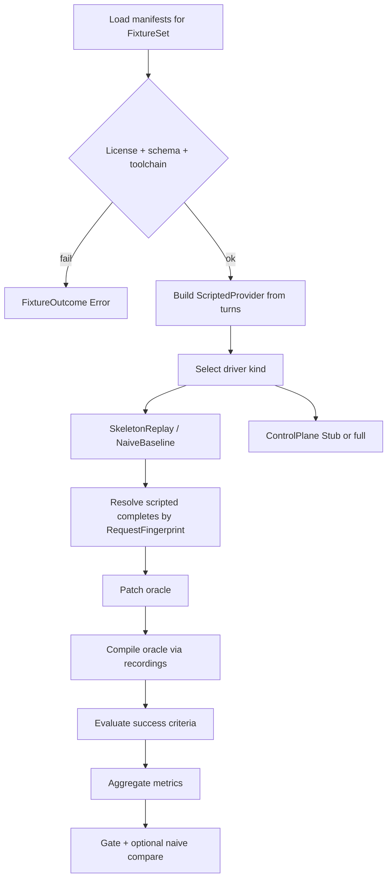
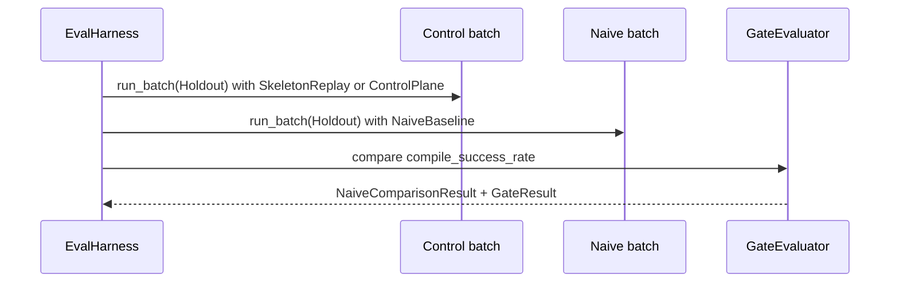

# RFC-0016: Eval Harness & Holdout Gates

| Field | Value |
| --- | --- |
| **Status** | Draft |
| **Author** | arkadianet |
| **Architecture** | Alloy Architecture V2 (**frozen**) — do not redesign |
| **Depends on** | [RFC-0001](./RFC-0001-alloy-runtime.md) (merged), [RFC-0007](./RFC-0007-model-router-provider.md) (merged) |
| **Effort** | 5–8 person-days |
| **Related RFCs** | [0004](./RFC-0004-observability-cost-metering.md) cost meter / decision log · [0005](./RFC-0005-sandbox-broker.md) sandbox-before-dogfood · [0006](./RFC-0006-mcp-host-builtins.md) `cargo_check` JSON · [0008](./RFC-0008-edit-engine.md) TextPatch apply (**full gate**) · [0010](./RFC-0010-scheduler-runtime-adapters.md) DAG / VerifyCompile (**full gate**) · [0013](./RFC-0013-capability-registry-workers.md) Repair/Edit workers (**full gate**) · [0015](./RFC-0015-cli-profiles-config.md) CLI wiring (**full gate**) |
| **Product** | Alloy — AI Engineering Runtime |
| **Supersedes** | Draft outline of this filename (expanded to implementation grade) |

**Mental model (V2 §17 / ADR F-19 / F-25):** Eval gates milestones from week 1. Fixtures + a deterministic scripted `ModelProvider` + recorded `cargo check --message-format=json` prove the control-plane thesis offline — without provider keys, without network, and without numeric cost marketing until holdout calibration (V2 §18 / ADR F-08). The falsification target is explicit: if the compile-gated DAG + BYOM control plane loses to the naive baseline on holdout local diagnostics, **stop — the control plane failed**.

**Authority order (highest → lowest):** current `main` source → merged RFCs 0001–0007 → Architecture V2 → this draft → roadmaps. Never reshape a merged public API solely to match an older V2 sketch or this document’s prior outline. Where RFC-0007 text and shipped code differ, **code wins** (recorded in §15).

---

## 1. Overview

### 1.1 Purpose

Ship the MVP **Eval Harness & Holdout Gates** in the existing `alloy-eval` crate (currently an empty stub):

1. **Fixture manifests** with a complete on-disk schema, license hygiene, and train/holdout separation.
2. **`ScriptedProvider`** implementing merged `ModelProvider` with **keyed** (not FIFO) turn resolution for concurrent fixture batches.
3. **Recorded cargo JSON** replay for VerifyCompile-class checks without invoking network or a live toolchain mismatch.
4. **`EvalMetrics`** per V2 §17.2 with defined unmeasured semantics — never silent zeros that look like measurements.
5. **Holdout gate helpers** with configurable thresholds, including the naive-baseline falsification comparison.
6. **Offline CI** that runs with no provider keys and no HTTP client exercise.

### 1.2 Problem Statement

RFC-0001 created the five-crate workspace including `alloy-eval` as an empty stub. RFC-0007 shipped `ModelProvider`, `ModelRouter`, `RecordingModelProvider` (FIFO, no network), price→USD derivation, and the first host HTTP client behind `http-provider`. Architecture V2 §17 requires fixtures + `ScriptedProvider` + recorded cargo JSON from week 1, holdout gates at every milestone exit, and a falsification target against a naive baseline. Without this RFC there is no fixture schema, no keyed scripted provider for concurrent batches, no `EvalMetrics` surface, no holdout discipline mechanism, no offline thesis test, and no way to fail a milestone when the control plane loses — leaving M1/M7 exit gates undefined.

### 1.3 Scope

| In scope | Detail |
| --- | --- |
| Crate `alloy-eval` | Fixture load, scripted provider, recorded cargo replay, metrics, gates |
| `ScriptedProvider: ModelProvider` | Keyed deterministic completions; no HTTP |
| Additive RFC-0007 note | `RecordingModelProvider` remains FIFO and unchanged |
| Recorded `cargo check --message-format=json` | Capture, version, validate, replay |
| `EvalMetrics` + report envelope | V2 §17.2 fields with `MetricField` unmeasured state |
| Holdout set (P0) | Local-diagnostic / E0502-class fixtures |
| Gate helpers | Configurable thresholds; naive-baseline comparison |
| License hygiene (R17) | Permitted corpora only; reject on load |
| Offline CI | No keys, no network, no `http-provider` |
| Skeleton vs full-gate split | Normative Day-1 vs **Stub**/deferred surfaces |

### 1.4 Non-goals

| Deferred item | Owner |
| --- | --- |
| Production routing policy / live BYOM path design | **RFC-0007** (already Implemented) — consumed, not redesigned |
| Large multi-crate feature suites / public leaderboard | Deferred (V2 §17.2) |
| Lifetime-heavy fixtures as P0 | Deferred (V2 §4.1 stretch) |
| Alloy-on-Alloy dogfood | **Banned** until sandbox + holdout green (ADR F-07) |
| Numeric cost marketing claims | **Forbidden** until calibrated (V2 §18 / ADR F-08) |
| End-to-end live scheduler/CLI holdout loop | **Stub** here; activates when RFCs 0008–0015 land (M7) |
| Sixth crate, OTLP, redesign of merged router APIs | Forbidden |
| Writing or overwriting `.env` | Forbidden |

### 1.5 Day-1 MVP (normative)

1. `alloy-eval` MUST expose the public API in §3 and MUST remain `#![forbid(unsafe_code)]`.
2. `ScriptedProvider` MUST implement `alloy_runtime::ModelProvider`, MUST NOT perform network I/O, MUST return `Health::Healthy`, and MUST resolve turns by `RequestFingerprint` (§3.4) — **not** FIFO.
3. `RecordingModelProvider` on `main` MUST remain unchanged (FIFO). This RFC MUST NOT dual-mode it.
4. At least **one** train fixture and **one** holdout fixture MUST exist under the §7 layout, each with a valid manifest, workspace snapshot, scripted turns, and recorded cargo JSON for the pre-repair (failing) and post-repair (passing) states.
5. `EvalHarness::run_fixture` / `run_batch` MUST execute offline with `OfflinePolicy::DenyNetwork`, MUST aggregate `EvalMetrics`, and MUST classify each fixture as `Pass | Fail | Error` (§5).
6. `GateEvaluator` MUST apply configurable thresholds and MUST implement the naive-baseline comparison semantics in §5.8. Skeleton builds MUST compile and unit-test the comparison; full control-plane execution against the live stack is **Stub** until §12.2 owners land.
7. Cost fields MAY be computed internally as uncalibrated operator-price-table estimates. Reports MUST carry `CostClaimGrade::UncalibratedInternal` and MUST NOT emit marketing-grade cost claims (§3.8 / §9.3).
8. CI MUST run `cargo test -p alloy-eval` with no `ALLOY_API_KEY` and with `alloy-runtime` consumed at `default-features = false` (§10).
9. Alloy MUST NEVER write `.env`.

---

## 2. Architecture Integration

### 2.1 Relationship to Architecture V2

| V2 reference | Application |
| --- | --- |
| §17.1 / ADR F-19, F-25 | Eval gates milestones; ScriptedProvider; holdout |
| §17.2 Architectural interface | Fixture manifests; offline thesis tests; holdout gates |
| §17.2 MVP | Fixtures + ScriptedProvider + recorded cargo JSON from week 1 |
| §17.2 `EvalMetrics` | Exact field set; this RFC defines population semantics |
| §17.2 Falsification target | Control plane vs naive baseline on holdout |
| §17.2 Deferred | Large suites; public leaderboard; lifetime-heavy P0 |
| §18 / ADR F-08 | No numeric cost marketing until calibrated holdout |
| §14.2 / ADR F-07 | Dogfood banned until sandbox + holdout green |
| §5.4 crate map | Harness lives in `alloy-eval` (≤5 crates) |
| §19.1 M1 thesis | Sandboxed tool→model→patch→check→log beats naive baseline |
| R15 | Holdout; mixed fixtures — mechanism in §7.4 |
| R17 | Permitted corpora only — enforced at manifest load |

### 2.2 Relationship to RFC-0001

Authoritative for: five-crate map, `CapabilityId`, `NodeId`, `ProviderId`, `ModelTier`, `Digest`, `ErrorClass`, `DiagnosticEvent`, `WorkerMetrics`, `RuntimeMetrics`, `#![forbid(unsafe_code)]` on workspace libs, `example.env` pattern.

This RFC MUST NOT redefine those types. `EvalMetrics` is **new** in `alloy-eval` (V2 places it under Eval; it is not on `main` today).

### 2.3 Relationship to RFC-0004

Authoritative for: `CostMeter`, `SharedCostMeter`, `CostSnapshot`, `ModelCallRecord`, `DecisionLog`, `usage_unknown` invariant, redaction helpers, `hash_prompt` / `Digest::sha256`.

Eval MAY construct a process-local `CostMeter` when aggregating scripted usage for internal `cost_usd_p50`. Eval MUST honour `CostSnapshot.usd_spent: Option<f64>` semantics: `None` is not measured zero. Eval MUST NOT publish calibrated marketing bands from uncalibrated meter data (RFC-0004 related note; ADR F-08).

### 2.4 Relationship to RFC-0007

Authoritative for: `ModelProvider`, `ModelRouter`, `CompletionRequest`, `ModelResponse`, `Usage`, `ModelEndpoint`, `PromptPack`, `ChatMessage`, `Health`, `ProviderError`, `RouterError`, `RecordingModelProvider`, `TomlModelRouter::from_parts`, price table → USD via operator prices, `http-provider` feature gate.

**RFC-0007 §3.15 contract (normative input to this RFC):**

> `ScriptedProvider` in `alloy-eval` MUST implement the same `ModelProvider` trait. It MAY use a `HashMap` keyed by a deterministic fingerprint of `CompletionRequest` instead of FIFO; it MUST NOT perform HTTP; it MUST return `Health::Healthy`.

This RFC **exercises that MAY as MUST** for the eval harness (keyed mode is required for concurrent batches).

### 2.5 Already implemented | Added by RFC-0016 | Deferred

| Category | Contents |
| --- | --- |
| **Already implemented** | `ModelProvider` / `ModelRouter`; `RecordingModelProvider` (FIFO); router types; `CostMeter` / `CostSnapshot`; `Digest` / `hash_prompt`; `DiagnosticEvent`; MCP `cargo_check` with `--message-format=json` (RFC-0006); sandbox broker (RFC-0005); empty `alloy-eval` stub; toolchain pin `1.97.1` |
| **Added by RFC-0016** | `ScriptedProvider`; fixture manifest schema + loader; recorded cargo JSON types + replay; `EvalMetrics` / `MetricField` / report envelope; batch runner; gate thresholds + naive baseline types; holdout directory discipline + CI lint; offline policy; ≥1 train + ≥1 holdout golden fixture; crate deps with `default-features = false` on `alloy-runtime` |
| **Deferred / Stub** | Full control-plane fixture driver through scheduler/CLI (0008–0015); live-provider holdout dual-report; calibrated cost claims; public leaderboard; lifetime-heavy fixtures; Alloy-on-Alloy dogfood |

### 2.6 Dependency boundaries

```text
alloy-eval
   │
   ├── alloy-runtime (default-features = false)
   │      └── router traits/types, RecordingModelProvider, CostMeter, Digest
   │      └── MUST NOT enable http-provider for default eval builds
   │
   └── (full-gate only, optional feature `stack-driver`) alloy-tools
          └── sandbox + MCP — Stub until M7; not required for Day-1 MVP
```

- `alloy-eval` remains one of ≤5 crates. **No sixth crate.**
- Day-1 MUST NOT depend on `alloy-cli`, `alloy-index`, or default-on `http-provider`.
- Full-gate stack driver (optional feature) MAY depend on `alloy-tools` once RFCs 0008–0015 provide the vertical slice — marked **Stub** in Day-1 (§12).

### 2.7 Milestones this gates

| Milestone (roadmap) | Gate role |
| --- | --- |
| **M4** | Skeleton: ScriptedProvider + ≥1 fixture + EvalMetrics + offline CI |
| **M1 / M7** | Full holdout: control plane vs naive baseline on holdout local diagnostics |
| Dogfood | Blocked until sandbox green **and** holdout gate green |

---

## 3. Public Rust API

All new items live in `alloy-eval` unless an additive change to `alloy-runtime` is explicitly listed. `alloy-eval` MUST enable `#![deny(missing_docs)]` for public items. Every public item MUST have rustdoc stating ownership and failure semantics.

### 3.1 Reused types (normative — unchanged)

| Type | Source | Notes |
| --- | --- | --- |
| `ModelProvider` | `alloy_runtime::router::traits` | Object-safe; `Send + Sync` |
| `ModelRouter` | same | Used by full-gate **Stub** driver only |
| `RecordingModelProvider` | `alloy_runtime::router::recording` | FIFO; **unchanged** |
| `CompletionRequest`, `ModelResponse`, `Usage` | `router::types` | Script I/O |
| `ModelEndpoint`, `Health`, `PromptPack`, `ChatMessage` | `router::types` | Unchanged |
| `ProviderId`, `CapabilityId`, `NodeId`, `Digest` | `types::ids` | Fingerprints / attribution |
| `ProviderError`, `RouterError` | `router::error` | Scripted error outcomes |
| `CostMeter`, `CostSnapshot`, `ModelCallRecord` | `obs` | Internal cost aggregation |
| `ModelTier` | `types::budget` | Optional attribution in reports |
| `DiagnosticEvent`, `ErrorClass` | `types::diagnostic` | Outcome classification helpers |
| `hash_prompt`, `Digest::sha256` | `obs` / `types::ids` | Fingerprint construction |

### 3.2 Design decision — scripted provider shape (mandatory)

| Option | Verdict |
| --- | --- |
| Extend `RecordingModelProvider` with keyed mode | **Rejected** |
| Wrap `RecordingModelProvider` as the public eval type | **Rejected** as the primary API |
| Distinct `ScriptedProvider` in `alloy-eval` | **Accepted** |

**Reasons (normative — why extension is wrong):**

1. **Merged FIFO contract:** `RecordingModelProvider` on `main` is documented and tested as FIFO pop. Adding a keyed mode creates dual semantics on a stable public type and risks RFC-0007 callers depending on the wrong mode (playbook: extend carefully; do not parallel-implement *or* silently bifurcate).
2. **Trait call shape:** `ModelProvider::complete` receives only `ModelEndpoint` + `CompletionRequest` — no capability/node. Eval keying is therefore a **request fingerprint** concern belonging to the eval crate, not a FIFO recorder concern.
3. **RFC-0007 §3.15 already named** `ScriptedProvider` in `alloy-eval` as the keyed consumer of the same trait. This RFC implements that contract; it does not invent a second *router* provider kind.
4. **Concurrency:** Batch runners isolate one `ScriptedProvider` per fixture; keyed lookup within a fixture remains order-independent. FIFO cannot satisfy that without external serialization.

**Additive diff to `RecordingModelProvider`:** **none**. FIFO API stays exactly:

```rust
impl RecordingModelProvider {
    pub fn new(id: ProviderId) -> Self;
    pub fn push(&self, outcome: Result<ModelResponse, ProviderError>);
    pub fn recorded(&self) -> Vec<(ModelEndpoint, CompletionRequest)>;
}
```

Eval tests that only need sequential single-threaded FIFO MAY still construct `RecordingModelProvider` directly for unit tests of other crates; the **harness public scripted surface** is `ScriptedProvider`.

### 3.3 `RequestFingerprint`

```rust
/// SHA-256 digest of the canonical JSON encoding of a [`CompletionRequest`].
///
/// Canonical encoding MUST be `serde_json::to_vec` of the request value after
/// normalizing with [`canonical_completion_request`] (§3.3.1). Digests are
/// lowercase hex via [`Digest::as_hex`].
#[derive(Debug, Clone, PartialEq, Eq, Hash, Serialize, Deserialize)]
#[serde(transparent)]
pub struct RequestFingerprint(Digest);

impl RequestFingerprint {
    /// Compute fingerprint for `request`.
    #[must_use]
    pub fn of(request: &CompletionRequest) -> Self;

    /// Parse a 64-char lowercase hex digest; reject otherwise.
    pub fn from_hex(s: impl AsRef<str>) -> Result<Self, EvalError>;

    #[must_use]
    pub fn as_digest(&self) -> &Digest;

    #[must_use]
    pub fn as_hex(&self) -> &str;
}
```

#### 3.3.1 Canonicalization rules (normative)

`canonical_completion_request(req: &CompletionRequest) -> CompletionRequest` MUST:

| Field | Rule |
| --- | --- |
| `messages` | Preserve order; each `content` MUST be NFC-normalized UTF-8 as stored (no trimming) |
| `tools` | Preserve order; MUST be empty `[]` in Day-1 fixtures |
| `tool_choice` | Preserve |
| `response_format` | Preserve |
| `temperature` | Preserve `None` vs `Some`; do not default |
| `max_output_tokens` | Preserve `None` vs `Some` |

Fingerprint bytes = `serde_json::to_vec(&canonical)`. Serde field order on these types is struct-declaration order on `main` and MUST NOT be alphabetically re-sorted by the harness. If `serde_json::to_vec` fails (impossible for these types on `main`), return `EvalError::Internal`.

**Manifest identity vs provider key:** Fixture turns also carry a human `FixtureTurnId` (§3.5). The **provider** keys solely by `RequestFingerprint` because that is all `complete` observes. The runner MUST ensure the `CompletionRequest` it builds matches the manifest turn’s fingerprint before calling `complete`.

### 3.4 `ScriptedProvider`

```rust
/// Keyed scripted [`ModelProvider`] for offline eval. Performs no network I/O.
///
/// Ownership: process-local; share across tasks only via [`Arc`].
/// Sync: interior `std::sync::Mutex` (same pattern as `RecordingModelProvider`).
pub struct ScriptedProvider { /* private */ }

impl ScriptedProvider {
    /// Empty provider with catalog id.
    #[must_use]
    pub fn new(id: ProviderId) -> Self;

    /// Insert a single-consumption outcome for `key`.
    ///
    /// Returns `Err(EvalError::DuplicateScriptKey)` if `key` already present.
    pub fn insert(
        &self,
        key: RequestFingerprint,
        outcome: ScriptOutcome,
    ) -> Result<(), EvalError>;

    /// Bulk-load from an ordered list; fails closed on the first duplicate key.
    pub fn extend(
        &self,
        entries: impl IntoIterator<Item = (RequestFingerprint, ScriptOutcome)>,
    ) -> Result<(), EvalError>;

    /// Remaining unconsumed keys (sorted by hex for determinism).
    #[must_use]
    pub fn remaining_keys(&self) -> Vec<RequestFingerprint>;

    /// Invocations in call order: `(endpoint, request, fingerprint)`.
    #[must_use]
    pub fn recorded(&self) -> Vec<ScriptedInvocation>;

    /// True when no outcomes remain.
    #[must_use]
    pub fn is_exhausted(&self) -> bool;
}

/// One scripted complete outcome.
#[derive(Debug, Clone)]
pub enum ScriptOutcome {
    /// Successful model response.
    Response(ModelResponse),
    /// Provider-level failure returned to the caller.
    Error(ScriptedProviderError),
}

/// Cloneable subset of [`ProviderError`] for fixture manifests.
///
/// Mapped to [`ProviderError`] at `complete` time. Does not add variants to
/// the merged `ProviderError` enum.
#[derive(Debug, Clone, PartialEq, Eq, Serialize, Deserialize)]
#[serde(tag = "kind", rename_all = "snake_case")]
pub enum ScriptedProviderError {
    Auth,
    RateLimit,
    ContextLength,
    Timeout,
    MalformedResponse { message: String },
    HttpStatus { status: u16, message: String },
    Tls { message: String },
    Transport { message: String },
    Internal { message: String },
}

impl From<ScriptedProviderError> for ProviderError {
    fn from(value: ScriptedProviderError) -> Self { /* §8.3 mapping */ }
}

#[derive(Debug, Clone, PartialEq)]
pub struct ScriptedInvocation {
    pub endpoint: ModelEndpoint,
    pub request: CompletionRequest,
    pub fingerprint: RequestFingerprint,
}
```

#### 3.4.1 `ModelProvider` implementation (normative)

```rust
#[async_trait]
impl ModelProvider for ScriptedProvider {
    fn id(&self) -> ProviderId;

    async fn complete(
        &self,
        endpoint: &ModelEndpoint,
        request: CompletionRequest,
    ) -> Result<ModelResponse, ProviderError>;

    async fn health(&self) -> Health; // always Health::Healthy
}
```

| Step | Behaviour |
| --- | --- |
| 1 | Compute `fp = RequestFingerprint::of(&request)` |
| 2 | Lock mutex; append `ScriptedInvocation`; remove outcome for `fp` |
| 3 | Missing key → `Err(ProviderError::Internal("scripted miss: <hex>".into()))` |
| 4 | `ScriptOutcome::Response(r)` → `Ok(r)` |
| 5 | `ScriptOutcome::Error(e)` → `Err(ProviderError::from(e))` |
| 6 | Poisoned mutex → log error; recover via `into_inner()` (same as `RecordingModelProvider`) |

**Single-consumption:** Each key may be completed **once**. A second `complete` with the same fingerprint after consumption is a miss (Internal), not a replay. Fixtures that need identical successive turns MUST declare **distinct** fingerprints (distinct requests) or distinct ordinals that produce distinct requests (e.g. differing message content / turn marker).

**Send + Sync:** `ScriptedProvider: Send + Sync`. Share with `Arc<ScriptedProvider>` / `Arc<dyn ModelProvider>`.

**Lifecycle:** Drop is ordinary; no drain protocol. Unconsumed keys at fixture end → fixture `Fail` with reason `UnconsumedScripts` when the manifest sets `require_consume_all = true` (default **true**).

### 3.5 Fixture turn identity (manifest)

```rust
/// Human-stable turn id inside a fixture (not the provider lookup key).
#[derive(Debug, Clone, PartialEq, Eq, Hash, Serialize, Deserialize)]
pub struct FixtureTurnId {
    /// Capability the turn belongs to (e.g. `repair`).
    pub capability: CapabilityId,
    /// Optional DAG node id when the full stack attributes nodes.
    #[serde(default, skip_serializing_if = "Option::is_none")]
    pub node: Option<NodeId>,
    /// 0-based ordinal within `(capability, node)` for this fixture.
    pub ordinal: u32,
}

impl FixtureTurnId {
    /// Display form `capability/node/ordinal` or `capability/-/ordinal`.
    #[must_use]
    pub fn render(&self) -> String;
}
```

This is the normative expansion of the placeholder phrase **“capability/node fingerprint”**: a stable *manifest* identity. Provider lookup remains `RequestFingerprint`.

### 3.6 `MetricField` and `EvalMetrics`

Silent numeric zeros that look like measurements are forbidden for unmeasured quantities.

```rust
/// Population state for one metric.
#[derive(Debug, Clone, PartialEq, Serialize, Deserialize)]
#[serde(tag = "state", content = "value", rename_all = "snake_case")]
pub enum MetricField<T> {
    /// Value was computed from observed fixture data this run.
    Measured(T),
    /// Value is intentionally absent; MUST NOT be treated as zero.
    Unmeasured { reason: UnmeasuredReason },
}

#[derive(Debug, Clone, Copy, PartialEq, Eq, Serialize, Deserialize)]
#[serde(rename_all = "snake_case")]
pub enum UnmeasuredReason {
    /// Skeleton / Day-1 path does not yet produce this signal.
    SkeletonDeferred,
    /// Owning RFC / subsystem not linked into this build.
    SubsystemAbsent,
    /// No samples in the selected fixture set.
    EmptySample,
    /// Tokens or prices insufficient for USD derivation.
    CostInputsIncomplete,
    /// Calibration gate not granted (ADR F-08).
    CostUncalibrated,
    /// Explicitly not applicable to this gate profile.
    NotApplicable,
}

/// V2 §17.2 metrics with explicit population semantics.
#[derive(Debug, Clone, PartialEq, Serialize, Deserialize)]
pub struct EvalMetrics {
    pub success_rate: MetricField<f64>,
    pub compile_success_rate: MetricField<f64>,
    pub token_efficiency: MetricField<f64>,
    pub latency_p50_ms: MetricField<u64>,
    pub latency_p95_ms: MetricField<u64>,
    pub cost_usd_p50: MetricField<f64>,
    pub retries_mean: MetricField<f64>,
    pub human_interventions: MetricField<f64>,
    pub unsafe_introduced_rate: MetricField<f64>,
}
```

#### 3.6.1 Population table (normative)

| Field | Who populates | When Measured | Skeleton default |
| --- | --- | --- | --- |
| `success_rate` | `MetricsAggregator` | After batch: `passes / (passes+fails)` over fixtures that are not `Error` | **Measured** from fixture outcomes |
| `compile_success_rate` | `MetricsAggregator` | Fraction of non-Error fixtures whose final compile classification is clean | **Measured** |
| `token_efficiency` | `MetricsAggregator` | `(successful_fixtures) / max(1, total_input_tokens + total_output_tokens)` when all token samples known | **Unmeasured(`EmptySample` or `CostInputsIncomplete`)** unless scripts include usage |
| `latency_p50_ms` | `MetricsAggregator` | p50 of per-fixture wall times | **Measured** (harness wall clock) |
| `latency_p95_ms` | `MetricsAggregator` | p95 of per-fixture wall times | **Measured** |
| `cost_usd_p50` | `MetricsAggregator` via operator prices | p50 of per-fixture derived USD when every fixture in the sample has finite USD | **Unmeasured(`CostUncalibrated`)** in reports exposed as claims; internal scratch MAY hold `Measured` under `CostClaimGrade::UncalibratedInternal` only (§3.8) |
| `retries_mean` | `MetricsAggregator` | Mean retry count from stack driver | **Unmeasured(`SkeletonDeferred`)** Day-1; **Measured** under full-gate when RFC-0010 linked |
| `human_interventions` | `MetricsAggregator` | Mean GateHuman interventions | **Unmeasured(`SkeletonDeferred`)** until GateHuman exists |
| `unsafe_introduced_rate` | `MetricsAggregator` | Fixtures that introduced `unsafe` / fixtures scored | **Measured** when `no_new_unsafe` criterion active; else **Unmeasured(`NotApplicable`)** |

**Rate arithmetic:** Empty non-Error sample → `Unmeasured(EmptySample)`, never `Measured(0.0)` for rates. A real measured zero (all failed) is `Measured(0.0)` only when the denominator is > 0.

**Percentile rule:** For `n = 1`, p50 = p95 = that sample. For `n ≥ 2`, use nearest-rank: index = `ceil(p * n) - 1` clamped to `[0, n)`.

### 3.7 Fixture outcomes and reports

```rust
#[derive(Debug, Clone, Copy, PartialEq, Eq, Serialize, Deserialize)]
#[serde(rename_all = "snake_case")]
pub enum FixtureStatus {
    /// Success criteria satisfied.
    Pass,
    /// Ran to completion; criteria failed.
    Fail,
    /// Harness/infra failure; must not be counted as a thesis Fail.
    Error,
}

#[derive(Debug, Clone, PartialEq, Serialize, Deserialize)]
pub struct FixtureOutcome {
    pub fixture_id: FixtureId,
    pub set: FixtureSet,
    pub status: FixtureStatus,
    pub criteria: Vec<CriterionResult>,
    pub wall_ms: u64,
    pub model_calls: u32,
    pub tokens_in: Option<u64>,
    pub tokens_out: Option<u64>,
    /// Derived USD for this fixture when computable; never a marketing claim.
    pub cost_usd: Option<f64>,
    pub retry_count: Option<u32>,
    pub human_interventions: Option<u32>,
    pub unsafe_introduced: Option<bool>,
    pub compile_clean: Option<bool>,
    pub error: Option<EvalError>,
}

#[derive(Debug, Clone, PartialEq, Eq, Serialize, Deserialize)]
pub struct CriterionResult {
    pub name: SuccessCriterion,
    pub passed: bool,
    pub detail: String,
}

#[derive(Debug, Clone, PartialEq, Serialize, Deserialize)]
pub struct EvalReport {
    pub schema_version: u32, // MUST be 1 for this RFC
    pub run_id: String,      // UUID v4 string
    pub offline: bool,
    pub toolchain: ToolchainRecord,
    pub fixtures: Vec<FixtureOutcome>,
    pub metrics: EvalMetrics,
    pub cost_claim: CostClaimEnvelope,
    pub gate: Option<GateResult>,
    pub naive_comparison: Option<NaiveComparisonResult>,
}
```

### 3.8 Cost claim envelope (ADR F-08)

```rust
#[derive(Debug, Clone, Copy, PartialEq, Eq, Serialize, Deserialize)]
#[serde(rename_all = "snake_case")]
pub enum CostClaimGrade {
    /// Internal operator-price-table estimate only. MUST NOT be marketed.
    UncalibratedInternal,
    /// Reserved for post-calibration publishes. Day-1 MUST NOT emit this.
    CalibratedHoldout,
}

#[derive(Debug, Clone, PartialEq, Serialize, Deserialize)]
pub struct CostClaimEnvelope {
    pub grade: CostClaimGrade,
    /// Present only when grade is CalibratedHoldout (unreachable in Day-1).
    pub marketing_usd_p50: Option<f64>,
    /// Always populated for operators reading raw reports; may mirror Unmeasured.
    pub internal_cost_usd_p50: MetricField<f64>,
    /// Constant disclaimer string (exact bytes).
    pub disclaimer: &'static str,
}

pub const COST_DISCLAIMER: &str =
    "internal operator-price-table estimate only; not a calibrated marketing claim (V2 §18 / ADR F-08)";
```

**Normative emission rules:**

1. Day-1 `EvalReport.cost_claim.grade` MUST be `UncalibratedInternal`.
2. `marketing_usd_p50` MUST be `None` in Day-1.
3. `EvalReport::marketing_cost_claim(&self) -> Option<f64>` MUST return `None` unless `grade == CalibratedHoldout` **and** a future RFC sets an explicit calibration grant flag in gate config (`calibration.allow_marketing_cost = true`). Day-1 gate config MUST NOT expose that flag as functional (parse-ignore or reject — §7.3).
4. Tracing/logs MAY print `internal_cost_usd_p50` only at `debug` with the disclaimer field present in the same event.
5. User-facing summaries (CI annotations, default `Display`) MUST NOT print a bare USD number for cost; they print `cost: uncalibrated` or omit the field.

**Derivation source:** When computing internal USD, reuse RFC-0007 semantics: USD only when endpoint `input_usd_per_mtok` / `output_usd_per_mtok` and both token counts are known (same formula as `router/price.rs` `derive_usd`). Scripted fixtures that omit usage → no USD for that fixture.

### 3.9 Manifest types

```rust
/// Manifest schema version. Day-1 writes and accepts only `1`.
pub const FIXTURE_MANIFEST_VERSION: u32 = 1;

#[derive(Debug, Clone, PartialEq, Eq, Hash, Serialize, Deserialize)]
#[serde(transparent)]
pub struct FixtureId(String);

impl FixtureId {
    /// Non-empty, ≤128 bytes, `[a-z0-9_.-]+`.
    pub fn new(s: impl Into<String>) -> Result<Self, EvalError>;
    pub fn as_str(&self) -> &str;
}

#[derive(Debug, Clone, Copy, PartialEq, Eq, Serialize, Deserialize)]
#[serde(rename_all = "snake_case")]
pub enum FixtureSet {
    Train,
    Holdout,
}

#[derive(Debug, Clone, Copy, PartialEq, Eq, Serialize, Deserialize)]
#[serde(rename_all = "snake_case")]
pub enum LicenseClass {
    /// MIT / Apache-2.0 / CC0 / original Alloy-authored.
    Permitted,
    /// Anything else — MUST be rejected at load.
    Forbidden,
}

#[derive(Debug, Clone, PartialEq, Serialize, Deserialize)]
pub struct FixtureManifest {
    pub manifest_version: u32,
    pub id: FixtureId,
    pub set: FixtureSet,
    pub license: LicenseMeta,
    pub toolchain: ToolchainRecord,
    pub workspace: WorkspaceRef,
    pub expected_diagnostics: Vec<ExpectedDiagnostic>,
    pub turns: Vec<ScriptTurn>,
    pub cargo_recordings: CargoRecordingRefs,
    pub success_criteria: Vec<SuccessCriterion>,
    /// Default true — unused script keys fail the fixture.
    #[serde(default = "default_true")]
    pub require_consume_all: bool,
    /// Skeleton driver kind.
    pub driver: FixtureDriverKind,
}

fn default_true() -> bool { true }

#[derive(Debug, Clone, PartialEq, Eq, Serialize, Deserialize)]
pub struct LicenseMeta {
    pub class: LicenseClass,
    /// SPDX id or `Alloy-Original`.
    pub spdx: String,
    pub source_note: String,
}

#[derive(Debug, Clone, PartialEq, Eq, Serialize, Deserialize)]
pub struct ToolchainRecord {
    /// MUST equal `rust-toolchain.toml` channel for recordings on main: `1.97.1`.
    pub channel: String,
    pub rustc_version: String,
    pub cargo_version: String,
}

#[derive(Debug, Clone, PartialEq, Eq, Serialize, Deserialize)]
pub struct WorkspaceRef {
    /// Directory relative to the fixture root containing the Cargo project.
    pub path: String,
    /// Package name for `-p` when replaying/recording.
    pub package: String,
}

#[derive(Debug, Clone, PartialEq, Eq, Serialize, Deserialize)]
pub struct ExpectedDiagnostic {
    /// e.g. `E0502`.
    pub code: String,
    /// Substring that MUST appear in the diagnostic message (pre-repair).
    pub message_contains: String,
}

#[derive(Debug, Clone, PartialEq, Serialize, Deserialize)]
pub struct ScriptTurn {
    pub turn_id: FixtureTurnId,
    /// Canonical request the runner MUST build (fingerprint source of truth).
    pub request: CompletionRequest,
    /// Optional precomputed hex; if present MUST match `RequestFingerprint::of(request)`.
    #[serde(default, skip_serializing_if = "Option::is_none")]
    pub request_fingerprint: Option<String>,
    pub outcome: ScriptTurnOutcome,
}

#[derive(Debug, Clone, PartialEq, Serialize, Deserialize)]
#[serde(tag = "type", rename_all = "snake_case")]
pub enum ScriptTurnOutcome {
    Response {
        text: Option<String>,
        #[serde(default)]
        structured: Option<serde_json::Value>,
        usage: Usage,
        #[serde(default)]
        provider_request_id: Option<String>,
        #[serde(default)]
        finish_reason: Option<String>,
    },
    Error {
        error: ScriptedProviderError,
    },
}

#[derive(Debug, Clone, PartialEq, Eq, Serialize, Deserialize)]
pub struct CargoRecordingRefs {
    /// Relative path to pre-repair failing cargo JSON recording.
    pub pre_repair: String,
    /// Relative path to post-repair passing cargo JSON recording.
    pub post_repair: String,
    pub recording_format_version: u32, // MUST be 1
}

#[derive(Debug, Clone, Copy, PartialEq, Eq, Serialize, Deserialize)]
#[serde(rename_all = "snake_case")]
pub enum SuccessCriterion {
    CompileClean,
    NoNewUnsafe,
    ExpectedDiagnosticsCleared,
    ScriptTurnsConsumed,
}

#[derive(Debug, Clone, Copy, PartialEq, Eq, Serialize, Deserialize)]
#[serde(rename_all = "snake_case")]
pub enum FixtureDriverKind {
    /// Day-1: apply scripted model text as a patch file replace + replay cargo JSON.
    SkeletonReplay,
    /// Full stack through scheduler/CLI — **Stub** until §12.2.
    ControlPlane,
    /// Naive baseline driver (§5.8).
    NaiveBaseline,
}
```

### 3.10 Recorded cargo JSON

```rust
pub const CARGO_RECORDING_FORMAT_VERSION: u32 = 1;

#[derive(Debug, Clone, PartialEq, Serialize, Deserialize)]
pub struct CargoJsonRecording {
    pub recording_format_version: u32,
    pub toolchain: ToolchainRecord,
    /// Exact argv conceptually recorded (informational).
    pub argv: Vec<String>,
    /// Process exit code from the capture.
    pub exit_code: i32,
    /// Raw newline-delimited JSON lines from `cargo check --message-format=json` stdout.
    pub stdout_lines: Vec<String>,
    /// Optional stderr capture (may be empty).
    #[serde(default)]
    pub stderr: String,
    /// SHA-256 of `stdout_lines` joined with `\n` (no trailing extra newline beyond lines).
    pub content_digest: Digest,
}

impl CargoJsonRecording {
    pub fn load(path: &Path) -> Result<Self, EvalError>;
    pub fn validate_against_pin(&self, pin_channel: &str) -> Result<(), EvalError>;
    /// Parse compiler-message diagnostics with `code.code` / `message` extraction.
    pub fn diagnostics(&self) -> Result<Vec<RecordedDiagnostic>, EvalError>;
    #[must_use]
    pub fn compile_clean(&self) -> bool; // exit_code == 0 && no error-level codes
}

#[derive(Debug, Clone, PartialEq, Eq, Serialize, Deserialize)]
pub struct RecordedDiagnostic {
    pub code: Option<String>,
    pub level: String,
    pub message: String,
}
```

**Replay semantics (Day-1):** The skeleton driver MUST NOT invoke `cargo` or the network. It loads `pre_repair` / `post_repair` recordings, validates toolchain channel, and uses them as the compile oracle. Live re-capture is a **developer tool** behind `EvalHarness::recapture_cargo` (§3.12) and is forbidden in offline CI.

### 3.11 Gate types and naive baseline

```rust
#[derive(Debug, Clone, PartialEq, Serialize, Deserialize)]
pub struct GateThresholds {
    /// Minimum Measured compile_success_rate on the selected set.
    pub min_compile_success_rate: f64,
    /// Minimum Measured success_rate on the selected set.
    pub min_success_rate: f64,
    /// Maximum Measured unsafe_introduced_rate (if measured).
    pub max_unsafe_introduced_rate: f64,
    /// When true, control plane MUST beat naive on compile_success_rate.
    pub require_beat_naive: bool,
    /// Control wins if `control + naive_epsilon >= naive` (default 0.0 → must be ≥).
    pub naive_epsilon: f64,
    /// Fixture set the gate evaluates.
    pub set: FixtureSet,
}

impl GateThresholds {
    /// M1 / M7 holdout defaults.
    #[must_use]
    pub fn milestone_holdout_defaults() -> Self {
        Self {
            min_compile_success_rate: 1.0,
            min_success_rate: 1.0,
            max_unsafe_introduced_rate: 0.0,
            require_beat_naive: true,
            naive_epsilon: 0.0,
            set: FixtureSet::Holdout,
        }
    }

    /// Skeleton CI defaults (single golden fixtures; naive compare optional).
    #[must_use]
    pub fn skeleton_defaults() -> Self {
        Self {
            min_compile_success_rate: 1.0,
            min_success_rate: 1.0,
            max_unsafe_introduced_rate: 0.0,
            require_beat_naive: false,
            naive_epsilon: 0.0,
            set: FixtureSet::Train,
        }
    }
}

#[derive(Debug, Clone, PartialEq, Serialize, Deserialize)]
pub struct GateResult {
    pub passed: bool,
    pub thresholds: GateThresholds,
    pub failures: Vec<GateFailure>,
}

#[derive(Debug, Clone, PartialEq, Eq, Serialize, Deserialize)]
#[serde(tag = "kind", rename_all = "snake_case")]
pub enum GateFailure {
    CompileSuccessRate { actual: String, minimum: String },
    SuccessRate { actual: String, minimum: String },
    UnsafeIntroducedRate { actual: String, maximum: String },
    LostToNaiveBaseline { control: String, naive: String, epsilon: String },
    MetricUnmeasured { field: String, reason: UnmeasuredReason },
    FixtureErrorsPresent { count: u32 },
}

/// The naive baseline is a single-turn repair without Alloy control-plane services.
#[derive(Debug, Clone, PartialEq, Serialize, Deserialize)]
pub struct NaiveBaselineSpec {
    /// Manifest id of the naive driver profile (same fixtures, driver = NaiveBaseline).
    pub label: &'static str, // "naive_single_turn_patch"
}

#[derive(Debug, Clone, PartialEq, Serialize, Deserialize)]
pub struct NaiveComparisonResult {
    pub control: EvalMetrics,
    pub naive: EvalMetrics,
    /// True iff control compile_success_rate + epsilon >= naive compile_success_rate
    /// and both sides Measured.
    pub control_beats_naive: bool,
    pub detail: String,
}
```

#### 3.11.1 What the naive baseline **is** (normative)

For each holdout fixture, the **naive baseline** run MUST:

1. Load the same workspace snapshot and `pre_repair` cargo recording (same diagnostics).
2. Perform **exactly one** `ModelProvider::complete` using the fixture’s ordinal-0 Repair turn only (ignore additional control-plane turns).
3. Interpret the model `text` as a unified diff / full-file replacement per the fixture’s `naive_patch_mode` (Day-1: `FullFileReplace` of the single broken source file path declared in the workspace helper file `naive_target_path` inside the fixture root — see §7.1).
4. Classify compile success **solely** from the fixture’s `post_repair` recording when the scripted text **byte-equals** the golden post-repair source; if the scripted text differs, classify compile as **failed** without live cargo (offline determinism).  
   - Rationale: Day-1 cannot apply arbitrary patches under sandbox without RFC-0008; equality-to-golden is the offline oracle. Full-gate MAY replace this with real apply+check (**Stub** seam `PatchOracle`).
5. Use **no** Task DAG, **no** scheduler retries, **no** multi-capability loop, **no** ProjectGraph, **no** GateHuman.

**“Loses” (numeric):** When `require_beat_naive` is true,

```text
control_compile = control.metrics.compile_success_rate  // must be Measured
naive_compile   = naive.metrics.compile_success_rate    // must be Measured
loses           = control_compile + naive_epsilon < naive_compile
```

If either metric is `Unmeasured`, the gate MUST fail with `GateFailure::MetricUnmeasured` (fail closed — do not skip).

**Control-plane run (full gate):** Same fixtures with `FixtureDriverKind::ControlPlane`. Day-1 skeleton uses `SkeletonReplay` for the “control” side of unit tests that assert comparison arithmetic; M7 wires the real driver.

### 3.12 Harness API

```rust
#[derive(Debug, Clone)]
pub struct EvalHarness {
    // private config + fixture root
}

#[derive(Debug, Clone)]
pub struct EvalHarnessConfig {
    pub fixture_root: PathBuf,
    pub offline: OfflinePolicy,
    pub thresholds: GateThresholds,
    pub max_concurrency: usize, // MUST be >= 1; default 4
    pub pin_toolchain_channel: String, // default "1.97.1"
}

#[derive(Debug, Clone, Copy, PartialEq, Eq, Serialize, Deserialize)]
#[serde(rename_all = "snake_case")]
pub enum OfflinePolicy {
    /// Any attempt to use network or http-provider → Error (CI default).
    DenyNetwork,
    /// Permits live provider only when feature `live-provider` is enabled.
    AllowLiveProvider,
}

impl EvalHarness {
    pub fn new(config: EvalHarnessConfig) -> Result<Self, EvalError>;

    /// Load one manifest + artifacts; validate license + toolchain pin.
    pub fn load_fixture(&self, id: &FixtureId) -> Result<LoadedFixture, EvalError>;

    /// Run one fixture to a terminal outcome.
    pub async fn run_fixture(&self, fixture: &LoadedFixture) -> FixtureOutcome;

    /// Run all fixtures in `set` with isolation + bounded concurrency.
    pub async fn run_batch(&self, set: FixtureSet) -> Result<EvalReport, EvalError>;

    /// Evaluate thresholds against a report (pure).
    #[must_use]
    pub fn evaluate_gate(&self, report: &EvalReport) -> GateResult;

    /// Run control batch + naive batch on holdout and compare (§5.8).
    pub async fn run_holdout_with_naive(&self) -> Result<EvalReport, EvalError>;

    /// Developer-only recapture. MUST return Err under OfflinePolicy::DenyNetwork
    /// and MUST return Err unless explicitly invoked from a `#[cfg(test)]` helper
    /// or binary feature `recapture` (not default).
    pub async fn recapture_cargo(
        &self,
        fixture: &LoadedFixture,
        which: CargoRecordingKind,
    ) -> Result<CargoJsonRecording, EvalError>;
}

#[derive(Debug, Clone, Copy, PartialEq, Eq)]
pub enum CargoRecordingKind {
    PreRepair,
    PostRepair,
}

pub struct LoadedFixture {
    pub manifest: FixtureManifest,
    pub root: PathBuf,
    pub pre_repair: CargoJsonRecording,
    pub post_repair: CargoJsonRecording,
    // private: source files, naive target path, etc.
}
```

**Async boundary:** All `run_*` methods are `async` and MUST be `.await`ed on a Tokio runtime. Fingerprint / load / gate evaluation MAY be sync. `ScriptedProvider::complete` is async to match `ModelProvider` but MUST NOT perform I/O.

### 3.13 Errors

```rust
#[derive(Debug, thiserror::Error)]
#[non_exhaustive]
pub enum EvalError {
    #[error("manifest: {0}")]
    Manifest(String),
    #[error("license forbidden: {0}")]
    LicenseForbidden(String),
    #[error("duplicate script key: {0}")]
    DuplicateScriptKey(String),
    #[error("recording stale: {0}")]
    RecordingStale(String),
    #[error("recording invalid: {0}")]
    RecordingInvalid(String),
    #[error("network required while offline: {0}")]
    NetworkRequired(String),
    #[error("fixture not found: {0}")]
    FixtureNotFound(String),
    #[error("io: {0}")]
    Io(#[from] std::io::Error),
    #[error("json: {0}")]
    Json(String),
    #[error("stub: {0}")]
    Stub(String),
    #[error("internal: {0}")]
    Internal(String),
}
```

Visibility: `EvalError` is `pub`. It is **not** converted into `ProviderError` except where `ScriptedProvider` returns `ProviderError` for miss/exhaustion.

### 3.14 Crate-root re-exports

`alloy_eval` MUST re-export at least:

`ScriptedProvider`, `ScriptOutcome`, `ScriptedProviderError`, `RequestFingerprint`, `FixtureTurnId`, `FixtureId`, `FixtureSet`, `FixtureManifest`, `FixtureStatus`, `FixtureOutcome`, `EvalMetrics`, `MetricField`, `UnmeasuredReason`, `EvalReport`, `EvalHarness`, `EvalHarnessConfig`, `OfflinePolicy`, `GateThresholds`, `GateResult`, `GateFailure`, `NaiveComparisonResult`, `CargoJsonRecording`, `EvalError`, `COST_DISCLAIMER`, `FIXTURE_MANIFEST_VERSION`, `CARGO_RECORDING_FORMAT_VERSION`.

### 3.15 Visibility & construction summary

| Item | Visibility | Constructors |
| --- | --- | --- |
| `ScriptedProvider` | `pub` | `new`, `insert`, `extend` |
| `EvalHarness` | `pub` | `new(config)` |
| `GateThresholds` | `pub` | `milestone_holdout_defaults`, `skeleton_defaults`, struct update |
| Internal modules (`driver`, `aggregate`, …) | `pub(crate)` | — |

---

## 4. Internal Module Design

### 4.1 Hierarchy

```text
crates/alloy-eval/
  Cargo.toml
  src/
    lib.rs              # re-exports; forbid unsafe; deny missing_docs
    error.rs            # EvalError
    fingerprint.rs      # RequestFingerprint + canonicalization
    scripted.rs         # ScriptedProvider
    manifest.rs         # FixtureManifest parse/validate
    recording.rs        # CargoJsonRecording load/validate/diagnostics
    metrics.rs          # EvalMetrics, MetricField, aggregator
    cost_claim.rs       # CostClaimEnvelope rules
    gate.rs             # GateThresholds, evaluate, naive compare
    driver/
      mod.rs
      skeleton.rs       # SkeletonReplay driver (Day-1)
      naive.rs          # NaiveBaseline driver
      control_plane.rs  # Stub → EvalError::Stub
    harness.rs          # EvalHarness, batch runner
    license.rs          # R17 checks
    report.rs           # EvalReport assembly
  fixtures/
    train/
      e0502_local_borrow/
        manifest.toml
        workspace/…
        recordings/
          pre_repair.json
          post_repair.json
        LICENSE
    holdout/
      e0502_holdout_01/
        … (same shape)
  tests/
    scripted_provider.rs
    golden_skeleton.rs
    determinism.rs
    offline_ci.rs
    holdout_gate_math.rs
```

### 4.2 Responsibilities

| Module | Responsibility |
| --- | --- |
| `fingerprint` | Canonical JSON + `RequestFingerprint` |
| `scripted` | Keyed provider; recorded invocations |
| `manifest` | TOML/JSON load; schema version; path safety |
| `recording` | Cargo JSON durability + diagnostic extract |
| `metrics` | Aggregation; percentile; unmeasured rules |
| `cost_claim` | ADR F-08 emission guard |
| `gate` | Thresholds + naive comparison |
| `driver::*` | Per-kind execution |
| `harness` | Batch, concurrency, offline enforcement |
| `license` | Reject `LicenseClass::Forbidden` |

### 4.3 Dependency direction

```text
harness → driver → scripted / recording / manifest
harness → metrics → cost_claim
harness → gate
driver ↛ gate
scripted ↛ manifest
```

No cycles. `control_plane` driver MUST NOT pull `http-provider`.

### 4.4 Injection points

| Seam | Day-1 | Full gate |
| --- | --- | --- |
| `ModelProvider` | `ScriptedProvider` | Optional live provider behind feature |
| `PatchOracle` | Golden byte-equality | RFC-0008 apply + sandbox check |
| `CompileOracle` | `CargoJsonRecording` replay | Live sandboxed `cargo_check` |
| `ControlPlaneDriver` | `EvalError::Stub` | Scheduler/CLI vertical slice |

---

## 5. Execution Algorithm

### 5.1 Pipeline overview



### 5.2 Manifest load

1. Resolve `fixture_root/{train|holdout}/<id>/manifest.toml` (TOML via `toml` crate) **or** `manifest.json`. Day-1 golden fixtures use **TOML**.
2. Reject `manifest_version != 1`.
3. Reject `license.class == Forbidden` → `EvalError::LicenseForbidden`.
4. Reject path escape: all relative paths MUST normalize within the fixture root (no `..` escape).
5. Load recordings; verify `content_digest`; verify `toolchain.channel == pin`.
6. For each turn: compute fingerprint; if `request_fingerprint` present, require equality; `insert` into a fresh `ScriptedProvider`.

### 5.3 Scripted turn resolution

1. Driver builds `CompletionRequest` **exactly** as `turn.request` from the manifest (no prompt rewriting in Day-1 skeleton).
2. Calls `provider.complete(&endpoint, request).await`.
3. Endpoint MAY be a fixture-local dummy `ModelEndpoint` with prices from an optional `endpoint.toml` beside the manifest; default prices `None` (USD unmeasured).
4. On `ProviderError::Internal` miss → fixture `Fail` (thesis: script mismatch) if driver expected success; or `Error` if manifest failed to install keys (`Harness` bug → `Error`).

**Classification rule:** Manifest/load/harness bugs → `Error`. Model script producing wrong repair / criteria miss → `Fail`. Criteria pass → `Pass`.

### 5.4 Recorded diagnostic replay

1. Parse `stdout_lines` as NDJSON objects.
2. Extract messages where `reason == "compiler-message"` (Cargo’s JSON schema) and read `message.level`, `message.message`, `message.code.code` when present.
3. Malformed JSON line → `EvalError::RecordingInvalid` → fixture `Error`.
4. `compile_clean` iff `exit_code == 0` and no extracted diagnostic has `level == "error"`.

### 5.5 SkeletonReplay driver (Day-1)

For a fixture with `driver = SkeletonReplay`:

1. Assert `pre_repair` is **not** compile_clean and contains every `expected_diagnostics` code.
2. Execute all scripted turns in manifest order (still keyed — order independence of map install; consumption follows call order).
3. Take the last successful `ModelResponse.text` as the candidate repair payload.
4. Patch oracle: candidate MUST equal `workspace/<naive_target_path>.post` golden bytes (file committed beside sources). Mismatch → criteria fail.
5. Compile oracle: use `post_repair` recording’s `compile_clean` **only if** patch oracle passed; else treat compile as failed.
6. Evaluate `success_criteria`.
7. If `require_consume_all` and `remaining_keys` non-empty → fail `ScriptTurnsConsumed`.

### 5.6 Outcome classification

| Condition | Status |
| --- | --- |
| All criteria pass; no harness fault | `Pass` |
| Criteria fail; harness OK | `Fail` |
| Load/license/recording/stub/network/internal harness fault | `Error` |

`Error` fixtures are excluded from rate denominators and force `GateFailure::FixtureErrorsPresent` when any exist in the gated set.

### 5.7 Metric aggregation

Input: `&[FixtureOutcome]` for one logical run (control or naive).

1. Partition non-Error vs Error.
2. Compute Measured rates on non-Error.
3. Latency from `wall_ms`.
4. Tokens: sum known; if any fixture has partial `None` tokens, `token_efficiency` → `Unmeasured(CostInputsIncomplete)` unless no fixture attempted model calls.
5. Apply §3.6.1 / §3.8 for cost fields.

### 5.8 Naive baseline comparison algorithm



1. Clone harness config; force `driver` override per fixture kind for the naive pass (naive ignores extra turns).
2. Produce two metric sets.
3. Fill `EvalReport.naive_comparison`.
4. If `thresholds.require_beat_naive`, apply §3.11.1 loses rule.

### 5.9 ControlPlane driver (**Stub**)

Day-1 `FixtureDriverKind::ControlPlane` MUST return `FixtureOutcome { status: Error, error: Some(EvalError::Stub("control_plane driver awaits RFCs 0008-0015".into())), … }`.

It MUST NOT silently skip.

---

## 6. Lifecycle & Concurrency

### 6.1 Batch runner semantics

| Rule | Normative behaviour |
| --- | --- |
| Isolation | One `LoadedFixture` + one `ScriptedProvider` + one outcome per task |
| Concurrency | `tokio::spawn` up to `max_concurrency` via a semaphore |
| Shared state | Harness config is read-only/`Clone`; no shared provider across fixtures |
| Ordering | Report `fixtures` sorted by `fixture_id.as_str()` ascending for determinism |
| Cancellation | `tokio::select!` on cancel token; cancelled fixture → `Error` with `Internal("cancelled")` — not Fail |
| Determinism | Identical inputs + recordings + scripts → identical `FixtureStatus`, criteria, metrics Measured values, fingerprints |

### 6.2 Determinism under concurrency

Because providers are not shared across fixtures, concurrent scheduling MUST NOT alter outcomes. Unit test `determinism_concurrent_batch` MUST run the same train set 8 tasks × 8 iterations and assert byte-equal serialized `EvalReport` after clearing `run_id` and sorting (report already sorted).

### 6.3 Fixture-local endpoint

Day-1 constructs:

```rust
ModelEndpoint {
    id: EndpointId::new("eval-script").unwrap(),
    provider: provider.id(),
    display_name: "eval-script".into(),
    model: "scripted".into(), // NOT a vendor id used for branching; eval-only label
    tiers: vec![ModelTier::Standard],
    supports_tools: false,
    supports_structured_output: false,
    max_context: 8192,
    input_usd_per_mtok: None,
    output_usd_per_mtok: None,
}
```

This string is confined to `alloy-eval` fixtures/tests and MUST NOT be introduced into `alloy-runtime` router core (RFC-0007 no-hardcoded-vendor rule remains intact).

---

## 7. Configuration

### 7.1 On-disk layout (normative)

```text
crates/alloy-eval/fixtures/
  train/<fixture_id>/
    manifest.toml
    LICENSE
    naive_target_path          # single-line relative path to broken source file
    workspace/                 # Cargo project snapshot
    workspace/<naive_target_path>.post   # golden post-repair source bytes
    recordings/pre_repair.json
    recordings/post_repair.json
  holdout/<fixture_id>/
    … same …
```

**Train vs holdout:** Physical directory **and** `manifest.set` MUST agree; mismatch → `EvalError::Manifest`.

### 7.2 `manifest.toml` field table

| Field | Type | Required | Notes |
| --- | --- | --- | --- |
| `manifest_version` | `u32` | yes | `1` |
| `id` | string | yes | Matches directory name |
| `set` | `train`/`holdout` | yes | Must match parent dir |
| `license.class` | `permitted`/`forbidden` | yes | Forbidden rejected |
| `license.spdx` | string | yes | e.g. `MIT OR Apache-2.0` or `Alloy-Original` |
| `license.source_note` | string | yes | Provenance |
| `toolchain.channel` | string | yes | `1.97.1` |
| `toolchain.rustc_version` | string | yes | Capture-time `rustc -V` |
| `toolchain.cargo_version` | string | yes | Capture-time `cargo -V` |
| `workspace.path` | string | yes | Relative dir |
| `workspace.package` | string | yes | Package name |
| `expected_diagnostics` | array | yes | Non-empty for P0 repair fixtures |
| `turns` | array | yes | ≥1 |
| `turns[].turn_id.capability` | string | yes | `CapabilityId` |
| `turns[].turn_id.node` | string? | no | `NodeId` |
| `turns[].turn_id.ordinal` | u32 | yes | |
| `turns[].request` | table | yes | `CompletionRequest` shape |
| `turns[].request_fingerprint` | string? | no | Must match if present |
| `turns[].outcome` | table | yes | Response or Error |
| `cargo_recordings.pre_repair` | string | yes | Relative path |
| `cargo_recordings.post_repair` | string | yes | Relative path |
| `cargo_recordings.recording_format_version` | u32 | yes | `1` |
| `success_criteria` | array | yes | Enum strings |
| `require_consume_all` | bool | no | default true |
| `driver` | enum | yes | `skeleton_replay` / `naive_baseline` / `control_plane` |

### 7.3 Gate configuration

Gate thresholds are Rust values (`GateThresholds`) supplied by tests/CI. Optional file `crates/alloy-eval/gates/skeleton.toml`:

```toml
set = "train"
min_compile_success_rate = 1.0
min_success_rate = 1.0
max_unsafe_introduced_rate = 0.0
require_beat_naive = false
naive_epsilon = 0.0
```

Unknown keys → hard error. Key `allow_marketing_cost` if present → hard error in Day-1 (prevents accidental calibration claim).

### 7.4 Holdout discipline mechanism (R15)

| Layer | Mechanism | Enforcement |
| --- | --- | --- |
| 1 | Directory separation `fixtures/train` vs `fixtures/holdout` | Load-time path/set agreement |
| 2 | Manifest `set` field | Schema required |
| 3 | CI lint job `eval-holdout-hygiene` | Fails if a PR diff touches **both** `crates/alloy-eval/fixtures/holdout/**` and any path matching `**/prompts/**`, `**/templates/**`, or `crates/alloy-runtime/src/router/openai.rs` |
| 4 | CODEOWNERS | `crates/alloy-eval/fixtures/holdout/` owned by `arkadianet` |
| 5 | Honour rule | Holdout fixtures MUST NOT be used for in-tree prompt tuning; owner **arkadianet** (Eval — R15) |

Layers 1–3 are mechanical. Layer 5 is **process**: reviewers MUST reject prompt-tuning PRs that cite holdout scores as the tuning signal. The RFC does **not** claim a cryptographic seal.

### 7.5 `example.env`

No new keys are REQUIRED for Day-1 offline eval. Do **not** modify `.env`. If documentation mentions live holdout later, `example.env` MAY gain a comment-only pointer — **not required** for this RFC’s Day-1 acceptance. Live keys remain RFC-0007’s `ALLOY_API_KEY`.

### 7.6 Cargo recording capture procedure (developer)

1. Use toolchain `1.97.1` (`rustup show` must match channel).
2. In the fixture workspace, run  
   `cargo check -p <package> --message-format=json > recordings/pre_repair.stdout`.
3. Wrap into `CargoJsonRecording` via a `#[cfg(feature = "recapture")]` helper that fills versions from `rustc -V` / `cargo -V`.
4. Apply golden post repair; recapture `post_repair`.
5. Commit JSON recordings; never commit secrets.

**Stale handling:** If `toolchain.channel != pin`, `validate_against_pin` returns `RecordingStale`. Offline CI MUST fail the fixture as `Error`, not skip.

---

## 8. Error Handling

### 8.1 `EvalError` variant table

| Variant | Producer | Meaning | Retryable | Caller visibility | Boundary |
| --- | --- | --- | --- | --- | --- |
| `Manifest` | loader | Schema/sem validation | no | pub | fixture `Error` |
| `LicenseForbidden` | license | R17 reject | no | pub | fixture `Error` |
| `DuplicateScriptKey` | ScriptedProvider::insert | Bad fixture scripts | no | pub | load `Error` |
| `RecordingStale` | recording | Toolchain pin mismatch | no | pub | fixture `Error` |
| `RecordingInvalid` | recording | Bad NDJSON/digest | no | pub | fixture `Error` |
| `NetworkRequired` | harness | Offline violation | no | pub | fixture/batch `Error` |
| `FixtureNotFound` | harness | Missing id | no | pub | batch `Err` |
| `Io` | fs | OS I/O | no | pub | `Error` |
| `Json` | serde | Parse | no | pub | `Error` |
| `Stub` | control_plane driver | Deferred surface invoked | no | pub | fixture `Error` |
| `Internal` | miscellaneous | Invariant | no | pub | `Error` |

### 8.2 Fixture failed vs harness failed

| Class | `FixtureStatus` | Counts in success rates? | Gate impact |
| --- | --- | --- | --- |
| Thesis failure (wrong repair, criteria) | `Fail` | yes (denominator) | lowers rates |
| Harness/infra/`EvalError` | `Error` | **no** | `FixtureErrorsPresent` fails gate |

Conflating them is forbidden: a stale recording MUST NOT look like “control plane failed the thesis.”

### 8.3 `ScriptedProviderError` → `ProviderError`

| Scripted | ProviderError |
| --- | --- |
| `Auth` | `Auth` |
| `RateLimit` | `RateLimit` |
| `ContextLength` | `ContextLength` |
| `Timeout` | `Timeout` |
| `MalformedResponse { message }` | `MalformedResponse(message)` |
| `HttpStatus { status, message }` | `HttpStatus { status, message }` |
| `Tls { message }` | `Tls(message)` |
| `Transport { message }` | `Transport(message)` |
| `Internal { message }` | `Internal(message)` |

Missed key mapping uses `ProviderError::Internal`, not `EvalError`.

### 8.4 Recovery semantics

Eval does **not** retry. Retry loops are RFC-0010’s concern and appear only in full-gate control-plane runs when that stack exists. Day-1: fail closed, record outcome, continue batch siblings.

---

## 9. Observability

### 9.1 Tracing spans (REQUIRED, MVP)

| Span | Fields |
| --- | --- |
| `alloy_eval.run_batch` | `set`, `fixture_count`, `offline` |
| `alloy_eval.run_fixture` | `fixture_id`, `driver`, `status` |
| `alloy_eval.scripted_complete` | `fingerprint`, `hit` |
| `alloy_eval.gate` | `passed`, `require_beat_naive` |

### 9.2 Log points

| Event | Level |
| --- | --- |
| License reject | `error` |
| Recording stale | `error` |
| Script miss | `warn` |
| Gate failure summary | `info` |
| Internal USD debug | `debug` + disclaimer |

### 9.3 What the harness reports (MVP)

- `EvalReport` JSON to stdout in tests that opt in via helper `report.render_ci_summary()` — **no** bare USD marketing numbers.
- CI summary lines: fixture counts by status; Measured compile/success rates; `cost: uncalibrated`; gate pass/fail.

---

## 10. Crate Dependencies & `unsafe`

### 10.1 `alloy-eval` dependencies (normative)

| Dep | Reason |
| --- | --- |
| `alloy-runtime = { workspace = true, default-features = false }` | Traits/types/meter **without** `http-provider` / `reqwest` |
| `async-trait` | `ModelProvider` impl |
| `serde` / `serde_json` | Manifests, recordings, reports |
| `toml` | `manifest.toml` |
| `thiserror` | `EvalError` |
| `tokio` | Async batch runner |
| `tracing` | Spans |
| `uuid` | `run_id` |
| `sha2` | Only if not using `Digest::sha256` exclusively — prefer `Digest::sha256` from runtime; **do not** add `sha2` unless necessary |
| `dev-deps`: `tokio` test-util, `tempfile` | Tests |

**Forbidden in default build:** `reqwest`, `wiremock`, enabling `alloy-runtime/http-provider`.

Optional features:

| Feature | Default | Purpose |
| --- | --- | --- |
| `live-provider` | off | Links `http-provider`; forbidden in offline CI |
| `recapture` | off | Live cargo recapture tooling |
| `stack-driver` | off | **Stub** full control-plane driver deps |

### 10.2 Offline guarantee

1. Default `Cargo.toml` uses `default-features = false` on `alloy-runtime`.
2. `OfflinePolicy::DenyNetwork` is the harness default.
3. Constructing paths that need live HTTP MUST return `EvalError::NetworkRequired` before any client build.
4. Test `offline_ci_rejects_live_provider_config` asserts DenyNetwork + `AllowLiveProvider` without feature → `NetworkRequired`.
5. Test `alloy_eval_does_not_link_reqwest` (build-script or `cargo tree -p alloy-eval -e normal | grep reqwest` in CI) MUST find no `reqwest`.

### 10.3 `unsafe`

`alloy-eval` MUST keep `#![forbid(unsafe_code)]`. No new `unsafe` allowed.

---

## 11. Testing Strategy

Harness self-tests are distinct from the product thesis the harness measures.

### 11.1 Scripted provider self-tests

| Test | Asserts |
| --- | --- |
| `scripted_provider_implements_trait` | `Arc<dyn ModelProvider>` with `ScriptedProvider` |
| `scripted_keyed_hit_miss` | Insert/complete/miss/exhausted semantics |
| `scripted_duplicate_insert_fails` | `DuplicateScriptKey` |
| `scripted_health_healthy` | `Health::Healthy` |
| `scripted_no_http` | Completes without network; featureless build |

### 11.2 Golden fixture tests

| Test | Asserts |
| --- | --- |
| `golden_pre_repair_fails_compile` | Recording not clean; E0502 present |
| `golden_post_repair_passes_compile` | Recording clean |
| `golden_skeleton_pass` | SkeletonReplay Pass on train fixture |
| `holdout_fixture_loads` | Holdout manifest loads; set=Holdout |

### 11.3 Determinism

| Test | Asserts |
| --- | --- |
| `determinism_same_input_same_output` | Two serial runs equal after scrubbing `run_id` |
| `determinism_concurrent_batch` | §6.2 |

### 11.4 Gate / naive math

| Test | Asserts |
| --- | --- |
| `gate_skeleton_defaults_pass` | Train golden passes skeleton thresholds |
| `naive_loses_rule_strict` | Synthetic metrics fire `LostToNaiveBaseline` |
| `unmeasured_cost_not_marketed` | `marketing_cost_claim()` is `None` |
| `error_vs_fail_denominator` | Errors excluded from rates; gate fails on errors |

### 11.5 Offline CI job

```text
cargo test -p alloy-eval
cargo tree -p alloy-eval -e normal --prefix none | must_not_contain reqwest
# No ALLOY_API_KEY in environment
```

### 11.6 Holdout hygiene lint

CI script fails when diff intersects holdout fixtures and prompt/template paths (§7.4).

---

## 12. MVP vs Deferred

### 12.1 Implemented by RFC-0016 (Day-1 / M4 skeleton)

- Public API §3 (except live control-plane behaviour)
- `ScriptedProvider` keyed provider
- Manifest schema + train/holdout goldens
- Recorded cargo JSON replay
- `EvalMetrics` + unmeasured semantics + cost claim envelope
- Batch runner + determinism
- Gate helpers + naive comparison **arithmetic**
- Offline CI + license checks + holdout hygiene lint
- Dogfood ban documentation pointer (ADR F-07)

### 12.2 Deferred / Stub (reference only — no design here)

| Item | Owner | Stub behaviour |
| --- | --- | --- |
| Real TextPatch apply under sandbox | **RFC-0008** | Golden byte oracle |
| VerifyCompile live adapter | **RFC-0010** | Recording oracle |
| Repair/Edit workers | **RFC-0013** | Scripted turns only |
| CLI `alloy eval` UX | **RFC-0015** | `cargo test -p alloy-eval` |
| ControlPlane driver execution | 0008–0015 (M7) | `EvalError::Stub` |
| Live BYOM dual-report vs scripted | **RFC-0007** + M7 | feature off |
| Calibrated marketing cost | Post-holdout calibration RFC | grade locked Uncalibrated |
| Lifetime-heavy fixtures | V2 stretch | absent |
| Public leaderboard | V2 deferred | absent |
| Alloy-on-Alloy dogfood | ADR F-07 | banned |

---

## 13. Acceptance Criteria

Every criterion is independently testable.

| # | Criterion | Test / proof |
| --- | --- | --- |
| 1 | `ScriptedProvider` implements `ModelProvider`; health Healthy; no HTTP | `scripted_provider_implements_trait`, featureless build |
| 2 | Keyed by `RequestFingerprint`; duplicate insert fails; miss → Internal | `scripted_keyed_hit_miss`, `scripted_duplicate_insert_fails` |
| 3 | `RecordingModelProvider` API unchanged on main | diff review / existing RFC-0007 tests pass |
| 4 | ≥1 train + ≥1 holdout fixture with manifest, recordings, license | files exist; load tests |
| 5 | Pre-repair recording fails compile; post-repair passes | golden tests |
| 6 | SkeletonReplay Pass offline without keys | `golden_skeleton_pass` |
| 7 | `EvalMetrics` uses `MetricField`; unmeasured ≠ zero | unit tests per field table |
| 8 | Cost marketing claim always `None` in Day-1 | `unmeasured_cost_not_marketed` |
| 9 | Gate thresholds configurable; skeleton defaults pass train golden | `gate_skeleton_defaults_pass` |
| 10 | Naive loses rule numeric semantics implemented | `naive_loses_rule_strict` |
| 11 | `Fail` vs `Error` denominator semantics | `error_vs_fail_denominator` |
| 12 | Determinism serial + concurrent | §11.3 |
| 13 | Offline CI: no reqwest in `alloy-eval` tree; DenyNetwork | §11.5 |
| 14 | Recording stale on toolchain mismatch → Error | unit test |
| 15 | Forbidden license rejected at load | unit test |
| 16 | Holdout hygiene CI lint present | workflow file |
| 17 | ControlPlane driver returns Stub Error (not skip) | unit test |
| 18 | Dogfood ban stated in crate rustdoc + this RFC | docs |
| 19 | `#![forbid(unsafe_code)]` preserved | crate attr |
| 20 | No `.env` writes | review + no code paths |

---

## 14. Definition of Done

Merge only when the series [Definition of Done](./README.md#definition-of-done-merge-gate) is fully met:

- [ ] Architecture compliance: **PASS**
- [ ] RFC acceptance criteria: **100% satisfied**
- [ ] Unit tests: **passing**
- [ ] Integration tests: **passing** (if applicable)
- [ ] Documentation: **complete**
- [ ] Public APIs: **reviewed and stable**
- [ ] Clippy: **clean**
- [ ] Formatting: **clean**
- [ ] No TODO or placeholder implementations left in this RFC's scope (explicit **Stub** / deferred only)
- [ ] Code review: **approved**

---

## 15. Open Questions

Genuine unresolved implementation questions only. Settled decisions are not reopened.

1. **RFC-0007 text vs code on `ScriptedProvider` location:** RFC-0007 §3.15 states `ScriptedProvider` lives in `alloy-eval` and MAY be keyed; shipped code provides only `RecordingModelProvider` in `alloy-runtime`. **Code wins** for what exists today; this RFC supplies the eval type. No runtime rename contemplated.
2. **Manifest format bikeshed in impl PR:** TOML is normative for Day-1 goldens; JSON load MAY be added if serde convenience warrants it — only if tests cover both. Prefer not to ship two writers without need.
3. **Whether M7 `stack-driver` feature should live in `alloy-eval` or invoke `alloy-cli` as a process:** Deferred to the full-gate implementation PR once RFCs 0010/0015 APIs exist; Day-1 Stub remains in-process `EvalError::Stub`.

---

## 16. Estimated Implementation Effort

### 16.1 Implementation slices

| Slice | Work | Effort |
| --- | --- | --- |
| A | Crate skeleton, `EvalError`, fingerprint, `ScriptedProvider`, unit tests | 0.75–1 pd |
| B | Manifest schema/loader, license, fixture layout, recordings types | 1–1.25 pd |
| C | SkeletonReplay + NaiveBaseline drivers, goldens (train+holdout) | 1–1.5 pd |
| D | Metrics aggregator, cost claim envelope, gate + naive math | 0.75–1 pd |
| E | Batch harness, concurrency/determinism tests, offline CI + tree lint | 0.75–1 pd |
| F | Holdout hygiene workflow, docs polish, Stub control-plane surface | 0.5–0.75 pd |

### 16.2 Expected effort

| Track | Effort |
| --- | --- |
| **Skeleton (M4)** | **~2–3 person-days** (slices A–C minimal goldens + E offline) |
| **Full gates (M7 remainder)** | **~3–5 person-days** after 0008–0015 (replace Stub driver, live oracle, holdout require_beat_naive green) |
| **Total RFC range** | **5–8 person-days** (matches index) |

### 16.3 Dependencies / sequencing

1. Merged RFC-0001 + RFC-0007 on `main` (satisfied).
2. Implement A→F for skeleton; do not wait for CLI.
3. Full-gate driver activates after RFC-0008, 0010, 0013, 0015.
4. Calibrated cost marketing requires a future explicit calibration grant — out of scope.

### 16.4 Risk notes

| Risk | Mitigation |
| --- | --- |
| Dual test doubles drift | Distinct types; Recording FIFO untouched; contract tests on trait only |
| Silent cost zeros | `MetricField` + `CostClaimGrade` |
| Holdout overfitting | Directory + CI hygiene + owner honour rule |
| Toolchain skew | Pin `1.97.1`; stale → Error |
| HTTP accidentally linked | `default-features = false` + `cargo tree` CI |

---

## Appendix A — Compatibility matrix with RFC-0007

| Requirement on `ScriptedProvider` | Specified by |
| --- | --- |
| Implements `ModelProvider` | RFC-0007 §3.11 / this §3.4 |
| `health` → `Healthy` | RFC-0007 §3.15 / this §3.4.1 |
| No HTTP | RFC-0007 §3.15 / this §10 |
| Deterministic keyed `complete` | this §3.3–§3.4 |
| Works behind `TomlModelRouter::from_parts` | RFC-0007 §3.13 (full-gate) |
| `RecordingModelProvider` unchanged | this §3.2 |

## Appendix B — Dogfood ban (normative restatement)

Alloy-on-Alloy dogfood is **banned** until:

1. Sandbox path is green per RFC-0005 / ADR F-07, and
2. Holdout gate is green per this RFC’s `GateThresholds::milestone_holdout_defaults()` with `require_beat_naive = true`.

## Appendix C — Minimal train fixture intent (informative)

`e0502_local_borrow`: a single `lib.rs` that triggers `E0502` (borrow vs mutable borrow), a scripted repair turn whose text equals the golden `.post` file, pre/post cargo JSON recordings under toolchain `1.97.1`, license `Alloy-Original`. Holdout sibling uses a distinct but same-class local diagnostic — never used for prompt tuning.

— arkadianet
