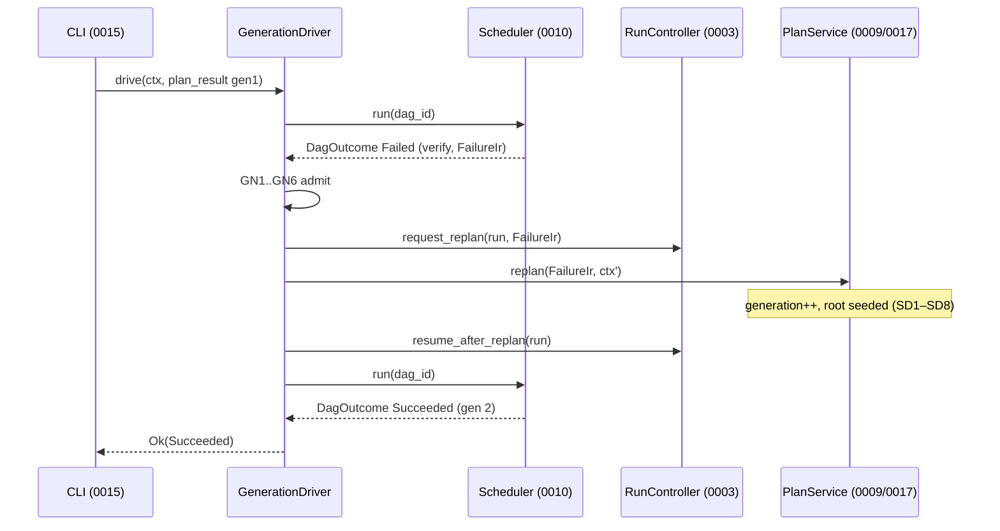

# RFC-0017: Dynamic Planning & Repair Generations

| Field | Value |
| --- | --- |
| **Status** | Draft |
| **Author** | arkadianet |
| **Architecture** | Alloy Architecture V2 (**frozen**) — do not redesign |
| **Depends on** | [RFC-0003](./RFC-0003-session-manager-run-controller.md) (merged), [RFC-0004](./RFC-0004-observability-cost-metering.md) (merged), [RFC-0009](./RFC-0009-task-dag-templates-planner.md) (merged), [RFC-0010](./RFC-0010-scheduler-runtime-adapters.md) (implemented), [RFC-0013](./RFC-0013-capability-registry-workers.md) (implemented), [RFC-0015](./RFC-0015-cli-profiles-config.md) (implemented), [RFC-0016](./RFC-0016-eval-harness-holdout-gates.md) (implemented — gate machinery) |
| **Effort** | 6–9 person-days |
| **Related RFCs** | [0007](./RFC-0007-model-router-provider.md) router/meter binding for the planning model call · [0012](./RFC-0012-context-engine.md) goal context for the planning prompt |
| **Product** | Alloy — AI Engineering Runtime |
| **Supersedes** | The interim cross-run repair posture from issue #53 (pre-plan seed + operator re-runs) as the *primary* repair mechanism; it is retained as a complement (§5.6) |

**Mental model (V2 §6.2 upgrade path / §6.4 / ADR F-03):** V2's planner evolution is "swap template source for Planner behind same DAG schema … generation++ on replan with provenance." This RFC executes exactly that swap, twice over: (1) the **plan source** may now be an LLM proposal, compiled and clamped by the runtime, validated by the existing `DagValidator`, falling back to the template catalog fail-closed; (2) the **replan trigger** may now be automatic — a genuine verify `Fail` seeds a bounded generation bump whose new root actually *carries the failure diagnostics*, instead of the run dying at derivation rule D3 with the diagnostics stranded in a `failure_ir` artifact. The topology writer count stays exactly one: `PlanService`. The scheduler stays a single-generation executor (RFC-0010 RP4/B6); the generation loop lives *above* it in a new runtime-native `GenerationDriver`. Workers still never mutate topology (RFC-0013 PW2 is retained verbatim).

**Authority order (highest → lowest):** current `main` source → merged RFCs 0001–0016 → Architecture V2 → this document → roadmaps. Where this RFC must change a merged RFC, the change is an explicit numbered amendment in §2.7 — nothing else in this document overrides merged text.

**Reading rules.** MUST / MUST NOT / SHOULD / MAY are normative. Tables are normative unless labelled *informative*. Every Rust block is a signature or a shape, not product code.

---

## 1. Overview

### 1.1 Purpose

Ship two coupled capabilities inside `alloy-runtime`:

1. **LLM-backed planning** — an `LlmPlanService` that drives the existing `PlanningWorker` (RFC-0013, id `planning`) to *propose* a linear task chain for an arbitrary goal, compiles the proposal into a `TaskDag` through a clamping **proposal compiler**, validates it with the existing `DagValidator`, and persists it through the existing RFC-0009 plan path. Any defect in the proposal — model unavailable, malformed payload, clamp violation, validation failure, budget denial, timeout — falls back to the template catalog, fail-closed, with an audited reason.
2. **Repair generations** — a `GenerationDriver` that wraps `Scheduler::run`: when a run's DAG fails at a verify node with a *genuine* `Fail` verdict (`ErrorClass::Compile`/`Test` with diagnostics — never an Inconclusive/transient classification), the driver requests a replan, the planner bumps `generation` by one, and — the load-bearing fix — the planner **seeds the `ReplanReason::FailureIr` into generation N+1's root input envelope** so the next Analyze actually reads the rustc errors that killed generation N. The loop is bounded by a new `SchedConfig.max_repair_generations` knob (default **2**).

### 1.2 Problem statement

The 2026-07-29 live-model dogfood data (issue #53; commits `443bf16` #52 and `1896934` #53) measured the day-1 posture end to end:

- **Runs die with their best evidence in hand.** After #52's `cargo_exit_verdict` fix, a wrong model fix produces an *honest* verify `Fail`: the scheduler builds a `FailureIr` whose `diagnostics` carry the exact rustc errors (F2/F3), CASes the node `Failed`, derives `DagState::Failed` (rule D3), and returns. The run is over. The diagnostics survive only inside the `failure_ir` artifact and the `NodeState` event — nothing consumes them. The operator re-runs from scratch and the model guesses again. Measured cost: trivial-repair pass rate ~1/5 before #53's levers, 3/5 after, with **every remaining failure an honest model-side compile `Fail`** — i.e. exactly the class of failure a seeded second generation is built to convert.
- **The production replan path cannot carry the failure.** `PlanService::replan` exists and bumps the generation, but `TemplatePlanService::instantiate_and_persist` drops the `ReplanReason` before Phase B: `put_input_artifacts(manifest, ids, ctx, generation)` takes no reason parameter, so generation N+1's root node gets the bare `Goal` again — payload-identical to generation 1. The failure IR reaches only the `PlanProduced` event's `reason` field, which no worker reads. The `scheduler_repair_e2e` test proves seeded generation 2 works — by *hand-crafting* a `FromPredecessors` envelope around a synthetic verify predecessor, explicitly standing in for "RFC-0009's not-yet-built auto-replan." Production must do what the test fakes.
- **Nothing drives the loop.** `RunController::request_replan` records intent; `RunControlState::ReplanRequested` is currently a dead-end (no API transitions a run out of it); the scheduler is forbidden from calling the planner (RFC-0010 RP4, B6); the CLI is forbidden from containing retry logic (RFC-0015 B1). Replan is therefore an externally-requested path with no production caller.
- **Template-only planning caps the goal space.** `TemplatePlanService::select` always returns `RepairLocalDiagnostic`. Goals that need a different shape — verify-first, review-before-gate, analyze-only — cannot be expressed, even though `DagValidator`, the node-kind contract table, and `PlanningWorker` already exist for exactly this.

### 1.3 Scope

| In scope | Detail |
| --- | --- |
| Proposal wire schema | `ProposedDagManifest` v1 — ordered linear chain, shape-only (§3.4) |
| Proposal compiler | Clamps + resource assignment + `DagValidator` final gate (§5.2) |
| `LlmPlanService` | `PlanService` impl: propose → compile → validate → persist, template fallback (§3.6, §5.1) |
| `PlanningWorker` v2 | Model-backed proposal per RFC-0013 PW5 amendment path (§5.3, AM-0013-1) |
| Replan seeding | `ReplanReason::FailureIr` → root `FromPredecessors` envelope (§5.4, AM-0009-1) |
| `GenerationDriver` | Bounded auto-replan loop above the scheduler (§3.8, §5.5) |
| Config | `SchedConfig.max_repair_generations`; `[planner]` profile table (§7) |
| Control plane | `RunController::resume_after_replan` (AM-0003-1) |
| Observability | `Replan` / `PlanProposal` decision records; `PlanProduced.source` (§9) |
| Security | Proposal containment rules SEC1–SEC10 (§10) |
| Migration | Interim driver loop → in-run generations (§5.6, MG1–MG6) |

### 1.4 Non-goals

| Deferred item | Owner / disposition |
| --- | --- |
| Non-linear proposals (fan-out, explicit edges, `Aggregate`, `Plan` nodes in DAGs) | Deferred until a concurrency RFC lifts V15; proposal schema is a chain by construction (§3.4) |
| LLM planning as any profile's **default** | Eval-gated (V2 §0.4/§19.3, RFC-0016 holdout) — this RFC ships it **opt-in** (§7.1) |
| Seeded **re-proposal** on replan (LLM re-plans generation N+1's topology from the failure) | Open Question §16.1; day-1 repair generations reuse the prior plan source (§5.5 GN7) |
| Worker-proposed nodes / `follow_up_nodes` | **Eliminated** (ADR F-03, V2 §0.8) — MUST NOT reintroduce |
| Cross-process/durable generation loop (survive host crash mid-loop) | Deferred; crash resume yields the existing single-generation semantics (§6.3) |
| Cache interaction with proposed DAGs | `enable_cache` forced false (PC10); cache remains RFC-0009/0010 deferred |
| New crates, Postgres, Temporal durability, `.env` writes | Forbidden |

### 1.5 Day-1 MVP (normative)

1. `LlmPlanService` MUST implement `PlanService` and MUST be constructed only when profile `planner.mode = "llm"`; every profile shipped in this repo keeps `mode = "template"` until the RFC-0016 holdout gate in §12.4 passes (eval-gated, V2 §19.3).
2. A model proposal MUST pass the compiler clamps PC1–PC12 **and** `DagValidator::validate` with `ValidateOpts::default()` (linear + gates) before persistence; any rejection MUST fall back to `TemplatePlanService` with a `PlanProposal` decision record naming the reason (FB1–FB6). Fallback MUST NOT fail the run.
3. The proposal is **shape-only**: the model chooses node names, kinds, order, and gate reasons. Capabilities, budgets, tiers, retries, timeouts, and cache flags are assigned by the compiler from the fixed table in §5.2.3. A proposal has no syntax with which to escape a capability allowlist or a budget ceiling (SEC1–SEC3).
4. `TemplatePlanService` (and `LlmPlanService`, which delegates persistence to the same path) MUST seed `ReplanReason::FailureIr` into the new generation's root input envelope per SD1–SD8. Replan with `ReplanReason::FailureIr` and a root that still receives the bare `Goal` is a defect (AC 17).
5. The `GenerationDriver` MUST auto-replan only on GN1–GN6 admission (verify node, `ErrorClass::Compile|Test`, non-empty diagnostics, bound not exhausted, run not cancelled, budget remaining). `Inconclusive`-class failures (`ErrorClass::Tool`, transient cargo errors per RFC-0010 §5.13.2) MUST NOT trigger a generation bump.
6. `SchedConfig::new` MUST set `max_repair_generations = 2`. `0` disables auto-replan entirely; the driver then degrades to exactly today's single-generation behaviour.
7. The scheduler MUST NOT gain any planner dependency: RFC-0010 RP4 and B6 (CI-grep) remain in force. The generation loop lives in `alloy_runtime::driver`, not in `scheduler::*`.
8. The CLI MUST NOT gain retry or planning logic (RFC-0015 B1). Its composition root swaps `Scheduler::run` for `GenerationDriver::drive` (MG1) — a wiring change, not logic.
9. `#![forbid(unsafe_code)]`; five-crate map unchanged; Alloy MUST NEVER write `.env`.

---

## 2. Architecture Integration

### 2.1 Relationship to Architecture V2

| V2 reference | Application |
| --- | --- |
| §6.2 upgrade path | "Enable Planner capability to emit DAGs validated acyclic; same store schema; generation++ on replan with provenance" — implemented verbatim: same `dag_blobs` schema, same `DagValidator`, same `PlanProduced` audit |
| §6.2 single topology mutator | Preserved. `PlanService` remains the only writer; the driver *requests*, the planner *writes*, the scheduler *executes* |
| §6.4 replanning | Workers return `FailureIr` only; scheduler emits `ReplanRequired`/`Failed`; `generation++` versioned; no `follow_up_nodes` |
| §6.6 cycle prevention | Every proposed DAG passes acyclicity at plan/replan; dynamic edges only from ReplanService with validation |
| §0.4 / §9.3 / §19.3 | "LLM planner off until eval bar" — honoured: opt-in config, default-off, holdout gate §12.4 before any default flip |
| §10.2 PlanningWorker | Still the planning capability; gains its model call through the PW5-mandated amendment (AM-0013-1) |
| ADR F-03 / F-16 | No worker topology writes; linear honesty retained — proposals are chains |

### 2.2 Relationship to merged RFCs

| RFC | Reused | This RFC adds | Untouched |
| --- | --- | --- | --- |
| 0003 | `RunController::request_replan`, `ReplanReason::FailureIr`, `RunControlState::ReplanRequested` | `resume_after_replan` (AM-0003-1) | `submit_goal`, gate APIs, run event shapes |
| 0004 | `DecisionLog::record`, decision record conventions (`prompt_body = None`) | `DecisionKind::{Replan, PlanProposal}` (AM-0004-1) | metering, budget events |
| 0009 | `PlanService`, `TemplatePlanService`, `DagValidator`, `ValidateOpts`, envelopes, `replace_for_replan`, `PlanProducedPayload` | seed rules SD1–SD8 (AM-0009-1), `PlanProducedPayload.source`/`proposal_artifact` (AM-0009-2), `PlanResult.source`/`proposal_artifact` (AM-0009-3), `LlmPlanService` replacing the `DisabledLlmPlanService` stub as the gated path (AM-0009-4) | validation rules V1–V17, store CAS semantics, template catalog contents, `TaskDag`/`TaskNode` field shapes |
| 0010 | `Scheduler::run`, `DagOutcome`, `FailureIr` construction F1–F5, verdict classification §5.13.2, D1–D9 derivation, C1–C10 checkpoints | `SchedConfig.max_repair_generations` (AM-0010-1) | RP1–RP5, B6, the entire loop; **D3 is unchanged** — a failed verify still yields `DagState::Failed`; the *driver* converts that outcome, the scheduler does not |
| 0013 | `PlanningWorker`, `PlanningProposalPayload`, `CapabilityExecutor` seam, registry RG rules, worker budget rules BG1–BG4 | PW1/PW4 amended per PW5 (AM-0013-1), `PlanningProposalPayload.proposal` additive field (AM-0013-2) | `CAPABILITY_CATALOG` (still exactly 4), PW2 (worker never writes a DAG), tool allowlists |
| 0015 | assembly/composition root, profiles | `[planner]` profile table + `[limits] max_repair_generations` (AM-0015-2), B1 clarification (AM-0015-1) | flag surface, B1 itself (CLI still contains no retry/planning logic) |
| 0016 | holdout gate machinery, `ScriptedProvider` | the planner-mode holdout comparison (§12.4) | harness APIs |

### 2.3 Already implemented | Added by RFC-0017 | Deferred

| Category | Contents |
| --- | --- |
| **Already implemented** | `PlanService::replan` + `replace_for_replan` generation CAS; `ReplanReason::FailureIr`; `request_replan`; `DeriveFlags.replan_requested` + D1 + RP1–RP5 + C10; `PlanningWorker` (deterministic) + `PlanningProposalPayload`; `FailureIr` with diagnostics (F2/F3); verdict honesty split Fail vs Inconclusive (#52); pre-plan `seed_graph_diagnostics` (#53); `scheduler_repair_e2e` proving seeded generation 2 converts a real `E0308` |
| **Added by RFC-0017** | `ProposedDagManifest` + proposal compiler; `PlanProposer` seam + `CapabilityPlanProposer`; `LlmPlanService`; replan seeding in `instantiate_and_persist`; `GenerationDriver`; `resume_after_replan`; config knobs; decision records; amendments §2.7 |
| **Deferred** | Non-linear proposals; seeded re-proposal; LLM default-on; durable generation loop; cache on proposed DAGs |

### 2.4 Dependency boundaries

```text
alloy-cli (0015 composition root)
        │  wires, never decides
        ▼
alloy_runtime::driver::GenerationDriver ──uses──► Scheduler (0010)          [executes one generation]
        │                                ──uses──► PlanService (0009/0017)  [writes topology]
        │                                ──uses──► RunController (0003)     [request_replan / resume_after_replan]
        ▼
alloy_runtime::planner::LlmPlanService ──uses──► PlanProposer ──► CapabilityExecutor ──► PlanningWorker (0013)
        │                              ──falls back to──► TemplatePlanService
        ▼
dag::{validate, proposal, templates, io}   storage::{DagStore, ArtifactStore}   events::EventSink
```

| Consumer | MAY rely on | MUST NOT |
| --- | --- | --- |
| `driver` | `Scheduler::run` outcome contract; `PlanService` trait; `RunController` control APIs | import `scheduler::linear` internals; mutate DAG rows directly; call workers |
| `scheduler` | nothing new | depend on `planner::*` or `driver::*` (B6 extended — CI grep, AC 40) |
| `planner::LlmPlanService` | `CapabilityExecutor` seam; `dag::proposal`; `TemplatePlanService` | call `ModelRouter` directly (prompts live in workers — RFC-0013); bypass `DagValidator` |
| workers | `NodeInputPayload::FromPredecessors` seeded roots (SD5 shape) | `PlanService` (PW2 retained; CI grep T8 retained) |

### 2.5 Trust boundary

A proposal is **model output derived from untrusted goal text and untrusted repository content**. It crosses into the trusted plane only through the proposal compiler (§5.2) and `DagValidator`. Everything downstream (scheduler, workers, adapters) may continue to treat post-validate DAGs as impossible-to-be-malformed (RFC-0009 §3.3 fail-closed posture) precisely because the compiler assigns every security-relevant field itself (SEC1–SEC3).

### 2.6 Interim driver-loop posture (issue #53) — restated

The interim repair mechanism on the #53 line is: one pre-plan `seed_graph_diagnostics` pass (CLI `bootstrap_diagnostics` → `alloy_runtime::adapters::seed::seed_graph_diagnostics` → `ProjectGraph::record_diagnostic`, read back by the repair worker's `GraphQuery::Diagnostics`), plus operator-driven whole-run re-invocation. Any interim CLI-side *bounded retry loop* (fresh runs per attempt under a `--max-retries` style flag) is **not** part of the merged surface, violates RFC-0015 B1 as written, and is superseded by this RFC before it can merge (MG4). §5.6 specifies the migration.

### 2.7 Amendments to merged RFCs (normative)

Each amendment is additive unless marked otherwise and MUST land with this RFC.

| # | RFC | Amendment | Rationale |
| --- | --- | --- | --- |
| AM-0003-1 | 0003 | Additive `RunController::resume_after_replan(run: RunId) -> Result<(), RunError>` (§3.9). Valid only from `RunControlState::ReplanRequested`; transitions to `Running`; idempotent from `Running`; every other state → `RunError::InvalidPhase`. Appends a `ReplanResumed` run event (payload `{ "run_id", "generation" }` — `generation` = the new active generation). | `ReplanRequested` is currently a dead-end control state: nothing transitions out of it, so the scheduler's L5 check would re-checkpoint `ReplanRequired` forever. The driver needs a control-plane door back to dispatchable. |
| AM-0004-1 | 0004 | Additive `DecisionKind::Replan` and `DecisionKind::PlanProposal` variants with payload shapes in §9.2. `prompt_body` MUST be `None` for both (driver/planner-authored). | The generation bump and the proposal accept/reject are decisions with budget and audit consequences; the decision log is where those live. |
| AM-0009-1 | 0009 | §5.2 step 5 / §5.3.0 amended: `put_input_artifacts` gains the replan reason; when it is `Some(ReplanReason::FailureIr(f))`, the root node's plan-time `input_ref` body MUST be the seed envelope of SD1–SD8 instead of `NodeInputPayload::Goal`. §5.3.0's table gains the row: "Root, replan with FailureIr → `FromPredecessors` seed envelope (RFC-0017 §5.4)". RFC-0009 AC 28 is re-scoped to non-replan plans. | This is the production gap the `scheduler_repair_e2e` test hand-crafts around: generation N+1's root currently receives the bare `Goal`, discarding the diagnostics the replan exists to exploit. |
| AM-0009-2 | 0009 | `PlanProducedPayload` gains two additive optional fields: `source: Option<PlanSource>` (absent ⇒ `template`, preserving old readers) and `proposal_artifact: Option<ArtifactId>`. §3.13 shape extended; Appendix B example extended. | Replay/audit must distinguish a template plan from a compiled proposal and locate the raw proposal blob. |
| AM-0009-3 | 0009 | `PlanResult` gains `source: PlanSource` and `proposal_artifact: Option<ArtifactId>` fields (construction-site change inside `alloy-runtime` only; `PlanResult` is not a wire type). | The driver and a future seeded re-proposal need the plan's provenance without re-reading the event log. |
| AM-0009-4 | 0009 | §1.5 item 7 amended: production wiring injects `TemplatePlanService` when `planner.mode = "template"` (default) and `LlmPlanService` when `"llm"`. `DisabledLlmPlanService` is retired from the gated-path role (it remains available for tests); the "explicit future feature flag" it guarded is now the `planner.mode` profile key. | PW5 requires enablement by RFC amendment, not a flag on the stub; this is that RFC. |
| AM-0010-1 | 0010 | `SchedConfig` gains `max_repair_generations: u32` (§3.7). `SchedConfig::new` sets `2`. No validation rule beyond type range; `0` is legal and disables auto-replan. The scheduler itself MUST NOT read the field (it belongs to the driver; it lives on `SchedConfig` so run-level execution knobs stay in one struct). §7.2 gains `ALLOY_SCHED_MAX_REPAIR_GENERATIONS=2` in `example.env` (comment only). | The bound is an execution-policy knob alongside the grace/backoff knobs; a second config struct for one field is worse. |
| AM-0013-1 | 0013 | Per PW5, `PlanningWorker` v2: `describe().uses_model` becomes `true`; `preferred_tier()` stays `Economy` advisory but the planner invokes it at `Standard` (§5.3); `PLANNING_SYSTEM` prompt is activated (§5.3.2); PW1 is amended to "makes at most `max_model_turns` model calls when driven by `LlmPlanService`; makes none when `planner.mode = "template"` (the deterministic branch is retained)". PW2 is retained **verbatim**. PW3's "registered-but-unreached" note is amended: the worker is now reached via the `CapabilityExecutor` seam by the planner, still never via a DAG node. PW4 amended per AM-0013-2. RFC-0013 T-test `planning_worker_makes_no_model_call_and_no_tool_call` is re-scoped to the deterministic branch. | PW5: "Enabling an LLM planner MUST be a new RFC amendment that changes `uses_model` and adds a prompt — it MUST NOT be a config flag on this worker." |
| AM-0013-2 | 0013 | `PlanningProposalPayload` gains additive `proposal: Option<ProposedDagManifest>` (§3.4). `schema_version` stays `1`; absent field ⇒ deterministic template selection (old shape unchanged on the wire). | The proposal must ride the existing worker payload, not a new channel. |
| AM-0015-1 | 0015 | B1 clarification (no text weakening): wiring `GenerationDriver` in the composition root is "construct, call, render" and does not breach B1. Any CLI-side retry loop over runs (e.g. a `--max-retries` driver) remains forbidden by B1 and MUST NOT merge; the in-run generation loop replaces it (MG4). | Prevents the interim loop from landing in parallel with this RFC. |
| AM-0015-2 | 0015 | Profiles gain the `[planner]` table (§7.1) and `[limits] max_repair_generations = 2` mapped to `SchedConfig.max_repair_generations` by the assembly. Unknown-key rejection updated accordingly. | Config authority stays with profiles; the CLI maps, never decides. |

---

## 3. Public Rust API

New items live under `alloy_runtime::dag::proposal`, `alloy_runtime::planner`, and `alloy_runtime::driver`. `alloy-runtime` remains `#![deny(missing_docs)]` / `#![forbid(unsafe_code)]`.

### 3.1 Reused types (normative — unchanged fields)

| Type | Source | Notes |
| --- | --- | --- |
| `PlanService`, `PlanContext`, `PlanResult`, `PlanError`, `PlanProducedPayload`, `TemplatePlanService` | planner (0009) | `PlanResult`/`PlanProducedPayload` extended per AM-0009-2/3 |
| `DagValidator`, `ValidateOpts`, `DagValidationError` | dag::validate (0009) | unchanged — the proposal compiler's final gate |
| `TemplateId`, `TemplateCatalog`, `TemplateNodeSpec` | dag::templates (0009) | catalog stays closed; `TemplateId` gains **no** variant |
| `NodeInputEnvelope`, `NodeOutputEnvelope`, `NodeInputPayload`, `PredecessorOutput`, `ENVELOPE_SCHEMA_VERSION` | dag::io (0009) | seed envelope reuses these — no new envelope type |
| `Scheduler`, `DagOutcome`, `DagState`, `SchedError`, `SchedConfig` | scheduler (0001/0010) | `SchedConfig` extended per AM-0010-1 |
| `FailureIr`, `ErrorClass`, `RetryDisposition`, `DiagnosticEvent` | types/diagnostic (0001) | unchanged |
| `RunController`, `ReplanReason`, `RunControlState`, `RunError` | session (0003) | extended per AM-0003-1 |
| `CapabilityExecutor`, `NodeExecContext`, `NodeExecRef` | adapters/capabilities (0010/0013) | the proposer's invocation seam |
| `PlanningWorker`, `PlanningProposalPayload`, `WorkerConfig` | capabilities::workers (0013) | extended per AM-0013-1/2 |
| `DecisionLog`, `DecisionKind` | obs (0004) | extended per AM-0004-1 |

### 3.2 `PlanSource`

```rust
/// Provenance of a persisted plan generation.
#[derive(Debug, Clone, Copy, PartialEq, Eq, Serialize, Deserialize)]
#[serde(rename_all = "snake_case")]
#[non_exhaustive]
pub enum PlanSource {
    /// Instantiated from the closed template catalog.
    Template,
    /// Compiled from an accepted `ProposedDagManifest`.
    LlmProposed,
}
```

### 3.3 `PlannerMode` and `PlannerConfig`

```rust
#[derive(Debug, Clone, Copy, PartialEq, Eq, Serialize, Deserialize)]
#[serde(rename_all = "snake_case")]
pub enum PlannerMode {
    Template,
    Llm,
}

/// Validated planner knobs (profile `[planner]` table, §7.1).
#[derive(Debug, Clone)]
pub struct PlannerConfig {
    pub mode: PlannerMode,                 // default Template
    pub max_proposed_nodes: u32,           // default 8;  2..=16 accepted
    pub proposal_max_bytes: u32,           // default 65_536; 1_024..=262_144
    pub planning_budget: TokenBudget,      // default { max_input: 16_384, max_output: 4_096 }
    pub planning_timeout_ms: u64,          // default 120_000; > 0
}

impl PlannerConfig {
    /// Defaults above; out-of-range values are a construction error
    /// (`PlanError::Internal` at assembly — fail closed, no clamping-to-valid).
    pub fn new() -> Self;
}
```

### 3.4 Proposal wire schema (`dag::proposal`)

```rust
/// Wire schema version for planning proposals (MUST be 1).
pub const PROPOSAL_SCHEMA_VERSION: u32 = 1;

/// A model-proposed **linear chain**, shape-only. Serialized inside
/// `PlanningProposalPayload.proposal` and as the `plan_proposal` CAS artifact.
///
/// Deliberately cannot express: capabilities, budgets, tiers, retries,
/// timeouts, cache keys, edges, fan-out, `Plan` or `Aggregate` nodes.
#[derive(Debug, Clone, Serialize, Deserialize, PartialEq)]
pub struct ProposedDagManifest {
    /// MUST equal `PROPOSAL_SCHEMA_VERSION`.
    pub schema_version: u32,
    /// Execution order. The compiler emits dual Data+Sequence edges between
    /// consecutive entries (RFC-0009 §5.7.2 convention).
    pub nodes: Vec<ProposedNodeSpec>,
    /// Free-text model rationale; audit only. MUST NOT influence compilation.
    pub rationale: String,
}

#[derive(Debug, Clone, Serialize, Deserialize, PartialEq)]
pub struct ProposedNodeSpec {
    /// `[a-z0-9_]{1,64}`, unique within the manifest (PC5).
    pub name: String,
    /// Only `Analyze | Edit | Review | VerifyCompile | VerifyTest | GateHuman`
    /// are accepted (PC3).
    pub kind: NodeKind,
    /// Required non-empty (after trim, ≤ 500 chars) iff `kind == GateHuman`;
    /// MUST be `None` otherwise (PC6).
    pub approval_reason: Option<String>,
}
```

### 3.5 Proposal compiler

```rust
/// Why a proposal was rejected. One variant per clamp rule (§5.2.2).
#[derive(Debug, Clone, PartialEq, thiserror::Error)]
#[non_exhaustive]
pub enum ProposalRejection {
    #[error("unsupported proposal schema_version {got}")]
    SchemaVersion { got: u32 },
    #[error("proposal exceeds {max} bytes")]
    TooLarge { max: u32 },
    #[error("node count {got} outside 2..={max}")]
    NodeCount { got: usize, max: u32 },
    #[error("node kind {kind:?} not allowed in proposals")]
    KindForbidden { kind: NodeKind },
    #[error("node name invalid or duplicate: {name}")]
    BadName { name: String },
    #[error("approval_reason constraint violated on {name}")]
    BadApproval { name: String },
    #[error("terminal node must be GateHuman")]
    NoTerminalGate,
    #[error("no verify node precedes the terminal gate")]
    NoVerify,
    #[error("compiled DAG failed validation: {0}")]
    Validation(#[from] DagValidationError),
}

/// Pure, sync, no I/O. Applies PC1–PC12, assigns resources per §5.2.3,
/// builds the `TaskDag` through the RFC-0009 three-phase machinery, and runs
/// `DagValidator::validate(&dag, ValidateOpts::default())` as the final gate.
/// `input_refs` are supplied by the caller exactly as in RFC-0009 §5.3
/// (ephemeral for the pre-CAS validation pass, real after Phase B).
pub fn compile_proposal(
    manifest: &ProposedDagManifest,
    args: CompileArgs<'_>,
) -> Result<TaskDag, ProposalRejection>;

#[derive(Debug)]
pub struct CompileArgs<'a> {
    pub dag_id: DagId,
    pub session_id: SessionId,
    pub generation: u64,
    pub ids: &'a TemplateIdMap,               // from allocate-ids over proposal names
    pub input_refs: &'a BTreeMap<NodeId, ArtifactId>,
    pub cfg: &'a PlannerConfig,
}

/// Allocate `NodeId`s/`GateId`s for a proposal (name-keyed, mirrors
/// `templates::allocate_ids`). Rejects rather than panics: proposals are
/// untrusted, unlike embedded manifests.
pub fn allocate_proposal_ids(
    manifest: &ProposedDagManifest,
) -> Result<TemplateIdMap, ProposalRejection>;
```

### 3.6 `PlanProposer` and `LlmPlanService`

```rust
/// Seam between the plan service and the planning capability. Exactly one
/// production impl; tests inject scripted proposers.
#[async_trait]
pub trait PlanProposer: Send + Sync {
    /// Obtain a proposal for `ctx.goal`. `Err` values are *fallback triggers*,
    /// never run failures (§5.1 FB rules).
    async fn propose(&self, ctx: &PlanContext) -> Result<ProposedDagManifest, ProposeError>;
}

#[derive(Debug, thiserror::Error)]
#[non_exhaustive]
pub enum ProposeError {
    #[error("planning capability unavailable: {0}")]
    Unavailable(String),          // registry resolve failure, router down, model 5xx
    #[error("planning call failed: {0}")]
    Model(String),                // completion error after admission
    #[error("proposal payload malformed: {0}")]
    Malformed(String),            // payload missing/undecodable
    #[error("planning budget denied")]
    Budget,
    #[error("planning timed out")]
    Timeout,
    #[error("cancelled")]
    Cancelled,
}

/// Production proposer: drives the `planning` capability through the
/// RFC-0010 `CapabilityExecutor` seam with a synthetic Plan-node context
/// (§5.3.1). Holds no prompt: prompts live in the worker (RFC-0013).
pub struct CapabilityPlanProposer { /* private: executor, cfg */ }

impl CapabilityPlanProposer {
    pub fn new(executor: Arc<dyn CapabilityExecutor>, cfg: PlannerConfig) -> Self;
}

/// LLM-backed `PlanService`. Wraps `TemplatePlanService` for persistence and
/// fallback — there is exactly one persistence path (LP2).
pub struct LlmPlanService { /* private: inner, proposer, artifacts, decisions, cfg */ }

impl LlmPlanService {
    pub fn new(
        inner: TemplatePlanService,
        proposer: Arc<dyn PlanProposer>,
        artifacts: Arc<dyn ArtifactStore>,
        decisions: Arc<dyn DecisionLog>,
        cfg: PlannerConfig,
    ) -> Self;
}

#[async_trait]
impl PlanService for LlmPlanService {
    async fn plan(&self, ctx: PlanContext) -> Result<PlanResult, PlanError>;          // §5.1
    async fn load_template(&self, id: TemplateId, ctx: PlanContext)
        -> Result<PlanResult, PlanError>;                                             // delegates to inner (LP6)
    async fn replan(&self, reason: ReplanReason, ctx: PlanContext)
        -> Result<PlanResult, PlanError>;                                             // §5.5 GN7 (source-preserving)
}
```

### 3.7 `SchedConfig` additive field (AM-0010-1)

```rust
pub struct SchedConfig {
    // ... existing fields (RFC-0010 §3.11) ...
    /// Maximum automatic generation bumps per run performed by the
    /// `GenerationDriver`. Total generations ≤ 1 + this value. `0` disables
    /// auto-replan. Default 2. The scheduler itself never reads this field.
    pub max_repair_generations: u32,
}
```

### 3.8 `GenerationDriver`

```rust
/// Control-plane loop: execute a generation, decide, replan, repeat.
/// Not a scheduler and not a planner — it holds both and mutates neither's
/// domain. Lives in `alloy_runtime::driver` (scheduler MUST NOT depend on it).
pub struct GenerationDriver { /* private */ }

pub struct GenerationDriverDeps {
    pub scheduler: Arc<dyn Scheduler>,
    pub plans: Arc<dyn PlanService>,
    pub runs: Arc<dyn RunController>,
    pub dags: Arc<dyn DagStore>,          // read-only use (GN2 kind lookup)
    pub decisions: Arc<dyn DecisionLog>,
    pub cost_meter: SharedCostMeter,      // GN6 budget check (read-only)
    pub config: SchedConfig,
}

impl GenerationDriver {
    pub fn new(deps: GenerationDriverDeps) -> Self;

    /// Run the bounded generation loop for one run. `initial` is the
    /// generation-1 `PlanResult` (the caller has already planned — SQ1/step-6
    /// ordering from RFC-0015 §7.1 is unchanged).
    ///
    /// Returns the final generation's `DagOutcome` (which may be `Failed` —
    /// exhaustion is an outcome, not an error). `Err` is infrastructure only.
    pub async fn drive(
        &self,
        ctx: PlanContext,
        initial: PlanResult,
    ) -> Result<DagOutcome, DriveError>;
}

#[derive(Debug, thiserror::Error)]
#[non_exhaustive]
pub enum DriveError {
    #[error("scheduler: {0}")]
    Sched(#[from] SchedError),
    #[error("plan: {0}")]
    Plan(#[from] PlanError),
    #[error("run control: {0}")]
    Run(#[from] RunError),
    #[error("store: {0}")]
    Store(#[from] StoreError),
    #[error("internal: {0}")]
    Internal(String),
}
```

### 3.9 `RunController` additive method (AM-0003-1)

```rust
#[async_trait]
pub trait RunController: Send + Sync {
    // ... existing methods (RFC-0003) ...

    /// Transition `ReplanRequested → Running` after a successful
    /// `PlanService::replan`. Idempotent from `Running`; `InvalidPhase`
    /// from every other state. Appends `ReplanResumed`.
    async fn resume_after_replan(&self, run: RunId) -> Result<(), RunError>;
}
```

### 3.10 Crate-root re-exports

MUST re-export: `PlanSource`, `PlannerMode`, `PlannerConfig`, `PROPOSAL_SCHEMA_VERSION`, `ProposedDagManifest`, `ProposedNodeSpec`, `ProposalRejection`, `compile_proposal`, `allocate_proposal_ids`, `PlanProposer`, `ProposeError`, `CapabilityPlanProposer`, `LlmPlanService`, `GenerationDriver`, `GenerationDriverDeps`, `DriveError`.

---

## 4. Internal Module Design

### 4.1 Hierarchy

```text
crates/alloy-runtime/src/
  dag/
    proposal.rs        # wire types, compiler, clamps (pure, no I/O)
  planner/
    mod.rs             # + pub use llm_service::*, proposer::*
    template_service.rs# AM-0009-1 seeding change lands here
    llm_service.rs     # LlmPlanService (fallback + persistence delegation)
    proposer.rs        # PlanProposer trait + CapabilityPlanProposer
    llm_stub.rs        # DisabledLlmPlanService retained for tests (AM-0009-4)
  driver/
    mod.rs             # GenerationDriver + deps + DriveError
  capabilities/workers/
    planning.rs        # v2 body: model branch + deterministic branch (AM-0013-1)
```

### 4.2 Responsibilities

| Module | MUST | MUST NOT |
| --- | --- | --- |
| `dag::proposal` | PC clamps; resource assignment; final `DagValidator` gate | I/O; model calls; reading config files |
| `planner::llm_service` | propose→compile→persist orchestration; fallback; decision records; proposal CAS artifact | prompts; direct router calls; a second persistence path |
| `planner::proposer` | synthetic Plan-node context; executor invocation; payload decode | clamping (compiler's job); retries beyond the worker's own turns |
| `planner::template_service` | SD1–SD8 seed on replan | topology changes; new templates |
| `driver` | GN admission; request_replan → replan → resume → re-dispatch ordering; bound enforcement; decision records | topology writes; node-level decisions; reading `scheduler::linear` internals |
| `capabilities::workers::planning` | prompt ownership; structured-output-first parse with one repair turn (RFC-0013 house pattern); proposal in payload | writing DAGs (PW2); calling `PlanService` (T8 grep) |

### 4.3 Dependency direction

```text
driver   → scheduler (trait), planner (trait), session (trait), storage (traits), obs
planner  → dag::{proposal, validate, templates, io}, capabilities (executor seam only)
proposal → dag::{types, validate, templates(id-map type)}   # pure
scheduler → (unchanged; no planner, no driver)              # CI grep, AC 40
```

---

## 5. Execution Algorithm

### 5.1 `LlmPlanService::plan` (normative, ordered)

| # | Rule |
| --- | --- |
| LP1 | If `cfg.mode == Template`, delegate to `inner.plan(ctx)` unchanged (constructed this way only in tests; production wiring selects the service by mode — AM-0009-4). |
| LP2 | There is exactly one persistence path: `TemplatePlanService`'s three-phase instantiate/validate/CAS/PlanProduced machinery. `LlmPlanService` never calls `DagStore` or `EventSink` itself; it produces either a template selection or a compiled-manifest instantiation request into that path. |
| LP3 | `proposal ← proposer.propose(&ctx)` bounded by `cfg.planning_timeout_ms` (outer `tokio::time::timeout`; the worker's own deadline is set to the same value). |
| LP4 | On `Ok(manifest)`: put the raw manifest JSON as a CAS artifact (`ArtifactKind::Blob`, `content_type = application/json`, labels `alloy.envelope = plan_proposal`, `alloy.dag_id`, session/run attribution per RFC-0009 §3.11) — *before* compilation, so rejected proposals are still auditable. |
| LP5 | Compile: `allocate_proposal_ids` → pre-CAS validation pass with ephemeral refs → Phase B input puts (root gets `Goal`, non-roots get pending-pred placeholders — identical wiring to RFC-0009 §5.3.0) → final `compile_proposal` with real refs. On `Ok(dag)`: persist via the LP2 path with `PlanResult.source = LlmProposed`, `proposal_artifact = Some(id)`, `PlanProducedPayload.source = Some(LlmProposed)`, `template_id` = the template the day-1 selector would have chosen (fallback identity — informative, so old consumers keep a valid catalog id). |
| LP6 | `load_template(id, ctx)` always delegates to `inner.load_template` — an explicit template request is never second-guessed by a model. |
| LP7 | On any `ProposeError` or `ProposalRejection`: fall back (FB1–FB6). |
| LP8 | Every plan call records exactly one `PlanProposal` decision (§9.2), accepted or not. |
| LP9 | Proposal artifacts orphaned by fallback are acceptable (RFC-0002 has no GC; same posture as RFC-0009 §8.5). |
| LP10 | `PlanError` surfaced to the caller can only originate from the LP2 persistence path — proposer/compiler failures are consumed by fallback. `PlannerDisabled` is never returned by `LlmPlanService`. |

**Fallback (fail-closed) rules:**

| # | Rule |
| --- | --- |
| FB1 | Fallback target is `inner.plan(ctx)` (day-1 selector: `RepairLocalDiagnostic`), honouring `ctx.template_override`. |
| FB2 | Fallback MUST be attempted for every `ProposeError` variant and every `ProposalRejection` variant — there is no proposer error that fails the run. |
| FB3 | The `PlanProposal` decision record MUST name the trigger (`rejected_reason` = enum variant rendering) before the fallback plan call. |
| FB4 | If the fallback itself fails, its `PlanError` propagates unchanged — template-path errors keep template-path semantics. |
| FB5 | Fallback plans have `source = Template` (they are ordinary template plans; the failed proposal is visible only via the decision record and the `plan_proposal` artifact). |
| FB6 | The planning model call's tokens/cost are metered against the run like any worker call (RFC-0013 BG rules); a `Budget` denial triggers fallback (FB2) and MUST NOT be retried at a lower tier (BG4). |

### 5.2 Proposal compilation

#### 5.2.1 Pipeline

```text
bytes ──decode──► ProposedDagManifest ──PC1..PC8──► shaped chain
      ──§5.2.3──► resource-assigned TemplateNodeSpec-equivalents + dual edges
      ──build_topology (RFC-0009 §5.3)──► TaskDag (all Pending, gen = ctx)
      ──DagValidator::validate(default opts)──► accepted | ProposalRejection::Validation
```

#### 5.2.2 Clamp rules (normative, ordered; first violation wins)

| # | Rule | Rejection |
| --- | --- | --- |
| PC1 | `schema_version == PROPOSAL_SCHEMA_VERSION` | `SchemaVersion` |
| PC2 | Serialized manifest ≤ `cfg.proposal_max_bytes` (checked on the raw payload bytes before decode) | `TooLarge` |
| PC3 | Every `kind ∈ {Analyze, Edit, Review, VerifyCompile, VerifyTest, GateHuman}` — `Plan` (no recursive planning) and `Aggregate` (no structural nodes in proposals) are forbidden | `KindForbidden` |
| PC4 | `2 <= nodes.len() <= cfg.max_proposed_nodes` | `NodeCount` |
| PC5 | Names match `[a-z0-9_]{1,64}` and are unique | `BadName` |
| PC6 | `approval_reason` present, non-empty after trim, ≤ 500 chars iff `kind == GateHuman`; absent otherwise | `BadApproval` |
| PC7 | Last node is `GateHuman` | `NoTerminalGate` |
| PC8 | ≥ 1 node with `kind ∈ {VerifyCompile, VerifyTest}` at an index before the terminal gate | `NoVerify` |
| PC9 | Compiler emits **dual Data+Sequence** edges between consecutive nodes and nothing else — no Hint, no extra edges | (by construction) |
| PC10 | Compiler assigns every resource field from §5.2.3; `enable_cache = false`, `cache_key = None` on every node; the proposal has no syntax to say otherwise | (by construction) |
| PC11 | `GateHuman` nodes other than the terminal node are permitted (mid-chain gates) but count toward PC4 | — |
| PC12 | `DagValidator::validate(&dag, ValidateOpts::default())` — linearity (V15) and gate presence (V11) included — as the final gate; any error is `Validation` | `Validation(_)` |

#### 5.2.3 Resource assignment table (normative — compiler-owned, model-invisible)

Values are identical to RFC-0009 §5.7.2 so a compiled proposal and a template instantiation are resource-indistinguishable.

| Kind | capability | budget | model_tier | timeout_ms | retry |
| --- | --- | --- | --- | --- | --- |
| Analyze | `repair` | `{32768, 8192}` | Standard | 300_000 | max_attempts=2, Fixed 1000, retry_on=[Model], no escalate |
| Edit | `edit` | `{32768, 8192}` | Standard | 300_000 | same |
| Review | `review` | `{32768, 8192}` | Standard | 300_000 | same |
| VerifyCompile / VerifyTest | none | `{0, 0}` | Economy (ignored) | 600_000 | max_attempts=1, Fixed 0, retry_on=[] |
| GateHuman | none | `{0, 0}` | Economy (ignored) | 3_600_000 | max_attempts=1 |

Capability strings come from `dag::validate::expected_capability` (RFC-0009 Appendix A / RFC-0013 RG3) — the compiler MUST derive, never accept, capability ids.

### 5.3 Planning capability invocation

#### 5.3.1 Synthetic Plan-node context (normative)

| # | Rule |
| --- | --- |
| PP1 | `CapabilityPlanProposer` builds a `NodeExecContext` with `session_id/run_id/dag_id` from `PlanContext`, a **fresh** `NodeId` (the node exists in no DAG — `Plan` nodes remain absent from all persisted topologies), `attempt = 1`, and the assembly's workspace root. |
| PP2 | Dispatch parameters: capability `planning`, kind `Plan`, `effective_tier = Standard`, `budget = cfg.planning_budget`, `deadline = cfg.planning_timeout_ms`. |
| PP3 | The input envelope is `NodeInputEnvelope::new(dag_id, node_id, Plan, 1, NodeInputPayload::Goal(ctx.goal.clone()))` — the same root shape workers already parse. |
| PP4 | The call goes through the production `CapabilityExecutor` (RFC-0010 §3.8 X1–X9), so router binding, run-scoped metering, budget admission, and cancellation behave exactly as for scheduled nodes. The proposer MUST NOT construct a router or meter itself. |
| PP5 | Executor/registry failures map to `ProposeError::Unavailable`; capability `Failed` outcomes map by `error_class`: `Budget → Budget`, `Timeout → Timeout`, everything else → `Model`. |
| PP6 | A `Succeeded` payload that does not decode as `PlanningProposalPayload`, or decodes with `proposal: None` while `mode == Llm`, is `ProposeError::Malformed`. |

#### 5.3.2 `PlanningWorker` v2 body (normative)

| # | Rule |
| --- | --- |
| PW-A | The worker branches on its input: when driven through the proposer seam (kind `Plan`, `uses_model` path active) it makes model calls; when constructed for the deterministic path it behaves exactly as today (template selection, `proposal: None`, no model call). The deterministic branch keeps RFC-0013's `planning_worker_makes_no_model_call_and_no_tool_call` test honest (re-scoped by AM-0013-1). |
| PW-B | Prompting follows the RFC-0013 house pattern: `PLANNING_SYSTEM` system prompt (activated; owns the JSON schema of `ProposedDagManifest` and the closed kind list), goal text + assembled context as user content, structured-output-first parsing with at most **one** repair turn on parse failure, bounded by `WorkerConfig.max_model_turns`. |
| PW-C | `required_tools()` stays `[]`; `side_effects` stays `Pure`. The planning model call reads, never writes. |
| PW-D | On success the worker emits `PlanningProposalPayload` with `proposal: Some(manifest)`, `template_id` = day-1 selector's answer (fallback identity), `confidence` from the model turn, `replan_requested: false`. The worker performs **no clamping** — containment is the compiler's, so it is enforced even against a compromised worker (SEC5). |
| PW-E | PW2 verbatim: no `Arc<dyn PlanService>`, no DAG writes, no store handles. CI grep T8 retained and extended to `llm_service`/`proposer` imports (AC 41). |

### 5.4 Replan seeding (AM-0009-1 — the production fix)

`TemplatePlanService::instantiate_and_persist` (and therefore every `PlanService::replan` call, template or LLM) changes as follows.

| # | Rule |
| --- | --- |
| SD1 | `put_input_artifacts` gains the parameter `reason: Option<&ReplanReason>`. `instantiate_and_persist` threads its existing `reason` argument through instead of dropping it. |
| SD2 | When `reason` is `None` or `Some` of a non-`FailureIr` variant (`UserRequested`, `BudgetPolicy`, `Other`), behaviour is byte-identical to today: root gets `NodeInputPayload::Goal(ctx.goal)`. |
| SD3 | When `reason = Some(FailureIr(f))`: the planner first puts a **seed predecessor artifact** — a `NodeOutputEnvelope` with `schema_version = 1`, `dag_id = ctx.dag_id`, `node_id = f.node`, `kind` = the failed node's kind looked up in the replan probe blob (`probe.nodes[f.node].kind`; if absent — failure from an older generation — default `VerifyCompile`), `generation` = the **prior** generation (`next_gen - 1`), `attempt = 1`, and `payload = { "ok": false, "diagnostics": f.diagnostics, "notes": f.notes, "error_class": f.error_class }`. Labels: `alloy.envelope = replan_seed`, `alloy.dag_id`, session/run attribution. |
| SD4 | The `"ok": false` payload mirrors the verify success shape (RFC-0010 OU4 `{ ok, diagnostics, raw_artifact }`) minus `raw_artifact`, superset of the `{ diagnostics, notes }` body the `scheduler_repair_e2e` fixture already proved the repair worker consumes. |
| SD5 | The new generation's **root** input envelope is then `NodeInputEnvelope::new(ctx.dag_id, root_id, root_kind, next_gen, NodeInputPayload::FromPredecessors { preds: vec![PredecessorOutput { node_id: f.node, kind: <SD3 kind>, output_ref: <SD3 artifact> }] })`. The predecessor is *synthetic*: `f.node` belongs to generation N, not to this topology. Readers MUST NOT resolve `PredecessorOutput.node_id` against the current node map (workers already do not). |
| SD6 | Root identification is unchanged from RFC-0009 §5.3.0 (the unique node with zero Data∪Sequence template/proposal predecessors). Exactly one node receives the seed. Non-root wiring (pending-pred placeholders) is unchanged. |
| SD7 | The scheduler needs no change: the root has no in-DAG Data predecessors, so its plan-time `input_ref` is dispatched as-is (RFC-0010 C5 rewrite applies only to nodes with Data predecessors). |
| SD8 | `goal_content_digest` / cache framing are unaffected: seeded roots ship `cache_key = None` (day-1 posture; a seeded root MUST NOT reuse a `Goal`-framed cache key — restated for whenever cache lands). |

### 5.5 `GenerationDriver::drive` (normative, ordered)

```text
drive(ctx, initial):
  result ← initial; bumps ← 0
  loop:
    outcome ← scheduler.run(ctx.dag_id)                     # one generation
    if outcome.state != Failed: return Ok(outcome)          # Succeeded / Cancelled / ReplanRequired(user) pass through
    if !admit(outcome, bumps): record Replan{admitted:false}; return Ok(outcome)
    record Replan{admitted:true, from, to}
    runs.request_replan(ctx.run_id, FailureIr(f))           # GN8 ordering
    result ← plans.replan(FailureIr(f), ctx')               # seeds per §5.4; ctx' per GN7
    runs.resume_after_replan(ctx.run_id)                    # AM-0003-1
    bumps += 1
```

**Admission (GN rules; all MUST hold, first failure names the rejection reason):**

| # | Rule |
| --- | --- |
| GN1 | `outcome.state == DagState::Failed` and `outcome.failure == Some(f)` and `outcome.failed_node == Some(n)`. Derivation rule D3 itself is untouched — the driver converts the *outcome*, the scheduler never re-routes it. |
| GN2 | The failed node's kind, looked up in the post-run blob (`dags.get(ctx.dag_id)`), is `VerifyCompile` or `VerifyTest`. Failures of LLM nodes, gates, or structural invariants never auto-replan. |
| GN3 | `f.error_class ∈ {Compile, Test}` — a genuine verify `Fail` verdict. By RFC-0010 §5.13.2 (as amended by #52's `fail_requires_diagnostics`), Inconclusive conditions (signal kills, truncated output, non-{0,101} exits, bare 101 without rustc diagnostics for check/compile) surface as `ErrorClass::Tool`/`Timeout` and are therefore excluded here by construction. |
| GN4 | `f.diagnostics` is non-empty — no diagnostics, no seed, no bump (an empty seed would recreate the blind generation this RFC exists to kill). |
| GN5 | `bumps < config.max_repair_generations`. |
| GN6 | The run is not cancelled (`runs` state not `Cancelling`/terminal) and the run budget is not exhausted (`cost_meter` remaining > 0; mirror of retry admission A5). |
| GN7 | The replan `PlanContext` preserves provenance: `template_override = Some(prior PlanResult.template_id)`. If the prior generation's `source == LlmProposed`, the plan service MUST re-compile **the same stored proposal manifest** (fetched via `PlanResult.proposal_artifact`) at the new generation rather than re-selecting a template — repair generations change *inputs*, not *shape*. Seeded re-*proposal* is deferred (§16.1). |
| GN8 | Ordering is mandatory: `request_replan` (clears gate waiters, writes `ReplanRequested` audit) **before** `replan` (topology write) **before** `resume_after_replan` (control state back to dispatchable) **before** the next `scheduler.run`. The DAG is `Failed` at replan time, which `replace_for_replan` permits (RFC-0009 §5.6.2 — only `Running` is rejected; AC 16b already covers `Failed → Pending`). |
| GN9 | A user/external replan surfacing as `outcome.state == ReplanRequired` passes through unchanged (`drive` returns it) — the externally-requested path keeps its RFC-0003/0009/0010 semantics and remains available; auto-replan is additive. |
| GN10 | Exhaustion is not an error: when GN5 fails, `drive` returns the final `Failed` outcome with its `FailureIr` intact, after a `Replan { admitted: false, reason: "exhausted" }` decision. `DriveError` is reserved for infrastructure faults (store, control plane, scheduler invariants). |

### 5.6 Migration from the interim driver loop (MG rules)

| # | Rule |
| --- | --- |
| MG1 | The RFC-0015 composition root replaces its direct `Scheduler::run` invocation (§7.1 step ordering otherwise unchanged: submit_goal → bootstrap seed → plan → drive) with `GenerationDriver::drive`. This is wiring, permitted by B1 (AM-0015-1). |
| MG2 | The pre-plan `seed_graph_diagnostics` pass (#53) is **retained**: it cures generation-1 blindness (the model sees real diagnostics before the first edit) through the graph channel, while §5.4 cures generation-N+1 blindness through the envelope channel. For generations ≥ 2 the **envelope is authoritative**; the graph channel is supplementary context. |
| MG3 | Cross-run behaviour is unchanged: each `alloy run` remains one fresh run (new `RunId`, new `DagId`), and operators may still re-invoke after a fully exhausted run. Cross-run retries stay operator-driven; no CLI flag automates them. |
| MG4 | Any in-flight CLI-side bounded retry loop (`--max-retries`-style, fresh runs per attempt) MUST NOT merge; where present on a working branch it MUST be dropped in favour of `drive` before that branch lands (RFC-0015 B1; AM-0015-1). |
| MG5 | The `scheduler_repair_e2e` test's hand-crafted generation-2 seeding (synthetic `FromPredecessors` in `build_generation`) MUST be replaced by calls through `PlanService::replan` once AM-0009-1 lands — the test then proves the production path instead of simulating it (AC 22). |
| MG6 | `expire`d/manual approval flows, cancellation, and budget behaviour inside each generation are untouched — the driver only acts between `Scheduler::run` calls, never during one. |

---

## 6. Lifecycle & Concurrency

### 6.1 Run lifecycle with generations (informative diagram, normative transitions)



### 6.2 Writer inventory (unchanged counts)

| Surface | Writers |
| --- | --- |
| DAG topology / generation | `PlanService` only (template or LLM path — same persistence code, LP2) |
| Node state / refs, same-generation | Scheduler only (`put_if_generation`) |
| Run control state | `RunController` only (driver calls it; never writes rows) |
| Proposal / seed artifacts | Planner only (CAS puts; append-only) |

### 6.3 Crash recovery

The generation loop is process-local (deliberately — RFC-0010's single-owner model). If the host dies between `replan` and `resume_after_replan`, the run is durably `ReplanRequested` with a `Pending` generation N+1: a restarted host's driver MUST detect this shape at `drive` start (run state `ReplanRequested` + DAG `Pending` + generation > 1), call `resume_after_replan`, and continue the loop with `bumps` reconstructed as `generation - 1` (bounded accounting survives via the durable generation counter — GN5 uses `min(bumps, generation - 1)` from the blob, so a crash can never grant extra bumps). If it dies mid-`Scheduler::run`, RFC-0010's ownership/adoption rules (§5.3) apply unchanged.

### 6.4 Concurrency invariants

| Rule | Detail |
| --- | --- |
| One driver per run | The driver holds no lock of its own; it inherits exclusivity from the scheduler's `OwnershipLock` (two drivers on one DAG serialize/conflict exactly as two schedulers do today). |
| Replan race | `replace_for_replan` remains the atomic guard; the DAG is `Failed` (not `Running`) at every driver-initiated replan, so `DagBusy` indicates a foreign writer and surfaces as `DriveError::Plan(DagBusy)` — fail closed, no retry loop around it. |
| Planning call concurrency | One proposer call per `plan`; the proposer MUST NOT retry (the worker's internal repair turn is the only second model call — PW-B). |

---

## 7. Configuration

### 7.1 Profile `[planner]` table (AM-0015-2)

```toml
[planner]
mode = "template"            # "template" | "llm"; llm is opt-in and eval-gated (§12.4)
max_proposed_nodes = 8       # 2..=16
proposal_max_bytes = 65536   # 1024..=262144
planning_max_input = 16384   # tokens, planning capability call
planning_max_output = 4096
planning_timeout_ms = 120000

[limits]
max_repair_generations = 2   # 0 disables auto-replan; maps to SchedConfig
```

All three shipped profiles (`default`, `autonomous`, `readonly`) keep `mode = "template"`. `readonly` MUST additionally reject `mode = "llm"` at assembly (a read-only profile has no business proposing edit chains — fail closed at config validation).

### 7.2 `example.env`

Comment-only additions: `ALLOY_SCHED_MAX_REPAIR_GENERATIONS=2`. Alloy MUST NEVER write `.env`.

---

## 8. Error Handling & Failure Taxonomy

### 8.1 Taxonomy

| Error | Producer | Consumed by | Fail-open/closed |
| --- | --- | --- | --- |
| `ProposeError::{Unavailable, Model, Malformed, Budget, Timeout, Cancelled}` | proposer / worker / executor | `LlmPlanService` → fallback (FB2) | closed onto template path |
| `ProposalRejection::*` (PC1–PC12, incl. `Validation`) | compiler | `LlmPlanService` → fallback | closed onto template path |
| `PlanError::*` | persistence path (unchanged 0009 semantics) | caller (`drive` / CLI) | propagates |
| `DriveError::{Sched, Plan, Run, Store, Internal}` | driver | CLI render | infrastructure only; never encodes "repair failed" |
| Exhausted generations | driver (GN10) | caller | **an outcome** — final `Failed` `DagOutcome` with `FailureIr` intact |
| `RunError::InvalidPhase` from `resume_after_replan` | control plane | driver → `DriveError::Run` | closed (no forced transition) |

### 8.2 What MUST NOT be an error

| Condition | Handling |
| --- | --- |
| Proposal rejected | Decision record + fallback; run proceeds |
| Auto-replan not admitted (GN1–GN6 miss) | Decision record + final outcome returned |
| `max_repair_generations = 0` | Driver is a transparent pass-through around `Scheduler::run` |
| Seed lookup miss (SD3 kind fallback) | Default `VerifyCompile`, seed still written |

### 8.3 Fail-closed catalogue (delta)

| Surface | Rule |
| --- | --- |
| Unvalidated proposal reaching `DagStore` | Impossible by construction: the only write path runs `DagValidator` (LP2/PC12); AC 8 pins a test that a compiler bypass cannot compile (no public constructor takes an unvalidated `TaskDag` into persistence) |
| `readonly` profile + `mode = "llm"` | Assembly-time config error (§7.1) |
| Non-finite / oversized planner config | `PlannerConfig::new` construction error; no clamping-to-valid (§3.3) |
| Driver observing `Conflict` from scheduler | Propagate `DriveError::Sched(Conflict)`; MUST NOT replan over a foreign writer |

---

## 9. Observability

### 9.1 Tracing spans

| Span | Fields |
| --- | --- |
| `planner.propose` | `session_id`, `run_id`, `dag_id`, `outcome ∈ accepted\|rejected\|unavailable`, `node_count`, `bytes` — never goal text, never rationale |
| `planner.compile` | `dag_id`, `node_count`, `rejection_variant?` |
| `driver.generation` | `run_id`, `dag_id`, `generation`, `bumps`, `admitted?`, `reject_reason?` |

### 9.2 Decision records (AM-0004-1; `prompt_body = None`)

| Kind | When | Payload keys |
| --- | --- | --- |
| `PlanProposal` | every `LlmPlanService::plan` (LP8) | `dag_id`, `generation`, `accepted: bool`, `rejected_reason?`, `node_count?`, `proposal_artifact?`, `fallback_template?` |
| `Replan` | every driver admission decision (admit or reject) | `run_id`, `dag_id`, `from_generation`, `to_generation?`, `failed_node`, `error_class`, `diagnostic_count`, `admitted: bool`, `reason?` (`exhausted` \| `kind` \| `class` \| `no_diagnostics` \| `cancelled` \| `budget`) |

### 9.3 Session events

| Event | Emitter | Delta |
| --- | --- | --- |
| `PlanProduced` | planner | payload gains `source` / `proposal_artifact` (AM-0009-2); `replan: true` generations now imply a seeded root when `reason` is `failure_ir` |
| `ReplanRequested` | `RunController` (driver-invoked) | unchanged shape; now has a production emitter |
| `ReplanResumed` | `RunController::resume_after_replan` | new (AM-0003-1) |
| Scheduler events | scheduler | unchanged (OB3 still forbids the scheduler emitting plan events) |

### 9.4 Metrics

Additive counters on the existing metrics surfaces: `planner.proposals_accepted`, `planner.proposals_rejected`, `driver.replans_admitted`, `driver.replans_rejected`, `driver.generations_run`. No changes to `StorageMetricsSnapshot`.

---

## 10. Security

| # | Rule |
| --- | --- |
| SEC1 | **Capability containment by construction.** A proposal cannot name a capability: the compiler derives capability ids from `expected_capability(kind)` over the closed kind set (PC3). `CAPABILITY_CATALOG` (RG1/RG2) is untouched; there is no path from model output to a capability string. |
| SEC2 | **Budget/tier containment by construction.** Budgets, tiers, retries, and timeouts come from the fixed table §5.2.3. A proposal cannot raise a ceiling, add attempts, or select a tier. Run-level budget ceilings (profile `[budgets]`, RFC-0013 BG1–BG4) apply to proposed DAGs identically — more nodes never means more total budget, only earlier exhaustion. |
| SEC3 | **Gate containment.** PC7 + V11: every persisted DAG — proposed or template — terminates in `GateHuman`; a model cannot plan its way around human approval. Approval reasons are length-capped (PC6) and rendered as text, never interpreted. |
| SEC4 | **No recursive planning.** `Plan` nodes are forbidden in proposals (PC3) and remain absent from every persisted topology (PP1) — a proposal cannot schedule more planning. |
| SEC5 | **Compiler, not worker, is the boundary.** Clamps run in `dag::proposal` on the trusted side of the seam, so a prompt-injected or compromised `PlanningWorker` can at worst emit a rejected proposal (fallback), never a hostile DAG. |
| SEC6 | **Prompt-injection posture.** Goal text and repo content are untrusted; the proposal inherits that taint and is treated as data until PC12 passes. `rationale` is audit-only (never parsed, never echoed into prompts of downstream workers). |
| SEC7 | **Seed integrity.** Seed envelopes embed only `FailureIr` fields already subject to RFC-0010 F4 redaction; the planner MUST NOT enrich seeds with raw tool stdout (raw logs stay in `verify_raw` artifacts behind their own labels). |
| SEC8 | **Sandbox unchanged.** Proposed nodes execute the same workers under the same `WorkerPermissions`/tool allowlists (`fs_read`, `apply_patch`) — topology choice grants no new I/O. |
| SEC9 | **Bounded automation.** GN5's durable-generation accounting (§6.3) makes the auto-replan bound crash-proof; there is no configuration that yields an unbounded plan/execute loop (`max_repair_generations` is `u32`, driver-enforced per run). |
| SEC10 | **No `.env` writes; no new crates; `#![forbid(unsafe_code)]`.** |

---

## 11. Crate Dependencies & `unsafe`

**New dependencies: none.** All work reuses existing workspace crates. `#![forbid(unsafe_code)]` preserved; five-crate map unchanged.

---

## 12. Testing Strategy

### 12.1 Unit (pure)

- One test per `ProposalRejection` variant (PC1–PC8, PC12), plus golden: a valid 4-node proposal compiles to a DAG that is resource-identical to `repair_local_diagnostic` modulo names.
- `allocate_proposal_ids` rejects duplicates/bad names without panicking (untrusted input — contrast with template `allocate_ids`).
- Seed envelope golden (SD3/SD5): fixed `FailureIr` fixture → stable seed `NodeOutputEnvelope` JSON and root `FromPredecessors` shape; non-`FailureIr` reasons leave the root `Goal` byte-identical to today (SD2).
- GN admission table: one test per GN1–GN6 rejection and per `Replan` decision payload; `min(bumps, generation-1)` crash accounting (§6.3).
- `PlannerConfig`/profile validation incl. `readonly` + `llm` rejection.

### 12.2 Service tests (in-memory stores; scripted proposer)

- `LlmPlanService`: accepted proposal → `PlanProduced.source = llm_proposed` + `proposal_artifact` resolves; each `ProposeError` variant → fallback plan with `PlanProposal{accepted:false}` decision; fallback failure propagates template-path `PlanError` (FB4); `load_template` never consults the proposer (LP6).
- Replan seeding through the real `TemplatePlanService` against SQLite: replan with `FailureIr` → root input artifact decodes to the SD5 shape; RFC-0009 AC 31 (every `input_ref` resolves) holds for seeded generations.
- `resume_after_replan` state machine: `ReplanRequested → Running`, idempotent, `InvalidPhase` elsewhere, `ReplanResumed` appended.

### 12.3 Driver + scheduler integration

- Scripted-scheduler driver loop: Fail(compile, diags) → bump → Succeed returns `Succeeded` after exactly one replan; exhaustion returns final `Failed` outcome (GN10); `ErrorClass::Tool` (Inconclusive) never bumps (GN3); `max_repair_generations = 0` is pass-through.
- **`scheduler_repair_e2e` rewrite (MG5/AC 22):** generation 2 is produced by `PlanService::replan` + `GenerationDriver` instead of the hand-built `build_generation(.., Some(diagnostics))` branch; the test still asserts the real `E0308` reaches the repair worker's prompt path and the run converts.

### 12.4 Eval gate (RFC-0016; blocking for default-on only)

Holdout comparison on the local-diagnostic fixture set: `planner.mode = "llm"` vs `"template"` under identical budgets, plus `max_repair_generations ∈ {0, 2}` ablation. Flipping any shipped profile to `mode = "llm"` requires the holdout gate green with LLM-mode pass-rate ≥ template-mode (non-inferiority) — V2 §19.3's eval bar, mechanized. This RFC's merge does **not** require the eval gate (the feature ships off); the gate binds the *default flip*, which is a one-line profile change PR citing the eval run.

---

## 13. MVP vs Deferred

| Item | Status |
| --- | --- |
| Proposal schema v1 (linear, shape-only) + compiler + validator gate | **MVP** |
| `LlmPlanService` + fallback + audit | **MVP** (opt-in) |
| `PlanningWorker` model branch + prompt | **MVP** (reached only via opt-in) |
| Replan seeding SD1–SD8 | **MVP** (active for *all* `FailureIr` replans, including user-requested ones — the fix is unconditional) |
| `GenerationDriver` + `resume_after_replan` + knob | **MVP** |
| e2e rewrite onto production seeding | **MVP** |
| LLM default-on | Deferred — eval-gated (§12.4) |
| Seeded re-proposal; non-linear proposals; durable loop; cache | Deferred (§1.4, §16) |

---

## 14. Acceptance Criteria

Every criterion is independently testable by a named test or mechanical check.

- [ ] 1. `ProposedDagManifest`/`ProposedNodeSpec` serde round-trip; `schema_version` pinned to 1; unknown fields rejected (`deny_unknown_fields`).
- [ ] 2. Each `ProposalRejection` variant is produced by exactly one clamp rule, in PC order, first violation wins (unit per variant).
- [ ] 3. `Plan` and `Aggregate` kinds in a proposal → `KindForbidden` (SEC4).
- [ ] 4. Compiled proposals carry compiler-assigned resources exactly per §5.2.3; a proposal has no field that can alter them (type-level check + golden).
- [ ] 5. Compiled proposals always end in `GateHuman` with a validated reason (PC6/PC7) and contain ≥1 verify node (PC8).
- [ ] 6. Every accepted proposal passed `DagValidator::validate` with `ValidateOpts::default()` (PC12); a diamond/fan-out proposal cannot be expressed (schema has no edges) and a hand-built `TaskDag` bypass has no path into persistence.
- [ ] 7. Proposal CAS artifact written with `alloy.envelope = plan_proposal` labels *before* compilation; rejected proposals remain auditable (LP4).
- [ ] 8. `LlmPlanService` falls back to `TemplatePlanService` on **every** `ProposeError` and `ProposalRejection` variant (FB2; parameterized test).
- [ ] 9. Fallback plans have `source = Template`; accepted proposals `source = LlmProposed` with `proposal_artifact` resolving via `ArtifactStore::get`.
- [ ] 10. Exactly one `PlanProposal` decision per `plan` call with the §9.2 payload; `prompt_body = None`.
- [ ] 11. `load_template` never invokes the proposer (LP6).
- [ ] 12. `PlanningProposalPayload` old wire shape (no `proposal` field) still decodes (AM-0013-2 back-compat).
- [ ] 13. `PlanningWorker` deterministic branch makes no model/tool call (re-scoped RFC-0013 test stays green); model branch is bounded by `max_model_turns` with at most one repair turn (PW-B).
- [ ] 14. Proposer uses the production `CapabilityExecutor` (router/meter/budget via X-steps); planning-call cost appears in the run's meter (PP4).
- [ ] 15. `ProposeError` mapping from executor/capability outcomes matches PP5 (unit per arm).
- [ ] 16. Planning call bounded by `planning_timeout_ms` → `Timeout` → fallback (LP3).
- [ ] 17. Replan with `ReplanReason::FailureIr` seeds the root: input artifact decodes as `FromPredecessors` with one synthetic pred whose `output_ref` decodes as the SD3 `NodeOutputEnvelope` (`ok: false`, prior generation, failed node id/kind).
- [ ] 18. Replan with `UserRequested`/`BudgetPolicy`/`Other` leaves the root envelope byte-identical to the pre-RFC shape (SD2 regression).
- [ ] 19. SD3 kind lookup falls back to `VerifyCompile` when the failed node is absent from the probe blob.
- [ ] 20. Seeded generation satisfies RFC-0009 AC 31 (all `input_ref`s resolve) and validates under default opts.
- [ ] 21. Driver loop: scripted Fail(Compile, diags) then Succeed → one bump, final `Succeeded`, decisions `Replan{admitted:true}` then none.
- [ ] 22. `scheduler_repair_e2e` produces generation 2 via `PlanService::replan` (no hand-crafted seed remains in the test) and still converts a genuine `E0308` (MG5).
- [ ] 23. GN2: a Failed `Edit` node (ErrorClass::Model) never bumps. GN3: `ErrorClass::Tool` (cargo signal/truncation/config classes) never bumps. GN4: empty diagnostics never bump.
- [ ] 24. GN5/GN10: with `max_repair_generations = 2`, the third verify Fail returns the final `Failed` outcome with `FailureIr` intact and `Replan{admitted:false, reason:"exhausted"}` recorded.
- [ ] 25. GN6: cancelled run / exhausted budget → no bump, reason recorded.
- [ ] 26. GN7: template-sourced runs replan with `template_override = prior template_id`; proposal-sourced runs re-compile the stored manifest (same shape, new generation, new seed).
- [ ] 27. GN8 ordering observable in the event log: `ReplanRequested` → `PlanProduced{replan:true}` → `ReplanResumed`, then scheduler `NodeState` events at the new generation.
- [ ] 28. GN9: an externally requested replan (`DagOutcome::ReplanRequired`) passes through `drive` unconverted.
- [ ] 29. `resume_after_replan`: `ReplanRequested → Running`; idempotent from `Running`; `InvalidPhase` otherwise; `ReplanResumed` event appended (AM-0003-1).
- [ ] 30. Crash-shape recovery: run `ReplanRequested` + DAG `Pending` gen N>1 at `drive` start → resume + continue with bumps = N−1 (§6.3).
- [ ] 31. `SchedConfig::new` sets `max_repair_generations = 2`; `0` makes `drive` a pass-through; the scheduler never reads the field (grep: no `max_repair_generations` under `scheduler/`).
- [ ] 32. `derive_dag_state` D1–D9 unchanged (RFC-0010 regression suite untouched and green).
- [ ] 33. Profile `[planner]` parsing incl. range rejection; `readonly` + `mode = "llm"` fails assembly; `[limits] max_repair_generations` maps to `SchedConfig`.
- [ ] 34. All shipped profiles have `mode = "template"` (CI grep).
- [ ] 35. `PlanProducedPayload` with absent `source`/`proposal_artifact` decodes (old events replay — AM-0009-2 back-compat).
- [ ] 36. Decision kinds `Replan`/`PlanProposal` exist with §9.2 payloads (AM-0004-1).
- [ ] 37. Planning budget denial → `ProposeError::Budget` → fallback; no tier downgrade retry (FB6/BG4).
- [ ] 38. `rationale` is never fed into any downstream prompt (grep + unit on context assembly inputs) (SEC6).
- [ ] 39. Seed payloads contain no raw tool stdout (only `FailureIr` fields) (SEC7).
- [ ] 40. CI grep: `scheduler/**` imports neither `planner::` nor `driver::` (B6 extended).
- [ ] 41. CI grep: `capabilities/**` imports no `PlanService`/`LlmPlanService`/`GenerationDriver` (PW2/T8 extended).
- [ ] 42. CI grep: `alloy-cli` contains no retry loop over runs and no `max_retries`/`max-retries` symbol (MG4/B1).
- [ ] 43. No `.env` writes in new modules (`rg` CI check); `#![forbid(unsafe_code)]`; no new crates; no sixth crate.
- [ ] 44. `DisabledLlmPlanService` still returns `PlannerDisabled` (test-only role retained, AM-0009-4).
- [ ] 45. Metrics counters §9.4 increment on accept/reject/bump paths.

---

## 15. Definition of Done

Merge only when the series [Definition of Done](./README.md#definition-of-done-merge-gate) is fully met:

- [ ] Architecture compliance: **PASS** (single topology writer; scheduler planner-free; LLM planner opt-in behind the V2 eval bar; no deferred item un-deferred beyond this RFC's scope)
- [ ] RFC acceptance criteria: **100% satisfied** (§14, 1–45)
- [ ] Unit tests: **passing**
- [ ] Integration tests: **passing** (§12.2–12.3, including the `scheduler_repair_e2e` rewrite)
- [ ] Documentation: **complete** (module docs; amendment cross-notes added to RFCs 0003/0004/0009/0010/0013/0015)
- [ ] Public APIs: **reviewed and stable** (§3 signatures match implementation)
- [ ] Clippy: **clean**
- [ ] Formatting: **clean**
- [ ] No TODO or placeholder implementations left in this RFC's scope (explicit **Stub** / deferred only)
- [ ] Amendments AM-0003-1 … AM-0015-2 landed with their own tests
- [ ] Code review: **approved**

The §12.4 eval gate is **not** a merge gate for this RFC; it gates the later default-flip PR.

---

## 16. Open Questions

1. **Seeded re-proposal.** Should generation N+1 of an LLM-proposed run re-*propose* (model sees the `FailureIr` and may change shape) instead of re-compiling the stored manifest (GN7)? Deferred until the §12.4 holdout can measure shape-change value; requires a seed-aware `PlanProposer::propose` overload.
2. **Per-goal template selection.** With `LlmPlanService` landed, should the *template* selector also become goal-sensitive (multi-template catalog) before LLM mode graduates? Cheap intermediate; needs ≥2 catalog templates first.
3. **Driver durability.** A crash between `request_replan` and `replan` leaves `ReplanRequested` + a `Failed` DAG; §6.3 covers the post-replan shape only. Extend recovery to re-issue the replan from the persisted `ReplanRequested` event's reason, or accept operator re-run? MVP accepts operator re-run.
4. **`ReplanReason` for exhaustion.** Should exhaustion append a distinct terminal event (`RepairExhausted`) beyond the `Replan{admitted:false}` decision? MVP says the decision record suffices.

---

## 17. Estimated Implementation Effort

| Slice | Work | Effort |
| --- | --- | --- |
| A | `dag::proposal` types + compiler + clamps + unit suite | 1.0–1.5 pd |
| B | Seeding fix in `template_service` + goldens + AC 17–20 | 0.75–1.0 pd |
| C | `PlanningWorker` v2 (prompt, parse, repair turn) + proposer seam | 1.0–1.5 pd |
| D | `LlmPlanService` + fallback + decisions + artifacts | 1.0–1.5 pd |
| E | `GenerationDriver` + `resume_after_replan` + config plumbing | 1.0–1.5 pd |
| F | `scheduler_repair_e2e` rewrite + driver integration tests + CI greps | 1.0–1.5 pd |
| G | Eval-mode fixtures for §12.4 (non-blocking) | 0.25–0.5 pd |

**Total: 6–9 person-days.** Sequencing: A→B are independent of C→D; E needs B; F needs B+E.

---

## Appendix A — Seed envelope wire example (normative shape)

Root input artifact of a seeded generation 2 (`repair_local_diagnostic`, prior verify `Fail`):

```json
{
  "schema_version": 1,
  "dag_id": "<uuid>",
  "node_id": "<gen-2 analyze uuid>",
  "kind": "analyze",
  "generation": 2,
  "payload": {
    "from_predecessors": {
      "preds": [{
        "node_id": "<gen-1 verify uuid>",
        "kind": "verify_compile",
        "output_ref": "<seed artifact uuid>"
      }]
    }
  }
}
```

Seed artifact (`alloy.envelope = replan_seed`):

```json
{
  "schema_version": 1,
  "dag_id": "<uuid>",
  "node_id": "<gen-1 verify uuid>",
  "kind": "verify_compile",
  "generation": 1,
  "attempt": 1,
  "payload": {
    "ok": false,
    "error_class": "compile",
    "diagnostics": [{ "code": "E0308", "message": "mismatched types", "...": "..." }],
    "notes": ["cargo check failed"]
  }
}
```

## Appendix B — Proposal wire example (informative)

```json
{
  "schema_version": 1,
  "rationale": "goal names a failing test, so verify first, then repair narrowly",
  "nodes": [
    { "name": "precheck",  "kind": "verify_test",    "approval_reason": null },
    { "name": "analyze",   "kind": "analyze",        "approval_reason": null },
    { "name": "edit",      "kind": "edit",           "approval_reason": null },
    { "name": "verify",    "kind": "verify_test",    "approval_reason": null },
    { "name": "gate",      "kind": "gate_human",     "approval_reason": "Approve test fix before completion" }
  ]
}
```

The compiler turns this into a dual-edged linear chain with §5.2.3 resources; note this expresses issue #53's "verify-first" template variant without adding a catalog entry.

## Appendix C — What future RFCs may assume

- Exactly one plan persistence path; `PlanSource` on every `PlanResult`/`PlanProduced`.
- Seeded roots are `FromPredecessors` with synthetic preds; consumers never resolve seed `node_id`s against the live node map.
- The generation loop is driver-owned; a future concurrent scheduler slots under `drive` unchanged as long as `DagOutcome` keeps its shape.
- Proposals are chains until an RFC lifts V15; when it does, `ProposedDagManifest` gains an edges field via a `schema_version` bump — never by reinterpreting v1.
