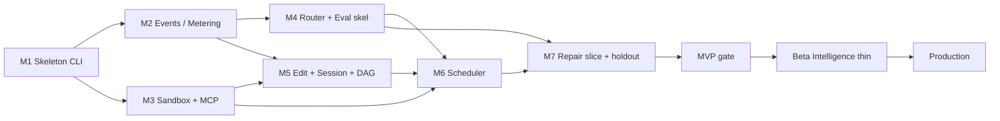
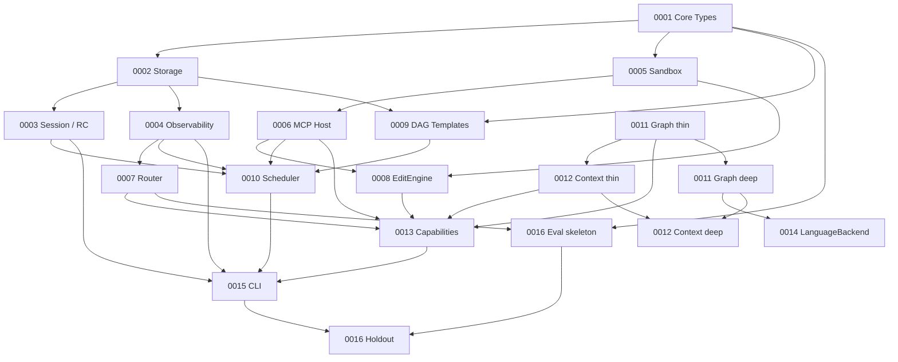

# Alloy Implementation Roadmap

| Field | Value |
| --- | --- |
| **Document** | Canonical implementation roadmap |
| **Product** | Alloy — AI Engineering Runtime |
| **Author** | arkadianet |
| **Date** | 2026-07-25 |
| **Status** | Canonical for sequencing |
| **Architecture (frozen)** | [`docs/architecture/alloy-architecture-v2.md`](../architecture/alloy-architecture-v2.md) |
| **RFC backlog** | [`docs/rfcs/`](../rfcs/) (RFC-0001 … RFC-0016) |
| **MVP posture** | [`docs/architecture/rfc-architect-response.md`](../architecture/rfc-architect-response.md) §6 / §10 |

**Rules:** Do not redesign Architecture V2. RFCs 0001–0016 are the unit of completion. Every milestone ships a **usable** system. Prefer vertical slices; delay complexity until justified. Sandbox before dogfood. Eval week-1 posture. An RFC is not “completed” for milestone accounting until it meets the series **[Definition of Done](../rfcs/README.md#definition-of-done-merge-gate)** (architecture PASS, 100% acceptance criteria, tests, docs, stable public APIs, clippy/fmt clean, no in-scope TODOs/placeholders, code review approved). Do not merge without that checklist.

**V2 MVP posture (binding):** single-binary · ≤5 crates · hardcoded DAG templates · TextPatch EditEngine · thin ProjectGraph · in-process MCP builtins · sandbox-first · eval week 1 · ≤4 LLM capabilities · TOML tier map · `example.env` only (never overwrite `.env`).

---

## 1. How to read this roadmap

| Gate | Meaning |
| --- | --- |
| **M1–M7** | Numbered build milestones; each ends with something a user (or CI) can run |
| **MVP** | External early-adopter bar: V2 control-plane thesis green under sandbox |
| **Beta** | Intelligence-thin deepening (V2 §19.2) justified by MVP holdout learnings |
| **Production** | Operational hardening + optional semantic path (V2 §19.3) when eval warrants |

Sources of truth: **Architecture V2** (what) + **docs/rfcs/** (how/interfaces) + **this roadmap** (when/order). If conflict: V2 wins over RFCs; V2+RFCs win over this doc’s narrative.

---

## 2. Milestone map (summary)

| ID | Theme | RFCs completed | Effort | Cumulative to gate |
| --- | --- | --- | --- | --- |
| **M1** | Alloy Runtime & empty CLI | 0001 | 5–8 pd | 5–8 pd |
| **M2** | Session store & decision log | 0002, 0004 | 6–11 pd | 11–19 pd |
| **M3** | Sandboxed tool bus | 0005, 0006 | 10–16 pd | 21–35 pd |
| **M4** | BYOM router + eval skeleton | 0007; **0016** skeleton | 6–8 pd | 27–43 pd |
| **M5** | Edit path + session/run + DAG templates | 0003, 0008, 0009 | 11–17 pd | 38–60 pd |
| **M6** | Linear scheduler & runtime adapters | 0010 | 5–8 pd | 43–68 pd |
| **M7** | Repair vertical slice + holdout | 0011 **thin**, 0012 **thin**, 0013, 0015; **0016** holdout | 18–29 pd | **61–97 pd → MVP** |
| **MVP** | Gate (not a build slice) | M1–M7 exit | — | **~12–19 pw** |
| **Beta** | Intelligence thin | 0011 **deep**, 0012 **deep**, 0014; Review polish | 9–14 pd | **70–111 pd** |
| **Production** | Hardening (+ optional semantic) | Future extensions only; no new redesign RFCs | 20–40 pd ops | **~90–151 pd** |

**pd** = person-days · **pw** ≈ person-weeks (5 pd). Ranges reconcile RFC effort tables; calendar shortens with parallelization off the critical path (§4).

---

## 3. Milestones (detailed)

### M1 — Alloy Runtime & empty CLI

**Theme:** Runtime host + five-crate skeleton + shared IR; Alloy exists as an installable binary.

**RFCs completed:** [RFC-0001](../rfcs/RFC-0001-alloy-runtime.md)

**User-visible functionality:**
- Run `alloy --help` and `alloy --version`
- Workspace builds (`cargo build -p alloy-cli`)
- `AlloyRuntime` lifecycle stub (configure/start/drain/shutdown) with `NullScheduler`
- `example.env`, `profiles/default.toml`, `router.toml.example` skeletons present

**Acceptance criteria:**
- [ ] Five crates compile: `alloy-cli`, `alloy-runtime`, `alloy-tools`, `alloy-index`, `alloy-eval`
- [ ] Core IDs, budgets, Diagnostic/Failure IR, Grant/PermissionToken shapes match V2
- [ ] `AlloyRuntime` host phases work; `Scheduler` / adapter traits compile with stubs
- [ ] `example.env` present; `.env` untouched
- [ ] Module map mirrors V2 component names
- [ ] CODEOWNERS present before substantive merges (ADR F-18)
- [ ] No behavioral Session/Scheduler/MCP beyond stubs

**Demo scenario:**
```bash
cd alloy && cargo build -p alloy-cli
./target/debug/alloy --version
./target/debug/alloy --help
test -f example.env && test ! -w .env || true   # never create/overwrite .env
```

**NOT in this milestone:** SQLite · sandbox · MCP · router · DAG execution · workers · eval fixtures · ProjectGraph · alloyd · ACP · second language crates

**Risks:** Crate sprawl temptation (reject: stay ≤5); empty stubs mistaken for “done architecture.”

**Estimated effort:** 5–8 person-days

**Exit gate:** Workspace green; `alloy --help` works; Runtime host + core types published → start M2 (and may start M3’s RFC-0005 in parallel after 0001).

---

### M2 — Session store & decision log

**Theme:** Explicit state: if it isn’t logged, it didn’t happen. Metering APIs always on.

**RFCs completed:** [RFC-0002](../rfcs/RFC-0002-storage-artifacts-session-events.md), [RFC-0004](../rfcs/RFC-0004-observability-cost-metering.md)

**User-visible functionality:**
- Create a session record under `.alloy/` (or XDG)
- Append/read session events (Appendix A types)
- Store/fetch artifacts by digest
- Decision records default to metadata + content hashes (no full prompts)

**Acceptance criteria:**
- [ ] Append-only event log with V2 Appendix A types
- [ ] Artifact put/get by digest / `ArtifactId`
- [ ] Default payloads = metadata + hashes; bodies opt-in only
- [ ] Cost metering APIs available to later router/workers
- [ ] Storage roots documented; `.env` never written
- [ ] Integration test: write N events → restart process → read same seq

**Demo scenario:**
```bash
# Library / thin CLI smoke (exact subcommand may be `alloy debug events` until M7)
cargo test -p alloy-runtime -- session_events
# Assert: .alloy/*.sqlite (or XDG path) contains session_created + decision rows with hashes only
```

**NOT in this milestone:** RunController orchestration · scheduler · OTel crate · TUI · Postgres · numeric cost marketing · graph tables beyond FKs/GraphVersion

**Risks:** Logging full prompts by default (forbid); SQLite schema thrash before DAG/graph land (keep schema additive).

**Estimated effort:** 6–11 person-days (0002: 4–7 + 0004: 2–4)

**Exit gate:** Event round-trip + metering APIs green → M4 router unblocked; M5 session service can start after 0002.

---

### M3 — Sandboxed tool bus

**Theme:** First real tooling slice. Every Exec grant goes through SandboxBroker + MCP host. Sandbox-before-dogfood begins here.

**RFCs completed:** [RFC-0005](../rfcs/RFC-0005-sandbox-broker.md), [RFC-0006](../rfcs/RFC-0006-mcp-host-builtins.md)

**User-visible functionality:**
- Call sandboxed `cargo_check` / `cargo_test` / `fs_read` via MCP host (in-process builtins)
- Default profile: no raw bash; network deny; quarantine_deps
- Workspace jail; `.env` / key material denied

**Acceptance criteria:**
- [ ] All Exec paths through `SandboxBroker` (no bare `std::process` in builtins)
- [ ] Landlock (Linux) / Seatbelt (macOS) **or** documented container fallback on all cargo/tool exec
- [ ] Builtins in-process; lazy `tools_for`; no `graph_query` for Alloy workers
- [ ] Residual build.rs / proc-macro risk documented
- [ ] Integration test: `cargo_check` on a toy crate under sandbox returns JSON diagnostics

**Demo scenario:**
```bash
# Toy crate with a deliberate compile error
cargo new /tmp/alloy-toy --lib
# Introduce E0502-class / type error in src/lib.rs
# Via alloy-tools test harness or interim CLI:
cargo test -p alloy-tools -- sandboxed_cargo_check
# Expect: ToolResult with cargo JSON; process ran under sandbox profile
```

**NOT in this milestone:** Community MCP · out-of-process tool fleet · EditEngine transactions · capability workers · Alloy-on-Alloy dogfood · gVisor / multi-tenant

**Risks:** Platform variance (Landlock vs Seatbelt vs container); false sense of safety if build scripts still run inside jail (document residual); skipping sandbox “just for CI” (forbidden).

**Estimated effort:** 10–16 person-days (0005: 5–8 + 0006: 5–8)

**Exit gate:** Sandboxed `cargo_check` proven → M5 EditEngine and M6 VerifyCompile unblocked. Dogfood still banned.

---

### M4 — BYOM router + eval skeleton

**Theme:** Models are plugins. Offline eval exists from week-1 posture—do not wait for full CLI.

**RFCs completed:** [RFC-0007](../rfcs/RFC-0007-model-router-provider.md); [RFC-0016](../rfcs/RFC-0016-eval-harness-holdout-gates.md) **skeleton only** (ScriptedProvider + ≥1 fixture + EvalMetrics surface)

**Partial scope (0016):** Skeleton ~2 pd. Full holdout gate completes in M7 when the stack exists. Explicitly deferred here: end-to-end holdout thresholds against live scheduler/CLI.

**User-visible functionality:**
- Load `router.toml` capability→tier map; one openai-compatible provider via `api_key_env`
- No hardcoded model IDs in core
- Run offline `alloy-eval` (or `cargo test -p alloy-eval`) with `ScriptedProvider` + recorded cargo JSON fixture
- CI runs without `.env` secrets

**Acceptance criteria:**
- [ ] `ModelRouter` + `ModelProvider` traits; TOML tier map works
- [ ] `health()` stub OK; no multi-factor scoring
- [ ] `ScriptedProvider` implements `ModelProvider`
- [ ] ≥1 local-diagnostic fixture + recorded cargo JSON
- [ ] `EvalMetrics` struct available; no cost marketing strings emitted
- [ ] Dogfood ban documented until sandbox + holdout green

**Demo scenario:**
```bash
cp router.toml.example router.toml   # point at unused endpoint or leave unused
cargo test -p alloy-eval -- scripted_provider_fixture
# Expect: ScriptedProvider returns canned completion; EvalMetrics printed; exit 0 offline
```

**NOT in this milestone:** Multi-provider scoring · second provider · live holdout vs naive agent · Premium/Economy marketing numbers · worker prompts

**Risks:** Waiting for “full product” before fixtures (reject—skeleton now); leaking API keys into fixtures (forbid).

**Estimated effort:** 6–8 person-days (0007: 4–6 + 0016 skeleton: ~2)

**Exit gate:** Router traits + ScriptedProvider green → M7 workers/eval unblocked; M5 can proceed in parallel on edit/session/DAG.

---

### M5 — Edit path + session/run + DAG templates

**Theme:** Transactional TextPatch + git checkpoint; session lifecycle; inspectable repair DAG template (not yet full loop).

**RFCs completed:** [RFC-0003](../rfcs/RFC-0003-session-manager-run-controller.md), [RFC-0008](../rfcs/RFC-0008-edit-engine.md), [RFC-0009](../rfcs/RFC-0009-task-dag-templates-planner.md)

**User-visible functionality:**
- Create / resume session; submit goal; budgets attached; approve/cancel APIs present (scheduler stub OK until M6)
- Apply `EditRequest::TextPatch`; git checkpoint; rollback
- Load `repair_local_diagnostic` template (analyze → edit → verify → gate); persist DAG; acyclic validation
- LLM planner stub returns `Err(PlannerDisabled)`

**Acceptance criteria:**
- [ ] `SessionService` + `RunController` match V2 §5.5; session does not exec tools or mutate DAG topology
- [ ] Resume works after process restart
- [ ] TextPatch apply + git checkpoint under sandbox constraints; SemanticOps fail closed (except optional RenameType later)
- [ ] Template planner loads hardcoded repair DAG; single topology writer; no `follow_up_nodes`
- [ ] Hint edges serde-ok, ignored

**Demo scenario:**
```bash
# 1) Session round-trip
cargo test -p alloy-runtime -- session_resume

# 2) Patch + checkpoint on toy crate
cargo test -p alloy-runtime -- editengine_textpatch_git_checkpoint
# Expect: file changed; git ref/checkpoint recorded; rollback restores

# 3) Inspect template DAG
cargo test -p alloy-runtime -- load_repair_local_diagnostic_template
# Expect: 3–5 nodes including VerifyCompile + GateHuman; generation=0
```

**NOT in this milestone:** Scheduler ready-queue · LLM planner · OverlayFS / snapshot bundles · SemanticEditOp lowering · TTY approval UX polish (M7) · parallel Analyze

**Risks:** Dual write paths (raw FS + EditEngine)—forbid raw FS for workers; RunController stub drift until M6 (keep traits stable).

**Estimated effort:** 11–17 person-days (0003: 3–5 + 0008: 4–6 + 0009: 4–6)

**Exit gate:** Patch+checkpoint + template DAG + session resume green → M6 scheduler.

---

### M6 — Linear scheduler & runtime adapters

**Theme:** Compile-gated control flow without claiming LLM intelligence yet. Provenance, retries, gates, budgets—honest `max_parallel=1`.

**RFCs completed:** [RFC-0010](../rfcs/RFC-0010-scheduler-runtime-adapters.md)

**User-visible functionality:**
- Run a loaded DAG linearly: Analyze/Edit nodes may use test doubles; VerifyCompile calls sandboxed `cargo_check`; GateHuman waits for `RunController::approve`
- Retries, timeouts, budget stop; cancel works
- Replan **requests** only—no worker topology mutation
- Decision/node_state events emitted

**Acceptance criteria:**
- [ ] `max_parallel_cargo=1`, `max_parallel_edits=1` enforced
- [ ] VerifyCompile / VerifyTest / GateHuman are runtime adapters—not LLM capabilities
- [ ] Integrates RunController start/cancel/approve
- [ ] Retries + budgets + timeouts enforced
- [ ] Observability events for node transitions
- [ ] Scripted end-to-end: template DAG + doubles → cargo_check → WaitingApproval → approve → Succeeded

**Demo scenario:**
```bash
cargo test -p alloy-runtime -- scheduler_scripted_repair_dag
# Script: load repair_local_diagnostic → inject noop Analyze/Edit doubles →
#         VerifyCompile on fixture crate → GateHuman → approve → DagOutcome::Succeeded
# Inspect: alloy events show node_state + tool_call for cargo_check (sandboxed)
```

**NOT in this milestone:** File leases · priority function · distributed workers · Temporal durability · LLM Repair/Edit quality · Parallel Analyze marketing

**Risks:** Fake parallelism docs; VerifyCompile modeled as Capability (forbidden); stuck WaitingApproval without timeout (must have).

**Estimated effort:** 5–8 person-days

**Exit gate:** Scripted compile-gated DAG green under sandbox → M7 workers + CLI + holdout.

---

### M7 — Repair vertical slice + holdout gate

**Theme:** First product thesis slice: engineer runs Alloy on a toy crate, gets a compile-verified TextPatch under sandbox with inspectable DAG + decision log + BYOM.

**RFCs completed:**
- [RFC-0011](../rfcs/RFC-0011-project-graph.md) **thin** (trait + stubs / minimal metadata; Callers/SimilarFixes empty)
- [RFC-0012](../rfcs/RFC-0012-context-engine.md) **thin** (three live domains; WorkingSet may have empty graph projection)
- [RFC-0013](../rfcs/RFC-0013-capability-registry-workers.md) (Repair, Edit, optional Review, template Planning)
- [RFC-0015](../rfcs/RFC-0015-cli-profiles-config.md)
- [RFC-0016](../rfcs/RFC-0016-eval-harness-holdout-gates.md) **holdout complete** (remainder after M4 skeleton)

**Partial scope (0011 / 0012):** Thin MVP sufficient for PromptPack + Repair. Syn-deep index, LanguageBackend, and rich WorkingSet projections are **Beta** (explicit). Do not block M7 on graph depth.

**User-visible functionality:**
- `alloy run "fix <local diagnostic> in crate X"` (or equivalent clap surface)
- `alloy events` / `approve` / `cancel` / `resume`
- Repair → Edit → TextPatch → sandboxed check → GateHuman → decision log
- Holdout local-diagnostic (E0502-class) gate runnable offline with ScriptedProvider and with live provider when configured
- Profiles: default | autonomous | readonly; Appendix B defaults

**Acceptance criteria:**
- [ ] ≤4 LLM capabilities; Verify* not among them; no `follow_up_nodes` / worker graph mutations
- [ ] Exactly three live context domains; no embedding index
- [ ] Thin ProjectGraph: in-process read-only; ingest-only writes; no worker `graph_query` MCP
- [ ] CLI owns I/O only—no planner/scheduler business logic in `alloy-cli`
- [ ] Holdout local-diagnostic compile-success gate defined and CI-runnable offline
- [ ] Quarantine profile proven on the repair path
- [ ] `.env` never replaced; `example.env` documented
- [ ] **No Alloy-on-Alloy dogfood** until this gate is green

**Demo scenario:**
```bash
# Toy crate with E0502-class / import / type error fixable by text patch
cargo new /tmp/alloy-e0502 --lib
# (seed known-broken lib.rs from fixtures/)

export ALLOY_API_KEY=...   # or use ScriptedProvider profile for offline
alloy run --workspace /tmp/alloy-e0502 "fix the compile error in this crate"
# Approve GateHuman when prompted
alloy events --session <id>
# Expect: compile-clean crate; DAG + decision log inspectable; tools sandboxed

cargo test -p alloy-eval -- holdout_local_diagnostic
# Expect: pass/fail against holdout; EvalMetrics; no marketing cost claims
```

**NOT in this milestone:** Graph callers/lifetimes · SimilarFixes auto-retrieve · LLM planner · SemanticOps · Review-as-required · External Memory · alloyd · ACP · community MCP · numeric token-savings claims · dogfood

**Risks:** Scope creep into “full graph” before loop works; overfitting holdout (keep mixed fixtures); treating ScriptedProvider success as live-provider proof (report both).

**Estimated effort:** 18–29 person-days  
(0011 thin ~2–4 + 0012 thin ~2–3 + 0013: 6–10 + 0015: 4–6 + 0016 remainder ~3–6)

**Exit gate:** Holdout green **and** sandboxed CLI repair demo works → **MVP** gate. Only then may dogfood be considered.

---

### MVP — External early-adopter gate

**Theme:** V2 MVP thesis bar (Architecture §0.9 / §19.1). Not a new RFC wave—certification of M1–M7.

**Thesis:** Sandboxed `tool → model → patch → check → log` on a hardcoded DAG beats a naive baseline on holdout **local diagnostics**, with inspectable DAG + decision log + BYOM—**without** token-savings marketing.

**RFCs required complete (or scoped thin as above):** 0001–0010, 0013, 0015; 0011/0012 thin; 0016 full holdout. **0014 not required for MVP.**

**User-visible functionality:**
- Early adopters can BYOM via `router.toml` + `example.env` keys
- Run local-diagnostic repair on small Rust crates under sandbox
- Inspect events/decisions; approve gates; resume sessions
- Offline eval CI for the holdout set

**Acceptance criteria:**
- [ ] All M7 acceptance criteria green
- [ ] Single binary; ≤5 crates
- [ ] Sandbox on all Exec; quarantine defaults
- [ ] Holdout local-diagnostic compile success vs naive baseline documented (pass or honest fail of control plane)
- [ ] No numeric cost differentiators in product claims
- [ ] README / example.env sufficient for external early adopter without architect consult
- [ ] Dogfood policy: allowed only after this gate

**Demo scenario:** Same as M7 demo, run by someone outside the core team using only docs + `example.env`.

**NOT in MVP:** LLM Planner default · typed call/lifetime graph · SemanticEditOp product path · multi-impl scoring · OverlayFS · alloyd · ACP · Postgres · OTel crate · language plugins beyond Rust · community MCP fleet · lifetime-repair as P0 claim

**Risks:** Shipping before holdout (theater); declaring MVP on ScriptedProvider-only success without live BYOM smoke.

**Estimated effort:** Included in M1–M7 (**59–94 person-days** / **~12–19 person-weeks** with Wave parallelization calendar ~8–12 weeks per V2 §19.1).

**Exit gate:** MVP checklist signed → Beta may deepen graph/context; Production planning may start for ops tracks.

---

### Beta — Intelligence thin

**Theme:** V2 §19.2 thesis: graph projections + Repair/Edit/Review improve holdout success/cost **or** clearly measure why not. Still linear cargo/edits; still git checkpoints; still no redesign.

**RFCs completed:**
- [RFC-0011](../rfcs/RFC-0011-project-graph.md) **deep** (cargo metadata + syn symbols + diagnostics/fix ingest; RA passthrough as available)
- [RFC-0012](../rfcs/RFC-0012-context-engine.md) **deep** (WorkingSet graph projections; weight hygiene)
- [RFC-0014](../rfcs/RFC-0014-language-backend-rust.md) (Rust-only internal module)
- Review worker polish (already in 0013 optional—quality bar, not new RFC)

**User-visible functionality:**
- Richer symbol/diagnostic context in repair prompts (bounded WorkingSet)
- `LanguageBackend` Rust detect/index/diagnostics wired
- Optional Review findings on diffs
- Updated holdout metrics: success, compile, cost, retries—**measure**, don’t market

**Acceptance criteria:**
- [ ] ProjectGraph thin→deep without changing trait; stubs still empty for Callers/SimilarFixes auto-retrieve
- [ ] Context WorkingSet includes graph projections; still exactly three live domains
- [ ] LanguageBackend Rust-only; no PY/TS/cdylib
- [ ] Holdout re-run shows improvement **or** written “why not” with metrics
- [ ] Still `max_parallel=1`; still git-only checkpoints
- [ ] No External Memory auto-retrieve; no typed call/lifetime layers

**Demo scenario:**
```bash
alloy run --workspace ./fixtures/holdout_crate_02 "fix diagnostics"
alloy events --session <id>   # WorkingSet citations reference graph symbols
cargo test -p alloy-eval -- holdout_beta_compare_mvp
# Expect: EvalMetrics delta table; no savings % in user-facing copy
```

**NOT in Beta:** LLM Planner as default · SemanticOps product · parallel Analyze without uplift proof · alloyd · ACP · multi-provider scoring · second language

**Risks:** Graph incorrect edges poisoning context (keep confidence reserved; rebuild path); scope into compiler-frontend (reject).

**Estimated effort:** 9–14 person-days (0011 remainder ~4–6 + 0012 remainder ~2–3 + 0014: 3–5)

**Cumulative to Beta:** **~68–108 person-days** (matches full RFC rollup)

**Exit gate:** Beta thesis measured → Production may take semantic/ops tracks only if justified.

---

### Production — Hardening (+ optional semantic path)

**Theme:** Operational maturity for real users. Optional V2 §19.3 semantic items **only** when Beta eval justifies—still single DAG writer; still no architecture redesign. Prefer Future extensions already listed on RFCs over inventing new RFCs.

**RFCs / work:**
- No mandatory new RFCs. Optional pulls from existing **Future extensions**:
  - RFC-0008 / 0014: ≥1 RA-backed `SemanticEditOp` (e.g. RenameType)
  - RFC-0009: LLM Planner behind eval bar
  - RFC-0010: parallel Analyze **only** if uplift measured
- Ops/security track (not architecture): release trains, SBOM, signed configs, allowlist maturity before any community MCP, performance budgets, crash/resume soak, docs, support playbooks

**User-visible functionality:**
- Stable release channel; clear support/security contact
- Approval/quarantine maturity for dependency + unsafe gates
- Optional: one semantic edit op and/or gated LLM planner if holdout proves need
- Cost numbers published **only** from calibrated eval (still no fake differentiators)

**Acceptance criteria:**
- [ ] Stability bar: soak tests on session resume, cancel, budget stop; no data loss on crash mid-run
- [ ] Security bar: sandbox + quarantine defaults unchanged; community MCP still blocked until allowlists enforced
- [ ] If SemanticOps enabled: fail-closed for unsupported ops; git checkpoint still sole MVP→Production checkpoint unless OverlayFS re-justified separately
- [ ] If LLM Planner enabled: single topology writer; generation++ provenance; PlannerDisabled path remains
- [ ] Holdout expanded beyond P0 local-diagnostic but lifetime-heavy still not required as P0
- [ ] Operational runbooks + versioning policy published

**Demo scenario:**
```bash
# Release candidate
alloy --version   # semver release
alloy run --workspace ./real_small_workspace "fix E0xxx in crate foo"
# Soak: interrupt mid-run (SIGINT), alloy resume --session <id>
cargo test -p alloy-eval -- production_gates
```

**NOT in Production (still deferred):** alloyd as required topology · ACP · OverlayFS product · External Memory auto-retrieve · Postgres · multi-tenant gVisor · language plugins · Benchmarking/UnsafeAudit/… worker catalog · deleting load-bearing traits

**Risks:** Premature semantic lowering; reintroducing dual DAG writers; marketing cost % before calibration; dogfood pressure skipping quarantine.

**Estimated effort:** 20–40 person-days ops (+ optional semantic 4–10 pd if gated on)

**Cumulative to Production:** **~88–148 person-days** depending on semantic opt-in

**Exit gate:** Production checklist + calibrated claims only. Further evolution follows V2 §0.6 long-term list under change control—not a silent redesign.

---

## 4. Critical path

### Prose (one sentence)

**Solo-critical path to MVP:** RFC-0001 → (0002 ∥ 0005) → (0003 ∥ 0004 ∥ 0006 ∥ 0009) → (0007 ∥ 0008) → 0010 → (0011thin ∥ 0012thin) → 0013 → 0015, with **0016 skeleton** as soon as 0007 exists and **0016 holdout** at M7—sandbox before dogfood the whole way.

### Milestone critical path

```text
M1 → M2 → M3 → M4 → M5 → M6 → M7 → MVP → Beta → Production
         ↑         ↑
         └─ 0005 can start after M1 in parallel with M2
```

M3 (sandbox+MCP) and M4 (router+eval skeleton) are both on the path to M7; M5 needs M2+M3; M6 needs M5+M3+M4 pieces; M7 needs everything.

### Mermaid — milestones



### Mermaid — RFC dependencies (critical edges)



---

## 5. Parallelizable work (off the critical path)

| When | Parallel tracks | Notes |
| --- | --- | --- |
| After M1 | **0005** sandbox vs **0002** storage | Both only need 0001 |
| After M2 start | **0004** observability vs continuing **0002** | Shared EventStore |
| After M2+M3 foundations | **0003** session, **0009** DAG, **0006** MCP | Wave B style |
| After 0004 | **0007** router ∥ **0008** EditEngine (needs 0005/0006) | M4 ∥ M5 edit half |
| After 0001+0007 | **0016 skeleton** fixtures | Do not wait for CLI |
| After M6 | **0011 thin** ∥ **0012 thin** before wiring 0013 | Keep thin; don’t gold-plate |
| After MVP | **0014** LanguageBackend ∥ **0011 deep** | Beta track |
| Anytime (docs/ops) | example.env docs, fixture license audit (R17), CODEOWNERS hygiene | Never block sandbox |

**Do not parallelize into speculative infra:** alloyd, ACP, OverlayFS, community MCP, Postgres, OTel crate, second language, External Memory embeddings.

---

## 6. RFC → first completing milestone

| RFC | Title | First milestone that completes it |
| --- | --- | --- |
| 0001 | Alloy Runtime | **M1** |
| 0002 | Storage, Artifacts & Session Event Log | **M2** |
| 0003 | Session Manager & RunController | **M5** |
| 0004 | Observability & Cost Metering | **M2** |
| 0005 | Sandbox Broker | **M3** |
| 0006 | MCP Host & In-Process Builtins | **M3** |
| 0007 | Model Router & Provider | **M4** |
| 0008 | EditEngine (TextPatch + Git Checkpoint) | **M5** |
| 0009 | Task DAG, Templates & Planner | **M5** |
| 0010 | Scheduler & Runtime Adapters | **M6** |
| 0011 | ProjectGraph | **M7** thin · **Beta** deep |
| 0012 | Context Engine | **M7** thin · **Beta** deep |
| 0013 | Capability Registry & MVP Workers | **M7** |
| 0014 | LanguageBackend (Rust Module) | **Beta** |
| 0015 | CLI, Profiles & Config | **M7** |
| 0016 | Eval Harness & Holdout Gates | **M4** skeleton · **M7** holdout |

---

## 7. Cumulative effort

| Gate | Person-days | Person-weeks (approx.) | Calendar (solo, with parallelization) |
| --- | --- | --- | --- |
| End M3 (sandboxed tools) | 19–32 pd | 4–6.5 pw | ~3–5 weeks |
| End M6 (scripted DAG) | 41–65 pd | 8–13 pw | ~6–10 weeks |
| **MVP** (M7 exit) | **59–94 pd** | **~12–19 pw** | **~8–12 weeks** (aligns V2 §19.1) |
| **Beta** | **68–108 pd** | **~14–22 pw** | +2–3 weeks after MVP |
| **Production** | **~88–148 pd** | **~18–30 pw** | +4–8 weeks ops after Beta |

RFC index rollup (67–108 pd) matches **through Beta** when 0011/0012 deep + 0014 are included. Production adds ops/hardening outside the RFC person-day sum.

Critical path alone (no parallel): ~45–70 pd of RFC work to MVP slice; with Wave A–C switching, calendar matches V2’s 6–8 week control-plane milestone.

---

## 8. Global “NOT until justified” kill list

Do **not** schedule these before the named gate (Architecture V2 §0.7 / §19.5 / ADR):

| Item | Earliest gate |
| --- | --- |
| Alloy-on-Alloy dogfood | After **MVP** holdout + sandbox green |
| 18-crate week-1 scaffold | **Never** (eliminated) |
| alloyd / ACP | Post-Production research unless single-binary p95 fails |
| OverlayFS / snapshot bundles | Post-MVP only if git checkpoints fail measured need |
| Community / custom MCP fleet | After allowlists + broker maturity (Production+) |
| LLM Planner as default | **Production** optional, eval-gated |
| Typed call/lifetime graph layers | After Beta measurement |
| SemanticEditOp product path | **Production** optional (≥1 op) |
| Multi-impl capability scoring | After holdout plateau |
| External Memory auto-retrieve | Deferred; curated fixtures first |
| Postgres / OTel-as-crate / TUI | Deferred |
| Language plugins beyond Rust | ≥6 months Rust dogfood |
| Numeric cost marketing | After Eval calibration only |
| Parallel Analyze / file leases / Hint semantics | Only if eval shows uplift |
| Worker `follow_up_nodes` / dual graph MCP | **Never** (eliminated) |

---

## 9. Coverage vs V2 MVP components

| V2 MVP component | Owning RFC(s) | Roadmap home |
| --- | --- | --- |
| CLI | 0015 | M7 |
| Session Manager | 0003 (+0002) | M5 (+M2) |
| RunController | 0003 | M5 |
| Task DAG + Scheduler | 0009, 0010 | M5, M6 |
| Planner (template) | 0009 | M5 |
| Capability Registry / Workers | 0013 | M7 |
| Model Router | 0007 | M4 |
| Context Engine | 0012 | M7 thin / Beta deep |
| ProjectGraph | 0011 | M7 thin / Beta deep |
| EditEngine | 0008 | M5 |
| MCP Host | 0006 | M3 |
| Sandbox Broker | 0005 | M3 |
| Observability | 0004 | M2 |
| Eval | 0016 | M4 skeleton / M7 holdout |
| LanguageBackend (Rust) | 0014 | Beta |
| Artifact Store | 0002 | M2 |
| Shared IR / profiles types | 0001 (+0015) | M1 / M7 |

---

## 10. Change control

1. Architecture V2 is **frozen**—roadmap sequences implementation; it does not redesign subsystems.
2. Prefer completing existing RFCs over writing new ones. Tiny packaging notes only if a milestone truly needs them (prefer not).
3. Milestone exit gates are binary; do not start the next critical-path milestone with a red gate except documented risk acceptance by arkadianet.
4. Product name in all user-facing copy: **Alloy**, **AI Engineering Runtime**—not “harness.”

— arkadianet
